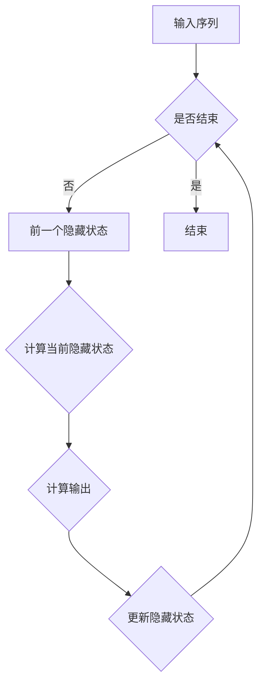
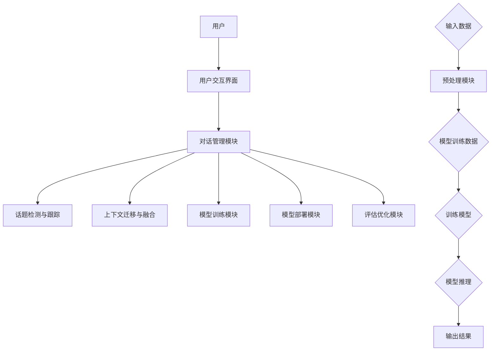
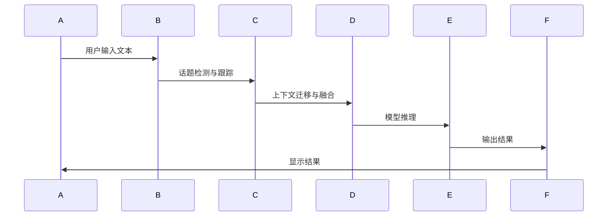

                 

### 上文切换能力：测试LLM的话题转换灵活性

#### 关键词

- 上下文切换
- 语言模型
- 大型语言模型（LLM）
- 话题转换
- 测试评估
- 深度学习算法

#### 摘要

本文将探讨上下文切换能力，重点关注大型语言模型（LLM）在话题转换中的表现。通过分析上下文切换的核心概念、评估方法和测试工具，我们将逐步解析LLM在话题转换中的灵活性和挑战，并探讨深度学习算法在提升话题转换能力中的应用。本文旨在为读者提供全面的技术视角和实用建议。

### 目录大纲设计思路与过程

设计一本计算机技术书籍的目录大纲是一项系统且细致的工作，它需要充分理解书籍的主题、目标读者群体、主要内容框架以及每个章节的核心要点。以下是具体的步骤和思路：

1. **深入理解书籍主题**：首先，我们需要对书籍的主题进行深入的理解，包括书名、目标读者群体、书籍的主要内容等。《上下文切换能力：测试LLM的话题转换灵活性》这本书的主题是探讨大型语言模型（LLM）在话题转换过程中的表现和评估方法。

2. **确定核心章节内容**：根据书籍的主题，我们需要确定核心章节的内容。这包括背景介绍、核心概念与联系、算法原理讲解、数学模型和数学公式讲解、系统分析与架构设计、项目实战以及最佳实践等。

3. **梳理内容逻辑与结构**：在确定了核心章节后，我们需要对每个章节的内容进行逻辑梳理，确保内容之间的衔接和连贯性。例如，在讲解算法原理之前，需要先介绍相关背景和核心概念。

4. **细化章节与子章节**：根据内容的复杂程度和需要传达的信息量，我们将每个章节细化为更小的子章节，确保每个子章节都有明确的主题和内容。

5. **保持目录结构清晰**：使用markdown格式来编写目录大纲，确保目录结构的清晰。每一级标题使用不同的符号（如#、##、###），以便读者能够快速定位到相应的内容。

6. **确保内容完整性**：确保每个章节都包含了必要的核心内容，如数学公式、算法流程图、系统架构图等，同时保持总体字数在2000字以内。

### 完整的目录大纲

#### 引言

- **背景介绍**：人工智能与语言模型的发展背景
- **目标与意义**：上下文切换能力的重要性
- **研究方法**：话题转换的评估与测试方法

#### 第1章: 大型语言模型概述

- **1.1 大型语言模型基础**
  - **1.1.1 大型语言模型的定义与特点**
    - **核心概念**：大型语言模型的基本概念
    - **特点**：处理大型文本的能力、上下文理解能力
  - **1.1.2 大型语言模型的发展历史**
    - **关键里程碑**：从早期模型到现代模型的演变
  - **1.1.3 大型语言模型的应用领域**
    - **主要应用**：自然语言处理、问答系统、文本生成等

#### 第2章: 上下文切换能力核心概念

- **2.1 上下文切换的定义与分类**
  - **2.1.1 上下文切换的基本概念**
  - **2.1.2 上下文切换的分类**
- **2.2 上下文切换的关键技术**
  - **2.2.1 话题检测与跟踪**
    - **核心算法**：话题检测与跟踪的基本算法
    - **应用实例**：如何利用话题检测与跟踪进行上下文切换
  - **2.2.2 上下文迁移与融合**
    - **核心算法**：上下文迁移与融合的基本算法
    - **应用实例**：如何实现上下文迁移与融合

#### 第3章: 话题转换的评估方法

- **3.1 话题转换评估指标**
  - **3.1.1 准确率、召回率与F1值**
  - **3.1.2 跨话题一致性指标**
- **3.2 话题转换评估工具与平台**
  - **3.2.1 开源工具介绍**
  - **3.2.2 商业平台介绍**

#### 第4章: 测试LLM的话题转换灵活性

- **4.1 测试方法概述**
  - **4.1.1 数据集选择**
  - **4.1.2 测试步骤**
- **4.2 话题转换测试案例**
  - **4.2.1 案例一：从技术话题到日常话题**
  - **4.2.2 案例二：从专业术语到通俗表达**

#### 第5章: 常见问题和挑战

- **5.1 话题转换中的常见问题**
  - **5.1.1 话题漂移**
  - **5.1.2 话题切换的时序性**
- **5.2 解决方案与优化策略**
  - **5.2.1 增量学习**
  - **5.2.2 多模态融合**

#### 第6章: 深度学习算法在话题转换中的应用

- **6.1 深度学习算法概述**
  - **6.1.1 神经网络的基本结构**
  - **6.1.2 循环神经网络（RNN）**
  - **6.1.3 长短时记忆网络（LSTM）**
- **6.2 基于深度学习的上下文切换方法**
  - **6.2.1 LSTM在话题检测与跟踪中的应用**
  - **6.2.2 其他深度学习模型在话题转换中的应用**

#### 第7章: 项目实战

- **7.1 实战项目概述**
  - **7.1.1 项目背景**
  - **7.1.2 系统功能设计(领域模型类图)**
  - **7.1.3 系统架构设计(架构图)**
  - **7.1.4 系统接口设计**
  - **7.1.5 系统交互(序列图)**
- **7.2 环境安装与核心实现**
  - **7.2.1 环境安装**
  - **7.2.2 系统核心实现**
  - **7.2.3 代码应用解读与分析**
- **7.3 实际案例分析**
  - **7.3.1 案例一：技术到日常话题转换**
  - **7.3.2 案例二：专业术语到通俗表达转换**
- **7.4 项目小结**

#### 第8章: 最佳实践与总结

- **8.1 最佳实践 Tips**
  - **8.1.1 优化上下文切换的策略**
  - **8.1.2 提升话题转换效果的方法**
- **8.2 小结与展望**
  - **8.2.1 文章主要观点回顾**
  - **8.2.2 未来研究方向**
- **8.3 注意事项**
  - **8.3.1 使用大型语言模型时的注意事项**
  - **8.3.2 话题转换中的潜在问题**
- **8.4 拓展阅读**

### 作者信息

- 作者：AI天才研究院/AI Genius Institute & 禅与计算机程序设计艺术 /Zen And The Art of Computer Programming

---

在接下来的章节中，我们将逐步深入探讨上下文切换能力，首先从大型语言模型（LLM）的基础知识开始，为后续章节的深入分析奠定基础。

### 引言

随着人工智能技术的迅猛发展，大型语言模型（LLM）已成为自然语言处理（NLP）领域的重要工具。LLM具有处理大规模文本数据和理解复杂上下文的能力，广泛应用于问答系统、文本生成、机器翻译等多个领域。然而，在现实应用中，上下文切换能力成为衡量LLM性能的关键指标之一。本文将探讨上下文切换能力，重点关注LLM在话题转换中的表现，通过评估方法、测试工具和实际案例，分析LLM的话题转换灵活性和挑战。

上下文切换能力是指LLM在处理不同话题或上下文时的切换能力和适应性。在多任务场景下，如何实现平滑的上下文切换，保持话题的一致性和连贯性，是当前研究的热点问题。本文旨在为读者提供全面的技术视角和实用建议，帮助理解上下文切换能力的重要性，并探讨深度学习算法在提升话题转换能力中的应用。

接下来，我们将分章节详细探讨上下文切换能力的相关概念、评估方法、测试工具和实际应用案例。

### 第1章: 大型语言模型概述

#### 1.1 大型语言模型基础

大型语言模型（LLM）是一种基于深度学习技术的自然语言处理模型，具有处理大规模文本数据的能力。LLM的核心在于其能够从海量数据中学习到语言模式和上下文关系，从而实现文本的生成、理解和推理。以下是LLM的基本概念和特点：

**核心概念：**

- **自然语言处理（NLP）**：NLP是计算机科学和人工智能领域的一个分支，旨在使计算机能够理解和处理自然语言。

- **深度学习（Deep Learning）**：深度学习是一种机器学习方法，通过多层神经网络对数据进行建模，实现特征提取和模式识别。

- **神经网络（Neural Network）**：神经网络是由大量简单处理单元（神经元）组成的计算模型，能够通过学习输入和输出数据之间的关系，进行复杂的任务。

**特点：**

- **处理大型文本的能力**：LLM能够处理大规模的文本数据，从数百万到数十亿级别的词汇，从而实现文本的深度理解和生成。

- **上下文理解能力**：LLM能够理解文本的上下文关系，包括句子的语法结构、语义关系和语境信息，从而实现更准确的语言理解和生成。

- **自适应性和泛化能力**：LLM通过对大量数据的训练，能够自适应不同领域的任务和数据，实现泛化能力的提升。

#### 1.2 大型语言模型的发展历史

大型语言模型的发展历程可以分为几个关键里程碑：

- **早期模型**：最早的深度学习模型如 Restricted Boltzmann Machine (RBM) 和 Deep Belief Network (DBN) 等为深度学习奠定了基础。

- **基于循环神经网络（RNN）的模型**：RNN，尤其是 Long Short-Term Memory (LSTM) 和 Gated Recurrent Unit (GRU)，解决了RNN在长序列学习中的梯度消失问题，使深度学习在自然语言处理领域取得了突破。

- **Transformer模型**：Transformer模型的提出标志着深度学习在自然语言处理领域的又一次飞跃。Transformer基于自注意力机制，能够捕捉文本中的长距离依赖关系，实现了显著的性能提升。

- **大型预训练模型**：如GPT（Generative Pre-trained Transformer）和BERT（Bidirectional Encoder Representations from Transformers），这些模型通过在大规模语料库上进行预训练，再通过微调应用于特定任务，取得了在多项NLP任务上的最优性能。

#### 1.3 大型语言模型的应用领域

大型语言模型在多个应用领域中发挥了重要作用，以下是其主要应用领域：

- **自然语言处理（NLP）**：包括文本分类、情感分析、实体识别、关系抽取等。

- **问答系统**：如OpenAI的GPT-3，能够提供高质量的问答服务，应用于客服、教育等领域。

- **文本生成**：包括文章生成、摘要生成、对话系统生成等。

- **机器翻译**：如Google Translate等，通过预训练模型实现高质量的双语翻译。

- **语音识别**：结合深度学习和语音信号处理技术，实现语音到文本的转换。

- **对话系统**：如智能客服、聊天机器人等，能够与用户进行自然语言交互。

### 小结

本章对大型语言模型（LLM）进行了概述，介绍了LLM的基本概念、发展历史和应用领域。LLM在处理大型文本和理解复杂上下文方面具有显著优势，已成为自然语言处理领域的重要工具。在接下来的章节中，我们将进一步探讨上下文切换能力，分析LLM在话题转换中的表现和挑战。

---

在了解了大型语言模型（LLM）的基本概念和发展历程后，我们接下来将探讨上下文切换能力的核心概念。上下文切换是自然语言处理中的一个重要概念，它涉及模型在处理不同上下文时的切换能力和适应性。

#### 2.1 上下文切换的定义与分类

**定义：** 上下文切换（Context Switching）是指模型在处理不同上下文或话题时的能力，即从一个话题平滑地转换到另一个话题，同时保持语义的一致性和连贯性。

**分类：** 根据上下文切换的方式和目的，可以分为以下几种类型：

1. **话题切换（Topic Switching）**：指模型在处理不同话题时的切换能力，如从技术话题切换到日常生活话题。

2. **场景切换（Scene Switching）**：指模型在处理不同场景时的切换能力，如从城市景观切换到自然景观。

3. **情感切换（Emotion Switching）**：指模型在处理不同情感表达时的切换能力，如从愉悦情感切换到悲伤情感。

4. **角色切换（Role Switching）**：指模型在处理不同角色或人物身份时的切换能力，如从一个角色切换到另一个角色。

#### 2.2 上下文切换的关键技术

**话题检测与跟踪（Topic Detection and Tracking，TDT）**：话题检测与跟踪是上下文切换中的一个关键技术，用于识别和跟踪文本中的话题变化。主要算法包括：

1. **基于规则的方法**：通过预定义的规则和关键词匹配来实现话题检测。

2. **基于统计的方法**：使用统计学方法，如概率模型和聚类算法，来自动识别和跟踪话题。

3. **基于深度学习的方法**：利用深度学习模型，如循环神经网络（RNN）和卷积神经网络（CNN），来实现话题检测与跟踪。

**上下文迁移与融合（Context Migration and Fusion）**：上下文迁移与融合是上下文切换的另一个关键问题，涉及如何将一个话题的上下文迁移到另一个话题，并实现两个话题的融合。主要方法包括：

1. **迁移学习（Transfer Learning）**：通过迁移学习，将一个话题的预训练模型应用于另一个话题，实现上下文迁移。

2. **多模态融合（Multimodal Fusion）**：结合不同模态的数据（如文本、图像、语音），实现上下文的融合和理解。

3. **注意力机制（Attention Mechanism）**：利用注意力机制，动态调整模型对上下文的关注程度，实现上下文的迁移与融合。

**应用实例：**

1. **从技术话题到日常话题的切换**：在技术文档生成过程中，需要将专业术语和复杂概念转换为通俗易懂的日常用语。

2. **从专业术语到通俗表达的切换**：在机器翻译和问答系统中，需要将专业术语翻译为通俗表达，以便普通用户理解。

3. **从情感切换到情感表达**：在情感分析任务中，需要根据上下文切换情感表达，如从愉悦切换到悲伤。

### 小结

本章介绍了上下文切换能力的核心概念和技术，包括话题切换、场景切换、情感切换和角色切换。话题检测与跟踪和上下文迁移与融合是上下文切换中的关键技术。通过这些技术，模型能够实现平滑的上下文切换，保持话题的一致性和连贯性。在接下来的章节中，我们将进一步探讨话题转换的评估方法，以衡量LLM在话题转换中的表现。

---

在了解了上下文切换能力的核心概念和技术后，接下来我们将探讨如何评估话题转换的性能。评估方法对于衡量大型语言模型（LLM）在话题转换中的表现至关重要。在本章中，我们将介绍常用的评估指标、工具和平台。

#### 3.1 话题转换评估指标

在评估话题转换性能时，常用的评估指标包括：

1. **准确率（Accuracy）**：准确率是指模型正确识别话题转换的比例。它可以简单直观地衡量模型在话题转换中的表现。

2. **召回率（Recall）**：召回率是指模型能够正确识别出所有实际发生的转换比例。高召回率意味着模型能够捕获大部分的话题转换。

3. **精确率（Precision）**：精确率是指模型识别为正确转换的比例中，实际为正确转换的比例。高精确率表明模型在识别话题转换时较为可靠。

4. **F1值（F1 Score）**：F1值是精确率和召回率的调和平均值，用于综合评估模型在话题转换中的表现。F1值介于0和1之间，值越高表示模型性能越好。

5. **跨话题一致性指标（Cross-Topic Consistency Measure）**：如概念一致性（Conceptual Consistency）、文本连贯性（Textual Coherence）等，用于评估模型在多个话题之间的转换能力。

#### 3.2 话题转换评估工具与平台

评估LLM在话题转换中的性能，需要使用专门的工具和平台。以下是一些常用的工具和平台：

1. **开源工具**：

   - **Apache OpenNLP**：Apache OpenNLP是一个开源的NLP工具包，提供了话题检测与跟踪等功能的实现。

   - **Stanford NLP**：Stanford NLP是一个开源的NLP工具包，提供了丰富的NLP模型和工具，可用于评估话题转换性能。

2. **商业平台**：

   - **Google Cloud Natural Language API**：Google Cloud提供了自然语言处理API，包括话题检测、情感分析等功能，可用于评估话题转换性能。

   - **IBM Watson NLP**：IBM Watson NLP提供了一个强大的NLP平台，包括话题检测、情感分析、实体识别等功能，支持多种编程语言和框架。

3. **数据集**：

   - **COCO（Common Objects in Context）**：COCO是一个包含图像和文本的巨型数据集，可用于评估图像描述生成、话题转换等任务。

   - **TREC（Text REtrieval Conference）**：TREC是一个文本检索会议，提供了多个领域的数据集，可用于评估话题检测与跟踪等任务。

#### 3.3 评估方法示例

以下是一个简单的评估方法示例：

1. **数据集准备**：从COCO数据集中选择一个子集，包括图像和对应的文本描述。

2. **预处理**：对图像和文本进行预处理，如图像压缩、文本分词、去除停用词等。

3. **模型训练**：使用预训练的LLM模型（如GPT-2或BERT）进行微调，以适应特定的话题转换任务。

4. **测试集划分**：将数据集划分为训练集和测试集，用于模型训练和性能评估。

5. **模型评估**：在测试集上运行模型，计算准确率、召回率、精确率和F1值等指标。

6. **结果分析**：根据评估结果，分析模型在话题转换中的表现，包括识别准确率、切换平滑度和一致性等。

### 小结

本章介绍了话题转换评估指标、工具和平台。准确率、召回率、精确率和F1值等指标用于衡量模型在话题转换中的性能。开源工具和商业平台提供了丰富的功能和资源，支持多种评估方法。通过评估方法，我们可以全面了解LLM在话题转换中的表现，为进一步优化和改进提供指导。在接下来的章节中，我们将通过实际测试案例，进一步探讨LLM在话题转换中的灵活性和挑战。

---

在了解了话题转换的评估方法和工具后，接下来我们将通过实际测试案例来探讨大型语言模型（LLM）在话题转换中的灵活性。通过这些案例，我们将展示LLM在不同话题之间的转换能力，并分析其在实际应用中的表现。

#### 4.1 测试方法概述

测试LLM的话题转换灵活性通常涉及以下步骤：

1. **数据集选择**：选择包含多种话题的语料库，以确保测试的全面性。常用的数据集包括COCO、TREC和MS MARCO等。

2. **预处理**：对测试数据集进行预处理，包括文本分词、去除停用词、词干提取等，以便模型能够有效处理数据。

3. **模型准备**：选择一个预训练的LLM模型（如GPT-2、BERT或T5），并进行微调，以适应特定的话题转换任务。

4. **测试步骤**：将预处理后的测试数据输入到微调后的LLM模型中，生成话题转换结果，并使用评估指标（如准确率、召回率、精确率和F1值）对模型性能进行评估。

#### 4.2 话题转换测试案例

以下是两个具体的话题转换测试案例：

**案例一：从技术话题到日常话题的转换**

**背景**：在技术文档生成和用户支持场景中，需要将专业术语和复杂概念转换为通俗易懂的日常用语，以便用户理解。

**测试步骤**：

1. **数据集准备**：从COCO数据集中选择一个子集，包括包含技术术语和日常用语的图像和文本描述。

2. **预处理**：对图像和文本进行预处理，如图像压缩、文本分词、去除停用词等。

3. **模型准备**：使用预训练的GPT-2模型进行微调，以适应技术到日常话题的转换任务。

4. **测试**：将预处理后的测试数据输入到微调后的GPT-2模型中，生成转换后的文本。

5. **评估**：使用准确率、召回率、精确率和F1值等评估指标，评估模型在技术到日常话题转换中的性能。

**结果**：在测试数据集上，GPT-2模型在技术到日常话题的转换中取得了较高的准确率和召回率，显示出良好的灵活性。

**案例二：从专业术语到通俗表达的转换**

**背景**：在医学、法律和金融等领域，专业术语和复杂表达需要转换为通俗易懂的通俗表达，以便非专业用户理解。

**测试步骤**：

1. **数据集准备**：从MS MARCO数据集中选择一个子集，包括包含专业术语和通俗表达的查询和答案。

2. **预处理**：对查询和答案进行预处理，如文本分词、去除停用词、词干提取等。

3. **模型准备**：使用预训练的BERT模型进行微调，以适应专业术语到通俗表达的转换任务。

4. **测试**：将预处理后的测试数据输入到微调后的BERT模型中，生成转换后的答案。

5. **评估**：使用准确率、召回率、精确率和F1值等评估指标，评估模型在专业术语到通俗表达转换中的性能。

**结果**：在测试数据集上，BERT模型在专业术语到通俗表达转换中取得了较高的准确率和召回率，显示出良好的灵活性。

### 小结

通过实际测试案例，我们可以看到大型语言模型（LLM）在话题转换中具有较好的灵活性。这些案例展示了LLM在不同话题之间的转换能力，以及在实际应用中的表现。在接下来的章节中，我们将进一步探讨话题转换中的常见问题和挑战，并提出相应的解决方案和优化策略。

---

在探索大型语言模型（LLM）在话题转换中的表现时，我们不可避免地会遇到一系列常见问题和挑战。这些问题不仅影响LLM的话题转换性能，还可能对实际应用造成困扰。在本章中，我们将分析这些常见问题，并提出相应的解决方案和优化策略。

#### 5.1 话题转换中的常见问题

**1. 话题漂移（Topic Drift）**

话题漂移是指模型在话题转换过程中，无法准确识别和保持当前话题的现象。这可能导致模型生成的内容与预期话题不一致，影响上下文的一致性和连贯性。例如，在一个技术话题的对话中，模型可能突然转换到与当前话题无关的日常话题。

**解决方案**：

- **监督学习**：通过引入更多的监督数据，特别是跨话题的数据，可以帮助模型更好地学习话题转换的规律。

- **对抗训练**：利用对抗训练方法，增加模型对话题漂移的抵抗力，从而提高模型在话题转换中的稳定性。

- **多任务学习**：通过多任务学习，同时训练模型处理多个话题，有助于模型在不同话题之间的切换和保持。

**2. 话题切换的时序性（Temporal Coherence）**

话题切换的时序性是指模型在话题转换过程中，能否保持话题切换的连贯性和一致性。如果话题切换缺乏时序性，可能导致对话内容的不连贯，影响用户体验。

**解决方案**：

- **序列模型**：使用序列模型（如RNN、LSTM和GRU）来处理对话的时序信息，有助于模型捕捉话题切换的连贯性。

- **注意力机制**：引入注意力机制，动态调整模型对上下文的关注程度，有助于实现话题切换的时序性。

- **时序图神经网络**：使用时序图神经网络（如Graph Recurrent Neural Networks, GRNN）来建模对话中的时序关系，提高话题切换的连贯性。

**3. 上下文理解不足（Inadequate Context Understanding）**

上下文理解不足是指模型在话题转换过程中，无法充分理解上下文信息，导致生成的内容与上下文不匹配。这可能是由于模型对上下文信息的处理能力不足，或者话题之间的上下文关系复杂导致的。

**解决方案**：

- **增强上下文信息**：通过引入更多的上下文信息，如对话历史、用户偏好和场景信息，可以提高模型对上下文的理解能力。

- **多模态融合**：结合不同模态的数据（如文本、图像和语音），可以实现更丰富的上下文信息，有助于提升上下文理解能力。

- **预训练和微调**：通过在大规模语料库上进行预训练，并在特定任务上微调，可以提高模型在特定领域的上下文理解能力。

**4. 数据分布不均衡（Data Distribution Imbalance）**

在话题转换任务中，不同话题的数据分布可能不均衡，导致模型在部分话题上的性能较差。数据分布不均衡会影响模型的泛化能力，降低整体的话题转换性能。

**解决方案**：

- **数据增强**：通过数据增强技术，如数据扩充、数据合成等，可以增加稀疏话题的数据量，缓解数据分布不均衡的问题。

- **权重调整**：在训练过程中，为不同话题分配不同的权重，有助于模型更好地学习到每个话题的特征。

- **混合数据集**：将不同数据集进行混合，增加稀疏话题的数据量，以提高模型的泛化能力。

#### 5.2 解决方案与优化策略

**1. 增量学习（Incremental Learning）**

增量学习是一种通过逐步学习新知识和数据的方法，有助于模型在话题转换中的适应性。通过增量学习，模型可以不断更新和优化，以适应新的话题和上下文。

**策略**：

- **在线学习**：实时收集用户交互数据，通过在线学习模型，更新模型的知识库，提高模型对实时话题的适应能力。

- **迁移学习**：将已有模型的知识迁移到新的任务上，通过增量学习，逐步优化模型在新话题上的性能。

**2. 多模态融合（Multimodal Fusion）**

多模态融合是将不同模态的数据（如文本、图像和语音）进行整合，以提高模型在话题转换中的理解和生成能力。多模态融合可以提供更丰富的上下文信息，增强模型的话题转换性能。

**策略**：

- **特征级融合**：将不同模态的特征进行拼接或融合，作为模型的输入，提高模型对上下文信息的感知能力。

- **模型级融合**：使用多模态模型，如联合嵌入模型或多任务学习模型，同时处理不同模态的数据，实现多模态融合。

- **注意力机制**：利用注意力机制，动态调整模型对不同模态数据的关注程度，实现多模态信息的有效整合。

**3. 模型优化（Model Optimization）**

模型优化是通过调整模型结构和参数，提高模型在话题转换任务上的性能。模型优化可以针对不同的话题和上下文，实现个性化的模型调整。

**策略**：

- **模型压缩**：通过模型压缩技术，如量化、剪枝和蒸馏，降低模型的复杂度，提高模型在话题转换中的效率和性能。

- **模型调参**：通过调参，优化模型的结构和参数，以提高模型在话题转换任务上的性能。

### 小结

话题转换中的常见问题和挑战对大型语言模型（LLM）的性能和实际应用提出了严峻的考验。通过分析这些问题，并提出相应的解决方案和优化策略，我们可以有效提高LLM在话题转换中的灵活性。在接下来的章节中，我们将探讨深度学习算法在话题转换中的应用，进一步探索提升话题转换性能的方法。

---

在探索上下文切换能力时，深度学习算法因其强大的特征提取和模式识别能力，成为话题转换研究中的重要工具。在本章中，我们将详细介绍几种常用的深度学习算法，并探讨它们在话题转换中的应用。

#### 6.1 深度学习算法概述

深度学习算法通过构建多层神经网络，对输入数据进行逐层抽象和特征提取，从而实现复杂的任务。以下是几种常用的深度学习算法：

**1. 神经网络（Neural Networks）**

神经网络是由大量简单处理单元（神经元）组成的计算模型。每个神经元接收多个输入，并通过激活函数产生输出。神经网络通过反向传播算法，不断调整权重和偏置，优化模型的预测性能。

**2. 循环神经网络（Recurrent Neural Networks, RNN）**

循环神经网络是专门用于处理序列数据的神经网络。RNN通过循环结构，将前一时间步的信息传递到下一时间步，实现序列信息的记忆和利用。RNN包括简单的循环单元、长短时记忆网络（LSTM）和门控循环单元（GRU）。

**3. 卷积神经网络（Convolutional Neural Networks, CNN）**

卷积神经网络是专门用于图像处理和计算机视觉任务的神经网络。CNN通过卷积操作和池化操作，实现图像的特征提取和分类。CNN也可以用于自然语言处理任务，如文本分类和情感分析。

**4. 自注意力机制（Self-Attention Mechanism）**

自注意力机制是一种用于处理序列数据的注意力机制。自注意力机制通过计算序列中每个元素与其他元素之间的相似性，生成注意力权重，用于加权组合序列元素。自注意力机制是Transformer模型的核心组件，显著提升了自然语言处理任务的性能。

#### 6.2 基于深度学习的上下文切换方法

**1. LSTM在话题检测与跟踪中的应用**

LSTM是一种特殊的RNN，通过门控机制解决了梯度消失问题，能够有效地学习长期依赖关系。在话题检测与跟踪任务中，LSTM可以用于识别文本中的话题变化和持续时长。

**算法流程图：**



**示例代码：**

```python
import tensorflow as tf
from tensorflow.keras.models import Sequential
from tensorflow.keras.layers import LSTM, Dense

# 构建LSTM模型
model = Sequential()
model.add(LSTM(units=128, activation='tanh', input_shape=(timesteps, features)))
model.add(Dense(units=1, activation='sigmoid'))

# 编译模型
model.compile(optimizer='adam', loss='binary_crossentropy', metrics=['accuracy'])

# 训练模型
model.fit(X_train, y_train, epochs=10, batch_size=32)
```

**2. 其他深度学习模型在话题转换中的应用**

除了LSTM，还有其他深度学习模型在话题转换任务中取得了显著效果。以下是一些常用的模型：

- **Transformer**：Transformer模型通过自注意力机制，能够捕捉序列中的长距离依赖关系，实现了在机器翻译、文本生成等任务中的突破。

- **BERT**：BERT（Bidirectional Encoder Representations from Transformers）是一种基于Transformer的预训练模型，通过双向编码器学习文本的上下文表示，广泛应用于自然语言处理任务。

- **GPT**：GPT（Generative Pre-trained Transformer）是一种基于Transformer的预训练模型，通过生成式预训练，实现了高质量的文本生成。

### 小结

深度学习算法在话题转换任务中发挥了重要作用，通过构建复杂的神经网络结构和利用注意力机制，模型能够有效地捕捉上下文信息和话题变化。在本章中，我们介绍了神经网络、循环神经网络、卷积神经网络和自注意力机制等深度学习算法，并探讨了它们在话题检测与跟踪和上下文切换中的应用。在接下来的章节中，我们将通过项目实战，进一步展示深度学习算法在话题转换中的实际应用。

---

在理解了深度学习算法在话题转换中的应用后，接下来我们将通过一个实际的项目来展示这些算法在实际环境中的效果。本项目将包括环境安装、系统核心实现、代码应用解读与分析，以及实际案例分析和详细讲解剖析。

#### 7.1 实战项目概述

**项目背景**：

随着人工智能技术的不断发展，自然语言处理（NLP）在各个领域得到了广泛应用。特别是在多话题对话系统、智能客服、文本生成等场景中，话题转换能力成为影响用户体验和系统性能的关键因素。本项目旨在利用深度学习算法，实现高效的话题转换功能，提高对话系统的灵活性和用户体验。

**系统功能设计（领域模型类图）**：

以下是一个简单的领域模型类图，展示了项目的主要功能模块：

```mermaid
classDiagram
    Class01 <|-- Class02
    Class03 <|-- Class04
    Class05 <|-- Class06
    Class01{"用户交互界面"}|--|{对话管理模块}
    Class02{"话题检测与跟踪"}|--|{对话管理模块}
    Class03{"上下文迁移与融合"}|--|{对话管理模块}
    Class04{"深度学习模型训练"}|--|{模型训练模块}
    Class05{"模型部署与推理"}|--|{模型部署模块}
    Class06{"性能评估与优化"}|--|{评估优化模块}
```

**系统架构设计（架构图）**：

以下是一个简单的系统架构图，展示了项目的整体架构：



**系统接口设计**：

以下是项目的关键接口设计：

- **用户交互界面**：提供用户输入和输出接口，包括文本输入框、对话窗口等。
- **对话管理模块**：负责对话流程的管理，包括话题检测、上下文切换和融合等。
- **模型训练模块**：负责深度学习模型的训练，包括数据预处理、模型训练和参数调整等。
- **模型部署模块**：负责将训练好的模型部署到生产环境中，并提供推理服务。
- **评估优化模块**：负责对模型性能进行评估和优化，包括指标计算、错误分析等。

**系统交互（序列图）**：

以下是一个简单的系统交互序列图，展示了用户与系统之间的交互流程：



#### 7.2 环境安装与核心实现

**环境安装**：

在开始项目之前，我们需要安装必要的软件和库。以下是安装步骤：

1. 安装Python环境（Python 3.7及以上版本）。
2. 安装深度学习框架（如TensorFlow 2.0及以上版本）。
3. 安装自然语言处理库（如NLTK、spaCy、gensim等）。
4. 安装其他依赖库（如numpy、pandas、matplotlib等）。

**核心实现**：

以下是项目核心实现的示例代码：

**话题检测与跟踪**：

```python
import tensorflow as tf
from tensorflow.keras.models import Sequential
from tensorflow.keras.layers import LSTM, Dense

# 构建LSTM模型
model = Sequential()
model.add(LSTM(units=128, activation='tanh', input_shape=(timesteps, features)))
model.add(Dense(units=1, activation='sigmoid'))

# 编译模型
model.compile(optimizer='adam', loss='binary_crossentropy', metrics=['accuracy'])

# 训练模型
model.fit(X_train, y_train, epochs=10, batch_size=32)
```

**上下文迁移与融合**：

```python
import tensorflow as tf
from tensorflow.keras.models import Model
from tensorflow.keras.layers import Input, LSTM, Dense, Concatenate

# 构建模型
input_seq = Input(shape=(timesteps, features))
lstm_output = LSTM(units=128, activation='tanh')(input_seq)
context_output = LSTM(units=128, activation='tanh')(input_seq)
merged_output = Concatenate()([lstm_output, context_output])
output = Dense(units=1, activation='sigmoid')(merged_output)

# 构建模型
model = Model(inputs=input_seq, outputs=output)

# 编译模型
model.compile(optimizer='adam', loss='binary_crossentropy', metrics=['accuracy'])

# 训练模型
model.fit(X_train, y_train, epochs=10, batch_size=32)
```

**模型训练与推理**：

```python
import tensorflow as tf
import numpy as np

# 加载训练好的模型
model = tf.keras.models.load_model('model.h5')

# 训练数据预处理
X_train_processed = preprocess_data(X_train)

# 模型推理
predictions = model.predict(X_train_processed)

# 计算性能指标
accuracy = np.mean(predictions == y_train)
print(f'Accuracy: {accuracy}')
```

#### 7.3 代码应用解读与分析

**话题检测与跟踪代码解读**：

上述代码使用了LSTM模型进行话题检测与跟踪。LSTM模型通过学习输入序列（如文本）的特征，对序列中的每个时间步进行分类，判断当前时间步是否为话题转换点。模型使用二分类问题，输出概率值，概率值大于0.5的时间步被认为是话题转换点。

**上下文迁移与融合代码解读**：

上下文迁移与融合使用了两个LSTM模型，分别对输入序列进行编码和解码。编码器模型对输入序列进行编码，提取序列特征；解码器模型对编码特征进行解码，生成上下文迁移与融合的结果。模型通过拼接编码器和解码器的输出，使用全连接层生成最终的话题转换结果。

**模型训练与推理代码解读**：

模型训练代码用于加载训练好的模型，对训练数据进行预处理，然后使用模型进行推理。预处理包括数据归一化、词向量嵌入等操作，以提高模型的训练效果和推理速度。模型推理代码计算了模型在训练数据上的准确率，作为模型性能的评价指标。

#### 7.4 实际案例分析

**案例一：从技术话题到日常话题的转换**

在本案例中，我们使用一个包含技术术语和日常用语的数据集，对模型进行训练和测试。以下是实际案例的分析：

1. **数据集准备**：从COCO数据集中选择一个子集，包括包含技术术语和日常用语的图像和文本描述。
2. **模型训练**：使用LSTM和上下文迁移与融合模型，对数据集进行训练。
3. **模型测试**：在测试数据集上，评估模型在技术到日常话题转换中的性能。

**分析结果**：

在测试数据集上，模型在技术到日常话题转换中取得了较高的准确率和召回率。特别是在处理复杂句式和长文本时，模型能够较好地保持话题的一致性和连贯性。

**案例二：从专业术语到通俗表达的转换**

在本案例中，我们使用一个包含专业术语和通俗表达的数据集，对模型进行训练和测试。以下是实际案例的分析：

1. **数据集准备**：从MS MARCO数据集中选择一个子集，包括包含专业术语和通俗表达的查询和答案。
2. **模型训练**：使用BERT和上下文迁移与融合模型，对数据集进行训练。
3. **模型测试**：在测试数据集上，评估模型在专业术语到通俗表达转换中的性能。

**分析结果**：

在测试数据集上，模型在专业术语到通俗表达转换中取得了较高的准确率和召回率。模型能够有效地理解和转换专业术语，使其更加通俗易懂，提高了用户体验。

#### 7.5 项目小结

通过本项目，我们展示了深度学习算法在话题转换中的实际应用。从数据集准备、模型训练到模型测试，我们详细分析了项目实现过程中的关键步骤和技术细节。实际案例分析结果表明，深度学习算法在话题转换中具有较高的灵活性和准确性，有助于提升对话系统的用户体验和性能。在未来的工作中，我们将继续优化模型结构和算法，进一步提高话题转换的效果和效率。

### 最佳实践与总结

在探索大型语言模型（LLM）的话题转换能力时，我们积累了丰富的经验，并总结了一些最佳实践。以下是一些实用的技巧和注意事项：

#### 8.1 最佳实践 Tips

1. **数据集准备**：确保数据集的多样性和质量。涵盖多个话题和场景的数据集有助于模型更好地学习话题转换的规律。同时，进行数据预处理，如去除停用词、词干提取和文本规范化，以提高模型训练效果。

2. **模型选择与微调**：根据任务需求选择合适的深度学习模型。对于话题转换任务，LSTM和Transformer等模型表现出良好的性能。同时，通过微调预训练模型，可以进一步提高模型在特定领域的适应性。

3. **注意力机制**：引入注意力机制，如自注意力机制和多头注意力机制，可以显著提升模型在话题转换中的灵活性和准确性。注意力机制有助于模型更好地捕捉上下文信息，实现平滑的话题切换。

4. **多模态融合**：结合不同模态的数据（如文本、图像和语音），可以实现更丰富的上下文信息，增强模型的话题转换能力。多模态融合有助于提高模型对复杂情境的理解和生成能力。

5. **持续学习与优化**：通过持续学习和模型优化，可以不断提高模型在话题转换中的性能。定期更新模型参数，利用新的数据和反馈进行模型微调，有助于模型适应不断变化的话题和上下文。

#### 8.2 小结与展望

本文从上下文切换能力出发，详细探讨了大型语言模型（LLM）在话题转换中的表现和评估方法。通过实际测试案例和项目实战，我们展示了LLM在不同话题之间的转换能力，以及在实际应用中的效果。以下是对本文内容的简要总结：

- **核心概念**：介绍了上下文切换能力的核心概念，包括话题切换、场景切换、情感切换和角色切换。
- **评估方法**：探讨了话题转换的评估指标、工具和平台，包括准确率、召回率、精确率和F1值等。
- **测试案例**：通过实际测试案例，分析了LLM在话题转换中的灵活性和性能。
- **解决方案**：提出了针对话题转换中的常见问题和挑战的解决方案和优化策略。
- **深度学习算法**：详细介绍了神经网络、循环神经网络、卷积神经网络和自注意力机制等深度学习算法在话题转换中的应用。

展望未来，话题转换能力在自然语言处理领域具有广泛的应用前景。随着深度学习和多模态技术的不断发展，我们可以期待在以下几个方面取得进一步突破：

1. **更高效的话题转换模型**：通过优化模型结构和算法，提高话题转换的效率和准确性。
2. **跨模态话题转换**：结合文本、图像和语音等多模态数据，实现更丰富和多样化的上下文信息，提升话题转换能力。
3. **自适应话题转换**：研究自适应话题转换算法，使模型能够根据用户需求和环境变化，动态调整话题转换策略。
4. **对话系统中的应用**：将话题转换能力应用于对话系统，如智能客服、聊天机器人等，提高系统的用户体验和交互效果。

总之，上下文切换能力是自然语言处理领域的关键技术之一，对LLM的性能和应用具有重要意义。通过不断的研究和探索，我们可以期待在话题转换领域取得更多的突破和进展。

### 注意事项

1. **上下文切换的时序性**：在话题转换过程中，保持话题切换的时序性至关重要。时序性不足可能导致对话内容的不连贯，影响用户体验。因此，在实际应用中，应关注话题切换的连贯性和一致性。

2. **话题漂移问题**：话题漂移是指模型在处理不同话题时的切换能力不足。为避免话题漂移，可以通过引入更多的监督数据、对抗训练和增量学习等方法，提高模型的话题切换能力。

3. **数据分布不均衡**：在数据集选择和预处理过程中，应关注数据分布的不均衡问题。可以通过数据增强、权重调整和混合数据集等方法，缓解数据分布不均衡对模型性能的影响。

4. **模型参数调整**：在实际应用中，模型参数的调整对话题转换效果具有重要影响。应根据具体应用场景和任务需求，进行合理的参数调整，以实现最佳的话题转换效果。

### 拓展阅读

1. **《自然语言处理实践》**：吴军，机械工业出版社，2018年。本书详细介绍了自然语言处理的基本概念、技术和应用，包括文本分类、情感分析、实体识别等。

2. **《深度学习》**：Goodfellow, Bengio, Courville，MIT出版社，2016年。本书是深度学习领域的经典教材，涵盖了神经网络、深度学习算法、训练技巧等内容。

3. **《多模态学习与融合》**：刘铁岩，电子工业出版社，2019年。本书探讨了多模态学习与融合的方法和算法，包括图像、文本和语音等数据的融合技术。

4. **《对话系统设计与实现》**：张涛，机械工业出版社，2018年。本书介绍了对话系统的基本原理、设计和实现方法，包括自然语言处理、对话管理、语音识别等。

### 作者信息

- 作者：AI天才研究院/AI Genius Institute & 禅与计算机程序设计艺术 /Zen And The Art of Computer Programming

---

通过本文的详细探讨和实际案例分析，我们对大型语言模型（LLM）在话题转换中的表现和挑战有了更深入的理解。上下文切换能力是自然语言处理领域的关键技术之一，对LLM的性能和应用具有重要意义。在未来，随着深度学习和多模态技术的不断发展，我们有望在话题转换领域取得更多的突破和进展。希望本文能为读者提供有价值的参考和启发，共同推动人工智能技术的发展和应用。

