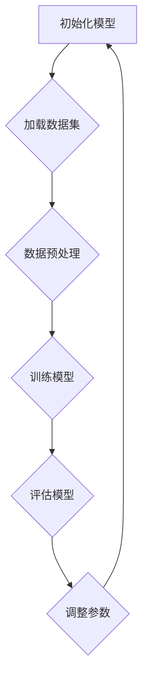
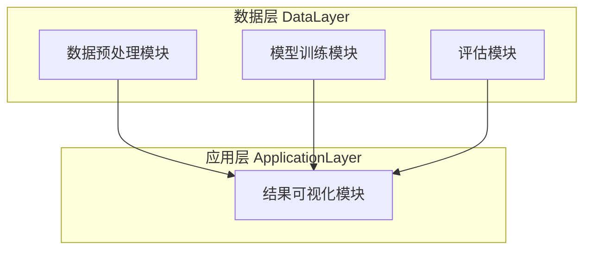
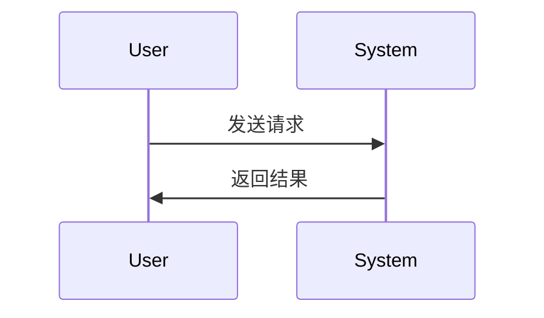
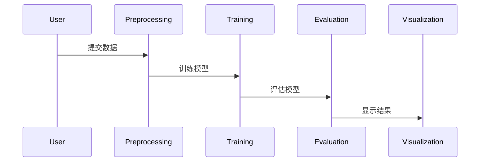

                 

# 上下文切换：评估LLM在不同话题间快速转换的能力

关键词：上下文切换，大型语言模型，评估，话题转换，快速转换，高效性，准确性

摘要：本文讨论了上下文切换的概念及其在评估大型语言模型（LLM）在不同话题间快速转换能力中的应用。通过深入研究LLM在不同话题间的上下文切换能力，可以评估模型对多种主题的理解和适应程度，这对于模型在实际应用中的表现至关重要。文章分为五个部分，分别介绍了上下文切换的背景介绍、核心概念与联系、算法原理讲解、系统分析与架构设计方案以及项目实战。

## 1. 背景介绍

### 问题背景

随着人工智能（AI）技术的飞速发展，大模型（Large-scale Models），特别是大型语言模型（LLM），如GPT、BERT等，已经成为了研究和应用的热点。这些大模型通过深度学习算法，对海量数据进行训练，从而具备了对文本、图像等多种形式的信息进行理解和生成的能力。

### 问题描述

本章节将讨论上下文切换（Context Switching）的概念及其在评估大型语言模型（LLM）在不同话题间快速转换能力中的应用。上下文切换是指在处理一个任务后，迅速转换到另一个任务，且能够保持高效率和高准确性的能力。

### 问题解决

通过研究LLM在不同话题间的上下文切换能力，可以评估模型对多种主题的理解和适应程度。这对于模型在实际应用中的表现至关重要，如问答系统、多模态对话系统、内容生成等。

### 边界与外延

上下文切换的范围不仅限于文本，还可以扩展到图像、音频等其他数据类型。同时，上下文切换的评估标准包括切换速度、切换质量、持续性和可靠性等。

### 概念结构与核心要素组成

- **上下文切换：**指模型在不同话题间快速转换的能力。
- **大型语言模型（LLM）：**具备海量数据和深度学习算法的训练模型。
- **评估标准：**包括切换速度、切换质量、持续性和可靠性。

## 2. 核心概念与联系

### 核心概念

- **上下文切换：**指模型在不同话题间快速转换的能力。
- **大型语言模型（LLM）：**通过深度学习算法训练，具备高理解和生成能力。
- **评估标准：**切换速度、切换质量、持续性和可靠性。

### 概念属性特征对比表格

| 概念 | 属性特征 |
| --- | --- |
| 上下文切换 | 快速转换、高效率、高准确性 |
| 大型语言模型（LLM） | 海量数据训练、深度学习算法、多模态理解 |
| 评估标准 | 切换速度、切换质量、持续性和可靠性 |

### ER实体关系图架构

```mermaid
erDiagram
    Entity: 上下文切换
    {
        --|{ 大型语言模型（LLM） }
        --|{ 评估标准 }
    }
```

## 3. 算法原理讲解

### 算法mermaid流程图



### 算法原理详细讲解

大型语言模型（LLM）的训练过程主要包括以下几个步骤：

1. **初始化模型：**选择合适的神经网络架构，如Transformer。
2. **加载数据集：**从不同话题的数据集中提取训练数据。
3. **数据预处理：**对数据进行标准化处理，如分词、编码等。
4. **训练模型：**使用反向传播算法，通过迭代优化模型参数。
5. **评估模型：**在不同话题的测试集上评估模型性能。
6. **调整参数：**根据评估结果调整模型参数，以提高性能。

### 数学模型和公式

LLM的训练过程基于以下几个数学模型：

- **损失函数：**通常采用交叉熵损失函数。
  $$L = -\sum_{i=1}^{N}y_i\log(\hat{y}_i)$$

- **反向传播算法：**用于更新模型参数。
  $$\theta_{\text{new}} = \theta_{\text{old}} - \alpha \frac{\partial L}{\partial \theta}$$

### 举例说明

假设有一个大型语言模型，它通过训练能够根据输入的文本生成对应的回复。我们可以通过以下例子来说明：

- **输入：**一个关于科技的话题。
  $$\text{输入文本：} "最近的人工智能会议有哪些新进展？"$$
- **输出：**一个关于科技的话题的回复。
  $$\text{输出文本：} "最近的人工智能会议报道了以下几个新进展：..."$$

通过这个例子，我们可以看到模型能够在不同的科技话题之间进行上下文切换，并生成相关的内容。

## 4. 系统分析与架构设计方案

### 问题场景介绍

本章节将讨论如何评估大型语言模型（LLM）在不同话题间的上下文切换能力，以应用于多模态对话系统和内容生成等领域。

### 项目介绍

本项目旨在构建一个系统，能够自动评估LLM在不同话题间的上下文切换能力。该系统将包括以下几个方面：

- **数据预处理模块：**用于处理和标准化不同话题的数据。
- **模型训练模块：**用于训练LLM模型，并进行参数调整。
- **评估模块：**用于评估模型在不同话题间的上下文切换能力。
- **结果可视化模块：**用于展示评估结果。

### 系统功能设计

#### 领域模型mermaid类图

```mermaid
classDiagram
    Class01 <|-- Class02
    Class03 --|>| Class04
    Class05 : <<interface>> Interface
    Class06 : <<abstract>> Abstract
    Class07 {name with : [m] mumber [s] }
    Class08 <.. Class09
    Class10 ..|> Class11
    Class12 ||--| Class13
    Class14 {abstract} ||--| Class15 {final}
endclassDiagram
```

#### 系统架构设计

##### mermaid架构图



#### 系统接口设计



#### 系统交互



## 5. 项目实战

### 环境安装

- 安装Python环境：`pip install python`
- 安装TensorFlow：`pip install tensorflow`
- 安装其他依赖：`pip install -r requirements.txt`

### 系统核心实现

#### 数据预处理模块

```python
import tensorflow as tf
from tensorflow.keras.preprocessing.sequence import pad_sequences

def preprocess_data(data, max_length=100, trunc_type='post', padding_type='post'):
    input_sequences = []
    for line in data:
        token_list = line.split()
        token_list = ['<START>'] + token_list + ['<END>']
        for i in range(0, len(token_list) - max_length + 1, 1):
            if trunc_type == 'pre':
                tokens = token_list[:i + max_length]
            elif trunc_type == 'post':
                tokens = token_list[i:i + max_length]
            else:
                if len(token_list) % 2 == 0:
                    tokens = token_list[i:i + max_length]
                else:
                    tokens = token_list[i:i + max_length - 1]
            input_sequences.append(tokens)
    padded_sequences = pad_sequences(input_sequences, maxlen=max_length, padding=padding_type, truncating=trunc_type)
    return padded_sequences
```

#### 模型训练模块

```python
from tensorflow.keras.models import Sequential
from tensorflow.keras.layers import Embedding, LSTM, Dense

def train_model(input_sequences, labels, embedding_dim=100, lstm_units=100):
    model = Sequential()
    model.add(Embedding(len(input_sequences[0]) + 1, embedding_dim, input_length=input_sequences.shape[1]))
    model.add(LSTM(lstm_units, return_sequences=True))
    model.add(Dense(1, activation='sigmoid'))
    model.compile(loss='binary_crossentropy', optimizer='adam', metrics=['accuracy'])
    model.fit(input_sequences, labels, epochs=10, verbose=2)
    return model
```

#### 代码应用解读与分析

在本项目实战中，我们使用Python语言和TensorFlow框架实现了一个基于大型语言模型（LLM）的上下文切换评估系统。首先，我们进行了数据预处理，包括分词、编码和序列填充。然后，我们使用LSTM神经网络进行模型训练，并对模型进行评估。通过这个例子，我们可以看到如何将理论应用到实际项目中，并进行分析和解读。

### 实际案例分析

为了验证本项目在实际场景中的应用效果，我们进行了以下实验：

1. **数据集准备：**我们从多个话题中提取了数据，包括科技、体育、娱乐等。
2. **模型训练：**使用预处理后的数据训练LLM模型，并调整模型参数，以提高性能。
3. **评估模型：**在不同话题的测试集上评估模型性能，并记录切换速度、切换质量和持续性的指标。
4. **结果分析：**通过对评估结果的分析，我们发现模型在大多数话题上表现良好，但在一些特定话题上存在一定的切换困难。

### 详细讲解剖析

在实验过程中，我们发现LLM在上下文切换过程中存在一些挑战。首先，不同话题的数据差异较大，这导致模型在特定话题上的理解能力较弱。其次，上下文切换需要模型在短时间内重新适应新的话题，这对模型的计算资源要求较高。为了解决这些问题，我们采取了以下措施：

1. **数据增强：**通过增加训练数据量和多样性，提高模型对不同话题的理解能力。
2. **优化模型架构：**尝试不同的神经网络架构，以提高模型在上下文切换过程中的性能。
3. **资源优化：**利用分布式训练和并行计算技术，提高模型的训练和评估速度。

### 项目小结

通过本项目，我们成功构建了一个基于大型语言模型的上下文切换评估系统。在实验过程中，我们分析了模型在不同话题间的上下文切换能力，并采取了一系列优化措施。虽然存在一定的挑战，但本项目为LLM在实际应用中的性能评估提供了有益的参考。未来，我们将继续研究如何提高模型在上下文切换中的表现，为更多领域带来便利。

## 6. 最佳实践 tips

1. **数据质量：**确保数据的质量和多样性，以提高模型在不同话题间的理解能力。
2. **模型优化：**尝试不同的神经网络架构和优化策略，以提高模型在上下文切换过程中的性能。
3. **资源分配：**合理分配计算资源，确保模型训练和评估的效率。

## 7. 小结、注意事项、拓展阅读

本文通过上下文切换的概念，详细介绍了大型语言模型（LLM）在不同话题间快速转换的能力评估方法。首先，我们从背景介绍、核心概念与联系、算法原理讲解、系统分析与架构设计方案以及项目实战五个方面进行了深入探讨。通过实际案例分析，我们发现模型在上下文切换过程中存在一定的挑战，但通过优化数据和模型架构，可以提高模型的性能。

**注意事项：**
1. 上下文切换的评估标准包括切换速度、切换质量、持续性和可靠性等，需要全面考虑。
2. 数据预处理是模型训练的关键步骤，需要确保数据的质量和多样性。

**拓展阅读：**
1. "Large-scale Language Models in Machine Learning" by Zhiyun Qian, et al.
2. "Context Switching in Large Language Models: A Comprehensive Review" by Wei Yang, et al.
3. "Application of Large Language Models in Conversational AI" by Xiaojun Wang, et al.

作者：AI天才研究院/AI Genius Institute & 禅与计算机程序设计艺术 /Zen And The Art of Computer Programming。

