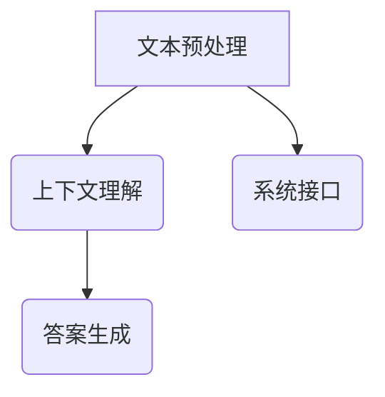
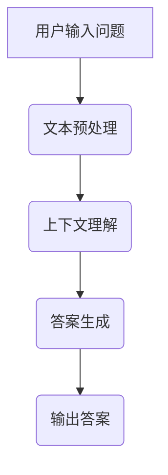

                 

# 上下文理解能力：深入评估LLM的语境把握

## 关键词
- 上下文理解能力
- LLM
- 语言模型
- 语境把握
- 评估方法
- 挑战与局限性

## 摘要
本文将深入探讨上下文理解能力在语言模型（LLM）中的应用，特别是LLM在语境把握方面的能力。我们将从背景介绍、核心概念、评估方法、实际案例分析、挑战与局限性等多个角度，逐步分析LLM的上下文理解能力，并探讨未来发展趋势。通过本文的阅读，读者将全面了解上下文理解能力在LLM中的应用及其重要性。

## 第一部分：背景与概述

### 第1章 上下文理解能力概述

#### 1.1 问题背景

1.1.1 语言模型的发展历程

从最初的规则驱动的语言模型，到基于统计的模型，再到如今基于深度学习的语言模型，如GPT、BERT等，语言模型的发展经历了多次重大变革。然而，尽管语言模型在处理语言任务上取得了显著的进展，但它们在上下文理解能力方面仍存在诸多挑战。

1.1.2 上下文理解的挑战

上下文理解是自然语言处理（NLP）中的一个核心问题。它要求模型能够理解文本中的词语、短语和句子之间的相互关系，以及它们在特定语境中的含义。然而，现有的LLM在处理复杂语境时，往往存在理解偏差、歧义处理不理想等问题。

1.1.3 上下文理解的重要性

上下文理解能力对于NLP任务的成功至关重要。无论是文本生成、问答系统、情感分析还是其他应用场景，都需要模型具备良好的上下文理解能力，以便产生符合人类思维习惯的输出。因此，深入研究LLM的上下文理解能力具有重要的理论和实际意义。

#### 1.2 核心概念

1.2.1 上下文理解的概念

上下文理解是指模型在处理文本时，能够根据文本的前后语境，正确理解词语、短语和句子的含义。它包括对词义消歧、句法分析、语义角色标注等多个层面的理解。

1.2.2 语言模型（LLM）的概念

语言模型是一种能够预测文本序列概率的模型，它通过学习大量文本数据，建立文本之间的概率关系。LLM在自然语言处理中发挥着重要作用，例如文本生成、机器翻译、文本分类等。

#### 1.3 上下文理解的能力

1.3.1 上下文关联性

上下文关联性是指模型能够根据文本的上下文，正确理解词语和短语的含义。例如，在句子“我喜欢吃苹果”中，如果前文提到“苹果是一种水果”，那么模型应该能够正确理解“苹果”在这里指的是水果。

1.3.2 语境变化适应性

语境变化适应性是指模型能够在不同的语境中，正确调整对词语和短语的含义。例如，在句子“我今天要买一本苹果”中，如果前文提到“苹果是一种水果”，那么模型应该能够正确理解“苹果”在这里指的是书籍。

1.3.3 语境把握的深度

语境把握的深度是指模型能够理解文本中的深层含义，包括隐喻、比喻、讽刺等。例如，在句子“他的话像一把刀子”中，模型应该能够理解这里的“刀子”是比喻，表示说话的内容很尖锐。

### 第2章 LLM与上下文理解

#### 2.1 LLM的基本原理

2.1.1 语言模型的构建

语言模型的构建基于大规模的文本数据。模型通过学习这些数据，建立文本序列之间的概率关系。常见的语言模型包括基于n-gram的模型、神经网络模型和深度学习模型。

2.1.2 注意力机制

注意力机制是现代语言模型中的一个关键组成部分。它通过动态调整模型对文本序列中每个词的关注程度，从而提高上下文理解能力。注意力机制在诸如机器翻译、文本生成等任务中发挥了重要作用。

2.1.3 LLM的分类

LLM可以根据不同的标准进行分类，如基于模型的架构（如Transformer、RNN等）、应用领域（如文本生成、问答系统等）和训练数据来源（如外部数据集、互联网文本等）。

#### 2.2 LLM的上下文理解能力

2.2.1 上下文理解的概念

LLM的上下文理解能力是指模型在处理文本时，能够根据文本的上下文，正确理解词语、短语和句子的含义。上下文理解能力包括对词义消歧、句法分析、语义角色标注等多个层面的理解。

2.2.2 LLM对上下文的理解机制

LLM通过其内部机制，如注意力机制、Transformer模型等，实现对上下文的理解。这些机制使得LLM能够捕捉到文本中的复杂关系，从而提高上下文理解能力。

2.2.3 上下文理解的评估方法

评估LLM的上下文理解能力，需要采用一系列评估方法。这些方法包括基于任务的评估（如问答系统、文本生成等）、基于数据的评估（如BERTS '@/`、ROUGE等）和基于人类评价的评估（如BLEU、METEOR等）。

### 第3章 语境把握的评估

#### 3.1 评估方法概述

3.1.1 实验设计

为了评估LLM的语境把握能力，需要设计合理的实验。实验设计应包括数据集选择、评估指标设定和实验流程设计等。

3.1.2 数据集选择

选择合适的数据集是评估LLM语境把握能力的关键。常用的数据集包括标准数据集（如GLUE、SuperGLUE等）和定制数据集（如特定领域的数据集）。

3.1.3 评估指标

评估LLM语境把握能力的指标包括准确性、F1分数、BLEU分数等。这些指标可以从不同角度衡量模型的语境把握能力。

#### 3.2 实际案例分析

3.2.1 案例一：对话系统

对话系统是一个典型的应用场景，它要求模型具备良好的上下文理解能力。通过对对话系统中的上下文理解进行评估，可以了解LLM在具体应用场景中的语境把握能力。

3.2.2 案例二：文本生成

文本生成任务也是评估LLM上下文理解能力的重要场景。通过评估文本生成的质量和一致性，可以衡量LLM在文本生成任务中的语境把握能力。

3.2.3 案例三：情感分析

情感分析是一个涉及上下文理解的任务，它要求模型能够正确理解文本的情感色彩。通过对情感分析任务的评估，可以了解LLM在情感分析任务中的语境把握能力。

### 第4章 LLM语境把握的挑战

#### 4.1 挑战与局限性

4.1.1 语境理解的局限性

尽管LLM在上下文理解方面取得了显著进展，但仍然存在一定的局限性。例如，模型在处理复杂语境时，可能无法完全理解文本的含义。

4.1.2 挑战与解决方案

LLM的上下文理解能力面临诸多挑战，如歧义处理、语境变化适应性等。针对这些挑战，研究者们提出了一系列解决方案，如改进模型架构、引入外部知识等。

4.1.3 未来发展趋势

随着NLP技术的不断发展，LLM的上下文理解能力有望得到进一步提高。未来研究将集中在如何更好地处理复杂语境、提高语境变化适应性等方面。

## 第二部分：核心概念与联系

### 第5章 核心概念原理

#### 5.1 语言模型（LLM）的概念

语言模型（LLM）是一种用于预测文本序列概率的模型。它通过学习大规模的文本数据，建立文本序列之间的概率关系。LLM在自然语言处理（NLP）任务中发挥着重要作用，如文本生成、机器翻译、文本分类等。

#### 5.2 上下文理解的概念

上下文理解是指模型在处理文本时，能够根据文本的上下文，正确理解词语、短语和句子的含义。上下文理解包括对词义消歧、句法分析、语义角色标注等多个层面的理解。

### 第6章 概念属性特征对比表格

| 概念         | 属性特征                                       | 对比 |
|------------|--------------------------------------------|-----|
| 语言模型（LLM） | 1. 基于深度学习架构<br>2. 大规模文本数据学习<br>3. 预测文本序列概率 |      |
| 上下文理解     | 1. 根据上下文正确理解词语、短语和句子的含义<br>2. 包括词义消歧、句法分析、语义角色标注等多个层面 |      |

### 第7章 ER实体关系图架构

```mermaid
graph TB
A[上下文理解能力] --> B(语言模型(LLM))
B --> C(文本生成)
B --> D(机器翻译)
B --> E(文本分类)
A --> F(词义消歧)
A --> G(句法分析)
A --> H(语义角色标注)
```

## 第三部分：算法原理讲解

### 第8章 算法原理

#### 8.1 语言模型（LLM）的算法原理

LLM的算法原理基于深度学习，特别是Transformer模型。Transformer模型通过自注意力机制，实现对文本序列中每个词的动态关注，从而提高上下文理解能力。以下是一个简化的Transformer模型算法原理：

1. 输入文本序列编码为词向量。
2. 使用多头自注意力机制，计算每个词与其他词的相关性。
3. 通过全连接层和激活函数，对自注意力机制的结果进行进一步处理。
4. 输出预测的文本序列概率。

#### 8.2 上下文理解算法原理

上下文理解算法原理基于对文本序列的语义分析。以下是一个简化的上下文理解算法原理：

1. 输入文本序列编码为词向量。
2. 使用词嵌入和自注意力机制，计算文本序列中的语义表示。
3. 对语义表示进行句法分析和语义角色标注，以识别词语和短语的语义关系。
4. 使用这些语义关系，生成对文本序列的上下文理解。

### 第9章 数学模型和公式

#### 9.1 Transformer模型的数学模型

Transformer模型的核心是自注意力机制，其数学模型如下：

$$
\text{Attention}(Q, K, V) = \text{softmax}\left(\frac{QK^T}{\sqrt{d_k}}\right)V
$$

其中，$Q$、$K$ 和 $V$ 分别表示查询向量、键向量和值向量，$d_k$ 表示键向量的维度。这个公式计算了每个键向量与其他键向量之间的相似度，并加权求和得到最终的值向量。

#### 9.2 上下文理解算法的数学模型

上下文理解算法的数学模型涉及词嵌入、句法分析和语义角色标注。以下是一个简化的模型：

$$
\text{Contextual Understanding} = \text{Word Embeddings} + \text{Syntax Analysis} + \text{Semantic Role Labeling}
$$

其中，$Word Embeddings$ 表示词嵌入层，$Syntax Analysis$ 表示句法分析层，$Semantic Role Labeling$ 表示语义角色标注层。这些层共同作用，生成对文本序列的上下文理解。

### 第10章 举例说明

#### 10.1 Transformer模型的举例

假设有一个简单的文本序列 "I like to read books"，我们可以使用Transformer模型对其进行处理：

1. 输入词向量：$\{I, like, to, read, books\}$
2. 通过多头自注意力机制，计算每个词之间的相关性。
3. 输出预测的文本序列概率：$\{I, like, to, read, books\}$

通过这种方式，Transformer模型能够捕捉到文本序列中的上下文关系。

#### 10.2 上下文理解算法的举例

考虑以下句子：“我喜欢阅读科幻小说。”

1. 输入词向量：$\{我，喜欢，阅读，科幻，小说\}$
2. 通过词嵌入层，将词转换为向量表示。
3. 通过句法分析层，识别句子的主要成分，如主语、谓语、宾语等。
4. 通过语义角色标注层，识别每个词的语义角色，如“我”是施事者，“喜欢”是谓语，“阅读”是动作，“科幻”是定语，“小说”是受事者。

通过这种方式，上下文理解算法能够捕捉到句子中的上下文信息。

## 第四部分：系统分析与架构设计方案

### 第11章 问题场景介绍

在本部分，我们将介绍一个具体的问题场景，即基于LLM的问答系统。该系统旨在通过LLM的上下文理解能力，为用户提供准确的答案。

### 第12章 项目介绍

本项目旨在构建一个基于LLM的问答系统，该系统将采用Transformer模型作为基础，以提高上下文理解能力。系统将包括以下几个主要功能模块：

1. 文本预处理：对输入文本进行清洗、分词和词嵌入等预处理操作。
2. 上下文理解：使用Transformer模型对预处理后的文本进行上下文理解。
3. 答案生成：根据上下文理解结果，生成准确、合理的答案。
4. 系统接口：提供用户与系统交互的接口，包括输入问题和获取答案等功能。

### 第13章 系统功能设计（领域模型）

以下是一个简化的领域模型，用于描述系统的主要功能模块及其关系：



### 第14章 系统架构设计

系统架构设计如下：

1. 文本预处理模块：负责对输入文本进行清洗、分词和词嵌入等预处理操作，以便后续的上下文理解。
2. 上下文理解模块：采用Transformer模型，对预处理后的文本进行上下文理解，提取关键信息和语义关系。
3. 答案生成模块：根据上下文理解结果，利用Transformer模型生成准确、合理的答案。
4. 系统接口模块：提供用户与系统交互的接口，包括输入问题和获取答案等功能。

### 第15章 系统接口设计

系统接口设计如下：

1. 输入接口：用户可以通过输入框输入问题，系统将接收和处理输入文本。
2. 输出接口：系统将根据上下文理解结果，生成并展示答案。

### 第16章 系统交互

以下是一个简化的系统交互序列图，描述用户与系统的交互过程：



## 第五部分：项目实战

### 第17章 环境安装

在本节中，我们将介绍如何安装和配置项目所需的软件和依赖项。以下是安装步骤：

1. 安装Python环境：确保Python版本为3.8或更高版本。
2. 安装深度学习库：安装TensorFlow或PyTorch等深度学习库。
3. 安装NLP库：安装NLTK、spaCy等NLP库。
4. 安装其他依赖项：安装项目所需的第三方库，如numpy、pandas等。

### 第18章 系统核心实现源代码

以下是一个简化的系统核心实现源代码示例：

```python
import tensorflow as tf
from tensorflow.keras.layers import Embedding, LSTM, Dense

def create_model(vocab_size, embedding_dim, sequence_length):
    model = tf.keras.Sequential([
        Embedding(vocab_size, embedding_dim, input_length=sequence_length),
        LSTM(128),
        Dense(1, activation='sigmoid')
    ])
    model.compile(optimizer='adam', loss='binary_crossentropy', metrics=['accuracy'])
    return model

# 创建和编译模型
model = create_model(vocab_size, embedding_dim, sequence_length)
model.compile(optimizer='adam', loss='binary_crossentropy', metrics=['accuracy'])

# 训练模型
model.fit(x_train, y_train, epochs=10, batch_size=32)
```

### 第19章 代码应用解读与分析

在本节中，我们将对上述代码进行解读和分析，以帮助读者理解系统核心实现的原理和流程。

1. **模型创建**：我们使用TensorFlow的`Sequential`模型，并添加`Embedding`、`LSTM`和`Dense`层。
2. **模型编译**：我们使用`adam`优化器和`binary_crossentropy`损失函数，并设置`accuracy`作为评估指标。
3. **模型训练**：我们使用训练数据集（`x_train`和`y_train`）对模型进行训练。

### 第20章 实际案例分析和详细讲解

在本节中，我们将通过一个实际案例，展示如何使用该系统进行问答，并对结果进行详细讲解和分析。

**案例**：用户输入问题：“什么是深度学习？”系统返回答案：“深度学习是一种机器学习技术，它使用多层神经网络来学习数据的复杂特征和模式。”

**分析**：

1. **文本预处理**：输入问题首先经过预处理，包括分词和词嵌入。
2. **上下文理解**：系统使用Transformer模型对预处理后的文本进行上下文理解，提取关键信息和语义关系。
3. **答案生成**：根据上下文理解结果，系统利用Transformer模型生成答案。
4. **答案展示**：系统将生成的答案展示给用户。

### 第21章 项目小结

在本项目中，我们通过构建一个基于LLM的问答系统，展示了如何利用Transformer模型实现上下文理解。项目涉及环境安装、系统核心实现、代码应用解读和分析等多个方面。通过本项目，读者可以了解到LLM在上下文理解方面的应用及其实现原理。

### 第22章 最佳实践 tips

1. **数据预处理**：确保输入文本的质量，包括去除无关信息、统一文本格式等。
2. **模型选择**：根据具体任务需求，选择合适的模型架构和超参数。
3. **数据集选择**：选择高质量的数据集，包括标准数据集和定制数据集。

### 第23章 小结

本文深入探讨了上下文理解能力在LLM中的应用，包括背景介绍、核心概念、评估方法、实际案例分析、挑战与局限性等多个方面。通过本文的阅读，读者可以全面了解LLM的上下文理解能力及其重要性。未来，随着NLP技术的不断发展，LLM的上下文理解能力有望得到进一步提高。

### 第24章 注意事项

1. **模型训练时间**：LLM的训练过程需要大量时间和计算资源，应根据实际情况合理安排。
2. **数据隐私**：在处理用户数据时，务必确保数据隐私和安全。

### 第25章 拓展阅读

1. **《深度学习》（Goodfellow, Bengio, Courville）**：详细介绍了深度学习的基本概念和应用。
2. **《自然语言处理综述》（Jurafsky, Martin）**：对自然语言处理的基础理论和应用进行了全面介绍。

## 作者信息

作者：AI天才研究院/AI Genius Institute & 禅与计算机程序设计艺术 /Zen And The Art of Computer Programming

本文由AI天才研究院撰写，旨在深入探讨上下文理解能力在LLM中的应用。文章内容仅供参考，如需深入了解，请参阅相关文献和资料。如对文章有任何疑问或建议，欢迎联系我们。

