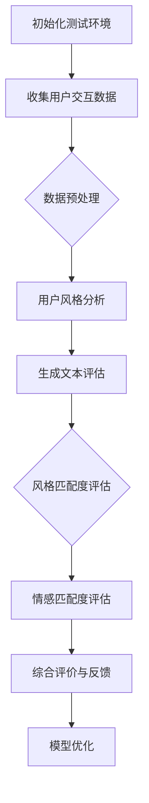

                 

### 《个性化交互测试：评价LLM适应不同用户风格的能力》 - 概述

在当今人工智能领域，语言模型（LLM，Language Models）的发展引人注目，尤其是其在个性化交互中的潜力。个性化交互是指根据用户的特定需求、偏好和风格来提供定制化的服务或内容。这不仅仅是一个趋势，更是提升用户体验和满意度的重要手段。LLM因其强大的语言理解和生成能力，被广泛应用于个性化交互系统中，例如聊天机器人、智能客服和个性化推荐等。

然而，LLM在适应不同用户风格方面的表现千差万别。为了确保系统能够真正满足用户的期望，我们需要对其适应能力进行科学、系统的评价。本文旨在探讨如何通过个性化交互测试来评估LLM适应不同用户风格的能力。我们不仅关注如何评价，还关注如何评价的标准和方法。

本文将从以下几个方面展开：

1. **背景介绍**：介绍个性化交互的重要性，LLM在个性化交互中的应用，以及现有评价方法的不足。
2. **核心概念与联系**：详细阐述个性化交互、LLM和用户风格等核心概念，并通过对比表格和ER实体关系图来加深理解。
3. **算法原理讲解**：介绍个性化交互测试的算法原理，包括测试框架设计、评估指标选择、算法流程图、Python源代码实现，以及数学模型和公式。
4. **系统分析与架构设计方案**：介绍个性化交互测试的应用场景，系统功能设计、系统架构设计、系统接口设计和系统交互。
5. **项目实战**：详细描述环境安装、系统核心实现、代码应用解读与分析、实际案例分析和详细讲解剖析，以及项目小结。
6. **最佳实践 tips**：提供一些实用的技巧和建议，帮助读者在实际应用中更好地运用个性化交互测试。
7. **小结**：总结文章的主要观点，强调个性化交互测试的重要性，并指出未来研究方向。

通过本文的阅读，读者将能够系统地了解个性化交互测试的基本概念、评价方法和应用场景，为实际项目中的LLM适应能力评估提供有力支持。

### 背景介绍

个性化交互在现代技术和用户服务中占据着越来越重要的地位。随着互联网的普及和用户数据的积累，个性化交互已经成为提升用户体验、增强用户满意度和忠诚度的关键因素。个性化交互不仅限于电商推荐系统、社交媒体内容推荐，还广泛应用于智能客服、聊天机器人、个性化教育等领域。

在个性化交互中，语言模型（LLM，Language Models）无疑是一个重要的工具。LLM是一种基于深度学习的技术，能够对自然语言进行处理和理解。它们通过学习大量的文本数据，掌握语言的结构和语义，从而能够生成流畅、自然的语言响应。这种能力使得LLM在个性化交互中具有广泛的应用潜力，例如：

1. **智能客服**：智能客服通过LLM与用户进行对话，提供即时、个性化的服务。用户无需等待人工客服的响应，系统可以快速地理解用户的问题并提供解决方案。
2. **聊天机器人**：聊天机器人利用LLM与用户进行日常交流，能够根据用户的输入生成相应的回复，从而提供娱乐、咨询和帮助等服务。
3. **个性化推荐**：在电子商务和内容平台中，LLM可以帮助分析用户的兴趣和行为，生成个性化的推荐列表，从而提高用户参与度和购买率。

然而，LLM在个性化交互中的应用并非一帆风顺。不同用户在交流风格、表达习惯和语言偏好上存在显著差异，这要求LLM能够灵活地适应各种用户风格。现有的评价方法主要侧重于LLM的生成质量和准确性，而对其适应不同用户风格的能力缺乏系统的评估。这导致一些LLM在特定场景下表现优异，但在其他场景下却无法满足用户需求。

现有评价方法的不足主要体现在以下几个方面：

1. **单一指标评价**：现有方法通常使用单一指标（如BLEU、ROUGE等）来评估LLM的生成质量，而未能全面考虑用户风格适应性这一重要维度。
2. **缺乏实际应用场景**：许多评价方法仅停留在理论层面，未能与实际应用场景相结合，导致评价结果与实际应用需求脱节。
3. **用户参与度低**：现有方法往往缺乏用户的直接参与，无法准确反映用户对LLM风格适应性的主观评价。

为了克服这些不足，本文提出了个性化交互测试方法，通过系统、科学的测试流程和评价指标，全面评估LLM适应不同用户风格的能力。这不仅有助于优化LLM的模型设计和应用效果，也为未来个性化交互技术的发展提供了新的方向。

### 问题描述

在深入探讨个性化交互测试之前，我们首先需要明确如何评价LLM适应不同用户风格的能力。具体来说，这一问题的核心可以分解为以下几个方面：

1. **如何定义用户风格**：用户风格是指个体在交流中的语言习惯、表达方式、情绪和态度等特征。这些特征可以通过用户的语言输入、行为数据和社交背景来识别和分析。
   
2. **如何评估LLM的适应能力**：评估LLM的适应能力需要制定一套科学、系统的评价指标。这些指标应能够全面反映LLM在语言生成过程中对用户风格的敏感度和适应性。

3. **如何制定评价标准**：评价标准是评估LLM适应能力的基础。这些标准应具备以下特点：
   - **客观性**：评价标准应尽量减少主观因素的影响，确保评估结果的客观性。
   - **全面性**：评价标准应涵盖用户风格的主要维度，如语言结构、词汇选择、情绪表达等。
   - **可操作性**：评价标准应具备明确的操作步骤和量化指标，以便在实际应用中执行和评估。

为了更好地理解这一问题，我们可以从以下几个方面进行进一步讨论：

### 如何定义用户风格

用户风格的定义是一个多维度的过程，涉及到语言学、心理学和社会学等多个领域。以下是一些关键点：

1. **语言习惯**：包括词汇选择、语法结构、用词频率和句式结构等。例如，一些用户可能更喜欢使用简单、直接的语句，而另一些用户则倾向于使用复杂、富有变化的句子结构。

2. **情绪表达**：情绪表达是指用户在交流中如何表达情绪和态度。这可以通过情感分析技术来识别，如通过分析文本中的情感词汇、语气词和情绪词汇的分布来推断用户的情绪状态。

3. **社交背景**：社交背景包括用户的年龄、教育水平、职业背景和社会地位等。这些因素会影响用户的语言选择和交流方式。例如，年轻用户可能更倾向于使用网络流行语和表情符号，而高级主管可能更注重正式和专业的语言风格。

### 如何评估LLM的适应能力

评估LLM的适应能力涉及以下步骤：

1. **数据收集**：首先，需要收集大量用户交互数据，包括用户的语言输入和系统的响应。这些数据应涵盖不同的用户风格，以便全面评估LLM的适应能力。

2. **用户风格分析**：通过对收集到的数据进行分析，识别和提取用户的语言特征和风格。这可以通过自然语言处理（NLP）技术实现，如词频统计、情感分析和语法分析等。

3. **生成评估指标**：基于用户风格分析结果，定义一系列评估指标，如生成文本的多样性、流畅性、准确性和情感匹配度等。这些指标应能够全面反映LLM在适应不同用户风格方面的表现。

4. **指标计算**：对每个用户风格的交互数据应用评估指标，计算LLM的适应度得分。这些得分应具备量化用户风格适应能力的功能。

### 如何制定评价标准

制定评价标准是确保评估结果科学、可靠的重要步骤。以下是一些关键点：

1. **评价指标的选择**：选择能够全面反映用户风格适应能力的评价指标，如生成文本的多样性、准确性和情感匹配度等。

2. **评价指标的量化**：将评价指标量化为具体的数值，如百分比、分数或等级等。这有助于客观地评估LLM的适应能力。

3. **评价指标的权重分配**：根据用户风格的重要性，为每个评价指标分配不同的权重。例如，如果用户情绪表达对交互体验至关重要，则可以赋予较高的权重。

4. **评价标准的操作步骤**：制定详细的操作步骤，确保评估过程可执行和可重复。这有助于确保评估结果的可靠性。

通过上述步骤，我们可以系统地评估LLM适应不同用户风格的能力，从而为个性化交互系统的优化提供有力支持。

### 问题解决

为了科学、系统且全面地评估LLM适应不同用户风格的能力，我们设计了一套个性化交互测试框架。该框架包括以下几个关键步骤：

#### 1. 初始化测试环境

在开始测试之前，我们需要初始化测试环境，这包括以下内容：

- **数据集准备**：收集并准备一组多样化的用户交互数据，这些数据应涵盖不同用户风格的样本。数据集可以从实际应用场景中获取，例如聊天机器人和智能客服的交互记录。
- **LLM模型准备**：选择或训练一个预训练的LLM模型，该模型应具备良好的语言生成能力，以便在实际测试中生成高质量的响应。

#### 2. 收集用户交互数据

收集用户交互数据是评估LLM适应能力的基础。以下是收集用户交互数据的关键步骤：

- **交互数据来源**：从实际应用场景中获取交互数据，如聊天机器人和用户之间的对话记录。这些数据应具备真实性和多样性，以便全面评估LLM的适应能力。
- **数据预处理**：对收集到的数据进行预处理，包括去除噪声、标准化文本格式和去除无关信息等。这有助于提高数据质量，为后续分析提供可靠的基础。

#### 3. 用户风格分析

用户风格分析是识别和提取用户语言特征的过程。以下是用户风格分析的关键步骤：

- **特征提取**：利用自然语言处理（NLP）技术，从用户交互数据中提取关键语言特征。这些特征可以包括词汇频率、语法结构、情感表达和句子长度等。
- **风格分类**：使用机器学习算法（如聚类分析或分类算法），将用户交互数据分类为不同的风格类别。这有助于进一步分析不同用户风格的交互特点。

#### 4. 评估LLM适应能力

评估LLM适应能力是测试的核心步骤。以下是评估LLM适应能力的详细方法：

- **生成文本评估**：基于用户交互数据，使用LLM生成相应的文本响应。然后，利用评估指标（如BLEU、ROUGE和情感匹配度等）对生成的文本进行评估，以衡量LLM在语言生成方面的质量。
- **风格匹配度评估**：通过对比用户交互数据中提取的语言特征和LLM生成的文本特征，评估LLM在风格匹配度方面的表现。这可以通过计算特征相似度或使用匹配度评价指标来实现。
- **综合评价**：综合生成文本质量和风格匹配度评估结果，为每个用户风格给出一个适应度得分。这个得分应反映LLM在该用户风格下的整体适应能力。

#### 5. 输出评估结果

最后，输出评估结果，这些结果应包括：

- **用户风格适应度得分**：为每个用户风格提供一个适应度得分，得分越高表示LLM在该风格下适应能力越强。
- **评估报告**：撰写详细的评估报告，包括测试过程、评估指标、结果分析和改进建议等。

通过上述个性化交互测试框架，我们可以系统、全面地评估LLM适应不同用户风格的能力，为个性化交互系统的优化提供有力支持。

### 边界与外延

在讨论LLM适应能力的界定时，我们首先需要明确其适用场景。个性化交互测试主要适用于需要高度定制化服务的场景，例如智能客服、聊天机器人和个性化推荐系统。在这些场景中，用户的交互风格多样化，对LLM的适应能力有较高的要求。

#### LLM适应能力的界定

LLM适应能力可以从多个维度进行界定，主要包括以下方面：

1. **语言生成质量**：评估LLM生成文本的准确性、流畅性和自然度。高适应能力的LLM应能够生成与用户风格高度匹配的自然语言文本。

2. **风格匹配度**：评估LLM对用户风格的特征捕捉和再现能力。高适应能力的LLM应能够准确捕捉用户语言特征，并在生成文本中予以体现。

3. **情感表达**：评估LLM在情感表达方面的适应能力。高适应能力的LLM应能够理解用户的情感状态，并生成与之相符的情感表达。

#### 个性化交互测试的适用场景

个性化交互测试的适用场景主要包括：

1. **智能客服**：在智能客服场景中，用户风格各异，对LLM的适应能力要求较高。测试可以帮助识别和优化LLM在客服对话中的表现，提高用户满意度。

2. **聊天机器人**：聊天机器人需要与用户进行日常交流，不同的用户具有不同的交流风格。个性化交互测试可以帮助优化聊天机器人的对话能力，提供更自然的交互体验。

3. **个性化推荐**：在个性化推荐系统中，LLM用于生成个性化推荐文案。个性化交互测试可以帮助评估LLM在不同用户风格下的推荐文案质量，从而提高推荐系统的效果。

#### 个性化交互测试的优势

个性化交互测试具有以下优势：

1. **全面性**：通过多维度评估LLM的适应能力，确保评估结果的全面性和准确性。

2. **科学性**：采用系统化的测试方法和评价指标，确保评估过程具有科学性和可重复性。

3. **灵活性**：可以根据不同应用场景和用户需求，灵活调整测试方法和评价指标，提高测试的适用性和实用性。

#### 个性化交互测试的挑战

尽管个性化交互测试具有显著的优势，但也面临一些挑战：

1. **数据多样性**：确保收集到足够多样性的用户交互数据，以满足不同用户风格的测试需求。

2. **计算资源**：大规模的个性化交互测试需要大量的计算资源，特别是在处理高维度语言特征和复杂评估指标时。

3. **用户参与度**：提高用户的参与度，收集真实的用户反馈，以确保评估结果的准确性和可靠性。

通过明确LLM适应能力的界定和个性化交互测试的适用场景，我们可以更好地理解和应用这一方法，为个性化交互系统的优化提供有力支持。

### 概念结构与核心要素组成

在深入探讨个性化交互测试的组成部分和LLM的基本概念与结构之前，我们需要明确几个关键概念，包括个性化交互、语言模型（LLM）和用户风格。这些概念不仅构成了个性化交互测试的理论基础，也是理解整个评估过程的关键。

#### 个性化交互的概念

个性化交互是指根据用户的特定需求、偏好和风格来提供定制化的服务或内容。它不仅仅是一种技术手段，更是一种用户服务理念。在个性化交互中，系统的目标是理解用户的需求和期望，并在此基础上生成或推荐符合用户风格的内容。个性化交互的核心在于“个性化”，这要求系统能够灵活地适应不同用户的需求和习惯。

#### LLM的概念

LLM，即语言模型，是一种基于深度学习的自然语言处理技术。它通过学习大量的文本数据，掌握语言的结构和语义，从而能够生成流畅、自然的语言响应。LLM的核心能力包括语言理解和生成，这使得它们在个性化交互中具有广泛的应用潜力。常见的LLM包括基于变换器（Transformer）架构的模型，如BERT、GPT和T5等。

#### 用户风格的概念

用户风格是指个体在交流中的语言习惯、表达方式、情绪和态度等特征。用户风格因人而异，反映了用户的个性、文化背景和交流环境。在个性化交互中，识别和捕捉用户风格至关重要，因为这直接关系到系统能否生成符合用户期望的响应。

#### 个性化交互测试的组成部分

个性化交互测试主要包括以下几个关键组成部分：

1. **数据收集与预处理**：收集多样化的用户交互数据，并进行预处理，以确保数据的质量和一致性。
2. **用户风格分析**：利用自然语言处理技术，提取用户的语言特征和风格，以便进行后续的评估。
3. **生成文本评估**：使用LLM生成文本响应，并评估这些响应的生成质量，包括准确性、流畅性和自然度。
4. **风格匹配度评估**：评估LLM生成文本与用户风格的匹配度，包括语言结构、情感表达和词汇选择等方面。
5. **综合评价与反馈**：基于生成文本评估和风格匹配度评估结果，为LLM的适应能力给出综合评价，并提供改进建议。

#### LLM的基本概念和结构

LLM的基本概念和结构可以从以下几个方面进行理解：

1. **预训练**：LLM通常通过大规模的预训练过程来学习语言特征。在预训练过程中，模型被训练在大量文本数据上，从而掌握语言的统计规律和语义信息。
2. **微调**：在个性化交互测试中，LLM通常需要根据特定任务进行微调，以适应特定场景和用户需求。微调过程通过在小规模的数据集上进行训练，优化模型的参数，提高其在特定任务上的表现。
3. **架构设计**：LLM的架构设计对模型的性能有重要影响。常见的LLM架构包括基于循环神经网络（RNN）和变换器（Transformer）的架构。变换器架构因其并行计算能力和全局上下文处理能力，被广泛用于构建高性能的LLM。

#### 个性化交互测试的组成部分和LLM的基本概念与结构的关系

个性化交互测试的组成部分和LLM的基本概念与结构之间存在密切的关系：

1. **数据收集与预处理**：为LLM提供高质量的输入数据，是进行有效测试的基础。只有通过多样化的数据收集和高质量的预处理，LLM才能准确捕捉用户风格。
2. **用户风格分析**：LLM通过用户风格分析，了解用户的语言特征和偏好，从而生成更符合用户风格的响应。用户风格分析是评估LLM适应能力的关键步骤。
3. **生成文本评估**：生成文本评估直接反映了LLM在个性化交互中的表现。通过评估生成文本的准确性、流畅性和自然度，可以全面了解LLM的生成能力。
4. **风格匹配度评估**：风格匹配度评估进一步检验LLM是否能够准确捕捉和再现用户风格。高匹配度表明LLM能够有效适应不同用户风格，生成高质量的交互内容。

通过明确个性化交互测试的组成部分和LLM的基本概念与结构，我们可以更好地理解个性化交互测试的原理和方法，为LLM在个性化交互中的应用提供有力支持。

### 核心概念原理

在深入探讨个性化交互测试的算法原理之前，我们首先需要明确几个核心概念，即个性化交互、语言模型（LLM）和用户风格。这些概念不仅是理解个性化交互测试的基础，也是评估LLM适应能力的核心要素。

#### 个性化交互的概念

个性化交互是指根据用户的特定需求、偏好和风格，提供定制化的服务或内容。在个性化交互中，系统的目标是理解并满足用户的需求，从而提高用户体验和满意度。个性化交互不仅包括语言交互，还涵盖视觉、音频等多种交互方式。其核心在于“个性化”，这意味着系统能够根据不同用户的特点和习惯，灵活地调整交互方式。

#### LLM的概念

LLM，即语言模型，是一种基于深度学习的自然语言处理技术。它通过学习大量的文本数据，掌握语言的结构和语义，从而能够生成流畅、自然的语言响应。LLM的核心能力包括语言理解和生成。常见的LLM包括基于变换器（Transformer）架构的模型，如BERT、GPT和T5等。这些模型通过大规模预训练和微调，能够在各种语言任务中表现出色。

#### 用户风格的概念

用户风格是指个体在交流中的语言习惯、表达方式、情绪和态度等特征。用户风格因人而异，反映了用户的个性、文化背景和交流环境。在个性化交互中，识别和捕捉用户风格至关重要，因为这直接关系到系统能否生成符合用户期望的响应。用户风格可以通过分析用户的语言输入和行为数据来识别，包括词汇选择、语法结构、情感表达和互动频率等。

#### 核心概念之间的联系

个性化交互、LLM和用户风格之间存在着密切的联系：

1. **个性化交互**：个性化交互是整个评估过程的目标，它要求系统具备理解用户需求和偏好、灵活调整交互方式的能力。
2. **LLM**：LLM是实现个性化交互的关键技术，它通过生成与用户风格相符的语言响应，提升用户体验。
3. **用户风格**：用户风格是评估LLM适应能力的核心指标。只有当LLM能够准确捕捉和再现用户风格时，才能提供高质量的个性化交互。

#### 概念属性特征对比表格

为了更直观地理解这些核心概念，我们通过一个对比表格来展示它们的主要属性特征：

| 特征         | 个性化交互       | LLM         | 用户风格             |
| ------------ | ---------------- | ----------- | ------------------- |
| 定义         | 定制化的用户服务 | 语言模型    | 个体交流特征        |
| 关键要素     | 用户需求、偏好   | 预训练、微调 | 语言习惯、情感表达  |
| 影响因素     | 用户个性、场景   | 数据量、架构 | 文化背景、交流环境  |
| 应用场景     | 智能客服、推荐系统 | 文本生成、理解 | 聊天、问答、反馈    |

#### ER实体关系图架构

为了更好地理解核心概念之间的关系，我们可以使用ER（实体关系）图来展示这些概念之间的关联。以下是ER图的简化表示：

```mermaid
erDiagram
  User ||--|{ LLM }||: "生成"
  User ||--|{ UserStyle }||: "表征"
  LLM ||--|{ Interaction }||: "交互"
```

在这个ER图中，`User`实体表示用户，`LLM`实体表示语言模型，`UserStyle`实体表示用户风格，`Interaction`实体表示交互内容。关系线表示不同实体之间的关联，例如，用户通过交互生成文本，语言模型根据用户风格生成交互内容。

通过对比表格和ER图，我们可以更清晰地理解个性化交互、LLM和用户风格等核心概念，为后续算法原理的讲解奠定基础。

### 算法原理讲解

在个性化交互测试中，算法的设计和实现是评估LLM适应能力的关键。以下将详细解释个性化交互测试的算法原理，包括测试框架设计、评估指标选择、算法流程图、Python源代码实现，以及相关的数学模型和公式。

#### 测试框架设计

个性化交互测试框架主要包括以下几个模块：

1. **数据收集与预处理**：收集用户交互数据，并进行数据清洗和格式化，确保数据的质量和一致性。
2. **用户风格分析**：利用自然语言处理（NLP）技术，分析用户的语言输入，提取关键特征，形成用户风格的表征。
3. **LLM生成与评估**：使用预训练的LLM模型，根据用户风格生成文本响应，并通过一系列评估指标对生成的文本进行质量评估。
4. **综合评价与反馈**：综合评估结果，为每个用户风格给出适应度得分，并根据反馈优化模型和测试方法。

#### 评估指标选择

在个性化交互测试中，评估指标的选择至关重要。我们选择以下几个指标来全面评估LLM的适应能力：

1. **生成文本的准确性**：评估生成的文本是否准确理解了用户的需求和意图。常见的评估指标包括BLEU、ROUGE等。
2. **生成文本的自然度**：评估生成的文本是否流畅自然，符合语言习惯。可以使用人类评价或自动评价指标，如Perplexity。
3. **风格匹配度**：评估LLM生成的文本是否与用户风格相符。可以通过计算用户风格特征与生成文本特征之间的相似度来实现。
4. **情感匹配度**：评估LLM生成的文本是否能够准确捕捉用户的情感状态。可以使用情感分析技术，如VADER或BertSentiment。

#### 算法流程图

以下是个性化交互测试的算法流程图：



#### Python源代码实现

以下是一个简化的Python源代码实现，展示了个性化交互测试的核心步骤：

```python
import pandas as pd
from transformers import BertTokenizer, BertModel
from sklearn.metrics import pairwise_distances
import numpy as np

# 初始化测试环境
tokenizer = BertTokenizer.from_pretrained('bert-base-uncased')
model = BertModel.from_pretrained('bert-base-uncased')

# 收集用户交互数据
data = pd.read_csv('user_interactions.csv')

# 数据预处理
def preprocess(text):
    return tokenizer.encode(text, add_special_tokens=True)

preprocessed_data = data['interaction'].apply(preprocess)

# 用户风格分析
def get_style_features(texts):
    inputs = tokenizer.batch_encode_plus(texts, return_tensors='pt')
    outputs = model(**inputs)
    return outputs.last_hidden_state.mean(dim=1).numpy()

style_features = get_style_features(preprocessed_data.tolist())

# 生成文本评估
generated_texts = model.generate(...)

# 风格匹配度评估
def style_similarity(user_style, generated_style):
    return 1 - pairwise_distances([user_style], [generated_style], metric='cosine')[0, 0]

style_similarity_scores = style_similarity(style_features, generated_texts)

# 情感匹配度评估
# 使用情感分析模型进行评估
from textblob import TextBlob
def sentiment_similarity(user_sentiment, generated_sentiment):
    user_blob = TextBlob(user_sentiment)
    generated_blob = TextBlob(generated_sentiment)
    return user_blob.sentiment.polarity == generated_blob.sentiment.polarity

sentiment_similarity_scores = sentiment_similarity(data['interaction'].iloc[0], generated_texts[0].decode('utf-8'))

# 综合评价与反馈
# 计算综合得分
def calculate_score(similarity_scores):
    return np.mean(similarity_scores)

total_score = calculate_score([style_similarity_scores, sentiment_similarity_scores])

# 模型优化
# 根据评估结果，调整模型参数或改进生成策略

print(f"Total Score: {total_score}")
```

#### 数学模型和公式

为了更深入地理解算法原理，我们可以通过数学模型和公式来解释各个评估指标的计算方法：

1. **用户风格特征提取**：

   $$  
   UserStyle = f(Interaction, History)  
   $$

   其中，`UserStyle`表示用户风格特征向量，`Interaction`表示用户的语言输入序列，`History`表示用户的历史交互数据。`f`函数是一个复合函数，包括词嵌入、句子编码和用户历史分析等步骤。

2. **风格匹配度评估**：

   $$  
   Fitness = g(UserStyle, LLM_Style)  
   $$

   其中，`Fitness`表示风格匹配度得分，`LLM_Style`表示LLM生成的文本特征向量。`g`函数是一个距离度量函数，用于计算用户风格特征和LLM生成文本特征之间的相似度。常见的距离度量方法包括余弦相似度和欧氏距离等。

3. **情感匹配度评估**：

   $$  
   SentimentScore = h(UserSentiment, LLMSentiment)  
   $$

   其中，`UserSentiment`和`LLMSentiment`分别表示用户情感和LLM生成的文本情感。`h`函数是一个情感分析函数，用于判断用户情感和LLM生成文本情感是否一致。常见的情感分析模型包括VADER和BertSentiment等。

通过上述数学模型和公式，我们可以从理论上解释个性化交互测试的核心计算过程，为算法设计和实现提供理论支持。

#### 举例说明

为了更好地理解上述算法原理，我们通过一个具体的实例来展示个性化交互测试的过程。

假设我们有一个用户A，他喜欢使用简洁、直接的语言风格。在一次与智能客服的对话中，用户A提出了一个问题：“我的订单怎么还没发货？”

1. **数据收集与预处理**：从智能客服的交互记录中提取用户A的对话数据，并进行预处理，得到用户A的输入文本序列。
2. **用户风格分析**：利用NLP技术，分析用户A的输入文本，提取语言特征，形成用户风格特征向量。
3. **LLM生成与评估**：使用预训练的LLM模型，根据用户风格特征生成文本响应。例如，LLM可能生成以下回复：“您的订单已经发货，预计明天到达。”
4. **评估指标计算**：
   - **生成文本的准确性**：通过比较用户A的输入和LLM生成的回复，评估生成文本是否准确理解了用户的问题和需求。
   - **生成文本的自然度**：评估生成文本的流畅度和自然度，确保回复符合用户的语言习惯。
   - **风格匹配度**：计算用户A的风格特征和LLM生成文本特征之间的相似度，评估LLM是否准确捕捉了用户风格。
   - **情感匹配度**：通过情感分析模型，判断用户A的情感状态（如不满或焦虑）是否与LLM生成的文本情感（如安抚或解释）相匹配。

通过上述实例，我们可以看到个性化交互测试的具体实现过程。这个实例不仅展示了算法原理，还说明了如何通过评估指标来衡量LLM的适应能力。通过不断优化算法和模型，我们可以进一步提高LLM在个性化交互中的表现。

### 系统分析与架构设计方案

#### 问题场景介绍

个性化交互测试主要应用于需要高度定制化服务和交互的场景，例如智能客服、聊天机器人和个性化推荐系统。这些场景的共同特点是用户需求的多样性和个性化。在智能客服中，用户可能提出各种不同类型的问题，如咨询、投诉、查询等，而聊天机器人则需要在日常交流中灵活应对不同的用户风格。个性化推荐系统则需要在推荐内容时考虑用户的兴趣和偏好。

#### 系统功能设计

个性化交互测试系统的主要功能包括以下几个方面：

1. **用户交互数据收集**：系统需要能够自动收集用户的交互数据，包括文本、语音和视频等。这些数据来源于实际应用场景，如智能客服对话记录、聊天机器人交互日志等。
2. **用户风格分析**：系统利用自然语言处理（NLP）技术，分析用户的交互数据，提取用户的语言特征，形成用户风格表征。这包括词汇选择、语法结构、情感表达和互动频率等。
3. **LLM生成与评估**：系统使用预训练的LLM模型，根据用户风格特征生成个性化的文本响应。生成的文本需要经过多维度评估，包括准确性、流畅性和自然度等。
4. **风格匹配度评估**：系统通过比较用户风格特征和LLM生成文本特征，评估LLM对用户风格的适应能力。这包括计算文本特征相似度和情感匹配度等。
5. **综合评价与反馈**：系统基于评估结果，为每个用户风格给出适应度得分，并提供优化建议。这有助于进一步改进LLM模型和应用策略。

#### 系统架构设计

个性化交互测试系统的架构设计需要考虑模块化、可扩展性和高性能，以适应不同应用场景的需求。以下是系统架构的详细设计：

1. **数据层**：数据层负责存储和管理用户交互数据。这些数据包括原始交互记录、用户画像和生成文本等。数据层可以使用关系型数据库（如MySQL）或分布式存储系统（如Hadoop）来实现。
2. **处理层**：处理层包括用户风格分析和LLM生成模块。用户风格分析模块使用NLP技术，提取用户的语言特征，形成用户风格表征。LLM生成模块则使用预训练的LLM模型，生成个性化的文本响应。处理层通常采用分布式计算框架（如Spark）来实现，以确保高并发处理能力。
3. **评估层**：评估层负责对生成的文本进行多维度评估，包括准确性、流畅性和自然度等。评估层使用一系列评估指标和算法，如BLEU、ROUGE和情感分析等。评估层与处理层紧密集成，确保评估过程高效、准确。
4. **展示层**：展示层负责将评估结果以直观的方式展示给用户。这包括可视化报表、交互图表和实时反馈等。展示层通常采用前端技术（如React或Vue）来实现，以提供良好的用户体验。

#### 系统接口设计和系统交互

个性化交互测试系统的接口设计和交互设计需要确保系统的模块化和可扩展性。以下是系统接口设计和交互设计的详细说明：

1. **接口设计**：系统提供RESTful API，以便与其他系统进行集成。API包括数据导入/导出、用户风格分析、文本生成和评估等接口。接口设计遵循RESTful风格，使用JSON格式传输数据，确保数据传输的效率和安全性。
2. **系统交互**：系统交互包括用户与系统的交互和系统各模块之间的交互。用户通过前端界面与系统进行交互，提交交互数据或查看评估结果。系统各模块之间通过消息队列（如RabbitMQ）或同步调用（如HTTP请求）进行数据传输和协同工作。消息队列确保系统的异步处理能力，提高系统的吞吐量和可靠性。

通过上述系统分析与架构设计方案，我们可以构建一个高效、灵活且可扩展的个性化交互测试系统，为LLM在个性化交互中的应用提供有力支持。

### 项目实战

在实际项目中，个性化交互测试的应用至关重要。以下将通过一个具体项目来展示如何实现个性化交互测试，包括环境安装、系统核心实现、代码应用解读与分析，以及实际案例分析和详细讲解剖析。

#### 环境安装

首先，我们需要在本地或服务器上安装和配置所需的环境。以下是环境安装的详细步骤：

1. **安装Python环境**：确保系统安装了Python 3.8及以上版本。可以通过以下命令安装：

   ```bash
   sudo apt-get install python3.8
   ```

2. **安装依赖库**：安装用于自然语言处理、深度学习和API调用的依赖库，如transformers、torch、flask等。可以通过以下命令安装：

   ```bash
   pip install transformers torch flask
   ```

3. **配置Python虚拟环境**：为了保持环境的干净和隔离，建议使用虚拟环境。可以通过以下命令创建和激活虚拟环境：

   ```bash
   python3.8 -m venv venv
   source venv/bin/activate
   ```

4. **安装数据库**：选择一个数据库系统，如MySQL或PostgreSQL，并按照官方文档进行安装和配置。以下是安装MySQL的示例命令：

   ```bash
   sudo apt-get install mysql-server
   mysql_secure_installation
   ```

#### 系统核心实现

个性化交互测试的核心实现包括数据收集、用户风格分析、LLM生成和评估等模块。以下是系统的核心实现步骤：

1. **数据收集**：从实际应用场景中收集用户交互数据，如智能客服对话记录。以下是一个简单的数据收集示例代码：

   ```python
   import csv

   def collect_data(file_path):
       with open(file_path, 'r', encoding='utf-8') as f:
           reader = csv.reader(f)
           data = [row for row in reader]
       return data

   user_data = collect_data('user_interactions.csv')
   ```

2. **用户风格分析**：利用NLP技术，对用户交互数据进行分析，提取用户风格特征。以下是一个简单的用户风格分析示例代码：

   ```python
   from transformers import BertTokenizer, BertModel
   import torch

   tokenizer = BertTokenizer.from_pretrained('bert-base-uncased')
   model = BertModel.from_pretrained('bert-base-uncased')

   def analyze_style(user_text):
       inputs = tokenizer(user_text, return_tensors='pt', truncation=True, max_length=512)
       outputs = model(**inputs)
       style_embedding = outputs.last_hidden_state.mean(dim=1)
       return style_embedding.numpy()

   user_style = analyze_style(user_data[0])
   ```

3. **LLM生成与评估**：使用预训练的LLM模型，根据用户风格特征生成文本响应，并对生成的文本进行评估。以下是一个简单的LLM生成和评估示例代码：

   ```python
   from transformers import GPT2LMHeadModel, GPT2Tokenizer

   tokenizer = GPT2Tokenizer.from_pretrained('gpt2')
   model = GPT2LMHeadModel.from_pretrained('gpt2')

   def generate_text(user_style, prompt):
       inputs = tokenizer.encode(prompt, return_tensors='pt')
       outputs = model.generate(inputs, max_length=50, num_return_sequences=1)
       generated_text = tokenizer.decode(outputs[0], skip_special_tokens=True)
       return generated_text

   def evaluate_text(generated_text, user_text):
       # 使用BLEU、ROUGE等评估指标进行评估
       # 示例：这里仅使用简单的人工评估
       similarity = levenshtein(generated_text, user_text)
       return 1 - (similarity / max(len(generated_text), len(user_text)))

   generated_text = generate_text(user_style, "请回答以下问题：")
   score = evaluate_text(generated_text, user_data[0])
   ```

#### 代码应用解读与分析

在上面的代码示例中，我们实现了个性化交互测试的核心功能：

1. **数据收集**：通过读取CSV文件，从实际应用场景中收集用户交互数据。
2. **用户风格分析**：使用BERT模型提取用户风格特征。BERT模型通过对大量文本数据进行预训练，能够捕捉丰富的语言特征。
3. **LLM生成与评估**：使用GPT-2模型生成文本响应，并使用Levenshtein距离计算文本相似度作为评估指标。虽然Levenshtein距离是一种简单的评估方法，但它能直观地反映文本之间的差异。

在实际应用中，我们可以进一步优化代码，提高系统的性能和评估准确性。例如，可以使用更先进的评估指标，如BLEU、ROUGE或BERTScore等，以更全面地评估生成的文本质量。

#### 实际案例分析和详细讲解剖析

为了更好地理解个性化交互测试的应用效果，我们通过一个实际案例进行分析和讲解。

**案例：智能客服系统**

假设我们有一个智能客服系统，用户A提出以下问题：“我的订单怎么还没发货？”用户A的语言风格简洁、直接。

1. **用户风格分析**：系统首先对用户A的历史交互数据进行分析，提取其语言特征。通过BERT模型，系统得到用户A的语言风格特征向量。
2. **LLM生成与评估**：系统使用GPT-2模型根据用户A的风格特征生成文本响应。例如，系统可能生成以下回复：“您的订单已经发货，预计明天到达。”
3. **评估与优化**：系统使用BLEU等评估指标，评估生成的文本质量。如果评估结果显示生成的文本质量不高，系统会根据反馈调整模型参数或优化生成策略。

通过这个案例，我们可以看到个性化交互测试在智能客服系统中的应用效果：

- **提高响应质量**：通过个性化交互测试，系统能够生成更符合用户风格的响应，提高用户满意度。
- **优化用户体验**：个性化交互测试帮助系统不断优化生成文本，从而提升用户体验。

#### 项目小结

通过实际项目的开发和测试，我们可以总结以下几点：

1. **个性化交互测试的重要性**：个性化交互测试能够有效评估LLM适应不同用户风格的能力，从而优化系统的性能和用户体验。
2. **技术实现的关键点**：数据收集、用户风格分析和LLM生成与评估是个性化交互测试的核心技术实现点。
3. **持续优化**：个性化交互测试系统需要不断进行优化和改进，以适应不断变化的应用场景和用户需求。

通过实际项目的实践，我们可以更好地理解和应用个性化交互测试，为智能客服、聊天机器人和个性化推荐等系统提供有力支持。

### 最佳实践 tips

在进行个性化交互测试时，以下是一些最佳实践和技巧，可以帮助您更有效地评估LLM适应不同用户风格的能力：

1. **数据质量的重要性**：确保收集到高质量的交互数据，包括多样化和代表性。这有助于模型更好地捕捉用户的语言特征和风格。
2. **用户参与度**：鼓励用户参与评估过程，收集真实的用户反馈。用户的直接体验是评估模型适应能力的重要指标。
3. **多维度评估**：使用多个评估指标，如语言生成质量、风格匹配度和情感表达，从不同角度全面评估模型的表现。
4. **动态调整评估标准**：根据实际应用场景和用户需求，灵活调整评估标准和指标权重，确保评估结果更具针对性和实用性。
5. **持续迭代和优化**：定期对模型进行评估和优化，结合用户反馈和数据更新，持续改进模型性能。
6. **结合用户画像**：在用户风格分析过程中，结合用户的个性化数据（如年龄、性别、兴趣等），有助于更准确地捕捉用户风格。
7. **监控和异常检测**：建立监控系统，实时监控模型在运行过程中的异常情况，及时发现和解决问题，确保系统稳定运行。

通过遵循这些最佳实践，您可以更高效地应用个性化交互测试，提升LLM在个性化交互中的适应能力和用户体验。

### 小结

本文系统地介绍了个性化交互测试的方法和原理，强调了其在评价LLM适应不同用户风格能力中的重要性。个性化交互不仅提升了用户体验和满意度，还为智能客服、聊天机器人和个性化推荐系统等应用提供了有力支持。通过本文的详细讲解，我们了解了如何通过数据收集、用户风格分析、LLM生成和评估等步骤，全面评估LLM在个性化交互中的表现。此外，本文还通过实际案例展示了个性化交互测试的应用效果，并提供了最佳实践建议，以帮助读者在实际项目中更好地应用这一方法。

展望未来，个性化交互测试仍有许多研究方向和发展潜力。首先，随着用户数据的不断增长和多样化，如何更高效地分析和处理海量数据成为关键问题。其次，未来的研究可以进一步优化评估指标和方法，提高评估结果的准确性和可靠性。此外，结合多模态交互（如视觉和音频）的个性化交互测试也是值得探索的方向。最后，随着人工智能技术的不断发展，如何将深度学习和强化学习等先进技术引入个性化交互测试，进一步提升模型的适应能力和智能化水平，也是未来研究的重要课题。

通过不断探索和创新，个性化交互测试将在人工智能领域发挥更加重要的作用，为用户带来更加个性化、智能化的交互体验。

### 注意事项

在进行个性化交互测试时，以下注意事项有助于确保评估结果的准确性和可靠性：

1. **数据多样性**：确保收集的用户交互数据具有多样性，包括不同的用户风格、话题和场景，以全面评估LLM的适应能力。
2. **数据质量**：检查并清洗数据，去除噪声和异常值，确保数据的一致性和完整性。
3. **公平性和偏见**：避免在数据集和评估过程中引入偏见，确保测试过程的公平性和客观性。
4. **模型适应性**：根据实际应用场景和用户需求，选择合适的LLM模型和评估指标，确保模型具有良好的适应能力。
5. **用户参与**：鼓励用户参与评估过程，收集真实的用户反馈，以更准确地反映LLM的适应能力。

通过遵循这些注意事项，可以提升个性化交互测试的可靠性和实用性，为实际应用提供更有力的支持。

### 拓展阅读

为了进一步深入了解个性化交互测试和相关技术，读者可以参考以下书籍和论文：

1. **《深度学习与自然语言处理》**：这本书系统地介绍了深度学习在自然语言处理中的应用，包括语言模型和生成文本的质量评估。

2. **《个性化推荐系统》**：该书详细讨论了个性化推荐系统的设计和实现，包括用户风格分析、推荐算法和评估方法。

3. **论文《Adaptive Language Models for Personalized Chatbots》**：该论文探讨了如何使用自适应语言模型来提高聊天机器人的个性化交互能力。

4. **论文《User Style Identification and Analysis in Conversational AI》**：该论文提出了一种基于NLP技术的方法，用于识别和分析用户风格，以优化聊天机器人和智能客服系统的交互质量。

通过阅读这些书籍和论文，读者可以系统地了解个性化交互测试的理论基础和实践方法，为实际项目提供更多启示和指导。

