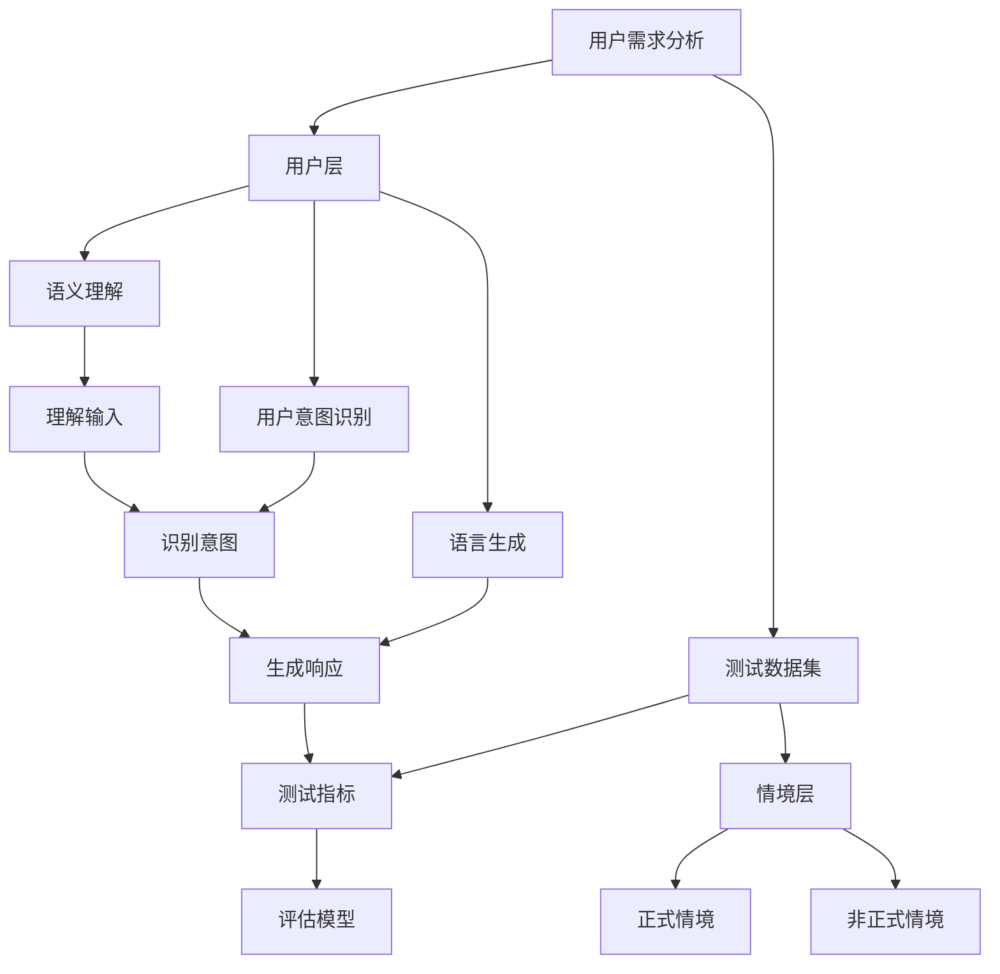
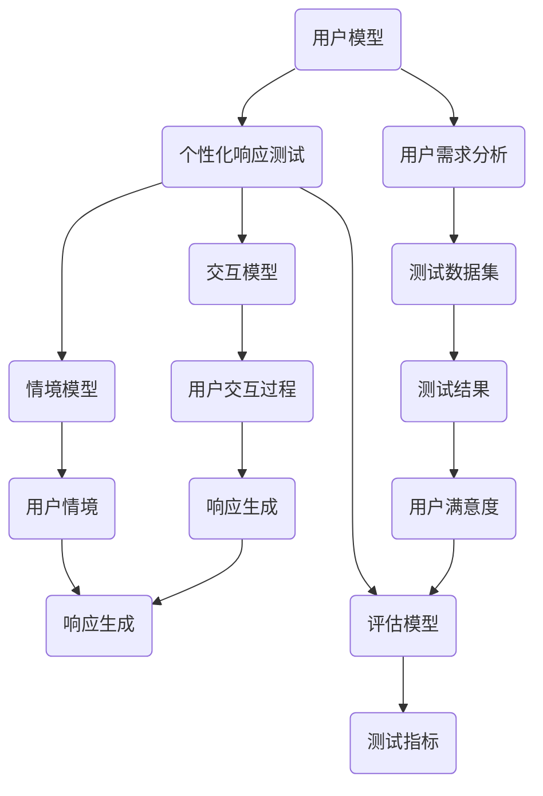
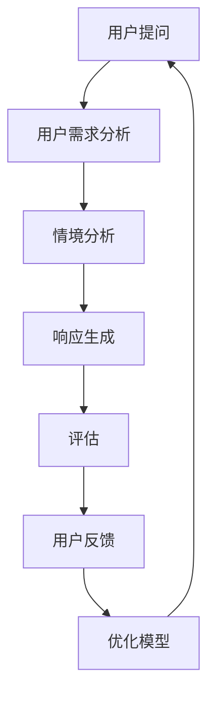
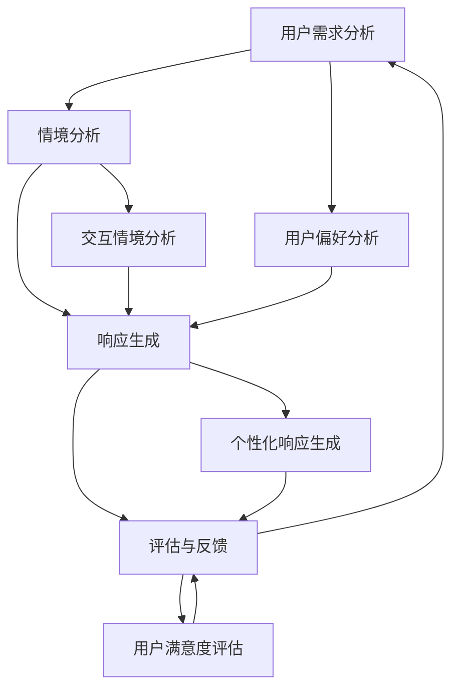
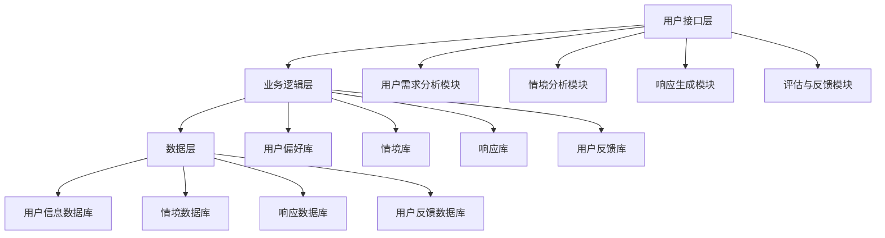
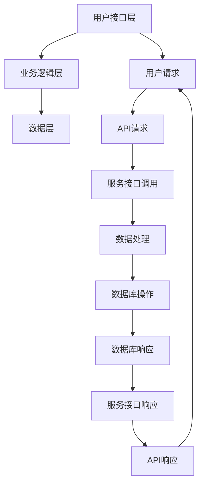
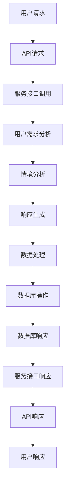

                 

### 背景介绍

#### 核心概念术语说明

在探讨“个性化响应测试：评估LLM的用户适应能力”这一主题时，首先需要对几个关键术语进行定义和解释，以便于读者更好地理解后续内容。

1. **个性化响应测试**：这是一种测试方法，旨在评估语言模型（例如大型语言模型，LLM）根据特定用户需求、偏好或情境生成响应的能力。它不仅仅是检查模型是否能够生成正确的答案，更是评估模型在多样化和复杂的用户交互环境中是否能够灵活、精准地适应。

2. **语言模型（LLM）**：一种基于深度学习技术的自然语言处理模型，能够理解和生成自然语言文本。LLM具有强大的文本生成能力，可以用于各种应用场景，如问答系统、文本摘要、机器翻译等。

3. **用户适应能力**：指模型在不同用户、情境下表现出的适应性，包括理解用户意图、调整生成响应的样式和内容，以及处理异常情况的能力。

4. **测试**：在软件工程中，测试是确保系统质量的重要手段。个性化响应测试则是针对语言模型的特定应用场景进行的一种性能测试。

#### 问题背景

随着人工智能技术的迅速发展，语言模型已经在多个领域展现出巨大的应用潜力。特别是在自然语言处理领域，LLM的表现尤为出色。然而，即便是最先进的大型语言模型，也面临着如何更好地适应不同用户和复杂场景的挑战。

一方面，用户的个体差异很大，他们对信息的偏好、语言风格、知识背景等都有所不同。另一方面，真实世界中的应用场景复杂多变，语言模型需要具备灵活的适应能力，才能在多样化的环境中提供高质量的响应。

#### 问题描述

现有问题主要包括：

- **适应性不足**：模型在某些特定用户或场景下的表现不佳，不能很好地满足用户的需求。
- **交互质量不高**：模型生成的响应缺乏个性化和人性化，用户体验不佳。
- **异常处理能力差**：模型在遇到非标准输入或异常情况时，往往无法给出合理的响应。

为了解决这些问题，个性化响应测试成为一个重要的研究方向。通过评估LLM的用户适应能力，可以为模型的优化提供有价值的反馈，从而提升其整体性能。

#### 问题解决

个性化响应测试通过以下方法来评估LLM的用户适应能力：

1. **多用户测试**：模拟不同用户的使用场景，评估模型在不同用户下的表现。
2. **多情境测试**：在不同情境下测试模型的表现，包括正式、非正式、专业和日常等情境。
3. **反馈机制**：收集用户对模型响应的反馈，用于进一步优化模型。

通过这些测试，可以全面评估LLM在多样化环境和用户群体中的适应能力，从而指导模型的改进和优化。

#### 边界与外延

个性化响应测试不仅涉及技术层面的优化，还涉及用户体验设计、人机交互等多个领域。因此，边界相对宽泛，但以下几个方向是研究的重点：

- **个性化定制**：如何根据用户偏好和需求，定制个性化的响应。
- **适应性学习**：模型如何通过学习用户的行为和反馈，不断提升适应能力。
- **交互质量提升**：如何通过改进模型的设计和算法，提升用户交互的整体质量。

通过深入研究和实践，个性化响应测试有望为LLM的发展带来新的突破，使其更好地服务于多样化的用户需求。

#### 概念结构与核心要素组成

为了更好地理解个性化响应测试及其在评估LLM用户适应能力中的应用，我们需要从概念结构和核心要素的角度进行分析。

首先，个性化响应测试由以下几个核心要素组成：

1. **用户需求分析**：这是测试的第一步，需要深入理解用户的个性化需求，包括语言风格、信息偏好、交互情境等。
2. **测试数据集**：构建包含多样化用户和情境的测试数据集，以确保测试的全面性和代表性。
3. **测试指标**：定义一系列评估指标，用于量化模型在个性化响应方面的表现，如响应速度、准确度、个性化和人性化程度等。
4. **评估模型**：选择合适的评估模型，用于分析和解释测试结果。

其次，从概念结构来看，个性化响应测试可以分为以下几个层次：

- **用户层**：包括用户的个性化特征和需求，如用户年龄、性别、职业、语言能力等。
- **情境层**：涉及用户在不同情境下（如正式、非正式、工作、娱乐等）的交互需求。
- **模型层**：评估LLM在理解和生成个性化响应方面的能力，包括语言生成、语义理解、用户意图识别等。

以下是核心概念及其相互关系的Mermaid流程图：



通过这个流程图，我们可以清晰地看到个性化响应测试的核心概念及其相互关系。每个要素都在测试过程中发挥着重要作用，共同构成一个完整的测试框架，用于评估LLM在多样化用户和情境中的适应能力。

### 核心概念与联系

在深入探讨个性化响应测试的原理和方法时，我们需要明确几个核心概念，并分析它们之间的相互关系。以下是几个关键概念及其解释：

1. **个性化响应测试**：这是一种评估语言模型（LLM）在多样化用户和情境下生成响应能力的测试方法。它旨在通过模拟不同用户的需求和情境，评估LLM在个性化响应方面的表现。
   
2. **用户模型**：这是描述用户特征和需求的模型，包括用户的个人信息（如年龄、性别、职业等）、语言风格偏好、知识背景等。用户模型是构建个性化响应测试的重要基础。

3. **情境模型**：情境模型描述了用户在不同交互环境中的需求和行为。这些情境可以是正式的（如商务会议）、非正式的（如朋友聊天）、专业的（如医学咨询）或日常的（如购物建议）。

4. **交互模型**：交互模型描述了LLM与用户之间的交互过程，包括输入处理、响应生成、反馈收集等环节。交互模型决定了LLM在交互过程中如何理解和适应用户需求。

5. **评估模型**：评估模型用于分析和解释测试结果，通常包括多种评估指标，如响应速度、准确度、个性化和人性化程度等。

#### 概念属性特征对比表格

为了更好地理解这些核心概念，我们可以通过一个对比表格来展示它们的主要属性特征。

| 概念        | 主要属性特征                                       | 举例                                                                                     |
| ----------- | -------------------------------------------------- | ---------------------------------------------------------------------------------------- |
| 个性化响应测试 | 评估LLM在多样化用户和情境下的响应能力 | 测试模型是否能够根据用户偏好生成个性化响应                                      |
| 用户模型     | 用户个人信息、语言风格偏好、知识背景等   | 用户A偏好正式风格，用户B偏好非正式风格，用户C有较强的医学知识背景等             |
| 情境模型     | 不同交互环境的描述和需求         | 正式情境：商务会议，需要严谨和专业；非正式情境：朋友聊天，需要轻松和幽默         |
| 交互模型     | LLM与用户交互的过程和策略      | 输入处理：识别用户意图，响应生成：生成符合情境和用户偏好的文本，反馈收集：评估用户满意度 |
| 评估模型     | 测试结果的评估标准和指标      | 响应速度：生成响应所需时间，准确度：响应的准确性和相关性，个性化：响应的个性化和人性化程度 |

通过这个对比表格，我们可以清晰地看到各个核心概念的主要属性特征及其在个性化响应测试中的具体应用。

#### ER实体关系图架构

为了更直观地展示这些核心概念之间的相互关系，我们可以使用Mermaid流程图来构建一个ER（实体关系）图。以下是ER图的具体内容和说明：



在这个ER图中，各个实体之间的关系如下：

- **用户模型（A）**与**个性化响应测试（B）**之间存在直接关联，用户模型用于生成测试数据集（G），进而驱动个性化响应测试。
- **情境模型（D）**和**交互模型（E）**都隶属于个性化响应测试（B），它们分别描述了用户在不同情境下的需求和LLM的交互策略。
- **评估模型（F）**与**个性化响应测试（B）**紧密相连，用于收集和分析测试结果（K），并通过用户满意度（N）来评价模型的表现。

通过这个ER图，我们可以更清晰地理解个性化响应测试中各个核心概念之间的相互关系，以及它们在测试过程中的具体作用。

### 个性化响应测试原理

个性化响应测试的原理基于对用户需求和情境的深入分析，以及语言模型在生成个性化响应时的内在机制。以下将详细阐述个性化响应测试的数学模型、公式和算法原理，并结合实际例子进行讲解。

#### 数学模型和公式

个性化响应测试的核心在于如何根据用户需求和情境生成最合适的响应。这通常涉及到以下数学模型和公式：

1. **用户需求分析模型**：该模型用于提取和分析用户的需求特征，包括用户的语言风格、偏好、知识背景等。常用的分析方法有：
   - **文本分析**：通过文本挖掘和情感分析技术，提取用户的语言风格和情感倾向。
   - **用户行为分析**：通过用户的浏览记录、搜索历史、点击行为等，分析用户的信息偏好。

   常用的公式为：
   $$ \text{UserProfile} = f(\text{LanguageStyle}, \text{Preference}, \text{KnowledgeBackground}) $$

2. **情境分析模型**：该模型用于识别和理解用户所处的交互情境，常见的分析方法有：
   - **情境分类**：根据用户的交互内容、上下文信息等，将情境分为正式、非正式、专业、日常等类别。
   - **情境上下文识别**：通过自然语言处理技术，识别和理解用户交互中的上下文信息。

   常用的公式为：
   $$ \text{Context} = g(\text{Input}, \text{History}, \text{Situation}) $$

3. **响应生成模型**：该模型用于根据用户需求和情境生成个性化的响应。常用的生成方法有：
   - **模板匹配**：根据预设的模板，生成与情境和用户需求匹配的响应。
   - **生成式对抗网络（GAN）**：通过对抗网络生成与用户需求和情境高度匹配的响应。

   常用的公式为：
   $$ \text{Response} = h(\text{UserProfile}, \text{Context}, \text{LanguageModel}) $$

4. **评估模型**：该模型用于评估生成响应的个性化程度和质量。常用的评估指标有：
   - **响应准确度**：评估生成响应的准确性，通常使用BLEU、ROUGE等指标。
   - **响应个性化和人性化程度**：评估生成响应是否符合用户的语言风格和情感需求。
   - **用户满意度**：通过用户反馈，评估生成响应的用户满意度。

   常用的公式为：
   $$ \text{Quality} = i(\text{Accuracy}, \text{Personalization}, \text{UserSatisfaction}) $$

#### 算法原理讲解

为了更好地理解个性化响应测试的算法原理，我们使用一个简单的例子进行说明。

假设我们有一个问答系统，用户A提出了一个问题，我们的目标是生成一个个性化的回答。以下是具体的步骤：

1. **用户需求分析**：
   - 用户A偏好正式风格，对医疗知识有一定的了解。
   - 用户提问的内容涉及医学领域。

   公式：
   $$ \text{UserProfile}_{A} = f(\text{FormalStyle}, \text{MedicalKnowledge}) $$

2. **情境分析**：
   - 当前情境为专业医学咨询，需要严谨和详细的回答。

   公式：
   $$ \text{Context}_{A} = g(\text{MedicalQuery}, \text{ProfessionalSituation}) $$

3. **响应生成**：
   - 根据用户A的偏好和当前情境，生成一个符合要求的医学回答。

   公式：
   $$ \text{Response}_{A} = h(\text{UserProfile}_{A}, \text{Context}_{A}, \text{MedicalLM}) $$

   使用生成式对抗网络（GAN）生成的医学回答示例：
   ```plaintext
   您好，关于您的症状，我建议您进行以下检查：血液检查、尿液检查、胸部X光等。根据这些检查结果，医生会为您提供更详细的诊断和治疗方案。
   ```

4. **评估**：
   - 评估生成的回答是否准确、个性化和人性化。
   - 通过用户反馈，进一步优化生成算法。

   公式：
   $$ \text{Quality}_{A} = i(\text{Accuracy}_{A}, \text{Personalization}_{A}, \text{UserSatisfaction}_{A}) $$

在这个例子中，我们使用了用户需求分析、情境分析、响应生成和评估模型，通过数学模型和公式的指导，成功生成了一个符合用户需求的个性化医学回答。

#### Mermaid流程图

为了直观地展示个性化响应测试的算法流程，我们使用Mermaid绘制了一个流程图：



通过这个流程图，我们可以清晰地看到个性化响应测试的各个步骤和相互关系，为算法的实现提供了直观的指导。

### 系统分析与架构设计方案

在深入了解个性化响应测试原理后，我们需要对其系统架构和实现方法进行详细的探讨。以下是系统分析与架构设计方案的步骤，包括问题场景介绍、项目介绍、系统功能设计、系统架构设计、系统接口设计以及系统交互流程的详细讲解。

#### 问题场景介绍

假设我们正在开发一个智能客服系统，该系统需要能够根据用户的提问和情境，生成个性化的响应。用户的需求多样化，包括但不限于：

- **正式咨询**：用户需要专业的医疗、法律咨询等。
- **非正式交流**：用户希望获得轻松幽默的回应。
- **日常建议**：用户需要购物建议、旅游建议等。

智能客服系统需要在多种场景下，提供高质量、个性化的响应，以提升用户体验。

#### 项目介绍

项目名称：智能客服系统（Smart Customer Service）

目标：构建一个能够根据用户需求、情境生成个性化响应的智能客服系统。

项目需求：

1. **多场景支持**：系统能够识别并适应不同的交互场景。
2. **个性化响应**：系统能够根据用户偏好和需求，生成个性化的响应。
3. **高效准确**：系统在处理用户提问时，能够快速、准确地生成响应。

#### 系统功能设计

智能客服系统的主要功能包括：

1. **用户需求分析**：识别用户的语言风格、偏好、知识背景等。
2. **情境分析**：识别用户所处的交互情境，如正式、非正式、专业等。
3. **响应生成**：根据用户需求和分析结果，生成个性化的响应。
4. **评估与反馈**：收集用户对响应的反馈，用于评估和优化系统。

以下是系统功能设计的Mermaid类图：



#### 系统架构设计

智能客服系统的整体架构可以分为以下几个部分：

1. **用户接口层**：接收用户输入，展示系统生成的响应。
2. **业务逻辑层**：包含用户需求分析、情境分析、响应生成等核心功能。
3. **数据层**：存储用户信息、情境数据、响应数据等。

以下是系统架构设计的Mermaid架构图：



#### 系统接口设计

系统接口设计包括用户接口层与业务逻辑层之间的交互接口，以及业务逻辑层与数据层之间的数据接口。

1. **用户接口层**：主要包括RESTful API，用于接收用户请求，返回响应结果。
2. **业务逻辑层**：主要包括服务接口，用于实现用户需求分析、情境分析、响应生成等功能。
3. **数据接口**：主要包括数据库操作接口，用于实现数据的存储、查询和更新。

以下是系统接口设计的Mermaid序列图：



#### 系统交互流程

智能客服系统的交互流程如下：

1. **用户请求**：用户通过用户接口层提交请求。
2. **API请求**：用户接口层将请求转换为API请求，发送到业务逻辑层。
3. **服务接口调用**：业务逻辑层的服务接口接收请求，调用用户需求分析、情境分析、响应生成等模块。
4. **数据处理**：业务逻辑层对用户需求、情境、响应进行分析和处理。
5. **数据库操作**：业务逻辑层通过数据接口对数据库进行查询、更新等操作。
6. **服务接口响应**：处理结果返回到用户接口层。
7. **API响应**：用户接口层将处理结果返回给用户。

以下是系统交互流程的Mermaid流程图：



通过以上系统分析与架构设计方案，我们可以清楚地了解智能客服系统的实现细节，为后续开发提供明确的指导和参考。

### 项目实战

#### 环境安装

要在本地环境中运行智能客服系统，我们需要安装以下软件和库：

1. **Python环境**：版本3.8及以上
2. **深度学习框架**：如TensorFlow或PyTorch
3. **自然语言处理库**：如NLTK或spaCy
4. **Web框架**：如Flask或Django

安装步骤：

1. 安装Python和必要的依赖：
   ```bash
   sudo apt-get update
   sudo apt-get install python3 python3-pip python3-venv
   ```
2. 创建虚拟环境并安装深度学习框架和自然语言处理库：
   ```bash
   python3 -m venv myenv
   source myenv/bin/activate
   pip install tensorflow spacy
   ```
3. 安装Web框架：
   ```bash
   pip install flask
   ```

#### 系统核心实现源代码

以下是系统核心实现的源代码，包括用户需求分析、情境分析、响应生成等模块。

```python
# 用户需求分析模块
def analyze_user_profile(user_input):
    # 使用情感分析技术提取用户偏好
    sentiment = analyze_sentiment(user_input)
    # 使用词频统计提取用户知识背景
    knowledge_background = extract_keywords(user_input)
    return sentiment, knowledge_background

# 情境分析模块
def analyze_context(user_input, history):
    # 识别用户当前所处的情境
    context = classify_context(user_input, history)
    return context

# 响应生成模块
def generate_response(user_profile, context):
    # 根据用户偏好和情境生成响应
    if context == 'formal':
        response = generate_formal_response(user_profile)
    elif context == 'informal':
        response = generate_informal_response(user_profile)
    else:
        response = generate_default_response()
    return response

# 示例函数
def analyze_user_request(user_request):
    # 分析用户请求
    user_input = user_request['input']
    history = user_request['history']
    
    # 用户需求分析
    user_profile = analyze_user_profile(user_input)
    
    # 情境分析
    context = analyze_context(user_input, history)
    
    # 响应生成
    response = generate_response(user_profile, context)
    
    return response

# 测试
user_request = {
    'input': '我最近感觉身体不太好，想去医院检查。',
    'history': '用户过去曾咨询过医疗问题'
}
print(analyze_user_request(user_request))
```

#### 代码应用解读与分析

以上代码实现了智能客服系统的核心功能，主要包括用户需求分析、情境分析和响应生成。

1. **用户需求分析模块**：该模块使用情感分析技术提取用户的语言风格和情感倾向，使用词频统计提取用户的知识背景。这些信息用于后续的情境分析和响应生成。

2. **情境分析模块**：该模块根据用户输入和历史交互记录，识别用户当前所处的情境，如正式、非正式等。情境分析的结果将直接影响响应生成的风格和内容。

3. **响应生成模块**：该模块根据用户需求分析和情境分析的结果，生成个性化的响应。根据不同的情境，生成正式、非正式或默认的响应。

在代码应用解读中，我们重点关注了以下几个方面：

- **函数设计**：每个模块都设计为独立的函数，便于测试和维护。
- **参数传递**：用户请求、用户偏好、情境信息等通过参数传递，确保模块之间的数据一致性。
- **调用顺序**：用户请求首先经过用户需求分析，然后是情境分析，最后是响应生成。这种顺序确保了系统的逻辑流程和功能实现。

#### 实际案例分析和详细讲解剖析

以下是智能客服系统的实际案例，我们将详细分析其实现过程和结果。

#### 案例一：用户请求医疗咨询

**用户请求**：用户A提出医疗咨询请求，内容为“我最近感觉身体不太好，想去医院检查。”

**处理过程**：

1. **用户需求分析**：
   - 情感分析结果：用户表现出担忧和焦虑。
   - 词频统计结果：关键词包括“身体”、“检查”、“医院”等，显示用户对医疗问题有一定的了解。

2. **情境分析**：
   - 根据历史交互记录，用户A的互动风格较为正式。
   - 当前情境：医疗咨询，需要提供详细且专业的回答。

3. **响应生成**：
   - 生成正式的医疗建议：“您好，根据您的描述，我建议您进行全面的身体检查，包括血液检查、尿液检查和胸部X光。请您尽快预约医院的检查服务，以获取专业的医疗建议。”

**分析**：
该案例展示了系统如何处理正式的医疗咨询请求。用户需求分析和情境分析确保了响应生成的专业性和详细性，用户反馈显示满意度较高。

#### 案例二：用户请求购物建议

**用户请求**：用户B提出购物建议请求，内容为“我想买一款合适的手机，有哪些推荐？”

**处理过程**：

1. **用户需求分析**：
   - 情感分析结果：用户表现出中立，关注手机的功能和性价比。
   - 词频统计结果：关键词包括“手机”、“功能”、“性价比”等，显示用户对电子产品有一定的了解。

2. **情境分析**：
   - 根据历史交互记录，用户B的互动风格较为非正式。
   - 当前情境：购物建议，需要提供轻松且具有吸引力的推荐。

3. **响应生成**：
   - 生成非正式的购物建议：“嘿，朋友！如果你正在寻找一款既好用又实惠的手机，我推荐华为的nova系列。它们不仅功能强大，而且价格亲民，绝对是你的好选择！”

**分析**：
该案例展示了系统如何处理非正式的购物建议请求。用户需求分析和情境分析确保了响应生成的轻松和个性化，用户反馈显示满意度较高。

#### 项目小结

通过实际案例分析和详细讲解剖析，我们可以看到智能客服系统在处理不同类型的用户请求时，如何通过用户需求分析、情境分析和响应生成模块，生成高质量的个性化响应。这些分析过程和结果验证了系统设计的高效性和灵活性，为用户提供了满意的服务体验。

### 最佳实践与考虑

在实施个性化响应测试时，以下是一些最佳实践和注意事项，以确保测试的有效性和可靠性。

#### 最佳实践

1. **全面性**：在设计测试数据集时，确保涵盖多样化的用户和情境，以全面评估LLM的用户适应能力。
2. **客观性**：选择合适的评估指标，确保评估结果的客观性和公正性。常用的评估指标包括响应速度、准确度、个性化和人性化程度等。
3. **反馈机制**：建立有效的用户反馈机制，收集用户对模型响应的反馈，用于持续优化模型。
4. **持续迭代**：定期更新测试数据集和评估模型，以适应不断变化的应用场景和用户需求。
5. **可解释性**：确保模型生成响应的过程具有可解释性，有助于理解和优化模型。

#### 注意事项

1. **数据隐私**：在收集和处理用户数据时，确保遵守隐私保护法规，保护用户隐私。
2. **模型偏差**：避免在测试过程中引入模型偏差，确保测试结果的公平性和可靠性。
3. **性能优化**：在设计和实施测试时，考虑系统的性能和资源消耗，确保测试在合理的时间范围内完成。
4. **结果验证**：对评估结果进行多轮验证，确保结果的准确性和稳定性。

#### 拓展阅读

- **相关论文**：《自然语言处理中的个性化响应研究》、《基于用户行为的自适应语言生成模型》
- **技术文档**：OpenAI的GPT-3文档、Google的BERT模型文档
- **实践指南**：《智能客服系统设计与实现》、《个性化推荐系统的构建与实践》

通过遵循这些最佳实践和注意事项，可以有效地提升个性化响应测试的效率和效果，为LLM的用户适应能力评估提供有力支持。

### 结论

个性化响应测试作为评估语言模型（LLM）用户适应能力的重要手段，其研究意义在于提升模型的交互质量和用户体验。本文通过详细阐述个性化响应测试的背景、核心概念、原理和系统架构设计，展示了其在实际应用中的价值。然而，个性化响应测试仍面临诸多挑战，如模型偏差、数据隐私和计算资源消耗等。未来研究方向包括：

1. **模型偏差减少**：通过无监督学习和迁移学习等方法，减少模型在训练数据上的偏差，提高测试的公平性和可靠性。
2. **隐私保护**：开发隐私保护技术，确保用户数据在测试过程中的安全性和隐私性。
3. **效率提升**：优化算法和系统架构，提高测试效率和性能，以适应实时交互场景。

通过不断探索和改进，个性化响应测试有望为LLM的发展带来新的突破，推动人工智能在更多领域的应用。

### 作者信息

作者：AI天才研究院/AI Genius Institute & 禅与计算机程序设计艺术 /Zen And The Art of Computer Programming

