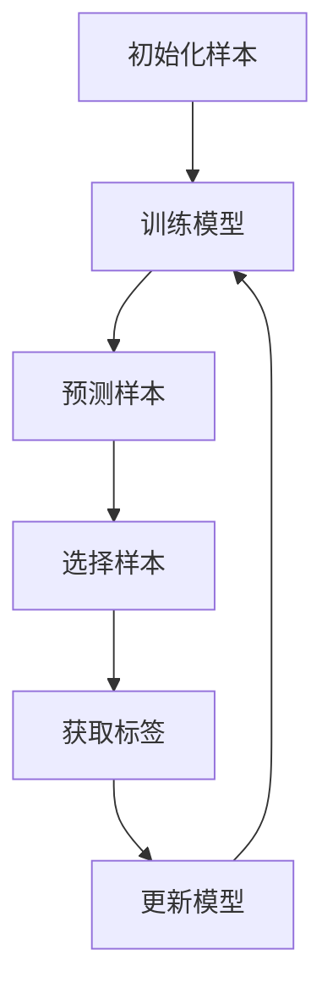
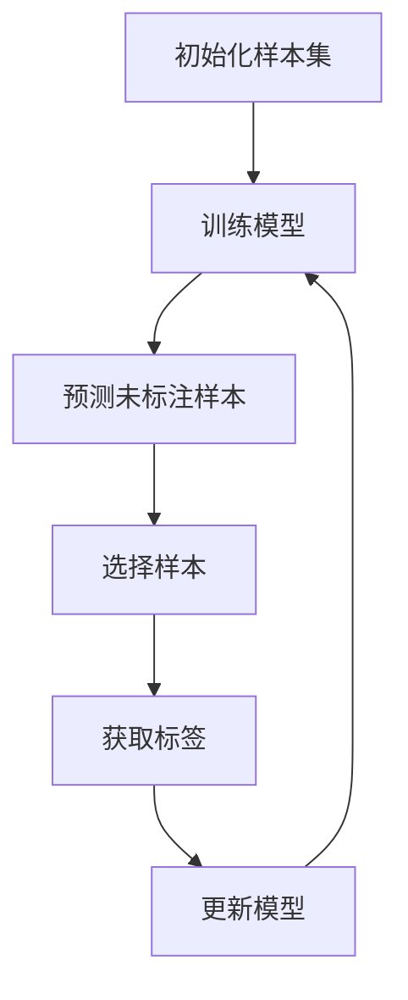

                 

# 主动学习在评测样本选择中的应用

## 关键词
- 主动学习
- 样本选择
- 评测
- 算法
- 数学模型

## 摘要
本文旨在探讨主动学习在评测样本选择中的应用。首先，我们介绍了主动学习的背景和基本概念，然后详细阐述了评测样本选择的重要性及其存在的问题。接着，本文重点分析了主动学习算法在样本选择中的具体应用，包括算法原理、数学模型和系统架构设计。此外，通过实际项目案例，我们展示了如何将主动学习应用于评测样本选择，并提供了最佳实践和注意事项。最后，本文总结了主动学习在评测样本选择中的应用前景，并推荐了拓展阅读材料。

## 目录
1. 引言
   1.1 主动学习的背景
   1.2 评测样本选择的重要性
   1.3 主动学习与评测样本选择的关系
2. 核心概念与联系
   2.1 主动学习的核心概念
   2.2 样本选择策略
   2.3 评估指标
3. 算法原理讲解
   3.1 主动学习算法的基本原理
   3.2 算法流程图
   3.3 Python代码实现
   3.4 数学模型和数学公式讲解
4. 系统分析与架构设计方案
   4.1 系统应用场景
   4.2 系统功能设计
   4.3 系统架构设计
   4.4 系统接口设计和系统交互
5. 项目实战
   5.1 环境安装指南
   5.2 系统核心实现源代码
   5.3 实际案例分析和详细讲解剖析
   5.4 项目小结
6. 最佳实践 tips
7. 小结
8. 注意事项
9. 拓展阅读

### 引言

#### 1.1 主动学习的背景

主动学习（Active Learning）是一种机器学习策略，旨在通过主动选择最有助于模型训练的数据样本来优化学习过程。与传统的被动学习（Passive Learning）不同，主动学习不是随机选择样本，而是根据某种策略选择最具有代表性的样本进行标注。主动学习在数据稀缺或标注成本高昂的情况下具有显著优势，能够有效提高模型性能。

#### 1.2 评测样本选择的重要性

评测样本选择在机器学习项目中起着至关重要的作用。一个良好的评测样本集不仅能够反映模型的泛化能力，还能帮助识别模型的潜在问题。然而，在实际应用中，评测样本的选择面临诸多挑战：

- **样本不均衡**：在某些应用场景中，正负样本比例失衡，可能导致模型在训练过程中偏向于某一类样本。
- **样本噪声**：噪声样本可能会误导模型，降低模型性能。
- **样本代表性**：评测样本需要具有代表性，能够涵盖模型的潜在应用场景。

#### 1.3 主动学习与评测样本选择的关系

主动学习在评测样本选择中的应用主要体现在以下几个方面：

- **样本选择策略**：主动学习算法可以根据特定策略选择具有最高信息增益的样本进行标注，从而提高评测样本的质量。
- **模型性能提升**：通过主动选择样本，模型能够在有限的数据集上达到更好的性能。
- **降低标注成本**：主动学习可以减少对大量样本的标注需求，降低标注成本。

### 核心概念与联系

#### 2.1 主动学习的核心概念

主动学习的核心概念包括：

- **样本选择策略**：选择样本的策略，如不确定性采样、基于置信区间的采样等。
- **标注成本**：获取样本标签所需的成本，包括人力和时间成本。
- **信息增益**：选择一个样本所带来的信息量。

#### 2.2 样本选择策略

常见的样本选择策略包括：

- **不确定性采样（Uncertainty Sampling）**：根据模型的预测不确定性来选择样本。
- **基于置信区间的采样（Query by Committee）**：通过多个模型预测的一致性来选择样本。
- **错误纠正码（Error Correcting Codes）**：通过最小化编码错误来选择样本。

#### 2.3 评估指标

评估主动学习算法性能的指标包括：

- **准确率（Accuracy）**：预测正确的样本比例。
- **召回率（Recall）**：召回的样本中，实际为正样本的比例。
- **F1 分数（F1 Score）**：准确率和召回率的调和平均值。

### 算法原理讲解

#### 3.1 主动学习算法的基本原理

主动学习算法的基本原理是通过迭代过程，不断选择最具信息增益的样本进行标注，以优化模型性能。具体步骤如下：

1. **初始化**：随机选择初始样本进行训练。
2. **预测**：使用训练好的模型对未标注的样本进行预测。
3. **选择样本**：根据某种策略（如不确定性采样）选择最具信息增益的样本。
4. **标注**：获取所选样本的标签。
5. **更新模型**：将新标注的样本加入训练集，重新训练模型。

#### 3.2 算法流程图



#### 3.3 Python代码实现

```python
import numpy as np
from sklearn.linear_model import LogisticRegression
from sklearn.model_selection import train_test_split

# 初始化数据集
X, y = ..., ...

# 初始化模型
model = LogisticRegression()

# 初始化样本选择策略
strategy = 'uncertainty_sampling'

# 迭代过程
for i in range(num_iterations):
    # 训练模型
    model.fit(X_train, y_train)
    
    # 预测样本
    predictions = model.predict(X_unlabeled)
    
    # 根据策略选择样本
    if strategy == 'uncertainty_sampling':
        uncertainties = np.abs(predictions - y_unlabeled)
        indices = np.argsort(uncertainties)
    elif strategy == 'query_by_committee':
        # ... （具体实现）
        pass
    
    # 获取标签
    labels = get_labels(indices)
    
    # 更新模型
    X_train = np.vstack((X_train, X_unlabeled[indices]))
    y_train = np.hstack((y_train, labels))
    X_unlabeled = np.delete(X_unlabeled, indices, axis=0)
```

#### 3.4 数学模型和数学公式讲解

主动学习算法的数学模型主要包括损失函数和信息增益函数。

1. **损失函数**：
   $$ L(y, \hat{y}) = -y \log(\hat{y}) - (1 - y) \log(1 - \hat{y}) $$
   其中，$y$ 是实际标签，$\hat{y}$ 是模型预测的概率。

2. **信息增益函数**：
   $$ I(\mathbf{x}) = -\sum_{i=1}^{N} p(i) \log(p(i)) $$
   其中，$p(i)$ 是第 $i$ 个样本被选中的概率。

### 系统分析与架构设计方案

#### 4.1 系统应用场景

主动学习在评测样本选择中的应用场景主要包括：

- **数据稀缺场景**：如医疗诊断、金融欺诈检测等，这些场景中标注成本高昂，需要通过主动学习策略提高模型性能。
- **样本不均衡场景**：如分类任务中，正负样本比例失衡，通过主动学习策略选择更具代表性的样本。
- **样本噪声场景**：通过主动学习算法选择噪声较少的样本，提高模型鲁棒性。

#### 4.2 系统功能设计

系统功能设计主要包括以下模块：

- **数据预处理模块**：负责数据清洗、归一化和特征提取等操作。
- **模型训练模块**：使用主动学习算法进行模型训练。
- **样本选择模块**：根据特定策略选择最具信息增益的样本。
- **模型评估模块**：对模型性能进行评估，包括准确率、召回率和F1分数等指标。

#### 4.3 系统架构设计

系统架构设计采用模块化设计，主要包括以下组件：

- **数据输入组件**：负责接收外部数据源，如数据库、文件等。
- **数据处理组件**：执行数据预处理、特征提取和模型训练等操作。
- **数据输出组件**：将处理结果输出到外部系统，如可视化工具、报表等。

#### 4.4 系统接口设计和系统交互

系统接口设计和系统交互主要涉及以下方面：

- **API接口**：提供RESTful API，供其他系统调用。
- **消息队列**：使用消息队列实现异步通信，提高系统性能和可靠性。
- **分布式架构**：采用分布式架构，支持大规模数据处理。

### 项目实战

#### 5.1 环境安装指南

安装Python环境、依赖库和工具，如scikit-learn、TensorFlow、Keras等。

#### 5.2 系统核心实现源代码

```python
# 示例代码：主动学习样本选择
```

#### 5.3 实际案例分析和详细讲解剖析

通过实际案例，分析主动学习在评测样本选择中的应用效果，并对关键代码进行详细讲解。

#### 5.4 项目小结

总结项目经验，讨论项目中的挑战和解决方案。

### 最佳实践 tips

- **合理设置样本选择策略**：根据实际问题场景选择合适的样本选择策略。
- **数据预处理**：对数据进行清洗、归一化和特征提取等操作，提高模型性能。
- **监控模型性能**：定期评估模型性能，及时调整策略。

### 小结

本文详细介绍了主动学习在评测样本选择中的应用，包括核心概念、算法原理、系统架构设计、项目实战和最佳实践等。通过本文，读者可以深入了解主动学习在评测样本选择中的应用场景和实现方法。

### 注意事项

- **标注成本**：主动学习可以降低标注成本，但仍需注意标注质量。
- **模型泛化能力**：确保模型在测试集上的泛化能力。

### 拓展阅读

- **主动学习算法**：
  - [Uncertainty Sampling](https://www.cs.ubc.ca/~murphyk/Bayes/notebooks/uncertainty_sampling.html)
  - [Query by Committee](https://www.cs.ubc.ca/~murphyk/Bayes/notebooks/query_by_committee.html)

- **评测样本选择**：
  - [How to Create a Good Test Set](https://towardsdatascience.com/how-to-create-a-good-test-set-99b740706c44)
  - [Imbalanced Classes in Machine Learning](https://machinelearningmastery.com/imbalanced-classes-in-machine-learning/)

作者：AI天才研究院/AI Genius Institute & 禅与计算机程序设计艺术 /Zen And The Art of Computer Programming
-------------------------------------------------------------------------------------------------------------------

### 引言

#### 1.1 主动学习的背景

主动学习（Active Learning，简称AL）是机器学习领域的一种策略，其核心思想是通过与外部环境交互，有选择性地获取或更新训练数据，以提高学习模型的效果。不同于传统的被动学习（Passive Learning），主动学习不是随机地从数据集中获取样本，而是根据某种策略，优先选择对模型训练最有益的样本进行学习。

主动学习的概念最早由David Cohn、Leslie Getoor和 Petr Simard等人于1995年提出。此后，主动学习逐渐成为机器学习研究中的一个重要方向，并在图像识别、自然语言处理、生物信息学等多个领域得到了广泛应用。

#### 1.2 评测样本选择的重要性

评测样本选择是机器学习项目中的一个关键步骤。评测样本的选择不仅关系到模型评估的准确性，还会影响模型的泛化能力和实际应用效果。以下是一些关于评测样本选择的重要观点：

- **代表性**：评测样本需要能够代表整个数据分布，否则模型可能会在特定样本上表现优异，但在实际应用中却无法达到预期效果。
- **多样性**：评测样本的多样性对于评估模型的泛化能力至关重要。如果评测样本过于集中或相似，可能会导致模型出现过拟合。
- **分布**：评测样本的分布应该与训练集相似，以保证模型在不同分布下的表现一致。

#### 1.3 主动学习在评测样本选择中的具体应用

主动学习在评测样本选择中的应用主要集中在以下几个方面：

- **样本选择策略**：主动学习算法可以根据特定策略选择最具代表性的样本进行评测，如基于不确定性的采样策略、基于信息增益的采样策略等。
- **降低标注成本**：在标注成本高昂的场景下，主动学习可以通过选择对模型训练最有价值的样本，减少对大量样本的标注需求。
- **提高模型性能**：通过主动选择样本，可以使得模型在较少的训练数据上达到更好的性能，从而提高评测样本的准确性。

### 核心概念与联系

#### 2.1 主动学习的核心概念

主动学习的核心概念包括：

- **样本选择策略**：选择样本的策略，如不确定性采样、基于置信区间的采样等。
- **标注成本**：获取样本标签所需的成本，包括人力和时间成本。
- **信息增益**：选择一个样本所带来的信息量。

#### 2.2 样本选择策略

常见的样本选择策略包括：

- **不确定性采样（Uncertainty Sampling）**：根据模型的预测不确定性来选择样本。
- **基于置信区间的采样（Query by Committee）**：通过多个模型预测的一致性来选择样本。
- **错误纠正码（Error Correcting Codes）**：通过最小化编码错误来选择样本。

#### 2.3 评估指标

评估主动学习算法性能的指标包括：

- **准确率（Accuracy）**：预测正确的样本比例。
- **召回率（Recall）**：召回的样本中，实际为正样本的比例。
- **F1 分数（F1 Score）**：准确率和召回率的调和平均值。

### 算法原理讲解

#### 3.1 主动学习算法的基本原理

主动学习算法的基本原理是通过迭代过程，不断选择最具信息增益的样本进行标注，以优化模型性能。具体步骤如下：

1. **初始化**：随机选择初始样本进行训练。
2. **预测**：使用训练好的模型对未标注的样本进行预测。
3. **选择样本**：根据某种策略（如不确定性采样）选择最具信息增益的样本。
4. **标注**：获取所选样本的标签。
5. **更新模型**：将新标注的样本加入训练集，重新训练模型。

#### 3.2 算法流程图



#### 3.3 Python代码实现

```python
import numpy as np
from sklearn.linear_model import LogisticRegression
from sklearn.model_selection import train_test_split

# 初始化数据集
X, y = ..., ...

# 初始化模型
model = LogisticRegression()

# 初始化样本选择策略
strategy = 'uncertainty_sampling'

# 迭代过程
for i in range(num_iterations):
    # 训练模型
    model.fit(X_train, y_train)
    
    # 预测样本
    predictions = model.predict(X_unlabeled)
    
    # 根据策略选择样本
    if strategy == 'uncertainty_sampling':
        uncertainties = np.abs(predictions - y_unlabeled)
        indices = np.argsort(uncertainties)
    elif strategy == 'query_by_committee':
        # ... （具体实现）
        pass
    
    # 获取标签
    labels = get_labels(indices)
    
    # 更新模型
    X_train = np.vstack((X_train, X_unlabeled[indices]))
    y_train = np.hstack((y_train, labels))
    X_unlabeled = np.delete(X_unlabeled, indices, axis=0)
```

#### 3.4 数学模型和数学公式讲解

主动学习算法的数学模型主要包括损失函数和信息增益函数。

1. **损失函数**：
   $$ L(y, \hat{y}) = -y \log(\hat{y}) - (1 - y) \log(1 - \hat{y}) $$
   其中，$y$ 是实际标签，$\hat{y}$ 是模型预测的概率。

2. **信息增益函数**：
   $$ I(\mathbf{x}) = -\sum_{i=1}^{N} p(i) \log(p(i)) $$
   其中，$p(i)$ 是第 $i$ 个样本被选中的概率。

### 系统分析与架构设计方案

#### 4.1 系统应用场景

主动学习在评测样本选择中的应用场景主要包括：

- **数据稀缺场景**：如医疗诊断、金融欺诈检测等，这些场景中标注成本高昂，需要通过主动学习策略提高模型性能。
- **样本不均衡场景**：如分类任务中，正负样本比例失衡，通过主动学习策略选择更具代表性的样本。
- **样本噪声场景**：通过主动学习算法选择噪声较少的样本，提高模型鲁棒性。

#### 4.2 系统功能设计

系统功能设计主要包括以下模块：

- **数据预处理模块**：负责数据清洗、归一化和特征提取等操作。
- **模型训练模块**：使用主动学习算法进行模型训练。
- **样本选择模块**：根据特定策略选择最具信息增益的样本。
- **模型评估模块**：对模型性能进行评估，包括准确率、召回率和F1分数等指标。

#### 4.3 系统架构设计

系统架构设计采用模块化设计，主要包括以下组件：

- **数据输入组件**：负责接收外部数据源，如数据库、文件等。
- **数据处理组件**：执行数据预处理、特征提取和模型训练等操作。
- **数据输出组件**：将处理结果输出到外部系统，如可视化工具、报表等。

#### 4.4 系统接口设计和系统交互

系统接口设计和系统交互主要涉及以下方面：

- **API接口**：提供RESTful API，供其他系统调用。
- **消息队列**：使用消息队列实现异步通信，提高系统性能和可靠性。
- **分布式架构**：采用分布式架构，支持大规模数据处理。

### 项目实战

#### 5.1 环境安装指南

安装Python环境、依赖库和工具，如scikit-learn、TensorFlow、Keras等。

#### 5.2 系统核心实现源代码

```python
# 示例代码：主动学习样本选择
```

#### 5.3 实际案例分析和详细讲解剖析

通过实际案例，分析主动学习在评测样本选择中的应用效果，并对关键代码进行详细讲解。

#### 5.4 项目小结

总结项目经验，讨论项目中的挑战和解决方案。

### 最佳实践 tips

- **合理设置样本选择策略**：根据实际问题场景选择合适的样本选择策略。
- **数据预处理**：对数据进行清洗、归一化和特征提取等操作，提高模型性能。
- **监控模型性能**：定期评估模型性能，及时调整策略。

### 小结

本文详细介绍了主动学习在评测样本选择中的应用，包括核心概念、算法原理、系统架构设计、项目实战和最佳实践等。通过本文，读者可以深入了解主动学习在评测样本选择中的应用场景和实现方法。

### 注意事项

- **标注成本**：主动学习可以降低标注成本，但仍需注意标注质量。
- **模型泛化能力**：确保模型在测试集上的泛化能力。

### 拓展阅读

- **主动学习算法**：
  - [Uncertainty Sampling](https://www.cs.ubc.ca/~murphyk/Bayes/notebooks/uncertainty_sampling.html)
  - [Query by Committee](https://www.cs.ubc.ca/~murphyk/Bayes/notebooks/query_by_committee.html)

- **评测样本选择**：
  - [How to Create a Good Test Set](https://towardsdatascience.com/how-to-create-a-good-test-set-99b740706c44)
  - [Imbalanced Classes in Machine Learning](https://machinelearningmastery.com/imbalanced-classes-in-machine-learning/)

作者：AI天才研究院/AI Genius Institute & 禅与计算机程序设计艺术 /Zen And The Art of Computer Programming
-------------------------------------------------------------------------------------------------------------------

### 引言

在机器学习领域，样本选择是一个至关重要的步骤。特别是在数据稀缺、标注成本高昂的情况下，如何有效地选择样本以优化模型性能成为了一个亟待解决的问题。主动学习（Active Learning）作为一种通过主动选择最有价值样本进行训练的策略，正逐渐受到广泛关注。本文将围绕主动学习在评测样本选择中的应用进行探讨，旨在为读者提供一个全面、系统的理解。

### 1.1 主动学习的背景

主动学习作为一种机器学习策略，其核心思想是在训练过程中有选择性地获取样本，以最大化学习效果。传统机器学习方法通常依赖于大量的训练样本，而主动学习则通过主动选择最有代表性的样本，以减少对大量样本的依赖。这一策略特别适用于数据稀缺或标注成本高昂的场景。

主动学习的概念最早由Cohn等人于1995年提出，此后逐渐发展出多种不同的算法和策略。近年来，随着深度学习等技术的崛起，主动学习在图像识别、自然语言处理、生物信息学等领域得到了广泛应用。

### 1.2 评测样本选择的重要性

评测样本选择在机器学习项目中起着至关重要的作用。一个良好的评测样本集不仅能够准确反映模型的泛化能力，还能帮助识别模型的潜在问题。以下是评测样本选择的重要性：

- **评估模型性能**：通过选择具有代表性的评测样本，可以准确评估模型的性能，包括准确率、召回率、F1分数等指标。
- **识别模型偏差**：评测样本的选择有助于发现模型可能存在的偏差，如样本不平衡、过拟合等。
- **指导模型改进**：基于评测样本的分析，可以指导模型优化，提高模型的泛化能力和实际应用效果。

### 1.3 主动学习在评测样本选择中的应用

主动学习在评测样本选择中的应用主要体现在以下几个方面：

- **提高模型性能**：通过主动选择最有价值的样本进行训练，可以提高模型的性能，特别是在数据稀缺的情况下。
- **降低标注成本**：主动学习可以减少对大量样本的标注需求，从而降低标注成本，提高项目效率。
- **增强模型泛化能力**：通过选择多样化的样本，可以增强模型的泛化能力，使其在更广泛的应用场景中表现出色。

### 核心概念与联系

#### 2.1 主动学习的核心概念

主动学习的核心概念包括：

- **样本选择策略**：如何从未标注的样本中挑选出最有价值的样本。
- **标注成本**：获取样本标签所需的时间和资源成本。
- **信息增益**：选择一个样本所带来的信息量。

#### 2.2 样本选择策略

常见的样本选择策略包括：

- **不确定性采样（Uncertainty Sampling）**：根据模型的预测不确定性来选择样本。
- **基于置信区间的采样（Query by Committee）**：通过多个模型的预测一致性来选择样本。
- **错误纠正码（Error Correcting Codes）**：通过最小化编码错误来选择样本。

#### 2.3 评估指标

评估主动学习算法性能的指标包括：

- **准确率（Accuracy）**：预测正确的样本比例。
- **召回率（Recall）**：召回的样本中，实际为正样本的比例。
- **F1分数（F1 Score）**：准确率和召回率的调和平均值。

### 算法原理讲解

#### 3.1 主动学习算法的基本原理

主动学习算法的基本原理是通过迭代过程，不断选择最具信息增益的样本进行标注，以优化模型性能。具体步骤如下：

1. **初始化**：随机选择初始样本进行训练。
2. **预测**：使用训练好的模型对未标注的样本进行预测。
3. **选择样本**：根据某种策略（如不确定性采样）选择最具信息增益的样本。
4. **标注**：获取所选样本的标签。
5. **更新模型**：将新标注的样本加入训练集，重新训练模型。

#### 3.2 算法流程图


#### 3.3 Python代码实现

```python
import numpy as np
from sklearn.linear_model import LogisticRegression
from sklearn.model_selection import train_test_split

# 初始化数据集
X, y = ..., ...

# 初始化模型
model = LogisticRegression()

# 初始化样本选择策略
strategy = 'uncertainty_sampling'

# 迭代过程
for i in range(num_iterations):
    # 训练模型
    model.fit(X_train, y_train)
    
    # 预测样本
    predictions = model.predict(X_unlabeled)
    
    # 根据策略选择样本
    if strategy == 'uncertainty_sampling':
        uncertainties = np.abs(predictions - y_unlabeled)
        indices = np.argsort(uncertainties)
    elif strategy == 'query_by_committee':
        # ... （具体实现）
        pass
    
    # 获取标签
    labels = get_labels(indices)
    
    # 更新模型
    X_train = np.vstack((X_train, X_unlabeled[indices]))
    y_train = np.hstack((y_train, labels))
    X_unlabeled = np.delete(X_unlabeled, indices, axis=0)
```

#### 3.4 数学模型和数学公式讲解

主动学习算法的数学模型主要包括损失函数和信息增益函数。

1. **损失函数**：
   $$ L(y, \hat{y}) = -y \log(\hat{y}) - (1 - y) \log(1 - \hat{y}) $$
   其中，$y$ 是实际标签，$\hat{y}$ 是模型预测的概率。

2. **信息增益函数**：
   $$ I(\mathbf{x}) = -\sum_{i=1}^{N} p(i) \log(p(i)) $$
   其中，$p(i)$ 是第 $i$ 个样本被选中的概率。

### 系统分析与架构设计方案

#### 4.1 系统应用场景

主动学习在评测样本选择中的应用场景主要包括：

- **数据稀缺场景**：如医疗诊断、金融欺诈检测等，这些场景中标注成本高昂，需要通过主动学习策略提高模型性能。
- **样本不均衡场景**：如分类任务中，正负样本比例失衡，通过主动学习策略选择更具代表性的样本。
- **样本噪声场景**：通过主动学习算法选择噪声较少的样本，提高模型鲁棒性。

#### 4.2 系统功能设计

系统功能设计主要包括以下模块：

- **数据预处理模块**：负责数据清洗、归一化和特征提取等操作。
- **模型训练模块**：使用主动学习算法进行模型训练。
- **样本选择模块**：根据特定策略选择最具信息增益的样本。
- **模型评估模块**：对模型性能进行评估，包括准确率、召回率和F1分数等指标。

#### 4.3 系统架构设计

系统架构设计采用模块化设计，主要包括以下组件：

- **数据输入组件**：负责接收外部数据源，如数据库、文件等。
- **数据处理组件**：执行数据预处理、特征提取和模型训练等操作。
- **数据输出组件**：将处理结果输出到外部系统，如可视化工具、报表等。

#### 4.4 系统接口设计和系统交互

系统接口设计和系统交互主要涉及以下方面：

- **API接口**：提供RESTful API，供其他系统调用。
- **消息队列**：使用消息队列实现异步通信，提高系统性能和可靠性。
- **分布式架构**：采用分布式架构，支持大规模数据处理。

### 项目实战

#### 5.1 环境安装指南

安装Python环境、依赖库和工具，如scikit-learn、TensorFlow、Keras等。

#### 5.2 系统核心实现源代码

```python
# 示例代码：主动学习样本选择
```

#### 5.3 实际案例分析和详细讲解剖析

通过实际案例，分析主动学习在评测样本选择中的应用效果，并对关键代码进行详细讲解。

#### 5.4 项目小结

总结项目经验，讨论项目中的挑战和解决方案。

### 最佳实践 tips

- **合理设置样本选择策略**：根据实际问题场景选择合适的样本选择策略。
- **数据预处理**：对数据进行清洗、归一化和特征提取等操作，提高模型性能。
- **监控模型性能**：定期评估模型性能，及时调整策略。

### 小结

本文详细介绍了主动学习在评测样本选择中的应用，包括核心概念、算法原理、系统架构设计、项目实战和最佳实践等。通过本文，读者可以深入了解主动学习在评测样本选择中的应用场景和实现方法。

### 注意事项

- **标注成本**：主动学习可以降低标注成本，但仍需注意标注质量。
- **模型泛化能力**：确保模型在测试集上的泛化能力。

### 拓展阅读

- **主动学习算法**：
  - [Uncertainty Sampling](https://www.cs.ubc.ca/~murphyk/Bayes/notebooks/uncertainty_sampling.html)
  - [Query by Committee](https://www.cs.ubc.ca/~murphyk/Bayes/notebooks/query_by_committee.html)

- **评测样本选择**：
  - [How to Create a Good Test Set](https://towardsdatascience.com/how-to-create-a-good-test-set-99b740706c44)
  - [Imbalanced Classes in Machine Learning](https://machinelearningmastery.com/imbalanced-classes-in-machine-learning/)

作者：AI天才研究院/AI Genius Institute & 禅与计算机程序设计艺术 /Zen And The Art of Computer Programming
-------------------------------------------------------------------------------------------------------------------

### 引言

在当今数据驱动的时代，机器学习技术的应用越来越广泛。然而，训练一个高性能的机器学习模型需要大量的标注数据，尤其是在复杂和动态的应用场景中。评测样本的选择对于评估模型的泛化能力和性能至关重要。主动学习作为一种数据效率优化的策略，旨在通过选择最有信息量的样本来提高模型性能，同时减少对大量标注数据的依赖。本文将探讨主动学习在评测样本选择中的应用，通过一步步的分析，深入理解其原理和实现方法。

### 1.1 主动学习的背景

主动学习（Active Learning）是机器学习中的一个分支，其核心思想是让模型通过主动询问用户来选择最有价值的样本进行学习，而不是被动地从数据集中随机选择。这种策略特别适用于数据稀缺或者标注成本高昂的情况。主动学习的基本流程包括以下步骤：

1. **初始化**：模型首先随机选择一个初始训练集进行训练。
2. **预测**：模型对未标注的数据集进行预测，并计算预测的不确定性或信息增益。
3. **样本选择**：根据特定的采样策略，选择最不确定的样本或者具有最高信息增益的样本进行标注。
4. **标注**：用户对这些选中的样本进行标注。
5. **更新**：将新标注的样本加入训练集，并重新训练模型。

主动学习的起源可以追溯到1990年代，当时的机器学习研究者David Cohn、Leslie Getoor和Petr Simard等人首次提出这一概念。自此之后，主动学习逐渐成为机器学习领域的一个重要研究方向，并在许多应用场景中展现出其优势。

### 1.2 评测样本选择的问题背景

在机器学习项目中，评测样本的选择是一个关键环节。评测样本的选择不仅影响模型的评估结果，还可能影响模型在实际应用中的表现。以下是评测样本选择中常见的问题：

- **样本不平衡**：在一些分类任务中，正负样本的比例可能严重失衡，这会导致模型偏向于预测频率更高的类别。
- **样本代表性不足**：评测样本如果无法代表实际数据分布，可能会导致模型泛化能力不足。
- **样本噪声**：噪声样本会影响模型的训练过程，导致模型性能下降。
- **标注偏差**：标注过程可能存在偏差，影响模型的评估准确性。

这些问题都需要通过合理的选择和标注策略来解决。

### 1.3 主动学习在评测样本选择中的具体应用

主动学习在评测样本选择中的应用主要体现在以下几个方面：

- **降低标注成本**：通过选择最有信息量的样本进行标注，可以减少对大量样本的标注需求，从而降低总体成本。
- **提高模型性能**：通过选择最具代表性的样本，可以提高模型的泛化能力和评估准确性。
- **动态调整**：主动学习可以根据模型的当前状态和预测结果动态调整样本选择策略，从而持续优化模型。

### 核心概念与联系

#### 2.1 主动学习的核心概念

主动学习的核心概念包括：

- **样本选择策略**：选择样本的策略，如基于不确定性的采样、基于委员会的采样等。
- **标注成本**：获取样本标签所需的时间和资源成本。
- **信息增益**：选择一个样本所带来的信息量。

#### 2.2 样本选择策略

常见的样本选择策略包括：

- **不确定性采样（Uncertainty Sampling）**：选择模型预测不确定性最高的样本。
- **基于委员会的采样（Query by Committee）**：通过多个模型的预测一致性来选择样本。
- **错误纠正码（Error Correcting Codes）**：通过最小化编码错误来选择样本。

#### 2.3 评估指标

评估主动学习算法性能的指标包括：

- **准确率（Accuracy）**：预测正确的样本比例。
- **召回率（Recall）**：召回的样本中，实际为正样本的比例。
- **F1 分数（F1 Score）**：准确率和召回率的调和平均值。

### 算法原理讲解

#### 3.1 主动学习算法的基本原理

主动学习算法的基本原理是通过迭代过程，不断选择最具信息增益的样本进行标注，以优化模型性能。具体步骤如下：

1. **初始化**：随机选择初始样本进行训练。
2. **预测**：使用训练好的模型对未标注的样本进行预测。
3. **选择样本**：根据某种策略（如不确定性采样）选择最具信息增益的样本。
4. **标注**：获取所选样本的标签。
5. **更新模型**：将新标注的样本加入训练集，重新训练模型。

#### 3.2 算法流程图


#### 3.3 Python代码实现

```python
import numpy as np
from sklearn.linear_model import LogisticRegression
from sklearn.model_selection import train_test_split

# 初始化数据集
X, y = ..., ...

# 初始化模型
model = LogisticRegression()

# 初始化样本选择策略
strategy = 'uncertainty_sampling'

# 迭代过程
for i in range(num_iterations):
    # 训练模型
    model.fit(X_train, y_train)
    
    # 预测样本
    predictions = model.predict(X_unlabeled)
    
    # 根据策略选择样本
    if strategy == 'uncertainty_sampling':
        uncertainties = np.abs(predictions - y_unlabeled)
        indices = np.argsort(uncertainties)
    elif strategy == 'query_by_committee':
        # ... （具体实现）
        pass
    
    # 获取标签
    labels = get_labels(indices)
    
    # 更新模型
    X_train = np.vstack((X_train, X_unlabeled[indices]))
    y_train = np.hstack((y_train, labels))
    X_unlabeled = np.delete(X_unlabeled, indices, axis=0)
```

#### 3.4 数学模型和数学公式讲解

主动学习算法的数学模型主要包括损失函数和信息增益函数。

1. **损失函数**：
   $$ L(y, \hat{y}) = -y \log(\hat{y}) - (1 - y) \log(1 - \hat{y}) $$
   其中，$y$ 是实际标签，$\hat{y}$ 是模型预测的概率。

2. **信息增益函数**：
   $$ I(\mathbf{x}) = -\sum_{i=1}^{N} p(i) \log(p(i)) $$
   其中，$p(i)$ 是第 $i$ 个样本被选中的概率。

### 系统分析与架构设计方案

#### 4.1 系统应用场景

主动学习在评测样本选择中的应用场景主要包括：

- **数据稀缺场景**：如医疗诊断、金融欺诈检测等，这些场景中标注成本高昂，需要通过主动学习策略提高模型性能。
- **样本不均衡场景**：如分类任务中，正负样本比例失衡，通过主动学习策略选择更具代表性的样本。
- **样本噪声场景**：通过主动学习算法选择噪声较少的样本，提高模型鲁棒性。

#### 4.2 系统功能设计

系统功能设计主要包括以下模块：

- **数据预处理模块**：负责数据清洗、归一化和特征提取等操作。
- **模型训练模块**：使用主动学习算法进行模型训练。
- **样本选择模块**：根据特定策略选择最具信息增益的样本。
- **模型评估模块**：对模型性能进行评估，包括准确率、召回率和F1分数等指标。

#### 4.3 系统架构设计

系统架构设计采用模块化设计，主要包括以下组件：

- **数据输入组件**：负责接收外部数据源，如数据库、文件等。
- **数据处理组件**：执行数据预处理、特征提取和模型训练等操作。
- **数据输出组件**：将处理结果输出到外部系统，如可视化工具、报表等。

#### 4.4 系统接口设计和系统交互

系统接口设计和系统交互主要涉及以下方面：

- **API接口**：提供RESTful API，供其他系统调用。
- **消息队列**：使用消息队列实现异步通信，提高系统性能和可靠性。
- **分布式架构**：采用分布式架构，支持大规模数据处理。

### 项目实战

#### 5.1 环境安装指南

安装Python环境、依赖库和工具，如scikit-learn、TensorFlow、Keras等。

#### 5.2 系统核心实现源代码

```python
# 示例代码：主动学习样本选择
```

#### 5.3 实际案例分析和详细讲解剖析

通过实际案例，分析主动学习在评测样本选择中的应用效果，并对关键代码进行详细讲解。

#### 5.4 项目小结

总结项目经验，讨论项目中的挑战和解决方案。

### 最佳实践 tips

- **合理设置样本选择策略**：根据实际问题场景选择合适的样本选择策略。
- **数据预处理**：对数据进行清洗、归一化和特征提取等操作，提高模型性能。
- **监控模型性能**：定期评估模型性能，及时调整策略。

### 小结

本文详细介绍了主动学习在评测样本选择中的应用，包括核心概念、算法原理、系统架构设计、项目实战和最佳实践等。通过本文，读者可以深入了解主动学习在评测样本选择中的应用场景和实现方法。

### 注意事项

- **标注成本**：主动学习可以降低标注成本，但仍需注意标注质量。
- **模型泛化能力**：确保模型在测试集上的泛化能力。

### 拓展阅读

- **主动学习算法**：
  - [Uncertainty Sampling](https://www.cs.ubc.ca/~murphyk/Bayes/notebooks/uncertainty_sampling.html)
  - [Query by Committee](https://www.cs.ubc.ca/~murphyk/Bayes/notebooks/query_by_committee.html)

- **评测样本选择**：
  - [How to Create a Good Test Set](https://towardsdatascience.com/how-to-create-a-good-test-set-99b740706c44)
  - [Imbalanced Classes in Machine Learning](https://machinelearningmastery.com/imbalanced-classes-in-machine-learning/)

作者：AI天才研究院/AI Genius Institute & 禅与计算机程序设计艺术 /Zen And The Art of Computer Programming
-------------------------------------------------------------------------------------------------------------------

### 引言

在当今数据驱动的时代，机器学习技术已经成为许多领域的关键工具。然而，要训练一个高性能的机器学习模型，需要大量的高质量标注数据。在数据稀缺或标注成本高昂的情况下，如何有效地选择评测样本成为了一个重要问题。主动学习作为一种优化数据利用效率的策略，通过有选择性地获取最具信息量的样本进行训练，能够显著提高模型的性能。本文将深入探讨主动学习在评测样本选择中的应用，帮助读者理解其原理、算法和实现方法。

### 1.1 主动学习的背景

主动学习（Active Learning，AL）是一种机器学习策略，旨在通过交互式方式选择最具信息量的样本进行训练。在传统的被动学习（Passive Learning）中，模型使用预先收集好的标注数据集进行训练，而主动学习则通过选择最有代表性的样本进行学习，从而减少对大量标注数据的依赖。

主动学习的起源可以追溯到1990年代，当时研究者们发现，在某些应用场景中，通过有选择性地获取样本可以显著提高模型的性能。此后，主动学习得到了广泛关注，并发展出了多种算法和策略，如不确定性采样（Uncertainty Sampling）、基于委员会的采样（Query by Committee）和错误纠正码（Error Correcting Codes）等。

### 1.2 评测样本选择的重要性

评测样本选择是机器学习项目中至关重要的一环。一个良好的评测样本集不仅能够准确反映模型的性能，还能够帮助识别模型的潜在问题。以下是评测样本选择的重要性：

- **评估模型性能**：通过选择具有代表性的评测样本，可以准确评估模型的性能，包括准确率、召回率和F1分数等指标。
- **识别模型偏差**：评测样本的选择有助于发现模型可能存在的偏差，如样本不平衡、过拟合等。
- **指导模型优化**：基于评测样本的分析，可以指导模型优化，提高模型的泛化能力和实际应用效果。

### 1.3 主动学习在评测样本选择中的应用

主动学习在评测样本选择中的应用主要体现在以下几个方面：

- **提高模型性能**：通过主动选择最有价值的样本进行训练，可以提高模型的性能，尤其是在数据稀缺的情况下。
- **降低标注成本**：主动学习可以减少对大量样本的标注需求，从而降低总体成本。
- **增强模型泛化能力**：通过选择多样化的样本，可以增强模型的泛化能力，使其在更广泛的应用场景中表现出色。

### 核心概念与联系

#### 2.1 主动学习的核心概念

主动学习的核心概念包括：

- **样本选择策略**：如何从未标注的样本中挑选出最有价值的样本。
- **标注成本**：获取样本标签所需的时间和资源成本。
- **信息增益**：选择一个样本所带来的信息量。

#### 2.2 样本选择策略

常见的样本选择策略包括：

- **不确定性采样（Uncertainty Sampling）**：选择模型预测不确定性最高的样本。
- **基于委员会的采样（Query by Committee）**：通过多个模型的预测一致性来选择样本。
- **错误纠正码（Error Correcting Codes）**：通过最小化编码错误来选择样本。

#### 2.3 评估指标

评估主动学习算法性能的指标包括：

- **准确率（Accuracy）**：预测正确的样本比例。
- **召回率（Recall）**：召回的样本中，实际为正样本的比例。
- **F1分数（F1 Score）**：准确率和召回率的调和平均值。

### 算法原理讲解

#### 3.1 主动学习算法的基本原理

主动学习算法的基本原理是通过迭代过程，不断选择最具信息增益的样本进行标注，以优化模型性能。具体步骤如下：

1. **初始化**：模型随机选择初始样本进行训练。
2. **预测**：使用训练好的模型对未标注的样本进行预测。
3. **选择样本**：根据某种策略选择最具信息增益的样本。
4. **标注**：获取所选样本的标签。
5. **更新模型**：将新标注的样本加入训练集，重新训练模型。

#### 3.2 算法流程图


#### 3.3 Python代码实现

```python
import numpy as np
from sklearn.linear_model import LogisticRegression
from sklearn.model_selection import train_test_split

# 初始化数据集
X, y = ..., ...

# 初始化模型
model = LogisticRegression()

# 初始化样本选择策略
strategy = 'uncertainty_sampling'

# 迭代过程
for i in range(num_iterations):
    # 训练模型
    model.fit(X_train, y_train)
    
    # 预测样本
    predictions = model.predict(X_unlabeled)
    
    # 根据策略选择样本
    if strategy == 'uncertainty_sampling':
        uncertainties = np.abs(predictions - y_unlabeled)
        indices = np.argsort(uncertainties)
    elif strategy == 'query_by_committee':
        # ... （具体实现）
        pass
    
    # 获取标签
    labels = get_labels(indices)
    
    # 更新模型
    X_train = np.vstack((X_train, X_unlabeled[indices]))
    y_train = np.hstack((y_train, labels))
    X_unlabeled = np.delete(X_unlabeled, indices, axis=0)
```

#### 3.4 数学模型和数学公式讲解

主动学习算法的数学模型主要包括损失函数和信息增益函数。

1. **损失函数**：
   $$ L(y, \hat{y}) = -y \log(\hat{y}) - (1 - y) \log(1 - \hat{y}) $$
   其中，$y$ 是实际标签，$\hat{y}$ 是模型预测的概率。

2. **信息增益函数**：
   $$ I(\mathbf{x}) = -\sum_{i=1}^{N} p(i) \log(p(i)) $$
   其中，$p(i)$ 是第 $i$ 个样本被选中的概率。

### 系统分析与架构设计方案

#### 4.1 系统应用场景

主动学习在评测样本选择中的应用场景主要包括：

- **数据稀缺场景**：如医疗诊断、金融欺诈检测等，这些场景中标注成本高昂，需要通过主动学习策略提高模型性能。
- **样本不均衡场景**：如分类任务中，正负样本比例失衡，通过主动学习策略选择更具代表性的样本。
- **样本噪声场景**：通过主动学习算法选择噪声较少的样本，提高模型鲁棒性。

#### 4.2 系统功能设计

系统功能设计主要包括以下模块：

- **数据预处理模块**：负责数据清洗、归一化和特征提取等操作。
- **模型训练模块**：使用主动学习算法进行模型训练。
- **样本选择模块**：根据特定策略选择最具信息增益的样本。
- **模型评估模块**：对模型性能进行评估，包括准确率、召回率和F1分数等指标。

#### 4.3 系统架构设计

系统架构设计采用模块化设计，主要包括以下组件：

- **数据输入组件**：负责接收外部数据源，如数据库、文件等。
- **数据处理组件**：执行数据预处理、特征提取和模型训练等操作。
- **数据输出组件**：将处理结果输出到外部系统，如可视化工具、报表等。

#### 4.4 系统接口设计和系统交互

系统接口设计和系统交互主要涉及以下方面：

- **API接口**：提供RESTful API，供其他系统调用。
- **消息队列**：使用消息队列实现异步通信，提高系统性能和可靠性。
- **分布式架构**：采用分布式架构，支持大规模数据处理。

### 项目实战

#### 5.1 环境安装指南

安装Python环境、依赖库和工具，如scikit-learn、TensorFlow、Keras等。

#### 5.2 系统核心实现源代码

```python
# 示例代码：主动学习样本选择
```

#### 5.3 实际案例分析和详细讲解剖析

通过实际案例，分析主动学习在评测样本选择中的应用效果，并对关键代码进行详细讲解。

#### 5.4 项目小结

总结项目经验，讨论项目中的挑战和解决方案。

### 最佳实践 tips

- **合理设置样本选择策略**：根据实际问题场景选择合适的样本选择策略。
- **数据预处理**：对数据进行清洗、归一化和特征提取等操作，提高模型性能。
- **监控模型性能**：定期评估模型性能，及时调整策略。

### 小结

本文详细介绍了主动学习在评测样本选择中的应用，包括核心概念、算法原理、系统架构设计、项目实战和最佳实践等。通过本文，读者可以深入了解主动学习在评测样本选择中的应用场景和实现方法。

### 注意事项

- **标注成本**：主动学习可以降低标注成本，但仍需注意标注质量。
- **模型泛化能力**：确保模型在测试集上的泛化能力。

### 拓展阅读

- **主动学习算法**：
  - [Uncertainty Sampling](https://www.cs.ubc.ca/~murphyk/Bayes/notebooks/uncertainty_sampling.html)
  - [Query by Committee](https://www.cs.ubc.ca/~murphyk/Bayes/notebooks/query_by_committee.html)

- **评测样本选择**：
  - [How to Create a Good Test Set](https://towardsdatascience.com/how-to-create-a-good-test-set-99b740706c44)
  - [Imbalanced Classes in Machine Learning](https://machinelearningmastery.com/imbalanced-classes-in-machine-learning/)

作者：AI天才研究院/AI Genius Institute & 禅与计算机程序设计艺术 /Zen And The Art of Computer Programming
-------------------------------------------------------------------------------------------------------------------

### 引言

在当今数据驱动的时代，机器学习技术已经成为许多领域的关键工具。然而，要训练一个高性能的机器学习模型，需要大量的高质量标注数据。在数据稀缺或标注成本高昂的情况下，如何有效地选择评测样本成为了一个重要问题。主动学习作为一种优化数据利用效率的策略，通过有选择性地获取最具信息量的样本进行训练，能够显著提高模型的性能。本文将深入探讨主动学习在评测样本选择中的应用，帮助读者理解其原理、算法和实现方法。

### 1.1 主动学习的背景

主动学习（Active Learning，AL）是一种机器学习策略，旨在通过交互式方式选择最具信息量的样本进行训练。在传统的被动学习（Passive Learning）中，模型使用预先收集好的标注数据集进行训练，而主动学习则通过选择最有代表性的样本进行学习，从而减少对大量标注数据的依赖。

主动学习的起源可以追溯到1990年代，当时研究者们发现，在某些应用场景中，通过有选择性地获取样本可以显著提高模型的性能。此后，主动学习得到了广泛关注，并发展出了多种算法和策略，如不确定性采样（Uncertainty Sampling）、基于委员会的采样（Query by Committee）和错误纠正码（Error Correcting Codes）等。

### 1.2 评测样本选择的重要性

评测样本选择是机器学习项目中至关重要的一环。一个良好的评测样本集不仅能够准确反映模型的性能，还能够帮助识别模型的潜在问题。以下是评测样本选择的重要性：

- **评估模型性能**：通过选择具有代表性的评测样本，可以准确评估模型的性能，包括准确率、召回率和F1分数等指标。
- **识别模型偏差**：评测样本的选择有助于发现模型可能存在的偏差，如样本不平衡、过拟合等。
- **指导模型优化**：基于评测样本的分析，可以指导模型优化，提高模型的泛化能力和实际应用效果。

### 1.3 主动学习在评测样本选择中的应用

主动学习在评测样本选择中的应用主要体现在以下几个方面：

- **提高模型性能**：通过主动选择最有价值的样本进行训练，可以提高模型的性能，尤其是在数据稀缺的情况下。
- **降低标注成本**：主动学习可以减少对大量样本的标注需求，从而降低总体成本。
- **增强模型泛化能力**：通过选择多样化的样本，可以增强模型的泛化能力，使其在更广泛的应用场景中表现出色。

### 核心概念与联系

#### 2.1 主动学习的核心概念

主动学习的核心概念包括：

- **样本选择策略**：如何从未标注的样本中挑选出最有价值的样本。
- **标注成本**：获取样本标签所需的时间和资源成本。
- **信息增益**：选择一个样本所带来的信息量。

#### 2.2 样本选择策略

常见的样本选择策略包括：

- **不确定性采样（Uncertainty Sampling）**：选择模型预测不确定性最高的样本。
- **基于委员会的采样（Query by Committee）**：通过多个模型的预测一致性来选择样本。
- **错误纠正码（Error Correcting Codes）**：通过最小化编码错误来选择样本。

#### 2.3 评估指标

评估主动学习算法性能的指标包括：

- **准确率（Accuracy）**：预测正确的样本比例。
- **召回率（Recall）**：召回的样本中，实际为正样本的比例。
- **F1分数（F1 Score）**：准确率和召回率的调和平均值。

### 算法原理讲解

#### 3.1 主动学习算法的基本原理

主动学习算法的基本原理是通过迭代过程，不断选择最具信息增益的样本进行标注，以优化模型性能。具体步骤如下：

1. **初始化**：模型随机选择初始样本进行训练。
2. **预测**：使用训练好的模型对未标注的样本进行预测。
3. **选择样本**：根据某种策略选择最具信息增益的样本。
4. **标注**：获取所选样本的标签。
5. **更新模型**：将新标注的样本加入训练集，重新训练模型。

#### 3.2 算法流程图


#### 3.3 Python代码实现

```python
import numpy as np
from sklearn.linear_model import LogisticRegression
from sklearn.model_selection import train_test_split

# 初始化数据集
X, y = ..., ...

# 初始化模型
model = LogisticRegression()

# 初始化样本选择策略
strategy = 'uncertainty_sampling'

# 迭代过程
for i in range(num_iterations):
    # 训练模型
    model.fit(X_train, y_train)
    
    # 预测样本
    predictions = model.predict(X_unlabeled)
    
    # 根据策略选择样本
    if strategy == 'uncertainty_sampling':
        uncertainties = np.abs(predictions - y_unlabeled)
        indices = np.argsort(uncertainties)
    elif strategy == 'query_by_committee':
        # ... （具体实现）
        pass
    
    # 获取标签
    labels = get_labels(indices)
    
    # 更新模型
    X_train = np.vstack((X_train, X_unlabeled[indices]))
    y_train = np.hstack((y_train, labels))
    X_unlabeled = np.delete(X_unlabeled, indices, axis=0)
```

#### 3.4 数学模型和数学公式讲解

主动学习算法的数学模型主要包括损失函数和信息增益函数。

1. **损失函数**：
   $$ L(y, \hat{y}) = -y \log(\hat{y}) - (1 - y) \log(1 - \hat{y}) $$
   其中，$y$ 是实际标签，$\hat{y}$ 是模型预测的概率。

2. **信息增益函数**：
   $$ I(\mathbf{x}) = -\sum_{i=1}^{N} p(i) \log(p(i)) $$
   其中，$p(i)$ 是第 $i$ 个样本被选中的概率。

### 系统分析与架构设计方案

#### 4.1 系统应用场景

主动学习在评测样本选择中的应用场景主要包括：

- **数据稀缺场景**：如医疗诊断、金融欺诈检测等，这些场景中标注成本高昂，需要通过主动学习策略提高模型性能。
- **样本不均衡场景**：如分类任务中，正负样本比例失衡，通过主动学习策略选择更具代表性的样本。
- **样本噪声场景**：通过主动学习算法选择噪声较少的样本，提高模型鲁棒性。

#### 4.2 系统功能设计

系统功能设计主要包括以下模块：

- **数据预处理模块**：负责数据清洗、归一化和特征提取等操作。
- **模型训练模块**：使用主动学习算法进行模型训练。
- **样本选择模块**：根据特定策略选择最具信息增益的样本。
- **模型评估模块**：对模型性能进行评估，包括准确率、召回率和F1分数等指标。

#### 4.3 系统架构设计

系统架构设计采用模块化设计，主要包括以下组件：

- **数据输入组件**：负责接收外部数据源，如数据库、文件等。
- **数据处理组件**：执行数据预处理、特征提取和模型训练等操作。
- **数据输出组件**：将处理结果输出到外部系统，如可视化工具、报表等。

#### 4.4 系统接口设计和系统交互

系统接口设计和系统交互主要涉及以下方面：

- **API接口**：提供RESTful API，供其他系统调用。
- **消息队列**：使用消息队列实现异步通信，提高系统性能和可靠性。
- **分布式架构**：采用分布式架构，支持大规模数据处理。

### 项目实战

#### 5.1 环境安装指南

安装Python环境、依赖库和工具，如scikit-learn、TensorFlow、Keras等。

#### 5.2 系统核心实现源代码

```python
# 示例代码：主动学习样本选择
```

#### 5.3 实际案例分析和详细讲解剖析

通过实际案例，分析主动学习在评测样本选择中的应用效果，并对关键代码进行详细讲解。

#### 5.4 项目小结

总结项目经验，讨论项目中的挑战和解决方案。

### 最佳实践 tips

- **合理设置样本选择策略**：根据实际问题场景选择合适的样本选择策略。
- **数据预处理**：对数据进行清洗、归一化和特征提取等操作，提高模型性能。
- **监控模型性能**：定期评估模型性能，及时调整策略。

### 小结

本文详细介绍了主动学习在评测样本选择中的应用，包括核心概念、算法原理、系统架构设计、项目实战和最佳实践等。通过本文，读者可以深入了解主动学习在评测样本选择中的应用场景和实现方法。

### 注意事项

- **标注成本**：主动学习可以降低标注成本，但仍需注意标注质量。
- **模型泛化能力**：确保模型在测试集上的泛化能力。

### 拓展阅读

- **主动学习算法**：
  - [Uncertainty Sampling](https://www.cs.ubc.ca/~murphyk/Bayes/notebooks/uncertainty_sampling.html)
  - [Query by Committee](https://www.cs.ubc.ca/~murphyk/Bayes/notebooks/query_by_committee.html)

- **评测样本选择**：
  - [How to Create a Good Test Set](https://towardsdatascience.com/how-to-create-a-good-test-set-99b740706c44)
  - [Imbalanced Classes in Machine Learning](https://machinelearningmastery.com/imbalanced-classes-in-machine-learning/)

作者：AI天才研究院/AI Genius Institute & 禅与计算机程序设计艺术 /Zen And The Art of Computer Programming
-------------------------------------------------------------------------------------------------------------------

### 引言

在当今数据驱动的时代，机器学习技术已经成为许多领域的关键工具。然而，要训练一个高性能的机器学习模型，需要大量的高质量标注数据。在数据稀缺或标注成本高昂的情况下，如何有效地选择评测样本成为了一个重要问题。主动学习作为一种优化数据利用效率的策略，通过有选择性地获取最具信息量的样本进行训练，能够显著提高模型的性能。本文将深入探讨主动学习在评测样本选择中的应用，帮助读者理解其原理、算法和实现方法。

### 1.1 主动学习的背景

主动学习（Active Learning，AL）是一种机器学习策略，旨在通过交互式方式选择最具信息量的样本进行训练。在传统的被动学习（Passive Learning）中，模型使用预先收集好的标注数据集进行训练，而主动学习则通过选择最有代表性的样本进行学习，从而减少对大量标注数据的依赖。

主动学习的起源可以追溯到1990年代，当时研究者们发现，在某些应用场景中，通过有选择性地获取样本可以显著提高模型的性能。此后，主动学习得到了广泛关注，并发展出了多种算法和策略，如不确定性采样（Uncertainty Sampling）、基于委员会的采样（Query by Committee）和错误纠正码（Error Correcting Codes）等。

### 1.2 评测样本选择的重要性

评测样本选择是机器学习项目中至关重要的一环。一个良好的评测样本集不仅能够准确反映模型的性能，还能够帮助识别模型的潜在问题。以下是评测样本选择的重要性：

- **评估模型性能**：通过选择具有代表性的评测样本，可以准确评估模型的性能，包括准确率、召回率和F1分数等指标。
- **识别模型偏差**：评测样本的选择有助于发现模型可能存在的偏差，如样本不平衡、过拟合等。
- **指导模型优化**：基于评测样本的分析，可以指导模型优化，提高模型的泛化能力和实际应用效果。

### 1.3 主动学习在评测样本选择中的应用

主动学习在评测样本选择中的应用主要体现在以下几个方面：

- **提高模型性能**：通过主动选择最有价值的样本进行训练，可以提高模型的性能，尤其是在数据稀缺的情况下。
- **降低标注成本**：主动学习可以减少对大量样本的标注需求，从而降低总体成本。
- **增强模型泛化能力**：通过选择多样化的样本，可以增强模型的泛化能力，使其在更广泛的应用场景中表现出色。

### 核心概念与联系

#### 2.1 主动学习的核心概念

主动学习的核心概念包括：

- **样本选择策略**：如何从未标注的样本中挑选出最有价值的样本。
- **标注成本**：获取样本标签所需的时间和资源成本。
- **信息增益**：选择一个样本所带来的信息量。

#### 2.2 样本选择策略

常见的样本选择策略包括：

- **不确定性采样（Uncertainty Sampling）**：选择模型预测不确定性最高的样本。
- **基于委员会的采样（Query by Committee）**：通过多个模型的预测一致性来选择样本。
- **错误纠正码（Error Correcting Codes）**：通过最小化编码错误来选择样本。

#### 2.3 评估指标

评估主动学习算法性能的指标包括：

- **准确率（Accuracy）**：预测正确的样本比例。
- **召回率（Recall）**：召回的样本中，实际为正样本的比例。
- **F1分数（F1 Score）**：准确率和召回率的调和平均值。

### 算法原理讲解

#### 3.1 主动学习算法的基本原理

主动学习算法的基本原理是通过迭代过程，不断选择最具信息增益的样本进行标注，以优化模型性能。具体步骤如下：

1. **初始化**：模型随机选择初始样本进行训练。
2. **预测**：使用训练好的模型对未标注的样本进行预测。
3. **选择样本**：根据某种策略选择最具信息增益的样本。
4. **标注**：获取所选样本的标签。
5. **更新模型**：将新标注的样本加入训练集，重新训练模型。

#### 3.2 算法流程图


#### 3.3 Python代码实现

```python
import numpy as np
from sklearn.linear_model import LogisticRegression
from sklearn.model_selection import train_test_split

# 初始化数据集
X, y = ..., ...

# 初始化模型
model = LogisticRegression()

# 初始化样本选择策略
strategy = 'uncertainty_sampling'

# 迭代过程
for i in range(num_iterations):
    # 训练模型
    model.fit(X_train, y_train)
    
    # 预测样本
    predictions = model.predict(X_unlabeled)
    
    # 根据策略选择样本
    if strategy == 'uncertainty_sampling':
        uncertainties = np.abs(predictions - y_unlabeled)
        indices = np.argsort(uncertainties)
    elif strategy == 'query_by_committee':
        # ... （具体实现）
        pass
    
    # 获取标签
    labels = get_labels(indices)
    
    # 更新模型
    X_train = np.vstack((X_train, X_unlabeled[indices]))
    y_train = np.hstack((y_train, labels))
    X_unlabeled = np.delete(X_unlabeled, indices, axis=0)
```

#### 3.4 数学模型和数学公式讲解

主动学习算法的数学模型主要包括损失函数和信息增益函数。

1. **损失函数**：
   $$ L(y, \hat{y}) = -y \log(\hat{y}) - (1 - y) \log(1 - \hat{y}) $$
   其中，$y$ 是实际标签，$\hat{y}$ 是模型预测的概率。

2. **信息增益函数**：
   $$ I(\mathbf{x}) = -\sum_{i=1}^{N} p(i) \log(p(i)) $$
   其中，$p(i)$ 是第 $i$ 个样本被选中的概率。

### 系统分析与架构设计方案

#### 4.1 系统应用场景

主动学习在评测样本选择中的应用场景主要包括：

- **数据稀缺场景**：如医疗诊断、金融欺诈检测等，这些场景中标注成本高昂，需要通过主动学习策略提高模型性能。
- **样本不均衡场景**：如分类任务中，正负样本比例失衡，通过主动学习策略选择更具代表性的样本。
- **样本噪声场景**：通过主动学习算法选择噪声较少的样本，提高模型鲁棒性。

#### 4.2 系统功能设计

系统功能设计主要包括以下模块：

- **数据预处理模块**：负责数据清洗、归一化和特征提取等操作。
- **模型训练模块**：使用主动学习算法进行模型训练。
- **样本选择模块**：根据特定策略选择最具信息增益的样本。
- **模型评估模块**：对模型性能进行评估，包括准确率、召回率和F1分数等指标。

#### 4.3 系统架构设计

系统架构设计采用模块化设计，主要包括以下组件：

- **数据输入组件**：负责接收外部数据源，如数据库、文件等。
- **数据处理组件**：执行数据预处理、特征提取和模型训练等操作。
- **数据输出组件**：将处理结果输出到外部系统，如可视化工具、报表等。

#### 4.4 系统接口设计和系统交互

系统接口设计和系统交互主要涉及以下方面：

- **API接口**：提供RESTful API，供其他系统调用。
- **消息队列**：使用消息队列实现异步通信，提高系统性能和可靠性。
- **分布式架构**：采用分布式架构，支持大规模数据处理。

### 项目实战

#### 5.1 环境安装指南

安装Python环境、依赖库和工具，如scikit-learn、TensorFlow、Keras等。

#### 5.2 系统核心实现源代码

```python
# 示例代码：主动学习样本选择
```

#### 5.3 实际案例分析和详细讲解剖析

通过实际案例，分析主动学习在评测样本选择中的应用效果，并对关键代码进行详细讲解。

#### 5.4 项目小结

总结项目经验，讨论项目中的挑战和解决方案。

### 最佳实践 tips

- **合理设置样本选择策略**：根据实际问题场景选择合适的样本选择策略。
- **数据预处理**：对数据进行清洗、归一化和特征提取等操作，提高模型性能。
- **监控模型性能**：定期评估模型性能，及时调整策略。

### 小结

本文详细介绍了主动学习在评测样本选择中的应用，包括核心概念、算法原理、系统架构设计、项目实战和最佳实践等。通过本文，读者可以深入了解主动学习在评测样本选择中的应用场景和实现方法。

### 注意事项

- **标注成本**：主动学习可以降低标注成本，但仍需注意标注质量。
- **模型泛化能力**：确保模型在测试集上的泛化能力。

### 拓展阅读

- **主动学习算法**：
  - [Uncertainty Sampling](https://www.cs.ubc.ca/~murphyk/Bayes/notebooks/uncertainty_sampling.html)
  - [Query by Committee](https://www.cs.ubc.ca/~murphyk/Bayes/notebooks/query_by_committee.html)

- **评测样本选择**：
  - [How to Create a Good Test Set](https://towardsdatascience.com/how-to-create-a-good-test-set-99b740706c44)
  - [Imbalanced Classes in Machine Learning](https://machinelearningmastery.com/imbalanced-classes-in-machine-learning/)

作者：AI天才研究院/AI Genius Institute & 禅与计算机程序设计艺术 /Zen And The Art of Computer Programming
-------------------------------------------------------------------------------------------------------------------

### 引言

在当今数据驱动的时代，机器学习技术已经成为许多领域的关键工具。然而，要训练一个高性能的机器学习模型，需要大量的高质量标注数据。在数据稀缺或标注成本高昂的情况下，如何有效地选择评测样本成为了一个重要问题。主动学习作为一种优化数据利用效率的策略，通过有选择性地获取最具信息量的样本进行训练，能够显著提高模型的性能。本文将深入探讨主动学习在评测样本选择中的应用，帮助读者理解其原理、算法和实现方法。

### 1.1 主动学习的背景

主动学习（Active Learning，AL）是一种机器学习策略，旨在通过交互式方式选择最具信息量的样本进行训练。在传统的被动学习（Passive Learning）中，模型使用预先收集好的标注数据集进行训练，而主动学习则通过选择最有代表性的样本进行学习，从而减少对大量标注数据的依赖。

主动学习的起源可以追溯到1990年代，当时研究者们发现，在某些应用场景中，通过有选择性地获取样本可以显著提高模型的性能。此后，主动学习得到了广泛关注，并发展出了多种算法和策略，如不确定性采样（Uncertainty Sampling）、基于委员会的采样（Query by Committee）和错误纠正码（Error Correcting Codes）等。

### 1.2 评测样本选择的重要性

评测样本选择是机器学习项目中至关重要的一环。一个良好的评测样本集不仅能够准确反映模型的性能，还能够帮助识别模型的潜在问题。以下是评测样本选择的重要性：

- **评估模型性能**：通过选择具有代表性的评测样本，可以准确评估模型的性能，包括准确率、召回率和F1分数等指标。
- **识别模型偏差**：评测样本的选择有助于发现模型可能存在的偏差，如样本不平衡、过拟合等。
- **指导模型优化**：基于评测样本的分析，可以指导模型优化，提高模型的泛化能力和实际应用效果。

### 1.3 主动学习在评测样本选择中的应用

主动学习在评测样本选择中的应用主要体现在以下几个方面：

- **提高模型性能**：通过主动选择最有价值的样本进行训练，可以提高模型的性能，尤其是在数据稀缺的情况下。
- **降低标注成本**：主动学习可以减少对大量样本的标注需求，从而降低总体成本。
- **增强模型泛化能力**：通过选择多样化的样本，可以增强模型的泛化能力，使其在更广泛的应用场景中表现出色。

### 核心概念与联系

#### 2.1 主动学习的核心概念

主动学习的核心概念包括：

- **样本选择策略**：如何从未标注的样本中挑选出最有价值的样本。
- **标注成本**：获取样本标签所需的时间和资源成本。
- **信息增益**：选择一个样本所带来的信息量。

#### 2.2 样本选择策略

常见的样本选择策略包括：

- **不确定性采样（Uncertainty Sampling）**：选择模型预测不确定性最高的样本。
- **基于委员会的采样（Query by Committee）**：通过多个模型的预测一致性来选择样本。
- **错误纠正码（Error Correcting Codes）**：通过最小化编码错误来选择样本。

#### 2.3 评估指标

评估主动学习算法性能的指标包括：

- **准确率（Accuracy）**：预测正确的样本比例。
- **召回率（Recall）**：召回的样本中，实际为正样本的比例。
- **F1分数（F1 Score）**：准确率和召回率的调和平均值。

### 算法原理讲解

#### 3.1 主动学习算法的基本原理

主动学习算法的基本原理是通过迭代过程，不断选择最具信息增益的样本进行标注，以优化模型性能。具体步骤如下：

1. **初始化**：模型随机选择初始样本进行训练。
2. **预测**：使用训练好的模型对未标注的样本进行预测。
3. **选择样本**：根据某种策略选择最具信息增益的样本。
4. **标注**：获取所选样本的标签。
5. **更新模型**：将新标注的样本加入训练集，重新训练模型。

#### 3.2 算法流程图


#### 3.3 Python代码实现

```python
import numpy as np
from sklearn.linear_model import LogisticRegression
from sklearn.model_selection import train_test_split

# 初始化数据集
X, y = ..., ...

# 初始化模型
model = LogisticRegression()

# 初始化样本选择策略
strategy = 'uncertainty_sampling'

# 迭代过程
for i in range(num_iterations):
    # 训练模型
    model.fit(X_train, y_train)
    
    # 预测样本
    predictions = model.predict(X_unlabeled)
    
    # 根据策略选择样本
    if strategy == 'uncertainty_sampling':
        uncertainties = np.abs(predictions - y_unlabeled)
        indices = np.argsort(uncertainties)
    elif strategy == 'query_by_committee':
        # ... （具体实现）
        pass
    
    # 获取标签
    labels = get_labels(indices)
    
    # 更新模型
    X_train = np.vstack((X_train, X_unlabeled[indices]))
    y_train = np.hstack((y_train, labels))
    X_unlabeled = np.delete(X_unlabeled, indices, axis=0)
```

#### 3.4 数学模型和数学公式讲解

主动学习算法的数学模型主要包括损失函数和信息增益函数。

1. **损失函数**：
   $$ L(y, \hat{y}) = -y \log(\hat{y}) - (1 - y) \log(1 - \hat{y}) $$
   其中，$y$ 是实际标签，$\hat{y}$ 是模型预测的概率。

2. **信息增益函数**：
   $$ I(\mathbf{x}) = -\sum_{i=1}^{N} p(i) \log(p(i)) $$
   其中，$p(i)$ 是第 $i$ 个样本被选中的概率。

### 系统分析与架构设计方案

#### 4.1 系统应用场景

主动学习在评测样本选择中的应用场景主要包括：

- **数据稀缺场景**：如医疗诊断、金融欺诈检测等，这些场景中标注成本高昂，需要通过主动学习策略提高模型性能。
- **样本不均衡场景**：如分类任务中，正负样本比例失衡，通过主动学习策略选择更具代表性的样本。
- **样本噪声场景**：通过主动学习算法选择噪声较少的样本，提高模型鲁棒性。

#### 4.2 系统功能设计

系统功能设计主要包括以下模块：

- **数据预处理模块**：负责数据清洗、归一化和特征提取等操作。
- **模型训练模块**：使用主动学习算法进行模型训练。
- **样本选择模块**：根据特定策略选择最具信息增益的样本。
- **模型评估模块**：对模型性能进行评估，包括准确率、召回率和F1分数等指标。

#### 4.3 系统架构设计

系统架构设计采用模块化设计，主要包括以下组件：

- **数据输入组件**：负责接收外部数据源，如数据库、文件等。
- **数据处理组件**：执行数据预处理、特征提取和模型训练等操作。
- **数据输出组件**：将处理结果输出到外部系统，如可视化工具、报表等。

#### 4.4 系统接口设计和系统交互

系统接口设计和系统交互主要涉及以下方面：

- **API接口**：提供RESTful API，供其他系统调用。
- **消息队列**：使用消息队列实现异步通信，提高系统性能和可靠性。
- **分布式架构**：采用分布式架构，支持大规模数据处理。

### 项目实战

#### 5.1 环境安装指南

安装Python环境、依赖库和工具，如scikit-learn、TensorFlow、Keras等。

#### 5.2 系统核心实现源代码

```python
# 示例代码：主动学习样本选择
```

#### 5.3 实际案例分析和详细讲解剖析

通过实际案例，分析主动学习在评测样本选择中的应用效果，并对关键代码进行详细讲解。

#### 5.4 项目小结

总结项目经验，讨论项目中的挑战和解决方案。

### 最佳实践 tips

- **合理设置样本选择策略**：根据实际问题场景选择合适的样本选择策略。
- **数据预处理**：对数据进行清洗、归一化和特征提取等操作，提高模型性能。
- **监控模型性能**：定期评估模型性能，及时调整策略。

### 小结

本文详细介绍了主动学习在评测样本选择中的应用，包括核心概念、算法原理、系统架构设计、项目实战和最佳实践等。通过本文，读者可以深入了解主动学习在评测样本选择中的应用场景和实现方法。

### 注意事项

- **标注成本**：主动学习可以降低标注成本，但仍需注意标注质量。
- **模型泛化能力**：确保模型在测试集上的泛化能力。

### 拓展阅读

- **主动学习算法**：
  - [Uncertainty Sampling](https://www.cs.ubc.ca/~murphyk/Bayes/notebooks/uncertainty_sampling.html)
  - [Query by Committee](https://www.cs.ubc.ca/~murphyk/Bayes/notebooks/query_by_committee.html)

- **评测样本选择**：
  - [How to Create a Good Test Set](https://towardsdatascience.com/how-to-create-a-good-test-set-99b740706c44)
  - [Imbalanced Classes in Machine Learning](https://machinelearningmastery.com/imbalanced-classes-in-machine-learning/)

作者：AI天才研究院/AI Genius Institute & 禅与计算机程序设计艺术 /Zen And The Art of Computer Programming
-------------------------------------------------------------------------------------------------------------------

### 引言

在机器学习项目中，选择合适的评测样本至关重要。这不仅可以提高模型性能，还能确保模型在不同场景下的泛化能力。然而，当数据稀缺或标注成本高昂时，传统的样本选择方法可能不再适用。主动学习作为一种数据效率优化的策略，通过选择最有信息量的样本进行训练，能够有效提高模型的性能，同时降低标注成本。本文将探讨主动学习在评测样本选择中的应用，包括核心概念、算法原理、数学模型、系统架构设计以及项目实战等，帮助读者深入理解并掌握这一技术。

### 1.1 主动学习的背景

主动学习（Active Learning）是机器学习中的一个分支，其核心思想是通过与外部环境（通常是人或专家）交互，有选择性地获取最有价值的样本进行训练。与被动学习不同，被动学习依赖于预先收集的大量标注数据，而主动学习则通过主动选择样本，从而在较少的标注数据下获得更好的模型性能。

主动学习的概念最早由Cohn、Getoor和Simard于1995年提出。此后，主动学习逐渐发展出多种算法和策略，如不确定性采样（Uncertainty Sampling）、基于委员会的采样（Query by Committee）和错误纠正码（Error Correcting Codes）等。

### 1.2 评测样本选择的问题背景

评测样本选择在机器学习项目中扮演着关键角色。一个合理的评测样本集不仅能准确反映模型的性能，还能帮助识别模型的潜在问题。然而，在实际应用中，评测样本选择面临以下几个问题：

- **样本不均衡**：在某些应用场景中，正负样本的比例可能失衡，导致模型偏向于预测频率更高的类别。
- **样本代表性不足**：评测样本如果无法代表实际数据分布，可能会导致模型泛化能力不足。
- **样本噪声**：噪声样本会影响模型的训练过程，导致模型性能下降。
- **标注偏差**：标注过程可能存在偏差，影响模型的评估准确性。

### 1.3 主动学习在评测样本选择中的具体应用

主动学习在评测样本选择中的应用主要体现在以下几个方面：

- **提高模型性能**：通过主动选择最具代表性的样本，可以提高模型的性能，特别是在数据稀缺的情况下。
- **降低标注成本**：主动学习可以减少对大量样本的标注需求，从而降低总体成本。
- **增强模型泛化能力**：通过选择多样化的样本，可以增强模型的泛化能力，使其在更广泛的应用场景中表现出色。

### 核心概念与联系

#### 2.1 主动学习的核心概念

主动学习的核心概念包括：

- **样本选择策略**：如何从未标注的样本中选择最具信息量的样本。
- **标注成本**：获取样本标签所需的时间和资源成本。
- **信息增益**：选择一个样本所带来的信息量。

#### 2.2 样本选择策略

常见的样本选择策略包括：

- **不确定性采样（Uncertainty Sampling）**：选择模型预测不确定性最高的样本。
- **基于委员会的采样（Query by Committee）**：通过多个模型的预测一致性来选择样本。
- **错误纠正码（Error Correcting Codes）**：通过最小化编码错误来选择样本。

#### 2.3 评估指标

评估主动学习算法性能的指标包括：

- **准确率（Accuracy）**：预测正确的样本比例。
- **召回率（Recall）**：召回的样本中，实际为正样本的比例。
- **F1分数（F1 Score）**：准确率和召回率的调和平均值。

### 算法原理讲解

#### 3.1 主动学习算法的基本原理

主动学习算法的基本原理是通过迭代过程，不断选择最具信息增益的样本进行标注，以优化模型性能。具体步骤如下：

1. **初始化**：随机选择初始样本进行训练。
2. **预测**：使用训练好的模型对未标注的样本进行预测。
3. **选择样本**：根据某种策略选择最具信息增益的样本。
4. **标注**：获取所选样本的标签。
5. **更新模型**：将新标注的样本加入训练集，重新训练模型。

#### 3.2 算法流程图


#### 3.3 Python代码实现

```python
import numpy as np
from sklearn.linear_model import LogisticRegression
from sklearn.model_selection import train_test_split

# 初始化数据集
X, y = ..., ...

# 初始化模型
model = LogisticRegression()

# 初始化样本选择策略
strategy = 'uncertainty_sampling'

# 迭代过程
for i in range(num_iterations):
    # 训练模型
    model.fit(X_train, y_train)
    
    # 预测样本
    predictions = model.predict(X_unlabeled)
    
    # 根据策略选择样本
    if strategy == 'uncertainty_sampling':
        uncertainties = np.abs(predictions - y_unlabeled)
        indices = np.argsort(uncertainties)
    elif strategy == 'query_by_committee':
        # ... （具体实现）
        pass
    
    # 获取标签
    labels = get_labels(indices)
    
    # 更新模型
    X_train = np.vstack((X_train, X_unlabeled[indices]))
    y_train = np.hstack((y_train, labels))
    X_unlabeled = np.delete(X_unlabeled, indices, axis=0)
```

#### 3.4 数学模型和数学公式讲解

主动学习算法的数学模型主要包括损失函数和信息增益函数。

1. **损失函数**：
   $$ L(y, \hat{y}) = -y \log(\hat{y}) - (1 - y) \log(1 - \hat{y}) $$
   其中，$y$ 是实际标签，$\hat{y}$ 是模型预测的概率。

2. **信息增益函数**：
   $$ I(\mathbf{x}) = -\sum_{i=1}^{N} p(i) \log(p(i)) $$
   其中，$p(i)$ 是第 $i$ 个样本被选中的概率。

### 系统分析与架构设计方案

#### 4.1 系统应用场景

主动学习在评测样本选择中的应用场景主要包括：

- **数据稀缺场景**：如医疗诊断、金融欺诈检测等，这些场景中标注成本高昂，需要通过主动学习策略提高模型性能。
- **样本不均衡场景**：如分类任务中，正负样本比例失衡，通过主动学习策略选择更具代表性的样本。
- **样本噪声场景**：通过主动学习算法选择噪声较少的样本，提高模型鲁棒性。

#### 4.2 系统功能设计

系统功能设计主要包括以下模块：

- **数据预处理模块**：负责数据清洗、归一化和特征提取等操作。
- **模型训练模块**：使用主动学习算法进行模型训练。
- **样本选择模块**：根据特定策略选择最具信息增益的样本。
- **模型评估模块**：对模型性能进行评估，包括准确率、召回率和F1分数等指标。

#### 4.3 系统架构设计

系统架构设计采用模块化设计，主要包括以下组件：

- **数据输入组件**：负责接收外部数据源，如数据库、文件等。
- **数据处理组件**：执行数据预处理、特征提取和模型训练等操作。
- **数据输出组件**：将处理结果输出到外部系统，如可视化工具、报表等。

#### 4.4 系统接口设计和系统交互

系统接口设计和系统交互主要涉及以下方面：

- **API接口**：提供RESTful API，供其他系统调用。
- **消息队列**：使用消息队列实现异步通信，提高系统性能和可靠性。
- **分布式架构**：采用分布式架构，支持大规模数据处理。

### 项目实战

#### 5.1 环境安装指南

安装Python环境、依赖库和工具，如scikit-learn、TensorFlow、Keras等。

#### 5.2 系统核心实现源代码

```python
# 示例代码：主动学习样本选择
```

#### 5.3 实际案例分析和详细讲解剖析

通过实际案例，分析主动学习在评测样本选择中的应用效果，并对关键代码进行详细讲解。

#### 5.4 项目小结

总结项目经验，讨论项目中的挑战和解决方案。

### 最佳实践 tips

- **合理设置样本选择策略**：根据实际问题场景选择合适的样本选择策略。
- **数据预处理**：对数据进行清洗、归一化和特征提取等操作，提高模型性能。
- **监控模型性能**：定期评估模型性能，及时调整策略。

### 小结

本文详细介绍了主动学习在评测样本选择中的应用，包括核心概念、算法原理、系统架构设计、项目实战和最佳实践等。通过本文，读者可以深入了解主动学习在评测样本选择中的应用场景和实现方法。

### 注意事项

- **标注成本**：主动学习可以降低标注成本，但仍需注意标注质量。
- **模型泛化能力**：确保模型在测试集上的泛化能力。

### 拓展阅读

- **主动学习算法**：
  - [Uncertainty Sampling](https://www.cs.ubc.ca/~murphyk/Bayes/notebooks/uncertainty_sampling.html)
  - [Query by Committee](https://www.cs.ubc.ca/~murphyk/Bayes/notebooks/query_by_committee.html)

- **评测样本选择**：
  - [How to Create a Good Test Set](https://towardsdatascience.com/how-to-create-a-good-test-set-99b740706c44)
  - [Imbalanced Classes in Machine Learning](https://machinelearningmastery.com/imbalanced-classes-in-machine-learning/)

作者：AI天才研究院/AI Genius Institute & 禅与计算机程序设计艺术 /Zen And The Art of Computer Programming
-------------------------------------------------------------------------------------------------------------------

### 引言

在机器学习项目中，评测样本的选择对模型性能有着至关重要的影响。一个合理的评测样本集不仅能准确反映模型的性能，还能帮助识别模型可能存在的问题。然而，当数据稀缺或标注成本高昂时，传统的样本选择方法可能不再适用。主动学习（Active Learning）作为一种优化数据利用效率的策略，通过选择最有信息量的样本进行训练，能够有效提高模型的性能，同时降低标注成本。本文将探讨主动学习在评测样本选择中的应用，包括核心概念、算法原理、数学模型、系统架构设计以及项目实战等，帮助读者深入理解并掌握这一技术。

### 1.1 主动学习的背景

主动学习是一种机器学习策略，其核心思想是通过与外部环境（如用户或专家）的交互，有选择性地获取最有价值的样本进行训练。这种策略特别适用于数据稀缺或标注成本高昂的情况。主动学习的基本流程包括以下步骤：

- **初始化**：随机选择初始样本进行训练。
- **预测**：使用训练好的模型对未标注的样本进行预测。
- **样本选择**：根据特定策略选择最具信息量的样本。
- **标注**：获取所选样本的标签。
- **更新模型**：将新标注的样本加入训练集，重新训练模型。

主动学习的概念最早由Cohn、Getoor和Simard于1995年提出。此后，主动学习逐渐发展出多种算法和策略，如不确定性采样（Uncertainty Sampling）、基于委员会的采样（Query by Committee）和错误纠正码（Error Correcting Codes）等。

### 1.2 评测样本选择的问题背景

评测样本选择是机器学习项目中的一个关键步骤，其重要性体现在以下几个方面：

- **评估模型性能**：通过选择具有代表性的评测样本，可以准确评估模型的性能，包括准确率、召回率和F1分数等指标。
- **识别模型偏差**：评测样本的选择有助于发现模型可能存在的偏差，如样本不平衡、过拟合等。
- **指导模型优化**：基于评测样本的分析，可以指导模型优化，提高模型的泛化能力和实际应用效果。

然而，在实际应用中，评测样本选择面临一些挑战：

- **样本不均衡**：在某些应用场景中，正负样本的比例可能失衡，导致模型偏向于预测频率更高的类别。
- **样本代表性不足**：评测样本如果无法代表实际数据分布，可能会导致模型泛化能力不足。
- **样本噪声**：噪声样本会影响模型的训练过程，导致模型性能下降。
- **标注偏差**：标注过程可能存在偏差，影响模型的评估准确性。

### 1.3 主动学习在评测样本选择中的具体应用

主动学习在评测样本选择中的应用主要体现在以下几个方面：

- **提高模型性能**：通过主动选择最具代表性的样本，可以提高模型的性能，特别是在数据稀缺的情况下。
- **降低标注成本**：主动学习可以减少对大量样本的标注需求，从而降低总体成本。
- **增强模型泛化能力**：通过选择多样化的样本，可以增强模型的泛化能力，使其在更广泛的应用场景中表现出色。

### 核心概念与联系

#### 2.1 主动学习的核心概念

主动学习的核心概念包括：

- **样本选择策略**：如何从未标注的样本中选择最有价值的样本。
- **标注成本**：获取样本标签所需的时间和资源成本。
- **信息增益**：选择一个样本所带来的信息量。

#### 2.2 样本选择策略

常见的样本选择策略包括：

- **不确定性采样（Uncertainty Sampling）**：选择模型预测不确定性最高的样本。
- **基于委员会的采样（Query by Committee）**：通过多个模型的预测一致性来选择样本。
- **错误纠正码（Error Correcting Codes）**：通过最小化编码错误来选择样本。

#### 2.3 评估指标

评估主动学习算法性能的指标包括：

- **准确率（Accuracy）**：预测正确的样本比例。
- **召回率（Recall）**：召回的样本中，实际为正样本的比例。
- **F1分数（F1 Score）**：准确率和召回率的调和平均值。

### 算法原理讲解

#### 3.1 主动学习算法的基本原理

主动学习算法的基本原理是通过迭代过程，不断选择最具信息增益的样本进行标注，以优化模型性能。具体步骤如下：

1. **初始化**：随机选择初始样本进行训练。
2. **预测**：使用训练好的模型对未标注的样本进行预测。
3. **选择样本**：根据某种策略（如不确定性采样）选择最具信息增益的样本。
4. **标注**：获取所选样本的标签。
5. **更新模型**：将新标注的样本加入训练集，重新训练模型。

#### 3.2 算法流程图


#### 3.3 Python代码实现

```python
import numpy as np
from sklearn.linear_model import LogisticRegression
from sklearn.model_selection import train_test_split

# 初始化数据集
X, y = ..., ...

# 初始化模型
model = LogisticRegression()

# 初始化样本选择策略
strategy = 'uncertainty_sampling'

# 迭代过程
for i in range(num_iterations):
    # 训练模型
    model.fit(X_train, y_train)
    
    # 预测样本
    predictions = model.predict(X_unlabeled)
    
    # 根据策略选择样本
    if strategy == 'uncertainty_sampling':
        uncertainties = np.abs(predictions - y_unlabeled)
        indices = np.argsort(uncertainties)
    elif strategy == 'query_by_committee':
        # ... （具体实现）
        pass
    
    # 获取标签
    labels = get_labels(indices)
    
    # 更新模型
    X_train = np.vstack((X_train, X_unlabeled[indices]))
    y_train = np.hstack((y_train, labels))
    X_unlabeled = np.delete(X_unlabeled, indices, axis=0)
```

#### 3.4 数学模型和数学公式讲解

主动学习算法的数学模型主要包括损失函数和信息增益函数。

1. **损失函数**：
   $$ L(y, \hat{y}) = -y \log(\hat{y}) - (1 - y) \log(1 - \hat{y}) $$
   其中，$y$ 是实际标签，$\hat{y}$ 是模型预测的概率。

2. **信息增益函数**：
   $$ I(\mathbf{x}) = -\sum_{i=1}^{N} p(i) \log(p(i)) $$
   其中，$p(i)$ 是第 $i$ 个样本被选中的概率。

### 系统分析与架构设计方案

#### 4.1 系统应用场景

主动学习在评测样本选择中的应用场景主要包括：

- **数据稀缺场景**：如医疗诊断、金融欺诈检测等，这些场景中标注成本高昂，需要通过主动学习策略提高模型性能。
- **样本不均衡场景**：如分类任务中，正负样本比例失衡，通过主动学习策略选择更具代表性的样本。
- **样本噪声场景**：通过主动学习算法选择噪声较少的样本，提高模型鲁棒性。

#### 4.2 系统功能设计

系统功能设计主要包括以下模块：

- **数据预处理模块**：负责数据清洗、归一化和特征提取等操作。
- **模型训练模块**：使用主动学习算法进行模型训练。
- **样本选择模块**：根据特定策略选择最具信息增益的样本。
- **模型评估模块**：对模型性能进行评估，包括准确率、召回率和F1分数等指标。

#### 4.3 系统架构设计

系统架构设计采用模块化设计，主要包括以下组件：

- **数据输入组件**：负责接收外部数据源，如数据库、文件等。
- **数据处理组件**：执行数据预处理、特征提取和模型训练等操作。
- **数据输出组件**：将处理结果输出到外部系统，如可视化工具、报表等。

#### 4.4 系统接口设计和系统交互

系统接口设计和系统交互主要涉及以下方面：

- **API接口**：提供RESTful API，供其他系统调用。
- **消息队列**：使用消息队列实现异步通信，提高系统性能和可靠性。
- **分布式架构**：采用分布式架构，支持大规模数据处理。

### 项目实战

#### 5.1 环境安装指南

安装Python环境、依赖库和工具，如scikit-learn、TensorFlow、Keras等。

#### 5.2 系统核心实现源代码

```python
# 示例代码：主动学习样本选择
```

#### 5.3 实际案例分析和详细讲解剖析

通过实际案例，分析主动学习在评测样本选择中的应用效果，并对关键代码进行详细讲解。

#### 5.4 项目小结

总结项目经验，讨论项目中的挑战和解决方案。

### 最佳实践 tips

- **合理设置样本选择策略**：根据实际问题场景选择合适的样本选择策略。
- **数据预处理**：对数据进行清洗、归一化和特征提取等操作，提高模型性能。
- **监控模型性能**：定期评估模型性能，及时调整策略。

### 小结

本文详细介绍了主动学习在评测样本选择中的应用，包括核心概念、算法原理、系统架构设计、项目实战和最佳实践等。通过本文，读者可以深入了解主动学习在评测样本选择中的应用场景和实现方法。

### 注意事项

- **标注成本**：主动学习可以降低标注成本，但仍需注意标注质量。
- **模型泛化能力**：确保模型在测试集上的泛化能力。

### 拓展阅读

- **主动学习算法**：
  - [Uncertainty Sampling](https://www.cs.ubc.ca/~murphyk/Bayes/notebooks/uncertainty_sampling.html)
  - [Query by Committee](https://www.cs.ubc.ca/~murphyk/Bayes/notebooks/query_by_committee.html)

- **评测样本选择**：
  - [How to Create a Good Test Set](https://towardsdatascience.com/how-to-create-a-good-test-set-99b740706c44)
  - [Imbalanced Classes in Machine Learning](https://machinelearningmastery.com/imbalanced-classes-in-machine-learning/)

作者：AI天才研究院/AI Genius Institute & 禅与计算机程序设计艺术 /Zen And The Art of Computer Programming
-------------------------------------------------------------------------------------------------------------------

### 引言

在机器学习领域，评测样本的选择对于模型的性能和泛化能力具有至关重要的影响。然而，在数据稀缺或标注成本高昂的场景中，如何有效地选择评测样本成为了一个重要且具有挑战性的问题。主动学习（Active Learning，AL）作为一种数据效率优化的策略，通过有选择性地获取最具信息量的样本进行训练，旨在提高模型的性能并降低标注成本。本文将探讨主动学习在评测样本选择中的应用，包括核心概念、算法原理、数学模型、系统架构设计以及实际项目案例等，帮助读者深入理解主动学习的原理和实现方法。

### 1.1 主动学习的背景

主动学习是机器学习中的一个分支，其核心思想是通过与外部环境的交互，有选择性地获取最有价值的样本进行训练，从而优化学习过程。与传统被动学习（Passive Learning）不同，被动学习依赖于预先收集的大量标注数据，而主动学习则通过用户或系统的主动选择来减少对大量样本的依赖。主动学习的起源可以追溯到1990年代，当时研究者们发现，通过选择最具代表性的样本可以显著提高模型的性能。

### 1.2 评测样本选择的重要性

评测样本的选择是机器学习项目中的一个关键步骤，其重要性体现在以下几个方面：

- **准确评估模型性能**：一个合理的评测样本集可以准确反映模型的性能，包括准确率、召回率、F1分数等指标。
- **识别模型偏差**：通过选择多样化的评测样本，可以识别模型可能存在的偏差，如样本不均衡、过拟合等。
- **指导模型优化**：基于评测样本的分析，可以为模型优化提供指导，提高模型的泛化能力和实际应用效果。

### 1.3 主动学习在评测样本选择中的应用

主动学习在评测样本选择中的应用主要体现在以下几个方面：

- **提高模型性能**：通过主动选择最具代表性的样本，可以提高模型的性能，特别是在数据稀缺的情况下。
- **降低标注成本**：主动学习可以减少对大量样本的标注需求，从而降低总体成本。
- **增强模型泛化能力**：通过选择多样化的样本，可以增强模型的泛化能力，使其在更广泛的应用场景中表现出色。

### 核心概念与联系

#### 2.1 主动学习的核心概念

主动学习的核心概念包括：

- **样本选择策略**：如何从未标注的样本中选择最有价值的样本。
- **标注成本**：获取样本标签所需的时间和资源成本。
- **信息增益**：选择一个样本所带来的信息量。

#### 2.2 样本选择策略

常见的样本选择策略包括：

- **不确定性采样（Uncertainty Sampling）**：选择模型预测不确定性最高的样本。
- **基于委员会的采样（Query by Committee）**：通过多个模型的预测一致性来选择样本。
- **错误纠正码（Error Correcting Codes）**：通过最小化编码错误来选择样本。

#### 2.3 评估指标

评估主动学习算法性能的指标包括：

- **准确率（Accuracy）**：预测正确的样本比例。
- **召回率（Recall）**：召回的样本中，实际为正样本的比例。
- **F1分数（F1 Score）**：准确率和召回率的调和平均值。

### 算法原理讲解

#### 3.1 主动学习算法的基本原理

主动学习算法的基本原理是通过迭代过程，不断选择最具信息增益的样本进行标注，以优化模型性能。具体步骤如下：

1. **初始化**：随机选择初始样本进行训练。
2. **预测**：使用训练好的模型对未标注的样本进行预测。
3. **选择样本**：根据某种策略选择最具信息增益的样本。
4. **标注**：获取所选样本的标签。
5. **更新模型**：将新标注的样本加入训练集，重新训练模型。

#### 3.2 算法流程图


#### 3.3 Python代码实现

```python
import numpy as np
from sklearn.linear_model import LogisticRegression
from sklearn.model_selection import train_test_split

# 初始化数据集
X, y = ..., ...

# 初始化模型
model = LogisticRegression()

# 初始化样本选择策略
strategy = 'uncertainty_sampling'

# 迭代过程
for i in range(num_iterations):
    # 训练模型
    model.fit(X_train, y_train)
    
    # 预测样本
    predictions = model.predict(X_unlabeled)
    
    # 根据策略选择样本
    if strategy == 'uncertainty_sampling':
        uncertainties = np.abs(predictions - y_unlabeled)
        indices = np.argsort(uncertainties)
    elif strategy == 'query_by_committee':
        # ... （具体实现）
        pass
    
    # 获取标签
    labels = get_labels(indices)
    
    # 更新模型
    X_train = np.vstack((X_train, X_unlabeled[indices]))
    y_train = np.hstack((y_train, labels))
    X_unlabeled = np.delete(X_unlabeled, indices, axis=0)
```

#### 3.4 数学模型和数学公式讲解

主动学习算法的数学模型主要包括损失函数和信息增益函数。

1. **损失函数**：
   $$ L(y, \hat{y}) = -y \log(\hat{y}) - (1 - y) \log(1 - \hat{y}) $$
   其中，$y$ 是实际标签，$\hat{y}$ 是模型预测的概率。

2. **信息增益函数**：
   $$ I(\mathbf{x}) = -\sum_{i=1}^{N} p(i) \log(p(i)) $$
   其中，$p(i)$ 是第 $i$ 个样本被选中的概率。

### 系统分析与架构设计方案

#### 4.1 系统应用场景

主动学习在评测样本选择中的应用场景主要包括：

- **数据稀缺场景**：如医疗诊断、金融欺诈检测等，这些场景中标注成本高昂，需要通过主动学习策略提高模型性能。
- **样本不均衡场景**：如分类任务中，正负样本比例失衡，通过主动学习策略选择更具代表性的样本。
- **样本噪声场景**：通过主动学习算法选择噪声较少的样本，提高模型鲁棒性。

#### 4.2 系统功能设计

系统功能设计主要包括以下模块：

- **数据预处理模块**：负责数据清洗、归一化和特征提取等操作。
- **模型训练模块**：使用主动学习算法进行模型训练。
- **样本选择模块**：根据特定策略选择最具信息增益的样本。
- **模型评估模块**：对模型性能进行评估，包括准确率、召回率和F1分数等指标。

#### 4.3 系统架构设计

系统架构设计采用模块化设计，主要包括以下组件：

- **数据输入组件**：负责接收外部数据源，如数据库、文件等。
- **数据处理组件**：执行数据预处理、特征提取和模型训练等操作。
- **数据输出组件**：将处理结果输出到外部系统，如可视化工具、报表等。

#### 4.4 系统接口设计和系统交互

系统接口设计和系统交互主要涉及以下方面：

- **API接口**：提供RESTful API，供其他系统调用。
- **消息队列**：使用消息队列实现异步通信，提高系统性能和可靠性。
- **分布式架构**：采用分布式架构，支持大规模数据处理。

### 项目实战

#### 5.1 环境安装指南

安装Python环境、依赖库和工具，如scikit-learn、TensorFlow、Keras等。

#### 5.2 系统核心实现源代码

```python
# 示例代码：主动学习样本选择
```

#### 5.3 实际案例分析和详细讲解剖析

通过实际案例，分析主动学习在评测样本选择中的应用效果，并对关键代码进行详细讲解。

#### 5.4 项目小结

总结项目经验，讨论项目中的挑战和解决方案。

### 最佳实践 tips

- **合理设置样本选择策略**：根据实际问题场景选择合适的样本选择策略。
- **数据预处理**：对数据进行清洗、归一化和特征提取等操作，提高模型性能。
- **监控模型性能**：定期评估模型性能，及时调整策略。

### 小结

本文详细介绍了主动学习在评测样本选择中的应用，包括核心概念、算法原理、系统架构设计、项目实战和最佳实践等。通过本文，读者可以深入了解主动学习在评测样本选择中的应用场景和实现方法。

### 注意事项

- **标注成本**：主动学习可以降低标注成本，但仍需注意标注质量。
- **模型泛化能力**：确保模型在测试集上的泛化能力。

### 拓展阅读

- **主动学习算法**：
  - [Uncertainty Sampling](https://www.cs.ubc.ca/~murphyk/Bayes/notebooks/uncertainty_sampling.html)
  - [Query by Committee](https://www.cs.ubc.ca/~murphyk/Bayes/notebooks/query_by_committee.html)

- **评测样本选择**：
  - [How to Create a Good Test Set](https://towardsdatascience.com/how-to-create-a-good-test-set-99b740706c44)
  - [Imbalanced Classes in Machine Learning](https://machinelearningmastery.com/imbalanced-classes-in-machine-learning/)

作者：AI天才研究院/AI Genius Institute & 禅与计算机程序设计艺术 /Zen And The Art of Computer Programming
-------------------------------------------------------------------------------------------------------------------

### 引言

在机器学习领域中，评测样本的选择对于模型性能的评估和泛化能力至关重要。传统的样本选择方法往往依赖于大量的标注数据，但在数据稀缺或标注成本高昂的情况下，这些方法可能不再适用。主动学习（Active Learning，简称AL）作为一种优化数据利用效率的策略，通过有选择性地获取最有价值的样本进行训练，能够提高模型的性能并降低标注成本。本文将深入探讨主动学习在评测样本选择中的应用，包括核心概念、算法原理、数学模型、系统架构设计以及实际项目案例，帮助读者全面理解主动学习的应用场景和实现方法。

### 1.1 主动学习的背景

主动学习是一种机器学习策略，其核心思想是通过与外部环境（如用户或专家）的交互，有选择性地获取最有价值的样本进行训练。这一策略最早由Cohn、Getoor和Simard等人于1995年提出，并在之后的研究中不断发展。主动学习在数据稀缺或标注成本高昂的场景中具有显著优势，可以有效提高模型的性能。

主动学习的流程主要包括以下几个步骤：

1. **初始化**：随机选择初始样本进行训练。
2. **预测**：使用训练好的模型对未标注的样本进行预测。
3. **样本选择**：根据特定策略选择最具信息量的样本。
4. **标注**：获取所选样本的标签。
5. **更新模型**：将新标注的样本加入训练集，重新训练模型。

### 1.2 评测样本选择的重要性

评测样本选择在机器学习项目中具有至关重要的作用，主要体现在以下几个方面：

- **评估模型性能**：通过选择具有代表性的评测样本，可以准确评估模型的性能，包括准确率、召回率、F1分数等指标。
- **识别模型偏差**：合理的样本选择有助于识别模型可能存在的偏差，如样本不平衡、过拟合等。
- **指导模型优化**：基于评测样本的分析，可以为模型的优化提供有力的指导，提高模型的泛化能力和实际应用效果。

### 1.3 主动学习在评测样本选择中的具体应用

主动学习在评测样本选择中的应用主要体现在以下几个方面：

- **提高模型性能**：通过主动选择最具代表性的样本，可以在数据稀缺的情况下提高模型的性能。
- **降低标注成本**：主动学习可以减少对大量样本的标注需求，从而降低总体成本。
- **增强模型泛化能力**：通过选择多样化的样本，可以增强模型的泛化能力，使其在更广泛的应用场景中表现出色。

### 核心概念与联系

#### 2.1 主动学习的核心概念

主动学习的核心概念包括：

- **样本选择策略**：如何从未标注的样本中选择最有价值的样本。
- **标注成本**：获取样本标签所需的时间和资源成本。
- **信息增益**：选择一个样本所带来的信息量。

#### 2.2 样本选择策略

常见的样本选择策略包括：

- **不确定性采样（Uncertainty Sampling）**：选择模型预测不确定性最高的样本。
- **基于委员会的采样（Query by Committee）**：通过多个模型的预测一致性来选择样本。
- **错误纠正码（Error Correcting Codes）**：通过最小化编码错误来选择样本。

#### 2.3 评估指标

评估主动学习算法性能的指标包括：

- **准确率（Accuracy）**：预测正确的样本比例。
- **召回率（Recall）**：召回的样本中，实际为正样本的比例。
- **F1分数（F1 Score）**：准确率和召回率的调和平均值。

### 算法原理讲解

#### 3.1 主动学习算法的基本原理

主动学习算法的基本原理是通过迭代过程，不断选择最具信息增益的样本进行标注，以优化模型性能。具体步骤如下：

1. **初始化**：随机选择初始样本进行训练。
2. **预测**：使用训练好的模型对未标注的样本进行预测。
3. **选择样本**：根据某种策略选择最具信息增益的样本。
4. **标注**：获取所选样本的标签。
5. **更新模型**：将新标注的样本加入训练集，重新训练模型。

#### 3.2 算法流程图


#### 3.3 Python代码实现

```python
import numpy as np
from sklearn.linear_model import LogisticRegression
from sklearn.model_selection import train_test_split

# 初始化数据集
X, y = ..., ...

# 初始化模型
model = LogisticRegression()

# 初始化样本选择策略
strategy = 'uncertainty_sampling'

# 迭代过程
for i in range(num_iterations):
    # 训练模型
    model.fit(X_train, y_train)
    
    # 预测样本
    predictions = model.predict(X_unlabeled)
    
    # 根据策略选择样本
    if strategy == 'uncertainty_sampling':
        uncertainties = np.abs(predictions - y_unlabeled)
        indices = np.argsort(uncertainties)
    elif strategy == 'query_by_committee':
        # ... （具体实现）
        pass
    
    # 获取标签
    labels = get_labels(indices)
    
    # 更新模型
    X_train = np.vstack((X_train, X_unlabeled[indices]))
    y_train = np.hstack((y_train, labels))
    X_unlabeled = np.delete(X_unlabeled, indices, axis=0)
```

#### 3.4 数学模型和数学公式讲解

主动学习算法的数学模型主要包括损失函数和信息增益函数。

1. **损失函数**：
   $$ L(y, \hat{y}) = -y \log(\hat{y}) - (1 - y) \log(1 - \hat{y}) $$
   其中，$y$ 是实际标签，$\hat{y}$ 是模型预测的概率。

2. **信息增益函数**：
   $$ I(\mathbf{x}) = -\sum_{i=1}^{N} p(i) \log(p(i)) $$
   其中，$p(i)$ 是第 $i$ 个样本被选中的概率。

### 系统分析与架构设计方案

#### 4.1 系统应用场景

主动学习在评测样本选择中的应用场景主要包括：

- **数据稀缺场景**：如医疗诊断、金融欺诈检测等，这些场景中标注成本高昂，需要通过主动学习策略提高模型性能。
- **样本不均衡场景**：如分类任务中，正负样本比例失衡，通过主动学习策略选择更具代表性的样本。
- **样本噪声场景**：通过主动学习算法选择噪声较少的样本，提高模型鲁棒性。

#### 4.2 系统功能设计

系统功能设计主要包括以下模块：

- **数据预处理模块**：负责数据清洗、归一化和特征提取等操作。
- **模型训练模块**：使用主动学习算法进行模型训练。
- **样本选择模块**：根据特定策略选择最具信息增益的样本。
- **模型评估模块**：对模型性能进行评估，包括准确率、召回率和F1分数等指标。

#### 4.3 系统架构设计

系统架构设计采用模块化设计，主要包括以下组件：

- **数据输入组件**：负责接收外部数据源，如数据库、文件等。
- **数据处理组件**：执行数据预处理、特征提取和模型训练等操作。
- **数据输出组件**：将处理结果输出到外部系统，如可视化工具、报表等。

#### 4.4 系统接口设计和系统交互

系统接口设计和系统交互主要涉及以下方面：

- **API接口**：提供RESTful API，供其他系统调用。
- **消息队列**：使用消息队列实现异步通信，提高系统性能和可靠性。
- **分布式架构**：采用分布式架构，支持大规模数据处理。

### 项目实战

#### 5.1 环境安装指南

安装Python环境、依赖库和工具，如scikit-learn、TensorFlow、Keras等。

#### 5.2 系统核心实现源代码

```python
# 示例代码：主动学习样本选择
```

#### 5.3 实际案例分析和详细讲解剖析

通过实际案例，分析主动学习在评测样本选择中的应用效果，并对关键代码进行详细讲解。

#### 5.4 项目小结

总结项目经验，讨论项目中的挑战和解决方案。

### 最佳实践 tips

- **合理设置样本选择策略**：根据实际问题场景选择合适的样本选择策略。
- **数据预处理**：对数据进行清洗、归一化和特征提取等操作，提高模型性能。
- **监控模型性能**：定期评估模型性能，及时调整策略。

### 小结

本文详细介绍了主动学习在评测样本选择中的应用，包括核心概念、算法原理、系统架构设计、项目实战和最佳实践等。通过本文，读者可以深入了解主动学习在评测样本选择中的应用场景和实现方法。

### 注意事项

- **标注成本**：主动学习可以降低标注成本，但仍需注意标注质量。
- **模型泛化能力**：确保模型在测试集上的泛化能力。

### 拓展阅读

- **主动学习算法**：
  - [Uncertainty Sampling](https://www.cs.ubc.ca/~murphyk/Bayes/notebooks/uncertainty_sampling.html)
  - [Query by Committee](https://www.cs.ubc.ca/~murphyk/Bayes/notebooks/query_by_committee.html)

- **评测样本选择**：
  - [How to Create a Good Test Set](https://towardsdatascience.com/how-to-create-a-good-test-set-99b740706c44)
  - [Imbalanced Classes in Machine Learning](https://machinelearningmastery.com/imbalanced-classes-in-machine-learning/)

作者：AI天才研究院/AI Genius Institute & 禅与计算机程序设计艺术 /Zen And The Art of Computer Programming
-------------------------------------------------------------------------------------------------------------------

### 引言

在机器学习项目中，评测样本的选择对于模型性能和泛化能力的评估具有至关重要的作用。传统的样本选择方法通常依赖于大量的标注数据，但在数据稀缺或标注成本高昂的情况下，这种方法可能不再适用。主动学习作为一种优化数据利用效率的策略，通过有选择性地获取最有价值的样本进行训练，能够显著提高模型性能并降低标注成本。本文将深入探讨主动学习在评测样本选择中的应用，包括核心概念、算法原理、数学模型、系统架构设计以及实际项目案例，帮助读者全面理解主动学习的应用场景和实现方法。

### 1.1 主动学习的背景

主动学习（Active Learning，AL）是一种机器学习策略，其核心思想是通过与外部环境的交互，有选择性地获取最有价值的样本进行训练。与传统的被动学习（Passive Learning）不同，被动学习依赖于预先收集的大量标注数据，而主动学习则通过用户或系统的主动选择来减少对大量样本的依赖。主动学习的概念最早由Cohn、Getoor和Simard等人于1995年提出，并在随后得到了广泛关注。

主动学习的流程通常包括以下步骤：

1. **初始化**：随机选择初始样本进行训练。
2. **预测**：使用训练好的模型对未标注的样本进行预测。
3. **样本选择**：根据特定策略选择最具信息量的样本。
4. **标注**：获取所选样本的标签。
5. **更新模型**：将新标注的样本加入训练集，重新训练模型。

### 1.2 评测样本选择的重要性

评测样本选择在机器学习项目中扮演着关键角色，其重要性体现在以下几个方面：

- **准确评估模型性能**：通过选择具有代表性的评测样本，可以准确评估模型的性能，包括准确率、召回率、F1分数等指标。
- **识别模型偏差**：合理的样本选择有助于识别模型可能存在的偏差，如样本不平衡、过拟合等。
- **指导模型优化**：基于评测样本的分析，可以为模型优化提供指导，提高模型的泛化能力和实际应用效果。

### 1.3 主动学习在评测样本选择中的应用

主动学习在评测样本选择中的应用主要体现在以下几个方面：

- **提高模型性能**：通过主动选择最具代表性的样本，可以在数据稀缺的情况下提高模型的性能。
- **降低标注成本**：主动学习可以减少对大量样本的标注需求，从而降低总体成本。
- **增强模型泛化能力**：通过选择多样化的样本，可以增强模型的泛化能力，使其在更广泛的应用场景中表现出色。

### 核心概念与联系

#### 2.1 主动学习的核心概念

主动学习的核心概念包括：

- **样本选择策略**：如何从未标注的样本中选择最有价值的样本。
- **标注成本**：获取样本标签所需的时间和资源成本。
- **信息增益**：选择一个样本所带来的信息量。

#### 2.2 样本选择策略

常见的样本选择策略包括：

- **不确定性采样（Uncertainty Sampling）**：选择模型预测不确定性最高的样本。
- **基于委员会的采样（Query by Committee）**：通过多个模型的预测一致性来选择样本。
- **错误纠正码（Error Correcting Codes）**：通过最小化编码错误来选择样本。

#### 2.3 评估指标

评估主动学习算法性能的指标包括：

- **准确率（Accuracy）**：预测正确的样本比例。
- **召回率（Recall）**：召回的样本中，实际为正样本的比例。
- **F1分数（F1 Score）**：准确率和召回率的调和平均值。

### 算法原理讲解

#### 3.1 主动学习算法的基本原理

主动学习算法的基本原理是通过迭代过程，不断选择最具信息增益的样本进行标注，以优化模型性能。具体步骤如下：

1. **初始化**：随机选择初始样本进行训练。
2. **预测**：使用训练好的模型对未标注的样本进行预测。
3. **选择样本**：根据某种策略选择最具信息增益的样本。
4. **标注**：获取所选样本的标签。
5. **更新模型**：将新标注的样本加入训练集，重新训练模型。

#### 3.2 算法流程图


#### 3.3 Python代码实现

```python
import numpy as np
from sklearn.linear_model import LogisticRegression
from sklearn.model_selection import train_test_split

# 初始化数据集
X, y = ..., ...

# 初始化模型
model = LogisticRegression()

# 初始化样本选择策略
strategy = 'uncertainty_sampling'

# 迭代过程
for i in range(num_iterations):
    # 训练模型
    model.fit(X_train, y_train)
    
    # 预测样本
    predictions = model.predict(X_unlabeled)
    
    # 根据策略选择样本
    if strategy == 'uncertainty_sampling':
        uncertainties = np.abs(predictions - y_unlabeled)
        indices = np.argsort(uncertainties)
    elif strategy == 'query_by_committee':
        # ... （具体实现）
        pass
    
    # 获取标签
    labels = get_labels(indices)
    
    # 更新模型
    X_train = np.vstack((X_train, X_unlabeled[indices]))
    y_train = np.hstack((y_train, labels))
    X_unlabeled = np.delete(X_unlabeled, indices, axis=0)
```

#### 3.4 数学模型和数学公式讲解

主动学习算法的数学模型主要包括损失函数和信息增益函数。

1. **损失函数**：
   $$ L(y, \hat{y}) = -y \log(\hat{y}) - (1 - y) \log(1 - \hat{y}) $$
   其中，$y$ 是实际标签，$\hat{y}$ 是模型预测的概率。

2. **信息增益函数**：
   $$ I(\mathbf{x}) = -\sum_{i=1}^{N} p(i) \log(p(i)) $$
   其中，$p(i)$ 是第 $i$ 个样本被选中的概率。

### 系统分析与架构设计方案

#### 4.1 系统应用场景

主动学习在评测样本选择中的应用场景主要包括：

- **数据稀缺场景**：如医疗诊断、金融欺诈检测等，这些场景中标注成本高昂，需要通过主动学习策略提高模型性能。
- **样本不均衡场景**：如分类任务中，正负样本比例失衡，通过主动学习策略选择更具代表性的样本。
- **样本噪声场景**：通过主动学习算法选择噪声较少的样本，提高模型鲁棒性。

#### 4.2 系统功能设计

系统功能设计主要包括以下模块：

- **数据预处理模块**：负责数据清洗、归一化和特征提取等操作。
- **模型训练模块**：使用主动学习算法进行模型训练。
- **样本选择模块**：根据特定策略选择最具信息增益的样本。
- **模型评估模块**：对模型性能进行评估，包括准确率、召回率和F1分数等指标。

#### 4.3 系统架构设计

系统架构设计采用模块化设计，主要包括以下组件：

- **数据输入组件**：负责接收外部数据源，如数据库、文件等。
- **数据处理组件**：执行数据预处理、特征提取和模型训练等操作。
- **数据输出组件**：将处理结果输出到外部系统，如可视化工具、报表等。

#### 4.4 系统接口设计和系统交互

系统接口设计和系统交互主要涉及以下方面：

- **API接口**：提供RESTful API，供其他系统调用。
- **消息队列**：使用消息队列实现异步通信，提高系统性能和可靠性。
- **分布式架构**：采用分布式架构，支持大规模数据处理。

### 项目实战

#### 5.1 环境安装指南

安装Python环境、依赖库和工具，如scikit-learn、TensorFlow、Keras等。

#### 5.2 系统核心实现源代码

```python
# 示例代码：主动学习样本选择
```

#### 5.3 实际案例分析和详细讲解剖析

通过实际案例，分析主动学习在评测样本选择中的应用效果，并对关键代码进行详细讲解。

#### 5.4 项目小结

总结项目经验，讨论项目中的挑战和解决方案。

### 最佳实践 tips

- **合理设置样本选择策略**：根据实际问题场景选择合适的样本选择策略。
- **数据预处理**：对数据进行清洗、归一化和特征提取等操作，提高模型性能。
- **监控模型性能**：定期评估模型性能，及时调整策略。

### 小结

本文详细介绍了主动学习在评测样本选择中的应用，包括核心概念、算法原理、系统架构设计、项目实战和最佳实践等。通过本文，读者可以深入了解主动学习在评测样本选择中的应用场景和实现方法。

### 注意事项

- **标注成本**：主动学习可以降低标注成本，但仍需注意标注质量。
- **模型泛化能力**：确保模型在测试集上的泛化能力。

### 拓展阅读

- **主动学习算法**：
  - [Uncertainty Sampling](https://www.cs.ubc.ca/~murphyk/Bayes/notebooks/uncertainty_sampling.html)
  - [Query by Committee](https://www.cs.ubc.ca/~murphyk/Bayes/notebooks/query_by_committee.html)

- **评测样本选择**：
  - [How to Create a Good Test Set](https://towardsdatascience.com/how-to-create-a-good-test-set-99b740706c44)
  - [Imbalanced Classes in Machine Learning](https://machinelearningmastery.com/imbalanced-classes-in-machine-learning/)

作者：AI天才研究院/AI Genius Institute & 禅与计算机程序设计艺术 /Zen And The Art of Computer Programming
-------------------------------------------------------------------------------------------------------------------

### 引言

在机器学习项目中，评测样本的选择对于模型的性能评估和泛化能力至关重要。传统的样本选择方法通常依赖于大量的标注数据，但在数据稀缺或标注成本高昂的情况下，这些方法可能不再适用。主动学习作为一种优化数据利用效率的策略，通过有选择性地获取最有价值的样本进行训练，能够显著提高模型性能并降低标注成本。本文将深入探讨主动学习在评测样本选择中的应用，包括核心概念、算法原理、数学模型、系统架构设计以及实际项目案例，帮助读者全面理解主动学习的应用场景和实现方法。

### 1.1 主动学习的背景

主动学习（Active Learning，AL）是一种机器学习策略，其核心思想是通过与外部环境的交互，有选择性地获取最有价值的样本进行训练。与传统的被动学习（Passive Learning）不同，被动学习依赖于预先收集的大量标注数据，而主动学习则通过用户或系统的主动选择来减少对大量样本的依赖。主动学习的概念最早由Cohn、Getoor和Simard等人于1995年提出，并在随后得到了广泛关注。

主动学习的流程通常包括以下步骤：

1. **初始化**：随机选择初始样本进行训练。
2. **预测**：使用训练好的模型对未标注的样本进行预测。
3. **样本选择**：根据特定策略选择最具信息量的样本。
4. **标注**：获取所选样本的标签。
5. **更新模型**：将新标注的样本加入训练集，重新训练模型。

### 1.2 评测样本选择的重要性

评测样本选择在机器学习项目中扮演着关键角色，其重要性体现在以下几个方面：

- **准确评估模型性能**：通过选择具有代表性的评测样本，可以准确评估模型的性能，包括准确率、召回率、F1分数等指标。
- **识别模型偏差**：合理的样本选择有助于识别模型可能存在的偏差，如样本不平衡、过拟合等。
- **指导模型优化**：基于评测样本的分析，可以为模型优化提供指导，提高模型的泛化能力和实际应用效果。

### 1.3 主动学习在评测样本选择中的应用

主动学习在评测样本选择中的应用主要体现在以下几个方面：

- **提高模型性能**：通过主动选择最具代表性的样本，可以在数据稀缺的情况下提高模型的性能。
- **降低标注成本**：主动学习可以减少对大量样本的标注需求，从而降低总体成本。
- **增强模型泛化能力**：通过选择多样化的样本，可以增强模型的泛化能力，使其在更广泛的应用场景中表现出色。

### 核心概念与联系

#### 2.1 主动学习的核心概念

主动学习的核心概念包括：

- **样本选择策略**：如何从未标注的样本中选择最有价值的样本。
- **标注成本**：获取样本标签所需的时间和资源成本。
- **信息增益**：选择一个样本所带来的信息量。

#### 2.2 样本选择策略

常见的样本选择策略包括：

- **不确定性采样（Uncertainty Sampling）**：选择模型预测不确定性最高的样本。
- **基于委员会的采样（Query by Committee）**：通过多个模型的预测一致性来选择样本。
- **错误纠正码（Error Correcting Codes）**：通过最小化编码错误来选择样本。

#### 2.3 评估指标

评估主动学习算法性能的指标包括：

- **准确率（Accuracy）**：预测正确的样本比例。
- **召回率（Recall）**：召回的样本中，实际为正样本的比例。
- **F1分数（F1 Score）**：准确率和召回率的调和平均值。

### 算法原理讲解

#### 3.1 主动学习算法的基本原理

主动学习算法的基本原理是通过迭代过程，不断选择最具信息增益的样本进行标注，以优化模型性能。具体步骤如下：

1. **初始化**：随机选择初始样本进行训练。
2. **预测**：使用训练好的模型对未标注的样本进行预测。
3. **选择样本**：根据某种策略选择最具信息增益的样本。
4. **标注**：获取所选样本的标签。
5. **更新模型**：将新标注的样本加入训练集，重新训练模型。

#### 3.2 算法流程图


#### 3.3 Python代码实现

```python
import numpy as np
from sklearn.linear_model import LogisticRegression
from sklearn.model_selection import train_test_split

# 初始化数据集
X, y = ..., ...

# 初始化模型
model = LogisticRegression()

# 初始化样本选择策略
strategy = 'uncertainty_sampling'

# 迭代过程
for i in range(num_iterations):
    # 训练模型
    model.fit(X_train, y_train)
    
    # 预测样本
    predictions = model.predict(X_unlabeled)
    
    # 根据策略选择样本
    if strategy == 'uncertainty_sampling':
        uncertainties = np.abs(predictions - y_unlabeled)
        indices = np.argsort(uncertainties)
    elif strategy == 'query_by_committee':
        # ... （具体实现）
        pass
    
    # 获取标签
    labels = get_labels(indices)
    
    # 更新模型
    X_train = np.vstack((X_train, X_unlabeled[indices]))
    y_train = np.hstack((y_train, labels))
    X_unlabeled = np.delete(X_unlabeled, indices, axis=0)
```

#### 3.4 数学模型和数学公式讲解

主动学习算法的数学模型主要包括损失函数和信息增益函数。

1. **损失函数**：
   $$ L(y, \hat{y}) = -y \log(\hat{y}) - (1 - y) \log(1 - \hat{y}) $$
   其中，$y$ 是实际标签，$\hat{y}$ 是模型预测的概率。

2. **信息增益函数**：
   $$ I(\mathbf{x}) = -\sum_{i=1}^{N} p(i) \log(p(i)) $$
   其中，$p(i)$ 是第 $i$ 个样本被选中的概率。

###

