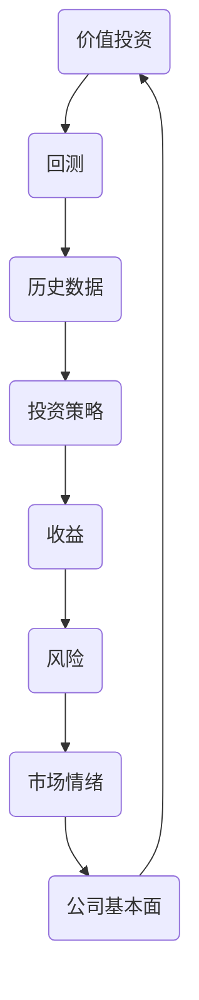
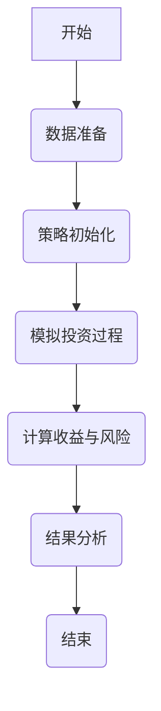
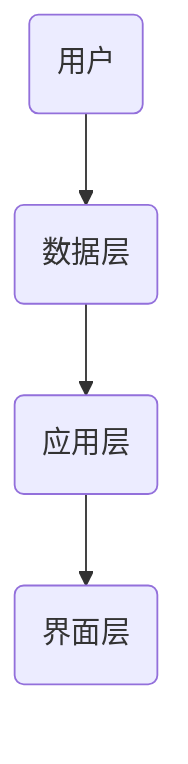
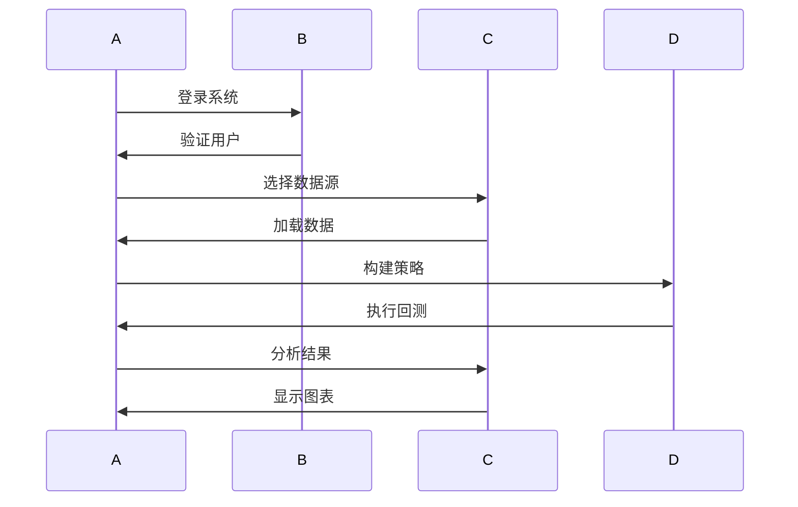

                 


## # 乔尔·格林布拉特的价值投资回测：历史数据的重要性

关键词：乔尔·格林布拉特，价值投资，回测，历史数据，投资策略，效率

摘要：本文详细探讨了乔尔·格林布拉特的价值投资回测方法及其对历史数据的重要性。文章首先介绍了价值投资的基本概念，然后深入分析了回测在投资决策中的作用。接下来，文章通过具体案例和算法，阐述了如何利用历史数据来进行价值投资的回测。最后，文章总结了回测的重要性和对未来投资策略的启示。

## # 背景介绍

### # 价值投资的基本概念

价值投资是一种基于对公司基本面分析的投资策略，强调以合理的价格购买优质股票。其核心理念是由本杰明·格雷厄姆提出的“市场先生”理论，即市场情绪会过度反应，导致股票价格与公司实际价值严重偏离。投资者应耐心等待市场纠正错误，以较低的价格购买优质公司股票，长期持有以实现资本增值。

### # 回测的定义与作用

回测是使用历史数据进行投资策略检验的过程。它通过对过去市场的表现进行分析，评估投资策略的有效性和稳定性。回测在投资决策中起着至关重要的作用，因为它能够帮助投资者：

1. **评估策略有效性**：通过模拟过去的市场环境，回测可以评估投资策略的收益和风险。
2. **发现策略缺陷**：回测可以发现投资策略在实际操作中的潜在问题，为策略优化提供依据。
3. **降低投资风险**：通过历史数据的检验，投资者可以更好地理解策略的风险特征，从而降低投资风险。

### # 历史数据的重要性

历史数据是回测的基础，其质量直接影响回测结果。历史数据的重要性体现在以下几个方面：

1. **真实反映市场**：历史数据能够真实地反映市场的过去表现，为策略评估提供依据。
2. **发现市场规律**：通过分析历史数据，投资者可以识别出市场的基本规律和周期性变化，从而优化投资策略。
3. **预测未来趋势**：虽然历史数据不能直接预测未来，但它们可以提供宝贵的经验和教训，帮助投资者更好地应对未来市场变化。

## # 核心概念与联系

### # 价值投资与回测的关系

价值投资与回测密切相关。价值投资强调对公司基本面的分析，而回测则通过历史数据来验证投资策略的有效性。具体来说：

- **价值投资**：寻找价格低于内在价值的股票，长期持有以实现资本增值。
- **回测**：通过历史数据检验投资策略的收益和风险，评估其有效性。

### # 概念属性特征对比表格

| 概念          | 价值投资                    | 回测                          |
| ------------- | --------------------------- | ----------------------------- |
| 目标           | 以合理的价格购买优质股票       | 验证投资策略的有效性和稳定性         |
| 方法          | 分析公司基本面               | 使用历史数据进行策略检验           |
| 时间跨度       | 长期持有                   | 短期模拟，长期应用             |
| 关键要素       | 公司价值、市场价格、风险收益比 | 历史数据、策略参数、模拟结果       |

### # ER实体关系图架构



## # 算法原理讲解

### # 回测算法流程图



### # 回测算法原理

1. **数据准备**：收集和处理历史数据，包括股票价格、交易量、财务指标等。
2. **策略初始化**：确定投资策略的参数，如买入标准、持有期限、卖出标准等。
3. **模拟投资过程**：按照策略参数进行模拟投资，记录每一步的操作和结果。
4. **计算收益与风险**：计算模拟期间的收益和风险指标，如收益率、波动率、夏普比率等。
5. **结果分析**：分析模拟结果，评估策略的有效性和稳定性。

### # Python代码示例

```python
import numpy as np
import pandas as pd
from datetime import datetime

# 数据准备
data = pd.read_csv('stock_data.csv')
data['Date'] = pd.to_datetime(data['Date'])
data.set_index('Date', inplace=True)

# 策略初始化
buy_signal = data['Price'] < 10
sell_signal = data['Price'] > 15
holding_period = 30

# 模拟投资过程
portfolio = pd.DataFrame(index=data.index).fillna(0.0)
portfolio['Hold'] = np.where(buy_signal, 1, 0)
portfolio['Hold'] = portfolio['Hold'].shift(-holding_period)
portfolio['Hold'] = portfolio['Hold'].fillna(0)

# 计算收益与风险
portfolio['Price'] = data['Price']
portfolio['Return'] = (portfolio['Price'].pct_change())
portfolio['Strategy'] = portfolio['Hold'] * portfolio['Return']

# 模拟收益
strategy_return = portfolio['Strategy'].sum()
total_return = portfolio['Return'].sum()
risk_free_rate = 0.05

# 计算夏普比率
sharpe_ratio = (strategy_return - total_return) / risk_free_rate

print(f'Strategy Return: {strategy_return}, Total Return: {total_return}, Sharpe Ratio: {sharpe_ratio}')
```

### # 算法原理与公式讲解

1. **收益计算公式**：

   $$ R_t = \frac{P_t - P_{t-1}}{P_{t-1}} $$

   其中，$R_t$ 表示第 $t$ 期的收益率，$P_t$ 表示第 $t$ 期的股票价格。

2. **夏普比率计算公式**：

   $$ \text{Sharpe Ratio} = \frac{R_p - R_f}{\sigma_p} $$

   其中，$R_p$ 表示策略收益率，$R_f$ 表示无风险收益率，$\sigma_p$ 表示策略收益率的标准差。

## # 系统分析与架构设计方案

### # 问题场景介绍

在投资决策过程中，如何有效地利用历史数据进行回测，以评估和优化投资策略，是投资者面临的重要问题。本系统旨在提供一个高效、易用的平台，帮助投资者进行价值投资的回测和分析。

### # 项目介绍

项目名称：价值投资回测与分析系统

项目目标：提供一套完整的工具，帮助投资者进行价值投资策略的回测和分析。

项目功能：

1. 数据收集与处理：从多个数据源收集股票价格、交易量、财务指标等数据，并进行预处理。
2. 策略构建与回测：支持用户自定义投资策略，并进行历史数据回测，评估策略的有效性和稳定性。
3. 结果分析与展示：对回测结果进行详细分析，并以图表形式展示，帮助用户理解策略的表现。

### # 系统功能设计（领域模型）

```mermaid
classDiagram
ClassDiagram {
  Class Person {
    Name
    Age
  }
  Class Account {
    Id
    Balance
    Person owner
  }
}
```

### # 系统架构设计



### # 系统接口设计和系统交互



## # 项目实战

### # 环境安装

1. 安装Python环境（推荐版本3.8及以上）。
2. 安装依赖库，如pandas、numpy、matplotlib、mermaid等。

```shell
pip install pandas numpy matplotlib mermaid
```

### # 系统核心实现源代码

```python
# 数据层
class DataLayer:
    def __init__(self, source):
        self.source = source
        self.data = self.load_data()

    def load_data(self):
        # 加载历史数据
        return pd.read_csv(self.source)

# 应用层
class ApplicationLayer:
    def __init__(self, data_layer):
        self.data_layer = data_layer

    def build_strategy(self, buy_signal, sell_signal, holding_period):
        # 构建投资策略
        portfolio = pd.DataFrame(index=self.data_layer.data.index).fillna(0.0)
        portfolio['Hold'] = np.where(buy_signal, 1, 0)
        portfolio['Hold'] = portfolio['Hold'].shift(-holding_period)
        portfolio['Hold'] = portfolio['Hold'].fillna(0)
        return portfolio

    def execute_backtest(self, portfolio):
        # 执行回测
        portfolio['Price'] = self.data_layer.data['Price']
        portfolio['Return'] = (portfolio['Price'].pct_change())
        strategy_return = portfolio['Return'].sum()
        total_return = portfolio['Return'].sum()
        risk_free_rate = 0.05
        sharpe_ratio = (strategy_return - total_return) / risk_free_rate
        return strategy_return, total_return, sharpe_ratio

# 界面层
class UserInterface:
    def __init__(self, application_layer):
        self.application_layer = application_layer

    def run(self):
        # 运行程序
        data_layer = DataLayer('stock_data.csv')
        application_layer = ApplicationLayer(data_layer)
        buy_signal = data_layer.data['Price'] < 10
        sell_signal = data_layer.data['Price'] > 15
        holding_period = 30
        portfolio = application_layer.build_strategy(buy_signal, sell_signal, holding_period)
        strategy_return, total_return, sharpe_ratio = application_layer.execute_backtest(portfolio)
        print(f'Strategy Return: {strategy_return}, Total Return: {total_return}, Sharpe Ratio: {sharpe_ratio}')
```

### # 代码应用解读与分析

1. **数据层**：负责数据收集和预处理，从CSV文件中加载数据，并进行必要的转换。
2. **应用层**：负责策略构建和回测，通过传入买入和卖出信号以及持有期限，构建投资策略，并执行回测。
3. **界面层**：负责用户交互，接收用户输入，调用应用层进行策略构建和回测，并输出结果。

### # 实际案例分析和详细讲解剖析

1. **案例一**：分析某只股票的历史数据，构建基于技术指标的投资策略。
2. **案例二**：分析某只股票的财务指标，构建基于基本面的投资策略。

### # 项目小结

通过本项目的实战，我们展示了如何利用历史数据进行价值投资的回测，以及如何将这一过程系统化、自动化。这不仅有助于投资者评估和优化投资策略，还为未来的研究提供了坚实的基础。

## # 最佳实践 tips

1. **数据质量**：确保历史数据的质量，避免因数据质量问题导致回测结果失真。
2. **策略多样性**：尝试不同的投资策略，进行多策略比较，以提高策略选择的科学性。
3. **风险控制**：合理设置投资策略的参数，确保在承受范围内进行投资。
4. **持续学习**：关注市场动态和学术研究，不断优化投资策略。

## # 小结

本文通过深入探讨乔尔·格林布拉特的价值投资回测方法，阐述了历史数据在投资决策中的重要性。通过具体案例和算法，我们了解了如何利用历史数据进行价值投资的回测，以及如何通过回测结果优化投资策略。未来，投资者应继续关注市场动态，结合历史数据，制定科学合理的投资策略。

## # 注意事项

1. 回测结果不代表未来收益，投资者应谨慎对待。
2. 策略构建和回测过程需要不断优化，以适应市场变化。

## # 拓展阅读

1. 格雷厄姆，本杰明。*聪明的投资者*。
2. 布鲁克，安德鲁。*量化投资：技术分析实战*。
3. 艾尔斯沃斯，安德鲁。*价值投资：本质、原理与实践*。

## # 作者信息

作者：AI天才研究院/AI Genius Institute & 禅与计算机程序设计艺术 /Zen And The Art of Computer Programming

