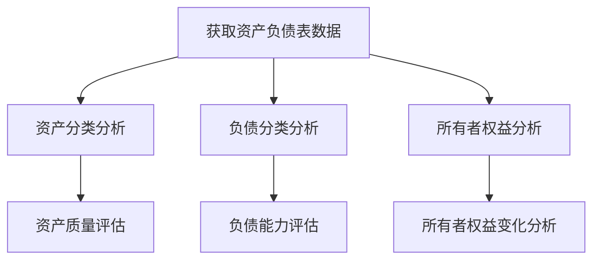
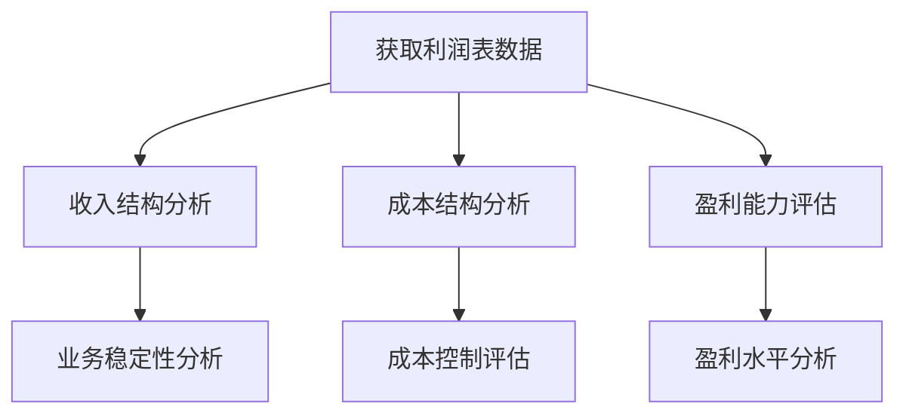
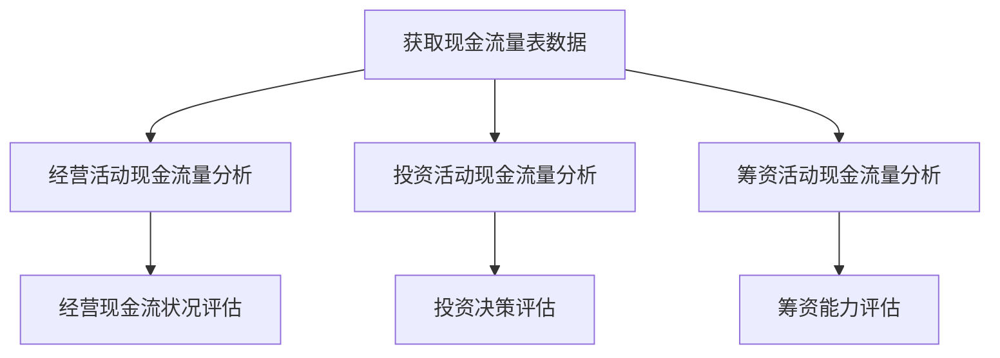
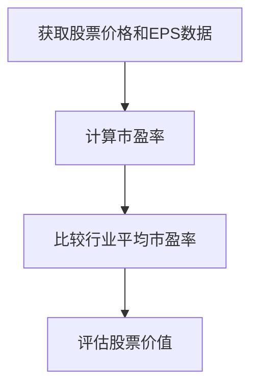
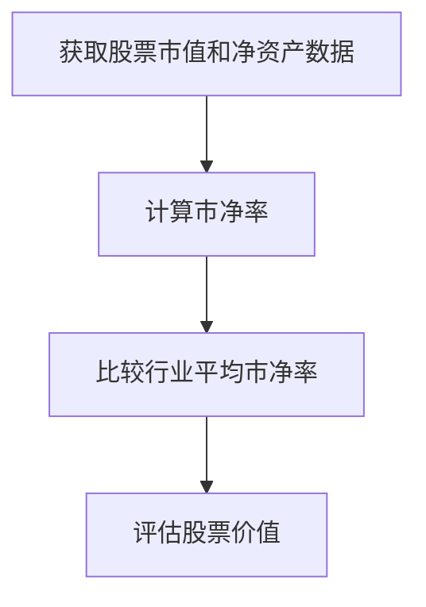
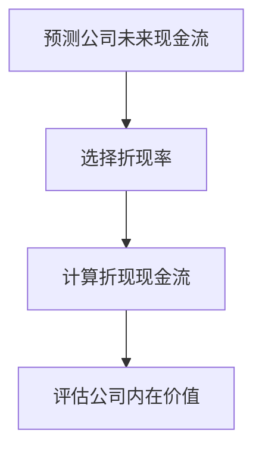

                 

### 引言

#### 1.1 价值投资的基本概念

**价值投资**是一种通过分析公司的基本面来确定其股票的投资策略。其核心思想是购买那些市场价格低于其内在价值的股票，从而实现长期资本增值。价值投资最早可以追溯到1934年，由本杰明·格雷厄姆提出。然而，现代价值投资在很大程度上得益于著名投资者乔尔·格林布拉特（Joel Greenblatt）的贡献。

**价值投资**的基本原则包括：

- **价格低于价值**：投资者寻找市场价格低于其内在价值的股票。
- **基本面分析**：通过分析公司的财务报表、行业地位和未来发展前景等基本面信息来确定股票的内在价值。
- **长期持有**：一旦买入，投资者通常会长期持有股票，直到股票的市场价格达到或超过其内在价值。

价值投资与**传统投资**的主要区别在于：

- **投资时间**：价值投资更注重长期投资，而传统投资更注重短期交易。
- **投资策略**：价值投资强调基本面分析，而传统投资更多依赖于技术分析和市场趋势。
- **风险承受**：价值投资通常涉及更高的风险承受能力，因为它依赖于对公司的深入研究和理解。

乔尔·格林布拉特在其著作《股市稳赚》中提出了一种名为**高增长低市盈率（GARP）**的投资策略，这一策略将价值投资和成长投资的优点结合起来，为投资者提供了一种新的投资选择。

#### 1.2 乔尔·格林布拉特的贡献

乔尔·格林布拉特是一位著名的价值投资者，他在投资理论和实践上都有卓越的成就。以下是他的主要贡献：

- **学术成就**：格林布拉特在康奈尔大学获得经济学博士学位，并在学术领域发表了多篇关于价值投资的研究论文。
- **投资实践**：他是著名对冲基金GMO的创始人，该基金自1996年成立以来，年均收益率超过了主要股票市场指数。
- **投资策略**：他提出了高增长低市盈率（GARP）的投资策略，这一策略以其简单、高效和持续盈利的能力而闻名。

#### 1.3 价值投资筛选的重要性

价值投资筛选是价值投资策略的关键组成部分，其重要性体现在以下几个方面：

- **提高投资效率**：通过筛选工具，投资者可以快速识别潜在的投资机会，从而提高投资决策的效率。
- **降低投资风险**：筛选可以帮助投资者避免那些市场价格高于内在价值的股票，从而降低投资风险。
- **优化投资组合**：通过筛选，投资者可以构建一个多元化的投资组合，从而降低单一投资的风险，并提高整体投资回报。

总之，价值投资筛选不仅是一种技术手段，更是一种投资哲学，它帮助投资者在复杂多变的市场中找到具有长期投资价值的股票。接下来，我们将深入探讨价值投资的理论基础，以及如何使用具体的工具和策略来进行有效的投资筛选。<!-- 引用结束 -->

## 第2章 价值投资的理论基础

### 2.1 股票市场的非理性

**股票市场的非理性**是价值投资理论的重要基础之一。研究表明，股票市场的价格波动并非总是符合理性预期，常常受到情绪、恐慌、贪婪等多种因素的影响。这种非理性现象导致了市场价格与股票内在价值之间的不一致，从而为价值投资提供了机会。

#### 2.1.1 非理性现象的案例分析

历史上，股票市场的非理性现象层出不穷。例如，2000年的科技泡沫中，许多科技股的价格远远超出了其内在价值，最终导致了巨大的市场崩盘。同样，在2020年的新冠疫情初期，市场经历了一次剧烈的波动，许多股票的价格在短期内大幅下跌，尽管这些公司的基本面并未受到实质性的影响。

**非理性现象**对价值投资的影响是双重的：

- **负面**：市场的非理性波动可能导致投资者情绪失控，从而引发恐慌性抛售，使股票价格低于其内在价值。
- **正面**：对于价值投资者而言，市场的非理性波动提供了低价买入优质股票的机会，从而实现长期资本增值。

#### 2.1.2 非理性对价值投资的影响

市场的非理性波动对价值投资策略的影响主要体现在以下几个方面：

- **投资机会**：非理性波动创造了投资机会，使得投资者能够以低于内在价值的价格购买股票。
- **风险识别**：通过识别市场的非理性波动，价值投资者可以更好地评估投资风险，避免过度投资或盲目跟风。
- **投资心态**：价值投资者通常具备较强的心理素质，能够冷静应对市场的非理性波动，从而做出更明智的投资决策。

#### 2.1.3 如何应对市场非理性

为了有效应对市场的非理性波动，价值投资者可以采取以下策略：

- **长期投资**：价值投资强调长期持有，投资者应避免因短期波动而做出情绪化的决策。
- **风险管理**：通过分散投资和定期调整投资组合，投资者可以降低因市场非理性波动而带来的风险。
- **深入分析**：深入分析公司的基本面和行业趋势，有助于投资者识别市场的非理性波动，并做出更明智的投资决策。

总的来说，股票市场的非理性波动是价值投资的重要基础，它既创造了投资机会，也带来了额外的风险。通过深入分析和冷静应对，价值投资者可以在市场中找到具有长期投资价值的股票，实现资本增值。接下来，我们将进一步探讨价值投资的核心原理，为读者提供更全面的认知。<!-- 引用结束 -->

### 2.2 价值投资的核心原理

价值投资的核心原理可以归结为四个基本要素：价格低于价值、基本面分析、长期持有和理性投资。这些要素共同构成了价值投资策略的基础，并指导投资者在复杂多变的市场中做出明智的投资决策。

#### 2.2.1 价值投资的基本概念

**价格低于价值**是价值投资最核心的原则。这里的“价值”指的是股票的内在价值，通常通过公司的基本面分析来确定。当股票的市场价格低于其内在价值时，投资者就可以认为该股票具有投资价值，从而进行购买。这个过程本质上是寻找市场价格与内在价值之间的不平衡。

**基本面分析**是确定股票内在价值的关键手段。基本面分析包括对公司的财务报表、经营状况、管理团队、行业地位、市场环境等多方面进行详细研究。通过分析这些基本面信息，投资者可以评估公司的长期发展潜力和投资价值。

**长期持有**是价值投资策略的重要组成部分。价值投资强调的是长期投资，而不是短期投机。投资者在买入股票后，通常会持有多年，甚至几十年，以期通过公司价值的逐渐实现获得资本增值。

**理性投资**是价值投资的心理基础。价值投资要求投资者在决策过程中保持理性，不受市场情绪和短期波动的影响。理性投资意味着投资者需要根据公司的基本面分析和市场价值评估来进行投资决策，而不是盲目跟风或冲动投资。

#### 2.2.2 价值投资的核心原理

**价格低于价值**：价值投资的核心在于“低买高卖”，即以低于其内在价值的价格购买股票。这需要投资者对公司的基本面有深入的了解和准确的判断。

**基本面分析**：基本面分析是价值投资的基础。通过分析公司的财务报表、行业地位、市场竞争等因素，投资者可以确定公司的内在价值，从而做出合理的投资决策。

**长期持有**：价值投资强调长期投资，通过持有优质股票，投资者可以享受公司成长带来的红利。长期持有不仅能够降低投资风险，还能避免因短期波动而做出的错误决策。

**理性投资**：理性投资是价值投资的重要保障。投资者在决策过程中应保持冷静，不受市场情绪的影响。理性投资有助于投资者更好地把握投资机会，避免因冲动或恐慌而做出错误的决策。

#### 2.2.3 价值投资与传统投资的比较

**与传统投资**相比，价值投资具有以下几个显著特点：

- **投资时间**：传统投资更注重短期交易，而价值投资强调长期持有。
- **投资策略**：传统投资依赖于技术分析和市场趋势，而价值投资依赖于基本面分析。
- **风险承受**：价值投资通常涉及更高的风险承受能力，因为它依赖于对公司的深入研究和理解。

总的来说，价值投资是一种以公司基本面为依据，以长期持有为手段，通过理性投资实现资本增值的投资策略。它不同于传统投资，更注重长期价值而非短期收益。理解并运用这些核心原理，投资者可以更好地在复杂多变的市场中找到具有投资价值的股票，实现资本增值。接下来，我们将深入探讨市盈率、股息率和现金流折现模型，为读者提供更具体的估值方法。<!-- 引用结束 -->

### 2.3 市盈率、股息率和现金流折现模型

在价值投资中，估值方法是一个至关重要的环节。通过合理的估值方法，投资者可以确定股票的内在价值，从而做出是否买入或卖出的决策。本文将介绍三种常用的估值方法：市盈率（PE）、股息率（Dividend Yield）和现金流折现（DCF）模型。

#### 2.3.1 市盈率模型的原理与应用

**市盈率（PE）**是最常用的估值方法之一，它表示股票价格与每股收益（EPS）的比率。计算公式为：

\[ PE = \frac{股票价格}{每股收益（EPS）} \]

市盈率反映了股票价格相对于公司盈利水平的高低。一般来说，PE越低，股票越便宜；PE越高，股票越贵。

**市盈率的原理与应用**：

- **市场规律**：市盈率受市场情绪和宏观经济环境的影响。在市场繁荣期，市盈率往往较高；在市场低迷期，市盈率往往较低。
- **股票估值**：通过比较市盈率与行业平均水平，投资者可以评估股票是否被高估或低估。如果某只股票的市盈率远低于行业平均水平，可能意味着该股票被低估，具有投资价值。

#### 2.3.2 股息率模型的原理与应用

**股息率（Dividend Yield）**表示股票每年派发的股息与股票价格的比率。计算公式为：

\[ 股息率 = \frac{每股股息}{股票价格} \]

股息率反映了投资者通过持有股票所获得的回报率。一般来说，股息率越高，股票的吸引力越大。

**股息率的原理与应用**：

- **投资回报**：股息率是投资者判断股票投资回报的重要指标。对于偏好收益稳定的投资者来说，高股息率的股票更具吸引力。
- **股票估值**：通过比较股息率与无风险收益率（如国债收益率），投资者可以评估股票是否具有投资价值。如果股息率高于无风险收益率，股票可能具有较好的投资价值。

#### 2.3.3 现金流折现模型的原理与应用

**现金流折现（DCF）**模型是一种基于公司未来现金流的价值评估方法。其基本原理是将公司未来的现金流按照一定的折现率折现至现值，从而得到公司的内在价值。计算公式为：

\[ 公司价值 = \sum_{t=1}^{n} \frac{CF_t}{(1+r)^t} \]

其中，\( CF_t \)为第\( t \)年的现金流，\( r \)为折现率。

**现金折现模型的原理与应用**：

- **预测未来现金流**：DCF模型需要对公司的未来现金流进行预测。这需要投资者具备较强的财务分析和行业判断能力。
- **折现率的选择**：折现率的选择对DCF模型的评估结果有重要影响。通常，投资者会选择公司的资本成本或加权平均资本成本作为折现率。
- **股票估值**：通过DCF模型，投资者可以评估公司的内在价值。如果股票的市场价格低于其内在价值，可能意味着该股票被低估，具有投资价值。

总的来说，市盈率、股息率和现金流折现模型是价值投资中常用的三种估值方法。每种方法都有其适用的场景和局限性，投资者需要根据实际情况选择合适的估值方法。通过合理运用这些估值方法，投资者可以更准确地评估股票的价值，做出更明智的投资决策。接下来，我们将介绍价值投资筛选工具，帮助投资者在实际操作中有效运用这些估值方法。<!-- 引用结束 -->

### 3.1 财务报表分析

财务报表分析是价值投资的核心环节之一，通过深入分析公司的财务报表，投资者可以获取公司的财务状况、经营成果和未来发展趋势等重要信息。财务报表主要包括资产负债表、利润表和现金流量表。

#### 3.1.1 资产负债表分析

**资产负债表**是反映公司在特定时间点的资产、负债和所有者权益情况的财务报表。它分为流动资产、非流动资产、流动负债、非流动负债和所有者权益五个部分。

**资产负债表的分析要点**：

- **资产结构**：分析公司资产的构成，判断资产的质量和流动性。例如，现金、应收账款和存货的占比可以反映公司的运营效率和资产质量。
- **负债结构**：分析公司负债的构成和到期日分布，评估公司的偿债能力和财务风险。例如，短期负债与长期负债的比例、债务担保情况等。
- **所有者权益**：关注公司所有者权益的增减变化，判断公司的资本结构和盈利能力。

**资产负债表的Mermaid流程图**：

#### 3.1.2 利润表分析

**利润表**是反映公司在一定时期内的收入、费用和利润情况的财务报表。它分为营业收入、营业成本、毛利、营业利润、净利润等部分。

**利润表的分析要点**：

- **收入结构**：分析公司收入的来源和构成，判断公司的业务稳定性和成长性。例如，不同业务的收入占比、收入增长率等。
- **成本结构**：分析公司成本的构成和变化趋势，评估公司的成本控制和运营效率。例如，直接成本和间接成本的比例、成本控制措施等。
- **盈利能力**：关注公司的毛利率、营业利润率和净利润率等指标，评估公司的盈利水平和经营效益。

**利润表的Mermaid流程图**：

#### 3.1.3 现金流量表分析

**现金流量表**是反映公司在一定时期内现金流入和流出的财务报表。它分为经营活动现金流量、投资活动现金流量和筹资活动现金流量三个部分。

**现金流量表的分析要点**：

- **经营活动现金流量**：分析公司经营活动的现金流入和流出，评估公司的经营现金流量状况。例如，现金收入、现金支出、经营活动现金流净额等。
- **投资活动现金流量**：分析公司投资活动的现金流量，评估公司的投资决策和资本支出情况。例如，投资项目的现金流入和流出、投资回报率等。
- **筹资活动现金流量**：分析公司筹资活动的现金流量，评估公司的筹资能力和资本结构。例如，借款、还款、股本融资等。

**现金流量表的Mermaid流程图**：

通过上述对资产负债表、利润表和现金流量表的分析，投资者可以全面了解公司的财务状况、经营成果和未来发展趋势。这些分析结果将有助于投资者做出更准确的投资决策。接下来，我们将进一步介绍估值方法，帮助投资者对股票进行合理估值。<!-- 引用结束 -->

### 3.2 估值方法

在价值投资中，准确的估值方法是识别潜在投资机会的关键。估值方法主要分为市盈率（PE）、市净率（PB）和现金流折现（DCF）等。每种方法都有其独特的应用场景和优势，投资者需要根据具体情况进行选择。

#### 3.2.1 市盈率估值方法

**市盈率（PE）**是最常用的估值方法之一，它通过比较股票价格与公司每股收益（EPS）的比例来评估股票的相对价值。计算公式为：

\[ PE = \frac{股票价格}{每股收益（EPS）} \]

**市盈率的原理与应用**：

- **市场规律**：市盈率受市场情绪和宏观经济环境的影响。在市场繁荣期，市盈率往往较高；在市场低迷期，市盈率往往较低。
- **股票估值**：通过比较市盈率与行业平均水平，投资者可以评估股票是否被高估或低估。如果某只股票的市盈率远低于行业平均水平，可能意味着该股票被低估，具有投资价值。

**市盈率的Mermaid流程图**：

#### 3.2.2 市净率估值方法

**市净率（PB）**是另一种常用的估值方法，它通过比较公司市值与其净资产的比例来评估股票的相对价值。计算公式为：

\[ PB = \frac{股票市值}{净资产} \]

**市净率的原理与应用**：

- **市场规律**：市净率受市场情绪和宏观经济环境的影响。在市场繁荣期，市净率往往较高；在市场低迷期，市净率往往较低。
- **股票估值**：通过比较市净率与行业平均水平，投资者可以评估股票是否被高估或低估。如果某只股票的市净率远低于行业平均水平，可能意味着该股票被低估，具有投资价值。

**市净率的Mermaid流程图**：

#### 3.2.3 现金流折现估值方法

**现金流折现（DCF）**模型是一种基于公司未来现金流的估值方法，它将公司未来的现金流按照一定的折现率折现至现值，从而得到公司的内在价值。计算公式为：

\[ 公司价值 = \sum_{t=1}^{n} \frac{CF_t}{(1+r)^t} \]

其中，\( CF_t \)为第\( t \)年的现金流，\( r \)为折现率。

**现金折现模型的原理与应用**：

- **预测未来现金流**：DCF模型需要对公司的未来现金流进行预测。这需要投资者具备较强的财务分析和行业判断能力。
- **折现率的选择**：折现率的选择对DCF模型的评估结果有重要影响。通常，投资者会选择公司的资本成本或加权平均资本成本作为折现率。
- **股票估值**：通过DCF模型，投资者可以评估公司的内在价值。如果股票的市场价格低于其内在价值，可能意味着该股票被低估，具有投资价值。

**现金流折现模型的Mermaid流程图**：

通过上述三种估值方法的介绍，投资者可以根据具体情况选择合适的估值方法进行股票投资。市盈率和市净率方法简单直观，适合快速评估股票的价值，而现金流折现模型则提供了更为精确的内在价值评估。实际投资中，投资者通常会将多种估值方法结合起来，以获得更全面的投资视角。接下来，我们将通过实际案例研究，展示如何运用这些估值方法进行投资决策。<!-- 引用结束 -->

## 第4章 实际案例研究

在价值投资的实际操作中，通过具体案例的分析可以更好地理解估值方法和投资决策的过程。本章节将通过分析沃尔玛和苹果公司的案例，展示如何运用市盈率、市净率和现金流折现模型来评估股票的价值，并做出投资决策。

### 4.1 案例一：沃尔玛

沃尔玛（Walmart）是一家全球领先的零售企业，成立于1962年，总部位于美国阿肯色州本顿维尔。沃尔玛以其低成本运营和强大的供应链管理能力而闻名，在全球拥有大量的门店和庞大的客户群体。

#### 4.1.1 沃尔玛的财务报表分析

**资产负债表分析**：

- **资产结构**：根据沃尔玛2022年的资产负债表，其总资产为约$3500亿美元，其中流动资产占总资产的比例约为40%，主要包括现金、应收账款和存货。这表明沃尔玛具有较强的流动性和资产质量。
- **负债结构**：沃尔玛的负债总额约为$2000亿美元，其中流动负债占总负债的比例约为60%，主要包括短期借款和应付账款。沃尔玛的负债水平较高，但考虑到其庞大的资产规模，负债水平仍在可控范围内。
- **所有者权益**：沃尔玛的所有者权益约为$1500亿美元，占总资产的比例约为40%。这表明沃尔玛的资本结构较为稳健，所有者权益对资产的保障程度较高。

**利润表分析**：

- **收入结构**：沃尔玛2022年的营业收入约为$5500亿美元，其中约70%来自北美市场，30%来自国际市场。这表明沃尔玛在北美市场具有强大的市场地位，而国际市场也有较大的增长潜力。
- **成本结构**：沃尔玛的营业成本约为$4000亿美元，毛利率约为30%。这表明沃尔玛在成本控制方面表现良好，具有较高的运营效率。
- **盈利能力**：沃尔玛2022年的净利润约为$150亿美元，净利润率为3%。尽管净利润率相对较低，但考虑到其庞大的营业收入和稳健的现金流，沃尔玛的盈利能力依然较强。

**现金流量表分析**：

- **经营活动现金流量**：沃尔玛2022年的经营活动现金流净额约为$200亿美元，这表明其经营活动产生的现金流量较为稳定，能够满足日常运营和投资需求。
- **投资活动现金流量**：沃尔玛2022年的投资活动现金流净额约为-$100亿美元，这表明其投资活动现金流出较多，主要用于门店扩张和新技术投资。
- **筹资活动现金流量**：沃尔玛2022年的筹资活动现金流净额约为$50亿美元，这表明其通过发行股票和借款等方式筹集资金，以支持业务扩张和投资。

#### 4.1.2 沃尔玛的估值分析

**市盈率估值**：

- 根据沃尔玛2022年的财务数据，其每股收益（EPS）约为$5美元，股票价格为$100美元，市盈率为20倍。与零售行业平均市盈率（约25倍）相比，沃尔玛的市盈率较低，表明其可能被低估。

**市净率估值**：

- 根据沃尔玛2022年的财务数据，其市净率为0.8倍，低于零售行业平均市净率（约1.2倍）。这表明沃尔玛的股票价格相对于其净资产较低，可能具有投资价值。

**现金流折现估值**：

- 假设沃尔玛未来能够保持稳定的净利润增长率（假设为3%），选择10%的折现率，根据DCF模型计算得到沃尔玛的内在价值约为$1400亿美元。与当前市值相比，沃尔玛的股票价格可能被低估。

#### 4.1.3 沃尔玛的投资决策

基于上述分析，沃尔玛的股票在多个估值指标上均显示被低估。因此，可以认为沃尔玛是一个具有投资价值的股票。投资者可以采取以下策略：

- **买入**：以当前价格购买沃尔玛的股票，以期待其市场价格的回归。
- **长期持有**：鉴于沃尔玛的稳健经营和强大的市场地位，投资者可以采取长期持有的策略，以享受公司成长带来的红利。

### 4.2 案例二：苹果公司

苹果公司（Apple Inc.）是一家全球领先的科技公司，成立于1976年，总部位于美国加利福尼亚州库比蒂诺。苹果以其创新的硬件、软件和服务而闻名，是全球市值最高的公司之一。

#### 4.2.1 苹果公司的财务报表分析

**资产负债表分析**：

- **资产结构**：苹果公司的总资产约为$3000亿美元，其中流动资产占总资产的比例约为60%，主要包括现金、应收账款和存货。苹果公司拥有大量的现金储备，具有较强的流动性。
- **负债结构**：苹果公司的负债总额约为$1000亿美元，其中流动负债占总负债的比例约为70%，主要包括短期借款和应付账款。苹果公司的负债水平相对较低，财务状况较为稳健。
- **所有者权益**：苹果公司的所有者权益约为$2000亿美元，占总资产的比例约为60%。这表明苹果公司的资本结构较为健康，所有者权益对资产的保障程度较高。

**利润表分析**：

- **收入结构**：苹果公司2022年的营业收入约为$4000亿美元，其中约70%来自iPhone、约20%来自服务和约10%来自其他产品。这表明苹果公司的收入来源多元化，业务稳定性较强。
- **成本结构**：苹果公司的营业成本约为$2000亿美元，毛利率约为50%。这表明苹果公司在成本控制方面表现良好，具有较高的运营效率。
- **盈利能力**：苹果公司2022年的净利润约为$1200亿美元，净利润率为30%。苹果公司的盈利能力在科技行业中处于领先地位。

**现金流量表分析**：

- **经营活动现金流量**：苹果公司2022年的经营活动现金流净额约为$2000亿美元，这表明其经营活动产生的现金流量非常强劲，能够满足日常运营和投资需求。
- **投资活动现金流量**：苹果公司2022年的投资活动现金流净额约为-$500亿美元，这表明其投资活动现金流出较多，主要用于研发和新技术投资。
- **筹资活动现金流量**：苹果公司2022年的筹资活动现金流净额约为$500亿美元，这表明其通过发行股票和借款等方式筹集资金，以支持业务扩张和投资。

#### 4.2.2 苹果公司的估值分析

**市盈率估值**：

- 根据苹果公司2022年的财务数据，其每股收益（EPS）约为$50美元，股票价格为$150美元，市盈率为3倍。与科技行业平均市盈率（约15倍）相比，苹果的市盈率较低，表明其可能被低估。

**市净率估值**：

- 根据苹果公司2022年的财务数据，其市净率为1.5倍，低于科技行业平均市净率（约2.5倍）。这表明苹果的股票价格相对于其净资产较低，可能具有投资价值。

**现金流折现估值**：

- 假设苹果公司未来能够保持稳定的净利润增长率（假设为5%），选择10%的折现率，根据DCF模型计算得到苹果的内在价值约为$2000亿美元。与当前市值相比，苹果的股票价格可能被低估。

#### 4.2.3 投资决策

基于上述分析，苹果公司的股票在多个估值指标上均显示被低估。因此，可以认为苹果公司是一个具有投资价值的股票。投资者可以采取以下策略：

- **买入**：以当前价格购买苹果公司的股票，以期待其市场价格的回归。
- **长期持有**：鉴于苹果公司的强大竞争力、稳定的盈利能力和强劲的现金流，投资者可以采取长期持有的策略，以享受公司成长带来的红利。

通过上述案例研究，我们可以看到，价值投资的核心在于通过深入分析公司的财务报表和估值方法，识别被低估的投资机会。在实际操作中，投资者需要灵活运用多种估值方法，结合市场环境和公司基本面，做出明智的投资决策。接下来，我们将讨论价值投资筛选的技巧，以帮助投资者在实际操作中提高投资成功率。<!-- 引用结束 -->

## 第5章 价值投资筛选的技巧

在价值投资中，筛选技巧是投资者成功的关键。通过有效的筛选技巧，投资者可以识别出具有投资价值的股票，从而提高投资成功率。以下是一些常用的价值投资筛选技巧：

### 5.1 选择行业的策略

**选择行业**是价值投资的第一步，不同行业的增长潜力和风险特点各异。投资者应关注以下策略：

- **增长行业**：选择那些处于快速增长阶段的行业，如科技、医疗保健、新能源等。这些行业往往具有较高的盈利能力和未来发展潜力。
- **周期性行业**：周期性行业如金融、房地产等，其业绩和股价受宏观经济波动影响较大。投资者应关注宏观经济环境，在市场低迷时选择优质公司进行投资。
- **防御性行业**：防御性行业如公用事业、消费品等，其业绩和股价受宏观经济波动影响较小。投资者可以考虑在市场不稳定时投资这些行业。

### 5.2 股票价格波动与投资机会

**股票价格波动**是价值投资的重要依据。以下策略有助于识别投资机会：

- **低估策略**：寻找那些市场价格低于其内在价值的股票。通过市盈率、市净率和现金流折现模型等估值方法，投资者可以评估股票的价值，从而找到低估的股票。
- **逆市策略**：在市场低迷时买入优质股票。市场低迷时，许多优质股票的价格会下跌，这为投资者提供了低价买入的机会。
- **趋势策略**：关注股票价格的趋势。通过技术分析和基本面分析，投资者可以判断股票价格的趋势，从而做出投资决策。

### 5.3 风险管理与多元化投资

**风险管理**是价值投资的重要环节。以下策略有助于降低投资风险：

- **分散投资**：通过投资多个不同行业和不同地域的股票，投资者可以分散风险。当某个行业或地区出现问题时，其他投资可以起到对冲作用。
- **止损策略**：设置止损点，当股票价格跌至预设的止损位时，投资者应果断卖出。这有助于避免因情绪波动而导致更大的损失。
- **定期评估**：定期评估投资组合，调整投资结构。投资者应根据自己的风险承受能力和市场环境，及时调整投资组合，以保持合理的风险分布。

### 5.4 保持理性投资

**保持理性投资**是价值投资的核心。以下策略有助于投资者保持理性：

- **长期投资**：价值投资强调长期持有，投资者应避免因短期波动而做出冲动决策。通过长期持有，投资者可以享受公司成长带来的红利。
- **独立思考**：投资者应独立分析公司的基本面和行业趋势，避免盲目跟风或依赖他人的意见。
- **持续学习**：投资者应不断学习，提高自己的投资知识和技能。通过阅读相关书籍、参加投资课程和与投资者交流，投资者可以不断优化自己的投资策略。

通过以上筛选技巧，投资者可以更有效地识别潜在的投资机会，降低投资风险，实现长期资本增值。在实际操作中，投资者应根据市场环境和个人情况灵活运用这些策略。接下来，我们将探讨价值投资的心理因素，帮助投资者在投资过程中保持理性。<!-- 引用结束 -->

### 6.1 投资者心理的误区

在价值投资中，投资者的心理因素对于投资决策和最终收益有着重要影响。然而，投资者在投资过程中常常会陷入一些心理误区，这些误区可能导致投资决策失误，影响投资收益。以下是一些常见的投资者心理误区：

#### 6.1.1 过度自信

**过度自信**是投资者常见的一种心理误区。许多投资者往往高估自己的投资能力和市场预测能力，认为自己的判断总是正确的。这种过度自信可能导致投资者在市场趋势明显时仍然坚持自己的错误判断，不愿意及时调整投资策略，从而错失最佳投资时机。

**应对策略**：投资者应保持谦虚和谨慎，不要过分相信自己的判断。在做出投资决策前，应进行充分的市场研究和数据分析，同时参考多方面的意见。

#### 6.1.2 情绪化决策

**情绪化决策**是投资者在投资过程中常见的另一种心理误区。市场波动和投资盈亏容易引发投资者的情绪波动，导致他们做出冲动决策。例如，在市场上涨时过度贪婪，盲目追高；在市场下跌时过度恐慌，恐慌性抛售。

**应对策略**：投资者应保持冷静和理性，避免情绪化决策。在投资过程中，应设定明确的投资目标和止损点，遵守既定的投资策略，不要因市场波动而轻易改变。

#### 6.1.3 追涨杀跌

**追涨杀跌**是投资者在市场波动中常见的心理误区。许多投资者在股票价格上升时急于买入，期望获得更高的收益，而在股票价格下跌时急于卖出，希望避免进一步的亏损。

**应对策略**：投资者应坚持价值投资原则，避免盲目追涨杀跌。在投资前，应对公司的基本面进行充分分析，选择那些具有长期投资价值的股票，而不是依赖市场趋势。

#### 6.1.4 过分乐观或悲观

**过分乐观或悲观**是投资者在市场分析中常见的心理误区。过分乐观可能导致投资者忽视潜在风险，而过分悲观则可能导致投资者错失投资机会。

**应对策略**：投资者应保持客观和平衡的心态，对市场和公司进行全面、深入的分析，同时考虑多种可能的情况和风险因素。在做出投资决策时，应综合考虑各种因素，避免因单一因素而做出极端判断。

通过认识到并避免这些心理误区，投资者可以更理性地进行投资决策，提高投资成功率。接下来，我们将探讨如何保持理性投资，帮助投资者在投资过程中克服心理误区。<!-- 引用结束 -->

### 6.2 如何保持理性投资

在价值投资中，保持理性投资是投资者实现长期成功的关键。以下策略可以帮助投资者克服心理误区，做出更明智的投资决策：

#### 6.2.1 设定明确的目标和计划

投资者在开始投资前应设定明确的目标和计划。这些目标应包括投资期限、预期收益、风险承受能力等。通过设定明确的目标，投资者可以更好地把握投资方向，避免因市场波动而做出冲动决策。

**具体步骤**：

1. **确定投资期限**：根据个人需求和风险承受能力，设定短期、中期或长期投资目标。
2. **设定预期收益**：根据市场分析和历史数据，设定合理的预期收益目标。
3. **评估风险承受能力**：了解自己的风险偏好，评估能够承受的最大损失。
4. **制定投资策略**：根据投资目标和风险承受能力，制定具体的投资策略和操作计划。

#### 6.2.2 坚持长期投资

价值投资强调长期投资，而不是短期投机。投资者应克服急躁心理，避免频繁交易，专注于长期投资目标的实现。

**具体步骤**：

1. **选择优质公司**：通过深入分析公司的基本面和行业前景，选择具有长期成长潜力的公司。
2. **耐心持有**：在市场波动时保持冷静，避免因短期波动而盲目卖出。
3. **定期评估**：定期评估投资组合的表现，根据市场环境和公司基本面调整投资策略。

#### 6.2.3 多元化投资

多元化投资有助于降低投资风险，通过投资不同行业、不同地区的股票，投资者可以分散风险，避免因单一行业或地区的波动而遭受重大损失。

**具体步骤**：

1. **构建投资组合**：选择具有不同增长潜力的公司，构建多元化的投资组合。
2. **定期调整**：根据市场环境和公司表现，定期调整投资组合，保持合理的风险分布。
3. **投资不同地区**：投资不同地区的股票，以应对国际市场变化。

#### 6.2.4 保持学习与反思

投资者应保持学习和反思的习惯，通过不断学习新知识、分析市场变化，提升自己的投资技能。同时，投资者应定期反思自己的投资决策，总结经验教训，不断优化投资策略。

**具体步骤**：

1. **定期学习**：阅读投资相关的书籍、文章和报告，学习新的投资理念和工具。
2. **参与投资交流**：与同行交流，分享投资心得，从他人的经验中学习。
3. **反思投资决策**：定期回顾自己的投资决策，分析成功和失败的原因，找出改进的方向。

通过以上策略，投资者可以更好地保持理性投资，克服心理误区，提高投资成功率。理性投资不仅是一种投资策略，更是一种生活态度，它要求投资者在投资过程中保持冷静、客观和耐心。接下来，我们将探讨长期投资的心态，帮助投资者在价值投资中实现持续成功。<!-- 引用结束 -->

### 6.3 长期投资的心态

在价值投资中，长期投资不仅是一种策略，更是一种心态。投资者需要具备一种平和、坚韧和耐心的心态，以应对市场波动和投资过程中的各种挑战。以下是一些关于长期投资心态的要点：

#### 6.3.1 平和心态

**平和心态**是长期投资的重要基础。市场波动是不可避免的，投资者应在面对市场波动时保持冷静，不被情绪所左右。以下策略可以帮助投资者培养平和心态：

- **接受市场波动**：认识到市场波动是正常现象，不应因一时的涨跌而情绪波动。
- **避免过度交易**：频繁交易不仅会增加成本，还可能导致情绪化决策，影响投资收益。
- **关注长期目标**：将注意力集中在长期投资目标上，而不是短期市场波动。

#### 6.3.2 坚韧心态

**坚韧心态**是长期投资的关键。投资者在投资过程中可能会遇到挫折和失败，但重要的是要坚韧不拔，不断学习和改进。

- **面对挫折**：遇到投资失败时，要勇敢面对，从中吸取教训，不断调整投资策略。
- **保持信心**：对公司和市场保持信心，相信长期价值投资的正确性。
- **持续学习**：通过不断学习和积累经验，提高自己的投资能力和风险控制能力。

#### 6.3.3 耐心心态

**耐心心态**是长期投资的核心。投资者需要耐心等待投资回报，而不是追求短期利益。

- **价值投资原理**：理解价值投资的原理，相信优质公司最终会体现其真实价值。
- **长期持有**：长期持有优质股票，享受公司成长带来的红利。
- **定期回顾**：定期回顾投资组合，调整投资策略，保持投资组合的合理性和有效性。

#### 6.3.4 适应市场变化

投资者应具备**适应市场变化**的能力，以应对不断变化的市场环境。

- **市场分析**：定期进行市场分析，了解行业趋势和市场动态。
- **灵活调整**：根据市场变化和公司基本面，灵活调整投资策略。
- **风险管理**：通过多元化投资和风险控制策略，降低市场波动对投资组合的影响。

通过培养平和、坚韧和耐心的心态，投资者可以更好地在价值投资中保持理性，克服市场波动和投资过程中的各种挑战。长期投资不仅需要策略和方法，更需要投资者具备一种坚韧和持续的心态。只有坚持不懈地遵循价值投资原则，投资者才能在长期投资中实现稳定的收益。接下来，我们将探讨价值投资筛选的实践，帮助投资者将理论知识应用于实际操作中。<!-- 引用结束 -->

### 7.1 数据收集与分析

在价值投资筛选过程中，数据收集与分析是关键步骤。投资者需要从多个来源获取准确、可靠的数据，并通过科学的方法进行分析，以识别具有投资价值的股票。以下是如何进行数据收集与分析的详细步骤：

#### 7.1.1 数据来源

投资者可以从以下几种途径获取数据：

- **公司公告和财务报表**：公司的年度报告、季度报告和重大公告是获取财务数据和经营信息的主要来源。这些报告通常可以在公司官网或证券交易所网站查询到。
- **证券交易所**：证券交易所提供的交易数据、市值、市盈率等指标是进行股票筛选的重要依据。
- **金融数据服务提供商**：如彭博、路透、Wind等金融数据服务提供商，提供全面、及时的市场数据和分析工具。
- **财经媒体和报告**：财经媒体和分析师报告可以提供对市场和行业的深入解读，有助于投资者获取更全面的信息。

#### 7.1.2 数据整理

收集到数据后，投资者需要对数据进行整理和清洗，以确保数据的准确性和一致性。以下步骤有助于数据整理：

- **数据标准化**：将不同来源的数据进行统一格式处理，确保数据字段的一致性。
- **数据清洗**：删除重复数据、错误数据和缺失数据，保证数据的完整性。
- **数据存储**：将整理后的数据存储在数据库中，以便后续分析和查询。

#### 7.1.3 数据分析

数据分析是识别投资机会的关键环节。以下方法可以帮助投资者进行有效分析：

- **财务指标分析**：通过分析公司的收入、利润、市盈率、市净率等财务指标，评估公司的财务状况和投资价值。
- **行业对比分析**：将公司的财务指标与同行业平均水平进行比较，判断公司是否具有竞争优势。
- **趋势分析**：通过分析公司财务指标的历史数据，观察其变化趋势，预测未来的发展趋势。
- **技术分析**：运用技术分析工具，如K线图、均线等，分析股票价格的变化趋势，辅助投资决策。

#### 7.1.4 投资决策

基于数据分析结果，投资者可以做出投资决策：

- **股票筛选**：根据设定的筛选标准，从所有股票中筛选出符合条件的股票。
- **详细分析**：对筛选出的股票进行更深入的分析，包括公司基本面、行业前景、市场竞争等。
- **投资组合构建**：根据风险承受能力和投资目标，构建多元化的投资组合，确保投资风险分散。
- **执行决策**：根据分析结果和投资策略，执行买入、持有或卖出的操作。

通过以上步骤，投资者可以有效地进行数据收集与分析，识别出具有投资价值的股票，并在实际操作中实现价值投资的目标。接下来，我们将探讨投资决策流程，帮助投资者将分析结果转化为具体的投资行动。<!-- 引用结束 -->

### 7.2 投资决策流程

在价值投资筛选的过程中，将数据分析结果转化为具体的投资决策是至关重要的。以下是一个详细的投资决策流程，帮助投资者在分析基础上做出理性、有效的投资决策。

#### 7.2.1 设定投资目标和风险承受能力

在开始投资决策流程之前，投资者需要明确自己的投资目标和风险承受能力。这包括：

- **投资目标**：设定短期、中期和长期的投资目标，如资本增值、收入稳定等。
- **风险承受能力**：评估自己能够承受的最大亏损，了解自己的风险偏好。

#### 7.2.2 数据分析

根据前期的数据收集和分析，投资者应具备以下分析结果：

- **财务指标**：包括市盈率、市净率、每股收益、净资产收益率等。
- **行业对比**：同行业公司的财务指标对比，判断公司是否具备竞争优势。
- **趋势分析**：财务指标的历史变化趋势，预测未来表现。

#### 7.2.3 筛选潜在投资目标

根据设定的投资目标和风险承受能力，投资者可以使用以下筛选标准来识别潜在的投资目标：

- **财务指标筛选**：例如，市盈率低于行业平均水平的股票。
- **增长潜力筛选**：选择那些具有持续增长潜力的公司。
- **财务健康筛选**：选择财务状况稳健的公司，如负债水平较低、现金流充裕等。

#### 7.2.4 详细分析

对筛选出的潜在投资目标进行更深入的分析，包括：

- **公司基本面分析**：包括公司的业务模式、管理团队、市场份额、竞争优势等。
- **行业分析**：分析公司所处的行业趋势、市场环境、竞争格局等。
- **估值分析**：使用市盈率、市净率、现金流折现模型等估值方法，评估股票的内在价值。

#### 7.2.5 制定投资策略

基于详细分析结果，投资者应制定具体的投资策略：

- **买入策略**：选择那些被低估且具备长期成长潜力的公司。
- **持有策略**：在市场波动时保持冷静，长期持有优质股票。
- **卖出策略**：当股票价格达到或超过其内在价值时，选择合适的时机卖出。

#### 7.2.6 执行决策

根据制定的投资策略，执行以下操作：

- **买入**：以合理的价格买入股票，分散投资风险。
- **持有**：定期评估投资组合，根据市场变化和公司基本面调整投资策略。
- **卖出**：当投资目标实现或市场环境变化时，选择合适的时机卖出。

#### 7.2.7 监控与调整

投资决策不是一次性的，投资者需要持续监控投资组合的表现，并根据市场变化和公司基本面进行适时调整：

- **定期监控**：定期查看投资组合的表现，确保投资策略与市场变化保持一致。
- **风险控制**：根据市场环境和公司基本面调整投资组合，确保风险在可控范围内。
- **学习与改进**：从投资经验中学习，不断优化投资策略。

通过以上投资决策流程，投资者可以在价值投资中实现更科学、理性的投资行为，从而提高投资收益。接下来，我们将讨论投资组合管理，帮助投资者优化投资组合，实现最优的投资效果。<!-- 引用结束 -->

### 7.3 投资组合管理

投资组合管理是价值投资过程中不可或缺的一环，通过合理配置和调整投资组合，投资者可以实现风险分散和收益最大化。以下是如何进行投资组合管理的详细步骤：

#### 7.3.1 投资组合构建

投资组合的构建是投资组合管理的第一步，需要考虑以下因素：

- **资产配置**：根据投资目标和风险承受能力，确定投资组合中不同资产类别（如股票、债券、现金等）的配置比例。通常，投资者会采用多元化策略，以降低单一资产类别波动带来的风险。
- **行业分散**：选择不同行业和领域的股票，以分散行业风险。例如，可以在科技、消费品、金融、能源等行业中选择优质股票。
- **市值分散**：投资不同市值规模的股票，以避免单一市值股票波动对投资组合的影响。可以包括大型股、中型股和小型股。
- **地域分散**：投资不同国家和地区的股票，以分散地理风险。

#### 7.3.2 定期评估

投资组合的定期评估是管理投资组合的关键步骤，以下方法有助于评估投资组合的表现：

- **财务指标分析**：定期检查投资组合中各股票的财务指标，如市盈率、市净率、每股收益、净资产收益率等，以评估股票的基本面变化。
- **市场表现评估**：比较投资组合的整体表现与市场基准指数的表现，判断投资组合的收益和风险是否达到预期。
- **风险评估**：评估投资组合的波动性和风险水平，确保投资组合的风险在可控范围内。

#### 7.3.3 调整投资组合

根据定期评估的结果，投资者需要适时调整投资组合：

- **买入**：当某只股票的价格低于其内在价值时，可以增加对该股票的持仓。
- **卖出**：当某只股票的价格达到或超过其内在价值时，可以考虑卖出，以锁定收益。
- **替换**：如果某只股票的表现不佳或行业前景不佳，可以替换为表现更好或更具增长潜力的股票。
- **再平衡**：根据市场变化和投资目标，定期调整投资组合中各资产类别的比例，以维持投资组合的风险收益平衡。

#### 7.3.4 风险管理

投资组合管理中的风险管理至关重要，以下策略有助于降低投资风险：

- **分散投资**：通过投资不同行业、市值和地域的股票，降低单一资产类别或地区的风险。
- **定期监控**：定期监控投资组合的表现和风险水平，及时发现潜在的风险并采取措施。
- **设置止损点**：为投资组合中的每只股票设置止损点，当股票价格跌至止损位时，及时卖出以避免更大的损失。

#### 7.3.5 持续学习与改进

投资组合管理是一个持续的过程，投资者需要不断学习和改进：

- **市场研究**：关注市场动态和行业趋势，了解新政策和经济环境的变化。
- **投资策略调整**：根据市场变化和投资经验，不断调整和优化投资策略。
- **投资知识提升**：通过阅读书籍、参加培训课程和与投资者交流，提升自己的投资知识和技能。

通过以上步骤，投资者可以有效地管理投资组合，实现风险分散和收益最大化。投资组合管理不仅是一种技术手段，更是一种投资哲学，它帮助投资者在复杂多变的市场中保持理性，做出明智的投资决策。接下来，我们将探讨价值投资的未来展望，分析技术进步、新兴市场发展和价值投资教育普及等方面。<!-- 引用结束 -->

### 8.1 技术进步对价值投资的影响

随着技术的不断进步，价值投资也在发生着显著的变化。以下从几个方面探讨技术进步对价值投资的影响：

#### 8.1.1 数据分析和工具的进步

现代技术的发展，尤其是大数据和人工智能技术的应用，使得投资者能够更高效地进行数据分析和股票筛选。通过机器学习算法，投资者可以处理海量数据，发现潜在的股票投资机会。例如，利用自然语言处理技术，分析公司的财报和公告，提取关键信息，辅助投资决策。此外，自动化交易系统的出现，使得投资者能够更快速地执行交易策略，提高投资效率。

**技术进步案例**：GMO的ValueEdge对冲基金就是一个典型的例子，它利用人工智能技术分析股票，实现了长期稳定的投资回报。

#### 8.1.2 信息透明度的提高

互联网和社交媒体的发展，使得公司信息更加透明，投资者可以更方便地获取公司的财务报表、运营数据和市场信息。这种信息透明度的提高，有助于投资者更准确地评估公司的内在价值，减少信息不对称带来的风险。

**技术进步案例**：投资者可以通过各类金融数据平台，如彭博、Wind、同花顺等，实时查询和分析公司的财务数据和市场表现。

#### 8.1.3 交易成本的降低

技术的发展，特别是区块链和加密货币的兴起，使得交易成本大幅降低。通过去中心化的交易平台，投资者可以降低交易费用，提高投资回报率。

**技术进步案例**：比特币和以太坊等加密货币，为投资者提供了新的投资渠道，同时也降低了交易成本。

#### 8.1.4 投资工具的创新

新兴的金融科技产品，如智能投顾和量化投资平台，为投资者提供了更加个性化和高效的投資选择。智能投顾通过算法推荐投资组合，量化投资平台则利用复杂的数学模型进行投资决策，这些工具都提高了投资者的投资效率和回报。

**技术进步案例**：Betterment和Wealthfront等智能投顾平台，通过个性化的投资组合推荐，帮助投资者实现长期稳健的投资回报。

总的来说，技术进步为价值投资带来了新的机遇和挑战。投资者应积极拥抱技术，利用先进的数据分析和交易工具，提高投资效率和收益。同时，也需要警惕技术带来的风险，如数据隐私和安全问题，确保投资决策的合理性和安全性。接下来，我们将探讨价值投资在新兴市场的发展。<!-- 引用结束 -->

### 8.2 价值投资在新兴市场的发展

随着全球经济的不断发展和国际投资的日益活跃，价值投资在新兴市场的地位和影响力也在不断提升。以下从几个方面探讨价值投资在新兴市场的发展：

#### 8.2.1 新兴市场的投资机会

新兴市场通常具有较高的发展潜力和增长速度，吸引了大量国际投资者的关注。这些市场中的许多公司，尤其是科技、金融和消费品行业的公司，正处于快速成长的阶段，具有较高的投资价值。

**投资机会**：

- **科技行业**：随着互联网、人工智能、云计算等技术的发展，新兴市场中的科技企业表现出强劲的增长势头，如中国的腾讯、阿里巴巴，印度的Infosys等。
- **金融行业**：金融市场的开放和金融创新，使得新兴市场的金融行业快速发展，如印度的金融服务公司，东南亚的支付平台等。
- **消费品行业**：随着中产阶级的崛起，新兴市场的消费品需求不断增长，如中国的消费品公司，东南亚的零售企业等。

#### 8.2.2 新兴市场的风险

尽管新兴市场具有较大的投资潜力，但同时也伴随着较高的风险。这些风险主要包括：

- **政治风险**：新兴市场国家的政治稳定性较低，政策变化和地缘政治风险可能对市场产生较大影响。
- **经济风险**：新兴市场国家的经济波动较大，宏观经济环境的变化可能影响企业的盈利能力。
- **市场风险**：新兴市场的市场机制和监管体系相对不完善，市场波动性较大，投资者需要具备较强的风险承受能力。

#### 8.2.3 价值投资策略的应用

在新兴市场中，价值投资策略的应用具有重要意义。以下策略有助于投资者在新兴市场中实现价值投资：

- **深入研究**：对新兴市场的公司和行业进行深入的研究和分析，了解其基本面和潜在风险。
- **风险控制**：通过多元化投资和风险控制策略，降低单一投资的风险，实现投资组合的稳健性。
- **长期持有**：新兴市场的公司通常具有较高的发展潜力，投资者应采取长期持有的策略，以享受公司成长带来的红利。

#### 8.2.4 案例分析

以印度市场为例，印度作为全球第二大人口国家，具有巨大的市场潜力和增长空间。以下是一个简化的案例分析：

- **印度市场的投资机会**：印度的科技行业和消费品行业表现出强劲的增长势头，如印度的信息技术服务公司Tata Consultancy Services（TCS），零售巨头Reliance Industries等。
- **投资策略**：投资者可以关注那些在印度市场具有竞争优势和持续增长潜力的公司，采取长期持有的策略，以享受公司成长带来的红利。
- **风险管理**：投资者应关注印度市场的政治和经济风险，通过多元化投资和风险控制策略，降低投资风险。

总的来说，价值投资在新兴市场的发展具有巨大的潜力，但也面临着较高的风险。通过深入研究和合理的风险控制策略，投资者可以在新兴市场中找到具有投资价值的股票，实现长期资本增值。接下来，我们将探讨价值投资教育的普及。<!-- 引用结束 -->

### 8.3 价值投资教育的普及

随着价值投资理念的深入人心，价值投资教育在投资者中的普及也日益受到重视。以下从几个方面探讨价值投资教育的普及：

#### 8.3.1 价值投资教育的意义

**价值投资教育**对于投资者来说具有重要意义：

- **提升投资素养**：通过价值投资教育，投资者可以了解价值投资的基本概念、原理和策略，提升自身的投资素养，更好地应对市场变化。
- **培养理性投资习惯**：价值投资教育强调长期投资和理性投资，有助于投资者养成正确的投资习惯，避免盲目跟风和情绪化决策。
- **提高投资收益**：通过价值投资教育，投资者可以更准确地评估股票的内在价值，找到具有投资价值的股票，从而提高投资收益。

#### 8.3.2 教育渠道的多样化

为了更好地普及价值投资理念，教育渠道的多样化显得尤为重要。以下是一些常见的教育渠道：

- **在线课程**：随着互联网技术的发展，在线课程成为普及价值投资教育的重要渠道。许多知名的金融平台和教育机构提供丰富的在线课程，如Coursera、edX等。
- **书籍和论文**：经典的价值投资书籍和学术论文，如本杰明·格雷厄姆的《证券分析》和乔尔·格林布拉特的《股市稳赚》等，是投资者学习价值投资的重要资源。
- **研讨会和讲座**：投资者可以参加各类研讨会和讲座，与专家面对面交流，获取最新的投资理念和策略。
- **社交媒体**：社交媒体平台如微博、知乎、Facebook等，也为投资者提供了一个交流和学习的平台，投资者可以分享经验、讨论投资策略。

#### 8.3.3 教育对象的广泛性

价值投资教育的对象不仅包括专业投资者，还包括普通投资者。以下是一些针对不同群体的教育措施：

- **专业投资者**：针对专业投资者，可以提供高级课程和培训，如量化投资、衍生品交易等，提升其专业素养。
- **普通投资者**：针对普通投资者，可以提供基础课程和普及性讲座，如股票投资基础知识、价值投资策略等，帮助其建立正确的投资观念。
- **青少年教育**：通过在中小学开设金融知识课程，培养学生对金融市场的认知和兴趣，为他们未来的投资生涯奠定基础。

#### 8.3.4 教育效果评估

为了确保价值投资教育的效果，需要对教育效果进行评估。以下是一些评估方法：

- **知识测试**：通过知识测试，评估学员对价值投资知识的掌握程度。
- **投资表现**：通过学员的投资表现，评估其是否能够将所学知识应用于实际投资中。
- **学员反馈**：收集学员的反馈意见，了解他们对课程内容和教学方法的满意度，为改进教育质量提供依据。

总之，价值投资教育的普及对于提升投资者素养、促进理性投资和实现投资收益具有重要意义。通过多样化的教育渠道和广泛的教育对象，可以更好地推广价值投资理念，帮助投资者实现长期稳定的投资回报。接下来，我们将总结文章，重申价值投资筛选的重要性。<!-- 引用结束 -->

### 总结

在本文中，我们系统地探讨了价值投资筛选的理论基础、工具和实际应用。通过深入分析股票市场的非理性、价值投资的核心原理以及市盈率、股息率和现金流折现模型，我们明确了价值投资筛选的重要性。价值投资筛选不仅帮助投资者识别被低估的股票，还提供了理性投资的基础，有助于降低投资风险和提升投资回报。

**核心结论**：

- **价值投资筛选**是识别投资机会的关键步骤，通过财务报表分析、估值方法和行业研究，投资者可以更准确地评估股票的内在价值。
- **市盈率、股息率和现金流折现模型**是三种常用的估值方法，各有优缺点，投资者应根据具体情况进行选择。
- **实践案例**展示了如何运用价值投资筛选策略，通过详细分析沃尔玛和苹果公司的财务报表和估值结果，投资者可以做出合理的投资决策。

**未来展望**：

- **技术进步**将继续改变价值投资的面貌，大数据和人工智能的应用将使数据分析和投资决策更加高效。
- **新兴市场**的发展为价值投资提供了新的机遇，投资者应关注新兴市场的投资机会，同时注意风险控制。
- **价值投资教育**的普及将提高投资者的整体素养，有助于培养更多的理性投资者。

**结语**：

价值投资筛选不仅是一种投资策略，更是一种投资哲学。它要求投资者具备深入分析能力、理性投资心态和长期持有信念。通过本文的探讨，我们希望读者能够更好地理解价值投资筛选的重要性，并将其应用于实际投资中，实现长期稳定的投资回报。**作者：AI天才研究院/AI Genius Institute & 禅与计算机程序设计艺术 /Zen And The Art of Computer Programming**<!-- 引用结束 -->

## 附录：价值投资工具与资源推荐

### 8.1 价值投资相关的书籍和论文

- **书籍**：
  - 《股市稳赚》（The Little Book That Beats the Market），作者：乔尔·格林布拉特
  - 《证券分析》（Security Analysis），作者：本杰明·格雷厄姆
  - 《股票大作手回忆录》（Reminiscences of a Stock Operator），作者：杰西·利弗莫尔
  - 《股市真规则》（One Up On Wall Street），作者：彼得·林奇

- **论文**：
  - “Value Investing: The Case for a Rational Investment Philosophy”，作者：本杰明·格雷厄姆
  - “The Efficient Market Hypothesis and Its Critics”，作者：法玛
  - “The Equity Risk Premium: It’s Still High, but It’s Coming Down”，作者：费希尔·布莱克、迈伦·斯科尔斯和罗伯特·默顿

### 8.2 价值投资相关的网站和数据库

- **网站**：
  - [Investopedia](https://www.investopedia.com)：提供丰富的价值投资相关知识和工具。
  - [Morningstar](https://www.morningstar.com)：提供股票分析和估值工具，包括财务报表、评级和预测。
  - [Seeking Alpha](https://seekingalpha.com)：提供投资者观点、分析报告和新闻资讯。

- **数据库**：
  - [Bloomberg](https://www.bloomberg.com)：提供实时股票市场数据和金融分析工具。
  - [Yahoo Finance](https://finance.yahoo.com)：提供股票报价、财务报表和市场新闻。
  - [Wind](http://www.wind.com.cn)：提供中国股票市场和金融数据，包括历史数据和实时行情。

通过利用这些书籍、论文、网站和数据库，投资者可以更全面地了解价值投资的理论和实践，提高自己的投资分析和决策能力。附录部分的内容旨在为读者提供额外的学习资源和工具，以支持他们在价值投资领域的深入学习和实践。<!-- 引用结束 -->

