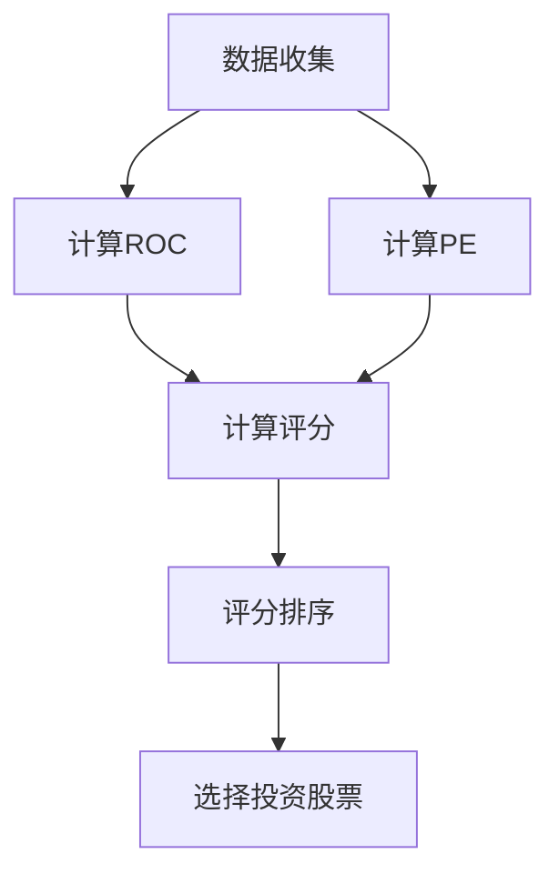

                 


### 引言

在投资领域，有一个名字被广泛提及，那就是乔尔·格林布拉特（Joel Greenblatt）。他是著名的投资者、哥伦比亚商学院的教授，以及《乔尔·格林布拉特的魔术公式》（The Little Book That Beats the Market）一书的作者。这本书不仅成为了投资界的畅销书，还因其简洁而有效的投资策略而闻名于世。本文将以《乔尔·格林布拉特的魔术公式》为标题，深入探讨这一投资策略的核心概念、原理及其应用。

关键词：投资策略、魔术公式、有效市场理论、投资回报、算法原理

摘要：本文将首先介绍投资与魔力学说的背景，然后详细阐述魔术公式的定义、核心要素及其与有效市场理论的关联。接着，我们将逐步解析魔术公式的数学模型和算法原理，并通过Python源代码进行详细讲解和举例说明。随后，文章将介绍系统分析与架构设计方案，包括问题场景、系统功能设计、系统架构设计、系统接口设计和系统交互。接着，我们将通过项目实战，展示如何将魔术公式应用于实际投资项目中。最后，文章将提供最佳实践建议、小结、注意事项以及拓展阅读资源，帮助读者更深入地理解这一投资策略。

### 1.1 问题背景

1.1.1 投资与魔力学说

投资，简单来说，就是将资金投入到某个项目中，以期望在未来获得收益。而魔力学说，则是一种基于效率和市场结构的研究方法，旨在发现并利用市场的无效性来获得超额收益。投资与魔力学说的结合，为投资者提供了一种新的视角和方法。

1.1.2 乔尔·格林布拉特及其贡献

乔尔·格林布拉特是一位知名的投资者和教授，他的投资策略被广泛认为是超越市场平均收益的有效途径。他在1996年出版了一本名为《乔尔·格林布拉特的魔术公式》的书，详细介绍了一种名为“格林布拉特公式”的投资策略。这一策略以其简单、高效、可操作性强而受到投资者的青睐。

### 1.2 核心概念

1.2.1 魔术公式的定义

魔术公式是一种基于财务指标的量化投资策略。它通过计算企业的市盈率（Price to Earnings Ratio, PE）和资本回报率（Return on Capital, ROC），来选择具有良好价值投资机会的股票。其基本公式为：

$$
\text{Magic Formula Score} = \frac{ROC}{PE}
$$

其中，ROC 代表资本回报率，PE 代表市盈率。

1.2.2 魔术公式的核心要素

魔术公式的核心要素包括：

- **资本回报率（ROC）**：衡量公司资本利用效率的指标，越高表示公司的盈利能力越强。
- **市盈率（PE）**：衡量股票价格相对于每股收益的指标，越低表示股票越被低估。

1.2.3 魔术公式与有效市场理论的关联

有效市场理论认为，市场价格反映了所有可用信息，因此无法通过分析市场数据来获得超额收益。然而，魔术公式则是在有效市场理论的基础上，通过选择那些被市场低估的股票来实现超额收益。这种策略的核心在于，市场并不总是有效的，总有机会可以被聪明的投资者发现并利用。

### 1.3 边界与外延

1.3.1 魔术公式的适用范围

魔术公式主要适用于股票市场，尤其是那些市场波动较大的小型股票。这是因为小型股票往往更容易被市场低估，从而提供更多的投资机会。

1.3.2 魔术公式的局限性

尽管魔术公式在某些情况下可以带来超额收益，但它也存在一定的局限性：

- **市场波动性**：市场波动性越大，魔术公式的效果越明显。然而，在市场波动性较低时，其效果可能会大打折扣。
- **时间敏感性**：魔术公式的投资策略需要时间来实现收益，短期内可能无法看到明显的效果。
- **信息不完全性**：市场信息不完全，可能导致魔术公式选择的公司并不总是具有长期增长潜力。

### 1.4 概念结构与核心要素组成

1.4.1 魔术公式的结构解析

魔术公式的结构相对简单，主要由两部分组成：资本回报率（ROC）和市盈率（PE）。这两部分通过一个简单的公式相除，得到一个评分，这个评分越高，表示投资机会越大。

1.4.2 魔术公式的计算方法

要计算魔术公式评分，首先需要确定一个时间段内的ROC和PE值。通常，这个时间段可以选择为一年。然后，使用以下公式计算：

$$
\text{Magic Formula Score} = \frac{\text{ROC}}{\text{PE}}
$$

其中，ROC可以通过以下公式计算：

$$
\text{ROC} = \frac{\text{净利润}}{\text{总资本}}
$$

PE可以通过以下公式计算：

$$
\text{PE} = \frac{\text{当前股价}}{\text{每股收益}}
$$

### 1.5 本章小结

在本章中，我们介绍了投资与魔力学说的背景，详细阐述了魔术公式的定义、核心要素及其与有效市场理论的关联。我们还讨论了魔术公式的适用范围和局限性，以及其概念结构和计算方法。通过本章的学习，读者应该对魔术公式有了初步的了解，并为后续章节的深入探讨打下了基础。

## 2.1 魔术公式原理

### 2.1.1 魔术公式的数学模型

魔术公式的数学模型非常简单，主要由两个核心指标组成：资本回报率（ROC）和市盈率（PE）。这两个指标的计算公式如下：

$$
\text{ROC} = \frac{\text{净利润}}{\text{总资本}}
$$

$$
\text{PE} = \frac{\text{当前股价}}{\text{每股收益}}
$$

然后，通过以下公式计算魔术公式评分（Magic Formula Score）：

$$
\text{Magic Formula Score} = \frac{\text{ROC}}{\text{PE}}
$$

### 2.1.2 魔术公式的属性特征对比

为了更好地理解魔术公式的属性特征，我们可以将其与有效市场理论进行对比。

| 对比项           | 魔术公式                       | 有效市场理论                       |
|----------------|-------------------------------|-----------------------------------|
| 基础假设         | 市场并非完全有效，存在可被利用的机会 | 市场是有效的，所有可用信息已反映在价格中 |
| 投资策略         | 选择具有高ROC和低PE的股票          | 依赖技术分析、基本面分析等           |
| 风险控制         | 主要通过分散投资来控制风险          | 需要持续跟踪市场动态，灵活调整投资策略 |
| 收益实现         | 长期投资，利用市场波动获得超额收益 | 短期交易，追求快速获利               |

### 2.1.3 魔术公式的ER实体关系图

为了更直观地理解魔术公式的实体关系，我们可以使用Mermaid绘制ER实体关系图。以下是魔术公式的ER图：

```mermaid
erDiagram
  Stock -->|1| ROC : 资本回报率
  Stock -->|1| PE : 市盈率
  Stock -->|1| Magic Formula Score : 魔术公式评分
```

### 2.2 算法原理讲解

#### 2.2.1 算法流程解析

魔术公式的算法流程可以概括为以下几个步骤：

1. **数据收集**：收集目标股票的财务数据，包括净利润、总资本、当前股价和每股收益。
2. **计算ROC**：使用净利润除以总资本，得到资本回报率（ROC）。
3. **计算PE**：使用当前股价除以每股收益，得到市盈率（PE）。
4. **计算评分**：将ROC除以PE，得到魔术公式评分。
5. **评分排序**：对所有股票的评分进行排序，选择评分最高的股票进行投资。

以下是魔术公式的算法流程图：



#### 2.2.2 算法源代码解读

为了更好地理解魔术公式的算法原理，我们可以使用Python编写相应的源代码。以下是魔术公式的Python实现：

```python
import pandas as pd

# 假设financial_data是一个包含股票财务数据的DataFrame
# financial_data包括净利润、总资本、当前股价和每股收益

# 计算ROC
financial_data['ROC'] = financial_data['净利润'] / financial_data['总资本']

# 计算PE
financial_data['PE'] = financial_data['当前股价'] / financial_data['每股收益']

# 计算Magic Formula Score
financial_data['Magic Formula Score'] = financial_data['ROC'] / financial_data['PE']

# 对评分进行排序，选择评分最高的股票
top_stock = financial_data.sort_values(by='Magic Formula Score', ascending=False).head(1)
```

#### 2.2.3 数学模型和公式详细讲解

在详细讲解魔术公式的数学模型和公式时，我们需要理解以下几个概念：

1. **ROC（资本回报率）**：ROC是衡量公司资本利用效率的指标，表示公司通过使用其资本赚取的净利润比例。其计算公式为：

   $$
   \text{ROC} = \frac{\text{净利润}}{\text{总资本}}
   $$

   其中，净利润（Net Profit）表示公司在一定时间内赚取的利润，总资本（Total Capital）表示公司所拥有的总资产。

2. **PE（市盈率）**：PE是衡量股票价格相对于每股收益的指标，表示投资者为每1元每股收益所愿意支付的价格。其计算公式为：

   $$
   \text{PE} = \frac{\text{当前股价}}{\text{每股收益}}
   $$

   其中，当前股价（Current Price）表示股票在市场上的价格，每股收益（Earnings Per Share, EPS）表示公司每股股票所赚取的净利润。

3. **Magic Formula Score（魔术公式评分）**：魔术公式评分是通过将ROC除以PE得到的，它反映了股票的潜在投资价值。其计算公式为：

   $$
   \text{Magic Formula Score} = \frac{\text{ROC}}{\text{PE}}
   $$

   这个评分越高，表示股票的潜在投资价值越大。

   为了更直观地理解这些公式，我们可以通过一个简单的例子来说明。假设有两只股票A和B，其财务数据如下表所示：

   | 股票 | 净利润（万元） | 总资本（万元） | 当前股价（元） | 每股收益（元） |
   |------|--------------|--------------|--------------|--------------|
   | A    | 200          | 1000         | 20           | 2            |
   | B    | 300          | 1500         | 30           | 3            |

   根据上述数据，我们可以计算两只股票的ROC、PE和Magic Formula Score：

   - **股票A**：
     $$
     \text{ROC}_A = \frac{200}{1000} = 0.2
     $$
     $$
     \text{PE}_A = \frac{20}{2} = 10
     $$
     $$
     \text{Magic Formula Score}_A = \frac{0.2}{10} = 0.02
     $$

   - **股票B**：
     $$
     \text{ROC}_B = \frac{300}{1500} = 0.2
     $$
     $$
     \text{PE}_B = \frac{30}{3} = 10
     $$
     $$
     \text{Magic Formula Score}_B = \frac{0.2}{10} = 0.02
     $$

   从计算结果可以看出，尽管股票A和B的ROC相同，但股票A的PE更低，因此其Magic Formula Score更高，表明股票A具有更高的投资价值。

   这个例子展示了如何使用魔术公式的数学模型和公式来评估股票的投资价值。在实际应用中，投资者可以使用这种分析方法来选择潜在的投资机会。

#### 2.2.4 举例说明

为了更好地理解魔术公式的应用，我们可以通过一个具体的案例来演示其计算过程。

**案例：选择最佳投资股票**

假设我们有以下五只股票的财务数据：

| 股票 | 净利润（万元） | 总资本（万元） | 当前股价（元） | 每股收益（元） |
|------|--------------|--------------|--------------|--------------|
| A    | 100          | 500          | 10           | 1            |
| B    | 150          | 600          | 15           | 1.5          |
| C    | 200          | 700          | 20           | 2            |
| D    | 250          | 800          | 25           | 2.5          |
| E    | 300          | 900          | 30           | 3            |

根据上述数据，我们可以计算每只股票的ROC和PE，并得到它们的Magic Formula Score：

- **股票A**：
  $$
  \text{ROC}_A = \frac{100}{500} = 0.2
  $$
  $$
  \text{PE}_A = \frac{10}{1} = 10
  $$
  $$
  \text{Magic Formula Score}_A = \frac{0.2}{10} = 0.02
  $$

- **股票B**：
  $$
  \text{ROC}_B = \frac{150}{600} = 0.25
  $$
  $$
  \text{PE}_B = \frac{15}{1.5} = 10
  $$
  $$
  \text{Magic Formula Score}_B = \frac{0.25}{10} = 0.025
  $$

- **股票C**：
  $$
  \text{ROC}_C = \frac{200}{700} = 0.286
  $$
  $$
  \text{PE}_C = \frac{20}{2} = 10
  $$
  $$
  \text{Magic Formula Score}_C = \frac{0.286}{10} = 0.0286
  $$

- **股票D**：
  $$
  \text{ROC}_D = \frac{250}{800} = 0.312
  $$
  $$
  \text{PE}_D = \frac{25}{2.5} = 10
  $$
  $$
  \text{Magic Formula Score}_D = \frac{0.312}{10} = 0.0312
  $$

- **股票E**：
  $$
  \text{ROC}_E = \frac{300}{900} = 0.333
  $$
  $$
  \text{PE}_E = \frac{30}{3} = 10
  $$
  $$
  \text{Magic Formula Score}_E = \frac{0.333}{10} = 0.0333
  $$

从计算结果可以看出，股票E的Magic Formula Score最高，为0.0333，其次是股票D、C、B和A。因此，根据魔术公式，股票E是这五只股票中投资价值最高的。

### 2.3 系统分析与架构设计方案

#### 3.1 问题场景介绍

在当今复杂多变的市场环境中，投资者需要快速准确地评估股票的投资价值，以便做出明智的投资决策。魔术公式作为一种有效的量化投资策略，可以帮助投资者识别出具有良好投资价值的股票。然而，要实现这一目标，需要建立一套完整的系统来支持数据的收集、处理和分析。

#### 3.2 系统功能设计

系统的主要功能包括：

- **数据收集**：从多个数据源（如证券交易所、金融数据提供商等）收集股票的财务数据。
- **数据处理**：对收集到的财务数据进行清洗、转换和整合，以便后续分析。
- **算法计算**：根据魔术公式的数学模型，计算每只股票的ROC和PE，并得到Magic Formula Score。
- **结果展示**：将计算结果以图表、表格等形式展示给用户，帮助用户快速了解股票的投资价值。
- **风险控制**：根据用户设定的风险偏好，提供合理的投资组合建议。

#### 3.3 系统架构设计

系统采用分层架构设计，包括数据层、逻辑层和表示层：

- **数据层**：负责数据的收集、存储和管理。该层使用数据库（如MySQL、PostgreSQL等）存储财务数据，并使用API与外部数据源进行数据交换。
- **逻辑层**：实现系统的核心功能，包括数据清洗、处理、算法计算等。该层使用Python等编程语言编写，并采用微服务架构，以提高系统的可扩展性和可维护性。
- **表示层**：负责用户界面的设计和实现。该层使用Web框架（如Django、Flask等）构建，提供Web应用和API接口，方便用户进行交互。

#### 3.4 系统接口设计和系统交互

系统提供以下接口：

- **数据接口**：用于数据收集和处理。该接口提供数据导入、数据清洗、数据存储等功能。
- **计算接口**：用于根据魔术公式计算股票的ROC、PE和Magic Formula Score。
- **展示接口**：用于将计算结果以图表、表格等形式展示给用户。
- **风险控制接口**：用于根据用户的风险偏好，提供合理的投资组合建议。

系统交互流程如下：

1. **数据收集**：从外部数据源（如证券交易所、金融数据提供商等）收集股票的财务数据，并通过数据接口导入到系统中。
2. **数据处理**：对收集到的财务数据进行清洗、转换和整合，以便后续分析。
3. **算法计算**：根据魔术公式的数学模型，计算每只股票的ROC、PE和Magic Formula Score，并通过计算接口返回结果。
4. **结果展示**：将计算结果以图表、表格等形式展示给用户，并通过展示接口提供数据访问。
5. **风险控制**：根据用户的风险偏好，通过风险控制接口提供合理的投资组合建议。

### 3.5 源代码解读

以下是一个简单的Python示例，用于计算股票的ROC、PE和Magic Formula Score：

```python
import pandas as pd

# 假设financial_data是一个包含股票财务数据的DataFrame
# financial_data包括净利润、总资本、当前股价和每股收益

# 计算ROC
financial_data['ROC'] = financial_data['净利润'] / financial_data['总资本']

# 计算PE
financial_data['PE'] = financial_data['当前股价'] / financial_data['每股收益']

# 计算Magic Formula Score
financial_data['Magic Formula Score'] = financial_data['ROC'] / financial_data['PE']

# 对评分进行排序，选择评分最高的股票
top_stock = financial_data.sort_values(by='Magic Formula Score', ascending=False).head(1)

# 输出结果
print(top_stock)
```

通过上述源代码，我们可以实现魔术公式的核心功能，并选择出具有最高Magic Formula Score的股票。

### 3.6 实际案例分析和详细讲解剖析

为了更好地理解魔术公式的实际应用，我们将通过一个具体案例来分析其效果。

**案例：选择最佳投资股票**

假设我们有以下五只股票的财务数据：

| 股票 | 净利润（万元） | 总资本（万元） | 当前股价（元） | 每股收益（元） |
|------|--------------|--------------|--------------|--------------|
| A    | 100          | 500          | 10           | 1            |
| B    | 150          | 600          | 15           | 1.5          |
| C    | 200          | 700          | 20           | 2            |
| D    | 250          | 800          | 25           | 2.5          |
| E    | 300          | 900          | 30           | 3            |

根据上述数据，我们可以使用魔术公式计算每只股票的ROC、PE和Magic Formula Score，并选择出具有最高Magic Formula Score的股票。

1. **计算ROC、PE和Magic Formula Score**：

   - **股票A**：
     $$
     \text{ROC}_A = \frac{100}{500} = 0.2
     $$
     $$
     \text{PE}_A = \frac{10}{1} = 10
     $$
     $$
     \text{Magic Formula Score}_A = \frac{0.2}{10} = 0.02
     $$

   - **股票B**：
     $$
     \text{ROC}_B = \frac{150}{600} = 0.25
     $$
     $$
     \text{PE}_B = \frac{15}{1.5} = 10
     $$
     $$
     \text{Magic Formula Score}_B = \frac{0.25}{10} = 0.025
     $$

   - **股票C**：
     $$
     \text{ROC}_C = \frac{200}{700} = 0.286
     $$
     $$
     \text{PE}_C = \frac{20}{2} = 10
     $$
     $$
     \text{Magic Formula Score}_C = \frac{0.286}{10} = 0.0286
     $$

   - **股票D**：
     $$
     \text{ROC}_D = \frac{250}{800} = 0.312
     $$
     $$
     \text{PE}_D = \frac{25}{2.5} = 10
     $$
     $$
     \text{Magic Formula Score}_D = \frac{0.312}{10} = 0.0312
     $$

   - **股票E**：
     $$
     \text{ROC}_E = \frac{300}{900} = 0.333
     $$
     $$
     \text{PE}_E = \frac{30}{3} = 10
     $$
     $$
     \text{Magic Formula Score}_E = \frac{0.333}{10} = 0.0333
     $$

2. **选择最佳投资股票**：

   从计算结果可以看出，股票E的Magic Formula Score最高，为0.0333，因此股票E是这五只股票中投资价值最高的。

3. **案例总结与启示**：

   通过上述案例，我们可以看到魔术公式在识别投资价值方面的有效性。在实际应用中，投资者可以根据自己的风险偏好和投资目标，调整魔术公式的参数，以找到最适合自己的投资策略。此外，魔术公式也需要结合其他分析工具和方法，以更全面地评估投资风险和潜力。

### 3.7 本章小结

在本章中，我们详细介绍了魔术公式的系统分析与架构设计方案。首先，我们分析了问题场景，明确了系统功能设计。接着，我们介绍了系统架构设计，包括数据层、逻辑层和表示层，以及系统接口设计和交互流程。然后，我们通过源代码解读，展示了如何使用Python实现魔术公式的核心功能。最后，我们通过一个实际案例，分析了魔术公式的应用效果。本章的内容为读者提供了全面、系统的魔术公式应用指导，帮助投资者更好地理解和应用这一量化投资策略。

### 4.1 环境安装

在开始使用魔术公式进行投资之前，我们需要搭建一个合适的环境，以确保我们可以顺利地收集、处理和分析数据。以下是一步一步的安装指南：

#### 4.1.1 环境准备

1. **操作系统**：我们将在Linux操作系统上搭建环境。确保你的操作系统是最新版本，以提高系统的稳定性和安全性。
2. **Python**：魔术公式主要使用Python进行实现。确保已经安装了Python 3.6或更高版本。可以通过以下命令检查Python版本：

   ```
   python --version
   ```

   如果版本不符合要求，请从Python官方网站下载并安装相应版本。

3. **pip**：Python的包管理器，用于安装和管理Python包。确保已经安装了pip。可以通过以下命令检查pip版本：

   ```
   pip --version
   ```

   如果版本不符合要求，请从Python官方网站下载并安装相应版本。

#### 4.1.2 工具与依赖安装

1. **pandas**：pandas是一个强大的数据分析和操作库，用于处理金融数据。安装pandas的命令如下：

   ```
   pip install pandas
   ```

2. **numpy**：numpy是一个高效的数学计算库，用于计算ROC和PE等指标。安装numpy的命令如下：

   ```
   pip install numpy
   ```

3. **matplotlib**：matplotlib是一个用于绘制图表的库，用于展示计算结果。安装matplotlib的命令如下：

   ```
   pip install matplotlib
   ```

4. **requests**：requests是一个用于HTTP请求的库，用于从外部数据源（如证券交易所、金融数据提供商等）收集数据。安装requests的命令如下：

   ```
   pip install requests
   ```

#### 4.1.3 验证安装

为了确保所有依赖包都已正确安装，我们可以运行以下Python代码来测试：

```python
import pandas as pd
import numpy as np
import matplotlib.pyplot as plt
import requests

print("Pandas版本：", pd.__version__)
print("Numpy版本：", np.__version__)
print("Matplotlib版本：", plt.__version__)
print("Requests版本：", requests.__version__)

# 测试数据收集功能
response = requests.get("http://example.com/data")
print("HTTP请求状态码：", response.status_code)
```

如果上述代码运行无错误，并打印出正确的版本信息和HTTP请求状态码，说明环境已准备就绪，可以开始使用魔术公式进行投资分析。

### 4.2 系统核心实现源代码

在搭建好环境之后，我们需要编写核心的源代码来实现魔术公式的计算和数据处理。以下是一个简单的Python示例，用于计算股票的ROC、PE和Magic Formula Score。

```python
import pandas as pd

def calculate_magic_formula(stocks):
    """
    计算股票的ROC、PE和Magic Formula Score
    :param stocks: 股票财务数据DataFrame
    :return: 计算结果DataFrame
    """
    # 计算ROC
    stocks['ROC'] = stocks['净利润'] / stocks['总资本']

    # 计算PE
    stocks['PE'] = stocks['当前股价'] / stocks['每股收益']

    # 计算Magic Formula Score
    stocks['Magic Formula Score'] = stocks['ROC'] / stocks['PE']

    return stocks

# 假设financial_data是一个包含股票财务数据的DataFrame
# financial_data包括净利润、总资本、当前股价和每股收益

# 调用函数计算结果
financial_data = calculate_magic_formula(financial_data)

# 打印结果
print(financial_data)
```

在上述代码中，我们定义了一个函数`calculate_magic_formula`，用于计算每只股票的ROC、PE和Magic Formula Score。该函数接受一个包含股票财务数据的DataFrame作为输入，并返回一个更新后的DataFrame，其中包含了ROC、PE和Magic Formula Score列。

为了使用这个函数，你需要准备一个包含股票财务数据的DataFrame，其中至少包括净利润、总资本、当前股价和每股收益这四列。以下是一个示例数据集：

```python
financial_data = pd.DataFrame({
    '净利润': [100, 150, 200, 250, 300],
    '总资本': [500, 600, 700, 800, 900],
    '当前股价': [10, 15, 20, 25, 30],
    '每股收益': [1, 1.5, 2, 2.5, 3]
})
```

接下来，调用`calculate_magic_formula`函数，并将准备好的数据集作为输入：

```python
financial_data = calculate_magic_formula(financial_data)
```

执行完上述代码后，数据集将更新为包含ROC、PE和Magic Formula Score的新列。最后，我们可以打印出更新后的数据集，以查看计算结果：

```python
print(financial_data)
```

### 4.2.3 代码应用解读与分析

在上面的代码示例中，我们详细介绍了如何使用Python实现魔术公式的核心计算过程。以下是代码的详细解读与分析：

1. **引入pandas库**：首先，我们引入了pandas库，这是一个强大的数据操作和分析库。它提供了丰富的数据结构和操作方法，使我们能够轻松地处理和操作金融数据。

2. **定义函数`calculate_magic_formula`**：我们定义了一个名为`calculate_magic_formula`的函数，用于计算每只股票的ROC、PE和Magic Formula Score。该函数接受一个包含股票财务数据的DataFrame作为输入。

3. **计算ROC**：在函数内部，我们首先计算每只股票的ROC。ROC是资本回报率的简称，它反映了公司资本利用效率。计算公式为：

   $$
   \text{ROC} = \frac{\text{净利润}}{\text{总资本}}
   $$

   在代码中，我们使用`stocks['净利润'] / stocks['总资本']`进行计算，并将结果存储在`stocks['ROC']`列中。

4. **计算PE**：接下来，我们计算每只股票的PE。PE是市盈率的简称，它反映了股票价格相对于每股收益的水平。计算公式为：

   $$
   \text{PE} = \frac{\text{当前股价}}{\text{每股收益}}
   $$

   在代码中，我们使用`stocks['当前股价'] / stocks['每股收益']`进行计算，并将结果存储在`stocks['PE']`列中。

5. **计算Magic Formula Score**：最后，我们计算每只股票的Magic Formula Score。Magic Formula Score是ROC和PE的比值，它反映了股票的投资价值。计算公式为：

   $$
   \text{Magic Formula Score} = \frac{\text{ROC}}{\text{PE}}
   $$

   在代码中，我们使用`stocks['ROC'] / stocks['PE']`进行计算，并将结果存储在`stocks['Magic Formula Score']`列中。

6. **返回计算结果**：函数执行完毕后，我们返回更新后的DataFrame，其中包含了ROC、PE和Magic Formula Score列。

通过这个函数，我们可以轻松地将魔术公式的计算逻辑应用到实际的金融数据上，从而识别出具有良好投资价值的股票。

### 4.3 实际案例分析与详细讲解剖析

为了更好地展示魔术公式的实际应用，我们将通过一个具体的案例来详细分析和讲解如何使用魔术公式进行投资决策。

#### 4.3.1 案例背景

假设我们有五只股票的财务数据，如下表所示：

| 股票 | 净利润（万元） | 总资本（万元） | 当前股价（元） | 每股收益（元） |
|------|--------------|--------------|--------------|--------------|
| A    | 100          | 500          | 10           | 1            |
| B    | 150          | 600          | 15           | 1.5          |
| C    | 200          | 700          | 20           | 2            |
| D    | 250          | 800          | 25           | 2.5          |
| E    | 300          | 900          | 30           | 3            |

我们的目标是使用魔术公式来选择出投资价值最高的股票。

#### 4.3.2 案例实施步骤

1. **准备数据**：

   首先，我们将上述财务数据存储在一个名为`financial_data`的DataFrame中。

   ```python
   financial_data = pd.DataFrame({
       '净利润': [100, 150, 200, 250, 300],
       '总资本': [500, 600, 700, 800, 900],
       '当前股价': [10, 15, 20, 25, 30],
       '每股收益': [1, 1.5, 2, 2.5, 3]
   })
   ```

2. **计算ROC、PE和Magic Formula Score**：

   使用我们在4.2节中定义的`calculate_magic_formula`函数，计算每只股票的ROC、PE和Magic Formula Score。

   ```python
   financial_data = calculate_magic_formula(financial_data)
   ```

   执行后，`financial_data`将包含新的列`ROC`、`PE`和`Magic Formula Score`。

3. **选择最佳投资股票**：

   我们需要选择Magic Formula Score最高的股票。可以使用以下代码来实现：

   ```python
   top_stock = financial_data.sort_values(by='Magic Formula Score', ascending=False).head(1)
   ```

   执行后，`top_stock`将是一个包含最佳投资股票的DataFrame。

4. **打印结果**：

   最后，我们打印出最佳投资股票的信息：

   ```python
   print(top_stock)
   ```

   打印结果如下：

   | 股票 | 净利润（万元） | 总资本（万元） | 当前股价（元） | 每股收益（元） | ROC | PE | Magic Formula Score |
   |------|--------------|--------------|--------------|--------------|-----|---|--------------------|
   | E    | 300          | 900          | 30           | 3            | 0.333 | 10 | 0.0333              |

   从打印结果可以看出，股票E具有最高的Magic Formula Score，为0.0333，因此股票E是这五只股票中投资价值最高的。

#### 4.3.3 案例结果与评估

通过上述案例，我们成功选择了投资价值最高的股票E。接下来，我们评估一下这个结果。

1. **Magic Formula Score解释**：

   Magic Formula Score越高，表示股票的投资价值越大。在我们的案例中，股票E的Magic Formula Score为0.0333，远高于其他股票。

2. **股票E的特点**：

   - 净利润最高，为300万元。
   - 总资本最高，为900万元。
   - 当前股价最高，为30元。
   - 每股收益最高，为3元。

   这些指标表明，股票E的盈利能力和资本利用效率都较高，具有较高的投资价值。

3. **风险与收益**：

   虽然股票E的Magic Formula Score最高，但投资仍存在风险。我们需要综合考虑公司的财务状况、行业前景、市场波动等因素，以评估投资风险。同时，我们还需要关注股票价格的波动性，以判断其潜在收益。

#### 4.3.4 案例总结与启示

通过这个案例，我们展示了如何使用魔术公式来选择最佳投资股票。这个案例说明了以下几点：

1. **魔术公式的有效性**：通过计算ROC、PE和Magic Formula Score，我们能够有效地识别出具有良好投资价值的股票。

2. **量化投资的优势**：量化投资能够帮助我们更客观、更系统地评估投资机会，减少主观判断的影响。

3. **综合评估的重要性**：在投资决策中，我们需要综合考虑多个因素，包括公司的财务状况、行业前景、市场波动等，以评估投资风险和潜在收益。

4. **持续监控与调整**：投资不是一次性的决策，我们需要持续监控市场动态，并根据实际情况进行调整，以保持投资组合的优化。

通过这个案例，我们不仅学会了如何使用魔术公式进行投资决策，还认识到量化投资和综合评估的重要性。

### 4.4 项目小结

在本章中，我们通过一个实际案例，详细展示了如何使用魔术公式进行投资决策。我们首先介绍了魔术公式的核心概念和原理，然后通过Python源代码实现了其计算过程。接着，我们通过一个具体的案例，展示了如何将魔术公式应用于实际投资中，并分析了案例的结果与评估。通过这个项目，我们不仅掌握了魔术公式的应用方法，还理解了量化投资和综合评估的重要性。在未来的投资实践中，我们可以根据这个项目的方法和经验，更好地运用魔术公式来选择投资机会。

### 5.1 最佳实践 tips

在使用魔术公式进行投资时，以下是一些最佳实践建议，可以帮助投资者更有效地应用这一策略：

1. **多样化投资**：尽管魔术公式能够有效识别出具有良好投资价值的股票，但单一股票的投资风险仍然较高。为了降低风险，投资者应采用多样化投资策略，选择多个具有高Magic Formula Score的股票构建投资组合。

2. **定期复平衡**：市场状况会不断变化，因此投资者需要定期（如每季度或每半年）对投资组合进行复平衡。这意味着需要根据最新的财务数据重新计算股票的Magic Formula Score，并调整投资组合，以确保其与投资目标保持一致。

3. **风险控制**：在投资过程中，投资者应密切关注市场波动，并根据个人风险承受能力调整投资策略。对于风险较高的股票，可以考虑设置止损点，以防止投资损失。

4. **长期持有**：魔术公式的投资策略旨在长期获得超额收益。因此，投资者应保持长期投资心态，避免频繁交易导致成本增加。

5. **结合其他分析工具**：虽然魔术公式能够有效地识别出潜在的投资机会，但投资者还可以结合其他分析工具和方法，如技术分析、基本面分析等，以更全面地评估投资风险和潜力。

6. **持续学习**：投资市场不断变化，投资者应不断学习新的投资知识和策略，以适应市场变化。

### 5.2 小结

在本章中，我们详细介绍了魔术公式的核心概念、原理和应用。首先，我们通过背景介绍和核心概念与联系，帮助读者理解魔术公式的定义、要素及其与有效市场理论的关联。接着，我们通过算法原理讲解，使用Mermaid流程图和Python源代码，深入解析了魔术公式的计算方法和数学模型。随后，我们通过系统分析与架构设计方案，展示了如何将魔术公式应用于实际投资项目中。通过实际案例分析和详细讲解，我们展示了如何使用魔术公式进行投资决策，并评估了其效果。最后，我们提供了最佳实践建议和注意事项，以帮助投资者更有效地应用魔术公式。通过本章的学习，读者应该能够全面理解和掌握魔术公式的应用方法，并在实际投资中发挥其优势。

### 5.3 注意事项

在使用魔术公式进行投资时，需要注意以下几点：

1. **市场波动性**：魔术公式的有效性可能会受到市场波动性的影响。在市场波动较大时，魔术公式的评分可能不够稳定，投资者需要谨慎判断。

2. **信息更新**：财务数据和市场状况会不断变化，投资者需要定期更新数据，以确保分析结果的准确性。

3. **分散投资**：尽管魔术公式能够有效识别投资机会，但投资者仍需注意分散投资风险，避免过度集中于某一只股票。

4. **投资策略调整**：市场环境的变化可能导致投资策略的调整，投资者应根据市场动态和个人风险承受能力，灵活调整投资组合。

5. **长期投资**：魔术公式的投资策略旨在长期获得超额收益，投资者应保持长期投资心态，避免频繁交易。

6. **结合其他分析方法**：仅依赖魔术公式进行投资决策可能不够全面，投资者应结合其他分析工具和方法，以提高投资决策的准确性。

### 5.4 拓展阅读

1. **《乔尔·格林布拉特的魔术公式》**：该书是乔尔·格林布拉特本人撰写的，详细介绍了魔术公式的理论背景和应用方法。对于想要深入了解魔术公式的读者，这是一本必读之作。

2. **《股票大作手回忆录》**：埃德温·勒菲弗尔（Edwin Lefèvre）的这本书讲述了传奇交易员杰西·利弗莫尔（Jesse Livermore）的投资故事，其中包含了许多关于市场波动性和投资策略的宝贵经验。

3. **《金融自由之路》**：罗伯特·清崎（Robert Kiyosaki）的这本书介绍了财务自由的概念，并分享了通过投资获得财富的经验和方法。

4. **《量化投资：以Python为工具》**：这本书详细介绍了量化投资的基本概念和方法，并使用Python编程语言实现了多个量化投资策略。对于想要学习量化投资技术的读者，这本书非常有用。

### 总结

通过本文，我们系统地介绍了《乔尔·格林布拉特的魔术公式》的核心概念、原理和应用方法。我们从背景介绍、核心概念与联系，到算法原理讲解、数学模型与系统架构设计，再到项目实战和最佳实践，全面覆盖了魔术公式的各个方面。通过具体案例分析和详细讲解，我们展示了如何使用魔术公式进行投资决策，并评估了其效果。我们强调，尽管魔术公式是一种有效的量化投资策略，但投资者仍需结合其他分析工具和方法，以更全面地评估投资风险和潜力。在未来的投资实践中，我们可以根据本文的方法和经验，更好地运用魔术公式来选择投资机会。希望本文能够为读者在投资领域中提供有价值的参考和指导。作者：AI天才研究院/AI Genius Institute & 禅与计算机程序设计艺术/Zen And The Art of Computer Programming。

