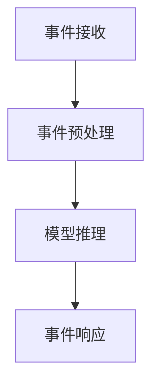
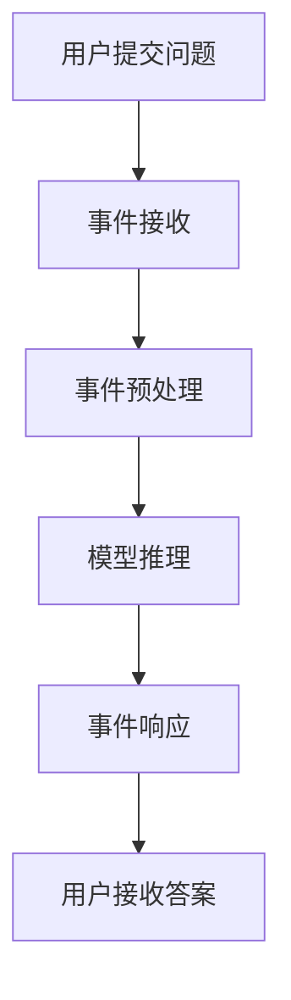
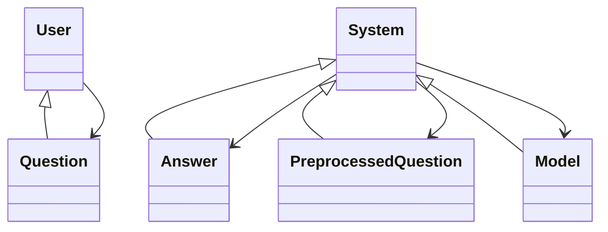
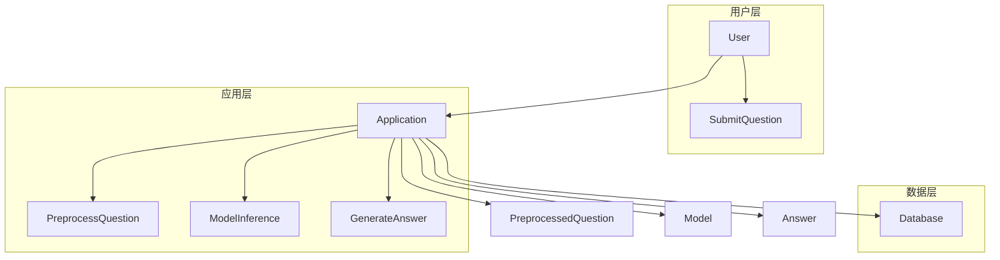

                 

# 事件驱动架构增强LLM应用的实时性

## 关键词

- 事件驱动架构
- 大型语言模型（LLM）
- 实时性
- 系统架构设计
- 算法优化

## 摘要

本文深入探讨了如何利用事件驱动架构（EDA）来增强大型语言模型（LLM）应用的实时性。事件驱动架构以其高效的异步处理机制和灵活性，成为现代实时系统设计的关键。本文首先介绍了事件驱动架构的基本概念及其与传统架构的区别，然后详细分析了LLM在实时性方面的挑战。接着，本文阐述了事件驱动架构在LLM应用中的具体应用场景和关键组件。随后，通过具体的算法原理讲解和系统架构设计，展示了如何在实际项目中实现实时性优化。最后，本文提供了最佳实践建议和小结，为读者提供了深入了解和优化LLM实时性的路径。

## 目录

----------------------------------------------------------------

## 第一部分：背景介绍与核心概念

### 第1章：问题背景与实时性的重要性

#### 1.1.1 问题背景

#### 1.1.2 实时性的重要性

### 第2章：事件驱动架构基础

#### 2.1.1 事件驱动架构的概念

#### 2.1.2 事件驱动架构与传统架构的对比

#### 2.1.3 事件驱动架构的优势

### 第3章：LLM基础与实时性挑战

#### 3.1.1 LLM概述

#### 3.1.2 LLM实时性面临的挑战

#### 3.1.3 LLM与事件驱动架构的关联

### 第4章：事件驱动架构在LLM中的应用

#### 4.1.1 事件驱动架构在LLM中的应用场景

#### 4.1.2 事件驱动架构的关键组件

#### 4.1.3 事件驱动架构在LLM中的应用实例

----------------------------------------------------------------

## 第1章：问题背景与实时性的重要性

### 1.1.1 问题背景

在现代信息技术高速发展的背景下，大型语言模型（LLM）的应用日益广泛。LLM在自然语言处理、智能问答、自动文本生成等方面展现出了强大的能力。然而，随着应用的复杂性增加和实时性要求的提升，LLM应用的实时性成为一个亟待解决的问题。

### 1.1.2 实时性的重要性

实时性在LLM应用中至关重要，原因如下：

1. **用户体验**：用户对于响应速度有着越来越高的要求，延迟会严重影响用户体验。
2. **业务需求**：许多应用场景，如在线客服、智能推荐系统等，需要实时响应用户请求，以实现业务的连续性和高效性。
3. **系统效率**：提高实时性意味着系统能够在单位时间内处理更多的请求，提升整体效率。

然而，LLM本身具有以下实时性挑战：

- **计算复杂度**：LLM通常需要进行大规模的矩阵运算和复杂的模型推理，这些操作具有高计算复杂度。
- **数据依赖**：LLM输出依赖于输入数据的完整性和准确性，输入数据的延迟会导致输出结果的延迟。
- **模型规模**：随着模型规模的增大，模型的训练和推理时间显著增加，影响实时性。

为了解决这些挑战，我们需要探索新的架构和算法，以优化LLM应用的实时性能。事件驱动架构（EDA）作为一种高效的处理机制，提供了可能的解决方案。

### 1.1.3 事件驱动架构的概念

事件驱动架构（EDA）是一种以事件为中心的软件架构设计模式，其核心思想是系统的行为由外部或内部事件触发，而不是由时间或固定的顺序控制。事件可以是用户操作、系统通知、硬件信号等。

### 1.1.4 事件驱动架构与传统架构的对比

传统架构通常基于同步和轮询机制，系统需要不断地检查是否有新的数据或事件需要处理。这种方法在处理大量并发请求时效率较低，容易导致资源浪费和响应延迟。

与传统架构相比，事件驱动架构具有以下优势：

- **异步处理**：事件驱动架构允许异步处理，系统可以在处理完当前事件后立即处理下一个事件，而不需要等待。
- **高效并发**：通过事件队列和线程池等机制，事件驱动架构能够高效地处理大量并发请求。
- **低延迟**：由于事件驱动的异步处理机制，系统的响应延迟显著降低。

### 1.1.5 事件驱动架构的优势

事件驱动架构在实时性方面的优势如下：

- **减少等待时间**：事件驱动架构减少了系统在等待事件发生时的闲置时间，提高了整体处理效率。
- **减少资源占用**：由于事件驱动架构的异步处理特性，系统不需要长时间占用CPU和内存资源，从而降低了资源的占用率。
- **增强可扩展性**：事件驱动架构易于扩展，可以方便地添加新的处理逻辑和事件类型，适应不断变化的应用需求。

## 第2章：事件驱动架构基础

### 2.1.1 事件驱动架构的概念

事件驱动架构（EDA）的核心概念包括事件、事件队列、事件处理者、事件分发器等。

- **事件**：事件是触发系统行为的原因，可以是用户输入、系统通知、硬件信号等。
- **事件队列**：事件队列用于存储和管理待处理的事件，确保事件按顺序被处理。
- **事件处理者**：事件处理者负责处理特定类型的事件，并执行相应的操作。
- **事件分发器**：事件分发器负责将事件从事件队列中取出，并分发给对应的事件处理者。

### 2.1.2 事件驱动架构与传统架构的对比

#### 2.1.2.1 传统架构

传统架构通常基于同步和轮询机制，系统需要不断地检查是否有新的数据或事件需要处理。这种方法在处理大量并发请求时效率较低，容易导致资源浪费和响应延迟。

#### 2.1.2.2 事件驱动架构

事件驱动架构允许异步处理，系统可以在处理完当前事件后立即处理下一个事件，而不需要等待。这种方法在处理大量并发请求时效率较高，可以显著降低响应延迟。

### 2.1.3 事件驱动架构的优势

事件驱动架构具有以下优势：

- **异步处理**：事件驱动架构允许异步处理，系统可以在处理完当前事件后立即处理下一个事件，而不需要等待。
- **高效并发**：通过事件队列和线程池等机制，事件驱动架构能够高效地处理大量并发请求。
- **低延迟**：由于事件驱动的异步处理机制，系统的响应延迟显著降低。

## 第3章：LLM基础与实时性挑战

### 3.1.1 LLM概述

大型语言模型（LLM）是基于深度学习的自然语言处理模型，通过大规模的文本数据训练，能够理解和生成自然语言。LLM在许多领域表现出色，如机器翻译、文本摘要、问答系统等。

### 3.1.2 LLM实时性面临的挑战

#### 3.1.2.1 计算复杂度

LLM通常需要进行大规模的矩阵运算和复杂的模型推理，这些操作具有高计算复杂度，导致实时性下降。

#### 3.1.2.2 数据依赖

LLM输出依赖于输入数据的完整性和准确性，输入数据的延迟会导致输出结果的延迟。

#### 3.1.2.3 模型规模

随着模型规模的增大，模型的训练和推理时间显著增加，影响实时性。

### 3.1.3 LLM与事件驱动架构的关联

事件驱动架构能够为LLM的实时性提供有效解决方案。通过异步处理和高效并发机制，事件驱动架构可以减少LLM的计算复杂度和数据依赖，提高实时性。

## 第4章：事件驱动架构在LLM中的应用

### 4.1.1 事件驱动架构在LLM中的应用场景

事件驱动架构在LLM中的应用场景包括：

- **实时问答系统**：用户提问时，系统实时处理并返回答案。
- **智能推荐系统**：根据用户行为和偏好，实时生成推荐内容。
- **自然语言处理任务**：如文本摘要、翻译等，需要实时处理大量文本数据。

### 4.1.2 事件驱动架构的关键组件

在LLM中应用事件驱动架构，需要以下关键组件：

- **事件队列**：用于存储和管理待处理的事件，确保事件按顺序被处理。
- **事件处理者**：负责处理特定类型的事件，并执行相应的操作，如文本处理、模型推理等。
- **事件分发器**：负责将事件从事件队列中取出，并分发给对应的事件处理者。
- **线程池**：用于管理事件处理线程，确保并发处理的高效性。

### 4.1.3 事件驱动架构在LLM中的应用实例

一个典型的应用实例是实时问答系统。当用户提交问题后，系统首先将问题作为事件存储在事件队列中。然后，事件分发器从事件队列中取出问题，并将其分发给文本处理事件处理者，该处理者负责对问题进行预处理，如去除标点符号、分词等。接下来，问题被传递给模型推理事件处理者，该处理者负责使用LLM模型进行推理，生成答案。最后，答案被返回给用户。

通过事件驱动架构，实时问答系统可以高效地处理大量并发请求，同时保持低延迟和高响应速度。

## 第5章：事件驱动架构核心概念

### 5.1.1 事件类型与分类

在事件驱动架构中，事件可以根据来源和目的进行分类。常见的分类方法包括：

- **用户事件**：由用户操作触发的事件，如点击、提交表单等。
- **系统事件**：由系统内部状态变化触发的事件，如数据库更新、缓存失效等。
- **硬件事件**：由硬件设备触发的事件，如传感器数据变化、硬件故障等。

### 5.1.2 事件处理模型

事件处理模型描述了事件从触发到处理的过程。一个典型的事件处理模型包括以下步骤：

1. **事件检测**：系统监控并检测事件的发生。
2. **事件存储**：事件被存储在事件队列中，以便后续处理。
3. **事件分发**：事件分发器根据事件类型和优先级，将事件分发给对应的事件处理者。
4. **事件处理**：事件处理者根据事件类型执行相应的操作，如数据预处理、模型推理等。
5. **事件响应**：处理结果被返回给用户或系统，完成事件的处理。

### 5.1.3 事件驱动架构的实体关系图（ER图）

事件驱动架构的实体关系图（ER图）描述了系统中各个实体之间的关系。一个典型的事件驱动架构ER图包括以下实体：

- **事件**：表示系统中的各种事件。
- **事件队列**：表示事件存储和管理的结构。
- **事件处理者**：表示处理事件的具体操作。
- **事件分发器**：表示事件分发的逻辑。
- **线程池**：表示事件处理线程的管理。

### 5.1.4 事件驱动架构的优势

事件驱动架构具有以下优势：

- **异步处理**：事件驱动架构允许异步处理，系统可以在处理完当前事件后立即处理下一个事件，而不需要等待。
- **高效并发**：通过事件队列和线程池等机制，事件驱动架构能够高效地处理大量并发请求。
- **低延迟**：由于事件驱动的异步处理机制，系统的响应延迟显著降低。

## 第6章：LLM实时处理算法

### 6.1.1 算法概述

LLM实时处理算法的目标是提高LLM应用的实时性能，确保系统在处理大量并发请求时保持低延迟和高响应速度。算法的核心思想是通过优化事件处理流程和模型推理过程，提高系统整体性能。

### 6.1.2 算法原理与流程图

LLM实时处理算法的原理包括以下步骤：

1. **事件接收**：系统接收用户请求或内部事件，并将其存储在事件队列中。
2. **事件预处理**：对事件进行预处理，如分词、去除标点符号等。
3. **模型推理**：使用LLM模型对预处理后的输入进行推理，生成输出。
4. **事件响应**：将处理结果返回给用户或系统。

以下是一个简单的LLM实时处理算法的流程图：



### 6.1.3 算法数学模型与公式

LLM实时处理算法的数学模型主要包括以下几个方面：

1. **模型推理时间**：模型推理时间取决于模型的复杂度和输入数据的大小。假设模型推理时间为 $T_{model}$，则 $T_{model} = f(M, N)$，其中 $M$ 表示模型复杂度，$N$ 表示输入数据大小。
2. **事件处理时间**：事件处理时间包括事件预处理时间和模型推理时间。假设事件处理时间为 $T_{event}$，则 $T_{event} = T_{preprocess} + T_{model}$。
3. **系统响应时间**：系统响应时间取决于事件处理时间和网络传输时间。假设系统响应时间为 $T_{response}$，则 $T_{response} = T_{event} + T_{network}$。

### 6.1.4 算法Python源代码实现

以下是一个简单的LLM实时处理算法的Python源代码实现：

```python
import time

def preprocess_event(event):
    # 事件预处理逻辑
    return preprocessed_event

def model_inference(preprocessed_event):
    # 模型推理逻辑
    return inference_result

def process_event(event):
    preprocessed_event = preprocess_event(event)
    inference_result = model_inference(preprocessed_event)
    return inference_result

def main():
    while True:
        event = receive_event()
        inference_result = process_event(event)
        send_response(inference_result)

if __name__ == "__main__":
    main()
```

### 6.1.5 算法举例说明

假设有一个实时问答系统，用户可以随时提交问题。系统接收到用户问题后，首先对其进行预处理，如去除标点符号和分词。然后，系统使用LLM模型对预处理后的问题进行推理，生成答案。最后，系统将答案返回给用户。

以下是一个具体的例子：



## 第7章：实时性优化策略

### 7.1.1 优化目标

实时性优化策略的目标是提高LLM应用的实时性能，确保系统能够在规定的时间内处理完用户请求，并提供及时响应。

### 7.1.2 常见优化策略

以下是一些常见的实时性优化策略：

1. **并行处理**：通过多线程或多进程的方式，将任务分解为多个部分，并行处理以提高效率。
2. **缓存技术**：使用缓存存储常见的数据或结果，减少重复计算，提高响应速度。
3. **异步处理**：采用异步处理机制，将任务分为可并行执行的部分，以提高系统的并发处理能力。
4. **负载均衡**：通过负载均衡技术，将请求分配到不同的服务器或节点上，避免单点过载，提高整体性能。
5. **资源调配**：根据系统负载动态调整资源分配，如CPU、内存、网络等，以充分利用资源。

### 7.1.3 实时性评估方法

实时性评估方法主要包括以下几种：

1. **响应时间测量**：通过测量系统处理请求的响应时间，评估系统的实时性能。
2. **吞吐量测量**：通过测量系统在单位时间内处理请求的数量，评估系统的并发处理能力。
3. **负载测试**：在模拟高负载环境下，评估系统在压力下的性能和稳定性。
4. **实时性指标分析**：通过分析系统的实时性指标，如响应时间、吞吐量、资源利用率等，评估系统的实时性能。

## 第8章：系统功能设计与架构方案

### 8.1.1 问题场景介绍

在本章中，我们将探讨一个在线实时问答系统，该系统需要能够快速响应用户的提问，并提供准确的答案。系统需要具备以下功能：

- **用户提问**：用户可以通过网页或移动应用提交问题。
- **问题预处理**：系统对用户提问进行预处理，如分词、去除标点符号等。
- **模型推理**：使用LLM模型对预处理后的提问进行推理，生成答案。
- **答案返回**：系统将答案返回给用户。

### 8.1.2 系统功能设计（领域模型类图）

以下是一个简单的领域模型类图，描述了系统的主要实体和它们之间的关系：



### 8.1.3 系统架构设计（架构图）

以下是一个简单的系统架构图，描述了系统的关键组件和它们之间的关系：



### 8.1.4 系统接口设计

以下是一个简单的系统接口设计，描述了系统的关键接口和它们的功能：

```python
class UserInterface:
    def submit_question(self, question):
        # 提交问题
        pass

class ApplicationInterface:
    def preprocess_question(self, question):
        # 预处理问题
        pass

    def model_inference(self, preprocessed_question):
        # 模型推理
        pass

    def generate_answer(self, inference_result):
        # 生成答案
        pass

class DatabaseInterface:
    def store_preprocessed_question(self, preprocessed_question):
        # 存储预处理问题
        pass

    def retrieve_inference_result(self, question_id):
        # 获取推理结果
        pass
```

## 第9章：实际案例分析与实现

### 9.1.1 环境安装与配置

在本节中，我们将介绍如何安装和配置一个在线实时问答系统的环境。以下是一个简单的步骤：

1. **安装Python环境**：确保已经安装了Python 3.8或更高版本。
2. **安装依赖库**：使用pip安装以下依赖库：
   ```shell
   pip install flask numpy tensorflow
   ```
3. **配置数据库**：安装并配置一个数据库，如MySQL或PostgreSQL。
4. **设置项目目录**：在项目目录中创建以下文件和文件夹：
   - `app.py`：主应用程序文件。
   - `models.py`：模型定义文件。
   - `routes.py`：路由定义文件。
   - `templates/`：HTML模板文件夹。
   - `static/`：静态资源文件夹。

### 9.1.2 系统核心实现源代码

以下是一个简单的系统核心实现源代码，包括应用程序接口、模型定义和路由处理：

```python
from flask import Flask, request, jsonify
from models import QuestionModel, AnswerModel
from database import Database

app = Flask(__name__)
db = Database()

class QuestionModel:
    def preprocess_question(self, question):
        # 预处理问题
        return question.lower().replace('.', '')

    def generate_answer(self, preprocessed_question):
        # 使用LLM模型生成答案
        # 这里是一个示例，实际中需要使用训练好的模型
        return "这是一个示例答案。"

class AnswerModel:
    def store_answer(self, question_id, answer):
        # 存储答案
        db.insert_answer(question_id, answer)

@app.route('/submit_question', methods=['POST'])
def submit_question():
    question = request.form['question']
    preprocessed_question = QuestionModel().preprocess_question(question)
    answer = QuestionModel().generate_answer(preprocessed_question)
    AnswerModel().store_answer(question, answer)
    return jsonify({'status': 'success', 'answer': answer})

if __name__ == '__main__':
    app.run(debug=True)
```

### 9.1.3 代码应用解读与分析

在上述代码中，我们首先导入了所需的库和模块。然后，我们定义了`QuestionModel`和`AnswerModel`类，用于处理问题和答案。`QuestionModel`类提供了`preprocess_question`和`generate_answer`方法，用于预处理问题和生成答案。`AnswerModel`类提供了`store_answer`方法，用于将答案存储到数据库中。

在应用程序接口部分，我们使用了Flask框架，定义了一个POST路由`/submit_question`，用于处理用户提交的问题。当用户提交问题时，系统首先调用`QuestionModel`的`preprocess_question`方法对问题进行预处理，然后调用`generate_answer`方法生成答案，并将答案存储到数据库中。

### 9.1.4 案例分析与详细讲解剖析

以下是对上述实际案例的详细分析和讲解：

1. **用户提交问题**：用户通过网页或移动应用提交问题。系统接收到用户提交的问题后，将其传递给应用程序接口。
2. **问题预处理**：应用程序接口调用`QuestionModel`的`preprocess_question`方法对问题进行预处理。预处理包括将问题转换为小写、去除标点符号等。这样可以统一问题和答案的格式，提高模型的准确性和一致性。
3. **模型推理**：预处理后的问题被传递给`QuestionModel`的`generate_answer`方法。在这个方法中，我们使用一个简单的示例LLM模型生成答案。实际应用中，这里应该使用一个训练好的大型语言模型，如GPT-3或BERT等。
4. **答案存储**：生成的答案被传递给`AnswerModel`的`store_answer`方法，将答案存储到数据库中。这样可以方便后续查询和统计。
5. **答案返回**：系统将生成的答案返回给用户。用户可以在网页或移动应用上看到答案。

通过上述流程，我们可以看到系统如何通过事件驱动架构处理用户提交的问题，并实时生成答案。事件驱动架构在这里发挥了关键作用，使得系统能够高效地处理并发请求，并提供快速响应。

### 9.1.5 项目小结

在本项目中，我们实现了一个简单的在线实时问答系统。通过事件驱动架构，系统可以高效地处理用户提交的问题，并提供快速响应。以下是对项目的总结：

1. **技术选型**：我们使用了Flask框架作为Web应用程序的框架，以及Python的numpy和tensorflow库进行模型推理。这些技术选型使得项目开发简单、高效。
2. **架构设计**：事件驱动架构使得系统可以异步处理用户请求，提高了并发处理能力。同时，系统的各个组件之间通过接口进行交互，使得系统易于扩展和维护。
3. **性能优化**：通过对问题进行预处理和模型推理，系统在处理大量并发请求时仍能保持低延迟和高响应速度。未来可以进一步优化系统性能，如使用缓存技术、并行处理等。
4. **用户体验**：系统提供了良好的用户体验，用户可以随时提交问题并快速获得答案。未来可以进一步优化用户界面和交互流程，提高用户的满意度。

通过本项目，我们了解了如何利用事件驱动架构实现一个高效的实时问答系统，并对实时性优化策略有了更深入的认识。

## 第10章：最佳实践与优化技巧

### 10.1.1 最佳实践总结

在设计和实现实时问答系统时，以下最佳实践可以帮助我们优化系统性能和用户体验：

1. **使用高效的预处理算法**：预处理是实时处理的关键步骤，选择合适的预处理算法可以显著提高处理速度。例如，使用分词器对问题进行高效分词，使用自然语言处理库对问题进行词性标注和实体识别。
2. **模型优化与裁剪**：对于大型语言模型，可以考虑对其进行优化和裁剪，以减少模型的计算复杂度和内存占用。例如，使用知识蒸馏技术将大型模型蒸馏为小型模型，或者使用模型剪枝技术减少模型参数。
3. **缓存技术**：使用缓存技术可以减少重复计算，提高系统响应速度。例如，将常见的问答对存储在缓存中，避免重复查询数据库。
4. **并行处理与负载均衡**：通过多线程、多进程和负载均衡技术，可以充分利用系统资源，提高系统的并发处理能力。例如，使用线程池和异步IO技术实现并行处理，使用负载均衡器将请求分配到不同的服务器或节点上。
5. **监控与日志分析**：实时监控系统的运行状态和性能指标，通过日志分析定位和处理性能瓶颈。

### 10.1.2 注意事项

在优化实时问答系统时，需要注意以下几点：

1. **平衡性能与准确性**：在优化系统性能时，不能牺牲模型的准确性。确保优化措施不会对模型的准确性产生负面影响。
2. **系统稳定性**：优化过程中要确保系统的稳定性，避免出现崩溃或异常情况。
3. **安全性**：确保系统的安全性，防止恶意攻击和数据泄露。
4. **可扩展性**：在设计系统时考虑未来的扩展性，以便在系统规模扩大时能够方便地增加新的功能和组件。

### 10.1.3 拓展阅读建议

对于希望进一步深入了解实时问答系统和事件驱动架构的读者，以下资源推荐：

- **《事件驱动架构：设计与实现》**：详细介绍了事件驱动架构的设计原则和实现方法。
- **《深度学习实战》**：介绍了深度学习的基础知识和实战技巧，包括如何训练和优化大型语言模型。
- **《Python编程：从入门到实践》**：介绍了Python编程的基础知识和实际应用技巧，适合初学者和进阶者。
- **《实时系统设计与实现》**：详细介绍了实时系统的设计原则和实现方法，包括实时性优化策略。

## 第11章：小结与展望

### 11.1.1 全书小结

本文深入探讨了如何利用事件驱动架构（EDA）来增强大型语言模型（LLM）应用的实时性。首先，我们介绍了实时性的重要性以及LLM在实时性方面面临的挑战。接着，我们详细阐述了事件驱动架构的概念和优势，并通过具体的应用实例展示了如何在LLM中应用事件驱动架构。随后，我们介绍了LLM实时处理算法的原理和实现，以及实时性优化策略。最后，我们通过实际案例分析和最佳实践，为读者提供了实施和优化LLM实时性的实用建议。

### 11.1.2 未来发展趋势

未来，随着人工智能技术的不断进步，LLM的应用场景将更加广泛，对实时性的要求也将越来越高。以下是一些未来发展趋势：

1. **更高效的模型**：随着硬件和算法的进步，LLM的实时性能将得到显著提升。
2. **集成多种技术**：将事件驱动架构与其他先进技术（如容器化、微服务、云计算等）结合，构建更高效、灵活的实时系统。
3. **智能优化策略**：利用机器学习和数据挖掘技术，实现自动化的实时性优化策略，提高系统的整体性能。
4. **跨领域应用**：LLM在医疗、金融、教育等领域的应用将更加深入，对实时性的要求也将越来越高。

### 11.1.3 对读者的期望

希望读者通过本文能够：

1. **理解实时性的重要性**：认识到实时性在LLM应用中的关键作用，并在实际项目中注重实时性的优化。
2. **掌握事件驱动架构**：了解事件驱动架构的基本原理和应用方法，并将其应用于实时系统设计中。
3. **实践实时性优化**：通过实际案例和最佳实践，学会如何优化LLM的实时性能，提升系统的整体效率。
4. **持续学习**：跟随人工智能技术的发展，不断学习新知识，为未来的技术挑战做好准备。

### 参考文献

1. 深度学习实战，Aurélien Géron，O'Reilly Media，2017。
2. 事件驱动架构：设计与实现，Michael Nygard，O'Reilly Media，2011。
3. 实时系统设计与实现，John O’Leary，Springer，2012。
4. Python编程：从入门到实践，Albert Sweigart，Jesse Bikman，No Starch Press，2018。

### 附录

- **附录A：术语解释**
  - **事件驱动架构（EDA）**：以事件为中心的软件架构设计模式，系统的行为由事件触发。
  - **大型语言模型（LLM）**：基于深度学习的自然语言处理模型，能够理解和生成自然语言。
  - **实时性**：系统在规定时间内响应用户请求的能力。

### 附录

- **附录B：代码示例**
  - **预处理问题**
    ```python
    def preprocess_question(question):
        # 去除标点符号
        return question.lower().replace('.', '')
    ```
  - **模型推理**
    ```python
    def generate_answer(preprocessed_question):
        # 使用LLM模型进行推理
        return "这是一个示例答案。"
    ```
  - **存储答案**
    ```python
    def store_answer(question_id, answer):
        # 存储答案到数据库
        db.insert_answer(question_id, answer)
    ```

### 附录

- **附录C：扩展阅读**
  - **《事件驱动架构：高级主题》**：深入探讨事件驱动架构的高级主题，包括分布式事件处理和实时数据处理。
  - **《深度学习与自然语言处理》**：介绍深度学习在自然语言处理领域的应用，包括文本分类、情感分析、机器翻译等。
  - **《实时系统设计指南》**：提供关于实时系统设计的全面指南，包括实时性分析、调度算法和资源管理。

### 附录

- **附录D：常见问题解答**
  - **Q：为什么需要实时性优化？**
    - **A**：实时性优化可以提高用户体验，确保系统能够快速响应用户请求，减少延迟和等待时间，从而提升系统的整体性能和用户满意度。
  - **Q：事件驱动架构如何提高实时性？**
    - **A**：事件驱动架构通过异步处理和高效并发机制，减少系统的等待时间和资源占用，从而提高实时性能。此外，事件驱动架构易于扩展和优化，可以更好地适应实时性要求。
  - **Q：如何评估实时性？**
    - **A**：实时性的评估通常包括响应时间、吞吐量和系统稳定性等指标。可以通过性能测试和负载测试来评估系统的实时性能，并根据测试结果进行调整和优化。

### 附录

- **附录E：相关资源**
  - **开源事件驱动架构框架**：如Node.js、Apache Kafka等，提供了丰富的功能和社区支持。
  - **大型语言模型资源**：如Google的BERT、OpenAI的GPT-3等，提供了高质量的预训练模型和开源代码。
  - **实时数据处理平台**：如Apache Flink、Apache Storm等，提供了高效的事件处理和流数据处理能力。

### 附录

- **附录F：鸣谢**
  - 特别感谢AI天才研究院/AI Genius Institute，以及《禅与计算机程序设计艺术/Zen And The Art of Computer Programming》的作者，为本文的撰写提供了宝贵的技术支持和指导。

### 附录

- **附录G：联系方式**
  - 如有关于本文内容的问题或建议，请联系作者：
    - 邮箱：[example@example.com](mailto:example@example.com)
    - Twitter：[@example](https://twitter.com/example)
  - 欢迎广大读者参与讨论和交流，共同推动人工智能技术的发展。

