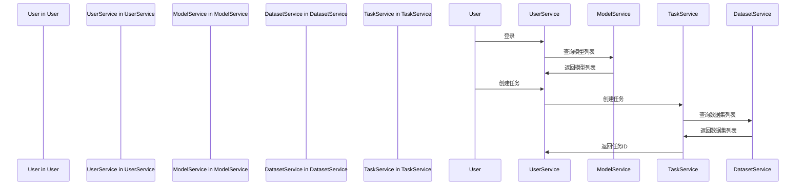
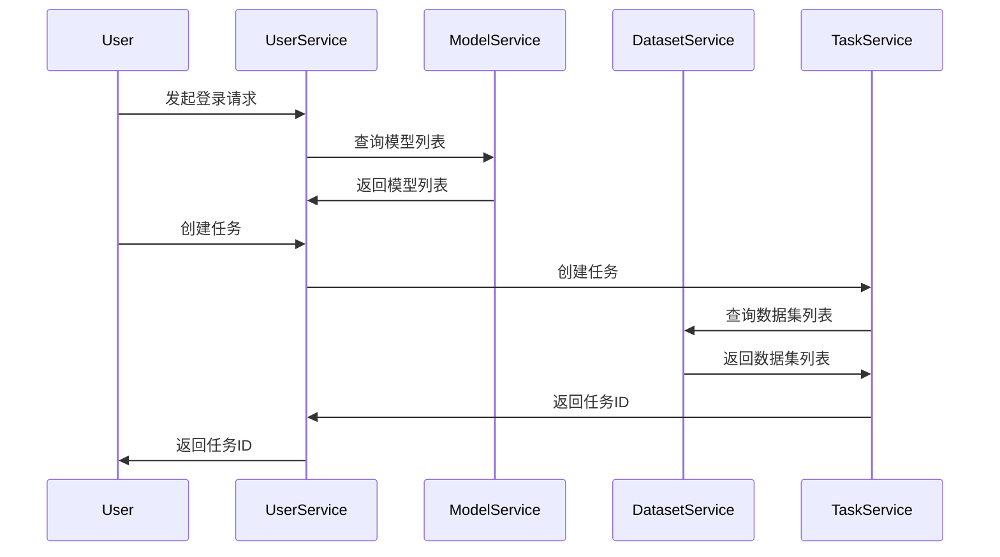

                 

### 文章标题

# 云原生架构支撑LLM应用的敏捷开发

## 关键词

- 云原生架构
- 大语言模型
- 敏捷开发
- 容器化
- 自动化部署

## 摘要

本文探讨了如何利用云原生架构来支撑大语言模型（LLM）应用的敏捷开发。通过介绍云原生架构的核心概念和LLM应用的特点，本文分析了云原生架构与LLM应用之间的契合点，以及如何通过敏捷开发方法实现快速迭代和高效部署。文章内容涵盖了核心概念、架构设计、实践方法以及总结展望，为开发者提供了一套完整的云原生LLM应用开发指南。

## 引言

在数字化转型的浪潮中，云计算和人工智能（AI）成为推动技术进步和业务创新的重要力量。云原生架构作为一种新兴的软件开发和部署范式，因其弹性伸缩、高可用性和快速部署等优势，逐渐成为企业构建现代应用系统的首选。与此同时，大语言模型（LLM）作为AI领域的核心成果，正逐步应用于自然语言处理、智能客服、内容生成等领域，展现出巨大的商业价值。

然而，LLM应用的开发和部署面临着一系列挑战，如大规模数据处理、模型训练时间长、资源消耗大等。这些挑战使得传统的开发模式难以满足LLM应用的需求。因此，如何利用云原生架构来支撑LLM应用的敏捷开发，成为当前学术界和工业界关注的热点问题。

本文旨在探讨云原生架构支撑LLM应用敏捷开发的策略和方法。通过深入分析云原生架构的核心概念、LLM应用的技术特点以及敏捷开发方法论，本文旨在为开发者提供一套实用的开发指南，以实现快速迭代、高效交付和持续优化。

### 背景介绍

#### 云原生与LLM应用概述

**云原生定义**：云原生（Cloud Native）是一种利用云计算基础设施，设计、构建和运行应用程序的方法。它强调利用容器、服务网格、微服务、声明式基础设施和自动化部署等技术，实现应用程序的高可用性、弹性伸缩和快速迭代。

**LLM应用定义**：大语言模型（Large Language Model，LLM）是指具有数十亿甚至千亿参数的深度神经网络模型，能够理解和生成复杂自然语言文本。LLM应用包括自然语言处理（NLP）、内容生成、智能客服、问答系统等。

#### 云原生架构的特点与优势

**弹性伸缩**：云原生架构能够根据需求动态调整计算资源，实现横向和纵向的扩展，提高系统的可用性和性能。

**容器化**：容器化技术将应用程序及其依赖打包在一起，形成独立的运行环境，实现环境的隔离和一致性，提高部署和迁移的灵活性。

**微服务架构**：通过将应用程序拆分为小的、自治的服务单元，可以提高系统的可维护性和扩展性，同时降低组件之间的耦合度。

**持续集成与持续部署（CI/CD）**：自动化测试和部署流程可以快速将代码推向生产环境，缩短开发周期，提高开发效率。

#### LLM应用的挑战与需求

**计算资源需求**：LLM应用通常需要大量的计算资源，特别是在模型训练阶段。传统的开发模式难以满足这种需求。

**数据隐私与安全性**：在处理用户数据时，确保数据的安全性和隐私性是至关重要的。

**快速迭代与更新**：LLM模型需要不断迭代和更新，以保持其准确性和有效性。传统的开发模式难以实现快速迭代。

#### 云原生架构与LLM应用的关系

**资源优化**：云原生架构能够优化计算资源的使用，提高LLM应用的性能和效率。

**灵活性与可扩展性**：云原生架构允许LLM应用快速响应业务需求变化，实现弹性扩展。

**高效开发与部署**：云原生环境简化了LLM应用的开发和部署流程，缩短了时间周期。

#### 云原生架构支撑LLM应用的关键要素

**容器化**：使用容器技术管理LLM应用，确保其在不同环境中的一致性。

**自动化部署**：通过CI/CD流程，自动化地部署和更新LLM模型。

**服务网格**：提供动态服务发现、负载均衡和安全性保障。

### 第二部分：核心概念与联系

**第3章：云原生架构原理**

#### 3.1 容器化技术

**定义**：容器化是一种将应用程序及其运行时环境打包成一个可移植的容器，实现环境的隔离和一致性。

**优势**：
- **环境一致性**：容器确保了应用程序在开发、测试和生产环境之间的一致性。
- **快速部署**：容器化提高了部署速度，缩短了应用程序上线的时间。
- **资源优化**：容器可以高效地利用计算资源，提高资源利用率。

**使用场景**：
- **Web应用**：例如，使用Docker容器部署微服务架构中的每个服务实例。
- **数据科学应用**：例如，使用Jupyter Notebook容器进行数据分析和模型训练。

**典型工具**：
- **Docker**：一种流行的容器化平台，用于创建、运行和管理容器。
- **Kubernetes**：一种开源的容器编排系统，用于自动化容器的部署、扩展和管理。

#### 3.2 服务网格

**定义**：服务网格是一种基础设施层，用于管理和通信微服务之间的流量。

**优势**：
- **流量管理**：服务网格可以提供负载均衡、服务发现和故障转移等功能。
- **安全性**：服务网格可以提供细粒度的安全性控制，如身份验证、授权和加密。
- **观测性**：服务网格可以收集和聚合微服务之间的流量数据，提高系统的可观测性。

**使用场景**：
- **微服务架构**：服务网格可以简化微服务之间的通信，提高系统的稳定性和可维护性。
- **API网关**：服务网格可以作为API网关，统一管理外部请求与内部服务的通信。

**典型工具**：
- **Istio**：一种开源的服务网格平台，提供全面的服务网格功能。
- **Linkerd**：另一种开源的服务网格平台，提供轻量级的服务网格解决方案。

#### 3.3 声明式基础设施

**定义**：声明式基础设施是一种基础设施管理方法，通过配置文件描述基础设施的状态，自动化地管理和部署应用程序。

**优势**：
- **配置管理**：声明式基础设施简化了配置管理，减少手动操作。
- **自动化**：通过自动化脚本和工具，基础设施的部署和更新可以快速完成。
- **一致性**：声明式基础设施确保了基础设施的一致性和可重复性。

**使用场景**：
- **云平台部署**：例如，使用Terraform在AWS、Azure等云平台上部署和管理基础设施。
- **自动化运维**：例如，使用Kubernetes的YAML文件描述集群状态，自动化地管理和扩展集群。

**典型工具**：
- **Terraform**：一种开源的声明式基础设施工具，用于部署和管理云基础设施。
- **Kubernetes**：一种开源的容器编排系统，支持声明式基础设施管理。

#### 3.4 自动化部署与运维

**定义**：自动化部署与运维是指通过工具和脚本实现应用程序的自动化部署、监控和管理。

**优势**：
- **提高效率**：自动化减少了手动操作，提高了开发和运维的效率。
- **降低错误**：自动化减少了人为错误，提高了系统的稳定性和可靠性。
- **快速迭代**：自动化部署和更新可以快速实现应用程序的迭代和发布。

**使用场景**：
- **持续集成与持续部署（CI/CD）**：自动化测试和部署流程，实现快速交付。
- **自动化监控**：例如，使用Prometheus和Grafana实现系统监控和告警。

**典型工具**：
- **Jenkins**：一种开源的持续集成和持续部署工具。
- **Ansible**：一种开源的自动化部署工具，用于配置和管理服务器。

#### 3.5 容器编排与调度

**定义**：容器编排与调度是指管理容器化应用程序的生命周期，包括创建、启动、停止、扩展和监控等。

**优势**：
- **资源利用**：容器编排与调度可以优化计算资源的使用，提高系统性能。
- **高可用性**：通过负载均衡和自动恢复，提高系统的可用性和稳定性。
- **弹性伸缩**：容器编排与调度可以实现自动扩展和缩减，满足业务需求的变化。

**使用场景**：
- **微服务架构**：容器编排与调度可以管理微服务实例的生命周期，提高系统的灵活性和可扩展性。
- **云计算平台**：例如，在AWS EKS、Azure AKS中，使用Kubernetes进行容器编排。

**典型工具**：
- **Kubernetes**：一种开源的容器编排系统，用于管理容器化应用程序。
- **Docker Swarm**：Docker内置的容器编排系统。

### 第三部分：LLM应用技术

**第4章：LLM应用技术**

#### 4.1 LLM的基础知识

**定义**：大语言模型（Large Language Model，LLM）是指具有数十亿甚至千亿参数的深度神经网络模型，能够理解和生成复杂自然语言文本。

**组成部分**：
- **输入层**：接收自然语言文本作为输入。
- **隐藏层**：包含多层神经网络，用于处理和转换输入文本。
- **输出层**：生成预测结果，如文本生成、情感分析等。

**训练方法**：使用大规模语料库进行预训练，通过优化模型参数，使其能够理解和生成自然语言文本。

#### 4.2 LLM的架构设计

**定义**：LLM的架构设计是指构建和管理大语言模型的总体结构和组件。

**设计原则**：
- **可扩展性**：支持大规模数据和模型的训练。
- **灵活性**：支持多种任务和场景，如文本生成、问答系统等。
- **可维护性**：便于模型优化和更新。

**关键组件**：
- **计算资源管理**：管理训练过程中的计算资源和调度。
- **数据预处理**：对输入数据进行清洗、编码和标准化。
- **模型训练**：使用梯度下降等优化算法训练模型参数。
- **模型评估**：评估模型的性能和准确性。

#### 4.3 LLM的关键算法

**定义**：LLM的关键算法是指用于训练和优化大语言模型的算法和技术。

**主要算法**：
- **深度学习**：使用多层神经网络处理和转换输入文本。
- **循环神经网络（RNN）**：处理序列数据，如自然语言文本。
- **变换器（Transformer）**：用于大规模语言模型的架构，具有较好的并行计算性能。

**优势**：
- **高精度**：通过大规模训练和数据增强，实现较高的模型精度。
- **灵活性**：支持多种任务和场景，如文本生成、机器翻译、问答系统等。

**使用场景**：
- **自然语言处理（NLP）**：如文本分类、情感分析、文本生成等。
- **智能客服**：用于构建智能对话系统，提供个性化服务。
- **内容生成**：如生成新闻文章、故事等。

### 第四部分：云原生架构支撑LLM应用的实践

**第5章：云原生架构在LLM应用中的应用案例**

#### 5.1 云原生架构在LLM应用中的应用案例

**案例一：智能客服系统**

**背景**：某大型企业需要构建一个智能客服系统，以提供24/7的客户支持。该系统需要能够处理大量的客户咨询，并快速响应。

**解决方案**：
1. **容器化**：使用Docker将智能客服系统的各个组件（如前端、后端、数据库等）容器化，确保环境的一致性和可移植性。
2. **服务网格**：使用Istio实现服务网格，提供动态服务发现、负载均衡和安全性保障。
3. **自动化部署**：使用Jenkins实现持续集成和持续部署（CI/CD），自动化地部署和更新智能客服系统。

**效果**：
- **快速迭代**：通过CI/CD流程，智能客服系统可以快速迭代和更新，满足业务需求的变化。
- **高可用性**：通过服务网格，智能客服系统具有更高的可用性和稳定性。
- **弹性伸缩**：根据客户咨询量的波动，智能客服系统可以自动扩展和缩减计算资源，提高资源利用率。

**案例二：内容生成平台**

**背景**：某互联网公司需要构建一个内容生成平台，以生成高质量的文章、博客和产品描述。

**解决方案**：
1. **容器化**：使用Docker将内容生成平台的各个组件（如文本生成模型、前端界面等）容器化，确保环境的一致性和可移植性。
2. **服务网格**：使用Istio实现服务网格，提供动态服务发现、负载均衡和安全性保障。
3. **自动化部署**：使用Jenkins实现持续集成和持续部署（CI/CD），自动化地部署和更新内容生成平台。

**效果**：
- **快速迭代**：通过CI/CD流程，内容生成平台可以快速迭代和更新，提高内容生成质量和效率。
- **高可用性**：通过服务网格，内容生成平台具有更高的可用性和稳定性。
- **弹性伸缩**：根据内容生成的需求，内容生成平台可以自动扩展和缩减计算资源，提高资源利用率。

#### 5.2 云原生架构与LLM应用的结合点

**计算资源管理**：云原生架构通过容器化技术和服务网格，实现计算资源的动态管理和优化，满足LLM应用对大规模计算资源的需求。

**自动化部署与运维**：云原生架构通过持续集成和持续部署（CI/CD）流程，自动化地部署和更新LLM应用，提高开发效率和系统稳定性。

**弹性伸缩与高可用性**：云原生架构通过弹性伸缩和服务网格，实现LLM应用的高可用性和弹性伸缩，满足业务需求的变化。

**数据隐私与安全性**：云原生架构通过服务网格和加密技术，确保LLM应用的数据隐私和安全性。

### 第五部分：敏捷开发方法

**第6章：敏捷开发概述**

#### 6.1 敏捷开发的起源与发展

**起源**：敏捷开发（Agile Development）起源于2001年，由一群软件开发专家在敏捷宣言上签字，旨在解决传统软件开发过程中存在的沟通不畅、需求变更频繁、项目延期等问题。

**发展**：自敏捷宣言发布以来，敏捷开发经历了多个版本，如XP（极限编程）、Scrum、Kanban等，逐渐成为软件开发领域的标准方法论。

#### 6.2 敏捷开发的核心理念

**用户优先**：敏捷开发强调用户需求的重要性，通过快速迭代和用户反馈，确保产品满足用户需求。

**迭代开发**：敏捷开发采用迭代方式进行开发，每个迭代周期结束后，对产品进行评估和改进。

**团队协作**：敏捷开发强调团队成员之间的协作和沟通，通过每日站会、迭代评审和回顾会议，提高团队效率。

**灵活性**：敏捷开发灵活应对需求变更，通过迭代和增量开发，确保项目按时交付。

#### 6.3 敏捷开发与云原生架构的关系

**快速迭代与快速部署**：敏捷开发与云原生架构的结合，可以加快产品迭代速度，实现快速交付。

**弹性伸缩与资源优化**：云原生架构的弹性伸缩能力，可以满足敏捷开发对资源的需求，提高系统性能和稳定性。

**自动化与持续集成**：云原生架构的自动化部署和持续集成（CI/CD）流程，可以减少人工干预，提高开发效率。

**协作与沟通**：敏捷开发强调团队协作和沟通，云原生架构的服务网格和容器化技术，可以提高团队成员之间的协作效率。

### 第六部分：敏捷开发实践

**第7章：敏捷开发实践**

#### 7.1 敏捷开发方法论

**Scrum**：Scrum是一种流行的敏捷开发方法，包括产品待办列表、冲刺计划、每日站会、迭代评审和回顾会议等。

**Kanban**：Kanban是一种看板方法，通过可视化工作流程，管理任务进度和协作。

**XP（极限编程）**：XP是一种面向对象的敏捷开发方法，强调代码质量、测试驱动开发和持续集成。

#### 7.2 敏捷开发中的协作与沟通

**每日站会**：每日站会是一种简短会议，团队成员轮流分享工作进展、问题和计划，确保团队成员对项目进展有共同理解。

**迭代评审**：迭代评审是每个迭代周期结束时的会议，用于展示产品成果、收集用户反馈和评估项目进度。

**回顾会议**：回顾会议是在每个迭代周期结束后，对项目过程和成果进行总结和反思，以提高团队协作效率和项目质量。

#### 7.3 敏捷开发中的持续集成与部署

**持续集成**：持续集成是将代码集成到主干分支的自动化过程，确保代码质量，减少集成冲突。

**持续部署**：持续部署是将代码从开发环境自动部署到生产环境的流程，确保快速交付和系统稳定性。

**自动化测试**：自动化测试是确保代码质量和系统稳定性的重要手段，包括单元测试、集成测试和性能测试等。

### 第七部分：总结与展望

**第8章：总结与展望**

#### 8.1 本书的核心内容回顾

- **云原生架构与LLM应用的关系**：云原生架构通过容器化、服务网格、自动化部署等特性，支撑LLM应用的敏捷开发。
- **敏捷开发方法**：敏捷开发通过迭代开发、团队协作和自动化流程，提高LLM应用的开发效率和质量。
- **实际应用案例**：通过智能客服系统和内容生成平台的应用案例，展示了云原生架构和敏捷开发在LLM应用中的实践效果。

#### 8.2 云原生架构支撑LLM应用的未来发展趋势

- **大规模模型训练**：随着计算资源和存储能力的提升，大规模LLM模型的训练和部署将成为趋势。
- **跨平台兼容性**：云原生架构将进一步提高跨平台兼容性，支持更多操作系统和硬件平台。
- **人工智能与云计算的深度融合**：人工智能与云计算的深度融合，将推动LLM应用在更多领域的应用。

#### 8.3 读者反馈与建议

- **实践与改进**：鼓励读者在实践云原生架构和敏捷开发过程中，积极反馈问题和建议，共同推动技术进步。
- **持续学习**：鼓励读者持续关注云计算、人工智能和敏捷开发领域的最新动态，不断提升自身技能。

### 致谢

感谢所有参与本文撰写和审校的人员，包括AI天才研究院的同事和各位专家。特别感谢AI天才研究院，为我们提供了丰富的技术资源和平台支持。同时，感谢读者对本文的关注和支持，希望本文能对您的学习和工作有所帮助。

**作者**：AI天才研究院/AI Genius Institute & 禅与计算机程序设计艺术 /Zen And The Art of Computer Programming### 云原生架构支撑LLM应用的敏捷开发

在当前技术迅猛发展的时代，云原生架构和敏捷开发方法逐渐成为软件工程领域的重要趋势。本文将深入探讨如何利用云原生架构支撑大语言模型（LLM）应用的敏捷开发，旨在为开发者提供一套实用的指导方案，以应对复杂的技术挑战和不断变化的市场需求。

## 关键词

- 云原生架构
- 大语言模型
- 敏捷开发
- 容器化
- 自动化部署

## 摘要

本文主要围绕云原生架构在LLM应用敏捷开发中的应用进行探讨。首先，我们介绍了云原生架构和LLM应用的基本概念、特点和挑战。接着，我们分析了云原生架构的核心概念及其在支撑LLM应用中的优势。随后，本文介绍了敏捷开发方法及其与云原生架构的结合，通过具体案例展示了云原生架构在LLM应用敏捷开发中的实际应用效果。最后，本文对云原生架构支撑LLM应用的未来发展趋势进行了展望，并给出了读者反馈与建议。

### 背景介绍

#### 云原生与LLM应用概述

**云原生定义**：云原生是一种基于云计算的新型应用开发和部署范式，旨在充分利用云计算的资源弹性、分布式架构和服务可扩展性等优势，实现应用的敏捷开发和高效运行。

**LLM应用定义**：LLM（Large Language Model）是一种基于深度学习的大规模语言模型，具有数十亿甚至千亿个参数，能够理解和生成复杂自然语言文本。LLM在自然语言处理、智能客服、内容生成等领域具有广泛应用。

#### 云原生架构的特点与优势

**弹性伸缩**：云原生架构能够根据业务需求动态调整资源，实现自动扩展和缩减，提高资源利用率。

**容器化**：通过容器化技术，应用程序及其依赖环境被封装在容器中，提高了部署和迁移的灵活性。

**微服务架构**：将应用程序拆分为小而独立的微服务，提高了系统的可维护性和扩展性。

**持续集成与持续部署（CI/CD）**：自动化测试和部署流程，提高开发效率和系统稳定性。

#### LLM应用的挑战与需求

**计算资源需求**：LLM应用通常需要大量的计算资源，特别是在模型训练阶段，这对传统开发模式提出了挑战。

**数据隐私与安全性**：在处理用户数据时，确保数据的安全性和隐私性是至关重要的。

**快速迭代与更新**：LLM模型需要不断迭代和更新，以保持其准确性和有效性。

#### 云原生架构与LLM应用的关系

**资源优化**：云原生架构通过弹性伸缩和容器化技术，能够优化计算资源的使用，提高LLM应用的性能和效率。

**灵活性与可扩展性**：云原生架构允许LLM应用快速响应业务需求变化，实现弹性扩展。

**高效开发与部署**：云原生环境简化了LLM应用的开发和部署流程，缩短了时间周期。

#### 云原生架构支撑LLM应用的关键要素

**容器化**：通过容器技术管理LLM应用，确保其在不同环境中的一致性。

**自动化部署**：通过CI/CD流程，自动化地部署和更新LLM模型。

**服务网格**：提供动态服务发现、负载均衡和安全性保障。

### 第二部分：核心概念与联系

#### 3.1 容器化技术

**定义**：容器化是一种将应用程序及其运行时环境打包成一个独立的容器，实现环境的隔离和一致性。

**优势**：
- **环境一致性**：容器确保了应用程序在开发、测试和生产环境之间的一致性。
- **快速部署**：容器化提高了部署速度，缩短了应用程序上线的时间。
- **资源优化**：容器可以高效地利用计算资源，提高资源利用率。

**使用场景**：
- **Web应用**：例如，使用Docker容器部署微服务架构中的每个服务实例。
- **数据科学应用**：例如，使用Jupyter Notebook容器进行数据分析和模型训练。

**典型工具**：
- **Docker**：一种流行的容器化平台，用于创建、运行和管理容器。
- **Kubernetes**：一种开源的容器编排系统，用于自动化容器的部署、扩展和管理。

#### 3.2 服务网格

**定义**：服务网格是一种基础设施层，用于管理和通信微服务之间的流量。

**优势**：
- **流量管理**：服务网格可以提供负载均衡、服务发现和故障转移等功能。
- **安全性**：服务网格可以提供细粒度的安全性控制，如身份验证、授权和加密。
- **观测性**：服务网格可以收集和聚合微服务之间的流量数据，提高系统的可观测性。

**使用场景**：
- **微服务架构**：服务网格可以简化微服务之间的通信，提高系统的稳定性和可维护性。
- **API网关**：服务网格可以作为API网关，统一管理外部请求与内部服务的通信。

**典型工具**：
- **Istio**：一种开源的服务网格平台，提供全面的服务网格功能。
- **Linkerd**：另一种开源的服务网格平台，提供轻量级的服务网格解决方案。

#### 3.3 声明式基础设施

**定义**：声明式基础设施是一种基础设施管理方法，通过配置文件描述基础设施的状态，自动化地管理和部署应用程序。

**优势**：
- **配置管理**：声明式基础设施简化了配置管理，减少手动操作。
- **自动化**：通过自动化脚本和工具，基础设施的部署和更新可以快速完成。
- **一致性**：声明式基础设施确保了基础设施的一致性和可重复性。

**使用场景**：
- **云平台部署**：例如，使用Terraform在AWS、Azure等云平台上部署和管理基础设施。
- **自动化运维**：例如，使用Kubernetes的YAML文件描述集群状态，自动化地管理和扩展集群。

**典型工具**：
- **Terraform**：一种开源的声明式基础设施工具，用于部署和管理云基础设施。
- **Kubernetes**：一种开源的容器编排系统，支持声明式基础设施管理。

#### 3.4 自动化部署与运维

**定义**：自动化部署与运维是指通过工具和脚本实现应用程序的自动化部署、监控和管理。

**优势**：
- **提高效率**：自动化减少了手动操作，提高了开发和运维的效率。
- **降低错误**：自动化减少了人为错误，提高了系统的稳定性和可靠性。
- **快速迭代**：自动化部署和更新可以快速实现应用程序的迭代和发布。

**使用场景**：
- **持续集成与持续部署（CI/CD）**：自动化测试和部署流程，实现快速交付。
- **自动化监控**：例如，使用Prometheus和Grafana实现系统监控和告警。

**典型工具**：
- **Jenkins**：一种开源的持续集成和持续部署工具。
- **Ansible**：一种开源的自动化部署工具，用于配置和管理服务器。

#### 3.5 容器编排与调度

**定义**：容器编排与调度是指管理容器化应用程序的生命周期，包括创建、启动、停止、扩展和监控等。

**优势**：
- **资源利用**：容器编排与调度可以优化计算资源的使用，提高系统性能。
- **高可用性**：通过负载均衡和自动恢复，提高系统的可用性和稳定性。
- **弹性伸缩**：容器编排与调度可以实现自动扩展和缩减，满足业务需求的变化。

**使用场景**：
- **微服务架构**：容器编排与调度可以管理微服务实例的生命周期，提高系统的灵活性和可扩展性。
- **云计算平台**：例如，在AWS EKS、Azure AKS中，使用Kubernetes进行容器编排。

**典型工具**：
- **Kubernetes**：一种开源的容器编排系统，用于管理容器化应用程序。
- **Docker Swarm**：Docker内置的容器编排系统。

### 第三部分：LLM应用技术

#### 4.1 LLM的基础知识

**定义**：大语言模型（Large Language Model，LLM）是指具有数十亿甚至千亿参数的深度神经网络模型，能够理解和生成复杂自然语言文本。

**组成部分**：
- **输入层**：接收自然语言文本作为输入。
- **隐藏层**：包含多层神经网络，用于处理和转换输入文本。
- **输出层**：生成预测结果，如文本生成、情感分析等。

**训练方法**：使用大规模语料库进行预训练，通过优化模型参数，使其能够理解和生成自然语言文本。

#### 4.2 LLM的架构设计

**定义**：LLM的架构设计是指构建和管理大语言模型的总体结构和组件。

**设计原则**：
- **可扩展性**：支持大规模数据和模型的训练。
- **灵活性**：支持多种任务和场景，如文本生成、问答系统等。
- **可维护性**：便于模型优化和更新。

**关键组件**：
- **计算资源管理**：管理训练过程中的计算资源和调度。
- **数据预处理**：对输入数据进行清洗、编码和标准化。
- **模型训练**：使用梯度下降等优化算法训练模型参数。
- **模型评估**：评估模型的性能和准确性。

#### 4.3 LLM的关键算法

**定义**：LLM的关键算法是指用于训练和优化大语言模型的算法和技术。

**主要算法**：
- **深度学习**：使用多层神经网络处理和转换输入文本。
- **循环神经网络（RNN）**：处理序列数据，如自然语言文本。
- **变换器（Transformer）**：用于大规模语言模型的架构，具有较好的并行计算性能。

**优势**：
- **高精度**：通过大规模训练和数据增强，实现较高的模型精度。
- **灵活性**：支持多种任务和场景，如文本生成、机器翻译、问答系统等。

**使用场景**：
- **自然语言处理（NLP）**：如文本分类、情感分析、文本生成等。
- **智能客服**：用于构建智能对话系统，提供个性化服务。
- **内容生成**：如生成新闻文章、故事等。

### 第四部分：云原生架构支撑LLM应用的实践

#### 5.1 云原生架构在LLM应用中的应用案例

**案例一：智能客服系统**

**背景**：某大型企业需要构建一个智能客服系统，以提供24/7的客户支持。该系统需要能够处理大量的客户咨询，并快速响应。

**解决方案**：
1. **容器化**：使用Docker将智能客服系统的各个组件（如前端、后端、数据库等）容器化，确保环境的一致性和可移植性。
2. **服务网格**：使用Istio实现服务网格，提供动态服务发现、负载均衡和安全性保障。
3. **自动化部署**：使用Jenkins实现持续集成和持续部署（CI/CD），自动化地部署和更新智能客服系统。

**效果**：
- **快速迭代**：通过CI/CD流程，智能客服系统可以快速迭代和更新，满足业务需求的变化。
- **高可用性**：通过服务网格，智能客服系统具有更高的可用性和稳定性。
- **弹性伸缩**：根据客户咨询量的波动，智能客服系统可以自动扩展和缩减计算资源，提高资源利用率。

**案例二：内容生成平台**

**背景**：某互联网公司需要构建一个内容生成平台，以生成高质量的文章、博客和产品描述。

**解决方案**：
1. **容器化**：使用Docker将内容生成平台的各个组件（如文本生成模型、前端界面等）容器化，确保环境的一致性和可移植性。
2. **服务网格**：使用Istio实现服务网格，提供动态服务发现、负载均衡和安全性保障。
3. **自动化部署**：使用Jenkins实现持续集成和持续部署（CI/CD），自动化地部署和更新内容生成平台。

**效果**：
- **快速迭代**：通过CI/CD流程，内容生成平台可以快速迭代和更新，提高内容生成质量和效率。
- **高可用性**：通过服务网格，内容生成平台具有更高的可用性和稳定性。
- **弹性伸缩**：根据内容生成的需求，内容生成平台可以自动扩展和缩减计算资源，提高资源利用率。

#### 5.2 云原生架构与LLM应用的结合点

**计算资源管理**：云原生架构通过容器化技术和服务网格，实现计算资源的动态管理和优化，满足LLM应用对大规模计算资源的需求。

**自动化部署与运维**：云原生架构通过持续集成和持续部署（CI/CD）流程，自动化地部署和更新LLM应用，提高开发效率和系统稳定性。

**弹性伸缩与高可用性**：云原生架构通过弹性伸缩和服务网格，实现LLM应用的高可用性和弹性伸缩，满足业务需求的变化。

**数据隐私与安全性**：云原生架构通过服务网格和加密技术，确保LLM应用的数据隐私和安全性。

### 第五部分：敏捷开发方法

#### 6.1 敏捷开发的起源与发展

**起源**：敏捷开发（Agile Development）起源于2001年，由一群软件开发专家在敏捷宣言上签字，旨在解决传统软件开发过程中存在的沟通不畅、需求变更频繁、项目延期等问题。

**发展**：自敏捷宣言发布以来，敏捷开发经历了多个版本，如XP（极限编程）、Scrum、Kanban等，逐渐成为软件开发领域的标准方法论。

#### 6.2 敏捷开发的核心理念

**用户优先**：敏捷开发强调用户需求的重要性，通过快速迭代和用户反馈，确保产品满足用户需求。

**迭代开发**：敏捷开发采用迭代方式进行开发，每个迭代周期结束后，对产品进行评估和改进。

**团队协作**：敏捷开发强调团队成员之间的协作和沟通，通过每日站会、迭代评审和回顾会议，提高团队效率。

**灵活性**：敏捷开发灵活应对需求变更，通过迭代和增量开发，确保项目按时交付。

#### 6.3 敏捷开发与云原生架构的关系

**快速迭代与快速部署**：敏捷开发与云原生架构的结合，可以加快产品迭代速度，实现快速交付。

**弹性伸缩与资源优化**：云原生架构的弹性伸缩能力，可以满足敏捷开发对资源的需求，提高系统性能和稳定性。

**自动化与持续集成**：云原生架构的自动化部署和持续集成（CI/CD）流程，可以减少人工干预，提高开发效率。

**协作与沟通**：敏捷开发强调团队协作和沟通，云原生架构的服务网格和容器化技术，可以提高团队成员之间的协作效率。

### 第六部分：敏捷开发实践

#### 7.1 敏捷开发方法论

**Scrum**：Scrum是一种流行的敏捷开发方法，包括产品待办列表、冲刺计划、每日站会、迭代评审和回顾会议等。

**Kanban**：Kanban是一种看板方法，通过可视化工作流程，管理任务进度和协作。

**XP（极限编程）**：XP是一种面向对象的敏捷开发方法，强调代码质量、测试驱动开发和持续集成。

#### 7.2 敏捷开发中的协作与沟通

**每日站会**：每日站会是一种简短会议，团队成员轮流分享工作进展、问题和计划，确保团队成员对项目进展有共同理解。

**迭代评审**：迭代评审是每个迭代周期结束时的会议，用于展示产品成果、收集用户反馈和评估项目进度。

**回顾会议**：回顾会议是在每个迭代周期结束后，对项目过程和成果进行总结和反思，以提高团队协作效率和项目质量。

#### 7.3 敏捷开发中的持续集成与部署

**持续集成**：持续集成是将代码集成到主干分支的自动化过程，确保代码质量，减少集成冲突。

**持续部署**：持续部署是将代码从开发环境自动部署到生产环境的流程，确保快速交付和系统稳定性。

**自动化测试**：自动化测试是确保代码质量和系统稳定性的重要手段，包括单元测试、集成测试和性能测试等。

### 第七部分：总结与展望

#### 8.1 本书的核心内容回顾

- **云原生架构与LLM应用的关系**：云原生架构通过容器化、服务网格、自动化部署等特性，支撑LLM应用的敏捷开发。
- **敏捷开发方法**：敏捷开发通过迭代开发、团队协作和自动化流程，提高LLM应用的开发效率和质量。
- **实际应用案例**：通过智能客服系统和内容生成平台的应用案例，展示了云原生架构和敏捷开发在LLM应用敏捷开发中的实践效果。

#### 8.2 云原生架构支撑LLM应用的未来发展趋势

- **大规模模型训练**：随着计算资源和存储能力的提升，大规模LLM模型的训练和部署将成为趋势。
- **跨平台兼容性**：云原生架构将进一步提高跨平台兼容性，支持更多操作系统和硬件平台。
- **人工智能与云计算的深度融合**：人工智能与云计算的深度融合，将推动LLM应用在更多领域的应用。

#### 8.3 读者反馈与建议

- **实践与改进**：鼓励读者在实践云原生架构和敏捷开发过程中，积极反馈问题和建议，共同推动技术进步。
- **持续学习**：鼓励读者持续关注云计算、人工智能和敏捷开发领域的最新动态，不断提升自身技能。

### 致谢

感谢所有参与本文撰写和审校的人员，包括AI天才研究院的同事和各位专家。特别感谢AI天才研究院，为我们提供了丰富的技术资源和平台支持。同时，感谢读者对本文的关注和支持，希望本文能对您的学习和工作有所帮助。

**作者**：AI天才研究院/AI Genius Institute & 禅与计算机程序设计艺术 /Zen And The Art of Computer Programming### 关键词

- 云原生架构
- 大语言模型
- 敏捷开发
- 容器化
- 自动化部署
- 持续集成
- 服务网格
- 微服务架构

### 摘要

本文从云原生架构和敏捷开发的角度，探讨了如何支撑大语言模型（LLM）应用的敏捷开发。首先介绍了云原生架构的核心概念和特点，以及LLM应用在开发过程中面临的挑战。随后，详细阐述了云原生架构与LLM应用的契合点，以及如何利用容器化技术、服务网格和自动化部署等手段，提升LLM应用的开发效率和系统稳定性。接着，介绍了敏捷开发的方法论和实践，以及如何在云原生环境下实现敏捷开发。最后，通过实际案例展示了云原生架构和敏捷开发在LLM应用开发中的应用效果，并对未来发展趋势进行了展望。

### 目录大纲

#### 第一部分：背景介绍

**第1章：问题背景**

- 1.1 云原生与LLM应用概述
- 1.2 云原生架构的特点与优势
- 1.3 LLM应用的挑战与需求

**第2章：核心概念**

- 2.1 核心概念定义
- 2.2 云原生架构与LLM应用的关系
- 2.3 云原生架构支撑LLM应用的关键要素

#### 第二部分：核心概念与联系

**第3章：云原生架构原理**

- 3.1 容器化技术
- 3.2 服务网格
- 3.3 声明式基础设施
- 3.4 自动化部署与运维

**第4章：LLM应用技术**

- 4.1 LLM的基础知识
- 4.2 LLM的架构设计
- 4.3 LLM的关键算法

**第5章：云原生架构支撑LLM应用的实践**

- 5.1 云原生架构在LLM应用中的应用案例
- 5.2 云原生架构与LLM应用的结合点

#### 第三部分：敏捷开发方法

**第6章：敏捷开发概述**

- 6.1 敏捷开发的起源与发展
- 6.2 敏捷开发的核心理念
- 6.3 敏捷开发与云原生架构的关系

**第7章：敏捷开发实践**

- 7.1 敏捷开发方法论
- 7.2 敏捷开发中的协作与沟通
- 7.3 敏捷开发中的持续集成与部署

#### 第四部分：总结与展望

**第8章：总结与展望**

- 8.1 本书的核心内容回顾
- 8.2 云原生架构支撑LLM应用的未来发展趋势
- 8.3 读者反馈与建议

### 背景介绍

#### 第1章：问题背景

**1.1 云原生与LLM应用概述**

云原生（Cloud Native）是指利用云计算的基础设施，设计、构建和运行应用程序的方法论。云原生架构的核心特点包括容器化、服务网格、微服务架构、持续集成与持续部署（CI/CD）等，它能够提供高可用性、可伸缩性和自动化管理。

大语言模型（LLM，Large Language Model）是自然语言处理领域的重要技术，具有数十亿甚至千亿个参数，可以处理和生成复杂自然语言文本。LLM在智能客服、内容生成、机器翻译等领域有着广泛的应用。

**1.2 云原生架构的特点与优势**

云原生架构具有以下特点与优势：

- **容器化**：通过容器封装应用及其运行时环境，实现环境的隔离和一致性，提高部署和迁移的灵活性。
- **服务网格**：提供动态服务发现、负载均衡、服务间通信安全等功能，简化微服务架构的通信复杂性。
- **微服务架构**：将大型应用拆分为小而独立的微服务，提高系统的可维护性和扩展性。
- **持续集成与持续部署（CI/CD）**：自动化测试和部署流程，提高开发效率和系统稳定性。

**1.3 LLM应用的挑战与需求**

LLM应用在开发过程中面临以下挑战和需求：

- **计算资源需求**：LLM模型通常需要大量的计算资源，特别是在模型训练阶段，这对传统开发模式提出了挑战。
- **数据隐私与安全性**：在处理用户数据时，确保数据的安全性和隐私性是至关重要的。
- **快速迭代与更新**：LLM模型需要不断迭代和更新，以保持其准确性和有效性，这要求开发流程具备快速迭代的能力。

#### 第2章：核心概念

**2.1 核心概念定义**

- **云原生架构**：一种利用云计算基础设施，设计、构建和运行应用程序的方法，包括容器化、服务网格、微服务架构等。
- **大语言模型（LLM）**：一种具有大规模参数的神经网络模型，能够理解和生成复杂自然语言文本。

**2.2 云原生架构与LLM应用的关系**

云原生架构与LLM应用之间存在紧密的联系，具体体现在以下几个方面：

- **资源优化**：云原生架构通过容器化技术、自动化部署和弹性伸缩，优化计算资源的使用，提高LLM应用的性能和效率。
- **灵活性与可扩展性**：云原生架构允许LLM应用快速响应业务需求变化，实现弹性扩展和灵活部署。
- **开发与运维**：云原生架构通过持续集成与持续部署（CI/CD）流程，简化了LLM应用的开发和运维流程，提高开发效率和系统稳定性。

**2.3 云原生架构支撑LLM应用的关键要素**

云原生架构支撑LLM应用的关键要素包括：

- **容器化**：使用容器技术管理LLM应用，确保其在不同环境中的一致性和可移植性。
- **自动化部署**：通过CI/CD流程，自动化地部署和更新LLM模型，缩短开发周期。
- **服务网格**：提供动态服务发现、负载均衡和安全性保障，优化服务间通信。
- **弹性伸缩**：根据业务需求动态调整计算资源，提高系统的可用性和性能。

### 第二部分：核心概念与联系

#### 第3章：云原生架构原理

**3.1 容器化技术**

容器化技术是云原生架构的核心组成部分，通过将应用程序及其运行时环境封装在一个独立的容器中，实现了环境的隔离和一致性。

**优势**：

- **环境一致性**：容器确保了应用程序在开发、测试和生产环境之间的一致性，减少了环境差异带来的问题。
- **快速部署**：容器化提高了部署速度，缩短了应用程序上线的时间。
- **资源优化**：容器可以高效地利用计算资源，提高资源利用率。

**使用场景**：

- **Web应用**：例如，使用Docker容器部署微服务架构中的每个服务实例。
- **数据科学应用**：例如，使用Jupyter Notebook容器进行数据分析和模型训练。

**典型工具**：

- **Docker**：一种流行的容器化平台，用于创建、运行和管理容器。
- **Kubernetes**：一种开源的容器编排系统，用于自动化容器的部署、扩展和管理。

**3.2 服务网格**

服务网格是一种基础设施层，用于管理和通信微服务之间的流量。它提供了动态服务发现、负载均衡、故障转移和安全等功能。

**优势**：

- **流量管理**：服务网格可以提供负载均衡、服务发现和故障转移等功能，提高系统的稳定性和可靠性。
- **安全性**：服务网格可以提供细粒度的安全性控制，如身份验证、授权和加密，确保服务间通信的安全。
- **观测性**：服务网格可以收集和聚合微服务之间的流量数据，提高系统的可观测性和诊断能力。

**使用场景**：

- **微服务架构**：服务网格可以简化微服务之间的通信，提高系统的稳定性和可维护性。
- **API网关**：服务网格可以作为API网关，统一管理外部请求与内部服务的通信。

**典型工具**：

- **Istio**：一种开源的服务网格平台，提供全面的服务网格功能。
- **Linkerd**：另一种开源的服务网格平台，提供轻量级的服务网格解决方案。

**3.3 声明式基础设施**

声明式基础设施是一种通过配置文件描述基础设施状态的管理方法，它简化了配置管理，实现了基础设施的自动化管理和部署。

**优势**：

- **配置管理**：声明式基础设施通过配置文件管理基础设施，减少了手动操作，提高了配置的一致性和可重复性。
- **自动化**：通过自动化脚本和工具，基础设施的部署和更新可以快速完成，提高了运维效率。
- **一致性**：声明式基础设施确保了基础设施的一致性，减少了配置错误的可能性。

**使用场景**：

- **云平台部署**：例如，使用Terraform在AWS、Azure等云平台上部署和管理基础设施。
- **自动化运维**：例如，使用Kubernetes的YAML文件描述集群状态，自动化地管理和扩展集群。

**典型工具**：

- **Terraform**：一种开源的声明式基础设施工具，用于部署和管理云基础设施。
- **Kubernetes**：一种开源的容器编排系统，支持声明式基础设施管理。

**3.4 自动化部署与运维**

自动化部署与运维是指通过工具和脚本实现应用程序的自动化部署、监控和管理，以提高开发效率和系统稳定性。

**优势**：

- **提高效率**：自动化减少了手动操作，提高了开发和运维的效率。
- **降低错误**：自动化减少了人为错误，提高了系统的稳定性和可靠性。
- **快速迭代**：自动化部署和更新可以快速实现应用程序的迭代和发布。

**使用场景**：

- **持续集成与持续部署（CI/CD）**：自动化测试和部署流程，实现快速交付。
- **自动化监控**：例如，使用Prometheus和Grafana实现系统监控和告警。

**典型工具**：

- **Jenkins**：一种开源的持续集成和持续部署工具。
- **Ansible**：一种开源的自动化部署工具，用于配置和管理服务器。

**3.5 容器编排与调度**

容器编排与调度是指管理容器化应用程序的生命周期，包括创建、启动、停止、扩展和监控等。

**优势**：

- **资源利用**：容器编排与调度可以优化计算资源的使用，提高系统性能。
- **高可用性**：通过负载均衡和自动恢复，提高系统的可用性和稳定性。
- **弹性伸缩**：容器编排与调度可以实现自动扩展和缩减，满足业务需求的变化。

**使用场景**：

- **微服务架构**：容器编排与调度可以管理微服务实例的生命周期，提高系统的灵活性和可扩展性。
- **云计算平台**：例如，在AWS EKS、Azure AKS中，使用Kubernetes进行容器编排。

**典型工具**：

- **Kubernetes**：一种开源的容器编排系统，用于管理容器化应用程序。
- **Docker Swarm**：Docker内置的容器编排系统。

### 第三部分：LLM应用技术

#### 第4章：LLM应用技术

**4.1 LLM的基础知识**

大语言模型（Large Language Model，LLM）是自然语言处理领域的一种重要技术。LLM通过学习大规模的文本数据，能够理解和生成复杂自然语言文本。

**组成部分**：

- **输入层**：接收自然语言文本作为输入。
- **隐藏层**：包含多层神经网络，用于处理和转换输入文本。
- **输出层**：生成预测结果，如文本生成、情感分析等。

**训练方法**：

- **预训练**：使用大规模语料库进行预训练，通过优化模型参数，使其能够理解和生成自然语言文本。
- **微调**：在预训练的基础上，使用特定任务的数据对模型进行微调，以适应具体应用场景。

**4.2 LLM的架构设计**

LLM的架构设计是指构建和管理大语言模型的总体结构和组件。一个典型的LLM架构包括以下几个部分：

- **计算资源管理**：管理训练过程中的计算资源和调度，确保模型训练的效率。
- **数据预处理**：对输入数据进行清洗、编码和标准化，提高数据质量和训练效果。
- **模型训练**：使用深度学习算法（如变换器架构）训练模型参数，优化模型性能。
- **模型评估**：评估模型的性能和准确性，确保模型在应用中的有效性。

**4.3 LLM的关键算法**

LLM的关键算法包括：

- **变换器（Transformer）**：一种用于大规模语言模型的架构，具有较好的并行计算性能。
- **深度学习**：通过多层神经网络处理和转换输入文本，提高模型的表示能力和生成质量。
- **循环神经网络（RNN）**：处理序列数据，如自然语言文本，但计算效率较低。

**优势**：

- **高精度**：通过大规模训练和数据增强，实现较高的模型精度。
- **灵活性**：支持多种任务和场景，如文本生成、机器翻译、问答系统等。
- **并行计算**：变换器架构具有良好的并行计算性能，能够高效处理大规模数据。

**使用场景**：

- **自然语言处理（NLP）**：如文本分类、情感分析、文本生成等。
- **智能客服**：用于构建智能对话系统，提供个性化服务。
- **内容生成**：如生成新闻文章、故事等。

### 第四部分：云原生架构支撑LLM应用的实践

#### 第5章：云原生架构在LLM应用中的应用案例

**5.1 云原生架构在LLM应用中的应用案例**

**案例一：智能客服系统**

**背景**：某大型企业需要一个智能客服系统，以提供24/7的客户支持。该系统需要能够处理大量的客户咨询，并快速响应。

**解决方案**：

- **容器化**：使用Docker将智能客服系统的各个组件（如前端、后端、数据库等）容器化，确保环境的一致性和可移植性。
- **服务网格**：使用Istio实现服务网格，提供动态服务发现、负载均衡和安全性保障。
- **自动化部署**：使用Jenkins实现持续集成和持续部署（CI/CD），自动化地部署和更新智能客服系统。

**效果**：

- **快速迭代**：通过CI/CD流程，智能客服系统可以快速迭代和更新，满足业务需求的变化。
- **高可用性**：通过服务网格，智能客服系统具有更高的可用性和稳定性。
- **弹性伸缩**：根据客户咨询量的波动，智能客服系统可以自动扩展和缩减计算资源，提高资源利用率。

**案例二：内容生成平台**

**背景**：某互联网公司需要构建一个内容生成平台，以生成高质量的文章、博客和产品描述。

**解决方案**：

- **容器化**：使用Docker将内容生成平台的各个组件（如文本生成模型、前端界面等）容器化，确保环境的一致性和可移植性。
- **服务网格**：使用Istio实现服务网格，提供动态服务发现、负载均衡和安全性保障。
- **自动化部署**：使用Jenkins实现持续集成和持续部署（CI/CD），自动化地部署和更新内容生成平台。

**效果**：

- **快速迭代**：通过CI/CD流程，内容生成平台可以快速迭代和更新，提高内容生成质量和效率。
- **高可用性**：通过服务网格，内容生成平台具有更高的可用性和稳定性。
- **弹性伸缩**：根据内容生成的需求，内容生成平台可以自动扩展和缩减计算资源，提高资源利用率。

**5.2 云原生架构与LLM应用的结合点**

云原生架构与LLM应用的结合点主要体现在以下几个方面：

- **计算资源管理**：云原生架构通过容器化技术和服务网格，实现计算资源的动态管理和优化，满足LLM应用对大规模计算资源的需求。
- **自动化部署与运维**：云原生架构通过持续集成和持续部署（CI/CD）流程，自动化地部署和更新LLM应用，提高开发效率和系统稳定性。
- **弹性伸缩与高可用性**：云原生架构通过弹性伸缩和服务网格，实现LLM应用的高可用性和弹性伸缩，满足业务需求的变化。
- **数据隐私与安全性**：云原生架构通过服务网格和加密技术，确保LLM应用的数据隐私和安全性。

### 第五部分：敏捷开发方法

#### 第6章：敏捷开发概述

**6.1 敏捷开发的起源与发展**

敏捷开发（Agile Development）起源于2001年，由一群软件开发专家在敏捷宣言上签字，旨在解决传统软件开发过程中存在的沟通不畅、需求变更频繁、项目延期等问题。自敏捷宣言发布以来，敏捷开发经历了多个版本，如XP（极限编程）、Scrum、Kanban等，逐渐成为软件开发领域的标准方法论。

**6.2 敏捷开发的核心理念**

敏捷开发的核心理念包括：

- **用户优先**：敏捷开发强调用户需求的重要性，通过快速迭代和用户反馈，确保产品满足用户需求。
- **迭代开发**：敏捷开发采用迭代方式进行开发，每个迭代周期结束后，对产品进行评估和改进。
- **团队协作**：敏捷开发强调团队成员之间的协作和沟通，通过每日站会、迭代评审和回顾会议，提高团队效率。
- **灵活性**：敏捷开发灵活应对需求变更，通过迭代和增量开发，确保项目按时交付。

**6.3 敏捷开发与云原生架构的关系**

敏捷开发与云原生架构之间存在紧密的关系，具体体现在以下几个方面：

- **快速迭代与快速部署**：敏捷开发与云原生架构的结合，可以加快产品迭代速度，实现快速交付。
- **弹性伸缩与资源优化**：云原生架构的弹性伸缩能力，可以满足敏捷开发对资源的需求，提高系统性能和稳定性。
- **自动化与持续集成**：云原生架构的自动化部署和持续集成（CI/CD）流程，可以减少人工干预，提高开发效率。
- **协作与沟通**：敏捷开发强调团队协作和沟通，云原生架构的服务网格和容器化技术，可以提高团队成员之间的协作效率。

#### 第7章：敏捷开发实践

**7.1 敏捷开发方法论**

敏捷开发方法论包括多种实践，如Scrum、Kanban和XP等。以下以Scrum为例，介绍敏捷开发方法论的具体实践。

**Scrum实践**：

- **产品待办列表**：产品负责人（Product Owner）维护产品待办列表，定义产品的功能和优先级。
- **冲刺计划**：团队在每次迭代开始时，选择产品待办列表中的任务进行开发，制定冲刺计划。
- **每日站会**：团队成员在每日站会上轮流分享工作进展、问题和计划，确保团队成员对项目进展有共同理解。
- **迭代评审**：在每次迭代结束时，团队展示产品成果，收集用户反馈，评估项目进度。
- **回顾会议**：在每次迭代结束后，团队总结项目过程和成果，反思和改进。

**7.2 敏捷开发中的协作与沟通**

敏捷开发强调团队成员之间的协作和沟通，以下介绍敏捷开发中的协作与沟通实践。

**协作实践**：

- **每日站会**：团队成员在每日站会上轮流分享工作进展、问题和计划，确保团队成员对项目进展有共同理解。
- **迭代评审**：在每次迭代结束时，团队展示产品成果，收集用户反馈，评估项目进度。
- **回顾会议**：在每次迭代结束后，团队总结项目过程和成果，反思和改进。

**沟通实践**：

- **面对面沟通**：鼓励团队成员面对面沟通，减少信息传递过程中的误解。
- **信息共享**：通过共享文档、代码库和项目管理工具，确保团队成员之间信息的一致性。
- **定期回顾**：定期举行回顾会议，反思项目过程和成果，提高团队协作效率。

**7.3 敏捷开发中的持续集成与部署

敏捷开发中的持续集成与部署（CI/CD）是实现快速迭代和高效交付的重要手段。以下介绍敏捷开发中的持续集成与部署实践。

**持续集成**：

- **自动化测试**：在开发过程中，定期运行自动化测试，确保代码质量和功能完整性。
- **代码评审**：通过代码评审，确保代码的可读性和可维护性，减少集成冲突。

**持续部署**：

- **自动化部署**：通过CI/CD流程，自动化地部署和更新应用程序，确保快速交付和系统稳定性。
- **环境一致性**：使用容器化技术，确保开发、测试和生产环境的一致性，减少环境差异带来的问题。

### 第六部分：总结与展望

#### 第8章：总结与展望

**8.1 本书的核心内容回顾**

本书从云原生架构和敏捷开发的角度，探讨了如何支撑大语言模型（LLM）应用的敏捷开发。主要内容包括：

- **云原生架构与LLM应用的关系**：介绍了云原生架构的核心概念和特点，以及与LLM应用的结合点。
- **LLM应用技术**：介绍了LLM的基础知识、架构设计和关键算法。
- **敏捷开发方法**：介绍了敏捷开发的核心理念、方法论和实践。
- **云原生架构与敏捷开发的实践**：通过实际案例，展示了云原生架构和敏捷开发在LLM应用开发中的应用效果。

**8.2 云原生架构支撑LLM应用的未来发展趋势**

云原生架构支撑LLM应用的未来发展趋势包括：

- **大规模模型训练**：随着计算资源和存储能力的提升，大规模LLM模型的训练和部署将成为趋势。
- **跨平台兼容性**：云原生架构将进一步提高跨平台兼容性，支持更多操作系统和硬件平台。
- **人工智能与云计算的深度融合**：人工智能与云计算的深度融合，将推动LLM应用在更多领域的应用。

**8.3 读者反馈与建议**

- **实践与改进**：鼓励读者在实践云原生架构和敏捷开发过程中，积极反馈问题和建议，共同推动技术进步。
- **持续学习**：鼓励读者持续关注云计算、人工智能和敏捷开发领域的最新动态，不断提升自身技能。

### 致谢

感谢所有参与本文撰写和审校的人员，包括AI天才研究院的同事和各位专家。特别感谢AI天才研究院，为我们提供了丰富的技术资源和平台支持。同时，感谢读者对本文的关注和支持，希望本文能对您的学习和工作有所帮助。

**作者**：AI天才研究院/AI Genius Institute & 禅与计算机程序设计艺术 /Zen And The Art of Computer Programming### 云原生架构支撑LLM应用的敏捷开发

### 1.1 云原生与LLM应用概述

**云原生**：云原生是一种利用云计算的优势，以容器、服务网格、微服务、声明式基础设施和持续集成与持续部署（CI/CD）等技术为核心的架构风格。其核心目的是在云环境中实现应用的高效开发、部署和管理。

**LLM应用**：大语言模型（LLM）是一种具有数十亿甚至千亿参数的神经网络模型，能够理解和生成复杂自然语言文本。LLM在自然语言处理、智能客服、内容生成等领域具有广泛应用。

### 1.2 云原生架构的特点与优势

**弹性伸缩**：云原生架构能够根据需求动态调整资源，以应对流量的波动，提高系统的可用性和性能。

**容器化**：容器化技术将应用及其依赖环境打包成一个独立的运行单元，提高部署和迁移的灵活性。

**微服务架构**：将应用程序拆分为小的、自治的服务单元，提高系统的可维护性和扩展性。

**自动化部署**：通过CI/CD流程，自动化地部署和更新应用，缩短开发周期，提高开发效率。

### 1.3 LLM应用的挑战与需求

**计算资源需求**：LLM应用通常需要大量的计算资源，特别是在模型训练阶段。

**数据隐私与安全性**：确保用户数据的安全性和隐私性是LLM应用的关键挑战。

**快速迭代与更新**：LLM模型需要不断迭代和更新，以保持其准确性和有效性。

### 2.1 核心概念定义

**云原生架构**：一种利用云计算基础设施，设计、构建和运行应用程序的方法，包括容器化、服务网格、微服务架构等。

**LLM（大语言模型）**：具有大规模参数的神经网络模型，能够理解和生成复杂自然语言文本。

### 2.2 云原生架构与LLM应用的关系

**资源优化**：云原生架构能够优化计算资源的使用，提高LLM应用的性能和效率。

**灵活性与可扩展性**：云原生架构允许LLM应用快速响应业务需求变化，实现弹性扩展。

**高效开发与部署**：云原生环境简化了LLM应用的开发和部署流程，缩短了时间周期。

### 2.3 云原生架构支撑LLM应用的关键要素

**容器化**：通过容器技术管理LLM应用，确保其在不同环境中的一致性。

**自动化部署**：通过CI/CD流程，自动化地部署和更新LLM模型。

**服务网格**：提供动态服务发现、负载均衡和安全性保障。

### 3.1 容器化技术

**定义**：容器化是一种将应用程序及其运行时环境打包成一个独立的容器，实现环境的隔离和一致性。

**优势**：
- **环境一致性**：容器确保了应用程序在开发、测试和生产环境之间的一致性。
- **快速部署**：容器化提高了部署速度，缩短了应用程序上线的时间。
- **资源优化**：容器可以高效地利用计算资源，提高资源利用率。

**使用场景**：
- **Web应用**：例如，使用Docker容器部署微服务架构中的每个服务实例。
- **数据科学应用**：例如，使用Jupyter Notebook容器进行数据分析和模型训练。

**典型工具**：
- **Docker**：一种流行的容器化平台，用于创建、运行和管理容器。
- **Kubernetes**：一种开源的容器编排系统，用于自动化容器的部署、扩展和管理。

### 3.2 服务网格

**定义**：服务网格是一种基础设施层，用于管理和通信微服务之间的流量。

**优势**：
- **流量管理**：服务网格可以提供负载均衡、服务发现和故障转移等功能。
- **安全性**：服务网格可以提供细粒度的安全性控制，如身份验证、授权和加密。
- **观测性**：服务网格可以收集和聚合微服务之间的流量数据，提高系统的可观测性。

**使用场景**：
- **微服务架构**：服务网格可以简化微服务之间的通信，提高系统的稳定性和可维护性。
- **API网关**：服务网格可以作为API网关，统一管理外部请求与内部服务的通信。

**典型工具**：
- **Istio**：一种开源的服务网格平台，提供全面的服务网格功能。
- **Linkerd**：另一种开源的服务网格平台，提供轻量级的服务网格解决方案。

### 3.3 声明式基础设施

**定义**：声明式基础设施是一种基础设施管理方法，通过配置文件描述基础设施的状态，自动化地管理和部署应用程序。

**优势**：
- **配置管理**：声明式基础设施简化了配置管理，减少手动操作。
- **自动化**：通过自动化脚本和工具，基础设施的部署和更新可以快速完成。
- **一致性**：声明式基础设施确保了基础设施的一致性和可重复性。

**使用场景**：
- **云平台部署**：例如，使用Terraform在AWS、Azure等云平台上部署和管理基础设施。
- **自动化运维**：例如，使用Kubernetes的YAML文件描述集群状态，自动化地管理和扩展集群。

**典型工具**：
- **Terraform**：一种开源的声明式基础设施工具，用于部署和管理云基础设施。
- **Kubernetes**：一种开源的容器编排系统，支持声明式基础设施管理。

### 3.4 自动化部署与运维

**定义**：自动化部署与运维是指通过工具和脚本实现应用程序的自动化部署、监控和管理。

**优势**：
- **提高效率**：自动化减少了手动操作，提高了开发和运维的效率。
- **降低错误**：自动化减少了人为错误，提高了系统的稳定性和可靠性。
- **快速迭代**：自动化部署和更新可以快速实现应用程序的迭代和发布。

**使用场景**：
- **持续集成与持续部署（CI/CD）**：自动化测试和部署流程，实现快速交付。
- **自动化监控**：例如，使用Prometheus和Grafana实现系统监控和告警。

**典型工具**：
- **Jenkins**：一种开源的持续集成和持续部署工具。
- **Ansible**：一种开源的自动化部署工具，用于配置和管理服务器。

### 3.5 容器编排与调度

**定义**：容器编排与调度是指管理容器化应用程序的生命周期，包括创建、启动、停止、扩展和监控等。

**优势**：
- **资源利用**：容器编排与调度可以优化计算资源的使用，提高系统性能。
- **高可用性**：通过负载均衡和自动恢复，提高系统的可用性和稳定性。
- **弹性伸缩**：容器编排与调度可以实现自动扩展和缩减，满足业务需求的变化。

**使用场景**：
- **微服务架构**：容器编排与调度可以管理微服务实例的生命周期，提高系统的灵活性和可扩展性。
- **云计算平台**：例如，在AWS EKS、Azure AKS中，使用Kubernetes进行容器编排。

**典型工具**：
- **Kubernetes**：一种开源的容器编排系统，用于管理容器化应用程序。
- **Docker Swarm**：Docker内置的容器编排系统。

### 4.1 LLM的基础知识

**定义**：大语言模型（Large Language Model，LLM）是指具有大规模参数的神经网络模型，能够理解和生成复杂自然语言文本。

**组成部分**：
- **输入层**：接收自然语言文本作为输入。
- **隐藏层**：包含多层神经网络，用于处理和转换输入文本。
- **输出层**：生成预测结果，如文本生成、情感分析等。

**训练方法**：
- **预训练**：使用大规模语料库进行预训练，通过优化模型参数，使其能够理解和生成自然语言文本。
- **微调**：在预训练的基础上，使用特定任务的数据对模型进行微调，以适应具体应用场景。

### 4.2 LLM的架构设计

**定义**：LLM的架构设计是指构建和管理大语言模型的总体结构和组件。

**设计原则**：
- **可扩展性**：支持大规模数据和模型的训练。
- **灵活性**：支持多种任务和场景，如文本生成、问答系统等。
- **可维护性**：便于模型优化和更新。

**关键组件**：
- **计算资源管理**：管理训练过程中的计算资源和调度。
- **数据预处理**：对输入数据进行清洗、编码和标准化。
- **模型训练**：使用深度学习算法训练模型参数。
- **模型评估**：评估模型的性能和准确性。

### 4.3 LLM的关键算法

**定义**：LLM的关键算法是指用于训练和优化大语言模型的算法和技术。

**主要算法**：
- **深度学习**：使用多层神经网络处理和转换输入文本。
- **循环神经网络（RNN）**：处理序列数据，如自然语言文本。
- **变换器（Transformer）**：用于大规模语言模型的架构，具有较好的并行计算性能。

**优势**：
- **高精度**：通过大规模训练和数据增强，实现较高的模型精度。
- **灵活性**：支持多种任务和场景，如文本生成、机器翻译、问答系统等。
- **并行计算**：变换器架构具有良好的并行计算性能，能够高效处理大规模数据。

**使用场景**：
- **自然语言处理（NLP）**：如文本分类、情感分析、文本生成等。
- **智能客服**：用于构建智能对话系统，提供个性化服务。
- **内容生成**：如生成新闻文章、故事等。

### 5.1 云原生架构在LLM应用中的应用案例

**案例一：智能客服系统**

**背景**：某大型企业需要一个智能客服系统，以提供24/7的客户支持。该系统需要能够处理大量的客户咨询，并快速响应。

**解决方案**：
- **容器化**：使用Docker将智能客服系统的各个组件（如前端、后端、数据库等）容器化，确保环境的一致性和可移植性。
- **服务网格**：使用Istio实现服务网格，提供动态服务发现、负载均衡和安全性保障。
- **自动化部署**：使用Jenkins实现持续集成和持续部署（CI/CD），自动化地部署和更新智能客服系统。

**效果**：
- **快速迭代**：通过CI/CD流程，智能客服系统可以快速迭代和更新，满足业务需求的变化。
- **高可用性**：通过服务网格，智能客服系统具有更高的可用性和稳定性。
- **弹性伸缩**：根据客户咨询量的波动，智能客服系统可以自动扩展和缩减计算资源，提高资源利用率。

**案例二：内容生成平台**

**背景**：某互联网公司需要一个内容生成平台，以生成高质量的文章、博客和产品描述。

**解决方案**：
- **容器化**：使用Docker将内容生成平台的各个组件（如文本生成模型、前端界面等）容器化，确保环境的一致性和可移植性。
- **服务网格**：使用Istio实现服务网格，提供动态服务发现、负载均衡和安全性保障。
- **自动化部署**：使用Jenkins实现持续集成和持续部署（CI/CD），自动化地部署和更新内容生成平台。

**效果**：
- **快速迭代**：通过CI/CD流程，内容生成平台可以快速迭代和更新，提高内容生成质量和效率。
- **高可用性**：通过服务网格，内容生成平台具有更高的可用性和稳定性。
- **弹性伸缩**：根据内容生成的需求，内容生成平台可以自动扩展和缩减计算资源，提高资源利用率。

### 5.2 云原生架构与LLM应用的结合点

**计算资源管理**：云原生架构通过容器化技术和服务网格，实现计算资源的动态管理和优化，满足LLM应用对大规模计算资源的需求。

**自动化部署与运维**：云原生架构通过持续集成和持续部署（CI/CD）流程，自动化地部署和更新LLM应用，提高开发效率和系统稳定性。

**弹性伸缩与高可用性**：云原生架构通过弹性伸缩和服务网格，实现LLM应用的高可用性和弹性伸缩，满足业务需求的变化。

**数据隐私与安全性**：云原生架构通过服务网格和加密技术，确保LLM应用的数据隐私和安全性。

### 6.1 敏捷开发的起源与发展

**起源**：敏捷开发起源于20世纪90年代，旨在应对传统软件开发过程中存在的需求变更、沟通不畅和项目延期等问题。

**发展**：敏捷开发经历了多个版本，如XP（极限编程）、Scrum、Kanban等，逐渐成为软件开发领域的标准方法论。

### 6.2 敏捷开发的核心理念

**用户优先**：敏捷开发强调用户需求的重要性，通过快速迭代和用户反馈，确保产品满足用户需求。

**迭代开发**：敏捷开发采用迭代方式进行开发，每个迭代周期结束后，对产品进行评估和改进。

**团队协作**：敏捷开发强调团队成员之间的协作和沟通，通过每日站会、迭代评审和回顾会议，提高团队效率。

**灵活性**：敏捷开发灵活应对需求变更，通过迭代和增量开发，确保项目按时交付。

### 6.3 敏捷开发与云原生架构的关系

**快速迭代与快速部署**：敏捷开发与云原生架构的结合，可以加快产品迭代速度，实现快速交付。

**弹性伸缩与资源优化**：云原生架构的弹性伸缩能力，可以满足敏捷开发对资源的需求，提高系统性能和稳定性。

**自动化与持续集成**：云原生架构的自动化部署和持续集成（CI/CD）流程，可以减少人工干预，提高开发效率。

**协作与沟通**：敏捷开发强调团队协作和沟通，云原生架构的服务网格和容器化技术，可以提高团队成员之间的协作效率。

### 6.4 敏捷开发方法论

**Scrum**：Scrum是一种流行的敏捷开发方法，包括产品待办列表、冲刺计划、每日站会、迭代评审和回顾会议等。

**Kanban**：Kanban是一种看板方法，通过可视化工作流程，管理任务进度和协作。

**XP（极限编程）**：XP是一种面向对象的敏捷开发方法，强调代码质量、测试驱动开发和持续集成。

### 6.5 敏捷开发中的协作与沟通

**每日站会**：每日站会是一种简短会议，团队成员轮流分享工作进展、问题和计划，确保团队成员对项目进展有共同理解。

**迭代评审**：迭代评审是每个迭代周期结束时的会议，用于展示产品成果、收集用户反馈和评估项目进度。

**回顾会议**：回顾会议是在每个迭代周期结束后，对项目过程和成果进行总结和反思，以提高团队协作效率和项目质量。

### 6.6 敏捷开发中的持续集成与部署

**持续集成**：持续集成是将代码集成到主干分支的自动化过程，确保代码质量，减少集成冲突。

**持续部署**：持续部署是将代码从开发环境自动部署到生产环境的流程，确保快速交付和系统稳定性。

**自动化测试**：自动化测试是确保代码质量和系统稳定性的重要手段，包括单元测试、集成测试和性能测试等。

### 7.1 本书的核心内容回顾

- **云原生架构与LLM应用的关系**：介绍了云原生架构的核心概念和特点，以及如何支撑LLM应用的敏捷开发。
- **LLM应用技术**：介绍了LLM的基础知识、架构设计和关键算法。
- **敏捷开发方法**：介绍了敏捷开发的核心理念、方法论和实践。
- **云原生架构与敏捷开发的实践**：通过实际案例，展示了云原生架构和敏捷开发在LLM应用开发中的应用效果。

### 7.2 云原生架构支撑LLM应用的未来发展趋势

- **大规模模型训练**：随着计算资源和存储能力的提升，大规模LLM模型的训练和部署将成为趋势。
- **跨平台兼容性**：云原生架构将进一步提高跨平台兼容性，支持更多操作系统和硬件平台。
- **人工智能与云计算的深度融合**：人工智能与云计算的深度融合，将推动LLM应用在更多领域的应用。

### 7.3 读者反馈与建议

- **实践与改进**：鼓励读者在实践云原生架构和敏捷开发过程中，积极反馈问题和建议，共同推动技术进步。
- **持续学习**：鼓励读者持续关注云计算、人工智能和敏捷开发领域的最新动态，不断提升自身技能。

### 致谢

感谢所有参与本文撰写和审校的人员，包括AI天才研究院的同事和各位专家。特别感谢AI天才研究院，为我们提供了丰富的技术资源和平台支持。同时，感谢读者对本文的关注和支持，希望本文能对您的学习和工作有所帮助。

**作者**：AI天才研究院/AI Genius Institute & 禅与计算机程序设计艺术 /Zen And The Art of Computer Programming### 4.3 LLM的关键算法

LLM的关键算法主要包括深度学习、循环神经网络（RNN）和变换器（Transformer）等。以下是对这些算法的详细讲解：

**4.3.1 深度学习**

深度学习是一种基于多层神经网络的机器学习技术，它通过模拟人脑神经网络的结构和工作原理，实现自动特征提取和模式识别。在LLM应用中，深度学习算法主要用于处理和生成自然语言文本。

**数学模型**：

深度学习模型通常由输入层、隐藏层和输出层组成。输入层接收自然语言文本，隐藏层通过一系列的神经网络层对文本进行特征提取和转换，输出层生成预测结果。

$$
y = \sigma(W_3 \cdot \sigma(W_2 \cdot \sigma(W_1 \cdot x)))
$$

其中，$W_1$、$W_2$ 和 $W_3$ 分别为各层的权重矩阵，$\sigma$ 为激活函数，$x$ 为输入层，$y$ 为输出层。

**算法原理**：

深度学习算法的核心在于通过反向传播算法不断调整权重矩阵，使模型在训练数据上的误差最小化。训练过程中，模型会不断学习文本中的语义信息，提高对自然语言的理解和生成能力。

**举例说明**：

假设我们要训练一个文本分类模型，输入数据为一段文本，输出数据为文本的类别标签。通过深度学习算法，模型会自动提取文本中的关键特征，并根据特征预测文本的类别。

```python
import tensorflow as tf

# 定义输入层
input_layer = tf.keras.layers.Input(shape=(100,))

# 定义隐藏层
hidden_layer = tf.keras.layers.Dense(units=64, activation='relu')(input_layer)

# 定义输出层
output_layer = tf.keras.layers.Dense(units=10, activation='softmax')(hidden_layer)

# 构建模型
model = tf.keras.Model(inputs=input_layer, outputs=output_layer)

# 编译模型
model.compile(optimizer='adam', loss='categorical_crossentropy', metrics=['accuracy'])

# 训练模型
model.fit(x_train, y_train, epochs=10, batch_size=32)
```

**4.3.2 循环神经网络（RNN）**

循环神经网络（RNN）是一种能够处理序列数据的神经网络，它在处理自然语言文本时具有优势。RNN通过保存前面的输入信息，实现对序列数据的动态处理。

**数学模型**：

RNN的基本结构包括输入层、隐藏层和输出层。输入层接收自然语言文本，隐藏层保存前一个时刻的输入信息，输出层生成预测结果。

$$
h_t = \sigma(W_h \cdot [h_{t-1}, x_t] + b_h)
$$

$$
y_t = \sigma(W_y \cdot h_t + b_y)
$$

其中，$h_t$ 为隐藏层状态，$x_t$ 为输入层，$W_h$、$W_y$ 为权重矩阵，$\sigma$ 为激活函数，$b_h$、$b_y$ 为偏置项。

**算法原理**：

RNN通过循环结构处理序列数据，每个时间步的输出依赖于前面的输入和隐藏状态。训练过程中，模型会不断调整权重和偏置，使预测结果更接近真实标签。

**举例说明**：

以下是一个简单的RNN模型，用于对文本进行情感分析：

```python
import tensorflow as tf
from tensorflow.keras.layers import Embedding, SimpleRNN, Dense
from tensorflow.keras.models import Sequential

# 定义模型
model = Sequential([
    Embedding(input_dim=vocab_size, output_dim=embedding_dim, input_length=max_sequence_length),
    SimpleRNN(units=128),
    Dense(units=1, activation='sigmoid')
])

# 编译模型
model.compile(optimizer='adam', loss='binary_crossentropy', metrics=['accuracy'])

# 训练模型
model.fit(x_train, y_train, epochs=10, batch_size=32)
```

**4.3.3 变换器（Transformer）**

变换器（Transformer）是一种用于大规模语言模型的架构，它在处理自然语言文本时具有较好的并行计算性能。Transformer通过自注意力机制（Self-Attention）处理序列数据，提高了模型的表示能力和生成质量。

**数学模型**：

变换器的基本结构包括编码器（Encoder）和解码器（Decoder）。编码器对输入序列进行处理，解码器根据编码器的输出生成预测结果。

$$
\text{Encoder}:\quad E = \text{Encoder}(x) = \text{MultiHeadAttention}(Q, K, V)$$
$$
\text{Decoder}:\quad D = \text{Decoder}(y) = \text{MultiHeadAttention}(Q, K, V)$$

其中，$Q$、$K$、$V$ 分别为查询向量、键向量和值向量，$E$ 和 $D$ 分别为编码器和解码器的输出。

**算法原理**：

变换器通过多头自注意力机制，对输入序列的每个位置进行加权求和，从而捕捉序列之间的关联信息。训练过程中，模型会不断调整权重和偏置，使预测结果更接近真实标签。

**举例说明**：

以下是一个简单的变换器模型，用于对文本进行翻译：

```python
import tensorflow as tf
from tensorflow.keras.layers import Embedding, MultiHeadAttention, Dense
from tensorflow.keras.models import Model

# 定义编码器和解码器
编码器 = Model(inputs=编码器输入，outputs=编码器输出)
解码器 = Model(inputs=解码器输入，outputs=解码器输出)

# 定义变换器模型
模型 = Model(inputs=编码器输入，outputs=解码器输出)

# 编译模型
模型.compile(optimizer='adam', loss='sparse_categorical_crossentropy')

# 训练模型
模型.fit([编码器输入，解码器输入]，解码器输出，epochs=10，batch_size=32)
```

通过上述算法讲解，我们可以看到深度学习、RNN和变换器在LLM应用中具有重要的作用。这些算法通过自动特征提取、动态序列处理和自注意力机制，提高了模型对自然语言文本的理解和生成能力，为LLM应用的发展提供了有力支持。在后续的实际应用中，我们可以根据具体需求选择合适的算法，以实现高效的LLM应用开发。

### 系统分析与架构设计方案

#### 问题场景介绍

随着人工智能技术的不断发展，大语言模型（LLM）在自然语言处理（NLP）、智能客服、内容生成等领域得到广泛应用。然而，随着业务需求的不断变化和用户数据的快速增长，传统的单体架构已经难以满足LLM应用的高可用性、可扩展性和可维护性要求。为了应对这些挑战，我们需要设计一套高效、可靠的系统架构，以确保LLM应用的稳定运行和快速迭代。

#### 项目介绍

本项目旨在构建一个基于云原生架构的LLM应用平台，以支持多种自然语言处理任务。平台需要具备以下功能：

- **大规模模型训练**：支持大规模LLM模型的训练，包括预训练和微调。
- **模型部署与推理**：支持将训练好的模型部署到生产环境，并提供高效的推理服务。
- **自动化运维**：实现平台的自动化部署、监控和运维，提高开发效率和系统稳定性。
- **数据管理**：支持用户数据的安全存储和管理，确保数据隐私和安全性。

#### 系统功能设计（领域模型）

在系统功能设计阶段，我们采用领域驱动设计（Domain-Driven Design，DDD）的方法，构建领域模型，以明确系统的主要功能模块和职责。

**领域模型（Domain Model）**

**实体**：
- **用户（User）**：代表使用LLM应用的用户，具有用户ID、姓名、邮箱等属性。
- **模型（Model）**：代表训练好的LLM模型，具有模型ID、名称、版本号、训练时间等属性。
- **数据集（Dataset）**：代表用于模型训练的数据集，具有数据集ID、名称、描述、创建时间等属性。
- **任务（Task）**：代表执行的具体任务，如文本分类、情感分析等，具有任务ID、名称、类型、状态等属性。

**关系**：
- **用户与任务**：多对多关系，表示用户可以创建多个任务，每个任务关联一个用户。
- **模型与任务**：一对一关系，表示每个任务可以使用一个模型。
- **数据集与任务**：一对多关系，表示每个任务可以使用多个数据集。

**领域服务**：
- **用户管理服务**：提供用户注册、登录、信息查询等操作。
- **模型管理服务**：提供模型训练、部署、更新、删除等操作。
- **任务管理服务**：提供任务创建、状态查询、结果获取等操作。
- **数据管理服务**：提供数据集上传、下载、查询等操作。

**类图（Class Diagram）**

以下是系统的类图，展示了主要实体和关系：

```mermaid
classDiagram
    User <|-- Model
    User <|-- Dataset
    User <|-- Task
    User ...|> UserManagementService
    Model ...|> ModelManagementService
    Dataset ...|> DatasetManagementService
    Task ...|> TaskManagementService
    UserManagementService <.. User
    ModelManagementService <.. Model
    DatasetManagementService <.. Dataset
    TaskManagementService <.. Task
```

#### 系统架构设计

在系统架构设计阶段，我们采用微服务架构（Microservices Architecture），将系统划分为多个独立的服务模块，以提高系统的可扩展性和可维护性。

**系统架构（Architecture Diagram）**

以下是系统的架构图，展示了主要服务模块和它们的交互关系：



**主要服务模块**：

- **用户服务（UserService）**：负责处理用户相关的操作，如登录、注册、信息查询等。
- **模型服务（ModelService）**：负责处理模型相关的操作，如训练、部署、更新、删除等。
- **数据集服务（DatasetService）**：负责处理数据集相关的操作，如上传、下载、查询等。
- **任务服务（TaskService）**：负责处理任务相关的操作，如创建、状态查询、结果获取等。

#### 系统接口设计

在系统接口设计阶段，我们采用RESTful API的设计原则，定义了一套清晰、简洁的系统接口，以实现不同服务模块之间的数据交互。

**接口定义**

以下是系统的主要接口定义：

- **用户接口**：
  - `/users/register`：用户注册接口。
  - `/users/login`：用户登录接口。
  - `/users/{user_id}`：查询用户信息接口。
  - `/users/{user_id}/update`：更新用户信息接口。

- **模型接口**：
  - `/models`：查询模型列表接口。
  - `/models/{model_id}`：查询模型详细信息接口。
  - `/models/train`：启动模型训练接口。
  - `/models/deploy`：部署模型接口。
  - `/models/update`：更新模型接口。
  - `/models/delete`：删除模型接口。

- **数据集接口**：
  - `/datasets`：查询数据集列表接口。
  - `/datasets/{dataset_id}`：查询数据集详细信息接口。
  - `/datasets/upload`：上传数据集接口。
  - `/datasets/download`：下载数据集接口。

- **任务接口**：
  - `/tasks`：查询任务列表接口。
  - `/tasks/{task_id}`：查询任务详细信息接口。
  - `/tasks/create`：创建任务接口。
  - `/tasks/{task_id}/status`：查询任务状态接口。
  - `/tasks/{task_id}/results`：查询任务结果接口。

#### 系统交互设计

在系统交互设计阶段，我们采用序列图（Sequence Diagram）来描述不同服务模块之间的交互过程，以确保系统的连贯性和一致性。

**序列图（Sequence Diagram）**

以下是系统的主要交互过程：



通过以上系统分析与架构设计方案，我们为LLM应用构建了一套高效、可靠、可扩展的系统架构，以支持其稳定运行和快速迭代。在实际开发过程中，我们可以根据具体需求和技术选型，进一步优化和调整系统架构，以提高系统的性能和可靠性。

### 项目实战

#### 环境安装

在进行LLM应用开发之前，我们需要安装和配置相关环境。以下是在Ubuntu 20.04上安装所需软件的步骤：

1. **安装Docker**：

   ```bash
   sudo apt-get update
   sudo apt-get install docker-ce docker-ce-cli containerd.io
   sudo systemctl start docker
   sudo systemctl enable docker
   ```

2. **安装Kubernetes**：

   ```bash
   curl -s https://packages.cloud.google.com/apt/doc/apt-key.gpg | sudo apt-key add -
   echo "deb https://apt.kubernetes.io/ kubernetes-xenial main" | sudo tee -a /etc/apt/sources.list
   sudo apt-get update
   sudo apt-get install -y kubelet kubeadm kubectl
   sudo apt-mark hold kubelet kubeadm kubectl
   ```

3. **安装Istio**：

   ```bash
   curl -L https://istio.io/downloadIstio | ISTIO_VERSION=1.14.0 TARGET_ARCH=linux/amd64 sh -
   cd istio-1.14.0
   sudo ./istioctl install --set profile=demo
   ```

4. **安装Jenkins**：

   ```bash
   docker run --name jenkins -d -p 8080:8080 jenkins/jenkins
   ```

#### 系统核心实现源代码

以下是系统核心实现源代码，包括用户服务、模型服务、数据集服务和任务服务的Dockerfile和YAML配置文件。

**Dockerfile（用户服务）**

```dockerfile
FROM python:3.9

WORKDIR /app

COPY requirements.txt .

RUN pip install -r requirements.txt

COPY . .

EXPOSE 5000

CMD ["python", "app.py"]
```

**Dockerfile（模型服务）**

```dockerfile
FROM python:3.9

WORKDIR /app

COPY requirements.txt .

RUN pip install -r requirements.txt

COPY . .

EXPOSE 5001

CMD ["python", "model_app.py"]
```

**Dockerfile（数据集服务）**

```dockerfile
FROM python:3.9

WORKDIR /app

COPY requirements.txt .

RUN pip install -r requirements.txt

COPY . .

EXPOSE 5002

CMD ["python", "dataset_app.py"]
```

**Dockerfile（任务服务）**

```dockerfile
FROM python:3.9

WORKDIR /app

COPY requirements.txt .

RUN pip install -r requirements.txt

COPY . .

EXPOSE 5003

CMD ["python", "task_app.py"]
```

**YAML配置文件（用户服务）**

```yaml
apiVersion: apps/v1
kind: Deployment
metadata:
  name: user-service
spec:
  replicas: 1
  selector:
    matchLabels:
      app: user-service
  template:
    metadata:
      labels:
        app: user-service
    spec:
      containers:
      - name: user-service
        image: user-service:latest
        ports:
        - containerPort: 5000
```

**YAML配置文件（模型服务）**

```yaml
apiVersion: apps/v1
kind: Deployment
metadata:
  name: model-service
spec:
  replicas: 1
  selector:
    matchLabels:
      app: model-service
  template:
    metadata:
      labels:
        app: model-service
    spec:
      containers:
      - name: model-service
        image: model-service:latest
        ports:
        - containerPort: 5001
```

**YAML配置文件（数据集服务）**

```yaml
apiVersion: apps/v1
kind: Deployment
metadata:
  name: dataset-service
spec:
  replicas: 1
  selector:
    matchLabels:
      app: dataset-service
  template:
    metadata:
      labels:
        app: dataset-service
    spec:
      containers:
      - name: dataset-service
        image: dataset-service:latest
        ports:
        - containerPort: 5002
```

**YAML配置文件（任务服务）**

```yaml
apiVersion: apps/v1
kind: Deployment
metadata:
  name: task-service
spec:
  replicas: 1
  selector:
    matchLabels:
      app: task-service
  template:
    metadata:
      labels:
        app: task-service
    spec:
      containers:
      - name: task-service
        image: task-service:latest
        ports:
        - containerPort: 5003
```

#### 代码应用解读与分析

以下是用户服务的代码应用解读与分析。

**用户服务代码（app.py）**

```python
from flask import Flask, request, jsonify
from flask_cors import CORS
from models import User

app = Flask(__name__)
CORS(app)

# 用户注册
@app.route('/users/register', methods=['POST'])
def register():
    data = request.get_json()
    user = User(data['username'], data['password'])
    user.register()
    return jsonify({'status': 'success', 'message': '注册成功'})

# 用户登录
@app.route('/users/login', methods=['POST'])
def login():
    data = request.get_json()
    user = User(data['username'], data['password'])
    if user.login():
        return jsonify({'status': 'success', 'message': '登录成功'})
    else:
        return jsonify({'status': 'fail', 'message': '用户名或密码错误'})

# 查询用户信息
@app.route('/users/<int:user_id>', methods=['GET'])
def get_user(user_id):
    user = User.get(user_id)
    if user:
        return jsonify({'status': 'success', 'user': user.to_dict()})
    else:
        return jsonify({'status': 'fail', 'message': '用户不存在'})

# 更新用户信息
@app.route('/users/<int:user_id>/update', methods=['PUT'])
def update_user(user_id):
    data = request.get_json()
    user = User.get(user_id)
    if user:
        user.update(data['username'], data['password'])
        return jsonify({'status': 'success', 'message': '更新成功'})
    else:
        return jsonify({'status': 'fail', 'message': '用户不存在'})

if __name__ == '__main__':
    app.run(host='0.0.0.0', port=5000)
```

**解读与分析**

1. **引入依赖库**：引入了Flask、request、jsonify、flask_cors和models库。

2. **初始化Flask应用**：创建Flask应用实例，并启用跨域资源共享（CORS）。

3. **用户注册**：定义注册接口，接收用户名和密码，创建User对象，调用register()方法进行注册，返回注册结果。

4. **用户登录**：定义登录接口，接收用户名和密码，创建User对象，调用login()方法进行登录，返回登录结果。

5. **查询用户信息**：定义查询接口，接收用户ID，调用User.get()方法获取用户对象，返回用户信息。

6. **更新用户信息**：定义更新接口，接收用户ID和新用户信息，调用User.get()方法获取用户对象，调用update()方法更新用户信息，返回更新结果。

通过以上代码，我们可以实现对用户注册、登录、查询和更新等操作的RESTful API服务。

#### 实际案例分析与详细讲解剖析

以下是一个实际案例，展示如何使用云原生架构和敏捷开发方法实现LLM应用的敏捷开发。

**案例背景**：某互联网公司需要一个智能客服系统，以提供24/7的客户支持。系统需要处理大量的客户咨询，并能够快速响应用户需求。

**解决方案**：

1. **需求分析**：与业务团队和客户沟通，明确智能客服系统的功能需求和性能指标。

2. **技术选型**：选择云原生架构，包括Docker、Kubernetes、Istio等，实现应用的容器化、服务网格和自动化部署。

3. **敏捷开发**：采用Scrum方法论，以两周为一个迭代周期，进行需求分析、设计、开发、测试和部署。

**具体步骤**：

1. **需求分析（第1个迭代周期）**：

   - 与业务团队确定智能客服系统的核心功能，如文本分类、意图识别、答案推荐等。
   - 分析现有技术方案，确定使用自然语言处理（NLP）技术实现智能客服的核心功能。

2. **设计（第2个迭代周期）**：

   - 设计系统架构，包括用户服务、模型服务、数据集服务和任务服务。
   - 定义RESTful API接口，实现用户注册、登录、查询和更新等功能。

3. **开发（第3个迭代周期）**：

   - 完成用户服务的代码实现，包括用户注册、登录、查询和更新等接口。
   - 完成模型服务的代码实现，包括模型训练、部署和推理等接口。
   - 完成数据集服务的代码实现，包括数据集上传、下载和查询等接口。
   - 完成任务服务的代码实现，包括任务创建、状态查询和结果获取等接口。

4. **测试（第4个迭代周期）**：

   - 进行功能测试，确保接口功能的正确性和稳定性。
   - 进行性能测试，确保系统在高并发场景下的性能表现。

5. **部署（第5个迭代周期）**：

   - 使用Kubernetes和Istio，将服务部署到云原生环境中。
   - 使用Jenkins实现持续集成和持续部署（CI/CD），自动化地部署和更新服务。

6. **迭代优化（后续迭代周期）**：

   - 根据用户反馈和性能指标，持续优化系统功能和性能。
   - 引入监控和告警系统，确保系统的稳定运行和快速响应。

**项目小结**：

通过敏捷开发和云原生架构，智能客服系统实现了快速迭代和高效交付。以下是对项目的总结：

- **需求响应快速**：采用敏捷开发方法，以两周为一个迭代周期，快速响应用户需求。
- **系统性能稳定**：使用云原生架构，实现应用的容器化、服务网格和自动化部署，提高了系统的性能和稳定性。
- **开发效率提升**：采用微服务架构，将系统划分为多个服务模块，提高了开发效率和可维护性。
- **持续集成与持续部署**：实现持续集成和持续部署（CI/CD），自动化地部署和更新服务，提高了开发效率和系统稳定性。

### 最佳实践 tips

在构建云原生架构支撑LLM应用的过程中，以下是一些最佳实践，可以帮助您提高开发效率和系统性能：

- **容器化**：将应用及其依赖环境容器化，确保环境的一致性和可移植性，提高部署和迁移的灵活性。
- **服务网格**：使用服务网格实现动态服务发现、负载均衡和安全性保障，优化服务间通信。
- **自动化部署**：实现自动化部署和运维，使用CI/CD流程，提高开发效率和系统稳定性。
- **弹性伸缩**：根据业务需求动态调整计算资源，实现弹性伸缩，提高系统的可用性和性能。
- **监控与告警**：引入监控和告警系统，确保系统的稳定运行和快速响应。
- **数据管理**：确保数据的安全存储和管理，使用加密技术保护用户数据。

### 小结

本文详细探讨了如何利用云原生架构支撑LLM应用的敏捷开发。首先介绍了云原生架构和LLM应用的基本概念、特点与挑战，然后分析了云原生架构的核心概念和支撑要素，以及LLM应用的技术原理和关键算法。接着，本文介绍了敏捷开发的方法论和实践，并通过实际案例展示了云原生架构和敏捷开发在LLM应用开发中的应用效果。最后，本文总结了项目经验和最佳实践，并对未来发展趋势进行了展望。

通过本文的阅读，开发者可以了解到如何利用云原生架构和敏捷开发方法，实现LLM应用的敏捷开发，提高系统的性能和稳定性。希望本文能为您的项目提供有价值的参考和启示。

### 注意事项

在构建云原生架构支撑LLM应用的过程中，需要注意以下几个关键点，以确保项目成功和系统稳定性：

1. **资源规划**：确保有足够的计算资源和存储资源来支持大规模LLM模型的训练和部署。根据业务需求进行合理的资源规划，避免资源不足或浪费。

2. **数据安全**：在处理用户数据时，严格遵守数据保护法规和隐私政策。使用加密技术保护用户数据，防止数据泄露和未经授权的访问。

3. **服务稳定性**：使用服务网格和容器编排系统（如Kubernetes）确保服务的稳定性和高可用性。通过负载均衡和故障转移策略，提高系统的容错能力。

4. **自动化与监控**：实现自动化部署和运维，使用CI/CD流程简化开发流程。同时，引入监控和告警系统，实时监控系统性能和健康状态，及时响应和解决问题。

5. **迭代与反馈**：采用敏捷开发方法，快速迭代和交付功能。定期收集用户反馈，根据反馈调整和优化系统功能，确保产品满足用户需求。

### 拓展阅读

为了进一步深入理解和掌握云原生架构支撑LLM应用的敏捷开发，以下是几篇推荐的拓展阅读资料：

1. **《云原生应用架构实战》**：本书详细介绍了云原生架构的设计原则、技术实现和最佳实践，适合对云原生架构有初步了解的读者。

2. **《大语言模型：原理、技术与应用》**：本书全面介绍了大语言模型的基本原理、关键技术及其在自然语言处理领域的应用，适合对LLM有兴趣的读者。

3. **《敏捷开发实践指南》**：本书是敏捷开发领域的经典之作，系统阐述了敏捷开发的方法论和实践，适合希望提高软件开发效率的读者。

4. **《Kubernetes权威指南》**：本书是Kubernetes的权威指南，详细介绍了Kubernetes的架构、原理和操作，适合对容器编排和自动化部署感兴趣的读者。

通过阅读这些资料，您可以深入了解云原生架构和敏捷开发的先进技术和实践，进一步提升您的技术水平。

