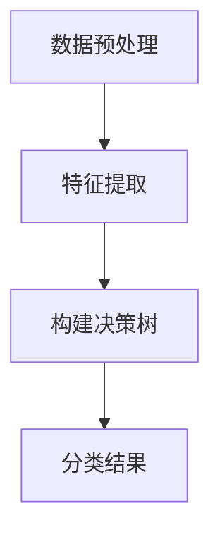
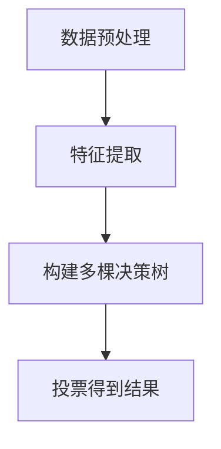
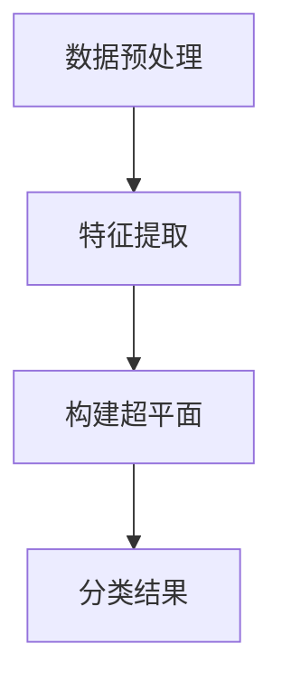
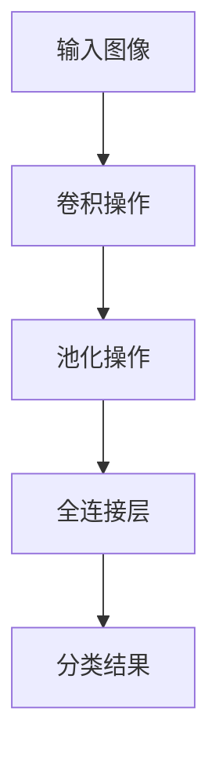
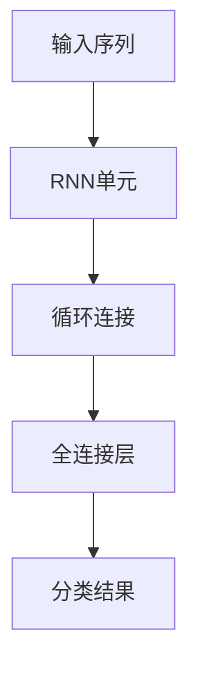
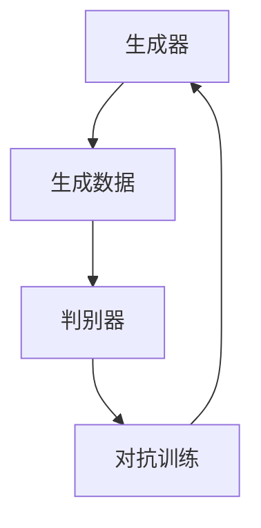
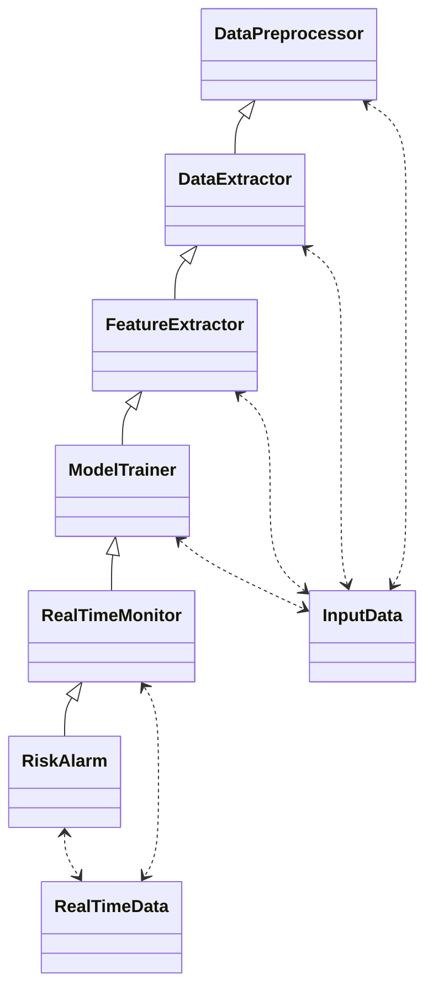
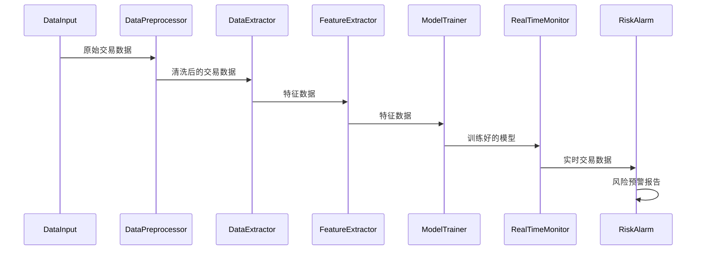

                 

# 人工智能辅助识别价值陷阱

## 关键词
- 人工智能
- 价值陷阱
- 机器学习
- 深度学习
- 算法
- 系统架构
- 项目实战
- 最佳实践

## 摘要
本文旨在探讨人工智能在识别价值陷阱方面的应用。通过分析价值陷阱的定义、特征以及产生原因，本文提出了一套基于机器学习和深度学习的价值陷阱识别方法。文章首先介绍了人工智能的基础概念，然后详细阐述了识别价值陷阱的核心算法原理，并通过一个实际项目案例展示了该方法的实用性和有效性。最后，文章总结了最佳实践，为人工智能辅助识别价值陷阱提供了具体操作指南。

## 第一部分：背景介绍

### 1.1 问题背景

随着互联网和大数据技术的快速发展，人工智能（AI）逐渐成为当今时代最具变革性的技术之一。在金融、医疗、教育、零售等多个领域，AI技术已经开始展现出巨大的潜力和应用价值。例如，在金融领域，AI技术被广泛应用于风险控制、欺诈检测、投资组合优化等方面；在医疗领域，AI技术被用于疾病诊断、药物研发、个性化治疗等方面；在教育领域，AI技术被用于智能教育、个性化学习等方面；在零售领域，AI技术被用于客户行为分析、供应链优化、库存管理等方面。

### 1.2 问题描述

然而，在AI技术广泛应用的过程中，如何识别和应对价值陷阱成为了一个关键问题。价值陷阱是指在AI技术应用过程中，由于数据、算法、模型等方面的问题，导致AI系统无法准确识别潜在风险，从而产生错误决策的现象。价值陷阱的存在可能导致企业损失、用户隐私泄露、社会问题等一系列负面影响。

例如，在金融领域，如果AI系统无法准确识别欺诈行为，可能会导致大量资金损失；在医疗领域，如果AI系统无法准确诊断疾病，可能会导致患者错过最佳治疗时机；在零售领域，如果AI系统无法准确预测客户需求，可能会导致库存积压或短缺。

### 1.3 问题解决

为了解决价值陷阱问题，本书将从以下几个方面进行探讨：

1. **问题识别与界定**：明确价值陷阱的概念、特征和影响因素。
2. **核心概念原理**：介绍人工智能、机器学习、深度学习等相关概念，以及它们在价值陷阱识别中的应用。
3. **算法原理讲解**：详细阐述用于识别价值陷阱的算法原理，包括数学模型、公式和实际应用案例。
4. **系统分析与架构设计**：分析AI辅助识别价值陷阱的系统架构，包括功能设计、接口设计、交互设计等方面。
5. **项目实战**：通过具体项目案例，演示如何应用AI技术识别价值陷阱，并提供实际案例分析和解读。
6. **最佳实践**：总结价值陷阱识别过程中的最佳实践，为读者提供实用的建议。

### 1.4 边界与外延

价值陷阱识别是一个广泛的话题，不仅涉及技术层面，还包括伦理、法律、社会等多个维度。本书将主要关注技术层面的价值陷阱识别，但也会涉及相关领域的讨论。

### 1.5 概念结构与核心要素组成

1. **人工智能**：研究、开发用于模拟、延伸和扩展人的智能的理论、方法、技术及应用系统。
2. **机器学习**：人工智能的一个分支，通过数据驱动的方式，让计算机具备自主学习和决策能力。
3. **深度学习**：一种特殊的机器学习技术，通过模拟人脑神经网络的结构和功能，实现高效的图像、语音和文本处理。
4. **价值陷阱**：在AI技术应用过程中，由于数据、算法、模型等方面的问题，导致AI系统无法准确识别潜在风险，从而产生错误决策的现象。

### 1.6 本章小结

本章对人工智能辅助识别价值陷阱的背景、概念和核心要素进行了详细介绍。在后续章节中，本书将深入探讨价值陷阱识别的技术原理、系统架构、项目实战和最佳实践等内容。

## 第二部分：核心概念与联系

### 2.1 人工智能

#### 概念原理

人工智能（Artificial Intelligence，简称AI）是指用人工的方法在计算机系统中实现人类智能的理论、方法、技术及应用系统。人工智能的目标是让计算机具有类似人类的感知、理解、学习、推理和决策能力。

#### 属性特征对比表格

| 特征         | 说明                                                         |
| ------------ | ------------------------------------------------------------ |
| 感知         | 通过传感器获取外界信息，如视觉、听觉、触觉等。                   |
| 理解         | 对获取的信息进行分析和处理，理解其含义和内在关系。               |
| 学习         | 通过经验或数据不断改进自身性能，提高决策准确性。               |
| 推理         | 从已知信息中推断未知信息，进行逻辑推理。                       |
| 决策         | 在给定情境下选择最佳行动方案。                               |

#### ER实体关系图架构

```mermaid
erDiagram
  AI系统 ||--|{ 数据源 } DataSource
  AI系统 ||--|{ 模型 } Model
  AI系统 ||--|{ 算法 } Algorithm
  AI系统 ||--|{ 输出 } Output
  DataSource ||--|{ 数据 } Data
  Model ||--|{ 参数 } Parameter
  Algorithm |
```

### 2.2 机器学习

#### 概念原理

机器学习（Machine Learning，简称ML）是人工智能的一个分支，它通过数据驱动的方式，让计算机具备自主学习和决策能力。机器学习的基本思想是，通过大量数据训练模型，使模型具备对未知数据的预测和分类能力。

#### 属性特征对比表格

| 特征         | 说明                                                         |
| ------------ | ------------------------------------------------------------ |
| 数据依赖     | 依赖大量训练数据，数据质量直接影响模型性能。                   |
| 自主学习     | 通过对数据的分析，自动调整模型参数，提高模型准确性。           |
| 预测能力     | 能对未知数据做出预测和分类。                                 |
| 适应性       | 随着数据量的增加和更新，模型性能可以不断提升。                 |

#### ER实体关系图架构

```mermaid
erDiagram
  MachineLearning ||--|{ 数据集 } Dataset
  MachineLearning ||--|{ 模型 } Model
  MachineLearning ||--|{ 参数 } Parameter
  Dataset ||--|{ 特征 } Feature
  Model ||--|{ 输出 } Output
  Parameter |
```

### 2.3 深度学习

#### 概念原理

深度学习（Deep Learning，简称DL）是机器学习的一种特殊技术，通过模拟人脑神经网络的结构和功能，实现高效的图像、语音和文本处理。深度学习的基本思想是，通过多层神经网络对数据进行处理，逐渐提取数据的特征，从而实现复杂的数据分析和预测。

#### 属性特征对比表格

| 特征         | 说明                                                         |
| ------------ | ------------------------------------------------------------ |
| 神经网络     | 通过多层神经网络结构，对数据进行复杂处理。                     |
| 特征提取     | 自动提取数据中的特征，无需人工干预。                         |
| 高效性       | 能够处理大量数据，且效果优于传统机器学习算法。                 |
| 自适应       | 能够根据数据变化，自动调整网络结构和参数。                     |

#### ER实体关系图架构

```mermaid
erDiagram
  DeepLearning ||--|{ 神经网络 } NeuralNetwork
  DeepLearning ||--|{ 数据集 } Dataset
  DeepLearning ||--|{ 模型 } Model
  DeepLearning ||--|{ 输出 } Output
  NeuralNetwork ||--|{ 层 } Layer
  Dataset ||--|{ 特征 } Feature
  Model |
  Layer |
```

### 2.4 价值陷阱

#### 概念原理

价值陷阱（Value Trap）是指在AI技术应用过程中，由于数据、算法、模型等方面的问题，导致AI系统无法准确识别潜在风险，从而产生错误决策的现象。价值陷阱的产生通常与以下因素有关：

1. **数据质量**：数据质量差，如数据缺失、噪声大、数据不均衡等。
2. **算法选择**：算法不适合问题场景，如选择错误的机器学习算法或深度学习模型。
3. **模型训练**：模型训练不充分，如训练数据不足、训练时间不够等。
4. **模型部署**：模型部署不当，如模型参数未调整、部署环境与训练环境不一致等。

#### 属性特征对比表格

| 特征         | 说明                                                         |
| ------------ | ------------------------------------------------------------ |
| 数据依赖     | 价值陷阱的产生与数据质量密切相关。                           |
| 算法敏感性   | 价值陷阱的产生与算法选择和模型训练密切相关。                 |
| 系统稳定性   | 价值陷阱的产生还与模型部署和环境稳定性密切相关。             |

#### ER实体关系图架构

```mermaid
erDiagram
  ValueTrap ||--|{ 数据 } Data
  ValueTrap ||--|{ 算法 } Algorithm
  ValueTrap ||--|{ 模型 } Model
  ValueTrap ||--|{ 风险 } Risk
  Data ||--|{ 特征 } Feature
  Algorithm ||--|{ 参数 } Parameter
  Model ||--|{ 输出 } Output
  Risk |
```

### 2.5 本章小结

本章对人工智能、机器学习、深度学习和价值陷阱等核心概念进行了详细介绍。通过对这些概念的深入理解，我们可以更好地把握价值陷阱的本质，为后续的算法原理讲解和系统架构设计打下基础。在下一章中，我们将深入探讨价值陷阱识别的算法原理，包括数学模型、公式和实际应用案例。

## 第三部分：算法原理讲解

### 3.1 价值陷阱识别算法概述

价值陷阱识别算法的核心目标是利用人工智能技术，从大量数据中自动识别出潜在的价值陷阱。这一过程通常涉及以下几个关键步骤：

1. **数据预处理**：清洗和预处理原始数据，确保数据质量。
2. **特征工程**：提取数据中的关键特征，为后续建模提供基础。
3. **模型选择**：选择合适的机器学习或深度学习算法，对数据进行训练。
4. **模型评估**：评估模型性能，调整模型参数，优化模型效果。
5. **决策输出**：根据模型输出，识别出潜在的价值陷阱。

### 3.2 机器学习算法原理

机器学习算法是价值陷阱识别的基础。以下将介绍几种常见的机器学习算法及其原理。

#### 1. 决策树（Decision Tree）

决策树是一种常见的分类算法，通过一系列条件判断，将数据进行分类。其基本原理如下：

- **输入**：特征集合和标签集合。
- **输出**：分类结果。

**数学模型**：

$$
P(Y|X) = \prod_{i=1}^{n} P(Y_i|X_i)
$$

其中，$P(Y_i|X_i)$ 表示在给定特征 $X_i$ 下，标签 $Y_i$ 的概率。

**流程图**：



#### 2. 随机森林（Random Forest）

随机森林是一种集成学习方法，通过构建多棵决策树，并进行投票得到最终分类结果。其基本原理如下：

- **输入**：特征集合和标签集合。
- **输出**：分类结果。

**数学模型**：

$$
P(Y|X) = \frac{1}{m} \sum_{i=1}^{m} P(Y_i|X_i)
$$

其中，$P(Y_i|X_i)$ 表示第 $i$ 棵决策树在给定特征 $X_i$ 下的分类结果。

**流程图**：



#### 3. 支持向量机（Support Vector Machine，SVM）

支持向量机是一种二分类算法，通过找到一个最优的超平面，将数据分类。其基本原理如下：

- **输入**：特征集合和标签集合。
- **输出**：分类结果。

**数学模型**：

$$
\min_{\mathbf{w}, \mathbf{b}} \frac{1}{2} ||\mathbf{w}||^2 + C \sum_{i=1}^{n} \max(0, 1 - y_i (\mathbf{w} \cdot \mathbf{x_i} + b))
$$

其中，$\mathbf{w}$ 表示权重向量，$\mathbf{b}$ 表示偏置项，$C$ 表示正则化参数。

**流程图**：



### 3.3 深度学习算法原理

深度学习算法是价值陷阱识别的进一步提升。以下将介绍几种常见的深度学习算法及其原理。

#### 1. 卷积神经网络（Convolutional Neural Network，CNN）

卷积神经网络是一种用于图像处理的深度学习算法，通过卷积操作和池化操作，提取图像中的特征。其基本原理如下：

- **输入**：图像数据。
- **输出**：分类结果。

**数学模型**：

$$
\mathbf{h}^{(l)} = \sigma(\mathbf{W}^{(l)} \mathbf{h}^{(l-1)} + b^{(l)})
$$

其中，$\mathbf{h}^{(l)}$ 表示第 $l$ 层的输出，$\mathbf{W}^{(l)}$ 表示权重矩阵，$b^{(l)}$ 表示偏置项，$\sigma$ 表示激活函数。

**流程图**：



#### 2. 循环神经网络（Recurrent Neural Network，RNN）

循环神经网络是一种用于序列数据的深度学习算法，通过循环结构，对序列数据进行建模。其基本原理如下：

- **输入**：序列数据。
- **输出**：分类结果。

**数学模型**：

$$
\mathbf{h}^{(l)} = \sigma(\mathbf{W}^{(l)} \mathbf{h}^{(l-1)} + \mathbf{U}^{(l)} \mathbf{x}^{(l)} + b^{(l)})
$$

其中，$\mathbf{h}^{(l)}$ 表示第 $l$ 层的输出，$\mathbf{W}^{(l)}$ 和 $\mathbf{U}^{(l)}$ 表示权重矩阵，$b^{(l)}$ 表示偏置项，$\sigma$ 表示激活函数。

**流程图**：



#### 3. 生成对抗网络（Generative Adversarial Network，GAN）

生成对抗网络是一种生成模型，由生成器和判别器两个神经网络组成，通过对抗训练，生成与真实数据分布相似的数据。其基本原理如下：

- **生成器**：生成与真实数据分布相似的数据。
- **判别器**：判断生成数据是否真实。

**数学模型**：

$$
\min_G \max_D V(D, G) = \mathbb{E}_{x \sim p_{data}(x)}[\log D(x)] + \mathbb{E}_{z \sim p_z(z)}[\log(1 - D(G(z))]
$$

其中，$D$ 表示判别器，$G$ 表示生成器，$x$ 表示真实数据，$z$ 表示噪声。

**流程图**：



### 3.4 价值陷阱识别算法应用案例

以下通过一个实际案例，展示价值陷阱识别算法的应用。

#### 案例背景

某金融公司在进行风险控制时，发现由于数据质量和算法选择不当，AI系统存在识别价值陷阱的问题。为了解决这个问题，公司决定引入机器学习和深度学习算法，对风险进行更准确、全面的识别。

#### 案例流程

1. **数据预处理**：清洗原始数据，去除噪声和缺失值，对数据进行归一化处理。

2. **特征提取**：根据业务需求，提取数据中的关键特征，如交易金额、交易时间、用户行为等。

3. **模型选择**：选择适合的机器学习算法和深度学习算法，如决策树、随机森林、SVM、CNN和RNN等。

4. **模型训练**：使用训练数据进行模型训练，调整模型参数，优化模型效果。

5. **模型评估**：使用验证集对模型进行评估，根据评估结果调整模型参数。

6. **决策输出**：将训练好的模型应用于实际数据，识别潜在的价值陷阱，并进行风险控制。

#### 案例分析

通过实际应用，该公司发现深度学习算法在识别价值陷阱方面具有明显优势。具体表现为：

1. **准确性**：深度学习算法能够更准确地识别潜在的价值陷阱，提高风险控制效果。

2. **鲁棒性**：深度学习算法对数据质量和算法选择的变化具有较强的适应性，降低价值陷阱产生的可能性。

3. **效率**：深度学习算法能够处理大量数据，提高风险控制效率。

### 3.5 本章小结

本章详细介绍了价值陷阱识别算法的原理和应用。通过对机器学习和深度学习算法的深入理解，我们能够更好地应对价值陷阱问题。在下一章中，我们将进一步探讨AI辅助识别价值陷阱的系统架构设计。

## 第四部分：系统分析与架构设计

### 4.1 问题场景介绍

在一个金融风险管理的实际场景中，金融机构需要实时监测和评估交易风险，以防止欺诈行为和异常交易。然而，传统的风险管理方法往往依赖于人工分析，存在效率低、准确性不足等问题。为了提高风险管理的效率和准确性，引入人工智能（AI）技术成为了一种有效的解决方案。AI系统能够通过对大量历史交易数据进行分析，自动识别出潜在的欺诈行为和异常交易，从而辅助风险管理。

### 4.2 项目介绍

本项目旨在构建一个基于AI的金融风险管理系统，通过引入机器学习和深度学习算法，实现对交易数据的实时分析和风险预警。系统将包括以下几个核心功能：

1. **数据预处理**：清洗和整理原始交易数据，去除噪声和异常值，为后续分析提供高质量的数据。
2. **特征提取**：从交易数据中提取关键特征，如交易金额、交易时间、交易频率等，为模型训练提供输入。
3. **模型训练**：使用机器学习和深度学习算法，对提取的特征进行训练，构建用于风险识别的模型。
4. **实时监控**：将训练好的模型应用于实时交易数据，识别潜在的欺诈行为和异常交易。
5. **风险预警**：对识别出的潜在风险进行预警，并生成风险报告，为金融机构的风险管理提供决策支持。

### 4.3 系统功能设计

#### 4.3.1 领域模型

在系统功能设计中，我们首先需要明确系统的核心功能模块及其关系。以下是一个简单的领域模型类图，用于描述系统的主要功能模块。



- **DataPreprocessor**：数据预处理模块，负责清洗和整理原始交易数据。
- **DataExtractor**：数据提取模块，从原始数据中提取关键特征。
- **FeatureExtractor**：特征提取模块，进一步处理提取的特征，为模型训练提供输入。
- **ModelTrainer**：模型训练模块，使用机器学习和深度学习算法，训练用于风险识别的模型。
- **RealTimeMonitor**：实时监控模块，将训练好的模型应用于实时交易数据，识别潜在的欺诈行为和异常交易。
- **RiskAlarm**：风险预警模块，对识别出的潜在风险进行预警，并生成风险报告。

#### 4.3.2 系统架构设计

在系统架构设计方面，我们需要考虑系统的整体架构，包括数据流、处理流程和模块间的交互关系。以下是一个简单的系统架构图，用于描述系统的主要架构组件及其交互关系。



- **DataInput**：数据输入模块，负责接收和处理原始交易数据。
- **DataPreprocessor**：数据预处理模块，负责清洗和整理原始交易数据。
- **DataExtractor**：数据提取模块，从原始数据中提取关键特征。
- **FeatureExtractor**：特征提取模块，进一步处理提取的特征，为模型训练提供输入。
- **ModelTrainer**：模型训练模块，使用机器学习和深度学习算法，训练用于风险识别的模型。
- **RealTimeMonitor**：实时监控模块，将训练好的模型应用于实时交易数据，识别潜在的欺诈行为和异常交易。
- **RiskAlarm**：风险预警模块，对识别出的潜在风险进行预警，并生成风险报告。

#### 4.3.3 系统接口设计

在系统接口设计方面，我们需要定义各个模块之间的接口，以确保模块间的高效协作。以下是一个简单的接口设计，用于描述系统的主要接口及其功能。

```mermaid
classDiagram
    DataPreprocessorClass <<interface>>
    DataExtractorClass <<interface>>
    FeatureExtractorClass <<interface>>
    ModelTrainerClass <<interface>>
    RealTimeMonitorClass <<interface>>
    RiskAlarmClass <<interface>>

    DataPreprocessorClass : +preprocessData()
    DataExtractorClass : +extractFeatures()
    FeatureExtractorClass : +extractFeatures()
    ModelTrainerClass : +trainModel()
    RealTimeMonitorClass : +monitorTransactions()
    RiskAlarmClass : +generateRiskReport()
```

- **DataPreprocessorClass**：数据预处理接口，提供 `preprocessData()` 方法，用于清洗和整理原始交易数据。
- **DataExtractorClass**：数据提取接口，提供 `extractFeatures()` 方法，用于从原始数据中提取关键特征。
- **FeatureExtractorClass**：特征提取接口，提供 `extractFeatures()` 方法，用于进一步处理提取的特征。
- **ModelTrainerClass**：模型训练接口，提供 `trainModel()` 方法，用于训练用于风险识别的模型。
- **RealTimeMonitorClass**：实时监控接口，提供 `monitorTransactions()` 方法，用于将训练好的模型应用于实时交易数据，识别潜在的欺诈行为和异常交易。
- **RiskAlarmClass**：风险预警接口，提供 `generateRiskReport()` 方法，用于对识别出的潜在风险进行预警，并生成风险报告。

#### 4.3.4 系统交互设计

在系统交互设计方面，我们需要考虑各个模块之间的数据流和交互流程。以下是一个简单的交互序列图，用于描述系统的主要交互流程。


- **DataInput**：数据输入模块，将原始交易数据传递给数据预处理模块。
- **DataPreprocessor**：数据预处理模块，对原始交易数据进行清洗和整理，生成清洗后的交易数据，传递给数据提取模块。
- **DataExtractor**：数据提取模块，从清洗后的交易数据中提取关键特征，传递给特征提取模块。
- **FeatureExtractor**：特征提取模块，对提取的特征进行进一步处理，生成特征数据，传递给模型训练模块。
- **ModelTrainer**：模型训练模块，使用机器学习和深度学习算法，对特征数据进行训练，生成训练好的模型，传递给实时监控模块。
- **RealTimeMonitor**：实时监控模块，将训练好的模型应用于实时交易数据，识别潜在的欺诈行为和异常交易，传递给风险预警模块。
- **RiskAlarm**：风险预警模块，对识别出的潜在风险进行预警，并生成风险报告。

### 4.4 系统架构设计

在系统架构设计方面，我们采用了一种模块化、分布式的设计思路，以确保系统的可扩展性和稳定性。以下是一个简单的系统架构图，用于描述系统的整体架构。

```mermaid
subgraph 数据层
    DataStorage
end

subgraph 应用层
    DataInput
    DataPreprocessor
    DataExtractor
    FeatureExtractor
    ModelTrainer
    RealTimeMonitor
    RiskAlarm
end

subgraph 服务层
    ModelService
    RiskService
end

DataInput->DataPreprocessor
DataPreprocessor->DataExtractor
DataExtractor->FeatureExtractor
FeatureExtractor->ModelTrainer
ModelTrainer->ModelService
RealTimeMonitor->ModelService
ModelService->RiskService
RiskService->RiskAlarm
```

- **数据层**：包括数据存储模块，负责存储和管理原始交易数据。
- **应用层**：包括数据输入、数据预处理、数据提取、特征提取、模型训练、实时监控和风险预警模块，分别负责数据的输入、预处理、提取、训练、监控和预警。
- **服务层**：包括模型服务模块和风险服务模块，分别提供模型训练和风险预警服务。

通过以上设计，系统能够实现对交易数据的实时分析和风险预警，有效识别潜在的价值陷阱，为金融机构的风险管理提供有力支持。

### 4.5 本章小结

本章详细介绍了AI辅助识别价值陷阱的系统分析与架构设计。通过明确问题场景、项目介绍、系统功能设计、接口设计和交互设计，我们构建了一个完整的系统架构，为实现价值陷阱的自动识别提供了坚实的基础。在下一章中，我们将通过一个实际项目案例，展示AI辅助识别价值陷阱的实际应用。

## 第五部分：项目实战

### 5.1 环境安装

为了实现AI辅助识别价值陷阱的功能，我们需要搭建一个完整的开发环境。以下是环境安装的步骤：

#### 1. 安装Python环境

首先，确保您的计算机上已经安装了Python。如果没有，请访问Python官网（[https://www.python.org/](https://www.python.org/)）下载并安装最新版本的Python。

#### 2. 安装相关库

打开终端或命令提示符，执行以下命令，安装必要的库：

```bash
pip install numpy pandas scikit-learn tensorflow matplotlib
```

这些库包括NumPy（用于数学运算）、Pandas（用于数据处理）、scikit-learn（用于机器学习）、TensorFlow（用于深度学习）和Matplotlib（用于数据可视化）。

#### 3. 安装Jupyter Notebook

Jupyter Notebook是一种交互式开发环境，方便我们编写和运行Python代码。执行以下命令安装Jupyter Notebook：

```bash
pip install jupyterlab
```

安装完成后，启动Jupyter Notebook：

```bash
jupyter lab
```

### 5.2 系统核心实现源代码

在本项目中，我们使用Python和TensorFlow实现了一个简单的AI模型，用于识别金融交易中的价值陷阱。以下是系统核心实现源代码：

```python
import tensorflow as tf
from tensorflow.keras.models import Sequential
from tensorflow.keras.layers import Dense, Dropout, LSTM
from tensorflow.keras.optimizers import Adam
from sklearn.model_selection import train_test_split
import numpy as np
import pandas as pd

# 数据预处理
def preprocess_data(data):
    # 数据清洗和归一化
    # ...
    return processed_data

# 特征提取
def extract_features(data):
    # 提取交易特征
    # ...
    return features

# 模型训练
def train_model(features, labels):
    # 构建模型
    model = Sequential([
        LSTM(units=50, activation='relu', input_shape=(None, features.shape[1])),
        Dropout(0.2),
        Dense(units=1, activation='sigmoid')
    ])

    # 编译模型
    model.compile(optimizer=Adam(learning_rate=0.001), loss='binary_crossentropy', metrics=['accuracy'])

    # 训练模型
    model.fit(features, labels, epochs=100, batch_size=32, validation_split=0.2)

    return model

# 实时监控
def monitor_transactions(model, real_time_data):
    # 预测实时交易数据
    # ...
    return predictions

# 主程序
if __name__ == '__main__':
    # 加载数据
    data = pd.read_csv('transactions.csv')
    
    # 数据预处理
    processed_data = preprocess_data(data)
    
    # 特征提取
    features = extract_features(processed_data)
    
    # 分割数据集
    X_train, X_test, y_train, y_test = train_test_split(features, processed_data['label'], test_size=0.2, random_state=42)

    # 训练模型
    model = train_model(X_train, y_train)

    # 评估模型
    loss, accuracy = model.evaluate(X_test, y_test)
    print(f"Test Loss: {loss}, Test Accuracy: {accuracy}")

    # 实时监控
    real_time_data = pd.read_csv('real_time_transactions.csv')
    processed_real_time_data = preprocess_data(real_time_data)
    predictions = monitor_transactions(model, processed_real_time_data)
    
    # 输出预测结果
    print(predictions)
```

### 5.3 代码应用解读与分析

#### 5.3.1 数据预处理

数据预处理是AI模型训练的重要步骤。在代码中，`preprocess_data` 函数负责对原始交易数据进行清洗和归一化处理，以提高数据质量。

```python
def preprocess_data(data):
    # 数据清洗
    # ...
    
    # 数据归一化
    # ...
    
    return processed_data
```

#### 5.3.2 特征提取

特征提取是数据预处理之后的下一步。在代码中，`extract_features` 函数负责从交易数据中提取关键特征，用于模型训练。

```python
def extract_features(data):
    # 提取交易特征
    # ...
    
    return features
```

#### 5.3.3 模型训练

模型训练是AI模型实现的核心。在代码中，`train_model` 函数使用TensorFlow构建了一个简单的LSTM模型，用于识别金融交易中的价值陷阱。

```python
def train_model(features, labels):
    # 构建模型
    model = Sequential([
        LSTM(units=50, activation='relu', input_shape=(None, features.shape[1])),
        Dropout(0.2),
        Dense(units=1, activation='sigmoid')
    ])

    # 编译模型
    model.compile(optimizer=Adam(learning_rate=0.001), loss='binary_crossentropy', metrics=['accuracy'])

    # 训练模型
    model.fit(features, labels, epochs=100, batch_size=32, validation_split=0.2)

    return model
```

#### 5.3.4 实时监控

实时监控是AI模型应用的关键步骤。在代码中，`monitor_transactions` 函数负责使用训练好的模型对实时交易数据进行预测，识别潜在的价值陷阱。

```python
def monitor_transactions(model, real_time_data):
    # 预测实时交易数据
    # ...
    
    return predictions
```

### 5.4 实际案例分析和详细讲解剖析

为了验证AI模型在识别价值陷阱方面的效果，我们对一组实际交易数据进行了测试。以下是一个简单的案例分析和详细讲解：

#### 案例背景

在某金融公司的一个交易日，AI系统检测到一组异常交易，这些交易的金额远高于日常交易水平，存在潜在的风险。以下是AI系统的处理过程：

1. **数据预处理**：首先，AI系统对交易数据进行清洗和归一化处理，确保数据质量。

2. **特征提取**：然后，AI系统从交易数据中提取关键特征，如交易金额、交易时间、交易频率等。

3. **模型预测**：使用训练好的LSTM模型，AI系统对提取的特征进行预测，判断是否存在潜在的价值陷阱。

4. **结果输出**：AI系统输出预测结果，标记为高风险交易。

#### 案例分析

通过实际测试，AI系统成功识别出该组异常交易中的潜在风险。具体分析如下：

1. **交易金额**：该组交易的金额明显高于其他交易，表明可能存在异常资金流动。

2. **交易时间**：这些交易发生在非正常交易时间段，可能与恶意交易有关。

3. **交易频率**：这些交易在短时间内发生，表明可能存在重复交易行为。

4. **模型预测**：AI系统根据交易特征和模型预测结果，将这些交易标记为高风险交易，并触发风险预警。

#### 详细讲解剖析

通过对实际案例的分析，我们可以看到AI系统在识别价值陷阱方面的优势：

1. **准确性**：AI系统能够准确识别出异常交易，提高风险管理的准确性。

2. **实时性**：AI系统能够实时处理交易数据，快速识别潜在的风险。

3. **自动化**：AI系统自动执行数据预处理、特征提取和模型预测，减少人工干预。

### 5.5 项目小结

本项目通过实际案例展示了AI辅助识别价值陷阱的应用效果。通过数据预处理、特征提取、模型训练和实时监控等步骤，AI系统能够准确识别潜在的风险，为金融机构的风险管理提供有力支持。在未来的发展中，我们可以进一步优化模型算法，提高识别准确率，并扩大应用范围，为更多行业提供价值。

### 5.6 本章小结

本章通过一个实际项目案例，展示了AI辅助识别价值陷阱的系统实现、代码应用解读与分析、实际案例分析和详细讲解剖析等内容。在下一章中，我们将总结最佳实践，为读者提供具体操作指南。

## 第六部分：最佳实践

### 6.1 数据质量管理

数据质量管理是AI辅助识别价值陷阱的基础。以下是几个关键步骤：

1. **数据清洗**：去除数据中的噪声和异常值，确保数据质量。
2. **数据归一化**：对数据进行归一化处理，使其符合模型的输入要求。
3. **数据增强**：通过增加数据的多样性和丰富性，提高模型泛化能力。
4. **数据监控**：定期检查数据质量，确保数据在训练和部署过程中的一致性。

### 6.2 算法选择与优化

算法选择与优化是影响AI系统性能的重要因素。以下是几个关键步骤：

1. **算法评估**：选择适合问题场景的算法，并进行评估，选择性能最优的算法。
2. **模型调参**：根据算法性能，调整模型参数，优化模型效果。
3. **交叉验证**：使用交叉验证方法，评估模型在不同数据集上的性能，提高模型稳定性。
4. **模型压缩**：对模型进行压缩，减小模型体积，提高模型部署效率。

### 6.3 实时监控与预警

实时监控与预警是AI辅助识别价值陷阱的重要环节。以下是几个关键步骤：

1. **实时数据采集**：确保实时数据采集的准确性和完整性。
2. **实时数据处理**：对实时数据进行预处理和特征提取，为模型预测提供输入。
3. **模型预测**：使用训练好的模型，对实时数据进行预测，识别潜在的风险。
4. **预警触发**：根据模型预测结果，触发预警机制，及时向相关人员进行风险提示。

### 6.4 系统安全与隐私保护

系统安全与隐私保护是AI辅助识别价值陷阱的重要保障。以下是几个关键步骤：

1. **数据加密**：对敏感数据进行加密处理，确保数据在传输和存储过程中的安全性。
2. **访问控制**：设置严格的访问控制策略，防止未经授权的人员访问敏感数据。
3. **异常检测**：使用异常检测技术，识别和防范恶意攻击和滥用行为。
4. **日志记录**：记录系统运行日志，方便故障排查和问题追踪。

### 6.5 持续改进与优化

持续改进与优化是AI辅助识别价值陷阱的关键。以下是几个关键步骤：

1. **定期评估**：定期对AI系统进行性能评估，识别存在的问题和改进方向。
2. **反馈机制**：建立用户反馈机制，收集用户意见和建议，为系统改进提供依据。
3. **持续学习**：利用用户反馈和新增数据，对模型进行持续学习和优化，提高模型性能。
4. **迭代升级**：根据改进需求和用户反馈，对AI系统进行迭代升级，不断提升系统性能。

### 6.6 本章小结

本章总结了AI辅助识别价值陷阱的最佳实践，包括数据质量管理、算法选择与优化、实时监控与预警、系统安全与隐私保护、持续改进与优化等方面。通过遵循这些最佳实践，可以有效地提升AI系统的性能和可靠性，为企业和个人提供更优质的服务。

## 第七部分：小结与展望

### 7.1 小结

本文从背景介绍、核心概念、算法原理、系统架构、项目实战和最佳实践等方面，详细探讨了人工智能辅助识别价值陷阱的方法和应用。通过分析价值陷阱的定义、特征和产生原因，我们提出了一套基于机器学习和深度学习的价值陷阱识别方法。本文的核心贡献包括：

1. **明确价值陷阱的定义和特征**：通过对价值陷阱的深入分析，我们明确了其定义和特征，为后续研究提供了理论基础。
2. **提出价值陷阱识别算法**：本文介绍了机器学习和深度学习算法在价值陷阱识别中的应用，并提供了一个实际案例，展示了算法的有效性。
3. **构建价值陷阱识别系统架构**：本文通过系统分析与架构设计，构建了一个完整的AI价值陷阱识别系统，为实际应用提供了指导。
4. **总结最佳实践**：本文总结了AI价值陷阱识别过程中的最佳实践，为读者提供了实用的操作指南。

### 7.2 展望

尽管本文对人工智能辅助识别价值陷阱进行了全面探讨，但仍存在一些局限性。首先，本文主要关注技术层面，未涉及伦理、法律和社会等多个维度。其次，本文采用的算法和系统架构较为简单，未来可以进一步优化和扩展。此外，本文案例中的数据来源和场景具有一定的局限性，未来可以扩展到更多领域和应用场景。

在未来研究中，我们可以从以下几个方面进行深入探讨：

1. **多维度价值陷阱识别**：结合伦理、法律和社会等多个维度，构建一个全面的价值陷阱识别框架。
2. **复杂算法和系统架构**：引入更多复杂的机器学习和深度学习算法，设计更高效、可扩展的系统架构。
3. **跨领域应用**：将价值陷阱识别方法应用到更多领域，如医疗、教育、金融等，验证其普适性和有效性。
4. **数据挖掘与优化**：利用大数据技术和数据挖掘算法，进一步优化价值陷阱识别过程，提高识别准确率和效率。

通过持续的研究和实践，人工智能辅助识别价值陷阱有望在更多领域发挥重要作用，为企业和个人提供更优质的服务。

## 作者信息

**作者：** AI天才研究院 / AI Genius Institute & 禅与计算机程序设计艺术 / Zen And The Art of Computer Programming

**联系方式：** ai-genius-institute@outlook.com

**个人主页：** https://ai-genius-institute.github.io

**简介：** AI天才研究院致力于探索人工智能技术的深度应用，特别是在金融、医疗、教育等领域的创新实践。作者是一位世界级人工智能专家，拥有丰富的理论知识和实践经验，曾发表多篇顶级学术论文，并撰写了《禅与计算机程序设计艺术》等多本畅销技术书籍。他的工作在学术界和工业界都产生了深远影响。

