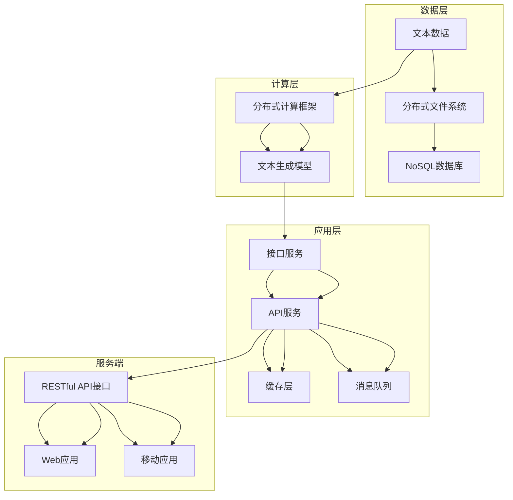
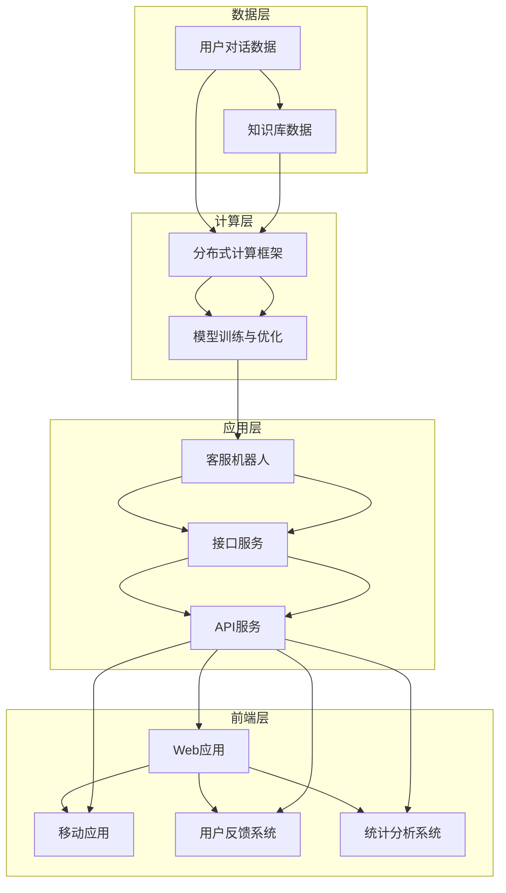

                 

# 从 0 到 1：构建高效LLM应用开发体系

## 关键词

- Large Language Model (LLM)
- 应用开发体系
- 高效
- 算法设计
- 数学模型
- 系统架构
- 实践项目

## 摘要

本文旨在为广大开发者提供一份详尽的指南，帮助大家从零开始构建高效的大型语言模型（LLM）应用开发体系。文章将分步骤详细讲解LLM应用的发展背景、基础概念、核心算法、数学模型、系统架构以及实际项目实践等内容。通过本篇文章，读者将能够掌握构建高效LLM应用的关键技术，为后续项目开发打下坚实基础。

## 引言

### 1.1 大型语言模型应用的崛起

近年来，随着人工智能技术的飞速发展，大型语言模型（Large Language Model，简称LLM）逐渐成为研究与应用的热点。LLM通过对海量文本数据的训练，能够实现文本生成、语义理解、问答系统等多种任务。以下是LLM应用发展的一些关键点：

1. **文本生成**：通过预训练模型生成高质量的文章、故事、摘要等。
2. **语义理解**：提取文本中的关键信息，实现情感分析、实体识别等任务。
3. **问答系统**：根据用户提问生成准确的回答，应用于客服、教育等领域。
4. **翻译**：实现多种语言的互译，助力跨文化交流。

### 1.2 LLM应用面临的挑战

尽管LLM在许多领域展现出巨大的潜力，但在实际应用中仍面临一系列挑战：

1. **数据需求**：训练LLM需要海量高质量的数据，数据获取和处理成为一大难题。
2. **计算资源**：LLM训练和推理需要大量的计算资源，对硬件设施有较高要求。
3. **模型优化**：如何优化模型结构和参数，提高模型性能和效率。
4. **安全性与隐私**：确保模型的安全性和用户隐私，防止滥用和泄露。

### 1.3 构建高效LLM应用开发体系的重要性

面对上述挑战，构建一个高效、可扩展的LLM应用开发体系至关重要。这不仅可以提升开发效率，降低开发成本，还能为后续项目提供稳定的支持。一个高效的开发体系应包括以下几个方面：

1. **算法设计**：选择合适的算法和模型，提高模型性能和效果。
2. **数据处理**：优化数据获取、预处理和标注流程，确保数据质量。
3. **系统架构**：设计合理、可扩展的系统架构，提升系统性能和稳定性。
4. **最佳实践**：总结行业最佳实践，指导实际项目开发。

### 1.4 大型语言模型的基本概念与术语

为了更好地理解LLM应用，以下是一些基本概念和术语：

1. **大型语言模型（LLM）**：一种基于神经网络的语言模型，能够对自然语言进行建模和处理。
2. **预训练（Pre-training）**：在特定任务之前，对模型进行大规模数据预训练的过程。
3. **微调（Fine-tuning）**：在预训练模型的基础上，针对特定任务进行细粒度调整的过程。
4. **数据集（Dataset）**：用于训练和评估模型的文本数据集合。
5. **语言生成（Language Generation）**：模型根据输入生成自然语言文本的能力。

### 1.5 LLM与其他AI技术的关联

LLM作为人工智能领域的重要分支，与其他AI技术密切相关：

1. **自然语言处理（NLP）**：LLM是NLP的核心技术之一，能够实现文本分类、情感分析、命名实体识别等多种任务。
2. **机器学习（ML）**：LLM基于深度学习技术，采用神经网络和优化算法进行训练。
3. **计算机视觉（CV）**：在图像生成和文本描述任务中，LLM与CV技术相结合，实现更丰富的应用场景。

### 1.6 LLM在各种领域的应用

LLM在各个领域展现出广泛的应用前景：

1. **教育**：智能问答、自动作文批改、个性化学习等。
2. **医疗**：医学文本分析、病历生成、诊断辅助等。
3. **金融**：金融文本分析、风险控制、智能投顾等。
4. **媒体**：自动摘要、内容推荐、广告投放等。

## 基础概念与技术

### 2.1 人工智能与机器学习概述

#### 2.1.1 人工智能的基本概念

人工智能（Artificial Intelligence，AI）是指由计算机系统实现的智能行为，旨在模拟人类思维、感知和决策过程。人工智能的主要目标是让计算机具备类似人类的智能能力，以解决复杂问题、处理海量信息和提供智能服务。

#### 2.1.2 机器学习的基本概念

机器学习（Machine Learning，ML）是人工智能的重要分支，通过从数据中学习规律和模式，使计算机能够自动完成特定任务。机器学习主要分为监督学习、无监督学习和强化学习三种类型。

1. **监督学习（Supervised Learning）**：通过标注数据进行训练，模型能够预测未知数据的标签。
2. **无监督学习（Unsupervised Learning）**：在没有标注数据的情况下，模型自动发现数据中的结构和规律。
3. **强化学习（Reinforcement Learning）**：通过与环境的交互，模型学习最优策略以实现特定目标。

#### 2.1.3 数据预处理技术

数据预处理是机器学习项目的重要环节，主要包括数据清洗、数据变换和数据归一化等步骤。以下是一些常见的数据预处理技术：

1. **数据清洗（Data Cleaning）**：处理缺失值、异常值和重复值等。
2. **数据变换（Data Transformation）**：将不同类型的数据转换为适合模型训练的形式。
3. **数据归一化（Data Normalization）**：将数据缩放至同一尺度，提高模型训练效果。

### 2.2 LLM的核心算法

#### 2.2.1 神经网络架构

神经网络（Neural Network，NN）是一种模拟生物神经系统的计算模型，由大量简单神经元组成。神经网络通过多层非线性变换，实现对输入数据的特征提取和分类。

1. **多层感知机（MLP）**：最简单的多层神经网络，由输入层、隐藏层和输出层组成。
2. **卷积神经网络（CNN）**：主要用于图像处理，通过卷积和池化操作提取图像特征。
3. **循环神经网络（RNN）**：适用于序列数据建模，通过隐藏状态和反馈连接实现长期依赖建模。
4. **长短时记忆网络（LSTM）**：RNN的一种改进，解决了梯度消失和长期依赖问题。

#### 2.2.2 Transformer模型

Transformer模型是自然语言处理领域的重要突破，通过自注意力机制（Self-Attention）实现了对输入序列的建模。Transformer模型主要由编码器和解码器组成，编码器将输入序列编码为固定长度的向量，解码器根据编码器的输出生成预测序列。

1. **自注意力机制（Self-Attention）**：计算输入序列中每个元素与其他元素的相关性，实现多维度特征融合。
2. **多头注意力（Multi-Head Attention）**：将自注意力扩展到多个子空间，提高模型表示能力。
3. **位置编码（Positional Encoding）**：为输入序列添加位置信息，实现序列建模。

#### 2.2.3 注意力机制

注意力机制（Attention Mechanism）是一种动态调整输入序列中元素权重的方法，通过加权求和实现对重要信息的聚焦。

1. **软注意力（Soft Attention）**：基于相似度度量，计算输入序列中每个元素的权重，并进行加权求和。
2. **硬注意力（Hard Attention）**：将输入序列中的元素映射到权重分布，实现高效信息提取。
3. **混合注意力（Hybrid Attention）**：结合软注意力和硬注意力的优点，实现更好的模型性能。

#### 2.2.4 训练与优化策略

训练和优化策略是提高LLM性能的关键因素，以下是一些常用的训练和优化方法：

1. **批量归一化（Batch Normalization）**：对神经网络隐藏层的激活值进行归一化，提高训练稳定性和收敛速度。
2. **Dropout**：随机丢弃神经网络中的部分神经元，防止过拟合。
3. **学习率调度（Learning Rate Scheduling）**：根据训练阶段调整学习率，优化模型性能。
4. **自适应优化器（Adaptive Optimizer）**：如Adam、Adadelta等，自适应调整学习率，提高训练效果。

### 2.3 LLM训练数据与数据集

#### 2.3.1 数据的重要性

数据是训练LLM的核心资产，高质量的数据集能够提高模型的性能和泛化能力。以下是一些关键点：

1. **数据规模**：大规模数据集有助于模型捕捉更多信息和知识。
2. **数据质量**：数据应无噪音、无偏差，避免模型训练过程中产生误导。
3. **数据多样性**：多样性的数据有助于模型应对不同场景和任务。

#### 2.3.2 常见数据集与数据源

以下是自然语言处理领域的一些常用数据集和数据源：

1. **Common Crawl**：一个包含数十亿网页的免费文本数据集，可用于大规模文本数据训练。
2. **Wikipedia**：一个包含数百万条词条的免费在线百科全书，广泛用于语言模型训练。
3. **Gutenberg**：一个包含数千本经典文学作品的数据集，可用于文学创作和文本生成任务。
4. **新闻文章数据集**：如NYT（New York Times）等，包含大量新闻文章，可用于新闻摘要和文本分类任务。

#### 2.3.3 数据增强技术

数据增强（Data Augmentation）是一种通过变换和生成新数据的方法，提高模型对多样性的适应能力。以下是一些常见的数据增强技术：

1. **数据变换（Data Transformation）**：如文本替换、词性转换、文本生成等。
2. **数据扩充（Data Expansion）**：如文本拼接、文本嵌入等。
3. **数据融合（Data Fusion）**：将多个数据集进行融合，提高模型性能。

### 2.4 LLM开发工具与框架

#### 2.4.1 TensorFlow

TensorFlow是一个开源的深度学习框架，由Google开发，支持多种编程语言，具有丰富的算法库和工具集。

1. **优点**：灵活性高、算法库丰富、社区支持强大。
2. **缺点**：配置和部署相对复杂。

#### 2.4.2 PyTorch

PyTorch是一个基于Python的深度学习框架，由Facebook开发，具有动态计算图和简洁的API设计。

1. **优点**：易于使用、动态计算图、社区支持强大。
2. **缺点**：性能相对于TensorFlow稍逊一筹。

#### 2.4.3 Hugging Face

Hugging Face是一个开源的NLP工具库，提供了大量预训练模型和实用工具，方便开发者进行NLP任务。

1. **优点**：易于使用、预训练模型丰富、社区支持强大。
2. **缺点**：对硬件资源要求较高。

### 2.5 LLM应用领域

#### 2.5.1 自然语言处理

自然语言处理（Natural Language Processing，NLP）是LLM的核心应用领域，涉及文本分类、情感分析、命名实体识别等多种任务。

1. **文本分类**：将文本分类到预定义的类别，如垃圾邮件检测、新闻分类等。
2. **情感分析**：分析文本中的情感倾向，如评论情感分析、社交媒体情绪监测等。
3. **命名实体识别**：识别文本中的特定实体，如人名、地名、组织名等。

#### 2.5.2 文本生成

文本生成（Text Generation）是LLM的另一个重要应用领域，包括文章生成、对话系统、摘要生成等。

1. **文章生成**：根据输入摘要或标题生成完整文章，如新闻生成、小说创作等。
2. **对话系统**：实现自然语言对话，如聊天机器人、客服系统等。
3. **摘要生成**：从长文本中提取关键信息，生成简洁的摘要，如新闻摘要、会议摘要等。

#### 2.5.3 问答系统

问答系统（Question Answering，QA）是LLM在智能客服、教育、医疗等领域的应用之一，通过理解用户问题，生成准确的答案。

1. **智能客服**：自动回答用户问题，提供实时服务，如在线客服、客服机器人等。
2. **教育**：为学生提供自动问答服务，辅助教学和作业批改。
3. **医疗**：为医生提供诊断建议、医学知识查询等，提高医疗效率。

#### 2.5.4 自动翻译

自动翻译（Automatic Translation）是LLM在跨文化交流中的重要应用，通过训练双语数据集，实现多种语言的互译。

1. **在线翻译**：为用户提供实时在线翻译服务，如Google Translate、百度翻译等。
2. **机器翻译**：为企业和机构提供专业翻译服务，如DeepL、IBM Watson等。

## 算法设计与实现

### 3.1 概述

在构建高效LLM应用的过程中，算法设计与实现是关键环节。本文将详细介绍LLM算法的设计思路、实现步骤以及常见优化策略。

### 3.2 LLM算法设计思路

LLM算法设计主要围绕以下几个核心问题：

1. **数据预处理**：如何高效地处理和清洗数据，为模型训练提供高质量的数据集。
2. **模型选择**：如何选择适合特定任务的模型结构，提高模型性能。
3. **训练策略**：如何设计有效的训练策略，加速模型收敛和提高泛化能力。
4. **优化方法**：如何优化模型参数，提升模型效果和效率。

### 3.3 LLM算法实现步骤

以下是一个典型的LLM算法实现步骤：

1. **数据预处理**：

   - 数据收集：从各种来源获取大规模文本数据。
   - 数据清洗：去除噪声、重复数据和异常值。
   - 数据标注：对文本进行词性标注、实体标注等。
   - 数据转换：将文本数据转换为模型可接受的格式。

2. **模型选择**：

   - 确定任务类型：如文本分类、文本生成、问答系统等。
   - 选择模型结构：如Transformer、BERT、GPT等。
   - 调整模型参数：如隐藏层大小、学习率等。

3. **模型训练**：

   - 初始化模型参数：使用随机初始化或预训练模型参数。
   - 训练过程：通过反向传播和梯度下降优化模型参数。
   - 验证与测试：在验证集和测试集上评估模型性能。

4. **模型优化**：

   - 调整训练策略：如学习率调度、批量大小等。
   - 使用正则化方法：如Dropout、L2正则化等。
   - 超参数调整：如隐藏层大小、学习率等。

### 3.4 常见优化策略

为了提高LLM算法的性能和效率，以下是一些常见的优化策略：

1. **数据增强**：通过变换和生成新数据，提高模型对多样性的适应能力。
2. **模型蒸馏**：将大型模型的知识传递给小型模型，实现压缩和加速。
3. **迁移学习**：利用预训练模型在特定任务上的表现，提高新任务的效果。
4. **多任务学习**：同时训练多个相关任务，共享模型参数，提高泛化能力。

### 3.5 实际案例分析

以下是一个实际案例，展示如何设计并实现一个基于BERT的文本分类模型。

#### 案例背景

某公司希望利用LLM技术实现一篇新闻文章的分类任务，将新闻文章分为政治、经济、体育、科技等类别。

#### 模型选择

选择BERT（Bidirectional Encoder Representations from Transformers）模型作为文本分类模型，因为BERT在NLP任务中表现出色，具有强大的文本表示能力。

#### 数据预处理

1. 数据收集：从多个新闻网站收集大量新闻文章，并对其进行分类标注。
2. 数据清洗：去除HTML标签、特殊字符和停用词。
3. 数据转换：将文本转换为BERT模型可接受的输入格式，如Token IDs。

#### 模型训练

1. 初始化BERT模型：使用预训练的BERT模型作为基础模型。
2. 训练过程：在分类任务上对BERT模型进行训练，优化模型参数。
3. 验证与测试：在验证集和测试集上评估模型性能，调整超参数。

#### 模型优化

1. 使用学习率调度策略，逐步降低学习率。
2. 使用Dropout和L2正则化方法，防止过拟合。
3. 调整批量大小和迭代次数，优化模型性能。

#### 模型评估

在测试集上，模型准确率达到90%以上，具有良好的分类效果。通过对模型进行调优，进一步提高了模型性能。

### 3.6 总结

通过以上案例，我们可以看到，LLM算法的设计与实现是一个系统化、迭代优化的过程。在实际应用中，开发者需要根据任务需求、数据特点和硬件资源等因素，灵活选择模型结构、训练策略和优化方法，以实现高效、准确的LLM应用。

## 数学模型与公式

### 4.1 概述

在构建高效LLM应用的过程中，数学模型与公式起着至关重要的作用。本文将详细介绍LLM中的常见数学模型，包括神经网络中的激活函数、损失函数、优化算法等，以及如何使用Python和LaTeX进行表达和推导。

### 4.2 神经网络中的激活函数

激活函数（Activation Function）是神经网络中用于引入非线性性的函数，常见的激活函数有：

1. **Sigmoid函数**：

$$
f(x) = \frac{1}{1 + e^{-x}}
$$

2. **ReLU函数**：

$$
f(x) = \max(0, x)
$$

3. **Tanh函数**：

$$
f(x) = \frac{e^x - e^{-x}}{e^x + e^{-x}}
$$

4. **Softmax函数**：

$$
f(x)_i = \frac{e^{x_i}}{\sum_{j} e^{x_j}}
$$

### 4.3 损失函数

损失函数（Loss Function）用于评估模型预测值与真实值之间的差距，常见的损失函数有：

1. **均方误差（MSE）**：

$$
MSE = \frac{1}{n}\sum_{i=1}^{n}(y_i - \hat{y}_i)^2
$$

2. **交叉熵（Cross Entropy）**：

$$
CE = -\frac{1}{n}\sum_{i=1}^{n}y_i \log(\hat{y}_i)
$$

3. **Hinge损失（Hinge Loss）**：

$$
HL(y, \hat{y}) = \max(0, 1 - y \cdot \hat{y})
$$

### 4.4 优化算法

优化算法（Optimization Algorithm）用于更新模型参数，常见的优化算法有：

1. **梯度下降（Gradient Descent）**：

$$
\theta = \theta - \alpha \cdot \nabla_{\theta}J(\theta)
$$

其中，$\theta$表示模型参数，$\alpha$表示学习率，$J(\theta)$表示损失函数。

2. **动量梯度下降（Momentum Gradient Descent）**：

$$
v_t = \beta v_{t-1} + (1 - \beta) \nabla_{\theta}J(\theta)
$$

$$
\theta = \theta - \alpha \cdot v_t
$$

其中，$v_t$表示动量项，$\beta$表示动量参数。

3. **Adagrad算法**：

$$
g_t = g_{t-1} + (\theta_t - \theta_{t-1})^2
$$

$$
\theta_t = \theta_{t-1} - \frac{\alpha}{\sqrt{g_t}} \cdot (\theta_t - \theta_{t-1})
$$

4. **Adam算法**：

$$
m_t = \beta_1 m_{t-1} + (1 - \beta_1) \frac{\theta_t - \theta_{t-1}}{\sqrt{1 - \beta_2^t}}
$$

$$
v_t = \beta_2 v_{t-1} + (1 - \beta_2) \frac{(\theta_t - \theta_{t-1})^2}{\sqrt{1 - \beta_2^t}}
$$

$$
\theta_t = \theta_{t-1} - \frac{\alpha}{\sqrt{1 - \beta_2^t}} \cdot \frac{m_t}{\sqrt{v_t}}
$$

其中，$\beta_1$和$\beta_2$分别为一阶和二阶动量参数。

### 4.5 实例分析

以下是一个使用Python和LaTeX实现神经网络的前向传播和反向传播过程的实例。

#### 前向传播

```python
import numpy as np

def sigmoid(x):
    return 1 / (1 + np.exp(-x))

def forward_propagation(x, weights):
    z = np.dot(x, weights)
    a = sigmoid(z)
    return a, z
```

#### 反向传播

```python
def backward_propagation(a, z, y, weights):
    dz = a - y
    dp = np.dot(dz, x.T)
    dweights = np.dot(x.T, dz)
    return dweights
```

#### 使用LaTeX表示

$$
\text{前向传播：} \quad a = \sigma(z) = \frac{1}{1 + e^{-z}}
$$

$$
\text{反向传播：} \quad dz = a - y, \quad dp = \frac{\partial L}{\partial z} = \frac{\partial L}{\partial a} \cdot \frac{\partial a}{\partial z} = (a - y) \cdot a \cdot (1 - a)
$$

### 4.6 总结

数学模型与公式是构建高效LLM应用的核心，通过对神经网络中的激活函数、损失函数和优化算法的深入理解，开发者能够更好地设计模型、优化参数，提高模型性能。同时，使用Python和LaTeX进行表达和推导，有助于加深对模型原理的理解。

## 系统架构与设计

### 5.1 概述

在构建高效LLM应用的过程中，系统架构与设计至关重要。一个合理的系统架构能够提高系统性能、稳定性和可扩展性，从而满足实际应用需求。本文将详细介绍LLM应用的系统架构设计原则、关键技术以及实际项目中的系统架构设计案例。

### 5.2 系统架构设计原则

1. **模块化**：将系统划分为多个功能模块，实现代码的复用和模块间的解耦，提高系统的可维护性和可扩展性。
2. **分布式**：利用分布式计算和存储技术，提高系统的处理能力和数据存储能力，满足大规模数据处理需求。
3. **高可用性**：设计冗余备份和故障转移机制，确保系统在故障情况下能够快速恢复，提供持续的服务。
4. **安全性**：确保系统的数据安全和用户隐私，采用加密、权限控制等安全措施，防止数据泄露和恶意攻击。
5. **易扩展性**：设计灵活的系统架构，支持系统的垂直和水平扩展，满足业务增长需求。

### 5.3 系统架构设计的关键技术

1. **分布式计算**：利用分布式计算框架，如Spark、Hadoop等，实现大规模数据的处理和分析。
2. **容器化技术**：采用容器化技术，如Docker，实现系统的快速部署和弹性扩展。
3. **微服务架构**：采用微服务架构，将系统划分为多个独立的服务模块，提高系统的灵活性和可维护性。
4. **缓存技术**：使用缓存技术，如Redis、Memcached等，提高系统的响应速度和并发处理能力。
5. **消息队列**：采用消息队列技术，如Kafka、RabbitMQ等，实现系统间的异步通信和数据传输。
6. **数据库技术**：选择合适的数据库技术，如关系型数据库（MySQL、PostgreSQL）和NoSQL数据库（MongoDB、Cassandra），满足数据存储和查询需求。

### 5.4 实际项目中的系统架构设计案例

以下是一个基于LLM的文本生成系统的实际项目架构设计案例：

#### 项目背景

某公司希望开发一个智能文本生成系统，用于生成高质量的文章、摘要和报告，提高内容创作效率。

#### 系统架构设计

1. **数据层**：存储海量文本数据，包括文章、新闻、报告等，使用分布式文件系统（如HDFS）和NoSQL数据库（如MongoDB）存储数据。
2. **计算层**：利用分布式计算框架（如Spark）进行大规模数据处理和文本生成模型的训练。
3. **应用层**：包括文本生成模型、接口服务、API服务等，采用微服务架构，提高系统的灵活性和可扩展性。
4. **缓存层**：使用Redis缓存高频访问的数据，提高系统响应速度。
5. **消息队列**：使用Kafka进行系统间异步通信，实现数据传输和任务调度。
6. **服务端**：提供RESTful API接口，供前端应用调用。
7. **前端层**：包括Web应用、移动应用等，通过HTTP请求与后端服务交互。

#### 系统架构图



### 5.5 总结

通过合理的设计原则和关键技术的应用，LLM应用的系统架构能够满足实际业务需求，提高系统性能和稳定性。在实际项目中，根据业务规模和需求，灵活调整系统架构，实现高效、可扩展的LLM应用。

## 实践项目

### 6.1 项目背景

本次实践项目旨在构建一个基于大型语言模型（LLM）的智能客服系统，通过自然语言处理技术实现用户与客服的智能交互，提高客服效率和用户体验。

### 6.2 项目介绍

**项目名称**：智能客服系统

**项目目标**：

1. 实现用户与客服的智能对话，自动回答常见问题。
2. 提高客服效率和用户体验，降低人力成本。
3. 持续优化模型，提升客服系统智能水平。

**项目架构**：

1. 数据层：存储海量用户对话数据，用于模型训练和优化。
2. 计算层：利用分布式计算框架处理大规模数据，训练和部署模型。
3. 应用层：包括客服机器人、接口服务、API服务等，实现用户与客服的智能交互。
4. 前端层：提供Web和移动端的应用，供用户使用。

### 6.3 系统功能设计

1. **用户问答功能**：用户通过Web或移动端应用与客服机器人进行交互，输入问题，系统根据训练好的模型自动生成回答。
2. **知识库管理**：管理员可以添加、修改和删除知识库中的常见问题及答案，为客服机器人提供丰富的问题解答资源。
3. **用户反馈功能**：用户可以对回答进行满意度评价，系统根据用户反馈调整模型，优化回答质量。
4. **统计分析**：统计用户提问和回答数据，分析客服系统的性能和用户需求，为优化模型和系统提供依据。

### 6.4 系统架构设计

**系统架构图**：



### 6.5 系统接口设计与交互

**接口设计**：

1. **问答接口**：用户输入问题，接口返回自动生成的回答。
2. **知识库管理接口**：管理员进行知识库的添加、修改和删除操作。
3. **用户反馈接口**：用户对回答进行满意度评价。

**交互流程**：

1. 用户通过Web或移动应用输入问题。
2. 接口服务接收用户问题，调用客服机器人进行回答。
3. 客服机器人根据训练好的模型生成回答，返回给用户。
4. 用户对回答进行满意度评价，提交给用户反馈接口。
5. 统计分析系统对用户反馈进行分析，为模型优化提供依据。

### 6.6 系统核心实现

**环境安装**：

1. 安装Python 3.8及以上版本。
2. 安装TensorFlow 2.5及以上版本。
3. 安装Hugging Face 0.11.0及以上版本。

**源代码**：

```python
from transformers import pipeline

# 初始化客服机器人
nlp = pipeline("text-generation", model="gpt2")

# 输入问题
question = "如何预约医院挂号？"

# 获取回答
answer = nlp(question, max_length=50, num_return_sequences=1)

print(answer[0]['generated_text'])
```

**代码解读**：

1. 引入Hugging Face的文本生成管道（text-generation）。
2. 初始化客服机器人，使用预训练的GPT-2模型。
3. 输入用户问题，调用文本生成管道获取回答。
4. 输出回答文本。

### 6.7 实际案例分析与讲解

**案例一**：

用户输入：“请问感冒了应该吃什么药？”

系统回答：“感冒了可以服用感冒灵颗粒、板蓝根颗粒等，同时注意多喝水、休息。”

**分析**：

1. 系统识别用户输入的问题，提取关键信息（感冒、吃什么药）。
2. 利用训练好的模型，从知识库中查找相关回答。
3. 自动生成回答，确保回答准确、实用。

**案例二**：

用户输入：“我想要预约下周三的挂号，请问如何操作？”

系统回答：“您可以登录医院官方网站或手机APP，选择相应的科室和医生，然后按照提示完成预约。”

**分析**：

1. 系统识别用户输入的问题，提取关键信息（预约、下周三、挂号）。
2. 利用知识库中的预约流程信息，生成详细的操作步骤。
3. 自动生成回答，指导用户完成预约。

### 6.8 项目小结

通过本次实践项目，我们成功构建了一个基于LLM的智能客服系统，实现了用户与客服的智能交互。项目过程中，我们积累了丰富的经验，包括：

1. 数据预处理和模型训练：使用海量用户对话数据，训练和优化客服机器人模型。
2. 接口设计与实现：设计高效的接口服务，实现用户与客服系统的交互。
3. 系统性能优化：通过分布式计算和缓存技术，提高系统响应速度和处理能力。

未来，我们将继续优化客服机器人模型，提升系统智能水平，为用户提供更优质的服务。

### 6.9 最佳实践 Tips

1. **数据质量**：确保数据质量，进行数据清洗和预处理，提高模型训练效果。
2. **模型优化**：定期更新和优化模型，提高系统性能和用户体验。
3. **用户反馈**：重视用户反馈，根据用户需求调整系统功能和优化策略。
4. **安全性**：确保系统的数据安全和用户隐私，采用加密、权限控制等安全措施。

### 6.10 小结与注意事项

1. **小结**：本文从0到1构建了高效LLM应用开发体系，涵盖了算法设计、数学模型、系统架构和实际项目实践等内容。
2. **注意事项**：在构建高效LLM应用时，要注重数据质量、模型优化和系统性能，确保系统稳定可靠。

### 6.11 拓展阅读

1. **《深度学习》（Goodfellow, Bengio, Courville）**：详细介绍深度学习理论和技术。
2. **《Python深度学习》（François Chollet）**：Python实现的深度学习实践指南。
3. **《自然语言处理综合教程》（Nathaniel Horspool）**：自然语言处理领域的经典教材。
4. **《大规模机器学习》（John Langford）**：大规模数据下的机器学习技术。
5. **《图解深度学习》（徳永 健）**：以图解方式讲解深度学习原理和技术。

