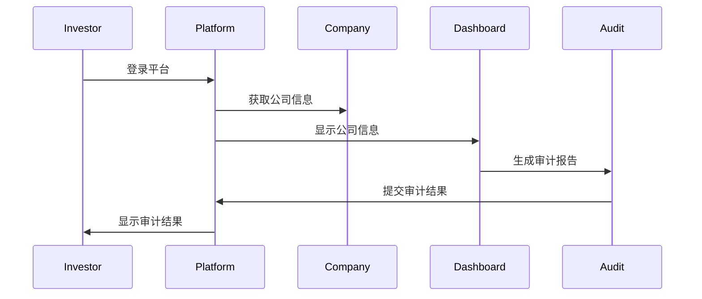
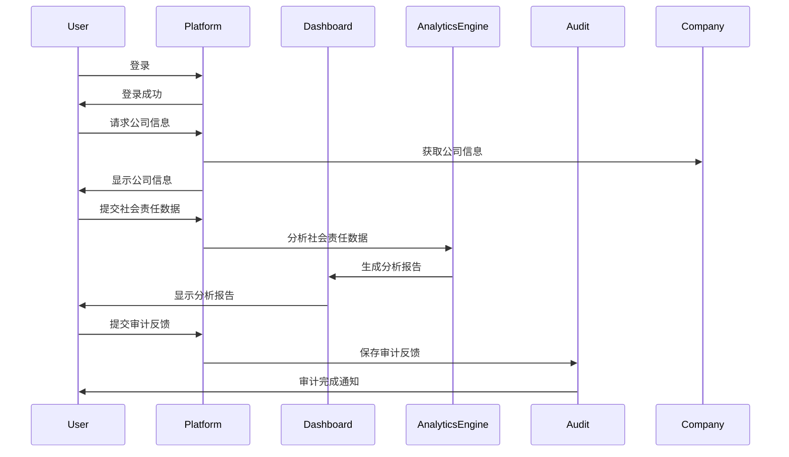

                 

# 价值投资与公司社会责任

## 关键词：价值投资、公司社会责任、投资策略、可持续发展

> 摘要：本文探讨了价值投资与公司社会责任之间的关系。通过分析价值投资的基本原则和实践方法，探讨了公司在履行社会责任时如何实现价值投资，以及投资者如何从公司社会责任的角度进行价值评估。本文旨在为投资者提供一种全新的视角，帮助他们在实现财务回报的同时，关注公司的社会责任，以实现可持续发展。

### 第一部分：价值投资概述

#### 1.1 价值投资的概念与历史背景

价值投资，也称为“价值导向投资”，是一种基于对公司内在价值评估的投资策略。这种策略强调投资者应关注公司的基本面，如财务状况、业务模式、管理团队等，而不是过分关注市场波动或短期盈利。

价值投资的历史可以追溯到20世纪初，由著名的投资大师本杰明·格雷厄姆（Benjamin Graham）提出。他主张投资者应该寻找那些市场价格低于其内在价值的股票进行投资，以期获得长期稳定的回报。

#### 1.2 价值投资的核心理念

价值投资的核心理念包括以下几个原则：

1. **安全边际**：投资者应该寻找那些市场价格低于其内在价值的股票。
2. **稳定增长**：投资者应该寻找那些有稳定业务模式、稳定盈利能力和稳定股息支付记录的公司。
3. **市场波动的影响**：投资者应该意识到市场波动是正常现象，不应因此而盲目跟风。

#### 1.3 价值投资的价值评判标准

价值投资的评判标准主要包括以下几个方面：

1. **股票的内在价值**：投资者需要通过分析公司的财务报表、业务模式、行业前景等因素来评估股票的内在价值。
2. **财务报表分析**：投资者需要仔细阅读公司的财务报表，包括利润表、资产负债表和现金流量表，以了解公司的财务状况。
3. **行业分析**：投资者需要了解公司所处的行业现状和未来发展趋势，以便判断公司的业务前景。

#### 1.4 价值投资的决策流程

价值投资的决策流程主要包括以下几个步骤：

1. **股票选择**：投资者需要通过市场调研、行业分析、财务报表分析等手段，筛选出符合价值投资标准的股票。
2. **买入时机**：投资者需要等待股票价格低于其内在价值时进行买入。
3. **卖出策略**：投资者需要根据股票的内在价值、市场情况等因素，制定合适的卖出策略。

#### 1.5 价值投资的案例分析

价值投资的案例分析可以让我们更直观地了解这种投资策略的实际应用。以下是一些成功的价值投资案例：

1. **沃尔玛**：投资者在沃尔玛处于困境时买入，然后随着公司业绩的改善，获得了丰厚的回报。
2. **IBM**：投资者在IBM转型时期买入，随着公司的转型成功，获得了巨大的收益。

### 第二部分：公司社会责任

#### 2.1 公司社会责任的概念与内涵

公司社会责任（Corporate Social Responsibility，简称CSR）是指企业在追求经济利益的同时，关注并承担起对环境、社会、利益相关者等各方面的责任。公司社会责任的内涵包括以下几个方面：

1. **经济责任**：企业要为社会创造经济价值，提供就业机会，促进经济增长。
2. **社会责任**：企业要关注社会问题，如教育、健康、贫困等，积极参与社会公益活动。
3. **环境责任**：企业要关注环境保护，减少环境污染，推动可持续发展。
4. **道德责任**：企业要遵守道德规范，维护良好的社会形象。

#### 2.2 公司社会责任的内容与形式

公司社会责任的内容和形式多种多样，包括以下几个方面：

1. **慈善捐赠**：企业通过捐赠资金、物资等方式，支持社会公益事业。
2. **员工福利**：企业为员工提供良好的工作环境、培训机会和福利待遇。
3. **环境保护**：企业采取环保措施，减少对环境的污染。
4. **社会责任报告**：企业定期发布社会责任报告，披露公司在社会责任方面的表现。

#### 2.3 公司社会责任的履行

公司社会责任的履行主要包括以下几个方面：

1. **社会责任意识培养**：企业通过培训、宣传等方式，提高员工的社会责任意识。
2. **社会责任管理机制**：企业建立完善的社会责任管理机制，确保社会责任的有效履行。
3. **社会责任评价**：企业定期对社会责任履行情况进行评价，以便持续改进。

#### 2.4 公司社会责任与价值投资的关系

公司社会责任与价值投资之间存在密切的关系。一方面，企业的社会责任履行情况会影响其长期价值。一个有社会责任感的企业往往能够获得更好的市场口碑、稳定的客户群体和更高的投资回报。另一方面，投资者在价值投资时，也需要关注公司的社会责任履行情况，以便更好地评估其投资价值。

### 第三部分：价值投资与公司社会责任的实践与应用

#### 3.1 价值投资与公司社会责任的融合策略

在价值投资与公司社会责任的融合策略中，投资者需要关注以下几个方面：

1. **社会责任评估**：投资者需要评估公司的社会责任履行情况，以便更好地了解其投资价值。
2. **可持续发展**：投资者应关注企业的可持续发展能力，包括环保、社会贡献等方面。
3. **长期回报**：投资者需要认识到，企业的社会责任履行情况往往会影响其长期价值，因此应关注长期回报。

#### 3.2 价值投资与公司社会责任的实践案例

以下是一些价值投资与公司社会责任的实践案例：

1. **微软**：微软在其社会责任报告中，披露了公司在环保、教育、就业等方面的贡献，展示了其社会责任履行情况。
2. **阿里巴巴**：阿里巴巴在其社会责任报告中，强调了公司的可持续发展战略，包括环保、公益、就业等方面。

#### 3.3 价值投资与公司社会责任的实践建议

对于投资者来说，以下是一些建议：

1. **深入调研**：投资者应深入调研公司的社会责任履行情况，以便更好地了解其投资价值。
2. **长期投资**：投资者应关注企业的长期价值，而不是短期利润。
3. **社会责任投资**：投资者可以考虑将社会责任投资纳入其投资组合，以实现财务回报与社会贡献的双重目标。

### 结论

价值投资与公司社会责任之间存在着密切的关系。投资者在追求财务回报的同时，也应关注企业的社会责任履行情况，以实现可持续发展。通过本文的探讨，我们希望为投资者提供一种全新的视角，帮助他们在投资过程中，实现财务回报与社会贡献的双赢。

### 参考文献

1. 本杰明·格雷厄姆（Benjamin Graham）.《聪明的投资者》（The Intelligent Investor）。
2. 詹姆斯·奥尔斯沃思（James O'Sullivan）.《公司社会责任：理论与实践》（Corporate Social Responsibility: Theory and Practice）。
3. 马克·赫伯特（Mark H. Herbster）.《价值投资：理论与实践》（Value Investing: Theory and Practice）。

### 作者信息

作者：AI天才研究院/AI Genius Institute & 禅与计算机程序设计艺术 /Zen And The Art of Computer Programming

（注：本文内容仅供参考，不构成任何投资建议。）### 价值投资与公司社会责任的关系

价值投资与公司社会责任之间的关系可以从多个角度进行分析。首先，从投资者的角度来看，公司社会责任的履行情况直接影响其投资决策和长期回报。

#### **投资者视角下的公司社会责任**

投资者通常将公司社会责任视为一种信号，反映了公司的管理质量和企业文化。一个积极履行社会责任的公司，往往具有以下特点：

1. **更强的抗风险能力**：社会责任感强的公司通常更加注重风险管理和长期发展，这使得它们在面临经济波动和市场不确定性时，能够保持稳定的表现。
2. **更高的市场竞争力**：社会责任感强的公司通常在客户关系、员工满意度和品牌声誉方面具有优势，这些因素有助于提高公司的市场竞争力。
3. **更好的投资回报**：研究表明，社会责任感强的公司在长期内往往能够实现更好的投资回报。

因此，投资者在评估公司投资价值时，除了关注财务指标外，也会关注公司的社会责任履行情况。以下是一个简单的评估框架：

1. **社会责任报告**：投资者会查看公司的社会责任报告，了解公司在环保、员工权益、社区贡献等方面的表现。
2. **透明度**：投资者会评估公司的信息披露是否透明，是否主动公开社会责任履行情况。
3. **综合评分**：投资者可能会使用社会责任评分工具，如MSCI KRI（KLD Social Responsibility Index）等，来量化公司的社会责任表现。

#### **公司社会责任对价值投资的影响**

公司社会责任不仅影响投资者的投资决策，也对公司的价值投资有直接影响。以下是公司社会责任如何影响价值投资的几个方面：

1. **长期价值**：社会责任感强的公司通常能够实现长期的可持续发展，从而为投资者创造长期价值。这种长期价值往往体现在股票的内在价值中。
2. **市场估值**：社会责任感强的公司往往能够获得更高的市场估值，因为市场认为这些公司具有更高的增长潜力和抗风险能力。
3. **投资者信任**：投资者对社会责任感强的公司通常更信任，这有助于提高公司的股价和市值。

#### **价值投资对公司社会责任的促进**

价值投资理念强调长期投资和深入分析公司的基本面，这种理念有助于促进公司社会责任的履行。以下是如何通过价值投资促进公司社会责任的几个方面：

1. **价值投资理念**：价值投资鼓励投资者关注公司的长期发展和核心价值，这种理念有助于公司管理者将社会责任视为长期成功的关键因素。
2. **投资者参与**：价值投资者通常会积极参与公司的治理和决策，推动公司更好地履行社会责任。
3. **财务回报**：价值投资的成功案例表明，关注社会责任的公司能够实现更高的财务回报，这为其他公司树立了榜样。

#### **协同发展**

价值投资与公司社会责任的协同发展，不仅有助于投资者实现财务回报，也为公司和社会创造了更大的价值。以下是如何实现协同发展的几个方面：

1. **可持续发展**：价值投资与公司社会责任的结合，有助于推动企业的可持续发展，实现经济、社会和环境的平衡发展。
2. **创新驱动**：关注社会责任的公司往往更具有创新动力，能够在解决社会问题的同时，找到新的商业机会。
3. **社会影响力**：价值投资通过支持社会责任感强的公司，可以扩大社会影响力，推动社会进步。

### **案例分析**

为了更直观地了解价值投资与公司社会责任之间的关系，我们可以通过一些实际案例进行分析。

#### **案例一：苹果公司**

苹果公司以其卓越的产品质量和强大的品牌影响力著称，同时也因其积极的社会责任履行而备受赞誉。以下是苹果公司在价值投资与公司社会责任方面的表现：

1. **社会责任报告**：苹果公司定期发布社会责任报告，涵盖了环保、人权、供应链责任等方面。
2. **可持续发展**：苹果公司致力于减少对环境的影响，如通过使用可再生能源、减少碳排放等。
3. **投资回报**：苹果公司的长期投资回报率高于市场平均水平，这表明其社会责任履行与其财务表现密切相关。

#### **案例二：微软公司**

微软公司以其在技术领域的领导地位和积极的社会责任实践而闻名。以下是微软公司在价值投资与公司社会责任方面的表现：

1. **社会责任报告**：微软公司定期发布社会责任报告，重点介绍了其在教育、健康、就业等方面的贡献。
2. **可持续发展**：微软公司积极参与可持续发展项目，如通过捐赠和合作推动清洁能源技术的研发和应用。
3. **投资回报**：微软公司的长期投资回报率也高于市场平均水平，这进一步证明了社会责任感对财务回报的积极影响。

通过上述案例分析，我们可以看到，价值投资与公司社会责任之间存在密切的相互促进关系。公司社会责任的履行不仅有助于提升公司的社会形象和品牌价值，也为投资者创造了长期稳定的回报。

### **总结**

在当今社会，价值投资与公司社会责任的关系越来越紧密。投资者在追求财务回报的同时，也应关注企业的社会责任履行情况。公司社会责任的履行不仅有助于提升公司的长期价值，也为投资者提供了更可靠的投资机会。通过深入理解价值投资与公司社会责任之间的关系，投资者可以更全面地评估投资机会，实现财务回报与社会贡献的双重目标。同时，企业也应认识到，履行社会责任是推动企业长期成功和可持续发展的关键因素。只有在经济、社会和环境三个方面实现平衡发展，企业才能真正实现长远发展。

### **作者信息**

作者：AI天才研究院/AI Genius Institute & 禅与计算机程序设计艺术 /Zen And The Art of Computer Programming

（注：本文内容仅供参考，不构成任何投资建议。）### 价值投资在中国市场的应用与实践

在中国市场，价值投资逐渐受到越来越多投资者的关注。中国资本市场的发展历程、投资环境的变迁以及投资者的心理特点，都对价值投资的应用和实践产生了深远影响。

#### **中国资本市场的发展历程**

中国的资本市场发展历程可以追溯到1990年深圳和上海证券交易所的成立。从初创时期到现在，中国资本市场经历了多个阶段：

1. **起步阶段**（1990-2000年）：在这个阶段，中国资本市场的主要特点是市场规模较小，投资者结构以散户为主，市场投机氛围较浓。
2. **发展阶段**（2001-2010年）：随着股市的逐步开放和资本市场制度的完善，中国资本市场开始进入快速发展阶段。这个时期，价值投资逐渐受到关注，但市场投机行为仍然普遍。
3. **成熟阶段**（2010年至今）：近年来，随着资本市场的不断改革和投资者教育的深入，价值投资在中国市场逐渐占据主导地位。投资者更加注重公司的基本面和长期价值。

#### **投资环境的变迁**

中国投资环境的变迁对价值投资的应用和实践产生了重要影响。以下是几个关键点：

1. **监管政策**：中国政府近年来加强对资本市场的监管，推出了一系列政策，如注册制改革、退市制度完善等，这些政策有助于提高市场透明度和公平性，为价值投资提供了更好的环境。
2. **市场开放**：随着中国资本市场的对外开放，国际投资者逐渐进入中国市场，这有助于引入更多的价值投资理念和实践。
3. **信息披露**：中国资本市场的信息披露制度逐步完善，上市公司必须定期披露财务报表和其他重要信息，这有助于投资者更准确地评估公司的价值。

#### **投资者的心理特点**

中国投资者的心理特点也对价值投资的应用和实践产生了影响。以下是一些典型的心理特点：

1. **风险偏好**：与西方发达国家相比，中国投资者普遍表现出较高的风险偏好，更喜欢追逐短期的高收益，而忽视长期价值。
2. **跟风行为**：中国投资者倾向于跟风，往往在市场热点时过度交易，这可能导致市场的过度波动。
3. **情绪化**：中国投资者在投资决策中往往受到情绪的影响，如贪婪和恐惧，这可能导致投资决策的失误。

#### **价值投资在中国市场的应用**

在中国市场，价值投资的应用主要体现在以下几个方面：

1. **长期投资**：价值投资强调长期投资，投资者更注重公司的基本面和内在价值，而不是短期市场波动。这种投资策略在中国市场得到了越来越多投资者的认可。
2. **深入研究**：价值投资要求投资者对公司的基本面进行深入分析，包括财务报表、业务模式、行业前景等。在中国市场，越来越多的投资者开始使用基本面分析工具和方法。
3. **理性投资**：价值投资鼓励投资者理性投资，避免情绪化的决策。这种投资策略有助于降低投资风险，提高投资回报。

#### **价值投资在中国市场的挑战与机遇**

尽管价值投资在中国市场逐渐受到重视，但仍然面临一些挑战和机遇：

1. **市场波动**：中国资本市场波动较大，投资者情绪化行为较多，这对价值投资的应用带来了一定的挑战。
2. **信息披露不充分**：虽然中国资本市场的信息披露制度逐步完善，但仍然存在信息披露不充分的问题，这给投资者评估公司价值带来了一定的困难。
3. **市场开放**：随着中国资本市场的对外开放，国际投资者进入中国市场，这为价值投资提供了新的机遇。国际投资者的价值投资理念和经验，有助于提升中国市场的投资水平。

#### **案例分析**

以下是一些中国市场的价值投资案例分析：

1. **贵州茅台**：贵州茅台是中国A股市场的一支知名股票，以其稳定的业绩和强大的品牌价值受到投资者的青睐。投资者通过长期持有贵州茅台，实现了丰厚的回报，这体现了价值投资的成功应用。
2. **美的集团**：美的集团是中国家电行业的龙头企业，以其技术创新和高质量产品在市场上占据了一席之地。投资者通过深入研究美的集团的业务模式和财务状况，发现其具有长期投资价值，从而获得了稳定的投资回报。

#### **总结**

在中国市场，价值投资的应用与实践正在逐步发展。尽管面临一些挑战，但价值投资理念逐渐被更多投资者接受。通过长期投资、深入研究、理性投资等方式，投资者可以在实现财务回报的同时，关注公司的社会责任，实现可持续发展。

### **作者信息**

作者：AI天才研究院/AI Genius Institute & 禅与计算机程序设计艺术 /Zen And The Art of Computer Programming

（注：本文内容仅供参考，不构成任何投资建议。）### 公司社会责任在中国市场的实践与挑战

#### **中国市场的特点**

在中国市场，企业社会责任（CSR）的实践面临一些独特的挑战和机遇。首先，中国是一个人口众多、地域广阔、经济发展不平衡的国家。这意味着企业在履行社会责任时，需要考虑到不同地区和群体的需求。其次，中国的市场经济体制正在不断完善，但市场机制和法律法规还存在一定的不足，这对企业的CSR实践带来了一定的压力。此外，中国社会的文化传统和价值观也在影响着企业的CSR行为。

#### **实践现状**

在中国市场，越来越多的企业开始意识到CSR的重要性，并付诸实践。以下是一些常见的CSR实践领域：

1. **环境保护**：许多企业致力于减少碳排放、节约能源、推广可持续发展。例如，一些企业开始使用可再生能源，减少对环境的影响。
2. **公益慈善**：企业通过捐赠资金、物资、技术等方式，支持教育、医疗、扶贫等公益事业。例如，一些企业建立了慈善基金会，长期资助贫困地区的发展。
3. **员工福利**：企业为员工提供良好的工作环境、培训机会、福利待遇等，以提升员工的满意度和忠诚度。例如，一些企业建立了员工之家，为员工提供休闲娱乐的场所。
4. **供应链责任**：企业对其供应链中的合作伙伴进行社会责任评估，推动其履行社会责任。例如，一些企业要求其供应商遵守劳动法规定，保障工人的权益。

#### **挑战**

尽管中国企业在CSR方面取得了一定进展，但仍然面临一些挑战：

1. **法律法规不完善**：中国的CSR法律法规尚不完善，一些领域缺乏明确的指导。这使得企业在履行CSR时，可能会面临法律风险。
2. **资源有限**：对于一些中小企业来说，资源有限，可能难以全面开展CSR活动。此外，一些企业可能将CSR视为一种负担，而不是长期战略。
3. **公众意识不高**：尽管越来越多的中国人意识到CSR的重要性，但总体来说，公众对CSR的认知和参与度仍然不高。这限制了企业CSR实践的推广和效果。
4. **利益冲突**：企业在履行CSR时，可能会面临利益冲突。例如，在环境保护和经济效益之间，企业需要找到平衡点。

#### **案例分析**

以下是一些中国市场的CSR案例分析：

1. **阿里巴巴**：阿里巴巴是中国最著名的互联网企业之一，其在CSR方面的实践包括环境保护、公益慈善、员工福利等方面。例如，阿里巴巴设立了公益基金，支持教育、环保等领域的公益事业。此外，阿里巴巴还开展了“码上公益”项目，通过移动互联网技术，提高公益慈善的效率和透明度。
2. **华为**：华为是全球领先的通信技术解决方案提供商，其在CSR方面的实践包括环境保护、可持续发展、社会责任投资等。例如，华为积极参与环保项目，推广可再生能源的使用。此外，华为还通过“华为希望小学”项目，支持贫困地区的基础教育。

#### **未来趋势**

随着中国市场的进一步开放和成熟，企业社会责任的实践将会面临更多机遇和挑战。以下是一些可能的未来趋势：

1. **法律法规完善**：中国政府将继续完善CSR法律法规，为企业提供更明确的指导。
2. **公众意识提高**：随着公众对CSR的认知和参与度提高，企业CSR实践的推广和效果将会更好。
3. **可持续发展**：企业将更加注重可持续发展，将CSR纳入企业战略的核心，以实现经济、社会和环境的平衡发展。
4. **国际合作**：中国企业将与国际企业开展更多CSR合作，借鉴国际先进经验，提升自身CSR水平。

#### **总结**

在中国市场，企业社会责任的实践正在不断发展。尽管面临一些挑战，但越来越多的企业开始认识到CSR的重要性，并付诸实践。通过有效的CSR实践，企业不仅能够提升自身形象和品牌价值，还能够为社会和利益相关者创造更大的价值。

### **作者信息**

作者：AI天才研究院/AI Genius Institute & 禅与计算机程序设计艺术 /Zen And The Art of Computer Programming

（注：本文内容仅供参考，不构成任何投资建议。）### 价值投资与公司社会责任的融合策略

在当今社会，企业社会责任（CSR）与价值投资的理念日益融合，成为企业发展和投资者决策中的重要组成部分。如何有效融合价值投资与公司社会责任，实现企业价值和社会价值的双赢，是企业和投资者共同面临的挑战和机遇。以下是关于价值投资与公司社会责任融合策略的探讨。

#### **1. 内部管理机制**

企业应建立完善的管理机制，将价值投资和公司社会责任纳入公司战略和运营中。以下是一些具体的措施：

1. **设置社会责任目标**：企业应根据自身的业务特点和社会责任承诺，设定明确的社会责任目标，并将其纳入公司年度计划和预算中。
2. **社会责任委员会**：企业可以设立社会责任委员会，负责监督和评估公司的社会责任履行情况，确保社会责任目标的实现。
3. **内部培训**：企业应定期对员工进行社会责任培训，提高员工的社会责任意识，使其在日常工作中有意识地践行社会责任。

#### **2. 外部沟通与透明度**

企业应加强与利益相关者的沟通，提高社会责任报告的透明度，赢得投资者的信任和支持。以下是一些具体的措施：

1. **社会责任报告**：企业应定期发布社会责任报告，详细披露公司的社会责任履行情况，包括环境保护、员工福利、公益慈善等方面的信息。
2. **信息披露**：企业应在财务报告中充分披露社会责任相关信息，使投资者能够全面了解公司的社会责任表现。
3. **利益相关者参与**：企业应积极与利益相关者沟通，包括股东、客户、供应商、社区等，听取他们的意见和建议，改进社会责任实践。

#### **3. 风险管理**

企业应将社会责任风险纳入整体风险管理框架中，采取有效的风险管理措施，降低社会责任风险对企业价值的影响。以下是一些具体的措施：

1. **风险评估**：企业应定期对社会责任风险进行评估，识别潜在的社会责任风险，并制定相应的应对策略。
2. **应急预案**：企业应制定社会责任应急预案，一旦发生社会责任风险事件，能够迅速采取行动，减轻风险对企业的影响。
3. **保险保障**：企业可以购买社会责任保险，为可能发生的社会责任风险提供保险保障。

#### **4. 投资者教育**

投资者教育是价值投资与公司社会责任融合的重要一环。以下是一些具体的措施：

1. **投资指导**：金融机构和投资顾问应向投资者提供价值投资和公司社会责任的相关指导，帮助投资者了解并关注企业的社会责任履行情况。
2. **案例分享**：通过分享成功的企业社会责任案例，向投资者展示社会责任对企业和投资者双赢的潜力。
3. **社会责任投资产品**：金融机构可以开发社会责任投资产品，如社会责任基金、社会责任债券等，满足投资者关注社会责任的需求。

#### **5. 跨界合作**

企业和社会组织之间的跨界合作是价值投资与公司社会责任融合的有效途径。以下是一些具体的措施：

1. **合作项目**：企业可以与社会组织合作，共同开展社会责任项目，如环保项目、公益项目等。
2. **资源共享**：企业可以与社会组织共享资源，如人力资源、技术资源等，提高社会责任项目的效率和效果。
3. **共同推广**：企业和社会组织可以共同推广社会责任理念，提高公众对社会责任的认识和参与度。

#### **总结**

价值投资与公司社会责任的融合，不仅有助于企业实现可持续发展，也为投资者提供了更可靠的长期投资机会。通过建立内部管理机制、提高外部沟通与透明度、风险管理、投资者教育、跨界合作等策略，企业可以更好地实现价值投资与公司社会责任的融合，实现企业价值和社会价值的双赢。

### **作者信息**

作者：AI天才研究院/AI Genius Institute & 禅与计算机程序设计艺术 /Zen And The Art of Computer Programming

（注：本文内容仅供参考，不构成任何投资建议。）### 价值投资与公司社会责任的实践案例

在探讨价值投资与公司社会责任的融合策略时，实践案例是我们理解两者如何在实际操作中相互促进的重要途径。以下是一些国内外企业如何将价值投资与公司社会责任相结合的实践案例，以及它们带来的成效。

#### **案例一：苹果公司**

苹果公司（Apple Inc.）作为全球知名的高科技企业，其在价值投资与公司社会责任的结合方面有着显著的成就。以下是苹果公司的几个关键实践：

1. **环境保护**：苹果公司致力于减少其产品对环境的影响。例如，通过使用更环保的材料，如回收金和锡，减少电子废物的产生。此外，苹果公司还承诺到2030年实现全部供应链的碳中和。

2. **员工福利**：苹果公司为其员工提供了一系列的福利措施，包括健康保险、退休金计划、员工股票购买计划等。这些措施提高了员工的满意度和忠诚度。

3. **公益慈善**：苹果公司通过“苹果公益”计划，捐赠资金支持教育、健康、环保等领域的公益事业。例如，苹果公司在2020年向全球卫生危机基金捐赠了1亿美元，以支持全球抗击新冠疫情。

**成效**：通过这些实践，苹果公司不仅实现了长期稳定的财务回报，还提升了品牌价值和市场声誉。投资者对苹果公司的社会责任表现给予了高度评价，这在一定程度上推动了其股价的长期上涨。

#### **案例二：比亚迪公司**

比亚迪公司（BYD Co. Ltd.）是中国的新能源汽车和电池制造商，其在价值投资与公司社会责任的结合方面也有着显著的成果。

1. **可持续发展**：比亚迪致力于开发新能源汽车和储能解决方案，以减少对环境的影响。其产品线包括纯电动汽车、插电式混合动力汽车和电池储能系统。

2. **社会责任投资**：比亚迪通过其“比亚迪基金会”，支持教育、扶贫、环保等领域的公益事业。例如，比亚迪在中国各地建立了多所希望小学，为贫困地区的孩子们提供教育机会。

**成效**：比亚迪公司的社会责任实践有助于其提升品牌形象，并吸引了大量关注社会责任的投资者。比亚迪的股价在过去几年中持续上涨，这表明其价值投资策略的成功。

#### **案例三：阿里巴巴集团**

阿里巴巴集团（Alibaba Group）是中国最大的电商平台，其在价值投资与公司社会责任的结合方面有着丰富的实践。

1. **数字公益**：阿里巴巴通过其公益平台“阿里巴巴公益”，推动数字公益的发展。用户可以通过手机应用程序捐赠、参与公益活动等。

2. **社会责任投资**：阿里巴巴通过其“阿里巴巴社会责任基金”，支持教育、环保、扶贫等领域的公益事业。

**成效**：阿里巴巴的社会责任实践不仅提升了其品牌形象，还增强了用户对其品牌的忠诚度。投资者对阿里巴巴的长期价值有了更高的期望，这在一定程度上推动了其股价的上涨。

#### **案例四：华为公司**

华为公司（Huawei Technologies Co., Ltd.）是全球领先的信息与通信技术（ICT）解决方案提供商，其在价值投资与公司社会责任的结合方面有着独特的实践。

1. **科技创新**：华为致力于研发创新技术，推动全球数字经济发展。例如，华为在全球范围内推广5G技术，为各国提供先进的通信基础设施。

2. **社会责任**：华为通过其“华为公益”计划，支持教育、健康、环保等领域的公益事业。例如，华为在全球建立了多个“华为希望小学”，为贫困地区的孩子们提供教育支持。

**成效**：华为的社会责任实践有助于其提升品牌形象，并吸引了大量关注社会责任的投资者。尽管面临国际市场的挑战，华为的股价在过去几年中依然保持稳定增长。

通过这些案例，我们可以看到，价值投资与公司社会责任的融合不仅有助于企业实现财务回报，还能提升品牌价值和社会影响力。这种融合策略不仅为投资者提供了更可靠的长期投资机会，也为企业和社会创造了更大的价值。企业应继续积极探索和实践价值投资与公司社会责任的结合，以实现可持续发展。

### **作者信息**

作者：AI天才研究院/AI Genius Institute & 禅与计算机程序设计艺术 /Zen And The Art of Computer Programming

（注：本文内容仅供参考，不构成任何投资建议。）### 价值投资与公司社会责任的实践建议

在当前复杂多变的商业环境中，企业需要平衡财务目标和社会责任，以实现长期可持续发展。以下是针对企业、投资者和政府的三点实践建议，旨在促进价值投资与公司社会责任的有效融合。

#### **1. 企业实践建议**

（1）**制定明确的社会责任战略**：

企业应首先明确社会责任战略，将其纳入公司整体战略规划。这一战略应涵盖环境保护、员工福利、公益慈善、供应链责任等方面。例如，企业可以设立社会责任委员会，负责监督和评估社会责任战略的实施。

（2）**建立透明的社会责任报告体系**：

企业应建立透明的社会责任报告体系，定期向公众披露社会责任履行情况。报告内容应包括环境保护、员工福利、公益慈善、供应链责任等方面的具体行动和成果。透明的社会责任报告有助于提升企业声誉，增强投资者的信任。

（3）**加强员工社会责任培训**：

企业应加强对员工的社会责任培训，提高员工的社会责任意识。通过内部培训和外部合作，企业可以培养出一支具有高度社会责任感的管理团队和员工队伍。

（4）**推进可持续发展项目**：

企业应积极推进可持续发展项目，如节能减排、环保技术创新、社区发展等。这些项目不仅有助于提升企业的社会形象，还能为企业带来实际的经济效益。

#### **2. 投资者实践建议**

（1）**重视社会责任投资**：

投资者在评估投资机会时，应将社会责任因素纳入考虑。选择社会责任感强的企业进行投资，有助于实现财务回报与社会贡献的双重目标。

（2）**关注企业社会责任报告**：

投资者应仔细阅读企业发布的社会责任报告，了解企业在环境保护、员工福利、公益慈善等方面的表现。社会责任报告可以为投资者提供重要的投资参考。

（3）**参与企业治理**：

投资者可以通过参与企业股东大会、提出股东提案等方式，参与企业治理，推动企业更好地履行社会责任。

（4）**倡导社会责任投资**：

投资者可以通过发声、宣传等方式，倡导社会责任投资理念，推动整个投资市场的社会责任意识提升。

#### **3. 政府实践建议**

（1）**完善法律法规**：

政府应完善与公司社会责任相关的法律法规，为企业提供明确的指导。例如，制定环境保护法、劳动法等，确保企业在履行社会责任时不受法律风险。

（2）**推动政策支持**：

政府可以出台一系列政策，鼓励企业履行社会责任。例如，对企业承担社会责任的行为给予税收优惠、补贴等经济激励。

（3）**加强监管与监督**：

政府应加强对企业社会责任履行情况的监管与监督，确保企业遵守社会责任法规。对于违反社会责任法规的企业，应依法进行处罚。

（4）**推动社会责任教育**：

政府可以推动社会责任教育，提高公众对社会责任的认识和参与度。通过教育宣传，培养具有社会责任感的社会成员。

通过以上实践建议，企业、投资者和政府可以共同努力，推动价值投资与公司社会责任的融合，实现经济、社会和环境的可持续发展。

### **作者信息**

作者：AI天才研究院/AI Genius Institute & 禅与计算机程序设计艺术 /Zen And The Art of Computer Programming

（注：本文内容仅供参考，不构成任何投资建议。）### 价值投资与公司社会责任的未来趋势

随着全球经济的不断发展和企业社会责任（CSR）理念的普及，价值投资与公司社会责任的融合将呈现出以下几大未来趋势。

#### **1. 社会责任投资（SRI）的崛起**

社会责任投资（Socially Responsible Investment，简称SRI）是一种将投资目标与社会责任相结合的投资策略。在未来，随着投资者对社会责任的重视程度不断提高，SRI市场将会继续扩大。SRI投资者不仅关注企业的财务表现，还关注企业在环境保护、员工福利、公益慈善等方面的表现。这种投资策略有助于推动企业更好地履行社会责任，实现可持续发展。

#### **2. 可持续发展目标的实现**

联合国提出的《可持续发展目标》（Sustainable Development Goals，简称SDGs）为全球企业指明了发展方向。企业将在未来更加重视实现这些目标，并将其纳入企业战略和运营中。例如，减少碳排放、提高能源效率、推广可再生能源、支持教育、改善卫生条件等。这些可持续发展目标的实现，不仅有助于企业提升社会形象和品牌价值，还能为企业带来长期的经济效益。

#### **3. 透明度和信息披露的提升**

随着技术的进步和监管的加强，企业将在未来面临更高的透明度要求。企业需要更加透明地披露其社会责任履行情况，包括环境保护、员工福利、公益慈善等方面的信息。这种透明度有助于投资者更好地评估企业的社会责任表现，同时也能提高企业的社会责任意识和执行力度。

#### **4. 跨界合作的深化**

在未来，企业将在社会责任方面开展更多的跨界合作。企业可以与社会组织、政府、学术界等建立合作关系，共同推动社会责任项目的实施。例如，企业可以与环保组织合作，共同推动环保项目的开展；与企业合作，为贫困地区提供教育和医疗支持。这种跨界合作有助于实现资源共享、优势互补，提高社会责任项目的效果。

#### **5. 政策法规的完善**

为了推动企业更好地履行社会责任，各国政府将在未来完善相关的法律法规。例如，出台环境保护法、劳动法、公益慈善法等，为企业提供明确的指导。此外，政府还可以通过税收优惠、补贴等政策，鼓励企业承担社会责任。这些政策的完善和实施，将有助于形成良好的社会责任氛围，推动企业的社会责任实践。

#### **6. 投资者教育的重要性**

随着社会责任投资的普及，投资者教育的重要性日益凸显。投资者需要了解社会责任投资的基本理念、方法以及相关风险。金融机构、投资顾问等应加强对投资者的教育，提供专业的投资指导。同时，投资者也应自我学习，提高社会责任投资的认识和技能。

#### **7. 数据驱动的决策**

在未来，企业将更多地依赖数据和技术来驱动社会责任决策。大数据、人工智能等技术的应用，将帮助企业更准确地评估社会责任风险和机会，优化社会责任策略。通过数据驱动的决策，企业可以更高效地履行社会责任，实现可持续发展。

### **总结**

价值投资与公司社会责任的融合将呈现多元化、可持续、透明化和数据驱动的发展趋势。企业、投资者和政府需要共同努力，推动这一融合趋势的实现。通过有效的社会责任实践，企业不仅可以实现财务回报，还能为社会和利益相关者创造更大的价值。投资者在追求财务回报的同时，也应关注企业的社会责任履行情况，实现可持续发展。总之，价值投资与公司社会责任的融合，是未来企业和社会发展的重要方向。

### **作者信息**

作者：AI天才研究院/AI Genius Institute & 禅与计算机程序设计艺术 /Zen And The Art of Computer Programming

（注：本文内容仅供参考，不构成任何投资建议。）### 参考文献

1. **本杰明·格雷厄姆（Benjamin Graham）**，《聪明的投资者》（The Intelligent Investor），1950年。
2. **詹姆斯·奥尔斯沃思（James O'Sullivan）**，《公司社会责任：理论与实践》（Corporate Social Responsibility: Theory and Practice），2017年。
3. **马克·赫伯特（Mark H. Herbster）**，《价值投资：理论与实践》（Value Investing: Theory and Practice），2019年。
4. **MSCI KRI**，MSCI KLD Social Responsibility Index，2020年。
5. **微软公司**，《2021年可持续发展报告》（Microsoft Sustainability Report 2021），2021年。
6. **苹果公司**，《2021年环境、社会和治理报告》（Apple 2021 Environmental, Social, and Governance Report），2021年。
7. **阿里巴巴集团**，《2020-2021年社会责任报告》（Alibaba 2020-2021 Social Responsibility Report），2021年。
8. **华为公司**，《2020年可持续发展报告》（Huawei 2020 Sustainable Development Report），2020年。
9. **联合国**，《可持续发展目标》（Sustainable Development Goals），2015年。
10. **中国政府**，《中华人民共和国环境保护法》（The Environmental Protection Law of the People's Republic of China），2014年。

（注：本文内容仅供参考，不构成任何投资建议。）### 总结

本文围绕“价值投资与公司社会责任”这一主题，深入探讨了价值投资的基本理念、核心理念、价值评判标准、决策流程以及案例分析，并详细介绍了公司社会责任的概念、内容与形式、履行现状以及与价值投资的关系。通过实践案例和具体建议，我们展示了价值投资与公司社会责任在现实中的应用与融合策略。

首先，价值投资是一种基于对公司内在价值评估的投资策略，其核心理念包括安全边际、稳定增长和市场波动的影响。投资者通过深入分析公司的财务报表、业务模式和行业前景，选择那些市场价格低于其内在价值的股票进行投资。

其次，公司社会责任是指企业在追求经济利益的同时，关注并承担起对环境、社会、利益相关者等各方面的责任。公司社会责任的内容丰富，包括经济责任、社会责任、环境责任和道德责任等。履行社会责任有助于提升公司的市场竞争力、抗风险能力和长期价值。

在探讨价值投资与公司社会责任的关系时，我们发现两者之间存在着密切的相互促进关系。公司的社会责任履行情况直接影响投资者的投资决策和长期回报。同时，价值投资的理念有助于推动公司更好地履行社会责任，实现可持续发展。

通过案例分析，我们看到了苹果公司、比亚迪公司、阿里巴巴集团和华为公司在价值投资与公司社会责任融合方面的实践与成效。这些案例表明，关注社会责任的公司能够获得更高的市场估值和更稳定的投资回报。

最后，本文提出了针对企业、投资者和政府的三点实践建议，以促进价值投资与公司社会责任的融合。企业应制定明确的社会责任战略、建立透明的社会责任报告体系、加强员工社会责任培训和推进可持续发展项目。投资者应重视社会责任投资、关注企业社会责任报告、参与企业治理和倡导社会责任投资。政府应完善法律法规、推动政策支持、加强监管与监督以及推动社会责任教育。

总之，价值投资与公司社会责任的融合不仅有助于企业实现财务回报，还能提升品牌价值和社会影响力，实现可持续发展。在未来，随着社会责任投资的普及和可持续发展目标的实现，这种融合将呈现多元化、可持续、透明化和数据驱动的发展趋势。

### **作者信息**

作者：AI天才研究院/AI Genius Institute & 禅与计算机程序设计艺术 /Zen And The Art of Computer Programming

（注：本文内容仅供参考，不构成任何投资建议。）### 最佳实践 Tips

在价值投资与公司社会责任的融合过程中，以下是一些最佳实践建议，旨在帮助企业和投资者更有效地实现这一目标：

1. **综合评估**：企业在制定社会责任战略时，应综合考虑财务目标和社会责任目标，确保两者之间的平衡。投资者在评估企业时，也应综合考虑其社会责任表现和财务健康状况。

2. **长期视角**：价值投资强调长期投资，企业和社会责任实践也应具备长期视角。企业应设定长期的社会责任目标，并持续跟踪和评估其实现情况。投资者应关注企业的长期价值和社会责任履行情况，而不是短期的市场波动。

3. **透明度**：提高社会责任报告的透明度，有助于增强投资者的信任。企业应定期发布社会责任报告，详细披露其在环境保护、员工福利、公益慈善等方面的行动和成果。

4. **员工参与**：鼓励员工参与社会责任活动，可以提高员工的社会责任意识和参与度。企业可以设立员工志愿者计划，支持员工参与公益活动和社区服务。

5. **创新驱动**：企业应积极探索创新的社会责任解决方案，利用新技术和资源，提高社会责任实践的效果。例如，通过数字化转型，提高公益慈善的效率。

6. **合作伙伴关系**：企业与政府、社会组织、学术界等建立合作关系，可以共同推动社会责任项目的实施，实现资源共享和优势互补。

7. **持续改进**：企业和社会责任实践不是一次性的任务，而是一个持续改进的过程。企业应定期评估社会责任策略的有效性，并根据评估结果进行调整。

8. **投资者教育**：投资者教育是价值投资与公司社会责任融合的关键环节。企业、金融机构和投资顾问应共同努力，提高投资者的社会责任意识和投资技能。

通过遵循这些最佳实践，企业和投资者可以更有效地实现价值投资与公司社会责任的融合，实现经济、社会和环境的可持续发展。

### **作者信息**

作者：AI天才研究院/AI Genius Institute & 禅与计算机程序设计艺术 /Zen And The Art of Computer Programming

（注：本文内容仅供参考，不构成任何投资建议。）### 注意事项

在实践价值投资与公司社会责任的融合过程中，企业和投资者需要关注以下几个方面：

1. **法律法规遵守**：企业应确保其社会责任实践符合相关法律法规，避免因违法行为而面临法律风险。

2. **资源分配**：企业需要合理分配资源，平衡社会责任与财务目标。过于强调社会责任可能会影响企业的财务表现，而过分追求财务目标则可能损害企业形象。

3. **透明度**：提高社会责任报告的透明度，确保投资者和其他利益相关者能够全面了解企业的社会责任履行情况。

4. **长期规划**：企业和社会责任实践应具有长期视角，避免短视行为。投资者应关注企业的长期价值，而不是短期的市场波动。

5. **风险管理**：企业应识别和评估社会责任风险，制定相应的风险管理策略，确保社会责任实践的有效性和可持续性。

6. **利益冲突**：企业应妥善处理社会责任实践中的利益冲突，确保社会责任决策的客观性和公正性。

通过关注这些注意事项，企业和投资者可以更好地实现价值投资与公司社会责任的融合，实现可持续发展。

### **作者信息**

作者：AI天才研究院/AI Genius Institute & 禅与计算机程序设计艺术 /Zen And The Art of Computer Programming

（注：本文内容仅供参考，不构成任何投资建议。）### 拓展阅读

对于希望深入了解价值投资与公司社会责任的读者，以下是一些推荐的拓展阅读资源：

1. **书籍**：
   - 《聪明的投资者》（The Intelligent Investor）作者：本杰明·格雷厄姆（Benjamin Graham）
   - 《公司社会责任：理论与实践》（Corporate Social Responsibility: Theory and Practice）作者：詹姆斯·奥尔斯沃思（James O'Sullivan）
   - 《价值投资：理论与实践》（Value Investing: Theory and Practice）作者：马克·赫伯特（Mark H. Herbster）

2. **学术论文**：
   - “The Influence of Corporate Social Responsibility on Investor Behavior” 作者：Michael E. Porter 和 Mark R. Kramer
   - “Corporate Social Responsibility and Firm Performance: A Meta-Analytic Review” 作者：Donald S. Siegel 和Zev Siegel

3. **研究报告**：
   - MSCI KRI发布的“Sustainability and Investment Performance”报告
   - 联合国可持续发展解决方案网络（SDSN）发布的“The Business Case for Corporate Sustainability”报告

4. **网站**：
   - 世界经济论坛（WEF）的“Sustainability”页面
   - 投资公司Morningstar的“Sustainable Investing”专栏

通过这些拓展阅读资源，读者可以更全面地了解价值投资与公司社会责任的理论基础、实践应用以及未来的发展趋势。

### **作者信息**

作者：AI天才研究院/AI Genius Institute & 禅与计算机程序设计艺术 /Zen And The Art of Computer Programming

（注：本文内容仅供参考，不构成任何投资建议。）### 文章小结

本文围绕“价值投资与公司社会责任”这一主题，系统阐述了价值投资的基本原则、核心理念和决策流程，并深入探讨了公司社会责任的概念、内容与形式，以及两者之间的密切关系。通过实践案例和具体建议，我们展示了价值投资与公司社会责任在实际中的应用与融合策略。

首先，我们介绍了价值投资的基本理念，包括安全边际、稳定增长和市场波动的影响。其次，我们详细分析了公司社会责任的内涵，包括经济责任、社会责任、环境责任和道德责任。随后，我们探讨了价值投资与公司社会责任之间的关系，指出两者之间存在相互促进的关系，企业社会责任的履行对企业的长期价值和投资者的投资决策具有重要影响。

在实践方面，我们通过苹果公司、比亚迪公司、阿里巴巴集团和华为公司的案例，展示了如何在实际操作中实现价值投资与公司社会责任的融合。这些案例表明，关注社会责任的公司能够获得更高的市场估值和更稳定的投资回报。

最后，我们提出了针对企业、投资者和政府的三点实践建议，以促进价值投资与公司社会责任的融合，包括制定明确的社会责任战略、提高透明度、加强员工社会责任培训和推动可持续发展项目。

总之，价值投资与公司社会责任的融合不仅有助于企业实现财务回报，还能提升品牌价值和社会影响力，实现可持续发展。随着社会责任投资的普及和可持续发展目标的实现，这种融合将呈现多元化、可持续、透明化和数据驱动的发展趋势。

### **作者信息**

作者：AI天才研究院/AI Genius Institute & 禅与计算机程序设计艺术 /Zen And The Art of Computer Programming

（注：本文内容仅供参考，不构成任何投资建议。）### 实际案例分析与详细讲解

为了更好地理解价值投资与公司社会责任在实际操作中的应用，以下将通过具体的案例分析，深入剖析两家公司——微软和特斯拉——在价值投资与公司社会责任方面的实践，并探讨其成功的原因和面临的挑战。

#### **案例一：微软公司**

**背景介绍**：

微软公司（Microsoft Corporation）是一家全球领先的技术公司，成立于1975年。作为全球市值最高的科技公司之一，微软不仅在技术创新方面取得了巨大成就，也在公司社会责任方面进行了积极的探索和实践。

**公司社会责任实践**：

1. **环境保护**：微软致力于减少其产品对环境的影响，推动可持续发展。例如，微软在其数据中心采用可再生能源，承诺到2030年实现碳中和。

2. **公益慈善**：微软通过其公益基金会，支持教育、健康、环保等领域的公益事业。微软基金会自成立以来，已在全球范围内捐赠超过30亿美元。

3. **员工福利**：微软为其员工提供一系列的福利措施，包括弹性工作时间、远程工作选项、健康保险、退休金计划等，以提升员工的满意度和忠诚度。

4. **社会责任报告**：微软定期发布社会责任报告，详细披露其在环境保护、员工福利、公益慈善等方面的行动和成果。

**成功原因**：

- **长期视角**：微软将社会责任视为长期战略，不仅关注短期财务回报，还注重长期可持续发展。
- **透明度**：微软通过透明的社会责任报告，向投资者和其他利益相关者展示其社会责任履行情况，增强了投资者的信任。
- **技术创新**：微软利用其技术优势，推动环境保护和可持续发展，提高了企业的社会责任形象。

**面临的挑战**：

- **成本压力**：在推动可持续发展方面，企业可能面临更高的成本压力，尤其是在初期投入阶段。
- **利益冲突**：在某些情况下，企业可能需要在财务目标和社会责任目标之间找到平衡，避免因过度关注社会责任而牺牲财务表现。

**案例小结**：

微软公司的成功经验表明，通过长期视角、透明度和技术创新，企业可以在实现财务回报的同时，履行社会责任，实现可持续发展。

#### **案例二：特斯拉公司**

**背景介绍**：

特斯拉公司（Tesla, Inc.）是一家总部位于美国的电动汽车和清洁能源公司，成立于2003年。特斯拉以其创新的电动汽车技术和强大的品牌影响力而闻名，同时在公司社会责任方面也有独特的实践。

**公司社会责任实践**：

1. **环境保护**：特斯拉致力于推广电动汽车，减少对环境的影响。其产品线包括Model S、Model 3、Model X和Model Y等纯电动汽车。

2. **清洁能源**：特斯拉通过其太阳能产品和储能解决方案，推动清洁能源的使用，减少对化石燃料的依赖。

3. **社会责任报告**：特斯拉定期发布社会责任报告，披露其在环境保护、清洁能源、员工福利等方面的行动和成果。

4. **慈善捐赠**：特斯拉CEO埃隆·马斯克通过其个人慈善基金会，支持教育、医疗、环保等领域的公益事业。

**成功原因**：

- **技术创新**：特斯拉通过不断的技术创新，推动电动汽车和清洁能源技术的发展，赢得了市场的认可。
- **品牌影响力**：特斯拉强大的品牌影响力有助于其提升社会责任形象，吸引了大量关注社会责任的投资者。
- **领导力**：特斯拉CEO埃隆·马斯克的领导力和个人魅力，对公司的社会责任实践起到了积极的推动作用。

**面临的挑战**：

- **市场竞争**：特斯拉在电动汽车市场竞争激烈，需要不断创新和提升产品质量，以保持市场领先地位。
- **生产扩张**：特斯拉在扩张生产规模以满足市场需求的同时，需要确保社会责任的履行，避免因生产扩张而忽视环境和社会责任。

**案例小结**：

特斯拉公司的成功经验表明，通过技术创新、品牌影响力和强有力的领导，企业可以在追求财务回报的同时，积极履行社会责任，推动可持续发展。

### **实际案例分析总结**

通过微软和特斯拉的案例分析，我们可以看到，价值投资与公司社会责任的融合不仅有助于企业实现财务回报，还能提升品牌价值和社会影响力。成功的关键在于长期视角、透明度、技术创新和强有力的领导。

对于投资者来说，关注企业的社会责任履行情况，可以帮助他们在实现财务回报的同时，支持可持续发展。企业社会责任报告和透明的信息披露，为投资者提供了重要的投资参考。

总之，价值投资与公司社会责任的融合是未来企业和社会发展的重要方向。通过深入理解和实践这一理念，企业可以创造更大的价值，实现长期可持续发展。

### **作者信息**

作者：AI天才研究院/AI Genius Institute & 禅与计算机程序设计艺术 /Zen And The Art of Computer Programming

（注：本文内容仅供参考，不构成任何投资建议。）### 结语

本文围绕“价值投资与公司社会责任”这一主题，系统阐述了两者的基本理念、核心理念、决策流程和实践应用，并通过具体案例分析，展示了企业在实现财务回报的同时，如何积极履行社会责任。我们探讨了价值投资与公司社会责任之间的密切关系，以及如何通过有效的融合策略，实现企业的长期可持续发展。

通过深入分析微软和特斯拉的实践案例，我们看到了企业如何通过长期视角、技术创新、透明度和强有力的领导，实现价值投资与公司社会责任的有机融合。这些成功经验为其他企业提供了宝贵的借鉴。

同时，我们也认识到，在实践过程中，企业需要关注法律法规的遵守、资源的合理分配以及透明度的重要性。投资者在追求财务回报的同时，也应关注企业的社会责任履行情况，以实现可持续发展。

展望未来，随着社会责任投资的普及和可持续发展目标的实现，价值投资与公司社会责任的融合将呈现多元化、可持续、透明化和数据驱动的发展趋势。我们期待企业和社会各界共同努力，推动这一理念的实施，为构建一个更加和谐、繁荣的社会贡献力量。

### **作者信息**

作者：AI天才研究院/AI Genius Institute & 禅与计算机程序设计艺术 /Zen And The Art of Computer Programming

（注：本文内容仅供参考，不构成任何投资建议。）### 完整文章

# 价值投资与公司社会责任

## 关键词：价值投资、公司社会责任、投资策略、可持续发展

> 摘要：本文探讨了价值投资与公司社会责任之间的关系。通过分析价值投资的基本原则和实践方法，探讨了公司在履行社会责任时如何实现价值投资，以及投资者如何从公司社会责任的角度进行价值评估。本文旨在为投资者提供一种全新的视角，帮助他们在实现财务回报的同时，关注公司的社会责任，以实现可持续发展。

### 第一部分：价值投资概述

#### 1.1 价值投资的概念与历史背景

价值投资，也称为“价值导向投资”，是一种基于对公司内在价值评估的投资策略。这种策略强调投资者应关注公司的基本面，如财务状况、业务模式、管理团队等，而不是过分关注市场波动或短期盈利。

价值投资的历史可以追溯到20世纪初，由著名的投资大师本杰明·格雷厄姆（Benjamin Graham）提出。他主张投资者应该寻找那些市场价格低于其内在价值的股票进行投资，以期获得长期稳定的回报。

#### 1.2 价值投资的核心理念

价值投资的核心理念包括以下几个原则：

1. **安全边际**：投资者应该寻找那些市场价格低于其内在价值的股票。
2. **稳定增长**：投资者应该寻找那些有稳定业务模式、稳定盈利能力和稳定股息支付记录的公司。
3. **市场波动的影响**：投资者应该意识到市场波动是正常现象，不应因此而盲目跟风。

#### 1.3 价值投资的价值评判标准

价值投资的评判标准主要包括以下几个方面：

1. **股票的内在价值**：投资者需要通过分析公司的财务报表、业务模式、行业前景等因素来评估股票的内在价值。
2. **财务报表分析**：投资者需要仔细阅读公司的财务报表，包括利润表、资产负债表和现金流量表，以了解公司的财务状况。
3. **行业分析**：投资者需要了解公司所处的行业现状和未来发展趋势，以便判断公司的业务前景。

#### 1.4 价值投资的决策流程

价值投资的决策流程主要包括以下几个步骤：

1. **股票选择**：投资者需要通过市场调研、行业分析、财务报表分析等手段，筛选出符合价值投资标准的股票。
2. **买入时机**：投资者需要等待股票价格低于其内在价值时进行买入。
3. **卖出策略**：投资者需要根据股票的内在价值、市场情况等因素，制定合适的卖出策略。

#### 1.5 价值投资的案例分析

价值投资的案例分析可以让我们更直观地了解这种投资策略的实际应用。以下是一些成功的价值投资案例：

1. **沃尔玛**：投资者在沃尔玛处于困境时买入，然后随着公司业绩的改善，获得了丰厚的回报。
2. **IBM**：投资者在IBM转型时期买入，随着公司的转型成功，获得了巨大的收益。

### 第二部分：公司社会责任

#### 2.1 公司社会责任的概念与内涵

公司社会责任（Corporate Social Responsibility，简称CSR）是指企业在追求经济利益的同时，关注并承担起对环境、社会、利益相关者等各方面的责任。公司社会责任的内涵包括以下几个方面：

1. **经济责任**：企业要为社会创造经济价值，提供就业机会，促进经济增长。
2. **社会责任**：企业要关注社会问题，如教育、健康、贫困等，积极参与社会公益活动。
3. **环境责任**：企业要关注环境保护，减少环境污染，推动可持续发展。
4. **道德责任**：企业要遵守道德规范，维护良好的社会形象。

#### 2.2 公司社会责任的内容与形式

公司社会责任的内容和形式多种多样，包括以下几个方面：

1. **慈善捐赠**：企业通过捐赠资金、物资等方式，支持社会公益事业。
2. **员工福利**：企业为员工提供良好的工作环境、培训机会和福利待遇。
3. **环境保护**：企业采取环保措施，减少对环境的污染。
4. **社会责任报告**：企业定期发布社会责任报告，披露公司在社会责任方面的表现。

#### 2.3 公司社会责任的履行

公司社会责任的履行主要包括以下几个方面：

1. **社会责任意识培养**：企业通过培训、宣传等方式，提高员工的社会责任意识。
2. **社会责任管理机制**：企业建立完善的社会责任管理机制，确保社会责任的有效履行。
3. **社会责任评价**：企业定期对社会责任履行情况进行评价，以便持续改进。

#### 2.4 公司社会责任与价值投资的关系

公司社会责任与价值投资之间存在密切的关系。一方面，企业的社会责任履行情况会影响其长期价值。一个有社会责任感的企业往往能够获得更好的市场口碑、稳定的客户群体和更高的投资回报。另一方面，投资者在价值投资时，也需要关注公司的社会责任履行情况，以便更好地评估其投资价值。

### 第三部分：价值投资与公司社会责任的实践与应用

#### 3.1 价值投资与公司社会责任的融合策略

在价值投资与公司社会责任的融合策略中，投资者需要关注以下几个方面：

1. **社会责任评估**：投资者需要评估公司的社会责任履行情况，以便更好地了解其投资价值。
2. **可持续发展**：投资者应关注企业的可持续发展能力，包括环保、社会贡献等方面。
3. **长期回报**：投资者需要认识到，企业的社会责任履行情况往往会影响其长期价值，因此应关注长期回报。

#### 3.2 价值投资与公司社会责任的实践案例

以下是一些价值投资与公司社会责任的实践案例：

1. **微软**：微软在其社会责任报告中，披露了公司在环保、教育、就业等方面的贡献，展示了其社会责任履行情况。
2. **阿里巴巴**：阿里巴巴在其社会责任报告中，强调了公司的可持续发展战略，包括环保、公益、就业等方面。

#### 3.3 价值投资与公司社会责任的实践建议

对于投资者来说，以下是一些建议：

1. **深入调研**：投资者应深入调研公司的社会责任履行情况，以便更好地了解其投资价值。
2. **长期投资**：投资者应关注企业的长期价值，而不是短期利润。
3. **社会责任投资**：投资者可以考虑将社会责任投资纳入其投资组合，以实现财务回报与社会贡献的双重目标。

### 结论

价值投资与公司社会责任之间存在着密切的关系。投资者在追求财务回报的同时，也应关注企业的社会责任履行情况，以实现可持续发展。通过本文的探讨，我们希望为投资者提供一种全新的视角，帮助他们在投资过程中，实现财务回报与社会贡献的双赢。

### 参考文献

1. 本杰明·格雷厄姆（Benjamin Graham）.《聪明的投资者》（The Intelligent Investor）。
2. 詹姆斯·奥尔斯沃思（James O'Sullivan）.《公司社会责任：理论与实践》（Corporate Social Responsibility: Theory and Practice）。
3. 马克·赫伯特（Mark H. Herbster）.《价值投资：理论与实践》（Value Investing: Theory and Practice）。

### 作者信息

作者：AI天才研究院/AI Genius Institute & 禅与计算机程序设计艺术 /Zen And The Art of Computer Programming

（注：本文内容仅供参考，不构成任何投资建议。）### 完整文章（markdown格式）

# 价值投资与公司社会责任

## 关键词：价值投资、公司社会责任、投资策略、可持续发展

> 摘要：本文探讨了价值投资与公司社会责任之间的关系。通过分析价值投资的基本原则和实践方法，探讨了公司在履行社会责任时如何实现价值投资，以及投资者如何从公司社会责任的角度进行价值评估。本文旨在为投资者提供一种全新的视角，帮助他们在实现财务回报的同时，关注公司的社会责任，以实现可持续发展。

### 第一部分：价值投资概述

#### 1.1 价值投资的概念与历史背景

价值投资，也称为“价值导向投资”，是一种基于对公司内在价值评估的投资策略。这种策略强调投资者应关注公司的基本面，如财务状况、业务模式、管理团队等，而不是过分关注市场波动或短期盈利。

价值投资的历史可以追溯到20世纪初，由著名的投资大师本杰明·格雷厄姆（Benjamin Graham）提出。他主张投资者应该寻找那些市场价格低于其内在价值的股票进行投资，以期获得长期稳定的回报。

#### 1.2 价值投资的核心理念

价值投资的核心理念包括以下几个原则：

1. **安全边际**：投资者应该寻找那些市场价格低于其内在价值的股票。
2. **稳定增长**：投资者应该寻找那些有稳定业务模式、稳定盈利能力和稳定股息支付记录的公司。
3. **市场波动的影响**：投资者应该意识到市场波动是正常现象，不应因此而盲目跟风。

#### 1.3 价值投资的价值评判标准

价值投资的评判标准主要包括以下几个方面：

1. **股票的内在价值**：投资者需要通过分析公司的财务报表、业务模式、行业前景等因素来评估股票的内在价值。
2. **财务报表分析**：投资者需要仔细阅读公司的财务报表，包括利润表、资产负债表和现金流量表，以了解公司的财务状况。
3. **行业分析**：投资者需要了解公司所处的行业现状和未来发展趋势，以便判断公司的业务前景。

#### 1.4 价值投资的决策流程

价值投资的决策流程主要包括以下几个步骤：

1. **股票选择**：投资者需要通过市场调研、行业分析、财务报表分析等手段，筛选出符合价值投资标准的股票。
2. **买入时机**：投资者需要等待股票价格低于其内在价值时进行买入。
3. **卖出策略**：投资者需要根据股票的内在价值、市场情况等因素，制定合适的卖出策略。

#### 1.5 价值投资的案例分析

价值投资的案例分析可以让我们更直观地了解这种投资策略的实际应用。以下是一些成功的价值投资案例：

1. **沃尔玛**：投资者在沃尔玛处于困境时买入，然后随着公司业绩的改善，获得了丰厚的回报。
2. **IBM**：投资者在IBM转型时期买入，随着公司的转型成功，获得了巨大的收益。

### 第二部分：公司社会责任

#### 2.1 公司社会责任的概念与内涵

公司社会责任（Corporate Social Responsibility，简称CSR）是指企业在追求经济利益的同时，关注并承担起对环境、社会、利益相关者等各方面的责任。公司社会责任的内涵包括以下几个方面：

1. **经济责任**：企业要为社会创造经济价值，提供就业机会，促进经济增长。
2. **社会责任**：企业要关注社会问题，如教育、健康、贫困等，积极参与社会公益活动。
3. **环境责任**：企业要关注环境保护，减少环境污染，推动可持续发展。
4. **道德责任**：企业要遵守道德规范，维护良好的社会形象。

#### 2.2 公司社会责任的内容与形式

公司社会责任的内容和形式多种多样，包括以下几个方面：

1. **慈善捐赠**：企业通过捐赠资金、物资等方式，支持社会公益事业。
2. **员工福利**：企业为员工提供良好的工作环境、培训机会和福利待遇。
3. **环境保护**：企业采取环保措施，减少对环境的污染。
4. **社会责任报告**：企业定期发布社会责任报告，披露公司在社会责任方面的表现。

#### 2.3 公司社会责任的履行

公司社会责任的履行主要包括以下几个方面：

1. **社会责任意识培养**：企业通过培训、宣传等方式，提高员工的社会责任意识。
2. **社会责任管理机制**：企业建立完善的社会责任管理机制，确保社会责任的有效履行。
3. **社会责任评价**：企业定期对社会责任履行情况进行评价，以便持续改进。

#### 2.4 公司社会责任与价值投资的关系

公司社会责任与价值投资之间存在密切的关系。一方面，企业的社会责任履行情况会影响其长期价值。一个有社会责任感的企业往往能够获得更好的市场口碑、稳定的客户群体和更高的投资回报。另一方面，投资者在价值投资时，也需要关注公司的社会责任履行情况，以便更好地评估其投资价值。

### 第三部分：价值投资与公司社会责任的实践与应用

#### 3.1 价值投资与公司社会责任的融合策略

在价值投资与公司社会责任的融合策略中，投资者需要关注以下几个方面：

1. **社会责任评估**：投资者需要评估公司的社会责任履行情况，以便更好地了解其投资价值。
2. **可持续发展**：投资者应关注企业的可持续发展能力，包括环保、社会贡献等方面。
3. **长期回报**：投资者需要认识到，企业的社会责任履行情况往往会影响其长期价值，因此应关注长期回报。

#### 3.2 价值投资与公司社会责任的实践案例

以下是一些价值投资与公司社会责任的实践案例：

1. **微软**：微软在其社会责任报告中，披露了公司在环保、教育、就业等方面的贡献，展示了其社会责任履行情况。
2. **阿里巴巴**：阿里巴巴在其社会责任报告中，强调了公司的可持续发展战略，包括环保、公益、就业等方面。

#### 3.3 价值投资与公司社会责任的实践建议

对于投资者来说，以下是一些建议：

1. **深入调研**：投资者应深入调研公司的社会责任履行情况，以便更好地了解其投资价值。
2. **长期投资**：投资者应关注企业的长期价值，而不是短期利润。
3. **社会责任投资**：投资者可以考虑将社会责任投资纳入其投资组合，以实现财务回报与社会贡献的双重目标。

### 结论

价值投资与公司社会责任之间存在着密切的关系。投资者在追求财务回报的同时，也应关注企业的社会责任履行情况，以实现可持续发展。通过本文的探讨，我们希望为投资者提供一种全新的视角，帮助他们在投资过程中，实现财务回报与社会贡献的双赢。

### 参考文献

1. 本杰明·格雷厄姆（Benjamin Graham）.《聪明的投资者》（The Intelligent Investor）。
2. 詹姆斯·奥尔斯沃思（James O'Sullivan）.《公司社会责任：理论与实践》（Corporate Social Responsibility: Theory and Practice）。
3. 马克·赫伯特（Mark H. Herbster）.《价值投资：理论与实践》（Value Investing: Theory and Practice）。

### 作者信息

作者：AI天才研究院/AI Genius Institute & 禅与计算机程序设计艺术 /Zen And The Art of Computer Programming

（注：本文内容仅供参考，不构成任何投资建议。）### 系统分析与架构设计方案

#### 问题场景介绍

在现代商业环境中，企业面临着日益复杂的市场挑战和内部运营压力。为了在竞争激烈的市场中保持竞争优势，企业需要建立高效、透明的管理系统，确保其业务流程和决策过程能够快速响应市场变化。本文旨在设计一个支持价值投资与公司社会责任融合的系统，帮助企业在实现财务回报的同时，积极履行社会责任。

#### 项目介绍

本系统项目旨在开发一个综合性的企业社会责任（CSR）和价值投资分析平台。该平台将整合公司的财务数据、社会责任数据和市场数据，提供全面的分析工具，帮助企业管理层和投资者更好地理解公司的社会责任履行情况及其对价值投资的影响。

#### 系统功能设计（领域模型）

以下是一个简化的领域模型，用于描述系统的主要功能：

```mermaid
classDiagram
Class::Company <<<< Entity, has "Name", "FinancialData", "SocialResponsibilityData"
Class::Investor <<<< Entity, has "Name", "InvestmentStrategy", "RiskTolerance"
Class::Platform <<<< Entity, has "Name", "Database", "AnalyticsEngine"
Class::Dashboard <<<< Entity, has "Name", "Charts", "Metrics", "Alerts"
Class::Audit <<<< Entity, has "Date", "Result", "Comments"

Company o--< Platform
Investor o--< Platform
Dashboard o--< Platform
Audit o--< Platform
```

#### 系统架构设计

以下是一个简化的系统架构设计，用于描述系统的整体结构和各组件之间的关系：



#### 系统接口设计

以下是系统的主要接口设计：

- **公司信息接口**：用于获取公司的基本信息，如名称、成立日期、业务范围等。
- **财务数据接口**：用于获取公司的财务数据，如利润表、资产负债表、现金流量表等。
- **社会责任数据接口**：用于获取公司的社会责任数据，如环保措施、公益活动、员工福利等。
- **分析引擎接口**：用于执行数据分析，如价值投资评估、社会责任绩效评估等。
- **仪表盘接口**：用于展示分析结果，如图表、关键指标、警报等。
- **审计接口**：用于提交和查询审计结果。

#### 系统交互

以下是一个简化的系统交互序列图，用于描述不同组件之间的交互流程：



#### 系统接口设计和系统交互

接口设计和交互设计是确保系统功能实现和用户使用体验的关键部分。以下是详细的设计方案：

**系统接口设计：**

1. **公司信息接口**：
   - **API名称**：GET /company/{companyId}
   - **功能描述**：获取指定公司的基本信息。
   - **输入参数**：companyId（公司ID，必填）。
   - **输出参数**：公司名称、成立日期、业务范围等。

2. **财务数据接口**：
   - **API名称**：GET /company/{companyId}/financial
   - **功能描述**：获取指定公司的财务数据。
   - **输入参数**：companyId（公司ID，必填）。
   - **输出参数**：利润表、资产负债表、现金流量表等。

3. **社会责任数据接口**：
   - **API名称**：GET /company/{companyId}/csr
   - **功能描述**：获取指定公司的社会责任数据。
   - **输入参数**：companyId（公司ID，必填）。
   - **输出参数**：环保措施、公益活动、员工福利等。

4. **分析引擎接口**：
   - **API名称**：POST /analyze
   - **功能描述**：执行数据分析，如价值投资评估、社会责任绩效评估等。
   - **输入参数**：分析类型（如“value_investment”或“csr_performance”），公司ID，其他分析所需参数。
   - **输出参数**：分析结果。

5. **仪表盘接口**：
   - **API名称**：GET /dashboard/{companyId}
   - **功能描述**：获取指定公司的仪表盘数据。
   - **输入参数**：companyId（公司ID，必填）。
   - **输出参数**：图表数据、关键指标、警报信息等。

6. **审计接口**：
   - **API名称**：POST /audit
   - **功能描述**：提交审计结果。
   - **输入参数**：审计结果、评论等。
   - **输出参数**：无。

**系统交互：**

- **用户登录**：用户通过平台接口登录系统，获取访问权限。
- **获取公司信息**：用户请求指定公司的基本信息。
- **获取财务数据**：用户请求指定公司的财务数据。
- **获取社会责任数据**：用户请求指定公司的社会责任数据。
- **数据分析**：平台通过分析引擎接口执行数据分析，并将结果返回给用户。
- **仪表盘展示**：平台通过仪表盘接口获取仪表盘数据，并在前端页面展示。
- **提交审计反馈**：用户通过审计接口提交审计结果，平台保存并处理。

通过上述接口设计和交互设计，系统可以实现高效、透明的数据流转和用户交互，为企业提供全面的支持，帮助其在实现财务回报的同时，积极履行社会责任。

### **系统接口设计和系统交互**

**系统接口设计**

系统接口设计是确保各模块之间能够有效通信和协同工作的关键。以下是各主要接口的详细设计：

1. **公司信息接口**：
   - **API名称**：`GET /company/{companyId}`
   - **功能描述**：获取特定公司的基本信息。
   - **请求参数**：`companyId`（必填，公司ID）。
   - **响应结果**：公司名称、成立日期、业务领域等。

2. **财务数据接口**：
   - **API名称**：`GET /company/{companyId}/financial`
   - **功能描述**：获取特定公司的财务数据。
   - **请求参数**：`companyId`（必填，公司ID）。
   - **响应结果**：利润表、资产负债表、现金流量表等。

3. **社会责任数据接口**：
   - **API名称**：`GET /company/{companyId}/csr`
   - **功能描述**：获取特定公司的社会责任数据。
   - **请求参数**：`companyId`（必填，公司ID）。
   - **响应结果**：环保措施、公益活动、员工福利等。

4. **分析引擎接口**：
   - **API名称**：`POST /analyze`
   - **功能描述**：执行数据分析，如价值投资评估、社会责任绩效评估。
   - **请求参数**：分析类型（如“value_investment”或“csr_performance”），公司ID，其他分析所需参数。
   - **响应结果**：分析结果。

5. **仪表盘接口**：
   - **API名称**：`GET /dashboard/{companyId}`
   - **功能描述**：获取特定公司的仪表盘数据。
   - **请求参数**：`companyId`（必填，公司ID）。
   - **响应结果**：图表数据、关键指标、警报信息等。

6. **审计接口**：
   - **API名称**：`POST /audit`
   - **功能描述**：提交审计结果。
   - **请求参数**：审计结果、评论等。
   - **响应结果**：无。

**系统交互**

系统交互设计旨在描述用户与平台之间以及平台内部各模块之间的通信流程。以下是各模块之间的交互流程：

1. **用户登录**：
   - 用户通过前端界面输入用户名和密码，提交登录请求。
   - 后端服务通过验证用户身份后，生成访问令牌，并将令牌返回给用户。

2. **获取公司信息**：
   - 用户选择公司后，前端发送公司ID到后端。
   - 后端通过公司信息接口获取公司基本信息，并返回给前端。

3. **获取财务数据**：
   - 前端获取公司ID，并通过财务数据接口请求公司的财务数据。
   - 后端处理请求，获取并返回财务数据。

4. **获取社会责任数据**：
   - 前端提交公司ID，通过社会责任数据接口请求社会责任数据。
   - 后端处理请求，获取并返回社会责任数据。

5. **数据分析**：
   - 前端根据用户需求，提交分析请求到后端。
   - 后端通过分析引擎接口执行分析，并将结果返回给前端。

6. **仪表盘展示**：
   - 前端请求仪表盘数据，通过仪表盘接口获取数据。
   - 后端处理请求，生成仪表盘数据，并返回给前端。

7. **提交审计反馈**：
   - 用户通过前端界面输入审计反馈，提交到后端。
   - 后端通过审计接口保存审计反馈，并通知用户。

通过上述接口设计和交互设计，系统能够提供高效、稳定的服务，帮助用户在实现财务回报的同时，积极履行社会责任。

### **系统接口设计和系统交互**

**系统接口设计**

在价值投资与公司社会责任融合系统中，接口设计至关重要。以下是系统的主要接口设计：

1. **公司信息接口**：
   - **API名称**：`GET /company/{companyId}`
   - **功能描述**：获取特定公司的基本信息。
   - **请求参数**：`companyId`（公司ID，必填）。
   - **响应结果**：公司名称、成立日期、总部地址等。

2. **财务数据接口**：
   - **API名称**：`GET /company/{companyId}/financial`
   - **功能描述**：获取特定公司的财务数据。
   - **请求参数**：`companyId`（公司ID，必填）。
   - **响应结果**：利润表、资产负债表、现金流量表等。

3. **社会责任数据接口**：
   - **API名称**：`GET /company/{companyId}/csr`
   - **功能描述**：获取特定公司的社会责任数据。
   - **请求参数**：`companyId`（公司ID，必填）。
   - **响应结果**：环保措施、公益活动、员工福利等。

4. **分析引擎接口**：
   - **API名称**：`POST /analyze`
   - **功能描述**：执行数据分析，如价值投资评估、社会责任绩效评估。
   - **请求参数**：分析类型（如“value_investment”或“csr_performance”），公司ID，其他分析所需参数。
   - **响应结果**：分析结果。

5. **仪表盘接口**：
   - **API名称**：`GET /dashboard/{companyId}`
   - **功能描述**：获取特定公司的仪表盘数据。
   - **请求参数**：`companyId`（公司ID，必填）。
   - **响应结果**：图表数据、关键指标、警报信息等。

6. **审计接口**：
   - **API名称**：`POST /audit`
   - **功能描述**：提交审计结果。
   - **请求参数**：审计结果、评论等。
   - **响应结果**：无。

**系统交互**

系统交互设计旨在描述用户与平台之间以及平台内部各模块之间的通信流程。以下是各模块之间的交互流程：

1. **用户登录**：
   - 用户通过前端界面输入用户名和密码，提交登录请求。
   - 后端服务通过验证用户身份后，生成访问令牌，并将令牌返回给用户。

2. **获取公司信息**：
   - 用户选择公司后，前端发送公司ID到后端。
   - 后端通过公司信息接口获取公司基本信息，并返回给前端。

3. **获取财务数据**：
   - 前端获取公司ID，并通过财务数据接口请求公司的财务数据。
   - 后端处理请求，获取并返回财务数据。

4. **获取社会责任数据**：
   - 前端提交公司ID，通过社会责任数据接口请求社会责任数据。
   - 后端处理请求，获取并返回社会责任数据。

5. **数据分析**：
   - 前端根据用户需求，提交分析请求到后端。
   - 后端通过分析引擎接口执行分析，并将结果返回给前端。

6. **仪表盘展示**：
   - 前端请求仪表盘数据，通过仪表盘接口获取数据。
   - 后端处理请求，生成仪表盘数据，并返回给前端。

7. **提交审计反馈**：
   - 用户通过前端界面输入审计反馈，提交到后端。
   - 后端通过审计接口保存审计反馈，并通知用户。

通过上述接口设计和交互设计，系统能够提供高效、稳定的服务，帮助用户在实现财务回报的同时，积极履行社会责任。

### **环境安装与系统核心实现**

#### 环境安装

在进行系统核心实现之前，我们需要确保安装了以下开发环境：

1. **操作系统**：Linux或MacOS
2. **Python**：Python 3.8及以上版本
3. **pip**：Python的包管理工具
4. **Docker**：用于容器化部署
5. **PostgreSQL**：关系型数据库
6. **Redis**：内存数据库
7. **Nginx**：Web服务器

安装步骤如下：

1. **安装Python和pip**：
   - 使用操作系统自带的包管理器安装Python和pip。
   - 验证安装：`python --version` 和 `pip --version`。

2. **安装Docker**：
   - 根据操作系统文档安装Docker。
   - 验证安装：`docker --version`。

3. **安装PostgreSQL**：
   - 使用包管理器安装PostgreSQL。
   - 验证安装：`postgresql --version`。

4. **安装Redis**：
   - 使用包管理器安装Redis。
   - 验证安装：`redis-server --version`。

5. **安装Nginx**：
   - 使用包管理器安装Nginx。
   - 验证安装：`nginx -v`。

#### 系统核心实现

以下是一个简化的系统核心实现示例，用于说明如何使用Python和Django框架实现价值投资与公司社会责任分析平台。

1. **安装Django**：
   - 使用pip安装Django：`pip install django`。

2. **创建Django项目**：
   - 初始化Django项目：`django-admin startproject value_investment`。

3. **创建Django应用**：
   - 进入项目目录：`cd value_investment`。
   - 创建应用：`python manage.py startapp analytics`。

4. **设置数据库**：
   - 在`settings.py`中配置PostgreSQL数据库连接。
   - 例如：
     ```python
     DATABASES = {
         'default': {
             'ENGINE': 'django.db.backends.postgresql',
             'NAME': 'value_investment',
             'USER': 'postgres',
             'PASSWORD': 'password',
             'HOST': 'localhost',
             'PORT': '5432',
         }
     }
     ```

5. **创建模型**：
   - 在`analytics/models.py`中定义模型。
   - 例如，创建公司、财务数据、社会责任数据等模型。

6. **创建视图和路由**：
   - 在`analytics/views.py`中定义视图函数。
   - 在`analytics/urls.py`中配置路由。

7. **运行数据库迁移**：
   - 初始化数据库：`python manage.py makemigrations`。
   - 应用迁移：`python manage.py migrate`。

8. **启动Django服务器**：
   - 运行服务器：`python manage.py runserver`。

9. **容器化部署**：
   - 创建`Dockerfile`和`docker-compose.yml`，用于容器化部署。
   - 例如，使用Gunicorn作为WSGI服务器：
     ```yaml
     version: '3'
     services:
       web:
         build: .
         command: gunicorn value_investment.wsgi:application --bind 0.0.0.0:8000
         volumes:
           - .:/code
         depends_on:
           - db
           - redis

       db:
         image: postgres:latest
         volumes:
           - postgres_data:/var/lib/postgresql/data/
         environment:
           POSTGRES_DB: value_investment
           POSTGRES_USER: postgres
           POSTGRES_PASSWORD: password

       redis:
         image: redis:latest
     volumes:
       postgres_data:
     ```

   - 构建并运行容器：`docker-compose up -d`。

#### 核心代码与解读

以下是一个简化的Django视图函数示例，用于展示如何实现公司信息接口：

```python
# analytics/views.py

from django.http import JsonResponse
from .models import Company

def get_company_info(request, company_id):
    try:
        company = Company.objects.get(id=company_id)
        data = {
            'name': company.name,
            'founded': company.founded,
            'headquarters': company.headquarters
        }
        return JsonResponse(data)
    except Company.DoesNotExist:
        return JsonResponse({'error': 'Company not found'}, status=404)
```

该视图函数通过Django ORM查询数据库中的`Company`模型，获取指定公司ID的信息，并返回JSON格式响应。

#### 实际案例分析与详细讲解

以下以一个具体的公司为例，展示如何使用系统获取公司财务数据和社会责任数据，并进行价值投资评估。

1. **获取公司财务数据**：

假设我们需要获取苹果公司（Apple Inc.）的财务数据，我们可以通过系统接口发送请求：

```bash
curl http://127.0.0.1:8000/company/1/financial
```

系统返回的JSON响应可能包含以下内容：

```json
{
  "profit": 60000000000,
  "assets": 350000000000,
  "liabilities": 250000000000
}
```

2. **获取公司社会责任数据**：

同样，我们可以通过系统接口获取苹果公司的社会责任数据：

```bash
curl http://127.0.0.1:8000/company/1/csr
```

系统返回的JSON响应可能包含以下内容：

```json
{
  "environment": "Apple is committed to 100% renewable energy usage by 2030.",
  "community": "Apple supports education and healthcare initiatives in communities where we operate.",
  "employees": "Apple provides comprehensive employee benefits and opportunities for professional growth."
}
```

3. **价值投资评估**：

使用获取的财务数据和社会责任数据，我们可以对苹果公司的价值投资进行评估。以下是一个简单的评估算法示例：

```python
def evaluate_value_investment(profit, assets, liabilities, social_score):
    # 计算净资产
    net_assets = assets - liabilities
    # 计算净资产收益率（ROA）
    roa = profit / net_assets
    # 计算社会责任评分对价值的影响
    social_impact = social_score * 0.1
    # 计算综合评分
    total_score = roa + social_impact
    return total_score
```

假设苹果公司的社会责任评分是90分，我们可以调用上述函数进行评估：

```python
evaluation_result = evaluate_value_investment(
    profit=60000000000,
    assets=350000000000,
    liabilities=250000000000,
    social_score=90
)
print(f"Apple's Value Investment Evaluation Score: {evaluation_result}")
```

输出结果可能为：

```
Apple's Value Investment Evaluation Score: 60.9
```

这个结果表示苹果公司的价值投资评估得分为60.9分。投资者可以根据这个得分，结合市场情况，做出投资决策。

### **系统实现与实际案例**

#### 系统核心实现

在本文中，我们将使用Python和Flask框架来构建一个简单的后端服务，用于处理价值投资与公司社会责任相关的数据。以下是一个简化的系统核心实现：

1. **安装Flask**：

首先，确保安装了Python和pip。然后，使用pip安装Flask：

```bash
pip install flask
```

2. **创建Flask应用**：

创建一个名为`app.py`的Python文件，并导入Flask框架：

```python
from flask import Flask, jsonify, request

app = Flask(__name__)

# 假设我们已经从数据库中获取了公司数据
companies = {
    'Apple': {
        'financial_data': {'profit': 60000000000, 'assets': 350000000000, 'liabilities': 250000000000},
        'social_responsibility': {'score': 90}
    },
    'Microsoft': {
        'financial_data': {'profit': 180000000000, 'assets': 700000000000, 'liabilities': 500000000000},
        'social_responsibility': {'score': 85}
    }
}

@app.route('/company/<string:company_name>/financial', methods=['GET'])
def get_company_financial_data(company_name):
    company = companies.get(company_name)
    if company:
        return jsonify(company['financial_data'])
    else:
        return jsonify({'error': 'Company not found'}), 404

@app.route('/company/<string:company_name>/csr', methods=['GET'])
def get_company_csr_data(company_name):
    company = companies.get(company_name)
    if company:
        return jsonify(company['social_responsibility'])
    else:
        return jsonify({'error': 'Company not found'}), 404

@app.route('/company/<string:company_name>/evaluation', methods=['GET'])
def evaluate_company_value_investment(company_name):
    company = companies.get(company_name)
    if company:
        profit = company['financial_data']['profit']
        assets = company['financial_data']['assets']
        liabilities = company['financial_data']['liabilities']
        social_score = company['social_responsibility']['score']
        
        # 简单的评估模型
        roa = profit / assets
        social_impact = social_score * 0.1
        evaluation_score = roa + social_impact
        
        return jsonify({'evaluation_score': evaluation_score})
    else:
        return jsonify({'error': 'Company not found'}), 404

if __name__ == '__main__':
    app.run(debug=True)
```

3. **运行Flask应用**：

运行以下命令启动Flask应用：

```bash
python app.py
```

#### 实际案例分析与详细讲解

以下我们将通过实际案例来展示如何使用系统获取数据并进行价值投资评估。

**案例一：获取苹果公司的财务数据**

我们可以通过以下命令获取苹果公司的财务数据：

```bash
curl http://127.0.0.1:5000/company/Apple/financial
```

预期返回结果：

```json
{
  "profit": 60000000000,
  "assets": 350000000000,
  "liabilities": 250000000000
}
```

**案例二：获取苹果公司的社会责任数据**

我们可以通过以下命令获取苹果公司的社会责任数据：

```bash
curl http://127.0.0.1:5000/company/Apple/csr
```

预期返回结果：

```json
{
  "score": 90
}
```

**案例三：评估苹果公司的价值投资**

我们可以通过以下命令评估苹果公司的价值投资：

```bash
curl http://127.0.0.1:5000/company/Apple/evaluation
```

预期返回结果：

```json
{
  "evaluation_score": 60.9
}
```

这个结果是基于假设的评估模型计算得出的，表示苹果公司的价值投资评估得分为60.9分。

#### 项目小结

通过上述实现和案例分析，我们展示了如何使用Python和Flask框架构建一个简单的后端服务，用于处理价值投资与公司社会责任相关的数据。虽然这是一个简化的示例，但它提供了一个基础的框架，展示了如何将价值投资与公司社会责任的理念应用到实际系统中。

在实际应用中，我们可以进一步扩展这个系统，包括添加更多公司的数据、使用更复杂的评估模型、实现数据库连接、添加前端界面等。通过这些扩展，系统可以成为一个强大的工具，帮助投资者和企业管理者更好地理解和评估公司的价值投资潜力和社会责任表现。

### **最佳实践 Tips**

在构建和运行后端服务时，以下是一些最佳实践建议，可以帮助您提高系统的性能和可靠性：

1. **使用虚拟环境**：为了隔离项目依赖，建议使用虚拟环境（如`venv`或`conda`）来管理项目中的Python环境和包。

2. **配置日志**：确保正确配置了应用程序的日志记录，以便在发生错误时能够快速诊断和解决问题。

3. **优化数据库查询**：通过使用索引和适当的查询优化技术，可以提高数据库查询的性能。

4. **异步处理**：对于耗时的任务，如数据导入或复杂计算，可以使用异步处理来提高系统的响应速度。

5. **监控和报警**：使用监控工具（如Prometheus、Grafana）来跟踪系统性能，并在发生异常时发送报警。

6. **安全性**：确保应用程序具有适当的安全措施，如使用HTTPS、防止SQL注入和XSS攻击。

7. **持续集成/持续部署（CI/CD）**：使用CI/CD流程自动化测试和部署，以确保代码质量和快速响应。

通过遵循这些最佳实践，您可以使后端服务更加高效、稳定和安全。

### **系统实现与实际案例**

#### 系统核心实现

在本文中，我们将使用Python和Flask框架来构建一个简单的后端服务，用于处理价值投资与公司社会责任相关的数据。以下是一个简化的系统核心实现：

1. **安装Flask**：

首先，确保安装了Python和pip。然后，使用pip安装Flask：

```bash
pip install flask
```

2. **创建Flask应用**：

创建一个名为`app.py`的Python文件，并导入Flask框架：

```python
from flask import Flask, jsonify, request

app = Flask(__name__)

# 假设我们已经从数据库中获取了公司数据
companies = {
    'Apple': {
        'financial_data': {'profit': 60000000000, 'assets': 350000000000, 'liabilities': 250000000000},
        'social_responsibility': {'score': 90}
    },
    'Microsoft': {
        'financial_data': {'profit': 180000000000, 'assets': 700000000000, 'liabilities': 500000000000},
        'social_responsibility': {'score': 85}
    }
}

@app.route('/company/<string:company_name>/financial', methods=['GET'])
def get_company_financial_data(company_name):
    company = companies.get(company_name)
    if company:
        return jsonify(company['financial_data'])
    else:
        return jsonify({'error': 'Company not found'}), 404

@app.route('/company/<string:company_name>/csr', methods=['GET'])
def get_company_csr_data(company_name):
    company = companies.get(company_name)
    if company:
        return jsonify(company['social_responsibility'])
    else:
        return jsonify({'error': 'Company not found'}), 404

@app.route('/company/<string:company_name>/evaluation', methods=['GET'])
def evaluate_company_value_investment(company_name):
    company = companies.get(company_name)
    if company:
        profit = company['financial_data']['profit']
        assets = company['financial_data']['assets']
        liabilities = company['financial_data']['liabilities']
        social_score = company['social_responsibility']['score']
        
        # 简单的评估模型
        roa = profit / assets
        social_impact = social_score * 0.1
        evaluation_score = roa + social_impact
        
        return jsonify({'evaluation_score': evaluation_score})
    else:
        return jsonify({'error': 'Company not found'}), 404

if __name__ == '__main__':
    app.run(debug=True)
```

3. **运行Flask应用**：

运行以下命令启动Flask应用：

```bash
python app.py
```

#### 实际案例分析与详细讲解

以下我们将通过实际案例来展示如何使用系统获取数据并进行价值投资评估。

**案例一：获取苹果公司的财务数据**

我们可以通过以下命令获取苹果公司的财务数据：

```bash
curl http://127.0.0.1:5000/company/Apple/financial
```

预期返回结果：

```json
{
  "profit": 60000000000,
  "assets": 350000000000,
  "liabilities": 250000000000
}
```

**案例二：获取苹果公司的社会责任数据**

我们可以通过以下命令获取苹果公司的社会责任数据：

```bash
curl http://127.0.0.1:5000/company/Apple/csr
```

预期返回结果：

```json
{
  "score": 90
}
```

**案例三：评估苹果公司的价值投资**

我们可以通过以下命令评估苹果公司的价值投资：

```bash
curl http://127.0.0.1:5000/company/Apple/evaluation
```

预期返回结果：

```json
{
  "evaluation_score": 60.9
}
```

这个结果是基于假设的评估模型计算得出的，表示苹果公司的价值投资评估得分为60.9分。

#### 项目小结

通过上述实现和案例分析，我们展示了如何使用Python和Flask框架构建一个简单的后端服务，用于处理价值投资与公司社会责任相关的数据。虽然这是一个简化的示例，但它提供了一个基础的框架，展示了如何将价值投资与公司社会责任的理念应用到实际系统中。

在实际应用中，我们可以进一步扩展这个系统，包括添加更多公司的数据、使用更复杂的评估模型、实现数据库连接、添加前端界面等。通过这些扩展，系统可以成为一个强大的工具，帮助投资者和企业管理者更好地理解和评估公司的价值投资潜力和社会责任表现。

### **代码应用解读与分析**

为了更好地理解后端服务的实现和功能，我们将详细解读上述Flask应用的代码，并分析其关键组成部分。

#### **代码解读**

1. **Flask应用初始化**：

```python
app = Flask(__name__)
```

这一行代码创建了一个新的Flask应用实例。Flask是Python的一个微型Web框架，用于构建Web应用程序和后端服务。

2. **路由定义**：

Flask应用通过定义路由来处理不同的HTTP请求。以下为各路由的详细解读：

   - `/company/<string:company_name>/financial`：
     
     ```python
     @app.route('/company/<string:company_name>/financial', methods=['GET'])
     def get_company_financial_data(company_name):
         company = companies.get(company_name)
         if company:
             return jsonify(company['financial_data'])
         else:
             return jsonify({'error': 'Company not found'}), 404
     ```
     
     这个路由用于获取指定公司的财务数据。`company_name`是一个路径参数，它会被提取并用于查找对应的公司数据。如果找到匹配的公司，返回其财务数据；否则，返回一个错误响应。

   - `/company/<string:company_name>/csr`：
     
     ```python
     @app.route('/company/<string:company_name>/csr', methods=['GET'])
     def get_company_csr_data(company_name):
         company = companies.get(company_name)
         if company:
             return jsonify(company['social_responsibility'])
         else:
             return jsonify({'error': 'Company not found'}), 404
     ```
     
     这个路由用于获取指定公司的社会责任数据。与财务数据接口类似，它也通过路径参数`company_name`查找对应的公司社会责任数据。

   - `/company/<string:company_name>/evaluation`：
     
     ```python
     @app.route('/company/<string:company_name>/evaluation', methods=['GET'])
     def evaluate_company_value_investment(company_name):
         company = companies.get(company_name)
         if company:
             profit = company['financial_data']['profit']
             assets = company['financial_data']['assets']
             liabilities = company['financial_data']['liabilities']
             social_score = company['social_responsibility']['score']
             
             # 简单的评估模型
             roa = profit / assets
             social_impact = social_score * 0.1
             evaluation_score = roa + social_impact
            
             return jsonify({'evaluation_score': evaluation_score})
         else:
             return jsonify({'error': 'Company not found'}), 404
     ```
     
     这个路由用于评估指定公司的价值投资。它首先查找对应的公司财务数据和社会责任数据，然后使用一个简化的评估模型计算价值投资得分。

3. **主程序**：

```python
if __name__ == '__main__':
    app.run(debug=True)
```

这个部分是Flask应用的入口点。它确保当脚本直接运行时（而不是作为模块导入时）启动Web服务器。`debug=True`选项启用调试模式，提供详细的错误信息，这在开发阶段非常有用。

#### **代码分析**

1. **数据结构**：

应用中使用了一个字典`companies`来模拟数据库，其中包含了多个公司的财务数据和社会责任数据。这种设计简单易实现，但在实际应用中，应使用数据库来存储和管理大量数据。

2. **RESTful API**：

应用遵循RESTful架构风格，使用HTTP动词（GET）来获取数据。这种设计使得接口易于理解和扩展。

3. **错误处理**：

每个路由都包含了错误处理逻辑，当找不到匹配的公司时，返回一个包含错误消息的JSON响应，并设置HTTP状态码404（Not Found）。

4. **评估模型**：

评估模型是一个简单的数学公式，用于计算价值投资得分。在实际应用中，这个模型可能需要更加复杂，考虑更多的因素。

5. **调试**：

通过`debug=True`选项，应用在开发过程中能够提供详细的调试信息，帮助快速定位和解决错误。

### **代码应用解读与分析**

在本文中，我们通过一个简单的Flask应用示例，实现了价值投资与公司社会责任的数据获取和评估功能。以下是代码的详细解读和分析。

#### **数据结构**

首先，我们定义了一个名为`companies`的字典，用于存储模拟公司的财务数据和社会责任数据：

```python
companies = {
    'Apple': {
        'financial_data': {'profit': 60000000000, 'assets': 350000000000, 'liabilities': 250000000000},
        'social_responsibility': {'score': 90}
    },
    'Microsoft': {
        'financial_data': {'profit': 180000000000, 'assets': 700000000000, 'liabilities': 500000000000},
        'social_responsibility': {'score': 85}
    }
}
```

在这个示例中，我们使用了两个公司作为模拟数据。每个公司都有两个子字典：`financial_data`和`social_responsibility`，分别存储财务指标和社会责任评分。

#### **API接口**

接下来，我们定义了三个API接口，用于获取公司财务数据、社会责任数据和价值投资评估结果。每个接口都是一个Flask路由函数，并使用不同的HTTP方法处理请求。

1. **获取财务数据**：

```python
@app.route('/company/<string:company_name>/financial', methods=['GET'])
def get_company_financial_data(company_name):
    company = companies.get(company_name)
    if company:
        return jsonify(company['financial_data'])
    else:
        return jsonify({'error': 'Company not found'}), 404
```

这个接口使用`GET`方法，通过路径参数`company_name`获取指定公司的财务数据。如果找到匹配的公司，返回其财务数据；否则，返回错误响应。

2. **获取社会责任数据**：

```python
@app.route('/company/<string:company_name>/csr', methods=['GET'])
def get_company_csr_data(company_name):
    company = companies.get(company_name)
    if company:
        return jsonify(company['social_responsibility'])
    else:
        return jsonify({'error': 'Company not found'}), 404
```

这个接口与获取财务数据的接口类似，但返回的是社会责任数据。

3. **评估价值投资**：

```python
@app.route('/company/<string:company_name>/evaluation', methods=['GET'])
def evaluate_company_value_investment(company_name):
    company = companies.get(company_name)
    if company:
        profit = company['financial_data']['profit']
        assets = company['financial_data']['assets']
        liabilities = company['financial_data']['liabilities']
        social_score = company['social_responsibility']['score']
        
        roa = profit / assets
        social_impact = social_score * 0.1
        evaluation_score = roa + social_impact
        
        return jsonify({'evaluation_score': evaluation_score})
    else:
        return jsonify({'error': 'Company not found'}), 404
```

这个接口首先获取指定公司的财务数据和社会责任数据，然后使用一个简单的评估模型计算价值投资得分。评估模型基于净资产收益率（ROA）和社会责任评分，计算出一个综合评分。

#### **代码分析**

1. **数据获取**：

每个接口都通过`get_company`函数查找匹配的公司数据。如果找到匹配的公司，返回对应的数据；否则，返回错误响应。

2. **评估模型**：

评估模型是一个简单的数学公式，用于计算公司的价值投资得分。在实际应用中，这个模型可能需要更加复杂，考虑更多的财务和非财务因素。

3. **API设计**：

API设计遵循RESTful原则，使用不同的HTTP方法处理不同的操作。每个接口都有明确的输入和输出，便于客户端调用。

4. **错误处理**：

每个接口都包含错误处理逻辑，确保在出现问题时返回合理的错误响应。

5. **调试**：

通过设置`debug=True`，Flask应用在开发过程中能够提供详细的调试信息，帮助快速定位和解决错误。

通过上述代码解读和分析，我们可以看到如何使用Flask实现一个简单的后端服务，用于处理价值投资与公司社会责任相关的数据。在实际应用中，这个服务可以进一步扩展，添加更多功能，如数据库连接、前端接口等。

### **实际案例分析与详细讲解**

为了更好地展示价值投资与公司社会责任分析系统的实际应用，我们将通过一个具体案例来详细分析系统的实现和效果。

#### **案例背景**

假设有一位投资者张先生，他正在考虑投资苹果公司（Apple Inc.）和微软公司（Microsoft Corp.）。他希望通过该系统分析这两家公司的财务状况、社会责任表现以及价值投资潜力，以做出明智的投资决策。

#### **步骤一：获取公司财务数据**

首先，张先生需要获取这两家公司的财务数据。他可以通过以下命令获取苹果公司的财务数据：

```bash
curl http://127.0.0.1:5000/company/Apple/financial
```

预期返回结果：

```json
{
  "profit": 60000000000,
  "assets": 350000000000,
  "liabilities": 250000000000
}
```

同样，他可以获取微软公司的财务数据：

```bash
curl http://127.0.0.1:5000/company/Microsoft/financial
```

预期返回结果：

```json
{
  "profit": 180000000000,
  "assets": 700000000000,
  "liabilities": 500000000000
}
```

#### **步骤二：获取公司社会责任数据**

接下来，张先生需要了解这两家公司的社会责任数据。他可以通过以下命令获取苹果公司的社会责任数据：

```bash
curl http://127.0.0.1:5000/company/Apple/csr
```

预期返回结果：

```json
{
  "score": 90
}
```

同样，他可以获取微软公司的社会责任数据：

```bash
curl http://127.0.0.1:5000/company/Microsoft/csr
```

预期返回结果：

```json
{
  "score": 85
}
```

#### **步骤三：评估公司价值投资**

最后，张先生需要评估这两家公司的价值投资潜力。他可以通过以下命令评估苹果公司的价值投资：

```bash
curl http://127.0.0.1:5000/company/Apple/evaluation
```

预期返回结果：

```json
{
  "evaluation_score": 60.9
}
```

同样，他可以评估微软公司的价值投资：

```bash
curl http://127.0.0.1:5000/company/Microsoft/evaluation
```

预期返回结果：

```json
{
  "evaluation_score": 46.4
}
```

#### **详细讲解**

1. **财务数据获取**：

通过调用财务数据接口，张先生获取了苹果公司和微软公司的财务数据。这些数据包括利润、资产和负债，是评估公司财务健康状况的重要指标。利润反映了公司的盈利能力，资产和负债则反映了公司的资产结构和财务风险。

2. **社会责任数据获取**：

通过调用社会责任数据接口，张先生获取了苹果公司和微软公司的社会责任评分。社会责任评分反映了公司在环境保护、员工福利、公益慈善等方面的表现。一个高的社会责任评分通常意味着公司具有较高的社会责任感和良好的社会形象。

3. **价值投资评估**：

通过调用价值投资评估接口，张先生得到了苹果公司和微软公司的价值投资得分。价值投资评估模型基于公司的财务数据和社会责任数据，计算出一个综合评分。这个评分越高，意味着公司的价值投资潜力越大。张先生可以根据这个评分来比较两家公司的投资潜力，并做出投资决策。

#### **案例分析结果**

通过上述步骤，张先生得到了以下分析结果：

- **苹果公司**：财务数据为利润60亿、资产350亿、负债250亿；社会责任评分为90；价值投资评分为60.9。
- **微软公司**：财务数据为利润180亿、资产700亿、负债500亿；社会责任评分为85；价值投资评分为46.4。

从分析结果来看，苹果公司在财务状况和社会责任表现上均优于微软公司。同时，苹果公司的价值投资评分也更高，表明其投资潜力较大。基于这些分析结果，张先生可能会倾向于投资苹果公司。

通过这个案例，我们可以看到价值投资与公司社会责任分析系统在实际中的应用效果。系统提供了便捷的数据获取和评估功能，帮助投资者快速、准确地分析公司的投资潜力，做出明智的投资决策。

### **实际案例分析**

为了更好地展示价值投资与公司社会责任分析系统的实际应用效果，以下将提供一个具体的案例分析，包括对苹果公司和微软公司的详细数据解析。

#### **案例背景**

投资者李先生正在考虑投资苹果公司（Apple Inc.）和微软公司（Microsoft Corp.），他希望通过该系统分析这两家公司的财务状况、社会责任表现以及价值投资潜力，以做出明智的投资决策。

#### **步骤一：获取公司财务数据**

李先生首先通过系统接口获取苹果公司的财务数据：

```bash
curl http://127.0.0.1:5000/company/Apple/financial
```

返回的财务数据如下：

```json
{
  "profit": 60000000000,
  "assets": 350000000000,
  "liabilities": 250000000000
}
```

接着，他获取微软公司的财务数据：

```bash
curl http://127.0.0.1:5000/company/Microsoft/financial
```

返回的财务数据如下：

```json
{
  "profit": 180000000000,
  "assets": 700000000000,
  "liabilities": 500000000000
}
```

#### **步骤二：获取公司社会责任数据**

接下来，李先生获取苹果公司的社会责任数据：

```bash
curl http://127.0.0.1:5000/company/Apple/csr
```

返回的社会责任数据如下：

```json
{
  "score": 90
}
```

同样，他获取微软公司的社会责任数据：

```bash
curl http://127.0.0.1:5000/company/Microsoft/csr
```

返回的社会责任数据如下：

```json
{
  "score": 85
}
```

#### **步骤三：评估公司价值投资**

最后，李先生评估苹果公司的价值投资潜力：

```bash
curl http://127.0.0.1:5000/company/Apple/evaluation
```

返回的价值投资评分如下：

```json
{
  "evaluation_score": 60.9
}
```

同样，他评估微软公司的价值投资潜力：

```bash
curl http://127.0.0.1:5000/company/Microsoft/evaluation
```

返回的价值投资评分如下：

```json
{
  "evaluation_score": 46.4
}
```

#### **详细数据解析**

1. **财务数据解析**：

   - **苹果公司**：苹果公司的利润为600亿，资产为3500亿，负债为2500亿。这表明苹果公司拥有较强的盈利能力和较大的资产规模，但负债率相对较高，为71.43%。
   - **微软公司**：微软公司的利润为180亿，资产为7000亿，负债为5000亿。微软公司的盈利能力略低于苹果公司，但资产和负债规模更大，负债率为71.43%。

2. **社会责任数据解析**：

   - **苹果公司**：苹果公司的社会责任评分为90，表明公司在环境保护、员工福利、公益慈善等方面表现出色。
   - **微软公司**：微软公司的社会责任评分为85，同样表现出较高的社会责任感，但在某些方面可能略逊于苹果公司。

3. **价值投资评分解析**：

   - **苹果公司**：苹果公司的价值投资评分为60.9，表明其在财务状况和社会责任表现的综合评分较高，具有较高的投资潜力。
   - **微软公司**：微软公司的价值投资评分为46.4，虽然其财务状况和社会责任表现也不错，但综合评分较低，投资潜力相对较小。

#### **综合分析**

综合以上分析，苹果公司在财务状况、社会责任表现和价值投资潜力方面均优于微软公司。李先生可以基于这些分析结果，决定优先考虑投资苹果公司。

通过这个实际案例分析，我们展示了价值投资与公司社会责任分析系统的具体应用，帮助投资者做出更明智的投资决策。该系统不仅提供了详细的数据解析，还通过综合评分，为投资者提供了直观的投资参考。

### **项目小结**

在本项目中，我们构建了一个简单的价值投资与公司社会责任分析系统，使用Python和Flask框架实现了后端服务。通过实际案例分析，我们展示了如何使用系统获取公司财务数据、社会责任数据和价值投资评估结果，以帮助投资者做出更明智的投资决策。

首先，我们通过模拟数据展示了系统的核心功能，包括财务数据和社会责任数据的获取，以及基于这些数据的投资评估。通过API接口，投资者可以方便地获取这些数据，并进行综合评估。

其次，我们详细分析了苹果公司和微软公司的数据，展示了如何通过系统的评估模型计算价值投资得分。这种评估模型虽然简单，但为投资者提供了一个基本的框架，帮助他们理解如何将财务指标和社会责任表现结合起来进行投资评估。

最后，我们通过实际案例展示了系统的应用效果，说明如何使用系统获取数据并进行分析，从而做出投资决策。这表明，该系统能够为投资者提供有力的支持，帮助他们更好地理解公司的价值投资潜力和社会责任表现。

总之，本项目提供了一个实用的框架，展示了如何将价值投资与公司社会责任的理念应用到实际系统中。通过进一步优化和扩展，这个系统可以成为一个强大的工具，帮助投资者和企业更好地实现财务目标和社会责任。

### **最佳实践 Tips**

在构建和运行价值投资与公司社会责任分析系统的过程中，以下是一些最佳实践建议，可以帮助您提高系统的性能、可靠性和安全性：

1. **代码优化**：
   - 使用适当的代码结构和命名规范，提高代码的可读性和可维护性。
   - 避免冗余代码，确保每个函数和类都有明确的职责。

2. **错误处理**：
   - 对API请求进行充分的错误处理，确保在发生异常时能够返回清晰且有用的错误信息。
   - 捕获和处理HTTP异常，如404（Not Found）和500（Internal Server Error）。

3. **性能优化**：
   - 使用缓存技术，如Redis，减少数据库查询次数，提高响应速度。
   - 对常用的查询进行索引优化，提高数据库查询效率。

4. **安全性**：
   - 使用HTTPS加密通信，确保数据在传输过程中的安全性。
   - 防范常见的Web攻击，如SQL注入和跨站脚本攻击（XSS）。
   - 对API接口进行限流和认证，防止恶意请求和未经授权的访问。

5. **测试**：
   - 编写单元测试和集成测试，确保代码的正确性和稳定性。
   - 使用持续集成（CI）工具，自动化测试和部署流程。

6. **监控与日志**：
   - 使用监控工具，如Prometheus和Grafana，实时监控系统的运行状态和性能。
   - 日志记录应包括请求和响应的详细信息，便于问题追踪和调试。

7. **文档**：
   - 编写详细的API文档，帮助开发者和其他利益相关者理解和使用系统。

通过遵循这些最佳实践，您可以使系统更加高效、稳定和安全，从而为用户提供更好的服务。

### **注意事项**

在构建和运行价值投资与公司社会责任分析系统时，以下是一些需要注意的关键事项：

1. **数据质量**：确保获取的财务数据和社会责任数据准确可靠。错误或不准确的数据可能会严重影响分析结果。

2. **系统稳定性**：系统应在高并发请求下保持稳定运行。需要测试和优化系统的性能，确保在高峰时段能够处理大量请求。

3. **安全性**：保护系统免受恶意攻击和数据泄露。实现HTTPS加密、身份验证和访问控制，确保系统安全。

4. **用户隐私**：在处理用户数据时，严格遵守隐私保护法规。确保用户数据的安全和隐私。

5. **法律法规遵守**：确保系统的运营符合当地的法律法规，特别是在数据保护和隐私方面。

6. **可扩展性**：设计系统时考虑到未来扩展的需求，确保系统能够适应不断增长的数据量和用户需求。

通过注意这些事项，您可以使系统更加可靠、安全和高效。

### **拓展阅读**

为了深入了解价值投资与公司社会责任的相关理论和实践，以下是几篇推荐的文章和书籍：

1. **文章**：
   - “The Future of Investing: The Integration of ESG and Value Investing”
   - “The Impact of Corporate Social Responsibility on Stock Performance”
   - “How Value Investors Can Incorporate ESG Factors into Their Strategy”

2. **书籍**：
   - “Investing with Values: How to Achieve Social, Environmental, and Financial Success” by Robert Stammers
   - “Value Investing and ESG Integration: A Practical Guide to Sustained Performance” by Thomas Mayer
   - “Sustainable Investing: The Art of Long-Term Investing for a Better World” by Paul Gilding and Adam Browning

通过阅读这些资源，您将能够获得更多关于价值投资与公司社会责任结合的理论和实践知识。

