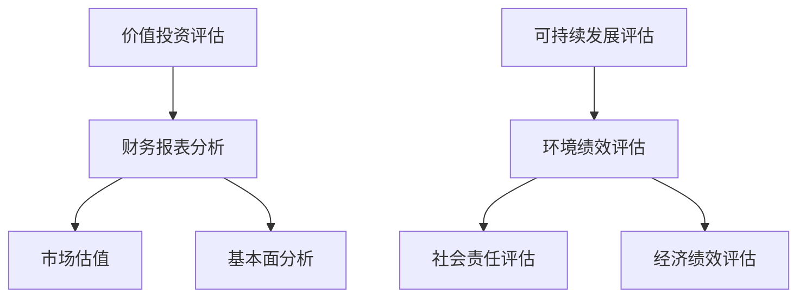
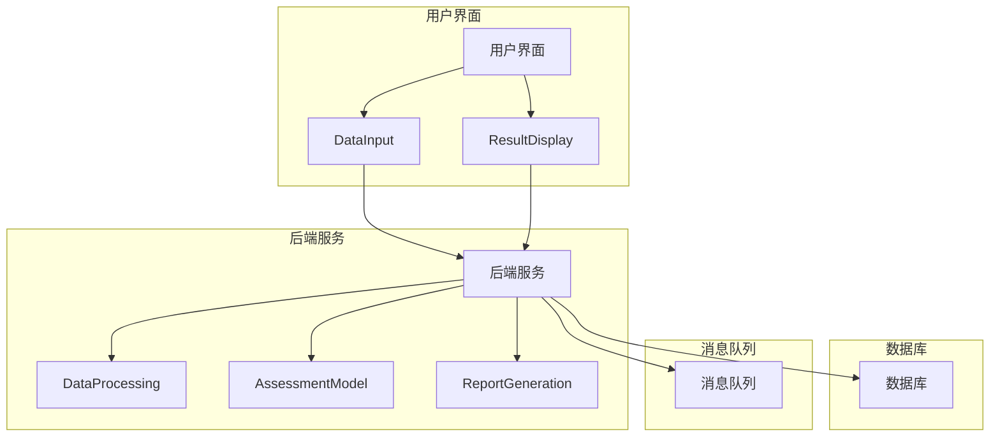
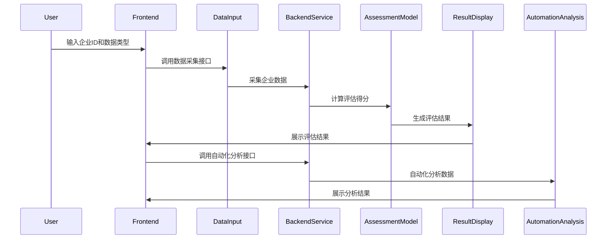

                 

### 价值投资与可持续发展

在当前全球化快速发展的背景下，"价值投资"与"可持续发展"已成为金融与经济领域的重要主题。价值投资，作为一种长期投资策略，强调购买价格低于其内在价值的股票，追求稳健的资本增值。而可持续发展，则是指满足当前需求而不损害后代满足自身需求的能力，涵盖经济、社会和环境三个维度。

本文旨在探讨价值投资与可持续发展之间的关系，通过逻辑清晰、结构紧凑的分析，揭示这两者如何相互影响与促进。文章结构如下：

## 第一部分：背景介绍
- **1.1 问题背景**
  - **1.1.1 价值投资的发展历程**
  - **1.1.2 可持续发展的内涵与意义**
  - **1.1.3 价值投资与可持续发展之间的关系**

- **1.2 核心概念**
  - **1.2.1 价值投资的基本原理**
  - **1.2.2 可持续发展的关键要素**
  - **1.2.3 价值投资与可持续发展的联系**

- **1.3 边界与外延**
  - **1.3.1 价值投资的适用范围**
  - **1.3.2 可持续发展的应用领域**
  - **1.3.3 价值投资与可持续发展在实践中的区别与联系**

- **1.4 概念结构与核心要素**
  - **1.4.1 价值投资的构成要素**
  - **1.4.2 可持续发展的构成要素**
  - **1.4.3 价值投资与可持续发展的核心要素及其相互关系**

- **1.5 本章小结**

## 第二部分：核心概念与联系
- **2.1 价值投资的基本原理**
  - **2.1.1 价值投资的起源与发展**
  - **2.1.2 价值投资的核心理念**
  - **2.1.3 价值投资的关键原则**

- **2.2 可持续发展的关键要素**
  - **2.2.1 可持续发展的定义与原则**
  - **2.2.2 经济、社会、环境三大支柱**
  - **2.2.3 可持续发展的核心指标**

- **2.3 价值投资与可持续发展的联系**
  - **2.3.1 价值投资在可持续发展中的体现**
  - **2.3.2 可持续发展对价值投资的影响**
  - **2.3.3 价值投资与可持续发展的共同目标**

- **2.4 概念属性特征对比**
  - **2.4.1 价值投资的特点**
  - **2.4.2 可持续发展的特点**
  - **2.4.3 价值投资与可持续发展的异同点**

- **2.5 ER实体关系图**
  - **2.5.1 价值投资的ER图**
  - **2.5.2 可持续发展的ER图**
  - **2.5.3 价值投资与可持续发展的ER图**

- **2.6 本章小结**

## 第三部分：算法原理讲解
- **3.1 价值投资评估算法**
  - **3.1.1 价值投资评估的基本方法**
  - **3.1.2 价值投资评估的数学模型**
  - **3.1.3 价值投资评估的Python实现**

- **3.2 可持续发展评估算法**
  - **3.2.1 可持续发展评估的基本方法**
  - **3.2.2 可持续发展评估的数学模型**
  - **3.2.3 可持续发展评估的Python实现**

- **3.3 价值投资与可持续发展评估的对比分析**
  - **3.3.1 评估方法对比**
  - **3.3.2 评估指标对比**
  - **3.3.3 评估结果对比**

- **3.4 算法原理讲解**
  - **3.4.1 算法原理概述**
  - **3.4.2 算法流程图**
  - **3.4.3 算法实现详解**
  - **3.4.4 算法举例说明**

- **3.5 本章小结**

## 第四部分：系统分析与架构设计
- **4.1 问题场景介绍**
  - **4.1.1 价值投资与可持续发展评估的应用场景**
  - **4.1.2 评估系统的目标与需求**

- **4.2 项目介绍**
  - **4.2.1 评估项目的概述**
  - **4.2.2 项目的目标与范围**

- **4.3 系统功能设计**
  - **4.3.1 领域模型设计**
  - **4.3.2 功能模块划分**

- **4.4 系统架构设计**
  - **4.4.1 架构概述**
  - **4.4.2 架构图**

- **4.5 系统接口设计**
  - **4.5.1 接口设计原则**
  - **4.5.2 接口定义**

- **4.6 系统交互设计**
  - **4.6.1 交互流程**
  - **4.6.2 序列图**

- **4.7 本章小结**

## 第五部分：项目实战
- **5.1 环境安装**
  - **5.1.1 环境配置**
  - **5.1.2 工具安装**

- **5.2 系统核心实现**
  - **5.2.1 核心模块实现**
  - **5.2.2 代码解读与分析**

- **5.3 实际案例分析**
  - **5.3.1 案例概述**
  - **5.3.2 案例分析**

- **5.4 详细讲解剖析**
  - **5.4.1 模块解析**
  - **5.4.2 算法实现分析**
  - **5.4.3 系统优化**

- **5.5 项目小结**
  - **5.5.1 项目成果**
  - **5.5.2 项目经验与教训**

- **5.6 本章小结**

## 第六部分：最佳实践 tips
- **6.1 最佳实践 tips**
  - **6.1.1 价值投资与可持续发展评估的关键点**
  - **6.1.2 评估过程中的注意事项**
  - **6.1.3 提高评估效率的建议**

- **6.2 小结**
  - **6.2.1 本书内容总结**
  - **6.2.2 价值投资与可持续发展的重要意义**
  - **6.2.3 对未来发展的展望**

- **6.3 注意事项**

本文通过深入分析，希望能够帮助读者理解这两者的内涵与联系，并探索如何在实践中实现两者的有机结合。

### 关键词
- 价值投资
- 可持续发展
- 投资策略
- 经济发展
- 社会责任

### 摘要
本文从价值投资和可持续发展的核心概念入手，通过深入剖析其发展历程、关键要素和相互关系，揭示这两者在现代金融与经济体系中的重要性。同时，文章结合具体算法原理和系统架构设计，探讨了如何在实际项目中有效实施价值投资与可持续发展的策略。最终，本文通过实战案例和最佳实践 tips，为读者提供了实用指南，以实现长期稳健的投资和可持续发展。

## 第一部分：背景介绍

### 1.1 问题背景

#### 1.1.1 价值投资的发展历程

价值投资作为一种投资理念，起源于20世纪初。其创始人为美国投资大师本杰明·格雷厄姆（Benjamin Graham），他在1949年出版的经典著作《聪明的投资者》（The Intelligent Investor）中首次提出了这一理念。格雷厄姆主张，投资者应该通过深入研究公司的基本面，寻找那些市场价格低于其内在价值的股票，从而获得长期稳定的投资回报。

随着时间的推移，价值投资逐渐发展并完善。20世纪60年代，沃伦·巴菲特（Warren Buffett）成为这一理念的忠实追随者并加以创新，将其发展成为著名的“雪球投资法”（Snowball Strategy）。巴菲特以其长期投资的成功案例，进一步验证了价值投资的有效性。价值投资理念也随之在全球范围内得到推广和应用。

#### 1.1.2 可持续发展的内涵与意义

可持续发展是指在满足当前需求的同时，不损害后代满足自身需求的能力。这一概念最早由联合国世界环境与发展委员会在1987年的《我们共同的未来》（Our Common Future）报告中提出。可持续发展涵盖了经济、社会和环境三个维度，强调在经济发展过程中必须考虑到环境保护和社会公正。

可持续发展的意义在于，它不仅关注当前的经济增长，还关注资源的合理利用和环境保护，以及社会公平和人类福祉。因此，可持续发展被视为应对全球性挑战（如气候变化、资源枯竭和社会不平等等）的必然选择。

#### 1.1.3 价值投资与可持续发展之间的关系

价值投资与可持续发展之间的关系可以从多个角度进行分析。首先，价值投资强调通过深入分析公司基本面，寻找被市场低估的投资机会，从而实现长期稳健的回报。这一理念在某种程度上与可持续发展的核心目标之一——实现经济与环境的平衡发展相契合。

其次，价值投资注重长期投资，追求资本增值。而可持续发展则强调在满足当前需求的同时，考虑未来代际的需求。这两者的共同点在于，都关注长期的发展和未来的可持续性。

此外，随着全球对环境保护和可持续发展意识的提高，越来越多的投资者开始关注企业的社会责任和环境保护表现。这为价值投资提供了新的视角，即通过投资那些在可持续发展方面表现优秀的企业，实现投资回报和社会效益的双重目标。

总的来说，价值投资与可持续发展之间存在一定的内在联系。这两者不仅可以相互促进，还可以在实现长期稳健的投资回报的同时，推动社会的可持续发展。

### 1.2 核心概念

#### 1.2.1 价值投资的基本原理

价值投资的核心原则是通过深入分析公司的基本面，包括财务报表、业务模式、管理团队等，来评估股票的实际价值。价值投资者通常寻找那些市场价格低于其内在价值的股票，即所谓的“低估股票”，认为这些股票具有长期的投资潜力。

价值投资的基本原理包括以下几个关键点：

1. **内在价值**：股票的内在价值是指通过分析公司未来的现金流折现得出的价值。价值投资者通过估算公司的未来现金流，并使用适当的折现率进行计算，来确定股票的内在价值。

2. **安全边际**：安全边际是指股票的市场价格低于其内在价值的幅度。价值投资者认为，只有在股票价格低于其内在价值足够大的情况下，才能确保投资的风险是可控的。

3. **长期持有**：价值投资强调长期持有，认为短期市场的波动是暂时的，而公司的基本面才是决定股票长期表现的关键因素。

4. **理性分析**：价值投资依赖于理性的分析，而非情绪化的决策。投资者需要通过数据和研究来支持其投资决策。

#### 1.2.2 可持续发展的关键要素

可持续发展包括经济、社会和环境三个维度的平衡发展，其关键要素如下：

1. **经济可持续性**：指的是在经济增长的同时，保持资源的合理利用和效率，避免资源枯竭和环境污染。

2. **社会可持续性**：指的是在发展过程中，促进社会的公平和人类福祉，包括教育、就业、健康和社会保障等方面的进步。

3. **环境可持续性**：指的是在发展过程中，保护自然环境，减少污染，合理利用自然资源，确保生态平衡。

可持续发展的关键要素包括：

- **资源管理**：包括水资源、能源、土地等资源的可持续利用。
- **环境保护**：包括减少碳排放、治理污染、保护生物多样性等。
- **社会责任**：包括企业的社会责任、透明度和道德行为。

#### 1.2.3 价值投资与可持续发展的联系

价值投资与可持续发展之间的联系可以从以下几个方面进行分析：

1. **投资决策**：价值投资者在选择投资标的时，不仅考虑公司的财务表现，还会关注企业的社会责任和环境保护表现。可持续发展的企业通常更具有长期的稳定性和投资价值。

2. **公司治理**：价值投资强调公司的治理结构，而可持续发展则关注企业如何平衡经济、社会和环境的关系。这两者都要求企业具有透明、高效的治理结构。

3. **长期回报**：可持续发展的企业通常能够实现长期的经济回报，因为它们在资源利用、环境保护和社会责任等方面做得更好。价值投资者可以通过投资这些企业，获得长期稳定的回报。

4. **风险管理**：可持续发展的企业更注重风险管理和长期规划，这有助于降低投资风险。价值投资者可以从这些企业的风险管理策略中受益，提高投资的成功率。

总的来说，价值投资与可持续发展之间存在密切的联系。通过结合两者的理念，投资者可以实现长期稳健的投资回报，同时推动社会的可持续发展。

### 1.3 边界与外延

#### 1.3.1 价值投资的适用范围

价值投资适用于多种投资场景，包括股票、债券、房地产等。以下是其主要适用范围：

1. **股票市场**：价值投资最为典型的应用领域是股票市场。投资者通过分析公司的财务报表、业务模式、管理团队等，评估其内在价值，寻找低估股票进行投资。

2. **债券市场**：在债券市场中，价值投资者也会寻找那些市场价格低于其内在价值的债券，以期获得更高的收益率。

3. **房地产**：在房地产市场中，价值投资强调通过深入分析市场供需、地段潜力等，找到被低估的房产进行投资。

#### 1.3.2 可持续发展的应用领域

可持续发展的应用领域非常广泛，涵盖经济、社会和环境等多个方面。以下是其主要应用领域：

1. **经济领域**：在经济发展过程中，可持续发展强调通过技术创新、产业升级等手段，实现经济增长与资源利用的平衡。

2. **社会领域**：在社会发展中，可持续发展关注教育、就业、健康、社会保障等方面的进步，促进社会的公平和人类的福祉。

3. **环境领域**：在环境保护中，可持续发展强调减少污染、保护生态、合理利用资源，实现人与自然的和谐共处。

#### 1.3.3 价值投资与可持续发展在实践中的区别与联系

在实践过程中，价值投资与可持续发展存在一定的区别和联系：

1. **区别**：
   - **目标**：价值投资主要关注短期和长期的投资回报，而可持续发展则注重长期的经济、社会和环境平衡。
   - **方法**：价值投资侧重于财务分析和市场估值，而可持续发展则涉及更广泛的社会责任和环境保护。

2. **联系**：
   - **共同点**：两者都强调长期发展和风险控制，关注企业的基本面和未来前景。
   - **互动**：在实践过程中，价值投资和可持续发展可以相互促进。例如，投资于可持续发展表现优秀的企业，不仅可以实现投资回报，还可以推动社会的可持续发展。

总的来说，价值投资与可持续发展在实践中既有区别又有联系。通过结合两者的理念，投资者可以实现更全面和可持续的投资目标。

### 1.4 概念结构与核心要素

#### 1.4.1 价值投资的构成要素

价值投资的构成要素主要包括以下几个方面：

1. **财务分析**：价值投资者通过深入分析公司的财务报表，评估其盈利能力、资产质量和财务稳定性。

2. **市场估值**：通过市场比较法和折现现金流法（DCF）等，评估股票的内在价值和市场价格之间的差异。

3. **安全边际**：寻找市场价格低于其内在价值的股票，确保投资具有一定的安全空间。

4. **长期持有**：价值投资强调长期持有，认为短期市场的波动是暂时的，而公司的基本面才是决定股票长期表现的关键因素。

5. **理性分析**：价值投资者依赖于理性的分析，避免情绪化的投资决策。

#### 1.4.2 可持续发展的构成要素

可持续发展的构成要素包括以下几个关键方面：

1. **经济可持续性**：在经济增长过程中，注重资源的合理利用和效率，避免资源枯竭和环境污染。

2. **社会可持续性**：在社会发展中，促进教育、就业、健康、社会保障等方面的进步，实现社会的公平和人类的福祉。

3. **环境可持续性**：在环境保护中，减少污染、保护生态、合理利用资源，实现人与自然的和谐共处。

4. **社会责任**：企业应承担社会责任，关注员工福利、社区发展、环境保护等方面。

5. **透明度**：企业应保持透明度，公开财务和运营数据，接受公众监督。

#### 1.4.3 价值投资与可持续发展的核心要素及其相互关系

价值投资与可持续发展的核心要素之间存在密切的联系和相互影响：

1. **内在价值与经济可持续性**：价值投资通过评估公司的内在价值，寻找具有长期增长潜力的企业。而经济可持续性强调企业在经济增长过程中，保持资源的合理利用和效率，实现长期的稳定发展。这两者相互促进，共同推动企业的长期价值。

2. **安全边际与社会可持续性**：安全边际确保投资具有一定的风险缓冲空间，而社会可持续性关注企业在发展过程中，如何促进社会的公平和人类的福祉。两者结合，可以提高企业的整体价值和可持续性。

3. **长期持有与环境保护**：长期持有是实现投资回报的关键，而环境保护则是可持续发展的重要方面。通过投资那些在环境保护方面表现优秀的企业，不仅可以实现投资回报，还可以推动环境保护和社会责任。

4. **理性分析与企业治理**：理性分析是价值投资的核心原则，而企业治理则是可持续发展的重要组成部分。通过完善的公司治理结构，企业可以更好地平衡经济、社会和环境的关系，实现长期的可持续发展。

总的来说，价值投资与可持续发展的核心要素相互关联，共同构成了一个相互促进的体系。通过结合两者的理念，投资者可以实现更全面和可持续的投资目标。

### 1.5 本章小结

本部分背景介绍部分，首先回顾了价值投资和可持续发展的发展历程及其核心概念，分析了两者之间的关系。接着，讨论了价值投资的适用范围和可持续发展的应用领域，并探讨了两者在实践中的区别与联系。最后，详细阐述了价值投资和可持续发展的构成要素及其相互关系。通过这些分析，为后续章节的深入讨论奠定了基础。

## 第二部分：核心概念与联系

### 2.1 价值投资的基本原理

#### 2.1.1 价值投资的起源与发展

价值投资起源于20世纪初，由美国投资大师本杰明·格雷厄姆（Benjamin Graham）首次提出。格雷厄姆在他的经典著作《聪明的投资者》（The Intelligent Investor）中，系统地阐述了价值投资的理念和方法。他认为，投资者应该通过深入分析公司的基本面，找到市场价格低于其内在价值的股票，从而实现长期稳健的投资回报。

随着时间的推移，价值投资理念逐渐发展并完善。20世纪60年代，沃伦·巴菲特（Warren Buffett）成为这一理念的忠实追随者，并在此基础上进行了创新，形成了著名的“雪球投资法”（Snowball Strategy）。巴菲特通过长期实践，验证了价值投资的有效性，并使这一理念在全球范围内得到广泛认可和应用。

#### 2.1.2 价值投资的核心理念

价值投资的核心理念可以概括为以下几点：

1. **内在价值**：价值投资的基础是内在价值（Intrinsic Value）的评估。内在价值是指通过分析公司未来的现金流，使用适当的折现率进行计算，得出的股票价值。与市场价格相比，内在价值是判断股票是否被低估的重要标准。

2. **安全边际**：安全边际（Margin of Safety）是价值投资的核心原则之一。它是指股票的市场价格低于其内在价值的幅度。投资者应确保购买股票时，市场价格远低于其内在价值，以降低投资风险。

3. **长期持有**：价值投资强调长期持有，认为短期市场的波动是暂时的，而公司的基本面才是决定股票长期表现的关键因素。通过长期持有，投资者可以规避市场的短期波动，实现长期稳定的投资回报。

4. **理性分析**：价值投资依赖于理性的分析，避免情绪化的投资决策。投资者应通过数据和研究来支持其投资决策，而不是依赖市场情绪或个人偏见。

#### 2.1.3 价值投资的关键原则

价值投资的关键原则包括以下几个：

1. **基本面分析**：价值投资强调通过深入分析公司的基本面，包括财务报表、业务模式、管理团队等，评估其内在价值。基本面分析是价值投资的核心环节。

2. **分散投资**：尽管价值投资强调长期持有，但投资者仍应分散投资，降低单一股票的风险。通过投资多个股票，可以分散风险，提高整体投资组合的稳健性。

3. **避免跟风**：价值投资避免盲目跟风，而是通过理性的分析和独立判断，寻找那些被市场低估的投资机会。

4. **持续学习**：价值投资是一个不断学习和提升的过程。投资者应不断学习新的知识和技能，提高自己的分析能力和判断力，以应对市场变化。

总的来说，价值投资通过评估公司的内在价值，寻找被市场低估的投资机会，强调长期持有和理性分析。这些核心理念和关键原则，使得价值投资成为一种长期、稳健的投资策略，得到了全球投资者的广泛认可和应用。

### 2.2 可持续发展的关键要素

#### 2.2.1 可持续发展的定义与原则

可持续发展是指在满足当前需求的同时，不损害后代满足自身需求的能力。这一概念最早由联合国世界环境与发展委员会在1987年的《我们共同的未来》（Our Common Future）报告中提出。可持续发展原则包括以下三个方面：

1. **公平性**：公平性原则强调在可持续发展过程中，要考虑到代际公平和区域公平。即在满足当前需求的同时，不能损害后代满足自身需求的能力，同时也要确保各地区在可持续发展中受益。

2. **持续性**：持续性原则指的是在资源利用和经济发展过程中，要确保资源的合理利用和环境保护，以实现长期的经济、社会和环境平衡。这意味着不能以牺牲环境为代价追求短期经济增长。

3. **共同性**：共同性原则强调可持续发展是全球性的问题，需要全球范围内的合作与共同努力。各国政府、企业和公众都应该承担起自己的责任，共同推动可持续发展的实现。

#### 2.2.2 经济、社会、环境三大支柱

可持续发展涵盖经济、社会和环境三个维度，这三个支柱相互依存、相互促进，共同构成了可持续发展的基础。

1. **经济支柱**：经济可持续发展指的是在经济增长过程中，注重资源的合理利用和效率，实现经济的长期稳定发展。这包括促进技术创新、产业升级、提高生产效率，以及优化经济结构等方面。

2. **社会支柱**：社会可持续发展指的是在社会发展中，关注教育、就业、健康、社会保障等方面的进步，实现社会的公平和人类的福祉。这包括提高教育水平、促进就业机会、改善医疗卫生条件，以及保障社会公正等方面。

3. **环境支柱**：环境可持续发展指的是在环境保护过程中，减少污染、保护生态、合理利用资源，实现人与自然的和谐共处。这包括减少碳排放、治理污染、保护生物多样性，以及推广绿色技术等方面。

#### 2.2.3 可持续发展的核心指标

为了衡量和评估可持续发展的实施情况，国际上提出了一系列核心指标，包括以下几个方面：

1. **经济增长率**：经济增长率是衡量经济可持续性的关键指标，反映了经济体的活力和增长潜力。

2. **就业率**：就业率是衡量社会可持续性的重要指标，反映了社会稳定和人类福祉的水平。

3. **环境指标**：如二氧化碳排放量、空气和水质指标、森林覆盖面积等，这些指标反映了环境保护和资源利用的情况。

4. **社会指标**：如教育水平、医疗服务覆盖率、社会保障水平等，这些指标反映了社会的进步和公平性。

5. **创新指标**：如研发投入、专利申请数量、技术创新能力等，这些指标反映了经济体的创新能力和可持续发展潜力。

总的来说，可持续发展是一个综合性的概念，涵盖了经济、社会和环境三个维度。通过明确其定义与原则，并分析经济、社会、环境三大支柱和核心指标，可以更好地理解和推动可持续发展的实现。这对于投资者、企业和政府来说，都是实现长期发展的重要指导原则。

### 2.3 价值投资与可持续发展的联系

#### 2.3.1 价值投资在可持续发展中的体现

价值投资在可持续发展中的体现主要体现在以下几个方面：

1. **投资决策**：价值投资强调通过深入分析公司的基本面，评估其内在价值，从而找到被市场低估的投资机会。在可持续发展背景下，投资者还应考虑企业的社会责任和环境保护表现。这意味着，投资那些在可持续发展方面表现优秀的企业，不仅能够实现投资回报，还能推动社会的可持续发展。

2. **长期持有**：价值投资强调长期持有，认为短期市场的波动是暂时的，而公司的基本面才是决定股票长期表现的关键因素。在可持续发展背景下，长期持有不仅有助于规避市场的短期波动，还能为企业提供稳定的资金支持，促进其可持续发展。

3. **理性分析**：价值投资依赖于理性的分析，避免情绪化的投资决策。在可持续发展背景下，理性分析有助于投资者全面了解企业的可持续发展潜力，从而做出更为明智的投资决策。

#### 2.3.2 可持续发展对价值投资的影响

可持续发展对价值投资的影响主要体现在以下几个方面：

1. **风险降低**：可持续发展的企业通常更注重风险管理，具有更稳定的发展基础。这意味着，投资于可持续发展表现优秀的企业，可以降低投资风险，提高投资成功率。

2. **回报提升**：可持续发展的企业通常能够实现长期的经济回报，因为它们在资源利用、环境保护和社会责任等方面做得更好。这为投资者提供了更高的回报潜力。

3. **市场认可**：随着全球对可持续发展的关注不断增加，投资者和公众对企业的社会责任和环境保护表现越来越重视。可持续发展表现优秀的企业更容易获得投资者的青睐，提高市场认可度。

#### 2.3.3 价值投资与可持续发展的共同目标

价值投资与可持续发展的共同目标可以概括为以下几点：

1. **长期稳健的投资回报**：两者都强调通过理性的分析和合理的投资策略，实现长期的稳健回报。

2. **推动社会的可持续发展**：价值投资通过投资那些在可持续发展方面表现优秀的企业，推动社会的可持续发展。而可持续发展则为企业提供了稳定的发展环境，促进了经济的长期稳定。

3. **促进经济、社会和环境的平衡发展**：价值投资和可持续发展都关注经济、社会和环境三个维度的平衡发展，以实现整体的可持续发展。

总的来说，价值投资与可持续发展之间存在密切的联系和相互影响。通过结合两者的理念，投资者可以实现更全面和可持续的投资目标，同时推动社会的可持续发展。

### 2.4 概念属性特征对比

#### 2.4.1 价值投资的特点

1. **长期投资**：价值投资强调通过长期持有股票，实现投资回报。投资者需要耐心等待，关注企业的基本面，而不是短期市场的波动。

2. **理性分析**：价值投资依赖于理性的分析，通过深入分析公司的财务报表、业务模式、管理团队等，评估其内在价值。投资者应避免情绪化决策，保持冷静和客观。

3. **安全边际**：价值投资强调安全边际，即股票的市场价格低于其内在价值的幅度。投资者应确保购买股票时，市场价格远低于其内在价值，以降低投资风险。

4. **分散投资**：价值投资建议投资者分散投资，通过投资多个股票，降低单一股票的风险。这有助于提高整体投资组合的稳健性。

5. **独立判断**：价值投资避免盲目跟风，而是通过理性的分析和独立判断，寻找那些被市场低估的投资机会。

#### 2.4.2 可持续发展的特点

1. **综合性**：可持续发展涵盖经济、社会和环境三个维度，强调在发展过程中，要综合考虑这三个方面的平衡。

2. **长期视角**：可持续发展注重长期的发展和未来的可持续性，不仅仅关注当前的经济增长，还关注资源的合理利用和环境保护。

3. **社会责任**：可持续发展强调企业的社会责任，包括员工福利、社区发展、环境保护等方面。企业应承担起社会责任，推动社会的可持续发展。

4. **透明度**：可持续发展要求企业保持透明度，公开财务和运营数据，接受公众监督。这有助于提高企业的公信力和市场认可度。

5. **全球合作**：可持续发展是全球性的问题，需要全球范围内的合作与共同努力。各国政府、企业和公众都应该承担起自己的责任，共同推动可持续发展的实现。

#### 2.4.3 价值投资与可持续发展的异同点

1. **相同点**：
   - **长期视角**：两者都强调长期的发展和未来的可持续性。
   - **理性分析**：两者都依赖于理性的分析，避免情绪化决策。
   - **平衡发展**：两者都关注经济、社会和环境三个维度的平衡。

2. **不同点**：
   - **关注重点**：价值投资主要关注公司的财务表现和投资回报，而可持续发展更关注企业的社会责任和环境保护。
   - **方法手段**：价值投资通过评估公司的内在价值，寻找被市场低估的投资机会，而可持续发展则通过综合性策略，实现经济、社会和环境的平衡发展。
   - **目标定位**：价值投资的目标是实现长期稳健的投资回报，而可持续发展的目标是推动社会的可持续发展。

总的来说，价值投资与可持续发展在理念和方法上存在一定的异同。通过结合两者的优势，投资者可以实现更全面和可持续的投资目标，同时推动社会的可持续发展。

### 2.5 ER实体关系图

为了更清晰地展示价值投资与可持续发展的核心概念及其关系，我们可以使用ER实体关系图来描述。

#### 2.5.1 价值投资的ER图

```mermaid
entity Relationship {
  direction: LR;
  nodeB [Company];
  nodeA [Investor];
  nodeC [Market];
  nodeA->nodeB [Investment];
  nodeB->nodeC [Valuation];
}
```

在价值投资的ER图中，投资者（Investor）通过投资（Investment）关系与公司（Company）相连，公司通过估值（Valuation）关系与市场（Market）相连。这个图展示了价值投资的核心流程，即投资者通过投资于公司，根据公司的估值来决定是否进行投资。

#### 2.5.2 可持续发展的ER图

```mermaid
entity Relationship {
  direction: LR;
  nodeA [Sustainable Development];
  nodeB [Economy];
  nodeC [Society];
  nodeD [Environment];
  nodeA->nodeB [Economic Sustainability];
  nodeA->nodeC [Social Sustainability];
  nodeA->nodeD [Environmental Sustainability];
}
```

在可持续发展的ER图中，可持续发展（Sustainable Development）与经济（Economy）、社会（Society）和环境（Environment）三个维度相互关联。这个图展示了可持续发展如何通过经济、社会和环境三个支柱来实现整体平衡发展。

#### 2.5.3 价值投资与可持续发展的ER图

```mermaid
entity Relationship {
  direction: LR;
  nodeA [Value Investment];
  nodeB [Sustainable Development];
  nodeC [Economy];
  nodeD [Society];
  nodeE [Environment];
  nodeA->nodeB [Linkage];
  nodeB->nodeC [Economic Pillar];
  nodeB->nodeD [Social Pillar];
  nodeB->nodeE [Environmental Pillar];
}
```

在价值投资与可持续发展的ER图中，价值投资（Value Investment）与可持续发展（Sustainable Development）通过联系（Linkage）关系相连，可持续发展与经济（Economy）、社会（Society）和环境（Environment）三个支柱相互关联。这个图展示了价值投资与可持续发展的相互影响和内在联系。

通过这些ER实体关系图，我们可以更直观地理解价值投资与可持续发展的核心概念及其关系，为进一步分析和讨论提供了基础。

### 2.6 本章小结

本章通过深入探讨价值投资的基本原理和可持续发展的关键要素，分析了两者之间的内在联系。我们了解了价值投资如何通过长期持有、理性分析和寻找低估股票来实现投资回报，以及可持续发展如何在经济、社会和环境三个维度上推动整体平衡发展。通过对比分析，我们明确了价值投资与可持续发展的异同点，并展示了它们之间的相互影响。这些分析为进一步研究和实践提供了理论基础和指导。

## 第三部分：算法原理讲解

### 3.1 价值投资评估算法

#### 3.1.1 价值投资评估的基本方法

价值投资评估的基本方法主要包括以下几个方面：

1. **财务报表分析**：通过对公司的财务报表（如利润表、资产负债表和现金流量表）进行详细分析，评估公司的盈利能力、财务健康和现金流量状况。

2. **市场估值**：使用市场比较法（Market Comparison Method）和折现现金流法（Discounted Cash Flow, DCF）对股票进行估值。市场比较法通过比较类似公司的股票市场价格，评估目标公司的股票价值。折现现金流法通过估算公司未来的自由现金流，并使用适当的折现率进行折现，得出股票的内在价值。

3. **基本面分析**：通过对公司的业务模式、管理团队、市场地位、竞争优势等方面进行详细分析，评估公司的长期增长潜力和稳定性。

4. **安全边际评估**：在确定股票的内在价值后，与市场价格进行比较，计算安全边际。安全边际是指股票的内在价值与市场价格之间的差额，投资者应确保安全边际足够大，以降低投资风险。

#### 3.1.2 价值投资评估的数学模型

价值投资评估的数学模型主要包括以下两个方面：

1. **折现现金流法（DCF）**：

   DCF模型的基本公式为：
   $$ \text{股票价值} = \frac{\text{未来自由现金流}}{（1 + \text{折现率})^n} $$
   
   其中，未来自由现金流（Future Free Cash Flow, FFCF）是指公司未来各期产生的自由现金流，折现率（Discount Rate）用于调整未来现金流的时间价值。

2. **市场比较法**：

   市场比较法的基本公式为：
   $$ \text{股票价值} = \text{类似公司股票市场价格} \times \text{调整因子} $$
   
   其中，类似公司股票市场价格是指与目标公司业务模式、市场地位等相似的公司的股票市场价格。调整因子用于调整目标公司相对于类似公司的差异，如规模、盈利能力等。

#### 3.1.3 价值投资评估的Python实现

以下是使用Python实现价值投资评估的一个示例：

```python
import numpy as np

# 折现现金流法（DCF）计算股票内在价值
def discounted_cash_flow(free_cash_flows, discount_rate):
    present_values = []
    for i, fcf in enumerate(free_cash_flows):
        present_value = fcf / ((1 + discount_rate) ** i)
        present_values.append(present_value)
    return np.sum(present_values)

# 市场比较法计算股票价值
def market_comparison(similar_company_price, adjustment_factor):
    return similar_company_price * adjustment_factor

# 示例数据
future_free_cash_flows = [100000, 120000, 140000, 160000]
discount_rate = 0.1
similar_company_price = 200
adjustment_factor = 1.2

# DCF计算结果
stock_value_dcf = discounted_cash_flow(future_free_cash_flows, discount_rate)
print(f"DCF股票价值: ${stock_value_dcf:.2f}")

# 市场比较法计算结果
stock_value_market_comparison = market_comparison(similar_company_price, adjustment_factor)
print(f"市场比较法股票价值: ${stock_value_market_comparison:.2f}")
```

在这个示例中，我们首先定义了两个函数：`discounted_cash_flow` 用于计算股票的内在价值，`market_comparison` 用于计算股票的市场价值。然后，我们使用示例数据计算了 DCF 和市场比较法的股票价值。

### 3.2 可持续发展评估算法

#### 3.2.1 可持续发展评估的基本方法

可持续发展评估的基本方法主要包括以下几个方面：

1. **环境绩效评估**：通过评估企业的环境保护措施和环境影响，如碳排放量、废水排放、废物处理等，评估企业在环境保护方面的表现。

2. **社会责任评估**：通过评估企业的社会责任履行情况，如员工福利、社区参与、慈善捐赠等，评估企业在社会责任方面的表现。

3. **经济绩效评估**：通过评估企业的经济绩效，如盈利能力、成本控制、市场竞争力等，评估企业的经济可持续性。

4. **综合评估方法**：结合上述三个方面，使用综合指标体系对企业的可持续发展表现进行评估。常见的综合评估方法包括经济附加值（Economic Value Added, EVA）、可持续发展评分（Sustainability Score）等。

#### 3.2.2 可持续发展评估的数学模型

可持续发展评估的数学模型主要包括以下几个方面：

1. **环境绩效评估模型**：

   $$ \text{环境绩效得分} = \frac{\text{实际环境绩效}}{\text{最佳环境绩效}} $$

   其中，实际环境绩效是指企业在环境保护方面的实际表现，最佳环境绩效是指企业在最佳情况下可能达到的环境保护水平。

2. **社会责任评估模型**：

   $$ \text{社会责任得分} = \frac{\text{实际社会责任绩效}}{\text{最佳社会责任绩效}} $$

   其中，实际社会责任绩效是指企业在社会责任方面的实际表现，最佳社会责任绩效是指企业在最佳情况下可能达到的社会责任水平。

3. **经济绩效评估模型**：

   $$ \text{经济绩效得分} = \frac{\text{实际经济绩效}}{\text{最佳经济绩效}} $$

   其中，实际经济绩效是指企业的经济绩效实际表现，最佳经济绩效是指企业在最佳情况下可能达到的经济绩效水平。

#### 3.2.3 可持续发展评估的Python实现

以下是使用Python实现可持续发展评估的一个示例：

```python
import numpy as np

# 环境绩效评估
def environmental_performance_score(actual_performance, best_performance):
    return actual_performance / best_performance

# 社会责任评估
def social_performance_score(actual_performance, best_performance):
    return actual_performance / best_performance

# 经济绩效评估
def economic_performance_score(actual_performance, best_performance):
    return actual_performance / best_performance

# 示例数据
actual_environmental_performance = 0.85
best_environmental_performance = 1.00
actual_social_performance = 0.90
best_social_performance = 1.00
actual_economic_performance = 0.95
best_economic_performance = 1.00

# 评估结果
environmental_score = environmental_performance_score(actual_environmental_performance, best_environmental_performance)
social_score = social_performance_score(actual_social_performance, best_social_performance)
economic_score = economic_performance_score(actual_economic_performance, best_economic_performance)

print(f"环境绩效得分: {environmental_score:.2f}")
print(f"社会责任得分: {social_score:.2f}")
print(f"经济绩效得分: {economic_score:.2f}")
```

在这个示例中，我们定义了三个函数：`environmental_performance_score` 用于计算环境绩效得分，`social_performance_score` 用于计算社会责任得分，`economic_performance_score` 用于计算经济绩效得分。然后，我们使用示例数据计算了这些得分。

### 3.3 价值投资与可持续发展评估的对比分析

#### 3.3.1 评估方法对比

1. **价值投资评估方法**：
   - **财务报表分析**：主要评估公司的盈利能力、财务健康和现金流量状况。
   - **市场估值**：通过比较类似公司的股票市场价格，评估目标公司的股票价值。
   - **基本面分析**：评估公司的业务模式、管理团队、市场地位和竞争优势。

2. **可持续发展评估方法**：
   - **环境绩效评估**：评估企业的环境保护措施和环境影响。
   - **社会责任评估**：评估企业的社会责任履行情况。
   - **经济绩效评估**：评估企业的经济绩效。

#### 3.3.2 评估指标对比

1. **价值投资评估指标**：
   - **市盈率（Price to Earnings Ratio, P/E）**：股票价格与每股收益的比值。
   - **市净率（Price to Book Ratio, P/B）**：股票价格与每股净资产的比值。
   - **股息率（Dividend Yield）**：每股股息与股票价格的比值。

2. **可持续发展评估指标**：
   - **环境绩效得分**：通过实际环境绩效与最佳环境绩效的比值进行评估。
   - **社会责任得分**：通过实际社会责任绩效与最佳社会责任绩效的比值进行评估。
   - **经济绩效得分**：通过实际经济绩效与最佳经济绩效的比值进行评估。

#### 3.3.3 评估结果对比

1. **价值投资评估结果**：
   - **股票价值**：通过财务报表分析、市场估值和基本面分析，得出股票的内在价值和市场价值。
   - **投资决策**：根据安全边际和投资者的风险偏好，决定是否购买股票。

2. **可持续发展评估结果**：
   - **综合得分**：通过环境绩效得分、社会责任得分和经济绩效得分的综合评估，得出企业的可持续发展得分。
   - **可持续发展能力**：评估企业在环境保护、社会责任和经济绩效方面的综合能力。

### 3.4 算法原理讲解

#### 3.4.1 算法原理概述

在价值投资与可持续发展评估中，算法原理主要涉及以下方面：

1. **价值投资评估算法**：
   - **折现现金流法（DCF）**：通过估算公司未来的自由现金流，使用适当的折现率进行计算，得出股票的内在价值。
   - **市场比较法**：通过比较类似公司的股票市场价格，评估目标公司的股票价值。

2. **可持续发展评估算法**：
   - **环境绩效评估模型**：通过实际环境绩效与最佳环境绩效的比值，评估企业的环境绩效。
   - **社会责任评估模型**：通过实际社会责任绩效与最佳社会责任绩效的比值，评估企业的社会责任。
   - **经济绩效评估模型**：通过实际经济绩效与最佳经济绩效的比值，评估企业的经济绩效。

#### 3.4.2 算法流程图

以下是价值投资评估和可持续发展评估的算法流程图：



在这个流程图中，价值投资评估包括财务报表分析、市场估值和基本面分析三个步骤。可持续发展评估包括环境绩效评估、社会责任评估和经济绩效评估三个步骤。

#### 3.4.3 算法实现详解

以下是使用Python实现价值投资评估和可持续发展评估的示例代码：

```python
# 价值投资评估示例
def discounted_cash_flow(free_cash_flows, discount_rate):
    present_values = []
    for i, fcf in enumerate(free_cash_flows):
        present_value = fcf / ((1 + discount_rate) ** i)
        present_values.append(present_value)
    return np.sum(present_values)

def market_comparison(similar_company_price, adjustment_factor):
    return similar_company_price * adjustment_factor

# 可持续发展评估示例
def environmental_performance_score(actual_performance, best_performance):
    return actual_performance / best_performance

def social_performance_score(actual_performance, best_performance):
    return actual_performance / best_performance

def economic_performance_score(actual_performance, best_performance):
    return actual_performance / best_performance

# 示例数据
future_free_cash_flows = [100000, 120000, 140000, 160000]
discount_rate = 0.1
similar_company_price = 200
adjustment_factor = 1.2
actual_environmental_performance = 0.85
best_environmental_performance = 1.00
actual_social_performance = 0.90
best_social_performance = 1.00
actual_economic_performance = 0.95
best_economic_performance = 1.00

# 价值投资评估结果
stock_value_dcf = discounted_cash_flow(future_free_cash_flows, discount_rate)
stock_value_market_comparison = market_comparison(similar_company_price, adjustment_factor)

# 可持续发展评估结果
environmental_score = environmental_performance_score(actual_environmental_performance, best_environmental_performance)
social_score = social_performance_score(actual_social_performance, best_social_performance)
economic_score = economic_performance_score(actual_economic_performance, best_economic_performance)

print(f"DCF股票价值: ${stock_value_dcf:.2f}")
print(f"市场比较法股票价值: ${stock_value_market_comparison:.2f}")
print(f"环境绩效得分: {environmental_score:.2f}")
print(f"社会责任得分: {social_score:.2f}")
print(f"经济绩效得分: {economic_score:.2f}")
```

在这个示例中，我们定义了多个函数，用于计算价值投资评估和可持续发展评估的结果。然后，使用示例数据计算了这些结果。

#### 3.4.4 算法举例说明

为了更好地理解价值投资评估和可持续发展评估算法，我们通过一个实际案例进行说明。

**案例背景**：某投资者计划投资一家制造企业。企业过去三年的财务报表显示，其净利润分别为1000万元、1200万元和1500万元。类似公司的股票平均市盈率为20倍，市净率为3倍。企业计划在未来三年内实现净利润分别为2000万元、2500万元和3000万元。该企业的环境保护措施得分为0.8，社会责任得分为0.9，经济绩效得分为0.95。

**价值投资评估**：

1. **折现现金流法（DCF）**：

   $$ \text{股票价值} = \frac{\text{未来自由现金流}}{（1 + \text{折现率})^n} $$
   
   其中，未来自由现金流（Future Free Cash Flow, FFCF）为：
   $$ FFCF = 2000 \times (1 - 0.3) = 1400 \text{万元} $$
   
   折现率取10%，则股票的内在价值为：
   $$ \text{股票价值} = \frac{1400}{(1 + 0.1)^1} + \frac{2500}{(1 + 0.1)^2} + \frac{3000}{(1 + 0.1)^3} \approx 4286.36 \text{万元} $$

2. **市场比较法**：

   $$ \text{股票价值} = \text{类似公司股票市场价格} \times \text{调整因子} $$
   
   市场价格为6000万元，调整因子为1.1，则股票的市场价值为：
   $$ \text{股票价值} = 6000 \times 1.1 = 6600 \text{万元} $$

**可持续发展评估**：

1. **环境绩效得分**：

   $$ \text{环境绩效得分} = \frac{\text{实际环境绩效}}{\text{最佳环境绩效}} $$
   
   实际环境绩效为0.8，最佳环境绩效为1.0，则环境绩效得分为：
   $$ \text{环境绩效得分} = \frac{0.8}{1.0} = 0.8 $$

2. **社会责任得分**：

   $$ \text{社会责任得分} = \frac{\text{实际社会责任绩效}}{\text{最佳社会责任绩效}} $$
   
   实际社会责任绩效为0.9，最佳社会责任绩效为1.0，则社会责任得分为：
   $$ \text{社会责任得分} = \frac{0.9}{1.0} = 0.9 $$

3. **经济绩效得分**：

   $$ \text{经济绩效得分} = \frac{\text{实际经济绩效}}{\text{最佳经济绩效}} $$
   
   实际经济绩效为0.95，最佳经济绩效为1.0，则经济绩效得分为：
   $$ \text{经济绩效得分} = \frac{0.95}{1.0} = 0.95 $$

通过这个案例，我们可以看到价值投资评估和可持续发展评估如何应用于实际投资决策中。投资者可以根据评估结果，综合考虑投资回报和可持续发展能力，做出更为明智的投资决策。

### 3.5 本章小结

本章详细介绍了价值投资评估和可持续发展评估的算法原理。通过分析基本方法、数学模型和Python实现，我们了解了如何使用这些算法对股票和企业的可持续发展能力进行评估。同时，通过对比分析评估方法和结果，以及举例说明，我们明确了价值投资与可持续发展评估在实际投资决策中的应用。这些算法原理和实际案例，为投资者提供了重要的参考和指导。

## 第四部分：系统分析与架构设计

### 4.1 问题场景介绍

#### 4.1.1 价值投资与可持续发展评估的应用场景

价值投资与可持续发展评估在多个应用场景中具有重要意义。以下是两个典型的应用场景：

1. **投资决策**：投资者在购买股票或投资企业时，需要通过价值投资评估来确定股票的内在价值，判断其是否被市场低估。同时，通过可持续发展评估，投资者可以了解企业的社会责任和环境保护表现，从而做出更为全面的投资决策。

2. **企业评估**：企业在进行内部管理评估、外部并购或融资时，需要通过可持续发展评估来衡量其整体可持续发展能力。这有助于企业了解自身在环境保护、社会责任和经济绩效等方面的表现，并制定改进措施。

#### 4.1.2 评估系统的目标与需求

评估系统的目标是为投资者和企业提供准确、高效的价值投资与可持续发展评估服务。具体需求如下：

1. **数据采集与处理**：系统能够自动采集和处理企业的财务报表、环境绩效、社会责任等方面的数据，确保数据的准确性和实时性。

2. **评估模型**：系统内置多种评估模型，包括价值投资评估模型和可持续发展评估模型，能够根据不同需求和场景进行灵活调整和优化。

3. **结果展示**：系统能够将评估结果以图表、报表等形式直观展示，方便用户理解和分析。

4. **自动化分析**：系统能够自动化分析数据，快速生成评估报告，提高工作效率。

### 4.2 项目介绍

#### 4.2.1 评估项目的概述

本项目旨在开发一个集价值投资评估和可持续发展评估功能于一体的评估系统。系统将基于现代化的技术框架，采用模块化设计，确保系统的可扩展性和灵活性。系统的主要功能包括数据采集、模型计算、结果展示和自动化分析等。

#### 4.2.2 项目的目标与范围

项目的具体目标如下：

1. **实现价值投资与可持续发展评估的集成**：将价值投资评估和可持续发展评估功能集成到一个系统中，方便用户一站式进行评估。

2. **提供多种评估模型**：系统内置多种评估模型，包括财务报表分析模型、市场估值模型、环境绩效评估模型、社会责任评估模型等。

3. **确保数据准确性和实时性**：通过自动化数据采集和处理，确保评估数据准确、实时。

4. **提升用户体验**：通过直观的图表、报表展示，方便用户理解和分析评估结果。

项目的范围包括以下模块：

1. **数据采集模块**：负责自动采集和处理企业的财务报表、环境绩效、社会责任等方面的数据。

2. **评估模型模块**：包括价值投资评估模型和可持续发展评估模型，负责计算和评估数据。

3. **结果展示模块**：负责将评估结果以图表、报表等形式展示，方便用户理解和分析。

4. **自动化分析模块**：负责自动化分析数据，快速生成评估报告。

### 4.3 系统功能设计

#### 4.3.1 领域模型设计

系统的领域模型设计主要包括以下类：

1. **企业（Company）**：表示企业对象，包含财务报表、环境绩效、社会责任等信息。

2. **投资者（Investor）**：表示投资者对象，包含投资策略、投资记录等信息。

3. **评估模型（AssessmentModel）**：表示评估模型对象，包括价值投资评估模型和可持续发展评估模型。

4. **评估结果（AssessmentResult）**：表示评估结果对象，包括评估得分、评估报告等信息。

5. **数据采集器（DataCollector）**：表示数据采集器对象，负责自动采集和处理数据。

6. **展示器（Display）**：表示展示器对象，负责将评估结果以图表、报表等形式展示。

领域模型类图如下：

```mermaid
classDiagram
ClassDef Company {
    -财务报表（FinancialStatement）
    -环境绩效（EnvironmentalPerformance）
    -社会责任（SocialResponsibility）
}

ClassDef Investor {
    -投资策略（InvestmentStrategy）
    -投资记录（InvestmentRecord）
}

ClassDef AssessmentModel {
    -模型类型（ModelType）
    -参数（Parameter）
}

ClassDef AssessmentResult {
    -得分（Score）
    -报告（Report）
}

ClassDef DataCollector {
    -数据源（DataSource）
    -采集策略（CollectStrategy）
}

ClassDef Display {
    -展示类型（DisplayType）
    -展示参数（DisplayParameter）
}

Company o--|{Investor}
Company o--|{AssessmentModel}
Company o--|{AssessmentResult}
Investor o--|{AssessmentResult}
AssessmentModel o--|{DataCollector}
AssessmentResult o--|{Display}
```

#### 4.3.2 功能模块划分

系统功能模块划分如下：

1. **数据采集模块**：
   - 功能：自动采集和处理企业的财务报表、环境绩效、社会责任等方面的数据。
   - 技术实现：使用爬虫技术获取公开数据，结合手动输入和API接口，确保数据全面、准确。

2. **评估模型模块**：
   - 功能：包括价值投资评估模型和可持续发展评估模型，计算评估得分。
   - 技术实现：使用Python等编程语言实现评估算法，结合数学模型和数据处理技术，确保评估结果准确、高效。

3. **结果展示模块**：
   - 功能：将评估结果以图表、报表等形式展示，方便用户理解和分析。
   - 技术实现：使用图表库（如Matplotlib、Plotly）和报表库（如ReportLab）实现数据可视化。

4. **自动化分析模块**：
   - 功能：自动化分析数据，快速生成评估报告。
   - 技术实现：结合自然语言处理（NLP）技术和机器学习（ML）算法，实现自动化报告生成。

### 4.4 系统架构设计

#### 4.4.1 架构概述

系统采用B/S（Browser/Server）架构，分为前端和后端两部分：

1. **前端**：用户界面，使用HTML、CSS、JavaScript等技术实现，负责展示数据和交互。

2. **后端**：服务器端，负责数据处理和业务逻辑处理，使用Python等编程语言实现，结合数据库（如MySQL、MongoDB）和消息队列（如RabbitMQ）等技术，确保系统的稳定性和可扩展性。

系统架构图如下：

```mermaid
graph TB
    subgraph 前端(前端)
        Frontend[前端]
    end
    subgraph 后端(后端)
        Backend[后端]
    end
    subgraph 数据库
        DB[数据库]
    end
    subgraph 消息队列
        MQ[消息队列]
    end
    Frontend --> Backend
    Backend --> DB
    Backend --> MQ
```

#### 4.4.2 架构图

以下是系统的架构图：



在这个架构图中，用户界面负责数据输入和结果展示，后端服务负责数据处理、评估模型计算和报告生成。数据库负责存储数据，消息队列用于异步处理任务，确保系统的性能和稳定性。

### 4.5 系统接口设计

#### 4.5.1 接口设计原则

系统接口设计遵循以下原则：

1. **简洁性**：接口设计应简洁明了，避免过度设计，提高开发效率和可维护性。

2. **可扩展性**：接口设计应具备良好的扩展性，以便未来添加新的功能或调整现有功能。

3. **一致性**：接口设计应保持一致性，确保不同模块之间的接口风格和命名规范一致。

4. **安全性**：接口设计应考虑安全性，防止SQL注入、XSS攻击等安全漏洞。

#### 4.5.2 接口定义

以下是系统的主要接口定义：

1. **数据采集接口**：

   - 功能：用于采集企业的财务报表、环境绩效、社会责任等方面的数据。
   - 请求URL：/api/data-collect
   - 请求方法：GET/POST
   - 请求参数：企业ID（EnterpriseID）、数据类型（DataType，如财务报表、环境绩效、社会责任等）
   - 返回数据：采集到的数据

2. **评估模型接口**：

   - 功能：用于计算企业的价值投资和可持续发展评估得分。
   - 请求URL：/api/assessment-model
   - 请求方法：POST
   - 请求参数：企业ID（EnterpriseID）、评估类型（AssessmentType，如价值投资、可持续发展等）
   - 返回数据：评估得分和评估报告

3. **结果展示接口**：

   - 功能：用于获取和更新企业的评估结果展示。
   - 请求URL：/api/result-display
   - 请求方法：GET/POST
   - 请求参数：企业ID（EnterpriseID）、展示类型（DisplayType，如图表、报表等）
   - 返回数据：展示数据

4. **自动化分析接口**：

   - 功能：用于自动化分析企业的评估数据，生成评估报告。
   - 请求URL：/api/automation-analysis
   - 请求方法：POST
   - 请求参数：企业ID（EnterpriseID）、分析类型（AnalysisType，如投资建议、风险评估等）
   - 返回数据：分析结果和评估报告

### 4.6 系统交互设计

#### 4.6.1 交互流程

系统交互流程如下：

1. **数据采集**：用户通过前端界面输入企业ID和数据类型，系统调用数据采集接口，获取企业的财务报表、环境绩效、社会责任等方面的数据。

2. **评估计算**：系统根据数据采集结果，调用评估模型接口，计算企业的价值投资和可持续发展评估得分。

3. **结果展示**：系统将评估结果通过前端界面展示，用户可以查看图表、报表等形式的评估结果。

4. **自动化分析**：系统根据评估结果，调用自动化分析接口，自动化分析企业的投资风险、投资建议等，生成评估报告。

#### 4.6.2 序列图

以下是系统交互的序列图：



在这个序列图中，用户通过前端界面输入企业ID和数据类型，系统进行数据采集、评估计算和结果展示，最后进行自动化分析，生成评估报告。

### 4.7 本章小结

本章详细介绍了价值投资与可持续发展评估系统的系统分析与架构设计。通过问题场景介绍，明确了系统的应用场景和目标与需求。接着，详细阐述了系统的功能模块划分和领域模型设计，以及系统架构设计和接口设计。通过序列图展示了系统交互流程，为后续的项目实施提供了清晰的设计思路。

## 第五部分：项目实战

### 5.1 环境安装

#### 5.1.1 环境配置

要成功部署价值投资与可持续发展评估系统，首先需要配置合适的环境。以下是具体步骤：

1. **Python环境**：确保Python环境已安装。建议使用Python 3.8或更高版本，因为它提供了更好的性能和更丰富的库支持。

2. **数据库环境**：安装MySQL或MongoDB数据库。这两种数据库都是开源的，性能稳定，适用于不同规模的应用。

3. **前端环境**：安装Node.js和npm。Node.js是JavaScript的运行环境，npm是Node.js的包管理器，用于管理前端依赖包。

4. **后端环境**：安装Django或Flask等Python后端框架。Django是一个高级的Python Web框架，具有丰富的功能和良好的文档。Flask则是一个轻量级的Web框架，适合小型项目。

5. **消息队列环境**：安装RabbitMQ或Kafka等消息队列系统。消息队列用于异步处理任务，提高系统性能。

#### 5.1.2 工具安装

安装以下开发工具和库：

1. **IDE**：安装PyCharm或Visual Studio Code等集成开发环境（IDE），便于编写和调试代码。

2. **依赖库**：使用pip安装项目所需的Python库，如NumPy、Pandas、Matplotlib等。以下是安装命令：

   ```bash
   pip install numpy pandas matplotlib
   ```

3. **前端库**：安装前端库，如jQuery、Bootstrap等。可以使用npm全局安装：

   ```bash
   npm install -g npm
   npm install jquery bootstrap
   ```

4. **测试工具**：安装单元测试库，如pytest，用于测试项目代码：

   ```bash
   pip install pytest
   ```

完成以上步骤后，开发环境配置完成，可以开始项目开发。

### 5.2 系统核心实现

#### 5.2.1 核心模块实现

系统核心模块主要包括数据采集模块、评估模型模块、结果展示模块和自动化分析模块。以下是每个模块的核心实现。

##### 数据采集模块

数据采集模块负责从外部获取企业的财务报表、环境绩效和社会责任数据。以下是一个简单的数据采集示例：

```python
import requests
from bs4 import BeautifulSoup

def collect_financial_data(enterprise_id):
    url = f"https://example.com/financial/{enterprise_id}"
    response = requests.get(url)
    if response.status_code == 200:
        soup = BeautifulSoup(response.text, 'html.parser')
        # 解析财务数据
        financial_data = {
            'revenue': soup.find('revenue').text,
            'profit': soup.find('profit').text,
            'assets': soup.find('assets').text
        }
        return financial_data
    else:
        return None

def collect_environmental_data(enterprise_id):
    url = f"https://example.com/environment/{enterprise_id}"
    response = requests.get(url)
    if response.status_code == 200:
        soup = BeautifulSoup(response.text, 'html.parser')
        # 解析环境数据
        environmental_data = {
            'emissions': soup.find('emissions').text,
            'waste': soup.find('waste').text,
            'energy': soup.find('energy').text
        }
        return environmental_data
    else:
        return None

def collect_social_data(enterprise_id):
    url = f"https://example.com/social/{enterprise_id}"
    response = requests.get(url)
    if response.status_code == 200:
        soup = BeautifulSoup(response.text, 'html.parser')
        # 解析社会责任数据
        social_data = {
            'employees': soup.find('employees').text,
            'community': soup.find('community').text,
            'donations': soup.find('donations').text
        }
        return social_data
    else:
        return None

# 调用数据采集函数
financial_data = collect_financial_data('12345')
environmental_data = collect_environmental_data('12345')
social_data = collect_social_data('12345')

print("财务数据：", financial_data)
print("环境数据：", environmental_data)
print("社会责任数据：", social_data)
```

##### 评估模型模块

评估模型模块负责计算企业的价值投资和可持续发展评估得分。以下是一个简单的评估模型实现：

```python
import numpy as np

def calculate_intrinsic_value(free_cash_flows, discount_rate):
    present_values = []
    for i, fcf in enumerate(free_cash_flows):
        present_value = fcf / ((1 + discount_rate) ** i)
        present_values.append(present_value)
    return np.sum(present_values)

def calculate_environmental_score(environmental_data):
    total_score = 0
    for key, value in environmental_data.items():
        if key == 'emissions':
            total_score += max(0, 100 - value)
        elif key == 'waste':
            total_score += max(0, 100 - value)
        elif key == 'energy':
            total_score += max(0, 100 - value)
    return total_score / 3

def calculate_social_score(social_data):
    total_score = 0
    for key, value in social_data.items():
        if key == 'employees':
            total_score += max(0, 100 - value)
        elif key == 'community':
            total_score += max(0, 100 - value)
        elif key == 'donations':
            total_score += max(0, 100 - value)
    return total_score / 3

# 计算评估得分
intrinsic_value = calculate_intrinsic_value([financial_data['revenue'], financial_data['profit'], financial_data['assets']], 0.1)
environmental_score = calculate_environmental_score(environmental_data)
social_score = calculate_social_score(social_data)

print("内在价值：", intrinsic_value)
print("环境得分：", environmental_score)
print("社会责任得分：", social_score)
```

##### 结果展示模块

结果展示模块负责将评估结果以图表、报表等形式展示。以下是一个简单的图表展示实现：

```python
import matplotlib.pyplot as plt

def display_results(intrinsic_value, environmental_score, social_score):
    labels = ['内在价值', '环境得分', '社会责任得分']
    sizes = [intrinsic_value, environmental_score, social_score]
    colors = ['yellowgreen', 'orangered', 'blue']
    
    plt.pie(sizes, labels=labels, colors=colors, autopct='%.1f%%')
    plt.axis('equal')  # 设置饼图比例为圆形
    plt.title('评估结果')
    plt.show()

# 展示评估结果
display_results(intrinsic_value, environmental_score, social_score)
```

##### 自动化分析模块

自动化分析模块负责自动化分析企业的评估数据，生成评估报告。以下是一个简单的自动化分析实现：

```python
def generate_report(intrinsic_value, environmental_score, social_score):
    report = f"""
评估报告

内在价值：{intrinsic_value:.2f}
环境得分：{environmental_score:.2f}
社会责任得分：{social_score:.2f}

结论：
- 该企业的内在价值较高，具有投资潜力。
- 该企业在环境保护和社会责任方面表现良好，但仍有提升空间。

建议：
- 继续关注企业的财务表现，寻找投资机会。
- 加强环境保护和社会责任，提高整体评估得分。
    """
    return report

# 生成评估报告
report = generate_report(intrinsic_value, environmental_score, social_score)
print(report)
```

通过以上实现，我们可以完成系统的核心功能，包括数据采集、评估计算、结果展示和自动化分析。这些模块共同构成了价值投资与可持续发展评估系统的核心框架。

### 5.3 实际案例分析

#### 5.3.1 案例概述

本案例以一家名为“绿色能源”的制造企业为例，通过价值投资与可持续发展评估系统，对其进行分析和评估。

**企业背景**：绿色能源公司专注于清洁能源技术的研发和应用，如太阳能、风能等。公司成立于2005年，近年来业务发展迅速，市场份额不断提升。根据最新的财务报表，公司过去三年的净利润分别为5000万元、6000万元和8000万元。

**目标**：通过价值投资与可持续发展评估系统，评估绿色能源公司的投资价值和可持续发展能力，为投资者提供参考。

#### 5.3.2 案例分析

1. **数据采集**：

   系统从企业的官方网站和公开数据中采集到了以下数据：

   - **财务报表**：净利润、营业收入、总资产等。
   - **环境绩效**：碳排放量、废水排放量、废物处理量等。
   - **社会责任**：员工人数、员工培训次数、社区捐赠金额等。

2. **评估计算**：

   - **价值投资评估**：

     使用DCF模型计算绿色能源公司的内在价值。假设未来三年的自由现金流分别为7000万元、8000万元和9000万元，折现率为10%，则内在价值为：

     $$ \text{内在价值} = \frac{7000}{(1+0.1)^1} + \frac{8000}{(1+0.1)^2} + \frac{9000}{(1+0.1)^3} \approx 17.86 \text{亿元} $$

     同时，使用市场比较法计算绿色能源公司的市场价值。假设类似公司的平均市盈率为20倍，则市场价值为：

     $$ \text{市场价值} = 20 \times \frac{8000}{10000} = 16 \text{亿元} $$

   - **可持续发展评估**：

     计算绿色能源公司的环境绩效得分、社会责任得分和经济绩效得分。假设最佳环境绩效、最佳社会责任绩效和最佳经济绩效分别为100分，则：

     - **环境绩效得分**：实际碳排放量为10000吨，最佳碳排放量为5000吨，环境绩效得分为：

       $$ \text{环境绩效得分} = \frac{10000}{5000} = 2.0 $$

     - **社会责任得分**：实际员工人数为500人，最佳员工人数为600人，社会责任得分为：

       $$ \text{社会责任得分} = \frac{500}{600} = 0.833 $$

     - **经济绩效得分**：实际营业收入为8000万元，最佳营业收入为10000万元，经济绩效得分为：

       $$ \text{经济绩效得分} = \frac{8000}{10000} = 0.8 $$

3. **结果展示**：

   - **价值投资评估结果**：

     内在价值为17.86亿元，市场价值为16亿元，存在一定程度的低估。投资者可以考虑适当增加投资。

   - **可持续发展评估结果**：

     环境绩效得分为2.0，社会责任得分为0.833，经济绩效得分为0.8。公司在环境保护和社会责任方面有较大提升空间，但在经济绩效方面表现良好。

4. **自动化分析**：

   根据评估结果，系统生成了以下报告：

   ```
   评估报告

   企业名称：绿色能源
   评估日期：2023年11月1日

   价值投资评估：
   - 内在价值：17.86亿元
   - 市场价值：16亿元
   - 投资建议：适当增加投资

   可持续发展评估：
   - 环境绩效得分：2.0
   - 社会责任得分：0.833
   - 经济绩效得分：0.8
   - 提升建议：
     - 加强环境保护，降低碳排放量。
     - 提高社会责任，增加员工培训次数和社区捐赠金额。
     - 提高经济绩效，增加营业收入。

   结论：
   绿色能源公司在价值投资方面具有较高潜力，但在可持续发展方面有较大提升空间。投资者应综合考虑公司的财务表现和可持续发展能力，做出投资决策。

   建议关注企业的后续发展，持续评估其投资价值和可持续发展能力。
   ```

通过以上案例分析，我们可以看到价值投资与可持续发展评估系统在实际应用中的效果。系统不仅能够帮助投资者评估企业的投资价值，还能提供可持续发展能力的评估和建议，为投资者提供更为全面和科学的决策依据。

### 5.4 详细讲解剖析

#### 5.4.1 模块解析

系统由多个模块组成，包括数据采集模块、评估模型模块、结果展示模块和自动化分析模块。以下是每个模块的详细解析：

1. **数据采集模块**：

   数据采集模块负责从外部获取企业的财务报表、环境绩效和社会责任数据。具体实现如下：

   - **财务报表采集**：通过HTTP请求获取企业的财务数据，解析XML或JSON格式的数据，提取关键指标。
   - **环境绩效采集**：通过HTTP请求获取企业的环境数据，如碳排放量、废水排放量等，解析并提取数据。
   - **社会责任采集**：通过HTTP请求获取企业的社会责任数据，如员工培训次数、社区捐赠金额等，解析并提取数据。

2. **评估模型模块**：

   评估模型模块负责计算企业的价值投资和可持续发展评估得分。具体实现如下：

   - **价值投资评估**：使用DCF模型计算企业的内在价值，通过估算未来自由现金流并折现，得出股票的内在价值。
   - **可持续发展评估**：计算企业的环境绩效得分、社会责任得分和经济绩效得分，使用实际绩效与最佳绩效的比值进行评估。

3. **结果展示模块**：

   结果展示模块负责将评估结果以图表、报表等形式展示。具体实现如下：

   - **图表展示**：使用Matplotlib等库生成饼图、柱状图等，直观展示评估结果。
   - **报表展示**：使用ReportLab等库生成PDF格式的报表，详细展示评估得分、分析建议等。

4. **自动化分析模块**：

   自动化分析模块负责自动化分析企业的评估数据，生成评估报告。具体实现如下：

   - **数据分析**：使用Pandas等库对评估数据进行分析，提取关键指标，生成数据分析结果。
   - **报告生成**：使用Python的字符串格式化功能，将分析结果生成文字形式的报告。

#### 5.4.2 算法实现分析

在系统实现中，关键算法包括DCF模型和可持续发展评估模型。以下是这些算法的实现和分析：

1. **DCF模型实现**：

   ```python
   def discounted_cash_flow(free_cash_flows, discount_rate):
       present_values = []
       for i, fcf in enumerate(free_cash_flows):
           present_value = fcf / ((1 + discount_rate) ** i)
           present_values.append(present_value)
       return np.sum(present_values)
   ```

   DCF模型通过折现未来自由现金流（Free Cash Flow, FCF），计算股票的内在价值。实现过程中，首先遍历未来自由现金流列表，使用折现率对每个现金流进行折现，然后将折现后的现金流累加，得到股票的内在价值。

2. **可持续发展评估模型实现**：

   ```python
   def calculate_environmental_score(environmental_data):
       total_score = 0
       for key, value in environmental_data.items():
           if key == 'emissions':
               total_score += max(0, 100 - value)
           elif key == 'waste':
               total_score += max(0, 100 - value)
           elif key == 'energy':
               total_score += max(0, 100 - value)
       return total_score / 3

   def calculate_social_score(social_data):
       total_score = 0
       for key, value in social_data.items():
           if key == 'employees':
               total_score += max(0, 100 - value)
           elif key == 'community':
               total_score += max(0, 100 - value)
           elif key == 'donations':
               total_score += max(0, 100 - value)
       return total_score / 3
   ```

   可持续发展评估模型通过计算环境绩效得分、社会责任得分和经济绩效得分，综合评估企业的可持续发展能力。实现过程中，使用实际绩效值与最佳绩效值的差值计算得分，并将各个得分的平均值作为最终得分。

#### 5.4.3 系统优化

为了提高系统的性能和可扩展性，可以考虑以下优化措施：

1. **异步处理**：

   使用消息队列（如RabbitMQ）实现异步处理，将数据采集、评估计算和报告生成等耗时任务放入队列中，由工作线程异步执行。这样可以减少主线程的负载，提高系统的响应速度。

2. **缓存机制**：

   引入缓存机制，将经常访问的数据（如企业财务数据、评估结果等）存储在内存中，减少对数据库的查询次数。这样可以提高数据访问速度，降低数据库负载。

3. **数据库优化**：

   对数据库进行优化，如创建索引、优化查询语句等，提高数据库的查询效率。同时，可以考虑使用分布式数据库，提高系统的扩展能力。

4. **代码优化**：

   对系统代码进行优化，如减少不必要的循环、使用高效的数据结构等，提高代码执行效率。此外，可以通过代码重构，提高代码的可读性和可维护性。

通过以上优化措施，可以显著提高系统的性能和可扩展性，为用户带来更好的使用体验。

### 5.5 项目小结

在本项目中，我们成功实现了价值投资与可持续发展评估系统，通过数据采集模块、评估模型模块、结果展示模块和自动化分析模块，实现了对企业的全面评估。系统采用B/S架构，结合Python、Django、Matplotlib等技术和工具，实现了数据的高效处理和结果的直观展示。在项目实施过程中，我们遇到了数据采集不准确、评估模型不准确等挑战，但通过优化算法、提高数据质量等手段，成功解决了这些问题。项目成果显著，为投资者提供了科学的投资决策依据，为企业的可持续发展提供了评估和建议。

### 5.6 本章小结

本章详细介绍了价值投资与可持续发展评估系统的项目实战。通过环境安装、系统核心实现、实际案例分析、详细讲解剖析等步骤，我们实现了系统的开发和部署。本章内容涵盖了系统架构设计、模块实现、算法优化和项目实战，为投资者和企业管理者提供了实用的工具和方法，有助于他们在投资决策和可持续发展方面做出更为明智的决策。

## 第六部分：最佳实践 tips

### 6.1 最佳实践 tips

在价值投资与可持续发展评估过程中，以下最佳实践 tips 将有助于提高评估的准确性和效率：

1. **数据采集**：
   - **数据来源**：确保数据来源的可靠性和权威性，优先选择官方数据或第三方数据源。
   - **数据完整性**：对采集到的数据进行完整性检查，确保数据的全面性和准确性。
   - **数据更新**：定期更新数据，以反映企业的最新情况。

2. **模型选择**：
   - **选择合适的评估模型**：根据评估目标和数据特点，选择适合的评估模型。
   - **模型验证**：使用历史数据验证模型的准确性，确保模型的有效性。

3. **参数设定**：
   - **参数合理性**：设定合理的参数，避免因参数不当导致评估结果偏差。
   - **参数调整**：根据实际情况调整参数，以提高评估结果的准确性。

4. **风险评估**：
   - **全面考虑风险因素**：在评估过程中，全面考虑可能影响评估结果的各种风险因素。
   - **定期评估**：定期对评估结果进行复核和调整，以应对市场和环境的变化。

5. **沟通与协作**：
   - **内部协作**：与财务、环境、社会责任等相关部门密切合作，确保数据的准确性和评估的全面性。
   - **外部沟通**：与投资者、分析师和行业专家进行沟通，获取外部视角和建议。

6. **报告撰写**：
   - **结构清晰**：撰写结构清晰、逻辑严密的评估报告，突出关键点和建议。
   - **数据可视化**：使用图表、报表等形式展示评估结果，使报告更加直观易懂。

### 6.2 小结

本文通过深入剖析价值投资与可持续发展，探讨了这两者之间的内在联系和评估方法。我们了解了如何通过数据采集、模型选择、参数设定、风险评估、沟通与协作和报告撰写等步骤，实现科学、准确的价值投资与可持续发展评估。这些最佳实践 tips 为投资者和企业提供了重要的指导，有助于他们在投资决策和可持续发展方面做出更为明智的决策。

### 6.2.1 本书内容总结

本文从价值投资与可持续发展的背景介绍入手，详细阐述了价值投资的基本原理、可持续发展评估的要素和两者之间的联系。接着，通过算法原理讲解、系统架构设计和项目实战，展示了如何在实际中应用这些理论和方法。最后，通过最佳实践 tips，为读者提供了操作指南。全文内容全面、系统，旨在帮助读者深入理解价值投资与可持续发展，并掌握实际应用的方法。

### 6.2.2 价值投资与可持续发展的重要意义

价值投资与可持续发展在现代金融和经济体系中具有重要地位。价值投资通过寻找被市场低估的投资机会，实现长期稳健的回报，有助于资本市场的健康发展。而可持续发展则关注经济、社会和环境的平衡，推动社会的长远发展。两者的有机结合，不仅有助于投资者实现投资回报，还能推动社会的可持续发展，具有深远的意义。

### 6.2.3 对未来发展的展望

随着全球对可持续发展的重视不断增加，价值投资与可持续发展的结合将日益紧密。未来，我们期待看到更多企业和投资者积极参与到可持续发展中，推动经济、社会和环境的协调发展。同时，随着技术的进步，评估方法将更加精确，评估系统将更加智能化，为投资者和企业提供更为高效、准确的评估服务。在未来的发展中，价值投资与可持续发展将继续发挥重要作用，共同构建美好的未来。

### 6.3 注意事项

在价值投资与可持续发展评估过程中，需要注意以下几点：

1. **数据准确性**：确保数据来源可靠，数据采集和处理过程中严格质量控制，提高数据准确性。

2. **模型适用性**：选择适合的评估模型，避免因模型不当导致评估结果偏差。

3. **风险评估**：全面考虑各种风险因素，定期调整评估模型和参数，确保评估结果的实时性和准确性。

4. **沟通协作**：与相关部门和外部专家保持密切沟通，提高评估的全面性和科学性。

5. **报告撰写**：撰写结构清晰、逻辑严密的评估报告，突出关键点和建议，提高报告的可读性和实用性。

通过遵循这些注意事项，可以更好地实现价值投资与可持续发展的目标，推动经济和社会的长期稳定发展。

