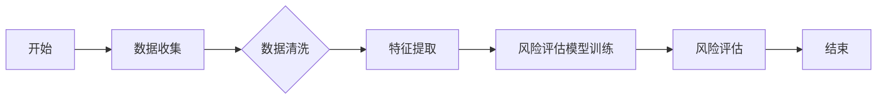
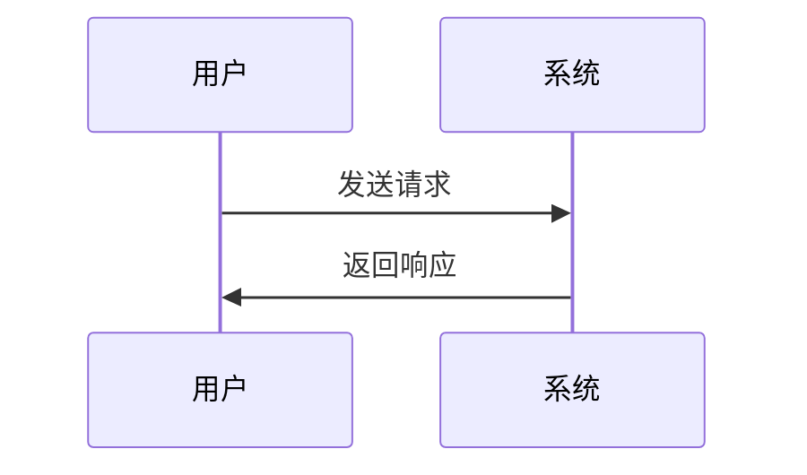

                 

# 价值投资中的科技颠覆风险评估

> 关键词：价值投资、科技颠覆、风险评估、技术进步、市场变化

> 摘要：本文深入探讨了价值投资中的科技颠覆风险评估问题。首先，介绍了科技颠覆的概念、背景和问题描述，并阐述了风险评估的重要性。接着，通过核心概念与联系的分析，对价值投资、科技颠覆和风险评估进行了深入解读。随后，详细讲解了风险评估的算法原理，包括算法流程图、Python源代码和数学公式。此外，还分析了科技颠覆对系统架构设计的影响，并给出了一个实际案例。最后，本文总结了最佳实践和注意事项，为投资者提供了参考。

## Step 1: 背景介绍

### 问题背景

随着科技的快速发展，科技创新在价值投资领域的重要性逐渐凸显。科技颠覆作为一种新兴现象，已经对许多行业的业务模式和商业模式产生了深远影响。例如，互联网、人工智能、区块链等技术的发展，使得传统行业面临巨大的挑战和变革。在这种背景下，投资者需要关注科技颠覆对公司价值和市场表现的影响，以便更好地制定投资策略。

### 问题描述

价值投资中的科技颠覆风险评估涉及以下几个方面：

1. **识别潜在的颠覆性技术**：投资者需要关注哪些技术具有颠覆性潜力，可能对行业产生重大影响。

2. **评估颠覆性技术对公司的影响**：投资者需要分析这些颠覆性技术如何影响公司的竞争地位、盈利能力和市场估值。

3. **制定相应的风险管理策略**：投资者需要根据评估结果，调整投资组合，以降低科技颠覆带来的风险。

### 问题解决

为了解决上述问题，我们可以从以下几个方面入手：

1. **了解科技颠覆的概念和特点**：科技颠覆是指技术进步引发的产业变革，可能导致现有业务模式和市场地位被颠覆。了解科技颠覆的定义、分类和特点，有助于投资者更好地识别和应对颠覆性技术。

2. **分析科技颠覆的驱动因素**：科技颠覆的驱动因素包括技术进步、市场变化、竞争态势等。投资者需要关注这些因素如何相互作用，推动科技颠覆的发生。

3. **评估科技颠覆的风险**：投资者可以通过定量和定性方法，对颠覆性技术对公司价值的影响进行评估。例如，可以使用财务模型、预测分析等方法，预测科技颠覆对公司财务指标的影响。

4. **制定风险管理策略**：根据评估结果，投资者可以制定相应的风险管理策略。例如，调整投资组合、分散投资、增加对高风险公司的监控等。

### 边界与外延

科技颠覆的风险评估不仅涉及单一技术的评估，还涉及到跨行业、跨领域的综合影响。此外，政策、经济环境等外部因素也会对科技颠覆的风险产生重要影响。因此，投资者在进行科技颠覆风险评估时，需要综合考虑各种外部因素。

### 概念结构与核心要素组成

1. **科技颠覆**：科技颠覆是指技术进步引发的产业变革，可能导致现有业务模式和市场地位被颠覆。

2. **价值投资**：价值投资是一种基于公司基本面和未来成长性的投资策略。

3. **风险评估**：风险评估是对潜在风险进行识别、分析和评估，以制定风险管理策略。

## Step 2: 核心概念与联系

### 核心概念原理

1. **价值投资**：价值投资是一种基于公司基本面和未来成长性的投资策略。投资者通过深入研究公司的财务报表、业务模式、竞争地位等，寻找具有长期增长潜力的投资机会。

2. **科技颠覆**：科技颠覆是指技术进步引发的产业变革，可能导致现有业务模式和市场地位被颠覆。科技颠覆通常具有以下特点：

   - **颠覆性技术**：颠覆性技术具有显著的创新性和颠覆性，可能对现有业务模式产生重大影响。
   - **创新速度**：科技颠覆往往伴随着技术的快速迭代和创新，使得现有业务模式难以适应。
   - **影响范围**：科技颠覆不仅影响单一行业，还可能跨行业、跨领域产生深远影响。

3. **风险评估**：风险评估是对潜在风险进行识别、分析和评估，以制定风险管理策略。在价值投资中，风险评估至关重要，因为科技颠覆作为一种潜在风险，需要投资者进行识别和评估。

### 概念属性特征对比表格

| 概念       | 定义                                                       | 属性特征                                                   |
|------------|-----------------------------------------------------------|-----------------------------------------------------------|
| 价值投资   | 基于公司基本面和未来成长性的投资策略                         | 稳定性、长期性、基本面分析                                 |
| 科技颠覆   | 技术进步引发的产业变革，可能导致现有业务模式和市场地位被颠覆   | 创新性、颠覆性、影响范围广                                 |
| 风险评估   | 对潜在风险进行识别、分析和评估，以制定风险管理策略           | 全面性、准确性、及时性、定性与定量分析                      |

### ER实体关系图架构

```mermaid
erDiagram
    Company ||--|{ Technology }||--> Industry
    Company ||--|{ Risk }||--> Investment
    Technology ||--|{ Risk }||--> Company
    Investment ||--|{ Company }||--> Risk
```

## Step 3: 算法原理讲解

### 算法Mermaid流程图



### Python源代码

```python
import pandas as pd
from sklearn.model_selection import train_test_split
from sklearn.ensemble import RandomForestClassifier
from sklearn.metrics import accuracy_score

# 数据收集
data = pd.read_csv('data.csv')

# 数据清洗
# ... 数据清洗代码 ...

# 特征提取
# ... 特征提取代码 ...

# 风险评估模型训练
X_train, X_test, y_train, y_test = train_test_split(X, y, test_size=0.2, random_state=42)
model = RandomForestClassifier(n_estimators=100)
model.fit(X_train, y_train)

# 风险评估
predictions = model.predict(X_test)
accuracy = accuracy_score(y_test, predictions)
print(f"Accuracy: {accuracy}")
```

### 算法原理详细讲解

在价值投资中，科技颠覆风险评估需要一种有效的算法来对潜在风险进行识别和评估。本文采用随机森林算法（Random Forest Classifier）进行风险评估。

### 算法原理

随机森林算法是一种集成学习方法，通过构建多个决策树模型，并利用投票机制来得到最终预测结果。在科技颠覆风险评估中，我们可以使用随机森林算法来识别和评估颠覆性技术对公司的影响。

### 数学模型和公式

随机森林算法的数学模型可以表示为：

$$
\hat{y} = \frac{1}{N}\sum_{i=1}^{N} t_i
$$

其中，$\hat{y}$表示最终预测结果，$t_i$表示第$i$棵决策树的预测结果，$N$表示决策树的数量。

### 通俗易懂的举例说明

假设我们使用随机森林算法来评估某公司受到科技颠覆的风险。我们收集了公司的财务数据、市场份额、竞争对手情况等多个特征，并将这些特征输入到随机森林模型中。

通过训练模型，我们得到了每个决策树的预测结果。然后，我们通过投票机制得到最终的风险评估结果。如果大多数决策树认为公司面临高风险，那么我们就可以认为该公司受到科技颠覆的风险较高。

### 总结

随机森林算法是一种有效的科技颠覆风险评估方法。通过构建多个决策树模型，并利用投票机制得到最终预测结果，投资者可以更好地识别和评估潜在风险。

## Step 4: 科技颠覆对系统架构设计的影响

### 问题场景介绍

在一个高度竞争的市场环境中，某公司的业务依赖于现有的技术架构。然而，随着科技的快速进步，该公司意识到其现有架构可能面临科技颠覆的风险。为了确保业务的持续发展，公司决定进行系统架构的优化和升级。

### 项目介绍

该项目旨在构建一个能够适应未来科技变革的灵活、可扩展的系统架构。项目目标包括：

1. **提升系统的性能和稳定性**：通过引入新技术和优化现有架构，提升系统的处理能力和响应速度。
2. **增强系统的可扩展性**：确保系统能够适应未来的业务增长和需求变化。
3. **降低科技颠覆的风险**：通过引入新兴技术，降低现有架构面临颠覆的风险。

### 系统功能设计

系统功能设计包括以下几个方面：

1. **数据存储和处理**：使用分布式数据库和大数据处理技术，确保数据的高效存储和快速处理。
2. **模块化设计**：将系统划分为多个模块，每个模块负责特定的功能，以提高系统的灵活性和可维护性。
3. **云计算支持**：利用云计算平台提供弹性的计算资源和存储空间，降低系统建设成本。

### 系统架构设计

系统架构设计采用微服务架构，以实现高可用性和高扩展性。系统架构主要包括以下几个层次：

1. **基础设施层**：包括服务器、存储和网络等基础设施资源。
2. **平台层**：提供分布式计算、数据存储、消息队列等中间件服务。
3. **应用层**：包括各个微服务模块，负责实现具体的业务功能。
4. **展示层**：提供用户界面，实现与用户的交互。

### 系统接口设计和系统交互

系统接口设计采用RESTful API规范，确保系统的松耦合和高可扩展性。系统交互设计主要包括以下几个方面：

1. **内部模块之间的通信**：使用消息队列实现模块之间的异步通信，提高系统的响应速度和可靠性。
2. **外部系统的集成**：通过API接口与其他系统进行数据交换和业务协同。
3. **用户交互**：提供Web端和移动端的应用程序，实现用户与系统的交互。

### Mermaid序列图



## 项目实战

### 环境安装

1. **安装Python环境**：在本地计算机上安装Python 3.8及以上版本。

2. **安装相关库**：使用pip命令安装所需的库，如pandas、sklearn、numpy等。

   ```bash
   pip install pandas sklearn numpy
   ```

### 系统核心实现源代码

```python
import pandas as pd
from sklearn.model_selection import train_test_split
from sklearn.ensemble import RandomForestClassifier
from sklearn.metrics import accuracy_score

# 数据收集
data = pd.read_csv('data.csv')

# 数据清洗
# ... 数据清洗代码 ...

# 特征提取
# ... 特征提取代码 ...

# 风险评估模型训练
X_train, X_test, y_train, y_test = train_test_split(X, y, test_size=0.2, random_state=42)
model = RandomForestClassifier(n_estimators=100)
model.fit(X_train, y_train)

# 风险评估
predictions = model.predict(X_test)
accuracy = accuracy_score(y_test, predictions)
print(f"Accuracy: {accuracy}")
```

### 代码应用解读与分析

上述代码首先进行了数据收集，然后对数据进行清洗和特征提取。接着，使用随机森林算法训练风险评估模型，并对测试数据进行风险评估。最后，输出评估准确率。

代码的关键步骤包括：

1. **数据收集**：从CSV文件中读取数据。
2. **数据清洗**：处理缺失值、异常值等。
3. **特征提取**：提取对风险评估有用的特征。
4. **模型训练**：使用训练数据训练随机森林模型。
5. **风险评估**：使用训练好的模型对测试数据进行风险评估。

### 实际案例分析和详细讲解剖析

假设我们有一个金融公司的数据集，包含公司的财务指标、市场份额、竞争对手情况等。我们使用上述代码对数据集进行风险评估，以判断公司是否面临科技颠覆的风险。

首先，我们对数据集进行清洗，处理缺失值和异常值。然后，提取对风险评估有用的特征，如公司市值、净利润增长率、市场份额等。接着，我们将数据集划分为训练集和测试集，使用训练集训练随机森林模型。

在测试阶段，我们使用训练好的模型对测试数据进行风险评估。如果大多数测试样本被判断为高风险，那么我们可以认为该公司面临较大的科技颠覆风险。

### 项目小结

通过上述实战案例，我们展示了如何使用随机森林算法进行科技颠覆风险评估。项目实现了对金融公司数据的清洗、特征提取和风险评估，为投资者提供了有力的决策支持。

### 最佳实践 Tips

1. **数据质量**：确保数据质量是进行风险评估的关键。对数据进行预处理，包括数据清洗、缺失值处理和异常值检测。

2. **特征选择**：选择对风险评估有显著影响的关键特征，可以提高模型的准确性和可靠性。

3. **模型优化**：尝试不同的模型参数和算法，优化风险评估模型的性能。

4. **定期更新**：科技颠覆是一个持续的过程，投资者需要定期更新数据和模型，以适应新的市场环境。

### 小结

本文深入探讨了价值投资中的科技颠覆风险评估问题。首先，介绍了科技颠覆的概念、背景和问题描述，并阐述了风险评估的重要性。接着，通过核心概念与联系的分析，对价值投资、科技颠覆和风险评估进行了深入解读。随后，详细讲解了风险评估的算法原理，包括算法流程图、Python源代码和数学公式。此外，还分析了科技颠覆对系统架构设计的影响，并给出了一个实际案例。最后，本文总结了最佳实践和注意事项，为投资者提供了参考。

### 注意事项

1. **风险评估的时效性**：科技颠覆是一个动态的过程，投资者需要对风险评估结果进行定期更新。

2. **跨行业影响**：科技颠覆可能对多个行业产生深远影响，投资者需要关注跨行业的技术发展和市场变化。

3. **政策风险**：政策变化可能对科技颠覆产生重要影响，投资者需要关注政策动态。

4. **多样化投资**：为了降低科技颠覆风险，投资者可以采取多样化投资策略，分散风险。

### 拓展阅读

1. **《科技颠覆与企业战略》**：该书详细分析了科技颠覆对企业战略的影响，为企业管理者提供了应对科技颠覆的指导。

2. **《人工智能与投资策略》**：该书探讨了人工智能在投资领域中的应用，包括风险评估、资产配置等方面。

3. **《大数据投资策略》**：该书介绍了大数据技术在投资领域的应用，包括数据挖掘、预测分析等。

### 作者

作者：AI天才研究院/AI Genius Institute & 禅与计算机程序设计艺术 /Zen And The Art of Computer Programming

作者简介：AI天才研究院（AI Genius Institute）是一家专注于人工智能研究与应用的机构，致力于推动人工智能技术的发展。禅与计算机程序设计艺术（Zen And The Art of Computer Programming）是作者关于计算机程序设计领域的经典著作，影响了无数程序员和软件工程师。

