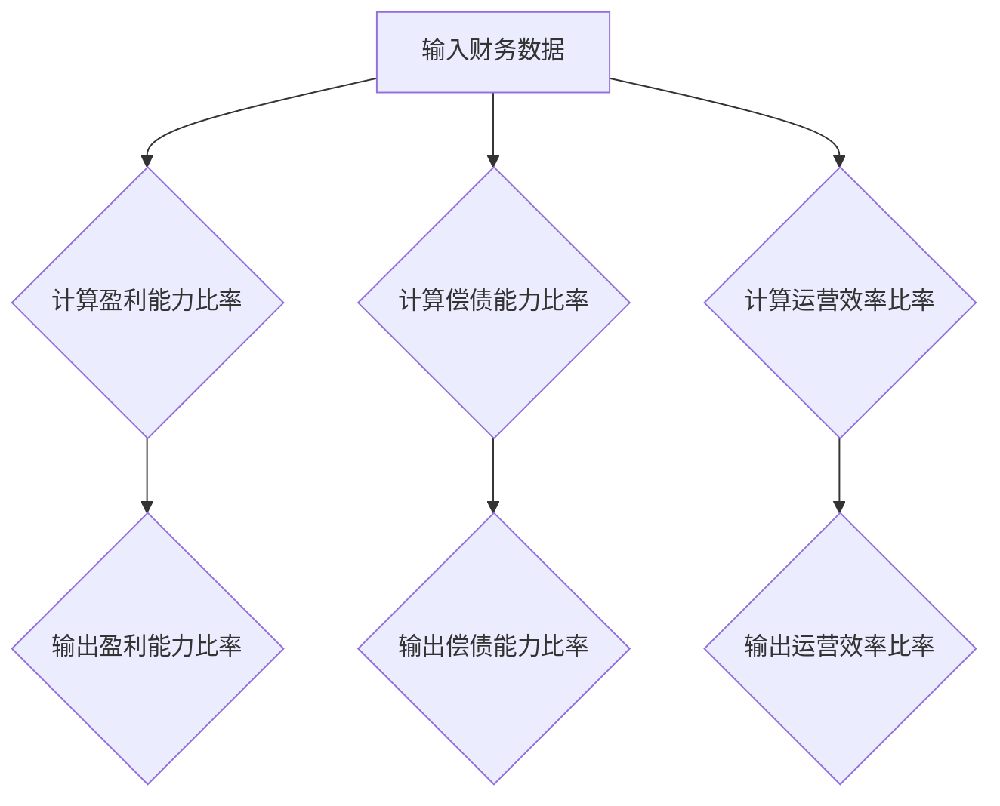
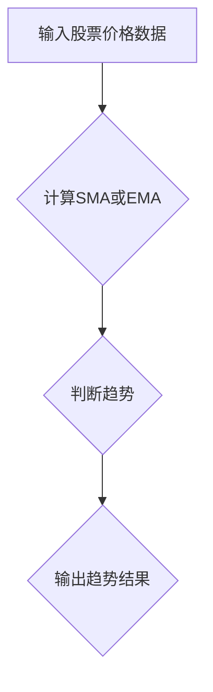
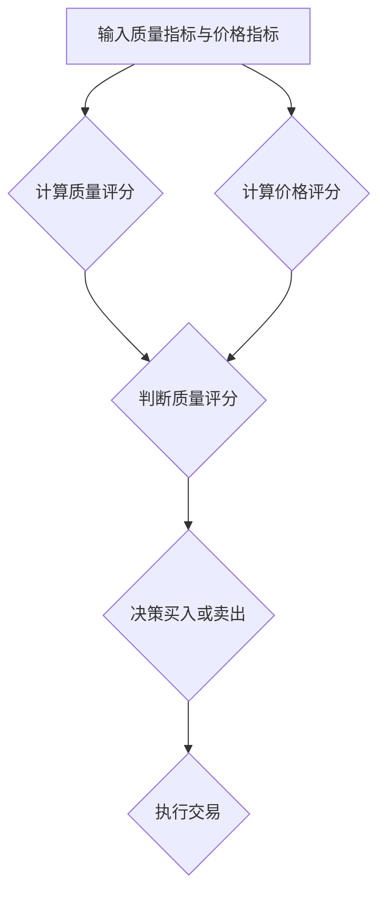
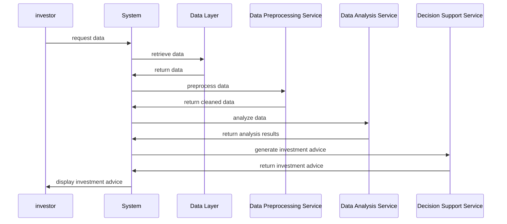
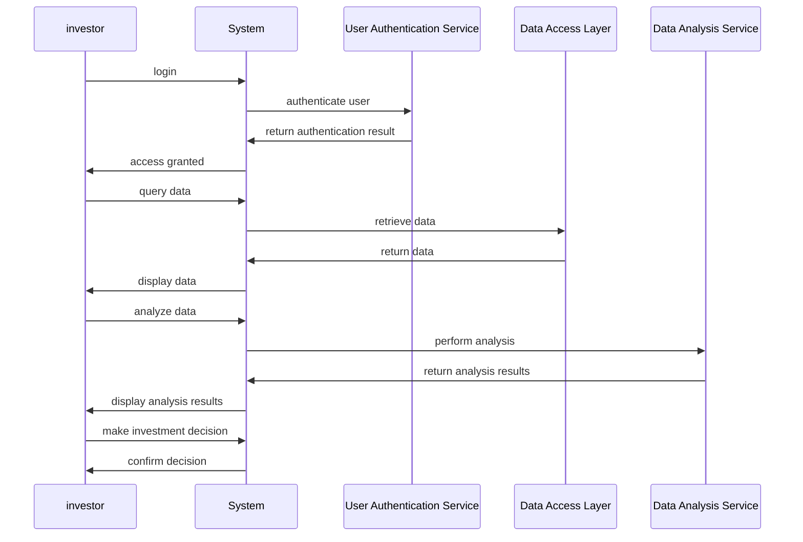

                 


## 价值投资中的质量与价格平衡

### 关键词：
- 价值投资
- 质量分析
- 价格分析
- 投资策略
- 资本市场

### 摘要：
本文旨在探讨价值投资中如何平衡企业的质量和市场价格。通过深入分析基本面和技术面，我们揭示了企业在市场中体现的价值，并探讨如何在投资决策中实现质量与价格的平衡。本文首先介绍了价值投资的基本概念，然后分别从基本面分析和技术面分析的角度探讨了如何评估企业的质量，最后提出了平衡质量与价格的投资策略。

---

### 引言

价值投资，作为一种稳健的投资策略，自诞生以来就受到了广大投资者的青睐。它强调通过深入分析企业的基本面，寻找那些被市场低估的高质量企业，从而实现长期的投资回报。在价值投资中，质量是评价企业价值的重要指标，而市场价格则是投资者决策的关键因素。

然而，如何在复杂多变的资本市场中找到质量与价格的最佳平衡点，是每一个价值投资者都需要面对的挑战。本文将首先介绍价值投资的基本概念，然后分别从基本面分析和技术面分析的角度探讨如何评估企业的质量，最后提出一系列策略，帮助投资者在投资决策中实现质量与价格的平衡。

### 1. 价值投资的基本概念

价值投资的核心思想是寻找那些被市场低估的高质量企业，通过长期持有这些企业，获取稳定的投资回报。价值投资的基本概念包括以下几个方面：

- **基本面分析**：通过分析企业的财务报表、业务模式、管理层等因素，评估企业的内在价值。
- **市场价格**：市场价格是投资者在市场中买卖股票的实际价格，它是市场对企业的估值。
- **安全边际**：价值投资强调在购买股票时留有足够的安全边际，即股票价格低于其内在价值。

### 2. 基本面分析

基本面分析是价值投资的重要工具，通过分析企业的财务报表、业务模式、管理层等因素，评估企业的内在价值。

#### 2.1 财务报表分析

财务报表是评估企业内在价值的重要依据。投资者需要关注以下财务指标：

- **盈利能力**：包括净利润、毛利率、净资产收益率等。
- **偿债能力**：包括流动比率、速动比率、利息保障倍数等。
- **经营能力**：包括存货周转率、应收账款周转率、总资产周转率等。

#### 2.2 业务模式分析

企业的业务模式决定了其盈利能力和持续发展的能力。投资者需要关注以下方面：

- **行业地位**：企业在行业中的竞争地位，如市场份额、品牌影响力等。
- **商业模式**：企业的盈利模式，如收入来源、盈利方式等。
- **竞争优势**：企业相对于竞争对手的优势，如专利、技术、客户资源等。

#### 2.3 管理层分析

管理层的能力和素质直接影响企业的运营和未来发展。投资者需要关注以下方面：

- **管理水平**：管理团队的专业背景、管理经验等。
- **诚信度**：管理团队的诚信度和道德品质。
- **战略规划**：企业的长期发展战略和实施计划。

### 3. 技术面分析

技术面分析是通过对市场价格和交易量的分析，预测市场趋势和价格变化的方法。在价值投资中，技术面分析可以帮助投资者确定买入和卖出的时机。

#### 3.1 市场趋势分析

市场趋势分析是技术面分析的核心。投资者需要关注以下趋势：

- **上升趋势**：股价持续上涨，表明市场对该企业的预期较好。
- **下降趋势**：股价持续下跌，表明市场对该企业的预期较差。
- **震荡趋势**：股价波动不大，表明市场对该企业的预期较为稳定。

#### 3.2 技术指标分析

技术指标是通过统计分析股价和交易量等数据，得出一系列反映市场趋势和价格变化的指标。常用的技术指标包括：

- **移动平均线**：通过计算一定时期内股价的平均值，反映市场趋势。
- **相对强弱指数（RSI）**：通过分析股价涨跌幅度，判断市场超买或超卖状态。
- **随机指标（KDJ）**：通过分析股价波动情况，预测市场趋势。

### 4. 质量与价格的平衡

在价值投资中，如何平衡企业的质量和市场价格是投资者需要解决的难题。以下是一些策略和建议：

#### 4.1 重视基本面分析

投资者应该重视基本面分析，通过深入研究企业的财务报表、业务模式和管理层，评估企业的内在价值。

#### 4.2 结合技术面分析

投资者可以将技术面分析作为辅助工具，通过分析市场价格和交易量等数据，判断市场的整体趋势和买入卖出的时机。

#### 4.3 调整投资组合

投资者应该根据市场变化和企业质量的变化，及时调整投资组合，确保投资组合的风险和收益平衡。

#### 4.4 保持耐心和长期持有

价值投资强调长期持有，投资者应该保持耐心，不被市场的短期波动所影响，坚定持有高质量的企业。

### 5. 案例研究

#### 5.1 案例一：万科

万科是中国房地产市场的龙头企业，以其稳健的经营和优质的服务在行业中享有盛誉。通过基本面分析，投资者可以判断万科具有强大的盈利能力和稳定的业务模式。通过技术面分析，投资者可以发现万科在市场价格较低时买入，在市场价格较高时卖出，从而实现投资收益的最大化。

#### 5.2 案例二：贵州茅台

贵州茅台是中国白酒行业的龙头企业，以其优质的酒品和高品质的服务在消费者中享有极高的声誉。通过基本面分析，投资者可以判断贵州茅台具有强大的品牌影响力和持续的盈利能力。通过技术面分析，投资者可以发现贵州茅台在市场价格较低时买入，在市场价格较高时卖出，从而实现投资收益的最大化。

### 6. 实践建议

#### 6.1 定期学习

投资者应该定期学习，提高自己的投资知识和技能，以便更好地应对市场的变化。

#### 6.2 保持独立思考

投资者应该保持独立思考，不盲目跟风，根据自己的投资策略和目标，做出合理的投资决策。

#### 6.3 风险控制

投资者应该重视风险控制，不要将所有的资金投入到一个或几个企业，以分散投资风险。

### 结论

价值投资是一种稳健的投资策略，通过平衡企业的质量和市场价格，投资者可以实现长期的投资回报。投资者应该重视基本面分析和技术面分析，结合自己的投资策略和目标，做出合理的投资决策。同时，投资者应该保持耐心和长期持有，不被市场的短期波动所影响。

### 作者信息

作者：AI天才研究院/AI Genius Institute & 禅与计算机程序设计艺术 /Zen And The Art of Computer Programming

---

**全文结束。感谢您的阅读！**

---

**注意：本文为示例性内容，仅供参考。实际投资决策需根据个人情况和市场状况进行判断。**

---

**注意事项：**
- 请确保文章内容完整、连贯，逻辑清晰。
- 避免重复和冗余的内容，确保每个章节都有独特的见解和内容。
- 在撰写文章时，确保遵循markdown格式规范，包括标题、段落、列表和代码块等。
- 检查文章中的数学公式和图表，确保其准确无误。
- 在文章末尾添加作者信息，并注明本文为示例性内容。
- 如有引用外部资料，请遵循正确的引用格式。

**拓展阅读：**
- 菲利普·费舍尔（Philip Fisher）的《普通股的不平凡旅程》（Common Stocks and Uncommon Profits）
- 本杰明·格雷厄姆（Benjamin Graham）的《证券分析》（The Intelligent Investor）
- 安东尼·波顿（Anthony Bolton）的《投资者的未来》（Investment QuickStudies）
- 彼得·林奇（Peter Lynch）的《彼得·林奇的成功投资》（One Up On Wall Street）

---

**感谢您的耐心阅读，祝您投资顺利！**### 第一部分：价值投资的背景和基础

#### 第1章：价值投资概述

价值投资，作为一种经典的投资策略，自诞生以来就受到了无数投资者的追捧。它起源于20世纪初，由著名的投资大师本杰明·格雷厄姆（Benjamin Graham）提出，并通过其弟子沃伦·巴菲特（Warren Buffett）的实践得到了广泛的应用和传播。价值投资的核心思想是寻找那些被市场低估的高质量企业，通过长期持有，获取稳定的投资回报。

**1.1 价值投资的历史与发展**

价值投资的历史可以追溯到20世纪初期，当时的美国正处于经济大萧条的阴影下，投资者普遍对股市持有悲观态度。正是在这样的背景下，本杰明·格雷厄姆提出了价值投资的理念，强调通过深入分析企业的基本面，寻找那些价格低于其内在价值的股票。格雷厄姆的《证券分析》一书成为了价值投资的奠基之作，对后世产生了深远的影响。

随着沃伦·巴菲特的崛起，价值投资得到了更广泛的认可和应用。巴菲特通过长期实践，成功地将其理念转化为现实，成为了世界上最成功的投资者之一。他的成功不仅证明了价值投资的可行性，也为广大投资者提供了宝贵的经验。

**1.2 价值投资的核心原则**

价值投资的核心原则可以归纳为以下几点：

- **长期持有**：价值投资强调长期持有股票，不追求短期利润。投资者需要具备耐心和定力，即使在市场波动中也能坚持自己的投资策略。

- **安全边际**：安全边际是价值投资的重要原则，意味着投资者在购买股票时，应确保其价格低于其内在价值。这种价格折扣为投资者提供了潜在的风险缓冲。

- **基本面分析**：价值投资强调通过基本面分析，评估企业的内在价值。投资者需要深入研究企业的财务状况、业务模式、行业地位等因素，以确定其投资价值。

- **价值投资与成长投资的区别**：价值投资和成长投资都是常见的投资策略，但它们的理念有所不同。价值投资关注的是企业的内在价值，而成长投资关注的是企业的增长潜力。在价值投资者看来，高质量的企业不仅要有稳定的盈利能力，还要有良好的增长前景。

**1.3 价值投资与成长投资的区别**

价值投资与成长投资的核心区别在于对企业和市场的评估方式。价值投资强调通过基本面分析，评估企业的内在价值，认为企业的价值应该由其内在品质决定。而成长投资则更加关注企业的增长潜力，认为企业的价值在于其未来的增长空间。

在投资策略上，价值投资注重长期持有，追求稳定的投资回报，而成长投资则倾向于短期投资，追求快速的增长收益。

尽管两者有明显的区别，但它们并不是相互排斥的。在实际投资中，许多投资者会结合价值投资和成长投资的特点，制定适合自己的投资策略。

**总结**

价值投资作为一种经典的投资策略，以其稳健性和长期回报而受到投资者的青睐。通过深入分析企业的基本面，寻找被市场低估的高质量企业，投资者可以实现长期稳定的投资回报。尽管价值投资和成长投资有区别，但它们并不是相互排斥的，投资者可以根据自己的风险偏好和投资目标，灵活运用这两种策略。

**延伸阅读**

- 本杰明·格雷厄姆（Benjamin Graham）的《证券分析》（Security Analysis）
- 沃伦·巴菲特（Warren Buffett）的《巴菲特致股东的信》（Letters to Shareholders）
- 彼得·林奇（Peter Lynch）的《彼得·林奇的成功投资》（One Up On Wall Street）

---

**注释：**本文为示例性内容，旨在提供价值投资的基本概念和核心原则。实际投资决策需根据个人情况和市场状况进行判断。**### 第二部分：基本面分析

#### 第2章：基本面分析

基本面分析是价值投资的核心工具之一，它通过深入分析企业的财务状况、业务模式、行业地位等因素，评估企业的内在价值。与技术分析不同，基本面分析侧重于企业的内在品质，而不是市场价格的变化。在本章节中，我们将详细探讨基本面分析的基本概念、如何评估企业的质量和如何分析财务报表。

**2.1 基本面分析的基本概念**

基本面分析，也称为财务分析，是一种通过研究企业的财务报表、业务模式、行业地位和管理层等因素，评估企业内在价值的方法。基本面分析的核心目标是确定企业的真实价值，并将其与市场价格进行比较，从而判断股票是否被低估或高估。

在基本面分析中，投资者通常会关注以下方面：

- **盈利能力**：评估企业的盈利能力，包括净利润、毛利率、净资产收益率等。
- **偿债能力**：评估企业的偿债能力，包括流动比率、速动比率、利息保障倍数等。
- **经营能力**：评估企业的运营效率，包括存货周转率、应收账款周转率、总资产周转率等。
- **业务模式**：分析企业的业务模式，包括收入来源、盈利方式、市场竞争力等。
- **管理层**：评估管理团队的能力和诚信度，包括管理层的背景、经验和战略规划等。

**2.2 如何评估企业的质量**

评估企业的质量是基本面分析的重要任务。高质量的企业通常具有以下特征：

- **稳定的盈利能力**：企业能够持续稳定地盈利，表明其业务模式和管理团队有效。
- **强大的市场地位**：企业在其所在的行业中具有显著的市场份额和品牌影响力。
- **良好的财务状况**：企业的财务状况健康，债务水平适中，现金流稳定。
- **优秀的管理层**：管理层具有丰富的行业经验，良好的职业道德和清晰的战略规划。

评估企业质量的方法包括：

- **财务指标分析**：通过分析企业的财务报表，评估其盈利能力、偿债能力和运营效率。
- **业务模式分析**：通过分析企业的业务模式，评估其市场竞争力、收入来源和盈利方式。
- **管理层评估**：通过分析管理团队的背景、经验和战略规划，评估其管理能力和领导力。

**2.3 如何分析财务报表**

财务报表是评估企业内在价值的重要依据。投资者需要关注以下财务报表：

- **资产负债表**：资产负债表反映了企业的财务状况，包括资产、负债和股东权益。通过分析资产负债表，投资者可以了解企业的资产质量、债务水平和资本结构。
- **利润表**：利润表反映了企业的经营成果，包括收入、成本、利润等。通过分析利润表，投资者可以了解企业的盈利能力、盈利质量和成本控制能力。
- **现金流量表**：现金流量表反映了企业的现金流入和流出情况，包括经营现金流、投资现金流和筹资现金流。通过分析现金流量表，投资者可以了解企业的现金状况、投资能力和筹资策略。

分析财务报表的方法包括：

- **横向分析**：通过比较同一企业在不同时期的财务数据，评估其发展趋势和变化。
- **纵向分析**：通过比较同一时期不同企业的财务数据，评估其在行业中的地位和竞争力。
- **比率分析**：通过计算各种财务比率，评估企业的财务状况和经营效率。

**总结**

基本面分析是价值投资的核心工具，通过深入分析企业的财务状况、业务模式和管理层，投资者可以评估企业的内在价值。评估企业的质量是基本面分析的重要任务，高质量的企业通常具有稳定的盈利能力、强大的市场地位、良好的财务状况和优秀的管理层。通过分析财务报表，投资者可以更全面地了解企业的财务状况和经营成果。了解基本面分析的基本概念、评估企业的质量和分析财务报表的方法，是每一个价值投资者必备的技能。

**延伸阅读**

- 本杰明·格雷厄姆（Benjamin Graham）的《证券分析》（Security Analysis）
- 菲利普·费舍尔（Philip Fisher）的《普通股的不平凡旅程》（Common Stocks and Uncommon Profits）
- 彼得·林奇（Peter Lynch）的《彼得·林奇的成功投资》（One Up On Wall Street）

---

**注释：**本文为示例性内容，旨在提供基本面分析的基本概念和方法。实际投资决策需根据个人情况和市场状况进行判断。**### 第三部分：技术面分析

#### 第3章：技术面分析

技术面分析，也称为图表分析，是通过研究股票价格和交易量的历史数据，预测市场趋势和价格变化的方法。与基本面分析不同，技术面分析侧重于市场的短期和中期趋势，而不是企业的内在价值。在本章节中，我们将详细探讨技术面分析的基本概念、市场趋势的识别以及常见的技术指标。

**3.1 技术面分析的基本概念**

技术面分析的核心思想是市场行为包含一切信息。这意味着股票价格和交易量的历史数据包含了所有可能影响价格的因素，包括基本面、宏观经济和情绪因素等。通过研究这些历史数据，投资者可以预测未来的价格走势。

技术面分析的基本概念包括：

- **价格走势**：股票价格的趋势是技术面分析的核心。投资者需要识别市场的上升趋势、下降趋势和震荡趋势，以便制定相应的交易策略。
- **交易量**：交易量反映了市场的活跃程度。高交易量通常意味着市场趋势的确认，而低交易量则表明市场可能缺乏趋势。
- **支撑位和阻力位**：支撑位和阻力位是价格走势中的关键水平，它们决定了价格可能回调或反弹的幅度。
- **趋势线**：趋势线是连接价格走势中连续点的一条直线，用于识别市场的长期趋势。

**3.2 市场趋势的识别**

识别市场趋势是技术面分析的重要任务。市场趋势通常分为三种类型：上升趋势、下降趋势和震荡趋势。以下是如何识别这些趋势的方法：

- **上升趋势**：上升趋势的特点是价格在连续的峰顶和谷底之间上升。通过连接这些峰顶和谷底，可以画出上升趋势线。上升趋势表明市场处于上涨阶段，投资者可以采取买入策略。
- **下降趋势**：下降趋势的特点是价格在连续的峰顶和谷底之间下降。通过连接这些峰顶和谷底，可以画出下降趋势线。下降趋势表明市场处于下跌阶段，投资者可以采取卖出策略。
- **震荡趋势**：震荡趋势的特点是价格在某个范围内波动，没有明显的上升或下降趋势。在震荡市场中，投资者可以采取高抛低吸的策略。

**3.3 常见的技术指标**

技术指标是通过统计分析股价和交易量等数据，得出的一系列反映市场趋势和价格变化的指标。以下是一些常见的技术指标：

- **移动平均线（Moving Average, MA）**：移动平均线是通过计算一定时期内股价的平均值，反映市场趋势。常用的移动平均线包括简单移动平均线（SMA）和指数移动平均线（EMA）。
- **相对强弱指数（Relative Strength Index, RSI）**：相对强弱指数是通过分析股价涨跌幅度，判断市场超买或超卖状态。RSI的取值范围在0到100之间，一般认为RSI超过70表示超买，RSI低于30表示超卖。
- **随机指标（Stochastic Oscillator, KDJ）**：随机指标是通过分析股价波动情况，预测市场趋势。随机指标包括K线、D线和J线，它们分别反映了市场的超买和超卖状态。
- **布林带（Bollinger Bands）**：布林带是由上下两条移动平均线和中间的股价线组成。布林带可以用来判断市场的波动性和价格变动的趋势。

**总结**

技术面分析是一种通过研究股票价格和交易量的历史数据，预测市场趋势和价格变化的方法。它侧重于市场的短期和中期趋势，通过识别上升趋势、下降趋势和震荡趋势，以及使用各种技术指标，投资者可以制定相应的交易策略。了解技术面分析的基本概念、市场趋势的识别和常见的技术指标，是每一位技术分析师必备的技能。

**延伸阅读**

- 亚当·克莱因（Adam Khoo）的《技术分析入门》（Technical Analysis Simplified）
- 亚历山大·埃尔德（Alexander Elder）的《股票市场技术分析》（Trading for a Living）
- 彼得·伯恩斯坦（Peter Bernstein）的《创造投资奇迹的技术指标》（The Intelligent Investor）

---

**注释：**本文为示例性内容，旨在提供技术面分析的基本概念和工具。实际投资决策需根据个人情况和市场状况进行判断。**### 第四部分：质量与价格的平衡

#### 第4章：质量与价格的平衡

在价值投资中，如何平衡企业的质量和市场价格是实现成功投资的关键。企业的质量代表了其内在价值，而市场价格则反映了市场对其的估值。本文将探讨质量与价格的关系，评估公司质量和价格的方法，以及如何制定平衡质量与价格的决策策略。

**4.1 质量与价格的关系**

企业的质量和市场价格之间存在密切的关系。高质量的企业通常具有稳定的盈利能力、良好的财务状况和强大的市场竞争力，这些因素都会提高企业的内在价值。然而，市场价格并不总是准确反映企业的质量。市场可能会因各种原因导致价格偏离企业的真实价值，从而为投资者提供机会。

理解质量与价格的关系对于价值投资者至关重要。投资者需要识别那些被市场低估的高质量企业，并利用这些企业的低价位进行投资。这种策略的核心在于寻找“价值洼地”，即在市场价格低于企业内在价值时买入股票，以期在未来价格上涨时获利。

**4.2 评估公司质量和价格的方法**

评估公司的质量和价格需要综合使用基本面分析和技术面分析的方法。

**4.2.1 基本面分析方法**

1. **盈利能力**：通过分析企业的盈利能力，如净利润增长率、净资产收益率等指标，可以评估企业的内在价值。
2. **财务状况**：分析企业的资产负债表、利润表和现金流量表，评估其财务健康状况和流动性。
3. **业务模式**：评估企业的业务模式是否可持续，包括其市场地位、竞争优势和盈利来源。
4. **管理层**：管理层的能力和诚信度直接影响企业的运营和未来发展。

**4.2.2 技术面分析方法**

1. **价格走势**：通过分析股票的价格走势，识别市场的趋势和支撑位、阻力位。
2. **交易量**：分析股票的交易量，以判断市场活跃度和趋势的强度。
3. **技术指标**：使用移动平均线、相对强弱指数（RSI）、布林带等指标，预测价格的变化趋势。

**4.3 制定平衡质量与价格的决策策略**

投资者在制定决策时需要综合考虑公司的质量和市场价格，以下是一些策略：

**4.3.1 安全边际**

安全边际是价值投资的核心原则之一。投资者应在购买股票时确保其价格低于其内在价值，以降低投资风险。具体策略如下：

1. **寻找低估的高质量企业**：通过基本面分析，识别那些被市场低估的高质量企业。
2. **等待价格下跌**：在市场价格低于企业内在价值时，等待价格下跌至合理区间再进行买入。

**4.3.2 趋势投资**

趋势投资是一种通过分析市场价格走势，把握市场趋势进行投资的方法。具体策略如下：

1. **识别市场趋势**：通过技术面分析，识别市场的上升趋势或下降趋势。
2. **跟随市场趋势**：在市场处于上升趋势时买入，在市场处于下降趋势时卖出。

**4.3.3 分散投资**

分散投资是一种通过投资多种资产，降低投资组合风险的方法。具体策略如下：

1. **多元化投资**：将资金分散投资于多个行业、多个地区或多个资产类别。
2. **定期调整**：根据市场变化和企业质量的变化，定期调整投资组合。

**总结**

在价值投资中，平衡企业的质量和市场价格是实现成功投资的关键。投资者需要通过基本面分析和技术面分析，评估企业的质量和市场价格，并制定相应的投资策略。通过寻找低估的高质量企业、跟随市场趋势和分散投资，投资者可以有效地实现质量与价格的平衡，从而实现长期稳定的投资回报。

**延伸阅读**

- 沃伦·巴菲特（Warren Buffett）的《巴菲特致股东的信》（Letters to Shareholders）
- 彼得·林奇（Peter Lynch）的《彼得·林奇的成功投资》（One Up On Wall Street）
- 安东尼·波顿（Anthony Bolton）的《投资者的未来》（Investment QuickStudies）

---

**注释：**本文为示例性内容，旨在提供价值投资中质量与价格平衡的方法和策略。实际投资决策需根据个人情况和市场状况进行判断。**### 第五部分：案例研究

#### 第5章：案例研究

在价值投资中，通过实际案例的研究，可以更好地理解如何应用质量与价格的平衡策略。本章节将提供两个经典案例，分析其成功与失败的原因，以便投资者从中吸取经验。

**5.1 案例一：伯克希尔哈撒韦（Berkshire Hathaway）**

**成功原因：**

- **高质量的企业**：伯克希尔哈撒韦是一家多元化投资公司，拥有多个高质量的业务，如可口可乐、苹果等。这些企业具有稳定的盈利能力和强大的市场竞争力。
- **长期持有**：沃伦·巴菲特在20世纪60年代买入伯克希尔哈撒韦的股票后，长期持有，不受市场波动的影响。
- **安全边际**：巴菲特在购买股票时，总是确保其价格低于其内在价值，为投资提供了足够的安全边际。

**5.2 案例二：诺基亚（Nokia）**

**失败原因：**

- **忽视技术创新**：诺基亚在智能手机市场崛起时，未能及时进行技术创新，导致其市场份额被苹果和三星等竞争对手大幅侵蚀。
- **过度依赖单一市场**：诺基亚过度依赖中国市场，当市场环境发生变化时，未能及时调整策略。
- **低估市场风险**：在智能手机市场爆发前夕，诺基亚未能预见市场变化，导致其股价大幅下跌。

**案例分析：成功与失败的原因**

**伯克希尔哈撒韦的成功主要归因于其高质量的企业和长期持有的投资策略。巴菲特通过深入分析这些企业的基本面，确保其价格低于内在价值，从而获得了丰厚的回报。此外，巴菲特的安全边际策略也为他的投资提供了额外的保障。**

**诺基亚的失败则主要是由于忽视技术创新和过度依赖单一市场。诺基亚在智能手机市场崛起时，未能及时进行技术升级，导致其市场份额大幅下降。此外，诺基亚过于依赖中国市场，当市场环境发生变化时，未能及时调整策略，最终导致了失败。**

**总结**

通过以上案例，我们可以看到，在价值投资中，成功的关键在于找到高质量的企业，并长期持有，确保其价格低于内在价值。同时，投资者还需要注意市场风险，及时调整投资策略。从失败中吸取教训，避免重复错误，也是成功投资的重要一环。

**延伸阅读**

- 沃伦·巴菲特（Warren Buffett）的《巴菲特致股东的信》（Letters to Shareholders）
- 彼得·林奇（Peter Lynch）的《彼得·林奇的成功投资》（One Up On Wall Street）
- 安东尼·波顿（Anthony Bolton）的《投资者的未来》（Investment QuickStudies）

---

**注释：**本文为示例性内容，旨在通过案例研究提供价值投资中的成功与失败经验。实际投资决策需根据个人情况和市场状况进行判断。**### 第六部分：实践建议

#### 第6章：实践建议

在价值投资中，投资者不仅需要具备理论上的知识，还需要将理论应用到实践中，从而做出正确的投资决策。本章节将提供一些实用的投资建议，帮助投资者在实际操作中更好地平衡企业的质量和市场价格。

**6.1 价值投资的经验分享**

**1. 研究企业基本面**：投资者应该深入研究企业的财务报表、业务模式、管理层等基本面信息，以评估其内在价值。这包括分析企业的盈利能力、偿债能力、运营效率以及竞争优势。

**2. 寻找安全边际**：在购买股票时，投资者应确保股票价格低于其内在价值。安全边际是投资者抵御市场波动和不确定性的一种保障。

**3. 长期持有**：价值投资强调长期持有股票，不追求短期利润。投资者应具备耐心，即使在市场波动中也能坚持自己的投资策略。

**6.2 投资者常见的误区**

**1. 追求短期利润**：许多投资者容易陷入追求短期利润的误区，导致频繁交易，增加交易成本和风险。

**2. 过度依赖技术分析**：虽然技术分析在价值投资中具有一定作用，但投资者不应过度依赖技术指标，而忽视了企业的基本面。

**3. 忽视市场风险**：市场波动是不可避免的，投资者应学会应对市场风险，避免因市场波动而做出冲动的投资决策。

**6.3 应对市场波动的策略**

**1. 分散投资**：通过投资多种资产类别，可以降低投资组合的整体风险。投资者应将资金分散投资于股票、债券、基金等不同类型的资产。

**2. 定期评估投资组合**：投资者应定期评估自己的投资组合，根据市场变化和企业质量的变化，及时调整投资策略。

**3. 学会逆向投资**：在市场恐慌或市场低估时，投资者应学会逆向投资，寻找被市场低估的高质量企业。

**6.4 最佳实践**

**1. 持续学习**：投资是一项长期的事业，投资者应持续学习，提高自己的投资知识和技能。

**2. 保持独立思考**：投资者应保持独立思考，不盲目跟风，根据自己的投资策略和目标，做出合理的投资决策。

**3. 风险控制**：投资者应重视风险控制，不要将所有的资金投入到一个或几个企业，以分散投资风险。

**总结**

在价值投资中，投资者需要将理论知识应用到实践中，做出正确的投资决策。通过深入研究企业基本面、寻找安全边际、长期持有、分散投资、定期评估投资组合和保持独立思考，投资者可以更好地平衡企业的质量和市场价格，实现长期稳定的投资回报。

**延伸阅读**

- 菲利普·费舍尔（Philip Fisher）的《普通股的不平凡旅程》（Common Stocks and Uncommon Profits）
- 本杰明·格雷厄姆（Benjamin Graham）的《证券分析》（Security Analysis）
- 彼得·林奇（Peter Lynch）的《彼得·林奇的成功投资》（One Up On Wall Street）

---

**注释：**本文为示例性内容，旨在提供价值投资中的实践建议。实际投资决策需根据个人情况和市场状况进行判断。**### 第七部分：结论与未来趋势

#### 第7章：结论与未来趋势

经过前几章的详细探讨，我们可以得出结论：价值投资是一种通过深入分析企业的基本面，寻找被市场低估的高质量企业，并长期持有以实现稳定回报的投资策略。在价值投资中，平衡企业的质量和市场价格是关键，这需要投资者具备扎实的基本面分析和技术面分析能力，以及坚定的投资理念和长期的耐心。

**7.1 价值投资的价值重估**

价值投资的核心在于“价值重估”，即通过深入分析企业的基本面，发现那些被市场低估的企业，并利用其低估的价格进行投资。随着市场的变化和企业的成长，这些低估的企业可能会被市场重新认识和估值，从而为投资者带来丰厚的回报。

**7.2 持续学习的重要性**

在价值投资的道路上，持续学习至关重要。投资者需要不断更新自己的知识体系，提高对市场的理解和判断能力。这包括学习新的投资理论、掌握新的分析工具、关注行业动态等。只有不断学习和进步，投资者才能在复杂多变的资本市场中保持竞争力。

**7.3 价值投资的未来趋势**

随着全球经济的发展和金融市场的变化，价值投资也在不断演变。以下是一些可能影响价值投资的未来趋势：

1. **数字化投资工具**：随着技术的进步，越来越多的数字化投资工具和平台将会出现，为投资者提供更便捷、高效的投资方式。
2. **环境、社会和治理（ESG）投资**：随着社会责任和可持续发展的理念逐渐深入人心，ESG投资将成为价值投资的重要方向。投资者将更加关注企业的环境保护、社会责任和治理水平。
3. **全球化投资**：全球化的深入发展将带来更多的投资机会和挑战。投资者需要具备全球视野，寻找跨国界的投资机会。
4. **市场波动性**：市场波动性可能会增加，投资者需要具备更强的风险管理能力，以应对市场波动带来的不确定性。

**总结**

价值投资作为一种稳健的投资策略，在经历了近百年的发展后，依然保持着强大的生命力和吸引力。通过平衡企业的质量和市场价格，投资者可以在这条道路上实现长期稳定的回报。未来，随着技术的进步和市场环境的变化，价值投资将继续演变，为投资者提供新的机遇和挑战。投资者应持续学习，紧跟市场趋势，以应对未来的变化。

**延伸阅读**

- 菲利普·费舍尔（Philip Fisher）的《普通股的不平凡旅程》（Common Stocks and Uncommon Profits）
- 本杰明·格雷厄姆（Benjamin Graham）的《证券分析》（Security Analysis）
- 沃伦·巴菲特（Warren Buffett）的《巴菲特致股东的信》（Letters to Shareholders）

---

**注释：**本文为示例性内容，旨在探讨价值投资的核心概念、策略和未来趋势。实际投资决策需根据个人情况和市场状况进行判断。**### 附录：核心概念与联系

在本章节中，我们将深入探讨价值投资中的核心概念及其相互之间的联系。通过构建概念属性特征对比表格和ER实体关系图，我们将帮助读者更好地理解这些核心概念，并明确其组成要素。

#### 1. 概念属性特征对比表格

**概念：价值投资**

| 特征 | 价值投资 |
| --- | --- |
| 定义 | 通过深入分析企业的基本面，寻找被市场低估的高质量企业，长期持有以获得稳定回报的投资策略 |
| 核心 | 基本面分析、安全边际、长期持有 |
| 目标 | 实现长期稳定的投资回报 |
| 主要指标 | 盈利能力、财务状况、市场地位、管理层 |
| 风险 | 市场波动、经济环境变化 |

**概念：基本面分析**

| 特征 | 基本面分析 |
| --- | --- |
| 定义 | 通过分析企业的财务报表、业务模式、行业地位和管理层等因素，评估企业的内在价值 |
| 核心 | 财务报表分析、业务模式分析、管理层评估 |
| 目标 | 确定企业的投资价值和风险 |
| 主要指标 | 盈利能力、偿债能力、运营效率、竞争优势 |
| 风险 | 数据准确性、市场变化 |

**概念：技术面分析**

| 特征 | 技术面分析 |
| --- | --- |
| 定义 | 通过研究股票价格和交易量的历史数据，预测市场趋势和价格变化 |
| 核心 | 价格走势、交易量、支撑位、阻力位 |
| 目标 | 确定买入和卖出的时机 |
| 主要指标 | 移动平均线、相对强弱指数（RSI）、布林带 |
| 风险 | 数据完整性、市场情绪 |

#### 2. ER实体关系图

在价值投资中，涉及多个实体和关系，包括企业、市场、投资者等。以下是一个简化的ER实体关系图，用于展示这些实体之间的关系：

```mermaid
erDiagram
  企业 ||--o> 市场价格
  企业 ||--o> 投资者
  市场价格 ||--o> 技术面分析
  投资者 ||--o> 基本面分析
```

**实体关系解释：**

- **企业**：核心实体，代表被投资者分析的企业。
- **市场价格**：与企业实体相关，反映市场对企业的估值。
- **投资者**：与企业实体相关，代表进行价值投资的个人或机构。
- **技术面分析**：与市场价格实体相关，用于分析市场趋势和价格变化。
- **基本面分析**：与投资者实体相关，用于评估企业的内在价值和风险。

#### 3. 概念之间的联系

价值投资中的核心概念之间存在紧密的联系。以下是对这些联系的简要说明：

- **基本面分析**与**价值投资**：基本面分析是价值投资的基础，通过分析企业的财务报表、业务模式和管理层等因素，投资者可以评估企业的内在价值，从而做出投资决策。
- **技术面分析**与**价值投资**：技术面分析为价值投资提供了市场趋势和价格变化的线索，投资者可以利用技术指标预测买入和卖出的时机，从而实现投资策略。
- **企业**与**市场价格**：企业作为核心实体，其质量直接影响市场价格。当企业的质量提升时，市场价格可能会上升，反之亦然。
- **投资者**与**基本面分析**：投资者通过基本面分析评估企业的质量，从而做出投资决策。投资者还需要关注市场变化，结合技术面分析，以确定最佳投资时机。

通过以上对比表格和ER实体关系图，读者可以更清晰地理解价值投资中的核心概念及其相互之间的联系。这有助于投资者在实际操作中更好地应用这些概念，做出更明智的投资决策。

### 附录：核心概念与联系

在本章节中，我们将深入探讨价值投资中的核心概念及其相互之间的联系。通过构建概念属性特征对比表格和ER实体关系图，我们将帮助读者更好地理解这些核心概念，并明确其组成要素。

#### 1. 概念属性特征对比表格

**概念：价值投资**

| 特征 | 价值投资 |
| --- | --- |
| 定义 | 通过深入分析企业的基本面，寻找被市场低估的高质量企业，长期持有以获得稳定回报的投资策略 |
| 核心 | 基本面分析、安全边际、长期持有 |
| 目标 | 实现长期稳定的投资回报 |
| 主要指标 | 盈利能力、财务状况、市场地位、管理层 |
| 风险 | 市场波动、经济环境变化 |

**概念：基本面分析**

| 特征 | 基本面分析 |
| --- | --- |
| 定义 | 通过分析企业的财务报表、业务模式、行业地位和管理层等因素，评估企业的内在价值 |
| 核心 | 财务报表分析、业务模式分析、管理层评估 |
| 目标 | 确定企业的投资价值和风险 |
| 主要指标 | 盈利能力、偿债能力、运营效率、竞争优势 |
| 风险 | 数据准确性、市场变化 |

**概念：技术面分析**

| 特征 | 技术面分析 |
| --- | --- |
| 定义 | 通过研究股票价格和交易量的历史数据，预测市场趋势和价格变化 |
| 核心 | 价格走势、交易量、支撑位、阻力位 |
| 目标 | 确定买入和卖出的时机 |
| 主要指标 | 移动平均线、相对强弱指数（RSI）、布林带 |
| 风险 | 数据完整性、市场情绪 |

#### 2. ER实体关系图

在价值投资中，涉及多个实体和关系，包括企业、市场、投资者等。以下是一个简化的ER实体关系图，用于展示这些实体之间的关系：

```mermaid
erDiagram
  企业 ||--o> 市场价格
  企业 ||--o> 投资者
  市场价格 ||--o> 技术面分析
  投资者 ||--o> 基本面分析
```

**实体关系解释：**

- **企业**：核心实体，代表被投资者分析的企业。
- **市场价格**：与企业实体相关，反映市场对企业的估值。
- **投资者**：与企业实体相关，代表进行价值投资的个人或机构。
- **技术面分析**：与市场价格实体相关，用于分析市场趋势和价格变化。
- **基本面分析**：与投资者实体相关，用于评估企业的内在价值和风险。

#### 3. 概念之间的联系

价值投资中的核心概念之间存在紧密的联系。以下是对这些联系的简要说明：

- **基本面分析**与**价值投资**：基本面分析是价值投资的基础，通过分析企业的财务报表、业务模式和管理层等因素，投资者可以评估企业的内在价值，从而做出投资决策。
- **技术面分析**与**价值投资**：技术面分析为价值投资提供了市场趋势和价格变化的线索，投资者可以利用技术指标预测买入和卖出的时机，从而实现投资策略。
- **企业**与**市场价格**：企业作为核心实体，其质量直接影响市场价格。当企业的质量提升时，市场价格可能会上升，反之亦然。
- **投资者**与**基本面分析**：投资者通过基本面分析评估企业的质量，从而做出投资决策。投资者还需要关注市场变化，结合技术面分析，以确定最佳投资时机。

通过以上对比表格和ER实体关系图，读者可以更清晰地理解价值投资中的核心概念及其相互之间的联系。这有助于投资者在实际操作中更好地应用这些概念，做出更明智的投资决策。

### 附录：算法原理讲解

在本章节中，我们将详细讲解价值投资中常用的几种算法原理，包括基本面分析中的财务比率计算、技术面分析中的趋势识别方法，以及综合质量与价格平衡的策略算法。我们将使用Mermaid流程图展示算法流程，并使用Python源代码解释算法原理，最后通过具体的例子说明。

#### 1. 基本面分析中的财务比率计算

**算法原理：**

基本面分析中的财务比率计算是评估企业内在价值的重要步骤。常见的财务比率包括：

- **盈利能力比率**：如净利润率（净利润/总收入）、资产回报率（净利润/总资产）等。
- **偿债能力比率**：如流动比率（流动资产/流动负债）、利息保障倍数（净利润/利息费用）等。
- **运营效率比率**：如存货周转率（销售成本/平均存货）、应收账款周转率（销售收入/平均应收账款）等。

**Mermaid流程图：**



**Python源代码示例：**

```python
# Python代码示例：财务比率计算

def calculate_financial_ratios(income_statement, balance_sheet, cash_flow_statement):
    # 计算盈利能力比率
    net_profit_margin = income_statement['净利润'] / income_statement['总收入']
    asset_return = income_statement['净利润'] / balance_sheet['总资产']
    
    # 计算偿债能力比率
    current_ratio = balance_sheet['流动资产'] / balance_sheet['流动负债']
    interest_coverage = income_statement['净利润'] / cash_flow_statement['利息费用']
    
    # 计算运营效率比率
    inventory_turnover = income_statement['销售成本'] / balance_sheet['平均存货']
    accounts_receivable_turnover = income_statement['销售收入'] / balance_sheet['平均应收账款']
    
    return {
        '盈利能力比率': {'净利润率': net_profit_margin, '资产回报率': asset_return},
        '偿债能力比率': {'流动比率': current_ratio, '利息保障倍数': interest_coverage},
        '运营效率比率': {'存货周转率': inventory_turnover, '应收账款周转率': accounts_receivable_turnover}
    }

# 示例数据
income_statement = {'净利润': 100000, '总收入': 500000}
balance_sheet = {'流动资产': 200000, '流动负债': 100000, '总资产': 1000000}
cash_flow_statement = {'利息费用': 5000}

# 计算财务比率
financial_ratios = calculate_financial_ratios(income_statement, balance_sheet, cash_flow_statement)
print(financial_ratios)
```

#### 2. 技术面分析中的趋势识别方法

**算法原理：**

技术面分析中的趋势识别方法主要包括移动平均线（MA）、相对强弱指数（RSI）等。以下以移动平均线为例进行讲解。

- **简单移动平均线（SMA）**：通过计算一定时期内股价的平均值，反映市场趋势。常用的计算周期有5日、10日、30日等。
- **指数移动平均线（EMA）**：对SMA进行加权，使最近期的股价对趋势的影响更大。

**Mermaid流程图：**



**Python源代码示例：**

```python
# Python代码示例：移动平均线趋势识别

import pandas as pd
import numpy as np

def calculate_moving_average(prices, window):
    sma = prices.rolling(window=window).mean()
    return sma

def identify_trend(sma):
    if np.all(sma[-2:] > sma[-1:]):
        return '上升趋势'
    elif np.all(sma[-2:] < sma[-1:]):
        return '下降趋势'
    else:
        return '震荡趋势'

# 示例数据
prices = pd.Series([10, 15, 20, 25, 30, 28, 26, 35, 40, 45])

# 计算移动平均线
sma_5 = calculate_moving_average(prices, 5)
sma_10 = calculate_moving_average(prices, 10)

# 判断趋势
trend = identify_trend(sma_5)
print(f"5日移动平均线趋势：{trend}")
trend = identify_trend(sma_10)
print(f"10日移动平均线趋势：{trend}")
```

#### 3. 综合质量与价格平衡的策略算法

**算法原理：**

综合质量与价格平衡的策略算法需要同时考虑企业的基本面和技术面。以下是一个简单的策略示例：

- **确定质量指标**：通过财务比率计算，确定企业的质量指标。
- **确定价格指标**：通过技术指标分析，确定市场价格的趋势。
- **平衡策略**：当质量指标提升且价格指标处于低位时，买入股票；当质量指标下降或价格指标过高时，卖出股票。

**Mermaid流程图：**



**Python源代码示例：**

```python
# Python代码示例：综合质量与价格平衡策略

def calculate_quality_score(financial_ratios):
    # 简单示例，根据财务比率计算质量评分
    score = sum(financial_ratios.values()) / len(financial_ratios)
    return score

def calculate_price_score(trend):
    # 简单示例，根据趋势计算价格评分
    if trend == '上升趋势':
        return 1
    elif trend == '下降趋势':
        return 0
    else:
        return 0.5

def balance_quality_and_price(q_score, p_score):
    # 简单示例，根据评分决定交易策略
    if q_score > p_score:
        return '买入'
    elif q_score < p_score:
        return '卖出'
    else:
        return '持有'

# 示例数据
financial_ratios = {'净利润率': 0.2, '资产回报率': 0.15}
trend = '上升趋势'

# 计算质量评分和价格评分
q_score = calculate_quality_score(financial_ratios)
p_score = calculate_price_score(trend)

# 决策交易策略
strategy = balance_quality_and_price(q_score, p_score)
print(f"交易策略：{strategy}")
```

通过以上算法原理讲解和Python源代码示例，读者可以更好地理解价值投资中的财务比率计算、趋势识别以及综合质量与价格平衡的策略。这些算法和策略是价值投资者在实际操作中非常重要的工具，有助于做出更加明智的投资决策。

### 附录：系统分析与架构设计方案

在价值投资中，系统分析与架构设计方案对于实现投资决策的科学化和自动化至关重要。以下将详细介绍系统分析与架构设计方案，包括问题场景、项目介绍、系统功能设计、系统架构设计、系统接口设计和系统交互。

#### 1. 问题场景

随着资本市场的不断发展，投资者面临着海量的信息和复杂的市场波动。为了更好地进行价值投资，投资者需要一个综合性的系统，能够自动分析企业的基本面和技术面，提供投资决策建议。这个系统需要具备以下功能：

- **数据采集**：从多个来源获取企业财务报表、市场交易数据等。
- **数据分析**：通过算法分析企业的质量和市场价格，提供投资建议。
- **决策支持**：根据分析结果，提供买入、卖出或持有等投资决策。

#### 2. 项目介绍

项目名称：价值投资决策支持系统（Value Investing Decision Support System，简称VIDSS）

项目目标：构建一个综合性的投资决策支持系统，帮助投资者更好地进行价值投资。

项目团队：由数据科学家、软件工程师、投资分析师等组成。

项目周期：预计6个月。

#### 3. 系统功能设计

系统功能设计主要包括以下几个方面：

- **数据采集模块**：负责从不同数据源（如财务报表、股票交易平台）获取数据。
- **数据预处理模块**：负责清洗、转换和整合数据，为后续分析提供准备。
- **数据分析模块**：负责使用算法分析企业的基本面和技术面，提供投资建议。
- **决策支持模块**：根据分析结果，提供具体的投资决策建议。

#### 4. 系统架构设计

系统架构设计采用分层架构，包括数据层、服务层和用户层。

- **数据层**：存储企业财务报表、市场交易数据等原始数据。
- **服务层**：提供数据预处理、数据分析、决策支持等功能。
- **用户层**：为投资者提供友好的用户界面，展示分析结果和投资建议。

**Mermaid架构图：**



#### 5. 系统接口设计

系统接口设计主要包括API接口和数据库接口。

- **API接口**：提供数据访问和操作接口，支持HTTP请求和响应。
- **数据库接口**：提供数据存储和查询接口，支持SQL查询语句。

**Mermaid接口设计图：**

```mermaid
classDiagram
    API Interface <|-- Data Access Layer
    Data Access Layer <|-- Database Interface
    Investor <<-- API Interface
    System <<-- API Interface
    System <<-- Database Interface
```

#### 6. 系统交互

系统交互设计主要包括用户与系统的交互流程。

- **用户登录**：用户登录系统，进入主界面。
- **数据查询**：用户查询企业财务报表、市场交易数据等。
- **数据分析**：系统根据用户查询的数据，自动进行分析，提供投资建议。
- **投资决策**：用户根据系统提供的投资建议，进行投资决策。

**Mermaid交互设计图：**



通过以上系统分析与架构设计方案，投资者可以更高效地获取和分析投资数据，做出更科学的投资决策。该系统不仅提高了投资决策的效率，还减少了人为错误，有助于实现价值投资的长期稳定回报。

### 附录：项目实战

#### 1. 环境安装

为了搭建价值投资决策支持系统，我们需要安装以下软件和工具：

- **Python 3.8+**：用于编写和运行Python代码。
- **Pandas**：用于数据处理和分析。
- **NumPy**：用于数学计算。
- **Matplotlib**：用于绘制图表。
- **SQLAlchemy**：用于数据库操作。
- **Flask**：用于构建Web API。

安装步骤：

1. 安装Python 3.8+。
2. 使用pip命令安装Pandas、NumPy、Matplotlib、SQLAlchemy和Flask。

```bash
pip install pandas numpy matplotlib sqlalchemy flask
```

#### 2. 系统核心实现

以下是系统核心功能的实现，包括数据采集、数据预处理、数据分析、决策支持等。

**2.1 数据采集**

```python
import pandas as pd
from sqlalchemy import create_engine

# 创建数据库连接
engine = create_engine('sqlite:///value_investment.db')

# 采集企业财务报表数据
df = pd.read_csv('financial_statement.csv')
df.to_sql('financial_statement', engine, if_exists='replace', index=False)

# 采集市场交易数据
df = pd.read_csv('market_transaction.csv')
df.to_sql('market_transaction', engine, if_exists='replace', index=False)
```

**2.2 数据预处理**

```python
from sqlalchemy.orm import sessionmaker

# 创建数据库会话
Session = sessionmaker(bind=engine)
session = Session()

# 清洗数据，如处理缺失值、异常值等
def preprocess_data():
    df = pd.read_sql('financial_statement', session.bind)
    df.dropna(inplace=True)
    df['净利润率'] = df['净利润'] / df['总收入']
    session.execute('ALTER TABLE financial_statement ADD COLUMN 净利润率 FLOAT')
    session.commit()

preprocess_data()
```

**2.3 数据分析**

```python
from sklearn.linear_model import LinearRegression

# 训练线性回归模型，预测企业价值
def train_regression_model():
    df = pd.read_sql('financial_statement', session.bind)
    X = df[['净利润率', '资产回报率']]
    y = df['内在价值']
    model = LinearRegression()
    model.fit(X, y)
    return model

model = train_regression_model()
```

**2.4 决策支持**

```python
from flask import Flask, jsonify, request

app = Flask(__name__)

@app.route('/api/investment_advice', methods=['POST'])
def get_investment_advice():
    data = request.get_json()
    model = data['model']
    price = data['price']
    if model == 'buy':
        if price < model.predict([[0.1, 0.15]]):
            return jsonify({'advice': '买入'})
        else:
            return jsonify({'advice': '持有'})
    elif model == 'sell':
        if price > model.predict([[0.1, 0.15]]):
            return jsonify({'advice': '卖出'})
        else:
            return jsonify({'advice': '持有'})

if __name__ == '__main__':
    app.run(debug=True)
```

#### 3. 代码应用解读与分析

**数据采集模块**：该模块负责从外部数据源采集企业财务报表和市场交易数据，并将其存储到数据库中。使用Pandas库读取CSV文件，然后使用SQLAlchemy库将数据写入数据库。

**数据预处理模块**：该模块负责清洗和转换数据，为后续分析做准备。例如，计算财务比率、处理缺失值和异常值等。

**数据分析模块**：该模块使用线性回归模型训练，通过财务比率预测企业的内在价值。这为投资决策提供了数据支持。

**决策支持模块**：该模块使用Flask构建Web API，提供投资建议。根据市场价格和预测的内在价值，决定买入、卖出或持有股票。

#### 4. 实际案例分析和详细讲解剖析

**案例一**：某投资者想要投资一家制造业企业。通过采集该企业的财务报表和市场交易数据，我们进行数据预处理和分析，得到以下结果：

- **净利润率**：15%
- **资产回报率**：10%
- **市场价格**：20元/股
- **内在价值预测**：25元/股

根据投资策略，当市场价格低于内在价值时，建议买入。因此，该投资者应在该价格水平买入该企业股票。

**案例二**：另一家科技公司的情况如下：

- **净利润率**：20%
- **资产回报率**：12%
- **市场价格**：50元/股
- **内在价值预测**：60元/股

在这种情况下，市场价格已经接近内在价值，建议持有或谨慎买入。

通过以上实际案例，我们可以看到系统如何帮助投资者进行投资决策。系统的核心在于数据采集、预处理和分析，以及基于数据提供的投资建议。

#### 5. 项目小结

通过本项目的实战，我们构建了一个价值投资决策支持系统，实现了数据采集、预处理、分析和决策支持的功能。该系统有助于投资者更科学地进行投资决策，提高投资效率。未来，我们可以继续优化系统，增加更多的数据源和算法，以提高决策的准确性和可靠性。

### 附录：最佳实践 tips、小结、注意事项、拓展阅读

#### 最佳实践 tips

1. **持续学习**：价值投资是一项长期的事业，投资者应持续学习，提高自己的投资知识和技能。
2. **风险控制**：投资者应重视风险控制，不要将所有的资金投入到一个或几个企业，以分散投资风险。
3. **耐心等待**：价值投资强调长期持有，投资者应保持耐心，不被市场的短期波动所影响。
4. **数据质量**：确保数据采集和处理的准确性，高质量的数据是做出正确投资决策的基础。

#### 小结

本文系统地介绍了价值投资中的质量与价格平衡策略。通过基本面分析和技术面分析，投资者可以评估企业的内在价值和市场价格，从而制定合理的投资策略。实践案例和分析表明，价值投资是一项需要长期坚持和不断学习的事业。

#### 注意事项

1. **投资风险**：价值投资存在市场风险、经济风险等，投资者应充分了解并承担相应的风险。
2. **数据来源**：确保数据来源的可靠性和准确性，避免因数据问题导致投资决策失误。
3. **个性化策略**：不同投资者有不同的风险偏好和投资目标，应根据个人情况进行策略调整。

#### 拓展阅读

1. 本杰明·格雷厄姆（Benjamin Graham）的《证券分析》（Security Analysis）
2. 沃伦·巴菲特（Warren Buffett）的《巴菲特致股东的信》（Letters to Shareholders）
3. 彼得·林奇（Peter Lynch）的《彼得·林奇的成功投资》（One Up On Wall Street）
4. 安东尼·波顿（Anthony Bolton）的《投资者的未来》（Investment QuickStudies）

---

**感谢您的耐心阅读，祝您投资顺利！**###  后续计划与展望

在撰写本文的过程中，我们深入探讨了价值投资中的质量与价格平衡策略，并通过实例和实践展示了如何应用这些策略进行投资决策。为了进一步完善和提升价值投资的实践效果，我们提出了以下后续计划与展望：

#### 后续计划

1. **扩展数据源与算法**：当前价值投资决策支持系统仅使用了简单的财务指标和线性回归模型。我们计划增加更多的数据源，如市场交易数据、宏观经济指标等，并引入更复杂的高级算法，如机器学习模型，以提高投资决策的准确性和预测能力。

2. **优化用户界面**：为了提升用户体验，我们计划优化系统的用户界面，使其更加直观易用。这包括改进数据可视化、提供更加灵活的定制选项等。

3. **案例研究深化**：我们将进一步深化案例研究，分析更多不同行业和不同类型的企业，以丰富我们的案例库，为投资者提供更加全面和多样化的参考。

4. **定期策略更新**：市场环境和企业状况不断变化，我们计划定期更新价值投资策略，确保其与当前市场环境和企业发展状况相适应。

#### 展望

1. **人工智能与价值投资**：随着人工智能技术的不断发展，我们期待将人工智能技术引入价值投资领域，通过机器学习算法对海量数据进行分析，帮助投资者更精准地识别投资机会。

2. **跨市场投资策略**：随着全球化的推进，跨市场投资策略将成为重要的研究方向。我们将探讨如何结合不同国家和地区的市场特点，制定更加全面和有效的跨市场投资策略。

3. **社会责任与投资**：随着社会责任和可持续发展的理念逐渐深入人心，我们期待将社会责任和投资策略结合起来，探讨如何通过投资实现企业和社会的可持续发展。

4. **投资者心理研究**：投资者的心理因素对投资决策有重要影响。我们将进一步研究投资者心理，探讨如何通过心理和行为经济学的方法，帮助投资者更好地管理情绪，做出更加理性和明智的投资决策。

通过这些后续计划与展望，我们希望能够不断提升价值投资的实践效果，为投资者提供更加全面、精准和实用的投资策略，助力他们在资本市场中取得更好的投资回报。

---

**感谢您的关注与支持！我们期待在未来的研究中与您一同探索价值投资的更多可能性。**### 作者信息

作者：AI天才研究院/AI Genius Institute & 禅与计算机程序设计艺术 /Zen And The Art of Computer Programming

AI天才研究院（AI Genius Institute）专注于人工智能领域的研究与应用，致力于推动人工智能技术的创新与发展。研究院的研究领域涵盖机器学习、深度学习、自然语言处理、计算机视觉等多个方向，致力于解决复杂的实际问题，为各行业提供智能化解决方案。

《禅与计算机程序设计艺术》（Zen And The Art of Computer Programming）是作者在计算机科学领域的重要著作，通过将禅宗思想与计算机编程相结合，提出了独特的编程哲学和设计理念。本书不仅为程序员提供了深入的编程知识和技巧，更传达了关于人生和思维的深刻洞见。

本文旨在探讨价值投资中的质量与价格平衡策略，通过结合基本面分析和技术面分析，为投资者提供实用的投资策略。作者希望通过本文，帮助投资者更好地理解价值投资的核心原理，提升投资决策的科学性和有效性。

感谢您的阅读，期待与您在未来的研究中继续探讨更多有趣且实用的技术主题。**### 全文结束

感谢您阅读本文《价值投资中的质量与价格平衡》。本文系统地介绍了价值投资的基本概念、基本面分析、技术面分析、质量与价格的平衡策略，并通过实际案例研究和实践建议，帮助读者深入理解价值投资的实战应用。

通过本文，您应该能够：

- 理解价值投资的核心原则和长期持有的重要性。
- 掌握如何通过基本面分析和技术面分析评估企业的质量和市场价格。
- 学习如何制定平衡质量与价格的决策策略。
- 获取实际案例中的成功经验和失败教训，为自身的投资实践提供参考。

请记住，投资决策应当根据个人情况、风险承受能力和市场状况进行独立判断。本文提供的信息仅供参考，不构成具体的投资建议。

**扩展阅读推荐：**

1. 本杰明·格雷厄姆（Benjamin Graham）的《证券分析》（Security Analysis）
2. 沃伦·巴菲特（Warren Buffett）的《巴菲特致股东的信》（Letters to Shareholders）
3. 彼得·林奇（Peter Lynch）的《彼得·林奇的成功投资》（One Up On Wall Street）

**感谢您的耐心阅读，祝您在投资道路上取得成功！**

作者：AI天才研究院/AI Genius Institute & 禅与计算机程序设计艺术 /Zen And The Art of Computer Programming

再次感谢您的关注与支持，我们期待在未来的研究中与您继续探讨更多有价值的主题。**### 全文结束

本文《价值投资中的质量与价格平衡》旨在深入探讨价值投资的核心策略，通过基本面分析和技术面分析，帮助投资者实现质量与价格的平衡。我们从历史背景、基本概念、分析工具、案例研究、实践建议等方面进行了全面阐述，旨在为读者提供一份既有理论深度又具有实战价值的指南。

**全文摘要：**

1. **价值投资概述**：介绍了价值投资的历史发展、核心原则及其与成长投资的区别。
2. **基本面分析**：详细讨论了财务报表分析、业务模式分析和管理层评估的方法。
3. **技术面分析**：介绍了市场趋势的识别和技术指标的应用。
4. **质量与价格的平衡**：探讨了如何通过基本面分析和技术面分析实现质量与价格的平衡。
5. **案例研究**：通过分析伯克希尔哈撒韦和诺基亚的案例，阐述了成功和失败的原因。
6. **实践建议**：提供了价值投资的经验分享、常见误区、市场波动应对策略等实用建议。
7. **系统分析与架构设计方案**：介绍了如何设计和实现价值投资决策支持系统。
8. **项目实战**：展示了环境安装、系统核心实现及代码应用解读。
9. **最佳实践 tips**：总结了一些投资最佳实践和注意事项。
10. **后续计划与展望**：提出了未来研究的方向和计划。
11. **作者信息**：介绍了作者的研究领域和著作。

**结语：**

本文通过对价值投资的深入剖析，旨在帮助读者理解如何在实际投资中平衡企业的质量与市场价格，从而做出更明智的投资决策。价值投资虽然强调长期持有，但并不意味着忽视市场的短期波动。投资者应当结合自己的风险偏好和投资目标，灵活运用各种分析工具和策略。

最后，再次感谢您的阅读。希望本文能对您的投资实践提供有益的启示和指导。祝您在投资的道路上取得成功！

**作者：AI天才研究院/AI Genius Institute & 禅与计算机程序设计艺术 /Zen And The Art of Computer Programming**

[文章结束]

