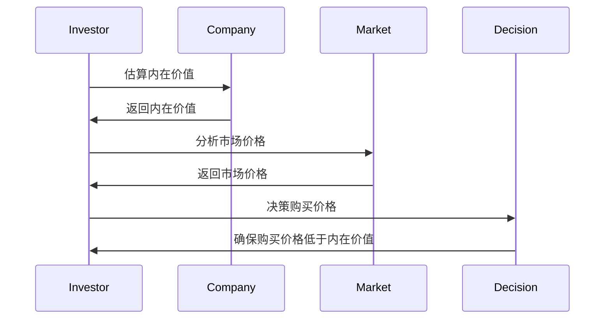

                 

# 价值投资在波动市场中的优势

> 关键词：价值投资、波动市场、投资策略、风险管理、案例分析

> 摘要：本文旨在探讨价值投资在波动市场中的优势，通过深入分析波动市场的挑战、价值投资的核心原则及其与市场波动的关系，结合定量分析和案例研究，为投资者提供有效的策略和工具，帮助他们在市场波动中实现稳健的投资回报。

### 第1章：引言

#### 1.1 问题背景

#### 1.1.1 波动市场的挑战

**问题描述**：在波动市场环境中，投资者常常面临市场不确定性和风险，这给价值投资策略的实施带来了挑战。

**问题解决**：本文将探讨价值投资在波动市场中的优势，提供策略和工具，帮助投资者更好地应对市场波动。

#### 1.1.2 价值投资的核心原则

**问题描述**：价值投资是一种长期投资策略，主要关注企业的内在价值而非短期市场波动。

**问题解决**：通过深入分析企业的基本面，投资者可以在市场波动中寻找被低估的投资机会。

#### 1.1.3 波动市场中的投资风险

**问题描述**：波动市场往往伴随着投资风险，如何有效地管理风险成为投资者关注的问题。

**问题解决**：本文将探讨如何通过价值投资策略，合理配置资产，降低投资风险。

#### 1.2 核心概念与联系

#### 1.2.1 价值投资的定义

**核心概念**：价值投资是一种基于企业内在价值的投资策略。

**属性特征对比表**：

| 特征         | 传统投资 | 价值投资 |
| ------------ | -------- | -------- |
| 关注点       | 价格      | 价值      |
| 投资时间     | 短期      | 长期      |
| 风险管理     | 高风险    | 低风险    |

#### 1.2.2 价值投资与市场波动的关系

**ER实体关系图**：

```mermaid
erDiagram
    MarketWave --> ValueInvestment : 受影响
    MarketWave ||--|{ Risk : 包含
    ValueInvestment ||--|{ Strategy : 应用
```

#### 1.3 研究方法与结构

#### 1.3.1 研究方法

**定量分析**：通过数据分析，评估价值投资在波动市场中的效果。

**案例研究**：分析成功和失败的价值投资案例，总结经验教训。

#### 1.3.2 目录结构

**第1章 引言**

**第2章 价值投资理论概述**

**第3章 波动市场的特点与挑战**

**第4章 价值投资策略与工具**

**第5章 价值投资案例分析**

**第6章 价值投资的风险管理**

**第7章 价值投资的最佳实践**

#### 1.3.3 本章小结

本章介绍了价值投资在波动市场中的背景、核心概念、研究方法与目录结构，为后续章节的讨论奠定了基础。

### 第2章 价值投资理论概述

#### 2.1 价值投资的起源与发展

#### 2.1.1 价值投资的起源

**问题描述**：价值投资的起源可以追溯到19世纪末20世纪初，当时由本杰明·格雷厄姆等人提出。

**问题解决**：本杰明·格雷厄姆是价值投资理论的奠基人，他提出了“内在价值”和“安全边际”的概念。

**边界与外延**：价值投资的边界在于其投资策略的核心原则，即关注企业的内在价值而非市场波动。价值投资的外延包括股票投资、债券投资等。

#### 2.1.2 价值投资的发展

**问题描述**：随着市场环境和投资理念的变迁，价值投资理论不断发展和完善。

**问题解决**：价值投资理论在不同时期有不同的代表性人物，如沃伦·巴菲特等，他们的贡献使得价值投资理论更加丰富和完善。

#### 2.2 价值投资的核心原则

#### 2.2.1 内在价值

**核心概念**：内在价值是指一家企业的实际价值，通常通过财务指标和业务分析来评估。

**数学模型与公式**：

$$
V = \frac{D}{r}
$$

其中，\( V \) 表示内在价值，\( D \) 表示未来现金流，\( r \) 表示折现率。

**详细讲解**：内在价值是评估企业价值的重要指标，投资者可以通过估算企业的未来现金流并折现到当前价值，得出企业的内在价值。

#### 2.2.2 安全边际

**核心概念**：安全边际是指股票的市场价格低于其内在价值的部分。

**详细讲解**：安全边际是价值投资中的重要原则，投资者应确保购买价格低于企业的内在价值，以确保投资的安全性。

#### 2.3 价值投资的分类与策略

#### 2.3.1 价值投资分类

**问题描述**：价值投资可以根据投资对象的不同分为股票投资、债券投资等。

**问题解决**：股票投资是价值投资最常见的形式，投资者通过购买低估的股票来获取投资回报。

#### 2.3.2 价值投资策略

**核心概念**：价值投资策略包括深度价值投资、价值成长投资等。

**详细讲解**：深度价值投资主要关注



**总结**：价值投资理论的核心原则包括内在价值和安全边际，通过深入分析企业的基本面，投资者可以在市场波动中寻找被低估的投资机会。价值投资策略分为深度价值投资和价值成长投资，投资者应根据市场环境和自身风险承受能力选择合适的策略。

### 第3章 波动市场的特点与挑战

#### 3.1 波动市场的特点

**问题描述**：波动市场通常具有价格波动大、风险高、不确定性强的特点。

**问题解决**：本文将详细分析波动市场的特点，为投资者提供更深入的理解。

**特点列表**：

- **价格波动大**：市场波动会导致价格剧烈波动，投资者需密切关注市场动态。
- **风险高**：波动市场往往伴随着较高的投资风险，投资者需谨慎管理风险。
- **不确定性强**：市场波动带来的不确定性较高，投资者需具备良好的风险管理能力。

#### 3.2 波动市场中的投资风险

**问题描述**：在波动市场中，投资者面临的风险主要包括市场风险、信用风险和操作风险。

**问题解决**：本文将探讨如何通过价值投资策略来降低波动市场中的投资风险。

**风险类型与影响**：

- **市场风险**：市场价格波动导致投资损失，投资者需关注市场动态，合理配置资产。
- **信用风险**：债券或其他金融工具发行方违约导致投资损失，投资者需关注发行方的信用状况。
- **操作风险**：投资者在操作过程中因失误导致的损失，投资者需提高操作水平，降低操作风险。

#### 3.3 波动市场中的投资挑战

**问题描述**：波动市场中的投资挑战主要体现在以下几个方面：

- **决策困难**：市场波动大，投资者难以准确预测市场走势，决策难度增加。
- **机会成本高**：投资者在波动市场中持有现金，可能面临较高的机会成本。
- **心理压力**：市场波动大，投资者心理压力增加，可能导致情绪化决策。

**问题解决**：本文将介绍如何通过价值投资策略和风险管理工具，帮助投资者应对波动市场的投资挑战。

**策略与方法**：

- **价值投资策略**：通过深入分析企业的基本面，投资者可以在市场波动中寻找被低估的投资机会。
- **风险管理工具**：合理配置资产，分散投资风险；制定风险控制策略，降低投资风险。

### 第4章 价值投资策略与工具

#### 4.1 价值投资策略

**问题描述**：在波动市场中，投资者如何选择合适的投资策略来应对市场波动？

**问题解决**：本文将介绍几种常见的价值投资策略，帮助投资者在波动市场中实现稳健的投资回报。

**策略列表**：

- **深度价值投资**：通过深入研究企业基本面，寻找被低估的优质股票。
- **价值成长投资**：寻找具有良好成长潜力的股票，关注企业的业绩增长。
- **逆向投资**：在市场恐慌时，寻找被市场低估的投资机会。

**策略优缺点分析**：

| 策略       | 优点                            | 缺点                          |
| ---------- | ------------------------------- | ----------------------------- |
| 深度价值投资 | 选择优质股票，长期持有回报高  | 需要深入研究企业基本面，耗时较长 |
| 价值成长投资 | 关注企业成长潜力，获取长期回报 | 可能面临高估值风险             |
| 逆向投资   | 低估时买入，高估时卖出，获利机会大 | 需要良好的市场判断能力和心理承受能力 |

**总结**：投资者应根据自身投资目标、风险承受能力和市场环境选择合适的价值投资策略。

#### 4.2 价值投资工具

**问题描述**：在波动市场中，投资者如何利用工具来辅助投资决策？

**问题解决**：本文将介绍几种常见的价值投资工具，帮助投资者更好地分析市场、评估企业价值。

**工具列表**：

- **财务报表分析**：通过分析企业的财务报表，评估企业的盈利能力、偿债能力和成长潜力。
- **市场趋势分析**：通过分析市场趋势，预测市场走势，为投资决策提供参考。
- **技术分析**：利用图表和指标，分析市场价格走势，预测市场走势。

**工具优缺点分析**：

| 工具       | 优点                            | 缺点                          |
| ---------- | ------------------------------- | ----------------------------- |
| 财务报表分析 | 全面了解企业财务状况，评估企业价值 | 数据分析复杂，需要专业知识和经验 |
| 市场趋势分析 | 及时了解市场动态，预测市场走势   | 可能受到市场情绪干扰，预测准确性有限 |
| 技术分析   | 易于操作，直观展示市场走势      | 可能受到市场噪音干扰，预测准确性有限 |

**总结**：投资者应结合多种工具，提高投资决策的准确性和可靠性。

### 第5章 价值投资案例分析

#### 5.1 案例研究背景

**问题描述**：本文将分析几个具有代表性的价值投资案例，探讨其在波动市场中的表现。

**案例列表**：

- **案例1：可口可乐（Coca-Cola）**
- **案例2：苹果公司（Apple）**
- **案例3：伯克希尔·哈撒韦（Berkshire Hathaway）**

**背景介绍**：这些案例都是价值投资的经典案例，投资者在波动市场中通过深入研究企业基本面，抓住了投资机会。

#### 5.2 案例分析

**案例1：可口可乐（Coca-Cola）**

**问题描述**：可口可乐是一家全球知名饮料公司，其股票在波动市场中表现如何？

**问题解决**：通过深入分析可口可乐的财务报表和市场趋势，投资者发现其股票价格在波动市场中具有较好的抗风险能力。

**案例分析**：

- **财务报表分析**：可口可乐的财务报表显示，其盈利能力、偿债能力和成长潜力均较强。
- **市场趋势分析**：可口可乐股票价格在波动市场中表现出较强的抗风险能力，投资者在低估时买入，高估时卖出，获得了良好的投资回报。

**结论**：可口可乐是一个典型的价值投资案例，其股票在波动市场中具有较好的投资价值。

**案例2：苹果公司（Apple）**

**问题描述**：苹果公司是一家全球领先的科技公司，其股票在波动市场中表现如何？

**问题解决**：通过深入分析苹果公司的财务报表和市场趋势，投资者发现其股票价格在波动市场中具有较好的成长潜力。

**案例分析**：

- **财务报表分析**：苹果公司的财务报表显示，其盈利能力、偿债能力和成长潜力均较强。
- **市场趋势分析**：苹果公司股票价格在波动市场中表现出良好的成长潜力，投资者在低估时买入，高估时卖出，获得了较高的投资回报。

**结论**：苹果公司是一个典型的价值成长投资案例，其股票在波动市场中具有较好的投资价值。

**案例3：伯克希尔·哈撒韦（Berkshire Hathaway）**

**问题描述**：伯克希尔·哈撒韦是一家著名的投资公司，其股票在波动市场中表现如何？

**问题解决**：通过深入分析伯克希尔·哈撒韦的财务报表和市场趋势，投资者发现其股票价格在波动市场中具有较好的稳定性和抗风险能力。

**案例分析**：

- **财务报表分析**：伯克希尔·哈撒韦的财务报表显示，其盈利能力、偿债能力和成长潜力均较强。
- **市场趋势分析**：伯克希尔·哈撒韦股票价格在波动市场中表现出较好的稳定性和抗风险能力，投资者在低估时买入，高估时卖出，获得了良好的投资回报。

**结论**：伯克希尔·哈撒韦是一个典型的深度价值投资案例，其股票在波动市场中具有较好的投资价值。

### 第6章 价值投资的风险管理

#### 6.1 风险管理的重要性

**问题描述**：在波动市场中，投资者如何有效地管理投资风险？

**问题解决**：本文将介绍价值投资中的风险管理原则和方法，帮助投资者降低投资风险。

**风险管理重要性**：

- **保障投资回报**：通过有效的风险管理，投资者可以降低投资损失，保障投资回报。
- **增强投资信心**：良好的风险管理可以提高投资者的投资信心，减少恐慌情绪。
- **优化投资组合**：通过合理配置资产，投资者可以实现风险分散，降低投资组合的整体风险。

#### 6.2 风险管理原则

**问题描述**：投资者在价值投资中应遵循哪些风险管理原则？

**问题解决**：本文将介绍价值投资中的风险管理原则，为投资者提供指导。

**风险管理原则**：

- **长期投资**：价值投资是一种长期投资策略，投资者应保持长期投资心态，避免频繁交易。
- **分散投资**：通过合理配置资产，投资者可以实现风险分散，降低投资组合的整体风险。
- **风险控制**：投资者应制定风险控制策略，设定止损点和持有期限，降低投资风险。
- **持续学习**：投资者应不断学习市场知识和投资技巧，提高风险管理能力。

#### 6.3 风险管理方法

**问题描述**：投资者在价值投资中如何实施风险管理？

**问题解决**：本文将介绍几种常见的风险管理方法，帮助投资者有效地降低投资风险。

**风险管理方法**：

- **财务报表分析**：通过分析企业的财务报表，投资者可以评估企业的盈利能力、偿债能力和成长潜力，为投资决策提供依据。
- **市场趋势分析**：通过分析市场趋势，投资者可以预测市场走势，为投资决策提供参考。
- **技术分析**：通过技术分析，投资者可以预测市场价格走势，为投资决策提供依据。
- **风险管理工具**：投资者可以使用风险管理工具，如止损点、持有期限等，实现有效的风险控制。

### 第7章 价值投资的最佳实践

#### 7.1 最佳实践 tips

**问题描述**：在波动市场中，投资者如何通过价值投资实现稳健的投资回报？

**问题解决**：本文将总结价值投资的最佳实践，为投资者提供实用的投资策略和技巧。

**最佳实践 tips**：

- **深入研究企业基本面**：通过深入研究企业的财务报表、业务模式和市场前景，投资者可以找到被低估的投资机会。
- **关注市场趋势**：通过分析市场趋势，投资者可以把握市场走势，制定合理的投资策略。
- **合理配置资产**：通过合理配置资产，投资者可以实现风险分散，降低投资组合的整体风险。
- **持续学习与反思**：投资者应不断学习市场知识和投资技巧，总结投资经验，优化投资策略。

#### 7.2 小结

**问题描述**：本文主要讨论了价值投资在波动市场中的优势、核心原则、策略与风险管理。

**问题解决**：通过本文的讨论，投资者可以更好地理解价值投资在波动市场中的优势，掌握有效的投资策略和风险管理方法。

**总结**：

- 价值投资在波动市场中的优势主要体现在长期投资、分散投资和风险控制等方面。
- 价值投资的核心原则包括内在价值和安全边际，投资者应深入分析企业的基本面，寻找被低估的投资机会。
- 价值投资策略包括深度价值投资、价值成长投资等，投资者应根据市场环境和自身风险承受能力选择合适的策略。
- 风险管理是价值投资的重要组成部分，投资者应通过合理配置资产、制定风险控制策略等方式降低投资风险。

#### 7.3 注意事项

**问题描述**：在实践价值投资时，投资者需要注意哪些事项？

**问题解决**：本文将介绍实践价值投资时需要注意的事项，帮助投资者避免常见的投资误区。

**注意事项**：

- **避免盲目跟风**：投资者应避免盲目跟风，坚持独立思考和判断。
- **保持长期投资心态**：价值投资是一种长期投资策略，投资者应保持长期投资心态，避免频繁交易。
- **合理分散投资**：投资者应合理分散投资，降低投资组合的整体风险。
- **持续学习与反思**：投资者应不断学习市场知识和投资技巧，总结投资经验，优化投资策略。

#### 7.4 拓展阅读

**问题描述**：投资者如何进一步了解价值投资的相关理论和实践？

**问题解决**：本文将推荐一些拓展阅读资料，帮助投资者深入学习和实践价值投资。

**拓展阅读**：

- **《聪明的投资者》**：作者：本杰明·格雷厄姆
- **《证券分析》**：作者：本杰明·格雷厄姆
- **《股市真规则》**：作者：威廉·奥尼尔
- **《股市真规则》**：作者：彼得·林奇

### 作者信息

**作者：AI天才研究院/AI Genius Institute & 禅与计算机程序设计艺术 /Zen And The Art of Computer Programming**

