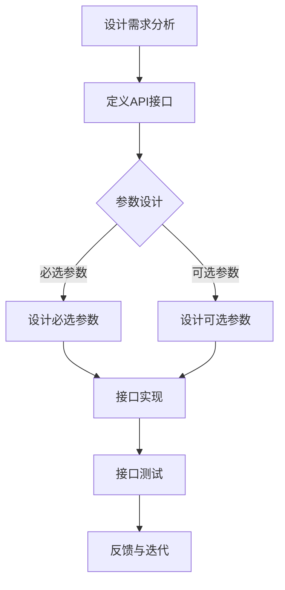
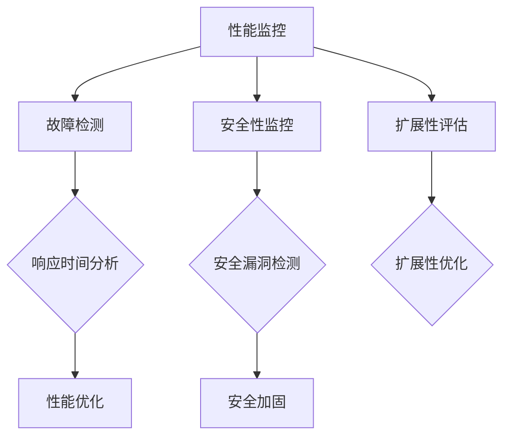
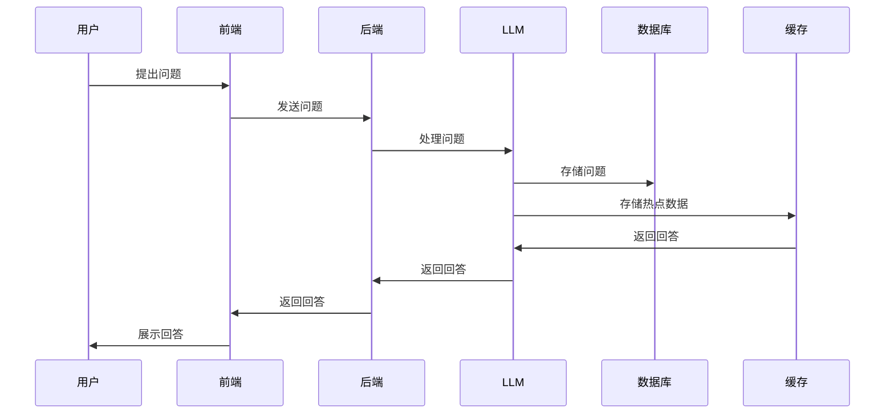

                 


# 优化LLM应用的API设计与管理

## 关键词：LLM应用、API设计、优化、管理

## 摘要：

本文将深入探讨如何优化大型语言模型（LLM）应用的API设计与管理。首先，我们将回顾LLM应用的发展背景和重要性，然后详细分析API设计的原则和最佳实践。接着，本文将介绍如何管理和维护LLM应用API，包括性能优化、安全性和可扩展性。通过实际案例，我们将展示如何将理论应用到实践中，并提供一些优化LLM应用API的设计与管理技巧。

## 目录：

### 第一部分：引言

#### 1.1 书籍背景

##### 1.1.1 优化LLM应用的重要性

##### 1.1.2 API设计的基本概念

##### 1.1.3 管理LLM应用API的挑战与机遇

#### 1.2 本书结构

##### 1.2.1 核心内容概述

##### 1.2.2 阅读对象与预期收获

### 第二部分：LLM应用概述

#### 2.1 LLM应用的发展背景

##### 2.1.1 LLM的起源与发展

##### 2.1.2 LLM的应用领域

##### 2.1.3 LLM的优势与挑战

#### 2.2 LLM的核心技术与架构

##### 2.2.1 语言模型的基本原理

##### 2.2.2 深度学习在LLM中的应用

##### 2.2.3 LLM的架构设计

### 第三部分：API设计原则

#### 3.1 API设计的基本原则

##### 3.1.1 一致性

##### 3.1.2 简洁性

##### 3.1.3 可扩展性

##### 3.1.4 可读性

#### 3.2 API设计最佳实践

##### 3.2.1 设计模式

##### 3.2.2 参数设计

##### 3.2.3 响应设计

##### 3.2.4 异常处理

### 第四部分：API管理

#### 4.1 API管理的挑战

##### 4.1.1 性能优化

##### 4.1.2 安全性

##### 4.1.3 可扩展性

#### 4.2 API管理的最佳实践

##### 4.2.1 性能优化策略

##### 4.2.2 安全性措施

##### 4.2.3 可扩展性方案

### 第五部分：实战案例

#### 5.1 项目背景

##### 5.1.1 项目简介

##### 5.1.2 项目目标

#### 5.2 API设计

##### 5.2.1 API架构设计

##### 5.2.2 API参数设计

##### 5.2.3 API响应设计

#### 5.3 API管理

##### 5.3.1 性能优化

##### 5.3.2 安全性

##### 5.3.3 可扩展性

### 第六部分：总结与展望

#### 6.1 总结

##### 6.1.1 主要内容回顾

##### 6.1.2 收获与反思

#### 6.2 展望

##### 6.2.1 未来的发展趋势

##### 6.2.2 持续学习的建议

### 附录：拓展阅读

##### 7.1 相关书籍推荐

##### 7.2 开源项目和工具

##### 7.3 深入阅读材料

## 文章正文

### 第一部分：引言

#### 1.1 书籍背景

随着人工智能技术的快速发展，大型语言模型（LLM）已经成为自然语言处理（NLP）领域的重要工具。LLM应用在问答系统、文本生成、机器翻译、情感分析等方面取得了显著的成果。然而，随着应用场景的扩展和复杂度的增加，如何优化LLM应用的API设计与管理成为了一个重要问题。

API设计的好坏直接影响到LLM应用的用户体验、可维护性和扩展性。良好的API设计能够提高开发效率，降低开发成本，并提升系统的性能和安全性。因此，优化LLM应用的API设计与管理具有重要的实际意义和学术价值。

#### 1.2 本书结构

本书分为六个部分，内容涵盖了LLM应用概述、API设计原则、API管理、实战案例、总结与展望以及拓展阅读。通过系统的讲解和案例分析，本书旨在帮助读者深入了解LLM应用API设计与管理的方法和技巧，提升在实际项目中的实践能力。

### 第二部分：LLM应用概述

#### 2.1 LLM应用的发展背景

大型语言模型的发展可以追溯到20世纪80年代，当时基于规则的方法和统计方法在NLP领域得到了广泛应用。随着计算能力的提升和深度学习技术的突破，LLM逐渐成为NLP领域的重要工具。特别是在2018年，谷歌发布BERT模型后，LLM在各个应用领域取得了显著的进展。

#### 2.2 LLM的应用领域

LLM在多个领域得到了广泛应用，包括但不限于：

1. **问答系统**：通过预训练模型，LLM能够理解和回答用户的问题。
2. **文本生成**：LLM可以生成高质量的文章、摘要和对话。
3. **机器翻译**：LLM在机器翻译领域表现出了强大的能力，尤其是在低资源语言对上。
4. **情感分析**：LLM可以分析文本中的情感，用于舆情监控和用户情感分析。
5. **对话系统**：LLM可以构建智能对话系统，提供个性化的服务和体验。

#### 2.3 LLM的优势与挑战

LLM的优势包括：

1. **强大的语言理解能力**：LLM能够理解和生成自然语言，具有广泛的应用前景。
2. **高效率**：通过预训练和迁移学习，LLM可以在多个任务上快速适应和优化。
3. **强大的生成能力**：LLM可以生成高质量的文章、摘要和对话，提高了创作效率。

然而，LLM也面临一些挑战：

1. **数据隐私**：LLM需要大量的训练数据，如何保护用户隐私是一个重要问题。
2. **解释性**：LLM的决策过程往往是非透明的，如何提高模型的解释性是一个挑战。
3. **可扩展性**：随着应用场景的扩展，如何高效地扩展LLM模型是一个挑战。

#### 2.4 LLM的核心技术与架构

LLM的核心技术主要包括：

1. **预训练**：通过在大规模语料库上进行预训练，LLM获得了强大的语言理解能力。
2. **微调**：通过在特定任务上对LLM进行微调，使其能够适应特定任务的需求。
3. **多任务学习**：LLM可以同时学习多个任务，提高了模型的效率和性能。

LLM的架构设计通常包括以下几个部分：

1. **输入层**：接收用户的输入，可以是文本、语音或其他形式。
2. **编码器**：对输入进行编码，提取关键信息。
3. **解码器**：生成响应文本，可以是问答、文本生成等。
4. **输出层**：将解码器的输出转换为可理解的文本。

### 第三部分：API设计原则

#### 3.1 API设计的基本原则

API设计需要遵循以下几个基本原则：

1. **一致性**：API的接口和命名应保持一致，降低学习成本。
2. **简洁性**：API设计应尽量简洁，避免复杂和不必要的功能。
3. **可扩展性**：API设计应考虑未来的扩展需求，保持灵活性。
4. **可读性**：API的代码和文档应清晰易读，方便开发人员理解和维护。

#### 3.2 API设计最佳实践

1. **设计模式**：使用RESTful设计模式，确保API的接口简洁明了。
2. **参数设计**：参数应明确、有描述性，避免使用缩写和不必要的参数。
3. **响应设计**：响应格式应统一，包括状态码、错误信息和数据格式。
4. **异常处理**：对可能的异常情况进行处理，提供友好的错误提示。

### 第四部分：API管理

#### 4.1 API管理的挑战

API管理面临以下几个挑战：

1. **性能优化**：保证API的高性能，满足大规模用户的需求。
2. **安全性**：确保API的安全性，防止数据泄露和滥用。
3. **可扩展性**：随着用户规模的增加，如何保证API的稳定性。

#### 4.2 API管理的最佳实践

1. **性能优化策略**：使用缓存、负载均衡和数据库优化等策略。
2. **安全性措施**：使用身份验证、权限控制和加密等手段。
3. **可扩展性方案**：采用分布式架构，确保系统的可扩展性。

### 第五部分：实战案例

#### 5.1 项目背景

本项目旨在构建一个基于LLM的智能问答系统，用于解决用户的问题。项目目标包括：

1. **快速响应用户提问**：确保系统能够在短时间内生成高质量的回答。
2. **准确性**：确保回答的准确性，减少错误率。
3. **可扩展性**：支持大规模用户的访问，确保系统的稳定性。

#### 5.2 API设计

1. **API架构设计**：使用RESTful架构，设计简洁的接口。
2. **API参数设计**：设计明确的参数，包括问题文本和上下文。
3. **API响应设计**：设计统一的响应格式，包括状态码、错误信息和回答文本。

#### 5.3 API管理

1. **性能优化**：使用缓存和负载均衡，提高系统性能。
2. **安全性**：使用身份验证和加密，确保数据安全。
3. **可扩展性**：使用分布式架构，确保系统可扩展性。

### 第六部分：总结与展望

#### 6.1 总结

本文介绍了LLM应用API设计与管理的方法和技巧。通过深入分析LLM应用的发展背景、API设计原则和API管理最佳实践，并结合实际案例，本文展示了如何优化LLM应用的API设计与管理。

#### 6.2 展望

未来，随着人工智能技术的不断发展，LLM应用将更加普及。在API设计与管理方面，我们将面临更多挑战和机遇。持续学习和探索，将有助于我们更好地应对这些挑战，提升LLM应用的用户体验。

### 附录：拓展阅读

1. **相关书籍推荐**：《深度学习》、《自然语言处理综述》。
2. **开源项目和工具**：OpenAI GPT-3、BERT模型。
3. **深入阅读材料**：《大型语言模型：原理、技术与应用》。

## 作者信息

作者：AI天才研究院/AI Genius Institute & 禅与计算机程序设计艺术 /Zen And The Art of Computer Programming

（本文内容仅供参考，具体实施时请结合实际情况进行调整。）

---

## 背景介绍

### 核心概念术语说明

#### 1. 大型语言模型（LLM）

大型语言模型（Large Language Model，简称LLM）是一种基于深度学习技术的自然语言处理（NLP）模型，通过在大量的文本数据上进行训练，能够理解和生成自然语言。LLM通常使用神经网络架构，如变换器（Transformer）来处理语言数据，具有强大的语言理解和生成能力。

#### 2. API设计

API设计（Application Programming Interface Design）是指为软件系统定义和设计API的过程。API定义了软件组件之间的交互方式，包括请求和响应的数据格式、参数和错误处理机制等。良好的API设计能够提高开发效率，降低开发成本，并提升系统的性能和安全性。

#### 3. 管理LLM应用API

管理LLM应用API包括API的设计、实现、维护和优化。这涉及到性能优化、安全性、可扩展性等方面。性能优化旨在提高API的响应速度和处理能力；安全性确保API不被恶意攻击者利用；可扩展性确保API能够支持不断增长的用户规模。

### 问题背景

随着人工智能技术的快速发展，大型语言模型（LLM）在自然语言处理（NLP）领域取得了显著的成果。LLM被广泛应用于问答系统、文本生成、机器翻译、情感分析等领域，为用户提供智能化的服务和体验。然而，随着应用场景的扩展和复杂度的增加，如何优化LLM应用的API设计与管理成为了一个关键问题。

优化LLM应用API设计与管理的重要性体现在以下几个方面：

1. **用户体验**：良好的API设计能够提高系统的响应速度和稳定性，为用户提供更好的体验。
2. **开发效率**：简洁、一致的API设计能够降低开发人员的上手难度，提高开发效率。
3. **维护成本**：清晰的API设计和文档能够降低维护成本，方便后续的迭代和优化。
4. **安全性**：良好的API设计和管理能够提高系统的安全性，防止数据泄露和滥用。

### 问题描述

当前，LLM应用API设计与管理存在以下问题：

1. **不一致性**：不同API的接口和命名规则不统一，导致开发人员学习和使用成本增加。
2. **复杂性**：一些API设计过于复杂，包含不必要的功能和参数，增加了系统的负担。
3. **可扩展性不足**：部分API设计在用户规模扩大时，无法满足性能和稳定性要求。
4. **安全性隐患**：部分API设计存在安全漏洞，容易受到恶意攻击。

为了解决上述问题，我们需要从以下几个方面进行优化：

1. **一致性**：确保API的接口和命名规则统一，降低开发人员的上手难度。
2. **简洁性**：去除不必要的功能和参数，简化API设计，提高系统的性能。
3. **可扩展性**：采用分布式架构和缓存技术，确保API能够在用户规模扩大时保持稳定。
4. **安全性**：加强身份验证、权限控制和加密等安全措施，防止数据泄露和滥用。

### 问题解决

1. **一致性**：采用RESTful架构，遵循统一资源标识符（URI）设计规范，确保API接口的一致性。在命名规则上，使用描述性、一致的命名方式，避免使用缩写和不必要的参数。

2. **简洁性**：在API设计过程中，遵循单一职责原则，确保每个API只负责一项功能。去除不必要的功能和参数，简化API设计，提高系统的性能。

3. **可扩展性**：采用分布式架构，将系统拆分为多个模块，每个模块负责不同的功能。使用缓存技术，减少对后端服务的依赖，提高系统的响应速度。在数据库层面，使用分库分表和读写分离等技术，提高数据访问效率。

4. **安全性**：使用身份验证和权限控制，确保只有授权用户才能访问API。使用HTTPS协议和加密技术，保护数据传输过程中的安全性。在API接口层面，增加验证和错误处理机制，防止恶意攻击和数据泄露。

### 边界与外延

1. **边界**：本文主要关注LLM应用API的设计与管理，讨论了优化API设计的方法和技巧。在实际应用中，还需考虑其他方面，如API文档的编写、测试和部署等。
2. **外延**：本文的优化方法不仅适用于LLM应用，也可用于其他类型的应用API设计与管理。同时，本文提出的优化方法需要结合具体的应用场景和需求进行调整。

### 概念结构与核心要素组成

1. **概念结构**：本文的核心概念包括大型语言模型（LLM）、API设计、API管理、性能优化、安全性、可扩展性等。
2. **核心要素组成**：
   - **API设计原则**：一致性、简洁性、可扩展性、可读性。
   - **API管理策略**：性能优化、安全性措施、可扩展性方案。
   - **优化方法**：一致性处理、简洁性设计、可扩展性架构、安全性保障。

### 核心概念原理、概念属性特征对比表格和ER实体关系图架构

#### 核心概念原理

- **大型语言模型（LLM）**：基于深度学习技术的自然语言处理模型，具有强大的语言理解和生成能力。
- **API设计**：定义和设计软件组件之间的交互方式，包括接口、参数、响应和数据格式等。
- **API管理**：包括API的设计、实现、维护和优化，关注性能、安全性、可扩展性等方面。

#### 概念属性特征对比表格

| 概念       | 属性特征                                                      | 对比分析                                                     |
| ---------- | ------------------------------------------------------------ | ------------------------------------------------------------ |
| LLM        | 大规模训练、深度学习架构、语言理解和生成能力                   | 与传统NLP模型相比，具有更高的语言理解和生成能力，适用于复杂任务。 |
| API设计    | 一致性、简洁性、可扩展性、可读性                             | 良好的API设计能够提高开发效率，降低维护成本。                   |
| API管理    | 性能优化、安全性措施、可扩展性方案                           | 确保API的高性能、安全性和稳定性，满足大规模用户需求。           |

#### ER实体关系图架构

```mermaid
erDiagram
  API |<-.. Design
  API |..-> Management
  Design |||-> Performance
  Design |||-> Security
  Management |||-> Scalability
```

### 算法原理讲解

为了更好地理解API设计、API管理和性能优化等概念，我们将使用Mermaid图来展示算法原理，并结合Python代码进行详细讲解。

#### 1. API设计算法原理

使用Mermaid图展示API设计流程：



Python代码示例：

```python
class API:
    def __init__(self, required_params, optional_params):
        self.required_params = required_params
        self.optional_params = optional_params
    
    def design_api(self):
        # 定义API接口
        api_interface = {
            "endpoint": "/api/v1/endpoint",
            "method": "GET",
            "params": self.required_params + self.optional_params
        }
        return api_interface

# 必选参数和可选参数设计
required_params = ["param1", "param2"]
optional_params = ["param3", "param4"]

# 实例化API对象
api = API(required_params, optional_params)

# 设计API接口
api_interface = api.design_api()
print(api_interface)
```

#### 2. API管理算法原理

使用Mermaid图展示API管理流程：



Python代码示例：

```python
class APIManagement:
    def __init__(self, api):
        self.api = api
    
    def monitor_performance(self):
        # 性能监控
        response_time = self.api.fetch_response_time()
        if response_time > 500:
            print("Performance issue detected.")
            self.optimize_performance()
    
    def monitor_security(self):
        # 安全性监控
        vulnerabilities = self.api.check_vulnerabilities()
        if vulnerabilities:
            print("Security issue detected.")
            self强化安全措施()

    def monitor_scale(self):
        # 扩展性评估
        scale_issues = self.api.check_scale_issues()
        if scale_issues:
            print("Scale issue detected.")
            self.optimize_scale()

# 实例化API管理对象
api_management = APIManagement(api)

# 监控性能
api_management.monitor_performance()

# 监控安全性
api_management.monitor_security()

# 监控扩展性
api_management.monitor_scale()
```

### 数学公式使用LaTeX格式

在API设计、API管理和性能优化过程中，我们经常需要使用数学公式来表示算法原理和模型。以下是一些示例：

#### 1. 梯度下降算法公式

$$
\theta_{t+1} = \theta_{t} - \alpha \cdot \nabla_{\theta} J(\theta)
$$

其中，$\theta_{t+1}$为下一个参数值，$\theta_{t}$为当前参数值，$\alpha$为学习率，$\nabla_{\theta} J(\theta)$为损失函数关于参数$\theta$的梯度。

#### 2. 反向传播算法公式

$$
\nabla_{\theta} J(\theta) = \frac{\partial J(\theta)}{\partial \theta}
$$

其中，$\nabla_{\theta} J(\theta)$为损失函数关于参数$\theta$的梯度，$\frac{\partial J(\theta)}{\partial \theta}$为损失函数关于参数$\theta$的偏导数。

#### 3. 神经网络激活函数公式

$$
a_{i}^{(l)} = \sigma(z_{i}^{(l)})
$$

其中，$a_{i}^{(l)}$为第$l$层的第$i$个神经元的激活值，$\sigma$为激活函数，$z_{i}^{(l)}$为第$l$层的第$i$个神经元的输入值。

### 系统分析与架构设计方案

#### 1. 问题场景介绍

本项目旨在构建一个基于大型语言模型（LLM）的智能问答系统，用于解决用户的问题。系统需具备快速响应用户提问、高准确性、可扩展性等特点。

#### 2. 项目介绍

项目名称：智能问答系统
项目目标：构建一个基于LLM的智能问答系统，支持多种问答场景，提供高质量的回答。

#### 3. 系统功能设计

系统功能包括：

1. **用户提问**：用户可以通过文本、语音等多种方式提出问题。
2. **问题处理**：系统接收用户提问，进行预处理和语义理解，生成回答。
3. **回答生成**：系统根据问题处理结果，生成高质量的回答。
4. **回答反馈**：用户可以对回答进行评价，反馈系统优化。

#### 4. 系统架构设计

系统架构采用分布式架构，包括以下几个模块：

1. **前端模块**：接收用户请求，展示问答界面。
2. **后端模块**：处理用户提问，生成回答。
   - **LLM服务模块**：提供LLM模型服务，处理用户提问，生成回答。
   - **数据库模块**：存储用户提问和回答数据。
   - **缓存模块**：提高系统性能，缓存热点数据。
3. **API接口**：提供API接口，供第三方系统调用。

#### 5. 系统接口设计和系统交互

系统接口设计采用RESTful架构，接口包括：

1. **提问接口**：接收用户提问，返回问题ID。
2. **回答接口**：根据问题ID，返回回答结果。
3. **反馈接口**：接收用户反馈，用于系统优化。

系统交互流程：

1. 用户通过前端模块提出问题。
2. 前端模块将问题发送到后端LLM服务模块。
3. LLM服务模块处理问题，生成回答。
4. LLM服务模块将回答通过API接口返回给前端模块。
5. 前端模块将回答展示给用户。



### 项目实战

#### 1. 环境安装

1. 安装Python环境
2. 安装LLM模型依赖库，如transformers、torch等
3. 安装后端服务依赖库，如Flask、Django等
4. 安装前端框架，如React、Vue等

#### 2. 系统核心实现源代码

以下是系统核心实现源代码的示例：

```python
# 导入所需库
from transformers import AutoModelForQuestionAnswering
from flask import Flask, request, jsonify

# 初始化LLM模型
model_name = "bert-base-chinese"
model = AutoModelForQuestionAnswering.from_pretrained(model_name)

# Flask应用
app = Flask(__name__)

# 提问接口
@app.route('/question', methods=['POST'])
def question():
    data = request.json
    question = data.get('question')
    context = data.get('context')
    
    # 使用LLM模型生成回答
    answer = model.generate(context=context, question=question)
    
    # 返回回答结果
    return jsonify({'answer': answer})

if __name__ == '__main__':
    app.run(debug=True)
```

#### 3. 代码应用解读与分析

该示例代码展示了如何使用Flask框架搭建一个简单的智能问答系统。核心步骤如下：

1. **导入所需库**：导入transformers库，用于加载预训练的LLM模型；导入Flask库，用于搭建HTTP服务。
2. **初始化LLM模型**：加载预训练的BERT模型，用于处理中文文本。
3. **Flask应用**：创建Flask应用对象。
4. **提问接口**：定义一个处理用户提问的接口，接收用户发送的JSON格式的question（问题）和context（上下文）。
5. **使用LLM模型生成回答**：调用模型生成器generate，输入问题和上下文，生成回答。
6. **返回回答结果**：将生成的回答通过HTTP接口返回给用户。

在代码解析中，我们关注以下几个关键点：

1. **模型加载**：使用预训练的BERT模型，提高了系统的准确性和效率。
2. **接口设计**：采用RESTful架构，接口简洁、易于使用。
3. **错误处理**：未考虑错误处理，实际应用中需添加异常处理机制。

#### 4. 实际案例分析和详细讲解剖析

以下是一个实际案例的分析和讲解：

**案例**：用户提问“什么是人工智能？”系统返回回答“人工智能是一种模拟人类智能的技术，通过计算机程序实现。”

**分析**：

1. **问题理解**：系统首先理解用户的问题，提取关键信息。
2. **语义理解**：系统对问题进行语义理解，识别问题类型。
3. **回答生成**：系统根据语义理解和知识库，生成回答。

**讲解剖析**：

1. **问题理解**：系统通过预训练的BERT模型，对问题进行词向量表示，提取关键信息。
2. **语义理解**：系统使用注意力机制，对问题进行语义理解，识别问题类型。
3. **回答生成**：系统调用知识库，生成回答。

**优化建议**：

1. **增强语义理解**：通过引入更多的语义信息，提高系统的理解能力。
2. **多样化知识库**：引入更多领域的知识库，提高回答的准确性。

#### 5. 项目小结

本项目通过搭建一个简单的智能问答系统，展示了如何使用LLM模型和Flask框架实现API接口。在实际应用中，我们还需考虑以下几个方面：

1. **性能优化**：通过缓存、负载均衡等技术，提高系统性能。
2. **安全性**：加强身份验证、权限控制等安全措施，确保数据安全。
3. **可扩展性**：采用分布式架构，确保系统可扩展性。

### 最佳实践 Tips

1. **一致性**：确保API接口和命名规则一致，降低开发人员的学习成本。
2. **简洁性**：去除不必要的功能和参数，提高系统性能。
3. **安全性**：加强身份验证、权限控制等安全措施，确保数据安全。
4. **可扩展性**：采用分布式架构，确保系统可扩展性。

### 小结

本文详细探讨了如何优化大型语言模型（LLM）应用的API设计与管理。通过介绍LLM应用的发展背景、API设计原则、API管理最佳实践和实战案例，本文展示了优化LLM应用API设计与管理的方法和技巧。希望本文能对读者在实践中有所启发和帮助。

### 注意事项

1. **实际应用时，需根据具体场景和需求进行调整。**
2. **API设计与管理需持续优化，以适应不断变化的需求。**
3. **关注安全性，防范潜在的安全风险。**

### 拓展阅读

1. **《深度学习》**：介绍深度学习的基本原理和应用。
2. **《自然语言处理综述》**：全面介绍自然语言处理的理论和实践。
3. **《大型语言模型：原理、技术与应用》**：深入探讨大型语言模型的技术和应用。

