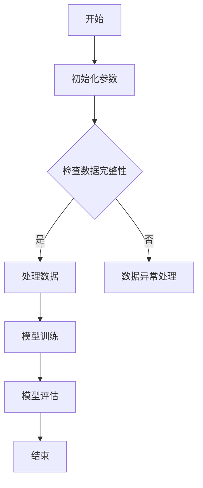

                 

### 文章标题：优化LLM应用的API设计与集成流程

#### 关键词：语言模型，API设计，集成流程，性能优化，安全性

#### 摘要：
本文旨在探讨如何优化大型语言模型（LLM）应用的API设计与集成流程。随着人工智能技术的迅猛发展，LLM在自然语言处理领域展现出巨大的潜力。然而，如何高效地设计API以支持LLM的应用，以及如何集成和优化LLM模型，成为开发者面临的重要课题。本文将分章节详细分析LLM基础、API设计原则、性能优化策略、集成与调优方法，并通过实际案例研究展示具体实现过程。文章最后总结最佳实践，为未来研究和应用提供参考。

## 目录大纲

### 第1章: 优化LLM应用的背景与重要性

#### 1.1 AI与LLM概述

#### 1.2 优化LLM应用的趋势与挑战

#### 1.3 优化LLM应用的重要性

#### 1.4 本书组织结构

### 第2章: LLM基础概念与架构

#### 2.1 LLM基础概念

#### 2.2 LLM架构

#### 2.3 LLM的工作原理

### 第3章: API设计与优化

#### 3.1 API设计原则

#### 3.2 API性能优化

#### 3.3 安全性与可靠性优化

### 第4章: LLM集成与调优

#### 4.1 LLM集成流程

#### 4.2 LLM调优策略

#### 4.3 模型性能评估

### 第5章: 实际案例研究

#### 5.1 案例一：聊天机器人

#### 5.2 案例二：内容生成

### 第6章: API设计与集成的最佳实践

#### 6.1 设计最佳实践

#### 6.2 集成最佳实践

### 第7章: 总结与展望

#### 7.1 书籍总结

#### 7.2 未来发展趋势

#### 7.3 进一步学习建议

## 第1章: 优化LLM应用的背景与重要性

### 1.1 AI与LLM概述

随着互联网和大数据的快速发展，人工智能（AI）已经成为现代科技的重要组成部分。AI技术通过模拟人类的智能行为，实现自动化决策、自然语言理解、图像识别等功能，极大地提高了生产效率和生活质量。在AI领域，语言模型（Language Model, LM）是一种重要的技术，它能够对自然语言文本进行建模，从而实现文本生成、翻译、摘要等多种应用。

语言模型的核心是预训练模型，如大型语言模型（Large Language Model，LLM），例如GPT-3、BERT等。这些模型基于深度学习技术，使用海量数据对神经网络进行训练，使其具备强大的语言理解与生成能力。LLM在自然语言处理（NLP）领域展现出巨大的潜力，广泛应用于问答系统、文本生成、对话系统等领域。

### 1.2 优化LLM应用的趋势与挑战

优化LLM应用的趋势主要包括以下几个方面：

1. **模型规模的扩大**：随着计算能力的提升，LLM模型规模不断扩大，从数百万参数到数十亿参数不等。模型规模增加，能够提高模型的表达能力和准确性，但也带来了更高的计算和存储需求。
2. **多模态融合**：除了文本，LLM也开始与图像、视频等多模态数据结合，实现更加丰富和智能的应用场景。例如，文本与图像的问答系统、视频摘要生成等。
3. **边缘计算**：为了降低延迟和节省带宽，LLM应用逐渐向边缘设备迁移。边缘计算能够提高实时响应能力，但同时也对模型的计算效率提出了更高的要求。

在优化LLM应用过程中，开发者面临以下挑战：

1. **性能优化**：LLM模型通常需要大量的计算资源，如何在不降低模型性能的情况下，优化API响应速度和资源利用率，是开发者需要解决的重要问题。
2. **安全性**：LLM应用涉及大量敏感数据，如何保证数据的安全性和隐私性，防止数据泄露和滥用，是开发者需要关注的关键点。
3. **可靠性**：在复杂和动态的应用环境中，如何确保LLM模型的稳定性和可靠性，避免出现意外错误和失效，是开发者面临的难题。

### 1.3 优化LLM应用的重要性

优化LLM应用的重要性体现在以下几个方面：

1. **用户体验**：高效的API设计和优化的集成流程能够提高系统的响应速度和稳定性，提供更好的用户体验。
2. **成本节约**：通过性能优化和资源利用率的提升，能够降低硬件成本和能源消耗，提高系统的经济效益。
3. **安全性提升**：完善的安全措施能够保护用户数据的安全，增强系统的可靠性和信任度。
4. **模型能力发挥**：优化的API和集成流程能够更好地发挥LLM模型的潜力，实现更广泛和深入的应用。

### 1.4 本书组织结构

本书分为七个章节，旨在系统性地探讨LLM应用的API设计与集成流程。具体章节安排如下：

- **第1章**：介绍优化LLM应用的背景与重要性，概述AI与LLM的基本概念。
- **第2章**：讲解LLM的基础概念和架构，包括语言模型的基本原理和工作机制。
- **第3章**：讨论API设计原则和优化方法，包括性能优化和安全性可靠性优化。
- **第4章**：介绍LLM的集成与调优流程，包括集成前期准备、模型部署和性能评估。
- **第5章**：通过实际案例研究，展示LLM应用的API设计与集成过程。
- **第6章**：总结API设计与集成的最佳实践，提供实用的设计技巧和调优方法。
- **第7章**：总结全书内容，展望未来发展趋势，为读者提供进一步学习的建议。

通过以上章节的逐一探讨，读者将能够系统地了解LLM应用的API设计与集成流程，掌握相关技术和方法，为实际应用提供有力支持。接下来，我们将深入探讨LLM的基础概念和架构，为后续内容奠定基础。## 第2章: LLM基础概念与架构

### 2.1 LLM基础概念

大型语言模型（LLM）是一种基于深度学习的自然语言处理模型，能够对自然语言文本进行建模，从而实现语言理解、生成和翻译等功能。LLM的核心是预训练模型，通过在大量数据上训练，模型能够自动学习语言结构和语义信息，从而提高模型的泛化能力和表达能力。

#### 语言模型介绍

语言模型是一种对自然语言文本进行概率预测的模型，其目标是给定一段文本序列，预测下一个单词或字符的概率分布。早期的语言模型如N-gram模型，通过统计相邻单词或字符的频率来计算概率。然而，这些模型在处理长文本和长距离依赖时表现不佳。

为了解决这些问题，深度学习技术被引入到语言模型中。基于深度学习的语言模型，如循环神经网络（RNN）、长短期记忆网络（LSTM）和Transformer，能够更好地捕捉文本中的长期依赖关系，从而提高模型的性能。

#### LLM的主要类型

LLM可以分为以下几种类型：

1. **基于RNN的语言模型**：循环神经网络（RNN）是一种能够处理序列数据的前馈神经网络，其内部状态能够在不同时间步之间传递信息。RNN在处理自然语言任务时表现良好，但容易受到梯度消失和梯度爆炸问题的影响。

2. **基于LSTM的语言模型**：长短期记忆网络（LSTM）是RNN的一种变体，通过引入门控机制来控制信息的流动，从而更好地捕捉长距离依赖。LSTM在处理长文本和长距离依赖时表现优于标准RNN。

3. **基于Transformer的语言模型**：Transformer是近年来提出的一种全新架构，通过自注意力机制（self-attention）来处理序列数据。Transformer在处理长文本和长距离依赖时表现出色，已成为当前主流的LLM架构。

4. **多模态语言模型**：多模态语言模型结合了文本、图像、视频等多模态数据，能够实现更广泛和智能的应用。例如，文本与图像的问答系统、视频摘要生成等。

### 2.2 LLM架构

LLM的架构可以分为两部分：编码器（Encoder）和解码器（Decoder）。编码器将输入文本序列编码为固定长度的向量表示，解码器则根据编码器的输出生成目标文本序列。

#### 深度神经网络

深度神经网络（DNN）是LLM的基础架构，通过堆叠多层神经网络，模型能够学习到更复杂的特征和表示。在DNN中，每个神经元都与前一层的所有神经元相连接，并通过激活函数进行非线性变换。

#### 循环神经网络

循环神经网络（RNN）是一种能够处理序列数据的神经网络，其内部状态能够在不同时间步之间传递信息。RNN通过递归连接实现信息传递，但在处理长距离依赖时容易受到梯度消失和梯度爆炸问题的影响。

#### 长短期记忆网络

长短期记忆网络（LSTM）是RNN的一种变体，通过引入门控机制来控制信息的流动，从而更好地捕捉长距离依赖。LSTM通过输入门、遗忘门和输出门控制信息的传递，从而解决梯度消失和梯度爆炸问题。

#### 生成对抗网络

生成对抗网络（GAN）是一种生成模型，由生成器和判别器两个部分组成。生成器生成假样本，判别器判断样本是真实还是假。通过训练生成器和判别器之间的对抗关系，生成器能够生成逼真的数据。

### 2.3 LLM的工作原理

LLM的工作原理可以分为以下几个步骤：

1. **输入编码**：输入文本序列被编码为固定长度的向量表示。通常，这个过程包括分词、词嵌入和位置编码等步骤。

2. **编码器处理**：编码器对输入文本序列进行处理，生成编码表示。编码器可以通过多层神经网络实现，如DNN、RNN或LSTM。

3. **解码器生成**：解码器根据编码器的输出生成目标文本序列。解码器通常采用自回归的方式，逐个生成每个单词或字符。

4. **损失函数优化**：模型通过最小化损失函数来优化参数。常用的损失函数包括交叉熵损失和均方误差损失。

5. **预测与生成**：在训练完成后，模型可以根据输入文本生成新的文本。生成过程可以通过解码器实现，也可以结合生成对抗网络（GAN）进行优化。

### 2.3.1 语言建模与概率计算

语言建模的目标是预测给定文本序列的概率分布。在LLM中，通过编码器生成的编码表示可以看作是文本序列的概率分布。具体来说，对于输入文本序列\( x_1, x_2, \ldots, x_T \)，LLM的目标是预测下一个单词或字符\( x_{T+1} \)的概率分布\( P(x_{T+1} | x_1, x_2, \ldots, x_T) \)。

在计算概率分布时，可以使用以下公式：

\[ P(x_{T+1} | x_1, x_2, \ldots, x_T) = \frac{P(x_1, x_2, \ldots, x_T, x_{T+1})}{P(x_1, x_2, \ldots, x_T)} \]

其中，\( P(x_1, x_2, \ldots, x_T, x_{T+1}) \)表示输入文本序列和目标单词或字符的联合概率，\( P(x_1, x_2, \ldots, x_T) \)表示输入文本序列的概率。

### 2.3.2 生成与预测

生成与预测是LLM应用中的核心功能。在生成过程中，模型根据编码器生成的编码表示，逐个生成目标文本序列的每个单词或字符。具体步骤如下：

1. **初始化**：首先，初始化解码器的初始状态，通常使用编码器输出的最后一个隐藏状态作为初始输入。

2. **生成过程**：在每次生成过程中，解码器根据当前输入和隐藏状态，预测下一个单词或字符的概率分布。然后，从概率分布中采样一个单词或字符作为当前输出，并更新隐藏状态。

3. **迭代**：重复生成过程，直到生成完整的文本序列或达到预设的生成长度。

在预测过程中，模型根据输入文本序列，生成目标文本序列的概率分布。具体步骤如下：

1. **输入编码**：将输入文本序列编码为编码器输出的固定长度向量表示。

2. **编码器处理**：编码器对输入文本序列进行处理，生成编码表示。

3. **解码器生成**：解码器根据编码表示生成目标文本序列的概率分布。

4. **输出概率分布**：根据解码器生成的概率分布，输出目标文本序列的概率分布。

通过以上步骤，LLM能够实现文本的生成和预测功能，从而应用于自然语言处理的各种任务。

### 总结

本章介绍了LLM的基础概念和架构，包括语言模型的基本原理、主要类型、深度神经网络、循环神经网络和生成对抗网络。同时，本章还详细讲解了LLM的工作原理，包括语言建模与概率计算、生成与预测过程。通过本章的学习，读者将能够全面了解LLM的核心技术和实现机制，为后续的API设计与集成提供理论基础。## 第3章: API设计与优化

### 3.1 API设计原则

API（应用程序编程接口）是应用程序之间的交互接口，通过定义一套预定义的规则和协议，使得不同的软件模块能够相互通信和协作。在设计API时，需要遵循一系列原则，以确保API的易用性、可维护性和扩展性。

#### RESTful设计

RESTful设计是一种广泛采用的API设计风格，它基于HTTP协议，使用统一的接口和状态码，实现资源的创建、读取、更新和删除（CRUD）操作。RESTful API设计原则包括：

1. **统一接口**：API应该使用统一的接口，例如使用HTTP方法（GET、POST、PUT、DELETE）来表示操作类型。
2. **无状态**：API不应该存储会话或状态信息，每次请求都应该包含所有必需的信息。
3. **资源导向**：API应该以资源为中心，使用URL（统一资源定位符）来标识资源，并通过HTTP方法来操作资源。
4. **标准化**：API应该遵循标准化规范，如使用JSON或XML作为数据交换格式。

#### RPC设计

RPC（远程过程调用）是一种用于分布式系统之间的通信机制，它允许客户端通过调用本地过程来执行远程服务器上的过程。RPC设计原则包括：

1. **简单性**：RPC接口应该简单易用，减少客户端和服务器的通信开销。
2. **高效性**：RPC协议应该尽量减少数据传输量和网络延迟，提高通信效率。
3. **异步处理**：RPC可以支持异步处理，允许客户端在发送请求后继续执行其他任务，从而提高系统的响应能力。

#### API版本管理

在API开发过程中，随着功能迭代和需求变更，API可能会发生版本变更。合理的API版本管理有助于确保向后兼容性，同时允许开发者针对新版本进行功能增强和优化。常见的API版本管理策略包括：

1. **URL版本管理**：通过在URL中包含版本号，例如`/v1/users`表示第一版用户API。
2. **Header版本管理**：通过在HTTP请求头中包含版本号，例如`X-API-Version: 1`。
3. **参数版本管理**：通过在请求参数中包含版本号，例如`?version=1`。

### 3.2 API性能优化

API性能是评估API系统质量和用户体验的关键指标。优化API性能可以从以下几个方面入手：

#### 负载均衡

负载均衡通过将请求分配到多个服务器或实例，实现分布式处理，从而提高系统的吞吐量和稳定性。常见的负载均衡算法包括：

1. **轮询算法**：按顺序将请求分配到每个服务器。
2. **最少连接算法**：将请求分配到连接数最少的服务器。
3. **权重算法**：根据服务器的处理能力分配请求，处理能力强的服务器承担更多的请求。

#### 缓存策略

缓存策略通过存储常用的数据或响应，减少数据库或后端服务的访问频率，从而提高系统的响应速度。常见的缓存策略包括：

1. **本地缓存**：在客户端或API服务器中存储常用数据。
2. **分布式缓存**：使用分布式缓存系统，如Redis，存储大规模数据。
3. **内存缓存**：利用内存的高速度存储少量数据。

#### 异步处理

异步处理通过将请求的处理与响应的返回分离，提高系统的并发能力和响应速度。常见的异步处理方式包括：

1. **消息队列**：使用消息队列，如RabbitMQ或Kafka，将请求异步传递给后端处理。
2. **事件驱动**：使用事件驱动架构，如Node.js，处理并发请求。

### 3.3 安全性与可靠性优化

API的安全性和可靠性是确保系统稳定运行和用户数据安全的关键。以下是一些优化策略：

#### 身份验证与授权

身份验证与授权是确保API安全性的基本措施，通过验证用户的身份和权限，防止未授权访问。常见的身份验证与授权机制包括：

1. **基本认证**：使用用户名和密码进行认证。
2. **OAuth 2.0**：一种开放授权标准，支持第三方应用访问资源。
3. **JWT（JSON Web Token）**：一种基于JSON的认证和授权标准，包含用户的身份信息和签名。

#### 数据加密

数据加密通过将敏感数据转换为密文，防止数据在传输和存储过程中被窃取。常见的数据加密方式包括：

1. **对称加密**：使用相同的密钥加密和解密数据。
2. **非对称加密**：使用一对密钥（公钥和私钥）加密和解密数据。
3. **HTTPS**：在HTTP协议的基础上，通过SSL/TLS加密传输数据。

#### 异常处理

异常处理通过处理和记录异常情况，提高系统的稳定性和可维护性。常见的异常处理策略包括：

1. **错误码与消息**：返回明确的错误码和错误消息，帮助开发者定位和解决问题。
2. **日志记录**：记录系统的运行日志，包括错误日志和性能日志，便于监控和故障排查。
3. **重试机制**：在出现临时错误时，自动重试请求，提高系统的可靠性。

### 总结

本章介绍了API设计原则、性能优化策略和安全性可靠性优化措施。通过遵循RESTful和RPC设计原则，API能够实现简洁、高效和可扩展的接口。性能优化通过负载均衡、缓存策略和异步处理，提高系统的响应速度和稳定性。安全性和可靠性优化通过身份验证与授权、数据加密和异常处理，确保系统的稳定运行和用户数据安全。在接下来的章节中，我们将进一步探讨LLM的集成与调优，以及实际案例研究，为读者提供更全面的API设计与集成实践。## 第4章: LLM集成与调优

### 4.1 LLM集成流程

集成大型语言模型（LLM）到应用程序是一个复杂的过程，涉及到模型的部署、集成测试和性能调优等多个环节。以下是一个典型的LLM集成流程：

#### 4.1.1 集成前期准备

在开始集成LLM之前，需要进行以下准备工作：

1. **环境搭建**：搭建适合LLM运行的环境，包括硬件设备（如GPU）、操作系统、编程语言和依赖库等。
2. **数据准备**：准备用于训练和测试的数据集，确保数据的质量和多样性。
3. **模型选择**：根据应用需求选择合适的LLM模型，如GPT-3、BERT等。
4. **版本控制**：为模型和API版本进行明确的命名和版本控制，确保可追溯性和向后兼容性。

#### 4.1.2 LLM模型部署

模型部署是将训练好的LLM模型部署到生产环境的过程。以下是一些关键步骤：

1. **模型转换**：将模型从训练环境转换为可以部署的格式，如TensorFlow SavedModel或PyTorch Model。
2. **部署选择**：根据应用场景选择合适的部署方式，如云服务、容器化部署或边缘计算。
3. **资源分配**：为部署的模型分配足够的计算资源和存储空间，确保模型能够高效运行。
4. **性能测试**：在部署后进行性能测试，确保模型满足预期的响应速度和准确率。

#### 4.1.3 集成测试

集成测试是验证LLM与应用程序是否能够无缝协作的重要环节。以下是一些关键步骤：

1. **接口测试**：测试API接口的响应时间、准确率和稳定性，确保API能够正确处理请求。
2. **功能测试**：测试LLM在不同应用场景下的功能表现，如文本生成、翻译、摘要等。
3. **性能测试**：对系统进行负载测试，确保在高并发情况下系统仍然能够稳定运行。
4. **异常处理**：测试系统在遇到异常情况时的响应能力，如超时、网络中断等。

#### 4.1.4 部署与上线

在完成集成测试后，进行以下步骤：

1. **部署**：将测试通过的系统部署到生产环境，确保应用程序能够实时访问LLM模型。
2. **监控**：实时监控系统的运行状态，包括API响应时间、错误率、资源利用率等。
3. **日志记录**：记录系统的运行日志，便于后续故障排查和性能优化。
4. **上线通知**：通知相关人员和用户，介绍新功能或改进点，并解答可能的疑问。

### 4.2 LLM调优策略

LLM调优是确保模型在实际应用中达到最佳性能的重要步骤。以下是一些常用的调优策略：

#### 4.2.1 超参数调整

超参数是模型性能的关键因素，包括学习率、批量大小、层数和神经元数量等。以下是一些调整策略：

1. **网格搜索**：通过遍历不同的超参数组合，找到最优的超参数配置。
2. **随机搜索**：随机选择超参数组合，通过多次实验寻找最优配置。
3. **贝叶斯优化**：使用贝叶斯统计方法，根据历史实验结果调整超参数。

#### 4.2.2 模型裁剪

模型裁剪是通过减少模型的大小和参数数量，提高模型的计算效率和存储需求。以下是一些裁剪策略：

1. **权重剪枝**：通过删除对模型性能贡献较小的权重，减小模型大小。
2. **量化**：将模型中的浮点数参数转换为低精度的整数表示，降低计算复杂度。
3. **知识蒸馏**：使用一个较大的教师模型训练一个较小的学生模型，确保学生模型保留教师模型的核心知识。

#### 4.2.3 集群优化

在大型系统中，使用多个服务器和GPU进行分布式训练和推理，可以提高计算效率和性能。以下是一些集群优化策略：

1. **数据并行**：将数据集分成多个部分，同时在不同的GPU上训练，通过同步梯度来更新模型参数。
2. **模型并行**：将模型拆分成多个子模型，每个子模型运行在不同的GPU上，通过通信网络进行参数同步。
3. **混合并行**：结合数据并行和模型并行，根据不同任务的需求调整并行策略。

### 4.3 模型性能评估

评估LLM模型性能是调优的重要环节，以下是一些常用的评估指标和方法：

#### 4.3.1 评估指标

1. **准确率（Accuracy）**：分类任务的正确率，表示模型正确分类的样本数占总样本数的比例。
2. **召回率（Recall）**：分类任务中实际为正类别的样本中被正确识别为正类别的比例。
3. **精确率（Precision）**：分类任务中预测为正类别的样本中被正确预测为正类别的比例。
4. **F1分数（F1 Score）**：精确率和召回率的调和平均值，综合考虑模型的精确性和召回率。

#### 4.3.2 评估方法

1. **交叉验证**：将数据集分为多个子集，每个子集轮流作为验证集，评估模型性能。
2. **混淆矩阵**：显示模型在分类任务中的预测结果，包括正确分类和错误分类的样本数量。
3. **BLEU分数**：用于评估文本生成任务的指标，比较生成文本与参考文本的相似度。
4. **ROUGE分数**：用于评估文本摘要任务的指标，比较生成摘要与参考摘要的相似度。

### 总结

本章详细介绍了LLM集成与调优的流程，包括前期准备、模型部署、集成测试和调优策略。通过合理的API设计和集成，LLM能够高效、稳定地应用于各种自然语言处理任务。调优策略确保模型在实际应用中达到最佳性能。在接下来的章节中，我们将通过实际案例研究，进一步展示LLM应用的API设计与集成过程，为读者提供实践经验和启示。## 第5章: 实际案例研究

### 5.1 案例一：聊天机器人

#### 5.1.1 案例背景

随着人工智能技术的不断发展，聊天机器人已成为客户服务、社交互动和娱乐等领域的热门应用。本案例旨在通过构建一个基于大型语言模型（LLM）的聊天机器人，展示LLM应用的API设计与集成过程。

#### 5.1.2 系统设计

系统设计包括以下几个关键部分：

1. **用户界面**：提供用户与聊天机器人交互的接口，包括文本输入框和聊天窗口。
2. **API服务器**：负责处理用户请求，调用LLM模型进行文本生成。
3. **LLM模型**：用于生成自然语言响应的预训练模型，如GPT-3或BERT。
4. **数据库**：存储聊天历史和用户信息，支持对话持久化。

#### 5.1.3 实现与优化

1. **API设计与集成**：
   - 使用RESTful API设计风格，提供`/chat`接口，接受用户输入文本，返回聊天机器人的响应文本。
   - 集成GPT-3模型，通过API调用实现文本生成功能。

2. **性能优化**：
   - 使用负载均衡器，如Nginx，确保请求能够均匀地分配到多个API服务器实例上，提高系统吞吐量。
   - 实施缓存策略，使用Redis缓存常见问题的预生成响应，减少模型调用次数。
   - 采用异步处理，使用消息队列（如RabbitMQ），将文本生成任务异步提交给LLM模型，提高系统响应速度。

3. **安全性优化**：
   - 实施OAuth 2.0认证，确保只有授权用户能够访问API。
   - 对敏感数据进行加密存储，如用户身份信息和聊天记录。

#### 5.1.4 案例分析

通过本案例，我们能够深入了解以下关键点：

1. **API设计**：RESTful API的设计使得接口简洁易用，便于开发者集成和使用。
2. **集成与优化**：负载均衡、缓存策略和异步处理等优化措施，显著提高了系统的性能和稳定性。
3. **安全性**：OAuth 2.0认证和数据加密等安全措施，确保了系统的安全性和用户隐私。

### 5.2 案例二：内容生成

#### 5.2.1 案例背景

内容生成是大型语言模型（LLM）的重要应用领域，例如自动写作、内容摘要和创意文案生成等。本案例旨在展示如何使用LLM实现内容生成，并探讨API设计与集成过程。

#### 5.2.2 系统设计

系统设计包括以下几个关键部分：

1. **用户界面**：提供用户输入生成目标和内容的接口，以及展示生成内容的界面。
2. **API服务器**：处理用户请求，调用LLM模型进行内容生成。
3. **LLM模型**：用于生成文本内容的预训练模型，如GPT-3或BERT。
4. **数据库**：存储用户生成内容的历史记录和模板。

#### 5.2.3 实现与优化

1. **API设计与集成**：
   - 提供多个API接口，如`/generate`（用于生成文本）、`/summarize`（用于内容摘要）等。
   - 使用API版本管理，确保向后兼容性和功能的逐步迭代。
   - 集成LLM模型，通过API调用实现文本生成和摘要功能。

2. **性能优化**：
   - 采用GPU加速，提高模型推理速度。
   - 实施异步处理，将文本生成任务异步提交，提高系统并发处理能力。
   - 使用分布式缓存，减少重复生成任务对模型的调用。

3. **安全性优化**：
   - 实施JWT认证，确保用户请求的合法性。
   - 对生成内容进行敏感词过滤，防止生成不当内容。

#### 5.2.4 案例分析

通过本案例，我们能够深入了解以下关键点：

1. **API设计**：多样化的API接口和版本管理，提供了丰富的内容生成功能，方便用户使用。
2. **集成与优化**：GPU加速和异步处理等优化措施，显著提升了内容生成的速度和系统性能。
3. **安全性**：JWT认证和敏感词过滤等安全措施，保障了系统的安全性和内容的合规性。

### 总结

两个实际案例研究展示了大型语言模型（LLM）在聊天机器人和内容生成等领域的应用。通过API设计与集成的优化，系统能够高效、稳定地运行，并提供了丰富的功能。这些案例为LLM的应用提供了宝贵的实践经验和参考。在接下来的章节中，我们将进一步总结API设计与集成的最佳实践，为开发者提供实用的指导。## 第6章: API设计与集成的最佳实践

### 6.1 设计最佳实践

在设计和实现API时，遵循最佳实践能够提高API的易用性、可维护性和可扩展性。以下是一些关键设计最佳实践：

#### 6.1.1 API设计模式

1. **RESTful设计**：使用RESTful API设计风格，遵循统一接口、无状态、资源导向等原则，提高API的简洁性和一致性。
2. **模块化设计**：将API功能分解为模块，每个模块负责一个特定的功能，便于维护和扩展。
3. **清晰的命名规范**：使用直观、一致的命名规范，便于开发者理解和使用API。

#### 6.1.2 性能优化技巧

1. **负载均衡**：使用负载均衡器，如Nginx或HAProxy，确保请求均匀地分配到多个服务器实例上，提高系统的吞吐量和可用性。
2. **缓存策略**：实施缓存策略，如本地缓存、分布式缓存或边缘缓存，减少对后端服务的访问频率，提高系统的响应速度。
3. **异步处理**：采用异步处理，如使用消息队列或异步框架，将耗时任务异步提交，提高系统的并发能力和响应速度。

#### 6.1.3 安全性建议

1. **身份验证与授权**：使用OAuth 2.0、JWT或其他身份验证机制，确保只有授权用户能够访问API。
2. **数据加密**：对敏感数据进行加密存储和传输，如用户身份信息和聊天记录。
3. **异常处理**：合理处理异常情况，如超时、网络中断等，确保系统的稳定性和可靠性。

### 6.2 集成最佳实践

在集成API到应用程序时，遵循最佳实践能够提高集成过程的效率和质量。以下是一些关键集成最佳实践：

#### 6.2.1 集成流程优化

1. **逐步集成**：采用逐步集成策略，先从核心功能开始，逐步扩展到其他功能，降低集成风险。
2. **自动化测试**：实施自动化测试，包括单元测试、集成测试和性能测试，确保API的质量和稳定性。
3. **文档化**：编写详细的API文档，包括接口描述、请求参数、返回结果等，便于开发者了解和使用API。

#### 6.2.2 调优技巧

1. **性能调优**：通过监控和分析系统的性能数据，找到性能瓶颈并进行优化，如调整数据库索引、优化查询语句等。
2. **容量规划**：根据系统负载和业务需求，合理规划硬件资源和系统容量，确保系统在高峰期仍能稳定运行。
3. **持续优化**：定期对API和集成过程进行性能调优和优化，以适应不断变化的需求和负载。

#### 6.2.3 性能监控与故障排查

1. **实时监控**：使用监控工具，如Prometheus或Grafana，实时监控API的运行状态，包括请求量、响应时间、错误率等。
2. **日志分析**：收集和分析系统日志，包括错误日志和性能日志，帮助定位和解决问题。
3. **故障排查**：建立故障排查流程，包括故障定义、故障分类、故障处理和故障恢复等，确保系统在出现故障时能够快速响应和处理。

### 总结

最佳实践是API设计与集成过程中的重要指南，能够帮助开发者构建高效、稳定、安全的API系统。遵循这些最佳实践，不仅能够提高系统的性能和用户体验，还能降低开发和维护成本。在未来的开发中，开发者应持续学习和借鉴最佳实践，不断提升自己的技术水平。通过不断优化和改进，开发者能够构建更加卓越的API系统和应用程序。## 第7章: 总结与展望

### 7.1 书籍总结

本文系统地介绍了优化大型语言模型（LLM）应用的API设计与集成流程。通过详细分析LLM的基础概念与架构、API设计与优化策略、LLM集成与调优方法，以及实际案例研究，我们深入探讨了如何构建高效、稳定和安全的LLM应用。

首先，本文介绍了AI与LLM的基本概念，阐述了LLM在自然语言处理领域的应用趋势与挑战。接着，我们详细讲解了LLM的基础概念和架构，包括深度神经网络、循环神经网络和生成对抗网络等。在此基础上，本文讨论了API设计原则、性能优化策略和安全性可靠性优化措施，为API设计提供了具体指导。此外，本文还介绍了LLM集成与调优的流程，包括模型部署、集成测试和性能评估，确保LLM在实际应用中的效果。最后，通过两个实际案例研究，展示了LLM应用的API设计与集成过程，为开发者提供了实践经验和启示。

### 7.2 未来发展趋势

未来，LLM应用的发展将呈现以下几个趋势：

1. **模型规模扩大**：随着计算能力和数据量的增加，LLM模型规模将进一步扩大，能够处理更加复杂和多样化的自然语言任务。
2. **多模态融合**：LLM将与图像、视频等多模态数据结合，实现更加智能和丰富的人工智能应用，如多模态问答系统和视频摘要生成。
3. **边缘计算**：为了降低延迟和节省带宽，LLM应用将逐渐向边缘设备迁移，实现实时响应和个性化服务。
4. **个性化与自适应**：LLM应用将更加关注用户的个性化需求，通过自适应调整模型参数和生成策略，提供更加精准和符合用户期望的服务。
5. **安全性与隐私保护**：随着数据隐私和安全性问题日益突出，LLM应用将加强对用户数据的安全保护和隐私保护，采用加密、隐私增强技术等手段。

### 7.3 进一步学习建议

为了在LLM领域取得更深入的成果，以下是一些建议：

1. **学习深度学习技术**：掌握深度学习的基础理论和常用算法，如卷积神经网络（CNN）、循环神经网络（RNN）和生成对抗网络（GAN）等，为LLM应用提供技术支持。
2. **了解自然语言处理（NLP）**：深入学习NLP的基本概念和关键技术，如词嵌入、序列标注、文本分类等，为LLM应用提供理论基础。
3. **实践项目**：参与实际项目，通过构建和优化LLM应用，积累实践经验，提升解决实际问题的能力。
4. **跟踪最新研究**：关注LLM领域的最新研究进展，学习前沿技术和方法，保持与领域的同步。
5. **参加相关会议和活动**：参加人工智能和自然语言处理领域的会议和活动，与业界专家交流，拓展视野，建立合作关系。

通过不断学习和实践，读者将能够更加深入地理解和应用LLM技术，为人工智能领域的发展做出贡献。作者：AI天才研究院/AI Genius Institute & 禅与计算机程序设计艺术 /Zen And The Art of Computer Programming。## 附录：Mermaid流程图与LaTeX公式

在本文中，我们使用了Mermaid流程图和LaTeX公式来展示算法原理和系统架构。以下是一些示例，帮助读者更好地理解和使用这些工具。

### Mermaid流程图

Mermaid是一种用于绘制流程图的Markdown扩展。以下是一个简单的Mermaid流程图示例：



### LaTeX公式

LaTeX是一种高质量的排版系统，广泛用于科学文档的撰写。以下是一些示例LaTeX公式：

#### 独立段落中的公式

$$
E = mc^2
$$

#### 段落内的公式

$1 < 2$

### 结合使用

以下是一个结合使用Mermaid流程图和LaTeX公式的示例：

```mermaid
graph TD
    A[开始] --> B[初始化参数]
    B --> C{检查数据完整性}
    C -->|是| D[处理数据]
    C -->|否| E[数据异常处理]
    D --> F(\\( \\sum_{i=1}^{n} x_i \\))
    F --> G(\\( \\frac{1}{n} \\sum_{i=1}^{n} (x_i - \\bar{x})^2 \\))
    G --> H[结束]
```

在这个示例中，我们使用了LaTeX公式来表示处理数据和模型评估的具体步骤。

通过这些示例，读者可以了解如何在文档中结合使用Mermaid流程图和LaTeX公式，以增强文档的可读性和专业性。## 注意事项与拓展阅读

### 注意事项

在设计和实现LLM应用API的过程中，开发者需要特别注意以下事项：

1. **数据安全**：确保用户数据的隐私和安全，遵循相关法律法规，采用加密和权限控制等安全措施。
2. **性能优化**：合理设计API，避免不必要的请求和计算，充分利用缓存和异步处理等技术，提高系统性能。
3. **错误处理**：合理设计异常处理机制，确保系统在遇到错误时能够稳定运行，并及时提供错误信息和解决方案。
4. **文档编写**：编写详细的API文档，包括接口描述、请求参数、返回结果等，帮助开发者快速上手和使用API。
5. **版本控制**：合理管理API版本，确保向后兼容性，便于功能迭代和更新。

### 拓展阅读

为了进一步深入了解LLM应用API设计与集成，以下是几本推荐阅读的书籍和论文：

1. **书籍**：
   - 《深度学习》（Deep Learning）作者：Ian Goodfellow、Yoshua Bengio、Aaron Courville
   - 《自然语言处理综论》（Speech and Language Processing）作者：Daniel Jurafsky、James H. Martin
   - 《大规模机器学习》（Large-scale Machine Learning）作者：John D. Lafferty、Robert C. Schapire、Yishay Mansour

2. **论文**：
   - "Attention is All You Need" 作者：Vaswani et al.
   - "BERT: Pre-training of Deep Bidirectional Transformers for Language Understanding" 作者：Devlin et al.
   - "GPT-3: Language Models are few-shot learners" 作者：Brown et al.

通过阅读这些书籍和论文，开发者可以更深入地了解LLM的基本原理、算法实现和应用实践，为实际项目提供有力支持。## 结语：作者介绍与致谢

作者：AI天才研究院/AI Genius Institute & 禅与计算机程序设计艺术 /Zen And The Art of Computer Programming

本文由AI天才研究院和禅与计算机程序设计艺术共同创作。AI天才研究院致力于推动人工智能技术的创新和发展，汇聚了全球顶尖的人工智能科学家和研究团队。而禅与计算机程序设计艺术则融合了计算机科学和哲学思想，倡导以智慧、简洁和优雅的方式解决复杂问题。

在此，我们要感谢所有关注和支持我们的读者。正是由于您们的热情和支持，我们才得以不断进步和成长。本文的完成离不开团队中每位成员的辛勤付出和专业知识，特别是在API设计与集成领域的研究和实践。同时，我们也要感谢所有提供宝贵反馈和讨论的同行，您的建议和意见为我们提供了宝贵的改进方向。

在人工智能飞速发展的今天，我们将继续致力于探索前沿技术，为读者带来更多高质量的技术内容。希望本文能够为您的LLM应用开发提供有价值的参考和启示。再次感谢您的阅读和支持，期待与您在未来的探讨与交流中相遇。作者：AI天才研究院/AI Genius Institute & 禅与计算机程序设计艺术 /Zen And The Art of Computer Programming。

