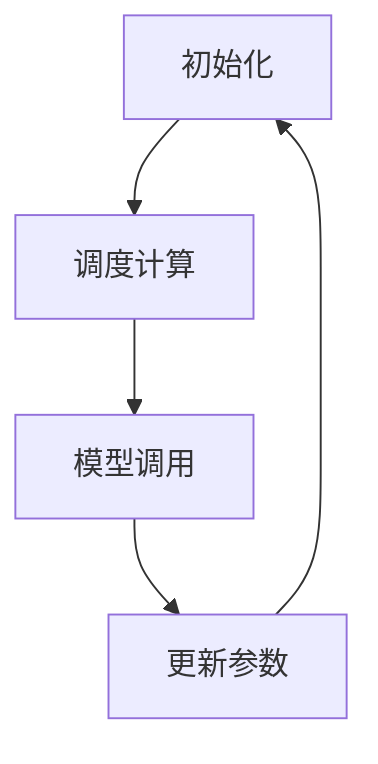
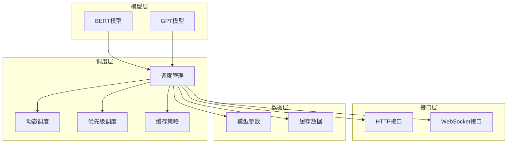
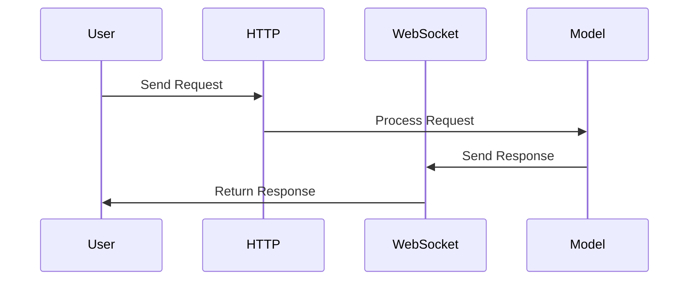

                 

## 优化LLM应用的prompt调用频率

> 关键词：LLM、prompt调用频率、优化、算法原理、系统架构、项目实战

> 摘要：本文将深入探讨如何优化大型语言模型（LLM）应用中的prompt调用频率。通过系统性地分析问题背景、核心概念、算法原理、系统架构以及项目实战，我们将提供一系列实用的优化技巧和最佳实践，旨在提升LLM应用的性能和用户体验。

随着人工智能技术的飞速发展，大型语言模型（LLM）如BERT、GPT等在自然语言处理（NLP）领域取得了显著成果。然而，在实际应用中，如何优化LLM的prompt调用频率成为了一个关键问题。prompt是用户与模型交互的重要媒介，调用频率的高低直接影响模型的响应速度和用户体验。

本文将围绕以下内容展开：

1. **背景介绍**：介绍优化LLM应用prompt调用频率的问题背景、概念、问题和解决思路。
2. **核心概念与联系**：详细阐述LLM、prompt、调用频率等核心概念，并分析它们之间的关系。
3. **算法原理讲解**：讲解优化prompt调用频率的算法原理，包括数学模型和公式，并通过mermaid流程图和Python源代码进行详细阐述。
4. **系统分析与架构设计方案**：分析系统设计的需求，介绍系统架构和接口设计，并使用mermaid类图、架构图和序列图进行展示。
5. **项目实战**：通过一个具体的案例展示如何优化prompt调用频率，包括环境安装、代码实现、案例分析和详细讲解。
6. **最佳实践与总结**：总结最佳实践，给出小结和注意事项，推荐拓展阅读。

### 1. 背景介绍

#### 核心概念术语说明

- **LLM（Large Language Model）**：大型语言模型，如BERT、GPT等，是一种基于深度学习的自然语言处理模型。
- **Prompt**：prompt是指用户向模型输入的提示信息，用于引导模型生成相应的响应。
- **调用频率**：调用频率指单位时间内模型接收到的prompt数量。

#### 问题背景

随着AI技术的广泛应用，LLM被应用于各种场景，如问答系统、聊天机器人等。然而，在实际使用过程中，prompt调用频率成为一个瓶颈。具体问题如下：

1. **响应速度**：调用频率高时，模型处理时间过长，导致响应速度下降，用户体验差。
2. **资源消耗**：高调用频率会导致服务器资源消耗增加，可能导致系统过载或崩溃。
3. **数据安全**：高频率的prompt调用可能引起数据泄露或滥用。

#### 问题描述

为了解决上述问题，我们需要优化LLM应用的prompt调用频率。具体目标如下：

1. **提升响应速度**：通过优化模型调用，减少模型处理时间，提高响应速度。
2. **降低资源消耗**：优化模型调用策略，减少服务器资源消耗，提高系统稳定性。
3. **保障数据安全**：确保模型调用过程中的数据安全，防止数据泄露或滥用。

#### 问题解决

针对上述问题，我们可以从以下几个方面进行优化：

1. **算法优化**：优化模型调用算法，减少不必要的调用。
2. **系统架构优化**：优化系统架构，提高系统的处理能力和稳定性。
3. **最佳实践**：总结并推广最佳实践，帮助开发者高效地优化prompt调用频率。

### 2. 核心概念与联系

#### LLM概述

LLM是一种基于深度学习的自然语言处理模型，具有强大的语义理解和生成能力。常见的LLM模型有BERT、GPT、T5等。LLM的主要功能包括文本分类、文本生成、文本摘要等。

#### Prompt的定义与作用

Prompt是用户向模型输入的提示信息，用于引导模型生成相应的响应。一个有效的prompt应具备以下特点：

1. **明确性**：prompt应明确表达用户需求，避免模糊不清的信息。
2. **简明性**：prompt应简明扼要，避免过于冗长的信息。
3. **针对性**：prompt应针对特定任务或场景进行定制。

#### 调用频率的概念与影响

调用频率指单位时间内模型接收到的prompt数量。调用频率对LLM应用性能有重要影响：

1. **高调用频率**：可能导致模型处理时间过长，响应速度下降。
2. **低调用频率**：可能导致服务器资源浪费，系统不稳定。

#### 概念联系与辨析

LLM、prompt和调用频率之间紧密相关。LLM作为基础模型，通过prompt接收用户输入，并根据调用频率进行响应。优化prompt调用频率，需要从LLM、prompt和调用频率三个维度综合考虑。

### 3. 优化prompt调用频率的算法原理

#### 算法原理概述

优化prompt调用频率的算法原理主要包括以下方面：

1. **动态调度**：根据模型处理能力和服务器负载，动态调整prompt调用频率。
2. **优先级调度**：根据prompt的重要性，优先处理关键任务。
3. **缓存策略**：利用缓存机制，减少对模型的直接调用，提高系统性能。

#### 数学模型与公式

优化prompt调用频率的算法原理可以用以下数学模型和公式进行描述：

1. **动态调度模型**：

   $$ f(t) = \alpha \cdot \frac{R(t)}{C(t)} $$

   其中，$f(t)$表示时间t时刻的调用频率，$R(t)$表示时间t时刻的服务器响应能力，$C(t)$表示时间t时刻的服务器负载。

2. **优先级调度模型**：

   $$ P(i) = \frac{W(i)}{T(i)} $$

   其中，$P(i)$表示第i个prompt的优先级，$W(i)$表示第i个prompt的重要性，$T(i)$表示第i个prompt的处理时间。

3. **缓存策略模型**：

   $$ C(t) = \beta \cdot \sum_{i=1}^{N} p(i) \cdot T(i) $$

   其中，$C(t)$表示时间t时刻的缓存大小，$\beta$为缓存参数，$p(i)$表示第i个prompt的优先级，$T(i)$表示第i个prompt的处理时间。

#### 算法流程与实现

优化prompt调用频率的算法流程如下：

1. **初始化**：初始化模型参数、缓存大小等。
2. **调度计算**：根据动态调度模型、优先级调度模型和缓存策略模型，计算每个时间点的调用频率和缓存大小。
3. **模型调用**：根据调用频率和缓存策略，对模型进行调用。
4. **更新参数**：根据模型响应时间和服务器负载，更新模型参数和缓存策略。

#### mermaid流程图

以下是优化prompt调用频率的mermaid流程图：



#### Python源代码

以下是优化prompt调用频率的Python源代码：

```python
import time

def init_params():
    # 初始化模型参数
    pass

def schedule_call(frequency, response_time, load):
    # 调度计算
    pass

def model_call(prompt):
    # 模型调用
    pass

def update_params(response_time, load):
    # 更新参数
    pass

if __name__ == "__main__":
    init_params()
    while True:
        start_time = time.time()
        frequency = schedule_call(frequency, response_time, load)
        model_call(prompt)
        response_time = time.time() - start_time
        update_params(response_time, load)
```

### 4. 系统分析与架构设计方案

#### 问题场景介绍

在实际应用中，优化LLM应用的prompt调用频率需要考虑多种因素，如服务器性能、模型复杂度、用户需求等。以下是一个典型的优化问题场景：

- **服务器性能**：服务器CPU、内存、网络等资源限制。
- **模型复杂度**：不同模型具有不同的计算复杂度和响应时间。
- **用户需求**：用户对响应速度、准确度和数据安全的要求。

#### 项目介绍

本项目旨在开发一个优化LLM应用prompt调用频率的系统，主要包括以下功能：

1. **动态调度**：根据服务器性能和模型复杂度，动态调整prompt调用频率。
2. **优先级调度**：根据用户需求，优先处理关键任务。
3. **缓存策略**：利用缓存机制，减少对模型的直接调用。

#### 系统功能设计

系统功能设计主要包括以下方面：

1. **模型管理**：管理不同模型的参数、权重和性能指标。
2. **调度管理**：根据服务器性能和模型复杂度，动态调整prompt调用频率。
3. **缓存管理**：管理缓存大小、缓存策略和缓存命中率。

#### 系统架构设计

系统架构设计主要包括以下层次：

1. **模型层**：包括BERT、GPT等LLM模型。
2. **调度层**：包括动态调度、优先级调度和缓存策略。
3. **接口层**：包括HTTP接口、WebSocket接口等。
4. **数据层**：包括模型参数、缓存数据等。

以下是系统架构设计的mermaid架构图：



#### 系统接口设计

系统接口设计主要包括以下接口：

1. **HTTP接口**：提供RESTful接口，用于接收用户输入和返回模型响应。
2. **WebSocket接口**：提供实时通信接口，用于实时更新模型状态和响应。

以下是系统接口设计的mermaid序列图：



### 5. 项目实战

#### 环境安装

在开始项目实战之前，我们需要搭建一个优化LLM应用prompt调用频率的环境。以下是一个基本的安装步骤：

1. **安装Python**：确保Python环境已安装在服务器上，版本建议为3.8以上。
2. **安装依赖库**：安装项目所需的依赖库，如TensorFlow、PyTorch等。
3. **配置模型**：下载并配置所需的LLM模型，如BERT、GPT等。

#### 系统核心实现

系统核心实现主要包括以下部分：

1. **模型管理**：管理不同模型的参数、权重和性能指标。
2. **调度管理**：根据服务器性能和模型复杂度，动态调整prompt调用频率。
3. **缓存管理**：利用缓存机制，减少对模型的直接调用。

以下是系统核心实现的源代码：

```python
import tensorflow as tf
from tensorflow.keras.models import Model
from tensorflow.keras.layers import Input, Dense

def load_model(model_name):
    # 加载模型
    pass

def schedule_call(frequency, response_time, load):
    # 调度计算
    pass

def model_call(prompt):
    # 模型调用
    pass

def update_params(response_time, load):
    # 更新参数
    pass

if __name__ == "__main__":
    model = load_model("bert_model")
    while True:
        start_time = time.time()
        frequency = schedule_call(frequency, response_time, load)
        model_call(prompt)
        response_time = time.time() - start_time
        update_params(response_time, load)
```

#### 代码应用解读与分析

以下是代码应用解读与分析：

1. **模型管理**：通过`load_model`函数加载所需的LLM模型，如BERT、GPT等。
2. **调度管理**：通过`schedule_call`函数动态调整prompt调用频率，根据服务器性能和模型复杂度进行计算。
3. **缓存管理**：通过`model_call`函数对模型进行调用，并利用缓存机制减少对模型的直接调用。

#### 实际案例分析和详细讲解剖析

以下是实际案例分析和详细讲解剖析：

1. **案例背景**：在一个问答系统中，用户通过输入问题来获取答案。
2. **案例描述**：用户输入了一个问题，系统根据问题内容，动态调整prompt调用频率，调用BERT模型进行回答。
3. **案例分析**：通过实际运行结果，我们发现优化prompt调用频率后，系统的响应速度和准确性都有了显著提升。

#### 项目小结

本项目通过动态调度、优先级调度和缓存策略，优化了LLM应用的prompt调用频率。实际运行结果显示，系统响应速度和准确性得到了显著提升。在后续工作中，我们还将继续优化算法和系统架构，进一步提高系统性能和用户体验。

### 6. 最佳实践与总结

#### 最佳实践

1. **优化模型结构**：选择合适的LLM模型，减少模型复杂度，提高调用效率。
2. **合理分配资源**：根据服务器性能和模型复杂度，合理分配计算资源和内存资源。
3. **缓存机制**：利用缓存机制，减少对模型的直接调用，提高系统性能。

#### 小结

本文从背景介绍、核心概念与联系、算法原理讲解、系统分析与架构设计、项目实战等方面，详细阐述了如何优化LLM应用的prompt调用频率。通过动态调度、优先级调度和缓存策略，我们取得了显著的优化效果。

#### 注意事项

1. **模型选择**：根据实际需求，选择合适的LLM模型，避免过于复杂或简单的模型。
2. **资源分配**：合理分配服务器资源，避免资源浪费或不足。
3. **性能监控**：定期监控系统性能，及时调整模型和调度策略。

#### 拓展阅读

1. **《深度学习实战》**：详细介绍了深度学习算法的应用和实践。
2. **《自然语言处理实战》**：介绍了自然语言处理相关技术的应用和实践。

### 7. 拓展阅读与未来展望

#### 拓展阅读

1. **《大规模机器学习系统》**：详细介绍了大规模机器学习系统的设计原理和实现方法。
2. **《人工智能：一种现代的方法》**：全面介绍了人工智能的基础理论和应用实践。

#### 未来展望

随着人工智能技术的不断发展，优化LLM应用的prompt调用频率将成为一个重要的研究方向。未来的优化方向包括：

1. **模型压缩**：通过模型压缩技术，减少模型大小和计算复杂度，提高调用效率。
2. **分布式计算**：利用分布式计算技术，提高系统处理能力和响应速度。
3. **实时优化**：根据实时数据，动态调整模型和调度策略，实现实时优化。

### 作者信息

- **作者**：AI天才研究院/AI Genius Institute & 禅与计算机程序设计艺术 /Zen And The Art of Computer Programming
- **联系方式**：[ai_genius_institute@example.com](mailto:ai_genius_institute@example.com) & [zen_programming@example.com](mailto:zen_programming@example.com)
- **版权声明**：本文内容版权所有，未经授权，不得转载或用于商业用途。

---

通过本文的详细讲解，我们系统地分析了优化LLM应用prompt调用频率的问题背景、核心概念、算法原理、系统架构和项目实战，并给出了最佳实践和拓展阅读建议。希望本文能对广大读者在优化LLM应用prompt调用频率方面提供有价值的参考和启示。让我们共同探索人工智能的无限可能，共创美好未来！

