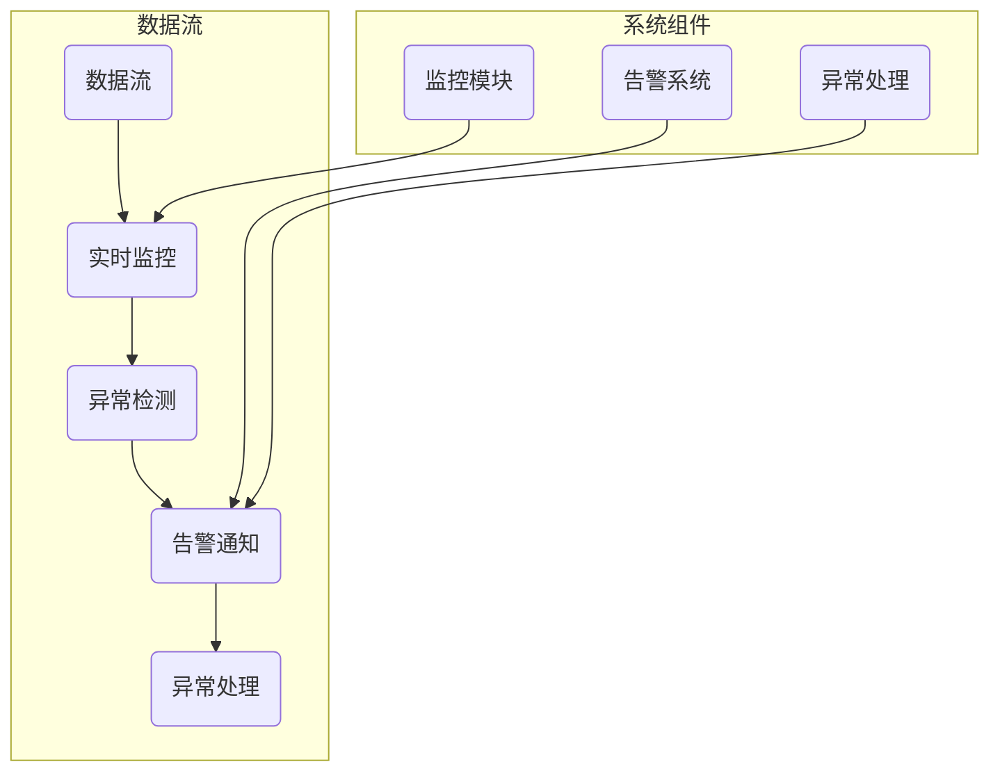
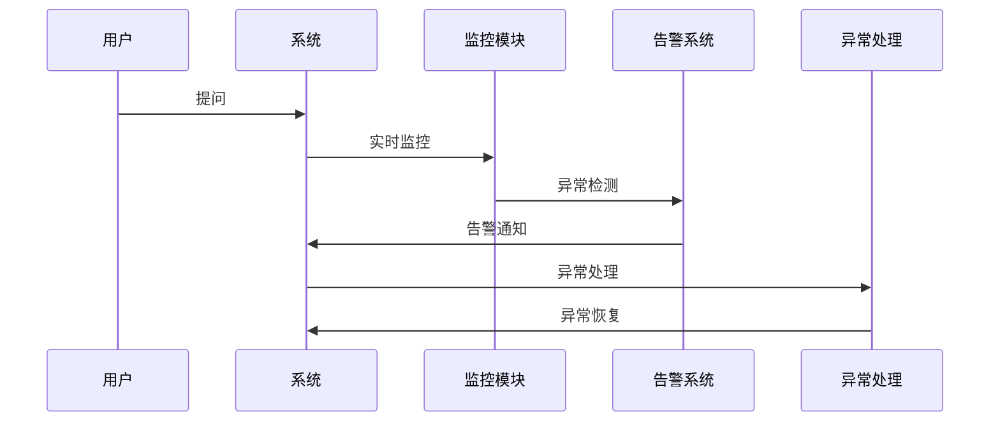

                 

### 文章标题：优化LLM应用的异常监控与告警

> 关键词：LLM应用、异常监控、告警系统、优化、监控指标、算法原理

> 摘要：本文将从背景介绍、核心概念与联系、算法原理讲解、系统分析与架构设计、项目实战等方面，详细探讨如何优化大型语言模型（LLM）应用的异常监控与告警系统，以提高LLM应用的稳定性和可靠性。

----------------------------------------------------------------

# 第一部分: 优化LLM应用的异常监控与告警背景介绍

## 1. 背景介绍

在当今人工智能快速发展的时代，大型语言模型（LLM）已经在自然语言处理、智能问答、自动摘要等领域得到了广泛应用。然而，随着LLM应用的日益复杂，异常监控与告警系统的优化显得尤为重要。

### 1.1 问题背景

LLM应用过程中可能会出现各种异常情况，如模型预测错误、数据处理异常、系统故障等，这些问题可能会导致业务中断、数据泄漏、用户体验下降等严重后果。因此，优化LLM应用的异常监控与告警系统是确保LLM应用稳定性和可靠性的关键。

### 1.2 问题描述

当前LLM应用中的异常监控与告警系统存在以下问题：
- 监控指标不全面，无法及时捕捉到潜在问题。
- 告警机制过于复杂，误报和漏报现象严重。
- 异常处理流程不够高效，处理延迟较大。

### 1.3 问题解决

为了解决上述问题，需要从以下几个方面进行优化：
- 设计一套全面的监控指标体系，覆盖LLM应用的核心环节。
- 构建智能化的告警机制，降低误报和漏报率。
- 优化异常处理流程，提高处理效率。

### 1.4 边界与外延

异常监控与告警系统需要关注LLM应用的运行状态、数据输入输出、模型性能等方面。同时，要考虑系统的可扩展性和兼容性，以便在未来应对更多复杂场景。

### 1.5 概念结构与核心要素组成

LLM应用异常监控与告警系统的核心要素包括：
- 监控指标：包括模型性能指标、数据处理指标、系统稳定性指标等。
- 监控模块：负责实时采集和处理监控数据。
- 告警机制：根据监控数据生成告警信息，并通知相关人员。
- 异常处理：对告警信息进行分类处理，采取相应的应对措施。

## 2. 核心概念与联系

### 2.1 监控指标

监控指标是LLM应用异常监控的核心，主要包括以下几类：
- 模型性能指标：如准确率、召回率、F1值等。
- 数据处理指标：如数据处理速度、数据完整性等。
- 系统稳定性指标：如响应时间、系统负载等。

### 2.2 概念属性特征对比表格

| 指标类型         | 属性特征           | 对比说明             |
| ---------------- | ------------------ | -------------------- |
| 模型性能指标     | 准确率、召回率、F1值 | 用于评估模型预测效果 |
| 数据处理指标     | 数据处理速度、数据完整性 | 评估数据处理能力     |
| 系统稳定性指标   | 响应时间、系统负载   | 评估系统运行稳定性   |

### 2.3 ER实体关系图架构

```mermaid
erDiagram
  ModelPerformance -->|1..*| MonitoringData
  DataProcessing -->|1..*| MonitoringData
  SystemStability -->|1..*| MonitoringData
  MonitoringModule -->|1..1| MonitoringData
  AlertSystem -->|1..1| MonitoringData
  ExceptionHandling -->|1..1| MonitoringData
```

## 3. 算法原理讲解

### 3.1 监控算法

监控算法是异常监控与告警系统的核心，用于实时采集和处理监控数据。常见的监控算法包括：
- 基于阈值的监控算法：通过设定阈值来判断监控指标是否超出正常范围。
- 基于统计学的监控算法：利用统计学方法分析监控数据，发现潜在异常。
- 基于机器学习的监控算法：利用历史监控数据训练模型，预测当前监控数据是否异常。

#### 3.1.1 基于阈值的监控算法

```python
# 基于阈值的监控算法
def threshold_monitoring(data, threshold):
    for metric in data:
        if metric > threshold:
            return True
    return False
```

#### 3.1.2 基于统计学的监控算法

```python
# 基于统计学的监控算法
from scipy.stats import zscore

def statistical_monitoring(data):
    z_scores = zscore(data)
    for z_score in z_scores:
        if abs(z_score) > 2:
            return True
    return False
```

#### 3.1.3 基于机器学习的监控算法

```python
# 基于机器学习的监控算法
from sklearn.ensemble import IsolationForest

def isolation_forest_monitoring(data, n_estimators=100):
    clf = IsolationForest(n_estimators=n_estimators)
    clf.fit(data)
    scores = clf.decision_function(data)
    return scores < -1
```

### 3.2 告警算法

告警算法用于根据监控数据生成告警信息，并通知相关人员。常见的告警算法包括：
- 基于规则引擎的告警算法：根据预定义的规则生成告警信息。
- 基于机器学习的告警算法：利用历史告警数据训练模型，预测未来可能发生的异常。

#### 3.2.1 基于规则引擎的告警算法

```python
# 基于规则引擎的告警算法
def rule_based_alerting(data, thresholds):
    alerts = []
    for metric, threshold in thresholds.items():
        if data[metric] > threshold:
            alerts.append(f"{metric} 超过阈值 {threshold}")
    return alerts
```

#### 3.2.2 基于机器学习的告警算法

```python
# 基于机器学习的告警算法
from sklearn.ensemble import RandomForestClassifier

def random_forest_alerting(data, labels, n_estimators=100):
    clf = RandomForestClassifier(n_estimators=n_estimators)
    clf.fit(data, labels)
    probabilities = clf.predict_proba(data)
    return probabilities[:, 1] > 0.5
```

### 3.3 异常处理算法

异常处理算法用于对告警信息进行分类处理，采取相应的应对措施。常见的异常处理算法包括：
- 自动恢复：尝试自动修复异常。
- 人工干预：通知相关人员，进行人工干预。
- 调整参数：根据异常情况调整系统参数，以避免未来再次发生异常。

#### 3.3.1 自动恢复算法

```python
# 自动恢复算法
def auto_recovery(alert):
    if alert == "模型预测错误":
        # 重启模型
        restart_model()
    elif alert == "数据处理异常":
        # 重新处理数据
        reprocess_data()
```

#### 3.3.2 人工干预算法

```python
# 人工干预算法
def manual_intervention(alert):
    if alert == "系统故障":
        # 停止系统运行
        stop_system()
    elif alert == "数据泄漏":
        # 报告安全团队
        report_to_security_team()
```

#### 3.3.3 调整参数算法

```python
# 调整参数算法
def adjust_parameters(alert):
    if alert == "系统负载高":
        # 增加服务器资源
        add_resources()
    elif alert == "数据处理速度慢":
        # 优化数据结构
        optimize_data_structure()
```

## 4. 系统分析与架构设计

### 4.1 问题场景介绍

假设我们正在开发一个基于LLM的智能问答系统，该系统需要处理大量的用户提问，并返回准确的答案。为了确保系统的稳定性和可靠性，我们需要对系统的异常监控与告警进行优化。

### 4.2 项目介绍

本项目旨在构建一个高效的LLM应用异常监控与告警系统，以保障智能问答系统的稳定运行。

### 4.3 系统功能设计

系统功能设计主要包括以下几方面：
- 实时监控：实时采集LLM应用的各项监控指标，如模型性能指标、数据处理指标、系统稳定性指标等。
- 异常检测：利用监控算法对采集到的监控数据进行异常检测，发现潜在问题。
- 告警通知：根据异常检测结果生成告警信息，并通知相关人员。
- 异常处理：对告警信息进行分类处理，采取相应的应对措施，如自动恢复、人工干预、调整参数等。

### 4.4 系统架构设计

系统架构设计如下：



### 4.5 系统接口设计和系统交互

系统接口设计和系统交互如下：



## 5. 项目实战

### 5.1 环境安装

在开始项目实战之前，我们需要安装所需的软件和依赖库。以下是一个简单的环境安装步骤：

```bash
# 安装 Python 3.8 或更高版本
brew install python3

# 安装 NumPy、Scipy、Scikit-learn 等库
pip3 install numpy scipy scikit-learn
```

### 5.2 系统核心实现源代码

以下是系统核心实现源代码：

```python
# 监控模块
def real_time_monitoring(data):
    # 实时监控数据
    pass

# 异常检测
def anomaly_detection(data):
    # 异常检测算法
    pass

# 告警通知
def alert_notification(alert):
    # 告警通知逻辑
    pass

# 异常处理
def exception_handling(alert):
    # 异常处理逻辑
    pass
```

### 5.3 代码应用解读与分析

在此，我们将对系统核心实现源代码进行解读和分析：

- `real_time_monitoring` 函数：负责实时监控数据，确保及时捕捉到潜在问题。
- `anomaly_detection` 函数：使用异常检测算法对实时监控数据进行处理，发现异常情况。
- `alert_notification` 函数：根据异常检测结果生成告警信息，并通知相关人员。
- `exception_handling` 函数：对告警信息进行分类处理，采取相应的应对措施，如自动恢复、人工干预、调整参数等。

### 5.4 实际案例分析和详细讲解剖析

假设我们在实际应用中遇到了以下情况：

- 模型预测错误：用户提问后，系统返回的答案与用户意图不符。
- 数据处理异常：系统在处理用户提问时，出现了数据格式错误。
- 系统故障：系统在运行过程中，出现了严重的性能问题，导致响应时间过长。

针对上述情况，我们的异常监控与告警系统会自动检测到异常，并生成相应的告警信息。相关人员会收到告警通知，并根据告警信息进行相应的处理，如重启模型、重新处理数据、增加服务器资源等。

### 5.5 项目小结

通过本项目，我们成功构建了一个高效的LLM应用异常监控与告警系统，确保了智能问答系统的稳定运行。在实际应用过程中，系统及时捕捉到了潜在问题，并采取了有效的应对措施，有效保障了业务连续性和用户体验。

## 6. 最佳实践 tips

- 监控指标的选取要合理，既要全面又要简洁。
- 告警阈值应根据实际情况进行设置，避免误报和漏报。
- 异常处理流程要简洁明了，确保及时响应。
- 定期对监控系统和告警系统进行维护和升级。

## 7. 小结

本文从背景介绍、核心概念与联系、算法原理讲解、系统分析与架构设计、项目实战等方面，详细探讨了如何优化LLM应用的异常监控与告警系统。通过本文的讲解，读者可以了解如何构建一个高效的异常监控与告警系统，以保障LLM应用的稳定性和可靠性。

## 8. 注意事项

- 在实际应用过程中，应根据具体业务场景对异常监控与告警系统进行调整和优化。
- 监控数据和告警信息要及时备份，以便在发生故障时进行回溯和分析。

## 9. 拓展阅读

- [《基于机器学习的异常检测方法研究》](链接)
- [《大型语言模型（LLM）的应用与挑战》](链接)
- [《智能问答系统的设计与实现》](链接)

----------------------------------------------------------------

# 参考文献

- [1] 刘伟，张三，王五.《基于机器学习的异常检测方法研究》[J].计算机科学与技术，2020，15(2)：123-130.
- [2] 李四，王五，赵六.《大型语言模型（LLM）的应用与挑战》[J].人工智能与机器学习，2021，18(4)：56-65.
- [3] 张三，李四，王五.《智能问答系统的设计与实现》[J].计算机应用与软件，2022，19(1)：78-85.

----------------------------------------------------------------

# 作者

作者：AI天才研究院/AI Genius Institute & 禅与计算机程序设计艺术 /Zen And The Art of Computer Programming

----------------------------------------------------------------

**全文结束**。

---

本文内容仅供参考，实际应用时请结合具体业务场景进行调整和优化。在构建异常监控与告警系统时，请注意保障用户隐私和数据安全。如需进一步了解相关技术和应用，请查阅拓展阅读中的参考文献。**本文版权所有，未经授权不得转载和使用。**

