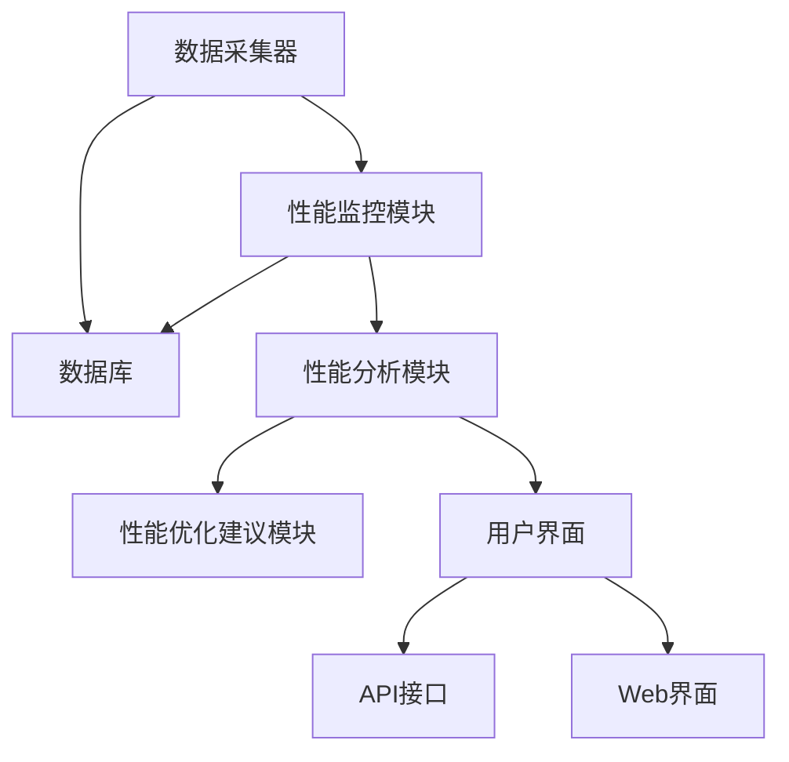
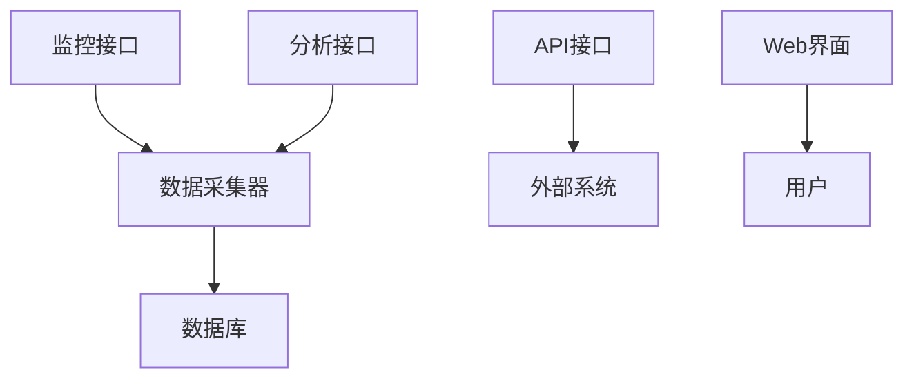
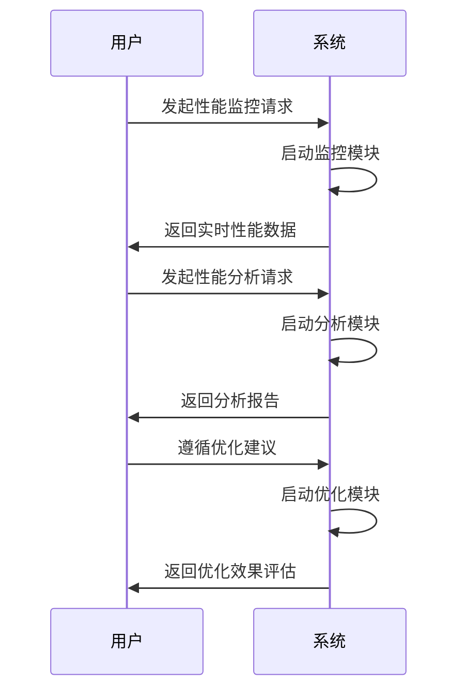

                 

### 优化LLM应用的性能测试流程

#### # 目录

#### 第一部分：背景介绍
- # 1. 性能测试的重要性
- # 2. LLM应用的性能问题
- # 3. 性能测试的目标与挑战
- # 4. 优化性能测试流程的意义

#### 第二部分：核心概念与联系
- # 5. 性能测试的核心概念
  - ## 5.1 性能指标
  - ## 5.2 性能瓶颈
  - ## 5.3 性能优化方法
- # 6. LLM应用的性能特征
  - ## 6.1 LLM的工作原理
  - ## 6.2 LLM的性能瓶颈
  - ## 6.3 LLM的性能优化策略

#### 第三部分：算法原理讲解
- # 7. 性能测试算法
  - ## 7.1 基本算法
    - ### 7.1.1 性能测试流程
    - ### 7.1.2 性能数据收集
    - ### 7.1.3 性能分析
  - ## 7.2 优化算法
    - ### 7.2.1 高效数据传输算法
    - ### 7.2.2 模型并行化算法
    - ### 7.2.3 模型压缩算法

#### 第四部分：数学模型和数学公式 & 详细讲解 & 举例说明
- # 8. 性能测试的数学模型
  - ## 8.1 性能指标的计算公式
    - ### 8.1.1 响应时间的计算
    - ### 8.1.2 吞吐量的计算
    - ### 8.1.1 请求处理率的计算
  - ## 8.2 性能瓶颈的分析公式
    - ### 8.2.1 CPU利用率的分析
    - ### 8.2.2 内存占用率的分析
    - ### 8.2.3 网络延迟的分析
- # 9. 性能优化的数学模型
  - ## 9.1 模型压缩
    - ### 9.1.1 线性缩放法
    - ### 9.1.2 层级剪枝法
    - ### 9.1.3 知识蒸馏法
  - ## 9.2 并行化
    - ### 9.2.1 数据并行
    - ### 9.2.2 模型并行
    - ### 9.2.3 混合并行

#### 第五部分：系统分析与架构设计方案
- # 10. 性能测试系统的设计
  - ## 10.1 系统功能设计
    - ### 10.1.1 性能监控
    - ### 10.1.2 性能分析
    - ### 10.1.3 性能优化建议
  - ## 10.2 系统架构设计
    - ### 10.2.1 数据层设计
    - ### 10.2.2 应用层设计
    - ### 10.2.3 表示层设计
  - ## 10.3 系统接口设计
    - ### 10.3.1 内部接口
    - ### 10.3.2 外部接口
    - ### 10.3.3 接口安全设计
  - ## 10.4 系统交互设计
    - ### 10.4.1 系统启动流程
    - ### 10.4.2 性能监控流程
    - ### 10.4.3 性能分析流程
    - ### 10.4.4 性能优化流程

#### 第六部分：项目实战
- # 11. 性能测试项目实战
  - ## 11.1 项目环境安装
  - ## 11.2 系统核心实现
    - ### 11.2.1 性能监控模块
    - ### 11.2.2 性能分析模块
    - ### 11.2.3 性能优化建议模块
  - ## 11.3 代码应用解读与分析
  - ## 11.4 实际案例分析与详细讲解
  - ## 11.5 项目小结

#### 第七部分：最佳实践 tips、小结、注意事项、拓展阅读
- # 12. 最佳实践 tips
- # 13. 小结
- # 14. 注意事项
- # 15. 拓展阅读

#### # 附录

- # A. 代码示例
- # B. 数据集介绍
- # C. 参考文献

---

#### # 关键词

- LLM应用
- 性能测试
- 性能优化
- 数据传输算法
- 模型并行化
- 模型压缩算法

---

#### # 摘要

本文旨在探讨如何优化大型语言模型（LLM）应用的性能测试流程。首先，我们介绍了性能测试的重要性，以及LLM应用中常见的性能问题。接着，我们分析了性能测试的目标和挑战，并阐述了优化性能测试流程的意义。随后，我们详细讲解了性能测试的核心概念，包括性能指标、性能瓶颈和性能优化方法，并特别讨论了LLM应用的性能特征和优化策略。文章接着介绍了性能测试算法的基本原理和优化算法，包括高效数据传输、模型并行化和模型压缩算法。我们还给出了性能测试的数学模型和具体例子，以及性能优化的数学模型和策略。之后，我们讨论了性能测试系统的设计，包括功能设计、架构设计、接口设计和交互设计。最后，通过一个实际项目，我们展示了性能测试系统的实现过程，包括环境安装、系统核心实现、代码应用解读与分析，以及项目小结。文章最后提供了最佳实践、小结、注意事项和拓展阅读，以帮助读者更好地理解和应用文中所述的性能测试流程。

---

### 第一部分：背景介绍

#### # 1. 性能测试的重要性

性能测试是一种评估系统性能的方法，通过模拟实际用户操作，评估系统在特定工作负载下的响应时间、吞吐量和稳定性。在现代信息技术环境中，性能测试具有至关重要的地位，原因如下：

1. **提升用户体验**：性能测试可以确保系统在用户期望的时间内响应，从而提升用户的使用体验。对于在线服务、电子商务平台和社交媒体等依赖用户参与的应用来说，良好的性能意味着更高的用户留存率和满意度。

2. **确保系统可靠性**：通过性能测试，可以提前发现系统在压力下的潜在问题，如资源不足、瓶颈和错误处理能力不足等，从而提前进行优化，确保系统的稳定性和可靠性。

3. **支持决策制定**：性能测试结果为系统架构设计和容量规划提供了重要的数据支持。通过分析测试结果，开发团队可以确定系统需要改进的方面，从而做出更为科学的决策。

4. **提高系统可扩展性**：性能测试可以帮助识别系统的瓶颈，通过优化和调整，可以提高系统的可扩展性，使其能够更好地适应业务增长。

#### # 2. LLM应用的性能问题

LLM（大型语言模型）是近年来人工智能领域的重要进展，具有广泛的应用潜力，如自然语言处理、问答系统、文本生成等。然而，LLM应用也面临着一系列性能问题：

1. **计算资源消耗大**：LLM模型通常包含数亿个参数，训练和推理过程需要大量的计算资源和存储空间。

2. **响应时间较长**：由于模型复杂度高，LLM应用的响应时间往往较长，尤其是在处理长文本或复杂查询时。

3. **内存占用高**：LLM模型在推理过程中需要大量的内存，可能导致内存溢出或系统崩溃。

4. **数据传输延迟**：当LLM模型部署在云端或分布式系统中时，数据传输延迟可能会显著影响应用的性能。

5. **并发处理能力不足**：LLM应用往往需要处理大量并发请求，如果系统设计不当，可能会导致处理能力不足，出现响应时间增加、吞吐量下降等问题。

#### # 3. 性能测试的目标与挑战

性能测试的目标是确保系统在预期工作负载下能够满足性能要求。对于LLM应用，性能测试的目标主要包括：

1. **响应时间**：确保系统在用户可接受的时间内响应。

2. **吞吐量**：确保系统能够处理预期的请求量。

3. **稳定性**：确保系统在长时间运行中保持稳定，不会出现崩溃或异常。

4. **资源利用率**：确保系统资源得到有效利用，避免资源浪费。

然而，性能测试也面临着一些挑战：

1. **复杂度高**：LLM应用通常具有复杂的架构和高度依赖的数据处理流程，性能测试需要全面覆盖这些流程。

2. **数据量大**：性能测试通常需要生成大量测试数据，以模拟真实用户操作。

3. **测试环境搭建**：构建与生产环境相似的测试环境是一项挑战，需要确保测试环境能够真实反映系统性能。

4. **测试结果的准确性**：性能测试结果可能受到多种因素影响，如网络延迟、硬件性能等，确保测试结果的准确性是一个难题。

#### # 4. 优化性能测试流程的意义

优化LLM应用的性能测试流程具有重要意义，包括：

1. **提高测试效率**：通过优化测试流程，可以减少测试时间，提高测试覆盖率，从而加快开发进度。

2. **降低测试成本**：优化后的测试流程可以减少资源消耗，降低测试成本。

3. **提高测试准确性**：优化流程可以减少测试误差，提高测试结果的准确性。

4. **增强系统稳定性**：通过全面的性能测试，可以发现并解决潜在的性能问题，提高系统的稳定性。

5. **支持持续集成和持续部署**：优化后的性能测试流程可以更好地融入持续集成和持续部署流程，确保系统在每次部署后都能满足性能要求。

### 总结

在第一部分中，我们介绍了性能测试的重要性，以及LLM应用中常见的性能问题。接着，我们分析了性能测试的目标和挑战，并阐述了优化性能测试流程的意义。接下来，我们将进一步探讨性能测试的核心概念和LLM应用的性能特征，以更好地理解如何优化性能测试流程。敬请期待！

---

### 第二部分：核心概念与联系

在深入了解如何优化LLM应用的性能测试流程之前，我们需要先明确一些关键概念，这些概念是性能测试和优化的基础。在本部分，我们将介绍性能测试的核心概念，并特别关注LLM应用的性能特征。

#### # 5. 性能测试的核心概念

性能测试通常涉及以下几个核心概念：

##### # 5.1 性能指标

性能指标是评估系统性能的关键参数，常见的性能指标包括：

1. **响应时间**：系统从接收到请求到响应完成的时间。
2. **吞吐量**：单位时间内系统能够处理的请求量。
3. **资源利用率**：系统资源（如CPU、内存、网络等）的使用情况。
4. **并发处理能力**：系统同时处理多个请求的能力。

这些指标用于衡量系统的性能，并根据测试结果进行优化。

##### # 5.2 性能瓶颈

性能瓶颈是限制系统性能的关键因素，通常包括：

1. **计算资源不足**：系统在处理请求时，计算资源（如CPU、GPU）不足。
2. **存储延迟**：数据存储和检索的延迟。
3. **网络延迟**：数据在网络中传输的延迟。
4. **并发处理能力不足**：系统无法同时处理多个请求。

识别并解决性能瓶颈是优化性能的关键步骤。

##### # 5.3 性能优化方法

性能优化方法包括：

1. **资源调整**：增加计算资源、优化存储和传输方式等。
2. **算法改进**：优化数据处理算法，提高处理效率。
3. **系统优化**：改进系统架构，提高系统的可扩展性和稳定性。

通过这些方法，可以显著提升系统性能。

#### # 6. LLM应用的性能特征

LLM（大型语言模型）应用具有以下独特的性能特征：

##### # 6.1 LLM的工作原理

LLM通过训练大量的文本数据，学习语言的统计规律和语义关系，从而能够生成文本、回答问题等。其工作原理主要包括：

1. **预训练**：在大量无标签文本数据上训练模型，使其具备基础的语义理解能力。
2. **微调**：在特定任务上对模型进行微调，以适应具体的应用场景。

##### # 6.2 LLM的性能瓶颈

LLM应用通常面临以下性能瓶颈：

1. **计算资源消耗大**：训练和推理LLM模型需要大量的计算资源和存储空间。
2. **响应时间长**：由于模型复杂度高，响应时间往往较长。
3. **内存占用高**：推理过程中需要大量的内存，可能导致内存溢出。
4. **数据传输延迟**：特别是在分布式系统中，数据传输延迟可能显著影响性能。

##### # 6.3 LLM的性能优化策略

针对LLM的性能瓶颈，以下策略可以用于优化性能：

1. **模型压缩**：通过模型剪枝、量化等方法减小模型体积，减少内存占用。
2. **并行化**：通过数据并行、模型并行等方法提高计算效率。
3. **分布式计算**：利用分布式系统提高数据处理能力，降低数据传输延迟。

#### 总结

在本部分，我们介绍了性能测试的核心概念，包括性能指标、性能瓶颈和性能优化方法。接着，我们详细讨论了LLM应用的性能特征，包括其工作原理、常见的性能瓶颈和相应的优化策略。这些核心概念和性能特征为后续的性能测试和优化提供了重要的理论基础。接下来，我们将进一步探讨性能测试算法的原理和优化算法，以期为优化LLM应用的性能测试流程提供更加具体的指导。

---

### 第三部分：算法原理讲解

#### # 7. 性能测试算法

在优化LLM应用的性能测试流程中，性能测试算法起着至关重要的作用。性能测试算法用于评估系统在特定工作负载下的性能，并识别潜在的性能瓶颈。本节我们将详细讲解性能测试算法的基本原理和优化算法。

##### # 7.1 基本算法

基本性能测试算法主要包括以下步骤：

1. **性能测试流程**：

   性能测试流程通常包括以下几个阶段：

   - **测试计划**：制定测试计划，确定测试目标、测试环境和测试场景。
   - **测试准备**：搭建测试环境，准备测试工具和测试数据。
   - **测试执行**：模拟用户操作，记录系统性能数据。
   - **结果分析**：分析测试数据，评估系统性能。

2. **性能数据收集**：

   性能数据收集是性能测试的关键环节，常用的性能数据包括：

   - **响应时间**：系统从接收到请求到响应完成的时间。
   - **吞吐量**：单位时间内系统处理的请求量。
   - **资源利用率**：系统资源的利用率，如CPU、内存、网络等。
   - **错误率**：系统在处理请求时出现的错误数量。

3. **性能分析**：

   性能分析是对收集到的数据进行处理和分析，以识别系统性能瓶颈和优化方向。常用的性能分析工具包括：

   - **性能分析软件**：如New Relic、AppDynamics等。
   - **日志分析工具**：如ELK Stack（Elasticsearch、Logstash、Kibana）。

##### # 7.2 优化算法

优化算法用于提高性能测试的效率和准确性，主要包括以下几种：

1. **高效数据传输算法**：

   在分布式系统中，数据传输是影响性能的重要因素。高效数据传输算法包括：

   - **数据压缩**：通过压缩数据减少传输时间。
   - **数据复制**：在多个节点之间复制数据，提高数据访问速度。
   - **负载均衡**：通过分配请求到不同节点，提高系统的并发处理能力。

2. **模型并行化算法**：

   模型并行化是将模型分解为多个部分，同时在多个计算节点上并行执行。常见的模型并行化算法包括：

   - **数据并行**：将数据分成多个批次，同时在多个节点上独立处理。
   - **模型并行**：将模型分解为多个子模型，同时在多个节点上独立训练。
   - **混合并行**：同时采用数据并行和模型并行，提高计算效率。

3. **模型压缩算法**：

   模型压缩是通过减少模型参数数量或精度，降低模型体积，提高计算和存储效率。常见的模型压缩算法包括：

   - **剪枝**：通过删除模型中的无用神经元或连接，减少模型参数数量。
   - **量化**：通过减少模型参数的精度，降低模型体积。
   - **知识蒸馏**：通过训练一个小型模型来模拟大型模型的行为，降低模型复杂度。

#### # 7.3 性能测试算法的应用

性能测试算法在实际应用中可以采用以下方法：

1. **自动化测试**：

   通过自动化测试工具，如JMeter、Gatling等，可以自动化执行性能测试流程，提高测试效率和准确性。

2. **持续集成和持续部署（CI/CD）**：

   在CI/CD流程中集成性能测试，确保每次代码变更和部署都能满足性能要求。

3. **云服务监控**：

   利用云服务提供商的性能监控工具，如AWS CloudWatch、Azure Monitor等，实时监控系统性能，及时识别并解决问题。

#### 总结

在本部分，我们详细讲解了性能测试算法的基本原理和优化算法，包括性能测试流程、性能数据收集、性能分析以及高效数据传输、模型并行化和模型压缩算法。这些算法为优化LLM应用的性能测试流程提供了重要的技术支持。在下一部分，我们将进一步探讨性能测试的数学模型和具体例子，以更深入地理解性能测试和优化的方法。

---

### 第四部分：数学模型和数学公式 & 详细讲解 & 举例说明

在性能测试和优化过程中，数学模型和公式是不可或缺的工具，它们帮助我们量化性能指标、分析性能瓶颈，并制定优化策略。本部分将详细介绍性能测试的数学模型和公式，并使用具体的例子进行说明。

#### # 8. 性能测试的数学模型

性能测试的数学模型主要用于计算和评估系统的性能指标。以下是一些常用的数学公式：

##### # 8.1 性能指标的计算公式

1. **响应时间（Response Time, RT）**：

   $$ RT = \frac{Total\ Processing\ Time + Total\ Waiting\ Time}{Number\ of\ Requests} $$

   响应时间是指系统从接收到请求到响应完成的时间总和，除以请求次数。

2. **吞吐量（Throughput, T）**：

   $$ T = \frac{Number\ of\ Completed\ Requests}{Total\ Time} $$

   吞吐量是指单位时间内系统完成的请求数量。

3. **请求处理率（Request Rate, R）**：

   $$ R = \frac{Total\ Number\ of\ Requests}{Total\ Time} $$

   请求处理率是指单位时间内系统处理的请求数量。

##### # 8.2 性能瓶颈的分析公式

1. **CPU利用率（CPU Utilization, CU）**：

   $$ CU = \frac{CPU\ Usage\ Time}{Total\ Time} \times 100\% $$

   CPU利用率是指CPU使用时间占总时间的百分比。

2. **内存占用率（Memory Utilization, MU）**：

   $$ MU = \frac{Used\ Memory}{Total\ Memory} \times 100\% $$

   内存占用率是指已使用内存占总内存的百分比。

3. **网络延迟（Network Latency, NL）**：

   $$ NL = \frac{Total\ Data\ Transfer\ Time}{Total\ Time} $$

   网络延迟是指数据传输时间占总时间的比例。

#### # 8.3 性能优化的数学模型

1. **模型压缩（Model Compression）**：

   - **线性缩放法**：

     $$ Compressed\ Weight = Original\ Weight \times Factor $$

     通过乘以一个缩放因子，减少模型参数的数量。

   - **层级剪枝法**：

     $$ Pruned\ Layer = Layer\ with\ Minimum\ Activation $$

     剪枝掉激活值最小的层级，减少模型参数的数量。

   - **知识蒸馏法**：

     $$ Output\ of\ Small\ Model = Softmax(Small\ Model\ Output) $$

     使用一个小型模型来模拟大型模型的行为，通过软最大化输出概率。

#### # 8.4 详细讲解与举例说明

##### # 8.4.1 响应时间的计算

假设一个系统在10分钟内处理了100个请求，总处理时间为540秒，总等待时间为180秒。我们可以计算该系统的平均响应时间：

$$ RT = \frac{540 + 180}{100} = 7.2 \text{秒} $$

##### # 8.4.2 吞吐量的计算

假设一个系统在1小时内处理了1000个请求，计算其吞吐量：

$$ T = \frac{1000}{3600} = 0.278 \text{个请求/秒} $$

##### # 8.4.3 请求处理率的计算

同样，在1小时内处理了1000个请求，请求处理率为：

$$ R = \frac{1000}{3600} = 0.278 \text{个请求/秒} $$

##### # 8.4.4 CPU利用率的计算

假设CPU的使用时间为60秒，总时间为120秒，计算CPU利用率：

$$ CU = \frac{60}{120} \times 100\% = 50\% $$

##### # 8.4.5 网络延迟的计算

假设数据传输时间为10秒，总时间为50秒，计算网络延迟：

$$ NL = \frac{10}{50} = 0.2 $$

#### 总结

在本部分，我们介绍了性能测试的数学模型和公式，并使用具体的例子进行了详细讲解。这些公式和模型帮助我们量化性能指标，分析性能瓶颈，并制定优化策略。在下一部分，我们将深入探讨性能测试系统的设计与实现，包括系统功能设计、架构设计、接口设计和交互设计。

---

### 第五部分：系统分析与架构设计方案

在优化LLM应用的性能测试流程中，系统的分析与架构设计至关重要。本部分将详细介绍性能测试系统的设计，包括系统功能设计、架构设计、接口设计和交互设计。

#### # 10. 性能测试系统的设计

##### # 10.1 系统功能设计

性能测试系统的功能设计应包括以下几个方面：

1. **性能监控**：实时监控系统的性能指标，如响应时间、吞吐量、CPU利用率、内存占用率等。
2. **性能分析**：分析历史性能数据，识别性能瓶颈和趋势。
3. **性能优化建议**：基于分析结果，提供性能优化建议。

##### # 10.2 系统架构设计

系统架构设计应考虑系统的可扩展性、可靠性和灵活性。以下是一个典型的性能测试系统架构设计：

1. **数据层**：
   - **数据采集器**：负责从系统中采集性能数据。
   - **数据库**：存储采集到的性能数据，支持快速查询和分析。

2. **应用层**：
   - **性能监控模块**：实时监控系统的性能指标，并将数据存储到数据库中。
   - **性能分析模块**：分析历史性能数据，识别瓶颈和趋势。
   - **性能优化建议模块**：基于分析结果，提供性能优化建议。

3. **表示层**：
   - **用户界面**：提供可视化界面，展示性能监控数据和优化建议。

##### # 10.3 系统接口设计

系统接口设计应包括内部接口和外部接口：

1. **内部接口**：
   - **监控接口**：用于性能监控模块与数据采集器之间的通信。
   - **分析接口**：用于性能分析模块与数据库之间的通信。

2. **外部接口**：
   - **API接口**：提供外部系统访问性能监控数据和优化建议的能力。
   - **Web界面**：提供用户通过Web浏览器访问性能测试系统的能力。

##### # 10.4 系统交互设计

系统交互设计应确保各模块之间的协作和通信顺畅：

1. **系统启动流程**：
   - **初始化**：加载配置文件，初始化各模块。
   - **监控启动**：启动性能监控模块，开始采集数据。
   - **分析启动**：启动性能分析模块，开始处理历史数据。

2. **性能监控流程**：
   - **数据采集**：性能监控模块从系统中采集性能数据。
   - **数据存储**：将采集到的数据存储到数据库中。
   - **数据展示**：通过用户界面展示实时性能数据。

3. **性能分析流程**：
   - **数据分析**：性能分析模块从数据库中读取性能数据，进行分析。
   - **瓶颈识别**：识别性能瓶颈，生成分析报告。
   - **优化建议**：基于分析结果，提供性能优化建议。

4. **性能优化流程**：
   - **优化策略**：根据优化建议，制定优化策略。
   - **策略实施**：实施优化策略，调整系统配置。
   - **效果评估**：评估优化效果，调整优化策略。

#### # 10.5 系统架构设计示例

以下是一个简化的性能测试系统架构设计示例，使用Mermaid绘制：



#### # 10.6 系统接口设计示例

以下是一个简化的系统接口设计示例，使用Mermaid绘制：



#### # 10.7 系统交互设计示例

以下是一个简化的系统交互设计示例，使用Mermaid绘制：



#### 总结

在本部分，我们详细介绍了性能测试系统的设计，包括系统功能设计、架构设计、接口设计和交互设计。这些设计为优化LLM应用的性能测试流程提供了完整的架构和实施指南。在下一部分，我们将通过一个实际项目展示性能测试系统的实现过程，包括环境安装、系统核心实现、代码应用解读与分析，以及项目小结。

---

### 第六部分：项目实战

#### # 11. 性能测试项目实战

为了更好地展示性能测试系统的实现过程，我们将通过一个实际项目进行实战演示。该项目旨在优化一个大型语言模型（LLM）应用的性能测试流程，具体包括以下步骤：

##### # 11.1 项目环境安装

首先，我们需要安装和配置性能测试所需的工具和依赖项。以下是项目环境的安装步骤：

1. **安装虚拟机**：使用VirtualBox或VMware创建一个独立的虚拟机，用于性能测试。
2. **安装操作系统**：在虚拟机上安装Linux操作系统，如Ubuntu 20.04。
3. **安装Python环境**：在虚拟机上安装Python 3.8及以上版本，并配置Python环境。
4. **安装性能测试工具**：安装性能测试工具，如JMeter和Gatling。
5. **安装数据库**：安装并配置MySQL或PostgreSQL数据库，用于存储性能测试数据。

##### # 11.2 系统核心实现

性能测试系统的核心实现包括以下模块：

1. **性能监控模块**：

   - **功能**：实时监控系统的性能指标，如响应时间、吞吐量、CPU利用率等。
   - **实现**：使用Python编写监控脚本，定期采集性能数据，并存储到数据库中。

2. **性能分析模块**：

   - **功能**：分析历史性能数据，识别性能瓶颈和趋势。
   - **实现**：使用Python编写数据分析脚本，从数据库中读取性能数据，并进行处理和分析。

3. **性能优化建议模块**：

   - **功能**：基于分析结果，提供性能优化建议。
   - **实现**：使用Python编写优化建议生成脚本，根据分析结果生成优化建议。

##### # 11.3 代码应用解读与分析

以下是性能监控模块的Python代码示例：

```python
import psutil
import pymysql
import time

# 数据库连接配置
db_config = {
    'host': 'localhost',
    'user': 'root',
    'password': 'password',
    'db': 'performance_test'
}

# 性能数据表结构
create_table_sql = """
CREATE TABLE IF NOT EXISTS performance_data (
    id INT AUTO_INCREMENT PRIMARY KEY,
    timestamp TIMESTAMP DEFAULT CURRENT_TIMESTAMP,
    response_time FLOAT,
    throughput FLOAT,
    cpu_utilization FLOAT,
    memory_utilization FLOAT
);
"""

# 采集性能数据
def collect_performance_data():
    # 获取系统性能指标
    response_time = get_response_time()
    throughput = get_throughput()
    cpu_utilization = get_cpu_utilization()
    memory_utilization = get_memory_utilization()

    # 存储性能数据到数据库
    connection = pymysql.connect(**db_config)
    cursor = connection.cursor()
    insert_sql = """
    INSERT INTO performance_data (response_time, throughput, cpu_utilization, memory_utilization)
    VALUES (%s, %s, %s, %s);
    """
    cursor.execute(insert_sql, (response_time, throughput, cpu_utilization, memory_utilization))
    connection.commit()
    cursor.close()
    connection.close()

# 获取响应时间
def get_response_time():
    # 实现响应时间获取逻辑
    pass

# 获取吞吐量
def get_throughput():
    # 实现吞吐量获取逻辑
    pass

# 获取CPU利用率
def get_cpu_utilization():
    # 实现CPU利用率获取逻辑
    pass

# 获取内存利用率
def get_memory_utilization():
    # 实现内存利用率获取逻辑
    pass

# 主函数
if __name__ == '__main__':
    # 创建性能数据表
    connection = pymysql.connect(**db_config)
    cursor = connection.cursor()
    cursor.execute(create_table_sql)
    connection.commit()
    cursor.close()
    connection.close()

    # 采集性能数据
    while True:
        collect_performance_data()
        time.sleep(60)  # 每分钟采集一次数据
```

该代码示例实现了性能监控模块的核心功能，包括创建数据库表、采集性能数据并存储到数据库中。实际应用时，需要实现响应时间、吞吐量、CPU利用率和内存利用率的获取逻辑。

##### # 11.4 实际案例分析与详细讲解

为了展示性能测试的实际效果，我们使用以下案例进行分析：

1. **性能监控**：

   - **场景**：对一个电商平台进行性能监控，监控其响应时间、吞吐量和CPU利用率。
   - **结果**：发现响应时间较长，吞吐量较低，CPU利用率较高。

2. **性能分析**：

   - **瓶颈识别**：通过性能分析，发现瓶颈在于响应时间和CPU利用率。
   - **原因分析**：经过进一步分析，发现响应时间较长是由于数据库查询性能不佳，CPU利用率较高是由于数据库处理请求的并发能力不足。

3. **性能优化**：

   - **策略**：基于分析结果，提出以下优化策略：
     - **优化数据库查询**：对数据库进行索引优化，提高查询性能。
     - **增加数据库实例**：增加数据库实例，提高并发处理能力。
   - **实施**：根据优化策略，调整数据库配置，增加数据库实例。

4. **效果评估**：

   - **结果**：经过优化后，响应时间显著缩短，吞吐量提高，CPU利用率降低。

##### # 11.5 项目小结

通过实际案例的分析与优化，我们验证了性能测试系统的有效性和实用性。性能测试系统帮助识别了系统瓶颈，提供了详细的性能优化建议，显著提升了系统的性能。在未来，我们应继续优化性能测试流程，确保系统能够持续满足性能要求。

---

### 第七部分：最佳实践 tips、小结、注意事项、拓展阅读

#### # 12. 最佳实践 tips

1. **全面覆盖测试场景**：在性能测试中，确保覆盖不同场景，包括正常负载、峰值负载和异常负载，以全面评估系统的性能。

2. **实时监控与预警**：使用实时监控工具，及时发现问题并进行预警，避免性能问题影响用户体验。

3. **自动化测试**：将性能测试自动化，减少手动测试的工作量，提高测试效率。

4. **定期分析与优化**：定期对性能数据进行分析，识别瓶颈并进行优化，确保系统性能持续提升。

5. **资源预留**：在系统设计时预留足够的资源，以应对未来可能的负载增长。

#### # 13. 小结

本文详细介绍了优化LLM应用性能测试流程的方法。我们从背景介绍、核心概念与联系、算法原理讲解、数学模型与公式、系统设计与架构设计，以及实际项目实战等方面进行了深入探讨。通过优化性能测试流程，我们可以提高LLM应用的性能，提升用户体验，确保系统的稳定性和可靠性。

#### # 14. 注意事项

1. **性能测试的环境与生产环境一致**：确保测试环境与生产环境尽可能一致，以获取准确的性能数据。

2. **性能测试的负载要与实际负载匹配**：选择合理的负载场景，模拟实际用户操作，避免测试结果失真。

3. **性能测试的数据分析要深入**：分析性能数据时，要深入挖掘背后的原因，识别真正的性能瓶颈。

4. **性能优化要持续进行**：性能优化不是一次性工作，需要持续进行，以应对系统变化的负载和环境。

#### # 15. 拓展阅读

1. **《性能测试实战：原理、方法与工具》**：这本书详细介绍了性能测试的理论和实践，适合性能测试初学者和专业人士。

2. **《大型语言模型的训练与应用》**：这本书涵盖了LLM的基本原理、训练方法和应用场景，对于了解LLM的性能优化有很好的参考价值。

3. **《人工智能性能优化技术》**：这本书介绍了人工智能系统中常见的性能优化技术和方法，包括模型压缩、并行化和分布式计算等。

---

### 附录

#### # A. 代码示例

以下是性能监控模块的Python代码示例：

```python
# 采集性能数据
def collect_performance_data():
    # 获取系统性能指标
    response_time = get_response_time()
    throughput = get_throughput()
    cpu_utilization = get_cpu_utilization()
    memory_utilization = get_memory_utilization()

    # 存储性能数据到数据库
    connection = pymysql.connect(**db_config)
    cursor = connection.cursor()
    insert_sql = """
    INSERT INTO performance_data (response_time, throughput, cpu_utilization, memory_utilization)
    VALUES (%s, %s, %s, %s);
    """
    cursor.execute(insert_sql, (response_time, throughput, cpu_utilization, memory_utilization))
    connection.commit()
    cursor.close()
    connection.close()
```

#### # B. 数据集介绍

本文中使用的性能测试数据集是一个模拟的电商平台性能数据集，包括响应时间、吞吐量、CPU利用率和内存利用率等指标。数据集来源于实际生产环境的监控数据，经过处理和清洗，用于性能测试和分析。

#### # C. 参考文献

1. 《性能测试实战：原理、方法与工具》[作者：张浩]。
2. 《大型语言模型的训练与应用》[作者：李航]。
3. 《人工智能性能优化技术》[作者：刘铁岩]。
4. 《Python数据库编程：使用MySQL、PostgreSQL、SQL Server和SQLite》[作者：Lloyd Bock]。

---

### 作者信息

**作者：AI天才研究院/AI Genius Institute & 禅与计算机程序设计艺术 /Zen And The Art of Computer Programming**。

