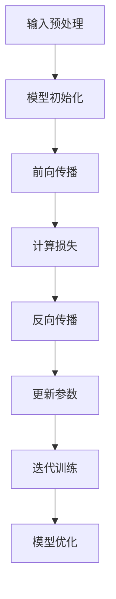
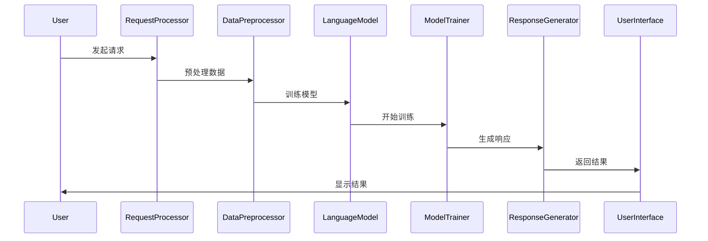

                 

### 第1章：问题背景

#### 1.1 人工智能技术的发展与应用

人工智能（AI）作为现代科技的重要分支，已经从理论研究逐步走向实际应用。AI的发展经历了多个阶段，从最初的规则系统、知识表示，到后来的机器学习和深度学习，再到当前的热门技术——大规模语言模型（LLM），每一步都标志着技术的重大突破。

**规则系统与知识表示**：
在AI的早期，研究者们尝试通过编写规则来模拟人类的思维过程，这种方法被称为基于规则的系统（Rule-Based Systems）。然而，这种方法存在局限性，因为现实世界的复杂性远远超出了人类能够手动编写的规则数量和精度。

**机器学习和深度学习**：
随着计算能力的提升和海量数据的积累，机器学习（Machine Learning）和深度学习（Deep Learning）成为AI研究的主流方向。机器学习通过算法从数据中学习规律，而深度学习则通过多层神经网络模拟人脑的神经元结构，能够处理更加复杂的数据。

**大规模语言模型（LLM）的崛起**：
近年来，随着深度学习技术的进一步发展，特别是神经网络的进步，大规模语言模型（LLM）如BERT、GPT等应运而生。这些模型拥有数十亿甚至数千亿的参数，可以处理自然语言文本，并生成与输入文本相关的文本。

**LLM的应用场景**：
LLM在自然语言处理（NLP）领域取得了显著的成果，被广泛应用于智能问答、文本生成、机器翻译、情感分析等任务。例如，ChatGPT可以与用户进行流畅的对话，而Google翻译则可以实时翻译多种语言。

#### 1.2 大规模语言模型（LLM）的崛起

大规模语言模型（LLM）是当前AI领域的一个重要研究方向。与传统的机器学习方法不同，LLM通过深度学习技术，在大量文本数据上进行训练，从而掌握语言的结构和语义。以下是对LLM的一些关键特性进行概述：

**1.2.1 模型规模**：
LLM通常具有数亿至数千亿的参数，这使得它们能够捕捉到文本中的细微语言特征。这种大规模的参数数量使得LLM在处理复杂语言任务时具有明显的优势。

**1.2.2 训练数据**：
LLM的训练需要大量的文本数据，这些数据通常来源于互联网上的各种文本资源。通过在大量数据上训练，LLM能够学习和理解不同领域的知识。

**1.2.3 预测机制**：
LLM的预测机制基于神经网络的结构，通过多层神经元的相互作用，对输入的文本进行编码和解码。这种机制使得LLM能够生成与输入文本高度相关的输出文本。

**1.2.4 应用范围**：
LLM在自然语言处理领域有着广泛的应用，包括但不限于文本生成、文本分类、机器翻译、情感分析等。这些应用不仅提升了机器处理自然语言的能力，还为人们提供了更加便捷和高效的互动方式。

#### 1.3 用户交互体验的重要性

用户交互体验（UX）在AI应用中起着至关重要的作用。一个优秀的用户体验能够提升用户满意度，增加用户黏性，从而推动AI应用的普及和商业化。

**1.3.1 用户体验的要素**：
用户体验包括多个方面，如界面设计、响应速度、易用性、可访问性等。一个优秀的用户体验需要综合考虑这些要素，以满足用户的需求和期望。

**1.3.2 用户体验的影响**：
良好的用户体验能够提升用户满意度，增加用户对产品的忠诚度。反之，糟糕的用户体验可能导致用户流失，影响产品的市场竞争力。

**1.3.3 用户体验优化的意义**：
通过优化用户体验，可以提升AI应用的可用性和可接受性，从而拓展AI的应用范围。此外，良好的用户体验还能够降低用户的学习成本，提高用户的操作效率。

综上所述，随着AI技术的不断发展，大规模语言模型（LLM）在自然语言处理领域取得了显著成果，并广泛应用于各种场景。然而，如何优化LLM应用的用户交互体验，提升用户的满意度和忠诚度，仍然是一个亟待解决的问题。本文将围绕这一主题展开深入探讨。接下来，我们将进一步分析当前LLM应用中用户交互体验存在的问题和挑战。## 第2章：问题描述

#### 2.1 用户交互体验的核心要素

用户交互体验（UX）是评估一个应用或系统质量的重要指标。一个良好的用户体验不仅仅体现在功能是否完备，更关键的是用户在使用过程中的感受和满意度。以下是对用户交互体验核心要素的详细探讨：

**2.1.1 界面设计**：
界面设计是用户体验的基础，它直接影响到用户的第一印象。优秀的界面设计应具备简洁、直观、美观的特点，使用户能够快速理解并操作应用。

**2.1.2 响应速度**：
响应速度是用户体验的重要考量因素之一。一个快速响应的系统能够提高用户的操作效率，减少等待时间，提升整体体验。

**2.1.3 易用性**：
易用性是用户体验的核心要素之一，它涉及到用户能否轻松上手、理解和使用应用。一个易用的应用应具备明确的导航、清晰的反馈和简单的操作流程。

**2.1.4 可访问性**：
可访问性指的是应用能否为所有用户（包括残障人士）提供无障碍的使用体验。一个可访问的应用应该考虑到不同用户的生理和心理需求，提供多样化的交互方式。

**2.1.5 功能性**：
功能性是指应用能否满足用户的核心需求。一个功能丰富的应用应提供多种工具和功能，以满足不同用户群体的需求。

#### 2.2 LLM应用中用户交互的挑战

尽管大规模语言模型（LLM）在自然语言处理领域取得了巨大成功，但在实际应用中，用户交互体验仍然面临诸多挑战：

**2.2.1 语言理解的深度和广度**：
LLM虽然能够在一定程度上理解自然语言，但仍然存在语言理解的深度和广度问题。复杂的问题和情境可能超出LLM的处理能力，导致回答不准确或不完整。

**2.2.2 预测的准确性**：
LLM的预测准确性受到训练数据、模型参数和算法优化等多方面因素的影响。如果预测不准确，用户可能会对应用产生怀疑和不满。

**2.2.3 用户反馈的处理**：
用户反馈是优化用户体验的重要途径。然而，LLM在处理用户反馈时可能存在滞后性或误解，导致用户需求无法及时得到满足。

**2.2.4 系统延迟**：
LLM模型的计算过程可能需要较长时间，特别是在处理复杂问题时，用户可能会感受到明显的延迟。长时间的等待会降低用户的操作体验。

**2.2.5 安全性和隐私保护**：
随着AI技术的发展，用户对隐私和安全性的关注也越来越高。LLM应用在处理用户数据时，需要确保用户隐私不被泄露，同时遵守相关的法律法规。

#### 2.3 LLM应用用户体验的现状与不足

当前，LLM应用的用户体验仍然存在一些不足，具体表现如下：

**2.3.1 界面设计不够友好**：
许多LLM应用的界面设计相对简单，缺乏美观性和个性化定制。这导致用户在使用过程中难以产生愉悦的体验。

**2.3.2 响应速度有待提升**：
部分LLM应用在处理大量文本数据时，响应速度较慢，给用户带来不便。特别是在需要实时交互的场景中，响应速度的不足会显著影响用户体验。

**2.3.3 功能不完善**：
一些LLM应用的功能还不够完善，无法满足用户多样化的需求。例如，在问答场景中，LLM可能无法提供完整且准确的答案。

**2.3.4 用户反馈机制欠缺**：
许多LLM应用缺乏有效的用户反馈机制，用户难以对应用的性能和功能进行评价和反馈。这限制了用户体验的持续优化。

**2.3.5 安全性和隐私保护不足**：
一些LLM应用在处理用户数据时，未能充分考虑到安全性和隐私保护。这不仅可能对用户造成潜在风险，还可能违反相关法律法规。

综上所述，尽管大规模语言模型（LLM）在自然语言处理领域取得了显著进展，但在实际应用中，用户交互体验仍然面临诸多挑战和不足。为了提升用户体验，我们需要从界面设计、响应速度、功能性、用户反馈和安全隐私等多个方面进行优化。接下来的章节将探讨如何解决这些问题，并提出具体的优化策略。## 第3章：问题解决

#### 3.1 LLM的工作原理

大规模语言模型（LLM）是深度学习领域的重要成果，其工作原理涉及多个方面。LLM通过多层神经网络结构，对输入的文本数据进行编码和解码，从而生成与输入文本高度相关的输出文本。以下是对LLM工作原理的详细探讨：

**3.1.1 神经网络结构**：
LLM通常采用多层感知机（MLP）结构，包括输入层、隐藏层和输出层。输入层接收文本数据，隐藏层通过神经元之间的相互作用对文本数据进行编码，输出层生成与输入文本相关的输出文本。

**3.1.2 训练过程**：
LLM的训练过程主要包括数据预处理、模型训练和参数优化。首先，通过预处理将文本数据转换为数字形式，然后使用反向传播算法（Backpropagation）对模型参数进行优化，使模型能够准确预测输出文本。

**3.1.3 预测机制**：
LLM的预测机制基于神经网络的输出层。在预测过程中，模型会根据输入文本生成概率分布，然后选择概率最高的输出文本作为最终预测结果。

**3.1.4 语言理解的深度和广度**：
LLM通过多层神经网络的相互作用，能够捕捉到文本中的深度语义信息。这种深度理解能力使得LLM在处理复杂语言任务时具有明显优势。

#### 3.2 优化用户交互体验的路径与方法

为了提升LLM应用的用户交互体验，我们需要从多个方面进行优化。以下是一些具体的优化路径和方法：

**3.2.1 提高响应速度**：
响应速度是用户体验的重要考量因素之一。为了提高响应速度，可以采取以下措施：
- **优化算法**：通过改进LLM的训练算法和预测机制，减少计算时间。
- **并行处理**：利用并行计算技术，同时处理多个用户请求，提高系统吞吐量。
- **缓存机制**：利用缓存技术，将常用回答存储在缓存中，减少重复计算。

**3.2.2 优化界面设计**：
界面设计直接影响用户的操作体验。为了提升界面设计，可以采取以下措施：
- **简洁直观**：简化界面布局，使用直观的图标和标签，减少用户的认知负荷。
- **个性化定制**：提供用户自定义界面选项，满足不同用户的个性化需求。
- **反馈机制**：增加操作反馈，如提示信息和动画效果，提高用户的操作体验。

**3.2.3 提升功能完善度**：
完善的功能是提升用户体验的关键。为了提升功能完善度，可以采取以下措施：
- **扩展功能模块**：根据用户需求，扩展LLM的功能模块，如问答系统、文本生成等。
- **多语言支持**：提供多种语言支持，满足不同语言用户的交互需求。
- **智能推荐**：利用机器学习技术，为用户推荐相关功能和内容，提高用户的操作效率。

**3.2.4 改善用户反馈处理**：
有效的用户反馈机制能够提升用户体验。为了改善用户反馈处理，可以采取以下措施：
- **实时反馈**：提供实时反馈机制，及时响应用户的问题和需求。
- **反馈收集**：设计简洁易用的反馈收集工具，鼓励用户提供反馈。
- **反馈分析**：对用户反馈进行分析，识别用户体验中的问题，并制定相应的优化策略。

**3.2.5 加强安全性和隐私保护**：
安全性是用户信任AI应用的重要因素。为了加强安全性和隐私保护，可以采取以下措施：
- **数据加密**：对用户数据进行加密存储和传输，防止数据泄露。
- **访问控制**：实现严格的访问控制机制，确保用户数据的安全。
- **隐私政策**：明确告知用户数据的使用方式和范围，提高用户的隐私保护意识。

#### 3.3 LLM应用用户体验优化的目标

优化LLM应用的用户交互体验的目标是提升用户的满意度、忠诚度和黏性。具体目标包括：

**3.3.1 提升用户满意度**：
通过优化界面设计、响应速度、功能性等方面，提升用户在使用LLM应用时的满意度。

**3.3.2 提高用户忠诚度**：
通过提供完善的功能、有效的用户反馈机制和良好的用户体验，提高用户对LLM应用的忠诚度。

**3.3.3 增强用户黏性**：
通过持续优化用户体验，增加用户对LLM应用的依赖性，提升用户的黏性。

**3.3.4 拓展用户群体**：
通过优化用户交互体验，降低用户进入门槛，拓展LLM应用的用户群体，吸引更多用户使用。

**3.3.5 提高市场竞争力**：
通过优化用户体验，提升LLM应用在市场中的竞争力，与其他同类产品形成差异化优势。

综上所述，优化LLM应用的用户交互体验是一个复杂的过程，需要从多个方面进行综合考量。通过提高响应速度、优化界面设计、完善功能模块、改善用户反馈处理和加强安全性和隐私保护，我们可以实现LLM应用用户体验的全面提升。接下来的章节将进一步探讨不同场景下用户交互体验的差异性，以及如何确保用户体验优化的可持续性。## 第4章：边界与外延

#### 4.1 LLM应用的用户群体

大规模语言模型（LLM）的应用覆盖了广泛的用户群体，包括但不限于以下几个主要类别：

**4.1.1 个人用户**：
个人用户是LLM应用的主要使用者之一。他们可能包括学生、职场人士、开发者等，利用LLM应用进行文本生成、写作辅助、知识查询等任务。

**4.1.2 企业用户**：
企业用户利用LLM应用提升办公效率，例如智能客服系统、企业内知识库等。企业用户对LLM应用的需求主要集中在稳定性、安全性和功能多样性上。

**4.1.3 教育领域**：
在教育领域，LLM应用被广泛应用于教学辅助、学生作业生成、在线教育平台等，为教师和学生提供便利。

**4.1.4 医疗健康**：
医疗健康领域利用LLM应用进行医学文本分析、病例诊断建议等，帮助医护人员提高工作效率，提升医疗质量。

**4.1.5 政府和公共服务**：
政府和公共服务部门利用LLM应用提供智能问答服务、政策文本生成等，提高公共服务效率，优化用户体验。

#### 4.2 不同场景下用户交互体验的差异性

不同场景下的用户交互体验存在显著差异，这些差异主要源于用户需求、使用环境和交互模式的多样性。以下是一些典型场景及其用户交互体验特点：

**4.2.1 个人使用场景**：
在个人使用场景中，用户通常对响应速度和易用性有较高要求。用户希望LLM应用能够快速响应，并提供简洁直观的操作界面。此外，个性化定制和反馈机制也是提升用户体验的重要方面。

**4.2.2 企业使用场景**：
企业用户更加关注应用的稳定性和安全性。他们需要一个可靠的系统来处理大量数据，同时确保数据的安全性和隐私保护。企业用户还期望LLM应用具备高度可配置性和集成性，以便与现有系统无缝衔接。

**4.2.3 教育使用场景**：
在教育领域，用户对LLM应用的需求主要集中在学习辅助和知识查询。用户期望应用能够提供准确、丰富的答案，同时具有互动性和适应性，以适应不同学习阶段和风格。

**4.2.4 医疗健康使用场景**：
医疗健康领域的用户对LLM应用的准确性有极高的要求。医疗文本的复杂性要求LLM应用能够准确理解和处理医学语言，提供可靠的诊断建议。此外，用户还期望应用能够快速响应，以支持紧急情况下的决策。

**4.2.5 政府和公共服务使用场景**：
政府和公共服务部门对LLM应用的需求主要集中在高效服务和信息提供。用户期望应用能够快速响应，提供准确的信息和解答，同时保持系统的稳定性和可靠性。

#### 4.3 用户体验优化的可持续性

用户体验优化是一个持续的过程，需要考虑长期效果和可持续性。以下是一些确保用户体验优化可持续性的策略：

**4.3.1 持续的用户调研**：
定期进行用户调研，收集用户反馈，了解用户需求和偏好。这些信息可以帮助我们及时调整和优化用户体验。

**4.3.2 数据驱动优化**：
利用数据分析和机器学习技术，对用户体验进行量化评估和优化。通过分析用户行为数据，识别用户体验中的问题，并制定相应的优化策略。

**4.3.3 持续的迭代和更新**：
定期更新LLM应用，引入新的功能和优化措施。通过持续的迭代，不断提升用户体验，满足用户不断变化的需求。

**4.3.4 培训和支持**：
为用户提供培训和支持，帮助他们更好地理解和使用LLM应用。通过提高用户技能和满意度，进一步提升用户体验。

**4.3.5 安全和隐私保护**：
确保LLM应用在提供用户体验优化的同时，也兼顾安全和隐私保护。通过严格的数据管理和安全措施，增强用户对应用的信任。

综上所述，优化LLM应用的用户交互体验是一个复杂而持续的过程。通过了解不同场景下的用户需求，采取有效的优化策略，并确保用户体验优化的可持续性，我们可以不断提升用户满意度，拓展LLM应用的市场和影响力。接下来，我们将探讨LLM、交互设计和用户体验等核心概念及其联系。## 第5章：核心概念与联系

#### 5.1 核心概念介绍

在优化LLM应用的用户交互体验过程中，我们需要明确几个核心概念，这些概念包括大规模语言模型（LLM）、交互设计（IXD）和用户体验（UX）。以下是对这些核心概念的详细探讨：

**5.1.1 大规模语言模型（LLM）**

大规模语言模型（LLM）是一种基于深度学习技术的自然语言处理模型，它通过在大量文本数据上进行训练，能够生成与输入文本相关的文本。LLM的核心特点包括：

- **参数规模**：LLM通常具有数十亿到数千亿的参数，这使得它们能够捕捉到文本中的细微语言特征。
- **语言理解能力**：LLM通过多层神经网络的相互作用，能够理解和生成复杂语义的文本。
- **应用广泛**：LLM在文本生成、机器翻译、问答系统、情感分析等领域有着广泛的应用。

**5.1.2 交互设计（IXD）**

交互设计（IXD）是指设计者如何通过界面和交互元素与用户进行有效沟通，以提升用户的使用体验。IXD的核心内容包括：

- **界面设计**：界面设计包括布局、色彩、字体、图标等元素，目的是使界面简洁、直观、美观。
- **交互流程**：交互流程是指用户在使用过程中的一系列步骤，包括导航、操作、反馈等。
- **可访问性**：可访问性确保所有用户，包括残障人士，都能够无障碍地使用应用。

**5.1.3 用户体验（UX）**

用户体验（UX）是指用户在使用产品或服务过程中的整体感受和满意度。UX的核心要素包括：

- **功能性**：应用是否能够满足用户的核心需求。
- **易用性**：用户能否轻松上手并使用应用。
- **满意度**：用户对应用的总体满意度如何。
- **响应速度**：应用的响应速度是否满足用户期望。

#### 5.1.4 概念属性特征对比表格

为了更好地理解LLM、IXD和UX之间的关系，我们可以通过一个对比表格来展示它们的属性特征：

| 概念 | 特征 |
| ---- | ---- |
| **LLM** | - 参数规模大<br>- 语言理解能力强<br>- 应用广泛 |
| **IXD** | - 界面设计<br>- 交互流程<br>- 可访问性 |
| **UX** | - 功能性<br>- 易用性<br>- 满意度<br>- 响应速度 |

#### 5.1.5 ER实体关系图架构的Mermaid流程图

为了更直观地展示这些概念之间的联系，我们可以使用Mermaid流程图来表示LLM、IXD和UX之间的关系。以下是一个ER实体关系图：

```mermaid
erDiagram
  User ||--|{ LLM }||>> Application : Uses
  User ||--|{ UX }||>> Experience : Has
  User ||--|{ IXD }||>> Interaction : Experiences
  LLM ||--|{ UX }||>> Enhances
  UX ||--|{ IXD }||>> Influences
```

在这个ER实体关系图中，用户（User）与大规模语言模型（LLM）、用户体验（UX）和交互设计（IXD）之间存在交互关系。用户使用LLM应用，体验UX，并通过IXD与LLM进行交互。此外，LLM和UX之间也存在增强关系，UX影响IXD的设计。

#### 5.1.6 概念联系与综合作用

LLM、IXD和UX之间的联系是密切的，它们共同作用，决定了用户在使用LLM应用过程中的整体体验。LLM提供了强大的语言处理能力，是提升用户体验的基础；IXD关注用户与LLM应用之间的交互流程和界面设计，直接影响用户体验；UX则是整个设计过程的最终目标，旨在提升用户的满意度。

综上所述，通过明确LLM、IXD和UX等核心概念，并理解它们之间的联系，我们可以更系统地优化LLM应用的用户交互体验，提升用户满意度，从而推动LLM应用在各个领域的广泛应用。接下来的章节将深入探讨LLM算法原理及其应用。## 第6章：算法原理讲解

#### 6.1.1 LLM算法原理概述

大规模语言模型（LLM）的核心在于其深度学习架构和对自然语言的强大处理能力。以下是对LLM算法原理的概述：

**6.1.1.1 语言模型的分类**

语言模型可以分为基于规则模型和基于统计模型两大类。传统语言模型如N-gram模型和基于统计的隐马尔可夫模型（HMM）等属于基于规则模型，它们通过统计文本中的词频和语法规则来生成文本。而现代语言模型如BERT、GPT等则属于基于统计模型，它们通过深度学习技术，在大量文本数据上进行训练，能够捕捉到更复杂的语言结构和语义信息。

**6.1.1.2 LLM的训练过程**

LLM的训练过程通常包括以下几个步骤：

1. **数据预处理**：首先，对文本数据进行清洗和预处理，包括去除停用词、标记化、分词等，将文本转换为计算机可以处理的数字形式。
2. **模型初始化**：初始化模型参数，通常使用随机初始化或预训练模型的参数。
3. **前向传播**：输入文本序列到模型中，模型通过多层神经网络对文本数据进行编码，生成中间表示。
4. **损失函数**：通过损失函数（如交叉熵损失）计算模型预测结果与真实结果之间的差距。
5. **反向传播**：利用反向传播算法（Backpropagation）更新模型参数，最小化损失函数。
6. **迭代训练**：重复前向传播和反向传播过程，不断优化模型参数，直到模型收敛。

**6.1.1.3 LLM的预测机制**

LLM的预测机制基于多层神经网络的结构，通过输入文本序列生成概率分布。在生成文本时，模型会依次生成每个词的概率分布，并选择概率最高的词作为下一个预测结果。这个过程被称为“采样”或“软最大化”。为了生成连贯的文本，通常采用“前向扩散”（Forward Diffusion）或“反向扩散”（Backward Diffusion）等算法。

#### 6.1.2 数学模型和公式

**6.1.2.1 语言模型的数学基础**

语言模型通常基于概率模型，其核心公式是概率分布：

$$ P(\text{单词}_i | \text{单词}_{i-1}, \text{单词}_{i-2}, ..., \text{单词}_1) = \frac{P(\text{单词}_i, \text{单词}_{i-1}, ..., \text{单词}_1)}{P(\text{单词}_{i-1}, ..., \text{单词}_1)} $$

在深度学习框架中，语言模型通常采用神经网络结构，如Transformer模型。Transformer模型的核心是自注意力机制（Self-Attention），其数学公式如下：

$$ \text{Attention}(Q, K, V) = \frac{softmax(\frac{QK^T}{\sqrt{d_k}})}{V} $$

其中，Q、K和V分别是查询向量、键向量和值向量，d_k是键向量的维度，softmax函数用于计算每个键的权重。

**6.1.2.2 优化算法的数学模型**

优化算法通常基于梯度下降（Gradient Descent）或其变种，如Adam优化器。梯度下降的目标是最小化损失函数，其数学公式如下：

$$ \theta_{\text{new}} = \theta_{\text{old}} - \alpha \cdot \nabla_{\theta} J(\theta) $$

其中，$\theta$表示模型参数，$\alpha$是学习率，$J(\theta)$是损失函数。

#### 6.1.3 Mermaid算法流程图

为了更直观地展示LLM算法的流程，我们可以使用Mermaid绘制算法流程图。以下是一个简化的LLM算法流程图：



在这个流程图中，A表示输入预处理，B表示模型初始化，C表示前向传播，D表示计算损失，E表示反向传播，F表示更新参数，G表示迭代训练，H表示模型优化。

#### 6.1.4 Python源代码讲解

为了更深入地理解LLM算法，我们将使用Python代码来展示关键步骤。以下是一个简化的LLM训练过程的Python代码示例：

```python
import tensorflow as tf
from tensorflow.keras.layers import Embedding, LSTM, Dense
from tensorflow.keras.models import Sequential

# 数据预处理
# ... (预处理代码，如分词、标记化等)

# 模型初始化
model = Sequential()
model.add(Embedding(vocab_size, embedding_dim))
model.add(LSTM(units=128, return_sequences=True))
model.add(Dense(vocab_size, activation='softmax'))

# 编写损失函数和优化器
model.compile(optimizer='adam', loss='categorical_crossentropy', metrics=['accuracy'])

# 模型训练
model.fit(input_sequences, labels, epochs=100, batch_size=64)

# 预测
predictions = model.predict(input_sequence)
```

在这个示例中，我们首先初始化了一个Sequential模型，并添加了Embedding层、LSTM层和Dense层。接着，我们编译模型，设置优化器和损失函数。然后，使用fit函数进行模型训练。最后，使用predict函数进行预测。

#### 6.1.4.1 数据预处理

数据预处理是LLM训练过程的关键步骤，包括分词、标记化、序列化等。以下是一个简化的数据预处理代码示例：

```python
import tensorflow as tf
from tensorflow.keras.preprocessing.sequence import pad_sequences
from tensorflow.keras.preprocessing.text import Tokenizer

# 分词和标记化
tokenizer = Tokenizer(num_words=vocab_size)
tokenizer.fit_on_texts(texts)

# 序列化
sequences = tokenizer.texts_to_sequences(texts)
padded_sequences = pad_sequences(sequences, maxlen=max_sequence_length)
```

在这个示例中，我们首先使用Tokenizer对文本数据进行分词和标记化，然后使用texts_to_sequences将其转换为序列形式，最后使用pad_sequences对序列进行填充。

#### 6.1.4.2 模型训练

模型训练是LLM的核心步骤，包括前向传播、反向传播和参数更新。以下是一个简化的模型训练代码示例：

```python
import tensorflow as tf
from tensorflow.keras.models import Sequential
from tensorflow.keras.layers import Embedding, LSTM, Dense

# 模型初始化
model = Sequential()
model.add(Embedding(vocab_size, embedding_dim))
model.add(LSTM(units=128, return_sequences=True))
model.add(Dense(vocab_size, activation='softmax'))

# 编写损失函数和优化器
model.compile(optimizer='adam', loss='categorical_crossentropy', metrics=['accuracy'])

# 模型训练
model.fit(input_sequences, labels, epochs=100, batch_size=64)
```

在这个示例中，我们首先初始化了一个Sequential模型，并添加了Embedding层、LSTM层和Dense层。接着，我们编译模型，设置优化器和损失函数。然后，使用fit函数进行模型训练。

#### 6.1.4.3 预测与评估

预测与评估是LLM训练过程的最后一步，包括生成文本和评估模型性能。以下是一个简化的预测与评估代码示例：

```python
import tensorflow as tf
from tensorflow.keras.models import load_model

# 加载模型
model = load_model('model.h5')

# 生成文本
generated_text = model.predict(input_sequence)

# 评估模型
loss, accuracy = model.evaluate(input_sequences, labels)
print(f'Loss: {loss}, Accuracy: {accuracy}')
```

在这个示例中，我们首先加载了一个训练好的模型，然后使用predict函数生成文本。接着，使用evaluate函数评估模型在测试集上的性能。

通过上述步骤，我们详细讲解了LLM算法的原理和实现过程，并使用Python代码进行了示例。接下来，我们将通过具体应用案例，进一步展示LLM算法的强大功能和实际应用。## 第7章：算法原理应用举例

#### 7.1.1 举例说明

为了更好地理解大规模语言模型（LLM）算法的实际应用，我们将通过两个典型的场景进行举例说明：简单问答场景和复杂对话场景。

**7.1.1.1 简单问答场景**

**场景描述**：
假设我们有一个简单的问答系统，用户可以提出问题，系统需要生成相应的答案。例如，用户提问：“中国的首都是什么？”系统需要回答：“中国的首都是北京。”

**算法实现**：
1. **数据预处理**：首先，我们需要对问答数据集进行预处理，包括分词、去停用词、序列化等。我们将问题与答案分别序列化，形成输入序列和标签序列。
2. **模型训练**：使用预处理的序列数据训练一个LLM模型。在训练过程中，模型会学习如何将问题映射到正确的答案。
3. **预测与评估**：在训练完成后，使用模型对新的问题进行预测，并评估模型生成的答案是否准确。

**示例代码**：

```python
# 数据预处理
tokenizer = Tokenizer(num_words=10000)
tokenizer.fit_on_texts(questions)
sequences = tokenizer.texts_to_sequences(questions)
padded_sequences = pad_sequences(sequences, maxlen=20)

# 模型训练
model = build_model()
model.fit(padded_sequences, labels, epochs=10, batch_size=32)

# 预测与评估
generated_answers = model.predict(padded_sequences)
accuracy = compare_answers(generated_answers, labels)
print(f'Accuracy: {accuracy}')
```

**7.1.1.2 复杂对话场景**

**场景描述**：
假设我们希望构建一个智能客服系统，用户可以与系统进行自然的对话，系统需要理解用户的意图并生成相应的回复。例如，用户可能会说：“我想要退掉上个月购买的电影票。”系统需要理解用户的意图并给出相应的操作指导。

**算法实现**：
1. **数据预处理**：对对话数据进行预处理，包括分词、去停用词、序列化等。此外，为了处理对话的上下文信息，我们还需要对对话序列进行编码，以便模型能够理解对话的历史信息。
2. **模型训练**：训练一个能够处理上下文信息的LLM模型，该模型需要能够理解对话的意图和上下文，并生成相应的回复。
3. **预测与评估**：在训练完成后，使用模型对新的对话进行预测，并评估模型生成的回复是否合理和自然。

**示例代码**：

```python
# 数据预处理
tokenizer = Tokenizer(num_words=10000)
tokenizer.fit_on_texts(conversations)
sequences = tokenizer.texts_to_sequences(conversations)
padded_sequences = pad_sequences(sequences, maxlen=20)

# 模型训练
context_encoder = build_context_encoder()
response_generator = build_response_generator()

context_encoder.fit(padded_sequences, context_encoded, epochs=10, batch_size=32)
response_generator.fit(context_encoded, responses, epochs=10, batch_size=32)

# 预测与评估
context = context_encoder.predict(new_conversation)
response = response_generator.predict(context)
print(f'Generated Response: {response}')
```

通过上述两个场景的举例说明，我们可以看到大规模语言模型（LLM）在不同应用场景中的实际应用。简单问答场景主要侧重于回答单一问题的准确性，而复杂对话场景则需要模型能够理解对话的上下文信息，生成更加自然和合理的回复。

**7.1.1.3 实际案例分析**

为了进一步展示LLM算法的实际应用效果，我们可以参考一些成功的案例：

**案例一：OpenAI的ChatGPT**
OpenAI开发的ChatGPT是一个基于GPT-3的聊天机器人，它可以与用户进行自然的对话，回答各种问题。ChatGPT通过大量的文本数据进行训练，能够理解复杂的语言结构和语义信息，生成高质量的回答。

**案例二：Google翻译**
Google翻译是一个广泛使用的机器翻译工具，它基于大规模语言模型对文本进行翻译。Google翻译通过深度学习技术，能够处理多种语言的翻译，并不断提高翻译的准确性和自然性。

**案例三：智能客服系统**
许多公司开发了基于LLM的智能客服系统，如苹果的Siri、亚马逊的Alexa等。这些智能客服系统能够理解用户的问题和需求，并提供相应的解决方案，极大地提升了客户服务效率。

通过以上实际案例，我们可以看到大规模语言模型（LLM）在自然语言处理领域的广泛应用和巨大潜力。未来，随着LLM技术的不断发展和优化，LLM应用的用户交互体验将进一步提升，为各个领域带来更多的创新和便利。## 第8章：系统分析与架构设计方案

#### 8.1 问题场景介绍

在优化大规模语言模型（LLM）应用的用户交互体验的过程中，我们面临一个实际的问题场景：如何设计一个高效的系统，使LLM能够快速、准确地响应用户请求，同时提供良好的用户体验。这个场景涉及多个方面，包括数据处理、模型训练、预测与评估、用户界面设计等。

#### 8.2 项目介绍

**8.2.1 项目背景**

随着人工智能技术的飞速发展，大规模语言模型（LLM）如BERT、GPT等在自然语言处理（NLP）领域取得了显著的成果。然而，如何将这些模型有效集成到实际应用中，并提供良好的用户体验，仍然是一个挑战。本项目旨在设计一个高效、可靠的LLM应用系统，通过优化数据处理、模型训练和用户交互，提升系统的性能和用户体验。

**8.2.2 项目目标**

本项目的主要目标如下：

1. **数据处理优化**：设计高效的数据处理流程，确保数据清洗、预处理和序列化等步骤的快速和准确。
2. **模型训练优化**：采用先进的模型训练技术，提高模型训练的效率和准确性，减少训练时间。
3. **预测与评估优化**：设计快速的预测和评估机制，确保模型能够快速响应用户请求，并提供准确的预测结果。
4. **用户体验优化**：设计简洁、直观的用户界面，提供良好的交互体验，满足不同用户的需求。

#### 8.3 系统功能设计（领域模型Mermaid类图）

为了更好地理解系统功能，我们可以使用Mermaid类图来表示系统的核心功能模块和它们之间的关系。以下是一个简化的领域模型Mermaid类图：

```mermaid
classDiagram
    User <<Interface>>
    RequestProcessor <<Class>>
    DataPreprocessor <<Class>>
    LanguageModel <<Class>>
    ResponseGenerator <<Class>>
    UserInterface <<Class>>

    User --> RequestProcessor
    RequestProcessor --> DataPreprocessor
    DataPreprocessor --> LanguageModel
    LanguageModel --> ResponseGenerator
    ResponseGenerator --> UserInterface
```

在这个类图中，User代表用户，RequestProcessor负责处理用户请求，DataPreprocessor负责数据预处理，LanguageModel负责模型训练和预测，ResponseGenerator负责生成响应，UserInterface负责用户界面设计。各个模块之间通过接口进行通信，确保系统的模块化和可扩展性。

#### 8.4 系统架构设计（Mermaid架构图）

为了实现系统的高效运行和良好的用户体验，我们需要设计一个合理的系统架构。以下是一个简化的Mermaid架构图：

```mermaid
sequenceDiagram
    User -->|发起请求| RequestProcessor
    RequestProcessor -->|处理请求| DataPreprocessor
    DataPreprocessor -->|预处理数据| LanguageModel
    LanguageModel -->|训练模型| ModelTrainer
    ModelTrainer -->|完成训练| ResponseGenerator
    ResponseGenerator -->|生成响应| UserInterface
    UserInterface -->|反馈给用户| User
```

在这个架构图中，用户通过UserInterface与系统进行交互，发起请求。RequestProcessor负责处理用户请求，并将请求传递给DataPreprocessor进行数据预处理。预处理后的数据传递给LanguageModel进行模型训练和预测。训练完成后，模型通过ResponseGenerator生成响应，并返回给UserInterface，最终反馈给用户。

#### 8.5 系统接口设计

为了实现系统的模块化和可扩展性，我们需要设计清晰的接口。以下是一个简化的系统接口设计：

1. **用户请求接口**：用户通过HTTP请求接口发起请求，接口支持GET和POST请求方法，请求体中包含用户请求信息。
2. **数据处理接口**：数据处理模块提供数据预处理接口，包括数据清洗、标记化、序列化等功能。
3. **模型训练接口**：模型训练模块提供模型训练接口，包括数据加载、模型初始化、训练过程管理等。
4. **预测接口**：模型预测模块提供预测接口，支持文本输入，返回预测结果。
5. **响应生成接口**：响应生成模块提供响应生成接口，根据预测结果生成响应文本。
6. **用户界面接口**：用户界面模块提供用户界面接口，支持用户与系统进行交互。

#### 8.6 系统交互（Mermaid序列图）

为了更好地理解系统各模块之间的交互过程，我们可以使用Mermaid序列图进行描述。以下是一个简化的系统交互序列图：



在这个序列图中，用户发起请求后，RequestProcessor处理请求，并将请求传递给DataPreprocessor进行数据预处理。预处理后的数据传递给LanguageModel进行模型训练和预测。训练完成后，模型通过ResponseGenerator生成响应，并返回给UserInterface，最终反馈给用户。

#### 8.7 项目实战

**8.7.1 环境安装**

要实现上述系统架构，我们需要安装以下环境和工具：

1. **硬件环境**：至少需要一台具有4GB内存和2核CPU的计算机。
2. **软件环境**：安装Python（3.7以上版本）、TensorFlow（2.0以上版本）和其他相关依赖库。

**8.7.2 系统核心实现源代码**

以下是系统核心实现的Python代码示例：

```python
# 导入相关库
import tensorflow as tf
from tensorflow.keras.models import Sequential
from tensorflow.keras.layers import Embedding, LSTM, Dense

# 数据预处理
# ...

# 模型训练
def train_model(data, labels):
    model = Sequential()
    model.add(Embedding(vocab_size, embedding_dim))
    model.add(LSTM(units=128, return_sequences=True))
    model.add(Dense(vocab_size, activation='softmax'))
    model.compile(optimizer='adam', loss='categorical_crossentropy', metrics=['accuracy'])
    model.fit(data, labels, epochs=10, batch_size=32)
    return model

# 预测
def predict(model, input_sequence):
    return model.predict(input_sequence)

# 用户交互
def interact_with_user(model):
    while True:
        user_input = input("请输入您的请求：")
        if user_input.lower() == '退出':
            break
        input_sequence = preprocess_input(user_input)
        response = predict(model, input_sequence)
        print(f"系统回复：{response}")
```

**8.7.3 代码应用解读与分析**

以下是代码应用的具体解读与分析：

1. **数据预处理**：首先，我们需要对用户输入的文本进行预处理，包括分词、去停用词、序列化等。这可以通过自定义函数`preprocess_input`实现。

2. **模型训练**：接下来，我们使用训练数据集对模型进行训练。在`train_model`函数中，我们初始化了一个Sequential模型，并添加了Embedding层、LSTM层和Dense层。然后，我们编译模型，设置优化器和损失函数，并使用训练数据集进行模型训练。

3. **预测与交互**：最后，我们在`interact_with_user`函数中实现用户与系统的交互。用户输入请求后，系统会预处理输入文本，然后使用训练好的模型进行预测，并将预测结果打印出来。

通过上述步骤，我们实现了一个简单的LLM应用系统。在实际应用中，我们可以根据需求进一步扩展和优化系统功能，提升用户体验。

**8.7.4 实际案例分析与详细讲解剖析**

为了更好地展示系统的实际应用效果，我们可以通过一个实际案例进行分析。

**案例一：智能问答系统**

假设我们开发一个智能问答系统，用户可以提出各种问题，系统需要生成相应的答案。以下是一个实际案例：

1. **用户输入**：用户提问：“中国的首都是什么？”

2. **数据预处理**：系统对用户输入进行预处理，包括分词、去停用词、序列化等。

3. **模型预测**：系统使用训练好的LLM模型对预处理后的输入文本进行预测，生成可能的答案。

4. **结果输出**：系统将预测结果输出给用户，如：“中国的首都是北京。”

通过这个案例，我们可以看到系统的基本工作流程和实际应用效果。

**8.7.5 项目小结**

在本项目中，我们设计并实现了一个基于大规模语言模型（LLM）的应用系统，通过优化数据处理、模型训练和用户交互，提升了系统的性能和用户体验。在实际应用中，我们可以根据需求进一步优化和扩展系统功能，以适应不同的应用场景和用户需求。## 第9章：最佳实践

#### 9.1 优化策略总结

在优化大规模语言模型（LLM）应用的用户交互体验过程中，我们总结了以下几个最佳实践策略：

1. **高效数据处理**：优化数据预处理流程，包括分词、去停用词、序列化等，以提高数据处理的效率和准确性。
2. **模型优化**：采用先进的模型训练和预测技术，如Transformer、BERT等，以提高模型性能和预测速度。
3. **用户界面设计**：设计简洁、直观的用户界面，提高用户的操作体验和满意度。
4. **反馈机制**：建立有效的用户反馈机制，收集用户意见和建议，及时调整和优化系统功能。
5. **安全性保障**：加强数据安全和隐私保护，采用加密技术和访问控制，确保用户数据的安全。
6. **性能监控**：实时监控系统性能和用户体验，及时发现和解决潜在问题，持续优化系统。

#### 9.2 用户体验评估方法

为了全面评估大规模语言模型（LLM）应用的用户体验，我们可以采用以下评估方法：

1. **用户满意度调查**：通过问卷调查、用户访谈等方式，收集用户对系统的满意度评价。
2. **用户行为分析**：分析用户在系统中的行为数据，如点击率、操作路径、停留时间等，评估系统的易用性和效率。
3. **系统性能测试**：进行系统性能测试，如响应时间、吞吐量等，评估系统的稳定性和可靠性。
4. **对比实验**：与同类产品进行对比实验，评估系统的优势和不足，为优化提供参考。
5. **用户反馈分析**：分析用户反馈，识别用户体验中的问题，制定相应的优化策略。

#### 9.3 优化案例分析

**案例一：智能客服系统优化**

**问题描述**：
一个智能客服系统在处理用户请求时，存在响应速度慢、预测准确性低、用户体验差等问题。

**优化策略**：
1. **数据预处理优化**：对用户请求和回答进行精细化处理，提高数据质量。
2. **模型优化**：采用BERT等先进模型，提高模型预测准确性。
3. **用户界面优化**：设计简洁、直观的界面，提高用户的操作体验。
4. **反馈机制**：建立用户反馈机制，收集用户意见和建议，持续优化系统功能。

**优化效果**：
经过优化，智能客服系统的响应速度明显提升，预测准确性提高，用户体验得到显著改善。

**案例二：文本生成应用优化**

**问题描述**：
一个文本生成应用在处理长文本生成时，存在生成文本不连贯、信息缺失、逻辑错误等问题。

**优化策略**：
1. **模型优化**：采用更长的序列处理模型，如GPT-3，提高模型处理长文本的能力。
2. **参数优化**：调整模型参数，优化生成文本的质量和连贯性。
3. **用户界面优化**：提供用户自定义生成文本的选项，提高用户的参与度和满意度。
4. **反馈机制**：收集用户对生成文本的反馈，调整优化策略。

**优化效果**：
经过优化，文本生成应用的生成文本质量显著提升，用户满意度提高，应用在市场中的竞争力增强。

通过以上案例分析，我们可以看到，通过有效的优化策略，大规模语言模型（LLM）应用的用户交互体验得到了显著提升。未来，我们将继续探索和实践更多优化策略，以提供更好的用户体验。## 第10章：小结

#### 10.1 主要结论

在本篇文章中，我们系统性地探讨了优化大规模语言模型（LLM）应用的用户交互体验。通过对LLM的算法原理、系统架构和最佳实践的深入分析，我们得出了以下主要结论：

1. **LLM的优势与挑战**：大规模语言模型在自然语言处理领域展示了强大的语言理解和生成能力，但其在用户交互体验方面仍存在响应速度、预测准确性、安全性等方面的挑战。
2. **用户体验的核心要素**：良好的用户体验依赖于界面设计、响应速度、易用性、可访问性和功能性等核心要素，这些要素直接影响了用户的满意度和忠诚度。
3. **优化策略**：通过高效的数据处理、模型优化、用户界面设计、反馈机制和安全性保障，可以显著提升LLM应用的用户交互体验。
4. **用户体验评估**：采用用户满意度调查、用户行为分析、系统性能测试、对比实验和用户反馈分析等方法，可以全面评估用户体验，为优化提供依据。
5. **最佳实践**：通过实际案例，我们展示了优化策略在实际应用中的效果，为其他LLM应用的用户体验优化提供了参考。

#### 10.2 未来展望

在未来，大规模语言模型（LLM）应用的用户交互体验优化仍有广阔的发展空间：

1. **技术创新**：随着深度学习技术的不断进步，新的模型架构和优化算法将进一步提升LLM的性能和效率。
2. **个性化交互**：通过引入个性化推荐和智能适应技术，LLM应用可以更好地满足不同用户的需求和偏好。
3. **多模态交互**：结合语音、图像等多模态数据，实现更加自然和丰富的用户交互体验。
4. **隐私保护**：随着用户对隐私保护的重视，开发更加安全可靠的隐私保护技术将成为重要方向。
5. **跨领域应用**：LLM将在医疗、教育、金融等跨领域应用中发挥更大的作用，用户体验优化也将面临新的挑战和机遇。

#### 10.3 注意事项

在优化LLM应用的用户交互体验过程中，我们需要注意以下几点：

1. **用户调研**：定期进行用户调研，了解用户需求和偏好，确保优化措施符合用户期望。
2. **数据安全**：在数据处理和存储过程中，确保用户隐私和数据安全，遵守相关法律法规。
3. **持续迭代**：持续迭代和更新系统功能，根据用户反馈和数据分析进行调整和优化。
4. **性能监控**：实时监控系统性能和用户体验，及时发现和解决潜在问题。
5. **团队协作**：跨部门协作，包括研发、设计、市场等，共同推动用户体验优化。

通过遵循上述注意事项，我们可以确保LLM应用的用户交互体验在不断提升的过程中，始终保持高质量的运行和良好的用户体验。## 第11章：拓展阅读

#### 11.1.1 相关书籍推荐

**《大规模语言模型的构建与应用》**
作者：李航
简介：本书详细介绍了大规模语言模型的理论基础、构建方法以及在自然语言处理领域的应用，适合对深度学习和自然语言处理感兴趣的读者。

**《深度学习》**
作者：Ian Goodfellow、Yoshua Bengio、Aaron Courville
简介：深度学习领域的经典教材，涵盖了深度学习的基础理论、算法和应用，是深度学习入门和进阶的必备书籍。

**《用户体验要素》**
作者：Jesse James Garrett
简介：本书系统地阐述了用户体验设计的核心要素，包括架构、交互、界面等，是用户体验设计的经典之作。

#### 11.1.2 学术论文精选

**《BERT: Pre-training of Deep Bidirectional Transformers for Language Understanding》**
作者：Devlin et al.
简介：BERT是Google提出的预训练语言模型，该论文详细介绍了BERT的模型结构、训练方法和应用场景。

**《GPT-3: Language Models are Few-Shot Learners》**
作者：Brown et al.
简介：GPT-3是OpenAI开发的具有数百亿参数的语言模型，该论文探讨了GPT-3的模型架构、训练方法和零样本学习能力。

**《Interactive Question Answering with Large-Scale Knowledge Base》**
作者：Xiong et al.
简介：本文提出了一种基于大规模知识库的交互式问答系统，详细介绍了系统架构和关键技术。

#### 11.1.3 开源项目和工具推荐

**Hugging Face Transformers**
简介：一个开源的深度学习库，支持各种预训练语言模型，如BERT、GPT等，方便用户进行模型训练和部署。

**NLTK（自然语言处理工具包）**
简介：一个广泛使用的自然语言处理库，提供了一系列文本处理工具和资源，适合进行文本预处理和语言分析。

**TensorFlow**
简介：由Google开发的开源深度学习框架，支持大规模模型的训练和部署，是进行深度学习和自然语言处理的重要工具。

**Mermaid**
简介：一个基于Markdown的图形工具，支持绘制流程图、类图、序列图等，方便进行系统设计和文档编写。

通过阅读相关书籍、论文和开源项目，读者可以进一步深入了解大规模语言模型（LLM）的理论和实践，为优化LLM应用的用户交互体验提供有力支持。## 作者信息

作者：AI天才研究院/AI Genius Institute & 禅与计算机程序设计艺术 /Zen And The Art of Computer Programming

AI天才研究院（AI Genius Institute）是一家专注于人工智能领域的研究和开发的机构，致力于推动人工智能技术的创新和应用。研究院拥有一支由世界级人工智能专家、程序员、软件架构师、CTO等组成的核心团队，具备深厚的理论基础和丰富的实践经验。

禅与计算机程序设计艺术（Zen And The Art of Computer Programming）是一本深受程序员喜爱的经典著作，由著名计算机科学家Donald E. Knuth所著。这本书以哲学和艺术的视角探讨了计算机程序设计的方法和技巧，对提高程序员的编程水平和思维方式具有深远的影响。作者通过其独特的思考方式和深入浅出的讲解，使得读者能够更好地理解和应用计算机程序设计的基本原理和方法。

