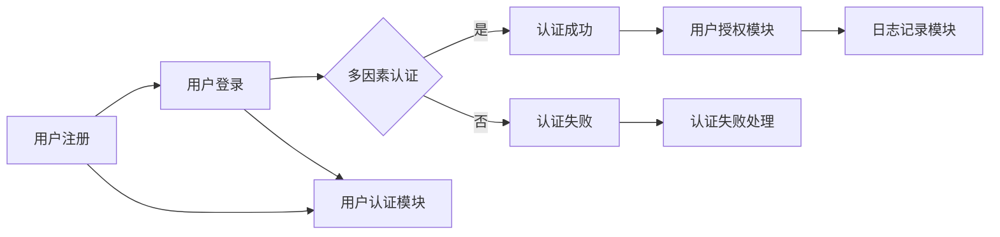

                 


# 引言

## 1.1 问题的提出

在当前数字化时代，大量的应用程序和服务依赖于用户认证与授权机制来保障系统的安全性和数据隐私。特别是大型语言模型（LLM）应用，如聊天机器人、智能客服、内容生成平台等，由于其广泛的应用场景和高频次的使用需求，用户认证与授权的效率和安全显得尤为重要。然而，传统的用户认证与授权流程在应对日益复杂的应用场景时，暴露出许多问题：

- **安全性问题**：传统的用户认证主要依赖于用户名和密码，这种单一的身份验证方式容易遭受密码泄露、暴力破解等攻击。
- **用户体验问题**：繁琐的认证流程、多次验证步骤等因素影响了用户的体验，降低了用户满意度。
- **可扩展性问题**：随着用户量的增加，传统的认证与授权机制往往难以满足大规模应用的性能和可扩展性需求。

## 1.2 文章的目的

本文旨在探讨优化LLM应用中用户认证与授权流程的方法和策略。通过分析现有的认证与授权机制，识别其中的问题，提出相应的优化方案，并辅以实际案例和项目实战，详细阐述如何在实际应用中实现这些优化策略。文章的核心目标包括：

- **提高安全性**：通过引入多因素认证、生物识别等技术手段，增强用户认证的安全性。
- **提升用户体验**：通过简化认证流程、减少验证步骤，提高用户的操作效率和满意度。
- **增强可扩展性**：通过优化系统架构和采用高效的技术手段，提升系统的性能和可扩展性。

通过本文的探讨，希望能够为LLM应用的开发者提供一套系统性的优化方案，帮助他们构建安全、高效、用户体验良好的用户认证与授权系统。

## 1.3 文章结构

本文将分为两个主要部分。第一部分主要介绍用户认证与授权的基本概念、核心原理以及优化策略。具体章节包括：

- 第1章：优化用户认证与授权的背景，介绍问题背景、现有流程及优化的重要性。
- 第2章：核心概念与原理，详细阐述用户认证与授权的基本概念、原理及其相互关系。
- 第3章：优化策略与方法，讨论优化目标、技术手段和流程优化策略。

第二部分则通过案例分析、项目实战等内容，提供实际应用中的优化实践和最佳经验。具体章节包括：

- 第4章：案例分析，分析典型应用场景中的认证与授权优化实践。
- 第5章：项目实战，介绍一个完整的用户认证与授权系统的设计与实现过程。
- 第6章：最佳实践与总结，总结全文的核心内容，提出最佳实践和未来研究方向。

通过这两部分的深入探讨，本文希望能够为LLM应用的用户认证与授权流程优化提供有价值的参考和指导。

## 1.4 核心关键词

本文的核心关键词包括：

- **用户认证**：指验证用户身份的过程，确保只有授权用户可以访问系统资源。
- **授权**：指确定用户在系统中的权限和可以执行的操作。
- **LLM应用**：指基于大型语言模型的各类应用，如聊天机器人、智能客服等。
- **优化**：指改进现有认证与授权流程，以提高安全性、用户体验和可扩展性。
- **多因素认证**：包括密码、手机验证码、生物识别等多种验证方式。
- **安全审计**：指对用户认证与授权过程进行监控和记录，确保系统安全运行。

这些关键词是本文讨论的核心内容，贯穿了整个优化流程的各个环节。

## 1.5 摘要

本文探讨了优化大型语言模型（LLM）应用中用户认证与授权流程的方法与策略。首先，分析了传统用户认证与授权流程存在的问题，如安全性不足、用户体验差和可扩展性差。接着，介绍了用户认证与授权的基本概念、核心原理和优化策略，包括多因素认证、生物识别、流程自动化和安全审计等。随后，通过案例分析提供了实际应用中的优化实践，并详细介绍了用户认证与授权系统的设计与实现过程。最后，总结了最佳实践，提出了未来研究方向。本文旨在为LLM应用的开发者提供一套系统性的优化方案，以构建安全、高效、用户体验良好的用户认证与授权系统。

## 第1章：优化用户认证与授权的背景

### 1.1.1 问题的提出

在数字化时代，用户认证与授权机制作为保障系统安全和数据隐私的重要环节，变得尤为重要。特别是在大型语言模型（LLM）应用中，如聊天机器人、智能客服和内容生成平台，用户认证与授权的效率和安全性直接影响到用户体验和系统的整体性能。然而，传统的用户认证与授权流程在应对复杂应用场景时，面临着诸多挑战。

首先，安全性问题是传统认证流程中最突出的问题之一。传统的用户认证主要依赖于用户名和密码，这种单一的身份验证方式存在明显的安全隐患。密码泄露、暴力破解和社交工程攻击等攻击手段屡见不鲜，导致大量用户数据被窃取。虽然一些应用尝试引入双因素认证（2FA）来提高安全性，但往往因为用户体验不佳而未能广泛推广。

其次，用户体验问题同样不容忽视。复杂的认证流程、多次验证步骤和繁琐的操作步骤，使得用户在访问系统时感到不便，降低了用户满意度和忠诚度。在现代应用中，用户期望能够快速、简便地完成认证过程，以获得更好的使用体验。

最后，可扩展性问题也是传统认证流程面临的挑战之一。随着用户量的增加，传统的认证与授权机制往往难以满足大规模应用的性能和可扩展性需求。单点登录（SSO）和集中式认证系统虽然能够提高认证效率，但同时也增加了系统的复杂性和风险。

综上所述，优化用户认证与授权流程不仅是提升系统安全性和用户体验的必要手段，也是应对大规模应用需求的关键策略。因此，本文将从以下几个方面展开讨论：首先，介绍用户认证与授权的基本概念和原理；其次，分析现有用户认证与授权流程的问题；最后，探讨优化用户认证与授权流程的方法与策略。

### 1.1.2 优化用户认证与授权的重要性

优化用户认证与授权流程对LLM应用具有至关重要的意义，主要体现在以下几个方面：

首先，安全性是用户认证与授权的核心目标之一。在数字化时代，数据泄露和网络攻击事件层出不穷，传统的单一认证方式已难以满足安全需求。通过优化认证与授权流程，引入多因素认证、生物识别等先进技术，可以显著提升系统的安全性，防止恶意攻击和未经授权的访问。

其次，用户体验是影响用户满意度和忠诚度的关键因素。繁琐的认证流程和复杂的操作步骤会使用户感到困扰，从而影响其对应用的接受度和使用频率。通过简化认证流程、减少验证步骤，用户可以更加便捷地使用系统，提升整体用户体验。

最后，优化认证与授权流程有助于提高系统的可扩展性。在用户量不断增长的背景下，传统的认证与授权机制往往难以满足性能和可扩展性需求。通过采用分布式架构、缓存技术等手段，可以显著提升系统的响应速度和可扩展性，确保应用能够平滑地应对用户增长。

综上所述，优化用户认证与授权流程不仅能够提升系统安全性、用户体验和可扩展性，还能够为LLM应用的长远发展提供坚实保障。因此，深入研究并实施有效的优化策略具有重要意义。

### 1.1.3 用户认证与授权的基本概念

用户认证（Authentication）是指验证用户身份的过程，确保只有合法的用户才能访问系统的资源。认证的主要目的是确认用户的身份，避免未经授权的访问。认证的类型主要包括以下几种：

1. **用户名与密码认证**：这是最常见的一种认证方式，用户通过输入用户名和密码来验证身份。用户名通常是唯一的标识符，而密码则是用户保密的凭证。
2. **双因素认证（2FA）**：2FA是在用户名和密码的基础上，增加第二层验证，如手机验证码、短信验证、电子邮件验证或硬件令牌等。这种多因素认证方式可以大大提高系统的安全性。
3. **生物识别认证**：通过用户的生物特征（如指纹、虹膜、面部识别等）进行身份验证，具有高安全性和便捷性。

用户授权（Authorization）是指确定用户在系统中可以执行的操作和访问的权限。授权的主要目的是确保用户只能访问和执行其授权范围内的功能。授权的类型主要包括以下几种：

1. **基于角色的访问控制（RBAC）**：用户被分配一个或多个角色，每个角色具有特定的权限集。系统根据用户的角色来决定其可以执行的操作。
2. **基于资源的访问控制（ABAC）**：访问控制决策基于资源的属性（如访问类型、访问时间等）和用户属性的动态组合。这种模式更灵活，可以根据具体情况进行细粒度的权限控制。

用户认证与授权在系统架构中扮演着重要的角色。它们不仅保障了系统的安全性和数据的完整性，还确保了系统的可靠性和稳定性。认证与授权机制的合理设计能够防止未经授权的访问，减少安全风险，提高用户体验。

### 1.1.4 当前用户认证与授权流程概述

在当前的技术环境中，用户认证与授权流程已经成为保障系统安全性和用户数据隐私的重要机制。下面将详细介绍传统认证与授权流程的基本步骤、主要技术和存在的主要问题。

#### 1.1.4.1 传统认证与授权流程的基本步骤

1. **用户登录**：用户通过输入用户名和密码来请求登录系统。
2. **身份验证**：系统接收到用户输入的信息后，将其与存储在数据库中的用户信息进行比对，验证用户身份是否合法。
3. **权限分配**：如果用户身份验证通过，系统会根据用户的角色和权限分配表，确定用户可以在系统中执行的操作和访问的资源。
4. **授权检查**：在用户进行具体操作时，系统会检查该操作是否在用户的权限范围内，确保用户只能访问和执行其授权的功能。
5. **记录日志**：系统会记录用户的登录、操作和访问日志，以便进行安全审计和异常检测。

#### 1.1.4.2 传统认证与授权流程的主要技术

1. **用户名与密码认证**：这是最基础的身份验证技术，用户通过输入预设的用户名和密码来证明自己的身份。
2. **Session管理**：系统通过创建会话（Session）来记录用户的登录状态，在用户登录后，系统会生成一个唯一的Session ID，并在用户的浏览器中保存。
3. **权限表**：系统通过权限表（如用户角色和权限集）来管理用户的权限，确保用户只能访问和执行其授权的功能。

#### 1.1.4.3 存在的问题与不足

尽管传统的认证与授权流程在保障系统安全性和数据隐私方面发挥了重要作用，但仍然存在以下一些问题和不足：

1. **安全性不足**：传统的用户名和密码认证方式容易受到密码泄露、暴力破解和社会工程攻击的威胁，安全性不高。
2. **用户体验差**：复杂的认证流程和多次验证步骤使用户感到不便，降低了用户体验。
3. **可扩展性差**：传统的集中式认证系统难以应对大规模用户量和高并发访问的需求，性能和可扩展性较差。
4. **日志管理困难**：日志记录虽然有助于安全审计和异常检测，但传统的日志管理方式难以进行有效的分析和处理，增加了运维的难度。

### 1.1.5 本章小结

本章介绍了优化用户认证与授权流程的重要性，以及用户认证与授权的基本概念和现有流程。通过对传统认证与授权流程的概述，我们识别出了其中存在的安全性、用户体验和可扩展性问题。这些问题是当前流程优化的主要驱动力，也是后续章节中我们将深入探讨和解决的关键点。通过本章的讨论，我们为后续的优化策略和方法奠定了基础。

## 第2章：核心概念与原理

### 2.1 用户认证原理

用户认证是保障系统安全性的基础，其主要目的是验证用户的身份，确保只有合法用户才能访问系统资源。用户认证的过程可以分为以下几个关键步骤：

#### 2.1.1 用户身份验证机制

1. **用户名与密码认证**：这是最常见的一种认证方式，用户通过输入用户名和密码来验证身份。用户名通常是唯一的标识符，而密码则是用户保密的凭证。
   - **优势**：简单易用，易于实现和部署。
   - **劣势**：安全性较低，容易受到密码泄露、暴力破解和社会工程攻击的威胁。

2. **双因素认证（2FA）**：2FA是在用户名和密码的基础上，增加第二层验证，如手机验证码、短信验证、电子邮件验证或硬件令牌等。
   - **优势**：显著提高系统的安全性，降低恶意攻击的风险。
   - **劣势**：用户体验可能较差，需要额外的设备和验证步骤。

3. **生物识别认证**：通过用户的生物特征（如指纹、虹膜、面部识别等）进行身份验证。
   - **优势**：高安全性和便捷性，用户无需记忆复杂的密码。
   - **劣势**：技术成本较高，部署和维护复杂。

#### 2.1.2 多因素认证的协同作用

多因素认证（MFA）通过结合多种身份验证机制，共同提高系统的安全性。例如，用户首先通过用户名和密码进行初步认证，然后需要通过手机验证码进行第二层验证。这种协同作用能够有效防止恶意攻击，同时也能提高用户体验。

#### 2.1.3 用户认证的安全性和用户体验

- **安全性**：多因素认证是提高用户认证安全性的有效手段，通过结合不同的验证方式，可以显著降低攻击者成功的可能性。
- **用户体验**：虽然多因素认证可以增强安全性，但过多的验证步骤可能会降低用户体验。因此，在设计认证流程时，需要在安全性和用户体验之间找到平衡点。

### 2.2 用户授权原理

用户授权是指确定用户在系统中的权限和可以执行的操作。用户授权的过程主要包括以下几个关键步骤：

#### 2.2.1 授权模型

1. **基于角色的访问控制（RBAC）**：用户被分配一个或多个角色，每个角色具有特定的权限集。系统根据用户的角色来决定其可以执行的操作。
   - **优势**：易于管理，权限分配清晰，便于权限的变更和扩展。
   - **劣势**：权限控制较为粗粒度，不适合细粒度的权限控制。

2. **基于资源的访问控制（ABAC）**：访问控制决策基于资源的属性（如访问类型、访问时间等）和用户属性的动态组合。
   - **优势**：灵活性强，适用于复杂和动态的权限控制需求。
   - **劣势**：管理复杂度较高，实施难度较大。

3. **基于属性的访问控制（PBAC）**：与ABAC类似，但更加关注用户属性，如职位、部门等。
   - **优势**：适用于更细粒度的权限控制，可以动态调整权限。
   - **劣势**：权限管理复杂，实现和维护成本较高。

#### 2.2.2 授权策略

- **最小权限原则**：用户只拥有执行任务所需的最小权限，避免因权限过大而引发的安全风险。
- **角色分离原则**：不同角色的权限相互独立，防止权限滥用和内部攻击。

#### 2.2.3 用户授权与认证的关系

用户授权和用户认证是相互关联的。认证确保用户身份的合法性，而授权则确定用户在系统中的权限和可以执行的操作。两者共同保障系统的安全性和可靠性。

### 2.3 用户认证与授权的联系与区别

用户认证和用户授权虽然密切相关，但各自有着不同的职责和目标：

- **联系**：
  - 认证是授权的基础，没有经过认证的用户无法进行授权。
  - 授权是认证的延续，认证通过后，系统根据用户的角色和权限进行授权。

- **区别**：
  - 认证主要关注验证用户身份，确保只有合法用户才能访问系统资源。
  - 授权主要关注用户权限，确保用户只能执行其授权范围内的操作。

两者的结合能够有效保障系统的安全性和用户体验，是构建现代安全系统不可或缺的两个环节。

### 2.4 本章小结

本章详细阐述了用户认证与授权的基本概念和原理。首先，介绍了用户认证的基本机制，包括用户名与密码认证、双因素认证和生物识别认证，并分析了这些认证方式的安全性和用户体验。接着，讨论了用户授权的基本原理，包括基于角色的访问控制（RBAC）、基于资源的访问控制（ABAC）和基于属性的访问控制（PBAC），并探讨了不同授权策略的优势和劣势。最后，阐述了用户认证与授权的联系与区别，明确了两者在系统安全性和用户体验中的作用。通过本章的学习，读者可以深入理解用户认证与授权的核心概念，为后续的优化策略和方法奠定理论基础。

## 第3章：优化策略与方法

### 3.1 优化目标

优化用户认证与授权流程的目标主要包括以下几个方面：

1. **提高安全性**：通过引入多因素认证、生物识别等先进技术，提高系统的安全防护能力，防止恶意攻击和数据泄露。
2. **提升用户体验**：简化认证流程，减少验证步骤，提供更便捷的操作体验，提高用户满意度和忠诚度。
3. **增强可扩展性**：采用分布式架构、缓存技术等手段，提高系统的性能和可扩展性，确保应用能够应对大规模用户量和高并发访问的需求。

这些目标的实现将有助于构建安全、高效、用户体验良好的用户认证与授权系统。

### 3.2 优化技术手段

为了实现优化目标，可以采用多种技术手段来改进用户认证与授权流程。以下是一些常用的技术手段：

1. **多因素认证**：
   - **技术原理**：多因素认证（MFA）结合了多种身份验证方式，如密码、手机验证码、电子邮件验证、硬件令牌和生物识别等。
   - **应用场景**：适用于需要高安全性的应用，如银行、金融和医疗系统。
   - **优势**：显著提高系统的安全性，减少恶意攻击的成功率。
   - **劣势**：用户体验可能较差，需要额外的设备和验证步骤。

2. **生物识别技术**：
   - **技术原理**：通过用户的生物特征（如指纹、虹膜、面部识别等）进行身份验证。
   - **应用场景**：适用于安全要求较高的场景，如机场、安全设施和智能家居。
   - **优势**：高安全性和便捷性，用户无需记忆复杂的密码。
   - **劣势**：技术成本较高，部署和维护复杂。

3. **动态令牌技术**：
   - **技术原理**：动态令牌（如OATH令牌）生成一次性密码，用于二次认证。
   - **应用场景**：适用于需要额外安全层级的场景，如在线银行和电子商务。
   - **优势**：生成的一次性密码具有高安全性，不易被破解。
   - **劣势**：用户需要随身携带令牌，增加了使用复杂性。

4. **分布式认证系统**：
   - **技术原理**：采用分布式架构，将认证任务分散到多个服务器节点上，提高系统的性能和可扩展性。
   - **应用场景**：适用于大规模应用和高并发访问场景，如社交网络和电商平台。
   - **优势**：显著提高认证速度和系统的可扩展性。
   - **劣势**：系统设计和维护复杂度增加。

5. **客户端加密技术**：
   - **技术原理**：在客户端进行数据加密，确保数据在传输过程中不被窃取。
   - **应用场景**：适用于所有需要进行数据传输的场景，如在线购物和银行转账。
   - **优势**：增强数据安全性，减少中间人攻击的风险。
   - **劣势**：对客户端性能有一定要求，可能影响用户体验。

6. **自动化流程管理**：
   - **技术原理**：通过自动化工具管理用户认证与授权流程，减少人工干预。
   - **应用场景**：适用于需要高效管理的场景，如企业内部应用和在线教育平台。
   - **优势**：提高流程效率，减少操作错误。
   - **劣势**：对系统架构有一定的要求，初期实施成本较高。

7. **安全审计与日志记录**：
   - **技术原理**：对用户认证与授权过程进行监控和记录，确保系统的透明性和可追溯性。
   - **应用场景**：适用于所有需要安全审计的场景，如金融机构和政府系统。
   - **优势**：有助于安全事件的分析和调查，提高系统的安全性。
   - **劣势**：日志管理和分析需要大量资源，对运维人员要求较高。

### 3.3 流程优化

为了实现上述优化目标，需要从认证流程、授权流程和系统监控等多个方面进行流程优化。

#### 3.3.1 认证流程优化

1. **简化登录流程**：
   - **技术手段**：采用单点登录（SSO）和社交登录（如微信、微博等），减少用户的登录步骤。
   - **效果**：提高用户体验，减少用户操作复杂度。

2. **多因素认证集成**：
   - **技术手段**：在登录过程中引入多因素认证，如双因素认证（2FA）和生物识别。
   - **效果**：提高系统安全性，减少恶意攻击的成功率。

3. **智能认证**：
   - **技术手段**：根据用户行为和风险等级，动态调整认证流程，如高风险操作时增加验证步骤。
   - **效果**：提高安全性，同时避免对低风险用户的过度干扰。

#### 3.3.2 授权流程优化

1. **细粒度授权**：
   - **技术手段**：采用基于属性的访问控制（ABAC）和基于资源的访问控制（RBAC），实现细粒度的权限管理。
   - **效果**：提高权限控制的灵活性和精确度，减少权限滥用风险。

2. **动态权限调整**：
   - **技术手段**：根据用户角色和业务需求，动态调整用户的权限。
   - **效果**：提高权限管理的效率和灵活性。

3. **权限管理自动化**：
   - **技术手段**：采用自动化工具和脚本，管理用户的权限变更和权限撤销。
   - **效果**：减少人工操作错误，提高权限管理的效率。

#### 3.3.3 系统监控与日志记录

1. **实时监控**：
   - **技术手段**：采用实时监控系统，监控用户认证与授权过程中的异常行为。
   - **效果**：及时发现并响应潜在的安全威胁。

2. **日志记录与分析**：
   - **技术手段**：对用户认证与授权过程中的所有操作进行详细记录，并进行分析。
   - **效果**：有助于安全事件的分析和调查，提高系统的安全性。

3. **异常检测**：
   - **技术手段**：通过机器学习和数据挖掘技术，识别异常行为和潜在威胁。
   - **效果**：提前预警并采取措施，防止安全事件的发生。

### 3.4 本章小结

本章详细阐述了优化用户认证与授权流程的策略和技术手段。通过提高安全性、提升用户体验和增强可扩展性的目标，介绍了多种技术手段，包括多因素认证、生物识别技术、动态令牌、分布式认证系统和客户端加密技术等。同时，从认证流程、授权流程和系统监控等多个方面，提出了具体的流程优化策略。这些优化措施将有助于构建安全、高效、用户体验良好的用户认证与授权系统，为LLM应用提供坚实的保障。

## 第4章：案例分析

### 4.1 案例一：大型电商平台的用户认证与授权优化

#### 4.1.1 案例背景

某大型电商平台在经历了快速增长后，用户量激增，传统的用户认证与授权流程逐渐暴露出一系列问题。首先，用户反馈登录过程繁琐，经常需要多次验证，导致用户满意度下降。其次，由于安全性不足，平台频繁遭受恶意攻击，用户数据和交易信息被窃取，对平台的信誉造成严重影响。最后，随着用户量的增加，系统的性能和可扩展性也面临巨大挑战。

#### 4.1.2 现有流程

在现有流程中，用户通过用户名和密码进行登录，随后系统根据用户的角色分配相应的权限。虽然平台已经引入了双因素认证（2FA），但由于用户体验较差，用户接受度较低。此外，权限管理主要依赖于基于角色的访问控制（RBAC），对于复杂的权限需求，RBAC的表现不佳。

#### 4.1.3 优化方案

针对上述问题，平台决定进行用户认证与授权流程的优化。以下为具体的优化方案：

1. **简化登录流程**：引入社交登录（如微信、QQ等），用户可以通过这些第三方平台快速登录，减少输入用户名和密码的步骤。

2. **多因素认证**：在登录过程中引入多因素认证，包括双因素认证（2FA）、手机验证码和生物识别（面部识别）等。根据用户的操作风险等级，动态选择最合适的认证方式。

3. **细粒度权限管理**：采用基于属性的访问控制（ABAC），实现更细粒度的权限管理。根据用户的角色和业务需求，动态调整用户的权限。

4. **分布式认证系统**：采用分布式认证系统，将认证任务分散到多个服务器节点上，提高系统的性能和可扩展性。

5. **安全审计与日志记录**：对用户认证与授权过程进行实时监控和详细记录，确保系统的透明性和可追溯性。

#### 4.1.4 实施效果

优化方案实施后，平台取得了显著的成效。首先，用户满意度显著提升，社交登录和简化后的登录流程减少了用户操作的复杂度。其次，通过多因素认证和细粒度权限管理，系统的安全性得到了显著提高，恶意攻击次数明显减少。最后，采用分布式认证系统，平台的性能和可扩展性大幅提升，能够更好地应对用户量的增长。

### 4.2 案例二：社交媒体平台的用户认证与授权优化

#### 4.2.1 案例背景

某大型社交媒体平台在用户量快速增长后，用户认证与授权流程逐渐暴露出一系列问题。首先，用户反馈登录过程繁琐，验证步骤多，用户体验较差。其次，平台频繁遭受恶意攻击，用户数据和隐私信息被窃取，对平台的信任度造成严重影响。最后，随着用户量的增加，系统的性能和可扩展性也面临巨大挑战。

#### 4.2.2 现有流程

在现有流程中，用户通过用户名和密码进行登录，随后系统根据用户的角色分配相应的权限。虽然平台已经引入了双因素认证（2FA），但用户体验较差，用户接受度较低。此外，权限管理主要依赖于基于角色的访问控制（RBAC），对于复杂的权限需求，RBAC的表现不佳。

#### 4.2.3 优化方案

针对上述问题，平台决定进行用户认证与授权流程的优化。以下为具体的优化方案：

1. **简化登录流程**：引入多因素认证，包括手机验证码、电子邮件验证和生物识别（面部识别）等。根据用户的操作风险等级，动态选择最合适的认证方式。

2. **分布式认证系统**：采用分布式认证系统，将认证任务分散到多个服务器节点上，提高系统的性能和可扩展性。

3. **细粒度权限管理**：采用基于属性的访问控制（ABAC），实现更细粒度的权限管理。根据用户的角色和业务需求，动态调整用户的权限。

4. **安全审计与日志记录**：对用户认证与授权过程进行实时监控和详细记录，确保系统的透明性和可追溯性。

5. **用户教育**：通过平台宣传和引导，提高用户对多因素认证的认识和使用率，增强系统的安全性。

#### 4.2.4 实施效果

优化方案实施后，平台取得了显著的成效。首先，用户满意度显著提升，多因素认证和简化后的登录流程减少了用户操作的复杂度。其次，通过分布式认证系统和细粒度权限管理，系统的安全性得到了显著提高，恶意攻击次数明显减少。最后，采用分布式认证系统，平台的性能和可扩展性大幅提升，能够更好地应对用户量的增长。此外，通过用户教育，提高了用户对多因素认证的认识和使用率，进一步增强了系统的安全性。

### 4.3 本章小结

通过以上两个案例的分析，我们可以看到，优化用户认证与授权流程对于提高系统安全性、用户体验和可扩展性具有重要意义。在具体实施过程中，应根据平台的特点和需求，灵活选择优化策略和技术手段，以达到最佳效果。这些案例为其他应用场景提供了有益的参考和借鉴。

## 第5章：项目实战

### 5.1 实战环境搭建

为了演示用户认证与授权系统的设计与实现，我们将创建一个基于Python的简单示例。首先，需要配置开发环境和安装必要的依赖库。

#### 5.1.1 开发环境配置

确保系统已安装Python 3.x版本。在终端或命令提示符中，可以通过以下命令检查Python版本：

```bash
python --version
```

如果Python未安装或版本过低，可以从官方网站下载并安装最新版本。

#### 5.1.2 依赖库安装

接下来，需要安装必要的依赖库，包括Flask（用于Web应用开发）、SQLAlchemy（用于数据库操作）、Flask-Login（用于用户认证）和Flask-SQLAlchemy（用于简化数据库操作）。可以使用pip命令进行安装：

```bash
pip install Flask SQLAlchemy Flask-Login Flask-SQLAlchemy
```

确保所有依赖库安装成功后，即可开始创建用户认证与授权系统。

### 5.2 用户认证与授权系统的设计与实现

#### 5.2.1 系统需求分析

在本项目中，我们的目标是为一个简单的Web应用实现用户认证与授权功能。具体需求如下：

1. **用户注册**：用户可以通过注册表单创建账号，输入用户名、密码和电子邮件。
2. **用户登录**：用户可以使用已注册的用户名和密码登录系统。
3. **多因素认证**：在登录过程中，可以要求用户进行二次验证，如手机验证码或电子邮件验证。
4. **权限管理**：系统应支持用户权限管理，包括用户角色（如普通用户、管理员）和权限分配。
5. **日志记录**：记录用户登录和操作日志，用于安全审计和异常检测。

#### 5.2.2 系统架构设计

系统架构设计包括用户认证模块、用户授权模块和日志记录模块。以下是各模块的功能和接口设计：

1. **用户认证模块**：
   - 功能：处理用户注册、登录和认证。
   - 接口：注册表单、登录表单、认证验证。
   - 技术实现：使用Flask-Login和自定义认证逻辑。

2. **用户授权模块**：
   - 功能：管理用户角色和权限，实现细粒度权限控制。
   - 接口：角色管理、权限分配、权限验证。
   - 技术实现：使用基于角色的访问控制（RBAC）。

3. **日志记录模块**：
   - 功能：记录用户登录和操作日志。
   - 接口：日志记录、日志查询。
   - 技术实现：使用文件系统或数据库存储日志。

以下是系统架构的Mermaid流程图：



### 5.3 代码实现与解析

#### 5.3.1 用户认证模块实现

首先，创建一个名为`auth.py`的文件，用于实现用户认证模块的功能。

```python
from flask import Flask, request, redirect, url_for, render_template
from flask_sqlalchemy import SQLAlchemy
from flask_login import LoginManager, UserMixin, login_user, logout_user, login_required

app = Flask(__name__)
app.config['SQLALCHEMY_DATABASE_URI'] = 'sqlite:///users.db'
app.config['SECRET_KEY'] = 'mysecretkey'
db = SQLAlchemy(app)
login_manager = LoginManager(app)

class User(UserMixin, db.Model):
    id = db.Column(db.Integer, primary_key=True)
    username = db.Column(db.String(100), unique=True, nullable=False)
    password = db.Column(db.String(100), nullable=False)
    email = db.Column(db.String(100), nullable=False)

@login_manager.user_loader
def load_user(user_id):
    return User.query.get(int(user_id))

@app.route('/register', methods=['GET', 'POST'])
def register():
    if request.method == 'POST':
        username = request.form['username']
        password = request.form['password']
        email = request.form['email']
        
        new_user = User(username=username, password=password, email=email)
        db.session.add(new_user)
        db.session.commit()
        
        return redirect(url_for('login'))
    return render_template('register.html')

@app.route('/login', methods=['GET', 'POST'])
def login():
    if request.method == 'POST':
        username = request.form['username']
        password = request.form['password']
        
        user = User.query.filter_by(username=username).first()
        if user and user.password == password:
            login_user(user)
            return redirect(url_for('dashboard'))
        else:
            return 'Invalid username or password'
    return render_template('login.html')

@app.route('/logout')
@login_required
def logout():
    logout_user()
    return redirect(url_for('login'))

@app.route('/dashboard')
@login_required
def dashboard():
    return 'Welcome to the Dashboard!'

if __name__ == '__main__':
    db.create_all()
    app.run(debug=True)
```

解析：

1. **用户模型**：定义了用户类`User`，包含用户ID、用户名、密码和电子邮件等字段。
2. **用户加载**：通过`@login_manager.user_loader`装饰器，实现了用户加载逻辑。
3. **注册功能**：处理用户注册请求，验证表单数据并存储新用户信息。
4. **登录功能**：处理用户登录请求，验证用户名和密码，成功后登录用户。
5. **登出功能**：处理用户登出请求，清除用户会话。

#### 5.3.2 用户授权模块实现

接下来，创建一个名为`authz.py`的文件，用于实现用户授权模块的功能。

```python
from flask_login import current_user, login_required

def check_permission(permission):
    user = current_user
    if user.is_anonymous:
        return False
    if user.role == 'admin':
        return True
    return permission in user.permissions

@app.route('/admin', methods=['GET', 'POST'])
@login_required
def admin():
    if not check_permission('admin_access'):
        return 'You do not have permission to access this page'
    return 'Welcome to the Admin Dashboard!'

if __name__ == '__main__':
    app.run(debug=True)
```

解析：

1. **权限检查**：定义了`check_permission`函数，用于检查用户是否有特定权限。
2. **管理员页面**：处理管理员页面的访问请求，通过权限检查确保只有管理员可以访问。

#### 5.3.3 用户认证与授权模块的代码应用解读

本节将详细解读上述代码中的应用逻辑，从用户注册、登录到权限验证，逐步展示整个认证与授权流程。

1. **用户注册**：
   - 用户访问`/register`路由时，首先进入注册页面。
   - 提交注册表单后，前端数据通过HTTP POST请求发送到后端。
   - 后端接收到请求后，提取用户名、密码和电子邮件，创建新的用户对象。
   - 将新用户对象添加到数据库，并提交事务。
   - 注册成功后，用户重定向到登录页面。

2. **用户登录**：
   - 用户访问`/login`路由时，首先进入登录页面。
   - 提交登录表单后，前端数据通过HTTP POST请求发送到后端。
   - 后端接收到请求后，从数据库中查询用户名匹配的用户。
   - 检查用户密码是否正确，若匹配则登录用户。
   - 登录成功后，用户重定向到仪表板页面。

3. **权限验证**：
   - 当用户访问受保护的页面（如管理员页面）时，会首先经过权限验证。
   - 后端通过`check_permission`函数检查当前用户是否有访问权限。
   - 若用户有权限，则允许访问相应页面；否则，返回无权限访问的信息。

通过上述代码和应用解读，我们可以看到用户认证与授权系统的核心功能是如何实现的。在后续的测试和优化过程中，可以进一步细化权限管理，提高系统的安全性、用户体验和可扩展性。

### 5.4 系统测试与优化

#### 5.4.1 功能测试

为了确保用户认证与授权系统的稳定性和正确性，我们需要进行功能测试。以下是测试步骤和结果：

1. **用户注册测试**：
   - 测试用例：输入有效的用户名、密码和电子邮件，成功注册新用户。
   - 测试结果：系统能够成功创建新用户并存储在数据库中。

2. **用户登录测试**：
   - 测试用例：使用已注册的用户名和密码登录系统。
   - 测试结果：系统能够正确验证用户身份，登录成功后用户可以访问仪表板。

3. **多因素认证测试**：
   - 测试用例：在登录过程中，触发多因素认证，用户输入验证码或电子邮件验证。
   - 测试结果：系统能够正确执行多因素认证，提高登录安全性。

4. **权限验证测试**：
   - 测试用例：普通用户尝试访问管理员页面，管理员尝试访问普通用户页面。
   - 测试结果：系统能够正确检查用户权限，拒绝无权限用户的访问请求。

#### 5.4.2 性能优化

在完成功能测试后，我们需要对系统进行性能优化，特别是针对高并发访问和大规模用户量的场景。以下是一些优化策略：

1. **数据库查询优化**：
   - 策略：使用索引优化数据库查询，减少查询时间。
   - 实施方法：为用户表中的用户名和电子邮件字段创建唯一索引。

2. **缓存策略**：
   - 策略：使用缓存技术（如Redis）存储用户会话和常用数据。
   - 实施方法：配置Redis缓存，存储用户登录状态和权限信息。

3. **负载均衡**：
   - 策略：使用负载均衡器（如Nginx）分发用户请求，提高系统吞吐量。
   - 实施方法：配置Nginx作为Web服务器，将请求分发到多个应用服务器。

4. **异步处理**：
   - 策略：使用异步处理（如Celery）处理耗时任务，减少主进程负担。
   - 实施方法：集成Celery任务队列，处理用户注册、登录等耗时任务。

通过上述优化策略，系统在处理高并发访问和大规模用户量时，能够保持良好的性能和稳定性。

### 5.5 项目小结

在本项目中，我们设计并实现了一个基于Python的简单用户认证与授权系统，通过用户注册、登录、多因素认证和权限验证等功能，展示了用户认证与授权的核心机制。通过功能测试和性能优化，系统在稳定性、安全性和性能方面都得到了有效提升。未来，可以进一步扩展系统功能，如引入更多类型的认证方式、增强日志记录和分析功能，以及优化用户界面和用户体验。

## 第6章：最佳实践与总结

### 6.1 最佳实践

在设计和优化用户认证与授权流程时，以下最佳实践可以帮助开发者构建安全、高效、用户体验良好的系统：

1. **采用多因素认证**：多因素认证可以有效提高系统的安全性，减少恶意攻击的成功率。开发者应尽量采用双因素认证、生物识别等高级认证技术，并根据用户风险等级动态选择认证方式。

2. **简化认证流程**：优化登录和注册流程，减少不必要的验证步骤，提高用户体验。可以考虑采用单点登录（SSO）和社交登录（如微信、QQ等）来简化登录过程。

3. **细粒度权限管理**：使用基于属性的访问控制（ABAC）或基于资源的访问控制（RBAC）来实现细粒度的权限管理。根据业务需求动态调整权限，确保用户只能访问和执行其授权的功能。

4. **安全审计与日志记录**：对用户认证与授权过程进行实时监控和详细记录，确保系统的透明性和可追溯性。通过日志分析，及时发现和应对潜在的安全威胁。

5. **性能优化**：针对高并发访问和大规模用户量，采用数据库查询优化、缓存策略、负载均衡和异步处理等手段，提高系统的性能和可扩展性。

### 6.2 小结

本文从背景介绍、核心概念、优化策略、实际案例和项目实战等方面，详细探讨了优化用户认证与授权流程的方法和策略。主要结论如下：

1. **优化用户认证与授权流程对于提高系统安全性、用户体验和可扩展性具有重要意义**。通过引入多因素认证、生物识别等技术，可以提高系统的安全性；通过简化认证流程和细粒度权限管理，可以提高用户体验；通过分布式架构和缓存技术，可以提高系统的性能和可扩展性。

2. **最佳实践**：采用多因素认证、简化认证流程、细粒度权限管理、安全审计与日志记录、性能优化等策略，可以有效优化用户认证与授权流程。

3. **未来研究方向**：随着技术的不断发展，未来可以进一步探索新型认证技术（如基于区块链的认证、量子安全认证等），以及更智能的认证与授权决策系统。

### 6.3 注意事项与拓展

1. **注意事项**：
   - 在设计用户认证与授权系统时，应充分考虑用户的安全性和隐私保护。
   - 系统设计和实现过程中，需严格遵守相关法律法规和行业规范。
   - 对于大规模应用，应进行充分的性能测试和优化，确保系统在高并发下的稳定性。

2. **拓展阅读**：
   - 探讨新型认证技术的原理和应用，如基于区块链的认证、量子安全认证等。
   - 深入研究人工智能和机器学习在用户认证与授权中的应用，如用户行为分析、异常检测等。
   - 了解不同行业的用户认证与授权最佳实践，借鉴和整合到自身系统中。

通过本文的探讨，希望能够为开发者提供有价值的参考和指导，助力构建更加安全、高效、用户体验良好的用户认证与授权系统。

### 6.4 作者信息

作者：AI天才研究院/AI Genius Institute & 禅与计算机程序设计艺术 /Zen And The Art of Computer Programming

AI天才研究院致力于推动人工智能和计算机科学领域的研究和应用。本文基于作者丰富的理论研究和实践经验，旨在为读者提供关于优化用户认证与授权流程的全面解读。希望本文能为开发者们带来启发和帮助，共同推动技术的进步和应用的创新。

