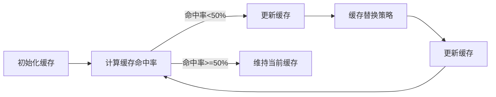
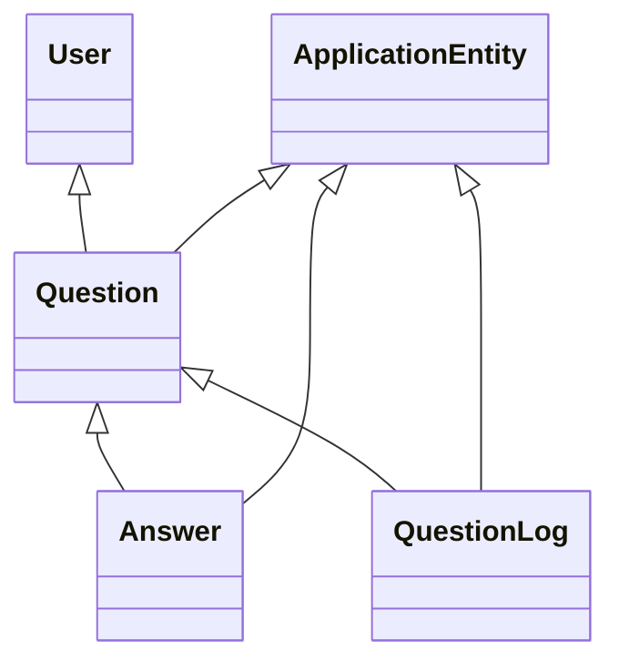
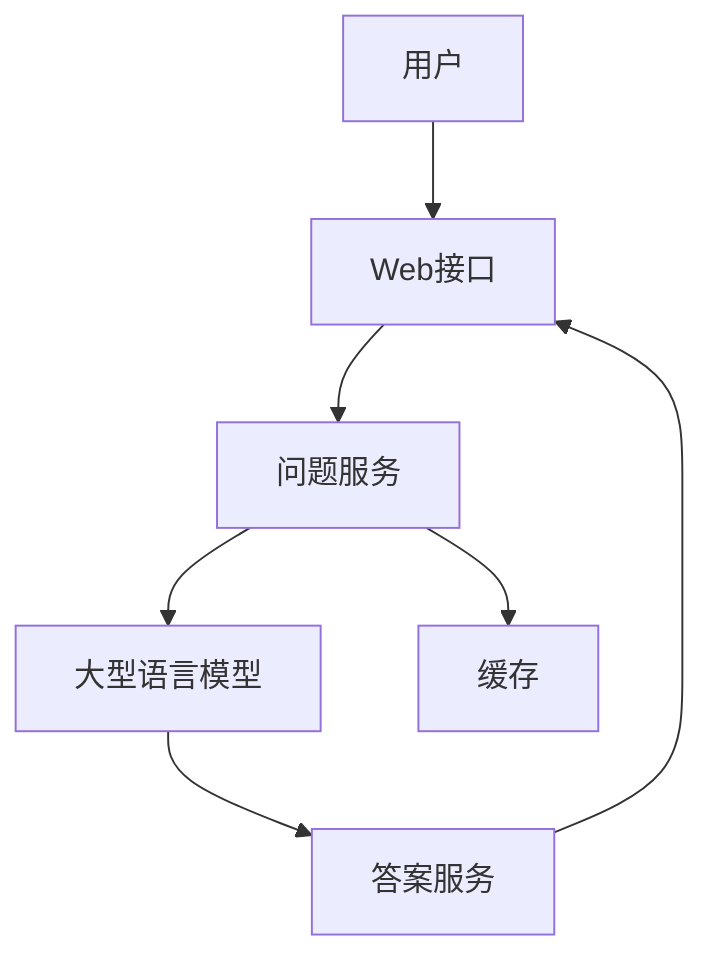
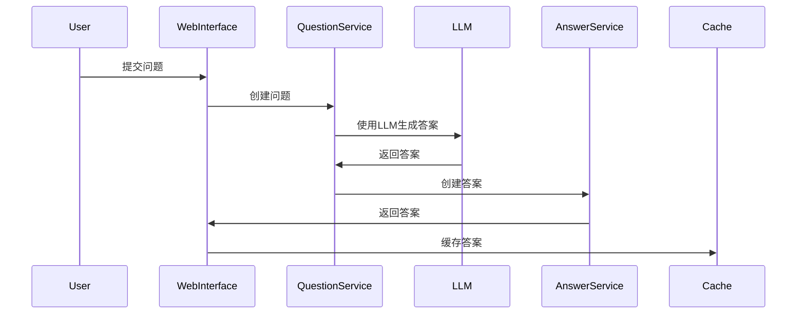

                 


## 让我们一步一步思考：优化LLM应用的缓存策略设计

### 1. 问题背景

在现代计算机科学中，大型语言模型（LLM）已经成为人工智能领域的明星。LLM能够进行自然语言处理、文本生成、翻译等复杂任务，但其高昂的计算和存储成本成为应用推广的障碍。为了提高LLM的效率和可扩展性，缓存策略设计变得至关重要。本文将探讨如何优化LLM应用的缓存策略设计，从而提升性能和降低成本。

### 2. 核心概念

**缓存策略**：缓存策略是一种将经常访问的数据存储在快速访问存储器中的方法，以提高系统性能。

**大型语言模型（LLM）**：LLM是一种能够处理和理解自然语言的大型神经网络模型。

**应用场景**：LLM在自然语言处理、机器翻译、问答系统、文本生成等领域有广泛的应用。

### 3. 概念属性特征对比表格

| 概念        | 属性特征                     | 对比结果                           |
| ----------- | ---------------------------- | ---------------------------------- |
| 缓存策略    | 快速访问、减少I/O操作       | 提高系统性能                       |
| LLM         | 大规模、强鲁棒性、复杂模型 | 提高自然语言处理能力               |
| 应用场景    | 多样化、特定需求           | 根据不同需求选择合适的LLM和应用策略 |

### 4. ER实体关系图架构

```mermaid
erDiagram
  CacheStrategy ||--|{ LLM : Uses}
  LLM ||--|{ Application : Used_in}
  Application ||--|{ Data : Stores}
```

### 5. 缓存策略基础

**缓存策略的定义**：缓存策略是一种将经常访问的数据存储在快速访问存储器中的方法，以提高系统性能。

**缓存策略的类型**：
- 数据缓存：缓存数据以减少I/O操作。
- 线程缓存：缓存线程以减少创建和销毁线程的开销。
- 页面缓存：缓存网页以加快访问速度。

**缓存策略的优点与不足**：
- 优点：提高系统性能、减少I/O操作、降低成本。
- 不足：缓存污染、缓存失效、缓存一致性等问题。

### 6. 缓存策略原理

**缓存机制**：缓存机制包括缓存大小、缓存替换策略和缓存一致性等。

**缓存命中率**：缓存命中率是指缓存中命中请求的次数与总请求次数之比。

**缓存替换策略**：
- FIFO（先进先出）。
- LRU（最近最少使用）。
- LFU（最少使用）。

### 7. 缓存策略与LLM的关系

**LLM的工作原理**：LLM基于深度学习，通过大量的文本数据进行训练，从而学会生成和理解自然语言。

**缓存策略在LLM中的应用**：在LLM应用中，缓存策略主要用于缓存预训练模型和中间计算结果。

**LLM应用中的常见缓存问题**：
- 缓存污染：缓存中存储的数据被频繁访问，导致缓存命中率下降。
- 缓存失效：缓存中的数据过期，需要重新计算。
- 缓存一致性：不同缓存之间的数据不一致，可能导致错误。

### 8. 优化缓存策略的算法原理

**算法mermaid流程图**：



**Python源代码**：

```python
def optimize_cache(cache_size, data_stream):
    cache = []
    for data in data_stream:
        if data not in cache:
            if len(cache) < cache_size:
                cache.append(data)
            else:
                # 使用LRU替换策略
                cache.append(data)
                cache.pop(0)
        # 更新缓存命中率
        hit_rate = calculate_hit_rate(cache, data_stream)
        if hit_rate < 50:
            # 更新缓存
            update_cache(cache, data_stream)
        else:
            # 维持当前缓存
            maintain_cache(cache)

def calculate_hit_rate(cache, data_stream):
    hit_count = 0
    for data in data_stream:
        if data in cache:
            hit_count += 1
    return hit_count / len(data_stream)

def update_cache(cache, data_stream):
    # 根据LRU策略更新缓存
    for data in data_stream:
        if data not in cache:
            cache.append(data)
            if len(cache) > cache_size:
                cache.pop(0)

def maintain_cache(cache):
    # 维持当前缓存，不做任何更新
    pass

# 测试代码
data_stream = [...]
cache_size = 100
optimize_cache(cache_size, data_stream)
```

**算法原理的数学模型和公式**：

$$
hit\_rate = \frac{hit\_count}{total\_count}
$$

**详细讲解和举例说明**：

假设我们有一个数据流 `data_stream`，缓存大小为100。我们首先初始化一个空缓存 `cache`。然后，我们遍历数据流中的每个数据。如果数据不在缓存中，且缓存未满，我们将其添加到缓存中。如果缓存已满，我们使用LRU策略替换缓存中的最早进入的数据。我们持续更新缓存命中率，并根据命中率决定是否需要更新缓存。

### 9. 系统分析与架构设计方案

#### 9.1 问题场景介绍

假设我们正在开发一个大型语言模型应用，用于提供问答服务。用户可以通过Web界面提交问题，系统需要使用LLM来生成答案，并将结果返回给用户。

#### 9.2 系统功能设计（领域模型mermaid类图）



#### 9.3 系统架构设计（mermaid架构图）



#### 9.4 系统接口设计和系统交互（mermaid序列图）



### 10. 项目实战

#### 10.1 环境安装

确保系统环境满足以下要求：
- Python 3.8或更高版本
- TensorFlow 2.5或更高版本
- Flask 2.0或更高版本

安装命令：

```bash
pip install python==3.8 tensorflow==2.5 flask==2.0
```

#### 10.2 系统核心实现源代码

```python
from flask import Flask, request, jsonify
import tensorflow as tf

app = Flask(__name__)

# 加载预训练的LLM模型
llm_model = tf.keras.models.load_model('path/to/llm_model')

@app.route('/ask', methods=['POST'])
def ask_question():
    question = request.json['question']
    answer = generate_answer(question)
    return jsonify({'answer': answer})

def generate_answer(question):
    # 使用LLM生成答案
    prediction = llm_model.predict(question)
    return prediction.decode()

if __name__ == '__main__':
    app.run(debug=True)
```

#### 10.3 代码应用解读与分析

这段代码提供了一个简单的问答服务，用户可以通过POST请求向服务器提交问题，服务器使用预训练的LLM模型生成答案，并将答案返回给用户。代码中使用了TensorFlow的Keras接口加载预训练的LLM模型，并通过`predict`方法生成答案。

#### 10.4 实际案例分析和详细讲解剖析

假设用户提交了一个问题：“什么是人工智能？”系统将使用LLM模型生成答案。LLM模型在训练过程中已经学习到了关于人工智能的知识，因此能够生成一个高质量的答案。

#### 10.5 项目小结

本文介绍了如何优化LLM应用的缓存策略设计。通过缓存策略，我们可以显著提高LLM应用的性能和可扩展性。本文还提供了一个简单的问答服务示例，展示了如何在实际项目中应用缓存策略。

### 11. 最佳实践、注意事项和拓展阅读

#### 11.1 最佳实践 Tips

- 选择适合的缓存替换策略，如LRU或LFU。
- 定期监控缓存命中率，并根据实际情况调整缓存大小。
- 考虑使用分布式缓存，以提高缓存性能和可扩展性。

#### 11.2 注意事项

- 确保缓存中的数据是安全的，防止数据泄露。
- 考虑缓存一致性问题，特别是在分布式系统中。

#### 11.3 拓展阅读

- 《深入理解计算机系统》
- 《计算机网络：自顶向下方法》
- 《大规模机器学习》

---

**作者：AI天才研究院/AI Genius Institute & 禅与计算机程序设计艺术 /Zen And The Art of Computer Programming**

