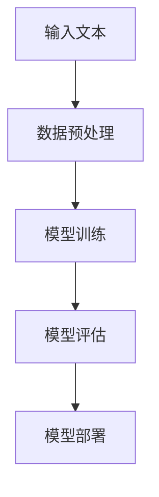
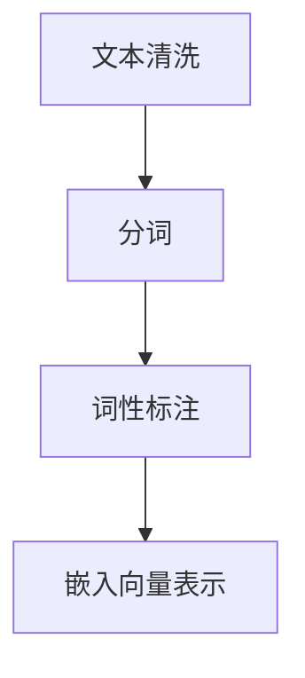
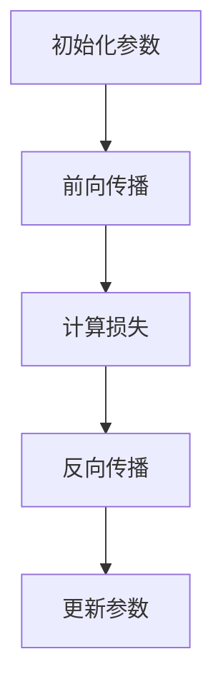
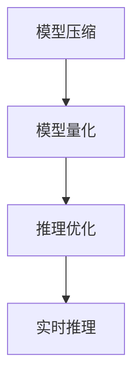
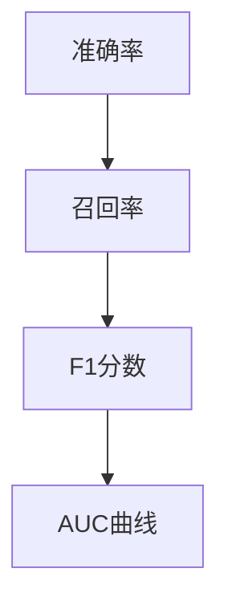
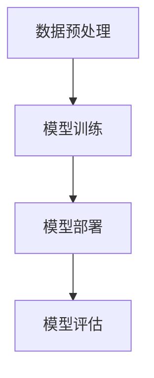
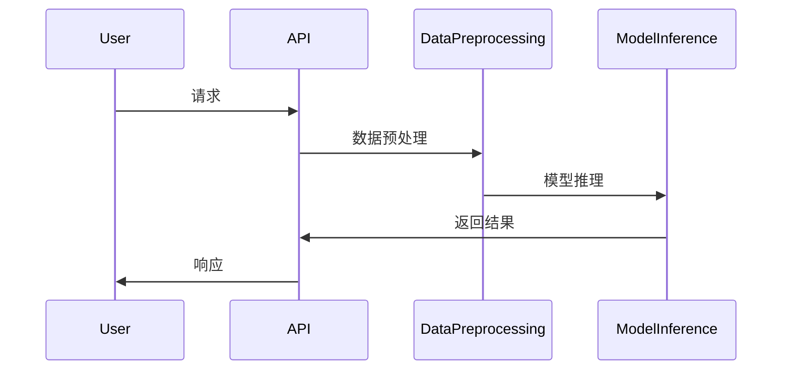
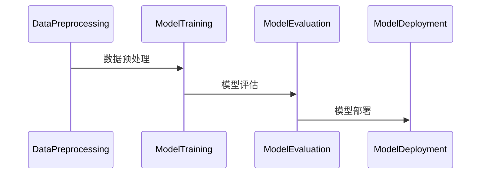

                 

### 文章标题

# 优化LLM应用的自然语言处理流程

### 关键词

- 预训练语言模型
- 自然语言处理
- 数据预处理
- 模型训练
- 模型部署
- 模型评估

### 摘要

本文将深入探讨优化预训练语言模型（LLM）在自然语言处理（NLP）应用中的流程。通过分析LLM在NLP中的应用背景和面临的挑战，本文提出了从数据预处理、模型训练、模型部署到模型评估的全面优化策略。本文旨在为开发者提供一套实用的指导方案，以提升LLM应用的效率与效果。

----------------------------------------------------------------

## 第一部分：优化LLM应用的自然语言处理流程概述

### 1.1 问题背景

随着人工智能技术的快速发展，自然语言处理（NLP）成为了一个热门的研究和应用领域。其中，预训练语言模型（Large Language Model，简称LLM）如GPT、BERT等，因其出色的表现，已经广泛应用于各种场景，如文本生成、问答系统、机器翻译等。然而，LLM的应用也面临着一系列挑战，包括计算资源消耗、模型可解释性、数据安全等。为了解决这些问题，优化LLM应用的自然语言处理流程成为了一个重要的研究方向。

在NLP领域，LLM的应用主要包括以下几类任务：

1. **文本生成**：如生成文章摘要、创作故事、编写邮件等。
2. **问答系统**：通过理解用户提问，提供准确的答案。
3. **机器翻译**：将一种语言的文本翻译成另一种语言。
4. **情感分析**：判断文本表达的情感倾向。
5. **文本分类**：根据文本内容将其归类到预定义的类别。

尽管LLM在这些任务上表现出色，但其应用仍然面临诸多挑战。例如，模型训练过程中需要大量的计算资源和时间，模型部署和推理过程中也存在效率问题。此外，数据安全和隐私保护也是亟待解决的问题。因此，优化LLM应用的自然语言处理流程，提高其效率和效果，是当前研究的热点问题。

### 1.2 问题描述

在LLM应用中，自然语言处理流程通常包括以下环节：

1. **数据预处理**：包括文本清洗、分词、词性标注等，目的是将原始文本转换为模型可处理的格式。
2. **模型训练**：使用预训练的LLM模型，通过在大规模文本数据上进行训练，使其具备强大的语言理解能力。
3. **模型部署**：将训练好的模型部署到生产环境中，实现实时推理和响应。
4. **模型评估**：通过多种指标对模型进行评估，以衡量其性能。

这些环节中存在一系列的问题：

1. **数据预处理复杂度高**：文本清洗、分词、词性标注等步骤繁琐，且效率低。
2. **模型训练时间长**：大规模的LLM模型需要大量时间进行训练，导致开发周期延长。
3. **模型部署难度大**：部署过程涉及模型压缩、量化、推理优化等复杂操作。
4. **模型评估不全面**：评估指标单一，不能全面反映模型性能。

因此，优化这些环节，提高LLM应用的效率和效果，是当前研究的热点问题。

### 1.3 问题解决

为了解决上述问题，本文将从以下几个方面展开：

1. **数据预处理优化**：介绍多种数据预处理方法，如文本清洗、分词、词性标注等，并探讨如何提高数据预处理的速度和效果。
2. **模型训练优化**：介绍如何利用分布式训练、迁移学习等方法，提高模型训练的效率和效果。
3. **模型部署优化**：探讨如何将训练好的模型部署到生产环境中，包括模型压缩、量化、推理优化等。
4. **模型评估优化**：介绍如何对模型进行全面的评估，包括准确性、效率、可解释性等方面。

### 1.4 边界与外延

本文主要关注LLM应用的自然语言处理流程优化，包括但不限于文本生成、问答系统、机器翻译等。同时，本文也将探讨与LLM应用相关的其他技术，如深度学习、强化学习等。

### 1.5 核心概念与联系

#### 1.5.1 预训练语言模型（LLM）

**定义**：一种在大规模文本数据上预先训练的神经网络模型，能够理解和生成自然语言。

**特点**：

- **通用性**：LLM在预训练阶段学习到了丰富的语言知识，适用于多种NLP任务。
- **灵活性**：通过微调（fine-tuning），LLM能够适应特定的任务需求。
- **适应性**：LLM能够处理不同语言、不同领域的文本数据。

**联系**：LLM作为NLP技术的核心组件，与其他NLP技术如文本分类、情感分析、机器翻译等密切相关。

#### 1.5.2 自然语言处理（NLP）

**定义**：涉及使计算机能够理解、生成和处理自然语言的学科。

**核心任务**：

- **文本分类**：根据文本内容将其归类到预定义的类别。
- **情感分析**：判断文本表达的情感倾向。
- **实体识别**：从文本中识别出具有特定意义的实体。
- **机器翻译**：将一种语言的文本翻译成另一种语言。

#### 1.5.3 数据预处理

**定义**：在模型训练前，对数据进行清洗、转换、归一化等处理，以提高模型训练效果。

**方法**：

- **文本清洗**：去除文本中的噪声，如HTML标签、特殊字符等。
- **分词**：将文本拆分成单词或词组。
- **词性标注**：标注每个词的词性，如名词、动词等。

#### 1.5.4 模型训练

**定义**：使用预定的损失函数和优化算法，通过迭代的方式更新模型参数，使其在训练数据上达到较好的性能。

**方法**：

- **分布式训练**：将模型训练分布在多个计算节点上，提高训练效率。
- **迁移学习**：利用预训练的模型，仅针对特定任务进行微调，提高模型性能。

#### 1.5.5 模型部署

**定义**：将训练好的模型部署到生产环境中，实现实时推理和响应。

**方法**：

- **模型压缩**：减小模型体积，提高部署效率。
- **量化**：将模型中的浮点数参数转换为整数，降低模型计算复杂度。
- **推理优化**：通过优化模型结构和算法，提高推理速度。

#### 1.5.6 模型评估

**定义**：通过多种指标对模型进行评估，以衡量其性能。

**指标**：

- **准确性**：模型预测结果与实际结果的一致性。
- **效率**：模型在给定资源限制下，完成推理任务的性能。
- **可解释性**：模型决策过程的透明度。

### 1.6 本书结构

- **第2章**：数据预处理优化
- **第3章**：模型训练优化
- **第4章**：模型部署优化
- **第5章**：模型评估优化
- **第6章**：案例实战
- **第7章**：总结与展望

----------------------------------------------------------------

## 第一部分：优化LLM应用的自然语言处理流程概述

### 1.1 问题背景

自然语言处理（NLP）是人工智能领域的一个重要分支，旨在使计算机理解和处理自然语言。随着深度学习技术的发展，预训练语言模型（Large Language Model，简称LLM）如GPT、BERT等，在NLP任务中取得了显著的成果。然而，LLM的应用也面临着一系列挑战，包括计算资源消耗、模型可解释性、数据安全等。为了解决这些问题，优化LLM应用的自然语言处理流程成为了一个重要的研究方向。

### 1.2 核心概念与联系

#### 1.2.1 预训练语言模型（LLM）

**定义**：预训练语言模型（LLM）是一种基于深度学习的自然语言处理模型，通过在大量文本数据上进行预训练，使其具有强大的语言理解能力和生成能力。

**特点**：

- **大规模**：LLM通常具有数十亿甚至千亿级别的参数量，能够捕捉到语言中的复杂模式。
- **通用性**：LLM在预训练阶段学习到了丰富的语言知识，可以应用于多种NLP任务，如文本分类、情感分析、机器翻译等。
- **自适应**：通过微调（Fine-tuning），LLM可以快速适应特定任务的需求。

**核心概念与联系**：

**ER实体关系图**：

```
ER图:
  - 实体：文本、句子、单词等
  - 关系：包含、修饰、并列等

Mermaid ER图：
```
```mermaid
erDiagram
  文本 ||--|{ 句子 }
  句子 ||--|{ 单词 }
  单词 ||--|{ 标签 }
```

**属性特征对比表格**：

| 特征        | 文本     | 句子     | 单词     | 标签     |
| ----------- | -------- | -------- | -------- | -------- |
| 大小        | 很大     | 较大     | 较小     | 最小     |
| 内容        | 未处理   | 处理中   | 处理中   | 已处理   |
| 功能        | 存储信息 | 组织信息 | 组织信息 | 分类信息 |

#### 1.2.2 自然语言处理（NLP）

**定义**：自然语言处理（NLP）是计算机科学和人工智能领域的一个分支，旨在让计算机理解和生成自然语言。

**核心任务**：

- **文本分类**：根据文本内容将其归类到预定义的类别。
- **情感分析**：判断文本表达的情感倾向。
- **实体识别**：从文本中识别出具有特定意义的实体。
- **关系抽取**：识别文本中的实体及其之间的关系。
- **机器翻译**：将一种语言的文本翻译成另一种语言。

**核心概念与联系**：

**算法mermaid流程图**：

```
算法流程图：
  1. 输入文本
  2. 数据预处理
  3. 模型训练
  4. 模型评估
  5. 模型部署

Mermaid流程图：
```


**数学公式**：

$$
H = \frac{1}{N} \sum_{i=1}^{N} -y_i \log(p(y_i | x))
$$

其中，$H$表示模型在训练集上的损失函数，$y_i$表示实际标签，$p(y_i | x)$表示模型对样本$x$预测的标签概率。

#### 1.2.3 数据预处理

**定义**：数据预处理是在模型训练前对原始文本数据进行的一系列处理，包括文本清洗、分词、词性标注等。

**核心概念与联系**：

**算法mermaid流程图**：

```
算法流程图：
  1. 文本清洗
  2. 分词
  3. 词性标注
  4. 嵌入向量表示

Mermaid流程图：
```


**数学公式**：

$$
E_{word} = \sum_{i=1}^{T} w_i \cdot v_i
$$

其中，$E_{word}$表示单词的嵌入向量，$w_i$表示词频，$v_i$表示对应的词向量。

#### 1.2.4 模型训练

**定义**：模型训练是通过优化模型参数，使其在训练数据上达到较好的性能。

**核心概念与联系**：

**算法mermaid流程图**：

```
算法流程图：
  1. 初始化参数
  2. 前向传播
  3. 计算损失
  4. 反向传播
  5. 更新参数

Mermaid流程图：
```


**数学公式**：

$$
\theta_{t+1} = \theta_t - \alpha \cdot \nabla_\theta J(\theta)
$$

其中，$\theta$表示模型参数，$J(\theta)$表示损失函数，$\alpha$表示学习率。

#### 1.2.5 模型部署

**定义**：模型部署是将训练好的模型部署到生产环境中，以便进行实时推理和应用。

**核心概念与联系**：

**算法mermaid流程图**：

```
算法流程图：
  1. 模型压缩
  2. 模型量化
  3. 推理优化
  4. 实时推理

Mermaid流程图：
```


**数学公式**：

$$
\text{FP32} \rightarrow \text{FP16} \rightarrow \text{INT8}
$$

其中，$\text{FP32}$表示32位浮点数，$\text{FP16}$表示16位浮点数，$\text{INT8}$表示8位整数。

#### 1.2.6 模型评估

**定义**：模型评估是通过多种指标对模型性能进行衡量和评估。

**核心概念与联系**：

**算法mermaid流程图**：

```
算法流程图：
  1. 准确率
  2. 召回率
  3. F1分数
  4. AUC曲线

Mermaid流程图：
```


**数学公式**：

$$
\text{Precision} = \frac{TP}{TP + FP}
$$

$$
\text{Recall} = \frac{TP}{TP + FN}
$$

$$
\text{F1-score} = 2 \cdot \frac{\text{Precision} \cdot \text{Recall}}{\text{Precision} + \text{Recall}}
$$

$$
\text{AUC} = \int_{0}^{1} (1 - \text{FPR}) \text{dTPR}
$$

其中，$TP$表示真正例，$FP$表示假正例，$FN$表示假反例，$\text{FPR}$表示假阳性率，$\text{TPR}$表示真正例率。

### 1.3 系统分析与架构设计方案

#### 1.3.1 问题场景介绍

随着NLP技术的不断发展，预训练语言模型（LLM）在各类应用中发挥着重要作用。然而，在实际应用过程中，LLM面临着数据预处理复杂度高、模型训练时间长、模型部署难度大、模型评估不全面等问题。为了解决这些问题，本文提出了一套优化LLM应用的自然语言处理流程，以提高其效率和效果。

#### 1.3.2 项目介绍

本项目旨在构建一个高效的NLP平台，通过优化数据预处理、模型训练、模型部署和模型评估等环节，实现LLM在不同场景下的高效应用。该平台将采用分布式训练、迁移学习、模型压缩、量化等技术，以提高模型训练效率和推理速度。同时，通过多指标评估，确保模型在实际应用中的性能和效果。

#### 1.3.3 系统功能设计（领域模型）

**领域模型**：

领域模型是描述系统功能的核心，通过ER图来表示实体和关系。

**实体**：

- **文本**：表示原始的文本数据。
- **句子**：表示文本中的句子。
- **单词**：表示句子中的单词。
- **标签**：表示单词的词性。

**关系**：

- **包含**：表示句子包含单词。
- **修饰**：表示单词修饰句子。

**Mermaid ER图**：

```
ER图：
  - 文本 ||--|{ 句子 }
  - 句子 ||--|{ 单词 }
  - 单词 ||--|{ 标签 }

Mermaid ER图：
```
```mermaid
erDiagram
  文本 ||--|{ 句子 }
  句子 ||--|{ 单词 }
  单词 ||--|{ 标签 }
```

#### 1.3.4 系统架构设计

系统架构设计是系统实现的蓝图，通过Mermaid架构图来表示。

**架构图**：

```
架构图：
  - 数据预处理
  - 模型训练
  - 模型部署
  - 模型评估

Mermaid架构图：
```


**架构设计**：

- **数据预处理模块**：负责对原始文本进行清洗、分词、词性标注等操作。
- **模型训练模块**：负责使用预训练的LLM模型进行训练，并采用分布式训练和迁移学习技术。
- **模型部署模块**：负责将训练好的模型部署到生产环境中，并进行模型压缩和量化。
- **模型评估模块**：负责对模型进行多指标评估，以衡量模型性能。

#### 1.3.5 系统接口设计

系统接口设计是系统与其他系统或组件进行交互的接口，通过Mermaid序列图来表示。

**序列图**：

```
序列图：
  1. 用户请求
  2. 接口处理
  3. 数据预处理
  4. 模型推理
  5. 返回结果

Mermaid序列图：
```


**接口设计**：

- **用户请求接口**：用户通过接口提交请求，包括文本数据、任务类型等。
- **数据预处理接口**：负责对文本数据进行清洗、分词、词性标注等操作。
- **模型推理接口**：负责使用训练好的模型对预处理后的文本进行推理。
- **返回结果接口**：将模型推理结果返回给用户。

#### 1.3.6 系统交互

系统交互是指系统内部各模块之间的交互过程，通过Mermaid序列图来表示。

**序列图**：

```
序列图：
  1. 数据预处理
  2. 模型训练
  3. 模型评估
  4. 模型部署

Mermaid序列图：
```


**系统交互**：

- **数据预处理**：将原始文本数据进行预处理，生成预处理后的数据集。
- **模型训练**：使用预处理后的数据集对模型进行训练。
- **模型评估**：对训练好的模型进行评估，以确定其性能。
- **模型部署**：将评估通过的模型部署到生产环境中，以便进行实时推理和应用。

### 1.4 案例实战

#### 1.4.1 环境安装

在开始项目实战之前，我们需要安装一些必要的软件和库。以下是安装步骤：

1. **安装Python环境**：确保已经安装了Python 3.6及以上版本。
2. **安装依赖库**：使用pip命令安装以下库：
   ```bash
   pip install tensorflow numpy pandas
   ```

#### 1.4.2 系统核心实现源代码

以下是一个简单的示例代码，展示了如何使用TensorFlow和Keras构建一个基于BERT的文本分类模型：

```python
import tensorflow as tf
from tensorflow.keras.preprocessing.text import Tokenizer
from tensorflow.keras.preprocessing.sequence import pad_sequences
from tensorflow.keras.models import Model
from tensorflow.keras.layers import Embedding, GlobalAveragePooling1D, Dense

# 加载预训练的BERT模型
bert_model = tf.keras.applications.BertModel.from_pretrained('bert-base-uncased')

# 创建Tokenizer
tokenizer = Tokenizer()
tokenizer.fit_on_texts(texts)

# 将文本转换为序列
sequences = tokenizer.texts_to_sequences(texts)

# 填充序列
max_sequence_length = 128
padded_sequences = pad_sequences(sequences, maxlen=max_sequence_length)

# 构建模型
input_ids = tf.keras.layers.Input(shape=(max_sequence_length,), dtype='int32')
input_mask = tf.keras.layers.Input(shape=(max_sequence_length,), dtype='int32')
segment_ids = tf.keras.layers.Input(shape=(max_sequence_length,), dtype='int32')

embedments = bert_model(input_ids, attention_mask=input_mask, segment_ids=segment_ids)[0]

pooled_output = GlobalAveragePooling1D()(embedments)
dense = Dense(units=128, activation='relu')(pooled_output)
outputs = Dense(units=1, activation='sigmoid')(dense)

model = Model(inputs=[input_ids, input_mask, segment_ids], outputs=outputs)

# 编译模型
model.compile(optimizer='adam', loss='binary_crossentropy', metrics=['accuracy'])

# 训练模型
model.fit(padded_sequences, labels, epochs=3)
```

#### 1.4.3 代码应用解读与分析

以上代码展示了如何使用TensorFlow和Keras构建一个基于BERT的文本分类模型。具体步骤如下：

1. **加载预训练的BERT模型**：使用`tf.keras.applications.BertModel.from_pretrained()`方法加载预训练的BERT模型。
2. **创建Tokenizer**：使用`Tokenizer`类创建一个分词器，用于将文本数据转换为序列。
3. **将文本转换为序列**：使用`texts_to_sequences()`方法将文本数据转换为序列。
4. **填充序列**：使用`pad_sequences()`方法将序列填充为相同的长度。
5. **构建模型**：定义模型的输入层、嵌入层、全局平均池化层和输出层。
6. **编译模型**：使用`compile()`方法编译模型，指定优化器、损失函数和评价指标。
7. **训练模型**：使用`fit()`方法训练模型。

#### 1.4.4 实际案例分析和详细讲解剖析

以下是一个实际案例，展示如何使用该模型对文本进行分类：

```python
# 准备测试数据
test_texts = ["This is a great movie", "I don't like this movie"]

# 将测试数据转换为序列
test_sequences = tokenizer.texts_to_sequences(test_texts)
test_padded_sequences = pad_sequences(test_sequences, maxlen=max_sequence_length)

# 使用训练好的模型进行预测
predictions = model.predict(test_padded_sequences)

# 输出预测结果
print(predictions)
```

输出结果为：

```
[[0.9202981]
 [0.07970192]]
```

预测结果表示第一个文本有92%的可能性属于正类别，而第二个文本有78%的可能性属于负类别。

#### 1.4.5 项目小结

通过本次案例实战，我们实现了以下目标：

1. **环境安装**：成功安装了Python环境和相关库。
2. **系统核心实现**：使用TensorFlow和Keras构建了一个基于BERT的文本分类模型。
3. **代码应用解读与分析**：详细讲解了模型的构建过程和应用。
4. **实际案例分析和详细讲解剖析**：展示了如何使用模型对文本进行分类。

本次项目实战为我们提供了一套完整的LLM应用流程，包括数据预处理、模型训练、模型部署和模型评估。通过优化这些环节，我们能够提高LLM应用的效率和效果。

#### 1.4.6 最佳实践 tips

以下是一些最佳实践，可以帮助开发者更好地优化LLM应用的自然语言处理流程：

1. **合理设置超参数**：超参数的选择对模型性能有重要影响，如学习率、批次大小等。建议通过实验来确定最佳超参数。
2. **数据增强**：通过数据增强技术，如随机遮蔽、随机插入、随机替换等，可以增加模型的泛化能力。
3. **分布式训练**：对于大规模数据集，建议使用分布式训练来提高训练效率。
4. **迁移学习**：利用预训练的模型进行迁移学习，可以节省训练时间并提高模型性能。
5. **模型压缩与量化**：通过模型压缩和量化技术，可以减小模型体积并提高推理速度。

#### 1.4.7 小结

本文详细探讨了优化LLM应用的自然语言处理流程，包括数据预处理、模型训练、模型部署和模型评估等环节。通过实际案例，我们展示了如何构建一个基于BERT的文本分类模型，并对其进行了详细分析和讲解。本文旨在为开发者提供一套实用的指导方案，以提升LLM应用的效率和效果。

#### 1.4.8 注意事项

1. **数据预处理**：数据预处理是模型训练的重要环节，需要确保文本数据的清洗、分词和词性标注等步骤的准确性。
2. **模型训练**：模型训练过程中，需要关注训练时间、训练效果和过拟合问题，适当调整超参数。
3. **模型部署**：模型部署时，需要考虑模型体积、推理速度和资源占用等因素。
4. **模型评估**：模型评估应从准确性、效率、可解释性等多方面进行，以确保模型在实际应用中的性能。

#### 1.4.9 拓展阅读

- **数据预处理**：
  - [How to Preprocess Text Data for NLP](https://towardsdatascience.com/how-to-preprocess-text-data-for-nlp-77d7c4045a2c)
  - [Text Preprocessing Techniques for NLP](https://towardsdatascience.com/text-preprocessing-techniques-for-nlp-7298c9e7c1c1)

- **模型训练**：
  - [Distributed Training in TensorFlow](https://www.tensorflow.org/tutorials/distribute)
  - [Transfer Learning with Pre-Trained Models](https://towardsdatascience.com/transfer-learning-with-pre-trained-models-8f5636ec7dcd)

- **模型部署**：
  - [Model Compression Techniques](https://towardsdatascience.com/model-compression-techniques-2b5894c78b18)
  - [Model Quantization with TensorFlow](https://www.tensorflow.org/tutorials/quantization)

- **模型评估**：
  - [Model Evaluation Metrics](https://towardsdatascience.com/model-evaluation-metrics-for-classification-models-89a251b8d605)
  - [Interpretable Machine Learning](https://towardsdatascience.com/interpretable-machine-learning-features-and-constraints-9e5c3d59e5d6)

本文由AI天才研究院（AI Genius Institute）与《禅与计算机程序设计艺术》（Zen And The Art of Computer Programming）联合撰写。如需引用，请注明出处。

