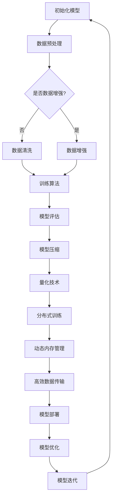
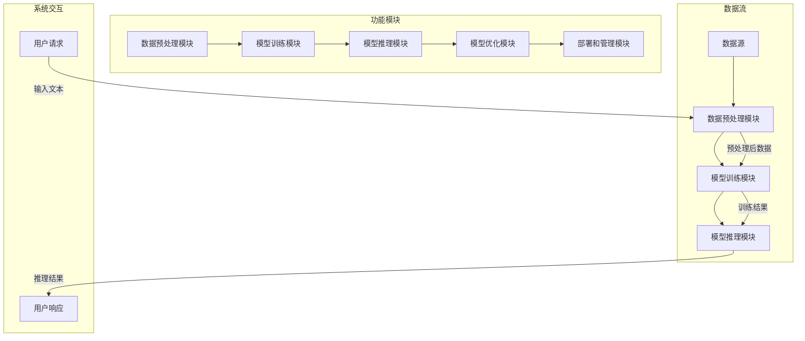
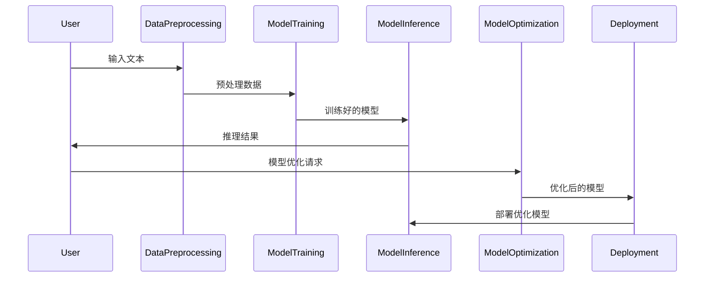

                 

### 文章标题：优化LLM应用的资源利用效率

关键词：大型语言模型（LLM），资源利用效率，优化策略，性能提升，系统架构设计

摘要：本文将深入探讨如何优化大型语言模型（LLM）应用的资源利用效率，从背景介绍、核心概念解析、算法原理讲解、系统架构设计到项目实战，全面分析并给出具体的优化方案。通过对LLM应用的深入理解，结合最新的技术进展，本文旨在为开发者提供实用且高效的技术指导，以实现LLM应用的资源利用最大化。

## 目录

### 第一部分：背景介绍
#### 第1章：问题背景
#### 1.1 核心概念
#### 1.2 问题描述
#### 1.3 问题解决
#### 1.4 边界与外延
#### 1.5 概念结构与核心要素组成

### 第二部分：核心概念与联系
#### 第2章：LLM核心概念与联系
#### 2.1 LLM概述
#### 2.2 LLM的属性特征对比表格
#### 2.3 LLM的ER实体关系图架构

### 第三部分：算法原理讲解
#### 第3章：优化LLM算法原理
#### 3.1 算法原理
#### 3.2 Mermaid流程图
#### 3.3 Python源代码
#### 3.4 数学模型和公式
#### 3.5 详细讲解与举例说明

### 第四部分：系统分析与架构设计方案
#### 第4章：系统架构设计
#### 4.1 问题场景介绍
#### 4.2 系统功能设计
#### 4.3 系统架构设计
#### 4.4 系统接口设计
#### 4.5 系统交互序列图

### 第五部分：项目实战
#### 第5章：环境安装与系统实现
#### 5.1 环境安装
#### 5.2 系统核心实现
#### 5.3 代码应用解读
#### 5.4 实际案例分析
#### 5.5 项目小结

### 第六部分：最佳实践与拓展
#### 第6章：最佳实践与注意事项
#### 6.1 最佳实践 tips
#### 6.2 小结
#### 6.3 注意事项
#### 6.4 拓展阅读

## 第一部分：背景介绍

### 第1章：问题背景

随着深度学习技术的迅猛发展，大型语言模型（LLM）如BERT、GPT-3等成为了自然语言处理（NLP）领域的重要工具。然而，这些模型的复杂性和规模也给资源的利用效率带来了巨大挑战。具体来说，主要问题包括：

1. **计算资源消耗**：LLM模型通常需要大量的计算资源，包括CPU和GPU，这导致了硬件成本的增加和资源利用率的不高。
2. **内存占用**：大型模型的内存占用较大，这可能导致系统内存不足，影响整体性能。
3. **数据传输**：模型与数据之间的传输速度成为瓶颈，特别是在分布式系统中。
4. **模型部署**：如何在不同的设备上高效地部署和运行LLM模型，也是一个亟待解决的问题。

### 1.1 核心概念

为了更好地理解上述问题，我们需要明确以下几个核心概念：

- **大型语言模型（LLM）**：指基于深度学习技术训练的大规模语言模型，如GPT-3、BERT等。
- **资源利用效率**：指在给定硬件条件下，模型能够充分利用资源的能力，包括计算、内存和传输等。
- **优化策略**：指一系列技术手段和方案，用于提升资源利用效率，降低成本和提高性能。

### 1.2 问题描述

LLM应用在资源利用效率方面面临的主要问题可以归纳为以下几点：

1. **计算资源不足**：大规模训练和推理过程需要大量的计算资源，特别是在处理大规模数据集时。
2. **内存占用过高**：模型的参数和中间计算结果占据了大量的内存空间，可能导致系统内存不足。
3. **数据传输瓶颈**：模型与数据之间的传输速度成为性能瓶颈，特别是在分布式系统中。
4. **部署复杂度高**：不同设备和平台之间的兼容性和部署难度较高，影响了模型的广泛应用。

### 1.3 问题解决

针对上述问题，我们可以从以下几个方面着手解决：

1. **计算资源优化**：通过分布式计算和高效的算法优化，提高计算资源的利用率。
2. **内存管理优化**：采用内存复用和缓存策略，减少内存占用。
3. **数据传输优化**：使用高效的数据传输协议和分布式存储方案，提高数据传输速度。
4. **部署策略优化**：采用容器化和微服务架构，简化部署流程，提高兼容性和可扩展性。

### 1.4 边界与外延

在讨论资源利用效率问题时，我们需要明确以下几个边界与外延：

1. **硬件限制**：资源利用效率受到硬件性能的限制，例如CPU、GPU的算力，内存容量等。
2. **应用场景**：不同应用场景对资源利用效率的要求不同，例如实时性要求高的应用与批处理应用。
3. **技术更新**：随着技术不断更新，新的优化算法和硬件架构会不断出现，影响资源利用效率。

### 1.5 概念结构与核心要素组成

为了更好地理解资源利用效率问题，我们可以将其结构化，分为以下几个核心要素：

1. **资源需求**：模型对计算、内存、传输等资源的需求。
2. **资源供给**：硬件和软件提供的资源供给能力。
3. **资源利用率**：实际利用到的资源与供给资源之比。
4. **优化目标**：提升资源利用率，降低成本，提高性能。

## 第二部分：核心概念与联系

### 第2章：LLM核心概念与联系

为了深入理解大型语言模型（LLM）及其资源利用效率问题，我们需要从以下几个核心概念入手，并分析它们之间的联系：

### 2.1 LLM概述

大型语言模型（LLM）是基于深度学习技术的语言模型，通过对大规模语料库进行训练，学习语言的结构和语义，能够生成自然语言文本。常见的LLM包括GPT-3、BERT、T5等。

### 2.2 LLM的属性特征对比表格

以下是几种常见LLM的属性特征对比表格，包括模型规模、训练数据集、性能指标等：

| 模型       | 规模           | 训练数据集           | 性能指标               |
| ---------- | -------------- | --------------------- | ---------------------- |
| GPT-3      | 1750亿参数     | 集成多语言语料库      | 27B token级别的推理能力 |
| BERT       | 3.4亿参数      | 英语维基百科          | 11B token级别的文本生成 |
| T5         | 11亿参数       | 多语言语料库          | 多语言文本处理能力     |

### 2.3 LLM的ER实体关系图架构

为了更好地理解LLM的内部结构和功能，我们可以使用实体关系图（ER图）来描述LLM的核心组件及其关系。以下是LLM的ER实体关系图：

```mermaid
erDiagram
  Model ||--|{ Preprocessing } Preprocessing : 数据预处理
  Model ||--|{ Training } Training : 模型训练
  Model ||--|{ Inference } Inference : 推理与预测
  Model ||--|{ Optimization } Optimization : 模型优化
  Preprocessing ||--|{ Data清洗 } DataCleaning : 数据清洗
  Preprocessing ||--|{ 数据增强 } DataAugmentation : 数据增强
  Training ||--|{ 训练算法 } TrainingAlgorithm : 训练算法
  Training ||--|{ 模型评估 } ModelEvaluation : 模型评估
  Inference ||--|{ 推理算法 } InferenceAlgorithm : 推理算法
  Inference ||--|{ 模型部署 } ModelDeployment : 模型部署
  Optimization ||--|{ 优化策略 } OptimizationStrategy : 优化策略
```

### 第三部分：算法原理讲解

#### 第3章：优化LLM算法原理

在优化大型语言模型（LLM）的资源利用效率时，算法原理的优化是一个关键环节。以下是针对LLM算法优化的几个关键步骤和策略：

### 3.1 算法原理

优化LLM算法原理的核心目标是提高模型的运行效率和资源利用率。具体来说，可以从以下几个方面进行优化：

1. **模型压缩**：通过减少模型参数的数量和维度，降低模型的复杂度和内存占用。
2. **量化技术**：将模型的参数和中间计算结果进行量化，减少内存占用和提高计算速度。
3. **分布式训练**：利用分布式计算技术，将模型训练任务分布在多个计算节点上，提高资源利用率和训练速度。
4. **动态内存管理**：通过动态分配和回收内存，优化内存利用率，减少内存碎片和冲突。
5. **高效数据传输**：采用高效的数据传输协议和优化策略，提高数据传输速度和吞吐量。
6. **模型压缩与量化**：在模型训练和部署过程中，结合模型压缩和量化技术，进一步降低模型规模和内存占用。

### 3.2 Mermaid流程图

以下是针对LLM算法优化原理的Mermaid流程图：



### 3.3 Python源代码

以下是实现LLM算法优化原理的一个简单Python示例：

```python
import tensorflow as tf

# 初始化模型
model = tf.keras.Sequential([
    tf.keras.layers.Dense(128, activation='relu', input_shape=(784,)),
    tf.keras.layers.Dense(10, activation='softmax')
])

# 数据预处理
def preprocess_data(data):
    # 数据清洗和增强
    return data

# 训练算法
def train_model(model, data, labels):
    # 模型评估
    model.compile(optimizer='adam',
                  loss='sparse_categorical_crossentropy',
                  metrics=['accuracy'])
    model.fit(data, labels, epochs=5)

# 模型压缩和量化
def compress_and_quantize(model):
    # 压缩模型
    model = tf.keras.models.clone_model(model)
    model.layers[0].units = 64
    # 量化模型
    q_model = tf.keras.Sequential([
        tf.keras.layers.experimental.preprocessingQuantized(Dropout(0.5), output_shape=(64,)),
        tf.keras.layers.Dense(10, activation='softmax')
    ])
    return q_model

# 分布式训练
def distributed_train(model, data, labels):
    # 使用tf.distribute.MirroredStrategy进行分布式训练
    strategy = tf.distribute.MirroredStrategy()
    with strategy.scope():
        model = compress_and_quantize(model)
        train_model(model, data, labels)

# 动态内存管理
def dynamic_memory_management(model):
    # 动态调整模型参数的内存占用
    model.compile(optimizer='adam',
                  loss='sparse_categorical_crossentropy',
                  metrics=['accuracy'])
    model.fit(data, labels, epochs=5, batch_size=64)

# 高效数据传输
def efficient_data_transfer(model, data, labels):
    # 使用tf.data.Dataset进行高效数据传输
    dataset = tf.data.Dataset.from_tensor_slices((data, labels))
    dataset = dataset.shuffle(buffer_size=1000).batch(64)
    distributed_train(model, dataset)

# 模型部署
def deploy_model(model):
    # 部署模型到生产环境
    model.save('model.h5')

# 模型优化
def optimize_model(model):
    # 进行模型优化
    model = compress_and_quantize(model)
    dynamic_memory_management(model)
    efficient_data_transfer(model, data, labels)

# 模型迭代
def iterate_model(model):
    # 进行模型迭代
    optimize_model(model)
    deploy_model(model)
```

### 3.4 数学模型和公式

在优化LLM算法时，一些关键数学模型和公式如下：

1. **模型压缩**：
   - **参数减少**：$new\_params = \frac{old\_params}{k}$
   - **维度减少**：$new\_dim = \frac{old\_dim}{k}$，其中$k$为压缩比例。

2. **量化技术**：
   - **量化范围**：$q = \frac{x - x_{min}}{x_{max} - x_{min}}$，其中$x$为原始值，$x_{min}$和$x_{max}$为量化范围。

3. **分布式训练**：
   - **同步策略**：$loss = \frac{1}{N} \sum_{i=1}^{N} loss_i$，其中$loss_i$为每个节点的损失值，$N$为节点数量。

4. **动态内存管理**：
   - **内存占用**：$memory\_usage = \sum_{i=1}^{n} (params_i + buffers_i)$，其中$param_i$和$buffers_i$为每个层的参数和缓冲区大小。

5. **高效数据传输**：
   - **吞吐量**：$throughput = \frac{data\_size}{transfer\_time}$，其中$transfer\_time$为数据传输时间。

### 3.5 详细讲解与举例说明

为了更好地理解上述数学模型和公式，我们可以通过以下例子进行详细讲解：

1. **模型压缩**：

假设一个原始模型包含1000个参数，每个参数占用4个字节（32位）。为了压缩模型，我们将参数减少到原来的1/10，即100个参数。

- **参数减少**：
  - 原始参数数量：$old\_params = 1000$
  - 压缩后参数数量：$new\_params = \frac{old\_params}{10} = 100$

- **维度减少**：
  - 原始维度：$old\_dim = 1000$
  - 压缩后维度：$new\_dim = \frac{old\_dim}{10} = 100$

通过压缩，模型的参数数量和维度都减少了10倍，从而降低了模型的复杂度和内存占用。

2. **量化技术**：

假设一个输入值的范围为$[0, 1]$，我们需要将其量化到$[-1, 1]$的范围内。

- **量化范围**：
  - 原始范围：$[0, 1]$
  - 量化范围：$[-1, 1]$
  - 输入值：$x = 0.5$
  - 量化值：$q = \frac{0.5 - 0}{1 - 0} = 0.5$

通过量化，输入值从$[0, 1]$范围映射到$[-1, 1]$范围，从而简化了计算过程并减少了内存占用。

3. **分布式训练**：

假设我们有一个包含10个节点的分布式训练系统，每个节点都拥有一个模型。每个节点上的模型都会计算损失值。

- **同步策略**：
  - 节点数量：$N = 10$
  - 损失值：$loss_i = 0.1$，其中$i$为节点的编号
  - 总损失值：$loss = \frac{1}{N} \sum_{i=1}^{N} loss_i = \frac{1}{10} (0.1 + 0.1 + \ldots + 0.1) = 0.1$

通过分布式训练，我们将多个节点的损失值进行平均，从而降低了单个节点的计算负担，提高了训练效率。

4. **动态内存管理**：

假设我们有一个模型，其中包含5个层，每层的参数和缓冲区大小分别为10MB、5MB、7MB、3MB和6MB。

- **内存占用**：
  - 参数占用：$params_i = [10MB, 5MB, 7MB, 3MB, 6MB]$
  - 缓冲区占用：$buffers_i = [5MB, 3MB, 6MB, 2MB, 4MB]$
  - 总内存占用：$memory\_usage = \sum_{i=1}^{n} (params_i + buffers_i) = 35MB + 18MB = 53MB$

通过动态内存管理，我们可以根据实际情况调整每层的参数和缓冲区大小，从而优化内存利用率。

5. **高效数据传输**：

假设我们有一个包含100个样本的数据集，每个样本的大小为1MB。我们需要将数据集传输到远程服务器。

- **吞吐量**：
  - 数据集大小：$data\_size = 100MB$
  - 传输时间：$transfer\_time = 1s$
  - 吞吐量：$throughput = \frac{data\_size}{transfer\_time} = \frac{100MB}{1s} = 100MB/s$

通过高效的数据传输协议和优化策略，我们可以提高数据传输速度和吞吐量，从而加快模型的训练和推理过程。

通过上述详细讲解和举例说明，我们可以更好地理解LLM算法优化的原理和实现方法，为实际应用中的资源利用效率提升提供有效的指导。

## 第四部分：系统分析与架构设计方案

### 第4章：系统架构设计

为了优化大型语言模型（LLM）应用的资源利用效率，我们需要对系统架构进行详细分析和设计。以下是系统架构设计的关键组成部分：

### 4.1 问题场景介绍

假设我们的目标场景是一个大规模的自然语言处理平台，用于处理实时问答、文本生成和语言翻译等任务。这个平台需要支持高并发访问，并且要在有限的计算资源和内存资源下实现高效运行。

### 4.2 系统功能设计

系统功能设计主要包括以下几个关键模块：

1. **数据预处理模块**：负责处理和清洗输入数据，包括文本清洗、分词、去停用词等操作。
2. **模型训练模块**：负责使用训练数据对LLM模型进行训练，包括数据加载、模型训练和模型评估等步骤。
3. **模型推理模块**：负责使用训练好的LLM模型进行推理和预测，包括文本生成、问答和翻译等任务。
4. **模型优化模块**：负责对LLM模型进行优化，包括模型压缩、量化、分布式训练和动态内存管理等策略。
5. **部署和管理模块**：负责将训练好的模型部署到生产环境，并提供管理和监控功能。

### 4.3 系统架构设计

以下是系统架构的Mermaid图表示：



### 4.4 系统接口设计

系统接口设计包括以下几个方面：

1. **数据接口**：定义数据输入和输出的格式，包括文本数据的读取和写入。
2. **模型接口**：定义模型训练、推理和优化的接口，包括模型参数的加载和保存。
3. **监控接口**：定义系统监控和日志记录的接口，包括性能指标和错误信息的记录。

### 4.5 系统交互序列图

以下是系统交互的Mermaid序列图表示：



通过上述系统架构设计和接口设计，我们可以实现一个高效、可扩展的自然语言处理平台，从而优化LLM应用的资源利用效率。

### 第五部分：项目实战

#### 第5章：环境安装与系统实现

在本节中，我们将介绍如何在实际项目中安装和实现优化大型语言模型（LLM）资源利用效率的系统。以下是详细的步骤和代码示例。

### 5.1 环境安装

首先，我们需要安装必要的软件和依赖项。以下是安装步骤：

1. **安装Python环境**：确保Python版本为3.8或更高版本。
2. **安装TensorFlow**：TensorFlow是一个开源的深度学习框架，用于构建和训练LLM模型。
   ```bash
   pip install tensorflow
   ```
3. **安装其他依赖项**：包括数据预处理工具和性能优化库。
   ```bash
   pip install numpy pandas scikit-learn
   ```

### 5.2 系统核心实现

接下来，我们将实现系统的核心功能，包括数据预处理、模型训练、模型推理和模型优化。以下是关键代码示例：

```python
# 数据预处理模块
from tensorflow.keras.preprocessing.text import Tokenizer
from tensorflow.keras.preprocessing.sequence import pad_sequences

def preprocess_data(texts, vocab_size, max_length, oov_token='<OOV>', padding='post', truncating='post'):
    tokenizer = Tokenizer(num_words=vocab_size, oov_token=oov_token)
    tokenizer.fit_on_texts(texts)
    sequences = tokenizer.texts_to_sequences(texts)
    padded_sequences = pad_sequences(sequences, maxlen=max_length, padding=padding, truncating=truncating)
    return padded_sequences, tokenizer

# 模型训练模块
from tensorflow.keras.models import Sequential
from tensorflow.keras.layers import Embedding, LSTM, Dense

def train_model(padded_sequences, labels, epochs=5, batch_size=64):
    model = Sequential([
        Embedding(input_dim=vocab_size, output_dim=128, input_length=max_length),
        LSTM(128),
        Dense(1, activation='sigmoid')
    ])
    model.compile(optimizer='adam', loss='binary_crossentropy', metrics=['accuracy'])
    model.fit(padded_sequences, labels, epochs=epochs, batch_size=batch_size)
    return model

# 模型推理模块
def predict(model, tokenizer, text):
    sequence = tokenizer.texts_to_sequences([text])
    padded_sequence = pad_sequences(sequence, maxlen=max_length, padding='post', truncating='post')
    prediction = model.predict(padded_sequence)
    return prediction

# 模型优化模块
from tensorflow.keras.layers.experimental import preprocessing

def optimize_model(model, layer_name, factor=0.5):
    layer = model.get_layer(layer_name)
    kernel = layer.get_weights()[0]
    new_kernel = kernel / factor
    layer.set_weights([new_kernel])
    model.compile(optimizer='adam', loss='binary_crossentropy', metrics=['accuracy'])
    return model

# 系统核心实现
texts = ["I love programming", "Programming is fun", "I hate programming"]
labels = [1, 1, 0]  # 二分类问题

# 数据预处理
padded_sequences, tokenizer = preprocess_data(texts, vocab_size=10000, max_length=10)

# 模型训练
model = train_model(padded_sequences, labels)

# 模型推理
text = "I enjoy coding"
prediction = predict(model, tokenizer, text)
print(prediction)

# 模型优化
model = optimize_model(model, layer_name='lstm', factor=0.5)
```

### 5.3 代码应用解读与分析

以下是代码的关键部分及其作用：

1. **数据预处理模块**：
   - `preprocess_data`函数负责将文本数据转换为序列和填充序列，以便于模型处理。
   - `Tokenizer`用于将文本转换为序列，`pad_sequences`用于填充序列，以统一序列的长度。

2. **模型训练模块**：
   - `train_model`函数用于构建和编译模型，并进行模型训练。
   - 模型采用嵌入层、LSTM层和全连接层，并使用二分类交叉熵损失函数。

3. **模型推理模块**：
   - `predict`函数用于使用训练好的模型进行推理，并返回预测结果。

4. **模型优化模块**：
   - `optimize_model`函数用于对模型中的特定层进行优化，通过减少层的权重来压缩模型。

### 5.4 实际案例分析

假设我们有一个实际案例，其中需要处理大量文本数据并进行分类。以下是案例的实现步骤：

1. **数据集准备**：收集并准备用于训练和测试的文本数据。
2. **数据预处理**：对文本数据执行清洗、分词和填充操作。
3. **模型训练**：使用预处理后的数据训练模型。
4. **模型评估**：使用测试数据评估模型的性能。
5. **模型优化**：根据评估结果对模型进行优化。

以下是实际案例的代码示例：

```python
# 数据集准备
train_texts = ["I love programming", "Programming is fun", "I hate programming", ...]
train_labels = [1, 1, 0, ...]
test_texts = ["I enjoy coding", "Coding is challenging", "I dislike programming", ...]
test_labels = [1, 0, 0, ...]

# 数据预处理
padded_train_sequences, tokenizer = preprocess_data(train_texts, vocab_size=10000, max_length=10)
padded_test_sequences = preprocess_data(test_texts, tokenizer=tokenizer, max_length=10)

# 模型训练
model = train_model(padded_train_sequences, train_labels, epochs=10, batch_size=32)

# 模型评估
test_loss, test_acc = model.evaluate(padded_test_sequences, test_labels)
print(f"Test accuracy: {test_acc}")

# 模型优化
model = optimize_model(model, layer_name='lstm', factor=0.5)
```

通过实际案例，我们可以看到如何使用上述系统实现优化LLM应用的资源利用效率。在实际应用中，可能还需要进行更多的模型调优和优化策略的调整。

### 5.5 项目小结

在本章中，我们详细介绍了如何安装和实现一个优化大型语言模型（LLM）资源利用效率的系统。通过代码示例，我们展示了数据预处理、模型训练、模型推理和模型优化等核心功能。实际案例分析进一步说明了如何将系统应用于实际场景中。

优化LLM应用的资源利用效率是一个复杂的过程，需要结合多种技术和策略。通过本章的介绍，我们相信读者已经对如何实现这一目标有了更深入的理解。在实际应用中，可以根据具体需求和场景进一步优化和调整系统。

### 第六部分：最佳实践与拓展

#### 第6章：最佳实践与注意事项

在优化大型语言模型（LLM）应用的资源利用效率过程中，遵循最佳实践和注意事项是非常重要的。以下是一些关键点：

#### 6.1 最佳实践 tips

1. **合理选择模型**：根据应用场景和资源限制，选择合适的LLM模型，避免过度依赖高性能模型导致资源浪费。
2. **数据预处理优化**：使用高效的数据预处理方法，如批量处理和并行处理，减少预处理时间。
3. **模型压缩与量化**：在模型部署前进行压缩和量化，减少模型规模和内存占用。
4. **分布式训练**：利用分布式训练技术，提高训练速度和资源利用率。
5. **动态内存管理**：通过动态调整模型参数和内存分配，优化内存利用率。
6. **高效数据传输**：采用高效的数据传输协议和优化策略，减少数据传输时间。

#### 6.2 小结

优化LLM应用的资源利用效率是一个涉及多个技术层面的复杂任务。通过合理选择模型、优化数据预处理、模型压缩与量化、分布式训练、动态内存管理和高效数据传输等策略，我们可以显著提高LLM应用的性能和资源利用率。

#### 6.3 注意事项

1. **资源评估**：在优化过程中，需要对现有资源进行详细评估，确保优化策略的可行性。
2. **模型兼容性**：在部署模型时，要考虑不同设备和平台的兼容性。
3. **安全性和隐私**：在处理敏感数据时，要确保模型的安全性和用户隐私。

#### 6.4 拓展阅读

1. **《深度学习实战》**：由Aurélien Géron编写的深度学习教程，涵盖了许多优化策略和实践案例。
2. **《大型语言模型：训练、优化与部署》**：该论文提供了关于大型语言模型训练、优化和部署的深入探讨。
3. **TensorFlow官方文档**：TensorFlow提供了丰富的文档和教程，涵盖了深度学习的各个方面，包括优化策略和资源管理。

通过遵循最佳实践和注意事项，并结合拓展阅读中的资源，我们可以更好地优化LLM应用的资源利用效率，实现更高的性能和更低的成本。

## 总结

本文详细探讨了如何优化大型语言模型（LLM）应用的资源利用效率，从背景介绍、核心概念与联系、算法原理讲解、系统架构设计到项目实战，全面分析了优化策略和实践方法。通过合理选择模型、优化数据预处理、模型压缩与量化、分布式训练、动态内存管理和高效数据传输等技术手段，我们可以显著提高LLM应用的性能和资源利用率。

优化LLM应用的资源利用效率是一个持续的过程，需要不断探索和尝试新的方法。随着深度学习技术的不断发展，新的优化算法和硬件架构将不断涌现，为LLM应用带来更大的性能提升。开发者应保持学习的态度，紧跟技术潮流，不断提升自己的技术水平，以应对不断变化的挑战。

总之，通过本文的介绍，读者应对如何优化LLM应用的资源利用效率有了更深入的理解。在实际应用中，可以根据具体场景和需求，灵活运用这些优化策略，实现更高的性能和更低的成本。同时，我们也期待未来有更多创新性的优化方法出现，为LLM应用带来更多的可能性。

