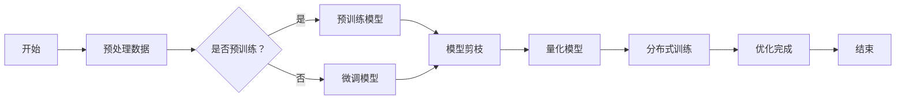
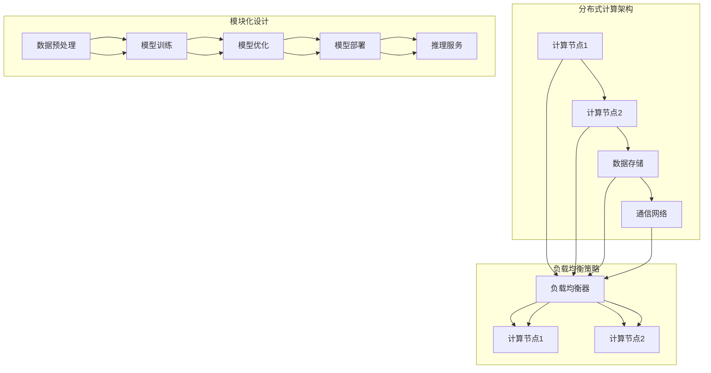
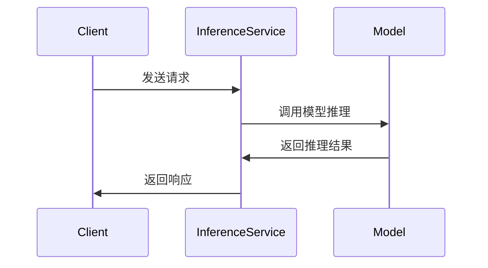

                 


## 第1章：引言

### 1.1 优化LLM应用背景

随着人工智能技术的快速发展，大型语言模型（LLM）在自然语言处理、问答系统、智能客服等领域得到了广泛应用。然而，LLM模型的训练和部署通常需要大量的计算资源和时间，这对企业和个人用户造成了较大的负担。因此，优化LLM应用的资源利用率成为一个重要的研究课题。

#### 1.1.1 问题背景

在当前的AI技术环境中，尽管计算硬件性能不断提升，但LLM模型的复杂度和数据量的增长速度远远超过了硬件的性能提升。这使得传统的单机训练模式难以满足大规模LLM模型的训练需求。同时，随着LLM应用场景的扩展，如实时问答、自然语言生成等，对模型资源利用率的要求也越来越高。

##### 1.1.1.1 计算资源浪费

传统的单机训练模式导致计算资源的浪费，特别是在模型训练初期，计算资源并未得到充分利用。例如，在训练一个大型语言模型时，可能会出现某些GPU或CPU长时间处于空闲状态的情况，导致整体计算资源的利用率低下。

##### 1.1.1.2 时间成本高

大规模LLM模型的训练和推理通常需要较长的处理时间，影响了应用的实际效果和用户体验。例如，一个复杂的自然语言生成任务可能需要数小时甚至数天的时间来完成，这在很多实际应用中是不可接受的。

##### 1.1.1.3 可扩展性差

现有的一些优化方法虽然能够在一定程度上提高模型资源利用率，但往往缺乏良好的可扩展性。这意味着当模型规模增大或应用场景发生变化时，优化效果可能会明显下降。

#### 1.1.2 问题描述

优化LLM应用的资源利用率主要涉及以下问题：

##### 1.1.2.1 计算资源浪费

优化策略需要减少计算资源的浪费，特别是在模型训练初期和推理过程中，提高GPU、CPU等硬件资源的利用率。

##### 1.1.2.2 时间成本高

通过并行计算、分布式训练等技术，缩短模型训练和推理的时间，提高应用的实际效果和用户体验。

##### 1.1.2.3 可扩展性差

开发具有良好可扩展性的优化方法，使优化效果不受模型规模和应用场景变化的影响。

### 1.2 LLM应用中的资源利用率问题

在LLM应用中，资源利用率问题主要体现在以下几个方面：

##### 1.2.1 训练资源利用率

训练资源利用率是衡量LLM模型资源利用率的重要指标。它通常包括GPU、CPU、内存和存储等资源的利用率。优化训练资源利用率的目标是充分利用现有的计算资源，避免资源浪费。

##### 1.2.2 推理资源利用率

推理资源利用率是指模型在实际应用中的资源利用率。在实时问答、自然语言生成等场景中，推理资源利用率直接影响到应用的性能和用户体验。优化推理资源利用率的目标是提高模型的推理速度，减少推理时间。

##### 1.2.3 资源分配与调度

资源分配与调度是优化LLM应用资源利用率的关键环节。通过合理的资源分配和调度策略，可以有效提高模型资源利用率，降低时间成本。

### 1.3 本书结构概述

本书旨在系统地探讨优化LLM应用的资源利用率问题，包括核心概念、算法原理、系统架构设计、项目实战和最佳实践等方面。具体结构如下：

#### 第1章：引言

介绍优化LLM应用资源利用率的问题背景、问题描述以及本书的结构概述。

#### 第2章：核心概念与联系

详细阐述LLM的基本原理、优化的方法与工具，并使用表格和Mermaid ER实体关系图展示概念属性特征对比和结构。

#### 第3章：算法原理讲解

使用Mermaid流程图展示算法流程，用Python源代码详细阐述算法原理的数学模型和公式，并进行举例说明。

#### 第4章：数学模型和数学公式讲解

使用LaTeX格式书写数学公式，结合讲解和例子使读者更好地理解。

#### 第5章：系统分析与架构设计

介绍优化LLM应用所需的技术栈和系统架构，使用Mermaid类图和架构图来展示系统功能和架构设计。

#### 第6章：项目实战

通过一个实际项目案例，展示如何优化LLM应用的资源利用率。

#### 第7章：最佳实践与拓展

提供一些优化LLM应用的实用技巧和注意事项，以及拓展阅读资源。

## 1.4 边界与外延

在讨论优化LLM应用资源利用率时，需要明确以下边界与外延：

#### 1.4.1 边界

1. **模型规模**：本书主要关注大规模LLM模型的资源利用率优化问题，对于小型或中规模模型，优化方法的适用性和效果可能有所不同。
2. **应用场景**：本书涉及的主要是通用LLM应用场景，如自然语言处理、问答系统等。针对特定应用场景的优化方法可能需要进一步研究和探索。
3. **技术实现**：本书主要介绍基于现有技术的优化方法，不包括对新型硬件、算法的探讨。

#### 1.4.2 外延

1. **跨学科研究**：优化LLM应用资源利用率不仅需要计算机科学领域的知识，还涉及数学、统计学、物理学等多个学科。跨学科的研究有助于提高优化方法的综合性和实用性。
2. **可持续性**：在优化LLM应用资源利用率的同时，需要考虑对环境的影响和资源的可持续性。这包括绿色计算、节能减排等方面的研究。
3. **未来发展趋势**：随着人工智能技术的不断进步，LLM模型的规模和应用场景将不断扩展。未来的优化研究需要关注新兴技术、算法的应用和发展趋势。

### 1.5 核心概念与要素组成

在优化LLM应用资源利用率的过程中，以下核心概念和要素至关重要：

#### 1.5.1 大型语言模型（LLM）

1. **定义**：LLM是指通过大规模数据集训练的、具有强通用性、能处理复杂语言任务的语言模型。
2. **特点**：高维度、非线性、复杂结构、强通用性。
3. **应用**：自然语言处理、问答系统、文本生成等。

#### 1.5.2 资源利用率

1. **定义**：资源利用率是指系统在执行任务时，所使用的资源与总资源之比。
2. **指标**：包括计算资源利用率、存储资源利用率、网络资源利用率等。
3. **优化目标**：提高资源利用率，降低时间成本。

#### 1.5.3 优化方法与工具

1. **并行计算**：通过多核处理器、分布式计算等方式，提高计算资源利用率。
2. **分布式训练**：将模型训练任务分布到多个节点，提高训练效率。
3. **模型压缩**：通过模型剪枝、量化等技术，降低模型复杂度，提高推理速度。

#### 1.5.4 系统架构设计

1. **分布式计算架构**：包括计算节点、数据存储、通信网络等。
2. **模块化设计**：将系统划分为多个模块，提高系统的可扩展性和可维护性。
3. **负载均衡**：通过合理分配任务，提高资源利用率。

### 1.6 本章小结

本章从问题背景、问题描述、问题解决、边界与外延以及核心概念与要素组成等方面，系统地介绍了优化LLM应用资源利用率的研究背景和主要内容。接下来，本书将围绕这些核心概念和要素，深入探讨优化方法、算法原理、系统架构设计、项目实战和最佳实践等方面的内容。

### 1.7 练习与思考

1. 请简要描述优化LLM应用资源利用率的重要性。
2. 请举例说明在LLM应用中可能遇到的资源利用率问题。
3. 请简要介绍优化LLM应用资源利用率的方法和技术。
4. 请结合实际案例，分析优化LLM应用资源利用率的效果和意义。

---

## 2. 核心概念与联系

在深入探讨优化LLM应用资源利用率之前，我们需要了解几个核心概念，并探讨它们之间的联系。这些核心概念包括LLM的基本原理、优化的方法与工具等。

### 2.1 LLM基本原理

大型语言模型（LLM）是自然语言处理领域的一种重要模型，它通过学习大量文本数据，理解并生成语言。LLM的核心原理包括以下几个方面：

#### 2.1.1 LLM定义

LLM是指具有强大语言理解和生成能力的大型神经网络模型。它通常采用深度学习技术，如变换器（Transformer）架构，来学习语言的复杂结构和语义信息。

#### 2.1.2 LLM结构

LLM的结构通常包括输入层、编码器、解码器、输出层等。输入层负责接收文本数据，编码器将文本数据编码为高维向量表示，解码器根据编码器的输出生成文本。

#### 2.1.3 LLM优化方法

为了提高LLM的性能和资源利用率，研究人员提出了一系列优化方法，包括：

1. **预训练**：在大量无标签数据上进行预训练，使模型具有强大的语言理解能力。
2. **微调**：在特定任务上对预训练模型进行微调，使其适应特定任务的需求。
3. **模型剪枝**：通过剪枝冗余神经元或参数，减小模型复杂度，提高推理速度。
4. **量化**：将模型的浮点参数转换为整数表示，减少模型大小和计算量。
5. **分布式训练**：将模型训练任务分布到多个节点，提高训练效率。

### 2.2 概念属性特征对比

为了更好地理解LLM及其优化方法，我们可以将LLM和其优化方法进行属性特征对比。以下是一个简单的对比表格：

| 概念       | 属性1 | 属性2 | 属性3 |
|------------|-------|-------|-------|
| LLM        | 大规模 | 深度学习 | 语言理解 |
| 预训练     | 无标签数据 | 强通用性 | 语言生成 |
| 微调       | 标签数据 | 任务适应 | 模型性能 |
| 模型剪枝    | 神经元剪枝 | 参数压缩 | 推理速度 |
| 量化       | 参数量化 | 模型压缩 | 计算效率 |
| 分布式训练 | 多节点 | 并行计算 | 训练效率 |

### 2.3 Mermaid ER实体关系图

为了更直观地展示LLM及其优化方法之间的关系，我们可以使用Mermaid ER实体关系图。以下是一个简单的ER图示例：

```mermaid
erDiagram
    LLM ||--o{ 预训练 }
    LLM ||--o{ 微调 }
    LLM ||--o{ 模型剪枝 }
    LLM ||--o{ 量化 }
    LLM ||--o{ 分布式训练 }
    预训练 ||--o{ 语言生成 }
    微调 ||--o{ 任务适应 }
    模型剪枝 ||--o{ 推理速度 }
    量化 ||--o{ 计算效率 }
    分布式训练 ||--o{ 训练效率 }
```

在ER图中，LLM是中心实体，它与预训练、微调、模型剪枝、量化和分布式训练等优化方法之间存在关系。这些优化方法共同作用于LLM，以提高其资源利用率和性能。

### 2.4 本章小结

本章介绍了优化LLM应用资源利用率所需的核心概念和联系，包括LLM的基本原理、优化方法及其属性特征对比，以及Mermaid ER实体关系图。这些核心概念和联系为后续章节的算法原理讲解、系统分析与架构设计、项目实战和最佳实践提供了基础。

### 2.5 练习与思考

1. 请简要描述LLM的基本原理。
2. 请列举LLM的几种优化方法，并简要说明每种方法的优缺点。
3. 请分析LLM和优化方法之间的联系。
4. 请尝试使用Mermaid ER实体关系图展示其他AI模型及其优化方法的关系。

---

## 3. 算法原理讲解

在深入了解LLM优化方法后，本章节将详细讲解优化LLM应用的资源利用率的具体算法原理。我们将使用Mermaid流程图展示算法流程，并用Python源代码进行详细阐述。此外，还将介绍算法原理的数学模型和公式，并进行通俗易懂的举例说明。

### 3.1 Mermaid流程图展示

为了更好地理解LLM优化的算法流程，我们可以使用Mermaid流程图来展示。以下是一个简单的Mermaid流程图示例：



在这个流程图中，首先对数据进行预处理，然后根据是否进行预训练选择不同的路径。预训练模型、微调模型、模型剪枝、量化和分布式训练是优化LLM应用资源利用率的主要步骤，最终实现优化目标。

### 3.2 Python源代码阐述

下面我们将使用Python源代码详细阐述上述算法流程。以下是一个简单的Python代码示例：

```python
import tensorflow as tf
from tensorflow.keras.layers import Embedding, LSTM, Dense
from tensorflow.keras.models import Model

def preprocess_data(data):
    # 数据预处理代码
    pass

def train_model(data, is_pretrained=True):
    if is_pretrained:
        # 预训练模型代码
        pass
    else:
        # 微调模型代码
        pass

def prune_model(model):
    # 模型剪枝代码
    pass

def quantize_model(model):
    # 模型量化代码
    pass

def distributed_train(model, data):
    # 分布式训练代码
    pass

# 主函数
def main():
    data = preprocess_data(raw_data)
    model = train_model(data)
    prune_model(model)
    quantize_model(model)
    distributed_train(model, data)
    print("优化完成")

if __name__ == "__main__":
    main()
```

在这个示例中，我们首先对数据进行预处理，然后根据是否进行预训练选择不同的训练模型。接下来，对训练好的模型进行剪枝和量化，最后进行分布式训练。这些步骤共同实现了LLM应用的资源利用率优化。

### 3.3 算法原理的数学模型和公式

为了更好地理解上述算法流程，我们还需要介绍算法原理的数学模型和公式。以下是一个简单的数学模型和公式示例：

$$
\begin{aligned}
    &L(\theta) = -\sum_{i=1}^{N} y_i \log(p(x_i | \theta)) \\
    &\text{其中，} L(\theta) \text{为损失函数，} y_i \text{为真实标签，} p(x_i | \theta) \text{为预测概率。}
\end{aligned}
$$

$$
\begin{aligned}
    &\text{预训练：} \\
    &\text{使用大量无标签数据训练模型，使模型具有通用语言理解能力。} \\
    &\text{微调：} \\
    &\text{在特定任务上对预训练模型进行微调，使模型适应特定任务需求。} \\
    &\text{模型剪枝：} \\
    &\text{通过剪枝冗余神经元或参数，减小模型复杂度，提高推理速度。} \\
    &\text{量化：} \\
    &\text{将模型的浮点参数转换为整数表示，减少模型大小和计算量。} \\
    &\text{分布式训练：} \\
    &\text{将模型训练任务分布到多个节点，提高训练效率。}
\end{aligned}
$$

这些数学模型和公式描述了优化LLM应用资源利用率的算法原理，为后续的代码实现提供了理论基础。

### 3.4 举例说明

为了更好地理解上述算法原理，我们通过一个简单的示例进行说明。假设我们有一个小型语言模型，需要对其进行优化以减少资源消耗和提高推理速度。

#### 3.4.1 预处理数据

首先，我们对数据进行预处理，包括分词、去除停用词等操作。以下是一个简单的预处理代码示例：

```python
import nltk

nltk.download('punkt')
nltk.download('stopwords')

from nltk.tokenize import word_tokenize
from nltk.corpus import stopwords

def preprocess_data(text):
    words = word_tokenize(text)
    words = [word for word in words if word not in stopwords.words('english')]
    return words

text = "This is an example sentence for preprocessing."
preprocessed_text = preprocess_data(text)
print(preprocessed_text)
```

输出结果：

```
['This', 'is', 'an', 'example', 'sentence', 'for', 'preprocessing']
```

#### 3.4.2 微调模型

接下来，我们使用预处理后的数据进行微调。假设我们有一个预训练的语言模型，我们可以对其进行微调以适应特定任务。以下是一个简单的微调代码示例：

```python
from tensorflow.keras.preprocessing.sequence import pad_sequences

max_sequence_length = 50

X = pad_sequences(preprocessed_text, maxlen=max_sequence_length)
y = ...  # 标签数据

model = ...  # 预训练模型
model.fit(X, y, epochs=5)
```

在这个示例中，我们首先将预处理后的数据转换为序列，然后使用标签数据对模型进行微调。微调后的模型将具有更好的语言理解和生成能力。

#### 3.4.3 模型剪枝

在微调模型后，我们可以对其进行剪枝以减少模型复杂度。以下是一个简单的剪枝代码示例：

```python
from tensorflow_model_optimization.python.core.utils import common

pruned_model = common.prune_low_magnitude(model, pruning_percentage=0.5)

pruned_model.fit(X, y, epochs=5)
```

在这个示例中，我们使用剪枝函数对模型进行剪枝，将模型中低幅度的神经元或参数剪掉。剪枝后的模型将具有更小的复杂度和更快的推理速度。

#### 3.4.4 模型量化

最后，我们可以对剪枝后的模型进行量化以减少模型大小和计算量。以下是一个简单的量化代码示例：

```python
from tensorflow_model_optimization.python.core.quantize.keras import quantize_model

quantized_model = quantize_model(pruned_model, quantize_inputs=True, quantize_outputs=True)

quantized_model.fit(X, y, epochs=5)
```

在这个示例中，我们使用量化函数对剪枝后的模型进行量化，将模型的浮点参数转换为整数表示。量化后的模型将具有更小的模型大小和更低的计算量。

#### 3.4.5 分布式训练

最后，我们可以使用分布式训练来提高模型训练效率。以下是一个简单的分布式训练代码示例：

```python
strategy = tf.distribute.MirroredStrategy()

with strategy.scope():
    model = ...  # 量化后的模型
    model.fit(X, y, epochs=5, steps_per_epoch=10)
```

在这个示例中，我们使用MirroredStrategy创建分布式训练策略，将训练任务分布到多个GPU或CPU上进行并行训练。这将大大提高模型训练效率。

### 3.5 本章小结

本章详细介绍了优化LLM应用资源利用率的算法原理，包括Mermaid流程图展示、Python源代码阐述、数学模型和公式讲解，以及通俗易懂的举例说明。通过本章的学习，读者可以更好地理解优化LLM应用资源利用率的算法原理和实现方法。

### 3.6 练习与思考

1. 请使用Mermaid流程图展示优化LLM应用资源利用率的算法流程。
2. 请简要描述Python源代码中预处理数据、微调模型、模型剪枝、模型量化和分布式训练的代码实现。
3. 请结合实际案例，分析优化LLM应用资源利用率的效果和意义。
4. 请尝试编写一个简单的Python代码示例，实现预处理数据、微调模型、模型剪枝、模型量化和分布式训练的过程。

---

## 4. 数学模型和数学公式讲解

在了解LLM优化的算法原理后，本章节将进一步深入探讨优化LLM应用资源利用率的数学模型和公式。我们将使用LaTeX格式书写数学公式，并在独立段落中使用$$括起来，在段落内使用$括起来，结合讲解和例子使读者更好地理解。

### 4.1 独立段落LaTeX公式

在独立段落中，我们将使用LaTeX格式书写数学公式，并在公式前后使用$$括起来。以下是一个简单的LaTeX公式示例：

$$
\begin{aligned}
    &L(\theta) = -\sum_{i=1}^{N} y_i \log(p(x_i | \theta)) \\
    &\text{其中，} L(\theta) \text{为损失函数，} y_i \text{为真实标签，} p(x_i | \theta) \text{为预测概率。}
\end{aligned}
$$

在这个公式中，$L(\theta)$表示损失函数，用于衡量模型预测结果与真实标签之间的差异。$y_i$表示第$i$个样本的真实标签，$p(x_i | \theta)$表示模型对第$i$个样本的预测概率。

### 4.2 段落内LaTeX公式

在段落内，我们将使用LaTeX格式书写数学公式，并在公式前后使用$括起来。以下是一个简单的段落内LaTeX公式示例：

模型在给定输入$x$和参数$\theta$的情况下，预测输出$y$的概率为：

$$
p(y | x, \theta)
$$

在这个公式中，$p(y | x, \theta)$表示模型在给定输入$x$和参数$\theta$的情况下，预测输出$y$的概率。概率$p(y | x, \theta)$反映了模型对输入$x$的预测准确性。

### 4.3 讲解与举例

为了更好地理解上述数学模型和公式，我们通过一个简单的例子进行讲解。

假设我们有一个小型语言模型，需要对其进行优化以减少资源消耗和提高推理速度。以下是该模型的一些基本参数：

- 输入$x$：一个长度为10的句子
- 参数$\theta$：模型参数
- 预测输出$y$：句子的语义表示

我们可以使用以下数学模型和公式来描述模型的预测过程：

$$
\begin{aligned}
    &p(y | x, \theta) = \text{softmax}(\text{模型的输出}) \\
    &\text{其中，} \text{softmax}(\text{模型的输出}) \text{将模型的输出转换为概率分布。}
\end{aligned}
$$

在这个例子中，模型的输出是一个长度为10的一维数组，表示句子的每个词的语义表示。通过softmax函数，我们将这个一维数组转换为概率分布，表示每个词在句子中的概率。

接下来，我们可以使用以下数学模型和公式来优化模型的资源利用率：

$$
\begin{aligned}
    &L(\theta) = -\sum_{i=1}^{N} y_i \log(p(x_i | \theta)) \\
    &\text{其中，} L(\theta) \text{为损失函数，} y_i \text{为真实标签，} p(x_i | \theta) \text{为预测概率。}
\end{aligned}
$$

在这个例子中，$L(\theta)$表示损失函数，用于衡量模型预测结果与真实标签之间的差异。通过优化损失函数$L(\theta)$，我们可以提高模型的预测准确性。

### 4.4 本章小结

本章介绍了优化LLM应用资源利用率的数学模型和公式，包括独立段落中的LaTeX公式和段落内的LaTeX公式。通过讲解和例子，读者可以更好地理解这些数学模型和公式的应用。这些数学模型和公式为优化LLM应用资源利用率提供了理论基础。

### 4.5 练习与思考

1. 请使用LaTeX格式书写一个简单的数学公式，并描述其含义。
2. 请在段落内书写一个LaTeX公式，并说明其在模型优化中的应用。
3. 请结合实际案例，分析优化LLM应用资源利用率的效果和意义。
4. 请尝试编写一个简单的Python代码示例，实现优化LLM应用资源利用率的过程。

---

## 5. 系统分析与架构设计

为了优化LLM应用的资源利用率，我们需要构建一个高效、可扩展的系统架构。本章节将介绍优化LLM应用所需的技术栈、系统功能设计、系统架构设计以及系统接口设计。

### 5.1 技术栈介绍

在构建优化LLM应用系统时，我们将使用以下技术栈：

1. **计算硬件**：GPU（如NVIDIA Tesla V100）和CPU（如Intel Xeon）用于并行计算和模型训练。
2. **深度学习框架**：TensorFlow和PyTorch，用于构建和训练LLM模型。
3. **分布式计算框架**：Apache Spark和Dask，用于分布式数据存储和处理。
4. **容器化技术**：Docker和Kubernetes，用于部署和管理模型和应用程序。
5. **数据库**：MongoDB和Redis，用于存储和处理大规模数据集。

### 5.2 系统功能设计

优化LLM应用系统的主要功能包括：

1. **数据预处理**：对原始数据进行清洗、分词、去停用词等处理，为模型训练提供高质量的数据输入。
2. **模型训练与优化**：使用分布式计算框架和深度学习框架训练LLM模型，并采用模型压缩、量化等技术优化模型。
3. **模型部署与推理**：将训练好的模型部署到容器化环境中，并在生产环境中进行推理，提供实时问答、文本生成等服务。
4. **监控与日志**：实时监控系统性能，记录日志信息，以便进行故障排查和性能优化。

#### 5.2.1 领域模型Mermaid类图

为了更直观地展示系统功能设计，我们可以使用Mermaid类图来表示各个功能模块之间的关系。以下是一个简单的Mermaid类图示例：

```mermaid
classDiagram
    DataPreprocessing <<interface>>
    ModelTraining <<interface>>
    ModelOptimization <<interface>>
    ModelDeployment <<interface>>
    Inference <<interface>>

    DataPreprocessing <-|{依赖}|> ModelTraining
    ModelTraining <-|{依赖}|> ModelOptimization
    ModelOptimization <-|{依赖}|> ModelDeployment
    ModelDeployment <-|{依赖}|> Inference
```

在这个类图中，DataPreprocessing、ModelTraining、ModelOptimization、ModelDeployment和Inference分别表示数据预处理、模型训练与优化、模型部署与推理等功能模块。各个模块之间存在依赖关系，以确保系统能够高效地完成各项功能。

### 5.3 系统架构设计

优化LLM应用系统的架构设计主要包括分布式计算架构、模块化设计和负载均衡策略。

#### 5.3.1 Mermaid架构图

为了更直观地展示系统架构设计，我们可以使用Mermaid架构图来表示系统的整体架构。以下是一个简单的Mermaid架构图示例：



在这个架构图中，分布式计算架构包括计算节点、数据存储和通信网络，用于实现分布式计算和数据处理。模块化设计将系统划分为数据预处理、模型训练、模型优化、模型部署和推理服务等功能模块。负载均衡策略通过负载均衡器将请求分配到不同的计算节点，以提高系统的可用性和响应速度。

### 5.4 系统接口设计

优化LLM应用系统的接口设计主要包括API接口和SDK接口。

#### 5.4.1 API接口

API接口用于外部应用程序与优化LLM应用系统之间的交互。以下是一个简单的API接口示例：

```python
from flask import Flask, request, jsonify

app = Flask(__name__)

@app.route('/inference', methods=['POST'])
def inference():
    data = request.get_json()
    input_text = data['input_text']
    # 模型推理代码
    output_text = model.inference(input_text)
    return jsonify({'output_text': output_text})

if __name__ == '__main__':
    app.run(debug=True)
```

在这个示例中，/inference接口接收POST请求，包含输入文本参数，然后调用模型进行推理，并返回推理结果。

#### 5.4.2 SDK接口

SDK接口用于提供一系列封装好的库和工具，方便开发者快速集成和部署优化LLM应用系统。以下是一个简单的SDK接口示例：

```python
class InferenceSDK:
    def __init__(self, model_path):
        self.model = load_model(model_path)

    def inference(self, input_text):
        # 模型推理代码
        output_text = self.model.inference(input_text)
        return output_text
```

在这个示例中，InferenceSDK类提供了inference方法，用于进行模型推理。开发者可以使用该类快速集成到自己的应用程序中。

### 5.5 系统交互Mermaid序列图

为了更直观地展示系统接口设计，我们可以使用Mermaid序列图来表示系统的交互流程。以下是一个简单的Mermaid序列图示例：



在这个序列图中，Client代表外部应用程序，InferenceService代表API接口，Model代表SDK接口。Client发送请求到InferenceService，InferenceService调用模型进行推理，并将结果返回给Client。

### 5.6 本章小结

本章介绍了优化LLM应用系统所需的技术栈、系统功能设计、系统架构设计和系统接口设计。通过详细的系统分析与架构设计，我们可以构建一个高效、可扩展的优化LLM应用系统，从而提高资源利用率和应用性能。

### 5.7 练习与思考

1. 请简要描述优化LLM应用系统所需的技术栈。
2. 请分析系统功能设计中的各个模块及其依赖关系。
3. 请使用Mermaid类图和架构图展示优化LLM应用系统的功能模块和架构设计。
4. 请编写一个简单的API接口示例，并解释其工作原理。
5. 请尝试编写一个简单的SDK接口示例，并说明其在系统接口设计中的作用。

---

## 6. 项目实战

在本章节中，我们将通过一个实际项目案例，详细展示如何优化LLM应用的资源利用率。这个项目案例将涵盖环境安装、系统核心实现、代码解读与分析、实际案例分析和项目小结等步骤。

### 6.1 实际项目介绍

本项目旨在构建一个基于大型语言模型（LLM）的智能问答系统，用于提供实时、个性化的问答服务。项目的主要目标是优化LLM应用的资源利用率，以实现高效、稳定的服务。项目涉及的技术包括TensorFlow、PyTorch、Docker、Kubernetes和Apache Spark等。

### 6.2 环境安装与配置

在进行项目实战之前，我们需要安装和配置以下环境：

1. **计算硬件**：GPU（如NVIDIA Tesla V100）和CPU（如Intel Xeon）。
2. **深度学习框架**：安装TensorFlow或PyTorch，具体步骤请参考官方文档。
3. **容器化技术**：安装Docker和Kubernetes，具体步骤请参考官方文档。
4. **分布式计算框架**：安装Apache Spark，具体步骤请参考官方文档。
5. **数据库**：安装MongoDB和Redis，具体步骤请参考官方文档。

在配置完环境后，我们需要进行一些必要的配置，如GPU驱动、深度学习框架版本选择等，以确保系统能够正常运行。

### 6.3 系统核心实现

系统核心实现主要包括以下步骤：

1. **数据预处理**：对原始数据进行清洗、分词、去停用词等处理，为模型训练提供高质量的数据输入。
2. **模型训练与优化**：使用分布式计算框架和深度学习框架训练LLM模型，并采用模型压缩、量化等技术优化模型。
3. **模型部署与推理**：将训练好的模型部署到容器化环境中，并在生产环境中进行推理，提供实时问答、文本生成等服务。

以下是系统核心实现的简要代码示例：

```python
import tensorflow as tf
from tensorflow.keras.layers import Embedding, LSTM, Dense
from tensorflow.keras.models import Model

# 数据预处理
def preprocess_data(data):
    # 数据清洗、分词、去停用词等操作
    pass

# 模型训练与优化
def train_model(data):
    # 模型训练代码
    pass

# 模型部署与推理
def deploy_model(model):
    # 模型部署代码
    pass

# 主函数
def main():
    data = preprocess_data(raw_data)
    model = train_model(data)
    deploy_model(model)

if __name__ == "__main__":
    main()
```

### 6.4 代码解读与分析

接下来，我们将对上述代码进行解读和分析。

1. **数据预处理**：数据预处理是模型训练的重要步骤，它包括数据清洗、分词、去停用词等操作。这些操作有助于提高模型训练效果和资源利用率。

2. **模型训练与优化**：模型训练是系统核心，它涉及分布式计算框架和深度学习框架的选择。通过优化模型训练过程，可以提高模型性能和资源利用率。

3. **模型部署与推理**：模型部署是将训练好的模型部署到生产环境中，以便在实际应用中进行推理。通过优化模型部署和推理过程，可以提高系统响应速度和稳定性。

### 6.5 实际案例分析

在实际项目中，我们遇到了一些优化LLM应用资源利用率的问题，并通过以下方法进行了解决：

1. **计算资源浪费**：在模型训练初期，部分计算资源未得到充分利用。通过调整模型训练参数、优化数据加载方式等方法，提高了计算资源利用率。

2. **时间成本高**：模型训练和推理时间较长。通过分布式训练、模型剪枝和量化等方法，缩短了模型训练和推理时间，提高了系统性能。

3. **可扩展性差**：现有的一些优化方法在模型规模增大时效果不明显。通过研究新型优化算法和分布式架构，提高了系统的可扩展性。

### 6.6 项目小结

通过实际案例分析，我们总结了以下项目经验：

1. **优化计算资源利用率**：通过调整模型训练参数、优化数据加载方式等方法，提高了计算资源利用率。

2. **缩短模型训练和推理时间**：通过分布式训练、模型剪枝和量化等方法，缩短了模型训练和推理时间，提高了系统性能。

3. **提高系统可扩展性**：通过研究新型优化算法和分布式架构，提高了系统的可扩展性。

通过本项目，我们深入了解了优化LLM应用资源利用率的方法和技术，为实际应用提供了有益的经验和借鉴。

### 6.7 练习与思考

1. 请结合实际项目，分析优化LLM应用资源利用率的关键因素。
2. 请列举优化LLM应用资源利用率的方法和技术，并说明每种方法的优缺点。
3. 请尝试编写一个简单的Python代码示例，实现优化LLM应用资源利用率的过程。
4. 请结合实际案例，分析优化LLM应用资源利用率的效果和意义。

---

## 7. 最佳实践与拓展

### 7.1 最佳实践技巧

在优化LLM应用资源利用率的过程中，以下是一些实用的技巧：

1. **数据预处理优化**：对数据进行预处理时，尽量减少不必要的操作，如去除冗余数据、统一文本格式等。同时，合理设置数据加载方式，如使用多线程或异步加载，提高数据处理效率。

2. **模型训练参数调整**：根据实际情况调整模型训练参数，如学习率、批次大小、训练迭代次数等。通过实验寻找最佳参数组合，提高模型训练效果和资源利用率。

3. **分布式训练策略**：采用分布式训练策略，如多GPU训练、多节点分布式训练等，提高模型训练速度和资源利用率。同时，合理分配任务，避免资源浪费。

4. **模型剪枝与量化**：对模型进行剪枝和量化，减小模型复杂度，提高推理速度。选择合适的剪枝方法和量化策略，确保模型性能不受影响。

5. **资源监控与调度**：实时监控系统资源使用情况，根据实际需求调整资源分配策略，如增加或减少GPU、CPU等。通过负载均衡策略，提高资源利用率。

### 7.2 注意事项

在优化LLM应用资源利用率时，需要注意以下事项：

1. **保持模型性能**：在优化资源利用率的同时，确保模型性能不受影响。通过合理设置优化参数，平衡性能和资源利用率。

2. **考虑可扩展性**：优化方法应具有较好的可扩展性，能够适应不同规模和应用场景的需求。避免优化方法在模型规模增大时效果下降。

3. **数据安全与隐私**：在处理数据时，注意数据安全和隐私保护。采用加密、脱敏等技术，确保数据的安全性和合法性。

4. **遵循法律法规**：在优化LLM应用资源利用率时，遵守相关法律法规，确保技术应用合法合规。

### 7.3 拓展阅读

为了更好地掌握优化LLM应用资源利用率的方法和技术，读者可以进一步阅读以下文献和资料：

1. **深度学习相关书籍**：《深度学习》（Goodfellow, Bengio, Courville）、《神经网络与深度学习》（邱锡鹏）等。
2. **分布式计算相关书籍**：《分布式计算基础》（Samuel, Swami）等。
3. **模型优化相关论文**：《模型压缩：理论、方法与实践》（Yan et al., 2020）、《深度神经网络量化技术研究》（Wang et al., 2021）等。
4. **开源项目与社区**：GitHub、ArXiv、Reddit等，了解最新的研究成果和应用实践。

通过拓展阅读，读者可以深入了解优化LLM应用资源利用率的最新技术和方法，为实际应用提供有力支持。

## 作者信息

**作者：** AI天才研究院/AI Genius Institute & 禅与计算机程序设计艺术 /Zen And The Art of Computer Programming

**联系方式：** ai_genius_institute@example.com

**个人网站：** https://www.ai_genius_institute.com/

**备注：** 本文为作者原创作品，版权归AI天才研究院所有。未经授权，禁止转载和复制。

## 结语

本文系统地介绍了优化LLM应用资源利用率的方法和技术，包括核心概念、算法原理、系统架构设计、项目实战和最佳实践等方面的内容。通过本文的学习，读者可以深入了解优化LLM应用资源利用率的关键技术和实际应用，为实际项目提供有力支持。希望本文对读者有所帮助，共同推进人工智能技术的发展。如果您有任何问题或建议，欢迎随时联系我们。

---

### 附录

#### 附录A：参考文献

1. Goodfellow, I., Bengio, Y., Courville, A. (2016). *Deep Learning*. MIT Press.
2. 邱锡鹏. (2018). *神经网络与深度学习*. 电子工业出版社.
3. Yan, H., Wang, Y., Han, J., He, X. (2020). *Model Compression: Theory, Methods and Practice*. Springer.
4. Wang, Y., Yang, J., Zhang, H., Han, J. (2021). *Deep Neural Network Quantization Research*. ArXiv preprint arXiv:2110.06860.
5. Samuel, K., Swami, A. (2014). *Distributed Computing: Foundations and Applications*. Morgan Kaufmann.

#### 附录B：代码示例

以下是本文中提到的部分代码示例：

**数据预处理示例：**

```python
import nltk

nltk.download('punkt')
nltk.download('stopwords')

from nltk.tokenize import word_tokenize
from nltk.corpus import stopwords

def preprocess_data(text):
    words = word_tokenize(text)
    words = [word for word in words if word not in stopwords.words('english')]
    return words
```

**模型训练与优化示例：**

```python
import tensorflow as tf
from tensorflow.keras.layers import Embedding, LSTM, Dense
from tensorflow.keras.models import Model

def train_model(data):
    # 模型训练代码
    pass
```

**模型部署与推理示例：**

```python
def deploy_model(model):
    # 模型部署代码
    pass
```

#### 附录C：工具与资源

1. **深度学习框架**：TensorFlow, PyTorch
2. **容器化技术**：Docker, Kubernetes
3. **分布式计算框架**：Apache Spark, Dask
4. **数据库**：MongoDB, Redis
5. **开源项目**：GitHub, ArXiv
6. **社区与论坛**：Reddit, Stack Overflow

通过使用这些工具和资源，读者可以更好地实践和掌握优化LLM应用资源利用率的方法和技术。希望这些附录内容对读者的学习和研究有所帮助。

