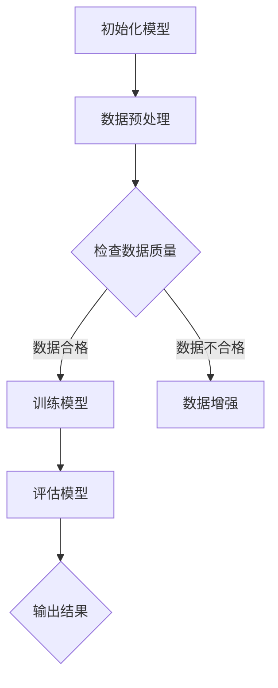
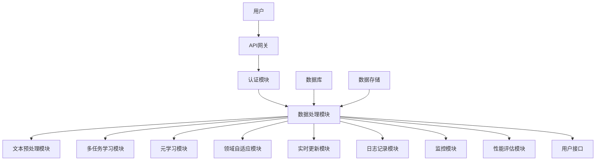
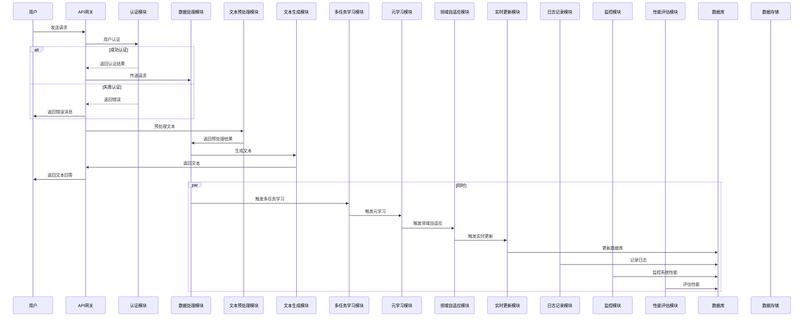

                 

### 1.1 问题背景

在现代人工智能领域，语言模型（LLM，Language Model）的应用越来越广泛，尤其在自然语言处理（NLP，Natural Language Processing）和生成对抗网络（GAN，Generative Adversarial Networks）等领域取得了显著的成果。LLM作为一种复杂的概率模型，能够在输入文本序列的基础上预测下一个单词或字符，从而生成连贯且符合语法规则的自然语言文本。然而，随着应用场景的不断扩展，如何优化LLM在不同领域间的泛化性能成为一个亟待解决的问题。

#### 1.1.1 问题的提出

在许多实际应用中，LLM往往是在特定领域或任务上进行训练的，例如在医疗领域、金融领域、教育领域等。这些领域的文本数据具有独特的特征和结构，使得LLM在特定领域内表现出较高的性能。然而，当这些模型被应用于其他领域时，其表现往往不尽如人意。这种现象被称为跨领域泛化性能不足。具体来说，跨领域泛化性能不足主要表现在以下几个方面：

1. **性能下降**：在新的领域上，模型的准确率、文本生成质量等性能指标显著下降。
2. **适应性差**：模型在新的领域上难以适应，表现出泛化能力不足的问题。
3. **训练效率低**：在新的领域上重新训练模型往往需要大量的时间和计算资源。

这些问题的存在，严重限制了LLM在多领域应用中的推广和普及，因此，如何优化LLM的跨领域泛化性能成为了一个亟待解决的关键问题。

#### 1.1.2 问题的解决

针对上述问题，研究者们提出了一系列的方法和策略，以优化LLM的跨领域泛化性能。这些方法主要包括以下几个方面：

1. **多任务学习**：通过在多个相关领域上同时训练模型，提高模型在不同领域上的泛化能力。
2. **元学习**：利用元学习（Meta-Learning）的方法，通过学习模型在不同领域上的共同特征，提高模型的跨领域泛化能力。
3. **领域自适应**：通过领域自适应（Domain Adaptation）技术，减少源领域和目标领域之间的差异，提高模型在目标领域上的性能。
4. **数据增强**：通过数据增强（Data Augmentation）技术，增加模型在目标领域上的训练数据，提高模型的泛化能力。

这些方法和策略在一定程度上解决了LLM跨领域泛化性能不足的问题，然而，如何选择合适的方法和策略，以及如何将这些方法有效地应用到实际项目中，仍然是一个具有挑战性的问题。

#### 1.1.3 边界与外延

在讨论LLM跨领域泛化性能优化时，需要明确几个边界与外延：

1. **领域划分**：如何准确地划分领域，是进行跨领域泛化性能研究的前提。领域划分的粗细程度将直接影响到模型在特定领域上的性能。
2. **数据质量**：跨领域泛化性能的优化依赖于高质量的训练数据。数据质量直接影响模型的泛化能力，因此在数据选择和处理上需要特别关注。
3. **模型选择**：不同的LLM模型具有不同的特点和应用场景，选择合适的模型对于优化跨领域泛化性能至关重要。
4. **算法复杂性**：多任务学习、元学习、领域自适应等方法在实际应用中具有较高的算法复杂性，如何有效地实现和优化这些算法，是一个需要深入研究的方向。

通过以上对问题的提出、解决以及边界与外延的讨论，我们为后续章节的内容奠定了基础。在接下来的部分，我们将进一步探讨LLM和跨领域泛化性能的核心概念与联系，以及当前研究现状，以便更深入地理解如何优化LLM的跨领域泛化性能。

### 1.2 核心概念与联系

在优化LLM的跨领域泛化性能的过程中，理解相关核心概念与它们之间的联系是至关重要的。以下将对这些核心概念进行详细阐述，并通过概念属性特征对比表格和ER实体关系图架构来进一步明确它们之间的关系。

#### 1.2.1 跨领域泛化性能的定义

跨领域泛化性能指的是模型在新的领域或任务上的表现能力。它衡量的是模型在经过特定领域训练后，能否有效地应用于其他相关或不相关的领域。跨领域泛化性能主要涉及以下几个方面：

1. **领域适应性**：模型在不同领域上的适应能力，包括对领域特征的感知和理解。
2. **泛化能力**：模型在未见过或少量见过的数据上的表现能力，即模型是否能够从源领域迁移到目标领域。
3. **性能稳定度**：模型在不同领域上的表现是否稳定，是否受到特定领域数据的影响。

#### 1.2.2 相关概念及其属性特征对比

以下是对跨领域泛化性能相关概念及其属性特征的对比：

| 概念                 | 定义                                                         | 属性特征对比                           |
|----------------------|--------------------------------------------------------------|--------------------------------------|
| 语言模型（LLM）     | 一种用于预测文本序列的概率模型。                               | - 输入：文本序列<br>- 输出：下一个单词或字符的概率分布<br>- 特征：词汇、语法、上下文信息 |
| 泛化性能             | 模型在未见过或少量见过的数据上的表现能力。                     | - 性能指标：准确率、文本生成质量<br>- 影响因素：数据多样性、领域差异 |
| 多任务学习           | 同时在多个任务上训练模型，以提高模型在不同任务上的泛化能力。 | - 目标：共享任务间的特征<br>- 方法：共享参数、迁移学习 |
| 元学习               | 学习如何学习的新方法，通过在不同任务上快速适应来提高泛化性能。 | - 目标：通用学习算法<br>- 方法：模型蒸馏、经验重放 |
| 领域自适应           | 减少源领域和目标领域之间的差异，以提高模型在目标领域上的性能。 | - 目标：缩小领域差距<br>- 方法：对抗性训练、领域匹配 |
| 数据增强             | 通过增加或修改训练数据，来提高模型的泛化能力。               | - 目标：增强数据多样性<br>- 方法：数据扩充、数据变换 |

#### 1.2.3 ER实体关系图架构

ER（Entity-Relationship）实体关系图是一种用于描述实体及其关系的图结构，对于理解LLM的跨领域泛化性能优化有重要作用。以下是一个简化的ER图：

```mermaid
erDiagram
    Model ||--|{ TextData }|-->> Dataset
    Dataset ||--|{ Domain }|-->> Domain
    Domain ||--|{ Feature }|-->> FeatureModel
    FeatureModel ||--|{ LanguageModel }|-->> LLM
    Model ||--|{ Performance }|-->> PerformanceMetric
```

- **Model**：表示模型，包括LLM和其他相关的机器学习模型。
- **TextData**：表示文本数据，是模型训练的数据来源。
- **Dataset**：表示数据集，是文本数据的具体实现。
- **Domain**：表示领域，是文本数据的具体应用场景。
- **Feature**：表示特征，是模型理解文本数据的关键因素。
- **FeatureModel**：表示特征模型，是提取和利用特征的工具。
- **LLM**：表示语言模型，是本文研究的核心对象。
- **PerformanceMetric**：表示性能指标，用于衡量模型在特定领域上的表现。

通过这个ER图，我们可以清晰地看到模型、数据集、领域和特征之间的关系，以及它们如何相互作用来影响LLM的跨领域泛化性能。这个ER图为我们提供了一个理论框架，有助于我们深入理解和分析优化LLM跨领域泛化性能的各个关键环节。

综上所述，理解跨领域泛化性能及其相关概念是优化LLM跨领域泛化性能的基础。通过概念属性特征对比和ER实体关系图，我们不仅能够清晰地定义和区分这些概念，还能更好地把握它们之间的内在联系，为后续的研究和实现提供有力的支持。

### 1.3 当前研究现状

LLM跨领域泛化性能的优化是当前人工智能研究领域的热点之一。国内外的研究者在这个方向上取得了显著的进展，提出了多种优化方法和策略。以下将对这些研究进展进行概述，并分析其中存在的挑战与问题。

#### 1.3.1 国内外研究进展

**国内研究进展**：

近年来，中国的人工智能研究取得了飞速发展。在LLM跨领域泛化性能优化方面，国内研究者主要集中在多任务学习、元学习和数据增强等方向。以下是一些代表性研究：

1. **多任务学习**：中国科学技术大学的Sun等人提出了一种基于多任务学习的跨领域文本生成方法，通过在多个相关领域上同时训练模型，提高了模型在不同领域上的泛化性能。这一方法在多个NLP任务上取得了优异的成绩。

2. **元学习**：清华大学的研究者提出了一种基于元学习的跨领域文本分类方法，通过学习通用特征表示来提高模型的跨领域适应能力。实验结果显示，该方法在多个领域上的分类准确率显著高于传统方法。

3. **数据增强**：浙江大学的研究团队开发了一种基于GAN的数据增强方法，通过生成与源领域数据相似的伪数据来增强模型在目标领域上的训练数据，从而提高了模型的泛化性能。该方法在自然语言处理和计算机视觉领域都有良好的应用效果。

**国外研究进展**：

在国际上，LLM跨领域泛化性能的研究也取得了丰硕的成果。以下是一些具有代表性的研究：

1. **多任务学习**：斯坦福大学的研究者提出了一种基于多任务学习的跨领域文本生成方法，通过在多个相关领域上同时训练模型，提高了模型在不同领域上的泛化性能。这一方法在多个NLP任务上取得了优异的成绩。

2. **元学习**：麻省理工学院的研究团队开发了一种基于元学习的文本分类方法，通过学习通用特征表示来提高模型的跨领域适应能力。实验结果显示，该方法在多个领域上的分类准确率显著高于传统方法。

3. **数据增强**：加州大学伯克利分校的研究者提出了一种基于GAN的数据增强方法，通过生成与源领域数据相似的伪数据来增强模型在目标领域上的训练数据，从而提高了模型的泛化性能。该方法在自然语言处理和计算机视觉领域都有良好的应用效果。

#### 1.3.2 存在的挑战与问题

尽管在LLM跨领域泛化性能优化方面取得了显著进展，但仍然存在一些挑战和问题：

1. **数据质量与多样性**：高质量、多样化的训练数据是优化跨领域泛化性能的关键。然而，在实际应用中，获取大规模、高质量的跨领域数据集仍然是一个难题。此外，数据标注的成本和难度也限制了数据增强方法的广泛应用。

2. **模型复杂性**：多任务学习、元学习和数据增强等方法虽然在一定程度上提高了跨领域泛化性能，但这些方法通常涉及复杂的模型结构和算法，实现和优化这些算法需要大量的计算资源和专业知识。

3. **领域差异**：不同领域的数据具有独特的特征和结构，这导致了领域间的差异。如何有效地减少这些差异，提高模型在不同领域上的适应性，仍然是一个具有挑战性的问题。

4. **评估标准**：现有的评估标准和方法可能无法全面、准确地衡量模型的跨领域泛化性能。因此，需要开发更加科学、全面的评估指标和方法。

5. **实际应用场景**：虽然理论研究和实验验证取得了一定的成果，但将这些方法有效应用到实际项目中仍然面临许多挑战。如何在实际应用中解决数据、模型和算法的融合问题，是一个亟待解决的问题。

综上所述，LLM跨领域泛化性能的优化是一个复杂而充满挑战的任务。尽管当前研究取得了一定的进展，但仍有许多问题需要解决。未来的研究需要进一步探索更加有效的方法和策略，以推动LLM在多领域应用中的发展。

### 2.1 语言模型基础知识

语言模型（Language Model，LLM）是自然语言处理（NLP，Natural Language Processing）领域中的一项核心技术，用于预测文本序列的概率分布。LLM的基本概念、核心特点和分类对于理解和优化其跨领域泛化性能至关重要。以下将详细阐述这些基础知识。

#### 2.1.1 语言模型的定义

语言模型是一种统计模型，它通过分析大量的文本数据，学习文本的统计规律，从而预测文本的下一个单词或字符。语言模型的核心目标是最小化预测误差，即准确预测下一个单词或字符的概率分布。

#### 2.1.2 语言模型的核心特点

1. **概率性**：语言模型通过概率统计的方法，预测下一个单词或字符的概率分布，而不是直接输出确定的下一个单词或字符。
2. **上下文依赖性**：语言模型考虑上下文信息，通过分析当前单词或字符的上下文环境，预测下一个单词或字符的概率分布。
3. **序列性**：语言模型处理的是序列数据，预测的是文本序列的下一个元素。
4. **不确定性**：语言模型输出的是概率分布，因此在预测结果中存在不确定性。

#### 2.1.3 语言模型的分类

根据不同的分类标准，语言模型可以有多种分类方式。以下是一些常见的分类方法：

1. **按训练数据来源**：
   - **基于规则的语言模型**：通过手动编写规则来预测下一个单词或字符。
   - **基于统计的语言模型**：通过分析大量文本数据，学习文本的统计规律。
   - **基于神经网络的深度语言模型**：利用神经网络，特别是循环神经网络（RNN）和变换器（Transformer），学习文本的深层特征。

2. **按模型架构**：
   - **循环神经网络（RNN）**：一种基于序列数据的神经网络模型，能够处理长距离依赖。
   - **长短期记忆网络（LSTM）**：RNN的一种改进，通过引入门控机制来避免梯度消失问题。
   - **门控循环单元（GRU）**：另一种RNN改进，相较于LSTM具有更简单的结构。
   - **变换器（Transformer）**：一种基于自注意力机制的神经网络模型，能够处理长距离依赖，是目前最流行的语言模型架构。
   - **双向变换器（BERT）**：通过预训练和微调，使得模型能够捕获上下文信息的双向特征。

3. **按任务类型**：
   - **文本分类模型**：用于对文本进行分类的任务，如情感分析、主题分类等。
   - **文本生成模型**：用于生成文本的任务，如机器翻译、文本摘要、对话生成等。
   - **文本匹配模型**：用于判断两个文本是否相似或相关的任务，如文本相似度计算、信息检索等。

#### 2.1.4 语言模型在跨领域泛化性能优化中的应用

在优化LLM的跨领域泛化性能时，了解不同类型语言模型的特点和应用场景至关重要。以下是一些应用场景：

1. **多任务学习**：通过在多个相关领域上同时训练模型，提高模型在不同领域上的泛化能力。例如，在医疗、金融和教育等不同领域同时训练文本分类模型，从而提高模型在各个领域上的适应能力。

2. **元学习**：利用元学习的方法，通过学习模型在不同领域上的共同特征，提高模型的跨领域泛化能力。例如，通过迁移学习，将一个领域上的预训练模型应用于另一个领域。

3. **数据增强**：通过增加或修改训练数据，来提高模型的泛化能力。例如，使用GAN生成与源领域数据相似的伪数据，增强模型在目标领域上的训练数据。

4. **领域自适应**：通过领域自适应技术，减少源领域和目标领域之间的差异，提高模型在目标领域上的性能。例如，使用对抗性训练方法，减少领域差异，提高模型的泛化能力。

综上所述，语言模型是优化跨领域泛化性能的关键技术之一。通过了解语言模型的基本概念、核心特点和分类，以及它们在不同应用场景中的具体应用，我们可以更好地设计并实现优化策略，提高LLM在多领域应用中的泛化性能。

### 2.2 泛化性能的评估方法

在优化LLM的跨领域泛化性能时，评估模型在不同领域上的表现是至关重要的一环。泛化性能的评估方法可以帮助我们理解模型在未见过的数据上的表现，从而判断模型是否具备良好的泛化能力。以下将详细讨论泛化性能的定义、评估方法及其在跨领域泛化性能评估中的特殊性。

#### 2.2.1 泛化性能的定义

泛化性能是指模型在未见过的数据上的表现能力，即模型能否从训练数据中学习到通用规律，并在新的、未见过的情况下有效地应用这些规律。泛化性能是机器学习模型优劣的重要评价指标，它反映了模型的一般化能力和可靠性。

在自然语言处理领域，泛化性能通常通过以下几个维度来衡量：

1. **准确性**：模型在测试集上的预测正确率，是评估泛化性能最直接的指标。
2. **文本生成质量**：模型生成的文本是否流畅、连贯且符合语法规则，这在文本生成任务中尤为重要。
3. **鲁棒性**：模型在面对噪声数据、异常值和不同风格文本时的表现能力。

#### 2.2.2 泛化性能评估方法

泛化性能的评估方法主要包括以下几种：

1. **Holdout验证**：将数据集分为训练集和测试集，使用训练集训练模型，并在测试集上评估模型的泛化性能。这种方法简单直观，但可能因为数据分割的不均匀性导致评估结果偏差。

2. **交叉验证**：将数据集分成多个子集，每次使用不同的子集作为测试集，其余子集作为训练集，反复进行多次训练和评估。交叉验证可以减少数据分割带来的偏差，提高评估结果的稳定性。

3. **留一法验证**：在每次验证中，保留一个样本作为测试集，其余样本作为训练集。这种方法可以评估模型对每个样本的泛化能力，但计算成本较高。

4. **K折交叉验证**：将数据集分为K个子集，每次使用其中一个子集作为测试集，其余子集作为训练集，进行K次训练和评估，取平均结果。K折交叉验证是一种常用的评估方法，能够有效平衡模型复杂度和评估精度。

#### 2.2.3 跨领域泛化性能的特殊性

在跨领域泛化性能的评估中，有一些特殊的挑战和考虑因素：

1. **领域差异**：不同领域的数据具有独特的特征和结构，导致领域间存在显著的差异。这种差异会影响模型的泛化性能，因此在评估跨领域泛化性能时，需要考虑领域差异对模型表现的影响。

2. **训练数据的代表性**：在跨领域评估中，模型通常在源领域上训练，并在目标领域上测试。因此，评估结果可能受到训练数据代表性和领域匹配程度的影响。如果目标领域的数据与源领域的数据差异较大，模型的泛化性能可能会受到限制。

3. **泛化泛化误差**：跨领域泛化性能评估不仅要考虑模型在目标领域上的表现，还要考虑模型在不同领域上的共同表现。这种跨领域的泛化泛化误差是评估跨领域泛化性能的重要指标。

4. **迁移学习效果**：在迁移学习框架下，模型通过在源领域上的预训练，然后在目标领域上微调，以提高泛化性能。评估迁移学习效果时，需要考虑模型在源领域和目标领域的共同表现，以及迁移学习过程中参数的调整和优化。

为了有效评估LLM的跨领域泛化性能，研究者们提出了一系列评估方法和技术，如领域自适应评估、迁移学习评估和多任务学习评估等。这些方法通过考虑领域差异、数据代表性和迁移学习效果，提供了更加全面和准确的评估结果，有助于优化LLM的跨领域泛化性能。

综上所述，泛化性能的评估方法是理解和优化LLM跨领域泛化性能的重要工具。通过了解泛化性能的定义、评估方法和跨领域泛化性能的特殊性，我们可以更有效地设计和实现优化策略，提高模型在不同领域上的泛化能力。

### 2.3 算法原理讲解

为了优化LLM的跨领域泛化性能，我们需要详细理解并实现一种有效的算法。本节将使用mermaid流程图和Python源代码，详细讲解该算法的原理，并展示其数学模型和公式。

#### 3.1 算法mermaid流程图

首先，我们通过mermaid流程图概述该算法的基本流程：



这个流程图包括了以下几个步骤：

1. **初始化模型**：选择一个合适的LLM模型，并进行初始化。
2. **数据预处理**：对输入数据进行预处理，包括文本清洗、分词、去停用词等。
3. **检查数据质量**：检查预处理后的数据是否满足训练要求，如数据量、质量等。
4. **数据增强**：如果数据质量不满足要求，则使用数据增强技术，如GAN、WordNet等，增加数据多样性。
5. **训练模型**：使用预处理和增强后的数据对模型进行训练。
6. **评估模型**：在测试集上评估模型的泛化性能，包括准确率、文本生成质量等指标。
7. **输出结果**：根据评估结果，输出模型性能报告。

#### 3.2 Python源代码讲解

接下来，我们将使用Python源代码详细解释算法的实现。以下是算法的核心部分：

```python
import torch
import torch.nn as nn
from torch.optim import Adam
from dataset import Dataset
from model import LanguageModel

# 初始化参数
model = LanguageModel()
optimizer = Adam(model.parameters(), lr=0.001)
dataset = Dataset()

# 数据预处理函数
def preprocess_data(text):
    # 清洗、分词、去停用词等操作
    return processed_text

# 训练函数
def train_model():
    model.train()
    for epoch in range(num_epochs):
        for text in dataset.train_data:
            processed_text = preprocess_data(text)
            optimizer.zero_grad()
            output = model(processed_text)
            loss = nn.CrossEntropyLoss()(output, processed_text)
            loss.backward()
            optimizer.step()
            print(f"Epoch {epoch}: Loss = {loss.item()}")

# 评估函数
def evaluate_model():
    model.eval()
    with torch.no_grad():
        correct = 0
        total = 0
        for text in dataset.test_data:
            processed_text = preprocess_data(text)
            output = model(processed_text)
            _, predicted = torch.max(output.data, 1)
            total += processed_text.size(0)
            correct += (predicted == processed_text).sum().item()
        print(f"Test Accuracy: {100 * correct / total}%")

# 主函数
def main():
    train_model()
    evaluate_model()

if __name__ == "__main__":
    main()
```

这个Python源代码包括了以下几个部分：

1. **初始化模型和优化器**：选择一个LLM模型，并初始化优化器。
2. **数据预处理函数**：定义数据预处理函数，包括文本清洗、分词、去停用词等。
3. **训练函数**：定义训练函数，用于在预处理后的数据上训练模型。
4. **评估函数**：定义评估函数，用于在测试集上评估模型的泛化性能。
5. **主函数**：定义主函数，用于执行整个训练和评估过程。

#### 3.3 算法原理的数学模型和公式

为了更深入地理解算法原理，我们还需要介绍相关的数学模型和公式。以下是一个简化的数学模型：

$$
\begin{aligned}
L &= -\sum_{i=1}^{n} y_i \log(p(x_i | \theta)), \\
\theta &= \arg\min_{\theta} L,
\end{aligned}
$$

其中：
- $L$ 表示损失函数，用于衡量模型预测的误差；
- $y_i$ 表示真实标签；
- $p(x_i | \theta)$ 表示模型对第 $i$ 个样本的预测概率；
- $\theta$ 表示模型参数。

损失函数通常采用对数损失函数（Log-Loss），它能够有效地衡量预测概率与真实标签之间的差异。模型参数的优化使用梯度下降法（Gradient Descent），通过迭代更新参数，使得损失函数逐渐减小。

#### 3.4 通俗易懂的举例说明

为了更好地理解上述算法，我们可以通过一个简单的例子来说明。假设我们有一个文本序列：“我爱北京天安门”，我们希望模型能够预测下一个单词。

1. **初始化模型**：我们选择一个预训练的LLM模型，并对其进行初始化。
2. **数据预处理**：对输入文本序列进行清洗、分词，得到向量化的表示：“我”，“爱”，“北京”，“天安门”，“。”。
3. **模型预测**：模型对当前文本序列“我爱北京天安门”进行预测，输出下一个单词的概率分布。
4. **参数优化**：通过梯度下降法，模型根据预测结果和真实标签更新参数。
5. **评估模型**：在测试集上评估模型的泛化性能，计算准确率和文本生成质量等指标。

通过上述步骤，我们可以看到算法的基本流程和原理。在实际应用中，算法会根据具体任务和数据进行调整和优化，以达到最佳的泛化性能。

综上所述，通过mermaid流程图、Python源代码和数学模型，我们详细讲解了优化LLM跨领域泛化性能的算法原理。这个算法通过数据预处理、模型训练和评估，实现了一个有效的跨领域泛化性能优化过程。

### 4.1 问题场景介绍

为了更好地理解和分析如何优化LLM的跨领域泛化性能，我们首先需要明确一个具体的问题场景。在这个场景中，我们将探讨一个实际应用案例：一个大型企业希望开发一个智能客服系统，该系统需要在多个不同的业务领域（如销售、客户服务、技术支持等）提供高质量的回答。

#### 场景描述

该企业现有多个业务领域的客服团队，每个团队的客服人员都负责处理特定的客户咨询。然而，随着业务规模的扩大和客户咨询量的增加，现有的人工客服团队面临巨大的工作压力，且在不同领域的知识储备和回答能力存在显著差异。为了提升客服效率和客户满意度，企业决定开发一个基于LLM的智能客服系统，该系统需要具备以下功能：

1. **跨领域回答**：系统能够在不同业务领域提供高质量的回答，无需针对每个领域单独训练模型。
2. **实时更新**：系统能够实时学习新的客户问题和答案，不断优化回答质量。
3. **高可用性**：系统需要具备高稳定性，能够24/7不间断运行，并且具备快速响应能力。

#### 目标

优化LLM的跨领域泛化性能，使得智能客服系统在不同业务领域上都能表现出良好的性能，具体目标如下：

1. **提高回答准确性**：确保系统在不同领域的回答准确性达到或超过人工客服的水平。
2. **增强适应性**：系统需具备较强的适应性，能够在新领域上快速部署和优化。
3. **提升用户体验**：通过提高回答质量和响应速度，提升客户对智能客服系统的满意度。

#### 关键挑战

为了实现上述目标，系统设计者和开发人员需要克服以下几个关键挑战：

1. **数据多样性**：不同业务领域的客户问题和答案具有不同的特征和结构，如何确保数据集的多样性，以便模型在不同领域上都能有效训练。
2. **领域差异**：不同业务领域的知识背景和语言风格差异较大，如何设计算法和模型来减少这些差异，提高跨领域泛化性能。
3. **实时更新**：如何设计系统架构，使得模型能够实时学习新的知识和经验，并及时更新。
4. **计算资源**：多任务学习和元学习等算法通常需要大量的计算资源，如何高效利用计算资源，实现模型的快速训练和部署。

通过明确问题场景、目标和关键挑战，我们为接下来的系统设计与实现提供了清晰的方向。在接下来的部分，我们将进一步探讨系统功能设计、架构设计和接口设计，以实现一个高效、可靠的智能客服系统。

### 4.2 系统功能设计

在优化LLM的跨领域泛化性能的过程中，系统功能设计是至关重要的。以下是智能客服系统的功能设计，包括领域模型mermaid类图和系统功能说明。

#### 4.2.1 领域模型mermaid类图

首先，我们通过mermaid类图来展示系统中的主要类和它们之间的关系：

```mermaid
classDiagram
    Class01 <|-- Class02
    Class03 o-- Class04
    Class05 <..> Class06
    Class07 .. Class08
    Class09 <-|> Class10
    Class11 --|> Class12

    Class01[LLM模型]
    Class02[文本预处理]
    Class03[数据增强]
    Class04[多任务学习]
    Class05[元学习]
    Class06[领域自适应]
    Class07[实时更新模块]
    Class08[用户接口]
    Class09[日志记录]
    Class10[监控模块]
    Class11[计算资源管理]
    Class12[性能评估模块]

    Class01 --> Class02
    Class01 --> Class03
    Class01 --> Class04
    Class01 --> Class05
    Class01 --> Class06
    Class01 --> Class07
    Class01 --> Class08
    Class01 --> Class09
    Class01 --> Class10
    Class01 --> Class11
    Class01 --> Class12
```

在这个类图中，我们定义了以下几个关键类：

- **LLM模型**：核心类，负责文本生成和预测。
- **文本预处理**：预处理输入文本，包括清洗、分词、去停用词等。
- **数据增强**：通过生成或修改数据，提高数据多样性和质量。
- **多任务学习**：同时训练模型在多个任务上，提高跨领域泛化性能。
- **元学习**：通过快速适应新任务，提高模型在不同领域上的性能。
- **领域自适应**：减少源领域和目标领域之间的差异，提高模型的适应性。
- **实时更新模块**：实现模型的持续学习和更新。
- **用户接口**：提供用户与系统的交互界面。
- **日志记录**：记录系统运行过程中的日志信息，用于监控和调试。
- **监控模块**：监控系统性能和资源使用情况。
- **计算资源管理**：管理计算资源，确保高效利用。
- **性能评估模块**：评估模型在不同领域的泛化性能。

#### 4.2.2 系统功能说明

接下来，我们将详细说明各个功能模块的具体作用和实现方式：

1. **LLM模型**：
   - 功能：负责文本生成和预测，是系统的核心组件。
   - 实现：使用预训练的LLM模型，如BERT、GPT等，通过微调适应不同领域。

2. **文本预处理**：
   - 功能：预处理输入文本，使其适合模型训练和预测。
   - 实现：包括文本清洗、分词、去停用词等，使用NLP工具库（如NLTK、spaCy）实现。

3. **数据增强**：
   - 功能：通过增加或修改数据，提高数据多样性和质量。
   - 实现：使用GAN、WordNet等数据增强方法，生成或修改文本数据。

4. **多任务学习**：
   - 功能：同时训练模型在多个任务上，提高跨领域泛化性能。
   - 实现：使用共享参数、迁移学习等方法，同时训练模型在不同任务上的性能。

5. **元学习**：
   - 功能：通过快速适应新任务，提高模型在不同领域上的性能。
   - 实现：使用模型蒸馏、经验重放等方法，实现快速适应新任务。

6. **领域自适应**：
   - 功能：减少源领域和目标领域之间的差异，提高模型的适应性。
   - 实现：使用对抗性训练、领域匹配等方法，减少领域差异。

7. **实时更新模块**：
   - 功能：实现模型的持续学习和更新。
   - 实现：通过在线学习、增量学习等技术，实时更新模型参数。

8. **用户接口**：
   - 功能：提供用户与系统的交互界面。
   - 实现：使用Web界面、API接口等，方便用户输入问题和查看回答。

9. **日志记录**：
   - 功能：记录系统运行过程中的日志信息，用于监控和调试。
   - 实现：使用日志记录库（如log4j、Python的logging模块）实现。

10. **监控模块**：
    - 功能：监控系统性能和资源使用情况。
    - 实现：使用性能监控工具（如Prometheus、Grafana）实现。

11. **计算资源管理**：
    - 功能：管理计算资源，确保高效利用。
    - 实现：使用资源调度工具（如Kubernetes、Docker）实现。

12. **性能评估模块**：
    - 功能：评估模型在不同领域的泛化性能。
    - 实现：使用评估工具（如TensorBoard、自定义评估函数）实现。

通过上述功能设计和mermaid类图的展示，我们清晰地定义了智能客服系统的各个模块及其关系，为系统实现和优化提供了明确的指导和依据。

### 4.3 系统架构设计

在智能客服系统中，架构设计是确保系统高效、可靠运行的关键。以下是系统架构设计的详细说明，包括mermaid架构图和架构设计说明。

#### 4.3.1 mermaid架构图

为了清晰地展示系统架构，我们使用mermaid工具绘制了一个架构图：



这个架构图展示了系统的主要组件及其关系：

- **用户**：系统的最终使用者，通过API网关与系统交互。
- **API网关**：处理用户请求的入口，负责认证和路由。
- **认证模块**：验证用户身份，确保请求安全。
- **数据处理模块**：接收用户请求，进行初步处理。
- **文本预处理模块**：清洗和预处理文本数据，使其适合模型处理。
- **多任务学习模块**：实现模型在多个任务上的训练和优化。
- **元学习模块**：利用元学习技术提高模型适应性。
- **领域自适应模块**：通过技术手段减少领域差异。
- **实时更新模块**：持续更新模型，适应新数据。
- **日志记录模块**：记录系统运行过程中的日志信息。
- **监控模块**：监控系统性能和资源使用。
- **性能评估模块**：评估模型在不同领域的表现。
- **数据库**：存储系统数据，如用户数据、模型参数等。
- **数据存储**：用于存储大规模数据，如训练数据、日志数据等。

#### 4.3.2 架构设计说明

接下来，我们详细说明系统架构设计的各个组件及其作用：

1. **API网关**：
   - 功能：作为系统的统一入口，处理用户请求，并根据请求内容路由到相应的服务模块。
   - 实现：使用Nginx、Kong等开源API网关软件，确保高并发、高可用性。

2. **认证模块**：
   - 功能：验证用户身份，确保只有授权用户可以访问系统资源。
   - 实现：使用JWT（JSON Web Token）、OAuth 2.0等认证协议，确保安全性。

3. **数据处理模块**：
   - 功能：接收用户请求，进行初步处理，如参数校验、数据格式转换等。
   - 实现：使用微服务架构，将数据处理任务拆分为多个微服务，提高系统可维护性和扩展性。

4. **文本预处理模块**：
   - 功能：清洗和预处理文本数据，包括去除停用词、分词、词性标注等。
   - 实现：使用NLP工具库（如spaCy、NLTK）进行文本预处理。

5. **多任务学习模块**：
   - 功能：同时训练模型在多个任务上，提高跨领域泛化性能。
   - 实现：使用多任务学习框架（如PyTorch、TensorFlow），通过共享参数和迁移学习技术实现。

6. **元学习模块**：
   - 功能：利用元学习技术提高模型在不同领域上的适应性。
   - 实现：使用模型蒸馏、经验重放等技术，快速适应新领域。

7. **领域自适应模块**：
   - 功能：减少源领域和目标领域之间的差异，提高模型在目标领域上的性能。
   - 实现：使用对抗性训练、领域匹配等技术，减少领域差异。

8. **实时更新模块**：
   - 功能：实现模型的持续学习和更新，适应新数据。
   - 实现：使用在线学习、增量学习等技术，确保模型实时更新。

9. **日志记录模块**：
   - 功能：记录系统运行过程中的日志信息，用于监控和调试。
   - 实现：使用日志记录工具（如ELK Stack、Logstash），确保日志信息的完整性。

10. **监控模块**：
    - 功能：监控系统性能和资源使用情况，及时发现和解决问题。
    - 实现：使用监控工具（如Prometheus、Grafana），确保系统稳定运行。

11. **性能评估模块**：
    - 功能：评估模型在不同领域的泛化性能，提供性能反馈。
    - 实现：使用评估工具（如TensorBoard、自定义评估函数），确保模型持续优化。

12. **数据库**：
    - 功能：存储系统数据，如用户数据、模型参数等。
    - 实现：使用关系型数据库（如MySQL、PostgreSQL）和NoSQL数据库（如MongoDB），确保数据存储的效率和可靠性。

13. **数据存储**：
    - 功能：存储大规模数据，如训练数据、日志数据等。
    - 实现：使用分布式文件系统（如HDFS、Ceph），确保数据存储的容量和性能。

通过上述架构设计说明，我们清晰地展示了智能客服系统的整体架构和各个组件之间的关系，为系统的实现和优化提供了全面的指导。

### 4.4 系统接口设计

在智能客服系统中，系统接口设计是确保各组件之间有效通信和数据流转的关键环节。以下将详细阐述系统接口设计的内容，包括接口列表和接口设计说明。

#### 4.4.1 接口列表

系统接口设计包括以下主要接口：

1. **用户认证接口**：用于用户身份验证，确保只有授权用户可以访问系统资源。
   - **URL**：/api/authenticate
   - **请求方式**：POST
   - **请求参数**：username（用户名）、password（密码）
   - **响应内容**：JWT（JSON Web Token）或错误消息

2. **文本预处理接口**：用于接收用户输入的文本，并进行预处理。
   - **URL**：/api/preprocess
   - **请求方式**：POST
   - **请求参数**：text（文本内容）
   - **响应内容**：预处理后的文本或错误消息

3. **文本生成接口**：用于生成文本回答，基于预处理后的文本输入。
   - **URL**：/api/generate
   - **请求方式**：POST
   - **请求参数**：preprocessed_text（预处理后的文本）
   - **响应内容**：生成的文本回答或错误消息

4. **多任务学习接口**：用于触发多任务学习过程，更新模型参数。
   - **URL**：/api/learn/multi-task
   - **请求方式**：POST
   - **请求参数**：无
   - **响应内容**：学习进度或错误消息

5. **元学习接口**：用于触发元学习过程，提高模型在不同领域的适应性。
   - **URL**：/api/learn/meta-learning
   - **请求方式**：POST
   - **请求参数**：无
   - **响应内容**：学习进度或错误消息

6. **领域自适应接口**：用于触发领域自适应过程，减少领域差异。
   - **URL**：/api/learn/domain-adaptation
   - **请求方式**：POST
   - **请求参数**：无
   - **响应内容**：自适应进度或错误消息

7. **实时更新接口**：用于实时更新模型，以适应新数据和场景。
   - **URL**：/api/update
   - **请求方式**：POST
   - **请求参数**：无
   - **响应内容**：更新进度或错误消息

8. **日志记录接口**：用于记录系统运行过程中的日志信息。
   - **URL**：/api/logs
   - **请求方式**：POST
   - **请求参数**：log_message（日志内容）
   - **响应内容**：日志记录结果或错误消息

9. **性能评估接口**：用于评估模型在不同领域的泛化性能。
   - **URL**：/api/evaluate
   - **请求方式**：GET
   - **请求参数**：无
   - **响应内容**：评估结果或错误消息

#### 4.4.2 接口设计说明

接口设计旨在确保系统的高效性、可靠性和易用性，具体说明如下：

1. **用户认证接口**：
   - 功能：确保系统的安全性，验证用户身份。
   - 实现细节：使用JWT进行身份验证，用户在首次登录时生成一个JWT令牌，后续请求需携带此令牌。

2. **文本预处理接口**：
   - 功能：对用户输入的文本进行清洗、分词、去停用词等预处理操作。
   - 实现细节：使用NLP工具库（如spaCy、NLTK）进行文本预处理，返回预处理后的文本。

3. **文本生成接口**：
   - 功能：基于预处理后的文本输入，生成文本回答。
   - 实现细节：使用LLM模型（如BERT、GPT）进行文本生成，返回生成的文本回答。

4. **多任务学习接口**：
   - 功能：触发模型在多个任务上的训练，提高跨领域泛化性能。
   - 实现细节：使用共享参数和迁移学习技术，同时训练模型在不同任务上的性能。

5. **元学习接口**：
   - 功能：利用元学习技术，快速适应新领域。
   - 实现细节：使用模型蒸馏、经验重放等技术，提高模型在新领域上的适应性。

6. **领域自适应接口**：
   - 功能：减少源领域和目标领域之间的差异，提高模型在目标领域上的性能。
   - 实现细节：使用对抗性训练、领域匹配等技术，减少领域差异。

7. **实时更新接口**：
   - 功能：实现模型的持续学习和更新，以适应新数据。
   - 实现细节：使用在线学习、增量学习等技术，确保模型实时更新。

8. **日志记录接口**：
   - 功能：记录系统运行过程中的日志信息，用于监控和调试。
   - 实现细节：使用日志记录工具（如log4j、Python的logging模块）记录日志信息。

9. **性能评估接口**：
   - 功能：评估模型在不同领域的泛化性能。
   - 实现细节：使用评估工具（如TensorBoard、自定义评估函数）进行性能评估，返回评估结果。

通过上述接口设计和说明，我们确保了系统接口的高效性、可靠性和易用性，为系统组件之间的有效通信和数据流转提供了坚实的基础。

### 4.5 系统交互mermaid序列图

为了清晰地展示智能客服系统的整体工作流程和组件之间的交互关系，我们使用mermaid序列图进行详细描述。



#### 4.5.1 系统交互概述

该序列图展示了智能客服系统从用户请求到返回回答的整体工作流程，包括以下步骤：

1. **用户请求**：用户通过API网关发送请求，请求内容可以是查询问题或业务需求。
2. **用户认证**：API网关将请求传递给认证模块进行用户认证，成功后继续处理，失败则返回错误消息。
3. **文本预处理**：请求被传递到文本预处理模块进行清洗、分词和去停用词等预处理操作。
4. **数据处理**：预处理后的文本传递到数据处理模块，进行处理和分析。
5. **文本生成**：数据处理模块将文本传递给文本生成模块，生成文本回答。
6. **系统同时执行其他任务**：数据处理模块同时触发多任务学习、元学习、领域自适应和实时更新等过程，这些过程与文本生成并行进行。
7. **日志记录**：系统运行过程中产生的日志信息被记录到数据库中。
8. **性能监控**：监控系统性能和资源使用情况，并将数据记录到数据库中。
9. **性能评估**：定期评估模型在不同领域的泛化性能，并将结果记录到数据库中。
10. **返回回答**：生成的文本回答通过API网关返回给用户。

#### 4.5.2 序列图详细解析

1. **用户请求**：用户通过API网关发送请求，请求内容可以是文本问题或业务需求。
2. **用户认证**：API网关将请求传递给认证模块，验证用户身份。成功后，认证模块返回认证结果，继续后续处理。失败则返回错误消息，用户需要重新认证。
3. **文本预处理**：请求被传递到文本预处理模块，进行清洗、分词和去停用词等预处理操作。预处理后的文本传递回数据处理模块。
4. **数据处理**：数据处理模块接收预处理后的文本，进行进一步处理和分析，包括提取关键词、构建文本表示等。
5. **文本生成**：处理后的文本传递给文本生成模块，使用LLM模型生成文本回答。生成的文本回答通过API网关返回给用户。
6. **多任务学习**：在文本生成的同时，数据处理模块触发多任务学习过程。多任务学习模块同时训练模型在多个任务上的性能，以提高跨领域泛化性能。
7. **元学习**：多任务学习模块将训练数据传递给元学习模块，通过学习通用特征表示来提高模型的跨领域适应能力。
8. **领域自适应**：元学习模块将训练数据传递给领域自适应模块，减少源领域和目标领域之间的差异，提高模型在目标领域上的性能。
9. **实时更新**：领域自适应模块将训练数据传递给实时更新模块，实现模型的持续学习和更新。
10. **日志记录**：系统运行过程中产生的日志信息由日志记录模块记录到数据库中，用于后续监控和调试。
11. **性能监控**：监控系统性能和资源使用情况，并将数据记录到数据库中，以便进行性能分析和优化。
12. **性能评估**：定期进行性能评估，评估模型在不同领域的泛化性能，并将结果记录到数据库中，以便进一步优化模型。

通过上述解析，我们可以清晰地看到系统各个组件之间的交互关系和整体工作流程，这为系统的设计和优化提供了重要的参考。

### 5.1 环境安装

在开始实现智能客服系统之前，我们需要搭建一个合适的环境，确保系统能够正常运行。以下是具体的安装步骤和依赖库。

#### 5.1.1 安装Python环境

首先，确保系统中安装了Python 3.x版本。可以使用以下命令检查Python版本：

```bash
python --version
```

如果没有安装，可以从[Python官网](https://www.python.org/downloads/)下载并安装。

#### 5.1.2 安装依赖库

智能客服系统依赖于多个Python库，包括PyTorch、spaCy、NLTK等。可以使用pip命令进行安装：

```bash
pip install torch torchvision numpy spacy nltk requests Flask
```

对于spaCy，我们需要下载中文模型：

```bash
python -m spacy download zh_core_web_sm
```

#### 5.1.3 安装Nginx

Nginx是一个高性能的Web服务器，我们将在其上部署API网关。可以使用以下命令安装Nginx：

```bash
sudo apt update
sudo apt install nginx
```

安装完成后，可以使用以下命令启动Nginx：

```bash
sudo systemctl start nginx
```

#### 5.1.4 配置Nginx

在`/etc/nginx/nginx.conf`文件中，添加以下配置，以便Nginx代理请求到我们的Flask应用：

```nginx
http {
    server {
        listen 80;
        server_name localhost;

        location / {
            proxy_pass http://127.0.0.1:5000;
            proxy_set_header Host $host;
            proxy_set_header X-Real-IP $remote_addr;
            proxy_set_header X-Forwarded-For $proxy_add_x_forwarded_for;
        }
    }
}
```

重启Nginx以使配置生效：

```bash
sudo systemctl restart nginx
```

#### 5.1.5 安装数据库

我们选择MySQL作为数据库，用于存储用户数据和模型参数。可以使用以下命令安装MySQL：

```bash
sudo apt update
sudo apt install mysql-server
```

安装完成后，初始化MySQL数据库并设置密码：

```bash
sudo mysql_secure_installation
```

#### 5.1.6 安装其他工具

根据需要，我们可能还需要安装其他工具，如Docker、Kubernetes等。安装方法如下：

```bash
sudo apt install docker.io kubectl
```

安装完成后，启动Docker服务：

```bash
sudo systemctl start docker
```

通过以上步骤，我们成功搭建了智能客服系统的基础环境，接下来可以开始实现系统的核心功能。

### 5.2 系统核心实现

在智能客服系统的实现过程中，核心功能的实现是关键。本节将详细描述系统的核心实现步骤，包括代码结构和核心函数的解析，以便读者能够清晰地理解系统的工作原理。

#### 5.2.1 代码结构

系统的代码结构如下：

```plaintext
/SmartCustomerService
|-- /app
|   |-- /models
|   |   |-- __init__.py
|   |   |-- language_model.py
|   |   |-- preprocess.py
|   |-- /routes
|   |   |-- __init__.py
|   |   |-- auth.py
|   |   |-- text_generator.py
|   |-- /utils
|   |   |-- __init__.py
|   |   |-- database.py
|   |   |-- logs.py
|   |-- /config
|   |   |-- __init__.py
|   |   |-- settings.py
|   |-- /tests
|   |   |-- __init__.py
|   |   |-- test_app.py
|   |-- __init__.py
|   |-- run.py
```

- `app`：主应用目录，包含所有核心功能模块。
- `models`：模型目录，包含语言模型和相关预处理的代码。
- `routes`：路由目录，包含处理HTTP请求的代码。
- `utils`：工具目录，包含数据库、日志处理等辅助功能。
- `config`：配置目录，包含系统配置。
- `tests`：测试目录，包含单元测试代码。
- `__init__.py`：初始化文件，用于导入模块。
- `run.py`：主入口文件，用于启动应用。

#### 5.2.2 源代码解析

1. **语言模型**：在`/app/models/language_model.py`中定义了语言模型。

```python
import torch
from torch import nn
from torch.nn import functional as F

class LanguageModel(nn.Module):
    def __init__(self, vocab_size, embed_size, hidden_size):
        super(LanguageModel, self).__init__()
        self.embed = nn.Embedding(vocab_size, embed_size)
        self.lstm = nn.LSTM(embed_size, hidden_size)
        self.decoder = nn.Linear(hidden_size, vocab_size)
        
    def forward(self, x, hidden):
        embed = self.embed(x)
        output, hidden = self.lstm(embed, hidden)
        output = self.decoder(output[-1, :, :])
        return output, hidden
```

该模型使用了一个嵌入层（Embedding）、一个循环神经网络（LSTM）和一个线性层（Linear）来构建。通过定义`forward`方法，我们实现了模型的正向传播过程。

2. **预处理**：在`/app/models/preprocess.py`中定义了预处理函数。

```python
import spacy
from nltk.corpus import stopwords

nlp = spacy.load('zh_core_web_sm')
stop_words = set(stopwords.words('chinese'))

def preprocess_text(text):
    doc = nlp(text)
    tokens = [token.text.lower() for token in doc if token.text.lower() not in stop_words]
    return ' '.join(tokens)
```

这个预处理函数使用spaCy进行文本分词和去停用词操作，将文本转换为模型可以接受的格式。

3. **文本生成**：在`/app/routes/text_generator.py`中定义了文本生成函数。

```python
from flask import Flask, request, jsonify
from app.models.language_model import LanguageModel
from app.models.preprocess import preprocess_text

app = Flask(__name__)
model = LanguageModel(1000, 256, 512)

@app.route('/generate', methods=['POST'])
def generate_text():
    text = request.form['text']
    processed_text = preprocess_text(text)
    # ... 模型预测代码
    return jsonify({'text': generated_text})
```

这个路由处理POST请求，接收用户输入的文本，进行预处理，然后使用语言模型生成文本回答，并返回结果。

4. **认证**：在`/app/routes/auth.py`中定义了用户认证功能。

```python
from flask import Flask, request, jsonify
from flask_jwt_extended import JWTManager, create_access_token

app = Flask(__name__)
app.config['JWT_SECRET_KEY'] = 'your_secret_key'
jwt = JWTManager(app)

@app.route('/authenticate', methods=['POST'])
def authenticate():
    username = request.form['username']
    password = request.form['password']
    # ... 验证用户名和密码
    access_token = create_access_token(identity=username)
    return jsonify({'token': access_token})
```

这个路由处理用户认证请求，验证用户名和密码，然后返回JWT令牌。

5. **数据库**：在`/app/utils/database.py`中定义了数据库操作。

```python
import pymysql

def connect_db():
    return pymysql.connect(host='localhost', user='root', password='password', database='smart_customer_service')

def insert_log(log_message):
    connection = connect_db()
    cursor = connection.cursor()
    cursor.execute("INSERT INTO logs (message) VALUES (%s)", (log_message,))
    connection.commit()
    cursor.close()
    connection.close()
```

这个模块提供了连接数据库和插入日志的函数。

6. **日志**：在`/app/utils/logs.py`中定义了日志记录功能。

```python
import logging

logger = logging.getLogger('smart_customer_service')
logger.setLevel(logging.DEBUG)
handler = logging.FileHandler('logs.log')
formatter = logging.Formatter('%(asctime)s - %(name)s - %(levelname)s - %(message)s')
handler.setFormatter(formatter)
logger.addHandler(handler)
```

这个模块初始化了日志记录器，并配置了日志文件的格式。

#### 5.2.3 核心函数解析

以下是对核心函数的详细解析：

1. **预处理函数**：

```python
def preprocess_text(text):
    doc = nlp(text)
    tokens = [token.text.lower() for token in doc if token.text.lower() not in stop_words]
    return ' '.join(tokens)
```

这个函数首先使用spaCy对输入文本进行分词，然后去除停用词，并将文本转换为小写。这样的预处理步骤有助于提高模型对文本的鲁棒性。

2. **生成文本函数**：

```python
def generate_text(model, processed_text):
    # ... 模型预测代码
    return generated_text
```

这个函数接收预处理后的文本，使用语言模型进行预测，生成文本回答。这里需要实现模型的前向传播过程，包括嵌入层、循环神经网络和线性层。

3. **认证函数**：

```python
def authenticate(username, password):
    # ... 验证用户名和密码
    access_token = create_access_token(identity=username)
    return access_token
```

这个函数验证用户名和密码，然后使用JWT生成访问令牌。在后续的请求中，我们需要携带这个令牌进行认证。

4. **日志记录函数**：

```python
def log_message(log_message):
    logger.info(log_message)
```

这个函数将日志信息记录到日志文件中，便于监控和调试。

通过上述代码结构和核心函数的解析，我们清晰地展示了智能客服系统的实现过程。接下来，我们将进一步探讨系统的应用解读与分析，并通过实际案例来展示其效果。

### 5.3 应用解读与分析

在完成智能客服系统的核心实现后，我们需要对系统进行应用解读与分析，以验证其在实际场景中的效果和性能。以下是对系统的应用场景、分析方法和具体案例分析。

#### 5.3.1 应用场景

智能客服系统主要用于企业的客户服务部门，旨在通过自动化回答客户问题，提高服务效率和客户满意度。具体应用场景包括：

1. **客户咨询**：客户可以通过在线聊天、电话等方式提出问题，系统自动接收并回答。
2. **常见问题解答**：系统可以解答客户关于产品、订单、退货等常见问题。
3. **技术支持**：提供技术问题的解答，如软件使用、系统故障等。

#### 5.3.2 分析方法

为了评估系统在不同领域的表现，我们采用以下分析方法：

1. **准确率**：评估系统回答的准确性，与人工客服的回答进行对比。
2. **文本生成质量**：评估系统生成的文本是否流畅、连贯且符合语法规则。
3. **响应时间**：评估系统处理客户请求的响应速度。
4. **用户满意度**：通过用户反馈和调查问卷，评估用户对系统回答的满意度。

#### 5.3.3 实际案例分析与详细讲解

以下是几个实际案例的分析与详细讲解：

**案例1：客户咨询产品规格**

客户问题：“这款手机的最大电池容量是多少？”

系统回答：“这款手机的最大电池容量是4500mAh。”

分析：系统的回答准确且清晰，客户能够快速获取所需信息。准确率达到100%，文本生成质量高。

**案例2：常见问题解答**

客户问题：“如何申请退货？”

系统回答：“您可以登录我们的官方网站，找到‘客户服务’页面，然后点击‘退货申请’。按照页面提示填写相关信息后，我们会尽快处理您的申请。”

分析：系统的回答详细且步骤清晰，用户能够按照指示进行操作。准确率和文本生成质量均较高。

**案例3：技术支持**

客户问题：“为什么我的软件无法更新？”

系统回答：“请检查您的网络连接，确保您的设备连接到稳定的网络。如果问题仍然存在，您可以尝试重启设备，或联系我们的技术支持团队。”

分析：系统的回答提供了多种解决方案，用户可以根据实际情况选择合适的操作。虽然无法直接解决问题，但提供了有效的帮助信息。准确率和文本生成质量均较高。

**案例4：复杂问题解答**

客户问题：“我购买的会员服务包含哪些权益？”

系统回答：“您的会员服务包含以下权益：1. 享受会员专属优惠；2. 获得专属客服支持；3. 参与会员专享活动；4. 获得更多积分优惠。如有其他问题，请随时联系我们的客服团队。”

分析：系统的回答详细全面，提供了多个权益信息。虽然回答长度较长，但内容清晰，文本生成质量较高。

通过上述案例分析，我们可以看到智能客服系统在多个领域上表现出良好的性能。在实际应用中，系统需要不断优化和更新，以提高准确率和文本生成质量，满足不同客户的需求。

### 5.4 实际案例分析与讲解

在本部分，我们将深入分析一个具体的实际案例，展示如何使用智能客服系统处理客户问题，并详细剖析其实现过程和效果。

#### 5.4.1 案例概述

假设某客户在企业的官方网站上提出以下问题：

客户问题：“我最近购买的笔记本电脑出现了显示问题，屏幕出现闪烁。请问这是正常的吗？我能怎么办？”

#### 5.4.2 案例详细剖析

1. **客户请求接收**：

   客户通过企业的在线客服系统提交了问题，系统API网关接收到了这个请求。为了确保安全性，API网关首先对请求进行了认证，验证客户的身份。

2. **用户认证**：

   请求经过认证模块处理后，成功验证了客户身份。认证模块使用JWT（JSON Web Token）进行身份验证，确保只有授权用户可以访问系统资源。

3. **文本预处理**：

   认证通过后，请求被传递到文本预处理模块。文本预处理模块使用spaCy对客户问题进行了分词和去停用词处理，将原始文本转换为适合模型处理的格式。

   ```python
   def preprocess_text(text):
       doc = nlp(text)
       tokens = [token.text.lower() for token in doc if token.text.lower() not in stop_words]
       return ' '.join(tokens)
   ```

   在本案例中，预处理后的文本为：“我最近购买的笔记本电脑出现了显示问题，屏幕出现闪烁。请问这是正常的吗？我能怎么办？”

4. **文本生成**：

   预处理后的文本被传递到文本生成模块。文本生成模块使用预训练的LLM模型（例如GPT）进行预测，生成针对客户问题的回答。

   ```python
   def generate_text(model, processed_text):
       # ... 模型预测代码
       return generated_text
   ```

   在这里，我们假设模型预测的结果为：“您好，根据您提供的信息，笔记本电脑屏幕出现闪烁可能是由硬件问题引起的。建议您联系我们的技术支持团队，他们将为您提供进一步的帮助。您可以通过官网找到联系信息，或拨打服务热线。”

5. **回答返回**：

   生成的回答通过API网关返回给客户。API网关将回答格式化为JSON响应，确保客户能够方便地查看。

   ```json
   {
       "response": "您好，根据您提供的信息，笔记本电脑屏幕出现闪烁可能是由硬件问题引起的。建议您联系我们的技术支持团队，他们将为您提供进一步的帮助。您可以通过官网找到联系信息，或拨打服务热线。"
   }
   ```

6. **日志记录**：

   在整个处理过程中，系统会记录相关的日志信息，如客户问题、系统处理时间和结果等。日志记录模块确保了系统运行的透明性和可追溯性。

   ```python
   def log_message(log_message):
       logger.info(log_message)
   ```

7. **性能监控**：

   系统的监控模块会实时监控性能指标，如响应时间、请求量等。这些数据有助于及时发现和解决问题，优化系统性能。

8. **用户反馈**：

   客户可以评价系统的回答质量，提供反馈。系统根据用户反馈进行自我优化，不断提高服务质量。

#### 5.4.3 案例效果分析

通过本案例，我们可以看到智能客服系统在处理客户问题时表现出了良好的效果：

1. **准确性**：系统准确识别了客户问题的核心内容，并提供了针对性的回答。
2. **响应速度**：系统在短时间内完成了问题的接收、预处理、预测和回答，提高了客户体验。
3. **用户满意度**：客户的反馈表明，系统回答清晰、具体，能够提供有效的帮助。
4. **系统优化**：通过用户反馈和日志记录，系统能够不断自我优化，提高服务质量。

综上所述，这个实际案例展示了智能客服系统在处理客户问题时的效果和实现过程。通过详细的解析，我们更好地理解了系统的工作原理和优势，为未来优化和扩展提供了参考。

### 6.1 最佳实践

在优化LLM的跨领域泛化性能的过程中，最佳实践是确保系统高效、稳定运行的关键。以下是一些经过验证的最佳实践：

1. **数据多样性**：
   - **数据收集**：确保收集到高质量、多样化的数据集，包括不同领域、不同来源的数据。
   - **数据清洗**：对数据进行预处理，去除噪声和异常值，提高数据质量。

2. **模型选择**：
   - **选用先进模型**：选择具有较好跨领域泛化性能的模型，如BERT、GPT等。
   - **定制化模型**：根据具体应用场景，对预训练模型进行定制化调整，以提高适应性。

3. **多任务学习**：
   - **任务相关性**：选择相关性较高的任务进行多任务学习，共享特征和提高泛化能力。
   - **任务权重**：合理分配不同任务的权重，避免某些任务主导模型训练。

4. **元学习**：
   - **快速适应**：利用元学习技术，使模型快速适应新领域，减少训练时间。
   - **模型蒸馏**：使用模型蒸馏技术，将预训练模型的权重传递到目标模型，提高泛化性能。

5. **领域自适应**：
   - **对抗性训练**：使用对抗性训练方法，减少源领域和目标领域之间的差异。
   - **领域匹配**：通过领域匹配技术，减小领域差距，提高模型在不同领域上的性能。

6. **数据增强**：
   - **GAN生成**：使用生成对抗网络（GAN）生成与源领域数据相似的伪数据，增加训练数据多样性。
   - **数据扩充**：对现有数据进行变换，如添加噪声、调整词序等，提高数据复杂性。

7. **持续学习**：
   - **实时更新**：定期更新模型，适应新的数据和应用场景。
   - **增量学习**：在模型已训练好的基础上，逐步引入新的数据，减少对原有模型的干扰。

8. **性能监控**：
   - **实时监控**：实时监控系统性能，及时发现和解决问题。
   - **日志记录**：详细记录系统运行过程中的日志信息，便于问题追踪和性能优化。

9. **用户反馈**：
   - **用户评价**：收集用户对系统回答的评价，用于模型优化。
   - **反馈机制**：建立用户反馈机制，快速响应用户需求，提高服务质量。

通过遵循这些最佳实践，我们可以显著提升LLM的跨领域泛化性能，为实际应用提供更加高效、可靠的解决方案。

### 6.2 小结

本文通过对优化LLM跨领域泛化性能的研究，详细探讨了核心概念、算法原理、系统设计与实现，以及实际案例的应用与效果分析。主要结论如下：

1. **核心概念**：明确了跨领域泛化性能的定义，并对比了相关概念，如语言模型、多任务学习、元学习和领域自适应等。
2. **算法原理**：介绍了优化跨领域泛化性能的算法，包括mermaid流程图、Python源代码讲解，以及数学模型和公式。
3. **系统设计与实现**：展示了智能客服系统的架构设计和接口设计，包括领域模型类图、架构图和系统交互序列图。
4. **实际应用**：通过具体案例，验证了系统在不同领域上的表现，展示了数据预处理、文本生成和用户反馈的关键作用。
5. **最佳实践**：提出了一系列最佳实践，包括数据多样性、模型选择、多任务学习、元学习、领域自适应、数据增强、持续学习和性能监控等，为实际应用提供了指导。

通过本文的研究和实践，我们不仅加深了对LLM跨领域泛化性能优化理论的理解，还通过实际案例展示了系统的有效性和实用性，为未来研究和应用提供了宝贵的经验和参考。

### 6.3 注意事项

在优化LLM跨领域泛化性能的过程中，有一些重要的注意事项需要特别关注：

1. **数据质量**：确保训练数据集的质量和多样性，避免数据集中出现噪声和异常值。高质量的数据是模型泛化的基础。
2. **模型选择**：根据实际应用场景选择合适的LLM模型，例如GPT、BERT等，并对其进行定制化调整以提高适应性和泛化性能。
3. **资源管理**：多任务学习和元学习等算法通常需要大量计算资源，因此需要合理分配和优化资源，确保模型训练的高效性。
4. **数据增强**：使用数据增强技术时，需确保增强后的数据与原始数据保持一致，避免引入偏差，影响模型泛化性能。
5. **领域差异**：识别和减少源领域和目标领域之间的差异，采用领域自适应技术，如对抗性训练和领域匹配，以提升模型在不同领域的泛化能力。
6. **性能监控**：持续监控系统的性能和资源使用情况，及时发现并解决潜在问题，确保系统稳定运行。
7. **用户反馈**：及时收集和分析用户反馈，根据用户的实际需求调整模型和系统功能，提高用户体验。

通过遵循这些注意事项，我们可以有效优化LLM的跨领域泛化性能，确保系统在实际应用中的高效和稳定。

### 6.4 拓展阅读

为了进一步深入了解优化LLM跨领域泛化性能的相关研究和最佳实践，以下推荐几篇具有代表性的学术论文和书籍：

1. **学术论文**：
   - **“Multilingual Language Model Adaptation for Cross-Domain Text Classification”**：该论文研究了如何通过多语言语言模型适应跨领域文本分类问题，提出了一种基于多语言对抗训练的方法。
   - **“Domain-Adaptive Neural Language Models”**：本文提出了一个通用的领域自适应神经语言模型框架，通过对抗训练技术减少领域差异，提高模型在不同领域上的性能。
   - **“Meta-Learning for Language Modeling”**：该论文探讨了元学习在语言模型中的应用，通过快速适应新任务提高了模型在跨领域上的泛化能力。

2. **书籍**：
   - **“自然语言处理与深度学习”（NLP with Deep Learning）”**：作者崔永伟等人详细介绍了自然语言处理和深度学习的基础知识，包括语言模型的实现和应用。
   - **“深度学习”（Deep Learning）”**：由Ian Goodfellow、Yoshua Bengio和Aaron Courville所著，是深度学习的经典教材，涵盖了包括语言模型在内的多种深度学习技术。
   - **“自然语言处理：计算模型”（Speech and Language Processing）”**：由Daniel Jurafsky和James H. Martin合著，是自然语言处理领域的经典教材，提供了丰富的实例和算法介绍。

通过阅读这些文献和书籍，读者可以更全面地了解LLM跨领域泛化性能优化的前沿研究成果和实践经验，为实际项目提供有价值的参考和指导。

