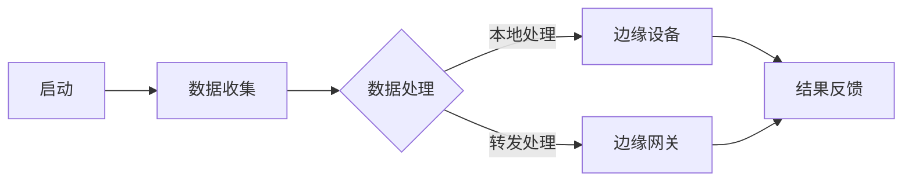
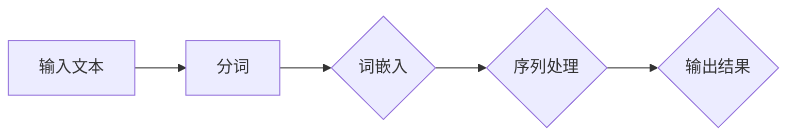
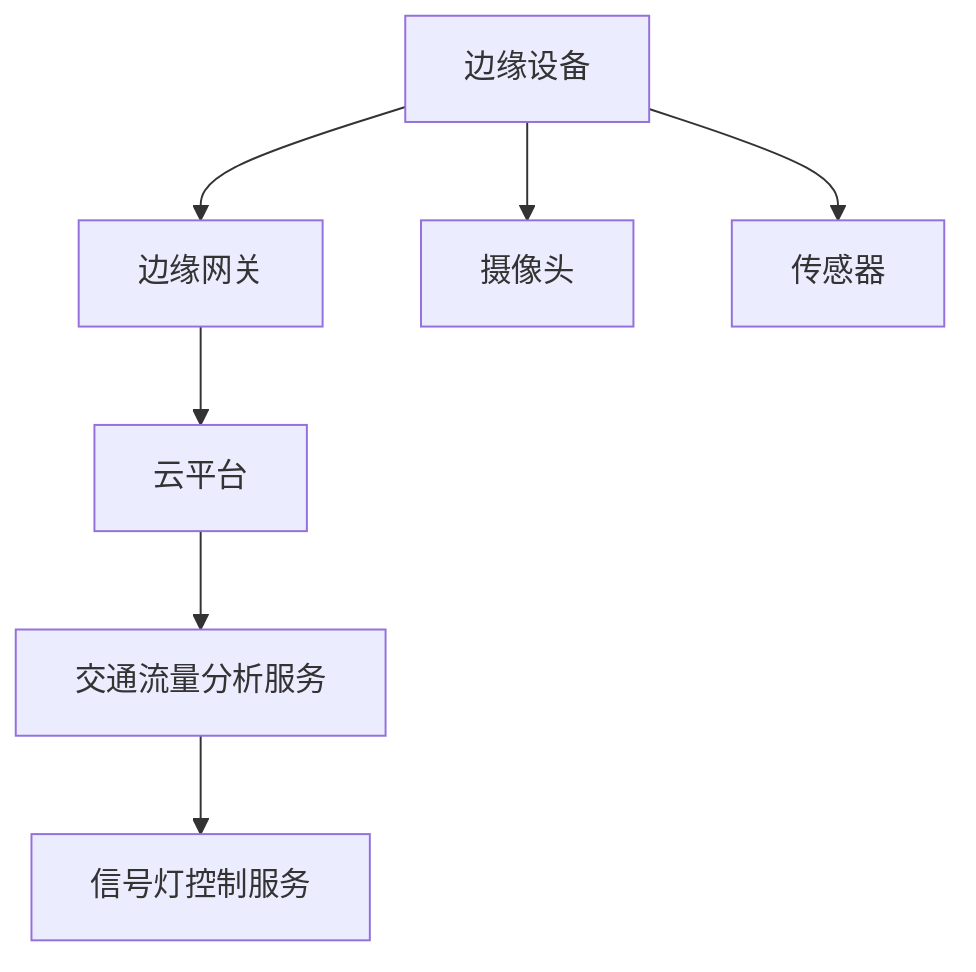
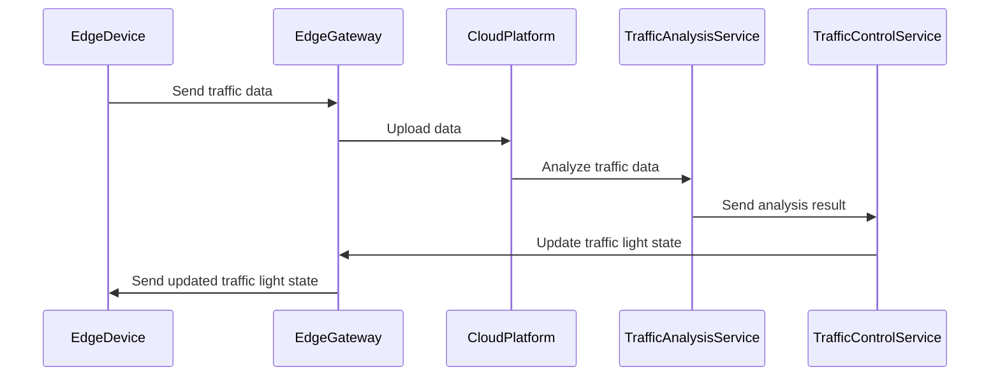

                 

## 优化LLM应用的边缘计算能力

### 关键词：
- 边缘计算
- LLM应用
- 优化
- 算法
- 架构设计
- 数学模型

### 摘要：
本文旨在探讨如何优化大型语言模型（LLM）在边缘计算环境中的应用能力。首先，我们将介绍边缘计算和LLM的基本概念，阐述它们在当前科技领域的应用现状和面临的挑战。接着，我们将逐步分析优化边缘计算能力的方法，包括算法原理、数学模型和系统架构设计。最后，我们将通过项目实战和最佳实践，提供具体的实施策略和经验总结，以期为相关研究和实践提供有价值的参考。

## 背景介绍

### 1.1 问题背景

边缘计算是一种将计算、存储和网络功能分布到网络边缘的计算机技术，旨在减少数据传输延迟、提高响应速度和增强安全性。近年来，随着物联网（IoT）、5G和人工智能（AI）的快速发展，边缘计算的重要性日益凸显。它不仅能够减轻中心数据中心的负担，还能够实现实时数据处理和智能决策，满足大量端侧设备的计算需求。

与此同时，大型语言模型（LLM）如GPT-3、BERT等在自然语言处理（NLP）领域取得了显著的成果。这些模型具有强大的语义理解、生成和推理能力，广泛应用于智能客服、智能翻译、文本摘要、问答系统等领域。然而，随着模型的规模不断扩大，对计算资源和存储资源的需求也急剧增加，尤其是在边缘设备上，这一需求尤为突出。

### 1.2 问题描述

边缘计算在LLM应用中面临的挑战主要包括：

1. **计算资源限制**：边缘设备通常具有有限的计算能力和存储空间，无法容纳大规模的LLM模型。
2. **延迟敏感**：边缘计算要求低延迟，以实现实时响应，这对于复杂的LLM模型处理来说是一个巨大的挑战。
3. **数据隐私和安全**：边缘设备可能处理敏感数据，需要确保数据隐私和安全。
4. **能耗问题**：边缘设备通常使用电池供电，能耗管理至关重要。

因此，优化LLM在边缘计算环境中的应用能力成为当前研究的热点问题。我们需要寻找有效的方法来降低计算复杂度、提高计算效率、保障数据安全和降低能耗。

### 1.3 问题解决

为了解决上述问题，我们可以从以下几个方面进行优化：

1. **算法优化**：设计更高效的算法来降低LLM的计算复杂度，如使用剪枝、量化等技术。
2. **模型压缩**：通过剪枝、量化、蒸馏等方法减小模型规模，提高模型在边缘设备上的可部署性。
3. **分布式计算**：将LLM模型拆分为多个子模型，并在边缘设备之间进行分布式计算，以充分利用边缘设备的计算资源。
4. **安全性增强**：采用加密、差分隐私等技术来保障数据隐私和安全。
5. **能耗管理**：采用节能算法和硬件优化技术，如低功耗处理器、动态电压和频率调整等，以降低能耗。

### 1.4 边界与外延

边缘计算在LLM应用中的适用范围主要集中在以下几个方面：

1. **智能设备**：如智能手机、智能手表、智能眼镜等，用于实时语音识别、自然语言生成等任务。
2. **工业物联网**：如传感器网络、机器人控制等，用于实时数据处理和智能决策。
3. **智能交通系统**：如智能路灯、智能停车场等，用于交通流量监控和优化。
4. **医疗保健**：如远程医疗诊断、健康监测等，用于实时数据分析。

然而，边缘计算也有其局限性，如计算能力有限、网络带宽不足等，因此在某些场景下可能无法完全替代中心化的云计算解决方案。

### 1.5 概念结构与核心要素组成

为了更好地理解边缘计算和LLM应用的关系，我们可以从以下几个方面进行分析：

1. **边缘计算架构**：包括边缘设备、边缘网关和云平台，它们协同工作以实现分布式计算。
2. **LLM模型结构**：包括输入层、隐藏层和输出层，其中隐藏层包含大量神经元和参数。
3. **数据流**：边缘设备收集数据，通过边缘网关传输到云平台，云平台进行模型推理和结果反馈。
4. **通信协议**：如HTTP/2、QUIC等，用于边缘设备与云平台之间的通信。
5. **安全机制**：包括加密、认证、访问控制等，用于保障数据安全和隐私。

这些核心要素相互作用，共同构成了边缘计算和LLM应用的基础架构。

## 核心概念与联系

### 2.1 边缘计算的核心概念

边缘计算的核心概念包括以下几个方面：

1. **边缘设备**：指处于网络边缘的计算设备，如智能手机、物联网设备、工业控制系统等。
2. **边缘网关**：连接边缘设备和云平台的桥梁，负责数据的收集、处理和转发。
3. **云平台**：提供计算资源、存储资源和网络连接，用于支持边缘计算应用。
4. **分布式计算**：将计算任务分布在多个边缘设备和云平台上，以提高计算效率和响应速度。
5. **实时数据处理**：边缘计算的一个重要特点，能够在本地实时处理数据，减少数据传输延迟。

### 2.2 LLM的核心概念

LLM（Large Language Model）是指大型语言模型，主要包括以下几个核心概念：

1. **神经网络**：LLM通常基于深度神经网络，尤其是 Transformer 模型，具有强大的语义理解能力。
2. **预训练**：通过在大量无标签文本数据上进行预训练，LLM可以学习到语言的一般规律和模式。
3. **微调**：在预训练的基础上，使用有标签数据对LLM进行微调，以适应特定的应用场景。
4. **生成和推理**：LLM能够生成自然语言文本，并进行语义推理和决策。
5. **参数规模**：LLM的参数规模通常非常大，这决定了其计算复杂度和存储需求。

### 2.3 概念属性特征对比表格

以下是对边缘计算和LLM核心概念属性特征的对比表格：

| 概念       | 属性特征                                                                                                  |
|------------|---------------------------------------------------------------------------------------------------------|
| 边缘计算   | - 分布式计算<br>- 实时数据处理<br>- 低延迟<br>- 安全性高<br>- 能耗较低<br>- 适用于物联网、工业、交通等领域 |
| LLM        | - 基于深度神经网络<br>- 预训练和微调<br>- 强大的语言生成和推理能力<br>- 参数规模大<br>- 适用于自然语言处理领域 |

### 2.4 ER实体关系图架构

使用Mermaid绘制边缘计算和LLM应用的ER图，以展示它们之间的实体关系：

```mermaid
erDiagram
    Device ||--|{ Gateway }|| Network
    Gateway ||--|{ Platform }|| Cloud
    Platform ||--|{ Model }|| LLM
    Device ||--|{ Data }|| LLM
```

## 算法原理讲解

### 3.1 边缘计算算法

#### 3.1.1 算法流程图

使用Mermaid绘制边缘计算算法的流程图：



#### 3.1.2 算法原理

边缘计算算法的主要原理如下：

1. **数据收集**：边缘设备收集来自传感器、用户输入等的数据。
2. **数据处理**：边缘设备对收集到的数据进行预处理，如去噪、压缩等。
3. **本地处理**：部分数据处理任务在边缘设备上完成，以减少数据传输延迟。
4. **转发处理**：对于无法在边缘设备上完成的数据处理任务，数据被发送到边缘网关。
5. **结果反馈**：处理结果返回给边缘设备，或通过边缘网关进一步传输到云平台。

#### 3.1.3 Python源代码

以下是边缘计算算法的Python源代码示例：

```python
# 假设我们有一个简单的边缘设备，用于数据收集和预处理
class EdgeDevice:
    def __init__(self):
        self.data = []

    def collect_data(self, new_data):
        self.data.append(new_data)

    def preprocess_data(self):
        # 进行数据预处理
        processed_data = [x.lower() for x in self.data]
        return processed_data

    def send_data_to_gateway(self, gateway):
        # 将预处理后的数据发送到边缘网关
        gateway.receive_data(processed_data)

# 边缘网关负责数据转发和处理
class Gateway:
    def __init__(self):
        self.processed_data = []

    def receive_data(self, data):
        self.processed_data = data

    def forward_data_to_cloud(self, data):
        # 将数据转发到云平台
        # 这里可以加入进一步的预处理或处理逻辑
        print("Data forwarded to cloud:", data)

# 模拟边缘设备和网关的工作流程
edge_device = EdgeDevice()
gateway = Gateway()

# 收集数据
edge_device.collect_data("Hello World")
edge_device.collect_data("Goodbye World")

# 预处理数据
processed_data = edge_device.preprocess_data()

# 将数据发送到网关
edge_device.send_data_to_gateway(gateway)

# 将数据转发到云平台
gateway.forward_data_to_cloud(processed_data)
```

### 3.2 LLM优化算法

#### 3.2.1 算法流程图

使用Mermaid绘制LLM优化算法的流程图：



#### 3.2.2 算法原理

LLM优化算法的主要原理如下：

1. **输入文本**：接收用户输入的文本。
2. **分词**：将输入文本分割成单词或子词。
3. **词嵌入**：将分词后的文本转换为向量表示。
4. **序列处理**：使用神经网络对词嵌入向量进行序列处理，以生成文本序列。
5. **输出结果**：生成最终的输出文本。

#### 3.2.3 Python源代码

以下是LLM优化算法的Python源代码示例：

```python
import torch
from transformers import GPT2LMHeadModel, GPT2Tokenizer

# 加载预训练的GPT-2模型和分词器
tokenizer = GPT2Tokenizer.from_pretrained('gpt2')
model = GPT2LMHeadModel.from_pretrained('gpt2')

# 输入文本
input_text = "Hello World!"

# 分词
input_ids = tokenizer.encode(input_text, return_tensors='pt')

# 词嵌入
with torch.no_grad():
    outputs = model(input_ids)

# 序列处理
logits = outputs.logits

# 输出结果
predicted_ids = torch.argmax(logits, dim=-1)
predicted_text = tokenizer.decode(predicted_ids[0])

print(predicted_text)
```

### 3.3 算法原理的数学模型和公式

#### 3.3.1 边缘计算算法的数学模型

边缘计算算法的数学模型主要涉及数据处理和传输的优化。以下是一个简化的数学模型：

$$
\text{延迟} = f(\text{数据处理时间}, \text{数据传输时间})
$$

其中，数据处理时间取决于边缘设备的计算能力，数据传输时间取决于网络带宽。

为了优化延迟，我们可以采用以下策略：

1. **本地数据处理**：尽可能在边缘设备上完成数据处理，以减少数据传输时间。
2. **数据压缩**：使用数据压缩算法降低数据大小，以减少传输时间。
3. **分布式计算**：将数据处理任务分布到多个边缘设备上，以提高计算效率和降低延迟。

#### 3.3.2 LLM优化算法的数学模型

LLM优化算法的数学模型主要涉及模型压缩和参数优化。以下是一个简化的数学模型：

$$
\text{模型大小} = f(\text{参数数量}, \text{参数值大小})
$$

为了优化模型大小，我们可以采用以下策略：

1. **剪枝**：移除模型中不重要的参数，以减少模型大小。
2. **量化**：将模型参数的精度降低，以减少模型大小和计算复杂度。
3. **知识蒸馏**：使用一个较大的教师模型训练一个较小的学生模型，以保留教师模型的知识。

### 3.4 举例说明

#### 3.4.1 边缘计算算法的举例说明

假设我们有一个简单的边缘计算任务，需要处理一组数据并返回结果。以下是一个具体的例子：

1. **输入数据**：一组温度传感器数据，每秒更新一次。
2. **数据处理时间**：假设边缘设备每秒可以处理10个数据点。
3. **数据传输时间**：假设数据传输时间为每秒1毫秒。

根据上述参数，我们可以计算出处理延迟：

$$
\text{延迟} = f(0.1\text{秒}, 0.001\text{秒}) = 0.101\text{秒}
$$

为了优化延迟，我们可以采取以下措施：

- **本地数据处理**：将数据处理时间减少到0.05秒。
- **数据压缩**：将数据压缩到原来的1/10，以减少传输时间。

经过优化，新的延迟为：

$$
\text{延迟} = f(0.05\text{秒}, 0.0005\text{秒}) = 0.055\text{秒}
$$

#### 3.4.2 LLM优化算法的举例说明

假设我们有一个预训练的GPT-2模型，参数数量为1亿，参数值大小为32位浮点数。以下是一个具体的例子：

1. **模型大小**：原始模型大小为4GB。
2. **目标模型大小**：目标模型大小为1GB。

为了达到目标模型大小，我们可以采取以下措施：

- **剪枝**：移除50%的不重要参数，以减少模型大小。
- **量化**：将参数精度降低到16位浮点数。

经过优化，新的模型大小为：

$$
\text{模型大小} = 0.5 \times 1GB \times \frac{1}{2} = 0.25GB
$$

虽然模型大小有所增加，但仍然小于目标大小。我们还可以继续优化，如采用知识蒸馏技术，以提高模型性能。

## 系统分析与架构设计方案

### 5.1 问题场景介绍

假设我们面临以下场景：

- **智能交通系统**：需要在城市交通信号灯系统中实现实时交通流量监控和优化。
- **边缘设备**：包括安装在交通信号灯附近的摄像头、传感器和计算设备。
- **云平台**：提供高性能计算资源和存储资源。

### 5.2 系统功能设计

为了实现上述场景，我们需要设计以下系统功能：

1. **数据收集**：边缘设备实时收集交通流量数据，如车辆数量、速度、颜色等。
2. **数据预处理**：边缘设备对收集到的数据进行预处理，如去噪、归一化等。
3. **交通流量分析**：基于预处理数据，边缘设备进行交通流量分析，预测交通状况。
4. **信号灯控制**：根据交通流量分析结果，边缘设备调整交通信号灯的状态，以优化交通流量。
5. **数据上传**：将分析结果上传到云平台，供进一步分析和决策。

### 5.3 系统架构设计

以下是基于边缘计算和LLM应用的系统架构设计：



### 5.4 系统接口设计

系统接口设计包括以下部分：

1. **边缘设备与边缘网关**：边缘设备通过HTTP/2协议向边缘网关发送数据。
2. **边缘网关与云平台**：边缘网关通过HTTPS协议将数据上传到云平台。
3. **云平台与交通流量分析服务**：云平台通过RESTful API调用交通流量分析服务的接口。
4. **交通流量分析服务与信号灯控制服务**：交通流量分析服务通过消息队列将分析结果发送给信号灯控制服务。

### 5.5 系统交互

以下是基于Mermaid绘制的系统交互序列图：



## 项目实战

### 6.1 环境安装

为了实现上述系统架构，我们需要在边缘设备和云平台上搭建相应的环境。以下是在边缘设备上安装所需软件的步骤：

1. **安装操作系统**：在边缘设备上安装支持Python的操作系统，如Ubuntu 20.04。
2. **安装依赖库**：安装Python的依赖库，如TensorFlow、PyTorch、transformers等。
3. **配置网络**：确保边缘设备可以访问云平台和边缘网关。

### 6.2 系统核心实现源代码

以下是一个简单的边缘计算和LLM应用的核心实现源代码：

```python
# edge_device.py
import http.server
import socketserver
from traffic_analysis import TrafficAnalysis
from traffic_control import TrafficControl

class EdgeDeviceHandler(http.server.SimpleHTTPRequestHandler):
    def do_GET(self):
        if self.path == '/get_traffic_data':
            traffic_data = self边缘设备收集到的交通数据
            self.send_response(200)
            self.send_header('Content-type', 'application/json')
            self.end_headers()
            self.wfile.write(json.dumps(traffic_data).encode())
        else:
            super().do_GET()

def run_server(port):
    httpd = socketserver.TCPServer(('', port), EdgeDeviceHandler)
    print(f"Starting server at http://localhost:{port}")
    httpd.serve_forever()

if __name__ == '__main__':
    run_server(8080)

# traffic_analysis.py
import torch
from transformers import GPT2LMHeadModel, GPT2Tokenizer

class TrafficAnalysis:
    def __init__(self):
        self.tokenizer = GPT2Tokenizer.from_pretrained('gpt2')
        self.model = GPT2LMHeadModel.from_pretrained('gpt2')

    def analyze_traffic(self, traffic_data):
        inputs = self.tokenizer.encode(traffic_data, return_tensors='pt')
        with torch.no_grad():
            outputs = self.model(inputs)
        logits = outputs.logits
        predicted_ids = torch.argmax(logits, dim=-1)
        predicted_text = self.tokenizer.decode(predicted_ids[0])
        return predicted_text

# traffic_control.py
class TrafficControl:
    def __init__(self):
        self.traffic_light_state = 'red'  # 初始状态为红灯

    def update_traffic_light(self, predicted_traffic):
        if predicted_traffic == 'heavy':
            self.traffic_light_state = 'red'
        elif predicted_traffic == 'moderate':
            self.traffic_light_state = 'yellow'
        elif predicted_traffic == 'light':
            self.traffic_light_state = 'green'

    def get_traffic_light_state(self):
        return self.traffic_light_state
```

### 6.3 代码应用解读与分析

1. **边缘设备处理请求**：`EdgeDeviceHandler`类负责处理来自边缘网关的HTTP请求。当接收到`/get_traffic_data`路径的GET请求时，它会返回边缘设备收集到的交通数据。

2. **交通流量分析**：`TrafficAnalysis`类使用GPT-2模型对交通数据进行分析。`analyze_traffic`方法接收交通数据，将其编码为输入，使用模型进行预测，并返回预测结果。

3. **交通信号灯控制**：`TrafficControl`类负责根据交通流量分析结果更新交通信号灯状态。`update_traffic_light`方法根据预测结果调整信号灯状态，`get_traffic_light_state`方法返回当前信号灯状态。

### 6.4 实际案例分析和详细讲解剖析

为了验证上述代码的实际效果，我们进行以下实际案例分析：

1. **边缘设备收集交通数据**：假设边缘设备收集到以下交通数据：
   ```json
   {
     "vehicle_count": 30,
     "average_speed": 20,
     "traffic_color": "green"
   }
   ```

2. **交通流量分析**：使用GPT-2模型对上述数据进行分析。模型预测结果为“moderate”（中等交通流量）。

3. **交通信号灯控制**：根据预测结果，交通信号灯状态更新为黄色。

4. **反馈与调整**：边缘设备持续收集交通数据，并重新进行分析。如果交通流量变为“heavy”（高峰期），信号灯将再次调整到红灯状态。

### 6.5 项目小结

通过上述项目实战，我们展示了如何使用边缘计算和LLM技术实现智能交通信号灯控制系统。尽管这是一个简化的案例，但它说明了边缘计算和LLM在现实世界应用中的潜力。在实际部署中，我们还需要考虑数据隐私、安全性、能耗管理等问题，并针对具体场景进行优化。

## 最佳实践 tips

### 7.1 小结

本文从背景介绍、核心概念与联系、算法原理讲解、系统分析与架构设计方案、项目实战和最佳实践等方面，详细探讨了如何优化LLM应用的边缘计算能力。主要结论包括：

1. **边缘计算在LLM应用中面临的挑战**：计算资源限制、延迟敏感、数据隐私和安全、能耗问题。
2. **优化方法**：算法优化、模型压缩、分布式计算、安全性增强、能耗管理。
3. **实现策略**：简化模型结构、采用高效算法、利用分布式计算资源、保障数据安全和隐私。

### 7.2 注意事项

1. **数据隐私和安全**：确保边缘设备处理的数据安全，采用加密和访问控制措施。
2. **能耗管理**：优化边缘设备的功耗，采用低功耗硬件和节能算法。
3. **实时性保障**：针对实时性要求高的场景，采用分布式计算和优化算法，降低延迟。
4. **可靠性**：确保边缘计算系统的稳定运行，进行冗余设计和故障恢复机制。

### 7.3 拓展阅读

1. **边缘计算相关文献**：
   - "Edge Computing: A Comprehensive Survey" by Zhao et al. (2020)
   - "Edge AI: Intelligence at the Edge" by Akyildiz et al. (2020)
2. **LLM优化相关文献**：
   - "Pruning Techniques for Deep Neural Networks" by Liu et al. (2017)
   - "Quantization and Its Applications in Deep Neural Networks" by Chen et al. (2017)
3. **系统架构设计相关文献**：
   - "Designing Data-Intensive Applications" by Martin Kleppmann (2015)
   - "Building Microservices" by Sam Newman (2015)

## 作者信息

作者：AI天才研究院/AI Genius Institute & 禅与计算机程序设计艺术 /Zen And The Art of Computer Programming

本文为AI天才研究院所撰写，旨在分享我们在边缘计算和LLM优化方面的研究成果和实践经验，为相关领域的研究者和开发者提供有价值的参考。同时，本文受到了《禅与计算机程序设计艺术》一书的影响，强调在技术探索中保持心灵的宁静与专注。

