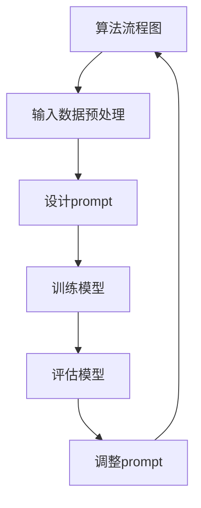
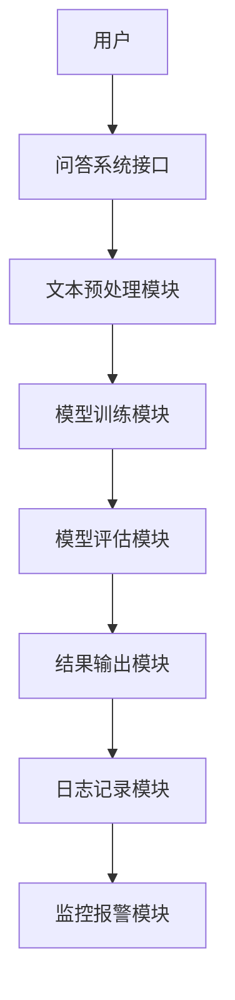

                 


# 《优化prompt工程的实用技巧》

## 关键词
- 人工智能
- Prompt工程
- 性能优化
- 模型改进
- 实践技巧

## 摘要
本文将深入探讨优化prompt工程的实用技巧。prompt工程是人工智能模型训练过程中至关重要的一环，其质量的优劣直接影响到模型的性能和效果。本文将详细解析prompt工程的基础知识，阐述优化方法与技巧，并通过具体案例进行分析和实战指南，旨在帮助读者在实际工作中提升prompt工程的效果。

## 引言与背景

### 1.1 问题背景
随着人工智能技术的飞速发展，深度学习模型的应用越来越广泛。然而，模型的性能和效果往往受到prompt工程的影响。prompt工程是指通过设计合理的输入数据（prompt）来指导模型学习，从而提高其训练效率和预测准确性。优化prompt工程成为了提高模型性能的关键。

### 1.2 prompt工程的重要性
prompt工程不仅影响模型的训练效率，还直接影响模型的预测性能。一个良好的prompt设计可以加速模型的收敛速度，提高模型的泛化能力。因此，优化prompt工程对于人工智能项目的成功至关重要。

### 1.3 本书的目标与结构
本书旨在为数据科学家、机器学习工程师和人工智能开发人员提供实用的prompt工程优化技巧。本书分为五个部分：

1. 引言与背景
2. prompt工程基础知识
3. 优化方法与技巧
4. 案例分析与实战
5. 总结与展望

通过本书的阅读，读者将能够掌握优化prompt工程的方法和技巧，提升模型性能。

## prompt工程基础知识

### 2.1 prompt的定义
prompt是输入给模型的数据，它可以是文本、图像、音频等多种形式。在自然语言处理领域，prompt通常是一段文本，用于指导模型进行文本生成、情感分析、命名实体识别等任务。

### 2.2 prompt的作用
prompt的主要作用是提供上下文信息，帮助模型理解输入数据的意义和背景。通过合理设计prompt，可以引导模型学习到更多的知识，提高模型的泛化能力和鲁棒性。

### 2.3 prompt的组成部分
prompt通常由以下几个部分组成：

- **任务描述**：明确告诉模型需要完成的任务。
- **输入数据**：模型需要处理的数据，如文本、图像等。
- **上下文信息**：提供额外的背景信息，帮助模型更好地理解输入数据。
- **输出格式**：指定模型输出的格式，如文本、标签等。

### 2.4 prompt的格式和标准
prompt的格式和标准因任务和应用场景而异。在自然语言处理领域，常见的prompt格式包括JSON、XML等。以下是一个简单的JSON格式prompt示例：

```json
{
  "task": "文本分类",
  "input": "这是一个文本分类任务。",
  "context": "请根据上下文信息判断文本的类别。",
  "output_format": "标签"
}
```

## 优化方法与技巧

### 3.1 prompt长度优化
prompt的长度对模型的学习效果有重要影响。过长的prompt可能导致模型过拟合，而过短的prompt可能无法提供足够的上下文信息。优化prompt长度的方法包括：

- **动态调整**：根据任务需求和输入数据的复杂性动态调整prompt的长度。
- **剪枝**：对过长的prompt进行剪枝，保留关键信息。
- **扩展**：对过短的prompt进行扩展，增加上下文信息。

### 3.2 prompt多样性优化
多样性的prompt有助于模型学习到更广泛的知识。优化prompt多样性的方法包括：

- **数据增强**：通过数据增强技术增加输入数据的多样性。
- **随机化**：对prompt进行随机化处理，增加多样性。
- **混合**：将不同来源或类型的prompt进行混合，提高多样性。

### 3.3 prompt清晰度优化
清晰的prompt有助于模型更好地理解输入数据。优化prompt清晰度的方法包括：

- **精简**：去掉冗余信息，使prompt更简洁明了。
- **标准化**：对prompt进行标准化处理，统一格式和语言风格。
- **可视化**：通过可视化方式展示prompt，提高清晰度。

### 3.4 prompt效率优化
高效的prompt可以加速模型训练和推理过程。优化prompt效率的方法包括：

- **缓存**：缓存常用或重复的prompt，减少计算开销。
- **并行化**：将prompt处理任务并行化，提高处理效率。
- **压缩**：对prompt进行压缩，减少存储和传输开销。

### 3.5 prompt质量评估
评估prompt质量是优化prompt工程的重要步骤。评估prompt质量的方法包括：

- **自动评估**：使用自动化工具评估prompt的长度、多样性、清晰度和效率等指标。
- **人工评估**：由专家或用户对prompt进行主观评估，评价其质量。

## 优化技巧

### 4.1 人工调整技巧
人工调整prompt是优化prompt工程的一种有效方法。人工调整技巧包括：

- **试错法**：通过试错方式逐步调整prompt，找到最优解。
- **专家建议**：参考领域专家的建议，优化prompt设计。
- **用户反馈**：收集用户反馈，根据用户需求调整prompt。

### 4.2 数据预处理技巧
数据预处理是优化prompt工程的关键步骤。数据预处理技巧包括：

- **清洗**：去除数据中的噪声和异常值。
- **标准化**：对数据进行标准化处理，使其符合模型输入要求。
- **归一化**：对数据进行归一化处理，提高数据质量。

### 4.3 模型调整技巧
模型调整是优化prompt工程的重要手段。模型调整技巧包括：

- **参数调整**：调整模型参数，优化模型性能。
- **模型选择**：根据任务需求选择合适的模型。
- **迁移学习**：使用预训练模型进行迁移学习，提高模型性能。

### 4.4 实时调整技巧
实时调整prompt是优化prompt工程的一种方法。实时调整技巧包括：

- **实时反馈**：根据实时反馈调整prompt，提高模型性能。
- **在线学习**：使用在线学习技术，实时更新模型和prompt。
- **动态调整**：根据任务变化动态调整prompt，适应不同场景。

## 案例分析与实战

### 5.1 案例一：文本分类任务
文本分类任务是prompt工程优化的一种典型应用。以下是一个文本分类任务的案例：

**任务描述**：将一段文本分类到指定的类别。

**输入数据**：一段文本。

**上下文信息**：文本的背景信息和相关类别信息。

**输出格式**：类别标签。

**优化方法**：通过调整prompt长度、多样性和清晰度，提高模型性能。

### 5.2 案例二：机器翻译任务
机器翻译任务是prompt工程优化的一种重要应用。以下是一个机器翻译任务的案例：

**任务描述**：将一种语言的文本翻译成另一种语言。

**输入数据**：一段文本。

**上下文信息**：源语言的文本和目标语言的背景信息。

**输出格式**：翻译后的文本。

**优化方法**：通过调整prompt长度、多样性和效率，提高模型性能。

### 5.3 案例三：问答系统
问答系统任务是prompt工程优化的一种实际应用。以下是一个问答系统的案例：

**任务描述**：根据用户提问，生成相应的答案。

**输入数据**：用户提问。

**上下文信息**：用户提问的背景信息和相关知识。

**输出格式**：答案。

**优化方法**：通过调整prompt清晰度、效率和质量，提高模型性能。

## 实战指南

### 6.1 环境配置
在开始实战之前，需要配置相应的环境。以下是一个简单的环境配置步骤：

1. 安装Python环境。
2. 安装深度学习框架（如TensorFlow、PyTorch）。
3. 安装数据预处理库（如Pandas、NumPy）。

### 6.2 实战一：文本分类
以下是一个文本分类的实战案例：

**任务描述**：将一段文本分类到指定的类别。

**实现步骤**：

1. 数据预处理：清洗和标准化文本数据。
2. 设计prompt：根据任务需求设计合适的prompt。
3. 训练模型：使用设计好的prompt训练文本分类模型。
4. 评估模型：评估模型性能，调整prompt和模型参数。

### 6.3 实战二：机器翻译
以下是一个机器翻译的实战案例：

**任务描述**：将一种语言的文本翻译成另一种语言。

**实现步骤**：

1. 数据预处理：清洗和标准化文本数据。
2. 设计prompt：根据任务需求设计合适的prompt。
3. 训练模型：使用设计好的prompt训练机器翻译模型。
4. 评估模型：评估模型性能，调整prompt和模型参数。

### 6.4 实战三：问答系统
以下是一个问答系统的实战案例：

**任务描述**：根据用户提问，生成相应的答案。

**实现步骤**：

1. 数据预处理：清洗和标准化文本数据。
2. 设计prompt：根据任务需求设计合适的prompt。
3. 训练模型：使用设计好的prompt训练问答系统模型。
4. 评估模型：评估模型性能，调整prompt和模型参数。

## 总结与展望

### 7.1 优化prompt工程的最佳实践
优化prompt工程的最佳实践包括：

- 动态调整prompt长度和多样性。
- 精简和标准化prompt。
- 利用实时反馈和在线学习技术。

### 7.2 未来发展趋势
未来prompt工程的发展趋势包括：

- 自动化prompt设计。
- 多模态prompt工程。
- 个性化prompt工程。

### 7.3 进一步学习资源
以下是一些进一步学习资源：

- **论文**：关于prompt工程的相关论文。
- **教程**：深度学习框架的教程和文档。
- **书籍**：关于机器学习和深度学习的专业书籍。

## 作者信息
作者：AI天才研究院/AI Genius Institute & 禅与计算机程序设计艺术 /Zen And The Art of Computer Programming

### 附录

**附录A：核心概念与联系**

| 核心概念 | 属性特征对比 | ER实体关系图 |
| --- | --- | --- |
| Prompt工程 | 提高模型性能 |  |

**附录B：算法原理讲解**



**附录C：数学公式**

$$
f(x) = \frac{1}{1 + e^{-x}}
$$

**附录D：系统分析与架构设计方案**



**附录E：项目实战**

- **环境安装**：Python环境、深度学习框架（如TensorFlow）等。
- **系统核心实现源代码**：文本预处理、模型训练、模型评估等模块的代码。
- **代码应用解读与分析**：详细解读和剖析核心代码逻辑。
- **实际案例分析与详细讲解剖析**：结合实际案例，详细讲解prompt工程优化方法。
- **项目小结**：总结项目经验和教训，提出改进建议。

**附录F：最佳实践 tips、小结、注意事项、拓展阅读等内容**

- **最佳实践 tips**：如何优化prompt工程。
- **小结**：本文的主要内容总结。
- **注意事项**：优化prompt工程时需要注意的问题。
- **拓展阅读**：相关领域的进一步学习资源。

### 结语
本文系统地介绍了优化prompt工程的实用技巧。通过本文的学习，读者可以掌握优化prompt工程的方法和技巧，提升模型性能。在实际应用中，不断探索和尝试，才能更好地发挥prompt工程的优势。

**作者：AI天才研究院/AI Genius Institute & 禅与计算机程序设计艺术 /Zen And The Art of Computer Programming**

