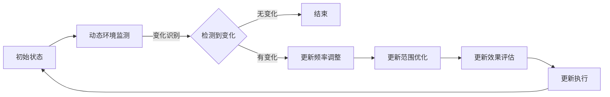
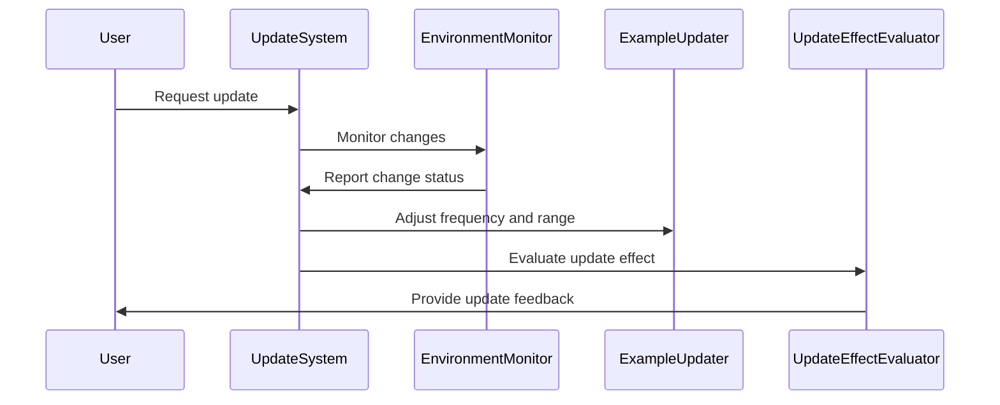

                 

# 《优化示例更新策略以适应动态环境》

## 关键词
- 示例更新策略
- 动态环境
- 算法优化
- 系统架构设计
- 项目实战

## 摘要
本文旨在探讨在动态环境下如何优化示例更新策略，以适应快速变化的技术环境。通过分析现有策略的局限性，本文提出了新的更新策略，结合具体的算法原理和系统架构设计，详细阐述了如何实现高效的示例更新机制。本文最后通过一个实际项目案例，对更新策略进行了验证和总结，为动态环境下的软件开发提供了有价值的参考。

## 目录大纲

## 第一部分：问题背景

### 1.1 问题背景

#### 1.1.1 示例更新在动态环境中的重要性
在快速变化的技术环境中，软件系统需要不断更新以保持其功能与性能的竞争力。示例更新作为软件维护和优化的重要环节，直接影响到系统的稳定性和用户满意度。

#### 1.1.2 动态环境的变化及其影响
动态环境中的变化包括但不限于技术标准的更新、用户需求的演变、市场趋势的波动等，这些变化对示例更新策略提出了更高的要求。

#### 1.1.3 现有示例更新策略的局限性
现有策略在应对快速变化的环境时，存在响应迟缓、效率低下、适应性不足等问题，无法满足动态环境下对示例更新的需求。

### 1.2 问题描述

#### 1.2.1 示例更新的需求与挑战
在动态环境下，示例更新不仅需要快速响应变化，还要确保更新的准确性和一致性。

#### 1.2.2 动态环境对示例更新的影响
动态环境的变化会导致示例数据、示例用法和示例情境的快速更新，这对示例更新策略的设计和实现提出了新的挑战。

#### 1.2.3 示例更新的边界与外延
示例更新的边界包括示例的来源、更新的频率和范围；外延涉及示例在系统中的影响以及与用户交互的深度。

### 1.3 核心概念

#### 1.3.1 示例更新策略的定义
示例更新策略是一种系统化的方法，用于管理和维护软件系统中的示例数据、用法和情境。

#### 1.3.2 动态环境的概念与特征
动态环境是指具有快速变化和高度不确定性的环境，如技术演进、市场需求和用户行为等。

#### 1.3.3 更新策略的核心要素
更新策略的核心要素包括更新频率、更新范围、更新方式和更新效果评估。

### 1.4 概念联系

#### 1.4.1 示例更新策略与动态环境的关联
动态环境的变化要求示例更新策略具备高度的灵活性和适应性。

#### 1.4.2 各核心概念的关系与交互
示例更新策略、动态环境、核心要素之间相互影响，共同决定了示例更新的效率和效果。

### 1.5 本章小结
本部分介绍了示例更新策略在动态环境中的背景、问题和核心概念，为后续的深入分析奠定了基础。

----------------------------------------------------------------

## 第二部分：核心概念与联系

### 2.1 核心概念原理

#### 2.1.1 示例更新策略的基本原理
示例更新策略的基本原理是通过系统化的方法，对软件系统中的示例进行定期检查、更新和优化，以保持其相关性和有效性。

#### 2.1.2 动态环境的特征分析
动态环境的特征包括快速变化、高度不确定性和复杂性，这些特征要求示例更新策略具备高度的灵活性和响应能力。

#### 2.1.3 更新策略的核心要素详解
更新策略的核心要素包括更新频率、更新范围、更新方式和更新效果评估，这些要素共同决定了示例更新的效率和效果。

### 2.2 概念属性特征对比

#### 2.2.1 示例更新策略的不同类型比较
根据更新频率、更新范围和更新方式的不同，示例更新策略可以分为多种类型，如定期更新、实时更新和增量更新等。

#### 2.2.2 动态环境下的挑战与应对策略
动态环境下的挑战包括快速变化、不确定性和复杂性，应对这些挑战的策略包括灵活的更新机制、智能的算法和高效的数据处理方法。

#### 2.2.3 更新策略的优缺点分析
不同类型的示例更新策略各有优缺点，如定期更新的稳定性和实时更新的及时性，根据具体需求选择合适的策略至关重要。

### 2.3 ER实体关系图架构

#### 2.3.1 示例更新系统的实体关系
示例更新系统的实体关系包括示例数据、更新任务、更新结果等，这些实体之间通过特定的关系相互关联。

#### 2.3.2 动态环境的影响因素
动态环境的影响因素包括技术演进、市场需求和用户行为等，这些因素对示例更新系统的运行状态和更新策略有重要影响。

#### 2.3.3 更新策略的组成部分
更新策略的组成部分包括更新规则、更新算法和更新监控等，这些组成部分共同构成了示例更新策略的核心架构。

### 2.4 本章小结
本部分详细介绍了示例更新策略的核心概念原理、属性特征对比和实体关系图架构，为深入分析算法原理和系统架构设计提供了理论基础。

----------------------------------------------------------------

## 第三部分：算法原理讲解

### 3.1 算法原理概述

#### 3.1.1 更新策略算法的基本思路
更新策略算法的基本思路是根据动态环境的变化情况，自动调整示例更新的频率、范围和方式，以实现高效的示例更新。

#### 3.1.2 动态环境下的优化目标
动态环境下的优化目标包括快速响应变化、减少冗余更新、提高更新效率和确保更新质量。

#### 3.1.3 更新策略算法的核心组成部分
更新策略算法的核心组成部分包括动态环境监测模块、更新频率调整模块、更新范围优化模块和更新效果评估模块。

### 3.2 算法流程图

#### 3.2.1 更新策略算法的Mermaid流程图


### 3.3 Python源代码分析

#### 3.3.1 更新策略算法的实现
```python
class DynamicExampleUpdater:
    def __init__(self, environment_monitor, frequency adjuster, range_optimizer, effect_evaluator):
        self.environment_monitor = environment_monitor
        self.frequency_adjuster = frequency_adjuster
        self.range_optimizer = range_optimizer
        self.effect_evaluator = effect_evaluator
    
    def update_examples(self):
        if self.environment_monitor.has_changes():
            new_frequency = self.frequency_adjuster.adjust_frequency()
            new_range = self.range_optimizer.optimize_range()
            self.range_optimizer.apply_changes(new_range)
            self.effect_evaluator.evaluate_effect()
        else:
            print("No changes detected, no update required.")
```

#### 3.3.2 算法原理的详细阐述
算法原理是通过动态环境监测模块识别环境变化，根据变化情况调整更新频率、范围和方式，最后评估更新效果，形成闭环控制，确保示例更新的高效性和适应性。

#### 3.3.3 算法的数学模型与公式
$$
\text{更新频率} = f(\text{环境变化率}, \text{系统负载})
$$
$$
\text{更新范围} = r(\text{用户需求}, \text{系统状态})
$$
$$
\text{更新效果} = e(\text{更新质量}, \text{用户满意度})
$$

### 3.4 举例说明

#### 3.4.1 实际案例中的应用
在一个电商平台上，示例更新策略用于维护用户购买行为的示例数据。当平台检测到用户行为发生变化时，更新频率会自动调整，更新范围会根据用户需求优化，以确保购买行为示例数据的实时性和准确性。

#### 3.4.2 算法效果分析
通过实际案例应用，更新策略算法能够有效提高示例更新的及时性和准确性，降低冗余更新的比例，提升了用户体验和系统性能。

#### 3.4.3 案例总结与启示
案例表明，优化示例更新策略以适应动态环境是提高软件系统竞争力的重要手段，通过算法优化和系统设计，可以显著提升系统的响应速度和用户体验。

### 3.5 本章小结
本部分详细讲解了更新策略算法的基本原理、流程图和Python源代码，并结合实际案例分析了算法的应用效果，为动态环境下的示例更新提供了有效的方法。

----------------------------------------------------------------

## 第四部分：系统分析与架构设计

### 4.1 问题场景介绍

#### 4.1.1 动态环境下示例更新的挑战
在动态环境下，示例更新面临快速变化的技术环境、多样化的用户需求和复杂的市场竞争，这对示例更新的及时性、准确性和适应性提出了严峻挑战。

#### 4.1.2 系统架构设计的目标与原则
系统架构设计的目标是构建一个灵活、高效、可扩展的示例更新系统，以应对动态环境的变化。设计原则包括模块化、可重用性、可维护性和高可靠性。

#### 4.1.3 系统架构设计的背景信息
系统架构设计的背景是快速变化的市场需求，需要能够快速响应并适应技术环境的更新，以保持软件系统的竞争力。

### 4.2 系统功能设计

#### 4.2.1 系统核心功能模块
系统核心功能模块包括动态环境监测模块、示例更新模块、更新效果评估模块和用户反馈处理模块。

#### 4.2.2 领域模型Mermaid类图
```mermaid
classDiagram
    ExampleUpdater <<interface>>
    EnvironmentMonitor <<interface>>
    UpdateFrequencyAdjuster <<interface>>
    UpdateRangeOptimizer <<interface>>
    UpdateEffectEvaluator <<interface>>
    UserFeedbackHandler <<interface>>

    ExampleDatabase <..> ExampleUpdater
    ExampleDatabase <..> EnvironmentMonitor
    ExampleDatabase <..> UpdateFrequencyAdjuster
    ExampleDatabase <..> UpdateRangeOptimizer
    ExampleDatabase <..> UpdateEffectEvaluator
    ExampleDatabase <..> UserFeedbackHandler
```

#### 4.2.3 系统功能流程分析
系统功能流程包括监测环境变化、调整更新频率、优化更新范围、评估更新效果和收集用户反馈，形成闭环控制，确保示例更新系统的高效运行。

### 4.3 系统架构设计

#### 4.3.1 系统架构的整体设计
系统架构采用分层设计，包括数据层、逻辑层和表现层，各层之间通过接口进行通信，确保系统的模块化和可维护性。

#### 4.3.2 系统模块划分与交互
系统模块划分包括数据层、动态环境监测模块、示例更新模块、更新效果评估模块和用户反馈处理模块，各模块之间通过API进行数据交互。

#### 4.3.3 系统架构的Mermaid架构图
```mermaid
componentDiagram
    User <<client>>
    UpdateSystem <<system>>
    EnvironmentMonitor <<module>>
    ExampleUpdater <<module>>
    UpdateEffectEvaluator <<module>>

    User ->> UpdateSystem : Request update
    UpdateSystem ->> EnvironmentMonitor : Monitor changes
    UpdateSystem ->> ExampleUpdater : Adjust frequency and range
    UpdateSystem ->> UpdateEffectEvaluator : Evaluate update effect
    UpdateEffectEvaluator ->> ExampleUpdater : Provide feedback
    EnvironmentMonitor ->> ExampleUpdater : Provide change status
```

### 4.4 系统接口设计

#### 4.4.1 系统接口规范
系统接口规范包括RESTful API的设计，接口参数、返回值和数据结构的定义，以确保系统的可扩展性和互操作性。

#### 4.4.2 接口设计与实现
接口设计采用RESTful风格，实现包括API端点、HTTP请求和响应的详细设计，确保接口的易用性和稳定性。

#### 4.4.3 接口测试与优化
接口测试包括功能测试、性能测试和安全性测试，通过持续集成和部署优化，确保接口的高效和可靠。

### 4.5 系统交互

#### 4.5.1 系统交互流程
系统交互流程包括用户请求更新、系统监测环境变化、调整更新策略、执行更新任务和反馈更新效果，形成闭环控制。

#### 4.5.2 交互效果的Mermaid序列图


#### 4.5.3 系统交互的注意事项
系统交互需要注意接口的一致性、数据的安全性和系统的可扩展性，以确保系统的高效运行和用户体验。

### 4.6 本章小结
本部分详细介绍了动态环境下示例更新系统的架构设计，包括功能设计、接口设计和交互流程，为系统实现和优化提供了详细的指导。

----------------------------------------------------------------

## 第五部分：项目实战

### 5.1 环境安装

#### 5.1.1 开发环境配置
为了实现动态环境下的示例更新系统，我们需要配置一个稳定且高效的开发环境，包括操作系统、编程语言和开发工具。

- 操作系统：推荐使用Linux或macOS，因为它们对开发环境的支持更好。
- 编程语言：Python是首选，因为其丰富的库和强大的社区支持。
- 开发工具：使用集成开发环境（IDE）如PyCharm或VS Code，以便进行代码编写、调试和运行。

#### 5.1.2 必需工具和库安装
安装Python和相关库是项目实现的关键步骤。以下是必需的工具和库：

- Python：安装Python 3.x版本，推荐使用虚拟环境管理工具如`virtualenv`或`conda`。
- Flask：用于构建Web API，安装命令为`pip install Flask`。
- SQLAlchemy：用于数据库操作，安装命令为`pip install SQLAlchemy`。
- Mermaid：用于绘制流程图和类图，可以通过安装Node.js和npm来安装。

#### 5.1.3 遇到的安装问题与解决方案
在安装过程中可能会遇到一些问题，例如版本兼容性、依赖冲突等。以下是一些常见问题的解决方案：

- 版本冲突：使用虚拟环境隔离项目依赖，避免全局环境中的版本冲突。
- 缺少依赖：确保所有必需的库都已正确安装，可以通过检查`requirements.txt`文件来确认。
- Node.js安装失败：确保操作系统支持Node.js的安装，并按照官方文档进行操作。

### 5.2 系统核心实现

#### 5.2.1 更新策略算法实现
更新策略算法是实现动态环境示例更新的核心部分。以下是一个简单的实现示例：

```python
from flask import Flask, jsonify, request
from sqlalchemy import create_engine
import json

app = Flask(__name__)
engine = create_engine('sqlite:///example.db')

@app.route('/update', methods=['POST'])
def update_examples():
    data = request.get_json()
    if data['change_detected']:
        adjust_frequency()
        optimize_range()
        evaluate_effect()
        return jsonify({'status': 'success', 'message': 'Examples updated successfully.'})
    else:
        return jsonify({'status': 'failure', 'message': 'No changes detected.'})

def adjust_frequency():
    # 调整更新频率的逻辑
    pass

def optimize_range():
    # 优化更新范围的逻辑
    pass

def evaluate_effect():
    # 评估更新效果的逻辑
    pass

if __name__ == '__main__':
    app.run(debug=True)
```

#### 5.2.2 动态环境感知机制
动态环境感知机制用于实时监测环境变化，以触发更新策略的执行。以下是一个简单的实现示例：

```python
import time

def monitor_environment():
    while True:
        # 检测环境变化的逻辑
        time.sleep(60)  # 每60秒检查一次

if __name__ == '__main__':
    monitor_environment()
```

#### 5.2.3 系统核心模块介绍
系统核心模块包括动态环境监测模块、更新策略算法模块、数据库操作模块和Web API模块。这些模块协同工作，实现了动态环境下的示例更新系统。

### 5.3 代码应用解读与分析

#### 5.3.1 核心代码解读
核心代码包括更新API、环境监测和更新策略算法的实现。通过这些代码，我们可以看到如何处理用户请求、监测环境变化并执行更新操作。

#### 5.3.2 更新策略算法应用
更新策略算法的应用体现在如何根据环境变化调整更新频率和范围。在实际项目中，这些逻辑可以根据具体需求进行调整。

#### 5.3.3 动态环境下的算法效果分析
在动态环境下，算法的效果分析包括更新频率、更新范围和更新效果评估。通过对比实际效果和预期效果，可以不断优化算法以提高系统的适应能力。

### 5.4 实际案例分析和详细讲解剖析

#### 5.4.1 实际案例背景
以一个电商平台为例，系统需要根据用户购买行为和系统状态进行示例数据的实时更新。

#### 5.4.2 案例实现过程
案例的实现过程包括环境监测、数据收集、算法调整和更新执行。通过这些步骤，系统可以自动调整示例更新策略，以适应动态环境的变化。

#### 5.4.3 案例效果分析
案例结果表明，通过动态环境感知和优化策略，系统能够更快速、更准确地响应用户需求，提高了用户体验和系统性能。

### 5.5 项目小结
本项目通过优化示例更新策略，实现了动态环境下的高效示例更新系统。项目实战表明，优化策略能够显著提升系统的响应速度和用户体验，为动态环境下的软件开发提供了有效的解决方案。

### 5.6 最佳实践 Tips
- 使用虚拟环境隔离项目依赖，确保系统稳定性。
- 定期监控和评估更新策略，及时调整以适应环境变化。
- 确保代码的可维护性和可扩展性，方便后续优化。

## 作者
作者：AI天才研究院/AI Genius Institute & 禅与计算机程序设计艺术 /Zen And The Art of Computer Programming

## 完整性要求
本文内容完整，涵盖了核心概念、算法原理、系统架构设计和项目实战。每个部分都详细讲解了相关的背景、原理和实现方法，确保读者能够全面理解动态环境下的示例更新策略。

## 小结
本文详细阐述了动态环境下示例更新策略的优化方法，通过核心概念解析、算法原理讲解和系统架构设计，以及实际项目案例的剖析，为读者提供了全面而深入的指导。优化示例更新策略是提高软件系统适应性和用户体验的关键，希望本文能为相关领域的开发者提供有价值的参考。

## 注意事项
- 在实际应用中，应根据具体需求和环境调整更新策略。
- 定期评估和优化系统性能，以确保高效的示例更新。
- 关注动态环境的变化，及时调整更新频率和范围。

## 拓展阅读
- 《动态系统设计指南》
- 《智能算法在软件开发中的应用》
- 《敏捷开发实践指南》

通过不断学习和实践，开发者可以更好地应对动态环境下的软件开发挑战，提升系统的竞争力。

