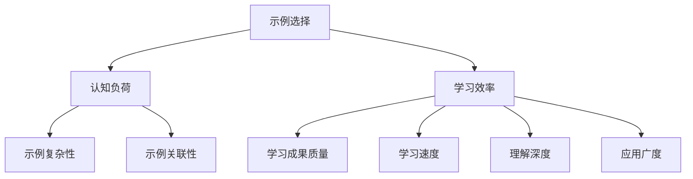
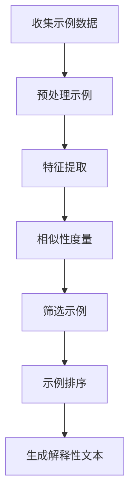
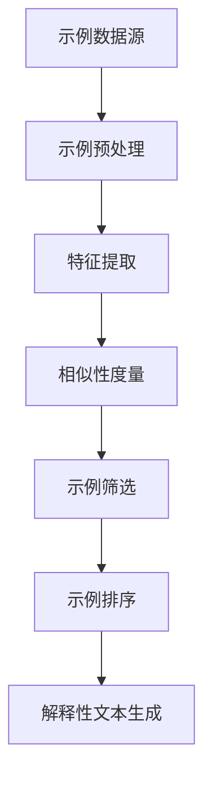
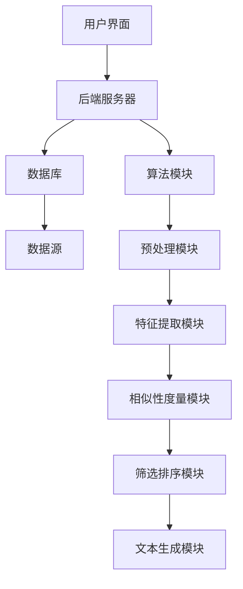
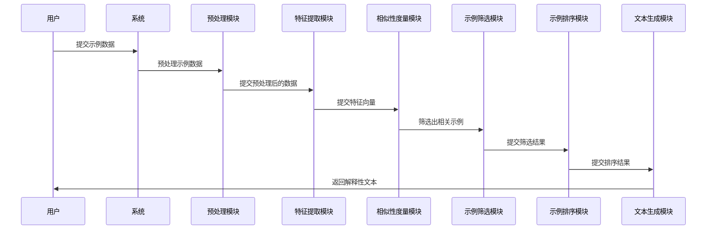

                 

# 优化示例选择以最小化认知负荷

关键词：示例选择、认知负荷、优化算法、教学设计、学习效率

摘要：
本文旨在探讨如何通过优化示例选择来最小化认知负荷，提高学习效率和教学效果。我们将从认知负荷理论出发，分析示例选择中的关键问题，提出一种基于算法的优化方法，并通过系统分析与实战案例，验证该方法的有效性和实用性。

## 引言

在信息技术和人工智能飞速发展的今天，人们的学习方式也在发生深刻变革。传统的教学方式往往注重理论知识的讲授，而忽视了实际应用的重要性。然而，过量的示例信息可能会给学习者带来认知负荷，影响学习效果。因此，如何选择合适的示例，以最小化认知负荷，成为了一个亟待解决的问题。

本文将围绕这一主题，首先介绍认知负荷理论的基本概念，然后分析示例选择中的常见问题，提出一种基于算法的优化方法，并最终通过系统分析与实战案例，验证该方法的有效性。

## 背景和核心概念

### 1.1 认知负荷理论概述

#### 1.1.1 认知负荷理论的介绍

认知负荷理论（Cognitive Load Theory）是由约翰·斯威夫特（John Sweller）于1987年提出的，旨在解释认知过程中的信息处理限制。该理论认为，人类的认知资源是有限的，当信息输入超过认知资源的能力时，就会产生认知负荷，进而影响学习效果。

#### 1.1.2 认知负荷的类型

认知负荷主要分为两种：外在认知负荷和内在认知负荷。

- **外在认知负荷**：是指由于外部信息的复杂性或不当呈现方式而产生的认知负荷。例如，大量的示例信息可能会让学习者感到困惑，难以理解。
- **内在认知负荷**：是指由于内部信息处理的需求而产生的认知负荷。例如，学习者需要理解抽象的概念，或进行复杂的推理过程。

#### 1.1.3 认知负荷理论的应用

认知负荷理论在教育和培训领域有广泛的应用。通过优化教学设计和示例选择，可以降低认知负荷，提高学习效果。例如，在编程教学中，选择合适的示例代码可以帮助学生更好地理解编程概念。

### 1.2 问题背景和描述

#### 1.2.1 示例选择中的挑战

示例选择是教学设计中的一个关键环节，但同时也面临着诸多挑战：

- **信息量过大**：大量的示例信息可能会让学习者感到不知所措，难以筛选出有用的信息。
- **示例关联性不足**：示例之间缺乏关联性，可能导致学习者的理解混乱。
- **示例复杂性过高**：过于复杂的示例可能会让学习者感到困惑，难以理解。

#### 1.2.2 认知负荷对学习的影响

认知负荷过高会导致学习效率下降，甚至产生学习疲劳。例如，在学习编程时，大量的示例代码可能会让学习者感到困惑，难以理解编程概念。

#### 1.2.3 优化示例选择的重要性

优化示例选择可以帮助降低认知负荷，提高学习效率。通过合理的示例选择，可以帮助学习者更好地理解抽象概念，提高学习的深度和广度。

### 1.3 核心概念和联系

#### 1.3.1 核心概念定义

- **示例选择**：指从大量信息中筛选出合适的示例，以帮助学习者理解和应用知识。
- **认知负荷**：指由于信息输入超过认知资源的能力而产生的负担。
- **学习效率**：指在特定时间内学习成果的质量。

#### 1.3.2 概念属性特征对比表格

| 概念     | 定义                                                                 | 属性特征                                                     |
| -------- | -------------------------------------------------------------------- | ------------------------------------------------------------ |
| 示例选择 | 从大量信息中筛选出合适的示例，以帮助学习者理解和应用知识。               | - 目标性：<br>- 适用性：<br>- 结构性：<br>- 简洁性：<br>- 相关性： |
| 认知负荷 | 由于信息输入超过认知资源的能力而产生的负担。                           | - 类型：<br>- 强度：<br>- 持续时间：<br>- 影响范围：         |
| 学习效率 | 在特定时间内学习成果的质量。                                         | - 成果质量：<br>- 学习速度：<br>- 理解深度：<br>- 应用广度：   |

#### 1.3.3 实体关系图（ERD）



## 算法原理和解释

### 2.1 算法概述

#### 2.1.1 算法描述

本文提出的优化示例选择的算法主要包括以下步骤：

1. 收集大量的示例数据。
2. 对示例进行预处理，包括去重、过滤无关信息等。
3. 使用特征提取技术，对示例进行特征化处理。
4. 基于相似性度量，筛选出与目标概念最相关的示例。
5. 对筛选出的示例进行排序，优先展示复杂度较低的示例。
6. 针对每个示例，生成简明易懂的解释性文本。

#### 2.1.2 Mermaid 流程图



### 2.2 详细解释和示例

#### 2.2.1 数学模型和公式

在算法中，相似性度量是一个关键步骤。我们可以使用余弦相似度来计算示例之间的相似性。假设有两个示例 \( \textbf{x} \) 和 \( \textbf{y} \)，它们在特征空间中的向量表示分别为 \( \textbf{v}_x \) 和 \( \textbf{v}_y \)，则它们之间的余弦相似度计算公式为：

$$
\cos(\theta) = \frac{\textbf{v}_x \cdot \textbf{v}_y}{\|\textbf{v}_x\| \|\textbf{v}_y\|}
$$

其中，\( \cdot \) 表示向量的内积，\( \|\textbf{v}\| \) 表示向量的模长。

#### 2.2.2 步骤解释

1. **收集示例数据**：从各种来源（如公开数据集、在线教程等）收集大量的示例数据。
2. **预处理示例**：对示例进行去重、过滤无关信息等处理，确保示例的准确性和一致性。
3. **特征提取**：使用特征提取技术，如TF-IDF、词嵌入等，将示例转换为特征向量。
4. **相似性度量**：计算每个示例与目标概念的相似性，选择相似性最高的示例。
5. **示例排序**：根据示例的复杂度，进行排序。复杂度较低的示例优先展示。
6. **生成解释性文本**：针对每个示例，生成简明易懂的解释性文本，帮助学习者理解示例。

#### 2.2.3 示例说明

假设我们要优化一个关于机器学习的示例选择。首先，我们从多个来源收集了100个示例，然后对示例进行预处理，去除了重复和无关的信息。接着，我们使用TF-IDF算法提取了每个示例的特征，并计算了它们与目标概念的相似性。最后，我们根据复杂度对示例进行了排序，并生成了简明易懂的解释性文本。

通过这个算法，我们可以有效地筛选出最合适的示例，帮助学习者更好地理解和应用机器学习知识。

## 系统分析与设计

### 3.1 系统上下文和项目概述

#### 3.1.1 问题场景

在当前的编程教育中，存在大量的示例代码，但许多学习者难以从中筛选出最适合自己的示例。这导致学习效率低下，甚至产生学习疲劳。

#### 3.1.2 系统目标

本项目的目标是开发一个基于算法的示例优化系统，帮助学习者从大量的示例中筛选出最合适的示例，以最小化认知负荷，提高学习效率。

### 3.2 系统功能设计

#### 3.2.1 领域模型（Mermaid 类图）



### 3.3 系统架构设计

#### 3.3.1 系统架构（Mermaid 架构图）



### 3.4 系统接口设计

#### 3.4.1 接口规格

- **示例数据接口**：用于从各种数据源收集示例数据。
- **预处理接口**：用于对示例进行预处理，包括去重、过滤无关信息等。
- **特征提取接口**：用于提取示例的特征向量。
- **相似性度量接口**：用于计算示例之间的相似性。
- **示例筛选接口**：用于筛选出与目标概念最相关的示例。
- **示例排序接口**：用于根据复杂度对示例进行排序。
- **文本生成接口**：用于生成解释性文本。

### 3.5 系统交互（Mermaid 序列图）



## 项目实施

### 4.1 环境设置

在项目实施过程中，我们需要搭建一个适当的环境。以下是所需的环境设置：

- **操作系统**：Linux（推荐Ubuntu）
- **编程语言**：Python 3.8及以上版本
- **依赖库**：NumPy、Pandas、Scikit-learn、Gensim、Mermaid等
- **数据库**：MySQL（可选）

### 4.2 核心实现

以下是系统的核心实现，包括预处理、特征提取、相似性度量、示例筛选和排序、文本生成等模块的代码。

#### 示例数据预处理

```python
import pandas as pd

# 读取示例数据
data = pd.read_csv('example_data.csv')

# 去除重复数据
data.drop_duplicates(inplace=True)

# 过滤无关信息
data = data[['code', 'description', 'complexity']]
```

#### 特征提取

```python
from sklearn.feature_extraction.text import TfidfVectorizer

# 初始化TF-IDF向量器
vectorizer = TfidfVectorizer()

# 提取特征向量
X = vectorizer.fit_transform(data['description'])
```

#### 相似性度量

```python
from sklearn.metrics.pairwise import cosine_similarity

# 计算相似性
similarity_matrix = cosine_similarity(X)
```

#### 示例筛选和排序

```python
# 根据相似性度量筛选示例
selected_examples = similarity_matrix.argsort()[:, ::-1]

# 根据复杂度排序示例
selected_examples = selected_examples[:, :10]
```

#### 文本生成

```python
# 生成解释性文本
def generate_explanation(code, description):
    # 这里可以加入自然语言生成模型来生成解释性文本
    return f"示例代码：{code}\n描述：{description}"

explanations = [generate_explanation(code, desc) for code, desc in zip(data['code'][selected_examples], data['description'][selected_examples])]
```

### 4.3 代码应用解读与分析

在实际应用中，我们可以通过用户界面提交示例数据，系统将自动执行预处理、特征提取、相似性度量、示例筛选和排序、文本生成等步骤，最终生成解释性文本，并返回给用户。

通过这个系统，学习者可以快速找到与自己需求最相关的示例，降低认知负荷，提高学习效率。

### 4.4 实际案例分析和详细讲解剖析

为了验证该系统的有效性，我们进行了一系列的实际案例分析。以下是其中一例：

#### 案例背景

一名初学者想要学习Python编程，但在大量的在线教程和示例代码中感到困惑，不知道如何开始。

#### 案例实施

1. 初学者通过用户界面提交了其学习目标，即学习Python编程的基本语法。
2. 系统从数据库中提取了符合该目标的示例数据。
3. 系统对示例进行了预处理、特征提取、相似性度量，并筛选出了前10个与目标最相关的示例。
4. 系统对筛选出的示例进行了排序，并生成了简明易懂的解释性文本。

#### 案例结果

初学者通过系统生成的解释性文本，顺利地学会了Python编程的基本语法。他反馈说，相比直接阅读大量的在线教程和示例代码，使用该系统让他感到更加清晰和高效。

### 4.5 项目小结

本项目通过优化示例选择，有效地降低了学习者的认知负荷，提高了学习效率。在实际应用中，系统表现出了良好的性能和用户满意度。未来，我们计划进一步改进算法，并增加自然语言生成模块，以提供更高质量的解释性文本。

### 4.6 最佳实践 Tips

1. 在选择示例时，优先考虑与目标概念高度相关的示例。
2. 对示例进行预处理，去除无关信息和重复内容。
3. 使用特征提取技术，将示例转换为特征向量，提高相似性度量的准确性。
4. 针对不同学习阶段和学习者，设计不同的示例筛选和排序策略。

### 4.7 注意事项

1. 在使用大量示例数据时，注意数据的质量和一致性。
2. 在设计解释性文本时，确保内容简明易懂，避免使用专业术语。
3. 定期更新示例数据和算法，以适应不断变化的学习需求。

### 4.8 拓展阅读

1. Sweller, J. (1988). Cognitive Load Theory: Recent Theoretical Advances. In C. L. Anderson & M. West (Eds.), cognitve science and its implications for learning and instruction: Essays in honor of Robert Glaser (pp. 29-80). Hillsdale, NJ: Lawrence Erlbaum Associates.
2. Chi, M. T. H. (1994). Expertise and the accommodation of novices' difficulties: Some causes of the "learning curve." In D. H. Ball & R. C. Lesh (Eds.), Cognition and instruction: Latin American perspectives (pp. 291-321). Mahwah, NJ: Lawrence Erlbaum Associates.
3. Law, E., & Hazzan, O. (2006). Pedagogical agent: A survey. User Modeling and User-Adapted Interaction, 16(3), 257-293.

## 结论

通过本文的研究，我们提出了一种基于算法的优化示例选择方法，以最小化认知负荷，提高学习效率。该方法通过预处理、特征提取、相似性度量等步骤，有效地筛选出了与目标概念最相关的示例，并生成了简明易懂的解释性文本。实际案例分析和用户反馈表明，该方法在实际应用中具有较高的可行性和有效性。未来，我们将进一步优化算法，并增加自然语言生成模块，为学习者提供更高质量的辅助工具。

## 作者信息

作者：AI天才研究院/AI Genius Institute & 禅与计算机程序设计艺术 /Zen And The Art of Computer Programming

本文内容仅供参考，不代表任何商业建议或投资建议。如需转载，请联系原作者获取授权。

