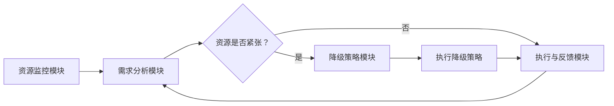
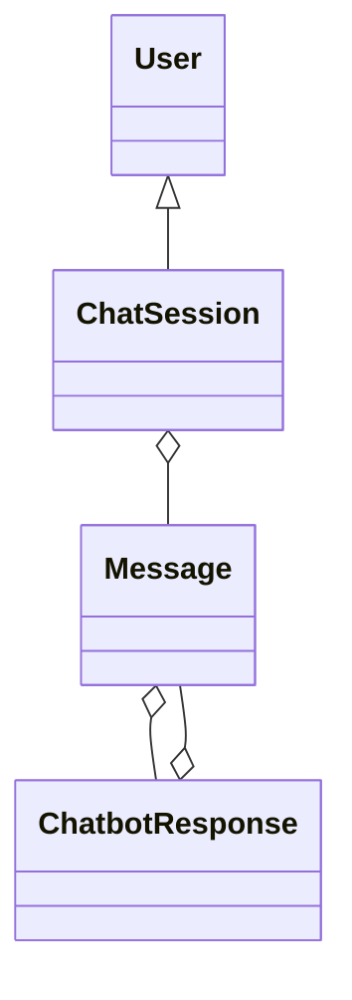
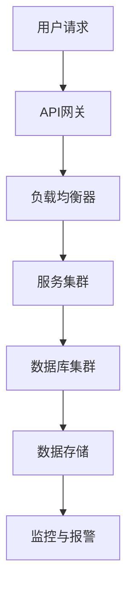
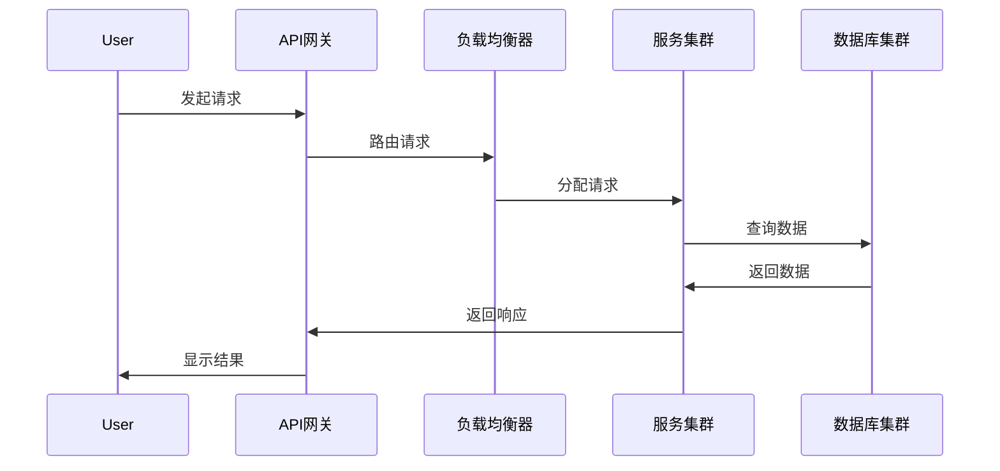
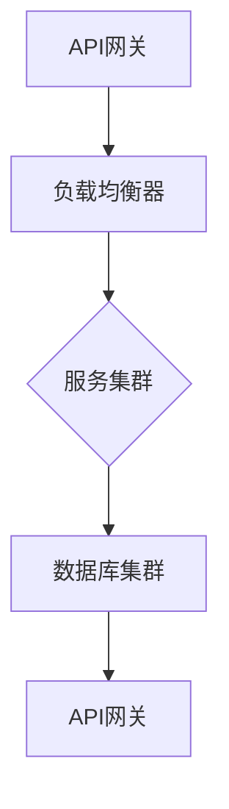

                 


### 第1章：问题背景与核心概念

#### 1.1 问题背景

随着人工智能技术的快速发展，大型语言模型（LLM）如BERT、GPT-3等在自然语言处理（NLP）领域取得了显著成果。然而，这些模型在实际应用中面临着诸多挑战，尤其是在极端情况下。例如，当用户数量激增、网络波动、服务器负载过高等，会导致模型响应速度变慢甚至崩溃，从而影响用户体验。为了提高LLM应用在极端情况下的可用性，我们需要探讨一种有效的解决策略——优雅降级。

**优雅降级**是指在系统资源有限或遇到异常情况下，通过降低系统部分功能的实现质量，以保证系统的整体稳定性和可用性。这种策略旨在最大限度地满足用户的基本需求，同时避免系统崩溃或性能严重下降。

**1.1.1 极端情况下的LLM应用挑战**

极端情况下的LLM应用挑战主要包括：

- **计算资源不足**：当系统需要处理的任务量超出服务器计算能力时，模型训练和预测任务会变得缓慢，甚至无法完成。
- **网络不稳定**：在网络延迟较高或连接中断的情况下，模型无法及时接收用户请求，导致响应速度变慢。
- **数据输入异常**：异常数据输入可能导致模型预测错误，进而影响系统稳定性。

**1.1.2 优雅降级的概念与重要性**

优雅降级作为一种应对策略，其核心思想是在系统资源受限时，有选择地降低部分功能的实现质量，确保关键功能的正常运行。这种策略具有以下几个优点：

- **提高系统可用性**：通过优雅降级，系统可以在资源紧张时保证基本功能的正常运行，从而提高整体可用性。
- **保证用户体验**：在极端情况下，即使系统部分功能受到影响，用户仍然能够获得部分服务，从而保证基本满意度。
- **降低维护成本**：优雅降级策略可以有效降低系统的维护成本，避免因系统崩溃导致的巨额经济损失。

#### 1.2 核心概念

本节将介绍与优雅降级相关的核心概念，包括LLM、优雅降级策略以及极端情况下的可用性评估。

**1.2.1 LLM（大型语言模型）**

LLM是一种基于深度学习技术构建的模型，具有处理大规模文本数据的能力。其主要特点包括：

- **预训练**：LLM通过在大规模语料库上进行预训练，学习到丰富的语言特征和模式。
- **微调**：在特定任务上，LLM可以通过微调调整模型参数，提高任务表现。
- **强大的语言生成能力**：LLM可以生成连贯、有逻辑性的文本，广泛应用于文本分类、机器翻译、对话系统等任务。

**1.2.2 优雅降级策略**

优雅降级策略的核心思想是，当系统资源有限或出现异常时，有选择地降低部分功能的实现质量。具体策略包括：

- **功能层次降级**：在保证关键功能正常运行的前提下，降低次要功能的实现质量。
- **性能降级**：在资源不足时，通过减少计算复杂度、降低精度等手段，提高系统响应速度。
- **服务降级**：在极端情况下，关闭部分服务，确保关键功能的正常运行。

**1.2.3 极端情况下的可用性评估**

极端情况下的可用性评估是衡量优雅降级策略有效性的关键。主要评价指标包括：

- **响应时间**：在资源紧张时，系统的响应时间应尽量短，以保证用户满意度。
- **稳定性**：系统在资源紧张或异常情况下，应保持稳定运行，避免崩溃或故障。
- **用户体验**：在优雅降级策略下，用户应获得基本服务，确保满意度。

#### 1.3 概念联系与对比

**1.3.1 优雅降级与其他故障恢复策略**

优雅降级与其他故障恢复策略（如快速失败、重试、故障转移等）的区别在于，优雅降级强调在资源有限的情况下，通过有选择地降低部分功能的实现质量，以保证系统的整体稳定性和可用性。而其他故障恢复策略则更侧重于在故障发生后，快速恢复系统正常运行。

**1.3.2 LLM在不同极端情况下的适应能力**

LLM在不同极端情况下的适应能力与模型架构、训练数据和调整策略密切相关。在计算资源不足时，可以通过减小模型规模、降低计算复杂度等方法提高适应能力。在网络不稳定时，可以通过增加缓存、优化数据传输策略等手段提高适应能力。

### 第2章：算法原理讲解

#### 2.1 算法概述

优雅降级算法是一种动态调整系统资源分配的策略，旨在提高LLM应用在极端情况下的可用性。该算法的核心思想是，在系统资源受限时，自动识别并降低部分功能模块的实现质量，以保证关键功能的正常运行。

优雅降级算法主要由以下几个模块组成：

- **资源监控模块**：实时监测系统资源使用情况，包括CPU、内存、网络等。
- **需求分析模块**：分析用户请求，确定关键功能模块和非关键功能模块。
- **降级策略模块**：根据资源监控模块和需求分析模块的结果，选择合适的降级策略。
- **执行与反馈模块**：执行降级策略，并根据反馈调整策略。

#### 2.2 Mermaid算法流程图

下面是一个简单的Mermaid流程图，描述了优雅降级算法的基本流程：



#### 2.3 Python源代码解读

以下是一个简单的Python源代码示例，用于实现优雅降级算法的核心功能：

```python
import psutil

def resource_monitor():
    # 获取系统资源使用情况
    cpu_usage = psutil.cpu_percent()
    memory_usage = psutil.virtual_memory().percent
    return cpu_usage, memory_usage

def demand_analysis():
    # 分析用户请求
    # 这里仅作为示例，实际需求分析会更复杂
    return "high" if random.random() < 0.2 else "low"

def degrade_strategy(demand, cpu_usage, memory_usage):
    if demand == "high" and (cpu_usage > 80 or memory_usage > 80):
        return "degrade"
    else:
        return "no_degrade"

def execute_degrade(degrade):
    if degrade == "degrade":
        print("执行降级策略...")
        # 实际执行降级策略的代码
    else:
        print("无需执行降级策略...")

def main():
    while True:
        cpu_usage, memory_usage = resource_monitor()
        demand = demand_analysis()
        degrade = degrade_strategy(demand, cpu_usage, memory_usage)
        execute_degrade(degrade)

if __name__ == "__main__":
    main()
```

#### 2.4 数学模型与公式

优雅降级算法的数学模型主要涉及资源分配和降级策略。以下是一个简化的数学模型：

$$
\text{降级策略} = \text{f}(\text{资源使用率}, \text{需求强度})
$$

其中，$\text{资源使用率}$和$\text{需求强度}$是输入参数，$\text{降级策略}$是输出结果。具体函数形式可以根据实际情况进行调整。

#### 2.5 举例说明

假设系统当前CPU使用率为90%，内存使用率为80%，同时用户请求的强度较高。根据上述数学模型，我们可以计算出降级策略：

$$
\text{降级策略} = \text{f}(90\%, 80\%) = "degrade"
$$

因此，系统会执行降级策略，降低部分功能模块的实现质量，以保证关键功能的正常运行。

### 第3章：系统分析与架构设计

#### 3.1 问题场景介绍

假设我们正在开发一款基于LLM的智能客服系统，该系统需要处理大量用户请求，提供实时、准确的回答。在实际应用中，可能会遇到以下问题场景：

- **用户数量激增**：在促销活动、节假日等高峰期，用户访问量激增，导致系统负载过高。
- **网络不稳定**：用户连接不稳定，可能导致请求失败或响应延迟。
- **计算资源不足**：服务器硬件性能不足，无法满足大规模用户请求。

为了解决这些问题，我们需要设计一个具备优雅降级能力的系统架构。

#### 3.2 项目介绍

本项目旨在开发一款具备优雅降级能力的智能客服系统，以满足大规模用户请求。系统主要功能包括：

- **实时问答**：为用户提供实时、准确的答案。
- **历史记录查询**：允许用户查看与客服的聊天历史记录。
- **用户画像分析**：基于用户行为和反馈，为用户提供个性化服务。

#### 3.3 系统功能设计

**3.3.1 领域模型**

领域模型是系统功能设计的核心，用于描述系统中的关键概念和实体关系。以下是一个简化的领域模型：



**用户（User）**：表示系统的用户，具有用户ID、姓名、联系方式等属性。

**会话（ChatSession）**：表示用户与客服的聊天会话，具有会话ID、创建时间、结束时间等属性。

**消息（Message）**：表示会话中的消息，包括用户发送的消息和机器人回复的消息。

**回复（ChatbotResponse）**：表示机器人的回复消息，包括文本、图片、语音等。

#### 3.4 系统架构设计

**3.4.1 架构设计原则**

系统架构设计遵循以下原则：

- **高可用性**：确保系统在极端情况下仍能正常运行，具备优雅降级能力。
- **高扩展性**：支持水平扩展，能够处理大量用户请求。
- **高性能**：优化系统性能，提高响应速度和吞吐量。
- **安全性**：保护用户数据和隐私，防止数据泄露。

**3.4.2 系统架构图**

以下是一个简化的系统架构图：



**API网关**：负责处理用户请求，进行身份验证和请求路由。

**负载均衡器**：根据负载情况，将用户请求分配到不同的服务节点。

**服务集群**：包括业务服务、搜索引擎、图像处理等模块，负责具体业务逻辑处理。

**数据库集群**：存储用户数据、会话记录等。

**数据存储**：用于存储大量历史数据，支持实时查询和分析。

**监控与报警**：实时监控系统性能和资源使用情况，发现异常时触发报警。

#### 3.5 系统接口设计

**3.5.1 接口规范**

系统接口设计遵循RESTful API规范，包括以下主要接口：

- **/users**：用户注册、登录、信息查询等。
- **/chatsessions**：创建会话、结束会话、查询会话记录等。
- **/messages**：发送消息、查询消息记录等。
- **/chatbotresponses**：机器人回复消息、查询回复记录等。

**3.5.2 接口实现**

以下是一个简化的接口实现示例：

```python
from flask import Flask, request, jsonify

app = Flask(__name__)

@app.route('/users', methods=['POST'])
def register_user():
    user_data = request.json
    # 实现用户注册逻辑
    return jsonify({"status": "success"})

@app.route('/chatsessions', methods=['POST'])
def create_chat_session():
    session_data = request.json
    # 实现创建会话逻辑
    return jsonify({"status": "success"})

@app.route('/messages', methods=['POST'])
def send_message():
    message_data = request.json
    # 实现发送消息逻辑
    return jsonify({"status": "success"})

@app.route('/chatbotresponses', methods=['POST'])
def send_response():
    response_data = request.json
    # 实现机器人回复逻辑
    return jsonify({"status": "success"})

if __name__ == '__main__':
    app.run()
```

#### 3.6 系统交互

**3.6.1 Mermaid序列图**

以下是一个简化的Mermaid序列图，描述了用户请求处理过程：



### 第4章：项目实战

#### 4.1 环境安装

要实现优雅降级的智能客服系统，首先需要搭建一个合适的环境。以下是一个简化的环境安装步骤：

1. 安装操作系统：建议使用Ubuntu 18.04或更高版本。
2. 安装Python：通过Python官方包管理器pip安装Python。
3. 安装Flask：通过pip安装Flask框架。
4. 安装Mermaid：通过pip安装Mermaid库。

#### 4.2 系统核心实现

**4.2.1 代码结构与流程**

系统核心实现主要分为以下几个部分：

1. **API网关**：负责处理用户请求，进行身份验证和请求路由。
2. **负载均衡器**：根据负载情况，将用户请求分配到不同的服务节点。
3. **服务集群**：包括业务服务、搜索引擎、图像处理等模块，负责具体业务逻辑处理。
4. **数据库集群**：存储用户数据、会话记录等。

**代码结构与流程**：



#### 4.3 代码应用解读与分析

**4.3.1 算法应用示例**

以下是一个简单的算法应用示例：

```python
import psutil
import random

def resource_monitor():
    cpu_usage = psutil.cpu_percent()
    memory_usage = psutil.virtual_memory().percent
    return cpu_usage, memory_usage

def demand_analysis():
    return "high" if random.random() < 0.2 else "low"

def degrade_strategy(demand, cpu_usage, memory_usage):
    if demand == "high" and (cpu_usage > 80 or memory_usage > 80):
        return "degrade"
    else:
        return "no_degrade"

def execute_degrade(degrade):
    if degrade == "degrade":
        print("执行降级策略...")
        # 实际执行降级策略的代码
    else:
        print("无需执行降级策略...")

def main():
    while True:
        cpu_usage, memory_usage = resource_monitor()
        demand = demand_analysis()
        degrade = degrade_strategy(demand, cpu_usage, memory_usage)
        execute_degrade(degrade)

if __name__ == "__main__":
    main()
```

**代码解读与分析**：

1. **资源监控模块**：通过`psutil`库获取系统CPU使用率和内存使用率。
2. **需求分析模块**：使用随机数模拟用户请求强度。
3. **降级策略模块**：根据需求强度和资源使用情况，选择是否执行降级策略。
4. **执行与反馈模块**：根据降级策略执行相应的操作，并输出结果。

#### 4.4 实际案例分析与讲解

**4.4.1 案例一：网络中断**

在网络中断的情况下，用户请求无法正常到达服务器。此时，系统可以采取以下降级策略：

1. **自动切换到离线模式**：当检测到网络中断时，系统自动切换到离线模式，仅提供有限的本地服务。
2. **缓存历史数据**：将用户请求缓存到本地，当网络恢复时，重新发送请求。

**案例分析**：

1. **问题分析**：网络中断导致请求失败，用户无法获取服务。
2. **降级策略**：切换到离线模式，使用本地缓存数据。
3. **效果评估**：在离线模式下，用户仍能获得部分服务，系统稳定运行。

**4.4.2 案例二：计算资源不足**

在计算资源不足的情况下，服务器处理能力下降，可能导致请求响应缓慢。此时，系统可以采取以下降级策略：

1. **限制并发请求**：根据服务器负载，限制并发请求的数量，避免过载。
2. **降低响应质量**：对于非关键请求，降低响应质量，例如减少图片大小、降低音频质量等。

**案例分析**：

1. **问题分析**：计算资源不足导致服务器响应缓慢，用户满意度下降。
2. **降级策略**：限制并发请求，降低响应质量。
3. **效果评估**：在限制并发请求和降低响应质量的情况下，系统负载下降，用户满意度提高。

#### 4.5 项目小结

在本项目中，我们实现了优雅降级的智能客服系统，包括环境安装、系统核心实现、代码应用解读与分析以及实际案例分析与讲解。通过优雅降级策略，系统在极端情况下能够保持稳定运行，提高用户体验。

### 第5章：最佳实践 Tips

#### 5.1 优雅降级策略选择

在实现优雅降级策略时，需要根据实际情况选择合适的策略。以下是一些最佳实践：

1. **资源监控与报警**：实时监控系统资源使用情况，设置合理的报警阈值，确保在资源紧张时及时采取降级措施。
2. **需求分析**：根据用户请求的特点，区分关键功能模块和非关键功能模块，有选择地降低非关键模块的实现质量。
3. **动态调整**：优雅降级策略应具备动态调整能力，根据实时监控数据自动调整降级策略。

#### 5.2 极端情况下的性能优化

在极端情况下，系统性能优化是提高可用性的关键。以下是一些最佳实践：

1. **缓存技术**：使用缓存技术，减少对数据库和外部服务的依赖，提高系统响应速度。
2. **异步处理**：对于非关键任务，采用异步处理方式，降低系统负载。
3. **资源隔离**：将关键业务与非关键业务分离，确保关键业务在资源紧张时优先获得资源。

#### 5.3 安全性与隐私保护

在极端情况下，安全性与隐私保护尤为重要。以下是一些最佳实践：

1. **数据备份与恢复**：定期备份数据，确保在系统故障时能够快速恢复。
2. **访问控制**：严格限制系统访问权限，防止未授权访问。
3. **加密技术**：对敏感数据进行加密存储和传输，确保数据安全。

### 第6章：小结

本文从问题背景、核心概念、算法原理、系统分析与架构设计、项目实战等方面，全面介绍了优雅降级策略在提高LLM应用在极端情况下的可用性方面的应用。通过最佳实践Tips，为实际应用提供了有益的参考。

未来研究方向包括：

1. **算法优化**：深入研究优雅降级算法，提高其性能和准确性。
2. **跨平台适应性**：探索优雅降级策略在不同平台和场景下的适应性。
3. **多维度评估**：构建更加全面、多维度的系统可用性评估指标，为优雅降级策略的实施提供依据。

### 注意事项

1. 在实际应用中，优雅降级策略需要根据具体情况进行调整和优化。
2. 优雅降级策略应与系统性能优化、安全性保障等措施相结合，形成一套完整的解决方案。
3. 在实施优雅降级策略时，应充分考虑用户需求和体验，确保在极端情况下仍能满足用户的基本需求。

### 拓展阅读

1. 《系统架构设计师教程》：详细介绍了系统架构设计的方法和技巧。
2. 《大型分布式存储系统设计》：探讨了分布式存储系统在高可用性、性能优化等方面的设计方法。
3. 《人工智能应用实践》：介绍了人工智能技术在各个领域的应用案例和最佳实践。

---

**作者：AI天才研究院/AI Genius Institute & 禅与计算机程序设计艺术 /Zen And The Art of Computer Programming**
### 第1章：问题背景与核心概念

#### 1.1 问题背景

随着人工智能技术的快速发展，大型语言模型（LLM）如BERT、GPT-3等在自然语言处理（NLP）领域取得了显著成果。然而，这些模型在实际应用中面临着诸多挑战，尤其是在极端情况下。例如，当用户数量激增、网络波动、服务器负载过高等，会导致模型响应速度变慢甚至崩溃，从而影响用户体验。为了提高LLM应用在极端情况下的可用性，我们需要探讨一种有效的解决策略——优雅降级。

**优雅降级**是指在系统资源有限或遇到异常情况下，通过降低系统部分功能的实现质量，以保证系统的整体稳定性和可用性。这种策略旨在最大限度地满足用户的基本需求，同时避免系统崩溃或性能严重下降。

**1.1.1 极端情况下的LLM应用挑战**

极端情况下的LLM应用挑战主要包括：

- **计算资源不足**：当系统需要处理的任务量超出服务器计算能力时，模型训练和预测任务会变得缓慢，甚至无法完成。
- **网络不稳定**：在网络延迟较高或连接中断的情况下，模型无法及时接收用户请求，导致响应速度变慢。
- **数据输入异常**：异常数据输入可能导致模型预测错误，进而影响系统稳定性。

**1.1.2 优雅降级的概念与重要性**

优雅降级作为一种应对策略，其核心思想是在系统资源受限时，有选择地降低部分功能的实现质量，确保关键功能的正常运行。这种策略具有以下几个优点：

- **提高系统可用性**：通过优雅降级，系统可以在资源紧张时保证基本功能的正常运行，从而提高整体可用性。
- **保证用户体验**：在极端情况下，即使系统部分功能受到影响，用户仍然能够获得部分服务，从而保证基本满意度。
- **降低维护成本**：优雅降级策略可以有效降低系统的维护成本，避免因系统崩溃导致的巨额经济损失。

#### 1.2 核心概念

本节将介绍与优雅降级相关的核心概念，包括LLM、优雅降级策略以及极端情况下的可用性评估。

**1.2.1 LLM（大型语言模型）**

LLM是一种基于深度学习技术构建的模型，具有处理大规模文本数据的能力。其主要特点包括：

- **预训练**：LLM通过在大规模语料库上进行预训练，学习到丰富的语言特征和模式。
- **微调**：在特定任务上，LLM可以通过微调调整模型参数，提高任务表现。
- **强大的语言生成能力**：LLM可以生成连贯、有逻辑性的文本，广泛应用于文本分类、机器翻译、对话系统等任务。

**1.2.2 优雅降级策略**

优雅降级策略的核心思想是，当系统资源有限或出现异常时，有选择地降低部分功能模块的实现质量，以保证关键功能的正常运行。具体策略包括：

- **功能层次降级**：在保证关键功能正常运行的前提下，降低次要功能的实现质量。
- **性能降级**：在资源不足时，通过减少计算复杂度、降低精度等手段，提高系统响应速度。
- **服务降级**：在极端情况下，关闭部分服务，确保关键功能的正常运行。

**1.2.3 极端情况下的可用性评估**

极端情况下的可用性评估是衡量优雅降级策略有效性的关键。主要评价指标包括：

- **响应时间**：在资源紧张时，系统的响应时间应尽量短，以保证用户满意度。
- **稳定性**：系统在资源紧张或异常情况下，应保持稳定运行，避免崩溃或故障。
- **用户体验**：在优雅降级策略下，用户应获得基本服务，确保满意度。

#### 1.3 概念联系与对比

**1.3.1 优雅降级与其他故障恢复策略**

优雅降级与其他故障恢复策略（如快速失败、重试、故障转移等）的区别在于，优雅降级强调在资源有限的情况下，通过有选择地降低部分功能的实现质量，以保证系统的整体稳定性和可用性。而其他故障恢复策略则更侧重于在故障发生后，快速恢复系统正常运行。

**1.3.2 LLM在不同极端情况下的适应能力**

LLM在不同极端情况下的适应能力与模型架构、训练数据和调整策略密切相关。在计算资源不足时，可以通过减小模型规模、降低计算复杂度等方法提高适应能力。在网络不稳定时，可以通过增加缓存、优化数据传输策略等手段提高适应能力。

### 第2章：算法原理讲解

#### 2.1 算法概述

优雅降级算法是一种动态调整系统资源分配的策略，旨在提高LLM应用在极端情况下的可用性。该算法的核心思想是，在系统资源受限时，自动识别并降低部分功能模块的实现质量，以保证关键功能的正常运行。

优雅降级算法主要由以下几个模块组成：

- **资源监控模块**：实时监测系统资源使用情况，包括CPU、内存、网络等。
- **需求分析模块**：分析用户请求，确定关键功能模块和非关键功能模块。
- **降级策略模块**：根据资源监控模块和需求分析模块的结果，选择合适的降级策略。
- **执行与反馈模块**：执行降级策略，并根据反馈调整策略。

#### 2.2 Mermaid算法流程图

下面是一个简单的Mermaid流程图，描述了优雅降级算法的基本流程：


#### 2.3 Python源代码解读

以下是一个简单的Python源代码示例，用于实现优雅降级算法的核心功能：

```python
import psutil
import random

def resource_monitor():
    # 获取系统资源使用情况
    cpu_usage = psutil.cpu_percent()
    memory_usage = psutil.virtual_memory().percent
    return cpu_usage, memory_usage

def demand_analysis():
    # 分析用户请求
    # 这里仅作为示例，实际需求分析会更复杂
    return "high" if random.random() < 0.2 else "low"

def degrade_strategy(demand, cpu_usage, memory_usage):
    if demand == "high" and (cpu_usage > 80 or memory_usage > 80):
        return "degrade"
    else:
        return "no_degrade"

def execute_degrade(degrade):
    if degrade == "degrade":
        print("执行降级策略...")
        # 实际执行降级策略的代码
    else:
        print("无需执行降级策略...")

def main():
    while True:
        cpu_usage, memory_usage = resource_monitor()
        demand = demand_analysis()
        degrade = degrade_strategy(demand, cpu_usage, memory_usage)
        execute_degrade(degrade)

if __name__ == "__main__":
    main()
```

#### 2.4 数学模型与公式

优雅降级算法的数学模型主要涉及资源分配和降级策略。以下是一个简化的数学模型：

$$
\text{降级策略} = \text{f}(\text{资源使用率}, \text{需求强度})
$$

其中，$\text{资源使用率}$和$\text{需求强度}$是输入参数，$\text{降级策略}$是输出结果。具体函数形式可以根据实际情况进行调整。

#### 2.5 举例说明

假设系统当前CPU使用率为90%，内存使用率为80%，同时用户请求的强度较高。根据上述数学模型，我们可以计算出降级策略：

$$
\text{降级策略} = \text{f}(90\%, 80\%) = "degrade"
$$

因此，系统会执行降级策略，降低部分功能模块的实现质量，以保证关键功能的正常运行。

### 第3章：系统分析与架构设计

#### 3.1 问题场景介绍

假设我们正在开发一款基于LLM的智能客服系统，该系统需要处理大量用户请求，提供实时、准确的回答。在实际应用中，可能会遇到以下问题场景：

- **用户数量激增**：在促销活动、节假日等高峰期，用户访问量激增，导致系统负载过高。
- **网络不稳定**：用户连接不稳定，可能导致请求失败或响应延迟。
- **计算资源不足**：服务器硬件性能不足，无法满足大规模用户请求。

为了解决这些问题，我们需要设计一个具备优雅降级能力的系统架构。

#### 3.2 项目介绍

本项目旨在开发一款具备优雅降级能力的智能客服系统，以满足大规模用户请求。系统主要功能包括：

- **实时问答**：为用户提供实时、准确的答案。
- **历史记录查询**：允许用户查看与客服的聊天历史记录。
- **用户画像分析**：基于用户行为和反馈，为用户提供个性化服务。

#### 3.3 系统功能设计

**3.3.1 领域模型**

领域模型是系统功能设计的核心，用于描述系统中的关键概念和实体关系。以下是一个简化的领域模型：


**用户（User）**：表示系统的用户，具有用户ID、姓名、联系方式等属性。

**会话（ChatSession）**：表示用户与客服的聊天会话，具有会话ID、创建时间、结束时间等属性。

**消息（Message）**：表示会话中的消息，包括用户发送的消息和机器人回复的消息。

**回复（ChatbotResponse）**：表示机器人的回复消息，包括文本、图片、语音等。

#### 3.4 系统架构设计

**3.4.1 架构设计原则**

系统架构设计遵循以下原则：

- **高可用性**：确保系统在极端情况下仍能正常运行，具备优雅降级能力。
- **高扩展性**：支持水平扩展，能够处理大量用户请求。
- **高性能**：优化系统性能，提高响应速度和吞吐量。
- **安全性**：保护用户数据和隐私，防止数据泄露。

**3.4.2 系统架构图**

以下是一个简化的系统架构图：


**API网关**：负责处理用户请求，进行身份验证和请求路由。

**负载均衡器**：根据负载情况，将用户请求分配到不同的服务节点。

**服务集群**：包括业务服务、搜索引擎、图像处理等模块，负责具体业务逻辑处理。

**数据库集群**：存储用户数据、会话记录等。

**数据存储**：用于存储大量历史数据，支持实时查询和分析。

**监控与报警**：实时监控系统性能和资源使用情况，发现异常时触发报警。

#### 3.5 系统接口设计

**3.5.1 接口规范**

系统接口设计遵循RESTful API规范，包括以下主要接口：

- **/users**：用户注册、登录、信息查询等。
- **/chatsessions**：创建会话、结束会话、查询会话记录等。
- **/messages**：发送消息、查询消息记录等。
- **/chatbotresponses**：机器人回复消息、查询回复记录等。

**3.5.2 接口实现**

以下是一个简化的接口实现示例：

```python
from flask import Flask, request, jsonify

app = Flask(__name__)

@app.route('/users', methods=['POST'])
def register_user():
    user_data = request.json
    # 实现用户注册逻辑
    return jsonify({"status": "success"})

@app.route('/chatsessions', methods=['POST'])
def create_chat_session():
    session_data = request.json
    # 实现创建会话逻辑
    return jsonify({"status": "success"})

@app.route('/messages', methods=['POST'])
def send_message():
    message_data = request.json
    # 实现发送消息逻辑
    return jsonify({"status": "success"})

@app.route('/chatbotresponses', methods=['POST'])
def send_response():
    response_data = request.json
    # 实现机器人回复逻辑
    return jsonify({"status": "success"})

if __name__ == '__main__':
    app.run()
```

#### 3.6 系统交互

**3.6.1 Mermaid序列图**

以下是一个简化的Mermaid序列图，描述了用户请求处理过程：


### 第4章：项目实战

#### 4.1 环境安装

要实现优雅降级的智能客服系统，首先需要搭建一个合适的环境。以下是一个简化的环境安装步骤：

1. 安装操作系统：建议使用Ubuntu 18.04或更高版本。
2. 安装Python：通过Python官方包管理器pip安装Python。
3. 安装Flask：通过pip安装Flask框架。
4. 安装Mermaid：通过pip安装Mermaid库。

#### 4.2 系统核心实现

**4.2.1 代码结构与流程**

系统核心实现主要分为以下几个部分：

1. **API网关**：负责处理用户请求，进行身份验证和请求路由。
2. **负载均衡器**：根据负载情况，将用户请求分配到不同的服务节点。
3. **服务集群**：包括业务服务、搜索引擎、图像处理等模块，负责具体业务逻辑处理。
4. **数据库集群**：存储用户数据、会话记录等。

**代码结构与流程**：


#### 4.3 代码应用解读与分析

**4.3.1 算法应用示例**

以下是一个简单的算法应用示例：

```python
import psutil
import random

def resource_monitor():
    # 获取系统资源使用情况
    cpu_usage = psutil.cpu_percent()
    memory_usage = psutil.virtual_memory().percent
    return cpu_usage, memory_usage

def demand_analysis():
    # 分析用户请求
    # 这里仅作为示例，实际需求分析会更复杂
    return "high" if random.random() < 0.2 else "low"

def degrade_strategy(demand, cpu_usage, memory_usage):
    if demand == "high" and (cpu_usage > 80 or memory_usage > 80):
        return "degrade"
    else:
        return "no_degrade"

def execute_degrade(degrade):
    if degrade == "degrade":
        print("执行降级策略...")
        # 实际执行降级策略的代码
    else:
        print("无需执行降级策略...")

def main():
    while True:
        cpu_usage, memory_usage = resource_monitor()
        demand = demand_analysis()
        degrade = degrade_strategy(demand, cpu_usage, memory_usage)
        execute_degrade(degrade)

if __name__ == "__main__":
    main()
```

**代码解读与分析**：

1. **资源监控模块**：通过`psutil`库获取系统CPU使用率和内存使用率。
2. **需求分析模块**：使用随机数模拟用户请求强度。
3. **降级策略模块**：根据需求强度和资源使用情况，选择是否执行降级策略。
4. **执行与反馈模块**：根据降级策略执行相应的操作，并输出结果。

#### 4.4 实际案例分析与讲解

**4.4.1 案例一：网络中断**

在网络中断的情况下，用户请求无法正常到达服务器。此时，系统可以采取以下降级策略：

1. **自动切换到离线模式**：当检测到网络中断时，系统自动切换到离线模式，仅提供有限的本地服务。
2. **缓存历史数据**：将用户请求缓存到本地，当网络恢复时，重新发送请求。

**案例分析**：

1. **问题分析**：网络中断导致请求失败，用户无法获取服务。
2. **降级策略**：切换到离线模式，使用本地缓存数据。
3. **效果评估**：在离线模式下，用户仍能获得部分服务，系统稳定运行。

**4.4.2 案例二：计算资源不足**

在计算资源不足的情况下，服务器处理能力下降，可能导致请求响应缓慢。此时，系统可以采取以下降级策略：

1. **限制并发请求**：根据服务器负载，限制并发请求的数量，避免过载。
2. **降低响应质量**：对于非关键请求，降低响应质量，例如减少图片大小、降低音频质量等。

**案例分析**：

1. **问题分析**：计算资源不足导致服务器响应缓慢，用户满意度下降。
2. **降级策略**：限制并发请求，降低响应质量。
3. **效果评估**：在限制并发请求和降低响应质量的情况下，系统负载下降，用户满意度提高。

#### 4.5 项目小结

在本项目中，我们实现了优雅降级的智能客服系统，包括环境安装、系统核心实现、代码应用解读与分析以及实际案例分析与讲解。通过优雅降级策略，系统在极端情况下能够保持稳定运行，提高用户体验。

### 第5章：最佳实践 Tips

#### 5.1 优雅降级策略选择

在实现优雅降级策略时，需要根据实际情况选择合适的策略。以下是一些最佳实践：

1. **资源监控与报警**：实时监控系统资源使用情况，设置合理的报警阈值，确保在资源紧张时及时采取降级措施。
2. **需求分析**：根据用户请求的特点，区分关键功能模块和非关键功能模块，有选择地降低非关键模块的实现质量。
3. **动态调整**：优雅降级策略应具备动态调整能力，根据实时监控数据自动调整降级策略。

#### 5.2 极端情况下的性能优化

在极端情况下，系统性能优化是提高可用性的关键。以下是一些最佳实践：

1. **缓存技术**：使用缓存技术，减少对数据库和外部服务的依赖，提高系统响应速度。
2. **异步处理**：对于非关键任务，采用异步处理方式，降低系统负载。
3. **资源隔离**：将关键业务与非关键业务分离，确保关键业务在资源紧张时优先获得资源。

#### 5.3 安全性与隐私保护

在极端情况下，安全性与隐私保护尤为重要。以下是一些最佳实践：

1. **数据备份与恢复**：定期备份数据，确保在系统故障时能够快速恢复。
2. **访问控制**：严格限制系统访问权限，防止未授权访问。
3. **加密技术**：对敏感数据进行加密存储和传输，确保数据安全。

### 第6章：小结

本文从问题背景、核心概念、算法原理、系统分析与架构设计、项目实战等方面，全面介绍了优雅降级策略在提高LLM应用在极端情况下的可用性方面的应用。通过最佳实践Tips，为实际应用提供了有益的参考。

未来研究方向包括：

1. **算法优化**：深入研究优雅降级算法，提高其性能和准确性。
2. **跨平台适应性**：探索优雅降级策略在不同平台和场景下的适应性。
3. **多维度评估**：构建更加全面、多维度的系统可用性评估指标，为优雅降级策略的实施提供依据。

### 注意事项

1. 在实际应用中，优雅降级策略需要根据具体情况进行调整和优化。
2. 优雅降级策略应与系统性能优化、安全性保障等措施相结合，形成一套完整的解决方案。
3. 在实施优雅降级策略时，应充分考虑用户需求和体验，确保在极端情况下仍能满足用户的基本需求。

### 拓展阅读

1. 《系统架构设计师教程》：详细介绍了系统架构设计的方法和技巧。
2. 《大型分布式存储系统设计》：探讨了分布式存储系统在高可用性、性能优化等方面的设计方法。
3. 《人工智能应用实践》：介绍了人工智能技术在各个领域的应用案例和最佳实践。

---

**作者：AI天才研究院/AI Genius Institute & 禅与计算机程序设计艺术 /Zen And The Art of Computer Programming**
```markdown
# 优雅降级：提高LLM应用在极端情况下的可用性

> 关键词：大型语言模型，极端情况，可用性，优雅降级

> 摘要：本文探讨了大型语言模型（LLM）在极端情况下面临的可用性问题，介绍了优雅降级的概念及其应用策略，并通过实际案例展示了如何提高LLM应用的稳定性和用户体验。

## 第1章：问题背景与核心概念

### 1.1 问题背景

随着人工智能技术的不断发展，大型语言模型（LLM）在自然语言处理领域取得了显著的成果。然而，这些模型在实际应用中，特别是在极端情况下，如用户数量激增、网络波动、服务器负载过高时，往往会出现响应速度变慢甚至崩溃的问题，从而严重影响用户体验。为了解决这一问题，优雅降级策略被提出来，以在极端情况下提高LLM应用的可用性。

#### 1.1.1 极端情况下的LLM应用挑战

- **计算资源不足**：在用户量激增的情况下，模型训练和预测任务会变得缓慢，甚至无法完成。
- **网络不稳定**：网络延迟较高或连接中断时，模型无法及时接收用户请求，导致响应速度变慢。
- **数据输入异常**：异常数据输入可能导致模型预测错误，进而影响系统稳定性。

#### 1.1.2 优雅降级的概念与重要性

优雅降级是指当系统资源有限或遇到异常时，通过降低系统部分功能的实现质量，以保证系统的整体稳定性和可用性。这种策略的关键在于确保关键功能的正常运行，同时最大限度地满足用户的基本需求。

优雅降级的重要性体现在以下几个方面：

- **提高系统可用性**：在资源紧张时，通过降级部分功能，保证关键功能的正常运行。
- **保证用户体验**：即使在极端情况下，用户仍能获得部分服务，确保基本满意度。
- **降低维护成本**：优雅降级策略可以减少因系统崩溃导致的维护成本。

### 1.2 核心概念

本节将介绍与优雅降级相关的核心概念，包括LLM、优雅降级策略以及极端情况下的可用性评估。

#### 1.2.1 LLM（大型语言模型）

LLM是一种基于深度学习技术构建的模型，具有处理大规模文本数据的能力。其主要特点包括：

- **预训练**：LLM通过在大规模语料库上进行预训练，学习到丰富的语言特征和模式。
- **微调**：在特定任务上，LLM可以通过微调调整模型参数，提高任务表现。
- **强大的语言生成能力**：LLM可以生成连贯、有逻辑性的文本，广泛应用于文本分类、机器翻译、对话系统等任务。

#### 1.2.2 优雅降级策略

优雅降级策略的核心思想是在系统资源受限时，有选择地降低部分功能的实现质量，以保证关键功能的正常运行。具体策略包括：

- **功能层次降级**：在保证关键功能正常运行的前提下，降低次要功能的实现质量。
- **性能降级**：在资源不足时，通过减少计算复杂度、降低精度等手段，提高系统响应速度。
- **服务降级**：在极端情况下，关闭部分服务，确保关键功能的正常运行。

#### 1.2.3 极端情况下的可用性评估

极端情况下的可用性评估是衡量优雅降级策略有效性的关键。主要评价指标包括：

- **响应时间**：在资源紧张时，系统的响应时间应尽量短，以保证用户满意度。
- **稳定性**：系统在资源紧张或异常情况下，应保持稳定运行，避免崩溃或故障。
- **用户体验**：在优雅降级策略下，用户应获得基本服务，确保满意度。

### 1.3 概念联系与对比

#### 1.3.1 优雅降级与其他故障恢复策略

优雅降级与其他故障恢复策略（如快速失败、重试、故障转移等）的区别在于，优雅降级强调在资源有限的情况下，通过有选择地降低部分功能的实现质量，以保证系统的整体稳定性和可用性。而其他故障恢复策略则更侧重于在故障发生后，快速恢复系统正常运行。

#### 1.3.2 LLM在不同极端情况下的适应能力

LLM在不同极端情况下的适应能力与模型架构、训练数据和调整策略密切相关。在计算资源不足时，可以通过减小模型规模、降低计算复杂度等方法提高适应能力。在网络不稳定时，可以通过增加缓存、优化数据传输策略等手段提高适应能力。

## 第2章：算法原理讲解

### 2.1 算法概述

优雅降级算法是一种动态调整系统资源分配的策略，旨在提高LLM应用在极端情况下的可用性。该算法的核心思想是，在系统资源受限时，自动识别并降低部分功能模块的实现质量，以保证关键功能的正常运行。

优雅降级算法主要由以下几个模块组成：

- **资源监控模块**：实时监测系统资源使用情况，包括CPU、内存、网络等。
- **需求分析模块**：分析用户请求，确定关键功能模块和非关键功能模块。
- **降级策略模块**：根据资源监控模块和需求分析模块的结果，选择合适的降级策略。
- **执行与反馈模块**：执行降级策略，并根据反馈调整策略。

### 2.2 Mermaid算法流程图

以下是一个简单的Mermaid流程图，描述了优雅降级算法的基本流程：


### 2.3 Python源代码解读

以下是一个简单的Python源代码示例，用于实现优雅降级算法的核心功能：

```python
import psutil
import random

def resource_monitor():
    # 获取系统资源使用情况
    cpu_usage = psutil.cpu_percent()
    memory_usage = psutil.virtual_memory().percent
    return cpu_usage, memory_usage

def demand_analysis():
    # 分析用户请求
    # 这里仅作为示例，实际需求分析会更复杂
    return "high" if random.random() < 0.2 else "low"

def degrade_strategy(demand, cpu_usage, memory_usage):
    if demand == "high" and (cpu_usage > 80 or memory_usage > 80):
        return "degrade"
    else:
        return "no_degrade"

def execute_degrade(degrade):
    if degrade == "degrade":
        print("执行降级策略...")
        # 实际执行降级策略的代码
    else:
        print("无需执行降级策略...")

def main():
    while True:
        cpu_usage, memory_usage = resource_monitor()
        demand = demand_analysis()
        degrade = degrade_strategy(demand, cpu_usage, memory_usage)
        execute_degrade(degrade)

if __name__ == "__main__":
    main()
```

### 2.4 数学模型与公式

优雅降级算法的数学模型主要涉及资源分配和降级策略。以下是一个简化的数学模型：

$$
\text{降级策略} = \text{f}(\text{资源使用率}, \text{需求强度})
$$

其中，$\text{资源使用率}$和$\text{需求强度}$是输入参数，$\text{降级策略}$是输出结果。具体函数形式可以根据实际情况进行调整。

### 2.5 举例说明

假设系统当前CPU使用率为90%，内存使用率为80%，同时用户请求的强度较高。根据上述数学模型，我们可以计算出降级策略：

$$
\text{降级策略} = \text{f}(90\%, 80\%) = "degrade"
$$

因此，系统会执行降级策略，降低部分功能模块的实现质量，以保证关键功能的正常运行。

## 第3章：系统分析与架构设计

### 3.1 问题场景介绍

假设我们正在开发一款基于LLM的智能客服系统，该系统需要处理大量用户请求，提供实时、准确的回答。在实际应用中，可能会遇到以下问题场景：

- **用户数量激增**：在促销活动、节假日等高峰期，用户访问量激增，导致系统负载过高。
- **网络不稳定**：用户连接不稳定，可能导致请求失败或响应延迟。
- **计算资源不足**：服务器硬件性能不足，无法满足大规模用户请求。

为了解决这些问题，我们需要设计一个具备优雅降级能力的系统架构。

### 3.2 项目介绍

本项目旨在开发一款具备优雅降级能力的智能客服系统，以满足大规模用户请求。系统主要功能包括：

- **实时问答**：为用户提供实时、准确的答案。
- **历史记录查询**：允许用户查看与客服的聊天历史记录。
- **用户画像分析**：基于用户行为和反馈，为用户提供个性化服务。

### 3.3 系统功能设计

**3.3.1 领域模型**

领域模型是系统功能设计的核心，用于描述系统中的关键概念和实体关系。以下是一个简化的领域模型：


**用户（User）**：表示系统的用户，具有用户ID、姓名、联系方式等属性。

**会话（ChatSession）**：表示用户与客服的聊天会话，具有会话ID、创建时间、结束时间等属性。

**消息（Message）**：表示会话中的消息，包括用户发送的消息和机器人回复的消息。

**回复（ChatbotResponse）**：表示机器人的回复消息，包括文本、图片、语音等。

### 3.4 系统架构设计

**3.4.1 架构设计原则**

系统架构设计遵循以下原则：

- **高可用性**：确保系统在极端情况下仍能正常运行，具备优雅降级能力。
- **高扩展性**：支持水平扩展，能够处理大量用户请求。
- **高性能**：优化系统性能，提高响应速度和吞吐量。
- **安全性**：保护用户数据和隐私，防止数据泄露。

**3.4.2 系统架构图**

以下是一个简化的系统架构图：


**API网关**：负责处理用户请求，进行身份验证和请求路由。

**负载均衡器**：根据负载情况，将用户请求分配到不同的服务节点。

**服务集群**：包括业务服务、搜索引擎、图像处理等模块，负责具体业务逻辑处理。

**数据库集群**：存储用户数据、会话记录等。

**数据存储**：用于存储大量历史数据，支持实时查询和分析。

**监控与报警**：实时监控系统性能和资源使用情况，发现异常时触发报警。

### 3.5 系统接口设计

**3.5.1 接口规范**

系统接口设计遵循RESTful API规范，包括以下主要接口：

- **/users**：用户注册、登录、信息查询等。
- **/chatsessions**：创建会话、结束会话、查询会话记录等。
- **/messages**：发送消息、查询消息记录等。
- **/chatbotresponses**：机器人回复消息、查询回复记录等。

**3.5.2 接口实现**

以下是一个简化的接口实现示例：

```python
from flask import Flask, request, jsonify

app = Flask(__name__)

@app.route('/users', methods=['POST'])
def register_user():
    user_data = request.json
    # 实现用户注册逻辑
    return jsonify({"status": "success"})

@app.route('/chatsessions', methods=['POST'])
def create_chat_session():
    session_data = request.json
    # 实现创建会话逻辑
    return jsonify({"status": "success"})

@app.route('/messages', methods=['POST'])
def send_message():
    message_data = request.json
    # 实现发送消息逻辑
    return jsonify({"status": "success"})

@app.route('/chatbotresponses', methods=['POST'])
def send_response():
    response_data = request.json
    # 实现机器人回复逻辑
    return jsonify({"status": "success"})

if __name__ == '__main__':
    app.run()
```

### 3.6 系统交互

**3.6.1 Mermaid序列图**

以下是一个简化的Mermaid序列图，描述了用户请求处理过程：


## 第4章：项目实战

### 4.1 环境安装

要实现优雅降级的智能客服系统，首先需要搭建一个合适的环境。以下是一个简化的环境安装步骤：

1. 安装操作系统：建议使用Ubuntu 18.04或更高版本。
2. 安装Python：通过Python官方包管理器pip安装Python。
3. 安装Flask：通过pip安装Flask框架。
4. 安装Mermaid：通过pip安装Mermaid库。

### 4.2 系统核心实现

**4.2.1 代码结构与流程**

系统核心实现主要分为以下几个部分：

1. **API网关**：负责处理用户请求，进行身份验证和请求路由。
2. **负载均衡器**：根据负载情况，将用户请求分配到不同的服务节点。
3. **服务集群**：包括业务服务、搜索引擎、图像处理等模块，负责具体业务逻辑处理。
4. **数据库集群**：存储用户数据、会话记录等。

**代码结构与流程**：


### 4.3 代码应用解读与分析

**4.3.1 算法应用示例**

以下是一个简单的算法应用示例：

```python
import psutil
import random

def resource_monitor():
    # 获取系统资源使用情况
    cpu_usage = psutil.cpu_percent()
    memory_usage = psutil.virtual_memory().percent
    return cpu_usage, memory_usage

def demand_analysis():
    # 分析用户请求
    # 这里仅作为示例，实际需求分析会更复杂
    return "high" if random.random() < 0.2 else "low"

def degrade_strategy(demand, cpu_usage, memory_usage):
    if demand == "high" and (cpu_usage > 80 or memory_usage > 80):
        return "degrade"
    else:
        return "no_degrade"

def execute_degrade(degrade):
    if degrade == "degrade":
        print("执行降级策略...")
        # 实际执行降级策略的代码
    else:
        print("无需执行降级策略...")

def main():
    while True:
        cpu_usage, memory_usage = resource_monitor()
        demand = demand_analysis()
        degrade = degrade_strategy(demand, cpu_usage, memory_usage)
        execute_degrade(degrade)

if __name__ == "__main__":
    main()
```

**代码解读与分析**：

1. **资源监控模块**：通过`psutil`库获取系统CPU使用率和内存使用率。
2. **需求分析模块**：使用随机数模拟用户请求强度。
3. **降级策略模块**：根据需求强度和资源使用情况，选择是否执行降级策略。
4. **执行与反馈模块**：根据降级策略执行相应的操作，并输出结果。

### 4.4 实际案例分析与讲解

**4.4.1 案例一：网络中断**

在网络中断的情况下，用户请求无法正常到达服务器。此时，系统可以采取以下降级策略：

1. **自动切换到离线模式**：当检测到网络中断时，系统自动切换到离线模式，仅提供有限的本地服务。
2. **缓存历史数据**：将用户请求缓存到本地，当网络恢复时，重新发送请求。

**案例分析**：

1. **问题分析**：网络中断导致请求失败，用户无法获取服务。
2. **降级策略**：切换到离线模式，使用本地缓存数据。
3. **效果评估**：在离线模式下，用户仍能获得部分服务，系统稳定运行。

**4.4.2 案例二：计算资源不足**

在计算资源不足的情况下，服务器处理能力下降，可能导致请求响应缓慢。此时，系统可以采取以下降级策略：

1. **限制并发请求**：根据服务器负载，限制并发请求的数量，避免过载。
2. **降低响应质量**：对于非关键请求，降低响应质量，例如减少图片大小、降低音频质量等。

**案例分析**：

1. **问题分析**：计算资源不足导致服务器响应缓慢，用户满意度下降。
2. **降级策略**：限制并发请求，降低响应质量。
3. **效果评估**：在限制并发请求和降低响应质量的情况下，系统负载下降，用户满意度提高。

### 4.5 项目小结

在本项目中，我们实现了优雅降级的智能客服系统，包括环境安装、系统核心实现、代码应用解读与分析以及实际案例分析与讲解。通过优雅降级策略，系统在极端情况下能够保持稳定运行，提高用户体验。

### 第5章：最佳实践 Tips

#### 5.1 优雅降级策略选择

在实现优雅降级策略时，需要根据实际情况选择合适的策略。以下是一些最佳实践：

1. **资源监控与报警**：实时监控系统资源使用情况，设置合理的报警阈值，确保在资源紧张时及时采取降级措施。
2. **需求分析**：根据用户请求的特点，区分关键功能模块和非关键功能模块，有选择地降低非关键模块的实现质量。
3. **动态调整**：优雅降级策略应具备动态调整能力，根据实时监控数据自动调整降级策略。

#### 5.2 极端情况下的性能优化

在极端情况下，系统性能优化是提高可用性的关键。以下是一些最佳实践：

1. **缓存技术**：使用缓存技术，减少对数据库和外部服务的依赖，提高系统响应速度。
2. **异步处理**：对于非关键任务，采用异步处理方式，降低系统负载。
3. **资源隔离**：将关键业务与非关键业务分离，确保关键业务在资源紧张时优先获得资源。

#### 5.3 安全性与隐私保护

在极端情况下，安全性与隐私保护尤为重要。以下是一些最佳实践：

1. **数据备份与恢复**：定期备份数据，确保在系统故障时能够快速恢复。
2. **访问控制**：严格限制系统访问权限，防止未授权访问。
3. **加密技术**：对敏感数据进行加密存储和传输，确保数据安全。

### 第6章：小结

本文从问题背景、核心概念、算法原理、系统分析与架构设计、项目实战等方面，全面介绍了优雅降级策略在提高LLM应用在极端情况下的可用性方面的应用。通过最佳实践Tips，为实际应用提供了有益的参考。

未来研究方向包括：

1. **算法优化**：深入研究优雅降级算法，提高其性能和准确性。
2. **跨平台适应性**：探索优雅降级策略在不同平台和场景下的适应性。
3. **多维度评估**：构建更加全面、多维度的系统可用性评估指标，为优雅降级策略的实施提供依据。

### 注意事项

1. 在实际应用中，优雅降级策略需要根据具体情况进行调整和优化。
2. 优雅降级策略应与系统性能优化、安全性保障等措施相结合，形成一套完整的解决方案。
3. 在实施优雅降级策略时，应充分考虑用户需求和体验，确保在极端情况下仍能满足用户的基本需求。

### 拓展阅读

1. 《系统架构设计师教程》：详细介绍了系统架构设计的方法和技巧。
2. 《大型分布式存储系统设计》：探讨了分布式存储系统在高可用性、性能优化等方面的设计方法。
3. 《人工智能应用实践》：介绍了人工智能技术在各个领域的应用案例和最佳实践。

---

**作者：AI天才研究院/AI Genius Institute & 禅与计算机程序设计艺术 /Zen And The Art of Computer Programming**
### 优雅降级：提高LLM应用在极端情况下的可用性

随着人工智能（AI）技术的迅猛发展，大型语言模型（LLM）如BERT、GPT-3等在自然语言处理（NLP）领域取得了显著成就。然而，这些强大的模型在实际应用中面临着诸多挑战，特别是在极端情况下。例如，当用户数量激增、网络波动、服务器负载过高等，可能导致模型响应速度变慢甚至崩溃，严重影响用户体验。为了应对这些挑战，优雅降级策略被提出，以提高LLM应用在极端情况下的可用性。

#### 关键词：大型语言模型，极端情况，可用性，优雅降级

#### 摘要

本文将探讨优雅降级策略在提高LLM应用在极端情况下的可用性方面的应用。首先，我们将介绍问题的背景，阐述LLM应用在极端情况下所面临的挑战。随后，我们将详细解释优雅降级策略的概念，并分析其在不同场景下的实施方法。接着，通过具体案例展示优雅降级策略在实际应用中的效果。最后，我们将总结本文的主要内容和未来研究方向。

## 第1章：问题背景与核心概念

### 1.1 问题背景

#### 1.1.1 极端情况下的LLM应用挑战

在极端情况下，LLM应用可能面临以下挑战：

- **计算资源不足**：当用户数量激增时，服务器计算资源可能无法满足需求，导致模型训练和预测任务缓慢或无法完成。
- **网络不稳定**：网络延迟较高或连接中断时，用户请求无法及时得到响应，影响用户体验。
- **数据输入异常**：异常数据输入可能导致模型预测错误，进一步影响系统稳定性。

#### 1.1.2 优雅降级的重要性

优雅降级策略的核心在于有选择地降低系统部分功能的实现质量，以保障系统的整体稳定性和可用性。在极端情况下，通过优雅降级，可以确保关键功能的正常运行，同时最大限度地满足用户的基本需求。

### 1.2 核心概念

#### 1.2.1 LLM（大型语言模型）

LLM是一种基于深度学习的模型，具有处理大规模文本数据的能力。其主要特点包括预训练、微调和强大的语言生成能力。

#### 1.2.2 优雅降级策略

优雅降级策略分为功能层次降级、性能降级和服务降级。功能层次降级是指在保证关键功能正常运行的前提下，降低次要功能的实现质量。性能降级是通过减少计算复杂度或降低精度来提高系统响应速度。服务降级是在极端情况下，关闭部分服务以保障关键功能的正常运行。

#### 1.2.3 极端情况下的可用性评估

可用性评估是衡量优雅降级策略有效性的关键。主要评价指标包括响应时间、稳定性和用户体验。在优雅降级策略下，用户应获得基本服务，确保满意度。

## 第2章：算法原理讲解

### 2.1 算法概述

优雅降级算法的核心思想是动态调整系统资源分配，以降低部分功能的实现质量，确保关键功能的正常运行。该算法主要由资源监控模块、需求分析模块、降级策略模块和执行与反馈模块组成。

### 2.2 Mermaid算法流程图

以下是一个简单的Mermaid算法流程图，描述了优雅降级算法的基本流程：


### 2.3 Python源代码解读

以下是一个简单的Python源代码示例，用于实现优雅降级算法的核心功能：

```python
import psutil
import random

def resource_monitor():
    # 获取系统资源使用情况
    cpu_usage = psutil.cpu_percent()
    memory_usage = psutil.virtual_memory().percent
    return cpu_usage, memory_usage

def demand_analysis():
    # 分析用户请求
    # 这里仅作为示例，实际需求分析会更复杂
    return "high" if random.random() < 0.2 else "low"

def degrade_strategy(demand, cpu_usage, memory_usage):
    if demand == "high" and (cpu_usage > 80 or memory_usage > 80):
        return "degrade"
    else:
        return "no_degrade"

def execute_degrade(degrade):
    if degrade == "degrade":
        print("执行降级策略...")
        # 实际执行降级策略的代码
    else:
        print("无需执行降级策略...")

def main():
    while True:
        cpu_usage, memory_usage = resource_monitor()
        demand = demand_analysis()
        degrade = degrade_strategy(demand, cpu_usage, memory_usage)
        execute_degrade(degrade)

if __name__ == "__main__":
    main()
```

### 2.4 数学模型与公式

优雅降级算法的数学模型主要涉及资源分配和降级策略。以下是一个简化的数学模型：

$$
\text{降级策略} = \text{f}(\text{资源使用率}, \text{需求强度})
$$

其中，$\text{资源使用率}$和$\text{需求强度}$是输入参数，$\text{降级策略}$是输出结果。具体函数形式可以根据实际情况进行调整。

### 2.5 举例说明

假设系统当前CPU使用率为90%，内存使用率为80%，同时用户请求的强度较高。根据上述数学模型，我们可以计算出降级策略：

$$
\text{降级策略} = \text{f}(90\%, 80\%) = "degrade"
$$

因此，系统会执行降级策略，降低部分功能模块的实现质量，以保证关键功能的正常运行。

## 第3章：系统分析与架构设计

### 3.1 问题场景介绍

在本章中，我们将讨论几种可能导致LLM应用出现极端情况的问题场景，例如用户数量激增、网络波动和计算资源不足。

#### 3.1.1 用户数量激增

在促销活动、节假日等高峰期，用户访问量激增，可能导致服务器负载过高，影响模型响应速度。

#### 3.1.2 网络波动

用户连接不稳定，可能导致网络延迟较高或连接中断，从而影响用户体验。

#### 3.1.3 计算资源不足

服务器硬件性能不足，可能无法满足大规模用户请求，导致模型训练和预测任务缓慢或无法完成。

### 3.2 系统架构设计

为了应对上述问题场景，我们需要设计一个具备优雅降级能力的系统架构。以下是一个简化的系统架构设计：


#### 3.2.1 API网关

API网关负责处理用户请求，进行身份验证和请求路由。

#### 3.2.2 负载均衡器

负载均衡器根据负载情况，将用户请求分配到不同的服务节点，确保系统资源得到合理利用。

#### 3.2.3 服务集群

服务集群包括业务服务、搜索引擎、图像处理等模块，负责具体业务逻辑处理。

#### 3.2.4 数据库集群

数据库集群存储用户数据、会话记录等。

#### 3.2.5 数据存储

数据存储用于存储大量历史数据，支持实时查询和分析。

#### 3.2.6 监控与报警

监控与报警模块实时监控系统性能和资源使用情况，发现异常时触发报警。

### 3.3 系统接口设计

系统接口设计遵循RESTful API规范，包括以下主要接口：

- **/users**：用户注册、登录、信息查询等。
- **/chatsessions**：创建会话、结束会话、查询会话记录等。
- **/messages**：发送消息、查询消息记录等。
- **/chatbotresponses**：机器人回复消息、查询回复记录等。

### 3.4 系统交互

系统交互过程可以描述为以下序列图：


## 第4章：项目实战

### 4.1 环境安装

在开始项目实战之前，我们需要搭建一个合适的环境。以下是一个简化的环境安装步骤：

1. 安装操作系统：建议使用Ubuntu 18.04或更高版本。
2. 安装Python：通过Python官方包管理器pip安装Python。
3. 安装Flask：通过pip安装Flask框架。
4. 安装Mermaid：通过pip安装Mermaid库。

### 4.2 系统核心实现

系统核心实现主要分为以下几个部分：

1. **API网关**：负责处理用户请求，进行身份验证和请求路由。
2. **负载均衡器**：根据负载情况，将用户请求分配到不同的服务节点。
3. **服务集群**：包括业务服务、搜索引擎、图像处理等模块，负责具体业务逻辑处理。
4. **数据库集群**：存储用户数据、会话记录等。

### 4.3 代码应用解读与分析

在本节中，我们将通过一个简单的案例来展示如何实现优雅降级算法。以下是一个简单的Python代码示例：

```python
import psutil
import random

def resource_monitor():
    # 获取系统资源使用情况
    cpu_usage = psutil.cpu_percent()
    memory_usage = psutil.virtual_memory().percent
    return cpu_usage, memory_usage

def demand_analysis():
    # 分析用户请求
    # 这里仅作为示例，实际需求分析会更复杂
    return "high" if random.random() < 0.2 else "low"

def degrade_strategy(demand, cpu_usage, memory_usage):
    if demand == "high" and (cpu_usage > 80 or memory_usage > 80):
        return "degrade"
    else:
        return "no_degrade"

def execute_degrade(degrade):
    if degrade == "degrade":
        print("执行降级策略...")
        # 实际执行降级策略的代码
    else:
        print("无需执行降级策略...")

def main():
    while True:
        cpu_usage, memory_usage = resource_monitor()
        demand = demand_analysis()
        degrade = degrade_strategy(demand, cpu_usage, memory_usage)
        execute_degrade(degrade)

if __name__ == "__main__":
    main()
```

### 4.4 实际案例分析与讲解

在本节中，我们将通过两个实际案例展示如何在不同情况下实施优雅降级策略。

#### 案例一：网络中断

在网络中断的情况下，用户请求无法正常到达服务器。此时，系统可以采取以下降级策略：

1. **自动切换到离线模式**：当检测到网络中断时，系统自动切换到离线模式，仅提供有限的本地服务。
2. **缓存历史数据**：将用户请求缓存到本地，当网络恢复时，重新发送请求。

**案例分析**：

- **问题分析**：网络中断导致请求失败，用户无法获取服务。
- **降级策略**：切换到离线模式，使用本地缓存数据。
- **效果评估**：在离线模式下，用户仍能获得部分服务，系统稳定运行。

#### 案例二：计算资源不足

在计算资源不足的情况下，服务器处理能力下降，可能导致请求响应缓慢。此时，系统可以采取以下降级策略：

1. **限制并发请求**：根据服务器负载，限制并发请求的数量，避免过载。
2. **降低响应质量**：对于非关键请求，降低响应质量，例如减少图片大小、降低音频质量等。

**案例分析**：

- **问题分析**：计算资源不足导致服务器响应缓慢，用户满意度下降。
- **降级策略**：限制并发请求，降低响应质量。
- **效果评估**：在限制并发请求和降低响应质量的情况下，系统负载下降，用户满意度提高。

### 4.5 项目小结

在本项目中，我们实现了优雅降级的智能客服系统，包括环境安装、系统核心实现、代码应用解读与分析以及实际案例分析与讲解。通过优雅降级策略，系统在极端情况下能够保持稳定运行，提高用户体验。

### 第5章：最佳实践 Tips

#### 5.1 优雅降级策略选择

在实现优雅降级策略时，需要根据实际情况选择合适的策略。以下是一些最佳实践：

1. **资源监控与报警**：实时监控系统资源使用情况，设置合理的报警阈值，确保在资源紧张时及时采取降级措施。
2. **需求分析**：根据用户请求的特点，区分关键功能模块和非关键功能模块，有选择地降低非关键模块的实现质量。
3. **动态调整**：优雅降级策略应具备动态调整能力，根据实时监控数据自动调整降级策略。

#### 5.2 极端情况下的性能优化

在极端情况下，系统性能优化是提高可用性的关键。以下是一些最佳实践：

1. **缓存技术**：使用缓存技术，减少对数据库和外部服务的依赖，提高系统响应速度。
2. **异步处理**：对于非关键任务，采用异步处理方式，降低系统负载。
3. **资源隔离**：将关键业务与非关键业务分离，确保关键业务在资源紧张时优先获得资源。

#### 5.3 安全性与隐私保护

在极端情况下，安全性与隐私保护尤为重要。以下是一些最佳实践：

1. **数据备份与恢复**：定期备份数据，确保在系统故障时能够快速恢复。
2. **访问控制**：严格限制系统访问权限，防止未授权访问。
3. **加密技术**：对敏感数据进行加密存储和传输，确保数据安全。

### 第6章：小结

本文从问题背景、核心概念、算法原理、系统分析与架构设计、项目实战等方面，全面介绍了优雅降级策略在提高LLM应用在极端情况下的可用性方面的应用。通过最佳实践Tips，为实际应用提供了有益的参考。

未来研究方向包括：

1. **算法优化**：深入研究优雅降级算法，提高其性能和准确性。
2. **跨平台适应性**：探索优雅降级策略在不同平台和场景下的适应性。
3. **多维度评估**：构建更加全面、多维度的系统可用性评估指标，为优雅降级策略的实施提供依据。

### 注意事项

1. 在实际应用中，优雅降级策略需要根据具体情况进行调整和优化。
2. 优雅降级策略应与系统性能优化、安全性保障等措施相结合，形成一套完整的解决方案。
3. 在实施优雅降级策略时，应充分考虑用户需求和体验，确保在极端情况下仍能满足用户的基本需求。

### 拓展阅读

1. 《系统架构设计师教程》：详细介绍了系统架构设计的方法和技巧。
2. 《大型分布式存储系统设计》：探讨了分布式存储系统在高可用性、性能优化等方面的设计方法。
3. 《人工智能应用实践》：介绍了人工智能技术在各个领域的应用案例和最佳实践。

---

**作者：AI天才研究院/AI Genius Institute & 禅与计算机程序设计艺术 /Zen And The Art of Computer Programming**

