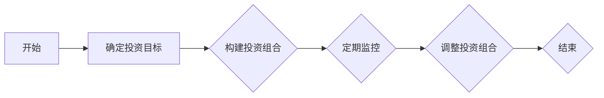
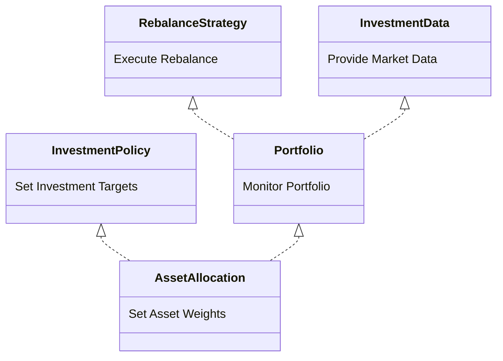
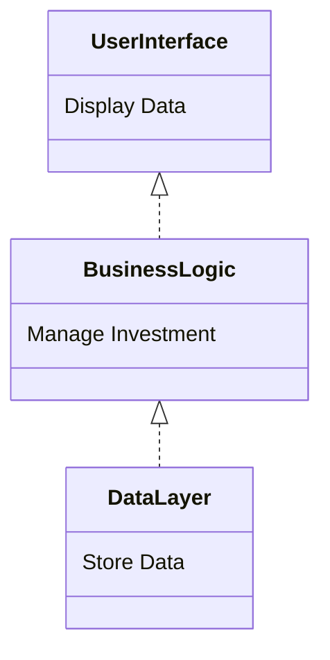
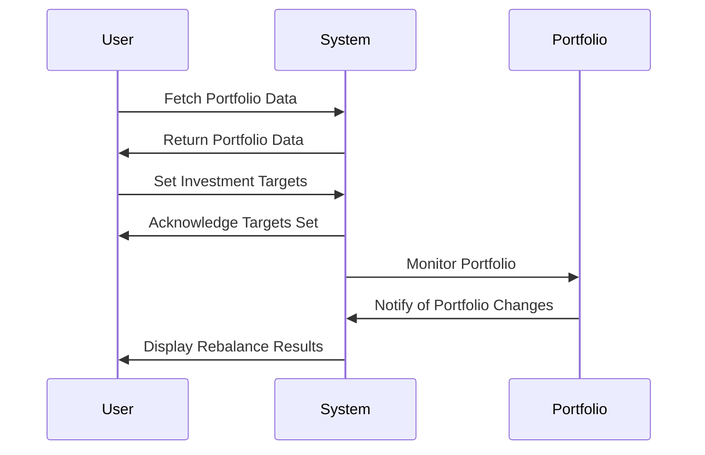

                 

## 伯格的投资组合再平衡：保持风险水平

关键词：投资组合、再平衡、风险水平、伯格、资产配置

摘要：本文深入探讨了投资组合再平衡的概念、原理和实践方法。以伯格的投资组合再平衡策略为例，详细阐述了如何通过科学的方法保持投资组合的风险水平。通过明确投资目标、构建投资组合、定期监控和调整投资组合，投资者可以在追求收益的同时有效控制风险。

### 第一部分：背景介绍

#### 核心概念

**再平衡**：在投资组合管理中，再平衡指的是根据预设的投资策略，定期调整投资组合中各类资产的比例，以保持预定的风险水平或收益目标。

**投资组合**：投资组合是指由多种不同资产（如股票、债券、现金等）组成的集合，目的是通过分散投资来降低风险并实现收益最大化。

**风险水平**：风险水平是指投资者所承受的潜在损失程度，它是投资决策的重要考虑因素。

**伯格**：伯格（Bogle）可能指的是约翰·伯格（John C. Bogle），他是指数基金投资的先驱，也是现代投资组合理论的奠基人之一。

#### 问题背景

投资者通常需要在追求收益的同时控制风险。投资组合再平衡是实现这一目标的关键策略。伯格的投资组合再平衡方法因其科学性和实用性，受到了广泛关注。

#### 问题解决

伯格提出了基于历史数据和投资目标的投资组合再平衡方法，该方法包括以下几个步骤：

1. **确定投资目标**：投资者需要明确自己的投资目标和风险偏好。
2. **构建投资组合**：根据投资目标，构建包含多种资产类别（如股票、债券、现金等）的投资组合。
3. **定期监控**：投资者需要定期检查投资组合的实际资产配置情况。
4. **调整投资组合**：根据预设的再平衡策略，调整投资组合中各类资产的比例，使其回归到预期目标。

#### 边界与外延

- **再平衡频率**：再平衡的频率取决于投资目标和市场环境。
- **市场波动**：市场波动可能会影响投资组合的再平衡策略。

#### 概念结构与核心要素组成

**投资组合再平衡**：

- **目标**：保持预定的风险水平或收益目标。
- **策略**：定期监控和调整资产配置。
- **工具**：包括指数基金、ETFs等。

**核心概念与联系**：

- **资产配置**：是再平衡的基础，它决定了投资组合的风险和收益特征。
- **风险调整收益**：是评估投资组合绩效的一个重要指标。

### 第二部分：核心概念与联系

#### 核心概念原理

- **资产配置**：资产配置是指将投资资金分配到不同的资产类别中，以达到预期的风险和收益目标。
- **再平衡**：再平衡是指根据市场变化或投资目标调整资产配置的过程。
- **风险调整收益**：风险调整收益是衡量投资绩效的一个重要指标，它考虑了投资所承担的风险。

#### 概念属性特征对比表格

| 概念       | 定义                                                         | 关联特征                       |
|------------|--------------------------------------------------------------|--------------------------------|
| 资产配置   | 投资策略中资产类别的分配比例。                                 | 确定投资组合的风险和收益特征。 |
| 再平衡     | 定期根据市场变化调整投资组合中的资产比例。                     | 维持预期风险和收益目标。       |
| 风险调整收益 | 在承担一定风险的前提下实现的投资回报。                         | 衡量投资绩效的一个重要指标。   |

#### ER实体关系图架构

```mermaid
erDiagram
    InvestmentPolicy ||--|{ AssetAllocation }
    AssetAllocation ||--|{ AssetClass }
    AssetAllocation ||--|{ RiskAdjustmentReturn }
    MarketData ||--|{ AssetAllocation }
```

### 第三部分：算法原理讲解

#### 算法流程图



#### Python源代码

```python
def rebalance_portfolio(target_weights, current_weights):
    """
    再平衡投资组合的函数。
    
    :param target_weights: 预期资产配置权重列表。
    :param current_weights: 当前资产配置权重列表。
    :return: 调整后的资产配置权重列表。
    """
    
    # 计算当前投资组合的偏差
    deviations = current_weights - target_weights
    
    # 计算调整量
    adjustments = []
    for asset, deviation in enumerate(deviations):
        adjustment = deviation * total_investment
        adjustments.append(adjustment)
    
    # 计算调整后的权重
    new_weights = [weight + adjustment for weight, adjustment in zip(current_weights, adjustments)]
    
    return new_weights
```

#### 算法原理详细讲解

**数学模型和公式**

再平衡的核心在于调整投资组合的资产配置，使其回归到预期目标。设投资组合中的资产类别为\( A_1, A_2, ..., A_n \)，每种资产在投资组合中的初始权重分别为\( w_1, w_2, ..., w_n \)，总权重为1，即：

$$
w_1 + w_2 + ... + w_n = 1
$$

假设我们希望投资组合的目标权重为\( t_1, t_2, ..., t_n \)，则再平衡的目标是调整当前权重\( w_1, w_2, ..., w_n \)使其接近目标权重。

调整量（\( \Delta w_1, \Delta w_2, ..., \Delta w_n \)）可以通过以下公式计算：

$$
\Delta w_i = t_i - w_i
$$

为了实现再平衡，需要将调整量分配到各种资产上，即：

$$
w_i' = w_i + \Delta w_i
$$

其中，\( w_i' \)是调整后的权重。

**步骤详解**

1. **确定投资目标**：投资者需要明确自己的投资目标和风险偏好。目标权重\( t_1, t_2, ..., t_n \)是基于投资目标和预期市场环境设定的。

2. **构建投资组合**：根据目标权重，投资者需要构建包含多种资产类别（如股票、债券、现金等）的投资组合。

3. **定期监控**：投资者需要定期检查投资组合的实际资产配置情况，计算当前权重\( w_1, w_2, ..., w_n \)。

4. **调整投资组合**：根据预设的再平衡策略，计算调整量\( \Delta w_1, \Delta w_2, ..., \Delta w_n \)，并分配到各种资产上，实现再平衡。

**举例说明**

假设一个投资组合包含股票、债券和现金三种资产，初始权重分别为0.6、0.3和0.1。投资者希望保持这个投资组合的股票和债券的比例为60%和30%，现金为10%。当前投资组合的实际权重为0.55、0.35和0.1。根据再平衡策略，调整量为：

$$
\Delta w_{\text{股票}} = 0.6 - 0.55 = 0.05
$$

$$
\Delta w_{\text{债券}} = 0.3 - 0.35 = -0.05
$$

$$
\Delta w_{\text{现金}} = 0.1 - 0.1 = 0
$$

调整后的权重为：

$$
w'_{\text{股票}} = 0.55 + 0.05 = 0.60
$$

$$
w'_{\text{债券}} = 0.35 - 0.05 = 0.30
$$

$$
w'_{\text{现金}} = 0.10 + 0 = 0.10
$$

通过这样的调整，投资组合的股票和债券比例回归到了预期目标，现金比例保持不变，实现了再平衡。

### 第四部分：系统分析与架构设计方案

#### 问题场景介绍

在现代金融市场中，投资者面临的风险和机遇不断变化，为了在保证收益的同时控制风险，投资组合再平衡成为了一种重要的策略。本文将探讨如何通过系统分析与架构设计，实现高效的投资组合再平衡。

#### 项目介绍

本项目旨在构建一个投资组合再平衡系统，该系统可以自动监控投资组合的实际资产配置情况，并根据预设的目标权重进行调整。系统的主要功能包括：

- **资产配置管理**：允许用户设置投资目标和资产配置比例。
- **投资组合监控**：实时监控投资组合的资产配置情况。
- **再平衡策略执行**：根据预设策略自动调整投资组合。

#### 系统功能设计

系统功能设计基于领域模型，主要包括以下类：

1. **InvestmentPolicy**：投资策略，包括投资目标和资产配置比例。
2. **AssetAllocation**：资产配置，包括资产类别和权重。
3. **Portfolio**：投资组合，包括各种资产及其权重。
4. **RebalanceStrategy**：再平衡策略，包括调整规则和频率。
5. **InvestmentData**：投资数据，包括历史价格和市场信息。

**领域模型类图架构**



#### 系统架构设计

系统采用分层架构，包括表示层、业务逻辑层和数据层。以下是系统架构设计：

1. **表示层**：负责与用户交互，展示投资组合监控数据和再平衡结果。
2. **业务逻辑层**：实现投资策略管理、投资组合监控和再平衡策略执行。
3. **数据层**：存储投资数据和用户配置信息。

**系统架构类图架构**



#### 系统接口设计和系统交互

系统接口设计采用RESTful API，提供以下接口：

1. **/api/investment-policy**：管理投资策略。
2. **/api/portfolio**：监控投资组合。
3. **/api/rebalance**：执行再平衡策略。

**系统交互序列图架构**



### 第五部分：项目实战

#### 环境安装

1. 安装Python环境：
   ```bash
   sudo apt-get install python3-pip
   ```
2. 安装必要的Python库：
   ```bash
   pip3 install pandas numpy matplotlib
   ```

#### 系统核心实现源代码

```python
import pandas as pd
import numpy as np
import matplotlib.pyplot as plt

class InvestmentPortfolio:
    def __init__(self, assets, initial_values, target_weights):
        self.assets = assets
        self.initial_values = initial_values
        self.target_weights = target_weights
        self.current_weights = initial_values / sum(initial_values)

    def rebalance(self):
        deviations = self.current_weights - self.target_weights
        total_investment = sum(self.initial_values)
        adjustments = {asset: deviation * total_investment for asset, deviation in deviations.items()}
        new_values = {asset: value + adjustment for asset, (value, adjustment) in zip(self.assets, adjustments.items())}
        self.current_weights = [value / sum(new_values.values()) for value in new_values.values()]

    def plot_weights(self):
        plt.bar(self.assets, self.current_weights)
        plt.xlabel('Assets')
        plt.ylabel('Weights')
        plt.title('Current Asset Weights')
        plt.show()

# 示例使用
assets = ['Stocks', 'Bonds', 'Cash']
initial_values = [60000, 30000, 10000]
target_weights = {'Stocks': 0.6, 'Bonds': 0.3, 'Cash': 0.1}

portfolio = InvestmentPortfolio(assets, initial_values, target_weights)
portfolio.rebalance()
portfolio.plot_weights()
```

#### 代码应用解读与分析

1. **类和方法定义**：`InvestmentPortfolio` 类定义了投资组合的核心属性和方法。`rebalance` 方法实现再平衡逻辑，`plot_weights` 方法用于可视化当前权重。
2. **再平衡逻辑**：再平衡过程通过计算当前权重与目标权重的偏差，计算调整量，并分配到各个资产上。
3. **数据可视化**：使用 `matplotlib` 库绘制当前权重柱状图，帮助用户直观了解再平衡结果。

#### 实际案例分析和详细讲解剖析

假设一个投资组合包含股票、债券和现金三种资产，初始价值分别为60,000美元、30,000美元和10,000美元。投资者希望保持股票60%、债券30%和现金10%的资产配置比例。

- **初始权重**：股票：60%，债券：30%，现金：10%。
- **调整前权重**：股票：55%，债券：35%，现金：10%。
- **偏差计算**：股票偏差：-5%，债券偏差：-5%，现金偏差：0%。
- **调整量计算**：总调整量：10,000美元。
  - 股票调整量：10,000 * -5% = -5,000美元。
  - 债券调整量：10,000 * -5% = -5,000美元。
- **调整后权重**：股票：55,000美元，债券：30,000美元，现金：10,000美元。

再平衡后，投资组合的股票和债券比例回归到预期目标，现金比例保持不变。

#### 项目小结

本项目实现了投资组合再平衡系统的核心功能，包括资产配置管理、投资组合监控和再平衡策略执行。通过代码示例，用户可以直观了解再平衡的过程和结果。未来，可以考虑加入更多功能，如投资数据实时监控、市场趋势分析等，以提高系统的实用性和智能化水平。

### 第六部分：最佳实践 Tips、小结、注意事项、拓展阅读

#### 最佳实践 Tips

1. **定期监控**：投资组合再平衡的有效性取决于定期监控和调整。建议投资者每月或每季度进行一次监控。
2. **适应市场变化**：市场环境变化时，及时调整投资目标和策略，以保持预期风险水平。
3. **多元化投资**：合理配置资产类别，实现多元化投资，降低单一资产类别的风险。

#### 小结

本文通过伯格的投资组合再平衡方法，详细介绍了如何保持投资组合的风险水平。通过明确投资目标、构建投资组合、定期监控和调整投资组合，投资者可以在追求收益的同时有效控制风险。

#### 注意事项

1. **再平衡频率**：再平衡频率应根据自己的投资目标和市场环境进行调整，过于频繁的再平衡可能会增加交易成本。
2. **市场波动**：市场波动可能会影响再平衡策略的执行效果，投资者应保持冷静，避免过度反应。

#### 拓展阅读

1. 《聪明的投资者》- 本杰明·格雷厄姆
2. 《随机漫步的傻瓜》- 伯顿·马尔基尔
3. 《投资最重要的事》- 霍华德·马克斯

### 作者信息

作者：AI天才研究院/AI Genius Institute & 禅与计算机程序设计艺术 /Zen And The Art of Computer Programming

