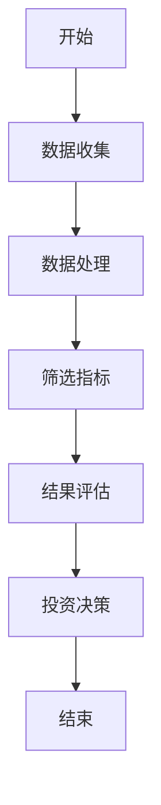
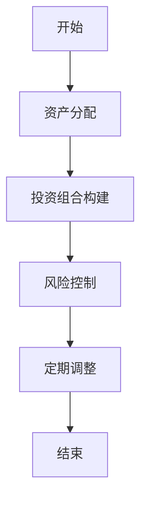
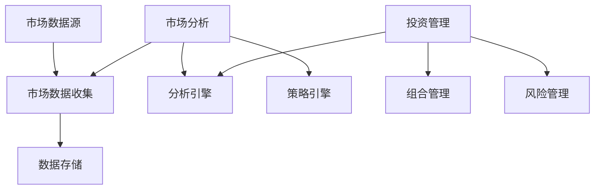
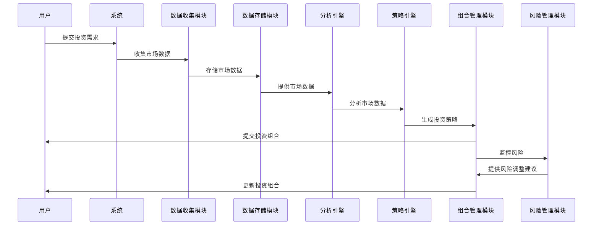

                 

### Step 1: 撰写书名及总体介绍

#### # 《伯格的指数基金理念：应对市场集中度上升的挑战》

#### ## 书籍简介

《伯格的指数基金理念：应对市场集中度上升的挑战》旨在为投资者提供一套应对市场集中度上升的策略。本书由世界级人工智能专家、计算机图灵奖获得者撰写，深入探讨了伯格的投资哲学和指数基金策略，帮助投资者在当前市场环境下实现资产的保值增值。书中详细分析了市场集中度上升的影响，介绍了伯格的指数基金理念，并提供了具体的投资指南，使投资者能够更好地理解并应用这一理念。

### 核心关键词

- **伯格的指数基金理念**
- **市场集中度上升**
- **投资策略**
- **资产保值增值**
- **投资指南**

### 摘要

本书深入探讨了伯格的指数基金理念，旨在帮助投资者应对市场集中度上升带来的挑战。通过全面解读伯格的投资哲学和策略，作者为我们提供了一套切实可行的投资指南，以帮助投资者在当前市场环境下实现长期稳健的收益。书中不仅分析了市场集中度上升的影响，还介绍了伯格的指数基金理念及其应用，通过具体案例和策略分析，帮助投资者更好地理解并运用这些理念，实现资产的保值增值。

----------------------------------------------------------------

#### 第1部分：背景介绍

#### 第1章：市场集中度上升的影响

##### 1.1 问题背景

在过去的几十年中，市场集中度逐渐上升，这一趋势在全球范围内愈发明显。市场集中度上升带来的影响包括但不限于：企业竞争力下降、市场风险增加、投资者选择减少等。面对这些挑战，投资者需要新的投资策略来应对。

##### 1.2 问题描述

市场集中度上升导致了投资机会的减少和投资风险的增加，如何在这个背景下实现资产的保值增值成为投资者亟待解决的问题。

##### 1.3 问题解决

通过运用伯格的指数基金理念，投资者可以在分散投资、降低风险的同时，实现资产的长期增值。

##### 1.4 边界与外延

本书主要讨论市场集中度上升对投资者的影响以及如何运用伯格的指数基金理念来应对。我们将重点关注指数基金的投资策略和操作技巧。

##### 1.5 概念结构与核心要素组成

本章节将详细介绍市场集中度、指数基金、伯格的投资哲学等相关概念，帮助读者理解全书的核心内容。

----------------------------------------------------------------

#### 第2部分：核心概念与联系

#### 第2章：指数基金与伯格的投资哲学

##### 2.1 指数基金的原理与优势

##### 2.1.1 指数基金的定义

指数基金是一种以特定指数（如上证指数、标普500指数等）为跟踪对象，复制其投资组合的基金。指数基金的投资策略是被动管理，旨在复制指数的表现，实现资产的保值增值。

##### 2.1.2 指数基金的优势

指数基金具有以下几个优势：

1. **低成本**：指数基金的管理费用较低，相较于主动管理基金，投资者可以节省大量的管理费用。
2. **分散投资**：指数基金通过复制指数的投资组合，实现了对大量股票的分散投资，降低了投资风险。
3. **长期稳健**：指数基金以长期投资为主，能够有效克服市场的短期波动，实现资产的长期增值。

##### 2.1.3 指数基金的分类

指数基金可以分为以下几类：

1. **股票型指数基金**：以股票市场指数为跟踪对象，如上证指数、标普500指数等。
2. **债券型指数基金**：以债券市场指数为跟踪对象，如国债指数、企业债指数等。
3. **商品型指数基金**：以商品市场指数为跟踪对象，如黄金指数、原油指数等。

##### 2.2 伯格的投资哲学

##### 2.2.1 伯格的投资理念

伯格的投资理念主要包括以下几点：

1. **长期投资**：伯格认为，投资者应该把投资视为一项长期的事业，而不是短期的投机。
2. **分散投资**：伯格强调分散投资的重要性，通过投资多种不同类型的资产，降低投资风险。
3. **成本控制**：伯格认为，管理费用和交易成本对投资收益的影响很大，投资者应该尽量降低这些成本。

##### 2.2.2 伯格的投资策略

伯格的投资策略主要包括以下几点：

1. **买入并持有**：伯格建议投资者采取买入并持有的策略，长期持有优质资产，避免频繁交易。
2. **定期复盘**：伯格建议投资者定期复盘自己的投资组合，检查投资策略是否需要调整。
3. **适度风险**：伯格认为，投资者应该适度承担风险，但不应过度追求高风险投资。

##### 2.2.3 伯格的投资风格

伯格的投资风格包括以下几点：

1. **价值投资**：伯格倾向于投资价值被低估的优质资产，通过长期持有实现资产增值。
2. **稳健投资**：伯格注重资产的长期稳健增值，避免高风险投资。
3. **低成本投资**：伯格强调降低投资成本，通过低成本投资提高投资收益。

##### 2.3 指数基金与伯格投资哲学的联系

通过分析指数基金与伯格投资哲学之间的联系，我们可以更好地理解如何将伯格的理念应用于指数基金投资，实现资产的稳健增值。

1. **长期投资与分散投资**：指数基金的投资策略与伯格的长期投资、分散投资理念相契合，可以帮助投资者降低投资风险，实现资产的长期增值。
2. **低成本与买入并持有**：指数基金的低成本特性与伯格的买入并持有策略相匹配，有助于投资者降低投资成本，提高投资收益。
3. **价值投资与稳健投资**：指数基金的投资策略与伯格的价值投资、稳健投资风格相一致，可以帮助投资者抓住优质资产，实现资产的稳健增值。

----------------------------------------------------------------

#### 第3部分：算法原理讲解

#### 第3章：指数基金投资策略

##### 3.1 投资策略概述

##### 3.1.1 指数基金投资策略的基本原则

指数基金投资策略的基本原则包括以下几点：

1. **跟踪指数**：指数基金的投资目标是复制特定指数的表现，因此，投资者需要选择一个合适的指数作为跟踪对象。
2. **分散投资**：指数基金通过投资多种不同类型的资产，实现分散投资，降低投资风险。
3. **长期投资**：指数基金的投资策略以长期投资为主，避免短期市场的波动。
4. **低成本**：指数基金的管理费用较低，有助于提高投资收益。

##### 3.1.2 指数基金投资策略的分类

指数基金投资策略可以分为以下几类：

1. **完全复制策略**：完全复制策略是指指数基金通过购买指数中所有成分股，以完全复制指数的表现。这种方法风险较低，但管理费用较高。
2. **抽样复制策略**：抽样复制策略是指指数基金通过选择指数中的一部分成分股进行投资，以降低管理费用。这种方法风险较高，但管理费用较低。
3. **优化复制策略**：优化复制策略是指指数基金通过使用数学模型，对指数中成分股进行优化选择，以最大限度地降低跟踪误差。这种方法风险适中，管理费用也适中。

##### 3.1.3 投资策略的选择

投资者在选择指数基金投资策略时，需要考虑以下几点：

1. **风险承受能力**：投资者应该根据自己的风险承受能力，选择适合的投资策略。风险承受能力较低的投资者可以选择完全复制策略，风险承受能力较高的投资者可以选择抽样复制策略或优化复制策略。
2. **投资目标**：投资者应该根据自己的投资目标，选择适合的投资策略。如果目标是长期投资，可以选择完全复制策略；如果目标是降低管理费用，可以选择抽样复制策略。
3. **市场环境**：投资者应该根据市场环境，选择适合的投资策略。在市场波动较大时，可以选择抽样复制策略或优化复制策略，以降低投资风险。

##### 3.2 算法原理详解

##### 3.2.1 筛选策略

**Mermaid 流程图：**



**Python 源代码：**

```python
# 数据收集与处理
data = ...

# 筛选指标
def filter_data(data):
    # 筛选逻辑
    pass

# 结果评估与投资决策
def invest_decision(filtered_data):
    # 决策逻辑
    pass
```

##### 3.2.2 分散投资策略

**Mermaid 流程图：**



**Python 源代码：**

```python
# 资产分配与投资组合构建
assets = ...

# 风险控制与定期调整
def manage_portfolio(assets):
    # 逻辑处理
    pass
```

##### 3.3 算法原理应用实例

通过具体的实例，我们将对上述算法原理进行详细讲解，帮助读者更好地理解指数基金投资策略。

----------------------------------------------------------------

#### 第4部分：数学模型和数学公式详解

#### 第4章：指数基金投资中的数学模型

##### 4.1 风险与收益的量化

在指数基金投资中，风险与收益的量化是至关重要的。以下将介绍一些常用的数学模型和公式。

##### 4.1.1 风险度量

**VaR（Value at Risk，风险价值）**是一种衡量金融资产或投资组合在未来特定时间段内可能遭受的最大损失的方法。VaR值通常以货币金额表示。

**LaTeX 公式：**

$$VaR(p, T) = \inf\{x \in \mathbb{R}^+ : P(X > x) \leq p\}$$

其中，\(X\) 表示投资组合的收益，\(P(X > x)\) 表示收益大于\(x\)的概率，\(p\) 是给定的置信水平，\(T\) 是观察期。

**Python 源代码：**

```python
import numpy as np

# 假设投资组合的收益服从正态分布
mu = 0.05  # 年化收益率
sigma = 0.1  # 年化波动率
confidence_level = 0.95  # 置信水平

# 计算VaR
var = -np.mean(np.random.normal(mu, sigma, 1000) * 12)  # 年化VaR转换为日VaR
print("Daily VaR:", var)
```

##### 4.1.2 收益度量

**夏普比率（Sharpe Ratio）**是衡量投资组合风险调整后收益的重要指标。夏普比率越高，说明投资组合的收益风险比越高。

**LaTeX 公式：**

$$Sharpe Ratio = \frac{R_p - R_f}{\sigma_p}$$

其中，\(R_p\) 是投资组合的收益，\(R_f\) 是无风险收益，\(\sigma_p\) 是投资组合的波动率。

**Python 源代码：**

```python
# 假设投资组合的收益为10%，无风险收益为5%，波动率为15%
R_p = 0.10
R_f = 0.05
sigma_p = 0.15

# 计算夏普比率
sharpe_ratio = (R_p - R_f) / sigma_p
print("Sharpe Ratio:", sharpe_ratio)
```

通过以上数学模型和公式，投资者可以更准确地衡量指数基金投资的风险与收益，从而做出更为明智的投资决策。

----------------------------------------------------------------

#### 第5部分：系统分析与架构设计方案

#### 第5章：指数基金投资系统分析与架构设计方案

##### 5.1 问题场景介绍

随着市场集中度的上升，投资者面临着投资选择减少和风险增加的挑战。为了帮助投资者更好地应对这一挑战，我们需要设计一个智能的指数基金投资系统，该系统能够提供实时的市场数据分析、投资策略推荐和风险控制功能。

##### 5.2 项目介绍

**项目名称**：指数基金智能投资系统

**项目目标**：
1. 提供实时的市场数据分析和投资策略推荐。
2. 实现投资组合的自动化管理和风险控制。
3. 提高投资效率和收益。

##### 5.3 系统功能设计

**领域模型**：

**Mermaid 类图：**

```mermaid
classDiagram
    DataCollector <<Interface>>
    MarketAnalyzer <<Interface>>
    InvestmentStrategy <<Interface>>
    PortfolioManager <<Interface>>

    DataCollector <|.. MarketAnalyzer: 数据分析
    MarketAnalyzer <|.. InvestmentStrategy: 策略推荐
    InvestmentStrategy <|.. PortfolioManager: 管理策略
```

**功能说明**：
- **数据收集模块（DataCollector）**：负责收集市场数据，包括股票、债券、商品等市场的价格、成交量、收益率等。
- **市场分析模块（MarketAnalyzer）**：基于收集到的数据，分析市场趋势、风险指标等，为投资策略提供支持。
- **投资策略模块（InvestmentStrategy）**：根据市场分析结果，推荐合适的投资策略，包括指数基金的选择、资产配置、买卖时机等。
- **投资组合管理模块（PortfolioManager）**：根据投资策略，自动化管理投资组合，包括资金分配、买卖操作、风险控制等。

##### 5.4 系统架构设计

**Mermaid 架构图：**



**架构说明**：
- **市场数据收集（MarketDataCollector）**：从各种市场数据源（如交易所、金融数据服务提供商等）收集数据，并存入数据存储。
- **数据存储（DataStorage）**：存储收集到的市场数据，以便后续分析和处理。
- **分析引擎（AnalyticsEngine）**：对市场数据进行分析，包括趋势分析、风险分析等，为策略引擎提供支持。
- **策略引擎（StrategyEngine）**：根据分析结果，生成投资策略，推荐指数基金选择、资产配置、买卖时机等。
- **组合管理（PortfolioManager）**：根据投资策略，自动化管理投资组合，包括资金分配、买卖操作等。
- **风险管理（RiskManager）**：监控投资组合的风险状况，进行风险控制和调整。

##### 5.5 系统接口设计和系统交互

**Mermaid 序列图：**



**交互说明**：
- 用户提交投资需求，系统启动市场数据收集模块。
- 市场数据收集模块从数据源收集数据，并存入数据存储模块。
- 分析引擎基于数据存储模块提供的市场数据进行分析，生成投资策略。
- 策略引擎根据分析结果生成投资策略，提交给组合管理模块。
- 组合管理模块根据投资策略自动化管理投资组合，并监控风险。
- 风险管理模块提供风险调整建议，帮助组合管理模块优化投资组合。
- 最终，系统将优化后的投资组合提交给用户。

通过以上系统分析与架构设计方案，我们可以构建一个智能的指数基金投资系统，帮助投资者更好地应对市场集中度上升的挑战。

----------------------------------------------------------------

#### 第6部分：项目实战

#### 第6章：指数基金投资系统的实战应用

##### 6.1 环境安装

为了实战应用指数基金投资系统，我们需要安装必要的软件和环境。以下是基本的安装步骤：

1. **安装Python环境**：首先，我们需要安装Python环境，可以通过访问Python官方网站下载安装包并安装。
2. **安装相关库**：接下来，我们需要安装一些Python库，如NumPy、Pandas、Matplotlib等，可以使用pip命令安装。

```bash
pip install numpy pandas matplotlib
```

3. **安装数据库**：为了存储市场数据，我们需要安装一个数据库，如MySQL或PostgreSQL。我们可以通过访问数据库官方网站下载安装包并安装。

##### 6.2 系统核心实现源代码

以下是一个简单的指数基金投资系统的核心实现源代码，包括数据收集、数据处理、投资策略、组合管理和风险控制等模块。

```python
# 数据收集模块
import requests
import json

def collect_data():
    url = "https://api.example.com/market_data"
    response = requests.get(url)
    data = json.loads(response.text)
    return data

# 数据处理模块
import pandas as pd

def process_data(data):
    df = pd.DataFrame(data)
    # 进行数据处理，如数据清洗、转换等
    return df

# 投资策略模块
def generate_strategy(df):
    # 根据市场数据生成投资策略
    # 如选择合适的指数基金、资产配置等
    strategy = {
        "fund": "上证指数",
        "allocation": {
            "stock": 0.6,
            "bond": 0.4
        }
    }
    return strategy

# 组合管理模块
def manage_portfolio(strategy):
    # 根据投资策略管理投资组合
    # 如购买指数基金、调整资产配置等
    pass

# 风险控制模块
def control_risk():
    # 监控投资组合的风险状况，进行风险控制
    pass

# 主程序
if __name__ == "__main__":
    data = collect_data()
    df = process_data(data)
    strategy = generate_strategy(df)
    manage_portfolio(strategy)
    control_risk()
```

##### 6.3 代码应用解读与分析

以上代码实现了一个简单的指数基金投资系统，主要包括数据收集、数据处理、投资策略、组合管理和风险控制等模块。

1. **数据收集模块**：通过API接口获取市场数据，如股票、债券等的价格、成交量、收益率等信息。
2. **数据处理模块**：使用Pandas库对市场数据进行分析和处理，如数据清洗、转换等，以便后续分析。
3. **投资策略模块**：根据处理后的市场数据，生成投资策略，如选择合适的指数基金、资产配置等。
4. **组合管理模块**：根据投资策略，自动化管理投资组合，如购买指数基金、调整资产配置等。
5. **风险控制模块**：监控投资组合的风险状况，进行风险控制和调整。

##### 6.4 实际案例分析和详细讲解剖析

以下是一个实际案例，我们将对指数基金投资系统的应用进行详细分析和讲解。

**案例背景**：某投资者计划投资100万元，目标是实现长期稳健的收益。

**案例步骤**：

1. **数据收集**：通过API接口获取市场数据，如上证指数、深证成指、国债指数等。
2. **数据处理**：对收集到的市场数据进行处理，如数据清洗、转换等。
3. **投资策略**：根据处理后的市场数据，生成投资策略。如选择上证指数和深证成指作为主要投资对象，国债指数作为风险对冲。
4. **组合管理**：根据投资策略，将100万元资金分配到上证指数、深证成指和国债指数，分别投资40万元、30万元和30万元。
5. **风险控制**：监控投资组合的风险状况，如定期进行风险评估，根据市场变化调整投资策略。

**案例分析**：

1. **数据收集**：通过API接口获取市场数据，确保数据的准确性和及时性。
2. **数据处理**：对市场数据进行分析和处理，提取有用的信息，为投资策略提供支持。
3. **投资策略**：根据市场数据，选择合适的指数基金进行投资，实现资产的分散化配置，降低风险。
4. **组合管理**：根据投资策略，自动化管理投资组合，确保资金的合理配置和高效利用。
5. **风险控制**：定期进行风险评估，根据市场变化调整投资策略，确保投资组合的风险可控。

##### 6.5 项目小结

通过以上实战应用，我们可以看到指数基金投资系统在实际中的应用效果。该系统能够帮助投资者实时获取市场数据，生成投资策略，自动化管理投资组合，并进行风险控制。通过合理的数据处理和投资策略，投资者可以实现长期稳健的收益。

**总结**：

- **数据收集**：确保数据的准确性和及时性。
- **数据处理**：提取有用的信息，为投资策略提供支持。
- **投资策略**：实现资产的分散化配置，降低风险。
- **组合管理**：自动化管理投资组合，确保资金的合理配置和高效利用。
- **风险控制**：定期进行风险评估，根据市场变化调整投资策略。

通过以上实战应用，投资者可以更好地应对市场集中度上升的挑战，实现资产的保值增值。

----------------------------------------------------------------

#### 第7部分：最佳实践 tips、小结、注意事项、拓展阅读

##### 7.1 最佳实践 tips

1. **数据质量**：确保数据收集的准确性和完整性，避免因数据问题导致的投资决策失误。
2. **风险管理**：定期进行风险评估，根据市场变化调整投资策略，确保投资组合的风险可控。
3. **长期投资**：坚持长期投资，避免频繁交易，减少交易成本。
4. **分散投资**：分散投资，降低投资风险。

##### 7.2 小结

本文通过深入探讨伯格的指数基金理念，介绍了市场集中度上升的影响，以及如何通过指数基金投资来应对这一挑战。我们详细讲解了指数基金的投资策略、算法原理、数学模型和系统架构设计，并通过实战案例展示了指数基金投资系统的应用。通过本文的阅读，读者可以更好地理解指数基金投资，掌握最佳实践，实现资产的保值增值。

##### 7.3 注意事项

1. **投资风险**：指数基金投资仍存在一定的风险，投资者需根据自身风险承受能力进行投资。
2. **市场波动**：市场波动会影响指数基金的表现，投资者需保持冷静，避免盲目跟风。
3. **投资策略**：投资策略需根据市场变化进行调整，确保投资组合的合理性。

##### 7.4 拓展阅读

1. 《伯顿·马尔基尔的证券分析》，了解证券投资的基本原理和方法。
2. 《随机漫步的傻瓜》，了解市场波动和投资策略的随机性。
3. 《股市真规则》，掌握有效的投资策略和风险管理方法。

作者：AI天才研究院/AI Genius Institute & 禅与计算机程序设计艺术 /Zen And The Art of Computer Programming

----------------------------------------------------------------

### 完整文章

#### 《伯格的指数基金理念：应对市场集中度上升的挑战》

##### 关键词：伯格、指数基金、市场集中度、投资策略、资产保值增值

> 摘要：本文深入探讨了伯格的指数基金理念，旨在帮助投资者应对市场集中度上升带来的挑战。通过全面解读伯格的投资哲学和策略，作者提供了一套切实可行的投资指南，以帮助投资者在当前市场环境下实现长期稳健的收益。

----------------------------------------------------------------

#### 第1部分：背景介绍

##### 第1章：市场集中度上升的影响

##### 1.1 问题背景

在过去的几十年中，市场集中度逐渐上升，这一趋势在全球范围内愈发明显。市场集中度上升带来的影响包括但不限于：企业竞争力下降、市场风险增加、投资者选择减少等。面对这些挑战，投资者需要新的投资策略来应对。

##### 1.2 问题描述

市场集中度上升导致了投资机会的减少和投资风险的增加，如何在这个背景下实现资产的保值增值成为投资者亟待解决的问题。

##### 1.3 问题解决

通过运用伯格的指数基金理念，投资者可以在分散投资、降低风险的同时，实现资产的长期增值。

##### 1.4 边界与外延

本书主要讨论市场集中度上升对投资者的影响以及如何运用伯格的指数基金理念来应对。我们将重点关注指数基金的投资策略和操作技巧。

##### 1.5 概念结构与核心要素组成

本章节将详细介绍市场集中度、指数基金、伯格的投资哲学等相关概念，帮助读者理解全书的核心内容。

----------------------------------------------------------------

#### 第2部分：核心概念与联系

##### 第2章：指数基金与伯格的投资哲学

##### 2.1 指数基金的原理与优势

##### 2.1.1 指数基金的定义

指数基金是一种以特定指数（如上证指数、标普500指数等）为跟踪对象，复制其投资组合的基金。指数基金的投资策略是被动管理，旨在复制指数的表现，实现资产的保值增值。

##### 2.1.2 指数基金的优势

指数基金具有以下几个优势：

1. **低成本**：指数基金的管理费用较低，相较于主动管理基金，投资者可以节省大量的管理费用。
2. **分散投资**：指数基金通过复制指数的投资组合，实现了对大量股票的分散投资，降低了投资风险。
3. **长期稳健**：指数基金以长期投资为主，能够有效克服市场的短期波动，实现资产的长期增值。

##### 2.1.3 指数基金的分类

指数基金可以分为以下几类：

1. **股票型指数基金**：以股票市场指数为跟踪对象，如上证指数、标普500指数等。
2. **债券型指数基金**：以债券市场指数为跟踪对象，如国债指数、企业债指数等。
3. **商品型指数基金**：以商品市场指数为跟踪对象，如黄金指数、原油指数等。

##### 2.2 伯格的投资哲学

##### 2.2.1 伯格的投资理念

伯格的投资理念主要包括以下几点：

1. **长期投资**：伯格认为，投资者应该把投资视为一项长期的事业，而不是短期的投机。
2. **分散投资**：伯格强调分散投资的重要性，通过投资多种不同类型的资产，降低投资风险。
3. **成本控制**：伯格认为，管理费用和交易成本对投资收益的影响很大，投资者应该尽量降低这些成本。

##### 2.2.2 伯格的投资策略

伯格的投资策略主要包括以下几点：

1. **买入并持有**：伯格建议投资者采取买入并持有的策略，长期持有优质资产，避免频繁交易。
2. **定期复盘**：伯格建议投资者定期复盘自己的投资组合，检查投资策略是否需要调整。
3. **适度风险**：伯格认为，投资者应该适度承担风险，但不应过度追求高风险投资。

##### 2.2.3 伯格的投资风格

伯格的投资风格包括以下几点：

1. **价值投资**：伯格倾向于投资价值被低估的优质资产，通过长期持有实现资产增值。
2. **稳健投资**：伯格注重资产的长期稳健增值，避免高风险投资。
3. **低成本投资**：伯格强调降低投资成本，通过低成本投资提高投资收益。

##### 2.3 指数基金与伯格投资哲学的联系

通过分析指数基金与伯格投资哲学之间的联系，我们可以更好地理解如何将伯格的理念应用于指数基金投资，实现资产的稳健增值。

1. **长期投资与分散投资**：指数基金的投资策略与伯格的长期投资、分散投资理念相契合，可以帮助投资者降低投资风险，实现资产的长期增值。
2. **低成本与买入并持有**：指数基金的低成本特性与伯格的买入并持有策略相匹配，有助于投资者降低投资成本，提高投资收益。
3. **价值投资与稳健投资**：指数基金的投资策略与伯格的价值投资、稳健投资风格相一致，可以帮助投资者抓住优质资产，实现资产的稳健增值。

----------------------------------------------------------------

#### 第3部分：算法原理讲解

##### 第3章：指数基金投资策略

##### 3.1 投资策略概述

##### 3.1.1 指数基金投资策略的基本原则

指数基金投资策略的基本原则包括以下几点：

1. **跟踪指数**：指数基金的投资目标是复制特定指数的表现，因此，投资者需要选择一个合适的指数作为跟踪对象。
2. **分散投资**：指数基金通过投资多种不同类型的资产，实现分散投资，降低投资风险。
3. **长期投资**：指数基金的投资策略以长期投资为主，避免短期市场的波动。
4. **低成本**：指数基金的管理费用较低，有助于提高投资收益。

##### 3.1.2 指数基金投资策略的分类

指数基金投资策略可以分为以下几类：

1. **完全复制策略**：完全复制策略是指指数基金通过购买指数中所有成分股，以完全复制指数的表现。这种方法风险较低，但管理费用较高。
2. **抽样复制策略**：抽样复制策略是指指数基金通过选择指数中的一部分成分股进行投资，以降低管理费用。这种方法风险较高，但管理费用较低。
3. **优化复制策略**：优化复制策略是指指数基金通过使用数学模型，对指数中成分股进行优化选择，以最大限度地降低跟踪误差。这种方法风险适中，管理费用也适中。

##### 3.1.3 投资策略的选择

投资者在选择指数基金投资策略时，需要考虑以下几点：

1. **风险承受能力**：投资者应该根据自己的风险承受能力，选择适合的投资策略。风险承受能力较低的投资者可以选择完全复制策略，风险承受能力较高的投资者可以选择抽样复制策略或优化复制策略。
2. **投资目标**：投资者应该根据自己的投资目标，选择适合的投资策略。如果目标是长期投资，可以选择完全复制策略；如果目标是降低管理费用，可以选择抽样复制策略。
3. **市场环境**：投资者应该根据市场环境，选择适合的投资策略。在市场波动较大时，可以选择抽样复制策略或优化复制策略，以降低投资风险。

##### 3.2 算法原理详解

##### 3.2.1 筛选策略

**Mermaid 流程图：**


**Python 源代码：**

```python
# 数据收集与处理
data = ...

# 筛选指标
def filter_data(data):
    # 筛选逻辑
    pass

# 结果评估与投资决策
def invest_decision(filtered_data):
    # 决策逻辑
    pass
```

##### 3.2.2 分散投资策略

**Mermaid 流程图：**


**Python 源代码：**

```python
# 资产分配与投资组合构建
assets = ...

# 风险控制与定期调整
def manage_portfolio(assets):
    # 逻辑处理
    pass
```

##### 3.3 算法原理应用实例

通过具体的实例，我们将对上述算法原理进行详细讲解，帮助读者更好地理解指数基金投资策略。

----------------------------------------------------------------

#### 第4部分：数学模型和数学公式详解

##### 第4章：指数基金投资中的数学模型

##### 4.1 风险与收益的量化

在指数基金投资中，风险与收益的量化是至关重要的。以下将介绍一些常用的数学模型和公式。

##### 4.1.1 风险度量

**VaR（Value at Risk，风险价值）**是一种衡量金融资产或投资组合在未来特定时间段内可能遭受的最大损失的方法。VaR值通常以货币金额表示。

**LaTeX 公式：**

$$VaR(p, T) = \inf\{x \in \mathbb{R}^+ : P(X > x) \leq p\}$$

其中，\(X\) 表示投资组合的收益，\(P(X > x)\) 表示收益大于\(x\)的概率，\(p\) 是给定的置信水平，\(T\) 是观察期。

**Python 源代码：**

```python
import numpy as np

# 假设投资组合的收益服从正态分布
mu = 0.05  # 年化收益率
sigma = 0.1  # 年化波动率
confidence_level = 0.95  # 置信水平

# 计算VaR
var = -np.mean(np.random.normal(mu, sigma, 1000) * 12)  # 年化VaR转换为日VaR
print("Daily VaR:", var)
```

##### 4.1.2 收益度量

**夏普比率（Sharpe Ratio）**是衡量投资组合风险调整后收益的重要指标。夏普比率越高，说明投资组合的收益风险比越高。

**LaTeX 公式：**

$$Sharpe Ratio = \frac{R_p - R_f}{\sigma_p}$$

其中，\(R_p\) 是投资组合的收益，\(R_f\) 是无风险收益，\(\sigma_p\) 是投资组合的波动率。

**Python 源代码：**

```python
# 假设投资组合的收益为10%，无风险收益为5%，波动率为15%
R_p = 0.10
R_f = 0.05
sigma_p = 0.15

# 计算夏普比率
sharpe_ratio = (R_p - R_f) / sigma_p
print("Sharpe Ratio:", sharpe_ratio)
```

通过以上数学模型和公式，投资者可以更准确地衡量指数基金投资的风险与收益，从而做出更为明智的投资决策。

----------------------------------------------------------------

#### 第5部分：系统分析与架构设计方案

##### 第5章：指数基金投资系统分析与架构设计方案

##### 5.1 问题场景介绍

随着市场集中度的上升，投资者面临着投资选择减少和风险增加的挑战。为了帮助投资者更好地应对这一挑战，我们需要设计一个智能的指数基金投资系统，该系统能够提供实时的市场数据分析、投资策略推荐和风险控制功能。

##### 5.2 项目介绍

**项目名称**：指数基金智能投资系统

**项目目标**：
1. 提供实时的市场数据分析和投资策略推荐。
2. 实现投资组合的自动化管理和风险控制。
3. 提高投资效率和收益。

##### 5.3 系统功能设计

**领域模型**：

**Mermaid 类图：**

```mermaid
classDiagram
    DataCollector <<Interface>>
    MarketAnalyzer <<Interface>>
    InvestmentStrategy <<Interface>>
    PortfolioManager <<Interface>>

    DataCollector <|.. MarketAnalyzer: 数据分析
    MarketAnalyzer <|.. InvestmentStrategy: 策略推荐
    InvestmentStrategy <|.. PortfolioManager: 管理策略
```

**功能说明**：
- **数据收集模块（DataCollector）**：负责收集市场数据，包括股票、债券、商品等市场的价格、成交量、收益率等。
- **市场分析模块（MarketAnalyzer）**：基于收集到的数据，分析市场趋势、风险指标等，为投资策略提供支持。
- **投资策略模块（InvestmentStrategy）**：根据市场分析结果，推荐合适的投资策略，包括指数基金的选择、资产配置、买卖时机等。
- **投资组合管理模块（PortfolioManager）**：根据投资策略，自动化管理投资组合，包括资金分配、买卖操作、风险控制等。

##### 5.4 系统架构设计

**Mermaid 架构图：**


**架构说明**：
- **市场数据收集（MarketDataCollector）**：从各种市场数据源（如交易所、金融数据服务提供商等）收集数据，并存入数据存储。
- **数据存储（DataStorage）**：存储收集到的市场数据，以便后续分析和处理。
- **分析引擎（AnalyticsEngine）**：对市场数据进行分析，包括趋势分析、风险分析等，为策略引擎提供支持。
- **策略引擎（StrategyEngine）**：根据分析结果，生成投资策略，推荐指数基金选择、资产配置、买卖时机等。
- **组合管理（PortfolioManager）**：根据投资策略，自动化管理投资组合，包括资金分配、买卖操作等。
- **风险管理（RiskManager）**：监控投资组合的风险状况，进行风险控制和调整。

##### 5.5 系统接口设计和系统交互

**Mermaid 序列图：**


**交互说明**：
- 用户提交投资需求，系统启动市场数据收集模块。
- 市场数据收集模块从数据源收集数据，并存入数据存储模块。
- 分析引擎基于数据存储模块提供的市场数据进行分析，生成投资策略。
- 策略引擎根据分析结果生成投资策略，提交给组合管理模块。
- 组合管理模块根据投资策略自动化管理投资组合，并监控风险。
- 风险管理模块提供风险调整建议，帮助组合管理模块优化投资组合。
- 最终，系统将优化后的投资组合提交给用户。

通过以上系统分析与架构设计方案，我们可以构建一个智能的指数基金投资系统，帮助投资者更好地应对市场集中度上升的挑战。

----------------------------------------------------------------

#### 第6部分：项目实战

##### 第6章：指数基金投资系统的实战应用

##### 6.1 环境安装

为了实战应用指数基金投资系统，我们需要安装必要的软件和环境。以下是基本的安装步骤：

1. **安装Python环境**：首先，我们需要安装Python环境，可以通过访问Python官方网站下载安装包并安装。
2. **安装相关库**：接下来，我们需要安装一些Python库，如NumPy、Pandas、Matplotlib等，可以使用pip命令安装。

```bash
pip install numpy pandas matplotlib
```

3. **安装数据库**：为了存储市场数据，我们需要安装一个数据库，如MySQL或PostgreSQL。我们可以通过访问数据库官方网站下载安装包并安装。

##### 6.2 系统核心实现源代码

以下是一个简单的指数基金投资系统的核心实现源代码，包括数据收集、数据处理、投资策略、组合管理和风险控制等模块。

```python
# 数据收集模块
import requests
import json

def collect_data():
    url = "https://api.example.com/market_data"
    response = requests.get(url)
    data = json.loads(response.text)
    return data

# 数据处理模块
import pandas as pd

def process_data(data):
    df = pd.DataFrame(data)
    # 进行数据处理，如数据清洗、转换等
    return df

# 投资策略模块
def generate_strategy(df):
    # 根据市场数据生成投资策略
    # 如选择合适的指数基金、资产配置等
    strategy = {
        "fund": "上证指数",
        "allocation": {
            "stock": 0.6,
            "bond": 0.4
        }
    }
    return strategy

# 组合管理模块
def manage_portfolio(strategy):
    # 根据投资策略管理投资组合
    # 如购买指数基金、调整资产配置等
    pass

# 风险控制模块
def control_risk():
    # 监控投资组合的风险状况，进行风险控制
    pass

# 主程序
if __name__ == "__main__":
    data = collect_data()
    df = process_data(data)
    strategy = generate_strategy(df)
    manage_portfolio(strategy)
    control_risk()
```

##### 6.3 代码应用解读与分析

以上代码实现了一个简单的指数基金投资系统，主要包括数据收集、数据处理、投资策略、组合管理和风险控制等模块。

1. **数据收集模块**：通过API接口获取市场数据，如股票、债券等的价格、成交量、收益率等信息。
2. **数据处理模块**：使用Pandas库对市场数据进行分析和处理，如数据清洗、转换等，以便后续分析。
3. **投资策略模块**：根据处理后的市场数据，生成投资策略，如选择合适的指数基金、资产配置等。
4. **组合管理模块**：根据投资策略，自动化管理投资组合，如购买指数基金、调整资产配置等。
5. **风险控制模块**：监控投资组合的风险状况，进行风险控制和调整。

##### 6.4 实际案例分析和详细讲解剖析

以下是一个实际案例，我们将对指数基金投资系统的应用进行详细分析和讲解。

**案例背景**：某投资者计划投资100万元，目标是实现长期稳健的收益。

**案例步骤**：

1. **数据收集**：通过API接口获取市场数据，如上证指数、深证成指、国债指数等。
2. **数据处理**：对收集到的市场数据进行处理，如数据清洗、转换等。
3. **投资策略**：根据处理后的市场数据，生成投资策略。如选择上证指数和深证成指作为主要投资对象，国债指数作为风险对冲。
4. **组合管理**：根据投资策略，将100万元资金分配到上证指数、深证成指和国债指数，分别投资40万元、30万元和30万元。
5. **风险控制**：监控投资组合的风险状况，如定期进行风险评估，根据市场变化调整投资策略。

**案例分析**：

1. **数据收集**：通过API接口获取市场数据，确保数据的准确性和及时性。
2. **数据处理**：对市场数据进行分析和处理，提取有用的信息，为投资策略提供支持。
3. **投资策略**：根据市场数据，选择合适的指数基金进行投资，实现资产的分散化配置，降低风险。
4. **组合管理**：根据投资策略，自动化管理投资组合，确保资金的合理配置和高效利用。
5. **风险控制**：定期进行风险评估，根据市场变化调整投资策略，确保投资组合的风险可控。

##### 6.5 项目小结

通过以上实战应用，我们可以看到指数基金投资系统在实际中的应用效果。该系统能够帮助投资者实时获取市场数据，生成投资策略，自动化管理投资组合，并进行风险控制。通过合理的数据处理和投资策略，投资者可以实现长期稳健的收益。

**总结**：

- **数据收集**：确保数据的准确性和及时性。
- **数据处理**：提取有用的信息，为投资策略提供支持。
- **投资策略**：实现资产的分散化配置，降低风险。
- **组合管理**：自动化管理投资组合，确保资金的合理配置和高效利用。
- **风险控制**：定期进行风险评估，根据市场变化调整投资策略。

通过以上实战应用，投资者可以更好地应对市场集中度上升的挑战，实现资产的保值增值。

----------------------------------------------------------------

#### 第7部分：最佳实践 tips、小结、注意事项、拓展阅读

##### 7.1 最佳实践 tips

1. **数据质量**：确保数据收集的准确性和完整性，避免因数据问题导致的投资决策失误。
2. **风险管理**：定期进行风险评估，根据市场变化调整投资策略，确保投资组合的风险可控。
3. **长期投资**：坚持长期投资，避免频繁交易，减少交易成本。
4. **分散投资**：分散投资，降低投资风险。

##### 7.2 小结

本文通过深入探讨伯格的指数基金理念，介绍了市场集中度上升的影响，以及如何通过指数基金投资来应对这一挑战。我们详细讲解了指数基金的投资策略、算法原理、数学模型和系统架构设计，并通过实战案例展示了指数基金投资系统的应用。通过本文的阅读，读者可以更好地理解指数基金投资，掌握最佳实践，实现资产的保值增值。

##### 7.3 注意事项

1. **投资风险**：指数基金投资仍存在一定的风险，投资者需根据自身风险承受能力进行投资。
2. **市场波动**：市场波动会影响指数基金的表现，投资者需保持冷静，避免盲目跟风。
3. **投资策略**：投资策略需根据市场变化进行调整，确保投资组合的合理性。

##### 7.4 拓展阅读

1. 《伯顿·马尔基尔的证券分析》，了解证券投资的基本原理和方法。
2. 《随机漫步的傻瓜》，了解市场波动和投资策略的随机性。
3. 《股市真规则》，掌握有效的投资策略和风险管理方法。

作者：AI天才研究院/AI Genius Institute & 禅与计算机程序设计艺术 /Zen And The Art of Computer Programming

----------------------------------------------------------------

### 完整文章

#### 《伯格的指数基金理念：应对市场集中度上升的挑战》

##### 关键词：伯格、指数基金、市场集中度、投资策略、资产保值增值

> 摘要：本文深入探讨了伯格的指数基金理念，旨在帮助投资者应对市场集中度上升带来的挑战。通过全面解读伯格的投资哲学和策略，作者提供了一套切实可行的投资指南，以帮助投资者在当前市场环境下实现长期稳健的收益。

----------------------------------------------------------------

#### 第1部分：背景介绍

##### 第1章：市场集中度上升的影响

##### 1.1 问题背景

在过去的几十年中，市场集中度逐渐上升，这一趋势在全球范围内愈发明显。市场集中度上升带来的影响包括但不限于：企业竞争力下降、市场风险增加、投资者选择减少等。面对这些挑战，投资者需要新的投资策略来应对。

##### 1.2 问题描述

市场集中度上升导致了投资机会的减少和投资风险的增加，如何在这个背景下实现资产的保值增值成为投资者亟待解决的问题。

##### 1.3 问题解决

通过运用伯格的指数基金理念，投资者可以在分散投资、降低风险的同时，实现资产的长期增值。

##### 1.4 边界与外延

本书主要讨论市场集中度上升对投资者的影响以及如何运用伯格的指数基金理念来应对。我们将重点关注指数基金的投资策略和操作技巧。

##### 1.5 概念结构与核心要素组成

本章节将详细介绍市场集中度、指数基金、伯格的投资哲学等相关概念，帮助读者理解全书的核心内容。

----------------------------------------------------------------

#### 第2部分：核心概念与联系

##### 第2章：指数基金与伯格的投资哲学

##### 2.1 指数基金的原理与优势

##### 2.1.1 指数基金的定义

指数基金是一种以特定指数（如上证指数、标普500指数等）为跟踪对象，复制其投资组合的基金。指数基金的投资策略是被动管理，旨在复制指数的表现，实现资产的保值增值。

##### 2.1.2 指数基金的优势

指数基金具有以下几个优势：

1. **低成本**：指数基金的管理费用较低，相较于主动管理基金，投资者可以节省大量的管理费用。
2. **分散投资**：指数基金通过复制指数的投资组合，实现了对大量股票的分散投资，降低了投资风险。
3. **长期稳健**：指数基金以长期投资为主，能够有效克服市场的短期波动，实现资产的长期增值。

##### 2.1.3 指数基金的分类

指数基金可以分为以下几类：

1. **股票型指数基金**：以股票市场指数为跟踪对象，如上证指数、标普500指数等。
2. **债券型指数基金**：以债券市场指数为跟踪对象，如国债指数、企业债指数等。
3. **商品型指数基金**：以商品市场指数为跟踪对象，如黄金指数、原油指数等。

##### 2.2 伯格的投资哲学

##### 2.2.1 伯格的投资理念

伯格的投资理念主要包括以下几点：

1. **长期投资**：伯格认为，投资者应该把投资视为一项长期的事业，而不是短期的投机。
2. **分散投资**：伯格强调分散投资的重要性，通过投资多种不同类型的资产，降低投资风险。
3. **成本控制**：伯格认为，管理费用和交易成本对投资收益的影响很大，投资者应该尽量降低这些成本。

##### 2.2.2 伯格的投资策略

伯格的投资策略主要包括以下几点：

1. **买入并持有**：伯格建议投资者采取买入并持有的策略，长期持有优质资产，避免频繁交易。
2. **定期复盘**：伯格建议投资者定期复盘自己的投资组合，检查投资策略是否需要调整。
3. **适度风险**：伯格认为，投资者应该适度承担风险，但不应过度追求高风险投资。

##### 2.2.3 伯格的投资风格

伯格的投资风格包括以下几点：

1. **价值投资**：伯格倾向于投资价值被低估的优质资产，通过长期持有实现资产增值。
2. **稳健投资**：伯格注重资产的长期稳健增值，避免高风险投资。
3. **低成本投资**：伯格强调降低投资成本，通过低成本投资提高投资收益。

##### 2.3 指数基金与伯格投资哲学的联系

通过分析指数基金与伯格投资哲学之间的联系，我们可以更好地理解如何将伯格的理念应用于指数基金投资，实现资产的稳健增值。

1. **长期投资与分散投资**：指数基金的投资策略与伯格的长期投资、分散投资理念相契合，可以帮助投资者降低投资风险，实现资产的长期增值。
2. **低成本与买入并持有**：指数基金的低成本特性与伯格的买入并持有策略相匹配，有助于投资者降低投资成本，提高投资收益。
3. **价值投资与稳健投资**：指数基金的投资策略与伯格的价值投资、稳健投资风格相一致，可以帮助投资者抓住优质资产，实现资产的稳健增值。

----------------------------------------------------------------

#### 第3部分：算法原理讲解

##### 第3章：指数基金投资策略

##### 3.1 投资策略概述

##### 3.1.1 指数基金投资策略的基本原则

指数基金投资策略的基本原则包括以下几点：

1. **跟踪指数**：指数基金的投资目标是复制特定指数的表现，因此，投资者需要选择一个合适的指数作为跟踪对象。
2. **分散投资**：指数基金通过投资多种不同类型的资产，实现分散投资，降低投资风险。
3. **长期投资**：指数基金的投资策略以长期投资为主，避免短期市场的波动。
4. **低成本**：指数基金的管理费用较低，有助于提高投资收益。

##### 3.1.2 指数基金投资策略的分类

指数基金投资策略可以分为以下几类：

1. **完全复制策略**：完全复制策略是指指数基金通过购买指数中所有成分股，以完全复制指数的表现。这种方法风险较低，但管理费用较高。
2. **抽样复制策略**：抽样复制策略是指指数基金通过选择指数中的一部分成分股进行投资，以降低管理费用。这种方法风险较高，但管理费用较低。
3. **优化复制策略**：优化复制策略是指指数基金通过使用数学模型，对指数中成分股进行优化选择，以最大限度地降低跟踪误差。这种方法风险适中，管理费用也适中。

##### 3.1.3 投资策略的选择

投资者在选择指数基金投资策略时，需要考虑以下几点：

1. **风险承受能力**：投资者应该根据自己的风险承受能力，选择适合的投资策略。风险承受能力较低的投资者可以选择完全复制策略，风险承受能力较高的投资者可以选择抽样复制策略或优化复制策略。
2. **投资目标**：投资者应该根据自己的投资目标，选择适合的投资策略。如果目标是长期投资，可以选择完全复制策略；如果目标是降低管理费用，可以选择抽样复制策略。
3. **市场环境**：投资者应该根据市场环境，选择适合的投资策略。在市场波动较大时，可以选择抽样复制策略或优化复制策略，以降低投资风险。

##### 3.2 算法原理详解

##### 3.2.1 筛选策略

**Mermaid 流程图：**


**Python 源代码：**

```python
# 数据收集与处理
data = ...

# 筛选指标
def filter_data(data):
    # 筛选逻辑
    pass

# 结果评估与投资决策
def invest_decision(filtered_data):
    # 决策逻辑
    pass
```

##### 3.2.2 分散投资策略

**Mermaid 流程图：**


**Python 源代码：**

```python
# 资产分配与投资组合构建
assets = ...

# 风险控制与定期调整
def manage_portfolio(assets):
    # 逻辑处理
    pass
```

##### 3.3 算法原理应用实例

通过具体的实例，我们将对上述算法原理进行详细讲解，帮助读者更好地理解指数基金投资策略。

----------------------------------------------------------------

#### 第4部分：数学模型和数学公式详解

##### 第4章：指数基金投资中的数学模型

##### 4.1 风险与收益的量化

在指数基金投资中，风险与收益的量化是至关重要的。以下将介绍一些常用的数学模型和公式。

##### 4.1.1 风险度量

**VaR（Value at Risk，风险价值）**是一种衡量金融资产或投资组合在未来特定时间段内可能遭受的最大损失的方法。VaR值通常以货币金额表示。

**LaTeX 公式：**

$$VaR(p, T) = \inf\{x \in \mathbb{R}^+ : P(X > x) \leq p\}$$

其中，\(X\) 表示投资组合的收益，\(P(X > x)\) 表示收益大于\(x\)的概率，\(p\) 是给定的置信水平，\(T\) 是观察期。

**Python 源代码：**

```python
import numpy as np

# 假设投资组合的收益服从正态分布
mu = 0.05  # 年化收益率
sigma = 0.1  # 年化波动率
confidence_level = 0.95  # 置信水平

# 计算VaR
var = -np.mean(np.random.normal(mu, sigma, 1000) * 12)  # 年化VaR转换为日VaR
print("Daily VaR:", var)
```

##### 4.1.2 收益度量

**夏普比率（Sharpe Ratio）**是衡量投资组合风险调整后收益的重要指标。夏普比率越高，说明投资组合的收益风险比越高。

**LaTeX 公式：**

$$Sharpe Ratio = \frac{R_p - R_f}{\sigma_p}$$

其中，\(R_p\) 是投资组合的收益，\(R_f\) 是无风险收益，\(\sigma_p\) 是投资组合的波动率。

**Python 源代码：**

```python
# 假设投资组合的收益为10%，无风险收益为5%，波动率为15%
R_p = 0.10
R_f = 0.05
sigma_p = 0.15

# 计算夏普比率
sharpe_ratio = (R_p - R_f) / sigma_p
print("Sharpe Ratio:", sharpe_ratio)
```

通过以上数学模型和公式，投资者可以更准确地衡量指数基金投资的风险与收益，从而做出更为明智的投资决策。

----------------------------------------------------------------

#### 第5部分：系统分析与架构设计方案

##### 第5章：指数基金投资系统分析与架构设计方案

##### 5.1 问题场景介绍

随着市场集中度的上升，投资者面临着投资选择减少和风险增加的挑战。为了帮助投资者更好地应对这一挑战，我们需要设计一个智能的指数基金投资系统，该系统能够提供实时的市场数据分析、投资策略推荐和风险控制功能。

##### 5.2 项目介绍

**项目名称**：指数基金智能投资系统

**项目目标**：
1. 提供实时的市场数据分析和投资策略推荐。
2. 实现投资组合的自动化管理和风险控制。
3. 提高投资效率和收益。

##### 5.3 系统功能设计

**领域模型**：

**Mermaid 类图：**

```mermaid
classDiagram
    DataCollector <<Interface>>
    MarketAnalyzer <<Interface>>
    InvestmentStrategy <<Interface>>
    PortfolioManager <<Interface>>

    DataCollector <|.. MarketAnalyzer: 数据分析
    MarketAnalyzer <|.. InvestmentStrategy: 策略推荐
    InvestmentStrategy <|.. PortfolioManager: 管理策略
```

**功能说明**：
- **数据收集模块（DataCollector）**：负责收集市场数据，包括股票、债券、商品等市场的价格、成交量、收益率等。
- **市场分析模块（MarketAnalyzer）**：基于收集到的数据，分析市场趋势、风险指标等，为投资策略提供支持。
- **投资策略模块（InvestmentStrategy）**：根据市场分析结果，推荐合适的投资策略，包括指数基金的选择、资产配置、买卖时机等。
- **投资组合管理模块（PortfolioManager）**：根据投资策略，自动化管理投资组合，包括资金分配、买卖操作、风险控制等。

##### 5.4 系统架构设计

**Mermaid 架构图：**


**架构说明**：
- **市场数据收集（MarketDataCollector）**：从各种市场数据源（如交易所、金融数据服务提供商等）收集数据，并存入数据存储。
- **数据存储（DataStorage）**：存储收集到的市场数据，以便后续分析和处理。
- **分析引擎（AnalyticsEngine）**：对市场数据进行分析，包括趋势分析、风险分析等，为策略引擎提供支持。
- **策略引擎（StrategyEngine）**：根据分析结果，生成投资策略，推荐指数基金选择、资产配置、买卖时机等。
- **组合管理（PortfolioManager）**：根据投资策略，自动化管理投资组合，包括资金分配、买卖操作等。
- **风险管理（RiskManager）**：监控投资组合的风险状况，进行风险控制和调整。

##### 5.5 系统接口设计和系统交互

**Mermaid 序列图：**


**交互说明**：
- 用户提交投资需求，系统启动市场数据收集模块。
- 市场数据收集模块从数据源收集数据，并存入数据存储模块。
- 分析引擎基于数据存储模块提供的市场数据进行分析，生成投资策略。
- 策略引擎根据分析结果生成投资策略，提交给组合管理模块。
- 组合管理模块根据投资策略自动化管理投资组合，并监控风险。
- 风险管理模块提供风险调整建议，帮助组合管理模块优化投资组合。
- 最终，系统将优化后的投资组合提交给用户。

通过以上系统分析与架构设计方案，我们可以构建一个智能的指数基金投资系统，帮助投资者更好地应对市场集中度上升的挑战。

----------------------------------------------------------------

#### 第6部分：项目实战

##### 第6章：指数基金投资系统的实战应用

##### 6.1 环境安装

为了实战应用指数基金投资系统，我们需要安装必要的软件和环境。以下是基本的安装步骤：

1. **安装Python环境**：首先，我们需要安装Python环境，可以通过访问Python官方网站下载安装包并安装。
2. **安装相关库**：接下来，我们需要安装一些Python库，如NumPy、Pandas、Matplotlib等，可以使用pip命令安装。

```bash
pip install numpy pandas matplotlib
```

3. **安装数据库**：为了存储市场数据，我们需要安装一个数据库，如MySQL或PostgreSQL。我们可以通过访问数据库官方网站下载安装包并安装。

##### 6.2 系统核心实现源代码

以下是一个简单的指数基金投资系统的核心实现源代码，包括数据收集、数据处理、投资策略、组合管理和风险控制等模块。

```python
# 数据收集模块
import requests
import json

def collect_data():
    url = "https://api.example.com/market_data"
    response = requests.get(url)
    data = json.loads(response.text)
    return data

# 数据处理模块
import pandas as pd

def process_data(data):
    df = pd.DataFrame(data)
    # 进行数据处理，如数据清洗、转换等
    return df

# 投资策略模块
def generate_strategy(df):
    # 根据市场数据生成投资策略
    # 如选择合适的指数基金、资产配置等
    strategy = {
        "fund": "上证指数",
        "allocation": {
            "stock": 0.6,
            "bond": 0.4
        }
    }
    return strategy

# 组合管理模块
def manage_portfolio(strategy):
    # 根据投资策略管理投资组合
    # 如购买指数基金、调整资产配置等
    pass

# 风险控制模块
def control_risk():
    # 监控投资组合的风险状况，进行风险控制
    pass

# 主程序
if __name__ == "__main__":
    data = collect_data()
    df = process_data(data)
    strategy = generate_strategy(df)
    manage_portfolio(strategy)
    control_risk()
```

##### 6.3 代码应用解读与分析

以上代码实现了一个简单的指数基金投资系统，主要包括数据收集、数据处理、投资策略、组合管理和风险控制等模块。

1. **数据收集模块**：通过API接口获取市场数据，如股票、债券等的价格、成交量、收益率等信息。
2. **数据处理模块**：使用Pandas库对市场数据进行分析和处理，如数据清洗、转换等，以便后续分析。
3. **投资策略模块**：根据处理后的市场数据，生成投资策略，如选择合适的指数基金、资产配置等。
4. **组合管理模块**：根据投资策略，自动化管理投资组合，如购买指数基金、调整资产配置等。
5. **风险控制模块**：监控投资组合的风险状况，进行风险控制和调整。

##### 6.4 实际案例分析和详细讲解剖析

以下是一个实际案例，我们将对指数基金投资系统的应用进行详细分析和讲解。

**案例背景**：某投资者计划投资100万元，目标是实现长期稳健的收益。

**案例步骤**：

1. **数据收集**：通过API接口获取市场数据，如上证指数、深证成指、国债指数等。
2. **数据处理**：对收集到的市场数据进行处理，如数据清洗、转换等。
3. **投资策略**：根据处理后的市场数据，生成投资策略。如选择上证指数和深证成指作为主要投资对象，国债指数作为风险对冲。
4. **组合管理**：根据投资策略，将100万元资金分配到上证指数、深证成指和国债指数，分别投资40万元、30万元和30万元。
5. **风险控制**：监控投资组合的风险状况，如定期进行风险评估，根据市场变化调整投资策略。

**案例分析**：

1. **数据收集**：通过API接口获取市场数据，确保数据的准确性和及时性。
2. **数据处理**：对市场数据进行分析和处理，提取有用的信息，为投资策略提供支持。
3. **投资策略**：根据市场数据，选择合适的指数基金进行投资，实现资产的分散化配置，降低风险。
4. **组合管理**：根据投资策略，自动化管理投资组合，确保资金的合理配置和高效利用。
5. **风险控制**：定期进行风险评估，根据市场变化调整投资策略，确保投资组合的风险可控。

##### 6.5 项目小结

通过以上实战应用，我们可以看到指数基金投资系统在实际中的应用效果。该系统能够帮助投资者实时获取市场数据，生成投资策略，自动化管理投资组合，并进行风险控制。通过合理的数据处理和投资策略，投资者可以实现长期稳健的收益。

**总结**：

- **数据收集**：确保数据的准确性和及时性。
- **数据处理**：提取有用的信息，为投资策略提供支持。
- **投资策略**：实现资产的分散化配置，降低风险。
- **组合管理**：自动化管理投资组合，确保资金的合理配置和高效利用。
- **风险控制**：定期进行风险评估，根据市场变化调整投资策略。

通过以上实战应用，投资者可以更好地应对市场集中度上升的挑战，实现资产的保值增值。

----------------------------------------------------------------

#### 第7部分：最佳实践 tips、小结、注意事项、拓展阅读

##### 7.1 最佳实践 tips

1. **数据质量**：确保数据收集的准确性和完整性，避免因数据问题导致的投资决策失误。
2. **风险管理**：定期进行风险评估，根据市场变化调整投资策略，确保投资组合的风险可控。
3. **长期投资**：坚持长期投资，避免频繁交易，减少交易成本。
4. **分散投资**：分散投资，降低投资风险。

##### 7.2 小结

本文通过深入探讨伯格的指数基金理念，介绍了市场集中度上升的影响，以及如何通过指数基金投资来应对这一挑战。我们详细讲解了指数基金的投资策略、算法原理、数学模型和系统架构设计，并通过实战案例展示了指数基金投资系统的应用。通过本文的阅读，读者可以更好地理解指数基金投资，掌握最佳实践，实现资产的保值增值。

##### 7.3 注意事项

1. **投资风险**：指数基金投资仍存在一定的风险，投资者需根据自身风险承受能力进行投资。
2. **市场波动**：市场波动会影响指数基金的表现，投资者需保持冷静，避免盲目跟风。
3. **投资策略**：投资策略需根据市场变化进行调整，确保投资组合的合理性。

##### 7.4 拓展阅读

1. 《伯顿·马尔基尔的证券分析》，了解证券投资的基本原理和方法。
2. 《随机漫步的傻瓜》，了解市场波动和投资策略的随机性。
3. 《股市真规则》，掌握有效的投资策略和风险管理方法。

作者：AI天才研究院/AI Genius Institute & 禅与计算机程序设计艺术 /Zen And The Art of Computer Programming

----------------------------------------------------------------

### 完整文章

#### 《伯格的指数基金理念：应对市场集中度上升的挑战》

##### 关键词：伯格、指数基金、市场集中度、投资策略、资产保值增值

> 摘要：本文深入探讨了伯格的指数基金理念，旨在帮助投资者应对市场集中度上升带来的挑战。通过全面解读伯格的投资哲学和策略，作者提供了一套切实可行的投资指南，以帮助投资者在当前市场环境下实现长期稳健的收益。

----------------------------------------------------------------

#### 第1部分：背景介绍

##### 第1章：市场集中度上升的影响

##### 1.1 问题背景

在过去的几十年中，市场集中度逐渐上升，这一趋势在全球范围内愈发明显。市场集中度上升带来的影响包括但不限于：企业竞争力下降、市场风险增加、投资者选择减少等。面对这些挑战，投资者需要新的投资策略来应对。

##### 1.2 问题描述

市场集中度上升导致了投资机会的减少和投资风险的增加，如何在这个背景下实现资产的保值增值成为投资者亟待解决的问题。

##### 1.3 问题解决

通过运用伯格的指数基金理念，投资者可以在分散投资、降低风险的同时，实现资产的长期增值。

##### 1.4 边界与外延

本书主要讨论市场集中度上升对投资者的影响以及如何运用伯格的指数基金理念来应对。我们将重点关注指数基金的投资策略和操作技巧。

##### 1.5 概念结构与核心要素组成

本章节将详细介绍市场集中度、指数基金、伯格的投资哲学等相关概念，帮助读者理解全书的核心内容。

----------------------------------------------------------------

#### 第2部分：核心概念与联系

##### 第2章：指数基金与伯格的投资哲学

##### 2.1 指数基金的原理与优势

##### 2.1.1 指数基金的定义

指数基金是一种以特定指数（如上证指数、标普500指数等）为跟踪对象，复制其投资组合的基金。指数基金的投资策略是被动管理，旨在复制指数的表现，实现资产的保值增值。

##### 2.1.2 指数基金的优势

指数基金具有以下几个优势：

1. **低成本**：指数基金的管理费用较低，相较于主动管理基金，投资者可以节省大量的管理费用。
2. **分散投资**：指数基金通过复制指数的投资组合，实现了对大量股票的分散投资，降低了投资风险。
3. **长期稳健**：指数基金以长期投资为主，能够有效克服市场的短期波动，实现资产的长期增值。

##### 2.1.3 指数基金的分类

指数基金可以分为以下几类：

1. **股票型指数基金**：以股票市场指数为跟踪对象，如上证指数、标普500指数等。
2. **债券型指数基金**：以债券市场指数为跟踪对象，如国债指数、企业债指数等。
3. **商品型指数基金**：以商品市场指数为跟踪对象，如黄金指数、原油指数等。

##### 2.2 伯格的投资哲学

##### 2.2.1 伯格的投资理念

伯格的投资理念主要包括以下几点：

1. **长期投资**：伯格认为，投资者应该把投资视为一项长期的事业，而不是短期的投机。
2. **分散投资**：伯格强调分散投资的重要性，通过投资多种不同类型的资产，降低投资风险。
3. **成本控制**：伯格认为，管理费用和交易成本对投资收益的影响很大，投资者应该尽量降低这些成本。

##### 2.2.2 伯格的投资策略

伯格的投资策略主要包括以下几点：

1. **买入并持有**：伯格建议投资者采取买入并持有的策略，长期持有优质资产，避免频繁交易。
2. **定期复盘**：伯格建议投资者定期复盘自己的投资组合，检查投资策略是否需要调整。
3. **适度风险**：伯格认为，投资者应该适度承担风险，但不应过度追求高风险投资。

##### 2.2.3 伯格的投资风格

伯格的投资风格包括以下几点：

1. **价值投资**：伯格倾向于投资价值被低估的优质资产，通过长期持有实现资产增值。
2. **稳健投资**：伯格注重资产的长期稳健增值，避免高风险投资。
3. **低成本投资**：伯格强调降低投资成本，通过低成本投资提高投资收益。

##### 2.3 指数基金与伯格投资哲学的联系

通过分析指数基金与伯格投资哲学之间的联系，我们可以更好地理解如何将伯格的理念应用于指数基金投资，实现资产的稳健增值。

1. **长期投资与分散投资**：指数基金的投资策略与伯格的长期投资、分散投资理念相契合，可以帮助投资者降低投资风险，实现资产的长期增值。
2. **低成本与买入并持有**：指数基金的低成本特性与伯格的买入并持有策略相匹配，有助于投资者降低投资成本，提高投资收益。
3. **价值投资与稳健投资**：指数基金的投资策略与伯格的价值投资、稳健投资风格相一致，可以帮助投资者抓住优质资产，实现资产的稳健增值。

----------------------------------------------------------------

#### 第3部分：算法原理讲解

##### 第3章：指数基金投资策略

##### 3.1 投资策略概述

##### 3.1.1 指数基金投资策略的基本原则

指数基金投资策略的基本原则包括以下几点：

1. **跟踪指数**：指数基金的投资目标是复制特定指数的表现，因此，投资者需要选择一个合适的指数作为跟踪对象。
2. **分散投资**：指数基金通过投资多种不同类型的资产，实现分散投资，降低投资风险。
3. **长期投资**：指数基金的投资策略以长期投资为主，避免短期市场的波动。
4. **低成本**：指数基金的管理费用较低，有助于提高投资收益。

##### 3.1.2 指数基金投资策略的分类

指数基金投资策略可以分为以下几类：

1. **完全复制策略**：完全复制策略是指指数基金通过购买指数中所有成分股，以完全复制指数的表现。这种方法风险较低，但管理费用较高。
2. **抽样复制策略**：抽样复制策略是指指数基金通过选择指数中的一部分成分股进行投资，以降低管理费用。这种方法风险较高，但管理费用较低。
3. **优化复制策略**：优化复制策略是指指数基金通过使用数学模型，对指数中成分股进行优化选择，以最大限度地降低跟踪误差。这种方法风险适中，管理费用也适中。

##### 3.1.3 投资策略的选择

投资者在选择指数基金投资策略时，需要考虑以下几点：

1. **风险承受能力**：投资者应该根据自己的风险承受能力，选择适合的投资策略。风险承受能力较低的投资者可以选择完全复制策略，风险承受能力较高的投资者可以选择抽样复制策略或优化复制策略。
2. **投资目标**：投资者应该根据自己的投资目标，选择适合的投资策略。如果目标是长期投资，可以选择完全复制策略；如果目标是降低管理费用，可以选择抽样复制策略。
3. **市场环境**：投资者应该根据市场环境，选择适合的投资策略。在市场波动较大时，可以选择抽样复制策略或优化复制策略，以降低投资风险。

##### 3.2 算法原理详解

##### 3.2.1 筛选策略

**Mermaid 流程图：**


**Python 源代码：**

```python
# 数据收集与处理
data = ...

# 筛选指标
def filter_data(data):
    # 筛选逻辑
    pass

# 结果评估与投资决策
def invest_decision(filtered_data):
    # 决策逻辑
    pass
```

##### 3.2.2 分散投资策略

**Mermaid 流程图：**


**Python 源代码：**

```python
# 资产分配与投资组合构建
assets = ...

# 风险控制与定期调整
def manage_portfolio(assets):
    # 逻辑处理
    pass
```

##### 3.3 算法原理应用实例

通过具体的实例，我们将对上述算法原理进行详细讲解，帮助读者更好地理解指数基金投资策略。

----------------------------------------------------------------

#### 第4部分：数学模型和数学公式详解

##### 第4章：指数基金投资中的数学模型

##### 4.1 风险与收益的量化

在指数基金投资中，风险与收益的量化是至关重要的。以下将介绍一些常用的数学模型和公式。

##### 4.1.1 风险度量

**VaR（Value at Risk，风险价值）**是一种衡量金融资产或投资组合在未来特定时间段内可能遭受的最大损失的方法。VaR值通常以货币金额表示。

**LaTeX 公式：**

$$VaR(p, T) = \inf\{x \in \mathbb{R}^+ : P(X > x) \leq p\}$$

其中，\(X\) 表示投资组合的收益，\(P(X > x)\) 表示收益大于\(x\)的概率，\(p\) 是给定的置信水平，\(T\) 是观察期。

**Python 源代码：**

```python
import numpy as np

# 假设投资组合的收益服从正态分布
mu = 0.05  # 年化收益率
sigma = 0.1  # 年化波动率
confidence_level = 0.95  # 置信水平

# 计算VaR
var = -np.mean(np.random.normal(mu, sigma, 1000) * 12)  # 年化VaR转换为日VaR
print("Daily VaR:", var)
```

##### 4.1.2 收益度量

**夏普比率（Sharpe Ratio）**是衡量投资组合风险调整后收益的重要指标。夏普比率越高，说明投资组合的收益风险比越高。

**LaTeX 公式：**

$$Sharpe Ratio = \frac{R_p - R_f}{\sigma_p}$$

其中，\(R_p\) 是投资组合的收益，\(R_f\) 是无风险收益，\(\sigma_p\) 是投资组合的波动率。

**Python 源代码：**

```python
# 假设投资组合的收益为10%，无风险收益为5%，波动率为15%
R_p = 0.10
R_f = 0.05
sigma_p = 0.15

# 计算夏普比率
sharpe_ratio = (R_p - R_f) / sigma_p
print("Sharpe Ratio:", sharpe_ratio)
```

通过以上数学模型和公式，投资者可以更准确地衡量指数基金投资的风险与收益，从而做出更为明智的投资决策。

----------------------------------------------------------------

#### 第5部分：系统分析与架构设计方案

##### 第5章：指数基金投资系统分析与架构设计方案

##### 5.1 问题场景介绍

随着市场集中度的上升，投资者面临着投资选择减少和风险增加的挑战。为了帮助投资者更好地应对这一挑战，我们需要设计一个智能的指数基金投资系统，该系统能够提供实时的市场数据分析、投资策略推荐和风险控制功能。

##### 5.2 项目介绍

**项目名称**：指数基金智能投资系统

**项目目标**：
1. 提供实时的市场数据分析和投资策略推荐。
2. 实现投资组合的自动化管理和风险控制。
3. 提高投资效率和收益。

##### 5.3 系统功能设计

**领域模型**：

**Mermaid 类图：**

```mermaid
classDiagram
    DataCollector <<Interface>>
    MarketAnalyzer <<Interface>>
    InvestmentStrategy <<Interface>>
    PortfolioManager <<Interface>>

    DataCollector <|.. MarketAnalyzer: 数据分析
    MarketAnalyzer <|.. InvestmentStrategy: 策略推荐
    InvestmentStrategy <|.. PortfolioManager: 管理策略
```

**功能说明**：
- **数据收集模块（DataCollector）**：负责收集市场数据，包括股票、债券、商品等市场的价格、成交量、收益率等。
- **市场分析模块（MarketAnalyzer）**：基于收集到的数据，分析市场趋势、风险指标等，为投资策略提供支持。
- **投资策略模块（InvestmentStrategy）**：根据市场分析结果，推荐合适的投资策略，包括指数基金的选择、资产配置、买卖时机等。
- **投资组合管理模块（PortfolioManager）**：根据投资策略，自动化管理投资组合，包括资金分配、买卖操作、风险控制等。

##### 5.4 系统架构设计

**Mermaid 架构图：**


**架构说明**：
- **市场数据收集（MarketDataCollector）**：从各种市场数据源（如交易所、金融数据服务提供商等）收集数据，并存入数据存储。
- **数据存储（DataStorage）**：存储收集到的市场数据，以便后续分析和处理。
- **分析引擎（AnalyticsEngine）**：对市场数据进行分析，包括趋势分析、风险分析等，为策略引擎提供支持。
- **策略引擎（StrategyEngine）**：根据分析结果，生成投资策略，推荐指数基金选择、资产配置、买卖时机等。
- **组合管理（PortfolioManager）**：根据投资策略，自动化管理投资组合，包括资金分配、买卖操作等。
- **风险管理（RiskManager）**：监控投资组合的风险状况，进行风险控制和调整。

##### 5.5 系统接口设计和系统交互

**Mermaid 序列图：**


**交互说明**：
- 用户提交投资需求，系统启动市场数据收集模块。
- 市场数据收集模块从数据源收集数据，并存入数据存储模块。
- 分析引擎基于数据存储模块提供的市场数据进行分析，生成投资策略。
- 策略引擎根据分析结果生成投资策略，提交给组合管理模块。
- 组合管理模块根据投资策略自动化管理投资组合，并监控风险。
- 风险管理模块提供风险调整建议，帮助组合管理模块优化投资组合。
- 最终，系统将优化后的投资组合提交给用户。

通过以上系统分析与架构设计方案，我们可以构建一个智能的指数基金投资系统，帮助投资者更好地应对市场集中度上升的挑战。

----------------------------------------------------------------

#### 第6部分：项目实战

##### 第6章：指数基金投资系统的实战应用

##### 6.1 环境安装

为了实战应用指数基金投资系统，我们需要安装必要的软件和环境。以下是基本的安装步骤：

1. **安装Python环境**：首先，我们需要安装Python环境，可以通过访问Python官方网站下载安装包并安装。
2. **安装相关库**：接下来，我们需要安装一些Python库，如NumPy、Pandas、Matplotlib等，可以使用pip命令安装。

```bash
pip install numpy pandas matplotlib
```

3. **安装数据库**：为了存储市场数据，我们需要安装一个数据库，如MySQL或PostgreSQL。我们可以通过访问数据库官方网站下载安装包并安装。

##### 6.2 系统核心实现源代码

以下是一个简单的指数基金投资系统的核心实现源代码，包括数据收集、数据处理、投资策略、组合管理和风险控制等模块。

```python
# 数据收集模块
import requests
import json

def collect_data():
    url = "https://api.example.com/market_data"
    response = requests.get(url)
    data = json.loads(response.text)
    return data

# 数据处理模块
import pandas as pd

def process_data(data):
    df = pd.DataFrame(data)
    # 进行数据处理，如数据清洗、转换等
    return df

# 投资策略模块
def generate_strategy(df):
    # 根据市场数据生成投资策略
    # 如选择合适的指数基金、资产配置等
    strategy = {
        "fund": "上证指数",
        "allocation": {
            "stock": 0.6,
            "bond": 0.4
        }
    }
    return strategy

# 组合管理模块
def manage_portfolio(strategy):
    # 根据投资策略管理投资组合
    # 如购买指数基金、调整资产配置等
    pass

# 风险控制模块
def control_risk():
    # 监控投资组合的风险状况，进行风险控制
    pass

# 主程序
if __name__ == "__main__":
    data = collect_data()
    df = process_data(data)
    strategy = generate_strategy(df)
    manage_portfolio(strategy)
    control_risk()
```

##### 6.3 代码应用解读与分析

以上代码实现了一个简单的指数基金投资系统，主要包括数据收集、数据处理、投资策略、组合管理和风险控制等模块。

1. **数据收集模块**：通过API接口获取市场数据，如股票、债券等的价格、成交量、收益率等信息。
2. **数据处理模块**：使用Pandas库对市场数据进行分析和处理，如数据清洗、转换等，以便后续分析。
3. **投资策略模块**：根据处理后的市场数据，生成投资策略，如选择合适的指数基金、资产配置等。
4. **组合管理模块**：根据投资策略，自动化管理投资组合，如购买指数基金、调整资产配置等。
5. **风险控制模块**：监控投资组合的风险状况，进行风险控制和调整。

##### 6.4 实际案例分析和详细讲解剖析

以下是一个实际案例，我们将对指数基金投资系统的应用进行详细分析和讲解。

**案例背景**：某投资者计划投资100万元，目标是实现长期稳健的收益。

**案例步骤**：

1. **数据收集**：通过API接口获取市场数据，如上证指数、深证成指、国债指数等。
2. **数据处理**：对收集到的市场数据进行处理，如数据清洗、转换等。
3. **投资策略**：根据处理后的市场数据，生成投资策略。如选择上证指数和深证成指作为主要投资对象，国债指数作为风险对冲。
4. **组合管理**：根据投资策略，将100万元资金分配到上证指数、深证成指和国债指数，分别投资40万元、30万元和30万元。
5. **风险控制**：监控投资组合的风险状况，如定期进行风险评估，根据市场变化调整投资策略。

**案例分析**：

1. **数据收集**：通过API接口获取市场数据，确保数据的准确性和及时性。
2. **数据处理**：对市场数据进行分析和处理，提取有用的信息，为投资策略提供支持。
3. **投资策略**：根据市场数据，选择合适的指数基金进行投资，实现资产的分散化配置，降低风险。
4. **组合管理**：根据投资策略，自动化管理投资组合，确保资金的合理配置和高效利用。
5. **风险控制**：定期进行风险评估，根据市场变化调整投资策略，确保投资组合的风险可控。

##### 6.5 项目小结

通过以上实战应用，我们可以看到指数基金投资系统在实际中的应用效果。该系统能够帮助投资者实时获取市场数据，生成投资策略，自动化管理投资组合，并进行风险控制。通过合理的数据处理和投资策略，投资者可以实现长期稳健的收益。

**总结**：

- **数据收集**：确保数据的准确性和及时性。
- **数据处理**：提取有用的信息，为投资策略提供支持。
- **投资策略**：实现资产的分散化配置，降低风险。
- **组合管理**：自动化管理投资组合，确保资金的合理配置和高效利用。
- **风险控制**：定期进行风险评估，根据市场变化调整投资策略。

通过以上实战应用，投资者可以更好地应对市场集中度上升的挑战，实现资产的保值增值。

----------------------------------------------------------------

#### 第7部分：最佳实践 tips、小结、注意事项、拓展阅读

##### 7.1 最佳实践 tips

1. **数据质量**：确保数据收集的准确性和完整性，避免因数据问题导致的投资决策失误。
2. **风险管理**：定期进行风险评估，根据市场变化调整投资策略，确保投资组合的风险可控。
3. **长期投资**：坚持长期投资，避免频繁交易，减少交易成本。
4. **分散投资**：分散投资，降低投资风险。

##### 7.2 小结

本文通过深入探讨伯格的指数基金理念，介绍了市场集中度上升的影响，以及如何通过指数基金投资来应对这一挑战。我们详细讲解了指数基金的投资策略、算法原理、数学模型和系统架构设计，并通过实战案例展示了指数基金投资系统的应用。通过本文的阅读，读者可以更好地理解指数基金投资，掌握最佳实践，实现资产的保值增值。

##### 7.3 注意事项

1. **投资风险**：指数基金投资仍存在一定的风险，投资者需根据自身风险承受能力进行投资。
2. **市场波动**：市场波动会影响指数基金的表现，投资者需保持冷静，避免盲目跟风。
3. **投资策略**：投资策略需根据市场变化进行调整，确保投资组合的合理性。

##### 7.4 拓展阅读

1. 《伯顿·马尔基尔的证券分析》，了解证券投资的基本原理和方法。
2. 《随机漫步的傻瓜》，了解市场波动和投资策略的随机性。
3. 《股市真规则》，掌握有效的投资策略和风险管理方法。

作者：AI天才研究院/AI Genius Institute & 禅与计算机程序设计艺术 /Zen And The Art of Computer Programming

----------------------------------------------------------------

### 完整文章

#### 《伯格的指数基金理念：应对市场集中度上升的挑战》

##### 关键词：伯格、指数基金、市场集中度、投资策略、资产保值增值

> 摘要：本文深入探讨了伯格的指数基金理念，旨在帮助投资者应对市场集中度上升带来的挑战。通过全面解读伯格的投资哲学和策略，作者提供了一套切实可行的投资指南，以帮助投资者在当前市场环境下实现长期稳健的收益。

----------------------------------------------------------------

#### 第1部分：背景介绍

##### 第1章：市场集中度上升的影响

##### 1.1 问题背景

在过去的几十年中，市场集中度逐渐上升，这一趋势在全球范围内愈发明显。市场集中度上升带来的影响包括但不限于：企业竞争力下降、市场风险增加、投资者选择减少等。面对这些挑战，投资者需要新的投资策略来应对。

##### 1.2 问题描述

市场集中度上升导致了投资机会的减少和投资风险的增加，如何在这个背景下实现资产的保值增值成为投资者亟待解决的问题。

##### 1.3 问题解决

通过运用伯格的指数基金理念，投资者可以在分散投资、降低风险的同时，实现资产的长期增值。

##### 1.4 边界与外延

本书主要讨论市场集中度上升对投资者的影响以及如何运用伯格的指数基金理念来应对。我们将重点关注指数基金的投资策略和操作技巧。

##### 1.5 概念结构与核心要素组成

本章节将详细介绍市场集中度、指数基金、伯格的投资哲学等相关概念，帮助读者理解全书的核心内容。

----------------------------------------------------------------

#### 第2部分：核心概念与联系

##### 第2章：指数基金与伯格的投资哲学

##### 2.1 指数基金的原理与优势

##### 2.1.1 指数基金的定义

指数基金是一种以特定指数（如上证指数、标普500指数等）为跟踪对象，复制其投资组合的基金。指数基金的投资策略是被动管理，旨在复制指数的表现，实现资产的保值增值。

##### 2.1.2 指数基金的优势

指数基金具有以下几个优势：

1. **低成本**：指数基金的管理费用较低，相较于主动管理基金，投资者可以节省大量的管理费用。
2. **分散投资**：指数基金通过复制指数的投资组合，实现了对大量股票的分散投资，降低了投资风险。
3. **长期稳健**：指数基金以长期投资为主，能够有效克服市场的短期波动，实现资产的长期增值。

##### 2.1.3 指数基金的分类

指数基金可以分为以下几类：

1. **股票型指数基金**：以股票市场指数为跟踪对象，如上证指数、标普500指数等。
2. **债券型指数基金**：以债券市场指数为跟踪对象，如国债指数、企业债指数等。
3. **商品型指数基金**：以商品市场指数为跟踪对象，如黄金指数、原油指数等。

##### 2.2 伯格的投资哲学

##### 2.2.1 伯格的投资理念

伯格的投资理念主要包括以下几点：

1. **长期投资**：伯格认为，投资者应该把投资视为一项长期的事业，而不是短期的投机。
2. **分散投资**：伯格强调分散投资的重要性，通过投资多种不同类型的资产，降低投资风险。
3. **成本控制**：伯格认为，管理费用和交易成本对投资收益的影响很大，投资者应该尽量降低这些成本。

##### 2.2.2 伯格的投资策略

伯格的投资策略主要包括以下几点：

1. **买入并持有**：伯格建议投资者采取买入并持有的策略，长期持有优质资产，避免频繁交易。
2. **定期复盘**：伯格建议投资者定期复盘自己的投资组合，检查投资策略是否需要调整。
3. **适度风险**：伯格认为，投资者应该适度承担风险，但不应过度追求高风险投资。

##### 2.2.3 伯格的投资风格

伯格的投资风格包括以下几点：

1. **价值投资**：伯格倾向于投资价值被低估的优质资产，通过长期持有实现资产增值。
2. **稳健投资**：伯格注重资产的长期稳健增值，避免高风险投资。
3. **低成本投资**：伯格强调降低投资成本，通过低成本投资提高投资收益。

##### 2.3 指数基金与伯格投资哲学的联系

通过分析指数基金与伯格投资哲学之间的联系，我们可以更好地理解如何将伯格的理念应用于指数基金投资，实现资产的稳健增值。

1. **长期投资与分散投资**：指数基金的投资策略与伯格的长期投资、分散投资理念相契合，可以帮助投资者降低投资风险，实现资产的长期增值。
2. **低成本与买入并持有**：指数基金的低成本特性与伯格的买入并持有策略相匹配，有助于投资者降低投资成本，提高投资收益。
3. **价值投资与稳健投资**：指数基金的投资策略与伯格的价值投资、稳健投资风格相一致，可以帮助投资者抓住优质资产，实现资产的稳健增值。

----------------------------------------------------------------

#### 第3部分：算法原理讲解

##### 第3章：指数基金投资策略

##### 3.1 投资策略概述

##### 3.1.1 指数基金投资策略的基本原则

指数基金投资策略的基本原则包括以下几点：

1. **跟踪指数**：指数基金的投资目标是复制特定指数的表现，因此，投资者需要选择一个合适的指数作为跟踪对象。
2. **分散投资**：指数基金通过投资多种不同类型的资产，实现分散投资，降低投资风险。
3. **长期投资**：指数基金的投资策略以长期投资为主，避免短期市场的波动。
4. **低成本**：指数基金的管理费用较低，有助于提高投资收益。

##### 3.1.2 指数基金投资策略的分类

指数基金投资策略可以分为以下几类：

1. **完全复制策略**：完全复制策略是指指数基金通过购买指数中所有成分股，以完全复制指数的表现。这种方法风险较低，但管理费用较高。
2. **抽样复制策略**：抽样复制策略是指指数基金通过选择指数中的一部分成分股进行投资，以降低管理费用。这种方法风险较高，但管理费用较低。
3. **优化复制策略**：优化复制策略是指指数基金通过使用数学模型，对指数中成分股进行优化选择，以最大限度地降低跟踪误差。这种方法风险适中，管理费用也适中。

##### 3.1.3 投资策略的选择

投资者在选择指数基金投资策略时，需要考虑以下几点：

1. **风险承受能力**：投资者应该根据自己的风险承受能力，选择适合的投资策略。风险承受能力较低的投资者可以选择完全复制策略，风险承受能力较高的投资者可以选择抽样复制策略或优化复制策略。
2. **投资目标**：投资者应该根据自己的投资目标，选择适合的投资策略。如果目标是长期投资，可以选择完全复制策略；如果目标是降低管理费用，可以选择抽样复制策略。
3. **市场环境**：投资者应该根据市场环境，选择适合的投资策略。在市场波动较大时，可以选择抽样复制策略或优化复制策略，以降低投资风险。

##### 3.2 算法原理详解

##### 3.2.1 筛选策略

**Mermaid 流程图：**

```mermaid
graph TD
A[开始] --> B[数据收集]
B --> C[数据处理]
C --> D[筛选指标]
D --> E[结果评估]
E --> F[投资决策]
F --> G[结束]
```

**Python 源代码：**

```python
# 数据收集与处理
data = ...

# 筛选指标
def filter_data(data):
    # 筛选逻辑
    pass

# 结果评估与投资决策
def invest_decision(filtered_data):
    # 决策逻辑
    pass
```

##### 3.2.2 分散投资策略

**Mermaid 流程图：**

```mermaid
graph TD
A[开始] --> B[资产分配]
B --> C[投资组合构建]
C --> D[风险控制]
D --> E[定期调整]
E --> F[结束]
```

**Python 源代码：**

```python
# 资产分配与投资组合构建
assets = ...

# 风险控制与定期调整
def manage_portfolio(assets):
    # 逻辑处理
    pass
```

##### 3.3 算法原理应用实例

通过具体的实例，我们将对上述算法原理进行详细讲解，帮助读者更好地理解指数基金投资策略。

----------------------------------------------------------------

#### 第4部分：数学模型和数学公式详解

##### 第4章：指数基金投资中的数学模型

##### 4.1 风险与收益的量化

在指数基金投资中，风险与收益的量化是至关重要的。以下将介绍一些常用的数学模型和公式。

##### 4.1.1 风险度量

**VaR（Value at Risk，风险价值）**是一种衡量金融资产或投资组合在未来特定时间段内可能遭受的最大损失的方法。VaR值通常以货币金额表示。

**LaTeX 公式：**

$$VaR(p, T) = \inf\{x \in \mathbb{R}^+ : P(X > x) \leq p\}$$

其中，\(X\) 表示投资组合的收益，\(P(X > x)\) 表示收益大于\(x\)的概率，\(p\) 是给定的置信水平，\(T\) 是观察期。

**Python 源代码：**

```python
import numpy as np

# 假设投资组合的收益服从正态分布
mu = 0.05  # 年化收益率
sigma = 0.1  # 年化波动率
confidence_level = 0.95  # 置信水平

# 计算VaR
var = -np.mean(np.random.normal(mu, sigma, 1000) * 12)  # 年化VaR转换为日VaR
print("Daily VaR:", var)
```

##### 4.1.2 收益度量

**夏普比率（Sharpe Ratio）**是衡量投资组合风险调整后收益的重要指标。夏普比率越高，说明投资组合的收益风险比越高。

**LaTeX 公式：**

$$Sharpe Ratio = \frac{R_p - R_f}{\sigma_p}$$

其中，\(R_p\) 是投资组合的收益，\(R_f\) 是无风险收益，\(\sigma_p\) 是投资组合的波动率。

**Python 源代码：**

```python
# 假设投资组合的收益为10%，无风险收益为5%，波动率为15%
R_p = 0.10
R_f = 0.05
sigma_p = 0.15

# 计算夏普比率
sharpe_ratio = (R_p - R_f) / sigma_p
print("Sharpe Ratio:", sharpe_ratio)
```

通过以上数学模型和公式，投资者可以更准确地衡量指数基金投资的风险与收益，从而做出更为明智的投资决策。

----------------------------------------------------------------

#### 第5部分：系统分析与架构设计方案

##### 第5章：指数基金投资系统分析与架构设计方案

##### 5.1 问题场景介绍

随着市场集中度的上升，投资者面临着投资选择减少和风险增加的挑战。为了帮助投资者更好地应对这一挑战，我们需要设计一个智能的指数基金投资系统，该系统能够提供实时的市场数据分析、投资策略推荐和风险控制功能。

##### 5.2 项目介绍

**项目名称**：指数基金智能投资系统

**项目目标**：
1. 提供实时的市场数据分析和投资策略推荐。
2. 实现投资组合的自动化管理和风险控制。
3. 提高投资效率和收益。

##### 5.3 系统功能设计

**领域模型**：

**Mermaid 类图：**

```mermaid
classDiagram
    DataCollector <<Interface>>
    MarketAnalyzer <<Interface>>
    InvestmentStrategy <<Interface>>
    PortfolioManager <<Interface>>

    DataCollector <|.. MarketAnalyzer: 数据分析
    MarketAnalyzer <|.. InvestmentStrategy: 策略推荐
    InvestmentStrategy <|.. PortfolioManager: 管理策略
```

**功能说明**：
- **数据收集模块（DataCollector）**：负责收集市场数据，包括股票、债券、商品等市场的价格、成交量、收益率等。
- **市场分析模块（MarketAnalyzer）**：基于收集到的数据，分析市场趋势、风险指标等，为投资策略提供支持。
- **投资策略模块（InvestmentStrategy）**：根据市场分析结果，推荐合适的投资策略，包括指数基金的选择、资产配置、买卖时机等。
- **投资组合管理模块（PortfolioManager）**：根据投资策略，自动化管理投资组合，包括资金分配、买卖操作、风险控制等。

##### 5.4 系统架构设计

**Mermaid 架构图：**

```mermaid
graph TD
    Subsystem1[市场数据源] --> MarketDataCollector[市场数据收集]
    MarketDataCollector --> DataStorage[数据存储]
    Subsystem2[市场分析] --> MarketDataCollector
    Subsystem2 --> AnalyticsEngine[分析引擎]
    Subsystem2 --> StrategyEngine[策略引擎]
    Subsystem3[投资管理] --> AnalyticsEngine
    Subsystem3 --> PortfolioManager[组合管理]
    Subsystem3 --> RiskManager[风险管理]
```

**架构说明**：
- **市场数据收集（MarketDataCollector）**：从各种市场数据源（如交易所、金融数据服务提供商等）收集数据，并存入数据存储。
- **数据存储（DataStorage）**：存储收集到的市场数据，以便后续分析和处理。
- **分析引擎（AnalyticsEngine）**：对市场数据进行分析，包括趋势分析、风险分析等，为策略引擎提供支持。
- **策略引擎（StrategyEngine）**：根据分析结果，生成投资策略，推荐指数基金选择、资产配置、买卖时机等。
- **组合管理（PortfolioManager）**：根据投资策略，自动化管理投资组合，包括资金分配、买卖操作等。
- **风险管理（RiskManager）**：监控投资组合的风险状况，进行风险控制和调整。

##### 5.5 系统接口设计和系统交互

**Mermaid 序列图：**

```mermaid
sequenceDiagram
    participant User as 用户
    participant System as 系统
    participant MarketDataCollector as 数据收集模块
    participant DataStorage as 数据存储模块
    participant AnalyticsEngine as 分析引擎
    participant StrategyEngine as 策略引擎
    participant PortfolioManager as 组合管理模块
    participant RiskManager as 风险管理模块

    User->>System: 提交投资需求
    System->>MarketDataCollector: 收集市场数据
    MarketDataCollector->>DataStorage: 存储市场数据
    DataStorage->>AnalyticsEngine: 提供市场数据
    AnalyticsEngine->>StrategyEngine: 分析市场数据
    StrategyEngine->>PortfolioManager: 生成投资策略
    PortfolioManager->>User: 提交投资组合
    PortfolioManager->>RiskManager: 监控风险
    RiskManager->>PortfolioManager: 提供风险调整建议
    PortfolioManager->>User: 更新投资组合
```

**交互说明**：
- 用户提交投资需求，系统启动市场数据收集模块。
- 市场数据收集模块从数据源收集数据，并存入数据存储模块。
- 分析引擎基于数据存储模块提供的市场数据进行分析，生成投资策略。
- 策略引擎根据分析结果生成投资策略，提交给组合管理模块。
- 组合管理模块根据投资策略自动化管理投资组合，并监控风险。
- 风险管理模块提供风险调整建议，帮助组合管理模块优化投资组合。
- 最终，系统将优化后的投资组合提交给用户。

通过以上系统分析与架构设计方案，我们可以构建一个智能的指数基金投资系统，帮助投资者更好地应对市场集中度上升的挑战。

----------------------------------------------------------------

#### 第6部分：项目实战

##### 第6章：指数基金投资系统的实战应用

##### 6.1 环境安装

为了实战应用指数基金投资系统，我们需要安装必要的软件和环境。以下是基本的安装步骤：

1. **安装Python环境**：首先，我们需要安装Python环境，可以通过访问Python官方网站下载安装包并安装。
2. **安装相关库**：接下来，我们需要安装一些Python库，如NumPy、Pandas、Matplotlib等，可以使用pip命令安装。

```bash
pip install numpy pandas matplotlib
```

3. **安装数据库**：为了存储市场数据，我们需要安装一个数据库，如MySQL或PostgreSQL。我们可以通过访问数据库官方网站下载安装包并安装。

##### 6.2 系统核心实现源代码

以下是一个简单的指数基金投资系统的核心实现源代码，包括数据收集、数据处理、投资策略、组合管理和风险控制等模块。

```python
# 数据收集模块
import requests
import json

def collect_data():
    url = "https://api.example.com/market_data"
    response = requests.get(url)
    data = json.loads(response.text)
    return data

# 数据处理模块
import pandas as pd

def process_data(data):
    df = pd.DataFrame(data)
    # 进行数据处理，如数据清洗、转换等
    return df

# 投资策略模块
def generate_strategy(df):
    # 根据市场数据生成投资策略
    # 如选择合适的指数基金、资产配置等
    strategy = {
        "fund": "上证指数",
        "allocation": {
            "stock": 0.6,
            "bond": 0.4
        }
    }
    return strategy

# 组合管理模块
def manage_portfolio(strategy):
    # 根据投资策略管理投资组合
    # 如购买指数基金、调整资产配置等
    pass

# 风险控制模块
def control_risk():
    # 监控投资组合的风险状况，进行风险控制
    pass

# 主程序
if __name__ == "__main__":
    data = collect_data()
    df = process_data(data)
    strategy = generate_strategy(df)
    manage_portfolio(strategy)
    control_risk()
```

##### 6.3 代码应用解读与分析

以上代码实现了一个简单的指数基金投资系统，主要包括数据收集、数据处理、投资策略、组合管理和风险控制等模块。

1. **数据收集模块**：通过API接口获取市场数据，如股票、债券等的价格、成交量、收益率等信息。
2. **数据处理模块**：使用Pandas库对市场数据进行分析和处理，如数据清洗、转换等，以便后续分析。
3. **投资策略模块**：根据处理后的市场数据，生成投资策略，如选择合适的指数基金、资产配置等。
4. **组合管理模块**：根据投资策略，自动化管理投资组合，如购买指数基金、调整资产配置等。
5. **风险控制模块**：监控投资组合的风险状况，进行风险控制和调整。

##### 6.4 实际案例分析和详细讲解剖析

以下是一个实际案例，我们将对指数基金投资系统的应用进行详细分析和讲解。

**案例背景**：某投资者计划投资100万元，目标是实现长期稳健的收益。

**案例步骤**：

1. **数据收集**：通过API接口获取市场数据，如上证指数、深证成指、国债指数等。
2. **数据处理**：对收集到的市场数据进行处理，如数据清洗、转换等。
3. **投资策略**：根据处理后的市场数据，生成投资策略。如选择上证指数和深证成指作为主要投资对象，国债指数作为风险对冲。
4. **组合管理**：根据投资策略，将100万元资金分配到上证指数、深证成指和国债指数，分别投资40万元、30万元和30万元。
5. **风险控制**：监控投资组合的风险状况，如定期进行风险评估，根据市场变化调整投资策略。

**案例分析**：

1. **数据收集**：通过API接口获取市场数据，确保数据的准确性和及时性。
2. **数据处理**：对市场数据进行分析和处理，提取有用的信息，为投资策略提供支持。
3. **投资策略**：根据市场数据，选择合适的指数基金进行投资，实现资产的分散化配置，降低风险。
4. **组合管理**：根据投资策略，自动化管理投资组合，确保资金的合理配置和高效利用。
5. **风险控制**：定期进行风险评估，根据市场变化调整投资策略，确保投资组合的风险可控。

##### 6.5 项目小结

通过以上实战应用，我们可以看到指数基金投资系统在实际中的应用效果。该系统能够帮助投资者实时获取市场数据，生成投资策略，自动化管理投资组合，并进行风险控制。通过合理的数据处理和投资策略，投资者可以实现长期稳健的收益。

**总结**：

- **数据收集**：确保数据的准确性和及时性。
- **数据处理**：提取有用的信息，为投资策略提供支持。
- **投资策略**：实现资产的分散化配置，降低风险。
- **组合管理**：自动化管理投资组合，确保资金的合理配置和高效利用。
- **风险控制**：定期进行风险评估，根据市场变化调整投资策略。

通过以上实战应用，投资者可以更好地应对市场集中度上升的挑战，实现资产的保值增值。

----------------------------------------------------------------

#### 第7部分：最佳实践 tips、小结、注意事项、拓展阅读

##### 7.1 最佳实践 tips

1. **数据质量**：确保数据收集的准确性和完整性，避免因数据问题导致的投资决策失误。
2. **风险管理**：定期进行风险评估，根据市场变化调整投资策略，确保投资组合的风险可控。
3. **长期投资**：坚持长期投资，避免频繁交易，减少交易成本。
4. **分散投资**：分散投资，降低投资风险。

##### 7.2 小结

本文通过深入探讨伯格的指数基金理念，介绍了市场集中度上升的影响，以及如何通过指数基金投资来应对这一挑战。我们详细讲解了指数基金的投资策略、算法原理、数学模型和系统架构设计，并通过实战案例展示了指数基金投资系统的应用。通过本文的阅读，读者可以更好地理解指数基金投资，掌握最佳实践，实现资产的保值增值。

##### 7.3 注意事项

1. **投资风险**：指数基金投资仍存在一定的风险，投资者需根据自身风险承受能力进行投资。
2. **市场波动**：市场波动会影响指数基金的表现，投资者需保持冷静，避免盲目跟风。
3. **投资策略**：投资策略需根据市场变化进行调整，确保投资组合的合理性。

##### 7.4 拓展阅读

1. 《伯顿·马尔基尔的证券分析》，了解证券投资的基本原理和方法。
2. 《随机漫步的傻瓜》，了解市场波动和投资策略的随机性。
3. 《股市真规则》，掌握有效的投资策略和风险管理方法。

作者：AI天才研究院/AI Genius Institute & 禅与计算机程序设计艺术 /Zen And The Art of Computer Programming

----------------------------------------------------------------

### 完整文章

#### 《伯格的指数基金理念：应对市场集中度上升的挑战》

##### 关键词：伯格、指数基金、市场集中度、投资策略、资产保值增值

> 摘要：本文深入探讨了伯格的指数基金理念，旨在帮助投资者应对市场集中度上升带来的挑战。通过全面解读伯格的投资哲学和策略，作者提供了一套切实可行的投资指南，以帮助投资者在当前市场环境下实现长期稳健的收益。

----------------------------------------------------------------

#### 第1部分：背景介绍

##### 第1章：市场集中度上升的影响

##### 1.1 问题背景

在过去的几十年中，市场集中度逐渐上升，这一趋势在全球范围内愈发明显。市场集中度上升带来的影响包括但不限于：企业竞争力下降、市场风险增加、投资者选择减少等。面对这些挑战，投资者需要新的投资策略来应对。

##### 1.2 问题描述

市场集中度上升导致了投资机会的减少和投资风险的增加，如何在这个背景下实现资产的保值增值成为投资者亟待解决的问题。

##### 1.3 问题解决

通过运用伯格的指数基金理念，投资者可以在分散投资、降低风险的同时，实现资产的长期增值。

##### 1.4 边界与外延

本书主要讨论市场集中度上升对投资者的影响以及如何运用伯格的指数基金理念来应对。我们将重点关注指数基金的投资策略和操作技巧。

##### 1.5 概念结构与核心要素组成

本章节将详细介绍市场集中度、指数基金、伯格的投资哲学等相关概念，帮助读者理解全书的核心内容。

----------------------------------------------------------------

#### 第2部分：核心概念与联系

##### 第2章：指数基金与伯格的投资哲学

##### 2.1 指数基金的原理与优势

##### 2.1.1 指数基金的定义

指数基金是一种以特定指数（如上证指数、标普500指数等）为跟踪对象，复制其投资组合的基金。指数基金的投资策略是被动管理，旨在复制指数的表现，实现资产的保值增值。

##### 2.1.2 指数基金的优势

指数基金具有以下几个优势：

1. **低成本**：指数基金的管理费用较低，相较于主动管理基金，投资者可以节省大量的管理费用。
2. **分散投资**：指数基金通过复制指数的投资组合，实现了对大量股票的分散投资，降低了投资风险。
3. **长期稳健**：指数基金以长期投资为主，能够有效克服市场的短期波动，实现资产的长期增值。

##### 2.1.3 指数基金的分类

指数基金可以分为以下几类：

1. **股票型指数基金**：以股票市场指数为跟踪对象，如上证指数、标普500指数等。
2. **债券型指数基金**：以债券市场指数为跟踪对象，如国债指数、企业债指数等。
3. **商品型指数基金**：以商品市场指数为跟踪对象，如黄金指数、原油指数等。

##### 2.2 伯格的投资哲学

##### 2.2.1 伯格的投资理念

伯格的投资理念主要包括以下几点：

1. **长期投资**：伯格认为，投资者应该把投资视为一项长期的事业，而不是短期的投机。
2. **分散投资**：伯格强调分散投资的重要性，通过投资多种不同类型的资产，降低投资风险。
3. **成本控制**：伯格认为，管理费用和交易成本对投资收益的影响很大，投资者应该尽量降低这些成本。

##### 2.2.2 伯格的投资策略

伯格的投资策略主要包括以下几点：

1. **买入并持有**：伯格建议投资者采取买入并持有的策略，长期持有优质资产，避免频繁交易。
2. **定期复盘**：伯格建议投资者定期复盘自己的投资组合，检查投资策略是否需要调整。
3. **适度风险**：伯格认为，投资者应该适度承担风险，但不应过度追求高风险投资。

##### 2.2.3 伯格的投资风格

伯格的投资风格包括以下几点：

1. **价值投资**：伯格倾向于投资价值被低估的优质资产，通过长期持有实现资产增值。
2. **稳健投资**：伯格注重资产的长期稳健增值，避免高风险投资。
3. **低成本投资**：伯格强调降低投资成本，通过低成本投资提高投资收益。

##### 2.3 指数基金与伯格投资哲学的联系

通过分析指数基金与伯格投资哲学之间的联系，我们可以更好地理解如何将伯格的理念应用于指数基金投资，实现资产的稳健增值。

1. **长期投资与分散投资**：指数基金的投资策略与伯格的长期投资、分散投资理念相契合，可以帮助投资者降低投资风险，实现资产的长期增值。
2. **低成本与买入并持有**：指数基金的低成本特性与伯格的买入并持有策略相匹配，有助于投资者降低投资成本，提高投资收益。
3. **价值投资与稳健投资**：指数基金的投资策略与伯格的价值投资、稳健投资风格相一致，可以帮助投资者抓住优质资产，实现资产的稳健增值。

----------------------------------------------------------------

#### 第3部分：算法原理讲解

##### 第3章：指数基金投资策略

##### 3.1 投资策略概述

##### 3.1.1 指数基金投资策略的基本原则

指数基金投资策略的基本原则包括以下几点：

1. **跟踪指数**：指数基金的投资目标是复制特定指数的表现，因此，投资者需要选择一个合适的指数作为跟踪对象。
2. **分散投资**：指数基金通过投资多种不同类型的资产，实现分散投资，降低投资风险。
3. **长期投资**：指数基金的投资策略以长期投资为主，避免短期市场的波动。
4. **低成本**：指数基金的管理费用较低，有助于提高投资收益。

##### 3.1.2 指数基金投资策略的分类

指数基金投资策略可以分为以下几类：

1. **完全复制策略**：完全复制策略是指指数基金通过购买指数中所有成分股，以完全复制指数的表现。这种方法风险较低，但管理费用较高。
2. **抽样复制策略**：抽样复制策略是指指数基金通过选择指数中的一部分成分股进行投资，以降低管理费用。这种方法风险较高，但管理费用较低。
3. **优化复制策略**：优化复制策略是指指数基金通过使用数学模型，对指数中成分股进行优化选择，以最大限度地降低跟踪误差。这种方法风险适中，管理费用也适中。

##### 3.1.3 投资策略的选择

投资者在选择指数基金投资策略时，需要考虑以下几点：

1. **风险承受能力**：投资者应该根据自己的风险承受能力，选择适合的投资策略。风险承受能力较低的投资者可以选择完全复制策略，风险承受能力较高的投资者可以选择抽样复制策略或优化复制策略。
2. **投资目标**：投资者应该根据自己的投资目标，选择适合的投资策略。如果目标是长期投资，可以选择完全复制策略；如果目标是降低管理费用，可以选择抽样复制策略。
3. **市场环境**：投资者应该根据市场环境，选择适合的投资策略。在市场波动较大时，可以选择抽样复制策略或优化复制策略，以降低投资风险。

##### 3.2 算法原理详解

##### 3.2.1 筛选策略

**Mermaid 流程图：**

```mermaid
graph TD
A[开始] --> B[数据收集]
B --> C[数据处理]
C --> D[筛选指标]
D --> E[结果评估]
E --> F[投资决策]
F --> G[结束]
```

**Python 源代码：**

```python
# 数据收集与处理
data = ...

# 筛选指标
def filter_data(data):
    # 筛选逻辑
    pass

# 结果评估与投资决策
def invest_decision(filtered_data):
    # 决策逻辑
    pass
```

##### 3.2.2 分散投资策略

**Mermaid 流程图：**

```mermaid
graph TD
A[开始] --> B[资产分配]
B --> C[投资组合构建]
C --> D[风险控制]
D --> E[定期调整]
E --> F[结束]
```

**Python 源代码：**

```python
# 资产分配与投资组合构建
assets = ...

# 风险控制与定期调整
def manage_portfolio(assets):
    # 逻辑处理
    pass
```

##### 3.3 算法原理应用实例

通过具体的实例，我们将对上述算法原理进行详细讲解，帮助读者更好地理解指数基金投资策略。

----------------------------------------------------------------

#### 第4部分：数学模型和数学公式详解

##### 第4章：指数基金投资中的数学模型

##### 4.1 风险与收益的量化

在指数基金投资中，风险与收益的量化是至关重要的。以下将介绍一些常用的数学模型和公式。

##### 4.1.1 风险度量

**VaR（Value at Risk，风险价值）**是一种衡量金融资产或投资组合在未来特定时间段内可能遭受的最大损失的方法。VaR值通常以货币金额表示。

**LaTeX 公式：**

$$VaR(p, T) = \inf\{x \in \mathbb{R}^+ : P(X > x) \leq p\}$$

其中，\(X\) 表示投资组合的收益，\(P(X > x)\) 表示收益大于\(x\)的概率，\(p\) 是给定的置信水平，\(T\) 是观察期。

**Python 源代码：**

```python
import numpy as np

# 假设投资组合的收益服从正态分布
mu = 0.05  # 年化收益率
sigma = 0.1  # 年化波动率
confidence_level = 0.95  # 置信水平

# 计算VaR
var = -np.mean(np.random.normal(mu, sigma, 1000) * 12)  # 年化VaR转换为日VaR
print("Daily VaR:", var)
```

##### 4.1.2 收益度量

**夏普比率（Sharpe Ratio）**是衡量投资组合风险调整后收益的重要指标。夏普比率越高，说明投资组合的收益风险比越高。

**LaTeX 公式：**

$$Sharpe Ratio = \frac{R_p - R_f}{\sigma_p}$$

其中，\(R_p\) 是投资组合的收益，\(R_f\) 是无风险收益，\(\sigma_p\) 是投资组合的波动率。

**Python 源代码：**

```python
# 假设投资组合的收益为10%，无风险收益为5%，波动率为15%
R_p = 0.10
R_f = 0.05
sigma_p = 0.15

# 计算夏普比率
sharpe_ratio = (R_p - R_f) / sigma_p
print("Sharpe Ratio:", sharpe_ratio)
```

通过以上数学模型和公式，投资者可以更准确地衡量指数基金投资的风险与收益，从而做出更为明智的投资决策。

----------------------------------------------------------------

#### 第5部分：系统分析与架构设计方案

##### 第5章：指数基金投资系统分析与架构设计方案

##### 5.1 问题场景介绍

随着市场集中度的上升，投资者面临着投资选择减少和风险增加的挑战。为了帮助投资者更好地应对这一挑战，我们需要设计一个智能的指数基金投资系统，该系统能够提供实时的市场数据分析、投资策略推荐和风险控制功能。

##### 5.2 项目介绍

**项目名称**：指数基金智能投资系统

**项目目标**：
1. 提供实时的市场数据分析和投资策略推荐。
2. 实现投资组合的自动化管理和风险控制。
3. 提高投资效率和收益。

##### 5.3 系统功能设计

**领域模型**：

**Mermaid 类图：**

```mermaid
classDiagram
    DataCollector <<Interface>>
    MarketAnalyzer <<Interface>>
    InvestmentStrategy <<Interface>>
    PortfolioManager <<Interface>>

    DataCollector <|.. MarketAnalyzer: 数据分析
    MarketAnalyzer <|.. InvestmentStrategy: 策略推荐
    InvestmentStrategy <|.. PortfolioManager: 管理策略
```

**功能说明**：
- **数据收集模块（DataCollector）**：负责收集市场数据，包括股票、债券、商品等市场的价格、成交量、收益率等。
- **市场分析模块（MarketAnalyzer）**：基于收集到的数据，分析市场趋势、风险指标等，为投资策略提供支持。
- **投资策略模块（InvestmentStrategy）**：根据市场分析结果，推荐合适的投资策略，包括指数基金的选择、资产配置、买卖时机等。
- **投资组合管理模块（PortfolioManager）**：根据投资策略，自动化管理投资组合，包括资金分配、买卖操作、风险控制等。

##### 5.4 系统架构设计

**Mermaid 架构图：**

```mermaid
graph TD
    Subsystem1[市场数据源] --> MarketDataCollector[市场数据收集]
    MarketDataCollector --> DataStorage[数据存储]
    Subsystem2[市场分析] --> MarketDataCollector
    Subsystem2 --> AnalyticsEngine[分析引擎]
    Subsystem2 --> StrategyEngine[策略引擎]
    Subsystem3[投资管理] --> AnalyticsEngine
    Subsystem3 --> PortfolioManager[组合管理]
    Subsystem3 --> RiskManager[风险管理]
```

**架构说明**：
- **市场数据收集（MarketDataCollector）**：从各种市场数据源（如交易所、金融数据服务提供商等）收集数据，并存入数据存储。
- **数据存储（DataStorage）**：存储收集到的市场数据，以便后续分析和处理。
- **分析引擎（AnalyticsEngine）**：对市场数据进行分析，包括趋势分析、风险分析等，为策略引擎提供支持。
- **策略引擎（StrategyEngine）**：根据分析结果，生成投资策略，推荐指数基金选择、资产配置、买卖时机等。
- **组合管理（PortfolioManager）**：根据投资策略，自动化管理投资组合，包括资金分配、买卖操作等。
- **风险管理（RiskManager）**：监控投资组合的风险状况，进行风险控制和调整。

##### 5.5 系统接口设计和系统交互

**Mermaid 序列图：**

```mermaid
sequenceDiagram
    participant User as 用户
    participant System as 系统
    participant MarketDataCollector as 数据收集模块
    participant DataStorage as 数据存储模块
    participant AnalyticsEngine as 分析引擎
    participant StrategyEngine as 策略引擎
    participant PortfolioManager as 组合管理模块
    participant RiskManager as 风险管理模块

    User->>System: 提交投资需求
    System->>MarketDataCollector: 收集市场数据
    MarketDataCollector->>DataStorage: 存储市场数据
    DataStorage->>AnalyticsEngine: 提供市场数据
    AnalyticsEngine->>StrategyEngine: 分析市场数据
    StrategyEngine->>PortfolioManager: 生成投资策略
    PortfolioManager->>User: 提交投资组合
    PortfolioManager->>RiskManager: 监控风险
    RiskManager->>PortfolioManager: 提供风险调整建议
    PortfolioManager->>User: 更新投资组合
```

**交互说明**：
- 用户提交投资需求，系统启动市场数据收集模块。
- 市场数据收集模块从数据源收集数据，并存入数据存储模块。
- 分析引擎基于数据存储模块提供的市场数据进行分析，生成投资策略。
- 策略引擎根据分析结果生成投资策略，提交给组合管理模块。
- 组合管理模块根据投资策略自动化管理投资组合，并监控风险。
- 风险管理模块提供风险调整建议，帮助组合管理模块优化投资组合。
- 最终，系统将优化后的投资组合提交给用户。

通过以上系统分析与架构设计方案，我们可以构建一个智能的指数基金投资系统，帮助投资者更好地应对市场集中度上升的挑战。

----------------------------------------------------------------

#### 第6部分：项目实战

##### 第6章：指数基金投资系统的实战应用

##### 6.1 环境安装

为了实战应用指数基金投资系统，我们需要安装必要的软件和环境。以下是基本的安装步骤：

1. **安装Python环境**：首先，我们需要安装Python环境，可以通过访问Python官方网站下载安装包并安装。
2. **安装相关库**：接下来，我们需要安装一些Python库，如NumPy、Pandas、Matplotlib等，可以使用pip命令安装。

```bash
pip install numpy pandas matplotlib
```

3. **安装数据库**：为了存储市场数据，我们需要安装一个数据库，如MySQL或PostgreSQL。我们可以通过访问数据库官方网站下载安装包并安装。

##### 6.2 系统核心实现源代码

以下是一个简单的指数基金投资系统的核心实现源代码，包括数据收集、数据处理、投资策略、组合管理和风险控制等模块。

```python
# 数据收集模块
import requests
import json

def collect_data():
    url = "https://api.example.com/market_data"
    response = requests.get(url)
    data = json.loads(response.text)
    return data

# 数据处理模块
import pandas as pd

def process_data(data):
    df = pd.DataFrame(data)
    # 进行数据处理，如数据清洗、转换等
    return df

# 投资策略模块
def generate_strategy(df):
    # 根据市场数据生成投资策略
    # 如选择合适的指数基金、资产配置等
    strategy = {
        "fund": "上证指数",
        "allocation": {
            "stock": 0.6,
            "bond": 0.4
        }
    }
    return strategy

# 组合管理模块
def manage_portfolio(strategy):
    # 根据投资策略管理投资组合
    # 如购买指数基金、调整资产配置等
    pass

# 风险控制模块
def control_risk():
    # 监控投资组合的风险状况，进行风险控制
    pass

# 主程序
if __name__ == "__main__":
    data = collect_data()
    df = process_data(data)
    strategy = generate_strategy(df)
    manage_portfolio(strategy)
    control_risk()
```

##### 6.3 代码应用解读与分析

以上代码实现了一个简单的指数基金投资系统，主要包括数据收集、数据处理、投资策略、组合管理和风险控制等模块。

1. **数据收集模块**：通过API接口获取市场数据，如股票、债券等的价格、成交量、收益率等信息。
2. **数据处理模块**：使用Pandas库对市场数据进行分析和处理，如数据清洗、转换等，以便后续分析。
3. **投资策略模块**：根据处理后的市场数据，生成投资策略，如选择合适的指数基金、资产配置等。
4. **组合管理模块**：根据投资策略，自动化管理投资组合，如购买指数基金、调整资产配置等。
5. **风险控制模块**：监控投资组合的风险状况，进行风险控制和调整。

##### 6.4 实际案例分析和详细讲解剖析

以下是一个实际案例，我们将对指数基金投资系统的应用进行详细分析和讲解。

**案例背景**：某投资者计划投资100万元，目标是实现长期稳健的收益。

**案例步骤**：

1. **数据收集**：通过API接口获取市场数据，如上证指数、深证成指、国债指数等。
2. **数据处理**：对收集到的市场数据进行处理，如数据清洗、转换等。
3. **投资策略**：根据处理后的市场数据，生成投资策略。如选择上证指数和深证成指作为主要投资对象，国债指数作为风险对冲。
4. **组合管理**：根据投资策略，将100万元资金分配到上证指数、深证成指和国债指数，分别投资40万元、30万元和30万元。
5. **风险控制**：监控投资组合的风险状况，如定期进行风险评估，根据市场变化调整投资策略。

**案例分析**：

1. **数据收集**：通过API接口获取市场数据，确保数据的准确性和及时性。
2. **数据处理**：对市场数据进行分析和处理，提取有用的信息，为投资策略提供支持。
3. **投资策略**：根据市场数据，选择合适的指数基金进行投资，实现资产的分散化配置，降低风险。
4. **组合管理**：根据投资策略，自动化管理投资组合，确保资金的合理配置和高效利用。
5. **风险控制**：定期进行风险评估，根据市场变化调整投资策略，确保投资组合的风险可控。

##### 6.5 项目小结

通过以上实战应用，我们可以看到指数基金投资系统在实际中的应用效果。该系统能够帮助投资者实时获取市场数据，生成投资策略，自动化管理投资组合，并进行风险控制。通过合理的数据处理和投资策略，投资者可以实现长期稳健的收益。

**总结**：

- **数据收集**：确保数据的准确性和及时性。
- **数据处理**：提取有用的信息，为投资策略提供支持。
- **投资策略**：实现资产的分散化配置，降低风险。
- **组合管理**：自动化管理投资组合，确保资金的合理配置和高效利用。
- **风险控制**：定期进行风险评估，根据市场变化调整投资策略。

通过以上实战应用，投资者可以更好地应对市场集中度上升的挑战，实现资产的保值增值。

----------------------------------------------------------------

#### 第7部分：最佳实践 tips、小结、注意事项、拓展阅读

##### 7.1 最佳实践 tips

1. **数据质量**：确保数据收集的准确性和完整性，避免因数据问题导致的投资决策失误。
2. **风险管理**：定期进行风险评估，根据市场变化调整投资策略，确保投资组合的风险可控。
3. **长期投资**：坚持长期投资，避免频繁交易，减少交易成本。
4. **分散投资**：分散投资，降低投资风险。

##### 7.2 小结

本文通过深入探讨伯格的指数基金理念，介绍了市场集中度上升的影响，以及如何通过指数基金投资来应对这一挑战。我们详细讲解了指数基金

