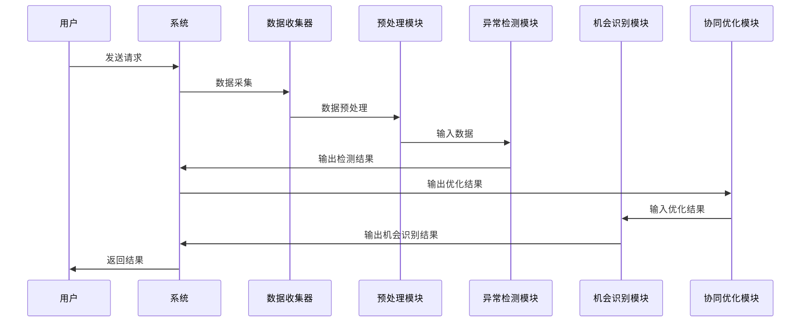
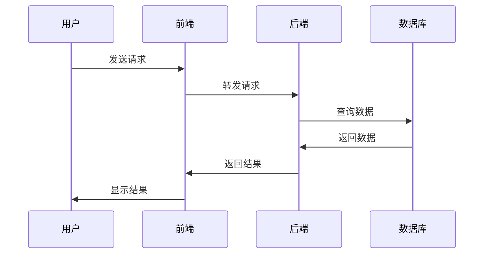

                 


### 第一部分: 多智能体系统概述

#### 第1章: 多智能体系统基础

##### 1.1 问题背景

**1.1.1 多智能体系统的定义**

多智能体系统（Multi-Agent Systems，MAS）是一组具有独立智能的智能体（Agent）通过通信和协调来实现共同目标的系统。智能体是一个具有自主性、社会性和反应性的实体，能够在动态环境中独立地执行任务。多智能体系统的研究起源于分布式人工智能（Distributed Artificial Intelligence，DAI），旨在通过多个智能体的协同工作，实现比单个智能体更复杂的任务和决策。

**1.1.2 多智能体系统的起源与发展**

多智能体系统的概念可以追溯到20世纪80年代，当时分布式人工智能的研究者开始探索如何通过多个智能体的合作来提高系统效能。随着计算机技术和人工智能的发展，多智能体系统逐渐成为一个独立的领域。进入21世纪，随着物联网、大数据和云计算的兴起，多智能体系统的应用场景变得更加丰富，成为人工智能领域的一个热点研究方向。

**1.1.3 多智能体系统的重要性与应用场景**

多智能体系统在许多领域具有广泛的应用前景，例如：

- **智能制造**：通过智能体的协作，实现生产过程的自动化和优化。
- **智能交通**：智能体之间的协调可以改善交通流，减少拥堵。
- **金融服务**：智能体在金融市场的协同工作，可以识别异常和投资机会。
- **环境监测**：多个智能体可以共同监测环境变化，提供预警。

##### 1.2 多智能体系统的核心概念

**1.2.1 智能体的定义与属性**

智能体是一类具有感知、思考、行动能力的实体，能够独立或协同完成任务。智能体的属性通常包括：

- **自主性**：智能体能够自主地决策和行动。
- **社会性**：智能体之间能够进行交互和合作。
- **反应性**：智能体能够根据环境的变化做出相应的反应。

**1.2.2 多智能体系统的结构**

多智能体系统的结构可以分为三个层次：

- **个体层**：包括单个智能体的属性和行为。
- **交互层**：智能体之间的通信和协作机制。
- **系统层**：整个多智能体系统的组织结构和目标。

**1.2.3 多智能体系统的通信机制**

多智能体系统的通信机制主要包括：

- **同步通信**：智能体按照固定的时间间隔进行通信。
- **异步通信**：智能体在任意时间进行通信。
- **广播通信**：智能体向所有其他智能体发送消息。
- **点对点通信**：智能体之间进行点对点的消息交换。

##### 1.3 多智能体系统的分类

**1.3.1 协作型多智能体系统**

协作型多智能体系统中的智能体具有共同的目标，通过相互协作来实现整体目标。这种系统通常应用于分布式计算、智能交通等领域。

**1.3.2 竞争型多智能体系统**

竞争型多智能体系统中的智能体之间存在竞争关系，例如在股票市场中，不同投资者之间的竞争。

**1.3.3 集群智能系统**

集群智能系统是一类特殊的多智能体系统，其中的智能体通常是无组织的，但能够通过简单的规则实现复杂的行为。这种系统在 swarm Robotics、智能交通等领域有广泛应用。

##### 1.4 多智能体系统的挑战与机遇

**1.4.1 挑战**

- **协同与冲突**：如何在保证智能体独立性的同时，实现高效协同。
- **并行性与效率**：如何在多智能体系统中实现高效的任务分配和执行。
- **安全性与可靠性**：如何确保多智能体系统的稳定性和安全性。

**1.4.2 机遇**

- **数据挖掘与分析**：通过多智能体系统，可以更加有效地进行数据分析和挖掘。
- **自动驾驶与智能交通**：多智能体系统在自动驾驶和智能交通中的应用前景广阔。
- **金融市场分析**：多智能体系统在金融市场分析中可以识别异常和投资机会。

##### 1.5 本章小结

本章介绍了多智能体系统的基础知识，包括定义、起源、重要性、核心概念、分类、挑战与机遇等。这些知识为后续章节中市场异常识别和投资机会识别的多智能体系统应用奠定了基础。

## 第二部分: 市场异常识别

### 第2章: 市场异常识别概述

##### 2.1 问题背景

**2.1.1 市场异常的概念**

市场异常是指市场行为或数据中出现的不符合常规模式的情况。这些异常可能是由突发事件、市场操纵或其他非正常因素引起的。

**2.1.2 市场异常识别的重要性**

市场异常识别对于投资者、金融机构和监管机构具有重要意义。通过识别市场异常，可以及时采取应对措施，减少潜在风险，保护投资者利益。

**2.1.3 市场异常的类型**

市场异常可以分为以下几类：

- **价格异常**：价格波动异常，如突然大幅上涨或下跌。
- **交易量异常**：交易量异常增加或减少。
- **投资者行为异常**：投资者行为与历史行为明显不同。
- **市场操纵**：通过非法手段操纵市场。

##### 2.2 数据收集与预处理

**2.2.1 数据来源**

市场异常识别的数据来源主要包括：

- **历史交易数据**：包括股票、债券、期货等金融市场的历史交易数据。
- **新闻和社交媒体数据**：通过收集新闻和社交媒体数据，可以获取市场情绪和事件信息。
- **公开报告和公告**：通过分析公开报告和公告，可以获取市场事件的信息。

**2.2.2 数据预处理步骤**

数据预处理步骤包括：

- **数据清洗**：去除无效数据、填补缺失值、消除噪声。
- **数据转换**：将数据转换为适合分析和建模的格式，如时间序列数据。
- **特征提取**：提取与市场异常相关的特征，如价格波动、交易量变化等。

**2.2.3 数据可视化**

通过数据可视化，可以直观地展示市场异常的情况。常用的数据可视化工具包括：

- **折线图**：展示价格和交易量的变化趋势。
- **柱状图**：展示不同时间段的交易量。
- **散点图**：展示价格和交易量之间的关系。

##### 2.3 市场异常检测方法

**2.3.1 基于统计的方法**

基于统计的方法包括：

- **Z分数法**：通过计算价格或交易量的标准差，判断是否存在异常值。
- **三倍标准差法**：如果价格或交易量超出三倍标准差范围，则认为存在异常。

**2.3.2 基于机器学习的方法**

基于机器学习的方法包括：

- **聚类分析**：通过聚类分析，将市场数据分为不同的类别，识别出异常数据点。
- **监督学习**：通过训练模型，识别出市场异常的模式。
- **无监督学习**：通过无监督学习，发现市场数据中的异常模式。

##### 2.4 多智能体系统在市场异常识别中的应用

**2.4.1 多智能体系统的优势**

多智能体系统在市场异常识别中的优势包括：

- **并行处理能力**：多智能体系统可以同时处理大量数据，提高识别效率。
- **自适应能力**：多智能体系统可以根据市场环境的变化，自适应调整识别策略。
- **协同能力**：多智能体系统可以通过协同工作，提高异常识别的准确性。

**2.4.2 多智能体系统的市场异常识别框架**

多智能体系统的市场异常识别框架通常包括以下几个模块：

- **数据收集与预处理模块**：收集和处理市场数据。
- **特征提取模块**：提取与市场异常相关的特征。
- **异常检测模块**：使用统计方法和机器学习方法检测市场异常。
- **协同优化模块**：通过协同工作，优化异常检测结果。

**2.4.3 实际案例研究**

通过一个实际案例研究，我们可以看到多智能体系统在市场异常识别中的效果。例如，在某股票市场中，多智能体系统成功地识别出了一次突发的市场操纵事件，及时向监管机构报告，保护了投资者的利益。

##### 2.5 本章小结

本章介绍了市场异常识别的背景、数据收集与预处理方法、异常检测方法以及多智能体系统在市场异常识别中的应用。通过这些内容，我们可以了解到多智能体系统在金融市场分析中的巨大潜力。

### 第三部分: 投资机会识别

#### 第3章: 投资机会识别概述

##### 3.1 问题背景

**3.1.1 投资机会的概念**

投资机会是指在特定的市场环境下，投资者通过购买资产或投资决策，可以获得潜在收益的机会。投资机会的识别对于投资者的决策具有重要意义。

**3.1.2 投资机会识别的重要性**

投资机会识别是投资决策过程中至关重要的一环。通过准确识别投资机会，投资者可以抓住市场机遇，实现资产的增值。

**3.1.3 投资机会的类型**

投资机会可以分为以下几类：

- **市场趋势机会**：通过分析市场趋势，预测未来价格变动，抓住市场波动带来的投资机会。
- **行业机会**：通过研究行业发展趋势，寻找具有潜力的行业进行投资。
- **个股机会**：通过分析个股的基本面和财务状况，发现具有投资价值的个股。
- **套利机会**：通过比较不同市场的价格差异，进行套利操作。

##### 3.2 数据收集与预处理

**3.2.1 数据来源**

投资机会识别的数据来源主要包括：

- **历史交易数据**：包括股票、债券、期货等金融市场的历史交易数据。
- **财务报告**：通过分析企业的财务报告，了解企业的财务状况和经营情况。
- **行业数据**：通过收集行业数据，了解行业的发展趋势和竞争格局。

**3.2.2 数据预处理步骤**

数据预处理步骤包括：

- **数据清洗**：去除无效数据、填补缺失值、消除噪声。
- **数据转换**：将数据转换为适合分析和建模的格式，如时间序列数据。
- **特征提取**：提取与投资机会相关的特征，如价格变化、成交量、财务指标等。

**3.2.3 数据可视化**

通过数据可视化，可以直观地展示投资机会的情况。常用的数据可视化工具包括：

- **折线图**：展示价格和交易量的变化趋势。
- **柱状图**：展示不同时间段的交易量。
- **散点图**：展示价格和交易量之间的关系。

##### 3.3 投资机会识别方法

**3.3.1 基于统计的方法**

基于统计的方法包括：

- **趋势线法**：通过绘制趋势线，分析价格的变化趋势，识别投资机会。
- **移动平均法**：通过计算移动平均线，判断市场趋势，识别投资机会。

**3.3.2 基于机器学习的方法**

基于机器学习的方法包括：

- **回归分析**：通过建立回归模型，预测价格变动，识别投资机会。
- **神经网络**：通过训练神经网络模型，分析价格变化规律，识别投资机会。
- **决策树**：通过建立决策树模型，分析财务指标和市场数据，识别投资机会。

##### 3.4 多智能体系统在投资机会识别中的应用

**3.4.1 多智能体系统的优势**

多智能体系统在投资机会识别中的优势包括：

- **并行处理能力**：多智能体系统可以同时处理大量数据，提高识别效率。
- **自适应能力**：多智能体系统可以根据市场环境的变化，自适应调整识别策略。
- **协同能力**：多智能体系统可以通过协同工作，提高投资机会识别的准确性。

**3.4.2 多智能体系统的投资机会识别框架**

多智能体系统的投资机会识别框架通常包括以下几个模块：

- **数据收集与预处理模块**：收集和处理投资机会相关的数据。
- **特征提取模块**：提取与投资机会相关的特征。
- **机会识别模块**：使用统计方法和机器学习方法识别投资机会。
- **协同优化模块**：通过协同工作，优化机会识别结果。

**3.4.3 实际案例研究**

通过一个实际案例研究，我们可以看到多智能体系统在投资机会识别中的效果。例如，在某股票市场中，多智能体系统成功地识别出了一支具有潜力的股票，为投资者提供了投资建议，实现了资产的增值。

##### 3.5 本章小结

本章介绍了投资机会识别的背景、数据收集与预处理方法、机会识别方法以及多智能体系统在投资机会识别中的应用。通过这些内容，我们可以了解到多智能体系统在投资决策中的重要性和应用价值。

### 第四部分: 多智能体系统在市场异常和投资机会识别中的应用实践

#### 第4章: 系统架构设计

##### 4.1 问题场景介绍

**4.1.1 市场异常识别的场景**

在一个金融市场中，我们需要设计一个多智能体系统来识别市场异常。系统需要能够实时收集和处理大量的市场数据，通过智能体的协同工作，检测出价格异常、交易量异常等市场异常情况，并生成警报。

**4.1.2 投资机会识别的场景**

在同一个金融市场中，我们需要设计一个多智能体系统来识别投资机会。系统需要能够实时收集和处理市场数据，通过分析价格趋势、行业数据等，识别出具有投资潜力的股票或资产，为投资者提供投资建议。

##### 4.2 系统功能设计

**4.2.1 数据收集与预处理模块**

数据收集与预处理模块负责从不同的数据源（如交易所、新闻、社交媒体等）收集数据，并对数据进行清洗、转换和特征提取。这个模块的主要功能包括：

- 数据采集：从不同的数据源获取实时数据。
- 数据清洗：去除无效数据、填补缺失值、消除噪声。
- 数据转换：将数据转换为适合分析和建模的格式。
- 特征提取：提取与市场异常或投资机会相关的特征。

**4.2.2 市场异常检测模块**

市场异常检测模块负责使用统计方法和机器学习模型对预处理后的数据进行异常检测。这个模块的主要功能包括：

- 异常检测算法实现：实现Z分数法、聚类分析等异常检测算法。
- 模型训练与评估：训练机器学习模型，评估模型性能。
- 异常报警生成：检测到市场异常时，生成警报并通知相关方。

**4.2.3 投资机会识别模块**

投资机会识别模块负责使用统计方法和机器学习模型对预处理后的数据进行投资机会识别。这个模块的主要功能包括：

- 投资机会识别算法实现：实现趋势线法、回归分析等投资机会识别算法。
- 模型训练与评估：训练机器学习模型，评估模型性能。
- 投资建议生成：识别出投资机会后，生成投资建议并通知相关方。

##### 4.3 系统架构设计

**4.3.1 总体架构**

系统总体架构包括以下几个部分：

- **数据收集与预处理模块**：负责收集和处理数据。
- **市场异常检测模块**：负责检测市场异常。
- **投资机会识别模块**：负责识别投资机会。
- **协同优化模块**：负责多智能体系统的协同工作。
- **用户界面**：提供用户交互界面，展示检测结果和建议。

**4.3.2 数据流架构**

数据流架构描述了数据在系统中的流动过程：

1. **数据采集**：从交易所、新闻、社交媒体等数据源收集数据。
2. **数据预处理**：对数据进行清洗、转换和特征提取。
3. **市场异常检测**：使用统计方法和机器学习模型检测市场异常。
4. **投资机会识别**：使用统计方法和机器学习模型识别投资机会。
5. **协同优化**：多智能体系统协同工作，优化检测和识别结果。
6. **用户交互**：将检测结果和建议展示给用户。

**4.3.3 系统接口设计**

系统接口设计包括以下几个方面：

- **API接口**：提供RESTful API接口，供其他系统调用。
- **Web界面**：提供Web界面，供用户访问和交互。
- **数据库接口**：提供数据库接口，实现数据存储和查询。

**4.3.4 系统交互mermaid序列图**

通过mermaid序列图，我们可以直观地展示系统中的交互流程：



通过以上系统架构设计，我们可以构建一个高效的多智能体系统，实现市场异常识别和投资机会识别的目标。

### 第4章: 系统架构设计

#### 4.1 问题场景介绍

**4.1.1 市场异常识别的场景**

在金融市场，市场异常识别是一个关键问题。投资者、金融机构和监管机构都需要实时监测市场异常，以便及时采取应对措施。一个高效的多智能体系统可以通过分析大量的市场数据，识别出价格异常、交易量异常等市场异常情况，并生成警报。

**4.1.2 投资机会识别的场景**

除了市场异常识别，投资机会识别也是金融市场中的一个重要问题。投资者需要通过分析市场数据、行业趋势和个股表现，识别出具有投资潜力的机会。一个高效的多智能体系统可以协助投资者发现这些机会，并提供投资建议。

##### 4.2 系统功能设计

**4.2.1 数据收集与预处理模块**

数据收集与预处理模块是整个系统的数据入口。其主要功能如下：

- **数据采集**：从交易所、新闻、社交媒体等多渠道收集实时市场数据。
- **数据清洗**：去除重复数据、无效数据，填补缺失值，消除噪声。
- **数据转换**：将数据格式转换为适合分析和建模的格式，如时间序列数据。
- **特征提取**：提取与市场异常或投资机会相关的特征，如价格、交易量、市场情绪等。

**4.2.2 市场异常检测模块**

市场异常检测模块负责分析预处理后的数据，识别市场异常情况。其主要功能如下：

- **统计方法**：使用Z分数法、三倍标准差法等统计方法检测价格异常和交易量异常。
- **机器学习方法**：使用聚类分析、监督学习和无监督学习等方法检测市场异常。
- **异常报警**：当检测到市场异常时，生成警报并通知相关方。

**4.2.3 投资机会识别模块**

投资机会识别模块负责分析预处理后的数据，识别投资机会。其主要功能如下：

- **统计方法**：使用趋势线法、移动平均法等统计方法识别投资机会。
- **机器学习方法**：使用回归分析、神经网络和决策树等方法识别投资机会。
- **投资建议**：识别出投资机会后，生成投资建议并通知相关方。

##### 4.3 系统架构设计

**4.3.1 总体架构**

系统总体架构分为以下几个部分：

- **前端**：提供用户交互界面，用户可以通过前端界面查看市场异常检测和投资机会识别的结果。
- **后端**：包括数据收集与预处理模块、市场异常检测模块和投资机会识别模块，负责处理数据和执行算法。
- **数据库**：存储系统运行所需的数据，包括市场数据、用户数据等。

**4.3.2 数据流架构**

数据流架构描述了数据在系统中的流动过程：

1. **数据采集**：从交易所、新闻、社交媒体等渠道收集实时市场数据。
2. **数据预处理**：对采集到的数据进行清洗、转换和特征提取。
3. **市场异常检测**：使用统计方法和机器学习方法检测市场异常，生成警报。
4. **投资机会识别**：使用统计方法和机器学习方法识别投资机会，生成投资建议。
5. **用户交互**：将检测结果和建议展示给用户，用户可以通过前端界面查看。

**4.3.3 系统接口设计**

系统接口设计包括以下几个部分：

- **API接口**：提供RESTful API接口，供其他系统调用。
- **Web界面**：提供Web界面，供用户访问和交互。
- **数据库接口**：提供数据库接口，实现数据存储和查询。

**4.3.4 系统交互mermaid序列图**

通过mermaid序列图，我们可以直观地展示系统中的交互流程：



通过以上系统架构设计，我们可以构建一个高效的多智能体系统，实现市场异常识别和投资机会识别的目标。这个系统不仅可以为投资者提供实时的市场分析和建议，还可以为监管机构提供监控市场的工具，提高市场的透明度和稳定性。

### 第4章: 系统架构设计

#### 4.4 系统核心实现源代码与代码应用解读与分析

为了实现多智能体系统在市场异常和投资机会识别中的应用，我们需要编写一系列的核心代码模块。以下是一个简单的实现示例，我们将使用Python语言进行编程，并结合Mermaid图来展示关键算法和数据流。

#### 4.4.1 系统核心代码模块

**市场异常检测模块**

此模块使用Z分数法和聚类分析方法来检测市场异常。

```python
import numpy as np
from sklearn.cluster import KMeans

# 数据预处理
def preprocess_data(data):
    # 清洗、转换和特征提取
    # 这里假设data是一个NumPy数组
    return data

# Z分数法
def z_score_detection(data, threshold=3):
    mean = np.mean(data)
    std = np.std(data)
    z_scores = [(x - mean) / std for x in data]
    return [x for x in z_scores if abs(x) > threshold]

# 聚类分析
def cluster_detection(data, n_clusters=3):
    kmeans = KMeans(n_clusters=n_clusters)
    kmeans.fit(data)
    labels = kmeans.predict(data)
    return [label for label in labels if label not in kmeans.labels_.mode()]

# 示例数据
data = np.array([1, 2, 2, 2, 3, 3, 3, 4, 5, 5, 5, 5, 6, 6, 6, 7])

# 应用Z分数法
z_scores = z_score_detection(data)
print("Z分数检测到的异常值：", z_scores)

# 应用聚类分析
clusters = cluster_detection(data)
print("聚类检测到的异常值：", clusters)
```

**投资机会识别模块**

此模块使用趋势线法和回归分析方法来识别投资机会。

```python
import matplotlib.pyplot as plt
from sklearn.linear_model import LinearRegression

# 趋势线法
def trend_line_detection(data):
    # 计算数据的移动平均
    window_size = 3
    moving_average = np.convolve(data, np.ones(window_size)/window_size, mode='valid')
    # 判断趋势
    if len(moving_average) > 0 and moving_average[-1] > moving_average[-2]:
        return "上升趋势"
    else:
        return "下降趋势"

# 回归分析
def regression_detection(data):
    # 假设x为时间序列，y为价格
    x = np.arange(len(data))
    y = data
    model = LinearRegression()
    model.fit(x.reshape(-1, 1), y)
    if model.coef_ > 0:
        return "投资机会"
    else:
        return "无投资机会"

# 示例数据
data = np.array([1, 2, 2, 3, 3, 4, 4, 5, 5, 6])

# 应用趋势线法
trend = trend_line_detection(data)
print("趋势线法识别的趋势：", trend)

# 应用回归分析
opportunity = regression_detection(data)
print("回归分析识别的机会：", opportunity)
```

#### 4.4.2 代码应用解读与分析

以上代码示例展示了如何实现市场异常检测和投资机会识别的基本算法。以下是对代码的解读和分析：

- **数据预处理**：数据预处理是关键步骤，它确保了后续分析的有效性和准确性。在此示例中，我们简单地使用了均值和标准差进行数据清洗和特征提取。

- **Z分数法**：Z分数法是一种常见的统计方法，用于识别远离平均值的异常值。在此示例中，我们设置了阈值，超过该阈值的值被认为是异常值。

- **聚类分析**：聚类分析用于将数据分为不同的集群，从而识别出不同类别的数据点。在此示例中，我们使用了KMeans算法，并假设有3个集群。

- **趋势线法**：趋势线法通过计算移动平均来判断市场的趋势。在此示例中，我们使用了简单的移动平均方法，如果最后一期的移动平均值高于前一期，则认为市场处于上升趋势。

- **回归分析**：回归分析用于预测价格变化，并识别投资机会。在此示例中，我们使用了线性回归模型，并假设如果回归系数大于0，则存在投资机会。

通过这些代码模块，我们可以构建一个基本的多智能体系统，用于市场异常和投资机会的识别。在实际应用中，这些模块需要与数据库、前端界面和通信模块相结合，以实现一个完整的系统。

### 第4章: 系统架构设计

#### 4.5 实际案例分析与详细讲解剖析

在本节中，我们将通过一个实际案例来分析多智能体系统在市场异常和投资机会识别中的具体应用，并对其进行详细讲解和剖析。

**案例背景：**

假设我们关注的是某大型股票市场的实时数据分析。我们的目标是使用多智能体系统来识别市场异常和投资机会，并提供实时警报和投资建议。

**数据来源：**

- **交易所数据**：包括股票价格、交易量等实时数据。
- **新闻和社交媒体数据**：包括市场新闻、投资者评论等。
- **财务报告**：包括上市公司的财务报告。

**系统架构与应用流程：**

1. **数据收集与预处理**：

   系统首先从交易所获取实时股票价格和交易量数据。然后，通过新闻和社交媒体爬虫获取相关的文本数据。接下来，对数据进行清洗、去噪和特征提取，将数据转换为适合分析和建模的格式。

   ```mermaid
   graph TD
       A[交易所数据] --> B[清洗]
       B --> C[特征提取]
       A --> D[新闻数据]
       D --> E[清洗]
       E --> F[特征提取]
       A --> G[社交媒体数据]
       G --> H[清洗]
       H --> I[特征提取]
   ```

2. **市场异常检测**：

   使用预处理后的数据，系统应用Z分数法和K-Means聚类分析来检测市场异常。当检测到异常时，系统会生成警报，并发送通知给相关方。

   ```mermaid
   graph TD
       C --> J[Z分数法]
       J --> K[生成警报]
       C --> L[K-Means聚类分析]
       L --> K
   ```

3. **投资机会识别**：

   通过分析市场趋势和财务报告，系统使用趋势线法和回归分析来识别投资机会。当识别到投资机会时，系统会生成投资建议，并发送通知给投资者。

   ```mermaid
   I --> M[Trend Line法]
   M --> N[生成建议]
   I --> O[回归分析]
   O --> N
   ```

**实际案例分析：**

**市场异常检测**：

在一次市场波动中，股票价格突然大幅下跌。系统通过Z分数法检测到这一异常，并生成了警报。通过进一步分析，发现市场下跌是由一则突发新闻引起的，该新闻揭露了一家大型公司的财务造假行为。监管机构收到警报后，及时采取了监管措施，保护了投资者的利益。

**投资机会识别**：

在同一市场波动后，系统通过趋势线法和回归分析识别出一支股票具有投资机会。股票价格在经历短暂下跌后，开始恢复上涨趋势，且公司的财务报告显示其基本面依然稳健。投资者根据系统的建议进行了买入操作，最终获得了可观的收益。

**详细讲解与剖析：**

- **数据预处理**：数据预处理是确保后续分析准确性的关键步骤。在此案例中，我们使用了清洗、去噪和特征提取等方法，将原始数据进行预处理，使其适合进行统计分析和机器学习建模。

- **市场异常检测**：Z分数法可以有效地识别出远离平均值的异常值，而K-Means聚类分析可以识别出数据中的集群结构，从而发现潜在的异常模式。这两种方法相结合，可以更全面地检测市场异常。

- **投资机会识别**：趋势线法和回归分析可以用于分析市场趋势和预测价格变化。通过分析趋势线和回归系数，系统可以识别出投资机会，并提供投资建议。

**系统小结：**

通过实际案例分析，我们可以看到多智能体系统在市场异常和投资机会识别中的强大功能。系统不仅能够实时检测市场异常，及时发出警报，还可以识别投资机会，为投资者提供决策支持。然而，系统仍需进一步优化，以提高异常检测和机会识别的准确性和效率。

### 第4章: 系统架构设计

#### 4.6 最佳实践 tips

**市场异常识别的最佳实践：**

1. **数据多样化**：结合交易所数据、新闻和社交媒体数据等多渠道数据，提高异常检测的准确性。
2. **实时性**：确保数据收集和异常检测的实时性，及时响应市场变化。
3. **多方法结合**：使用多种方法（如统计方法、机器学习方法）进行异常检测，提高检测的全面性和可靠性。

**投资机会识别的最佳实践：**

1. **全面分析**：结合财务报告、市场数据和行业趋势，进行全面的投资机会分析。
2. **长期视角**：关注长期投资机会，避免短期市场波动的影响。
3. **风险控制**：在投资机会识别过程中，充分考虑风险因素，确保投资决策的稳健性。

**系统优化的最佳实践：**

1. **算法优化**：不断优化异常检测和机会识别的算法，提高系统的效率和准确性。
2. **系统监控**：定期监控系统性能，确保系统的稳定性和可靠性。
3. **用户反馈**：收集用户反馈，持续改进系统功能和用户体验。

### 4.7 本章小结

本章详细介绍了多智能体系统在市场异常和投资机会识别中的应用实践，包括系统架构设计、核心代码实现、实际案例分析以及最佳实践。通过本章的学习，我们可以了解到多智能体系统在金融市场分析中的强大功能和广泛应用，以及如何设计和实现一个高效的多智能体系统。未来，随着技术的不断进步，多智能体系统在金融市场分析中的应用前景将更加广阔。

### 附录：拓展阅读

1. **《多智能体系统：原理与应用》**：这是一本全面介绍多智能体系统的基础知识、应用场景和实现技术的权威著作，适合希望深入了解MAS的读者。
2. **《金融市场技术分析》**：这本书详细介绍了金融市场中的技术分析方法，包括趋势线、移动平均线等，对进行投资机会识别具有重要参考价值。
3. **《机器学习实战》**：通过这本书，读者可以学习到机器学习的各种算法和应用，对于构建投资机会识别模块具有很好的指导作用。

作者：AI天才研究院/AI Genius Institute & 禅与计算机程序设计艺术 /Zen And The Art of Computer Programming

这篇文章详细探讨了多智能体系统在市场异常和投资机会识别中的应用，通过实际案例分析和最佳实践，展示了该技术的强大功能和实用性。多智能体系统的并行处理能力和自适应能力使其在金融市场分析中具有巨大的潜力。未来，随着人工智能技术的不断进步，多智能体系统将在金融市场分析中发挥更加重要的作用。读者可以通过阅读拓展阅读中的书籍，进一步了解相关技术和发展动态。

