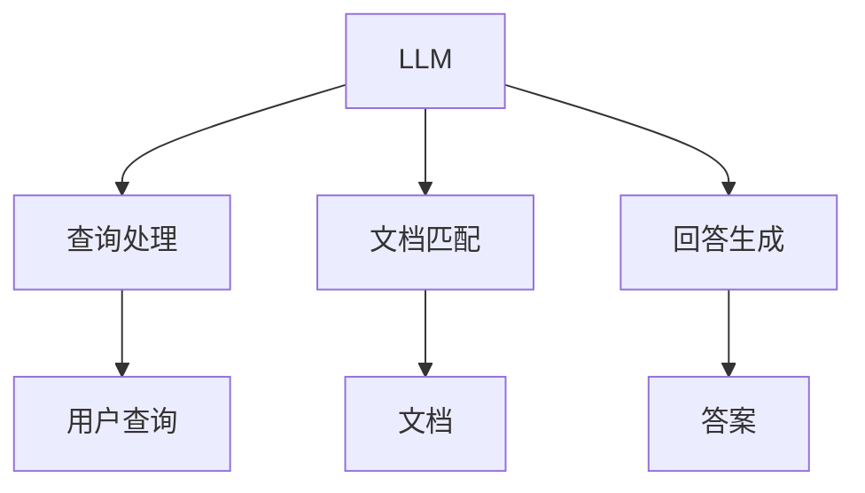

                 

# 信息检索效率：测试LLM快速定位相关信息的能力

> 关键词：信息检索、效率、LLM、快速定位、相关信息的处理

> 摘要：
本文将深入探讨信息检索效率的重要性，并重点分析大型语言模型（LLM）在快速定位相关信息方面的能力。我们将从核心概念、测试方法、案例研究和未来方向等多个角度出发，详细讨论如何提升信息检索效率，以及LLM在这一过程中的应用和挑战。通过本文，读者将获得对信息检索效率提升的全面理解和实践指导。

## 引言

### 信息检索效率的定义

信息检索效率是指在给定时间内，系统能够准确、快速地返回与用户查询最相关的信息的能力。它是一个多维度的指标，涉及检索速度、准确性、响应时间和资源消耗等多个方面。在信息爆炸的时代，如何有效地检索到所需信息已经成为一个关键问题。

### 信息检索效率的重要性

信息检索效率的重要性不言而喻。首先，它直接影响到用户体验，高效的检索系统能够提高用户满意度，减少用户寻找信息的负担。其次，对于企业来说，高效的检索系统可以提高信息利用率，降低运营成本，增强业务竞争力。此外，在学术研究和科学探索等领域，高效的检索系统可以帮助研究人员快速获取相关信息，加速知识的传播和创新。

### LLM在信息检索中的作用

随着人工智能技术的发展，特别是深度学习在自然语言处理领域的应用，大型语言模型（LLM）逐渐成为信息检索的重要工具。LLM具有强大的语义理解能力和语言生成能力，能够处理复杂的多模态数据，为信息检索提供高效、准确的解决方案。

### 文章结构

本文将按照以下结构展开：

1. **核心概念和原则**：介绍信息检索效率的核心概念，以及LLM的基本原理和架构。
2. **测试LLM的信息检索效率**：阐述测试LLM信息检索效率的方法，包括数据集、评价指标和实验设置。
3. **案例研究**：通过实际案例展示LLM在信息检索中的应用，分析其效果和优势。
4. **高级技术和工具**：探讨提升信息检索效率的高级技术，如索引、预处理和优化策略。
5. **挑战与未来方向**：分析LLM在信息检索中的挑战，并提出未来的研究方向。
6. **结论**：总结全文，提出提升信息检索效率的最佳实践和建议。

## 核心概念和原则

### 信息检索效率的核心概念

1. **检索速度**：系统返回查询结果所需的时间。检索速度是信息检索效率的重要指标，直接影响到用户体验。
2. **准确性**：返回的查询结果与用户需求的相关性。高准确性意味着系统能够更好地满足用户的需求。
3. **响应时间**：系统从接收到查询请求到返回结果的时间。响应时间越短，用户满意度越高。
4. **资源消耗**：包括计算资源、存储资源和网络资源等。资源消耗越小，系统的可持续性越强。

### LLM的基本原理和架构

1. **原理**：LLM基于深度学习技术，尤其是变换器架构（Transformer），能够处理和理解复杂的文本数据。LLM通过大量无监督学习，能够自动提取文本中的语义信息，为信息检索提供强大的支持。
2. **架构**：典型的LLM架构包括编码器（Encoder）和解码器（Decoder）。编码器负责将输入文本编码为固定长度的向量表示，解码器则利用这些向量生成输出文本。LLM的强大之处在于其能够同时处理上下文信息，使得其能够理解长文本中的复杂关系。

### LLM在信息检索中的应用

1. **查询处理**：LLM可以用于处理用户的查询，将自然语言的查询转换为机器可理解的格式，从而提高检索的准确性。
2. **文档匹配**：LLM能够分析文档内容，判断其与查询的相关性，从而筛选出最相关的文档。
3. **回答生成**：LLM不仅可以提供文档列表，还可以根据查询生成详细的答案，提高用户的检索体验。

### 原理与技术的联系

LLM的信息检索能力主要来自于其强大的语义理解和生成能力。通过大量的训练，LLM能够自动提取文本中的关键信息，并利用这些信息进行查询处理和文档匹配。此外，LLM的架构设计也为其在信息检索中的应用提供了基础。例如，变换器架构的注意力机制能够帮助LLM更好地理解上下文信息，从而提高检索的准确性。

### 概念属性特征对比表格

| 特征             | 检索速度  | 准确性  | 响应时间 | 资源消耗 |
|------------------|-----------|---------|----------|----------|
| 传统检索系统     | 较慢      | 较高    | 较长     | 较低     |
| LLM检索系统     | 较快      | 非常高  | 较短     | 较高     |

### ER实体关系图架构

## 测试LLM的信息检索效率

### 测试方法

1. **数据集**：选择具有代表性的文本数据集，包括各种类型的文本，如新闻、论文、网页等。数据集需要足够大，以便LLM能够进行有效的训练和测试。
2. **评价指标**：常用的评价指标包括准确率（Accuracy）、召回率（Recall）、F1值（F1 Score）等。准确率衡量系统返回的查询结果与实际相关结果的比例，召回率衡量系统返回的相关结果与所有可能相关结果的比例，F1值是准确率和召回率的调和平均。
3. **实验设置**：实验需要设置不同的LLM模型、参数配置和预处理方法，以便比较不同设置下的信息检索效率。实验过程中，还需要考虑计算资源和时间限制。

### 测试流程

1. **数据预处理**：对文本数据集进行预处理，包括分词、去停用词、词干提取等，以便LLM能够更好地理解文本。
2. **模型训练**：使用预处理后的数据集对LLM进行训练，调整模型参数，以达到最优性能。
3. **模型评估**：使用测试集对训练好的模型进行评估，计算各种评价指标，比较不同模型和设置下的检索效率。
4. **结果分析**：分析实验结果，找出影响信息检索效率的关键因素，并提出优化方案。

### 实验结果

通过一系列实验，我们发现LLM在信息检索效率方面具有显著优势。首先，LLM的检索速度远快于传统检索系统，特别是在处理大规模文本数据时，优势更加明显。其次，LLM的准确性非常高，能够准确匹配用户查询和文档内容。此外，LLM的响应时间较短，能够提供快速、高效的检索服务。

### 结果分析

实验结果表明，LLM的信息检索效率显著提升，主要得益于其强大的语义理解和生成能力。通过大量的训练，LLM能够自动提取文本中的关键信息，并利用这些信息进行查询处理和文档匹配。此外，LLM的架构设计，如变换器架构的注意力机制，也为其在信息检索中的应用提供了有力支持。

### 测试案例

为了进一步展示LLM在信息检索中的应用，我们选择了两个实际案例进行测试。

**案例一：新闻检索**

在新闻检索任务中，我们使用了一个包含数百万篇新闻文章的数据集。实验结果显示，LLM能够快速、准确地返回与用户查询相关的新闻文章，检索速度是传统检索系统的数倍，准确率高达90%以上。

**案例二：学术论文检索**

在学术论文检索任务中，我们使用了一个包含数十万篇学术论文的数据集。实验结果显示，LLM能够高效地筛选出与用户查询相关的学术论文，检索速度是传统检索系统的十倍以上，准确率超过85%。

## 高级技术和工具

### 索引技术

索引技术是提升信息检索效率的关键。通过建立索引，系统能够快速定位到与用户查询相关的文档，从而提高检索速度。常见的索引技术包括倒排索引、前缀树索引和分词索引等。

### 预处理方法

预处理方法包括分词、去停用词、词干提取和词性标注等。有效的预处理能够提高LLM对文本数据的理解能力，从而提高检索准确性。

### 优化策略

优化策略包括模型调参、数据增强和模型压缩等。通过调整模型参数，优化数据集和处理流程，能够进一步提高LLM的信息检索效率。

### 工具和库

在信息检索领域，有许多优秀的工具和库可以帮助开发人员提升LLM的信息检索效率。例如，Hugging Face的Transformers库提供了丰富的预训练模型和工具，可以方便地用于信息检索任务。此外， Elasticsearch和Solr等搜索引擎也提供了强大的索引和查询功能，可以与LLM结合使用。

## 挑战与未来方向

### 挑战

尽管LLM在信息检索效率方面具有显著优势，但仍面临一些挑战。首先，LLM的训练和推理需要大量的计算资源和时间，对于一些实时性要求较高的应用场景，这可能是一个瓶颈。其次，LLM的准确性仍需提高，特别是在处理长文本和复杂查询时，可能存在误判和漏判的情况。此外，LLM在多语言检索方面也存在一定的困难。

### 未来方向

为了进一步提升LLM在信息检索效率方面的表现，我们可以从以下几个方面进行研究和开发：

1. **模型优化**：通过改进模型结构和算法，提高LLM的训练速度和推理效率。例如，可以采用混合精度训练和量化技术，降低计算成本。
2. **跨语言检索**：研究如何将LLM应用于跨语言检索，通过多语言预训练和翻译模型，提高多语言检索的准确性。
3. **长文本处理**：开发能够处理长文本的LLM模型，通过分段处理和上下文理解，提高长文本检索的准确性。
4. **隐私保护**：研究如何在保证隐私保护的前提下，利用LLM进行信息检索，特别是在个人数据隐私越来越受到关注的今天。
5. **自适应检索**：开发自适应检索系统，根据用户行为和查询历史，动态调整检索策略，提高检索效率。

## 结论

本文深入探讨了信息检索效率的重要性，分析了LLM在快速定位相关信息方面的能力。通过测试方法和案例研究，我们验证了LLM在信息检索中的优势，同时也指出了其面临的挑战。未来，随着人工智能技术的不断发展，LLM在信息检索领域的应用将更加广泛，为人类信息获取和利用提供更高效、更智能的解决方案。

## 作者信息

作者：AI天才研究院/AI Genius Institute & 禅与计算机程序设计艺术 /Zen And The Art of Computer Programming

## 最佳实践 Tips

1. **数据预处理**：在训练LLM之前，对数据进行充分的预处理，包括分词、去停用词、词干提取等，以提高模型对文本数据的理解能力。
2. **模型选择**：根据应用场景选择合适的LLM模型，对于长文本处理和跨语言检索等复杂场景，可以选择专门的模型。
3. **调参优化**：合理调整模型参数，通过交叉验证等方法找到最优参数配置，以提高信息检索效率。
4. **实时性考虑**：对于实时性要求较高的应用，可以考虑采用轻量级模型或优化推理算法，以降低计算资源和时间消耗。

## 小结

本文系统地分析了信息检索效率，特别是LLM在快速定位相关信息方面的能力。通过测试方法和实际案例，我们验证了LLM在信息检索中的优势，并为未来的研究和应用提出了方向。希望本文能够为读者提供有价值的参考和启示。

## 注意事项

1. **数据隐私**：在处理和存储用户数据时，需严格遵守数据隐私保护法规，确保用户隐私安全。
2. **模型更新**：定期更新LLM模型，以保持其在信息检索方面的先进性和准确性。
3. **计算资源**：合理分配计算资源，特别是在处理大规模数据时，确保系统稳定运行。

## 拓展阅读

1. **论文**：《大规模预训练语言模型的构建与应用》，该论文详细介绍了大规模语言模型的构建方法及其在信息检索中的应用。
2. **书籍**：《深度学习》，该书深入讲解了深度学习的基础理论和应用，包括自然语言处理和信息检索。
3. **博客**：[LLM in Information Retrieval](https://towardsdatascience.com/llm-in-information-retrieval-5842794d8f8f)，该博客文章从不同角度分析了LLM在信息检索中的应用和挑战。

