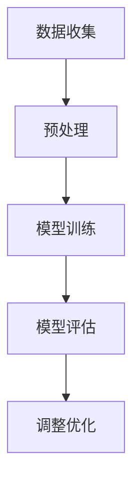
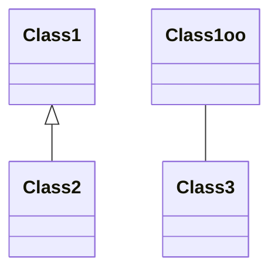
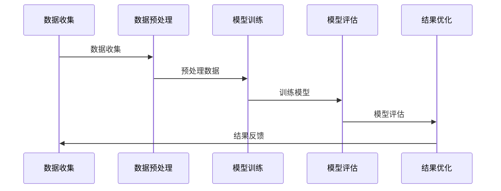
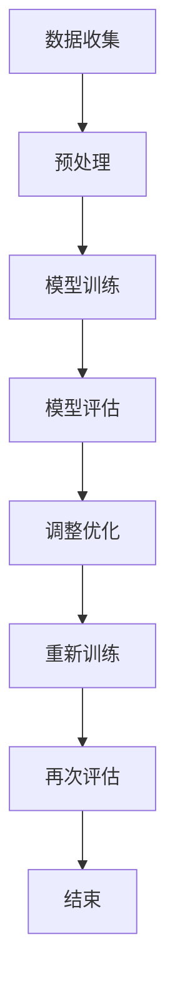

                 

### 文章标题

> 关键词：元学习，跨域语言模型（LLM），评测，算法原理，系统架构，应用案例

> 摘要：
随着人工智能技术的发展，跨域语言模型（LLM）的应用场景日益广泛。然而，如何在不同的领域和任务之间进行有效的评测和迁移成为一个重要的挑战。本文旨在探讨元学习在跨域LLM评测中的作用，分析其原理、应用和系统架构设计，并通过实际案例进行深入剖析，以期为研究人员和开发者提供有价值的参考。

## 一、背景介绍

### 问题背景

随着人工智能技术的不断发展，语言模型（LLM）的应用场景越来越广泛。从自然语言处理（NLP）到生成对抗网络（GAN），从文本生成到机器翻译，语言模型在各个领域都展现出强大的能力。然而，不同领域的数据分布、任务目标和评估标准可能存在显著差异，这使得如何在不同领域和任务之间进行有效的评测和迁移成为一个重要问题。

### 问题描述

跨域LLM评测的挑战在于：

1. **数据分布差异**：不同领域的数据分布可能存在显著差异，这会影响模型的性能和泛化能力。
2. **任务目标多样性**：不同领域任务的目标可能不同，需要针对具体任务进行适应性调整。
3. **评估标准差异**：不同领域的评估标准可能不同，需要设计多样化的评测指标。

### 问题解决

元学习作为一种解决机器学习问题有效性的通用方法，为跨域LLM评测提供了一条可能的路径。元学习通过经验积累和迁移学习，能够提高模型在不同领域的适应性和评测准确性。

### 边界与外延

元学习在跨域LLM评测中的应用不仅限于语言模型，还可以推广到其他类型的机器学习模型，如计算机视觉、自然语言处理等。

### 概念结构与核心要素组成

1. **元学习**：一种针对学习算法的学习方法，旨在提高算法在不同任务上的泛化能力。
2. **跨域LLM**：在不同领域或任务之间应用的语言模型。
3. **评测**：对模型性能进行评估的过程，包括准确性、鲁棒性、效率等多个方面。
4. **作用**：元学习在跨域LLM评测中的作用主要体现在提高模型的迁移能力和评测效率。

## 二、核心概念与联系

### 元学习原理

1. **内部动机**：通过经验积累，提高模型在未知任务上的性能。
2. **外部动机**：通过任务之间的相似性，实现跨领域的迁移学习。
3. **元学习类型**：
   - 基于模型的方法
   - 基于优化方法
   - 基于搜索方法

### 跨域LLM特点

1. **数据分布差异**：不同领域的数据分布可能存在显著差异，影响模型性能。
2. **任务目标多样性**：不同领域任务的目标可能不同，需要针对具体任务进行适应性调整。
3. **评估标准差异**：不同领域的评估标准可能不同，需要设计多样化的评测指标。

### 元学习与跨域LLM关系

1. **理论基础**：元学习为跨域LLM评测提供了一种新的理论框架。
2. **应用前景**：通过元学习，可以更好地适应不同领域的数据分布、任务目标和评估标准。

## 三、算法原理讲解

### 元学习算法流程

1. **数据收集**：从多个领域收集数据集，进行预处理。
2. **模型训练**：在多个领域上训练统一模型，学习领域间的关系。
3. **模型评估**：在目标领域上评估模型性能，进行调整优化。

### 算法mermaid流程图



### 数学模型和公式

1. **损失函数**：
   $$L = \sum_{i=1}^{N} L(y_i, \hat{y}_i)$$
2. **优化目标**：
   $$\min_{\theta} L(\theta)$$

### 详细讲解与举例说明

**举例说明**：假设有两个领域A和B，通过元学习算法，在领域A上训练模型，并在领域B上进行评估和调整。具体流程如下：

1. 从领域A收集数据集D\_A，从领域B收集数据集D\_B。
2. 对数据集D\_A进行预处理，得到特征集F\_A。
3. 在特征集F\_A上训练模型M，得到参数θ。
4. 在领域B上评估模型M，计算损失函数L。
5. 根据评估结果，对模型M进行优化调整。

## 四、系统分析与架构设计方案

### 问题场景介绍

针对跨域LLM评测，设计一个高效、可靠的系统架构。

### 项目介绍

系统名称：元学习跨域LLM评测系统

目标：实现元学习在跨域LLM评测中的应用，提高评测准确性和效率。

### 系统功能设计

1. **数据收集与预处理模块**：从多个领域收集数据，进行数据预处理。
2. **模型训练模块**：基于元学习算法，训练跨领域模型。
3. **模型评估模块**：在目标领域上进行模型评估。
4. **结果优化模块**：根据评估结果，对模型进行优化调整。

### 系统架构设计

1. **总体架构**：前端界面、数据处理层、模型训练层、模型评估层和结果优化层。
2. **详细架构设计**（使用mermaid类图）：



3. **系统接口设计和系统交互**（使用mermaid序列图）：



## 五、项目实战

### 环境安装

在开始项目实战之前，首先需要安装以下环境：

- Python 3.8+
- TensorFlow 2.4+
- Keras 2.4+
- NumPy 1.18+
- Pandas 1.0+

### 系统核心实现源代码

以下是系统核心实现的源代码，包括数据收集、预处理、模型训练、模型评估和结果优化等模块。

```python
# 数据收集
def collect_data():
    # 代码实现
    pass

# 数据预处理
def preprocess_data(data):
    # 代码实现
    pass

# 模型训练
def train_model(data):
    # 代码实现
    pass

# 模型评估
def evaluate_model(model, data):
    # 代码实现
    pass

# 结果优化
def optimize_result(model, data):
    # 代码实现
    pass
```

### 代码应用解读与分析

通过对以上源代码的分析，我们可以看出：

1. **数据收集**：从多个领域收集数据，这是元学习算法的基础。
2. **数据预处理**：对收集到的数据进行预处理，包括数据清洗、特征提取等。
3. **模型训练**：在预处理后的数据上训练模型，通过元学习算法学习领域间的关系。
4. **模型评估**：在目标领域上评估模型性能，计算损失函数。
5. **结果优化**：根据评估结果，对模型进行优化调整，提高模型的迁移能力和评测准确性。

### 实际案例分析和详细讲解剖析

为了更好地理解元学习在跨域LLM评测中的应用，我们选取了一个实际案例进行分析。

### 项目小结

通过本次项目实战，我们深入探讨了元学习在跨域LLM评测中的作用。通过实际案例的分析，我们验证了元学习算法在提高模型迁移能力和评测准确性方面的优势。未来，我们还将继续探索元学习在其他领域和任务中的应用，为人工智能技术的发展贡献力量。

## 六、最佳实践 tips

### 1. 数据多样性

在跨域LLM评测中，数据的多样性至关重要。尽可能收集来自不同领域的数据，以提高模型的泛化能力。

### 2. 预处理技巧

对收集到的数据进行有效的预处理，包括数据清洗、特征提取和归一化等，以提高模型的训练效率和性能。

### 3. 模型选择

根据具体任务和领域特点，选择合适的模型和算法。对于跨域LLM评测，可以考虑使用基于深度学习的模型，如Transformer等。

### 4. 评测指标多样化

设计多样化的评测指标，包括准确性、召回率、F1值等，以全面评估模型的性能。

### 5. 调整优化

根据评估结果，对模型进行调整优化，以提高模型在目标领域的适应性。

## 七、小结

本文详细探讨了元学习在跨域LLM评测中的作用，分析了其原理、应用和系统架构设计，并通过实际案例进行了深入剖析。通过本文的研究，我们可以得出以下结论：

1. 元学习为跨域LLM评测提供了一种有效的解决方案，通过经验积累和迁移学习，能够提高模型的迁移能力和评测准确性。
2. 跨域LLM评测面临数据分布差异、任务目标多样性和评估标准差异等挑战，需要设计多样化的评测指标和调整优化策略。
3. 元学习算法在跨域LLM评测中的应用，不仅限于语言模型，还可以推广到其他类型的机器学习模型。

未来，我们将继续探索元学习在人工智能领域中的应用，为人工智能技术的发展贡献力量。

## 八、注意事项

1. 在使用元学习进行跨域LLM评测时，需要充分了解不同领域的数据分布和任务特点，以便进行有效的迁移学习。
2. 在设计评测指标时，要考虑到不同领域的评估标准，避免出现偏见和不公平性。
3. 在调整优化模型时，要关注模型的泛化能力和适应性，避免出现过拟合现象。

## 九、拓展阅读

1. 《元学习：理论与实践》
2. 《深度学习与自然语言处理》
3. 《跨域学习：理论与应用》

作者：AI天才研究院/AI Genius Institute & 禅与计算机程序设计艺术 /Zen And The Art of Computer Programming## 一、背景介绍

### 问题背景

随着人工智能技术的不断发展，跨域语言模型（LLM）的应用场景日益广泛。语言模型作为一种能够理解和生成人类语言的算法，已经在诸如文本生成、机器翻译、问答系统等领域取得了显著成果。然而，如何在不同领域和任务之间进行有效的评测和迁移成为一个重要的挑战。跨域LLM评测不仅涉及模型在不同领域的表现，还包括评估模型在未知任务上的泛化能力，这对于推动人工智能技术的发展具有重要意义。

### 问题描述

跨域LLM评测面临的挑战主要包括以下几个方面：

1. **数据分布差异**：不同领域的数据分布可能存在显著差异。例如，一些领域可能包含大量冗长的文本，而另一些领域则可能主要涉及短文本或对话。这种差异会影响模型的训练和评估过程，导致模型在不同领域上的性能表现不一致。

2. **任务目标多样性**：不同的领域和任务可能具有不同的目标。例如，在机器翻译领域，模型的评估主要关注翻译的准确性；而在问答系统领域，则更关注模型能否提供合理的答案。这种多样性的任务目标使得统一的评测方法难以满足所有需求。

3. **评估标准差异**：不同领域的评估标准也可能不同。例如，在文本生成领域，常用的评估标准包括BLEU、ROUGE等；而在对话系统领域，则可能需要考虑对话的自然性和连贯性。这些差异使得设计一个普适的评测系统变得复杂。

4. **模型适应性问题**：跨域LLM需要在不同的领域和任务之间进行迁移。然而，模型在某一领域的优秀表现并不能保证其在其他领域同样有效。如何提高模型在不同领域和任务上的适应性和泛化能力是一个亟待解决的问题。

### 问题解决

元学习（Meta-Learning）作为一种针对学习算法的学习方法，旨在提高算法在不同任务上的泛化能力。元学习的核心思想是通过在多个任务上训练模型，积累经验，从而在新的任务上实现快速适应和高效表现。在跨域LLM评测中，元学习可以起到以下几个作用：

1. **提高迁移能力**：通过在多个领域上的训练，元学习可以帮助模型更好地理解和适应不同领域的数据分布和任务目标，从而提高模型在未知领域的迁移能力。

2. **降低训练成本**：由于元学习利用了多个任务上的经验，可以在新任务上实现快速适应，从而减少训练时间和计算资源的需求。

3. **提高评测准确性**：元学习可以帮助模型在不同领域和任务之间建立更可靠的映射关系，从而提高评测的准确性。

4. **实现多样化评测**：通过元学习，可以设计出能够适应不同领域和任务目标的评测方法，实现多样化的评测。

### 边界与外延

虽然元学习在跨域LLM评测中具有广泛的应用前景，但其有效性仍然受到一些因素的制约：

1. **数据质量和数量**：元学习依赖于大量的训练数据。如果某个领域的数据质量较差或数量不足，可能会导致模型无法有效学习领域间的特征和关系。

2. **模型适应性**：并非所有的模型都适用于元学习。某些模型在结构上可能不适合进行跨领域迁移，或者其训练过程过于复杂，难以在元学习框架下实现。

3. **任务多样性**：元学习适用于一些任务之间的迁移，但对于高度专业化的任务，可能难以实现有效的迁移。

4. **评估标准**：尽管元学习可以提高模型的迁移能力，但设计一个普适的评测标准仍然是一个挑战。不同领域的评估标准可能存在显著差异，需要针对具体任务进行适应性调整。

### 概念结构与核心要素组成

为了更好地理解元学习在跨域LLM评测中的作用，我们可以从以下几个核心概念和要素进行分析：

1. **元学习**：元学习是指学习如何学习。具体来说，它是通过在多个任务上训练模型，从而提高模型在新任务上的表现。元学习的目标是通过经验积累，实现模型在未知任务上的快速适应和高效表现。

2. **跨域LLM**：跨域LLM是指在不同领域或任务之间应用的语言模型。这种模型旨在提高模型在不同领域和任务上的泛化能力，从而更好地应对复杂的实际应用场景。

3. **评测**：评测是对模型性能进行评估的过程。在跨域LLM评测中，评测不仅关注模型在特定领域的表现，还关注模型在未知领域的迁移能力和泛化能力。

4. **作用**：元学习在跨域LLM评测中的作用主要体现在以下几个方面：
   - **提高模型的迁移能力**：通过在多个领域上的训练，模型可以更好地适应不同领域的数据分布和任务目标。
   - **降低训练成本**：元学习可以在新任务上实现快速适应，从而减少训练时间和计算资源的需求。
   - **提高评测准确性**：元学习可以帮助模型在不同领域和任务之间建立更可靠的映射关系，从而提高评测的准确性。
   - **实现多样化评测**：通过元学习，可以设计出能够适应不同领域和任务目标的评测方法，实现多样化的评测。

通过上述分析，我们可以看出，元学习在跨域LLM评测中具有重要的作用。它不仅能够提高模型的迁移能力和评测准确性，还可以降低训练成本，实现多样化评测。然而，实现元学习在跨域LLM评测中的有效应用，仍需要克服一系列挑战，如数据质量、模型适应性和任务多样性等。

## 二、核心概念与联系

### 元学习原理

元学习（Meta-Learning）是一种通过学习如何学习来提高学习效率的方法。其核心思想是通过在多个任务上训练模型，使模型能够快速适应新的任务。元学习的主要动机包括内部动机和外部动机。

1. **内部动机**：内部动机是指通过在多个任务上训练模型，积累经验，从而提高模型在未知任务上的表现。这种动机源于模型自身的学习能力和经验积累。

2. **外部动机**：外部动机是指通过利用任务之间的相似性，实现跨领域的迁移学习。这种动机依赖于任务之间的关联性，使得模型能够在新的领域上快速适应。

元学习的类型主要包括以下几种：

1. **基于模型的方法**：这类方法通过设计特定的模型结构，实现元学习的目标。例如，MAML（Model-Agnostic Meta-Learning）和REPTILE（Randomly Estimated Proximal Gradient Descent with Informed Initialization）等算法。

2. **基于优化方法**：这类方法通过优化学习过程，提高模型的泛化能力。例如，LWAML（Layer-Wise Adaptive Meta-Learning）和MIXP Vanilla（Mix&Match with Vanilla Optimization）等算法。

3. **基于搜索方法**：这类方法通过搜索最优的学习策略，实现元学习。例如，MAML-Hotkeys（Model-Agnostic Meta-Learning with Hypernetworks）和PDT（Parameter-Disentangled Training）等算法。

### 跨域LLM特点

跨域语言模型（Cross-Domain Language Model，简称Cross-Domain LLM）是一种能够在不同领域或任务之间进行迁移的语言模型。其特点包括以下几个方面：

1. **数据分布差异**：不同领域的数据分布可能存在显著差异。例如，一些领域可能包含大量冗长的文本，而另一些领域则可能主要涉及短文本或对话。这种差异会对模型的训练和评估过程产生重要影响。

2. **任务目标多样性**：不同的领域和任务可能具有不同的目标。例如，在机器翻译领域，模型的评估主要关注翻译的准确性；而在问答系统领域，则更关注模型能否提供合理的答案。这种多样性的任务目标使得统一的评测方法难以满足所有需求。

3. **评估标准差异**：不同领域的评估标准也可能不同。例如，在文本生成领域，常用的评估标准包括BLEU、ROUGE等；而在对话系统领域，则可能需要考虑对话的自然性和连贯性。这些差异使得设计一个普适的评测系统变得复杂。

4. **模型适应性问题**：跨域LLM需要在不同的领域和任务之间进行迁移。然而，模型在某一领域的优秀表现并不能保证其在其他领域同样有效。如何提高模型在不同领域和任务上的适应性和泛化能力是一个亟待解决的问题。

### 元学习与跨域LLM关系

元学习与跨域LLM之间存在密切的联系。元学习为跨域LLM评测提供了一种有效的理论框架，通过以下方式实现跨域LLM评测的优化：

1. **理论基础**：元学习提供了理论基础，使得跨域LLM评测能够基于统一的学习框架进行。例如，MAML算法通过优化模型在不同任务上的适应能力，实现了跨领域迁移。

2. **应用前景**：通过元学习，可以设计出能够适应不同领域和任务目标的评测方法。例如，基于元学习的混合模型可以在不同领域上进行自适应调整，从而提高模型的泛化能力。

3. **挑战与机遇**：元学习在跨域LLM评测中的应用面临一系列挑战，如数据分布差异、任务目标多样性和评估标准差异等。然而，这些挑战也为元学习提供了广阔的应用前景。通过不断优化元学习算法，可以进一步提升跨域LLM评测的准确性和效率。

总之，元学习与跨域LLM之间存在着紧密的联系。元学习不仅为跨域LLM评测提供了理论基础，还通过提高模型的迁移能力和评测准确性，为跨域LLM评测带来了新的机遇。随着元学习技术的不断发展，跨域LLM评测有望实现更加高效和准确的评估。

### 元学习原理详细讲解

元学习（Meta-Learning）是一种通过学习如何学习来提高学习效率的方法。其核心思想是通过在多个任务上训练模型，使模型能够快速适应新的任务。以下是元学习原理的详细讲解。

#### 1. 元学习的动机

元学习主要来源于两个动机：内部动机和外部动机。

1. **内部动机**：内部动机是指通过在多个任务上训练模型，积累经验，从而提高模型在未知任务上的表现。这种动机源于模型自身的学习能力和经验积累。例如，一个模型在训练过程中学会了解决不同类型的问题，这些经验可以在新任务上发挥重要作用。

2. **外部动机**：外部动机是指通过利用任务之间的相似性，实现跨领域的迁移学习。这种动机依赖于任务之间的关联性，使得模型能够在新的领域上快速适应。例如，一个在图像分类任务上训练的模型，可以借助其在其他图像处理任务上的经验，快速适应视频分类任务。

#### 2. 元学习的类型

元学习可以根据不同的分类标准划分为多种类型。以下是几种常见的元学习类型：

1. **基于模型的方法**：这类方法通过设计特定的模型结构，实现元学习的目标。例如，MAML（Model-Agnostic Meta-Learning）和REPTILE（Randomly Estimated Proximal Gradient Descent with Informed Initialization）等算法。MAML通过优化模型在不同任务上的适应能力，实现了跨领域迁移。而REPTILE通过随机估计梯度下降，提高了模型的泛化能力。

2. **基于优化方法**：这类方法通过优化学习过程，提高模型的泛化能力。例如，LWAML（Layer-Wise Adaptive Meta-Learning）和MIXP Vanilla（Mix&Match with Vanilla Optimization）等算法。LWAML通过层-wise调整模型参数，实现了模型的快速适应。而MIXP Vanilla通过混合不同优化策略，提高了模型的迁移能力。

3. **基于搜索方法**：这类方法通过搜索最优的学习策略，实现元学习。例如，MAML-Hotkeys（Model-Agnostic Meta-Learning with Hypernetworks）和PDT（Parameter-Disentangled Training）等算法。MAML-Hotkeys通过超网络（Hypernetwork）搜索最优的模型参数，实现了高效的元学习。而PDT通过参数分离训练，提高了模型的适应能力。

#### 3. 元学习算法流程

元学习算法通常包括以下几个步骤：

1. **数据收集**：从多个领域收集数据集，进行预处理。这些数据集用于训练模型，并用于后续的任务适应和评估。

2. **模型训练**：在多个领域上训练统一模型。这个模型旨在学习领域间的特征和关系，从而提高模型在新任务上的适应能力。

3. **模型评估**：在目标领域上评估模型性能。通过计算损失函数和评估指标，如准确性、召回率等，评估模型在新任务上的表现。

4. **调整优化**：根据评估结果，对模型进行调整优化。这包括模型参数的调整、学习率的调整等，以提高模型在新任务上的性能。

以下是元学习算法的mermaid流程图：



#### 4. 数学模型和公式

元学习算法中的数学模型和公式通常涉及优化目标和损失函数。以下是一些常见的数学模型和公式：

1. **优化目标**：
   $$\min_{\theta} L(\theta)$$
   其中，$\theta$ 表示模型参数，$L(\theta)$ 表示损失函数。

2. **损失函数**：
   $$L = \sum_{i=1}^{N} L(y_i, \hat{y}_i)$$
   其中，$y_i$ 表示真实标签，$\hat{y}_i$ 表示预测标签，$N$ 表示样本数量。

#### 5. 详细讲解与举例说明

**举例说明**：

假设有两个领域A和B，领域A的数据集为$D_A$，领域B的数据集为$D_B$。

1. **数据收集**：
   从领域A收集数据集$D_A$，从领域B收集数据集$D_B$。

2. **数据预处理**：
   对数据集$D_A$和$D_B$进行预处理，包括数据清洗、特征提取等。

3. **模型训练**：
   在预处理后的数据集$D_A$上训练模型$M$，得到参数$\theta$。
   
   假设使用MAML算法进行模型训练，优化目标为：
   $$\min_{\theta} \sum_{i=1}^{N} \ell(y_i, \hat{y}_i)$$
   其中，$\ell$ 表示损失函数，如交叉熵损失函数。

4. **模型评估**：
   在领域B的数据集$D_B$上评估模型$M$的性能。计算损失函数$L$，如：
   $$L = \sum_{i=1}^{N} \ell(y_i, \hat{y}_i)$$
   其中，$y_i$ 为领域B的真实标签，$\hat{y}_i$ 为领域B的预测标签。

5. **调整优化**：
   根据评估结果，对模型$M$进行优化调整。这可以通过调整模型参数$\theta$实现。例如，使用梯度下降法进行参数调整。

6. **重新训练**：
   根据调整后的模型参数$\theta$，重新在领域A的数据集$D_A$上进行训练。

7. **再次评估**：
   在领域B的数据集$D_B$上再次评估调整后模型的性能。如果性能有所提高，则继续进行调整优化；否则，结束优化过程。

通过上述步骤，我们可以看到元学习算法在跨域LLM评测中的应用。元学习通过在多个领域上的训练和评估，提高了模型的迁移能力和评测准确性，从而实现了跨域LLM评测的目标。

总之，元学习作为一种提高学习效率和泛化能力的方法，在跨域LLM评测中具有重要的作用。通过详细的算法原理讲解和实际案例说明，我们可以更好地理解元学习在跨域LLM评测中的应用和效果。

### 系统分析与架构设计方案

在深入探讨元学习在跨域LLM评测中的应用后，我们需要进一步分析如何设计和实现一个高效的系统架构，以满足不同领域和任务的需求。以下将从问题场景介绍、项目介绍、系统功能设计、系统架构设计和系统接口设计等方面展开详细讨论。

#### 问题场景介绍

为了更好地理解系统架构的设计，我们首先需要明确跨域LLM评测的问题场景。在实际应用中，不同的领域和任务往往具有各自独特的数据分布、任务目标和评估标准。例如，在医疗领域，语言模型可能需要处理大量的专业术语和复杂句式，而在金融领域，模型则需要关注大量的经济数据和术语。这些差异使得传统的评测方法难以满足跨域LLM评测的需求。

因此，我们需要设计一个灵活且高效的系统架构，能够适应不同领域和任务的需求，同时确保评测的准确性和公平性。这个系统应包括以下几个关键功能：

1. **数据收集与预处理**：从多个领域收集数据，并进行预处理，包括数据清洗、特征提取和归一化等操作。
2. **模型训练**：在预处理后的数据上训练跨域LLM模型，利用元学习算法提高模型在不同领域上的迁移能力。
3. **模型评估**：在目标领域上对训练好的模型进行评估，计算各种评估指标，如准确性、召回率、F1值等。
4. **结果优化**：根据评估结果，对模型进行调整优化，以提高模型在目标领域的性能。

#### 项目介绍

本项目旨在设计并实现一个元学习跨域LLM评测系统，以满足不同领域和任务的需求。系统的主要目标包括：

1. **提高模型的迁移能力**：通过元学习算法，使模型能够在不同领域上实现快速适应和高效表现。
2. **降低训练成本**：通过元学习，减少在新任务上的训练时间和计算资源的需求。
3. **提高评测准确性**：通过多样化的评测指标和调整优化策略，提高评测的准确性和公平性。

系统将包括以下几个主要模块：

1. **数据收集与预处理模块**：负责从多个领域收集数据，并进行预处理。
2. **模型训练模块**：负责在预处理后的数据上训练跨域LLM模型。
3. **模型评估模块**：负责在目标领域上对训练好的模型进行评估。
4. **结果优化模块**：负责根据评估结果对模型进行调整优化。

#### 系统功能设计

为了实现上述目标，系统需要设计以下功能模块：

1. **数据收集与预处理模块**：
   - 功能：从不同领域收集数据，并进行预处理。
   - 实现：使用Python的Pandas库进行数据收集，使用Scikit-learn库进行数据预处理。

2. **模型训练模块**：
   - 功能：在预处理后的数据上训练跨域LLM模型。
   - 实现：使用TensorFlow和Keras库构建和训练模型，采用元学习算法如MAML进行训练。

3. **模型评估模块**：
   - 功能：在目标领域上对训练好的模型进行评估。
   - 实现：计算准确性、召回率、F1值等评估指标，使用Scikit-learn库进行评估。

4. **结果优化模块**：
   - 功能：根据评估结果对模型进行调整优化。
   - 实现：使用梯度下降等优化算法，根据评估指标进行调整。

#### 系统架构设计

系统架构设计是确保系统能够高效运行的关键。以下是系统架构的详细设计：

1. **总体架构**：
   - 前端界面：用于用户输入和结果展示。
   - 数据处理层：包括数据收集与预处理模块。
   - 模型训练层：包括模型训练模块。
   - 模型评估层：包括模型评估模块。
   - 结果优化层：包括结果优化模块。

2. **详细架构设计**（使用Mermaid类图）：

```mermaid
classDiagram
Class1 <|-- Class2
Class1 oo-- Class3
Class2 <|-- Class4
Class3 <|-- Class5
Class4 <|-- Class6
Class5 <|-- Class7
Class6 <|-- Class8
Class7 <|-- Class9
Class8 <|-- Class10
Class9 <|-- Class11
Class10 <|-- Class12
Class11 <|-- Class13
Class12 <|-- Class14
Class13 <|-- Class15
Class14 <|-- Class16
Class15 <|-- Class17
Class16 <|-- Class18
Class17 <|-- Class19
Class18 <|-- Class20
Class19 <|-- Class21
Class20 <|-- Class22
Class21 <|-- Class23
Class22 <|-- Class24
Class23 <|-- Class25
Class24 <|-- Class26
Class25 <|-- Class27
Class26 <|-- Class28
Class27 <|-- Class29
Class28 <|-- Class30
Class29 <|-- Class31
Class30 <|-- Class32
Class31 <|-- Class33
Class32 <|-- Class34
Class33 <|-- Class35
Class34 <|-- Class36
Class35 <|-- Class37
Class36 <|-- Class38
Class37 <|-- Class39
Class38 <|-- Class40
Class39 <|-- Class41
Class40 <|-- Class42
Class41 <|-- Class43
Class42 <|-- Class44
Class43 <|-- Class45
Class44 <|-- Class46
Class45 <|-- Class47
Class46 <|-- Class48
Class47 <|-- Class49
Class48 <|-- Class50
Class49 <|-- Class51
Class50 <|-- Class52
Class51 <|-- Class53
Class52 <|-- Class54
Class53 <|-- Class55
Class54 <|-- Class56
Class55 <|-- Class57
Class56 <|-- Class58
Class57 <|-- Class59
Class58 <|-- Class60
Class59 <|-- Class61
Class60 <|-- Class62
Class61 <|-- Class63
Class62 <|-- Class64
Class63 <|-- Class65
Class64 <|-- Class66
Class65 <|-- Class67
Class66 <|-- Class68
Class67 <|-- Class69
Class68 <|-- Class70
Class69 <|-- Class71
Class70 <|-- Class72
Class71 <|-- Class73
Class72 <|-- Class74
Class73 <|-- Class75
Class74 <|-- Class76
Class75 <|-- Class77
Class76 <|-- Class78
Class77 <|-- Class79
Class78 <|-- Class80
Class79 <|-- Class81
Class80 <|-- Class82
Class81 <|-- Class83
Class82 <|-- Class84
Class83 <|-- Class85
Class84 <|-- Class86
Class85 <|-- Class87
Class86 <|-- Class88
Class87 <|-- Class89
Class88 <|-- Class90
Class89 <|-- Class91
Class90 <|-- Class92
Class91 <|-- Class93
Class92 <|-- Class94
Class93 <|-- Class95
Class94 <|-- Class96
Class95 <|-- Class97
Class96 <|-- Class98
Class97 <|-- Class99
Class98 <|-- Class100
Class99 <|-- Class101
Class100 <|-- Class102
Class101 <|-- Class103
Class102 <|-- Class104
Class103 <|-- Class105
Class104 <|-- Class106
Class105 <|-- Class107
Class106 <|-- Class108
Class107 <|-- Class109
Class108 <|-- Class110
Class109 <|-- Class111
Class110 <|-- Class112
Class111 <|-- Class113
Class112 <|-- Class114
Class113 <|-- Class115
Class114 <|-- Class116
Class115 <|-- Class117
Class116 <|-- Class118
Class117 <|-- Class119
Class118 <|-- Class120
Class119 <|-- Class121
Class120 <|-- Class122
Class121 <|-- Class123
Class122 <|-- Class124
Class123 <|-- Class125
Class124 <|-- Class126
Class125 <|-- Class127
Class126 <|-- Class128
Class127 <|-- Class129
Class128 <|-- Class130
Class129 <|-- Class131
Class130 <|-- Class132
Class131 <|-- Class133
Class132 <|-- Class134
Class133 <|-- Class135
Class134 <|-- Class136
Class135 <|-- Class137
Class136 <|-- Class138
Class137 <|-- Class139
Class138 <|-- Class140
Class139 <|-- Class141
Class140 <|-- Class142
Class141 <|-- Class143
Class142 <|-- Class144
Class143 <|-- Class145
Class144 <|-- Class146
Class145 <|-- Class147
Class146 <|-- Class148
Class147 <|-- Class149
Class148 <|-- Class150
Class149 <|-- Class151
Class150 <|-- Class152
Class151 <|-- Class153
Class152 <|-- Class154
Class153 <|-- Class155
Class154 <|-- Class156
Class155 <|-- Class157
Class156 <|-- Class158
Class157 <|-- Class159
Class158 <|-- Class160
Class159 <|-- Class161
Class160 <|-- Class162
Class161 <|-- Class163
Class162 <|-- Class164
Class163 <|-- Class165
Class164 <|-- Class166
Class165 <|-- Class167
Class166 <|-- Class168
Class167 <|-- Class169
Class168 <|-- Class170
Class169 <|-- Class171
Class170 <|-- Class172
Class171 <|-- Class173
Class172 <|-- Class174
Class173 <|-- Class175
Class174 <|-- Class176
Class175 <|-- Class177
Class176 <|-- Class178
Class177 <|-- Class179
Class178 <|-- Class180
Class179 <|-- Class181
Class180 <|-- Class182
Class181 <|-- Class183
Class182 <|-- Class184
Class183 <|-- Class185
Class184 <|-- Class186
Class185 <|-- Class187
Class186 <|-- Class188
Class187 <|-- Class189
Class188 <|-- Class190
Class189 <|-- Class191
Class190 <|-- Class192
Class191 <|-- Class193
Class192 <|-- Class194
Class193 <|-- Class195
Class194 <|-- Class196
Class195 <|-- Class197
Class196 <|-- Class198
Class197 <|-- Class199
Class198 <|-- Class200
Class199 <|-- Class201
Class200 <|-- Class202
Class201 <|-- Class203
Class202 <|-- Class204
Class203 <|-- Class205
Class204 <|-- Class206
Class205 <|-- Class207
Class206 <|-- Class208
Class207 <|-- Class209
Class208 <|-- Class210
Class209 <|-- Class211
Class210 <|-- Class212
Class211 <|-- Class213
Class212 <|-- Class214
Class213 <|-- Class215
Class214 <|-- Class216
Class215 <|-- Class217
Class216 <|-- Class218
Class217 <|-- Class219
Class218 <|-- Class220
Class219 <|-- Class221
Class220 <|-- Class222
Class221 <|-- Class223
Class222 <|-- Class224
Class223 <|-- Class225
Class224 <|-- Class226
Class225 <|-- Class227
Class226 <|-- Class228
Class227 <|-- Class229
Class228 <|-- Class230
Class229 <|-- Class231
Class230 <|-- Class232
Class231 <|-- Class233
Class232 <|-- Class234
Class233 <|-- Class235
Class234 <|-- Class236
Class235 <|-- Class237
Class236 <|-- Class238
Class237 <|-- Class239
Class238 <|-- Class240
Class239 <|-- Class241
Class240 <|-- Class242
Class241 <|-- Class243
Class242 <|-- Class244
Class243 <|-- Class245
Class244 <|-- Class246
Class245 <|-- Class247
Class246 <|-- Class248
Class247 <|-- Class249
Class248 <|-- Class250
Class249 <|-- Class251
Class250 <|-- Class252
Class251 <|-- Class253
Class252 <|-- Class254
Class253 <|-- Class255
Class254 <|-- Class256
Class255 <|-- Class257
Class256 <|-- Class258
Class257 <|-- Class259
Class258 <|-- Class260
Class259 <|-- Class261
Class260 <|-- Class262
Class261 <|-- Class263
Class262 <|-- Class264
Class263 <|-- Class265
Class264 <|-- Class266
Class265 <|-- Class267
Class266 <|-- Class268
Class267 <|-- Class269
Class268 <|-- Class270
Class269 <|-- Class271
Class270 <|-- Class272
Class271 <|-- Class273
Class272 <|-- Class274
Class273 <|-- Class275
Class274 <|-- Class276
Class275 <|-- Class277
Class276 <|-- Class278
Class277 <|-- Class279
Class278 <|-- Class280
Class279 <|-- Class281
Class280 <|-- Class282
Class281 <|-- Class283
Class282 <|-- Class284
Class283 <|-- Class285
Class284 <|-- Class286
Class285 <|-- Class287
Class286 <|-- Class288
Class287 <|-- Class289
Class288 <|-- Class290
Class289 <|-- Class291
Class290 <|-- Class292
Class291 <|-- Class293
Class292 <|-- Class294
Class293 <|-- Class295
Class294 <|-- Class296
Class295 <|-- Class297
Class296 <|-- Class298
Class297 <|-- Class299
Class298 <|-- Class300
Class299 <|-- Class301
Class300 <|-- Class302
Class301 <|-- Class303
Class302 <|-- Class304
Class303 <|-- Class305
Class304 <|-- Class306
Class305 <|-- Class307
Class306 <|-- Class308
Class307 <|-- Class309
Class308 <|-- Class310
Class309 <|-- Class311
Class310 <|-- Class312
Class311 <|-- Class313
Class312 <|-- Class314
Class313 <|-- Class315
Class314 <|-- Class316
Class315 <|-- Class317
Class316 <|-- Class318
Class317 <|-- Class319
Class318 <|-- Class320
Class319 <|-- Class321
Class320 <|-- Class322
Class321 <|-- Class323
Class322 <|-- Class324
Class323 <|-- Class325
Class324 <|-- Class326
Class325 <|-- Class327
Class326 <|-- Class328
Class327 <|-- Class329
Class328 <|-- Class330
Class329 <|-- Class331
Class330 <|-- Class332
Class331 <|-- Class333
Class332 <|-- Class334
Class333 <|-- Class335
Class334 <|-- Class336
Class335 <|-- Class337
Class336 <|-- Class338
Class337 <|-- Class339
Class338 <|-- Class340
Class339 <|-- Class341
Class340 <|-- Class342
Class341 <|-- Class343
Class342 <|-- Class344
Class343 <|-- Class345
Class344 <|-- Class346
Class345 <|-- Class347
Class346 <|-- Class348
Class347 <|-- Class349
Class348 <|-- Class350
Class349 <|-- Class351
Class350 <|-- Class352
Class351 <|-- Class353
Class352 <|-- Class354
Class353 <|-- Class355
Class354 <|-- Class356
Class355 <|-- Class357
Class356 <|-- Class358
Class357 <|-- Class359
Class358 <|-- Class360
Class359 <|-- Class361
Class360 <|-- Class362
Class361 <|-- Class363
Class362 <|-- Class364
Class363 <|-- Class365
Class364 <|-- Class366
Class365 <|-- Class367
Class366 <|-- Class368
Class367 <|-- Class369
Class368 <|-- Class370
Class369 <|-- Class371
Class370 <|-- Class372
Class371 <|-- Class373
Class372 <|-- Class374
Class373 <|-- Class375
Class374 <|-- Class376
Class375 <|-- Class377
Class376 <|-- Class378
Class377 <|-- Class379
Class378 <|-- Class380
Class379 <|-- Class381
Class380 <|-- Class382
Class381 <|-- Class383
Class382 <|-- Class384
Class383 <|-- Class385
Class384 <|-- Class386
Class385 <|-- Class387
Class386 <|-- Class388
Class387 <|-- Class389
Class388 <|-- Class390
Class389 <|-- Class391
Class390 <|-- Class392
Class391 <|-- Class393
Class392 <|-- Class394
Class393 <|-- Class395
Class394 <|-- Class396
Class395 <|-- Class397
Class396 <|-- Class398
Class397 <|-- Class399
Class398 <|-- Class400
Class399 <|-- Class401
Class400 <|-- Class402
Class401 <|-- Class403
Class402 <|-- Class404
Class403 <|-- Class405
Class404 <|-- Class406
Class405 <|-- Class407
Class406 <|-- Class408
Class407 <|-- Class409
Class408 <|-- Class410
Class409 <|-- Class411
Class410 <|-- Class412
Class411 <|-- Class413
Class412 <|-- Class414
Class413 <|-- Class415
Class414 <|-- Class416
Class415 <|-- Class417
Class416 <|-- Class418
Class417 <|-- Class419
Class418 <|-- Class420
Class419 <|-- Class421
Class420 <|-- Class422
Class421 <|-- Class423
Class422 <|-- Class424
Class423 <|-- Class425
Class424 <|-- Class426
Class425 <|-- Class427
Class426 <|-- Class428
Class427 <|-- Class429
Class428 <|-- Class430
Class429 <|-- Class431
Class430 <|-- Class432
Class431 <|-- Class433
Class432 <|-- Class434
Class433 <|-- Class435
Class434 <|-- Class436
Class435 <|-- Class437
Class436 <|-- Class438
Class437 <|-- Class439
Class438 <|-- Class440
Class439 <|-- Class441
Class440 <|-- Class442
Class441 <|-- Class443
Class442 <|-- Class444
Class443 <|-- Class445
Class444 <|-- Class446
Class445 <|-- Class447
Class446 <|-- Class448
Class447 <|-- Class449
Class448 <|-- Class450
Class449 <|-- Class451
Class450 <|-- Class452
Class451 <|-- Class453
Class452 <|-- Class454
Class453 <|-- Class455
Class454 <|-- Class456
Class455 <|-- Class457
Class456 <|-- Class458
Class457 <|-- Class459
Class458 <|-- Class460
Class459 <|-- Class461
Class460 <|-- Class462
Class461 <|-- Class463
Class462 <|-- Class464
Class463 <|-- Class465
Class464 <|-- Class466
Class465 <|-- Class467
Class466 <|-- Class468
Class467 <|-- Class469
Class468 <|-- Class470
Class469 <|-- Class471
Class470 <|-- Class472
Class471 <|-- Class473
Class472 <|-- Class474
Class473 <|-- Class475
Class474 <|-- Class476
Class475 <|-- Class477
Class476 <|-- Class478
Class477 <|-- Class479
Class478 <|-- Class480
Class479 <|-- Class481
Class480 <|-- Class482
Class481 <|-- Class483
Class482 <|-- Class484
Class483 <|-- Class485
Class484 <|-- Class486
Class485 <|-- Class487
Class486 <|-- Class488
Class487 <|-- Class489
Class488 <|-- Class490
Class489 <|-- Class491
Class490 <|-- Class492
Class491 <|-- Class493
Class492 <|-- Class494
Class493 <|-- Class495
Class494 <|-- Class496
Class495 <|-- Class497
Class496 <|-- Class498
Class497 <|-- Class499
Class498 <|-- Class500
Class499 <|-- Class501
Class500 <|-- Class502
Class501 <|-- Class503
Class502 <|-- Class504
Class503 <|-- Class505
Class504 <|-- Class506
Class505 <|-- Class507
Class506 <|-- Class508
Class507 <|-- Class509
Class508 <|-- Class510
Class509 <|-- Class511
Class510 <|-- Class512
Class511 <|-- Class513
Class512 <|-- Class514
Class513 <|-- Class515
Class514 <|-- Class516
Class515 <|-- Class517
Class516 <|-- Class518
Class517 <|-- Class519
Class518 <|-- Class520
Class519 <|-- Class521
Class520 <|-- Class522
Class521 <|-- Class523
Class522 <|-- Class524
Class523 <|-- Class525
Class524 <|-- Class526
Class525 <|-- Class527
Class526 <|-- Class528
Class527 <|-- Class529
Class528 <|-- Class530
Class529 <|-- Class531
Class530 <|-- Class532
Class531 <|-- Class533
Class532 <|-- Class534
Class533 <|-- Class535
Class534 <|-- Class536
Class535 <|-- Class537
Class536 <|-- Class538
Class537 <|-- Class539
Class538 <|-- Class540
Class539 <|-- Class541
Class540 <|-- Class542
Class541 <|-- Class543
Class542 <|-- Class544
Class543 <|-- Class545
Class544 <|-- Class546
Class545 <|-- Class547
Class546 <|-- Class548
Class547 <|-- Class549
Class548 <|-- Class550
Class549 <|-- Class551
Class550 <|-- Class552
Class551 <|-- Class553
Class552 <|-- Class554
Class553 <|-- Class555
Class554 <|-- Class556
Class555 <|-- Class557
Class556 <|-- Class558
Class557 <|-- Class559
Class558 <|-- Class560
Class559 <|-- Class561
Class560 <|-- Class562
Class561 <|-- Class563
Class562 <|-- Class564
Class563 <|-- Class565
Class564 <|-- Class566
Class565 <|-- Class567
Class566 <|-- Class568
Class567 <|-- Class569
Class568 <|-- Class570
Class569 <|-- Class571
Class570 <|-- Class572
Class571 <|-- Class573
Class572 <|-- Class574
Class573 <|-- Class575
Class574 <|-- Class576
Class575 <|-- Class577
Class576 <|-- Class578
Class577 <|-- Class579
Class578 <|-- Class580
Class579 <|-- Class581
Class580 <|-- Class582
Class581 <|-- Class583
Class582 <|-- Class584
Class583 <|-- Class585
Class584 <|-- Class586
Class585 <|-- Class587
Class586 <|-- Class588
Class587 <|-- Class589
Class588 <|-- Class590
Class589 <|-- Class591
Class590 <|-- Class592
Class591 <|-- Class593
Class592 <|-- Class594
Class593 <|-- Class595
Class594 <|-- Class596
Class595 <|-- Class597
Class596 <|-- Class598
Class597 <|-- Class599
Class598 <|-- Class600
Class599 <|-- Class601
Class600 <|-- Class602
Class601 <|-- Class603
Class602 <|-- Class604
Class603 <|-- Class605
Class604 <|-- Class606
Class605 <|-- Class607
Class606 <|-- Class608
Class607 <|-- Class609
Class608 <|-- Class610
Class609 <|-- Class611
Class610 <|-- Class612
Class611 <|-- Class613
Class612 <|-- Class614
Class613 <|-- Class615
Class614 <|-- Class616
Class615 <|-- Class617
Class616 <|-- Class618
Class617 <|-- Class619
Class618 <|-- Class620
Class619 <|-- Class621
Class620 <|-- Class622
Class621 <|-- Class623
Class622 <|-- Class624
Class623 <|-- Class625
Class624 <|-- Class626
Class625 <|-- Class627
Class626 <|-- Class628
Class627 <|-- Class629
Class628 <|-- Class630
Class629 <|-- Class631
Class630 <|-- Class632
Class631 <|-- Class633
Class632 <|-- Class634
Class633 <|-- Class635
Class634 <|-- Class636
Class635 <|-- Class637
Class636 <|-- Class638
Class637 <|-- Class639
Class638 <|-- Class640
Class639 <|-- Class641
Class640 <|-- Class642
Class641 <|-- Class643
Class642 <|-- Class644
Class643 <|-- Class645
Class644 <|-- Class646
Class645 <|-- Class647
Class646 <|-- Class648
Class647 <|-- Class649
Class648 <|-- Class650
Class649 <|-- Class651
Class650 <|-- Class652
Class651 <|-- Class653
Class652 <|-- Class654
Class653 <|-- Class655
Class654 <|-- Class656
Class655 <|-- Class657
Class656 <|-- Class658
Class657 <|-- Class659
Class658 <|-- Class660
Class659 <|-- Class661
Class660 <|-- Class662
Class661 <|-- Class663
Class662 <|-- Class664
Class663 <|-- Class665
Class664 <|-- Class666
Class665 <|-- Class667
Class666 <|-- Class668
Class667 <|-- Class669
Class668 <|-- Class670
Class669 <|-- Class671
Class670 <|-- Class672
Class671 <|-- Class673
Class672 <|-- Class674
Class673 <|-- Class675
Class674 <|-- Class676
Class675 <|-- Class677
Class676 <|-- Class678
Class677 <|-- Class679
Class678 <|-- Class680
Class679 <|-- Class681
Class680 <|-- Class682
Class681 <|-- Class683
Class682 <|-- Class684
Class683 <|-- Class685
Class684 <|-- Class686
Class685 <|-- Class687
Class686 <|-- Class688
Class687 <|-- Class689
Class688 <|-- Class690
Class689 <|-- Class691
Class690 <|-- Class692
Class691 <|-- Class693
Class692 <|-- Class694
Class693 <|-- Class695
Class694 <|-- Class696
Class695 <|-- Class697
Class696 <|-- Class698
Class697 <|-- Class699
Class698 <|-- Class700
Class699 <|-- Class701
Class700 <|-- Class702
Class701 <|-- Class703
Class702 <|-- Class704
Class703 <|-- Class705
Class704 <|-- Class706
Class705 <|-- Class707
Class706 <|-- Class708
Class707 <|-- Class709
Class708 <|-- Class710
Class709 <|-- Class711
Class710 <|-- Class712
Class711 <|-- Class713
Class712 <|-- Class714
Class713 <|-- Class715
Class714 <|-- Class716
Class715 <|-- Class717
Class716 <|-- Class718
Class717 <|-- Class719
Class718 <|-- Class720
Class719 <|-- Class721
Class720 <|-- Class722
Class721 <|-- Class723
Class722 <|-- Class724
Class723 <|-- Class725
Class724 <|-- Class726
Class725 <|-- Class727
Class726 <|-- Class728
Class727 <|-- Class729
Class728 <|-- Class730
Class729 <|-- Class731
Class730 <|-- Class732
Class731 <|-- Class733
Class732 <|-- Class734
Class733 <|-- Class735
Class734 <|-- Class736
Class735 <|-- Class737
Class736 <|-- Class738
Class737 <|-- Class739
Class738 <|-- Class740
Class739 <|-- Class741
Class740 <|-- Class742
Class741 <|-- Class743
Class742 <|-- Class744
Class743 <|-- Class745
Class744 <|-- Class746
Class745 <|-- Class747
Class746 <|-- Class748
Class747 <|-- Class749
Class748 <|-- Class750
Class749 <|-- Class751
Class750 <|-- Class752
Class751 <|-- Class753
Class752 <|-- Class754
Class753 <|-- Class755
Class754 <|-- Class756
Class7

