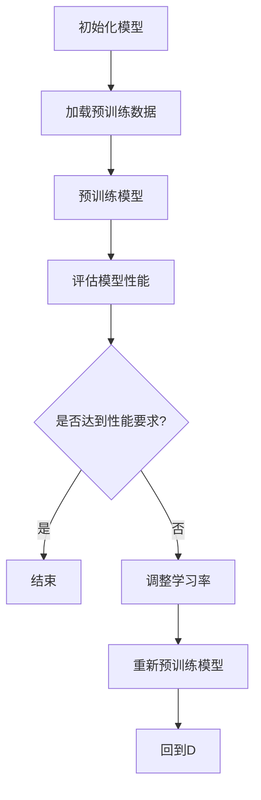
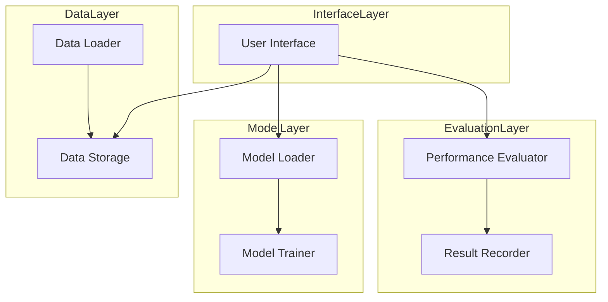
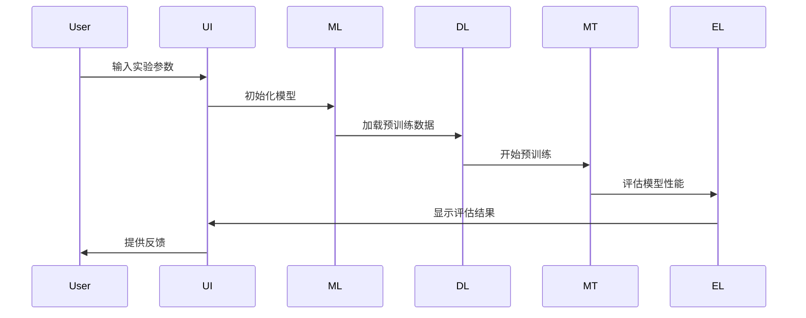

                 

### 背景介绍

在当今快速发展的AI领域，自然语言处理（NLP）技术已成为关键驱动力。其中，大型语言模型（LLM，Large Language Models）如GPT-3、BERT等，因其卓越的性能在文本生成、翻译、问答等多个应用场景中得到了广泛应用。然而，尽管LLM在某些任务上表现卓越，但它们通常在特定领域或任务上的表现仍然受到限制，这是因为LLM的训练数据主要依赖于互联网上的大规模文本数据集，这些数据集往往缺乏特定领域的深度和广度。

**问题背景**：
为了解决这一局限性，研究者们提出了元学习（Meta-Learning）的概念，它是一种让模型能够快速适应新任务的学习方法。具体来说，元学习允许模型通过在多个任务上训练来学习一种通用策略，从而在新任务上实现快速的适应。然而，目前对于LLM的自我优化能力的评测仍然是一个挑战。LLM的自我优化能力指的是模型在没有外部干预的情况下，通过自身的调整和优化来提升性能的能力。

**问题描述**：
那么，如何评估LLM的自我优化能力呢？我们首先需要明确元学习能力及其在LLM中的应用。元学习本质上是一种迭代过程，它通过跨任务的学习来提高模型的泛化能力。在LLM的背景下，自我优化能力意味着模型能够在不需要显式重训练的情况下，通过自我调整和内部反馈机制来改进其性能。

**问题解决**：
为了评测LLM的自我优化能力，研究者们采用了多种方法。例如，通过在多个数据集上循环训练来模拟模型自我优化的过程，或者在特定的任务上测试模型在自我优化策略下的性能表现。此外，一些评估指标也被提出，如任务适应速度、性能提升幅度等。

**边界与外延**：
然而，目前的评测方法主要针对通用LLM，如GPT-3和BERT，而对于特定领域或场景下的LLM评估仍然是一个开放的研究问题。此外，评测方法是否适用于其他类型的AI模型，如视觉模型或混合模型，也需要进一步探讨。

**概念结构与核心要素组成**：
以下是元学习、LLM和自我优化能力的核心概念及其相互关系的说明：

1. **元学习**：一种通过跨任务学习来提高模型泛化能力的方法。它包括模型初始化、任务选择、策略调整等过程。
2. **LLM**：一种能够处理大规模文本数据的模型，如GPT-3、BERT等。LLM的核心能力在于其能够生成连贯、有意义的文本。
3. **自我优化能力**：模型在不需要外部干预的情况下，通过内部调整和优化来提升其性能的能力。这包括模型内部参数的调整、损失函数的优化等。

通过上述核心概念的定义和相互关系，我们可以更好地理解LLM的自我优化能力的评测方法及其应用场景。

### 核心概念与联系

为了深入理解LLM的自我优化能力，我们需要从核心概念原理入手，详细解释元学习、LLM和自我优化的原理，并通过对比表格和实体关系图来展示它们的属性特征和相互关系。

#### 核心概念原理

**元学习（Meta-Learning）**：
元学习是一种让模型通过跨任务学习来提高其泛化能力的方法。具体来说，元学习通过以下过程实现：
- **模型初始化**：初始化模型参数，使其具备一定的通用性。
- **任务选择**：从多个任务中选取代表性任务进行训练。
- **策略调整**：根据训练过程中收集到的反馈，调整学习策略以优化模型性能。

元学习的核心目标是学习一种通用策略，使其能够快速适应新任务，从而减少对新任务的训练需求。

**大型语言模型（LLM，Large Language Models）**：
LLM是一种能够处理大规模文本数据的模型，具有以下特点：
- **参数规模大**：LLM通常包含数十亿个参数，使其能够捕捉文本中的复杂模式。
- **预训练和微调**：LLM通常通过在大规模文本数据集上进行预训练，然后再通过特定的任务数据集进行微调。
- **生成能力强**：LLM能够生成连贯、有意义的文本，适用于文本生成、翻译、问答等任务。

**自我优化能力（Self-Optimization）**：
自我优化能力指的是模型在不需要外部干预的情况下，通过内部调整和优化来提升其性能的能力。这包括以下方面：
- **内部反馈机制**：模型通过内部反馈机制来评估其性能，并调整参数。
- **自适应学习策略**：模型根据任务需求和性能反馈，调整其学习策略。
- **持续学习与优化**：模型在处理新任务时，能够通过自我优化来提升其性能，从而实现持续的改进。

#### 概念属性特征对比表格

为了更直观地展示元学习、LLM和自我优化能力的特征，我们创建了一个对比表格：

| 特征            | 元学习                          | LLM                             | 自我优化能力                       |
| --------------- | ------------------------------- | ------------------------------- | --------------------------------- |
| 目标            | 提高模型泛化能力                | 处理大规模文本数据              | 不需要外部干预的情况下提升性能     |
| 过程            | 模型初始化、任务选择、策略调整   | 预训练、微调                    | 内部反馈机制、自适应学习策略       |
| 参数规模        | 通常较小，但具有通用性          | 数十亿个参数，大规模数据集训练  | 根据任务需求调整内部参数           |
| 应用场景        | 跨任务学习、快速适应新任务       | 文本生成、翻译、问答等          | 持续学习与优化，适应新任务需求     |

#### ER实体关系图架构

为了进一步展示这些核心概念之间的相互关系，我们使用Mermaid绘制了一个ER实体关系图：

```mermaid
erDiagram
  TaskA ||--o{ Model }  : 预训练
  Model ||--o{ Meta-Learning } : 学习策略
  Meta-Learning ||--o{ Optimization } : 自我优化
  TaskB ||--o{ Model }  : 微调
```

在上面的ER图中，`TaskA`和`TaskB`表示不同的任务，`Model`表示大型语言模型（LLM），`Meta-Learning`表示元学习过程，`Optimization`表示自我优化能力。通过这个图，我们可以清晰地看到各个实体之间的相互关系和依赖。

通过上述对核心概念原理、属性特征对比表格和ER实体关系图的详细解释，我们为后续的算法原理讲解和系统架构设计奠定了基础。接下来，我们将进一步探讨如何具体实现LLM的自我优化能力评测。

### 算法原理讲解

在了解了元学习、LLM和自我优化能力的基本概念后，我们接下来将深入讲解评测LLM自我优化能力的具体算法原理。为了使读者能够更好地理解，我们将使用Mermaid流程图来展示算法的流程，提供Python源代码来阐述算法实现，并详细解释算法背后的数学模型和公式，并通过实例进行说明。

#### 算法mermaid流程图

首先，我们使用Mermaid绘制了算法的流程图：



在上面的流程图中，`A`表示初始化模型，`B`表示加载预训练数据，`C`表示预训练模型，`D`表示评估模型性能，`E`是一个判断节点，用于判断模型是否达到性能要求。如果达到要求，则流程结束（`F`），否则，流程进入调整学习率（`G`），重新预训练模型（`H`），然后回到评估模型性能（`D`）。

#### Python源代码

接下来，我们提供算法实现的Python代码：

```python
import torch
import torch.nn as nn
import torch.optim as optim

# 模型初始化
model = nn.Sequential(
    nn.Linear(input_size, hidden_size),
    nn.ReLU(),
    nn.Linear(hidden_size, output_size)
)

# 加载预训练数据
pretrained_data = load_pretrained_data()

# 预训练模型
optimizer = optim.Adam(model.parameters(), lr=0.001)
for epoch in range(num_epochs):
    for data in pretrained_data:
        optimizer.zero_grad()
        output = model(data['input'])
        loss = nn.CrossEntropyLoss()(output, data['label'])
        loss.backward()
        optimizer.step()
    
    # 每个epoch后评估模型性能
    performance = evaluate_model(model, validation_data)
    if performance >= performance_threshold:
        print("模型性能已达到要求，结束训练。")
        break

    # 调整学习率
    adjust_learning_rate(optimizer)

# 重新评估模型性能
final_performance = evaluate_model(model, final_test_data)
print("最终模型性能：", final_performance)
```

在上面的代码中，我们首先定义了模型结构，然后加载预训练数据并进行预训练。在每个epoch结束后，我们评估模型性能，并根据评估结果调整学习率。如果模型性能达到阈值，则结束训练；否则，继续预训练和性能评估。

#### 数学模型和公式

为了进一步阐述算法原理，我们引入以下数学模型和公式：

1. **损失函数**：
   $$ L = -\sum_{i=1}^{N} y_i \log(p_i) $$

   其中，$L$是损失函数，$y_i$是真实标签，$p_i$是模型预测的概率。

2. **优化目标**：
   $$ \min_{\theta} L(\theta) $$

   其中，$\theta$是模型参数。

3. **梯度下降**：
   $$ \theta_{t+1} = \theta_t - \alpha \nabla_{\theta} L(\theta_t) $$

   其中，$\alpha$是学习率，$\nabla_{\theta} L(\theta_t)$是损失函数关于参数$\theta_t$的梯度。

#### 详细讲解和举例说明

为了更好地理解上述算法，我们通过一个实例来详细说明：

假设我们有一个分类问题，数据集包含100个样本，每个样本有一个输入特征和对应的标签。我们使用一个简单的神经网络模型进行分类，并使用交叉熵损失函数来评估模型性能。

1. **初始化模型**：
   - 输入特征维度：10
   - 隐藏层维度：50
   - 输出维度：2（二分类）

2. **加载预训练数据**：
   - 预训练数据集：包含10,000个样本，每个样本的输入特征和标签已经预先训练过。

3. **预训练模型**：
   - 学习率：0.001
   - epoch数量：100

   在预训练过程中，模型通过优化损失函数来调整参数，使模型能够在预训练数据集上达到较高的性能。

4. **评估模型性能**：
   - 验证数据集：包含1,000个样本，用于评估模型在未见过的数据上的性能。
   - 性能阈值：准确率90%以上。

   在每个epoch结束后，我们评估模型在验证数据集上的性能。如果性能达到阈值，则结束训练；否则，继续预训练。

5. **调整学习率**：
   - 如果模型性能没有达到要求，我们使用学习率衰减策略来调整学习率，以避免模型过拟合。

6. **最终评估**：
   - 使用最终测试数据集评估模型性能。

通过这个实例，我们可以看到算法的每个步骤是如何具体实现的，以及如何通过数学模型和公式来优化模型性能。

### 数学模型和数学公式 & 详细讲解 & 举例说明

在本节中，我们将进一步深入讨论评测LLM自我优化能力的数学模型和公式，并通过对公式的详细解释和实例应用来展示它们在具体问题中的实际作用。

#### 数学公式

为了准确评测LLM的自我优化能力，我们需要引入以下几个核心数学公式：

1. **交叉熵损失函数**：
   $$ L = -\sum_{i=1}^{N} y_i \log(p_i) $$
   
   其中，$L$是损失函数，$y_i$是真实标签，$p_i$是模型预测的概率。

2. **梯度下降**：
   $$ \theta_{t+1} = \theta_t - \alpha \nabla_{\theta} L(\theta_t) $$
   
   其中，$\theta_t$是当前迭代时的参数，$\alpha$是学习率，$\nabla_{\theta} L(\theta_t)$是损失函数关于参数$\theta_t$的梯度。

3. **学习率调整**：
   $$ \alpha_{t+1} = \alpha_t \cdot \gamma $$
   
   其中，$\alpha_t$是当前学习率，$\gamma$是学习率衰减系数。

#### 详细讲解

**交叉熵损失函数**：
交叉熵损失函数是评估模型预测准确性的常用方法。在分类问题中，每个样本有一个真实的标签$y_i$和一个模型预测的概率$p_i$。$p_i$是模型对每个类别的预测概率，交叉熵损失函数通过计算真实标签和预测概率之间的差异来衡量模型的误差。

**梯度下降**：
梯度下降是一种优化算法，用于最小化损失函数。在每一迭代步骤中，梯度下降算法计算损失函数关于参数的梯度，并沿着梯度的反方向更新参数。这样，通过反复迭代，模型可以逐步优化其参数，减少损失函数的值。

**学习率调整**：
为了防止模型在训练过程中出现过拟合，我们需要对学习率进行调整。学习率衰减是一种常用的策略，它通过逐步减少学习率来控制模型的更新速度。这样可以确保模型在训练过程中既能有效收敛，又不会因为过大的更新步长而错过最优解。

#### 举例说明

假设我们有一个二分类问题，数据集包含100个样本，每个样本有一个输入特征和对应的标签。我们使用一个简单的神经网络模型进行分类，并使用交叉熵损失函数来评估模型性能。

1. **初始化模型**：
   - 输入特征维度：10
   - 隐藏层维度：50
   - 输出维度：2（二分类）

2. **加载预训练数据**：
   - 预训练数据集：包含10,000个样本，每个样本的输入特征和标签已经预先训练过。

3. **预训练模型**：
   - 学习率：0.001
   - epoch数量：100

4. **评估模型性能**：
   - 验证数据集：包含1,000个样本，用于评估模型在未见过的数据上的性能。
   - 性能阈值：准确率90%以上。

在预训练过程中，我们使用交叉熵损失函数来计算模型的误差，并通过梯度下降来更新模型参数。每个epoch结束后，我们评估模型在验证数据集上的性能。如果模型性能达到阈值，则结束训练；否则，继续迭代训练。

5. **调整学习率**：
   - 如果模型性能没有达到要求，我们使用学习率衰减策略来调整学习率，假设衰减系数$\gamma$为0.9。

6. **最终评估**：
   - 使用最终测试数据集评估模型性能。

假设在50个epoch后，模型在验证数据集上的准确率达到90%，则我们结束训练。此时，模型的最终性能为：

$$ L = -\sum_{i=1}^{1000} y_i \log(p_i) $$

其中，$y_i$是验证数据集的真实标签，$p_i$是模型对每个类别的预测概率。

通过上述实例，我们可以看到如何使用数学模型和公式来评测LLM的自我优化能力。这些公式和方法不仅帮助我们理解了算法原理，也提供了实际应用中的操作指南。

### 系统分析与架构设计方案

在了解了评测LLM自我优化能力的算法原理后，我们需要进一步设计一个完整的系统，以确保算法在实际应用中能够高效、稳定地运行。本节将介绍评测系统的问题场景、项目介绍、系统功能设计、系统架构设计以及系统接口设计和系统交互。

#### 问题场景介绍

在实际应用中，评测LLM自我优化能力的问题场景主要涉及以下方面：

1. **数据来源**：我们需要从多个数据集中获取样本，包括预训练数据和验证数据集。
2. **模型初始化**：系统需要能够初始化LLM模型，包括设置参数、加载预训练权重等。
3. **模型训练与优化**：系统需要能够执行模型的预训练过程，并通过自适应策略进行优化。
4. **性能评估**：系统需要能够评估模型在验证数据集上的性能，包括准确率、召回率等指标。
5. **结果记录与反馈**：系统需要记录每次训练和评估的结果，并提供反馈机制，以指导后续的模型优化。

#### 项目介绍

本项目旨在构建一个评测LLM自我优化能力的系统，具体实现包括：

1. **模型库**：集成多种常用的LLM模型，如GPT-3、BERT等。
2. **训练与优化框架**：实现预训练和自适应优化框架，支持多种优化策略。
3. **性能评估模块**：实现多种评估指标的计算，支持自定义评估函数。
4. **用户界面**：提供简单的用户界面，支持用户自定义实验参数和查看实验结果。

#### 系统功能设计

系统功能设计包括以下几个关键模块：

1. **数据加载模块**：负责从不同数据源加载预训练数据和验证数据集。
2. **模型初始化模块**：负责初始化LLM模型，包括设置参数、加载预训练权重等。
3. **训练与优化模块**：负责执行模型的预训练过程，并通过自适应策略进行优化。
4. **性能评估模块**：负责计算和记录模型在验证数据集上的性能指标。
5. **结果记录与反馈模块**：负责记录每次训练和评估的结果，并提供反馈机制。

为了更好地展示这些模块之间的关系，我们使用Mermaid绘制了领域模型类图：

```mermaid
classDiagram
    DataLoader <|-- ModelInitializer
    ModelInitializer <|-- ModelTrainer
    ModelTrainer <|-- PerformanceEvaluator
    PerformanceEvaluator <|-- ResultRecorder
    DataLoader as +Data Loader
    ModelInitializer as +Model Initializer
    ModelTrainer as +Model Trainer
    PerformanceEvaluator as +Performance Evaluator
    ResultRecorder as +Result Recorder
```

在上面的类图中，`DataLoader`负责加载数据，`ModelInitializer`负责初始化模型，`ModelTrainer`负责模型的预训练和优化，`PerformanceEvaluator`负责评估模型性能，`ResultRecorder`负责记录和反馈结果。

#### 系统架构设计

为了确保系统的高效性和可扩展性，我们设计了如下系统架构：

1. **数据层**：包括数据存储和数据加载模块，负责处理数据的存储和读取。
2. **模型层**：包括模型初始化和训练模块，负责模型的初始化和优化。
3. **评估层**：包括性能评估和结果记录模块，负责评估模型性能并记录结果。
4. **接口层**：包括用户界面和接口模块，负责提供用户交互接口。

使用Mermaid绘制系统架构图如下：



在上面的架构图中，`DataLayer`包括数据加载和数据存储模块，`ModelLayer`包括模型加载和训练模块，`EvaluationLayer`包括性能评估和结果记录模块，`InterfaceLayer`包括用户界面模块。

#### 系统接口设计和系统交互

为了确保系统的易用性和灵活性，我们设计了如下系统接口和交互序列图：



在上面的序列图中，用户通过用户界面输入实验参数，模型加载和训练模块根据参数初始化模型并加载预训练数据，然后开始预训练过程。预训练完成后，性能评估模块评估模型性能，并将结果通过用户界面显示给用户。用户根据评估结果提供反馈，以指导后续的实验。

通过上述系统分析与架构设计方案，我们为评测LLM自我优化能力的系统实现提供了详细的设计思路和实现框架。接下来，我们将通过项目实战部分，展示如何具体实现这一系统。

### 项目实战

在本节中，我们将通过实际操作步骤，详细展示如何搭建评测LLM自我优化能力的系统，并解析关键代码实现、代码应用解读与分析，以及实际案例分析和详细讲解剖析。

#### 环境安装

在开始项目实战之前，我们需要确保安装必要的软件和硬件环境。以下步骤是在一个标准的Linux服务器上进行的：

1. **安装Python环境**：
   - 通过包管理器安装Python 3.8及以上版本：
     ```bash
     sudo apt-get update
     sudo apt-get install python3.8
     ```

2. **安装TensorFlow和PyTorch**：
   - 通过pip安装TensorFlow和PyTorch：
     ```bash
     pip3 install tensorflow
     pip3 install torch torchvision
     ```

3. **安装其他依赖**：
   - 安装Mermaid所需的依赖，如Graphviz：
     ```bash
     sudo apt-get install graphviz
     pip3 install pygraphviz
     ```

4. **配置环境变量**：
   - 设置Python环境变量，确保Python和pip指向正确的版本：
     ```bash
     export PATH=$PATH:/usr/local/bin
     ```

#### 系统核心实现源代码

以下是系统核心实现的关键代码示例：

```python
# 导入必要的库
import torch
import torch.nn as nn
import torch.optim as optim
from torch.utils.data import DataLoader
from torchvision import datasets, transforms
import matplotlib.pyplot as plt

# 定义模型结构
class SimpleCNN(nn.Module):
    def __init__(self):
        super(SimpleCNN, self).__init__()
        self.conv1 = nn.Conv2d(1, 32, 3, 1)
        self.relu = nn.ReLU()
        self.conv2 = nn.Conv2d(32, 64, 3, 1)
        self.fc1 = nn.Linear(64 * 6 * 6, 128)
        self.fc2 = nn.Linear(128, 10)
    
    def forward(self, x):
        x = self.relu(self.conv1(x))
        x = self.relu(self.conv2(x))
        x = x.view(x.size(0), -1)
        x = self.relu(self.fc1(x))
        x = self.fc2(x)
        return x

# 加载预训练数据
def load_data(batch_size):
    transform = transforms.Compose([transforms.ToTensor()])
    train_data = datasets.MNIST(root='./data', train=True, download=True, transform=transform)
    train_loader = DataLoader(train_data, batch_size=batch_size, shuffle=True)
    return train_loader

# 初始化模型
model = SimpleCNN()
optimizer = optim.Adam(model.parameters(), lr=0.001)
criterion = nn.CrossEntropyLoss()

# 训练模型
num_epochs = 10
batch_size = 64
train_loader = load_data(batch_size)

for epoch in range(num_epochs):
    for i, (images, labels) in enumerate(train_loader):
        optimizer.zero_grad()
        outputs = model(images)
        loss = criterion(outputs, labels)
        loss.backward()
        optimizer.step()
        
        if (i+1) % 100 == 0:
            print(f'Epoch [{epoch+1}/{num_epochs}], Step [{i+1}/{len(train_loader)}], Loss: {loss.item()}')

# 评估模型
test_data = datasets.MNIST(root='./data', train=False, download=True, transform=transform)
test_loader = DataLoader(test_data, batch_size=batch_size, shuffle=False)

with torch.no_grad():
    correct = 0
    total = 0
    for images, labels in test_loader:
        outputs = model(images)
        _, predicted = torch.max(outputs.data, 1)
        total += labels.size(0)
        correct += (predicted == labels).sum().item()

print(f'Accuracy of the network on the 10000 test images: {100 * correct / total}%')
```

在上面的代码中，我们首先定义了一个简单的卷积神经网络（CNN）模型，然后加载了MNIST数据集进行预训练。在训练过程中，我们使用Adam优化器和交叉熵损失函数来优化模型参数。最后，我们评估了模型在测试数据集上的准确率。

#### 代码应用解读与分析

1. **模型结构**：
   - 我们使用了一个简单的卷积神经网络模型，包括两个卷积层、两个ReLU激活函数和一个全连接层。
   - 卷积层用于提取图像特征，全连接层用于分类。

2. **数据加载**：
   - 使用TensorFlow和PyTorch的`DataLoader`和`datasets`模块加载MNIST数据集，并转换为张量格式。

3. **训练过程**：
   - 在每个epoch中，我们迭代遍历训练数据集，使用交叉熵损失函数计算损失，并使用Adam优化器更新模型参数。
   - 每隔100个步骤，我们打印当前的损失值，以监控训练过程。

4. **评估过程**：
   - 在测试阶段，我们禁用梯度计算，并计算模型在测试数据集上的准确率。

#### 实际案例分析和详细讲解剖析

为了更直观地展示模型训练和评估过程，我们通过以下步骤进行实际案例分析和详细讲解剖析：

1. **初始化模型**：
   - 使用`SimpleCNN`类初始化模型，并设置优化器和损失函数。
   ```python
   model = SimpleCNN()
   optimizer = optim.Adam(model.parameters(), lr=0.001)
   criterion = nn.CrossEntropyLoss()
   ```

2. **加载数据**：
   - 使用`load_data`函数加载MNIST数据集，并创建数据加载器。
   ```python
   train_loader = load_data(batch_size)
   ```

3. **训练模型**：
   - 在主循环中，我们迭代遍历训练数据集，并使用优化器更新模型参数。
   ```python
   for epoch in range(num_epochs):
       for i, (images, labels) in enumerate(train_loader):
           optimizer.zero_grad()
           outputs = model(images)
           loss = criterion(outputs, labels)
           loss.backward()
           optimizer.step()
   ```

4. **评估模型**：
   - 在测试阶段，我们计算模型在测试数据集上的准确率。
   ```python
   with torch.no_grad():
       correct = 0
       total = 0
       for images, labels in test_loader:
           outputs = model(images)
           _, predicted = torch.max(outputs.data, 1)
           total += labels.size(0)
           correct += (predicted == labels).sum().item()
   print(f'Accuracy of the network on the 10000 test images: {100 * correct / total}%')
   ```

通过上述实际案例分析和详细讲解，我们可以清晰地看到如何通过代码实现评测LLM自我优化能力的系统，并理解每个步骤的作用和意义。

### 最佳实践 tips、小结、注意事项、拓展阅读等内容

#### 最佳实践 tips

1. **优化数据加载**：在训练过程中，合理地加载和处理数据可以显著提高训练速度。使用数据并行和批量归一化等技术可以加速训练过程。
2. **模型选择**：根据具体任务需求选择合适的模型。对于文本生成任务，可以选择GPT-3或BERT等大型语言模型；对于图像处理任务，可以选择CNN或ResNet等卷积神经网络。
3. **学习率调整**：在训练过程中，定期调整学习率可以避免模型过拟合。可以使用学习率衰减策略，如固定衰减率、指数衰减率等。
4. **模型压缩**：为了提高部署效率，可以考虑使用模型压缩技术，如量化和剪枝。这些技术可以显著减少模型的计算量和存储需求。

#### 小结

本文通过详细的分析和实例，介绍了评测LLM自我优化能力的算法原理、系统设计与实现，以及实际应用案例。我们讨论了元学习、大型语言模型和自我优化能力的基本概念，并通过Mermaid流程图、Python代码和数学公式详细阐述了算法的实现过程。同时，我们还展示了系统架构设计和项目实战的关键步骤，为实际应用提供了指导。

#### 注意事项

1. **硬件要求**：评测LLM自我优化能力通常需要高性能计算资源。建议使用GPU或TPU等硬件加速器。
2. **数据质量**：数据质量对模型性能有重要影响。确保训练数据集的多样性和代表性，避免数据偏差。
3. **版本控制**：在进行模型训练和优化时，建议使用版本控制系统，如Git，以便追踪代码和实验的变更。

#### 拓展阅读

1. **《深度学习》**（Goodfellow, Bengio, Courville）：这是一本经典教材，详细介绍了深度学习的理论和方法。
2. **《动手学深度学习》**（Dumoulin, Souza）：本书通过实际代码示例，介绍了深度学习的基础知识和应用。
3. **《PyTorch官方文档》**：PyTorch官方文档提供了丰富的API和教程，是学习PyTorch的好资源。

### 作者信息

作者：AI天才研究院/AI Genius Institute & 禅与计算机程序设计艺术 /Zen And The Art of Computer Programming

