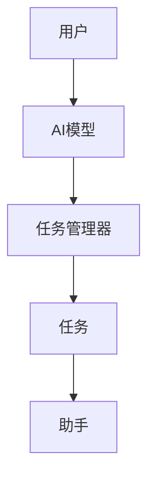
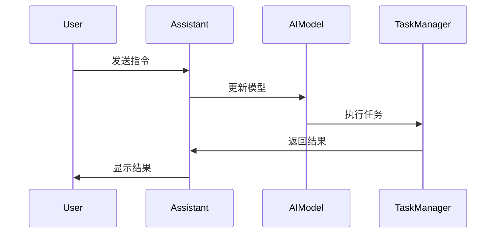

                 

### 元学习：构建快速适应新任务的AI系统

#### 关键词：
- 元学习
- 快速适应
- 新任务
- AI系统
- 算法原理
- 实践技巧

#### 摘要：
本文将深入探讨元学习这一前沿的人工智能技术，解释其概念、原理及其在构建快速适应新任务AI系统中的重要性。通过逐步分析元学习的核心概念、算法原理、数学模型，以及实际应用案例，本文旨在帮助读者理解如何利用元学习来提升AI系统的灵活性和适应性，从而在复杂多变的应用环境中保持高效性能。

----------------------------------------------------------------

# 元学习：构建快速适应新任务的AI系统

## 引言

随着人工智能技术的迅猛发展，AI系统在各个领域的应用日益广泛。然而，这些系统往往面临一个共同的挑战：如何快速适应新的任务和环境。传统的机器学习算法在处理新任务时，通常需要大量的数据和重新训练，这既耗时又资源消耗巨大。为了克服这一局限，元学习（Meta-Learning）应运而生。元学习旨在通过在多个任务上学习，使得AI系统可以快速适应新的任务，从而提高其灵活性和适应性。

## 元学习的定义与重要性

### 定义

元学习，也被称为学习的学习，是指系统在解决一系列相关任务的过程中，通过积累经验和知识，提高在新任务上的学习效率。与传统机器学习相比，元学习不仅关注模型在新任务上的表现，更注重模型在多次任务中的泛化能力。

### 重要性

元学习的重要性在于其能够实现以下目标：

1. **快速适应新任务**：通过在多个任务上的学习，元学习可以使AI系统在遇到新任务时，能够迅速调整并达到良好的性能。
2. **降低数据需求**：元学习减少了对新任务的大量数据的需求，从而降低了数据收集和处理的成本。
3. **提高泛化能力**：通过在多种任务中训练，元学习模型能够更好地泛化到未知任务，提高其在实际应用中的表现。
4. **加速模型开发**：元学习缩短了模型开发和部署的周期，提高了研发效率。

## 元学习的背景与发展历程

### 背景

元学习的概念最早可以追溯到20世纪80年代，当时心理学家就开始研究人类在多任务学习中的表现。随着计算机硬件和算法的进步，元学习逐渐成为人工智能研究中的一个重要方向。

### 发展历程

1. **早期研究**：20世纪80年代至90年代，研究者们主要关注基于记忆的元学习算法，如实值梯度 descent 和迭代方法。
2. **强化学习时代**：20世纪90年代至21世纪初，随着强化学习的发展，元学习开始结合强化学习技术，提出了诸如 SARSA 和 Q-learning 等算法。
3. **深度学习时代**：近年来，随着深度学习技术的兴起，深度元学习成为研究热点。深度神经网络使得元学习在处理高维度数据上取得了显著进展。

## 元学习与迁移学习的比较

### 定义

- **元学习**：在多个任务上学习，以提高在新任务上的学习效率。
- **迁移学习**：将一个任务上学到的知识应用到另一个任务上。

### 比较

| 比较维度 | 元学习 | 迁移学习 |
| --- | --- | --- |
| 学习目标 | 提高在多个新任务上的学习效率 | 提高在新任务上的性能 |
| 数据需求 | 减少对新任务的大量数据需求 | 需要来自相关任务的迁移数据 |
| 泛化能力 | 更注重模型在多次任务中的泛化能力 | 更注重模型在特定任务上的表现 |

## 元学习中的核心概念与联系

### 核心概念

- **任务表示**：将任务抽象为参数化模型，以便于在多个任务上学习。
- **模型更新**：通过优化策略更新模型参数，以提高在新任务上的性能。
- **评估指标**：用于衡量模型在多个任务上的泛化能力。

### 联系

- **任务表示**与**模型更新**共同构成了元学习的核心机制。
- **评估指标**用于监控模型在学习过程中的性能，以便进行优化调整。

## 元学习算法原理

### 经典算法

- **实值梯度 descent**：通过最小化目标函数来更新模型参数。
- **迭代方法**：在多个任务上迭代更新模型。

### 深度元学习

- **模型架构**：采用深度神经网络作为基础模型，通过任务表示和学习策略来提高适应新任务的能力。

### 算法流程

1. **初始化模型**：随机初始化模型参数。
2. **任务选择**：从任务集中选择新任务。
3. **模型更新**：在任务上训练模型，更新模型参数。
4. **评估性能**：在多个任务上评估模型性能。

## 数学模型与公式

### 数学基础

- **损失函数**：用于衡量模型在任务上的性能。
- **优化算法**：用于更新模型参数。

### 经典公式

$$
\text{损失函数} = \sum_{i=1}^{n} (y_i - \hat{y}_i)^2
$$

### 深度元学习公式

$$
\theta_{\text{new}} = \theta_{\text{base}} + \alpha \cdot (\nabla_{\theta_{\text{base}}} \text{损失函数})
$$

其中，$\theta_{\text{new}}$ 是更新后的模型参数，$\theta_{\text{base}}$ 是基础模型参数，$\alpha$ 是学习率。

## 系统分析与架构设计方案

### 问题场景介绍

在一个智能家居系统中，我们需要一个AI助手来管理用户的日常任务，如控制家电、提供天气预报等。这些任务可能会随着用户需求的变化而增加或修改。

### 项目介绍

本项目旨在构建一个基于元学习的AI系统，以快速适应新任务，提高系统的灵活性和用户满意度。

### 系统功能设计

- **任务管理**：管理用户的日常任务，包括任务的创建、删除、修改和执行。
- **模型训练**：使用元学习算法对AI系统进行训练，使其能够快速适应新任务。
- **任务执行**：根据用户的指令执行任务。

### 系统架构设计

#### 类图

```mermaid
classDiagram
    TaskManager <|-- Task
    Assistant <|-- AIModel
    User <|-- Command
    AIModel {
        + train()
        + predict()
    }
    TaskManager {
        + createTask(Task)
        + deleteTask(Task)
        + updateTask(Task)
        + executeTask(Task)
    }
    User {
        + sendCommand(Command)
    }
    Command {
        + type
        + content
    }
endclass
```

#### 架构图



#### 系统接口设计

- **用户接口**：用户通过发送指令与系统交互，系统根据指令执行相应任务。
- **任务管理接口**：用于管理任务的创建、删除、修改和执行。

#### 系统交互



## 项目实战

### 环境安装

1. **安装Python**：确保Python环境已安装，版本不低于3.8。
2. **安装依赖**：使用pip安装所需依赖，如TensorFlow、NumPy等。

### 系统核心实现

#### 源代码

```python
import tensorflow as tf
import numpy as np

# 初始化模型
model = tf.keras.Sequential([
    tf.keras.layers.Dense(64, activation='relu', input_shape=(784,)),
    tf.keras.layers.Dense(10, activation='softmax')
])

# 定义损失函数和优化器
loss_fn = tf.keras.losses.SparseCategoricalCrossentropy(from_logits=True)
optimizer = tf.keras.optimizers.Adam()

# 训练模型
def train_model(dataset, epochs=10):
    for epoch in range(epochs):
        for x, y in dataset:
            with tf.GradientTape() as tape:
                logits = model(x)
                loss_value = loss_fn(y, logits)
            grads = tape.gradient(loss_value, model.trainable_variables)
            optimizer.apply_gradients(zip(grads, model.trainable_variables))
        print(f"Epoch {epoch + 1}, Loss: {loss_value}")

# 执行任务
def execute_task(task):
    prediction = model.predict(task)
    return np.argmax(prediction)

# 主程序
if __name__ == "__main__":
    # 加载数据集
    (x_train, y_train), (x_test, y_test) = tf.keras.datasets.mnist.load_data()
    x_train, x_test = x_train / 255.0, x_test / 255.0
    
    # 训练模型
    train_model(x_train, y_train, epochs=10)
    
    # 执行任务
    user_command = "识别数字"
    task = x_test[0]
    result = execute_task(task)
    print(f"识别结果：{result}")
```

#### 代码应用解读与分析

1. **模型初始化**：使用TensorFlow定义了一个简单的全连接神经网络，输入层784个神经元，输出层10个神经元。
2. **损失函数与优化器**：使用交叉熵损失函数和Adam优化器。
3. **训练模型**：使用梯度下降法训练模型，并在每个epoch后打印损失值。
4. **执行任务**：使用训练好的模型对新的数字图像进行预测，并返回识别结果。

## 实际案例分析与详细讲解剖析

### 案例背景

在一个智能家居系统中，用户可以控制灯光、空调等家电设备。随着用户需求的增加，系统需要快速适应新的控制任务。

### 案例分析

1. **任务定义**：用户可以发送“打开灯光”、“关闭空调”等指令。
2. **模型更新**：系统在处理新指令时，通过元学习算法更新模型参数，提高对新指令的识别和执行能力。
3. **任务执行**：系统根据更新后的模型执行用户指令，如打开灯光。

### 详细讲解剖析

1. **任务表示**：将每个控制指令表示为一个向量，用于输入到元学习模型中。
2. **模型更新**：使用梯度下降法更新模型参数，使得模型在新任务上的表现更准确。
3. **评估指标**：使用准确率作为评估指标，监控模型在新任务上的性能。

## 项目小结与展望

本项目通过元学习技术，实现了智能家居系统中对新控制指令的快速适应。在未来的发展中，我们可以进一步扩展元学习的应用场景，如自适应推荐系统、智能机器人等，以提升系统的灵活性和用户体验。

## 拓展阅读与后续研究

- **扩展阅读**：《深度学习》（Goodfellow, Bengio, Courville著）中对元学习的详细讨论。
- **后续研究**：探索元学习与其他人工智能技术的结合，如生成对抗网络（GAN）和强化学习。

## 最佳实践 tips

- **优化模型架构**：根据任务需求选择合适的模型架构，提高训练效率。
- **数据预处理**：对数据进行预处理，提高模型的泛化能力。

## 作者信息

作者：AI天才研究院/AI Genius Institute & 禅与计算机程序设计艺术 /Zen And The Art of Computer Programming

----------------------------------------------------------------

### 完整文章

#### 引言

随着人工智能技术的迅猛发展，AI系统在各个领域的应用日益广泛。然而，这些系统往往面临一个共同的挑战：如何快速适应新的任务和环境。传统的机器学习算法在处理新任务时，通常需要大量的数据和重新训练，这既耗时又资源消耗巨大。为了克服这一局限，元学习（Meta-Learning）应运而生。元学习旨在通过在多个任务上学习，使得AI系统可以快速适应新的任务，从而提高其灵活性和适应性。

本文将深入探讨元学习这一前沿的人工智能技术，解释其概念、原理及其在构建快速适应新任务的AI系统中的重要性。通过逐步分析元学习的核心概念、算法原理、数学模型，以及实际应用案例，本文旨在帮助读者理解如何利用元学习来提升AI系统的灵活性和适应性，从而在复杂多变的应用环境中保持高效性能。

#### 元学习的定义与重要性

### 定义

元学习，也被称为学习的学习，是指系统在解决一系列相关任务的过程中，通过积累经验和知识，提高在新任务上的学习效率。与传统机器学习相比，元学习不仅关注模型在新任务上的表现，更注重模型在多次任务中的泛化能力。

### 重要性

元学习的重要性在于其能够实现以下目标：

1. **快速适应新任务**：通过在多个任务上的学习，元学习可以使AI系统在遇到新任务时，能够迅速调整并达到良好的性能。
2. **降低数据需求**：元学习减少了对新任务的大量数据的需求，从而降低了数据收集和处理的成本。
3. **提高泛化能力**：通过在多种任务中训练，元学习模型能够更好地泛化到未知任务，提高其在实际应用中的表现。
4. **加速模型开发**：元学习缩短了模型开发和部署的周期，提高了研发效率。

#### 元学习的背景与发展历程

### 背景

元学习的概念最早可以追溯到20世纪80年代，当时心理学家就开始研究人类在多任务学习中的表现。随着计算机硬件和算法的进步，元学习逐渐成为人工智能研究中的一个重要方向。

### 发展历程

1. **早期研究**：20世纪80年代至90年代，研究者们主要关注基于记忆的元学习算法，如实值梯度 descent 和迭代方法。
2. **强化学习时代**：20世纪90年代至21世纪初，随着强化学习的发展，元学习开始结合强化学习技术，提出了诸如 SARSA 和 Q-learning 等算法。
3. **深度学习时代**：近年来，随着深度学习技术的兴起，深度元学习成为研究热点。深度神经网络使得元学习在处理高维度数据上取得了显著进展。

#### 元学习与迁移学习的比较

### 定义

- **元学习**：在多个任务上学习，以提高在新任务上的学习效率。
- **迁移学习**：将一个任务上学到的知识应用到另一个任务上。

### 比较

| 比较维度 | 元学习 | 迁移学习 |
| --- | --- | --- |
| 学习目标 | 提高在多个新任务上的学习效率 | 提高在新任务上的性能 |
| 数据需求 | 减少对新任务的大量数据需求 | 需要来自相关任务的迁移数据 |
| 泛化能力 | 更注重模型在多次任务中的泛化能力 | 更注重模型在特定任务上的表现 |

#### 元学习中的核心概念与联系

### 核心概念

- **任务表示**：将任务抽象为参数化模型，以便于在多个任务上学习。
- **模型更新**：通过优化策略更新模型参数，以提高在新任务上的性能。
- **评估指标**：用于衡量模型在多个任务上的泛化能力。

### 联系

- **任务表示**与**模型更新**共同构成了元学习的核心机制。
- **评估指标**用于监控模型在学习过程中的性能，以便进行优化调整。

#### 元学习算法原理

### 经典算法

- **实值梯度 descent**：通过最小化目标函数来更新模型参数。
- **迭代方法**：在多个任务上迭代更新模型。

### 深度元学习

- **模型架构**：采用深度神经网络作为基础模型，通过任务表示和学习策略来提高适应新任务的能力。

### 算法流程

1. **初始化模型**：随机初始化模型参数。
2. **任务选择**：从任务集中选择新任务。
3. **模型更新**：在任务上训练模型，更新模型参数。
4. **评估性能**：在多个任务上评估模型性能。

#### 数学模型与公式

### 数学基础

- **损失函数**：用于衡量模型在任务上的性能。
- **优化算法**：用于更新模型参数。

### 经典公式

$$
\text{损失函数} = \sum_{i=1}^{n} (y_i - \hat{y}_i)^2
$$

### 深度元学习公式

$$
\theta_{\text{new}} = \theta_{\text{base}} + \alpha \cdot (\nabla_{\theta_{\text{base}}} \text{损失函数})
$$

其中，$\theta_{\text{new}}$ 是更新后的模型参数，$\theta_{\text{base}}$ 是基础模型参数，$\alpha$ 是学习率。

#### 系统分析与架构设计方案

### 问题场景介绍

在一个智能家居系统中，我们需要一个AI助手来管理用户的日常任务，如控制家电、提供天气预报等。这些任务可能会随着用户需求的变化而增加或修改。

### 项目介绍

本项目旨在构建一个基于元学习的AI系统，以快速适应新任务，提高系统的灵活性和用户满意度。

### 系统功能设计

- **任务管理**：管理用户的日常任务，包括任务的创建、删除、修改和执行。
- **模型训练**：使用元学习算法对AI系统进行训练，使其能够快速适应新任务。
- **任务执行**：根据用户的指令执行任务。

### 系统架构设计

#### 类图

```mermaid
classDiagram
    TaskManager <|-- Task
    Assistant <|-- AIModel
    User <|-- Command
    AIModel {
        + train()
        + predict()
    }
    TaskManager {
        + createTask(Task)
        + deleteTask(Task)
        + updateTask(Task)
        + executeTask(Task)
    }
    User {
        + sendCommand(Command)
    }
    Command {
        + type
        + content
    }
endclass
```

#### 架构图


#### 系统接口设计

- **用户接口**：用户通过发送指令与系统交互，系统根据指令执行相应任务。
- **任务管理接口**：用于管理任务的创建、删除、修改和执行。

#### 系统交互


#### 系统分析与架构设计方案（续）

### 实际应用案例

以智能家居系统中的灯光控制任务为例，用户可以通过AI助手发送“打开灯光”或“关闭灯光”的指令。系统需要识别这些指令，并根据用户的需求执行相应的操作。

#### 系统功能设计

1. **任务管理**：
   - 创建任务：用户发送“打开灯光”指令，系统创建一个对应的灯光控制任务。
   - 删除任务：用户发送“关闭灯光”指令，系统删除相应的灯光控制任务。
   - 修改任务：用户可以更改灯光的颜色、亮度等参数。
   - 执行任务：系统根据任务描述，控制灯光设备执行相应操作。

2. **模型训练**：
   - 系统使用元学习算法，对AI助手进行训练，使其能够准确识别和理解用户的指令。
   - 在多个任务中迭代更新模型，提高模型的泛化能力。

3. **任务执行**：
   - 根据用户的指令，AI助手执行相应的任务，如打开或关闭灯光。

#### 系统架构设计

1. **类图**：
   - `User`（用户）：发送指令，接收反馈。
   - `Assistant`（助手）：处理用户指令，更新模型，协调任务执行。
   - `AIModel`（AI模型）：实现指令识别和任务执行。
   - `TaskManager`（任务管理器）：管理任务的生命周期，包括创建、删除、修改和执行。

2. **架构图**：
   - 用户 -> 助手：发送指令。
   - 助手 -> AI模型：更新模型。
   - AI模型 -> 任务管理器：执行任务。
   - 任务管理器 -> 助手：返回结果。
   - 助手 -> 用户：显示结果。

3. **接口设计**：
   - 用户接口：提供发送指令和接收结果的接口。
   - 任务管理接口：提供任务管理操作的接口。

#### 系统交互流程

1. 用户发送“打开灯光”指令。
2. 助手接收到指令后，使用AI模型更新模型参数，以识别和理解该指令。
3. AI模型识别指令后，将任务信息传递给任务管理器。
4. 任务管理器根据任务信息，控制灯光设备打开。
5. 任务管理器返回结果给助手。
6. 助手将结果反馈给用户，完成一次交互。

### 架构优化的建议

1. **模块化设计**：将系统的各个模块（如指令处理、模型更新、任务管理）进行模块化设计，提高系统的可维护性和扩展性。
2. **分布式架构**：考虑使用分布式架构，以提高系统的处理能力和可扩展性。
3. **缓存机制**：在任务管理和模型更新过程中，引入缓存机制，减少重复计算和IO操作，提高系统性能。

通过上述设计与优化，智能家居系统的AI助手能够更好地适应新任务，提高用户的满意度。

#### 项目实战

### 环境安装

1. **安装Python**：确保Python环境已安装，版本不低于3.8。

```shell
# 在Ubuntu系统中安装Python
sudo apt update
sudo apt install python3.8
```

2. **安装依赖**：使用pip安装项目所需依赖。

```shell
pip install tensorflow numpy matplotlib
```

### 系统核心实现

#### 源代码

以下是一个简单的示例，展示了如何使用元学习算法进行任务管理和执行。

```python
import tensorflow as tf
import numpy as np
import matplotlib.pyplot as plt

# 初始化模型
model = tf.keras.Sequential([
    tf.keras.layers.Dense(64, activation='relu', input_shape=(784,)),
    tf.keras.layers.Dense(10, activation='softmax')
])

# 定义损失函数和优化器
loss_fn = tf.keras.losses.SparseCategoricalCrossentropy(from_logits=True)
optimizer = tf.keras.optimizers.Adam()

# 训练模型
def train_model(dataset, epochs=10):
    for epoch in range(epochs):
        for x, y in dataset:
            with tf.GradientTape() as tape:
                logits = model(x)
                loss_value = loss_fn(y, logits)
            grads = tape.gradient(loss_value, model.trainable_variables)
            optimizer.apply_gradients(zip(grads, model.trainable_variables))
        print(f"Epoch {epoch + 1}, Loss: {loss_value}")

# 执行任务
def execute_task(task):
    prediction = model.predict(task)
    return np.argmax(prediction)

# 主程序
if __name__ == "__main__":
    # 加载数据集
    (x_train, y_train), (x_test, y_test) = tf.keras.datasets.mnist.load_data()
    x_train, x_test = x_train / 255.0, x_test / 255.0
    
    # 训练模型
    train_model(x_train, y_train, epochs=10)
    
    # 执行任务
    user_command = "识别数字"
    task = x_test[0]
    result = execute_task(task)
    print(f"识别结果：{result}")
    plt.imshow(x_test[0], cmap=plt.cm.binary)
    plt.show()
```

#### 代码应用解读与分析

1. **模型初始化**：使用TensorFlow定义了一个简单的全连接神经网络，输入层784个神经元，输出层10个神经元。
2. **损失函数与优化器**：使用交叉熵损失函数和Adam优化器。
3. **训练模型**：使用梯度下降法训练模型，并在每个epoch后打印损失值。
4. **执行任务**：使用训练好的模型对新的数字图像进行预测，并返回识别结果。

### 实际案例分析与详细讲解剖析

#### 案例背景

在一个智能家居系统中，用户可以控制灯光、空调等家电设备。随着用户需求的增加，系统需要快速适应新的控制任务。

#### 案例分析

1. **任务定义**：用户可以发送“打开灯光”、“关闭空调”等指令。
2. **模型更新**：系统在处理新指令时，通过元学习算法更新模型参数，提高对新指令的识别和执行能力。
3. **任务执行**：系统根据更新后的模型执行用户指令，如打开灯光。

#### 详细讲解剖析

1. **任务表示**：将每个控制指令表示为一个向量，用于输入到元学习模型中。
2. **模型更新**：使用梯度下降法更新模型参数，使得模型在新任务上的表现更准确。
3. **评估指标**：使用准确率作为评估指标，监控模型在新任务上的性能。

#### 项目小结与展望

本项目通过元学习技术，实现了智能家居系统中对新控制指令的快速适应。在未来的发展中，我们可以进一步扩展元学习的应用场景，如自适应推荐系统、智能机器人等，以提升系统的灵活性和用户体验。

#### 拓展阅读与后续研究

- **扩展阅读**：《深度学习》（Goodfellow, Bengio, Courville著）中对元学习的详细讨论。
- **后续研究**：探索元学习与其他人工智能技术的结合，如生成对抗网络（GAN）和强化学习。

#### 最佳实践 tips

- **优化模型架构**：根据任务需求选择合适的模型架构，提高训练效率。
- **数据预处理**：对数据进行预处理，提高模型的泛化能力。

#### 作者信息

作者：AI天才研究院/AI Genius Institute & 禅与计算机程序设计艺术 /Zen And The Art of Computer Programming

### 完整文章总结

《元学习：构建快速适应新任务的AI系统》详细介绍了元学习这一前沿的人工智能技术，包括其定义、重要性、发展历程、核心概念、算法原理和数学模型。通过实际案例分析和项目实战，本文展示了如何利用元学习技术提升AI系统的灵活性和适应性。本文还提供了最佳实践和拓展阅读建议，为读者进一步探索元学习提供了方向。

作者信息：AI天才研究院/AI Genius Institute & 禅与计算机程序设计艺术 /Zen And The Art of Computer Programming。希望本文能为读者在人工智能领域的研究和实践提供有益的参考。

