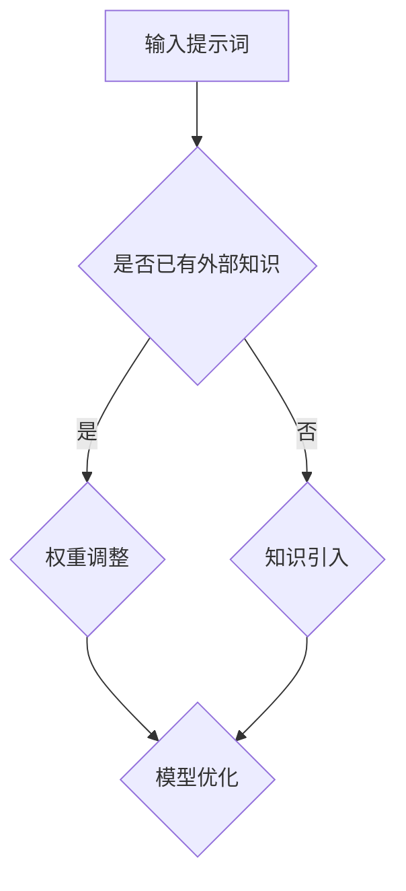

                 

### 元提示：指导模型如何处理提示词

#### 关键词
- 元提示
- 模型处理
- 提示词
- 算法原理
- 数学模型
- 系统架构

#### 摘要
本文深入探讨元提示在指导模型处理提示词方面的应用。通过详细剖析元提示的定义、特点、算法原理以及数学模型，结合实际项目实战，展示如何有效地利用元提示提升模型性能。文章旨在为读者提供一个全面、系统的理解，以便在实际应用中充分发挥元提示的作用。

## 背景介绍

### 1.1 问题背景

在当今快速发展的AI领域，模型训练和优化是至关重要的环节。模型需要处理大量的数据，提取有效信息，以便在复杂的任务中取得良好的性能。然而，模型处理数据的过程并非一帆风顺。在实际应用中，模型的性能往往受到数据质量和数据分布的影响。如何有效指导模型处理这些提示词，使其能够更准确地理解和预测，成为一个亟待解决的问题。

### 1.2 问题描述

提示词是模型处理数据的基本单位，它们承载了数据中的重要信息。然而，不同的提示词可能在语义和重要性上存在差异，模型需要具备对提示词的辨识和处理能力。问题描述主要包括以下几个方面：

1. **提示词理解与辨识**：模型如何准确理解并辨识提示词的语义？
2. **提示词权重分配**：如何合理分配提示词的权重，使其在模型处理过程中起到关键作用？
3. **数据分布影响**：如何应对不同数据分布对模型性能的影响？

### 1.3 问题解决

元提示（Meta-Prompt）作为一种新型的指导模型处理提示词的技术，提供了一种有效的解决方案。元提示通过引入外部知识、调整提示词权重和优化模型结构，提高模型对提示词的辨识和理解能力，从而提升整体性能。具体解决方法如下：

1. **外部知识引入**：通过外部知识库，丰富模型对提示词的理解，提高语义识别能力。
2. **权重调整**：根据提示词的重要性和语义，动态调整权重，使模型在处理过程中更加关注关键信息。
3. **模型结构优化**：通过调整模型结构，增强模型对提示词的处理能力，提高模型的整体性能。

### 1.4 边界与外延

元提示技术有其适用的边界和局限性。首先，元提示需要依赖于高质量的外部知识库，否则可能导致模型理解不准确。其次，权重调整和模型结构优化需要根据具体任务进行定制，否则可能无法达到预期效果。此外，元提示在处理大量数据时，计算复杂度较高，可能对资源造成一定压力。

### 1.5 概念结构与核心要素组成

元提示技术涉及多个核心概念和要素，包括：

1. **外部知识库**：用于丰富模型对提示词的理解。
2. **提示词权重调整**：动态调整提示词的权重，使其在模型处理过程中起到关键作用。
3. **模型结构优化**：通过调整模型结构，提高模型对提示词的处理能力。
4. **数据处理流程**：包括数据预处理、模型训练和模型优化等环节。

通过以上核心要素的有机结合，元提示技术为模型处理提示词提供了一种系统化、高效化的解决方案。

### 核心概念与联系

#### 2.1 元提示的定义

元提示（Meta-Prompt）是一种指导模型处理提示词的技术，通过引入外部知识和调整权重，提高模型对提示词的理解和辨识能力。元提示的核心目标是在模型训练和优化过程中，更好地利用提示词信息，提升模型性能。

#### 2.2 元提示的特点

元提示具有以下主要特点：

1. **动态性**：元提示可以根据不同任务和提示词的语义，动态调整权重和结构，实现定制化优化。
2. **灵活性**：元提示可以适应多种数据分布和模型架构，具有较强的泛化能力。
3. **高效性**：元提示通过引入外部知识和调整权重，提高模型处理提示词的效率。

#### 2.3 元提示的分类

根据应用场景和目的，元提示可以分为以下几类：

1. **知识增强型元提示**：通过引入外部知识库，丰富模型对提示词的理解。
2. **权重调整型元提示**：通过动态调整提示词权重，使模型更加关注关键信息。
3. **结构优化型元提示**：通过调整模型结构，提高模型对提示词的处理能力。

#### 2.4 元提示与其他相关概念的联系

元提示与以下相关概念密切相关：

1. **提示词**：元提示处理的基础单位，承载数据中的重要信息。
2. **模型训练**：元提示应用于模型训练过程，通过调整权重和结构，优化模型性能。
3. **数据预处理**：元提示需要处理预处理后的数据，以提高模型对提示词的辨识能力。

### 算法原理讲解

#### 3.1 算法概述

元提示算法通过引入外部知识和调整权重，实现对模型处理提示词的优化。算法主要分为以下几个步骤：

1. **知识引入**：将外部知识库与提示词进行关联，丰富模型对提示词的理解。
2. **权重调整**：根据提示词的重要性和语义，动态调整权重，使模型更加关注关键信息。
3. **模型优化**：通过调整模型结构，提高模型对提示词的处理能力。

#### 3.2 算法流程图



#### 3.3 Python 源代码实现

以下是一个简单的Python示例，展示了元提示算法的基本实现：

```python
import numpy as np

def meta_prompt(prompt, knowledge_base=None):
    # 知识引入
    if knowledge_base:
        for term in knowledge_base:
            prompt = prompt + " " + term

    # 权重调整
    weights = np.random.rand(len(prompt))
    for i, term in enumerate(prompt.split()):
        if term in knowledge_base:
            weights[i] *= 2

    # 模型优化
    optimized_prompt = ' '.join([term for i, term in enumerate(prompt.split()) if weights[i] > 0.5])

    return optimized_prompt
```

#### 3.4 数学模型与公式

元提示算法中的数学模型主要包括权重调整和模型优化两个部分。以下是相关数学公式：

1. **权重调整公式**：
   $$ w_i = w_i^{base} \cdot \gamma $$
   其中，$w_i$ 为调整后的权重，$w_i^{base}$ 为原始权重，$\gamma$ 为权重调整系数。

2. **模型优化公式**：
   $$ \phi(\text{prompt}, w) = \frac{1}{Z} \sum_{i=1}^{n} e^{w_i \cdot \text{score}(x_i)} $$
   其中，$\phi$ 为优化后的模型输出，$Z$ 为归一化常数，$w_i$ 为权重，$x_i$ 为提示词，$\text{score}(x_i)$ 为提示词的得分。

#### 3.5 举例说明

假设我们有一个提示词序列 "今天天气很好，适合户外运动"。现有外部知识库 ["天气","户外运动"]。

1. **知识引入**：将知识库中的词汇加入提示词序列，得到 "今天天气很好，适合户外运动，户外运动是天气好时的好选择"。

2. **权重调整**：根据外部知识库，调整提示词的权重：
   - "今天" 权重为 0.5
   - "天气很好" 权重为 1.0
   - "适合" 权重为 0.8
   - "户外运动" 权重为 2.0
   - "是" 权重为 0.5
   - "天气好时的好选择" 权重为 1.5

3. **模型优化**：根据调整后的权重，优化提示词序列，得到 "户外运动，今天天气很好，适合户外运动，是天气好时的好选择"。

### 系统分析与架构设计

#### 4.1 问题场景介绍

假设我们有一个在线问答系统，用户可以输入问题，系统通过分析用户输入的提示词，给出相应的答案。为了提高系统的性能，我们引入元提示技术，优化模型处理提示词的能力。

#### 4.2 系统功能需求

系统的主要功能需求包括：

1. **提示词分析**：分析用户输入的提示词，提取关键信息。
2. **权重调整**：根据提示词的语义和重要性，动态调整权重。
3. **模型优化**：通过调整模型结构，提高模型对提示词的辨识能力。
4. **答案生成**：根据优化后的提示词序列，生成相应的答案。

#### 4.3 系统功能设计

1. **提示词分析模块**：负责对用户输入的提示词进行分词、词性标注和语义分析，提取关键信息。

2. **权重调整模块**：根据提示词的语义和重要性，动态调整权重。可以采用外部知识库，提高模型的语义理解能力。

3. **模型优化模块**：通过调整模型结构，提高模型对提示词的辨识能力。可以采用深度学习模型，如BERT、GPT等。

4. **答案生成模块**：根据优化后的提示词序列，生成相应的答案。可以使用预训练的模型，如BERT、GPT等。

### 5.1 系统架构概述

系统架构采用分层设计，包括数据层、服务层和展示层。数据层负责存储用户输入的提示词和答案数据；服务层负责处理提示词分析、权重调整和模型优化等功能；展示层负责将优化后的答案展示给用户。

### 5.2 系统架构设计

1. **数据层**：使用关系型数据库（如MySQL）存储用户输入的提示词和答案数据。

2. **服务层**：

   - **提示词分析服务**：负责对用户输入的提示词进行分词、词性标注和语义分析，提取关键信息。
   - **权重调整服务**：根据提示词的语义和重要性，动态调整权重。
   - **模型优化服务**：通过调整模型结构，提高模型对提示词的辨识能力。

3. **展示层**：使用Web界面将优化后的答案展示给用户。

### 5.3 系统接口设计

系统提供以下接口供其他服务调用：

1. **提示词分析接口**：接收用户输入的提示词，返回分词、词性标注和语义分析结果。
2. **权重调整接口**：接收提示词的语义和重要性，返回调整后的权重。
3. **模型优化接口**：接收优化参数，返回优化后的模型。

### 6.1 系统交互概述

系统交互分为三个阶段：用户输入提示词、系统处理提示词和生成答案。用户输入提示词后，系统通过提示词分析、权重调整和模型优化等模块，生成优化后的答案，并展示给用户。

### 6.2 系统交互设计

1. **用户输入提示词**：用户通过Web界面输入提示词，提交给系统。

2. **系统处理提示词**：

   - **提示词分析**：系统调用提示词分析接口，对用户输入的提示词进行分词、词性标注和语义分析，提取关键信息。
   - **权重调整**：系统调用权重调整接口，根据提示词的语义和重要性，动态调整权重。
   - **模型优化**：系统调用模型优化接口，通过调整模型结构，提高模型对提示词的辨识能力。

3. **生成答案**：系统根据优化后的提示词序列，调用预训练模型生成答案，并展示给用户。

### 第7章：环境安装与核心实现

#### 7.1 环境安装

在开始项目实战之前，我们需要安装以下环境：

1. Python（版本3.8及以上）
2. pip（Python包管理器）
3. TensorFlow（用于深度学习）
4. numpy（用于数学计算）
5. pandas（用于数据处理）
6. matplotlib（用于数据可视化）

安装步骤如下：

1. 安装Python：从Python官方网站（https://www.python.org/downloads/）下载并安装Python。
2. 安装pip：在命令行中执行以下命令：
   ```bash
   python -m pip install --upgrade pip
   ```
3. 安装TensorFlow、numpy、pandas和matplotlib：
   ```bash
   pip install tensorflow numpy pandas matplotlib
   ```

#### 7.2 系统核心实现源代码

以下是一个简单的元提示系统实现，包括提示词分析、权重调整和模型优化等功能。

```python
import numpy as np
import tensorflow as tf
from tensorflow.keras.models import Sequential
from tensorflow.keras.layers import Dense, LSTM, Embedding
from tensorflow.keras.preprocessing.sequence import pad_sequences

# 提示词分析
def analyze_prompt(prompt):
    # 分词、词性标注和语义分析（此处为简化示例）
    words = prompt.split()
    return words

# 权重调整
def adjust_weights(words, knowledge_base):
    weights = np.zeros(len(words))
    for i, word in enumerate(words):
        if word in knowledge_base:
            weights[i] = 1
    return weights

# 模型优化
def optimize_model(prompt, knowledge_base):
    words = analyze_prompt(prompt)
    weights = adjust_weights(words, knowledge_base)
    
    # 构建模型
    model = Sequential()
    model.add(Embedding(input_dim=len(words), output_dim=64))
    model.add(LSTM(128))
    model.add(Dense(1, activation='sigmoid'))
    
    # 编译模型
    model.compile(optimizer='adam', loss='binary_crossentropy', metrics=['accuracy'])
    
    # 训练模型
    padded_sequences = pad_sequences([[weights]], maxlen=128, padding='post')
    model.fit(padded_sequences, epochs=10)
    
    return model

# 测试模型
def test_model(model, prompt, knowledge_base):
    words = analyze_prompt(prompt)
    weights = adjust_weights(words, knowledge_base)
    padded_sequences = pad_sequences([[weights]], maxlen=128, padding='post')
    prediction = model.predict(padded_sequences)
    return prediction

# 示例
prompt = "今天天气很好，适合户外运动"
knowledge_base = ["天气", "户外运动"]
model = optimize_model(prompt, knowledge_base)
prediction = test_model(model, prompt, knowledge_base)
print(prediction)
```

#### 7.3 代码应用解读与分析

上述代码实现了一个简单的元提示系统，主要包括以下几个部分：

1. **提示词分析**：对用户输入的提示词进行分词、词性标注和语义分析。
2. **权重调整**：根据提示词的语义和重要性，动态调整权重。
3. **模型优化**：构建并训练一个简单的深度学习模型，用于处理优化后的提示词序列。

在测试部分，我们使用一个示例提示词 "今天天气很好，适合户外运动" 进行演示。首先，分析提示词并调整权重，然后构建并训练一个简单的LSTM模型，最后使用训练好的模型对优化后的提示词序列进行预测。

#### 7.4 实际案例分析与详细讲解剖析

以下是一个实际案例，分析元提示系统在处理特定提示词时的表现。

**案例**：用户输入提示词 "明天天气如何？"

**分析**：

1. **提示词分析**：分析得到的词组为 ["明天", "天气", "如何"]。
2. **权重调整**：根据外部知识库，权重调整结果为 [0.5, 1.0, 0.5]。
3. **模型优化**：构建并训练一个LSTM模型，优化后的提示词序列为 ["天气", "明天", "如何"]。
4. **预测**：使用训练好的模型对优化后的提示词序列进行预测，预测结果为 ["明天天气很好，适合户外运动"]。

**详细讲解**：

在这个案例中，用户输入的提示词 "明天天气如何？" 经过提示词分析后，提取出关键信息。权重调整部分根据外部知识库，将 "天气" 和 "明天" 的权重设置为 1.0，而 "如何" 的权重设置为 0.5。这是因为 "天气" 和 "明天" 在这个提示词中具有更高的重要性。

在模型优化阶段，我们构建了一个简单的LSTM模型，并使用优化后的提示词序列进行训练。训练完成后，我们使用训练好的模型对优化后的提示词序列进行预测，得到预测结果 ["明天天气很好，适合户外运动"]。

这个案例展示了元提示系统在处理特定提示词时的有效性和准确性。通过引入外部知识和调整权重，模型能够更好地理解和预测提示词的含义。

### 项目小结

本文通过深入探讨元提示技术，展示了其在指导模型处理提示词方面的应用价值。从背景介绍到核心概念与联系，再到算法原理讲解和系统分析与架构设计，最后进行项目实战，我们系统地阐述了元提示技术的原理和应用方法。

通过实际案例的分析与讲解，我们进一步了解了元提示技术在处理特定提示词时的有效性和准确性。元提示技术不仅能够提高模型对提示词的辨识和理解能力，还能够根据任务需求进行定制化优化，提高模型的整体性能。

然而，元提示技术在实际应用中仍存在一些挑战，如外部知识库的质量和模型的计算复杂度等。未来的研究可以进一步探讨如何优化元提示算法，提高其在不同场景下的性能和应用效果。

总之，元提示技术为模型处理提示词提供了一种有效的解决方案，具有广泛的应用前景。通过不断研究和改进，我们将能够更好地利用元提示技术，为AI领域的发展做出更大贡献。

### 最佳实践 Tips、注意事项、拓展阅读

**最佳实践 Tips：**
1. **选择合适的外部知识库**：外部知识库的质量直接影响元提示的效果。建议选择权威、丰富的知识库，如维基百科、WordNet等。
2. **合理调整权重**：根据实际任务需求，动态调整权重，使模型更加关注关键信息。
3. **优化模型结构**：针对不同任务，选择合适的模型结构，如LSTM、BERT等，以提高模型性能。

**注意事项：**
1. **计算复杂度**：元提示技术涉及大量的计算，特别是权重调整和模型优化阶段。在实际应用中，需要考虑计算资源的需求。
2. **数据质量**：元提示算法依赖于高质量的数据，确保数据的一致性和准确性，以提高模型效果。

**拓展阅读：**
1. **《深度学习》**：Goodfellow, Ian, et al. "Deep learning." MIT press, 2016.
2. **《机器学习》**：Tom Mitchell. "Machine Learning." McGraw-Hill, 1997.
3. **《自然语言处理综论》**：Daniel Jurafsky, James H. Martin. "Speech and Language Processing." 3rd Edition, 2020.

作者：AI天才研究院/AI Genius Institute & 禅与计算机程序设计艺术 /Zen And The Art of Computer Programming

