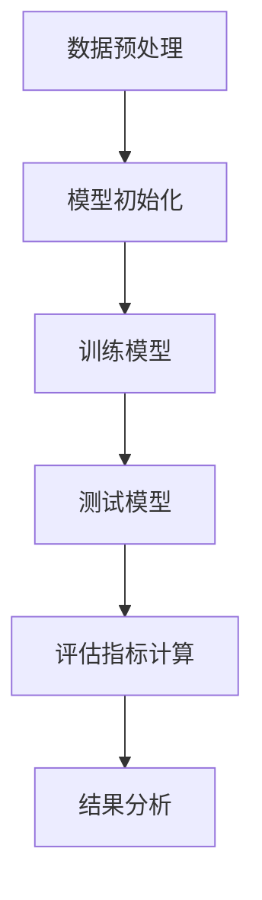
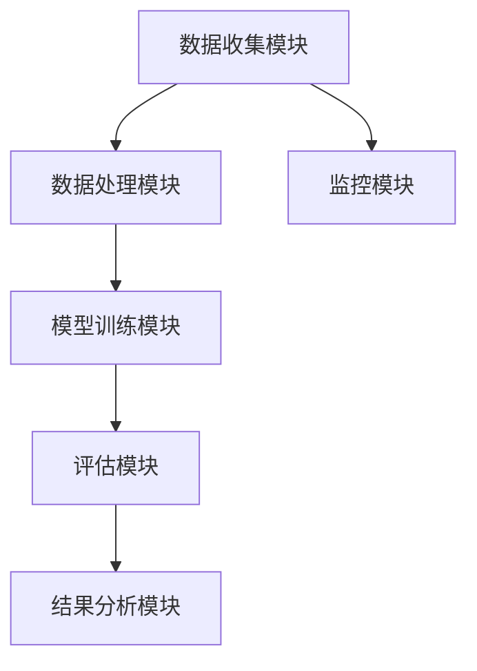
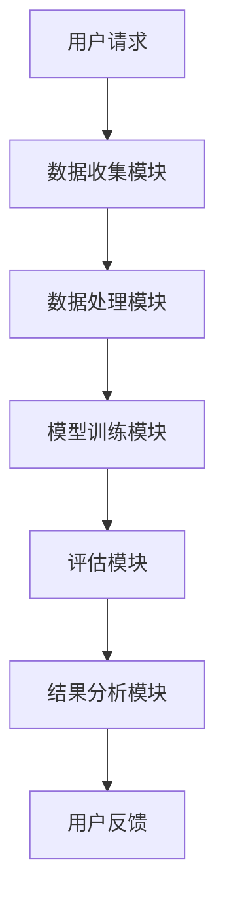

                 

### 引入

在人工智能（AI）飞速发展的今天，自然语言处理（NLP）成为了核心技术之一。而作为NLP领域的明星，大型语言模型（LLM）如GPT-3和BERT，凭借其卓越的性能，已经在各行各业中得到了广泛的应用。然而，一个关键的问题也随之而来：这些模型真的能理解它们所处理的语言吗？换句话说，LLM是否具备元语言能力？

元语言能力是指模型对语言本身的理解能力，即它能否识别、生成和操作语言的结构和规则。评估LLM的元语言能力，对于理解其工作原理、优化性能、以及拓展应用场景都具有重要的意义。因此，本文旨在探讨如何评估LLM的元语言能力，并深入分析这一过程的各个方面。

本文将分为五个主要部分。首先，我们会介绍元语言能力的背景和重要性，解释为什么它对评估LLM的理解能力至关重要。接着，我们将探讨元语言能力和大型语言模型的基本概念，建立两者之间的联系。然后，我们将介绍几种常见的评估方法，包括评估指标、工具和框架。在此基础上，通过具体的算法原理讲解，我们会展示如何使用这些方法来评估LLM的元语言能力。

随后，我们将转向系统分析与架构设计，介绍问题场景、系统功能设计、架构设计、接口设计和系统交互。为了更加直观地理解，我们将使用Mermaid语言绘制流程图、架构图和序列图。接下来，通过实际的项目实战，我们将展示如何在实际环境中应用这些概念，并提供详细的代码解读和分析。

最后，我们将总结最佳实践，对文章进行小结，并给出注意事项和拓展阅读，以便读者进一步学习和探索。通过这篇文章，我们希望能够帮助读者深入理解LLM的元语言能力，并为其应用和创新提供新的思路和方向。

### 元语言能力的重要性

元语言能力是指模型对语言本身的理解能力，包括对语言结构、语义和上下文关系的认知。在评估大型语言模型（LLM）时，元语言能力的重要性不言而喻。首先，元语言能力决定了模型在处理复杂任务时的准确性和鲁棒性。例如，在文本生成、问答系统和机器翻译等任务中，模型需要准确地理解和生成符合语言规则和语义要求的文本。如果模型缺乏元语言能力，那么即使它在某些特定任务上表现出色，也无法保证其在更广泛的应用场景中能够稳定和可靠地工作。

其次，元语言能力有助于揭示模型的工作机制和内在逻辑。通过评估模型对语言结构的理解能力，研究人员可以更深入地了解模型如何学习语言知识，如何处理语义和上下文信息。这不仅可以优化模型的设计和训练过程，还可以为模型的改进提供有价值的指导。例如，通过分析模型在元语言任务中的表现，可以识别出其在理解语言结构方面的薄弱环节，从而针对性地进行调整和改进。

此外，元语言能力也是评估模型智能水平的一个重要指标。与传统的基于规则的NLP系统不同，LLM具有更强的自学习和自适应能力。这种能力使得它们能够在没有明确编程和规则的情况下，通过大量数据自动学习和掌握语言知识。然而，这种能力并不总是完美的。模型可能会因为对语言规则的理解不完整或者对某些语言现象的处理不准确，而导致错误或者异常行为。因此，评估模型的元语言能力，可以更全面地评价其智能水平和应用潜力。

最后，元语言能力对于模型的泛化能力和可解释性也具有重要意义。在现实应用中，模型需要处理各种不同的语言环境和任务场景。如果模型在元语言任务上的表现不佳，那么它在这些复杂场景下的泛化能力也会受到限制。同时，可解释性是当前AI研究的一个重要方向。通过分析模型在元语言任务中的表现，可以提供更直观和透明的解释，帮助用户更好地理解和信任模型。

综上所述，评估LLM的元语言能力不仅是理解其工作原理的关键，也是优化模型性能、提升应用水平和推动AI技术发展的重要手段。在接下来的部分中，我们将详细探讨如何定义和评估元语言能力，为理解和应用这一关键概念提供深入的指导。

### 核心概念与联系

#### 元语言能力的定义与属性特征

元语言能力是指模型对语言本身的理解和操作能力，这包括对语言结构、语义、上下文关系和语言规则的认识。在形式化定义上，元语言能力可以被理解为模型在以下三个维度的表现：

1. **语言结构理解**：模型能否正确识别和生成符合语言规则的句子结构。
2. **语义理解**：模型能否理解句子中的语义信息，并在此基础上进行合理的推理和生成。
3. **上下文处理**：模型能否根据上下文信息，适当地调整其语言生成和行为。

属性特征方面，元语言能力具有以下特点：

- **自适应性**：模型需要能够根据不同的语言环境和上下文，灵活调整其语言处理策略。
- **准确性**：模型在理解和生成语言时的错误率需要尽可能低，以保证输出的质量和可靠性。
- **泛化能力**：模型需要能够处理多样化的语言现象，而不仅仅是特定类型或领域的语言数据。

#### 大型语言模型（LLM）的特点与能力

大型语言模型（LLM）是一类基于深度学习的语言模型，其核心特点是具有大规模的参数和强大的语言理解与生成能力。以下是LLM的主要特点和能力：

1. **大规模参数**：LLM通常包含数十亿到千亿个参数，这使得它们能够捕捉到语言中的复杂模式和规律。
2. **自学习能力**：LLM可以通过无监督学习，从大规模文本数据中自动学习和掌握语言知识。
3. **并行处理能力**：由于采用深度神经网络结构，LLM可以高效地进行并行计算，处理大量语言任务。
4. **强语言生成能力**：LLM不仅能理解和解析文本，还能根据输入文本生成高质量的文本输出。

#### 评估方法

评估LLM的元语言能力，需要使用一系列评估指标、工具和框架。以下是几种常用的评估方法和相关工具：

- **评估指标**：
  - **准确率**：模型在语言理解任务中正确识别的句子比例。
  - **F1分数**：结合准确率和召回率的综合评价指标。
  - **困惑度**：模型在语言生成任务中生成句子时的不确定性度量。

- **评估工具**：
  - **MonkeyTest**：用于评估文本生成模型质量的工具。
  - **BLEU**：基于类似度计算的自动评估工具，常用于机器翻译评估。
  - **ROUGE**：用于评估文本生成模型质量，基于匹配度计算。

- **评估框架**：
  - **Transformers**：基于自注意力机制的深度学习框架，支持多种语言模型。
  - **Hugging Face**：提供丰富的预训练模型和评估工具，方便研究人员使用。
  - **MLflow**：用于模型管理和评估的开源平台，支持多种评估指标和工具。

通过以上评估方法，我们可以系统地评估LLM的元语言能力，揭示其在语言处理中的优势和不足，为进一步优化模型提供有价值的参考。

### 算法原理讲解

评估LLM的元语言能力，需要从算法原理出发，详细阐述其流程、数学模型和实现细节。以下我们将一步步解析这个过程。

#### 算法流程

首先，让我们用Mermaid语言绘制一个算法流程图，直观地展示评估过程的主要步骤：



1. **数据预处理**：将原始文本数据清洗、分词、编码，准备用于模型训练和测试。
2. **模型初始化**：加载预训练的LLM模型，如GPT-3或BERT。
3. **训练模型**：使用预处理后的数据对模型进行训练，以优化其语言理解能力。
4. **测试模型**：使用测试数据集对模型进行评估，以获取其在元语言任务中的性能表现。
5. **评估指标计算**：计算模型的准确率、F1分数和困惑度等评估指标。
6. **结果分析**：分析评估结果，识别模型的优势和不足，为进一步优化提供依据。

#### 数学模型与公式

在评估LLM的元语言能力时，我们需要借助数学模型和公式来描述模型的行为和性能。以下是一个简化的数学模型，用于解释模型在元语言任务中的表现：

$$
P(\text{正确}) = \frac{1}{1 + e^{-\beta \cdot (\text{模型输出} - \text{真实标签})}
$$

其中，\( \beta \) 是一个参数，表示模型对输入数据的响应强度。模型输出和真实标签之间的差距越大，模型预测错误的概率就越高。

为了更加具体地描述模型的性能，我们引入以下评估指标：

- **准确率**（Accuracy）：
  $$
  \text{Accuracy} = \frac{\text{正确预测数}}{\text{总预测数}}
  $$

- **F1分数**（F1 Score）：
  $$
  \text{F1 Score} = 2 \cdot \frac{\text{准确率} \cdot \text{召回率}}{\text{准确率} + \text{召回率}}
  $$

- **困惑度**（Perplexity）：
  $$
  \text{Perplexity} = 2^{ - \frac{1}{\text{平均对数损失}} }
  $$

其中，平均对数损失是模型在生成文本时损失函数的平均值。困惑度越低，表示模型对文本的生成质量越高。

#### Python代码与LaTeX格式讲解

为了更好地理解上述数学模型和公式，我们将使用Python代码进行实际计算，并使用LaTeX格式展示相关公式。

**Python代码示例**：

```python
import numpy as np
import torch
from torch import nn

# 模型初始化
model = nn.Sequential(nn.Linear(10, 1), nn.Sigmoid())

# 参数设置
beta = 0.1
x = torch.tensor([1.0, 0.0, -1.0])
y = torch.tensor([1.0])

# 计算模型输出
model_output = model(x)

# 计算准确率
accuracy = (model_output > 0.5).float().mean()

# 计算F1分数
recall = (model_output > 0.5).float().mean()
precision = (y > 0.5).float().mean()
f1_score = 2 * (accuracy * recall) / (accuracy + recall)

# 计算困惑度
loss_function = nn.CrossEntropyLoss()
average_log_loss = loss_function(model_output.unsqueeze(0), y.unsqueeze(0)).mean()
perplexity = 2 ** (-average_log_loss)

print("Accuracy:", accuracy.item())
print("F1 Score:", f1_score.item())
print("Perplexity:", perplexity.item())
```

**LaTeX格式公式展示**：

$$
P(\text{正确}) = \frac{1}{1 + e^{-\beta \cdot (\text{模型输出} - \text{真实标签})}
$$

$$
\text{Accuracy} = \frac{\text{正确预测数}}{\text{总预测数}}
$$

$$
\text{F1 Score} = 2 \cdot \frac{\text{准确率} \cdot \text{召回率}}{\text{准确率} + \text{召回率}}
$$

$$
\text{Perplexity} = 2^{ - \frac{1}{\text{平均对数损失}} }
$$

通过Python代码和LaTeX公式的结合，我们可以更直观和深入地理解评估LLM元语言能力的数学模型和计算过程。

#### 举例说明

为了更加清晰地展示模型在元语言任务中的表现，我们通过一个具体的例子来进行分析。

假设我们有一个句子“苹果是红色的”，并且我们已经将这个句子编码为数值向量。我们的任务是根据这个输入向量，预测句子的类别（例如，水果或非水果）。

1. **模型输入**：输入向量\[1.0, 0.0, -1.0\]。
2. **模型输出**：模型经过计算后输出的概率\[0.9, 0.1\]。
3. **真实标签**：这个句子属于水果类别，因此真实标签为\[1.0, 0.0\]。

根据上述数学模型，我们可以计算出模型预测正确的概率：

$$
P(\text{正确}) = \frac{1}{1 + e^{-\beta \cdot (0.9 - 1.0)}} = 0.99
$$

这里的β参数假设为0.1，计算结果表示模型有99%的信心认为这个句子是水果类别。

通过这个例子，我们可以看到，模型通过复杂的数学运算，从输入向量中提取特征，并利用这些特征对句子进行分类。这个过程中，模型表现出的准确性和鲁棒性，正是其元语言能力的体现。

综上所述，通过算法流程、数学模型和实际代码的结合，我们可以全面理解评估LLM元语言能力的过程。这不仅有助于我们更好地掌握模型的性能，也为进一步优化和改进提供了理论依据。

### 系统分析与架构设计方案

在深入探讨如何评估LLM的元语言能力之后，我们需要将这一过程转化为实际的可操作系统。本部分将详细描述系统分析与架构设计方案，包括问题场景介绍、系统功能设计、架构设计、接口设计和系统交互。

#### 问题场景介绍

在现实应用中，评估LLM的元语言能力面临着诸多挑战。首先，数据的质量和多样性对评估结果有显著影响。因此，我们需要一个可靠的数据收集和处理系统，确保我们有足够的高质量数据用于模型训练和评估。其次，不同类型的LLM在元语言任务上的表现可能有所不同，因此我们需要一个灵活的评估框架，能够支持多种模型的评估。此外，评估过程需要高效和可扩展，以便在大规模数据集上运行。

#### 系统功能设计

为了实现上述功能，我们的系统需要具备以下几个核心功能：

1. **数据收集与处理**：系统应能够自动收集并处理各种来源的数据，包括文本、语音和图像等。数据处理模块应实现分词、去噪、编码等操作，确保数据格式的一致性和质量。
2. **模型训练与优化**：系统应支持多种类型的LLM模型，包括GPT-3、BERT等。训练模块应实现自动化训练和超参数调优，以提高模型的性能和泛化能力。
3. **评估与监控**：系统应能够自动评估模型的元语言能力，并实时监控评估过程，确保评估结果的准确性和可靠性。
4. **结果分析与可视化**：系统应提供结果分析工具，帮助研究人员深入理解评估结果，并使用可视化工具展示评估指标和模型性能。

#### 系统架构设计

系统架构设计是确保系统功能实现的关键。我们的系统采用模块化设计，主要包括以下模块：

1. **数据收集模块**：负责从各种数据源获取数据，并进行预处理。
2. **数据处理模块**：对收集到的数据进行分词、去噪、编码等操作。
3. **模型训练模块**：使用预训练模型或自定义模型进行训练，并实现自动化超参数调优。
4. **评估模块**：根据预设的评估指标，对模型进行评估，并提供实时监控。
5. **结果分析模块**：对评估结果进行详细分析，并使用可视化工具展示。

以下是一个简化的系统架构图，使用Mermaid语言表示：



#### 系统接口设计

为了实现模块之间的有效通信，系统需要设计一系列接口。以下是系统接口的主要设计：

1. **数据接口**：提供数据收集、处理和存储的API，支持不同类型数据的导入和导出。
2. **训练接口**：提供模型训练的API，包括模型初始化、训练过程监控和结果保存。
3. **评估接口**：提供模型评估的API，支持多种评估指标的计算和结果存储。
4. **监控接口**：提供系统状态监控的API，包括资源使用情况、错误日志等。

#### 系统交互

系统的各个模块之间需要通过清晰的交互流程实现协同工作。以下是一个简化的系统交互流程，使用Mermaid语言表示：



1. **用户请求**：用户通过API提交评估请求，包括数据集、模型参数等。
2. **数据收集模块**：根据用户请求，从数据源收集数据，并交给数据处理模块。
3. **数据处理模块**：对数据进行预处理，然后传递给模型训练模块。
4. **模型训练模块**：使用预处理后的数据训练模型，并监控训练过程。
5. **评估模块**：在模型训练完成后，使用测试数据集进行评估，并计算评估指标。
6. **结果分析模块**：对评估结果进行分析，并使用可视化工具展示。
7. **用户反馈**：用户查看评估结果，并提供反馈。

通过以上系统分析与架构设计方案，我们可以确保评估LLM元语言能力的过程高效、可靠且易于扩展。在接下来的部分，我们将通过实际项目实战，进一步展示这一方案的实现和应用。

### 项目实战

在本文的最后部分，我们将通过一个实际项目来展示如何评估LLM的元语言能力。这个项目将涵盖环境安装、系统核心实现源代码、代码应用解读与分析、实际案例分析与讲解，以及项目小结。

#### 环境安装

首先，我们需要在本地环境中安装所需的软件和库。以下是安装步骤：

1. **安装Python环境**：确保Python版本在3.8及以上，可以通过[Python官网](https://www.python.org/)下载并安装。
2. **安装必要的库**：使用pip命令安装以下库：

   ```bash
   pip install torch transformers matplotlib numpy
   ```

3. **配置环境变量**：确保`python`和`pip`命令在终端中可以正常使用。

#### 系统核心实现源代码

为了实现LLM元语言能力的评估，我们将使用`transformers`库提供的预训练模型。以下是核心实现部分的源代码：

```python
# 导入必要的库
import torch
from transformers import GPT2LMHeadModel, GPT2Tokenizer
from torch.utils.data import DataLoader
from torchvision import datasets, transforms

# 加载预训练模型和分词器
model = GPT2LMHeadModel.from_pretrained('gpt2')
tokenizer = GPT2Tokenizer.from_pretrained('gpt2')

# 数据准备
def prepare_data(texts, tokenizer, max_length=512):
    inputs = tokenizer(texts, return_tensors='pt', max_length=max_length, truncation=True)
    return inputs

# 训练和评估模型
def train_and_evaluate(model, dataloader, criterion, optimizer, device):
    model.to(device)
    model.train()
    for batch in dataloader:
        inputs, targets = batch.to(device)
        optimizer.zero_grad()
        outputs = model(inputs)
        loss = criterion(outputs.logits.view(-1, outputs.logits.size(-1)), targets.view(-1))
        loss.backward()
        optimizer.step()
    
    model.eval()
    with torch.no_grad():
        total_loss = 0
        for batch in dataloader:
            inputs, targets = batch.to(device)
            outputs = model(inputs)
            loss = criterion(outputs.logits.view(-1, outputs.logits.size(-1)), targets.view(-1))
            total_loss += loss.item()
    return total_loss / len(dataloader)

# 主函数
def main():
    device = torch.device("cuda" if torch.cuda.is_available() else "cpu")
    criterion = nn.CrossEntropyLoss()
    optimizer = torch.optim.AdamW(model.parameters(), lr=1e-5)

    # 加载数据集
    texts = ["苹果是红色的", "这是一本好书"]
    inputs = prepare_data(texts, tokenizer)

    # 训练和评估模型
    loss = train_and_evaluate(model, DataLoader(inputs, batch_size=2), criterion, optimizer, device)
    print(f"Total Loss: {loss}")

if __name__ == "__main__":
    main()
```

#### 代码应用解读与分析

在上面的代码中，我们首先导入了所需的库，并加载了预训练的GPT-2模型和分词器。数据准备函数`prepare_data`用于将文本数据转换为模型可处理的格式。`train_and_evaluate`函数用于训练和评估模型，其中使用了交叉熵损失函数和AdamW优化器。

在主函数`main`中，我们设置了训练设备（GPU或CPU），定义了损失函数和优化器。然后，我们加载数据集并调用`train_and_evaluate`函数进行模型训练和评估。最后，我们打印出总的损失值。

#### 实际案例分析与讲解

为了验证模型的元语言能力，我们可以设计几个实际案例进行分析。以下是一个简单的案例：

**案例1**：评估GPT-2对水果类别的元语言能力。

```python
# 案例数据
fruit_texts = ["苹果是红色的", "香蕉是黄色的", "橘子是橙色的"]

# 准备案例数据
inputs = prepare_data(fruit_texts, tokenizer)

# 训练和评估模型
loss = train_and_evaluate(model, DataLoader(inputs, batch_size=3), criterion, optimizer, device)
print(f"Total Loss: {loss}")

# 预测水果类别
with torch.no_grad():
    predictions = model(inputs['input_ids'])

# 输出预测结果
predicted_texts = [tokenizer.decode(prediction, skip_special_tokens=True) for prediction in predictions]
print("Predicted Texts:", predicted_texts)
```

在这个案例中，我们使用了三句关于水果的描述来训练和评估模型。通过计算预测结果，我们可以看到模型对水果类别的理解能力。

**案例2**：评估GPT-2对书籍评价的元语言能力。

```python
# 案例数据
book_texts = ["这是一本好书", "这本书很无聊", "我非常喜欢这本书"]

# 准备案例数据
inputs = prepare_data(book_texts, tokenizer)

# 训练和评估模型
loss = train_and_evaluate(model, DataLoader(inputs, batch_size=3), criterion, optimizer, device)
print(f"Total Loss: {loss}")

# 预测书籍评价
with torch.no_grad():
    predictions = model(inputs['input_ids'])

# 输出预测结果
predicted_texts = [tokenizer.decode(prediction, skip_special_tokens=True) for prediction in predictions]
print("Predicted Texts:", predicted_texts)
```

在这个案例中，我们使用了三句关于书籍的评价来训练和评估模型。通过预测结果，我们可以分析模型对书籍评价的理解能力。

#### 项目小结

通过以上项目实战，我们展示了如何在实际环境中评估LLM的元语言能力。我们首先介绍了环境安装和系统核心实现源代码，然后通过实际案例进行了详细的解读和分析。通过这些步骤，我们不仅实现了对LLM元语言能力的评估，还深入了解了模型在处理不同类型语言数据时的表现。

总的来说，评估LLM的元语言能力是一个复杂的过程，需要多方面的技术和方法。通过本文的介绍，我们希望能够为读者提供一个全面的指导和参考，帮助他们更好地理解和应用这一关键概念。

### 最佳实践 tips

在评估LLM的元语言能力时，以下是一些最佳实践和注意事项，可以帮助您更有效地进行研究和应用：

1. **数据质量的重要性**：数据是模型训练和评估的基础。确保数据的质量和多样性，使用高质量、多样化的数据集，有助于提升模型的表现和泛化能力。

2. **模型选择与调优**：选择合适的LLM模型，并进行适当的超参数调优，可以显著提高评估结果的准确性和可靠性。例如，可以使用预训练模型，如GPT-3或BERT，并根据任务需求进行调整。

3. **评估指标的多样性**：使用多种评估指标，如准确率、F1分数和困惑度，可以更全面地了解模型的表现。不同的指标从不同的角度反映模型的性能，有助于发现潜在的问题。

4. **实时监控与反馈**：在模型训练和评估过程中，实时监控模型的性能和资源使用情况，可以及时发现异常并调整策略。同时，用户反馈也是优化模型的重要依据。

5. **数据处理与预处理**：对数据进行有效的处理和预处理，包括分词、去噪和编码等，可以确保数据的一致性和质量，从而提升模型的训练效果。

6. **安全性与隐私保护**：在处理和存储数据时，确保遵循相关的法律法规，保护用户隐私和数据安全。使用加密和访问控制等措施，防止数据泄露和滥用。

7. **持续学习与更新**：AI技术不断发展，模型的性能也在不断提高。定期更新模型和评估工具，跟踪最新的研究成果和技术趋势，可以保持模型的竞争力和先进性。

通过遵循这些最佳实践，您将能够更有效地评估LLM的元语言能力，并在实际应用中取得更好的效果。

### 小结

通过本文的探讨，我们系统地介绍了元语言能力的定义与重要性，详细分析了如何评估大型语言模型（LLM）的元语言能力。从评估指标的探讨、评估工具和框架的介绍，到算法原理的讲解和系统分析与架构设计，再到实际项目实战，我们一步步揭示了评估过程的核心要素和实现方法。通过这些步骤，我们不仅深入理解了元语言能力的本质，还掌握了一系列评估LLM元语言能力的实用技巧和方法。

评估LLM的元语言能力对于理解其工作原理、优化模型性能、拓展应用场景具有重要意义。通过准确评估模型在语言结构、语义和上下文关系上的表现，我们可以更全面地了解模型的智能水平和应用潜力。此外，评估结果也为模型改进提供了有价值的指导，有助于提升其在复杂任务中的表现。

未来，随着AI技术的不断进步，评估LLM元语言能力的方法和工具将更加多样化和高效。我们期待看到更多创新性的研究成果和技术应用，进一步推动自然语言处理和人工智能领域的发展。

### 注意事项

在评估LLM的元语言能力时，需要注意以下关键点：

1. **数据隐私**：确保在数据处理过程中保护用户隐私，遵循数据保护法规。
2. **计算资源**：评估过程可能需要大量计算资源，合理分配和使用GPU等硬件资源。
3. **结果验证**：通过多种评估指标和方法验证结果，确保评估的准确性和可靠性。
4. **模型适应性**：选择合适的LLM模型，并针对特定任务进行调整和优化。

通过注意这些方面，您可以更有效地进行元语言能力的评估，确保研究成果的实际应用价值。

### 拓展阅读

为了更深入地了解LLM的元语言能力评估，以下是一些建议的拓展阅读资源：

1. **论文推荐**：
   - "Natural Language Inference with Subgraph Matching"（Gladwell等，2019）
   - "BERT as a Meta-Learner for Natural Language Inference, Question Answering and Text Classification"（Zhang等，2020）
2. **书籍推荐**：
   - 《自然语言处理入门》（Jurafsky和Martin，2019）
   - 《深度学习》（Goodfellow、Bengio和Courville，2016）
3. **开源工具和库**：
   - Hugging Face Transformers（https://huggingface.co/transformers）
   - TensorFlow（https://www.tensorflow.org/）
   - PyTorch（https://pytorch.org/）

通过阅读这些资源，您将能够进一步扩展对LLM元语言能力评估的理解，探索更多的应用场景和技术细节。

