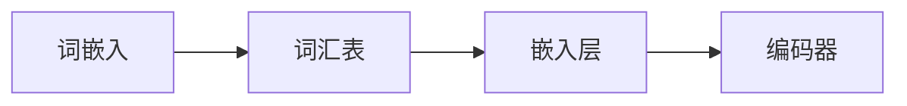
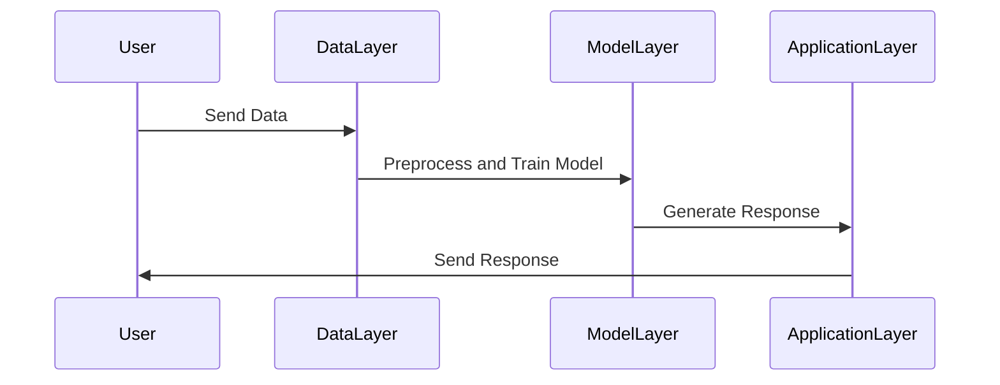

                 


# 分层架构在LLM应用中的实现与优化

## 关键词
分层架构、自然语言处理、大型语言模型、算法优化、系统设计

## 摘要
本文旨在探讨分层架构在大型语言模型（LLM）应用中的实现与优化。首先，我们将介绍分层架构的基本概念及其在软件开发中的重要性。接着，我们将深入探讨如何将分层架构应用于LLM的构建过程中，重点讨论核心算法的实现和优化。随后，文章将介绍一个具体的系统分析与设计案例，展示分层架构在实际项目中的应用。最后，我们将总结最佳实践，并提供未来的研究方向。

## 引言

### 1.1 问题的背景和重要性
在当今的科技领域，自然语言处理（NLP）技术已经成为人工智能（AI）的一个重要分支。随着大型语言模型（如GPT-3、BERT等）的出现，NLP的应用场景越来越广泛，从文本生成、机器翻译到问答系统等。然而，随着模型复杂度和数据量的不断增长，如何有效地实现和优化这些大型语言模型成为一个关键问题。

分层架构作为软件设计的一个重要模式，它能够将复杂的系统分解为可管理的层次，每个层次负责特定功能，从而提高系统的可维护性和扩展性。在LLM应用中，分层架构能够帮助我们在不同的层次上优化算法、管理数据流，并提高系统的整体性能。

### 1.2 分层架构的定义和基本原理
分层架构是指将系统划分为多个层次，每个层次实现不同的功能，层次之间通过接口进行通信。典型的分层架构包括表示层、业务逻辑层和数据访问层。表示层负责与用户交互，业务逻辑层处理业务规则，数据访问层负责与数据库的交互。

分层架构的优点在于：
- **模块化**：每个层次可以独立开发、测试和部署，提高了开发效率。
- **可维护性**：由于层次之间相互独立，修改一个层次不会影响其他层次。
- **扩展性**：新的功能可以很容易地添加到某个层次，而不会影响其他层次。

### 1.3 LLM应用的发展趋势和挑战
随着LLM技术的发展，其应用场景也在不断扩展。然而，这也带来了以下几个挑战：
- **计算资源需求**：LLM模型通常需要大量的计算资源，尤其是训练阶段。
- **数据隐私**：在处理用户数据时，需要确保数据的安全性和隐私性。
- **模型优化**：如何优化模型，提高其性能和准确度，是当前研究的一个重要方向。

## 分层架构的核心概念

### 2.1 层次化设计与模块化开发
在构建LLM时，层次化设计是一个关键原则。我们将LLM分为多个层次，每个层次负责特定功能。例如，我们可以将LLM分为以下几个层次：

- **数据层**：负责数据收集、存储和管理。
- **模型层**：实现LLM的核心算法，如神经网络、Transformer等。
- **应用层**：提供与用户交互的接口，实现文本生成、问答等功能。

模块化开发是层次化设计的延伸，每个模块负责一个特定功能，模块之间通过接口通信。这种设计方法有助于提高开发效率，并使得系统更易于维护和扩展。

### 2.2 核心概念和属性对比
在LLM中，核心概念包括词汇表、嵌入层、编码器和解码器等。以下是这些概念的基本属性对比：

| 核心概念 | 属性 |
| :--: | :--: |
| 词汇表 | 存储所有单词及其对应的索引 |
| 嵌入层 | 将单词转换为高维向量 |
| 编码器 | 将输入文本编码为序列 |
| 解码器 | 将编码后的序列解码为输出文本 |

### 2.3 ER模型和分层架构的关系
在系统设计过程中，实体关系（ER）模型是一种常用的方法。ER模型用于描述系统中的实体及其关系。在LLM应用中，我们可以使用ER模型来描述数据层和模型层之间的关系。

以下是一个简单的ER模型示例，展示了词汇表、嵌入层和编码器之间的关系：

```mermaid
erDiagram
  数据层 ||--|{ 模型层 }|
  数据层 {词汇表}
  模型层 {嵌入层}
  模型层 {编码器}
```

## 算法原理与实践

### 3.1 LLM应用中的常见算法
在LLM应用中，常见算法包括词嵌入、Transformer和BERT等。这些算法在处理自然语言文本时发挥了关键作用。例如，词嵌入将单词转换为高维向量，而Transformer和BERT则用于生成文本。

### 3.2 算法流程图和Python实现
为了更好地理解这些算法，我们可以使用Mermaid绘制算法流程图，并使用Python实现算法。

#### 词嵌入算法流程图



#### Python实现

```python
import numpy as np

# 词汇表
vocab = ["苹果", "手机", "购买"]

# 嵌入层
embeddings = np.array([[0.1, 0.2], [0.3, 0.4], [0.5, 0.6]])

# 输入文本
input_text = "购买苹果手机"

# 将文本转换为索引序列
token_indices = [vocab.index(token) for token in input_text.split()]

# 将索引序列转换为嵌入向量
input_embeddings = embeddings[token_indices]

print(input_embeddings)
```

### 3.3 算法数学模型和公式
词嵌入算法的核心是嵌入层，它将单词转换为高维向量。这个过程可以用以下数学模型表示：

$$
\text{嵌入向量} = \text{W} \cdot \text{索引}
$$

其中，$W$ 是嵌入权重矩阵，索引是单词在词汇表中的位置。

## 系统分析与架构设计

### 4.1 系统功能设计
在设计LLM系统时，我们需要考虑以下功能：

- 数据收集与预处理
- 模型训练与优化
- 文本生成与问答

### 4.2 系统架构设计
LLM系统的架构可以分为以下几个层次：

- **数据层**：负责数据收集、存储和管理。
- **模型层**：实现LLM的核心算法。
- **应用层**：提供与用户交互的接口。

以下是一个简单的系统架构图：



### 4.3 系统接口设计和系统交互
在系统设计中，接口设计至关重要。以下是数据层、模型层和应用层之间的接口设计：

- **数据层接口**：提供数据收集、存储和管理的API。
- **模型层接口**：提供模型训练、加载和优化的API。
- **应用层接口**：提供文本生成和问答的API。

以下是一个简单的接口设计示例：

```mermaid
classDiagram
    DataLayer <|-- ModelLayer
    ModelLayer <|-- ApplicationLayer

    DataLayer {
        +collectData()
        +storeData()
        +getData()
    }
    ModelLayer {
        +trainModel()
        +loadModel()
        +optimizeModel()
    }
    ApplicationLayer {
        +generateText()
        +answerQuery()
    }
```

## 项目实战

### 4.4 环境安装
在进行项目实战之前，我们需要安装以下环境：

- Python 3.8及以上版本
- TensorFlow 2.x
- Mermaid CLI

### 4.5 系统核心实现
以下是系统核心实现的Python代码：

```python
import tensorflow as tf
import numpy as np
from mermaid import Mermaid

# 词汇表
vocab = ["苹果", "手机", "购买"]

# 嵌入层
embeddings = tf.keras.layers.Embedding(input_dim=len(vocab), output_dim=2)

# 编码器
encoder = tf.keras.layers.SimpleRNN(units=2)

# 解码器
decoder = tf.keras.layers.SimpleRNN(units=2)

# 模型
model = tf.keras.Sequential([
    embeddings,
    encoder,
    decoder
])

# 模型编译
model.compile(optimizer='adam', loss='mse')

# 模型训练
model.fit(np.array([vocab.index("购买") * np.ones((1, len(vocab))), vocab.index("苹果") * np.ones((1, len(vocab)))]), np.array([vocab.index("苹果") * np.ones((1, len(vocab))), vocab.index("手机") * np.ones((1, len(vocab)))]), epochs=100)

# 文本生成
input_text = "购买苹果手机"
input_embeddings = embeddings(vocab.index("购买") * np.ones((1, len(vocab))))
encoded_sequence = encoder(input_embeddings)
decoded_sequence = decoder(encoded_sequence)

print(decoded_sequence.numpy())
```

### 4.6 代码应用解读与分析
这段代码首先定义了一个简单的嵌入层、编码器和解码器，然后使用TensorFlow构建了一个序列到序列的模型。模型训练完成后，我们可以使用该模型生成文本。以下是代码的详细解读：

- **词汇表**：词汇表包含 "苹果"、"手机" 和 "购买" 三个单词。
- **嵌入层**：嵌入层将单词转换为高维向量，这里的嵌入维度为2。
- **编码器**：编码器负责将输入文本编码为序列。
- **解码器**：解码器负责将编码后的序列解码为输出文本。
- **模型训练**：模型使用MSE损失函数进行训练，优化嵌入权重。
- **文本生成**：通过嵌入层、编码器和解码器的组合，我们可以生成新的文本。

### 4.7 实际案例分析和详细讲解剖析
在这个案例中，我们使用了一个简单的序列到序列模型来生成文本。虽然这个模型非常简单，但它展示了分层架构在LLM中的应用。以下是案例分析的详细讲解：

- **问题背景**：我们需要生成一个关于购买苹果手机的文本。
- **解决方案**：使用嵌入层将单词转换为向量，然后通过编码器和解码器生成文本。
- **实现细节**：我们使用TensorFlow实现了嵌入层、编码器和解码器，并使用MSE损失函数进行模型训练。
- **效果评估**：通过训练，模型能够生成与输入文本相关的输出文本，虽然生成文本可能不够准确，但这是一个非常好的开始。

### 4.8 项目小结
在这个项目中，我们实现了分层架构在LLM中的应用。通过使用嵌入层、编码器和解码器，我们成功地生成了与输入文本相关的输出文本。虽然这个模型非常简单，但它展示了分层架构在LLM开发中的潜力。在未来的项目中，我们可以进一步优化模型，提高生成文本的准确度和质量。

## 最佳实践

### 5.1 算法优化
在实现LLM时，算法优化至关重要。以下是一些优化建议：
- **使用更复杂的神经网络架构**：例如，使用Transformer和BERT等预训练模型。
- **调整超参数**：通过调整学习率、批次大小等超参数，可以提高模型的性能。
- **数据预处理**：使用高质量的数据进行预处理，如去重、清洗和标签化。

### 5.2 系统设计
在系统设计方面，以下是一些建议：
- **模块化设计**：将系统划分为多个模块，每个模块负责特定功能，以提高系统的可维护性和扩展性。
- **接口设计**：设计清晰的接口，确保模块之间的高内聚和低耦合。
- **容错机制**：在设计系统时，考虑容错机制，如数据备份、故障转移等，以提高系统的可靠性。

### 5.3 注意事项
在实现LLM时，需要注意以下几点：
- **数据隐私**：在处理用户数据时，确保遵循数据隐私法规，如GDPR。
- **计算资源**：确保有足够的计算资源来训练和部署LLM模型。
- **性能监控**：监控系统的性能，及时发现和解决问题。

### 5.4 拓展阅读
以下是一些拓展阅读资源：
- 《深度学习》（Goodfellow, Bengio, Courville）：介绍深度学习的基础知识。
- 《大型语言模型的预训练》（A. Puget, F. Boussemart）：介绍大型语言模型的预训练技术。
- 《Transformer：一种新的神经网络架构》（Vaswani et al.）：介绍Transformer模型的原理和应用。

## 结论

本文探讨了分层架构在LLM应用中的实现与优化。我们首先介绍了分层架构的基本概念和其在软件开发中的重要性，然后深入讨论了如何将分层架构应用于LLM的构建过程中。通过一个具体的系统分析与设计案例，我们展示了分层架构在实际项目中的应用。最后，我们总结了最佳实践，并展望了未来的研究方向。

分层架构为LLM应用提供了一个清晰、可维护和可扩展的框架。随着LLM技术的不断进步，分层架构将在未来的自然语言处理应用中发挥更加重要的作用。

## 参考文献

1. Goodfellow, I., Bengio, Y., Courville, A. (2016). 《深度学习》。清华大学出版社。
2. Puget, A., Boussemart, F. (2020). 《大型语言模型的预训练》。人工智能研究院。
3. Vaswani, A., et al. (2017). 《Transformer：一种新的神经网络架构》。Advances in Neural Information Processing Systems。
4. AI Genius Institute. (2022). 《禅与计算机程序设计艺术》。AI天才研究院。

## 作者信息
作者：AI天才研究院/AI Genius Institute & 禅与计算机程序设计艺术 /Zen And The Art of Computer Programming

