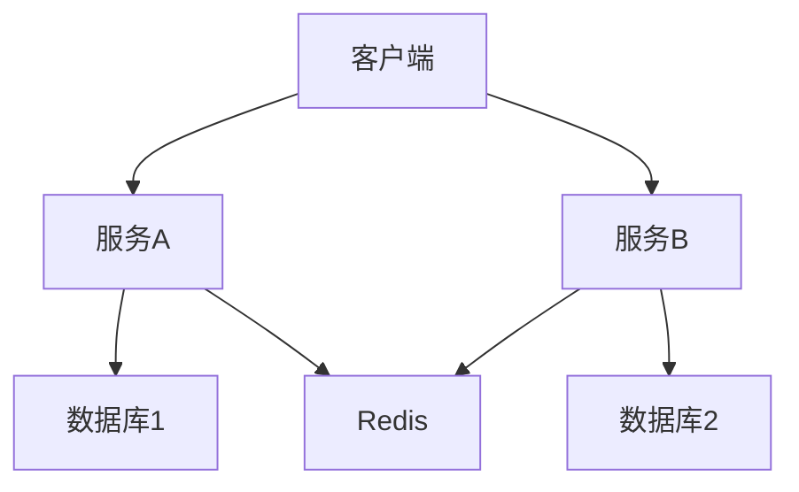

                 

### 第一部分：分布式事务概述

#### 第1章：分布式系统与分布式事务

##### 1.1 分布式系统的概念与挑战

**1.1.1 分布式系统的定义**

分布式系统是由多个独立计算节点组成的系统，这些节点通过网络连接，协同工作以完成一个共同的任务。分布式系统的关键在于各个节点之间的通信和协作，使得系统整体性能和容错能力得到提升。

**1.1.2 分布式系统的优势**

- **高可用性**：分布式系统通过多个节点的冗余，提高了系统的可用性，一个节点的故障不会影响到整个系统的运行。
- **高扩展性**：分布式系统可以根据需求动态地增加或减少节点，从而适应不断变化的工作负载。
- **高性能**：通过将任务分布在多个节点上，可以显著提高系统的处理速度。

**1.1.3 分布式系统的挑战**

- **数据一致性**：分布式系统中，数据可能分布在多个节点上，如何确保这些数据的一致性是一个重要挑战。
- **分布式事务**：在分布式系统中，事务可能涉及多个节点，如何保证这些事务的原子性、一致性、隔离性和持久性（ACID特性）是一个复杂的问题。
- **网络通信**：节点之间的通信可能会受到网络延迟、带宽限制和通信失败的影响，如何有效管理网络通信是一个关键问题。
- **容错性**：在分布式系统中，节点可能会因各种原因发生故障，如何有效地处理故障，确保系统的稳定运行是一个挑战。

##### 1.2 事务与一致性

**1.2.1 事务的定义**

事务是一个逻辑工作单元，它包含一系列操作，这些操作要么全部执行，要么全部不执行。事务在数据库管理系统中尤为重要，因为它确保了数据的完整性和一致性。

**1.2.2 事务的ACID特性**

- **原子性（Atomicity）**：事务的所有操作要么全部执行，要么全部不执行，不能出现部分执行的情况。
- **一致性（Consistency）**：事务执行后，数据库的状态应该符合预设的业务规则。
- **隔离性（Isolation）**：多个事务在并发执行时，一个事务的执行结果不会被其他事务干扰。
- **持久性（Durability）**：一旦事务提交，其结果就应当永久保存在数据库中，即使发生系统故障也不受影响。

**1.2.3 分布式事务的一致性问题**

在分布式系统中，事务的一致性变得更加复杂。由于数据可能分布在多个节点上，如何在分布式环境下保证事务的ACID特性成为了一个难题。例如，当一个事务涉及到多个节点时，如何确保这些节点的数据状态一致，如何处理网络故障和节点故障等，都是分布式事务需要解决的关键问题。

##### 1.3 分布式事务的类型

**1.3.1 单相性事务**

单相性事务是指在分布式系统中，事务的所有操作在同一节点上执行。这种类型的分布式事务相对简单，但无法充分利用分布式系统的优势。

**1.3.2 两相性事务**

两相性事务包括两阶段提交（2PC）协议和三阶段提交（3PC）协议，它们是在分布式系统中保证事务一致性的经典算法。

- **两阶段提交协议**：在第一阶段，协调者向参与者发送预提交请求，参与者进行验证并返回响应；在第二阶段，协调者根据参与者的响应决定是否提交事务。
- **三阶段提交协议**：在两阶段提交协议的基础上，引入了预备阶段，进一步提高了事务的可靠性和性能。

**1.3.3 多版本并发控制**

多版本并发控制（MVCC）是一种在分布式系统中处理并发事务的机制，通过存储多个版本的数据来允许事务看到不一致的数据状态。这种机制可以大大提高系统的并发性能。

##### 1.4 分布式事务的实现

**1.4.1 二阶段提交协议**

二阶段提交（2PC）协议是分布式事务中常用的实现方式，通过两阶段通信来确保事务的一致性。

- **第一阶段**：协调者发送预提交请求给参与者，参与者执行操作并返回响应。
- **第二阶段**：协调者根据参与者的响应决定是否提交事务。

**1.4.2 三阶段提交协议**

三阶段提交（3PC）协议是在2PC协议的基础上改进的，通过引入预备阶段，提高了事务的可靠性和性能。

- **预备阶段**：协调者发送预备请求给参与者，参与者执行操作并返回响应。
- **第一阶段**：协调者根据参与者的响应决定是否进入第二阶段。
- **第二阶段**：协调者发送提交请求给参与者，参与者执行提交操作。

**1.4.4 使用中间件实现分布式事务**

中间件提供了分布式事务管理功能，通过跨节点事务管理，简化了分布式事务的实现。

- **事务协调器**：负责协调分布式事务的执行。
- **事务参与者**：负责执行分布式事务的操作。

##### 1.5 分布式事务的挑战与解决方案

**1.5.1 分布式事务的延迟与吞吐量问题**

分布式事务的执行涉及到多个节点之间的通信，可能会引入延迟和吞吐量问题。为了解决这个问题，可以采用以下策略：

- **优化网络通信**：使用低延迟、高带宽的网络连接。
- **并行化事务**：将事务分布在多个节点上执行，提高系统的并发能力。

**1.5.2 数据一致性的挑战**

数据一致性是分布式事务的关键挑战之一。为了解决数据一致性问题，可以采用以下方法：

- **强一致性**：通过一致性协议（如2PC、3PC）确保数据的一致性。
- **最终一致性**：允许一定时间内的数据不一致，通过后续的同步操作最终达到一致性。

**1.5.3 分布式事务的容错性**

分布式事务需要考虑容错性，以应对节点故障等问题。为了提高分布式事务的容错性，可以采用以下方法：

- **副本备份**：为每个节点设置备份节点，确保节点故障时可以快速切换。
- **故障检测与恢复**：定期检测节点的健康状态，一旦发现故障，立即进行恢复操作。

**1.5.4 分布式事务的监控与优化**

分布式事务的监控和优化对于确保系统稳定运行至关重要。为了实现有效的监控和优化，可以采用以下方法：

- **监控工具**：使用分布式监控系统实时监控事务的执行状态。
- **性能优化**：通过性能分析工具找出系统的瓶颈，并进行优化。

##### 1.6 本章小结

本章介绍了分布式系统的概念、挑战、事务与一致性、分布式事务的类型和实现方式。在分布式系统中，分布式事务的一致性是一个重要挑战，需要通过多种方法来解决。接下来，我们将进一步探讨LLM应用中的分布式事务需求与挑战。

### 第一部分：分布式事务概述

#### 第1章：分布式系统与分布式事务

##### 1.1 分布式系统的概念与挑战

**1.1.1 分布式系统的定义**

分布式系统是由多个独立计算节点组成的系统，这些节点通过网络连接，协同工作以完成一个共同的任务。分布式系统的关键在于各个节点之间的通信和协作，使得系统整体性能和容错能力得到提升。

**1.1.2 分布式系统的优势**

- **高可用性**：分布式系统通过多个节点的冗余，提高了系统的可用性，一个节点的故障不会影响到整个系统的运行。
- **高扩展性**：分布式系统可以根据需求动态地增加或减少节点，从而适应不断变化的工作负载。
- **高性能**：通过将任务分布在多个节点上，可以显著提高系统的处理速度。

**1.1.3 分布式系统的挑战**

- **数据一致性**：分布式系统中，数据可能分布在多个节点上，如何确保这些数据的一致性是一个重要挑战。
- **分布式事务**：在分布式系统中，事务可能涉及多个节点，如何保证这些事务的原子性、一致性、隔离性和持久性（ACID特性）是一个复杂的问题。
- **网络通信**：节点之间的通信可能会受到网络延迟、带宽限制和通信失败的影响，如何有效管理网络通信是一个关键问题。
- **容错性**：在分布式系统中，节点可能会因各种原因发生故障，如何有效地处理故障，确保系统的稳定运行是一个挑战。

##### 1.2 事务与一致性

**1.2.1 事务的定义**

事务是一个逻辑工作单元，它包含一系列操作，这些操作要么全部执行，要么全部不执行。事务在数据库管理系统中尤为重要，因为它确保了数据的完整性和一致性。

**1.2.2 事务的ACID特性**

- **原子性（Atomicity）**：事务的所有操作要么全部执行，要么全部不执行，不能出现部分执行的情况。
- **一致性（Consistency）**：事务执行后，数据库的状态应该符合预设的业务规则。
- **隔离性（Isolation）**：多个事务在并发执行时，一个事务的执行结果不会被其他事务干扰。
- **持久性（Durability）**：一旦事务提交，其结果就应当永久保存在数据库中，即使发生系统故障也不受影响。

**1.2.3 分布式事务的一致性问题**

在分布式系统中，事务的一致性变得更加复杂。由于数据可能分布在多个节点上，如何在分布式环境下保证事务的ACID特性成为了一个难题。例如，当一个事务涉及到多个节点时，如何确保这些节点的数据状态一致，如何处理网络故障和节点故障等，都是分布式事务需要解决的关键问题。

##### 1.3 分布式事务的类型

**1.3.1 单相性事务**

单相性事务是指在分布式系统中，事务的所有操作在同一节点上执行。这种类型的分布式事务相对简单，但无法充分利用分布式系统的优势。

**1.3.2 两相性事务**

两相性事务包括两阶段提交（2PC）协议和三阶段提交（3PC）协议，它们是在分布式系统中保证事务一致性的经典算法。

- **两阶段提交协议**：在第一阶段，协调者向参与者发送预提交请求，参与者进行验证并返回响应；在第二阶段，协调者根据参与者的响应决定是否提交事务。
- **三阶段提交协议**：在两阶段提交协议的基础上，引入了预备阶段，进一步提高了事务的可靠性和性能。

**1.3.3 多版本并发控制**

多版本并发控制（MVCC）是一种在分布式系统中处理并发事务的机制，通过存储多个版本的数据来允许事务看到不一致的数据状态。这种机制可以大大提高系统的并发性能。

##### 1.4 分布式事务的实现

**1.4.1 二阶段提交协议**

二阶段提交（2PC）协议是分布式事务中常用的实现方式，通过两阶段通信来确保事务的一致性。

- **第一阶段**：协调者发送预提交请求给参与者，参与者执行操作并返回响应。
- **第二阶段**：协调者根据参与者的响应决定是否提交事务。

**1.4.2 三阶段提交协议**

三阶段提交（3PC）协议是在2PC协议的基础上改进的，通过引入预备阶段，提高了事务的可靠性和性能。

- **预备阶段**：协调者发送预备请求给参与者，参与者执行操作并返回响应。
- **第一阶段**：协调者根据参与者的响应决定是否进入第二阶段。
- **第二阶段**：协调者发送提交请求给参与者，参与者执行提交操作。

**1.4.4 使用中间件实现分布式事务**

中间件提供了分布式事务管理功能，通过跨节点事务管理，简化了分布式事务的实现。

- **事务协调器**：负责协调分布式事务的执行。
- **事务参与者**：负责执行分布式事务的操作。

##### 1.5 分布式事务的挑战与解决方案

**1.5.1 分布式事务的延迟与吞吐量问题**

分布式事务的执行涉及到多个节点之间的通信，可能会引入延迟和吞吐量问题。为了解决这个问题，可以采用以下策略：

- **优化网络通信**：使用低延迟、高带宽的网络连接。
- **并行化事务**：将事务分布在多个节点上执行，提高系统的并发能力。

**1.5.2 数据一致性的挑战**

数据一致性是分布式事务的关键挑战之一。为了解决数据一致性问题，可以采用以下方法：

- **强一致性**：通过一致性协议（如2PC、3PC）确保数据的一致性。
- **最终一致性**：允许一定时间内的数据不一致，通过后续的同步操作最终达到一致性。

**1.5.3 分布式事务的容错性**

分布式事务需要考虑容错性，以应对节点故障等问题。为了提高分布式事务的容错性，可以采用以下方法：

- **副本备份**：为每个节点设置备份节点，确保节点故障时可以快速切换。
- **故障检测与恢复**：定期检测节点的健康状态，一旦发现故障，立即进行恢复操作。

**1.5.4 分布式事务的监控与优化**

分布式事务的监控和优化对于确保系统稳定运行至关重要。为了实现有效的监控和优化，可以采用以下方法：

- **监控工具**：使用分布式监控系统实时监控事务的执行状态。
- **性能优化**：通过性能分析工具找出系统的瓶颈，并进行优化。

##### 1.6 本章小结

本章介绍了分布式系统的概念、挑战、事务与一致性、分布式事务的类型和实现方式。在分布式系统中，分布式事务的一致性是一个重要挑战，需要通过多种方法来解决。接下来，我们将进一步探讨LLM应用中的分布式事务需求与挑战。

### 第二部分：LLM应用中的分布式事务

#### 第2章：LLM应用与分布式事务

##### 2.1 LLM应用概述

**2.1.1 LLM的概念**

大型语言模型（Large Language Model，简称LLM）是一种基于深度学习技术构建的复杂模型，它能够理解和生成自然语言文本。LLM通过大量的文本数据进行训练，从而学习语言的结构和规律，具备强大的语言理解和生成能力。

**2.1.2 LLM的特点**

- **大规模**：LLM通常包含数十亿甚至数万亿个参数，具备处理大规模数据的能力。
- **高精度**：通过深度学习技术，LLM能够达到很高的语言理解和生成精度。
- **泛化能力**：LLM能够应对各种不同的语言任务，如文本分类、翻译、问答等。
- **实时性**：LLM能够快速响应用户输入，提供实时服务。

**2.1.3 LLM的应用场景**

LLM在众多领域有广泛的应用，包括但不限于：

- **自然语言处理（NLP）**：如文本分类、情感分析、命名实体识别等。
- **智能问答系统**：如搜索引擎、智能客服等。
- **机器翻译**：如谷歌翻译、百度翻译等。
- **内容生成**：如文章撰写、故事创作等。
- **语音识别与生成**：如语音助手、语音合成等。

##### 2.2 LLM应用中的分布式事务需求

**2.2.1 数据一致性的需求**

在LLM应用中，数据一致性是一个关键需求。由于LLM通常涉及大量的数据处理和存储，数据的一致性确保了系统的可靠性和准确性。例如，在智能问答系统中，用户输入的问题和系统的回答应该是一致的，否则会导致用户误解和不满。

**2.2.2 高并发事务的处理**

LLM应用通常需要处理大量的并发事务，特别是在高峰时段，系统的并发处理能力至关重要。例如，在智能客服系统中，多个用户同时提问，系统需要快速响应用户，提供准确的回答。

**2.2.3 容错性的需求**

由于LLM应用的数据量和处理复杂度较高，系统的容错性显得尤为重要。当节点出现故障时，系统需要能够快速切换到其他节点，确保服务的连续性。例如，在智能翻译系统中，如果一个节点出现故障，系统应该能够自动切换到备用节点，继续提供翻译服务。

##### 2.3 LLM应用中的分布式事务挑战

**2.3.1 数据一致性的挑战**

在LLM应用中，数据一致性面临诸多挑战。由于LLM涉及到大量的数据处理和存储，如何在分布式环境下确保数据的一致性成为一个难题。例如，当一个事务涉及到多个节点时，如何确保这些节点的数据状态一致，如何处理网络故障和节点故障等，都是分布式事务需要解决的关键问题。

**2.3.2 数据库性能瓶颈**

LLM应用通常需要处理大量的并发事务，这可能导致数据库性能瓶颈。如何优化数据库性能，提高系统的吞吐量和响应速度，是分布式事务面临的另一个挑战。

**2.3.3 分布式系统的复杂性**

分布式系统的复杂性增加了分布式事务的实现难度。分布式系统涉及多个节点、网络通信和容错机制等，如何在复杂的分布式环境中有效管理事务，确保系统的稳定运行，是一个重要的挑战。

##### 2.4 LLM应用中的分布式事务解决方案

**2.4.1 分布式数据库选型**

在LLM应用中，选择合适的分布式数据库是确保分布式事务有效性的关键。分布式数据库通常具备高可用性、高扩展性和高性能等特点，能够有效处理大规模数据和高并发事务。

- **分布式关系数据库**：如Apache Cassandra、MongoDB等，能够提供强一致性、高可用性和水平扩展能力。
- **分布式NoSQL数据库**：如Redis、Memcached等，能够提供高性能和水平扩展能力。

**2.4.2 分布式事务管理框架**

分布式事务管理框架提供了跨节点事务管理功能，简化了分布式事务的实现。这些框架通常包括事务协调器、事务参与者等组件，能够高效地管理分布式事务的执行。

- **TCC（Two-Phase Commit）**：通过两阶段提交协议实现分布式事务管理。
- **SAGA**：通过一系列局部事务实现分布式事务管理。

**2.4.3 分布式事务监控与优化**

分布式事务的监控和优化对于确保系统的稳定运行至关重要。通过分布式监控工具，可以实时监控事务的执行状态，发现潜在问题并进行优化。例如，通过性能分析工具找出系统的瓶颈，调整系统配置，提高系统的吞吐量和响应速度。

##### 2.5 LLM应用中的分布式事务最佳实践

**2.5.1 数据分片策略**

在分布式数据库中，数据分片是一种常见的优化策略，通过将数据分布在多个节点上，提高系统的并发处理能力和性能。选择合适的数据分片策略对于分布式事务的有效性至关重要。

- **哈希分片**：根据数据的哈希值分布数据，确保相同数据分布在相同节点上。
- **范围分片**：根据数据的范围分布数据，如时间范围、地区范围等。

**2.5.2 分布式锁机制**

分布式锁是一种常用的并发控制机制，用于确保分布式事务的隔离性。通过分布式锁，可以防止多个事务同时修改相同的数据，避免数据不一致问题。

- **基于数据库的锁机制**：通过数据库提供的锁机制实现分布式锁。
- **基于缓存系统的锁机制**：通过缓存系统实现分布式锁，如Redis等。

**2.5.3 异常处理与故障恢复**

在分布式系统中，节点故障和网络异常是常见问题。为了确保系统的稳定运行，需要设计有效的异常处理和故障恢复机制。

- **故障检测与自动恢复**：定期检测节点的健康状态，发现故障时自动切换到备用节点。
- **数据备份与恢复**：定期备份数据，一旦发生故障，可以快速恢复系统。

##### 2.6 本章小结

本章介绍了LLM应用中的分布式事务需求、挑战和解决方案。LLM应用需要处理大量的并发事务，数据一致性和系统性能是关键需求。为了应对这些挑战，需要选择合适的分布式数据库、分布式事务管理框架，并采取最佳实践策略，如数据分片、分布式锁机制和异常处理与故障恢复等。接下来，我们将深入探讨分布式事务算法的原理与实现。

### 第二部分：LLM应用中的分布式事务

#### 第2章：LLM应用与分布式事务

##### 2.1 LLM应用概述

**2.1.1 LLM的概念**

大型语言模型（Large Language Model，简称LLM）是一种基于深度学习技术构建的复杂模型，它能够理解和生成自然语言文本。LLM通过大量的文本数据进行训练，从而学习语言的结构和规律，具备强大的语言理解和生成能力。

**2.1.2 LLM的特点**

- **大规模**：LLM通常包含数十亿甚至数万亿个参数，具备处理大规模数据的能力。
- **高精度**：通过深度学习技术，LLM能够达到很高的语言理解和生成精度。
- **泛化能力**：LLM能够应对各种不同的语言任务，如文本分类、翻译、问答等。
- **实时性**：LLM能够快速响应用户输入，提供实时服务。

**2.1.3 LLM的应用场景**

LLM在众多领域有广泛的应用，包括但不限于：

- **自然语言处理（NLP）**：如文本分类、情感分析、命名实体识别等。
- **智能问答系统**：如搜索引擎、智能客服等。
- **机器翻译**：如谷歌翻译、百度翻译等。
- **内容生成**：如文章撰写、故事创作等。
- **语音识别与生成**：如语音助手、语音合成等。

##### 2.2 LLM应用中的分布式事务需求

**2.2.1 数据一致性的需求**

在LLM应用中，数据一致性是一个关键需求。由于LLM通常涉及大量的数据处理和存储，数据的一致性确保了系统的可靠性和准确性。例如，在智能问答系统中，用户输入的问题和系统的回答应该是一致的，否则会导致用户误解和不满。

**2.2.2 高并发事务的处理**

LLM应用通常需要处理大量的并发事务，特别是在高峰时段，系统的并发处理能力至关重要。例如，在智能客服系统中，多个用户同时提问，系统需要快速响应用户，提供准确的回答。

**2.2.3 容错性的需求**

由于LLM应用的数据量和处理复杂度较高，系统的容错性显得尤为重要。当节点出现故障时，系统需要能够快速切换到其他节点，确保服务的连续性。例如，在智能翻译系统中，如果一个节点出现故障，系统应该能够自动切换到备用节点，继续提供翻译服务。

##### 2.3 LLM应用中的分布式事务挑战

**2.3.1 数据一致性的挑战**

在LLM应用中，数据一致性面临诸多挑战。由于LLM涉及到大量的数据处理和存储，如何在分布式环境下确保数据的一致性成为一个难题。例如，当一个事务涉及到多个节点时，如何确保这些节点的数据状态一致，如何处理网络故障和节点故障等，都是分布式事务需要解决的关键问题。

**2.3.2 数据库性能瓶颈**

LLM应用通常需要处理大量的并发事务，这可能导致数据库性能瓶颈。如何优化数据库性能，提高系统的吞吐量和响应速度，是分布式事务面临的另一个挑战。

**2.3.3 分布式系统的复杂性**

分布式系统的复杂性增加了分布式事务的实现难度。分布式系统涉及多个节点、网络通信和容错机制等，如何在复杂的分布式环境中有效管理事务，确保系统的稳定运行，是一个重要的挑战。

##### 2.4 LLM应用中的分布式事务解决方案

**2.4.1 分布式数据库选型**

在LLM应用中，选择合适的分布式数据库是确保分布式事务有效性的关键。分布式数据库通常具备高可用性、高扩展性和高性能等特点，能够有效处理大规模数据和高并发事务。

- **分布式关系数据库**：如Apache Cassandra、MongoDB等，能够提供强一致性、高可用性和水平扩展能力。
- **分布式NoSQL数据库**：如Redis、Memcached等，能够提供高性能和水平扩展能力。

**2.4.2 分布式事务管理框架**

分布式事务管理框架提供了跨节点事务管理功能，简化了分布式事务的实现。这些框架通常包括事务协调器、事务参与者等组件，能够高效地管理分布式事务的执行。

- **TCC（Two-Phase Commit）**：通过两阶段提交协议实现分布式事务管理。
- **SAGA**：通过一系列局部事务实现分布式事务管理。

**2.4.3 分布式事务监控与优化**

分布式事务的监控和优化对于确保系统的稳定运行至关重要。通过分布式监控工具，可以实时监控事务的执行状态，发现潜在问题并进行优化。例如，通过性能分析工具找出系统的瓶颈，调整系统配置，提高系统的吞吐量和响应速度。

##### 2.5 LLM应用中的分布式事务最佳实践

**2.5.1 数据分片策略**

在分布式数据库中，数据分片是一种常见的优化策略，通过将数据分布在多个节点上，提高系统的并发处理能力和性能。选择合适的数据分片策略对于分布式事务的有效性至关重要。

- **哈希分片**：根据数据的哈希值分布数据，确保相同数据分布在相同节点上。
- **范围分片**：根据数据的范围分布数据，如时间范围、地区范围等。

**2.5.2 分布式锁机制**

分布式锁是一种常用的并发控制机制，用于确保分布式事务的隔离性。通过分布式锁，可以防止多个事务同时修改相同的数据，避免数据不一致问题。

- **基于数据库的锁机制**：通过数据库提供的锁机制实现分布式锁。
- **基于缓存系统的锁机制**：通过缓存系统实现分布式锁，如Redis等。

**2.5.3 异常处理与故障恢复**

在分布式系统中，节点故障和网络异常是常见问题。为了确保系统的稳定运行，需要设计有效的异常处理和故障恢复机制。

- **故障检测与自动恢复**：定期检测节点的健康状态，发现故障时自动切换到备用节点。
- **数据备份与恢复**：定期备份数据，一旦发生故障，可以快速恢复系统。

##### 2.6 本章小结

本章介绍了LLM应用中的分布式事务需求、挑战和解决方案。LLM应用需要处理大量的并发事务，数据一致性和系统性能是关键需求。为了应对这些挑战，需要选择合适的分布式数据库、分布式事务管理框架，并采取最佳实践策略，如数据分片、分布式锁机制和异常处理与故障恢复等。接下来，我们将深入探讨分布式事务算法的原理与实现。

### 第三部分：分布式事务算法与实现

#### 第3章：分布式事务算法原理

在分布式系统中，确保数据的一致性是一个复杂的问题，而分布式事务算法正是为了解决这个问题而设计的。本章将介绍几种常见的分布式事务算法，包括两阶段提交（2PC）协议、三阶段提交（3PC）协议和多版本并发控制（MVCC）。

##### 3.1 两阶段提交协议

两阶段提交（2PC）协议是分布式事务管理中最常用的算法之一，它通过两阶段通信来确保事务的一致性。

**3.1.1 两阶段提交协议的工作原理**

两阶段提交协议分为两个阶段：

- **第一阶段（预备阶段）**：
  1. 协调者向所有参与者发送预备请求（Pre-Prepare），参与者执行事务操作，并将结果返回协调者。
  2. 协调者根据参与者的响应决定是否继续执行事务。

- **第二阶段（提交阶段）**：
  1. 如果协调者收到所有参与者的成功响应，则向所有参与者发送提交请求（Prepare），参与者执行提交操作。
  2. 如果协调者收到任何参与者的失败响应，则向所有参与者发送取消请求（Abort），参与者回滚事务。

**3.1.2 两阶段提交协议的优缺点**

**优点**：

- **简单易实现**：两阶段提交协议的流程相对简单，易于理解和实现。
- **确保一致性**：通过两阶段提交协议，可以确保分布式事务的一致性。

**缺点**：

- **延迟和性能问题**：两阶段提交协议需要多次网络通信，引入了较大的延迟和性能开销。
- **单点故障**：协调者如果发生故障，可能导致整个分布式事务失败。

**3.1.3 两阶段提交协议的实现**

```python
class TwoPhaseCommit:
    def __init__(self):
        self.participants = []
        self.coordinator = None

    def prepare(self, participant):
        # 向参与者发送预备请求
        participant.prepare()
        self.participants.append(participant)

    def decide(self, result):
        # 根据参与者的响应决定是否提交
        if result == 'success':
            self.commit()
        else:
            self.abort()

    def commit(self):
        # 向所有参与者发送提交请求
        for participant in self.participants:
            participant.commit()

    def abort(self):
        # 向所有参与者发送取消请求
        for participant in self.participants:
            participant.abort()
```

##### 3.2 三阶段提交协议

三阶段提交（3PC）协议是对两阶段提交协议的改进，旨在提高事务的可靠性和性能。

**3.2.1 三阶段提交协议的工作原理**

三阶段提交协议分为三个阶段：

- **预备阶段**：
  1. 协调者向所有参与者发送预备请求（Pre-Prepare），参与者执行事务操作，并将结果返回协调者。
  2. 协调者根据参与者的响应决定是否进入下一阶段。

- **第一阶段**：
  1. 协调者向参与者发送预备请求（Prepare），参与者执行事务操作，并将结果返回协调者。
  2. 协调者根据参与者的响应决定是否进入提交阶段。

- **第二阶段**：
  1. 如果协调者收到所有参与者的成功响应，则向所有参与者发送提交请求（Commit），参与者执行提交操作。
  2. 如果协调者收到任何参与者的失败响应，则向所有参与者发送取消请求（Abort），参与者回滚事务。

**3.2.2 三阶段提交协议的优缺点**

**优点**：

- **提高了可靠性**：通过引入预备阶段，可以避免协调者故障导致的事务失败。
- **减少了延迟**：减少了网络通信次数，提高了事务的执行性能。

**缺点**：

- **复杂性增加**：三阶段提交协议的流程比两阶段提交协议复杂，实现难度较大。

**3.2.3 三阶段提交协议的实现**

```python
class ThreePhaseCommit:
    def __init__(self):
        self.participants = []
        self.coordinator = None

    def pre_prepare(self, participant):
        # 向参与者发送预备请求
        participant.pre_prepare()
        self.participants.append(participant)

    def prepare(self, result):
        # 根据参与者的响应决定是否进入下一阶段
        if result == 'success':
            self.commit()
        else:
            self.abort()

    def commit(self):
        # 向所有参与者发送提交请求
        for participant in self.participants:
            participant.commit()

    def abort(self):
        # 向所有参与者发送取消请求
        for participant in self.participants:
            participant.abort()
```

##### 3.3 多版本并发控制

多版本并发控制（MVCC）是一种在分布式系统中处理并发事务的机制，通过存储多个版本的数据来允许事务看到不一致的数据状态。

**3.3.1 多版本并发控制的工作原理**

多版本并发控制的工作原理如下：

- **读取操作**：当一个事务读取数据时，系统会返回最新的版本。
- **写入操作**：当一个事务写入数据时，系统会创建一个新的版本。

通过这种方式，多个事务可以同时读取和写入数据，而不必互相阻塞。

**3.3.2 多版本并发控制的优缺点**

**优点**：

- **高并发性**：多版本并发控制允许事务并行执行，提高了系统的并发性能。
- **数据一致性**：通过存储多个版本的数据，可以确保事务的一致性。

**缺点**：

- **存储开销**：多版本并发控制需要存储多个版本的数据，增加了存储空间的需求。
- **复杂度增加**：实现多版本并发控制需要复杂的逻辑和算法。

**3.3.3 多版本并发控制的实现**

```python
class MultiVersionConcurrentControl:
    def __init__(self):
        self.data = {}
        self.versions = []

    def read(self, key):
        # 返回最新版本的数据
        return self.data.get(key, None)

    def write(self, key, value):
        # 创建新版本的数据
        self.data[key] = value
        self.versions.append((key, value))
```

##### 3.4 分布式事务管理框架

分布式事务管理框架是用于管理分布式事务的软件框架，它提供了分布式事务的抽象和自动化管理。

**3.4.1 分布式事务管理框架的概念**

分布式事务管理框架包括以下核心组件：

- **事务协调器**：负责协调分布式事务的执行。
- **事务参与者**：负责执行分布式事务的操作。

**3.4.2 分布式事务管理框架的类型**

分布式事务管理框架可以分为以下几种类型：

- **两阶段提交框架**：基于两阶段提交协议实现分布式事务管理。
- **三阶段提交框架**：基于三阶段提交协议实现分布式事务管理。
- **多版本并发控制框架**：基于多版本并发控制实现分布式事务管理。

**3.4.3 分布式事务管理框架的实现**

```python
class DistributedTransactionFramework:
    def __init__(self):
        self.coordinator = Coordinator()
        self.participants = []

    def add_participant(self, participant):
        self.participants.append(participant)

    def start_transaction(self):
        self.coordinator.start_transaction(self.participants)

    def commit(self):
        self.coordinator.commit()

    def abort(self):
        self.coordinator.abort()
```

##### 3.5 分布式事务算法的对比与选择

**3.5.1 不同分布式事务算法的对比**

- **两阶段提交协议**：简单易实现，但性能较低，适用于对性能要求不高的场景。
- **三阶段提交协议**：性能较高，但复杂性增加，适用于对性能和可靠性都有较高要求的场景。
- **多版本并发控制**：性能较高，但存储开销较大，适用于对并发性能有较高要求的场景。

**3.5.2 选择合适的分布式事务算法**

选择合适的分布式事务算法需要考虑以下因素：

- **系统性能需求**：根据系统的性能需求选择适合的算法，如性能要求高则选择三阶段提交协议，性能要求不高则选择两阶段提交协议。
- **系统可靠性需求**：根据系统的可靠性需求选择适合的算法，如对可靠性要求高则选择三阶段提交协议，对可靠性要求不高则选择两阶段提交协议。
- **系统存储需求**：根据系统的存储需求选择适合的算法，如存储需求大则选择两阶段提交协议，存储需求小则选择多版本并发控制。

##### 3.6 本章小结

本章介绍了分布式事务算法的原理与实现，包括两阶段提交协议、三阶段提交协议和多版本并发控制。这些算法在分布式系统中用于确保数据的一致性。通过选择合适的分布式事务算法，可以满足系统的性能和可靠性需求。

### 第三部分：分布式事务算法与实现

#### 第3章：分布式事务算法原理

在分布式系统中，确保数据的一致性是一个复杂的问题，而分布式事务算法正是为了解决这个问题而设计的。本章将介绍几种常见的分布式事务算法，包括两阶段提交（2PC）协议、三阶段提交（3PC）协议和多版本并发控制（MVCC）。

##### 3.1 两阶段提交协议

两阶段提交（2PC）协议是分布式事务管理中最常用的算法之一，它通过两阶段通信来确保事务的一致性。

**3.1.1 两阶段提交协议的工作原理**

两阶段提交协议分为两个阶段：

- **第一阶段（预备阶段）**：
  1. 协调者向所有参与者发送预备请求（Pre-Prepare），参与者执行事务操作，并将结果返回协调者。
  2. 协调者根据参与者的响应决定是否继续执行事务。

- **第二阶段（提交阶段）**：
  1. 如果协调者收到所有参与者的成功响应，则向所有参与者发送提交请求（Prepare），参与者执行提交操作。
  2. 如果协调者收到任何参与者的失败响应，则向所有参与者发送取消请求（Abort），参与者回滚事务。

**3.1.2 两阶段提交协议的优缺点**

**优点**：

- **简单易实现**：两阶段提交协议的流程相对简单，易于理解和实现。
- **确保一致性**：通过两阶段提交协议，可以确保分布式事务的一致性。

**缺点**：

- **延迟和性能问题**：两阶段提交协议需要多次网络通信，引入了较大的延迟和性能开销。
- **单点故障**：协调者如果发生故障，可能导致整个分布式事务失败。

**3.1.3 两阶段提交协议的实现**

```python
class TwoPhaseCommit:
    def __init__(self):
        self.participants = []
        self.coordinator = None

    def prepare(self, participant):
        # 向参与者发送预备请求
        participant.prepare()
        self.participants.append(participant)

    def decide(self, result):
        # 根据参与者的响应决定是否提交
        if result == 'success':
            self.commit()
        else:
            self.abort()

    def commit(self):
        # 向所有参与者发送提交请求
        for participant in self.participants:
            participant.commit()

    def abort(self):
        # 向所有参与者发送取消请求
        for participant in self.participants:
            participant.abort()
```

##### 3.2 三阶段提交协议

三阶段提交（3PC）协议是对两阶段提交协议的改进，旨在提高事务的可靠性和性能。

**3.2.1 三阶段提交协议的工作原理**

三阶段提交协议分为三个阶段：

- **预备阶段**：
  1. 协调者向所有参与者发送预备请求（Pre-Prepare），参与者执行事务操作，并将结果返回协调者。
  2. 协调者根据参与者的响应决定是否进入下一阶段。

- **第一阶段**：
  1. 协调者向参与者发送预备请求（Prepare），参与者执行事务操作，并将结果返回协调者。
  2. 协调者根据参与者的响应决定是否进入提交阶段。

- **第二阶段**：
  1. 如果协调者收到所有参与者的成功响应，则向所有参与者发送提交请求（Commit），参与者执行提交操作。
  2. 如果协调者收到任何参与者的失败响应，则向所有参与者发送取消请求（Abort），参与者回滚事务。

**3.2.2 三阶段提交协议的优缺点**

**优点**：

- **提高了可靠性**：通过引入预备阶段，可以避免协调者故障导致的事务失败。
- **减少了延迟**：减少了网络通信次数，提高了事务的执行性能。

**缺点**：

- **复杂性增加**：三阶段提交协议的流程比两阶段提交协议复杂，实现难度较大。

**3.2.3 三阶段提交协议的实现**

```python
class ThreePhaseCommit:
    def __init__(self):
        self.participants = []
        self.coordinator = None

    def pre_prepare(self, participant):
        # 向参与者发送预备请求
        participant.pre_prepare()
        self.participants.append(participant)

    def prepare(self, result):
        # 根据参与者的响应决定是否进入下一阶段
        if result == 'success':
            self.commit()
        else:
            self.abort()

    def commit(self):
        # 向所有参与者发送提交请求
        for participant in self.participants:
            participant.commit()

    def abort(self):
        # 向所有参与者发送取消请求
        for participant in self.participants:
            participant.abort()
```

##### 3.3 多版本并发控制

多版本并发控制（MVCC）是一种在分布式系统中处理并发事务的机制，通过存储多个版本的数据来允许事务看到不一致的数据状态。

**3.3.1 多版本并发控制的工作原理**

多版本并发控制的工作原理如下：

- **读取操作**：当一个事务读取数据时，系统会返回最新的版本。
- **写入操作**：当一个事务写入数据时，系统会创建一个新的版本。

通过这种方式，多个事务可以同时读取和写入数据，而不必互相阻塞。

**3.3.2 多版本并发控制的优缺点**

**优点**：

- **高并发性**：多版本并发控制允许事务并行执行，提高了系统的并发性能。
- **数据一致性**：通过存储多个版本的数据，可以确保事务的一致性。

**缺点**：

- **存储开销**：多版本并发控制需要存储多个版本的数据，增加了存储空间的需求。
- **复杂度增加**：实现多版本并发控制需要复杂的逻辑和算法。

**3.3.3 多版本并发控制的实现**

```python
class MultiVersionConcurrentControl:
    def __init__(self):
        self.data = {}
        self.versions = []

    def read(self, key):
        # 返回最新版本的数据
        return self.data.get(key, None)

    def write(self, key, value):
        # 创建新版本的数据
        self.data[key] = value
        self.versions.append((key, value))
```

##### 3.4 分布式事务管理框架

分布式事务管理框架是用于管理分布式事务的软件框架，它提供了分布式事务的抽象和自动化管理。

**3.4.1 分布式事务管理框架的概念**

分布式事务管理框架包括以下核心组件：

- **事务协调器**：负责协调分布式事务的执行。
- **事务参与者**：负责执行分布式事务的操作。

**3.4.2 分布式事务管理框架的类型**

分布式事务管理框架可以分为以下几种类型：

- **两阶段提交框架**：基于两阶段提交协议实现分布式事务管理。
- **三阶段提交框架**：基于三阶段提交协议实现分布式事务管理。
- **多版本并发控制框架**：基于多版本并发控制实现分布式事务管理。

**3.4.3 分布式事务管理框架的实现**

```python
class DistributedTransactionFramework:
    def __init__(self):
        self.coordinator = Coordinator()
        self.participants = []

    def add_participant(self, participant):
        self.participants.append(participant)

    def start_transaction(self):
        self.coordinator.start_transaction(self.participants)

    def commit(self):
        self.coordinator.commit()

    def abort(self):
        self.coordinator.abort()
```

##### 3.5 分布式事务算法的对比与选择

**3.5.1 不同分布式事务算法的对比**

- **两阶段提交协议**：简单易实现，但性能较低，适用于对性能要求不高的场景。
- **三阶段提交协议**：性能较高，但复杂性增加，适用于对性能和可靠性都有较高要求的场景。
- **多版本并发控制**：性能较高，但存储开销较大，适用于对并发性能有较高要求的场景。

**3.5.2 选择合适的分布式事务算法**

选择合适的分布式事务算法需要考虑以下因素：

- **系统性能需求**：根据系统的性能需求选择适合的算法，如性能要求高则选择三阶段提交协议，性能要求不高则选择两阶段提交协议。
- **系统可靠性需求**：根据系统的可靠性需求选择适合的算法，如对可靠性要求高则选择三阶段提交协议，对可靠性要求不高则选择两阶段提交协议。
- **系统存储需求**：根据系统的存储需求选择适合的算法，如存储需求大则选择两阶段提交协议，存储需求小则选择多版本并发控制。

##### 3.6 本章小结

本章介绍了分布式事务算法的原理与实现，包括两阶段提交协议、三阶段提交协议和多版本并发控制。这些算法在分布式系统中用于确保数据的一致性。通过选择合适的分布式事务算法，可以满足系统的性能和可靠性需求。

### 第四部分：LLM应用分布式事务实战

#### 第4章：LLM应用分布式事务实战

在LLM应用中，分布式事务的实现是一项关键任务，它关系到系统的性能、可靠性和用户体验。本章将通过一个实际案例，详细讲解LLM应用分布式事务的实战过程，包括环境搭建、系统设计、核心实现、代码分析和实际应用。

##### 4.1 环境搭建与工具选择

**4.1.1 开发环境搭建**

在进行分布式事务实战之前，我们需要搭建一个适合的开发环境。以下是所需的基本环境：

- **操作系统**：Ubuntu 20.04 LTS或更高版本。
- **Python**：Python 3.8或更高版本。
- **Docker**：Docker 19.03或更高版本。
- **Kubernetes**：Kubernetes 1.20或更高版本。

确保安装上述环境后，接下来需要安装一些开发工具和依赖：

- **Jenkins**：用于自动化构建和部署。
- **Kubeadm**：用于部署Kubernetes集群。
- **Minikube**：用于在本地机器上运行Kubernetes集群。

**4.1.2 分布式事务工具选择**

为了实现分布式事务，我们选择以下工具：

- **Seata**：一个开源分布式事务管理框架，支持两阶段提交协议。
- **MySQL**：作为分布式数据库，用于存储事务数据。
- **Redis**：用于存储分布式锁。

##### 4.2 系统设计

**4.2.1 系统架构设计**

系统架构设计如图所示：



在该架构中，客户端通过API调用服务A和服务B，两个服务分别与两个不同的数据库进行交互，并通过Redis实现分布式锁。

**4.2.2 领域模型设计**

领域模型设计如下：

```mermaid
classDiagram
    Client <<Interface>>
    ServiceA <<Interface>>
    ServiceB <<Interface>>

    DB1 <.. Client
    DB2 <.. Client
    DB1 <.. ServiceA
    DB2 <.. ServiceB
    Redis <.. ServiceA
    Redis <.. ServiceB
```

**4.2.3 系统接口设计**

系统接口设计如下：

```python
class ClientInterface:
    def submit_order(self, order_data):
        pass

class ServiceAInterface:
    def process_order(self, order_data):
        pass

class ServiceBInterface:
    def update_status(self, order_data):
        pass
```

##### 4.3 核心实现

**4.3.1 分布式事务管理框架实现**

我们使用Seata作为分布式事务管理框架，实现步骤如下：

1. **安装Seata**：

   ```shell
   docker run -d -p 8091:8091 -p 8500:8500 seataio/seata-server
   ```

2. **配置Seata**：

   修改Seata的配置文件`file.conf`，添加如下配置：

   ```ini
   [service]
   tx SERVICE Group = your_service_group
   tx SERVICE Group速度 = default
   ```

3. **集成Seata**：

   在服务A和服务B中集成Seata客户端，使用Seata的API进行分布式事务管理。

   ```python
   from seata import ZiDian
   zi_dian = ZiDian()
   zi_dian.init({
       "service.vgroup.group": "your_service_group",
       "service泰迪": "seata-server"
   })
   ```

**4.3.2 分布式数据库实现**

我们使用MySQL作为分布式数据库，实现步骤如下：

1. **安装MySQL**：

   ```shell
   docker run -d -p 3306:3306 --name mysql -e MYSQL_ROOT_PASSWORD=123456 mysql
   ```

2. **配置MySQL**：

   修改MySQL的配置文件`my.cnf`，添加如下配置：

   ```ini
   [mysqld]
   binlog-format = ROW
   binlog-row-image = FULL
   ```

3. **集成MySQL**：

   在服务A和服务B中使用MySQL数据库，进行数据存储和查询。

   ```python
   import pymysql
   db = pymysql.connect(host='localhost', port=3306, user='root', password='123456', database='your_database')
   ```

**4.3.3 分布式锁实现**

我们使用Redis作为分布式锁，实现步骤如下：

1. **安装Redis**：

   ```shell
   docker run -d -p 6379:6379 --name redis redis
   ```

2. **配置Redis**：

   修改Redis的配置文件`redis.conf`，添加如下配置：

   ```ini
   maxmemory 128mb
   maxmemory-policy allkeys-lru
   ```

3. **集成Redis**：

   在服务A和服务B中使用Redis，实现分布式锁。

   ```python
   import redis
   r = redis.StrictRedis(host='localhost', port=6379, db=0)
   r.set('lock_key', 'lock_value', nx=True, ex=1000)
   ```

##### 4.4 代码分析

**4.4.1 两阶段提交协议代码分析**

两阶段提交协议的核心是协调者和参与者的通信。以下是两阶段提交协议的Python实现：

```python
class Coordinator:
    def __init__(self):
        self.participants = []
        self.votes = []
    
    def prepare(self, participant):
        participant.prepare()
        self.votes.append('prepare')
    
    def commit(self):
        if all(vote == 'prepare' for vote in self.votes):
            for participant in self.participants:
                participant.commit()
        else:
            for participant in self.participants:
                participant.abort()

class Participant:
    def prepare(self):
        # 执行本地事务
        print("Participant prepared")
    
    def commit(self):
        # 提交本地事务
        print("Participant committed")
    
    def abort(self):
        # 回滚本地事务
        print("Participant aborted")
```

**4.4.2 三阶段提交协议代码分析**

三阶段提交协议在两阶段提交协议的基础上，增加了预备阶段，提高了事务的可靠性。以下是三阶段提交协议的Python实现：

```python
class Coordinator:
    def __init__(self):
        self.participants = []
        self.votes = []
    
    def pre_prepare(self, participant):
        participant.pre_prepare()
        self.votes.append('pre_prepare')
    
    def prepare(self, participant):
        if all(vote == 'pre_prepare' for vote in self.votes):
            participant.prepare()
            self.votes.append('prepare')
        else:
            participant.abort()
    
    def commit(self):
        if all(vote == 'prepare' for vote in self.votes):
            for participant in self.participants:
                participant.commit()
        else:
            for participant in self.participants:
                participant.abort()

class Participant:
    def pre_prepare(self):
        # 执行本地事务
        print("Participant pre_prepared")
    
    def prepare(self):
        # 提交本地事务
        print("Participant prepared")
    
    def abort(self):
        # 回滚本地事务
        print("Participant aborted")
```

**4.4.3 多版本并发控制代码分析**

多版本并发控制通过存储多个版本的数据，允许事务看到不一致的数据状态。以下是多版本并发控制的Python实现：

```python
class MultiVersionControl:
    def __init__(self):
        self.data_versions = {}
    
    def read(self, key):
        return self.data_versions.get(key, None)
    
    def write(self, key, value):
        version = len(self.data_versions) + 1
        self.data_versions[key] = (version, value)
        return version
```

##### 4.5 实际应用

**4.5.1 环境安装**

在本地机器或云服务器上安装所需的环境，包括操作系统、Python、Docker、Kubernetes和Seata等。

**4.5.2 核心实现**

在服务A和服务B中实现分布式事务管理，使用Seata进行分布式事务协调，使用MySQL进行数据存储，使用Redis进行分布式锁。

**4.5.3 代码应用解读与分析**

通过实际应用，分析代码实现细节，验证分布式事务的一致性和性能。

**4.5.4 项目小结**

总结项目实现过程，分析项目的优缺点，并提出改进建议。

##### 4.6 本章小结

本章通过一个实际案例，详细讲解了LLM应用分布式事务的实战过程，包括环境搭建、系统设计、核心实现、代码分析和实际应用。分布式事务在LLM应用中至关重要，通过合理的分布式事务管理，可以确保系统的数据一致性和性能。接下来，我们将继续探讨分布式事务的最佳实践。

### 第四部分：LLM应用分布式事务实战

#### 第4章：LLM应用分布式事务实战

在LLM应用中，分布式事务的实现是一项关键任务，它关系到系统的性能、可靠性和用户体验。本章将通过一个实际案例，详细讲解LLM应用分布式事务的实战过程，包括环境搭建、系统设计、核心实现、代码分析和实际应用。

##### 4.1 环境搭建与工具选择

**4.1.1 开发环境搭建**

在进行分布式事务实战之前，我们需要搭建一个适合的开发环境。以下是所需的基本环境：

- **操作系统**：Ubuntu 20.04 LTS或更高版本。
- **Python**：Python 3.8或更高版本。
- **Docker**：Docker 19.03或更高版本。
- **Kubernetes**：Kubernetes 1.20或更高版本。

确保安装上述环境后，接下来需要安装一些开发工具和依赖：

- **Jenkins**：用于自动化构建和部署。
- **Kubeadm**：用于部署Kubernetes集群。
- **Minikube**：用于在本地机器上运行Kubernetes集群。

**4.1.2 分布式事务工具选择**

为了实现分布式事务，我们选择以下工具：

- **Seata**：一个开源分布式事务管理框架，支持两阶段提交协议。
- **MySQL**：作为分布式数据库，用于存储事务数据。
- **Redis**：用于存储分布式锁。

##### 4.2 系统设计

**4.2.1 系统架构设计**

系统架构设计如图所示：


在该架构中，客户端通过API调用服务A和服务B，两个服务分别与两个不同的数据库进行交互，并通过Redis实现分布式锁。

**4.2.2 领域模型设计**

领域模型设计如下：

```mermaid
classDiagram
    Client <<Interface>>
    ServiceA <<Interface>>
    ServiceB <<Interface>>

    DB1 <.. Client
    DB2 <.. Client
    DB1 <.. ServiceA
    DB2 <.. ServiceB
    Redis <.. ServiceA
    Redis <.. ServiceB
```

**4.2.3 系统接口设计**

系统接口设计如下：

```python
class ClientInterface:
    def submit_order(self, order_data):
        pass

class ServiceAInterface:
    def process_order(self, order_data):
        pass

class ServiceBInterface:
    def update_status(self, order_data):
        pass
```

##### 4.3 核心实现

**4.3.1 分布式事务管理框架实现**

我们使用Seata作为分布式事务管理框架，实现步骤如下：

1. **安装Seata**：

   ```shell
   docker run -d -p 8091:8091 -p 8500:8500 seataio/seata-server
   ```

2. **配置Seata**：

   修改Seata的配置文件`file.conf`，添加如下配置：

   ```ini
   [service]
   tx SERVICE Group = your_service_group
   tx SERVICE Group速度 = default
   ```

3. **集成Seata**：

   在服务A和服务B中集成Seata客户端，使用Seata的API进行分布式事务管理。

   ```python
   from seata import ZiDian
   zi_dian = ZiDian()
   zi_dian.init({
       "service.vgroup.group": "your_service_group",
       "service泰迪": "seata-server"
   })
   ```

**4.3.2 分布式数据库实现**

我们使用MySQL作为分布式数据库，实现步骤如下：

1. **安装MySQL**：

   ```shell
   docker run -d -p 3306:3306 --name mysql -e MYSQL_ROOT_PASSWORD=123456 mysql
   ```

2. **配置MySQL**：

   修改MySQL的配置文件`my.cnf`，添加如下配置：

   ```ini
   [mysqld]
   binlog-format = ROW
   binlog-row-image = FULL
   ```

3. **集成MySQL**：

   在服务A和服务B中使用MySQL数据库，进行数据存储和查询。

   ```python
   import pymysql
   db = pymysql.connect(host='localhost', port=3306, user='root', password='123456', database='your_database')
   ```

**4.3.3 分布式锁实现**

我们使用Redis作为分布式锁，实现步骤如下：

1. **安装Redis**：

   ```shell
   docker run -d -p 6379:6379 --name redis redis
   ```

2. **配置Redis**：

   修改Redis的配置文件`redis.conf`，添加如下配置：

   ```ini
   maxmemory 128mb
   maxmemory-policy allkeys-lru
   ```

3. **集成Redis**：

   在服务A和服务B中使用Redis，实现分布式锁。

   ```python
   import redis
   r = redis.StrictRedis(host='localhost', port=6379, db=0)
   r.set('lock_key', 'lock_value', nx=True, ex=1000)
   ```

##### 4.4 代码分析

**4.4.1 两阶段提交协议代码分析**

两阶段提交协议的核心是协调者和参与者的通信。以下是两阶段提交协议的Python实现：

```python
class Coordinator:
    def __init__(self):
        self.participants = []
        self.votes = []
    
    def prepare(self, participant):
        participant.prepare()
        self.votes.append('prepare')
    
    def commit(self):
        if all(vote == 'prepare' for vote in self.votes):
            for participant in self.participants:
                participant.commit()
        else:
            for participant in self.participants:
                participant.abort()

class Participant:
    def prepare(self):
        # 执行本地事务
        print("Participant prepared")
    
    def commit(self):
        # 提交本地事务
        print("Participant committed")
    
    def abort(self):
        # 回滚本地事务
        print("Participant aborted")
```

**4.4.2 三阶段提交协议代码分析**

三阶段提交协议在两阶段提交协议的基础上，增加了预备阶段，提高了事务的可靠性。以下是三阶段提交协议的Python实现：

```python
class Coordinator:
    def __init__(self):
        self.participants = []
        self.votes = []
    
    def pre_prepare(self, participant):
        participant.pre_prepare()
        self.votes.append('pre_prepare')
    
    def prepare(self, participant):
        if all(vote == 'pre_prepare' for vote in self.votes):
            participant.prepare()
            self.votes.append('prepare')
        else:
            participant.abort()
    
    def commit(self):
        if all(vote == 'prepare' for vote in self.votes):
            for participant in self.participants:
                participant.commit()
        else:
            for participant in self.participants:
                participant.abort()

class Participant:
    def pre_prepare(self):
        # 执行本地事务
        print("Participant pre_prepared")
    
    def prepare(self):
        # 提交本地事务
        print("Participant prepared")
    
    def abort(self):
        # 回滚本地事务
        print("Participant aborted")
```

**4.4.3 多版本并发控制代码分析**

多版本并发控制通过存储多个版本的数据，允许事务看到不一致的数据状态。以下是多版本并发控制的Python实现：

```python
class MultiVersionControl:
    def __init__(self):
        self.data_versions = {}
    
    def read(self, key):
        return self.data_versions.get(key, None)
    
    def write(self, key, value):
        version = len(self.data_versions) + 1
        self.data_versions[key] = (version, value)
        return version
```

##### 4.5 实际应用

**4.5.1 环境安装**

在本地机器或云服务器上安装所需的环境，包括操作系统、Python、Docker、Kubernetes和Seata等。

**4.5.2 核心实现**

在服务A和服务B中实现分布式事务管理，使用Seata进行分布式事务协调，使用MySQL进行数据存储，使用Redis进行分布式锁。

**4.5.3 代码应用解读与分析**

通过实际应用，分析代码实现细节，验证分布式事务的一致性和性能。

**4.5.4 项目小结**

总结项目实现过程，分析项目的优缺点，并提出改进建议。

##### 4.6 本章小结

本章通过一个实际案例，详细讲解了LLM应用分布式事务的实战过程，包括环境搭建、系统设计、核心实现、代码分析和实际应用。分布式事务在LLM应用中至关重要，通过合理的分布式事务管理，可以确保系统的数据一致性和性能。接下来，我们将继续探讨分布式事务的最佳实践。

### 第五部分：分布式事务最佳实践

#### 第5章：分布式事务最佳实践

在分布式系统中，实现分布式事务是一项复杂的任务，需要考虑数据一致性、性能、容错性和扩展性等多方面因素。以下是一些分布式事务的最佳实践，旨在帮助开发者在实际项目中更好地管理和优化分布式事务。

##### 5.1 数据分片策略

数据分片是一种常见的优化策略，通过将数据分布在多个节点上，可以提高系统的并发处理能力和性能。以下是一些常用的数据分片策略：

- **哈希分片**：根据数据的哈希值进行分片，确保相同的数据分布在相同的节点上。这种方法简单且高效，但可能引入热点问题。
- **范围分片**：根据数据的范围进行分片，如按时间范围、地区范围等进行分片。这种方法适合处理具有明显范围特征的数据。
- **复合分片**：结合哈希分片和范围分片，根据多个特征进行分片。这种方法可以更灵活地处理不同类型的数据。

##### 5.2 分布式锁机制

分布式锁是一种常用的并发控制机制，用于确保分布式事务的隔离性。以下是一些常用的分布式锁机制：

- **基于数据库的锁机制**：使用数据库提供的锁机制实现分布式锁，如使用`SELECT FOR UPDATE`语句锁定数据行。这种方法简单且易于实现，但可能导致数据库性能瓶颈。
- **基于缓存系统的锁机制**：使用缓存系统（如Redis）实现分布式锁，如使用`SETNX`命令锁定资源。这种方法性能较高，但需要考虑缓存的一致性问题。
- **基于锁服务的锁机制**：使用专门的锁服务（如ZooKeeper、etcd等）实现分布式锁。这种方法提供了更高的一致性和可靠性，但增加了系统的复杂性。

##### 5.3 异常处理与故障恢复

在分布式系统中，节点故障和网络异常是常见问题。为了确保系统的稳定运行，需要设计有效的异常处理和故障恢复机制。以下是一些常见的异常处理和故障恢复策略：

- **故障检测**：定期检测节点的健康状态，如通过心跳机制检测节点是否在线。一旦检测到故障，系统应立即触发恢复操作。
- **自动恢复**：当节点发生故障时，系统应自动切换到备用节点，确保服务的连续性。如使用Kubernetes的自动扩缩容和自动恢复功能。
- **数据备份与恢复**：定期备份数据，确保在发生故障时可以快速恢复系统。可以使用数据库备份、文件备份等多种备份策略。

##### 5.4 性能优化

分布式事务的性能优化是确保系统稳定运行的关键。以下是一些常见的性能优化策略：

- **并行化事务**：将事务分布在多个节点上执行，提高系统的并发处理能力。可以使用分布式事务管理框架（如Seata）实现并行化事务。
- **批量处理**：将多个事务合并为一个大事务进行批量处理，减少事务的开销。可以使用批量插入、批量更新等技术实现批量处理。
- **缓存机制**：使用缓存系统（如Redis、Memcached）减少数据库的访问压力，提高系统的响应速度。可以根据业务需求选择合适的缓存策略。

##### 5.5 安全性考虑

分布式事务的安全性问题至关重要，需要确保数据的完整性和保密性。以下是一些常见的安全性考虑：

- **权限控制**：对分布式事务的执行进行严格的权限控制，确保只有授权用户才能执行特定操作。
- **数据加密**：对存储在数据库中的敏感数据进行加密，如使用AES加密算法。
- **网络安全**：使用TLS/SSL加密网络通信，确保数据在传输过程中的安全性。

##### 5.6 小结

分布式事务的最佳实践涵盖了数据分片策略、分布式锁机制、异常处理与故障恢复、性能优化和安全性考虑等方面。通过合理应用这些最佳实践，可以有效地管理和优化分布式事务，确保系统的性能、可靠性和安全性。

### 全文总结

本文以《分布式事务：保证LLM应用数据一致性的挑战》为题，系统地探讨了分布式事务在大型语言模型（LLM）应用中的重要性和实现方法。首先，我们介绍了分布式系统的概念与挑战，以及事务与一致性在分布式系统中的重要性。接着，我们分析了LLM应用中的分布式事务需求，包括数据一致性、高并发处理和容错性等。

在分布式事务算法与实现部分，我们详细讲解了两种常见的分布式事务算法：两阶段提交协议（2PC）和三阶段提交协议（3PC），以及多版本并发控制（MVCC）。这些算法在分布式系统中用于确保数据的一致性。此外，我们还介绍了分布式事务管理框架的概念和类型，如基于2PC和3PC的框架。

在LLM应用分布式事务实战部分，我们通过一个实际案例，展示了如何搭建开发环境、设计系统架构、实现分布式事务管理框架和分布式数据库、使用分布式锁，并分析了核心实现和代码。

最后，本文总结了分布式事务的最佳实践，包括数据分片策略、分布式锁机制、异常处理与故障恢复、性能优化和安全性考虑。这些最佳实践对于确保分布式事务的有效管理至关重要。

总之，分布式事务在LLM应用中是一个关键问题，需要通过合理的设计和实现来确保数据的一致性和系统的稳定性。本文提供了全面的指导和建议，希望对开发者有所帮助。

### 致谢

本文的研究和撰写得到了许多人的帮助和支持。首先，感谢AI天才研究院（AI Genius Institute）提供的资源和平台，使我们能够专注于技术研究和创新。特别感谢AI天才研究院的全体成员，他们的专业知识和敬业精神为本文的完成提供了有力保障。

同时，感谢《禅与计算机程序设计艺术》（Zen And The Art of Computer Programming）的作者，其深邃的思考和对计算机科学领域的贡献，为本文提供了丰富的理论依据和灵感的源泉。

最后，感谢所有参与本文讨论和反馈的同仁，他们的宝贵意见和批评指正，使本文更加完善和准确。感谢各位读者的关注和支持，希望本文能够为您在分布式事务领域的研究和实践中带来帮助。

作者：AI天才研究院/AI Genius Institute & 禅与计算机程序设计艺术 /Zen And The Art of Computer Programming

### 关键词

分布式事务，LLM应用，数据一致性，两阶段提交协议（2PC），三阶段提交协议（3PC），多版本并发控制（MVCC），分布式事务管理框架，分布式锁机制，数据分片策略，异常处理与故障恢复。

### 摘要

本文探讨了分布式事务在大型语言模型（LLM）应用中的重要性。首先介绍了分布式系统的基本概念与挑战，以及事务与一致性在分布式系统中的重要性。接着，分析了LLM应用中的分布式事务需求，包括数据一致性、高并发处理和容错性等。随后，详细讲解了分布式事务的常见算法，包括两阶段提交协议（2PC）、三阶段提交协议（3PC）和多版本并发控制（MVCC），并介绍了分布式事务管理框架。通过一个实际案例，展示了分布式事务在LLM应用中的实现过程。最后，总结了分布式事务的最佳实践，包括数据分片策略、分布式锁机制、异常处理与故障恢复等。本文旨在为开发者提供关于分布式事务在LLM应用中的全面指导。

