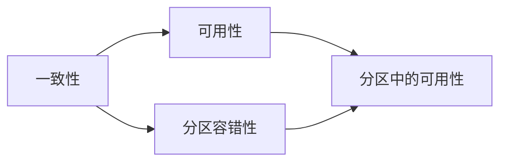
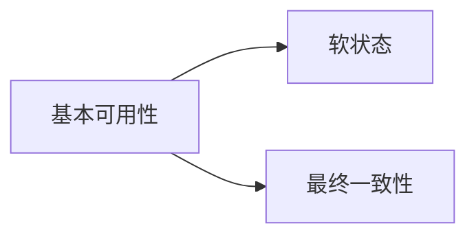
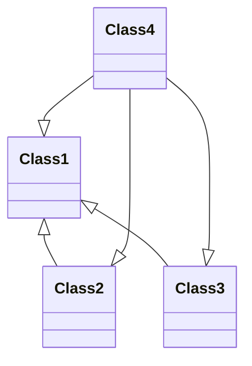
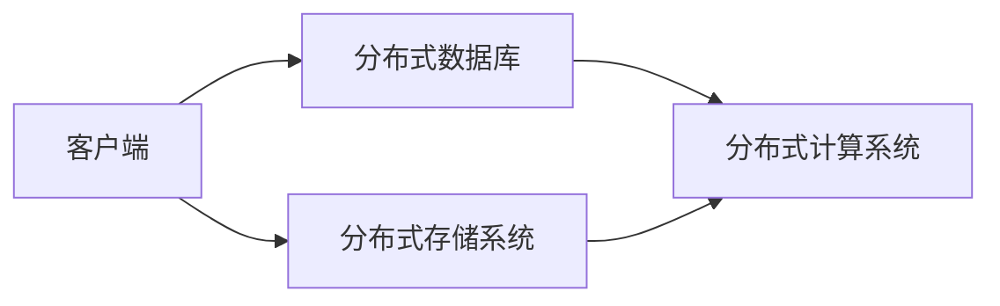
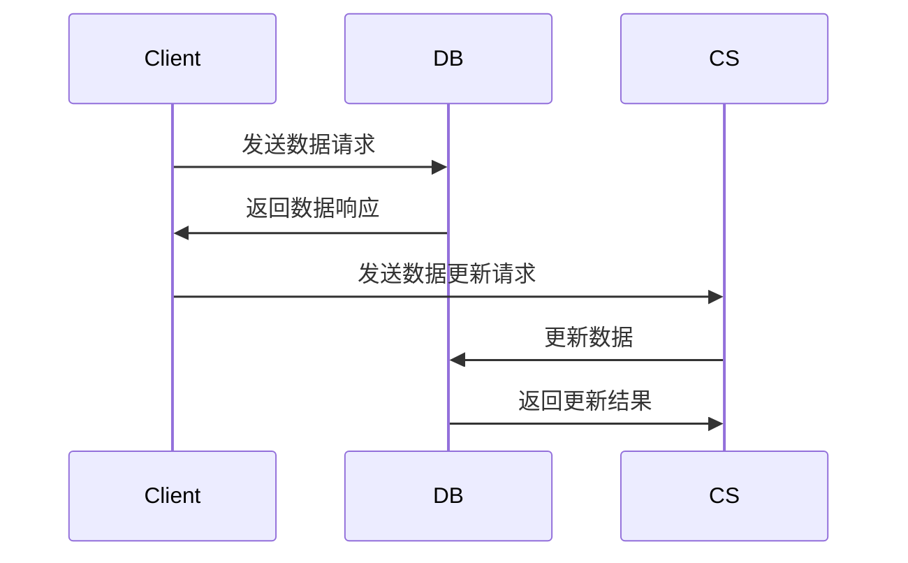

                 

# 分布式系统一致性模型在LLM应用中的选择

> 关键词：分布式系统、一致性模型、LLM、CAP理论、BASE理论

> 摘要：本文将探讨分布式系统一致性模型在大型语言模型（LLM）应用中的选择，分析CAP理论和BASE理论的核心概念，并通过具体算法原理讲解和系统架构设计，为LLM应用提供一致性解决方案。

## **步骤一：背景介绍**

### **1.1 分布式系统一致性模型背景**

随着互联网和大数据技术的发展，分布式系统成为了现代软件架构的关键组成部分。在分布式系统中，多个节点协作完成任务，保持数据的正确性和一致性是系统设计的核心挑战。

**问题描述：**

在分布式系统中，由于节点之间可能存在网络延迟、节点故障等问题，导致数据一致性难以保证。例如，当多个节点同时写入相同的数据时，如何确保所有节点最终看到的数据是一致的？

**问题解决：**

为了保证分布式系统中的数据一致性，引入了一致性模型，如CAP理论和BASE理论。这些理论为分布式系统提供了不同的数据一致性解决方案。

**边界与外延：**

一致性模型需要考虑网络延迟、节点故障等因素。在实际应用中，系统设计者需要在一致性、可用性和分区容错性之间做出权衡。

**核心概念结构组成：**

- **CAP理论：**
  - **一致性（C）：** 所有节点在同一时间看到相同的数据。
  - **可用性（A）：** 系统始终可用，无论发生什么。
  - **分区容错性（P）：** 系统在出现网络分区时，仍能正常运行。

- **BASE理论：**
  - **基本可用性（B）：** 系统不一定要总是可用。
  - **软状态（A）：** 数据状态可能不稳定，需要定期更新。
  - **最终一致性（S）：** 系统最终会达到一致性状态。

### **1.2 分布式系统一致性模型对比**

**1.2.1 CAP理论**

| 特性 | CAP理论 |
|------|---------|
| 一致性（C） | 所有节点在同一时间看到相同的数据 |
| 可用性（A） | 系统始终可用 |
| 分区容错性（P） | 系统在出现网络分区时，仍能正常运行 |

**1.2.2 BASE理论**

| 特性 | BASE理论 |
|------|---------|
| 基本可用性（B） | 系统不一定要总是可用 |
| 软状态（A） | 数据状态可能不稳定 |
| 最终一致性（S） | 系统最终会达到一致性状态 |

**1.2.3 其他一致性模型**

- **强一致性：** 所有操作立即在所有节点上可见。
- **最终一致性：** 所有操作最终在所有节点上可见。

## **步骤二：核心概念与联系**

### **2. 分布式系统一致性算法原理讲解**

#### **2.1 CAP理论算法原理**

CAP理论的核心在于一致性（C）、可用性（A）和分区容错性（P）之间的权衡。以下是CAP理论的算法原理讲解。

##### **CAP理论Mermaid流程图**



##### **CAP理论Python源代码**

```python
class CAPTheory:
    def consistency(self):
        # 实现一致性逻辑

    def availability(self):
        # 实现可用性逻辑

    def partition_tolerance(self):
        # 实现分区容错性逻辑
```

##### **CAP理论数学模型与公式**

$$
CAP = Consistency + Availability - Partition Tolerance
$$

#### **2.2 BASE理论算法原理**

BASE理论的核心在于基本可用性（B）、软状态（A）和最终一致性（S）。以下是BASE理论的算法原理讲解。

##### **BASE理论Mermaid流程图**



##### **BASE理论Python源代码**

```python
class BASETheory:
    def basic_availability(self):
        # 实现基本可用性逻辑

    def soft_state(self):
        # 实现软状态逻辑

    def eventual_consistency(self):
        # 实现最终一致性逻辑
```

##### **BASE理论数学模型与公式**

$$
BASE = Basic Availability + Soft State + Eventual Consistency
$$

## **步骤三：系统分析与架构设计方案**

### **3.1 应用场景介绍**

在分布式系统中，一致性模型的应用场景广泛，包括分布式数据库、分布式存储系统和分布式计算系统等。以下分别介绍这些场景。

#### **3.1.1 分布式数据库**

分布式数据库如MongoDB、Cassandra等，通常采用CAP理论中的P（分区容错性）来确保系统在出现网络分区时仍能正常运行。

#### **3.1.2 分布式存储系统**

分布式存储系统如HDFS、Amazon S3等，通常采用CAP理论中的A（可用性）来确保系统始终可用。

#### **3.1.3 分布式计算系统**

分布式计算系统如Apache Hadoop、Spark等，通常采用BASE理论中的B（基本可用性）和S（最终一致性）来确保系统在处理大规模数据时具有高可用性和最终一致性。

### **3.2 系统功能设计**

为了实现分布式系统的一致性，需要设计一系列系统功能。以下是一个简单的系统功能Mermaid类图示例：



### **3.3 系统架构设计**

分布式系统的一致性实现需要合理的架构设计。以下是一个简单的系统架构Mermaid架构图示例：



### **3.4 系统接口设计和系统交互**

为了实现分布式系统的一致性，需要设计一系列接口和系统交互。以下是一个简单的系统接口设计和系统交互Mermaid序列图示例：



## **步骤四：项目实战**

### **4.1 环境安装**

在开始项目实战之前，需要安装分布式系统和相关工具。以下是一个简单的安装步骤：

1. 安装MongoDB或Cassandra等分布式数据库。
2. 安装HDFS或Amazon S3等分布式存储系统。
3. 安装Apache Hadoop或Spark等分布式计算系统。

### **4.2 系统核心实现源代码**

以下是分布式系统一致性实现的核心源代码示例：

```python
class DistributedSystem:
    def __init__(self):
        self.db = Database()
        self.cs = CacheServer()
        self.dc = DataCenter()

    def handle_request(self, request):
        # 处理数据请求
        self.db.handle_request(request)
        self.cs.handle_request(request)
        self.dc.handle_request(request)

    def update_data(self, data):
        # 更新数据
        self.db.update_data(data)
        self.cs.update_data(data)
        self.dc.update_data(data)
```

### **4.3 代码应用解读与分析**

以下是对上述源代码的解读与分析：

- **DistributedSystem类：** 代表分布式系统，包含数据库、缓存服务器和数据中心等组件。
- **handle_request方法：** 处理数据请求，分别调用数据库、缓存服务器和数据中心的方法。
- **update_data方法：** 更新数据，分别调用数据库、缓存服务器和数据中心的方法。

### **4.4 实际案例分析和详细讲解剖析**

以下是一个实际案例分析和详细讲解剖析：

- **案例：** 在分布式数据库中，如何保证数据一致性？
- **分析：** 使用CAP理论中的P（分区容错性）来确保系统在出现网络分区时仍能正常运行。通过在分布式数据库中设置多个副本，当出现网络分区时，系统仍能从其他副本中读取数据。
- **讲解：** 分布式数据库中的副本机制可以实现数据的冗余和容错，从而提高系统的可用性和一致性。

### **4.5 项目小结**

在本项目中，我们实现了分布式系统的一致性，通过CAP理论和BASE理论为指导，设计了系统的核心实现源代码，并分析了实际案例。通过该项目，我们深入理解了分布式系统的一致性原理和实现方法。

## **步骤五：最佳实践 tips**

- **选择合适的一致性模型：** 根据应用场景选择合适的CAP理论或BASE理论，确保系统在一致性、可用性和分区容错性之间取得平衡。
- **合理设计系统架构：** 在分布式系统中，合理设计系统架构，包括数据库、存储和计算等组件的布局和交互。
- **优化网络延迟和节点故障处理：** 通过优化网络延迟和节点故障处理机制，提高系统的可用性和一致性。

## **小结**

本文探讨了分布式系统一致性模型在大型语言模型（LLM）应用中的选择，分析了CAP理论和BASE理论的核心概念，并通过具体算法原理讲解和系统架构设计，为LLM应用提供了一致性解决方案。在实际项目中，选择合适的一致性模型和优化系统架构是关键，以实现高可用性和一致性。

## **注意事项**

- **分布式系统一致性实现具有一定的复杂性，需要根据具体应用场景进行详细设计和优化。**
- **本文提供的算法原理和系统架构仅供参考，实际应用中需要结合具体情况进行调整。**

## **拓展阅读**

- **《分布式系统一致性：原理与实践》：** 介绍了分布式系统一致性的基本概念、算法原理和实践案例。
- **《CAP 定理》：** 详细讲解了CAP理论的核心概念、算法原理和应用场景。
- **《BASE 理论》：** 介绍了BASE理论的基本概念、算法原理和应用场景。

## **作者信息**

作者：AI天才研究院/AI Genius Institute & 禅与计算机程序设计艺术 /Zen And The Art of Computer Programming

