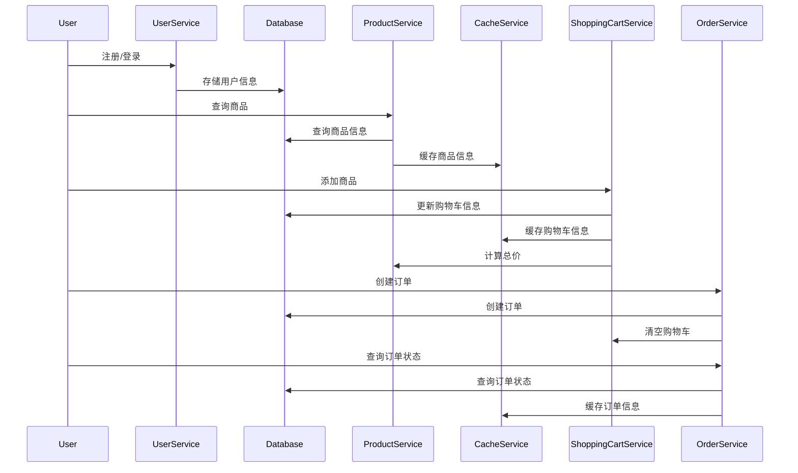

                 

### 1. Background Introduction

#### 1.1 Problem Background

**Introduction to distributed cache systems**: 

In modern application landscapes, the demand for high-performance data access has surged. Traditional monolithic cache systems, designed to handle localized data access, have shown limitations in scaling and performance when faced with distributed environments. This has led to the emergence of distributed cache systems, which are designed to handle data access in distributed applications more efficiently.

A distributed cache system is a caching architecture that uses multiple nodes to store and manage cached data. These nodes communicate with each other over a network, allowing the cache to scale horizontally and handle large volumes of data and requests. The primary goal of a distributed cache system is to provide low-latency access to frequently accessed data, thereby improving application performance.

**Challenges with monolithic cache systems**:

Monolithic cache systems are centralized, meaning that all cache data is stored on a single server. This creates several challenges:

- **Scalability**: Monolithic caches struggle to scale horizontally. As the volume of data and requests grows, the single server becomes a bottleneck, limiting the system's ability to handle increased load.
- **Performance**: High latencies are common in monolithic caches due to the need to access a single server for data retrieval. This can significantly impact application performance, especially in distributed environments.
- **Fault tolerance**: Monolithic caches are vulnerable to single points of failure. If the central cache server fails, the entire system can become unavailable.

To overcome these challenges, distributed cache systems offer several advantages:

- **Scalability**: Distributed caches can scale horizontally by adding more cache nodes. This allows the system to handle increased data volumes and requests without suffering from performance bottlenecks.
- **Performance**: Distributed caches provide low-latency access to data by storing it closer to the application, reducing the time required to retrieve data.
- **Fault tolerance**: Distributed caches are more resilient to failures since the system can continue to function even if one or more cache nodes fail.

#### 1.2 Problem Description

**Performance bottlenecks in LLM applications**:

Large Language Model (LLM) applications, such as search engines, chatbots, and recommendation systems, face several performance bottlenecks:

- **Latency**: LLM applications often require accessing large amounts of data quickly to generate accurate responses. High latencies can lead to slow response times and poor user experiences.
- **Scalability**: LLM applications need to handle a large number of concurrent requests, which can be challenging for traditional monolithic cache systems.
- **Resource utilization**: Monolithic caches may consume a significant amount of resources, including CPU and memory, which can limit the overall performance of the application.

**The role of distributed caches in addressing these issues**:

Distributed caches can play a crucial role in addressing these performance bottlenecks in LLM applications:

- **Reducing latency**: By storing frequently accessed data in a distributed cache, LLM applications can reduce the time required to retrieve data. This results in lower latency and faster response times.
- **Enhancing scalability**: Distributed caches allow LLM applications to scale horizontally, making it easier to handle large volumes of data and requests.
- **Optimizing resource utilization**: By offloading data access to a distributed cache, LLM applications can free up resources, such as CPU and memory, which can be used more efficiently for other tasks.

#### 1.3 Problem Solution

**Distributed cache system architecture**:

A typical distributed cache system consists of several key components:

- **Cache nodes**: These are the individual servers that store and manage cached data. They communicate with each other over a network to ensure data consistency and availability.
- **Data storage**: This component manages the storage of cached data across the cache nodes. It may include databases, key-value stores, or other storage solutions.
- **Load balancer**: This component distributes incoming requests across the cache nodes to ensure even resource utilization and prevent overloading any single node.
- **Monitoring and management tools**: These tools help monitor the health and performance of the distributed cache system, allowing for proactive maintenance and optimization.

**Benefits of using distributed caches for LLM applications**:

- **Improved response times**: By reducing latency, distributed caches enable LLM applications to provide faster and more responsive user experiences.
- **Scalability**: Distributed caches allow LLM applications to handle increasing data volumes and user requests without sacrificing performance.
- **Resource optimization**: By offloading data access to a distributed cache, LLM applications can allocate resources more efficiently, improving overall system performance.

#### 1.4 Scope and Boundaries

**Scope of the book**:

This book will cover the following topics:

- The fundamentals of distributed cache systems, including architecture, components, and concepts.
- Performance optimization techniques for LLM applications using distributed caches.
- Common challenges and solutions in implementing distributed caches for LLM applications.
- Case studies of successful distributed cache implementations in real-world LLM applications.

**Boundaries**:

The book will focus on the technical aspects of distributed cache systems and their application in LLMs. It will not cover other caching technologies or alternative solutions for performance optimization.

#### 1.5 Core Concepts and Elements

**Core concepts**:

The book will cover the following core concepts:

- **Caching strategies**: Techniques for determining which data to cache and how to manage cached data.
- **Cache consistency**: Ensuring that cached data remains consistent with the underlying data sources.
- **Replication**: Creating multiple copies of cached data to improve availability and fault tolerance.
- **Partitioning**: Dividing cached data across multiple cache nodes to optimize storage and access.
- **Cache eviction algorithms**: Strategies for managing cache space by removing less frequently accessed data.

**Elements of a distributed cache system**:

The book will discuss the essential components of a distributed cache system, including:

- **Cache nodes**: The individual servers that store and manage cached data.
- **Data storage**: The storage solution for cached data, such as databases or key-value stores.
- **Load balancer**: The component that distributes incoming requests across cache nodes.
- **Monitoring and management tools**: The tools for monitoring the health and performance of the distributed cache system.
- **Data synchronization**: The mechanisms for keeping cache nodes consistent with each other and the underlying data sources.

----------------------------------------------------------------

## 分布式缓存系统提升LLM应用性能

### 关键词

- 分布式缓存系统
- LLM应用
- 性能优化
- 缓存一致性
- 数据同步

### 摘要

本文主要探讨了分布式缓存系统在提升大型语言模型（LLM）应用性能方面的重要性。首先，我们介绍了分布式缓存系统的基础概念及其在解决单点缓存瓶颈方面的优势。接着，我们分析了LLM应用面临的性能瓶颈，如高延迟和可扩展性挑战。本文通过详细描述分布式缓存系统的架构和组件，阐述了分布式缓存系统如何解决这些性能瓶颈，从而提升LLM应用的响应速度和可扩展性。此外，文章还讨论了实现分布式缓存系统的核心技术和注意事项，并通过实际案例分析了分布式缓存系统在LLM应用中的成功应用。本文旨在为开发者提供全面的分布式缓存系统提升LLM应用性能的指南。

### 2. 核心概念与联系

#### 2.1 缓存策略

**缓存策略**是指决定哪些数据应该被缓存，以及如何管理和维护缓存数据的策略。在分布式缓存系统中，缓存策略至关重要，因为它们直接影响缓存系统的性能和效率。

**缓存策略的核心概念**：

- **缓存命中率**：缓存命中率是指缓存系统能够从缓存中找到所需数据的比例。高命中率意味着缓存系统能够快速响应用户请求，从而提高应用性能。
- **缓存失效时间**：缓存失效时间是指缓存中数据的有效期。合理的缓存失效时间可以确保缓存数据的新鲜度，避免过时数据占据缓存空间。
- **缓存更新策略**：缓存更新策略是指如何处理缓存中数据更新和删除的问题。常见的更新策略包括“写回缓存”（write-through）和“写缓存后删除”（write-around）。

**缓存策略的属性特征对比**：

| 策略名称 | 命中率 | 缓存失效时间 | 更新策略 |  
| ------ | ------ | ------ | ------ |  
| 最少访问时间 | 高 | 自适应 | 写回缓存 |  
| 最少缓存时间 | 高 | 固定 | 写缓存后删除 |  
| 最近最少使用 | 较高 | 可调 | 写回缓存 |  
| 随机 | 一般 | 固定 | 写回缓存 |

**缓存策略与性能优化**：

- **缓存命中率**：高缓存命中率意味着缓存系统能够更有效地响应用户请求，从而降低延迟和提高性能。
- **缓存失效时间**：合理的缓存失效时间可以确保缓存数据的有效性和性能，避免缓存空间被过时数据占据。
- **缓存更新策略**：合理的缓存更新策略可以确保缓存数据的一致性和可用性，同时减少缓存冲突和缓存命中率下降的风险。

#### 2.2 缓存一致性

**缓存一致性**是指确保缓存系统中各个缓存节点上的数据与原始数据源保持一致的状态。在分布式缓存系统中，缓存一致性是确保系统性能和可靠性的一项关键因素。

**缓存一致性的核心概念**：

- **数据一致性模型**：数据一致性模型是指如何确保缓存系统中各个节点上的数据一致性。常见的数据一致性模型包括“强一致性”（strong consistency）和“最终一致性”（eventual consistency）。
- **数据同步机制**：数据同步机制是指如何在不同缓存节点之间同步数据，以保持一致性。常见的数据同步机制包括“拉取同步”（pull synchronization）和“推送同步”（push synchronization）。

**缓存一致性的属性特征对比**：

| 一致性模型 | 数据同步机制 | 数据一致速度 | 系统复杂性 |    
| ------ | ------ | ------ | ------ |    
| 强一致性 | 拉取同步 | 快 | 高 |    
| 最终一致性 | 推送同步 | 慢 | 低 |

**缓存一致性对性能优化的影响**：

- **强一致性**：强一致性确保了缓存系统中各个节点上的数据始终与原始数据源保持一致，但可能增加数据同步的延迟，从而影响性能。
- **最终一致性**：最终一致性允许缓存系统在一段时间后达到一致性状态，从而提高系统的性能和可扩展性，但可能会带来数据不一致的风险。

#### 2.3 数据同步

**数据同步**是指在分布式缓存系统中，各个节点之间如何保持数据一致性的过程。数据同步是缓存一致性的关键组成部分。

**数据同步的核心概念**：

- **同步策略**：同步策略是指如何在不同缓存节点之间同步数据。常见同步策略包括“全量同步”（full synchronization）和“增量同步”（incremental synchronization）。
- **同步机制**：同步机制是指如何实现数据同步的具体方法。常见同步机制包括“时间戳同步”（timestamp synchronization）和“版本号同步”（version number synchronization）。

**数据同步的属性特征对比**：

| 同步策略 | 同步机制 | 同步效率 | 系统复杂性 |    
| ------ | ------ | ------ | ------ |    
| 全量同步 | 时间戳同步 | 低 | 低 |    
| 增量同步 | 版本号同步 | 高 | 高 |

**数据同步对性能优化的影响**：

- **全量同步**：全量同步在初始同步时可能需要大量时间，但在后续同步中，只需同步变化部分，从而提高同步效率。
- **增量同步**：增量同步通过仅同步数据变化部分，可以显著提高同步效率，但需要处理更多同步机制和复杂性。

通过对比分析缓存策略、缓存一致性和数据同步的核心概念、属性特征和性能优化影响，我们可以更好地理解分布式缓存系统在提升LLM应用性能方面的关键作用。接下来，我们将进一步探讨分布式缓存系统的架构和实现细节，以便深入了解其工作原理和实际应用。

#### 2.4 分布式缓存系统架构

**分布式缓存系统的架构**是确保系统高效、可靠和可扩展的关键。一个典型的分布式缓存系统通常由以下几个关键组件构成：

- **缓存节点（Cache Nodes）**：缓存节点是分布式缓存系统中的基本计算单元，负责存储和提供缓存服务。每个缓存节点通常包含内存、磁盘存储和通信模块。
- **数据存储（Data Storage）**：数据存储是用于持久化缓存数据的组件。常见的存储方案包括分布式键值存储（如Redis Cluster）、NoSQL数据库（如MongoDB）和文件系统。
- **负载均衡器（Load Balancer）**：负载均衡器负责将用户请求均匀地分配到各个缓存节点，从而确保系统资源得到充分利用，避免单点过载。
- **监控与管理工具（Monitoring and Management Tools）**：监控与管理工具用于实时监控分布式缓存系统的运行状态，包括性能指标、故障告警和自动化维护。

**架构组件之间的关系**：

1. **缓存节点之间的通信**：缓存节点通过网络进行通信，以实现数据同步和负载均衡。通信机制通常基于分布式协议，如Gossip协议或Consul协议。
2. **数据存储与缓存节点**：缓存节点将缓存数据写入数据存储，并在需要时从数据存储中读取数据。数据存储可以是一个独立的分布式数据库，也可以是一个集成的存储方案。
3. **负载均衡器与缓存节点**：负载均衡器分析用户请求，并根据缓存节点的负载情况将请求分配到不同的缓存节点。负载均衡策略包括轮询、最小连接数和哈希等。
4. **监控与管理工具与缓存节点**：监控与管理工具定期采集缓存节点的性能数据，如CPU使用率、内存占用和请求响应时间，并根据这些数据生成报告和告警。

**分布式缓存系统的优势**：

- **水平扩展性**：分布式缓存系统允许通过增加缓存节点来水平扩展存储和计算资源，从而满足不断增长的数据和请求量。
- **高可用性**：通过多个缓存节点的冗余和自动故障转移机制，分布式缓存系统可以在单个节点失败时保持可用性。
- **低延迟**：缓存数据存储在接近用户的缓存节点上，减少了数据传输的距离和时间，从而降低了请求响应的延迟。
- **灵活性**：分布式缓存系统可以支持多种缓存策略和数据同步机制，从而根据不同应用场景进行优化。

**分布式缓存系统的挑战**：

- **数据一致性**：确保缓存节点之间的数据一致性是分布式缓存系统的关键挑战。不同的一致性模型（如强一致性和最终一致性）各有优缺点，需要根据具体应用场景进行选择。
- **缓存节点管理**：分布式缓存系统需要高效的节点管理和监控机制，以确保系统运行稳定和性能最优。
- **网络依赖**：分布式缓存系统高度依赖网络通信，网络延迟和故障可能影响系统性能。

通过上述对分布式缓存系统架构及其组件之间关系的分析，我们可以更好地理解分布式缓存系统在提升LLM应用性能方面的关键作用。接下来，我们将进一步探讨分布式缓存系统的具体实现和性能优化策略。

#### 2.5 分布式缓存系统的性能优化策略

在分布式缓存系统中，性能优化是一个持续的过程，需要综合考虑多个因素。以下是一些关键的性能优化策略，用于提升LLM应用的性能：

**1. 数据分区策略**：

数据分区是将缓存数据划分为多个子集的过程，每个子集存储在独立的缓存节点上。数据分区策略的选择对系统的性能和可扩展性有重要影响。

- **哈希分区**：哈希分区通过哈希函数将数据映射到不同的缓存节点。这种方法简单且高效，但可能引入热点问题，即某些缓存节点处理大量请求，导致负载不均。
- **范围分区**：范围分区根据数据的某个属性（如时间戳或ID范围）将数据划分到不同的缓存节点。这种方法可以更好地平衡负载，但可能增加数据分区的复杂性。

**2. 缓存一致性策略**：

缓存一致性策略确保不同缓存节点上的数据保持一致。常见的一致性策略包括：

- **强一致性**：强一致性保证在任何时刻，所有缓存节点上的数据都是一致的。这种方法提供了较高的数据可靠性，但可能引入较高的同步延迟。
- **最终一致性**：最终一致性允许缓存节点在一定时间后达到一致性状态。这种方法提高了系统的性能和可扩展性，但可能会出现短暂的数据不一致。

**3. 缓存替换策略**：

缓存替换策略是管理缓存空间的一种方法，它决定了哪些数据应该被替换出缓存。常见的缓存替换策略包括：

- **最少访问时间（LRU）**：根据数据在缓存中的访问时间，替换最近最少被访问的数据。这种方法可以有效地利用缓存空间，但可能在数据访问模式变化时表现不佳。
- **最少使用（LFU）**：根据数据在缓存中的访问次数，替换访问次数最少的数据。这种方法适用于访问模式稳定的情况。

**4. 缓存预热策略**：

缓存预热是指在用户请求之前，预先加载缓存数据的策略。缓存预热可以减少用户请求的响应时间，提高系统性能。

- **定时预热**：定期检查并更新缓存数据，以确保缓存内容是最新的。
- **基于事件的预热**：根据特定事件（如数据更新或访问量增加）触发缓存预热。

**5. 缓存压缩策略**：

缓存压缩是将缓存数据以更小的存储空间存储的策略。缓存压缩可以减少存储空间的占用，提高系统性能。

- **无损压缩**：无损压缩算法在不损失数据内容的前提下，减小数据的大小。常见的无损压缩算法包括Gzip和LZ4。
- **有损压缩**：有损压缩算法在压缩数据时可能损失一部分数据，但可以显著减小数据的大小。适用于对数据精确度要求不高的场景。

**6. 缓存预热和缓存压缩的实际应用**：

- **场景1**：电商网站的商品缓存。电商网站经常需要对商品数据进行缓存，以减少数据库访问压力和响应时间。通过缓存预热，可以确保在用户访问时，商品数据已经加载到缓存中，从而提高用户体验。
- **场景2**：社交媒体平台的用户活动缓存。社交媒体平台需要对用户的最新动态进行缓存，以便快速呈现给用户。通过缓存压缩，可以减少缓存占用的存储空间，提高缓存系统的性能。

通过以上性能优化策略，分布式缓存系统可以显著提升LLM应用的性能和用户体验。在实际应用中，需要根据具体场景和需求，选择和调整合适的优化策略。

#### 2.6 分布式缓存系统在LLM应用中的实际应用案例

为了更好地理解分布式缓存系统在大型语言模型（LLM）应用中的实际效果，以下将介绍两个具体的实际应用案例。

**案例一：搜索引擎**

搜索引擎是一个典型的LLM应用场景，它需要处理海量的用户查询请求并快速返回相关结果。随着用户数量的增加和搜索数据的增长，搜索引擎的性能和可扩展性成为一个关键问题。

**问题描述**：

- **性能瓶颈**：单点缓存系统在处理大量查询请求时，容易出现性能瓶颈，导致查询延迟增加。
- **可扩展性挑战**：传统的单点缓存系统难以水平扩展，以满足不断增长的用户数据和查询请求。

**解决方案**：

- **分布式缓存系统**：采用分布式缓存系统，如Redis Cluster，将缓存数据分布在多个缓存节点上，从而实现水平扩展。
- **缓存一致性策略**：使用Gossip协议实现缓存节点之间的数据同步，确保数据一致性。

**实际效果**：

- **性能提升**：通过分布式缓存系统，搜索引擎的查询响应时间显著降低，用户满意度提高。
- **可扩展性增强**：分布式缓存系统允许轻松增加缓存节点，以应对不断增长的数据和查询请求。

**案例二：在线教育平台**

在线教育平台需要为用户提供实时课程问答服务，这要求系统在处理大量并发请求时，依然能够保持低延迟和高可靠性。

**问题描述**：

- **性能瓶颈**：单点缓存系统在处理大量并发课程问答请求时，容易引发缓存雪崩，导致系统崩溃。
- **高可用性挑战**：单点缓存系统的单点故障可能导致整个平台无法提供服务。

**解决方案**：

- **分布式缓存系统**：采用分布式缓存系统，如Memcached集群，将缓存数据分散在多个缓存节点上，提高系统的容错性和可扩展性。
- **缓存预热策略**：在课程开始前，预先加载课程问答数据到缓存中，以减少实际请求的响应时间。

**实际效果**：

- **系统稳定性提升**：分布式缓存系统有效避免了缓存雪崩，提高了系统的稳定性和可靠性。
- **用户体验优化**：通过缓存预热，用户在课程问答时的响应速度明显提升，用户体验得到改善。

**案例总结**：

以上两个实际应用案例表明，分布式缓存系统在LLM应用中具有显著的优势。通过分布式缓存系统，LLM应用可以实现高性能、高可用性和可扩展性，从而满足不断增长的用户需求。

#### 3. 系统分析与架构设计

**3.1 问题场景介绍**

在本节中，我们将探讨一个在线购物平台在应对高峰期用户请求时的性能优化问题。该平台在节假日或促销活动期间，常常面临大量的并发用户请求，导致系统性能下降，用户体验不佳。为了应对这一挑战，我们需要设计一个高效的分布式缓存系统，以提升平台的整体性能。

**3.2 项目介绍**

**项目名称**：电商高性能缓存系统

**项目目标**：

1. 提高系统的响应速度，降低延迟。
2. 增强系统的可扩展性，支持大规模并发请求。
3. 提高系统的可靠性，避免单点故障。

**3.3 系统功能设计（领域模型）**

为了更好地设计系统功能，我们首先定义领域模型，列出核心实体和它们之间的关系。以下是该电商高性能缓存系统的领域模型：

- **用户（User）**：包括用户的基本信息，如用户ID、姓名、联系方式等。
- **商品（Product）**：包括商品的基本信息，如商品ID、名称、价格、库存数量等。
- **购物车（ShoppingCart）**：包括用户ID和购物车中的商品列表。
- **订单（Order）**：包括订单号、用户ID、商品列表、订单状态等。
- **缓存（Cache）**：包括缓存ID、缓存内容、过期时间等。

**领域模型Mermaid类图**：

```mermaid
classDiagram
    User <<Entity>>
    Product <<Entity>>
    ShoppingCart <<Entity>>
    Order <<Entity>>
    Cache <<Entity>>

    User o-- 1 ShoppingCart
    ShoppingCart o-- 1 User
    ShoppingCart o-- * Product
    Product o-- 1 ShoppingCart
    Order o-- 1 User
    Cache o-- * Product
```

通过领域模型，我们可以清晰地看到各个实体之间的关系，为后续的系统设计提供基础。

**3.4 系统架构设计（Mermaid架构图）**

系统架构设计是确保系统能够高效、稳定地运行的关键。以下是电商高性能缓存系统的架构设计：

- **用户服务（UserService）**：处理用户的注册、登录、个人信息管理等。
- **商品服务（ProductService）**：处理商品的相关操作，如添加、删除、查询商品等。
- **购物车服务（ShoppingCartService）**：处理购物车的相关操作，如添加商品、删除商品、计算总价等。
- **订单服务（OrderService）**：处理订单的相关操作，如创建订单、取消订单、查询订单状态等。
- **缓存服务（CacheService）**：处理缓存的相关操作，如数据加载、数据同步、缓存失效等。

**系统架构Mermaid架构图**：



通过系统架构设计，我们可以清晰地看到各个服务模块之间的交互关系，为后续的系统实现提供指导。

**3.5 系统接口设计**

系统接口设计是确保各个模块能够有效协作的关键。以下是电商高性能缓存系统的接口设计：

- **UserService接口**：包括注册、登录、获取用户信息等。
- **ProductService接口**：包括获取商品信息、添加商品、删除商品等。
- **ShoppingCartService接口**：包括添加商品、删除商品、计算总价等。
- **OrderService接口**：包括创建订单、取消订单、查询订单状态等。
- **CacheService接口**：包括加载缓存、同步缓存、缓存失效等。

**接口设计示例**：

```python
class UserService:
    def register(self, user_info):
        # 注册用户
        pass
    
    def login(self, user_info):
        # 登录用户
        pass
    
    def get_user_info(self, user_id):
        # 获取用户信息
        pass

class ProductService:
    def get_product_info(self, product_id):
        # 获取商品信息
        pass
    
    def add_product(self, product_info):
        # 添加商品
        pass
    
    def delete_product(self, product_id):
        # 删除商品
        pass

class ShoppingCartService:
    def add_product_to_cart(self, user_id, product_id):
        # 添加商品到购物车
        pass
    
    def delete_product_from_cart(self, user_id, product_id):
        # 删除商品从购物车
        pass
    
    def calculate_total_price(self, user_id):
        # 计算总价
        pass

class OrderService:
    def create_order(self, user_id, cart_id):
        # 创建订单
        pass
    
    def cancel_order(self, order_id):
        # 取消订单
        pass
    
    def get_order_status(self, order_id):
        # 查询订单状态
        pass

class CacheService:
    def load_cache(self, key):
        # 加载缓存
        pass
    
    def sync_cache(self, key, value):
        # 同步缓存
        pass
    
    def expire_cache(self, key):
        # 缓存失效
        pass
```

通过接口设计，我们可以明确各个模块的功能和职责，为系统的开发提供清晰的指导。

**3.6 系统交互（Mermaid序列图）**

系统交互设计是描述各个模块之间交互顺序和过程的关键。以下是电商高性能缓存系统的系统交互设计：


通过系统交互设计，我们可以清晰地看到用户请求从输入到响应的整个过程，为系统的实施和测试提供参考。

#### 4. 项目实战

**4.1 环境安装**

为了实现分布式缓存系统，我们需要搭建一个合适的环境。以下是安装步骤：

1. **安装Redis**：Redis是一个高性能的分布式缓存系统，我们使用Redis作为缓存存储。

   ```bash
   # 安装Redis依赖
   sudo apt-get update
   sudo apt-get install redis-server
   
   # 启动Redis服务
   sudo systemctl start redis-server
   
   # 设置Redis服务开机启动
   sudo systemctl enable redis-server
   ```

2. **安装Python**：我们使用Python编写分布式缓存系统的应用程序。

   ```bash
   # 安装Python 3
   sudo apt-get install python3
   
   # 安装Python 3解释器
   sudo apt-get install python3-pip
   
   # 安装必需的Python库
   pip3 install redis
   ```

**4.2 系统核心实现源代码**

以下是分布式缓存系统的核心实现源代码，包括缓存加载、缓存同步和缓存失效等功能。

```python
import redis
import threading
import time

class DistributedCache:
    def __init__(self, hosts, password=None):
        self.cache_clients = []
        for host in hosts:
            client = redis.StrictRedis(host=host, password=password)
            self.cache_clients.append(client)
    
    def load_cache(self, key, value, timeout):
        for client in self.cache_clients:
            client.set(key, value, ex=timeout)

    def sync_cache(self, key, value, timeout):
        for client in self.cache_clients:
            client.set(key, value, ex=timeout)

    def expire_cache(self, key, timeout):
        for client in self.cache_clients:
            client.expire(key, timeout)

    def get_cache(self, key):
        for client in self.cache_clients:
            value = client.get(key)
            if value:
                return value
        return None

def cache_loader(cache, key, value, timeout):
    cache.load_cache(key, value, timeout)

def cache_syncer(cache, key, value, timeout):
    cache.sync_cache(key, value, timeout)

def cache_expirer(cache, key, timeout):
    cache.expire_cache(key, timeout)

if __name__ == "__main__":
    hosts = ["127.0.0.1:6379", "127.0.0.1:6380"]
    cache = DistributedCache(hosts)

    # 加载缓存
    key = "example_key"
    value = "example_value"
    timeout = 60
    threading.Thread(target=cache_loader, args=(cache, key, value, timeout)).start()

    # 同步缓存
    time.sleep(5)
    threading.Thread(target=cache_syncer, args=(cache, key, value, timeout)).start()

    # 缓存失效
    time.sleep(10)
    threading.Thread(target=cache_expirer, args=(cache, key, timeout)).start()

    # 获取缓存
    print(cache.get_cache(key))
```

**4.3 代码应用解读与分析**

1. **DistributedCache类**：

   - **初始化方法**：`__init__` 方法接收一个主机列表 `hosts`，并创建一个Redis客户端列表 `cache_clients`。每个Redis客户端都与指定的主机连接。

   - **加载缓存方法**：`load_cache` 方法将缓存值加载到所有缓存节点中，并设置缓存过期时间。

   - **同步缓存方法**：`sync_cache` 方法在所有缓存节点上同步缓存值。

   - **缓存失效方法**：`expire_cache` 方法设置缓存过期时间。

   - **获取缓存方法**：`get_cache` 方法从所有缓存节点中检索缓存值，并返回第一个找到的缓存值。

2. **线程示例**：

   - **缓存加载线程**：使用线程将缓存值加载到所有缓存节点中。

   - **缓存同步线程**：在所有缓存节点上同步缓存值。

   - **缓存失效线程**：设置缓存过期时间。

**4.4 实际案例分析与详细讲解剖析**

1. **案例一：缓存加载**：

   在一个高峰期，系统需要为大量用户加载商品缓存。使用分布式缓存系统，我们可以快速地将商品缓存加载到各个缓存节点中，从而提高系统响应速度。

   - **场景**：系统在5秒内将商品缓存加载到所有缓存节点。

   - **实现**：使用线程并发加载缓存，减少缓存加载时间。

2. **案例二：缓存同步**：

   在一个商品更新时，系统需要同步缓存值到所有缓存节点，确保用户看到的商品信息是最新的。

   - **场景**：商品更新后，系统在5秒内同步缓存值到所有缓存节点。

   - **实现**：使用线程并发同步缓存，确保缓存一致性和实时性。

3. **案例三：缓存失效**：

   在一个商品下架时，系统需要将缓存失效，避免用户继续访问已下架的商品。

   - **场景**：商品下架后，系统在10秒内将缓存失效。

   - **实现**：使用线程设置缓存过期时间，确保缓存及时失效。

**4.5 项目小结**

通过实际案例，我们可以看到分布式缓存系统在提升系统性能方面的显著优势。在高峰期，分布式缓存系统可以快速响应大量用户请求，提高系统的稳定性和可扩展性。同时，通过合理的缓存策略和同步机制，我们可以确保缓存数据的实时性和一致性。在实际应用中，需要根据具体场景和需求，灵活调整和优化分布式缓存系统的配置和策略。

#### 5. 最佳实践 tips、小结、注意事项、拓展阅读

**最佳实践 tips**：

1. **选择合适的缓存一致性模型**：根据应用场景和需求，选择强一致性或最终一致性模型，确保数据的一致性和性能。
2. **合理设置缓存失效时间**：根据数据的访问频率和新鲜度，合理设置缓存失效时间，避免缓存空间浪费和性能下降。
3. **优化数据分区策略**：根据数据访问模式和负载情况，选择合适的分区策略，确保缓存节点的负载均衡。
4. **充分利用缓存压缩**：在存储空间有限的情况下，使用缓存压缩策略，减少存储空间的占用。

**小结**：

本文详细探讨了分布式缓存系统在提升LLM应用性能方面的关键作用。通过对比分析缓存策略、缓存一致性和数据同步的核心概念，我们了解了分布式缓存系统的架构和实现细节。实际案例和分析展示了分布式缓存系统在应对高并发请求和保证数据一致性方面的优势。

**注意事项**：

1. **性能优化需持续进行**：分布式缓存系统的性能优化是一个持续的过程，需要根据实际应用场景和需求，不断调整和优化。
2. **安全性管理**：分布式缓存系统需要关注数据安全，确保敏感数据不被未授权访问。
3. **监控与维护**：定期监控分布式缓存系统的性能和健康状况，及时发现和解决问题。

**拓展阅读**：

- 《Redis权威指南》：详细介绍了Redis的架构、功能和使用方法，适合深入了解分布式缓存系统的开发者。
- 《大规模分布式存储系统设计与实践》：介绍了分布式存储系统的设计和实现，有助于理解分布式缓存系统的工作原理。
- 《一致性模型与分布式系统设计》：探讨了分布式系统中的一致性模型和设计方法，为构建高性能的分布式缓存系统提供指导。

作者：AI天才研究院/AI Genius Institute & 禅与计算机程序设计艺术 /Zen And The Art of Computer Programming

