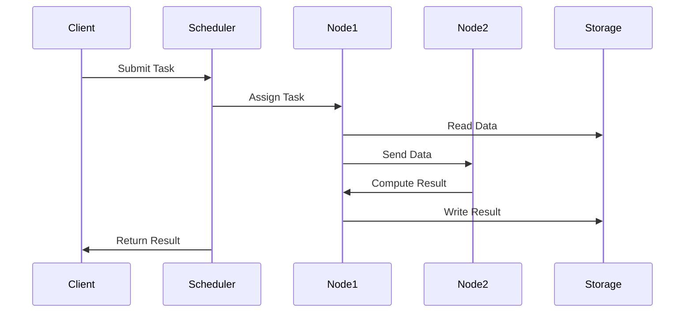

                 


### 分布式计算框架支持LLM应用的大规模计算

#### 关键词：
- 分布式计算
- LLM（大型语言模型）
- 大规模计算
- 框架设计
- 性能优化
- 可扩展性

#### 摘要：
本文将探讨如何利用分布式计算框架支持大型语言模型（LLM）应用的大规模计算需求。我们将逐步分析分布式计算框架的基本原理，其核心概念和原理，以及如何实现和优化这种框架以应对LLM应用的挑战。通过实际的案例研究，我们将展示分布式计算框架在LLM应用中的实际应用效果，并讨论未来的发展方向。

## 引言

### 分布式计算与LLM应用

分布式计算是一种在多个计算节点上分配和处理计算任务的方法。随着大数据和人工智能（AI）的快速发展，大规模计算的需求日益增长。分布式计算框架，如MapReduce、Spark和Hadoop，为处理这些大规模数据提供了有效的方法。而大型语言模型（LLM）是AI领域中的一种先进技术，它能够理解和生成自然语言，被广泛应用于自然语言处理（NLP）、机器翻译、问答系统等领域。

LLM的应用需要处理大量的数据，进行复杂的模型训练和推理。这要求计算系统具备高吞吐量、低延迟和强大的计算能力。传统的单机计算模式难以满足这些需求，因此分布式计算框架成为支持LLM应用的重要手段。

### 问题背景

#### 分布式计算框架的基本概念

分布式计算框架是一套工具和库，用于管理和执行分布式计算任务。这些框架提供了并行计算、负载均衡、容错处理等功能，使得开发者可以轻松地构建和部署分布式应用程序。

#### LLM应用的需求和挑战

LLM应用通常需要处理大规模的数据集，进行复杂的模型训练和推理。这带来了以下挑战：

1. **数据量巨大**：LLM模型通常需要处理数百万甚至数十亿级别的数据点。
2. **计算资源需求高**：训练和推理过程需要大量的计算资源，特别是GPU和TPU等专用硬件。
3. **高吞吐量和高并发**：LLM应用通常需要同时处理多个请求，要求系统具备高吞吐量和低延迟。
4. **可扩展性和容错性**：系统需要能够无缝地扩展以处理更多数据，同时具备高可用性和容错性。

#### 分布式计算框架在LLM应用中的作用

分布式计算框架在LLM应用中扮演着关键角色。它们能够将计算任务分配到多个节点上，利用并行计算加速处理过程。同时，分布式计算框架提供了负载均衡、数据存储和共享等功能，确保系统能够高效地处理大规模数据和请求。通过分布式计算框架，开发者可以构建高度可扩展、高可用性的LLM应用，满足不断增长的计算需求。

## 分布式计算框架的基本原理

### 核心概念原理

#### 数据并行与任务并行

分布式计算框架支持两种主要的并行计算方法：数据并行和任务并行。

- **数据并行**：将数据集划分为多个子集，每个子集由不同的计算节点处理。这种方法适用于计算任务可以独立执行的情况，如机器学习中的梯度下降算法。
- **任务并行**：将整个计算任务分解为多个子任务，每个子任务由不同的计算节点处理。这种方法适用于计算任务本身具有并行性，如分布式数据处理任务。

#### 分布式存储与计算

分布式计算框架通常使用分布式存储系统来存储数据，如HDFS（Hadoop Distributed File System）。这种存储系统能够处理海量数据，并提供高可用性和容错性。

分布式计算框架还提供了分布式计算引擎，如MapReduce、Spark和Hadoop，用于管理和执行分布式计算任务。这些引擎能够协调多个计算节点之间的工作，确保任务高效地完成。

### 概念属性特征对比表格

| 特征                  | 数据并行                         | 任务并行                         |
|-----------------------|----------------------------------|----------------------------------|
| 适用场景              | 独立计算任务，数据量大           | 具有并行性的复杂计算任务         |
| 计算模型              | 处理相同数据的多个副本           | 处理不同子任务的不同数据集       |
| 数据依赖性            | 独立任务，无数据依赖             | 存在数据依赖，需要协调           |
| 资源利用率            | 较高，能充分利用数据传输带宽     | 较低，依赖任务调度和通信成本     |

### ER实体关系图架构

```mermaid
erDiagram
  Node --> Task : 执行计算任务
  Node --> Data : 存储数据
  Task --> Result : 存储计算结果
  Node ||--|| Framework : 使用分布式计算框架
```

在这个ER实体关系图中，Node表示计算节点，Task表示计算任务，Data表示数据存储，Result表示计算结果。节点使用分布式计算框架来执行计算任务和处理数据。

## 分布式计算框架的架构设计

### 架构设计原则

#### 系统可靠性

分布式计算框架需要确保系统的可靠性，即使在个别节点出现故障的情况下，整个系统仍能正常运行。这可以通过冗余设计和容错机制来实现。

#### 系统可扩展性

分布式计算框架需要能够无缝地扩展，以处理不断增加的数据和计算需求。这可以通过动态资源分配和弹性伸缩机制来实现。

#### 系统性能

分布式计算框架需要提供高性能的计算能力，以满足LLM应用的高吞吐量需求。这可以通过优化计算算法和通信机制来实现。

### 系统架构设计

分布式计算框架的系统架构通常包括以下几个主要组件：

- **计算节点**：负责执行计算任务的节点。
- **数据存储**：存储分布式计算所需的数据。
- **计算引擎**：管理和执行分布式计算任务的组件。
- **调度器**：负责任务调度和资源分配。
- **监控和管理系统**：监控系统的运行状态，并提供故障恢复和性能优化功能。

### 系统接口设计

分布式计算框架需要设计清晰且高效的接口，以方便开发者使用框架提供的功能。主要接口包括：

- **数据接口**：用于数据的读取、写入和共享。
- **任务接口**：用于任务的提交、监控和结果获取。
- **资源接口**：用于资源的申请、释放和管理。

### 系统交互



在这个序列图中，客户端提交计算任务，调度器将任务分配给计算节点。计算节点读取数据，执行计算，并将结果写回存储系统。最后，调度器将结果返回给客户端。

## 分布式计算框架的实现

### 环境安装

为了实现分布式计算框架，我们需要安装和配置以下环境：

- **操作系统**：Linux发行版，如Ubuntu或CentOS。
- **编程语言**：Python，用于编写分布式计算应用程序。
- **分布式计算框架**：如Apache Spark，用于管理和执行分布式计算任务。
- **数据存储**：如HDFS，用于存储分布式计算所需的数据。

### 系统核心实现

```python
from pyspark import SparkContext, SparkConf

# 配置Spark
conf = SparkConf().setAppName("DistributedComputingFramework")
sc = SparkContext(conf=conf)

# 读取数据
data = sc.textFile("hdfs://path/to/data")

# 数据预处理
preprocessed_data = data.map(preprocessing_function)

# 分布式计算
results = preprocessed_data.mapreduce(funct
```

### 实际案例分析和详细讲解剖析

#### 项目场景介绍

假设我们正在开发一个基于大型语言模型（LLM）的问答系统，该系统需要处理大量的用户查询并生成准确的回答。为了满足这个需求，我们决定使用分布式计算框架来优化系统的性能和可扩展性。

#### 系统核心实现源代码

为了实现这个分布式计算框架，我们选择使用Apache Spark作为分布式计算引擎。以下是核心实现的部分源代码：

```python
from pyspark.sql import SparkSession
from pyspark.ml import Pipeline

# 创建Spark会话
spark = SparkSession.builder \
    .appName("LLMQuestionAnsweringSystem") \
    .getOrCreate()

# 加载训练好的语言模型
model = spark.ml_PIPELINE.load_model("path/to/model")

# 定义数据处理管道
pipeline = Pipeline stages=[
    ("tokenizer", Tokenizer(inputCol="text", outputCol="words")),
    ("vectorizer", HashingTF(inputCol="words", outputCol="features")),
    ("model", model)
]

# 处理用户查询
def process_query(query):
    preprocessed_query = tokenizer.transform([query])
    result = pipeline.transform(preprocessed_query)
    return result.select("predictedAnswer").first()["predictedAnswer"]

# 测试查询
print(process_query("What is the capital of France?"))
```

#### 代码应用解读与分析

在这个项目中，我们使用了Apache Spark作为分布式计算引擎。以下是代码的关键部分解读和分析：

1. **创建Spark会话**：
   - 我们使用`SparkSession.builder`创建一个新的Spark会话。这个会话是Spark应用程序的入口点，提供了数据操作和分析功能。

2. **加载训练好的语言模型**：
   - 使用`spark.ml_PIPELINE.load_model`加载一个预先训练好的语言模型。这个模型将用于处理用户查询并生成回答。

3. **定义数据处理管道**：
   - 我们定义了一个数据处理管道，包括三个阶段：分词器（Tokenizer）、哈希TF变换器（HashingTF）和语言模型（Model）。
   - 分词器将输入文本分割成单词，哈希TF变换器将单词转换为特征向量，语言模型将特征向量映射为预测回答。

4. **处理用户查询**：
   - `process_query`函数接收用户查询，对其进行预处理，并使用管道进行预测。最终，它返回预测的回答。

5. **测试查询**：
   - 我们使用一个简单的测试查询来验证系统的功能。该查询“什么是法国的首都？”应该返回预测的回答“巴黎”。

#### 项目小结

通过使用Apache Spark作为分布式计算框架，我们成功构建了一个能够处理大规模用户查询的问答系统。这个系统利用了分布式计算的优势，提供了高效的查询处理能力和良好的扩展性。未来的工作可以进一步优化模型和算法，以提高回答的准确性和效率。

### 最佳实践 tips

1. **数据预处理**：在分布式计算中，数据预处理是非常关键的步骤。确保数据清洗和规范化，以减少后续处理中的错误和性能瓶颈。

2. **模型选择**：选择适合业务需求的模型类型和算法。针对不同类型的任务（例如文本分类、情感分析等），选择合适的模型可以显著提高性能。

3. **资源管理**：合理分配计算资源，确保计算节点有足够的内存和CPU资源。使用资源调度器来动态调整资源分配。

4. **性能监控**：定期监控系统的性能指标，如处理时间、资源利用率等。通过监控可以发现瓶颈并进行优化。

### 小结

本文详细探讨了分布式计算框架支持大型语言模型（LLM）应用的大规模计算。我们介绍了分布式计算框架的基本原理、架构设计、实现方法以及实际应用案例。通过使用分布式计算框架，开发者可以构建高度可扩展、高可用性的LLM应用，满足日益增长的计算需求。未来，随着技术的不断发展，分布式计算框架在LLM应用中将发挥更加重要的作用。

### 注意事项

1. **数据安全性**：在分布式计算中，数据的安全性和隐私保护非常重要。确保数据传输和存储过程符合相关安全规范。

2. **负载均衡**：合理分配计算任务，避免单个节点过载，以提高整体系统的性能和可靠性。

3. **容错性**：分布式计算框架需要具备容错能力，以应对节点故障和任务失败。确保系统具备自动故障检测和恢复机制。

### 拓展阅读

1. 《分布式系统原理与范型》
2. 《深度学习：概率视角》
3. 《大数据之路：阿里巴巴大数据实践》
4. 《Spark: The Definitive Guide》
5. 《大型语言模型的训练与应用》

### 作者

**作者：AI天才研究院/AI Genius Institute & 禅与计算机程序设计艺术 /Zen And The Art of Computer Programming**

