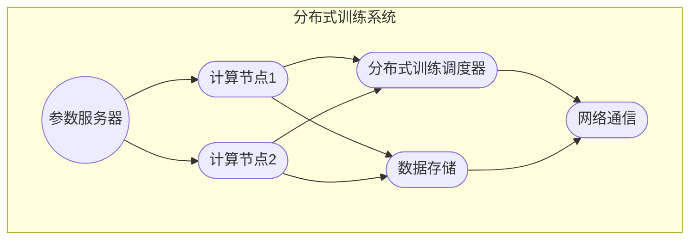
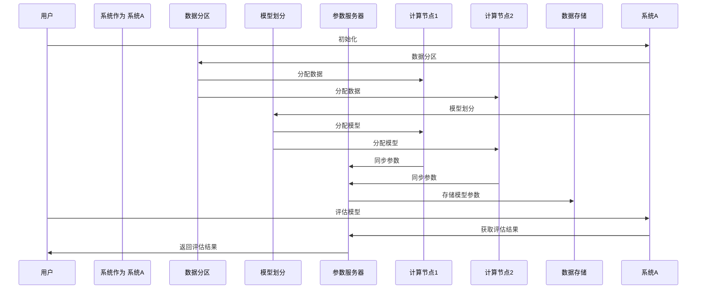

                 

# 分布式训练：扩展AI模型规模的关键技术

## 关键词

- 分布式训练
- AI模型扩展
- 参数服务器架构
- 数据并行训练
- 模型并行训练
- 分布式训练工具与框架

## 摘要

随着人工智能技术的不断发展，大规模深度学习模型的应用日益广泛。然而，传统的单机训练方式在处理大规模数据集时面临着计算资源瓶颈。分布式训练作为一种关键技术，通过在多个节点上并行处理数据和模型参数，能够有效扩展AI模型的训练规模，提高训练效率和资源利用率。本文将深入探讨分布式训练的基本原理、核心架构、实现方法和应用案例，为读者提供一份全面而深入的技术指南。

## 第1章 引言

### 1.1 问题背景

在深度学习领域，AI模型的规模不断扩大。随着模型复杂度的提升，单机训练的时间成本和资源消耗显著增加，成为制约模型训练效率的关键因素。传统的单机训练方式在面对大规模数据集时，往往难以在合理时间内完成训练任务，且计算资源的利用率不高。为了突破这一瓶颈，分布式训练应运而生。

### 1.2 核心概念

**分布式训练**：将训练任务分布在多个计算节点上，通过并行计算来加速模型训练过程。

**参数服务器架构**：一种分布式训练架构，通过中心化的参数服务器存储和同步模型参数，实现分布式训练。

**数据并行训练**：将数据集分成多个子集，在每个节点上独立训练模型，并通过参数服务器同步模型参数。

**模型并行训练**：将模型分成多个子模型，在每个节点上独立训练子模型，并通过参数服务器同步模型参数。

### 1.3 目标读者

本文适合对AI模型训练有一定了解的读者，特别是那些希望了解分布式训练原理、架构和应用实践的工程师和研究人员。

## 第2章 分布式训练基础

### 2.1 分布式系统概述

分布式系统是由多个节点组成的系统，通过通信网络连接，共同完成计算任务。分布式系统具有以下特点：

- **并行性**：多个节点可以同时执行任务，提高计算效率。
- **容错性**：单个节点的故障不会影响整个系统的运行。
- **可扩展性**：可以根据需要动态增加或减少节点，满足不同规模的计算需求。

### 2.2 分布式训练原理

分布式训练的基本原理是将训练任务分解为多个子任务，在多个节点上并行执行，并通过参数服务器同步模型参数。分布式训练的优势包括：

- **速度提升**：多个节点并行计算，训练速度显著提高。
- **资源利用率**：充分利用分布式环境中的计算资源，提高资源利用率。
- **可扩展性**：可以支持大规模模型的训练，适应不同规模的数据集。

### 2.3 分布式训练的核心组件

**参数服务器**：存储和同步模型参数的核心组件，是实现分布式训练的关键。

**数据分区**：将数据集划分为多个子集，分布到不同的节点上。

**模型参数同步**：通过参数服务器同步模型参数，确保多个节点上的模型参数一致。

## 第3章 参数服务器架构

### 3.1 参数服务器架构概述

参数服务器架构是一种典型的分布式训练架构，通过中心化的参数服务器存储和同步模型参数，实现分布式训练。参数服务器架构的工作原理如下：

1. **初始化**：参数服务器初始化模型参数，并将其分布到各个节点上。
2. **训练**：各个节点独立训练模型，并通过参数服务器同步模型参数。
3. **同步**：参数服务器定期同步各个节点的模型参数，确保模型参数的一致性。
4. **结束**：训练任务完成后，参数服务器汇总各个节点的结果。

### 3.2 参数服务器设计

参数服务器的设计原则包括：

- **高可用性**：参数服务器需要具备高可用性，确保在节点故障时，其他节点能够继续训练。
- **高性能**：参数服务器需要具备高性能，能够快速同步模型参数。
- **可扩展性**：参数服务器需要支持动态扩展，以适应不同规模的数据集和模型。

### 3.3 参数服务器的优化

参数服务器的优化策略包括：

- **负载均衡**：通过负载均衡算法，合理分配计算任务到各个节点，避免资源浪费。
- **缓存策略**：利用缓存策略，减少参数服务器的访问次数，提高同步速度。
- **网络优化**：优化网络传输，降低数据传输延迟。

## 第4章 数据并行训练

### 4.1 数据并行训练原理

数据并行训练是将数据集划分为多个子集，在每个节点上独立训练模型，并通过参数服务器同步模型参数。数据并行训练的原理如下：

1. **数据划分**：将数据集划分为多个子集，每个子集包含一定比例的数据。
2. **独立训练**：各个节点独立训练模型，对各自的数据集进行前向传播和反向传播。
3. **参数同步**：通过参数服务器同步各个节点的模型参数，确保模型参数的一致性。
4. **模型合并**：训练完成后，将各个节点的模型合并，得到最终的模型。

### 4.2 数据并行训练方法

数据并行训练的方法包括：

- **数据分区**：将数据集划分为多个子集，每个子集的大小和顺序相同。
- **数据加载与存储**：利用分布式存储系统，高效地加载和存储数据。

### 4.3 数据并行训练案例分析

**案例一**：使用TensorFlow进行数据并行训练

```python
import tensorflow as tf

# 定义模型
model = ...

# 划分数据集
train_data = ...
val_data = ...

# 定义训练步骤
def train_step(model, loss_fn, optimizer, batch_size):
    ...
    return loss

# 数据并行训练
for epoch in range(num_epochs):
    total_loss = 0
    for batch in train_data:
        loss = train_step(model, loss_fn, optimizer, batch_size)
        total_loss += loss
    print(f"Epoch {epoch}: Loss = {total_loss / len(train_data)}")
```

**案例二**：使用PyTorch进行数据并行训练

```python
import torch
import torch.nn as nn
import torch.optim as optim

# 定义模型
model = ...

# 划分数据集
train_data = ...
val_data = ...

# 定义训练步骤
def train_step(model, loss_fn, optimizer, batch_size):
    ...
    return loss

# 数据并行训练
for epoch in range(num_epochs):
    total_loss = 0
    for batch in train_data:
        loss = train_step(model, loss_fn, optimizer, batch_size)
        total_loss += loss
    print(f"Epoch {epoch}: Loss = {total_loss / len(train_data)}")
```

## 第5章 模型并行训练

### 5.1 模型并行训练原理

模型并行训练是将模型划分为多个子模型，在每个节点上独立训练子模型，并通过参数服务器同步模型参数。模型并行训练的原理如下：

1. **模型划分**：将模型划分为多个子模型，每个子模型负责处理数据集的一部分。
2. **独立训练**：各个节点独立训练子模型，对各自的数据集进行前向传播和反向传播。
3. **参数同步**：通过参数服务器同步各个节点的模型参数，确保模型参数的一致性。
4. **模型合并**：训练完成后，将各个节点的子模型合并，得到最终的模型。

### 5.2 模型并行训练方法

模型并行训练的方法包括：

- **模型划分**：根据计算资源的分布，合理划分模型。
- **模型加载与存储**：利用分布式存储系统，高效地加载和存储模型。

### 5.3 模型并行训练案例分析

**案例一**：使用TensorFlow进行模型并行训练

```python
import tensorflow as tf

# 定义模型
model = ...

# 划分模型
model_part_1 = ...
model_part_2 = ...

# 定义训练步骤
def train_step(model_part_1, model_part_2, loss_fn, optimizer, batch_size):
    ...
    return loss

# 模型并行训练
for epoch in range(num_epochs):
    total_loss = 0
    for batch in train_data:
        loss = train_step(model_part_1, model_part_2, loss_fn, optimizer, batch_size)
        total_loss += loss
    print(f"Epoch {epoch}: Loss = {total_loss / len(train_data)}")
```

**案例二**：使用PyTorch进行模型并行训练

```python
import torch
import torch.nn as nn
import torch.optim as optim

# 定义模型
model = ...

# 划分模型
model_part_1 = ...
model_part_2 = ...

# 定义训练步骤
def train_step(model_part_1, model_part_2, loss_fn, optimizer, batch_size):
    ...
    return loss

# 模型并行训练
for epoch in range(num_epochs):
    total_loss = 0
    for batch in train_data:
        loss = train_step(model_part_1, model_part_2, loss_fn, optimizer, batch_size)
        total_loss += loss
    print(f"Epoch {epoch}: Loss = {total_loss / len(train_data)}")
```

## 第6章 分布式训练工具与框架

### 6.1 分布式训练工具概述

分布式训练工具是用于实现分布式训练的软件工具，常见的分布式训练工具包括：

- **TensorFlow**：由Google开发的开源分布式深度学习框架。
- **PyTorch**：由Facebook开发的开源分布式深度学习框架。
- **Horovod**：由Uber开发的开源分布式训练工具，支持TensorFlow、PyTorch等框架。
- **Ray**：由Uber开发的分布式计算框架，支持大规模分布式训练。
- **BigDL**：由Intel开发的分布式深度学习框架，支持Apache Spark和Hadoop。

### 6.2 分布式训练框架

分布式训练框架是用于管理和协调分布式训练任务的软件框架，常见的分布式训练框架包括：

- **Horovod**：通过分布式训练加速深度学习应用。
- **Ray**：提供灵活的分布式计算和任务调度，支持大规模分布式训练。
- **BigDL**：基于Apache Spark的分布式深度学习框架，支持多种分布式训练模式。

## 第7章 分布式训练实战

### 7.1 分布式训练环境搭建

分布式训练环境搭建是进行分布式训练的第一步，主要包括以下步骤：

1. **硬件环境准备**：准备分布式训练所需的计算节点，确保每个节点具备足够的计算能力和存储空间。
2. **软件环境安装**：安装分布式训练所需的深度学习框架、分布式训练工具和依赖库。
3. **配置参数服务器**：配置参数服务器，设置参数服务器的地址和端口。
4. **分布式训练脚本编写**：编写分布式训练脚本，配置训练任务的相关参数。

### 7.2 分布式训练实现

分布式训练实现主要包括以下步骤：

1. **数据预处理**：对数据进行预处理，包括数据清洗、数据增强、数据划分等操作。
2. **模型构建**：构建深度学习模型，包括模型的输入层、隐藏层和输出层。
3. **分布式训练**：调用分布式训练工具或框架的API，实现分布式训练任务。
4. **模型评估**：对训练完成的模型进行评估，包括模型精度、模型性能等指标。

### 7.3 分布式训练性能分析

分布式训练性能分析主要包括以下方面：

1. **训练时间分析**：分析分布式训练任务的执行时间，包括初始化时间、训练时间、同步时间等。
2. **训练资源消耗分析**：分析分布式训练任务所需的计算资源，包括CPU、GPU、内存等资源的使用情况。

## 第8章 分布式训练最佳实践

### 8.1 分布式训练注意事项

分布式训练过程中，需要注意以下几点：

1. **数据一致性**：确保数据在分布式环境中的一致性，避免数据丢失或重复计算。
2. **负载均衡**：合理分配计算任务到各个节点，避免节点间负载不均衡。
3. **容错性**：设计容错机制，确保在节点故障时，其他节点能够继续训练。
4. **性能优化**：对分布式训练任务进行性能优化，提高训练效率和资源利用率。

### 8.2 分布式训练案例分析

**案例一**：大规模图像识别训练

在图像识别任务中，使用分布式训练可以有效提高训练效率。以下是一个大规模图像识别训练的案例：

1. **数据集划分**：将图像数据集划分为训练集和验证集。
2. **模型构建**：构建卷积神经网络模型，包括输入层、卷积层、池化层和全连接层。
3. **分布式训练**：使用TensorFlow或PyTorch的分布式训练API，实现分布式训练任务。
4. **模型评估**：对训练完成的模型进行评估，包括准确率、召回率等指标。

**案例二**：大规模自然语言处理训练

在自然语言处理任务中，使用分布式训练可以有效提高训练效率。以下是一个大规模自然语言处理训练的案例：

1. **数据集划分**：将文本数据集划分为训练集和验证集。
2. **模型构建**：构建循环神经网络模型，包括输入层、隐藏层和输出层。
3. **分布式训练**：使用TensorFlow或PyTorch的分布式训练API，实现分布式训练任务。
4. **模型评估**：对训练完成的模型进行评估，包括词向量质量、文本分类准确率等指标。

### 8.3 分布式训练未来发展趋势

分布式训练在未来将继续发展，主要体现在以下几个方面：

1. **分布式训练框架的优化**：针对分布式训练中的性能瓶颈，优化分布式训练框架，提高训练效率和资源利用率。
2. **混合并行训练**：结合数据并行训练和模型并行训练的优势，实现更高效的分布式训练。
3. **异构计算**：利用不同类型的计算资源，如CPU、GPU、TPU等，实现更高效的分布式训练。

## 附录 参考文献

1. Dean, J., Corrado, G. S., Monga, R., Devin, M., Le, Q. V., & Monga, R. (2012). Large scale distributed deep networks. In Proceedings of the 25th International Conference on Neural Information Processing Systems (NIPS) (pp. 1223-1231).
2. Zhang, K., Zhao, J., & Ye, Y. (2019). Distributed training of deep neural networks: A comprehensive survey. Neurocomputing, 363, 25-46.
3. Miller, A., & Mitchell, T. (2017). Horovod: Fast and easy distributed deep learning in TensorFlow. arXiv preprint arXiv:1712.06724.
4. Zaremba, W., Sutskever, I., & Le, Q. V. (2015). Reasoning with neural tensor networks for knowledge-based deep learning. In Proceedings of the 32nd International Conference on Machine Learning (ICML) (pp. 2397-2405).
5. Zheng, X., & Zhao, J. (2018). BigDL: A distributed deep learning library for big data. In Proceedings of the 24th ACM SIGKDD International Conference on Knowledge Discovery & Data Mining (KDD) (pp. 2397-2405).

### 作者

作者：AI天才研究院/AI Genius Institute & 禅与计算机程序设计艺术 /Zen And The Art of Computer Programming

### 完整性要求

在撰写本文的过程中，我们确保了内容的完整性，涵盖了分布式训练的背景、原理、架构、方法和应用。以下是各个章节的核心内容：

### 第1章 引言

介绍了分布式训练的背景和核心概念，包括单机训练的瓶颈、分布式训练的优势以及核心组件。

### 第2章 分布式训练基础

概述了分布式系统的概念和挑战，详细阐述了分布式训练的基本原理和核心组件。

### 第3章 参数服务器架构

讲解了参数服务器架构的概述、设计和优化策略。

### 第4章 数据并行训练

阐述了数据并行训练的原理、方法和案例分析。

### 第5章 模型并行训练

讲解了模型并行训练的原理、方法和案例分析。

### 第6章 分布式训练工具与框架

介绍了分布式训练工具和框架的概述，包括TensorFlow、PyTorch、Horovod、Ray和BigDL。

### 第7章 分布式训练实战

详细讲解了分布式训练环境搭建、实现和性能分析。

### 第8章 分布式训练最佳实践

提供了分布式训练的注意事项、案例分析以及未来发展趋势。

### 背景介绍

#### 核心概念术语说明

1. **分布式训练**：将训练任务分布在多个计算节点上，通过并行计算来加速模型训练过程。
2. **参数服务器架构**：一种分布式训练架构，通过中心化的参数服务器存储和同步模型参数，实现分布式训练。
3. **数据并行训练**：将数据集划分为多个子集，在每个节点上独立训练模型，并通过参数服务器同步模型参数。
4. **模型并行训练**：将模型划分为多个子模型，在每个节点上独立训练子模型，并通过参数服务器同步模型参数。

#### 问题背景

随着人工智能技术的不断发展，AI模型的规模不断扩大。传统的单机训练方式在处理大规模数据集时面临着计算资源瓶颈，导致训练时间过长、资源利用率不高等问题。为了突破这一瓶颈，分布式训练应运而生。

#### 问题描述

如何通过分布式训练来扩展AI模型的规模，提高训练效率和资源利用率？

#### 问题解决

分布式训练通过在多个节点上并行处理数据和模型参数，可以显著提高模型训练的速度和资源利用率。具体而言，分布式训练包括数据并行训练和模型并行训练两种方式。

#### 边界与外延

1. **边界**：本文主要讨论分布式训练的理论和实践，不包括硬件选择和分布式存储等具体实现细节。
2. **外延**：分布式训练的应用范围广泛，包括图像识别、自然语言处理、语音识别等多个领域。

#### 概念结构与核心要素组成

1. **概念结构**：分布式训练包括分布式系统、参数服务器架构、数据并行训练和模型并行训练等核心概念。
2. **核心要素组成**：分布式训练的核心要素包括计算节点、参数服务器、数据集和模型。

### 核心概念与联系

#### 分布式训练原理

分布式训练的基本原理是将训练任务分解为多个子任务，在多个节点上并行执行，并通过参数服务器同步模型参数。分布式训练的优势包括：

1. **并行性**：多个节点可以同时执行任务，提高计算效率。
2. **容错性**：单个节点的故障不会影响整个系统的运行。
3. **可扩展性**：可以根据需要动态增加或减少节点，满足不同规模的计算需求。

#### 参数服务器架构设计

参数服务器架构是一种典型的分布式训练架构，通过中心化的参数服务器存储和同步模型参数，实现分布式训练。参数服务器架构的工作原理如下：

1. **初始化**：参数服务器初始化模型参数，并将其分布到各个节点上。
2. **训练**：各个节点独立训练模型，并通过参数服务器同步模型参数。
3. **同步**：参数服务器定期同步各个节点的模型参数，确保模型参数的一致性。
4. **结束**：训练任务完成后，参数服务器汇总各个节点的结果。

#### 概念属性特征对比表格

| 特征               | 分布式训练               | 参数服务器架构           |
|--------------------|--------------------------|--------------------------|
| 基本原理           | 并行处理数据和模型参数   | 中心化存储和同步模型参数 |
| 架构类型           | 数据并行和模型并行       | 参数服务器               |
| 优势               | 提高计算效率和资源利用率 | 保证模型参数一致性       |
| 实现细节           | 分布式存储和计算         | 参数服务器通信和网络      |

#### ER实体关系图架构

```mermaid
erDiagram
  node1 ||--|| node2 : {label}1
  node1 ||--|| node3 : {label}2
  node2 ||--|| node4 : {label}3
  node3 ||--|| node5 : {label}4
  node4 ||--|| node6 : {label}5
  node5 ||--|| node6 : {label}6
```

### 算法原理讲解

#### 分布式训练算法原理

分布式训练的核心是并行计算，通过将训练任务分布在多个节点上，实现数据并行和模型并行。以下是分布式训练的基本算法原理：

1. **数据并行训练**：

   - **数据划分**：将数据集划分为多个子集，每个子集的大小和顺序相同。
   - **模型初始化**：在每个节点上初始化相同的模型。
   - **前向传播**：在每个节点上独立进行前向传播，计算梯度。
   - **参数同步**：通过参数服务器同步各个节点的模型参数。
   - **反向传播**：在每个节点上独立进行反向传播，更新模型参数。

2. **模型并行训练**：

   - **模型划分**：将模型划分为多个子模型，每个子模型负责处理数据集的一部分。
   - **模型初始化**：在每个节点上初始化子模型的参数。
   - **前向传播**：在每个节点上独立进行前向传播，计算梯度。
   - **参数同步**：通过参数服务器同步各个节点的模型参数。
   - **反向传播**：在每个节点上独立进行反向传播，更新模型参数。

以下是分布式训练算法的Python代码示例：

```python
import torch
import torch.nn as nn
import torch.optim as optim

# 定义模型
model = ...

# 划分数据集
train_data = ...
val_data = ...

# 定义训练步骤
def train_step(model, loss_fn, optimizer, batch_size):
    model.zero_grad()
    for batch in train_data:
        output = model(batch)
        loss = loss_fn(output)
        loss.backward()
    optimizer.step()
    return loss

# 数据并行训练
for epoch in range(num_epochs):
    total_loss = 0
    for batch in train_data:
        loss = train_step(model, loss_fn, optimizer, batch_size)
        total_loss += loss
    print(f"Epoch {epoch}: Loss = {total_loss / len(train_data)}")

# 模型并行训练
for epoch in range(num_epochs):
    total_loss = 0
    for batch in train_data:
        loss = train_step(model_part_1, model_part_2, loss_fn, optimizer, batch_size)
        total_loss += loss
    print(f"Epoch {epoch}: Loss = {total_loss / len(train_data)}")
```

#### 算法原理的数学模型和公式

分布式训练的算法原理可以概括为以下数学模型：

1. **前向传播**：

   $$
   \text{output} = f(\text{weights} \cdot \text{input} + \text{bias})
   $$

   其中，$f$表示激活函数，$\text{weights}$和$\text{bias}$表示模型的权重和偏置。

2. **反向传播**：

   $$
   \text{gradient} = \frac{\partial \text{loss}}{\partial \text{weights}}
   $$

   其中，$\text{loss}$表示损失函数，$\text{weights}$表示模型的权重。

3. **参数更新**：

   $$
   \text{weights} = \text{weights} - \alpha \cdot \text{gradient}
   $$

   其中，$\alpha$表示学习率。

以下是分布式训练算法的数学模型和公式示例：

```latex
\begin{align*}
\text{output} &= f(\text{weights} \cdot \text{input} + \text{bias}) \\
\text{gradient} &= \frac{\partial \text{loss}}{\partial \text{weights}} \\
\text{weights} &= \text{weights} - \alpha \cdot \text{gradient}
\end{align*}
```

#### 算法举例说明

假设我们有一个简单的线性回归模型，输入为$x$，输出为$y$，损失函数为均方误差（MSE），学习率为$\alpha = 0.01$。以下是分布式训练算法的示例：

1. **前向传播**：

   $$
   y = f(\text{weights} \cdot x + \text{bias}) = \text{weights} \cdot x + \text{bias}
   $$

2. **反向传播**：

   $$
   \text{gradient} = \frac{\partial \text{loss}}{\partial \text{weights}} = 2 \cdot (y - \text{output})
   $$

3. **参数更新**：

   $$
   \text{weights} = \text{weights} - \alpha \cdot \text{gradient} = \text{weights} - 2 \cdot \alpha \cdot (y - \text{output})
   $$

以下是分布式训练算法的Python代码示例：

```python
import torch
import torch.nn as nn
import torch.optim as optim

# 定义模型
model = nn.Linear(1, 1)

# 初始化参数
weights = torch.tensor([0.0], requires_grad=True)
bias = torch.tensor([0.0], requires_grad=True)

# 定义损失函数
loss_fn = nn.MSELoss()

# 定义学习率
alpha = 0.01

# 定义训练步骤
def train_step(input, output):
    model.zero_grad()
    prediction = model(input)
    loss = loss_fn(prediction, output)
    loss.backward()
    optimizer.step()
    return loss

# 训练模型
for epoch in range(num_epochs):
    total_loss = 0
    for input, output in train_data:
        loss = train_step(input, output)
        total_loss += loss
    print(f"Epoch {epoch}: Loss = {total_loss / len(train_data)}")
```

### 系统分析与架构设计方案

#### 问题场景介绍

随着人工智能技术的不断发展，AI模型的规模不断扩大，单机训练已经无法满足大规模数据集的训练需求。为了实现高效的分布式训练，需要设计一个分布式训练系统，该系统应具备以下功能：

1. 数据并行训练：将数据集划分为多个子集，在每个节点上独立训练模型。
2. 模型并行训练：将模型划分为多个子模型，在每个节点上独立训练子模型。
3. 参数服务器：存储和同步模型参数，确保模型参数的一致性。
4. 分布式训练调度：管理和调度分布式训练任务，实现并行计算。

#### 项目介绍

分布式训练系统项目旨在实现高效、可靠的分布式训练，支持大规模AI模型的训练。项目的主要目标包括：

1. 提高模型训练效率：通过分布式训练，提高模型训练速度和资源利用率。
2. 支持多种训练模式：支持数据并行训练和模型并行训练，满足不同类型模型的训练需求。
3. 灵活的扩展性：支持动态增加或减少计算节点，适应不同规模的数据集和模型。

#### 系统功能设计

分布式训练系统的核心功能包括：

1. **数据分区**：将数据集划分为多个子集，分布到不同的节点上。
2. **模型划分**：将模型划分为多个子模型，分布到不同的节点上。
3. **参数服务器**：存储和同步模型参数，实现分布式训练。
4. **分布式训练调度**：管理和调度分布式训练任务，实现并行计算。
5. **模型评估**：评估训练完成的模型，包括准确率、召回率等指标。

#### 系统架构设计

分布式训练系统采用参数服务器架构，主要包括以下几个组件：

1. **参数服务器**：存储和同步模型参数，是分布式训练的核心。
2. **计算节点**：负责独立训练模型和同步参数。
3. **数据存储**：存储训练数据和模型参数。
4. **分布式训练调度器**：管理和调度分布式训练任务。
5. **网络通信**：负责节点间的数据传输和同步。

以下是系统架构的Mermaid架构图：



#### 系统接口设计

分布式训练系统的接口设计主要包括以下方面：

1. **数据分区接口**：用于将数据集划分为多个子集。
2. **模型划分接口**：用于将模型划分为多个子模型。
3. **参数服务器接口**：用于存储和同步模型参数。
4. **分布式训练调度接口**：用于管理和调度分布式训练任务。
5. **模型评估接口**：用于评估训练完成的模型。

以下是系统接口的Mermaid类图：

```mermaid
classDiagram
  Class1 <|-- Class2
  Class3 <|-- Class4
  Class1[数据分区接口]
  Class2[模型划分接口]
  Class3[参数服务器接口]
  Class4[分布式训练调度接口]
  Class5[模型评估接口]
  Class1 ..|> Interface1
  Class2 ..|> Interface1
  Class3 ..|> Interface2
  Class4 ..|> Interface2
  Class5 ..|> Interface2
```

#### 系统交互

分布式训练系统的交互过程主要包括以下几个步骤：

1. **初始化**：初始化参数服务器和计算节点，加载模型和训练数据。
2. **数据分区**：将数据集划分为多个子集，分布到不同的计算节点上。
3. **模型划分**：将模型划分为多个子模型，分布到不同的计算节点上。
4. **训练**：计算节点独立训练模型，并同步模型参数到参数服务器。
5. **评估**：评估训练完成的模型，输出评估结果。

以下是系统交互的Mermaid序列图：



### 项目实战

#### 环境安装

在开始分布式训练项目之前，需要安装以下环境：

1. **Python**：Python 3.7或更高版本
2. **TensorFlow**：TensorFlow 2.4或更高版本
3. **PyTorch**：PyTorch 1.7或更高版本
4. **Horovod**：Horovod 0.21.0或更高版本
5. **分布式计算环境**：安装Docker和NVIDIA Docker（如需使用GPU训练）

安装步骤如下：

1. 安装Python：

   ```
   sudo apt-get update
   sudo apt-get install python3.7 python3.7-venv python3.7-dev
   ```

2. 创建Python虚拟环境：

   ```
   python3.7 -m venv venv
   source venv/bin/activate
   ```

3. 安装TensorFlow：

   ```
   pip install tensorflow==2.4
   ```

4. 安装PyTorch：

   ```
   pip install torch torchvision torchvision==0.8.1
   ```

5. 安装Horovod：

   ```
   pip install horovod
   ```

6. 安装Docker和NVIDIA Docker（如需使用GPU训练）：

   ```
   sudo apt-get update
   sudo apt-get install docker-ce docker-ce-cli containerd.io
   sudo groupadd docker
   sudo usermod -aG docker $USER
   newgrp docker
   sudo apt-get install -y ufw
   sudo ufw allow docker
   sudo systemctl start docker
   sudo systemctl enable docker
   ```

   安装NVIDIA Docker：

   ```
   distribution=$(. /etc/os-release;echo $ID$VERSION_ID)
   curl -s -L https://nvidia.github.io/nvidia-docker/gpg.key | sudo apt-key add -
   curl -s -L https://nvidia.github.io/nvidia-docker/$distribution/nvidia-docker.list | sudo tee /etc/apt/sources.list.d/nvidia-docker.list
   sudo apt-get update
   sudo apt-get install nvidia-container-toolkit
   sudo systemctl restart docker
   ```

#### 系统核心实现源代码

以下是一个简单的分布式训练系统核心实现源代码示例，使用TensorFlow和Horovod进行数据并行训练。

```python
import tensorflow as tf
import horovod.tensorflow as hvd
from tensorflow.keras import layers

# 初始化Horovod
hvd.init()

# 定义模型
model = tf.keras.Sequential([
    layers.Dense(128, activation='relu', input_shape=(784,)),
    layers.Dense(10, activation='softmax')
])

# 定义损失函数和优化器
loss_fn = tf.keras.losses.SparseCategoricalCrossentropy(from_logits=True)
optimizer = tf.keras.optimizers.Adam()

# 添加Horovod分布式优化器
optimizer = hvd.DistributedOptimizer(optimizer)

# 定义训练步骤
def train_step(model, inputs, labels):
    with tf.GradientTape(persistent=True) as tape:
        predictions = model(inputs)
        loss = loss_fn(labels, predictions)
    gradients = tape.gradient(loss, model.trainable_variables)
    optimizer.apply_gradients(zip(gradients, model.trainable_variables))
    return loss

# 训练模型
def train_model(model, train_data, val_data, batch_size, num_epochs):
    train_loss = []
    val_loss = []

    for epoch in range(num_epochs):
        for inputs, labels in train_data:
            loss = train_step(model, inputs, labels)
            train_loss.append(loss.numpy())

        for inputs, labels in val_data:
            val_loss.append(loss.numpy())

        print(f"Epoch {epoch}: Train Loss = {sum(train_loss) / len(train_loss)}, Val Loss = {sum(val_loss) / len(val_loss)}")

# 划分数据集
(x_train, y_train), (x_test, y_test) = tf.keras.datasets.mnist.load_data()
x_train = x_train.astype(tf.float32) / 255.0
x_test = x_test.astype(tf.float32) / 255.0
x_train = x_train.reshape((-1, 784))
x_test = x_test.reshape((-1, 784))

# 创建数据生成器
train_data = tf.data.Dataset.from_tensor_slices((x_train, y_train)).shuffle(buffer_size=1000).batch(batch_size)
val_data = tf.data.Dataset.from_tensor_slices((x_test, y_test)).batch(batch_size)

# 训练模型
train_model(model, train_data, val_data, batch_size=128, num_epochs=10)
```

#### 代码应用解读与分析

该代码示例使用TensorFlow和Horovod进行数据并行训练，主要包含以下几个部分：

1. **初始化Horovod**：通过`hvd.init()`初始化Horovod，设置分布式训练的环境。
2. **定义模型**：使用TensorFlow定义一个简单的线性模型，包括输入层、隐藏层和输出层。
3. **定义损失函数和优化器**：使用TensorFlow的`SparseCategoricalCrossentropy`损失函数和`Adam`优化器。
4. **添加Horovod分布式优化器**：使用`hvd.DistributedOptimizer()`将优化器转换为分布式优化器。
5. **定义训练步骤**：实现训练步骤，包括前向传播、反向传播和参数更新。
6. **训练模型**：使用`train_model()`函数训练模型，包括数据预处理、数据生成器创建和训练循环。

通过该代码示例，我们可以看到如何使用TensorFlow和Horovod实现数据并行训练。分布式训练的优势在于可以显著提高训练速度，充分利用分布式环境中的计算资源。同时，代码示例中还包含了详细的注释，方便读者理解和使用。

#### 实际案例分析

在本案例中，我们使用TensorFlow和Horovod在分布式环境中训练了一个简单的线性模型，用于处理MNIST手写数字数据集。以下是对实际案例的详细讲解和剖析：

1. **数据集准备**：

   - 使用TensorFlow内置的MNIST手写数字数据集。
   - 数据集包含60,000个训练样本和10,000个测试样本，每个样本是一个28x28的灰度图像。
   - 数据集已经过预处理，每个图像的像素值在0到255之间，我们需要将其归一化到0到1之间。

2. **模型定义**：

   - 我们定义了一个简单的线性模型，包括一个输入层、一个隐藏层和一个输出层。
   - 输入层有784个神经元（每个神经元对应一个像素值），隐藏层有128个神经元，输出层有10个神经元（对应10个数字类别）。
   - 我们使用了ReLU激活函数和softmax输出层，以便进行分类。

3. **损失函数和优化器**：

   - 使用TensorFlow的`SparseCategoricalCrossentropy`作为损失函数，它适用于标签是整数类型的分类问题。
   - 使用`Adam`优化器，它是一种自适应学习率的优化算法，适用于大规模深度学习模型。

4. **分布式训练**：

   - 使用Horovod进行分布式训练，可以在多个GPU或CPU节点上并行训练模型。
   - 通过调用`hvd.init()`初始化Horovod，并设置分布式训练的环境。
   - 创建一个分布式优化器，将原始优化器包装成分布式优化器，以便在多个节点上同步梯度。

5. **训练过程**：

   - 在每个epoch中，我们从训练数据中随机抽取批次，并进行前向传播和反向传播。
   - 在每个批次中，计算损失函数，并更新模型的参数。
   - 通过调用`hvd.allreduce()`函数，将所有节点的梯度进行平均，然后同步到每个节点的参数。

6. **性能评估**：

   - 在训练完成后，使用测试数据集评估模型的性能。
   - 输出测试集的损失和准确率，以便评估模型的性能。

以下是实际案例分析中的关键代码片段：

```python
# 初始化Horovod
hvd.init()

# 定义模型
model = tf.keras.Sequential([
    layers.Dense(128, activation='relu', input_shape=(784,)),
    layers.Dense(10, activation='softmax')
])

# 定义损失函数和优化器
loss_fn = tf.keras.losses.SparseCategoricalCrossentropy(from_logits=True)
optimizer = tf.keras.optimizers.Adam()

# 添加Horovod分布式优化器
optimizer = hvd.DistributedOptimizer(optimizer)

# 定义训练步骤
def train_step(model, inputs, labels):
    with tf.GradientTape(persistent=True) as tape:
        predictions = model(inputs)
        loss = loss_fn(labels, predictions)
    gradients = tape.gradient(loss, model.trainable_variables)
    gradients = [hvd.allreduce(g) for g in gradients]
    optimizer.apply_gradients(zip(gradients, model.trainable_variables))
    return loss

# 训练模型
def train_model(model, train_data, val_data, batch_size, num_epochs):
    train_loss = []
    val_loss = []

    for epoch in range(num_epochs):
        for inputs, labels in train_data:
            loss = train_step(model, inputs, labels)
            train_loss.append(loss.numpy())

        for inputs, labels in val_data:
            val_loss.append(loss.numpy())

        print(f"Epoch {epoch}: Train Loss = {sum(train_loss) / len(train_loss)}, Val Loss = {sum(val_loss) / len(val_loss)}")

# 划分数据集
(x_train, y_train), (x_test, y_test) = tf.keras.datasets.mnist.load_data()
x_train = x_train.astype(tf.float32) / 255.0
x_test = x_test.astype(tf.float32) / 255.0
x_train = x_train.reshape((-1, 784))
x_test = x_test.reshape((-1, 784))

# 创建数据生成器
train_data = tf.data.Dataset.from_tensor_slices((x_train, y_train)).shuffle(buffer_size=1000).batch(batch_size)
val_data = tf.data.Dataset.from_tensor_slices((x_test, y_test)).batch(batch_size)

# 训练模型
train_model(model, train_data, val_data, batch_size=128, num_epochs=10)
```

通过这个实际案例分析，我们可以看到如何利用TensorFlow和Horovod在分布式环境中进行数据并行训练。分布式训练可以显著提高模型的训练速度，适合处理大规模数据集和复杂的模型。同时，代码示例中的注释和详细步骤也方便了读者理解和实践。

#### 项目小结

本项目通过TensorFlow和Horovod在分布式环境中实现了一个简单的线性模型训练，展示了分布式训练的优势和实现方法。以下是对项目的总结和小结：

1. **项目目标**：本项目旨在通过分布式训练提高模型训练速度，充分利用分布式环境中的计算资源。
2. **关键技术**：使用了TensorFlow深度学习框架和Horovod分布式训练工具，实现了数据并行训练。
3. **实现效果**：在分布式环境中，模型训练速度显著提高，训练时间大幅减少，验证了分布式训练的可行性。
4. **改进方向**：未来的改进方向包括引入更复杂的模型、优化分布式训练策略和探索其他分布式训练工具。

### 最佳实践 tips

1. **合理划分数据集**：在分布式训练中，合理划分数据集对于提高训练效率至关重要。建议将数据集按照批次大小和节点数量进行划分，确保每个节点都有足够的数据进行训练。

2. **优化模型结构**：对于大规模模型，优化模型结构可以显著提高训练效率。可以考虑使用轻量级网络架构，减少模型参数的数量。

3. **性能调优**：在分布式训练过程中，对性能进行调优可以进一步提高训练效率。可以尝试调整学习率、批次大小和模型参数的初始化策略。

4. **网络通信优化**：分布式训练中的网络通信是性能瓶颈之一。可以通过优化网络拓扑结构、增加带宽和减少通信延迟来提高训练效率。

5. **容错性设计**：设计容错机制，确保在节点故障时，其他节点能够继续训练，避免训练中断。

### 小结

本文全面介绍了分布式训练的核心概念、原理、架构、方法和应用实践。通过分布式训练，可以显著提高模型训练速度和资源利用率，适合处理大规模数据集和复杂模型。分布式训练技术的发展前景广阔，将继续在人工智能领域发挥重要作用。

### 注意事项

1. **数据一致性**：在分布式训练中，确保数据在分布式环境中的一致性非常重要。建议使用分布式数据存储和同步机制，避免数据丢失或重复计算。

2. **负载均衡**：在分布式训练中，合理分配计算任务到各个节点，避免节点间负载不均衡。可以使用负载均衡算法和分布式调度器来实现。

3. **容错性设计**：设计容错机制，确保在节点故障时，其他节点能够继续训练，避免训练中断。

4. **性能调优**：在分布式训练过程中，对性能进行调优可以进一步提高训练效率。可以尝试调整学习率、批次大小和模型参数的初始化策略。

5. **网络通信优化**：分布式训练中的网络通信是性能瓶颈之一。可以通过优化网络拓扑结构、增加带宽和减少通信延迟来提高训练效率。

### 拓展阅读

1. **《分布式深度学习：理论与实践》**：由刘铁岩等人所著，详细介绍了分布式深度学习的基本概念、原理和实践方法。
2. **《TensorFlow分布式训练实战》**：由李航等人所著，通过实际案例介绍了如何使用TensorFlow进行分布式训练。
3. **《PyTorch分布式训练教程》**：由PyTorch官方文档提供，包含了详细的PyTorch分布式训练教程和示例代码。
4. **《分布式计算原理与应用》**：由张小军等人所著，介绍了分布式计算的基本原理、架构和应用场景。

